View this email in your browser. **Warning: Flashing Imagery**

Welcome to the latest Python on Microcontrollers newsletter! I thought this might be a quiet week with classes starting to adjourn but then MicroPython drops a huge update on Friday followed by Arduino. I found a cool new cheatsheet on git, don't forget to check out the 'zine that goes with it. And a bumper crop of projects and news from the web, lots to find in this issue. Cheers - *Anne Barela, Editor*

We're on [Discord](https://discord.gg/HYqvREz), [Twitter](https://twitter.com/search?q=circuitpython&src=typed_query&f=live), and for past newsletters - [view them all here](https://www.adafruitdaily.com/category/circuitpython/). If you're reading this on the web, [subscribe here](https://www.adafruitdaily.com/). Here's the news this week:

## MicroPython v1.23 Released

[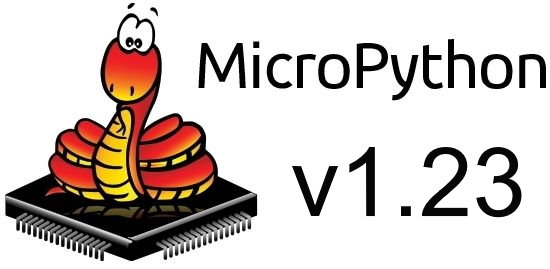](https://github.com/micropython/micropython/releases/tag/v1.23.0)

A new major release of MicroPython has gone out with several major feature upgrades - [GitHub Full Release Notes](https://github.com/micropython/micropython/releases/tag/v1.23.0) and [Downloads](https://micropython.org/download/).

> "This release of MicroPython adds support for dynamic USB devices defined in Python, adds new `openamp`, `tls` and `vfs` modules, completely revamps the webassembly port to add proxying between JavaScript and Python, and implements significant code size optimisations for frozen modules. There are also many other enhancements and bug fixes."

## Running Arduino and MicroPython Side-by-Side on Multi-Core Microcontrollers

[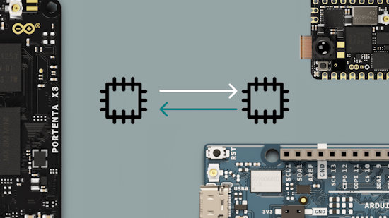](https://blog.arduino.cc/2024/05/30/you-can-now-run-arduino-and-micropython-side-by-side-on-multi-core-microcontrollers/)

With MicroPython v1.23, there is now support for [Asymmetric Multiprocessing](https://docs.micropython.org/en/latest/library/openamp.html) (AMP) on multi-core microcontrollers, based on the industry standard OpenAMP framework. 

This enables Arduino users to run both an Arduino sketch and a MicroPython program simultaneously on multi-core modules and to communicate between the two - [Arduino](https://blog.arduino.cc/2024/05/30/you-can-now-run-arduino-and-micropython-side-by-side-on-multi-core-microcontrollers/).

> "The communication between Arduino and MicroPython is facilitated by using Remote Procedure Calls (RPC). This allows us to benefit from the simplicity of using MicroPython while unlocking access to all of Arduino’s rich libraries from MicroPython."

## A Raspberry Pi AI Clock Listens and Smells for the Current Time

[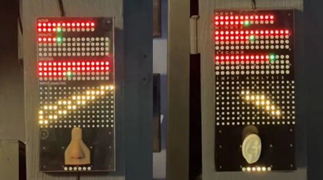](https://www.tomshardware.com/raspberry-pi/this-raspberry-pi-ai-clock-listens-and-smells-for-the-current-time)

Maker and developer Max Björverud is using a Raspberry Pi to power his clocks that use AI to estimate the current time based on **smell** and **sound**. The artificial intelligence side of the project is aided by an open-source Python library called `Scikit-learn` - [Tom's Hardware](https://www.tomshardware.com/raspberry-pi/this-raspberry-pi-ai-clock-listens-and-smells-for-the-current-time).

## A New git Cheatsheet

[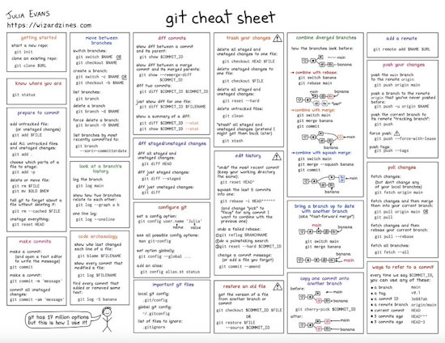](https://wizardzines.com/git-cheat-sheet.pdf)

Cheatsheets have proven very popular in the newsletter but finding good ones to highlight is rare. The zine "How git Works" is now available from Wizardzines Julia Evans - [Free Cheatsheet](https://wizardzines.com/git-cheat-sheet.pdf) and [Buy the Zine](https://wizardzines.com/zines/git/), via [X](https://x.com/b0rk/status/1794057694375993704).

## Tutorial: Getting Started with CircuitPython on XIAO RP2040

[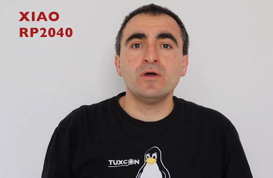](https://www.youtube.com/watch?v=KDb5SQzsGb0)

A new step by step tutorial on how to download and install CircuitPython on the SeeedStudio XIAO RP2040. This is a module by Seeed Studio with a Raspberry Pi RP2040 microcontroller - [YouTube](https://www.youtube.com/watch?v=KDb5SQzsGb0).

## Running for the Python Software Foundation Board of Directors

PSF Board elections are a chance for the community to choose representatives to help the PSF create a vision for and build the future of the Python community. This year there are 3 seats open on the PSF board. Check out the [Life as Python Software Foundation Director video](https://www.youtube.com/watch?v=ZLKj6FaQA4M) to learn more about what being a part of the PSF Board entails. Nominations open on Tuesday, June 11th - [Python Software Foundation](https://pyfound.blogspot.com/2024/05/blog-post.html).

## This Week's Python Streams

Python on Hardware is all about building a cooperative ecosphere which allows contributions to be valued and to grow knowledge. Below are the streams within the last week focusing on the community.

**CircuitPython Deep Dive Stream**

[Last Friday](https://youtube.com/live/8IbVEB2kMTA), Scott streamed work on ESP BLE Debugging and Fun Friday Hacking.

You can see the latest video and past videos on the Adafruit YouTube channel under the Deep Dive playlist - [YouTube](https://www.youtube.com/playlist?list=PLjF7R1fz_OOXBHlu9msoXq2jQN4JpCk8A).

**CircuitPython Parsec**

John Park’s CircuitPython Parsec this week is on an IR remote decoder - [Adafruit Blog](https://blog.adafruit.com/2024/05/31/john-parks-circuitpython-parsec-ir-remote-decoder-adafruit-circuitpython/) and [YouTube](https://youtu.be/xCIgamjBU9g).

Catch all the episodes in the [YouTube playlist](https://www.youtube.com/playlist?list=PLjF7R1fz_OOWFqZfqW9jlvQSIUmwn9lWr).

**CircuitPython Weekly Meeting**

CircuitPython Weekly Meeting for May 28, 20244 ([notes](https://github.com/adafruit/adafruit-circuitpython-weekly-meeting/blob/main/2024/2024-05-28.md)) [on YouTube](https://youtu.be/wpIJ7NQUIjo).

## Project of the Week: Building Alan Wake's Angel Lamp

Stargirl builds a fantastic [Alan Wake](https://www.alanwake.com/) Angel Lamp cosplay prop using CircuitPython. A fantastic 3D print is crowned by an Adafruit Trinket M0 and nOOds filament LEDs - [Thea.codes](https://blog.thea.codes/alan-wake-angel-lamp-build/).

## Popular Last Week

What was the most popular, most clicked link, in [last week's newsletter](https://www.adafruitdaily.com/2024/05/27/python-on-microcontrollers-newsletter-raspberry-ipo-set-for-june-new-circuitpython-releases-and-much-more-circuitpython-python-micropython-thepsf-raspberry_pi/)? [PySheets: The Spreadsheet UI for Python](https://pysheets.app/).

## New Notes from Adafruit Playground

[Adafruit Playground](https://adafruit-playground.com/) is a new place for the community to post their projects and other making tips/tricks/techniques. Ad-free, it's an easy way to publish your work in a safe space for free.

[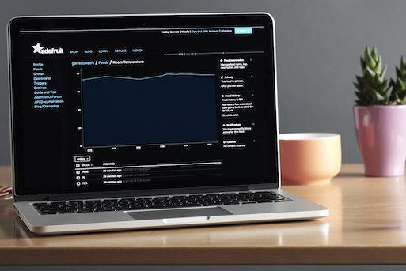](https://adafruit-playground.com/u/justmobilize/pages/adafruit-connection-manager)

Adafruit Connection Manager - [Adafruit Playground](https://adafruit-playground.com/u/justmobilize/pages/adafruit-connection-manager).

[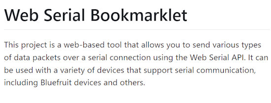](https://adafruit-playground.com/u/tyeth/pages/serialfruit-connect-a-bookmarklet-to-replace-adafruit-bluefruit-connect-apps-add-wifi-usb-ble-for-all)

SerialFruit Connect - A bookmarklet to replace Adafruit BlueFruit Connect apps + Add WiFi/USB/BLE for all! - [Adafruit Playground](https://adafruit-playground.com/u/tyeth/pages/serialfruit-connect-a-bookmarklet-to-replace-adafruit-bluefruit-connect-apps-add-wifi-usb-ble-for-all) and [GitHub](https://github.com/tyeth/serialfruit-connect-bookmarklet).

Mandelbrot on a Neotrinkey? ... It's Complicated - [Adafruit Playground](https://adafruit-playground.com/u/mrklingon/pages/mandelbrot-on-a-neotrinkey-it-s-complicated).

## News From Around the Web

[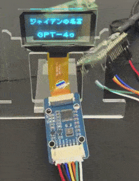](https://x.com/sozoraemon/status/1794687537174495403)

Display Giant's famous quotes from a Raspberry Pi Pico with MicroPython - [X](https://x.com/sozoraemon/status/1794687537174495403).

[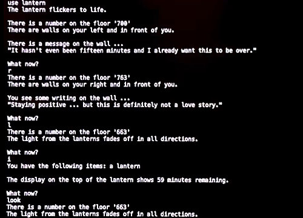](https://x.com/bradanlane/status/1795778870605381872)

Python to CircuitPython Serial for "text adventure game" testing - [X](https://x.com/bradanlane/status/1795778870605381872) and [GitLab](https://gitlab.com/bradanlane_cp/p2cpserial/).

Dr. Love is a business-card sized gadget to "test if your partner is in love with you or just kind of meh." It uses a RP2040 board and CircuitPython - [GitHub](https://github.com/unkyulee/dr.love).

[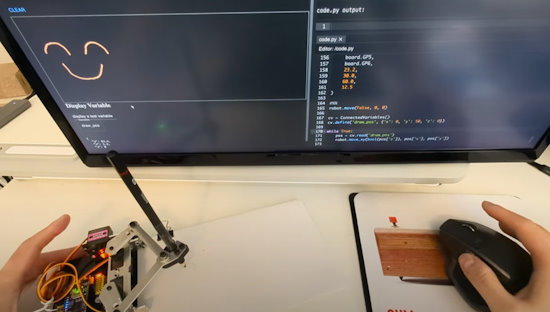](https://www.youtube.com/watch?v=1jnKlmxmNL4)

Using the upcoming CircuitPython IDE: control a drawing robot via connected variables - [YouTube](https://www.youtube.com/watch?v=1jnKlmxmNL4) via [X](https://x.com/River___Wang/status/1795137397836906854).

[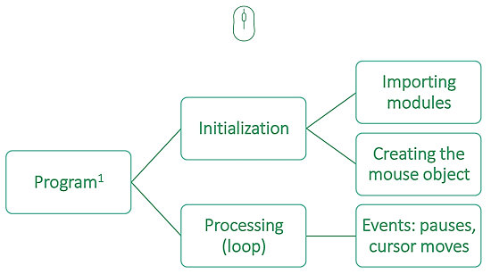](https://www.dorscluc.org/sessions/programming-raspberry-pi-pico-with-circuitpython-to-emulate-a-keyboard-or-a-mouse-tiny-examples/)

Programming Raspberry Pi Pico with CircuitPython to emulate a keyboard or a mouse: tiny examples - [GitHub](https://github.com/kruno-peter/pico-keyboard-mouse/blob/main/Programming%20Raspberry%20Pi%20Pico%20with%20CircuitPython.pdf) via [DORS/CLUC](https://www.dorscluc.org/sessions/programming-raspberry-pi-pico-with-circuitpython-to-emulate-a-keyboard-or-a-mouse-tiny-examples/).

Make a homemade AI home assistant with Raspberry Pi 5, ChatGPT and Python - [Raspberry Pi News](https://www.raspberrypi.com/news/make-a-homemade-ai-home-assistant/) and [YouTube](https://www.youtube.com/watch?v=1lATPsPnCrc).

[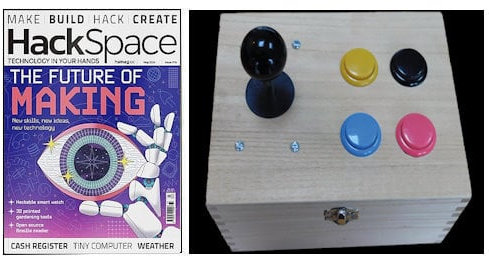](https://hackspace.raspberrypi.com/issues/77/contributions/new)

Using a Raspberry Pi Pico to make a keyboard & gamepad with CircuitPython KMK - [HackSpace Magazine](https://hackspace.raspberrypi.com/issues/77/contributions/new) (PDF).

wasd-idler: WASD idle evasion for online games in CircuitPython - [GitHub](https://github.com/nerdymark/wasd-idler).

[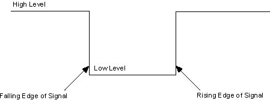](https://www.instructables.com/Rising-and-Falling-Edge-Detection-With-Raspberry-P/)

Rising and falling edge detection with Raspberry Pi Pico and MicroPython - [Instructabbles](https://www.instructables.com/Rising-and-Falling-Edge-Detection-With-Raspberry-P/).

[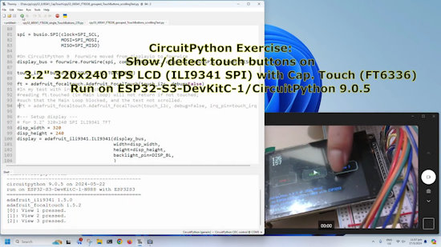](https://www.youtube.com/watch?v=jzoq5rxrloE)

CircuitPython Exercise: Touch buttons on an ILI9341 SPI LCD with FT6336 capacitive touch - [YouTube](https://www.youtube.com/watch?v=jzoq5rxrloE) and [Blog](https://coxxect.blogspot.com/2024/05/circuitpython-exercise-touch-buttons-on.html).

Use SSH keys to connect to your Raspberry Pi - [Medium](https://medium.com/medialesson/rp5-use-ssh-keys-to-connect-to-your-raspberry-pi-7f90ed746437).

[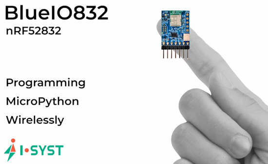](https://www.youtube.com/watch?v=L-QPlV3O-4g)

Write MicroPython code on a tablet instead of a PC - [YouTube](https://www.youtube.com/watch?v=L-QPlV3O-4g).

[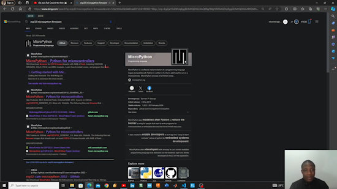](https://www.youtube.com/watch?v=G0dqbby61yg)

How to simulate MicroPython and ESP32 in VS Code - [YouTube](https://www.youtube.com/watch?v=G0dqbby61yg).

RISC-V adoption is predicted to get an AI boost: the forecast shows 50% growth a year through 2030 - [Tom's Hardware](https://www.tomshardware.com/pc-components/cpus/risc-v-adoption-predicted-to-get-ai-boost-forecast-shows-50-growth-every-year-until-2030-for-the-open-standard-isa).

[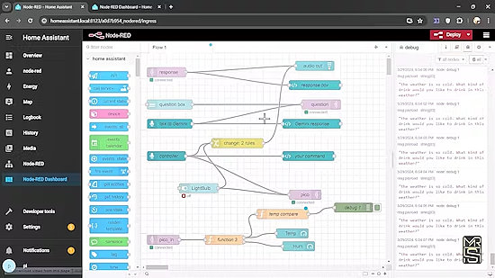](https://www.hackster.io/MohammadReza_Sharifi/integrating-google-gemini-with-home-assistant-and-rpi-pico-w-892851)

Integrating Google Gemini with Home Assistant and Raspberry Pi Pico W with MicroPython - [hackster.io](https://www.hackster.io/MohammadReza_Sharifi/integrating-google-gemini-with-home-assistant-and-rpi-pico-w-892851).

[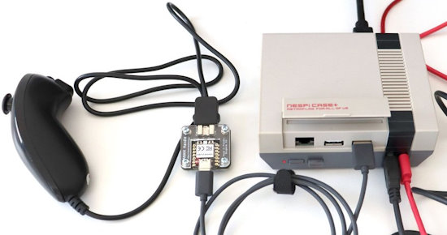](https://www.cnx-software.com/2024/05/27/use-your-nintendo-wii-nunchuk-as-a-usb-controller-with-anavi-handle-open-source-hardware-adapter/)

Use your Nintendo Wii Nunchuk as a USB controller with ANAVI Handle open-source hardware adapter - [CNX Software](https://www.cnx-software.com/2024/05/27/use-your-nintendo-wii-nunchuk-as-a-usb-controller-with-anavi-handle-open-source-hardware-adapter/).

PicoShell for CircuitPython - [GitHub](https://github.com/espilab/PicoShell_for_CircuitPython).

## New

Sunfounder's Pironman 5 Raspberry Pi desktop case comes with RGB LEDs and SSD support - [Tom's Hardware](https://www.tomshardware.com/raspberry-pi/sunfounders-pironman-5-raspberry-pi-case-comes-with-rgb-leds-and-ssd-support).

[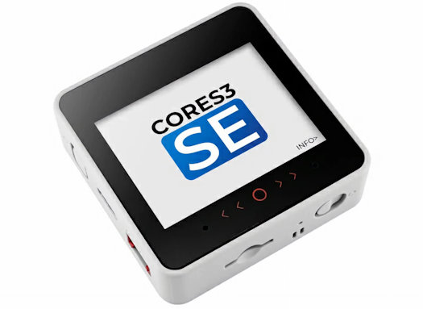](https://www.cnx-software.com/2024/05/31/m5stack-cores3-se-cost-down-esp32-s3-iot-controller-features-a-2-inch-touch-display-a-microsd-card-slot-a-speaker-two-microphones/)

M5Stack CoreS3 SE cost-down ESP32-S3 IoT controller features a 2-inch touch display, a microSD card slot, a speaker, and two microphones - [CNX Software](https://www.cnx-software.com/2024/05/31/m5stack-cores3-se-cost-down-esp32-s3-iot-controller-features-a-2-inch-touch-display-a-microsd-card-slot-a-speaker-two-microphones/).

## New Boards Supported by CircuitPython

The number of supported microcontrollers and Single Board Computers (SBC) grows every week. This section outlines which boards have been included in CircuitPython or added to [CircuitPython.org](https://circuitpython.org/).

This week, there is one new board:

- [Autosport Labs ESP32-CAN-X2](https://circuitpython.org/board/autosportlabs_esp32_can_x2/)

*Note: For non-Adafruit boards, please use the support forums of the board manufacturer for assistance, as Adafruit does not have the hardware to assist in troubleshooting.*

Looking to add a new board to CircuitPython? It's highly encouraged! Adafruit has four guides to help you do so:

- [How to Add a New Board to CircuitPython](https://learn.adafruit.com/how-to-add-a-new-board-to-circuitpython/overview)
- [How to add a New Board to the circuitpython.org website](https://learn.adafruit.com/how-to-add-a-new-board-to-the-circuitpython-org-website)
- [Adding a Single Board Computer to PlatformDetect for Blinka](https://learn.adafruit.com/adding-a-single-board-computer-to-platformdetect-for-blinka)
- [Adding a Single Board Computer to Blinka](https://learn.adafruit.com/adding-a-single-board-computer-to-blinka)

## New Learn Guides

[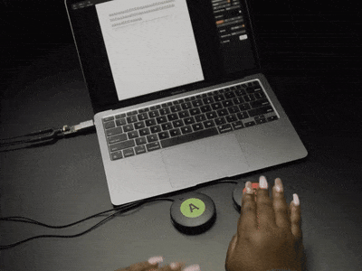](https://learn.adafruit.com/guides/latest)

[Adafruit TRRS Trinkey](https://learn.adafruit.com/adafruit-trrs-trinkey) from [Liz Clark](https://learn.adafruit.com/adafruit-trrs-trinkey)

## CircuitPython Libraries

The CircuitPython library numbers are continually increasing, while existing ones continue to be updated. Here we provide library numbers and updates!

To get the latest Adafruit libraries, download the [Adafruit CircuitPython Library Bundle](https://circuitpython.org/libraries). To get the latest community contributed libraries, download the [CircuitPython Community Bundle](https://circuitpython.org/libraries).

If you'd like to contribute to the CircuitPython project on the Python side of things, the libraries are a great place to start. Check out the [CircuitPython.org Contributing page](https://circuitpython.org/contributing). If you're interested in reviewing, check out Open Pull Requests. If you'd like to contribute code or documentation, check out Open Issues. We have a guide on [contributing to CircuitPython with Git and GitHub](https://learn.adafruit.com/contribute-to-circuitpython-with-git-and-github), and you can find us in the #help-with-circuitpython and #circuitpython-dev channels on the [Adafruit Discord](https://adafru.it/discord).

You can check out this [list of all the Adafruit CircuitPython libraries and drivers available](https://github.com/adafruit/Adafruit_CircuitPython_Bundle/blob/master/circuitpython_library_list.md). 

The current number of CircuitPython libraries is **485**!

**New Libraries**

Here's this week's new CircuitPython libraries:

  * [mateusznowakdev/CircuitPython_DisplayIO_ST7565](https://github.com/mateusznowakdev/CircuitPython_DisplayIO_ST7565)

**Updated Libraries**

Here's this week's updated CircuitPython libraries:

  * [adafruit/Adafruit_CircuitPython_OV5640](https://github.com/adafruit/Adafruit_CircuitPython_OV5640)
  * [adafruit/Adafruit_CircuitPython_AWS_IOT](https://github.com/adafruit/Adafruit_CircuitPython_AWS_IOT)
  * [adafruit/Adafruit_CircuitPython_ESP32SPI](https://github.com/adafruit/Adafruit_CircuitPython_ESP32SPI)
  * [rgrizzell/CircuitPython_GT911](https://github.com/rgrizzell/CircuitPython_GT911)

**Library PyPI Weekly Download Stats**

**Total Library Stats**

  * 87567 PyPI downloads over 326 libraries

**Top 10 Libraries by PyPI Downloads**

  * Adafruit CircuitPython BusDevice (adafruit-circuitpython-busdevice): 7973
  * Adafruit CircuitPython Requests (adafruit-circuitpython-requests): 7559
  * Adafruit CircuitPython ConnectionManager (adafruit-circuitpython-connectionmanager): 6737
  * Adafruit CircuitPython Register (adafruit-circuitpython-register): 1973
  * Adafruit CircuitPython MiniMQTT (adafruit-circuitpython-minimqtt): 1151
  * Adafruit CircuitPython ESP32SPI (adafruit-circuitpython-esp32spi): 959
  * Adafruit CircuitPython framebuf (adafruit-circuitpython-framebuf): 944
  * Adafruit CircuitPython ADS1x15 (adafruit-circuitpython-ads1x15): 836
  * Adafruit CircuitPython Wiznet5k (adafruit-circuitpython-wiznet5k): 834
  * Adafruit CircuitPython Motor (adafruit-circuitpython-motor): 833

## What’s the CircuitPython team up to this week?

What is the team up to this week? Let’s check in:

**Dan**

Scott, Jeff, and I triaged the issues we previously tagged with the CircuitPython 9.x.x milestone, in preparation for the 9.1.0 release. We narrowed down about thirty issues to about a half dozen we really want to fix for 9.1.0, and have deferred the others to a later release.

**Melissa**

This past week I work more on the [CircuitPython Code Editor](https://code.circuitpython.org/) and was able to get Raw-Paste mode implemented. However, the output from the device was somehow being doubled even though the code was only being read once. I also updated the [2.9" eInk learn guide](https://learn.adafruit.com/adafruit-2-9-eink-display-breakouts-and-featherwings) with information about the EYESPI connector.

**Tim**

I had a lighter week than usual with the holiday on Monday. The main things I worked on were the Circup learn guide new usage pages detailing all of it's features, and a new `wwshell` tool that will come along with circup. It's a CLI for managing files via wireless workflows. I also tested several old versions of the CircuitPython core to try to find at which versions there are changes affecting the `FlipInput` displayio widget.

**Jeff**

[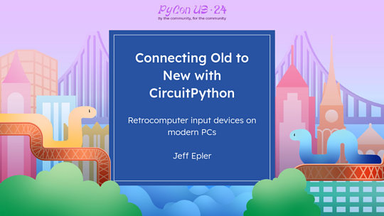](https://www.circuitpython.org/)

I've made the slides from my PyCon presentation available [here](https://docs.google.com/presentation/d/1524EXIJRLf5XJSetKCbnN5ilNuicdJ7i1ZHUpgpIevQ/edit?usp=sharing). PyCon organizers have said that all talks will become available on YouTube sometime in the coming weeks and I'll be sure to share that video link when it becomes available.

**Scott**

Last week I got pretty distracted away from ESP BLE work. This week I'm trying to dust it off and keep working on it. I'm hoping to have pairing and bonding support ready for CircuitPython 9.1.0.

**Liz**

This week I worked on the [TRRS Trinkey guide](https://learn.adafruit.com/adafruit-trrs-trinkey). This Trinkey has a TRRS jack to create switches for assistive technology (AT) interface devices. Each pin on the TRRS jack can act as a GPIO pin, giving you 6 GPIO. Bill Binko for ATMakers is working on some real-world examples that he has used the Trinkey for. These examples are written in CircuitPython and really show what this Trinkey is capable of.

## Upcoming Events

Open Sauce, the Maker extravaganza, is returning to San Francisco, California June 15-16 - [Open Sauce](https://opensauce.live/).

The next MicroPython Meetup in Melbourne will be on June 26 – [Meetup](https://www.meetup.com/micropython-meetup/events). You can see recordings of previous meetings on [YouTube](https://www.youtube.com/@MicroPythonOfficial). 

EuroPython is the oldest and longest running volunteer-led Python programming conference on the planet. This year it will be held July 8-14 in Prague - [EuroPython 2024](https://ep2024.europython.eu/).

PyOhio is being held July 27-28, 2024 in Cleveland, Ohio - [PyOhio](https://www.pyohio.org/2024/).

Espressif DevCon24 will be held Sep 3-5, 13:00-18:00 CEST. Call for presentations now - [Espressif](https://devcon.espressif.com/).

**Send Your Events In**

If you know of virtual events or upcoming events, please let us know via email to cpnews(at)adafruit(dot)com.

## Latest Releases

CircuitPython's stable release is [9.0.5](https://github.com/adafruit/circuitpython/releases/latest) and its unstable release is [9.1.0-beta.3](https://github.com/adafruit/circuitpython/releases). New to CircuitPython? Start with our [Welcome to CircuitPython Guide](https://learn.adafruit.com/welcome-to-circuitpython).

[20240530](https://github.com/adafruit/Adafruit_CircuitPython_Bundle/releases/latest) is the latest Adafruit CircuitPython library bundle.

[20240531](https://github.com/adafruit/CircuitPython_Community_Bundle/releases/latest) is the latest CircuitPython Community library bundle.

[v1.23.0](https://micropython.org/download) is the latest MicroPython release. Documentation for it is [here](http://docs.micropython.org/en/latest/pyboard/).

[3.12.3](https://www.python.org/downloads/) is the latest Python release. The latest pre-release version is [3.13.0b1](https://www.python.org/download/pre-releases/).

[3,929 Stars](https://github.com/adafruit/circuitpython/stargazers) Like CircuitPython? [Star it on GitHub!](https://github.com/adafruit/circuitpython)

## Call for Help -- Translating CircuitPython is now easier than ever

[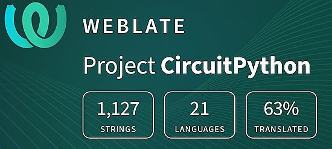](https://hosted.weblate.org/engage/circuitpython/)

One important feature of CircuitPython is translated control and error messages. With the help of fellow open source project [Weblate](https://weblate.org/), we're making it even easier to add or improve translations. 

Sign in with an existing account such as GitHub, Google or Facebook and start contributing through a simple web interface. No forks or pull requests needed! As always, if you run into trouble join us on [Discord](https://adafru.it/discord), we're here to help.

## 38,577 Thanks

The Adafruit Discord community, where we do all our CircuitPython development in the open, reached over 38,577 humans - thank you! Adafruit believes Discord offers a unique way for Python on hardware folks to connect. Join today at [https://adafru.it/discord](https://adafru.it/discord).

## ICYMI - In case you missed it

Python on hardware is the Adafruit Python video-newsletter-podcast! The news comes from the Python community, Discord, Adafruit communities and more and is broadcast on ASK an ENGINEER Wednesdays. The complete Python on Hardware weekly videocast [playlist is here](https://www.youtube.com/playlist?list=PLjF7R1fz_OOXRMjM7Sm0J2Xt6H81TdDev). The video podcast is on [iTunes](https://itunes.apple.com/us/podcast/python-on-hardware/id1451685192?mt=2), [YouTube](http://adafru.it/pohepisodes), [Instagram](https://www.instagram.com/adafruit/channel/)), and [XML](https://itunes.apple.com/us/podcast/python-on-hardware/id1451685192?mt=2).

[The weekly community chat on Adafruit Discord server CircuitPython channel - Audio / Podcast edition](https://itunes.apple.com/us/podcast/circuitpython-weekly-meeting/id1451685016) - Audio from the Discord chat space for CircuitPython, meetings are usually Mondays at 2pm ET, this is the audio version on [iTunes](https://itunes.apple.com/us/podcast/circuitpython-weekly-meeting/id1451685016), Pocket Casts, [Spotify](https://adafru.it/spotify), and [XML feed](https://adafruit-podcasts.s3.amazonaws.com/circuitpython_weekly_meeting/audio-podcast.xml).

## Contribute

The CircuitPython Weekly Newsletter is a CircuitPython community-run newsletter emailed every Monday. The complete [archives are here](https://www.adafruitdaily.com/category/circuitpython/). It highlights the latest CircuitPython related news from around the web including Python and MicroPython developments. To contribute, edit next week's draft [on GitHub](https://github.com/adafruit/circuitpython-weekly-newsletter/tree/gh-pages/_drafts) and [submit a pull request](https://help.github.com/articles/editing-files-in-your-repository/) with the changes. You may also tag your information on Twitter with #CircuitPython. 

Join the Adafruit [Discord](https://adafru.it/discord) or [post to the forum](https://forums.adafruit.com/viewforum.php?f=60) if you have questions.
