- [ ] Library and info updates
- [ ] change date
- [ ] update title
- [ ] Feature story
- [ ] Update  for images
- [ ] Update ICYDNCI
- [ ] All images 550w max only
- [ ] Link "View this email in your browser."

News Sources

- [Adafruit Playground](https://adafruit-playground.com/)
- Twitter: [CircuitPython](https://twitter.com/search?q=circuitpython&src=typed_query&f=live), [MicroPython](https://twitter.com/search?q=micropython&src=typed_query&f=live) and [Python](https://twitter.com/search?q=python&src=typed_query)
- [Raspberry Pi News](https://www.raspberrypi.com/news/)
- Mastodon [CircuitPython](https://octodon.social/tags/CircuitPython) and [MicroPython](https://octodon.social/tags/MicroPython)
- [hackster.io CircuitPython](https://www.hackster.io/search?q=circuitpython&i=projects&sort_by=most_recent) and [MicroPython](https://www.hackster.io/search?q=micropython&i=projects&sort_by=most_recent)
- YouTube: [CircuitPython](https://www.youtube.com/results?search_query=circuitpython&sp=CAI%253D), [MicroPython](https://www.youtube.com/results?search_query=micropython&sp=CAI%253D)
- Instructables: [CircuitPython](https://www.instructables.com/search/?q=circuitpython&projects=all&sort=Newest), [MicroPython](https://www.instructables.com/search/?q=micropython&projects=all&sort=Newest), [Raspberry Pi Python](https://www.instructables.com/search/?q=raspberry+pi+python&projects=all&sort=Newest)
- [python.org](https://www.python.org/)
- [Python Insider - dev team blog](https://pythoninsider.blogspot.com/)
- Individuals: [Jeff Geerling](https://www.jeffgeerling.com/blog)
- Tom's Hardware: [CircuitPython](https://www.tomshardware.com/search?searchTerm=circuitpython&articleType=all&sortBy=publishedDate) and [MicroPython](https://www.tomshardware.com/search?searchTerm=micropython&articleType=all&sortBy=publishedDate) and [Raspberry Pi](https://www.tomshardware.com/search?searchTerm=raspberry%20pi&articleType=all&sortBy=publishedDate)
- [hackaday.io newest projects MicroPython](https://hackaday.io/projects?tag=micropython&sort=date) and [CircuitPython](https://hackaday.io/projects?tag=circuitpython&sort=date)
- [Google News Python](https://news.google.com/topics/CAAqIQgKIhtDQkFTRGdvSUwyMHZNRFY2TVY4U0FtVnVLQUFQAQ?hl=en-US&gl=US&ceid=US%3Aen)
- [hackaday CircuitPython](https://hackaday.com/blog/?s=circuitpython) and [MicroPython](https://hackaday.com/blog/?s=micropython)
- hackaday.io - [CircuitPython](https://hackaday.io/search?term=circuitpython) and [MicroPython](https://hackaday.io/search?term=micropython)

View this email in your browser. **Warning: Flashing Imagery**

Welcome to the latest Python on Microcontrollers newsletter! *insert 2-3 sentences from editor (what's in overview, banter)* - *Anne Barela, Editor*

We're on [Discord](https://discord.gg/HYqvREz), [Twitter](https://twitter.com/search?q=circuitpython&src=typed_query&f=live), and for past newsletters - [view them all here](https://www.adafruitdaily.com/category/circuitpython/). If you're reading this on the web, [subscribe here](https://www.adafruitdaily.com/). Here's the news this week:

## Raspberry Pi's New $70 AI Hailo Kit

[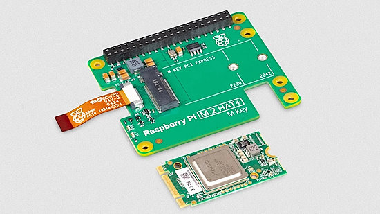](https://www.hackster.io/news/raspberry-pi-targets-edge-ai-partners-with-hailo-for-the-raspberry-pi-ai-kit-abb67721e254)

Raspberry Pi targets Edge AI through a partnership with Hailo for the Raspberry Pi AI Kit - [Hackster.io](https://www.hackster.io/news/raspberry-pi-targets-edge-ai-partners-with-hailo-for-the-raspberry-pi-ai-kit-abb67721e254) and [PCmag](https://www.pcmag.com/news/raspberry-pi-goes-all-in-on-ai-with-70-hailo-kit).

> "The kit pairs the buyer's existing Raspberry Pi 5, the newest and most powerful model in the popular single-board computer family, with a Hailo-8L M.2 accelerator capable of delivering 13 tera-operations per second (TOPS) of minimum-precision compute for machine learning and artificial intelligence workloads. The two devices are mated using the newly-launched Raspberry Pi M.2 HAT+, which offers a PCI Express M.2 slot compatible with the accelerator and connects over the Raspberry Pi 5's single externally-accessible PCIe Gen. 2 lane."

Raspberry Pi AI Kit Review: Brainiac (3.5 stars) - [Tom's Hardware](https://www.tomshardware.com/raspberry-pi/raspberry-pi-ai-kit-review).

Jeff Geerling tests Raspberry Pi's AI kit - 13 TOPS for $70 - [Jeff Geerling](https://www.jeffgeerling.com/blog/2024/testing-raspberry-pis-ai-kit-13-tops-70) and [YouTube](https://youtu.be/HgIMJbN0DS0).

## POG: A KMK GUI, Layout Editor, Keymap Editor, and Flashing Utility

[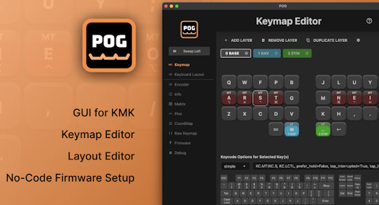](https://pog.heaper.de/)

POG guides you through the setup of your KMK  CircuitPython firmware on compatible keyboards. A fully working custom firmware takes only minutes - [GitHub](https://github.com/JanLunge/pog), [Documentation](https://pog.heaper.de/) and [YouTube](https://www.youtube.com/watch?v=RtYJYFMWjNM).

## New MicroPython In-Browser Integrated Development Environment (IDE)

[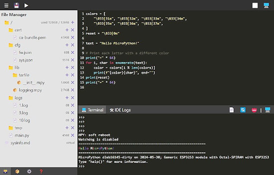](https://github.com/orgs/micropython/discussions/15219)

Volodymyr Shymanskyy has created a MicroPython IDE that works directly in the browser using WebSerial & WebUSB - [GitHub](https://github.com/orgs/micropython/discussions/15219) and [Try It](https://vsh.pp.ua/ViperIDE/ViperIDE.html), via [X](https://x.com/vshymanskyy/status/1798623048159092929).

## A PyCon US 2024 Recap

Katherine Michel provides a summary of the things seen at the recently concluded PyCon US 2024 - [GitHub](https://katherinemichel.github.io/portfolio/pycon-us-2024-recap.html).

## Reprogramming 80s BASIC Retro Games in MicroPython

Kevin McAleer reprograms some 80s Retro games into MicroPython and runs them on a microcontroller - [YouTube](https://www.youtube.com/watch?v=82Rb3HbkD_E).

## Raspberrry Pi Teams with Dolphin Design for More Power-Efficient Chips

[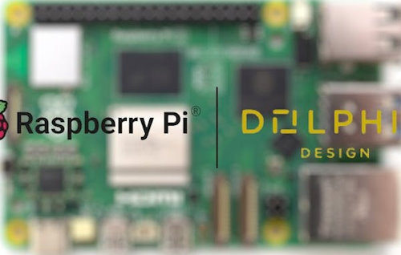](https://www.hackster.io/news/raspberrry-pi-teams-with-dolphin-design-for-more-power-efficient-chips-c05a0ccc1630)

Future Raspberry Pi devices could make strides in energy efficiency, thanks to a partnership with Dolphin Design on new power management capabilities — to be implemented on Taiwan Semiconductor's (TSMC's) 40nm process - [hackster.io](https://www.hackster.io/news/raspberrry-pi-teams-with-dolphin-design-for-more-power-efficient-chips-c05a0ccc1630).

> "We are excited to work with Dolphin Design to bring forward chips that not only meet the high standards of performance and reliability expected by our users, but also push the boundaries of power efficiency," says Raspberry Pi's chief technology officer James Adams.

## This Week's Python Streams

Python on Hardware is all about building a cooperative ecosphere which allows contributions to be valued and to grow knowledge. Below are the streams within the last week focusing on the community.

**CircuitPython Deep Dive Stream**

[Last Friday](link), Scott streamed work on {subject}.

You can see the latest video and past videos on the Adafruit YouTube channel under the Deep Dive playlist - [YouTube](https://www.youtube.com/playlist?list=PLjF7R1fz_OOXBHlu9msoXq2jQN4JpCk8A).

**CircuitPython Parsec**

John Park’s CircuitPython Parsec this week is on {subject} - [Adafruit Blog](link) and [YouTube](link).

Catch all the episodes in the [YouTube playlist](https://www.youtube.com/playlist?list=PLjF7R1fz_OOWFqZfqW9jlvQSIUmwn9lWr).

**CircuitPython Weekly Meeting**

CircuitPython Weekly Meeting for June 03, 2024 ([notes](https://github.com/adafruit/adafruit-circuitpython-weekly-meeting/blob/main/2024/2024-06-03.md)) [on YouTube](https://youtu.be/JaiyppX3hg4?si=RUt9kYcAONxmTHnH).

## Project of the Week: Space Invaders on NeoPixels using CircuitPython

[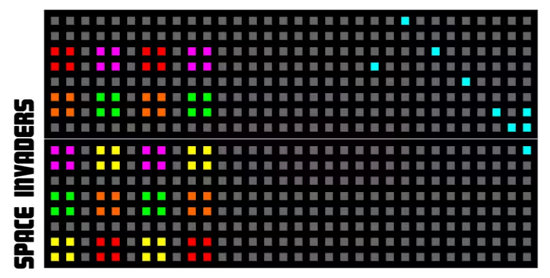](https://www.hackster.io/nicolaudosbrinquedos/space-invaders-on-neopixels-using-circuitpython-5485da)

Djair Guilherme has created a Space Invaders game using NeoPixels programmed in CircuitPython- [hackster.io](https://www.hackster.io/nicolaudosbrinquedos/space-invaders-on-neopixels-using-circuitpython-5485da).

## Popular Last Week

What was the most popular, most clicked link, in [last week's newsletter](https://www.adafruitdaily.com/2024/06/03/python-on-microcontrollers-newsletter-micropython-v1-23-is-out-and-much-more-circuitpython-python-micropython-thepsf-raspberry_pi/)? [A New git Cheatsheet](https://wizardzines.com/git-cheat-sheet.pdf) (and the accompanying [zine](https://wizardzines.com/zines/git/)).

## New Notes from Adafruit Playground

[Adafruit Playground](https://adafruit-playground.com/) is a new place for the community to post their projects and other making tips/tricks/techniques. Ad-free, it's an easy way to publish your work in a safe space for free.

Raspberry Pi Pico dice programmed with CircuitPython - [Adafruit Playground](https://adafruit-playground.com/u/danak/pages/raspberry-pi-pico-dice-programmed-with-circuitpython).

Running two programs on a single CircuitPython device - [Adafruit Playground](https://adafruit-playground.com/u/picofun/pages/running-two-programs-on-a-single-circuitpython-device).

[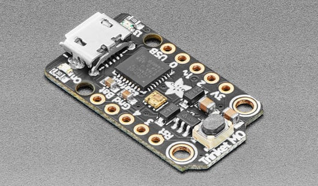](https://adafruit-playground.com/u/SamBlenny/pages/tiny-plaintext-midi-sequencer-for-samd21)

A tiny plaintext MIDI sequencer for SAMD21 - [Adafruit Playground](https://adafruit-playground.com/u/SamBlenny/pages/tiny-plaintext-midi-sequencer-for-samd21).

Magicquest! - [Adafruit Playground](https://adafruit-playground.com/u/mrklingon/pages/magicquest).

## News From Around the Web

[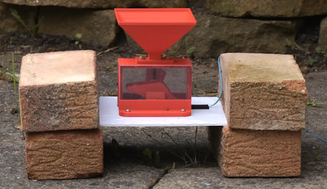](https://www.youtube.com/watch?v=m5A6N19QJEw)

Making a Raspberry Pi Pico rain gauge with MicroPython - [YouTube](https://www.youtube.com/watch?v=m5A6N19QJEw) and [Explaining Computers](https://www.explainingcomputers.com/pi_pico_rain_gauge.html).

[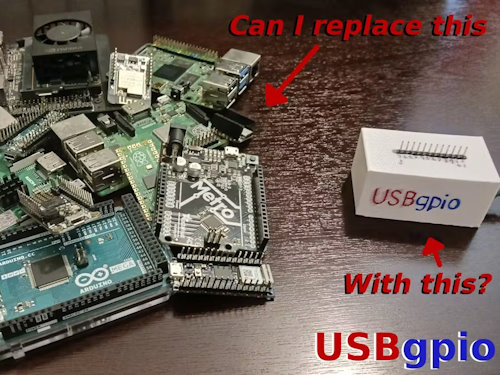](https://www.hackster.io/nickbild/add-python-programmable-gpio-pins-to-any-computer-3b0259)

Add Python programmable GPIO pins to any computer with USBgpio - [hackster.io](https://www.hackster.io/nickbild/add-python-programmable-gpio-pins-to-any-computer-3b0259).

[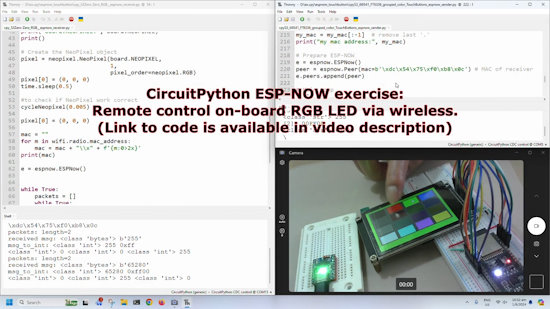](https://www.youtube.com/watch?v=XI0Qa1XYbok)

CircuitPython ESP-NOW: Remote control on-board RGB LED via wireless - [YouTube](https://www.youtube.com/watch?v=XI0Qa1XYbok).

[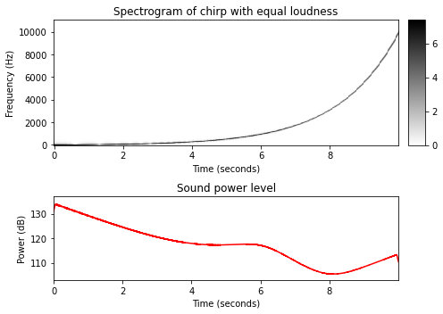](https://www.audiolabs-erlangen.de/resources/MIR/FMP/C0/C0.html)

Python Notebooks for the textbook [Fundamentals of Music Processing](http://www.music-processing.de/) is a fabulous way of learning music - [AudioLabs](https://www.audiolabs-erlangen.de/resources/MIR/FMP/C0/C0.html).

Arm64 on GitHub Actions: powering faster, more efficient build systems - [GitHub Blog](https://github.blog/2024-06-03-arm64-on-github-actions-powering-faster-more-efficient-build-systems/).

[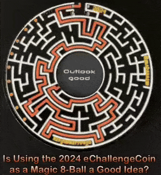](https://x.com/bradanlane/status/1797646907235528752)

Combining the CircuitPython deep sleep feature with an ePaper display and an accelerometer interrupt to make a Magic 8-Ball with the 2024 eChallengeCoin - [X](https://x.com/bradanlane/status/1797646907235528752).

[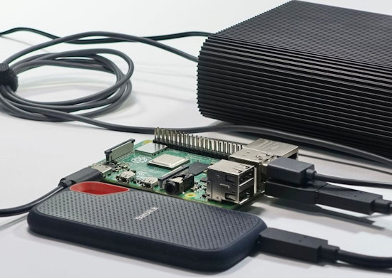](https://www.cnx-software.com/2024/06/04/sbc-software-news-armbian-24-5-1-dietpi-9-4-and-otii-server-for-the-raspberry-pi-4-5/)

Armbian 24.5.1, DietPi 9.4, and Otii server are now out for Single Board Computers (SBC) - [CNX Software](https://www.cnx-software.com/2024/06/04/sbc-software-news-armbian-24-5-1-dietpi-9-4-and-otii-server-for-the-raspberry-pi-4-5/).

[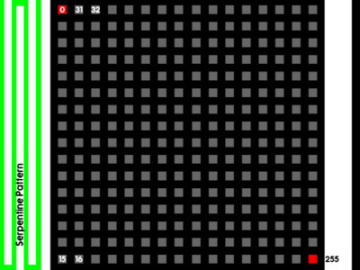](https://www.hackster.io/nicolaudosbrinquedos/understanding-neopixels-matrix-parameters-3ce351)

Understanding NeoPixels matrix parameters with CircuitPython - [hackster.io](https://www.hackster.io/nicolaudosbrinquedos/understanding-neopixels-matrix-parameters-3ce351).

[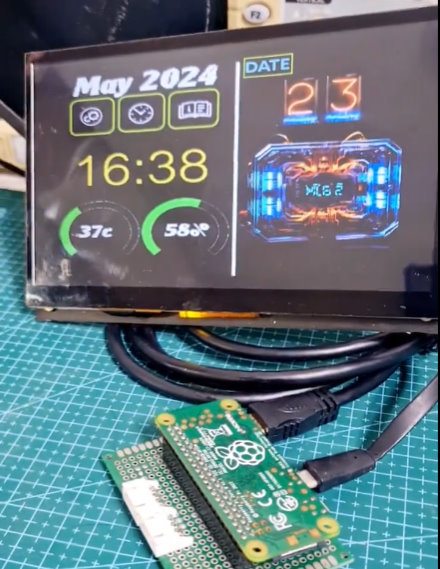](https://x.com/Yakroo5077/status/1798243783940997284)

RaspberryPi ZERO No OS/CircuitPython HDMI, Clock and Photo Frame - [X](https://x.com/Yakroo5077/status/1798243783940997284).

Python Turtle Bingo: write Python turtle code to recreate simple pictures - [andersource](https://andersource.dev/assets/python-turtle-bingo/index.html).

[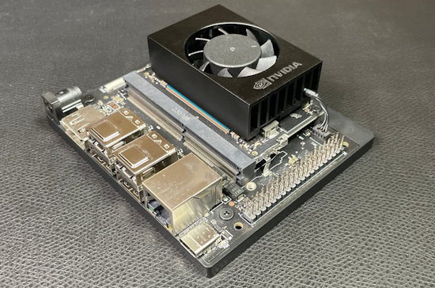](https://shawnhymel.com/2255/getting-started-with-nvidia-jetson-orin-nano/)

Flashing an OS onto the Nvidia Jetson Orin Nano can be tricky, especially using an SSD. Shawn Hymel put together a guide to help with that process - [Shawn Hymel](https://shawnhymel.com/2255/getting-started-with-nvidia-jetson-orin-nano/).

[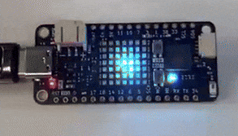](https://x.com/unexpectedmaker/status/1798171987573186874)

A spiral animation on the new Unexpected Maker Feather S3 Neo with CircuitPython - [X](https://x.com/unexpectedmaker/status/1798171987573186874).

text - [site](url).

text - [site](url).

text - [site](url).

text - [site](url).

[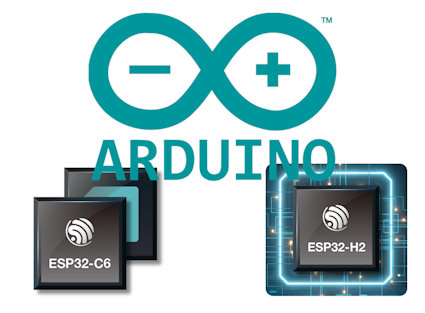](https://www.cnx-software.com/2024/06/01/espressif-releases-arduino-esp32-core-3-0-0-but-platformio-support-in-doubt/)

Espressif releases Arduino ESP32 Core 3.0.0, but PlatformIO support is in doubt - [CNX Software](https://www.cnx-software.com/2024/06/01/espressif-releases-arduino-esp32-core-3-0-0-but-platformio-support-in-doubt/).

[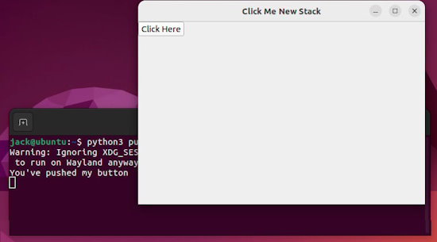](https://thenewstack.io/how-to-create-a-python-gui-app-with-pyqt5/)

How to create a Python GUI app with PyQt5 - [The New Stack](https://thenewstack.io/how-to-create-a-python-gui-app-with-pyqt5/).

## New

[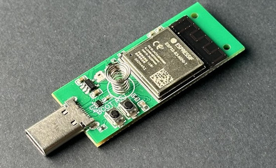](https://thingpulse.com/product/esp32-s3-pendrive-s3-128mb/)

The ThingPulse Pendrive S3 is an ESP32-S3 board which fits neatly into a USB pendrive and [supports CircuitPython](https://circuitpython.org/board/ThingPulse_PendriveS3/) - [ThingPulse](https://thingpulse.com/product/esp32-s3-pendrive-s3-128mb/).

text - [site](url).

## New Boards Supported by CircuitPython

The number of supported microcontrollers and Single Board Computers (SBC) grows every week. This section outlines which boards have been included in CircuitPython or added to [CircuitPython.org](https://circuitpython.org/).

This week, there were (#/no) new boards added:

- [Board name](url)
- [Board name](url)
- [Board name](url)

*Note: For non-Adafruit boards, please use the support forums of the board manufacturer for assistance, as Adafruit does not have the hardware to assist in troubleshooting.*

Looking to add a new board to CircuitPython? It's highly encouraged! Adafruit has four guides to help you do so:

- [How to Add a New Board to CircuitPython](https://learn.adafruit.com/how-to-add-a-new-board-to-circuitpython/overview)
- [How to add a New Board to the circuitpython.org website](https://learn.adafruit.com/how-to-add-a-new-board-to-the-circuitpython-org-website)
- [Adding a Single Board Computer to PlatformDetect for Blinka](https://learn.adafruit.com/adding-a-single-board-computer-to-platformdetect-for-blinka)
- [Adding a Single Board Computer to Blinka](https://learn.adafruit.com/adding-a-single-board-computer-to-blinka)

## New Learn Guides

[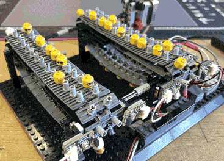](https://learn.adafruit.com/guides/latest)

[Optical Sensor Drum Track Sequencer](https://learn.adafruit.com/drum-track-sequencer) from [John Park](https://learn.adafruit.com/u/johnpark)

[Dune Worm Thumper](https://learn.adafruit.com/dune-worm-thumper) from [Ruiz Brothers](https://learn.adafruit.com/u/pixil3d)

[Adafruit Pixel Trinkey](https://learn.adafruit.com/adafruit-pixel-trinkey) from [Liz Clark](https://learn.adafruit.com/u/BlitzCityDIY)

## Updated Learn Guides

[title](url)

## CircuitPython Libraries

The CircuitPython library numbers are continually increasing, while existing ones continue to be updated. Here we provide library numbers and updates!

To get the latest Adafruit libraries, download the [Adafruit CircuitPython Library Bundle](https://circuitpython.org/libraries). To get the latest community contributed libraries, download the [CircuitPython Community Bundle](https://circuitpython.org/libraries).

If you'd like to contribute to the CircuitPython project on the Python side of things, the libraries are a great place to start. Check out the [CircuitPython.org Contributing page](https://circuitpython.org/contributing). If you're interested in reviewing, check out Open Pull Requests. If you'd like to contribute code or documentation, check out Open Issues. We have a guide on [contributing to CircuitPython with Git and GitHub](https://learn.adafruit.com/contribute-to-circuitpython-with-git-and-github), and you can find us in the #help-with-circuitpython and #circuitpython-dev channels on the [Adafruit Discord](https://adafru.it/discord).

You can check out this [list of all the Adafruit CircuitPython libraries and drivers available](https://github.com/adafruit/Adafruit_CircuitPython_Bundle/blob/master/circuitpython_library_list.md). 

The current number of CircuitPython libraries is **###**!

**New Libraries**

Here's this week's new CircuitPython libraries:

* [library](url)

**Updated Libraries**

Here's this week's updated CircuitPython libraries:

* [library](url)

**Library PyPI Weekly Download Stats**

## What’s the CircuitPython team up to this week?

What is the team up to this week? Let’s check in:

**Dan**

I continued to work on fixing the remaining issues for CircuitPython 9.1.0 final. Only two or three are left now.

**Melissa**

This past week I continued working on the [CircuitPython Code Editor](https://code.circuitpython.org/). I refactored the code to make it much more reliable and fixed the output duplication issue. I am continuing working on finishing up the file operations and fixing certain edge cases as I come upon them.

**Tim**

This week I was focused on the circup repo PR to change from setup.py to pyproject.toml for it's python packaging configuration. I learned a lot about the available configuration options and made some changes to the actions tasks in order to support these changes. The new version is released now. I also soldered up a new cardboard arcade project on a perma-proto bread board, more details to come on that next week.

**Jeff**

I continued working on streaming MP3s over http with CircuitPython on the ESP32-S3. At the time I'm writing this, it sort of works but playback is not reliable enough to permit merging the PR.

**Scott**

This week I've continued work on ESP BLE support. When enabling the BLE workflow, I found some issues with the workflow code that was nRF dependent. I also found bugs in the ESP BLE implementation. So, I'm continuing to use BLE on ESP and fix issues as they are found.

**Liz**

This week I worked on a few product guides. The [Adafruit Chainable DS18B20 Extender Breakout](https://learn.adafruit.com/adafruit-chainable-ds18b20-extender-breakout) makes it easy to wire up a DS18B20 temperature sensor. It has the pullup resistor on board, so the sensor becomes plug and play. I also added a minor update to the [RGB LCD Shield guide](https://learn.adafruit.com/rgb-lcd-shield) for the new version that is now in the shop. This new version only requires soldering the headers and LCD display.

## Upcoming Events

Open Sauce, the Maker extravaganza, is returning to San Francisco, California June 15-16 - [Open Sauce](https://opensauce.live/).

The next MicroPython Meetup in Melbourne will be on June 26 – [Meetup](https://www.meetup.com/micropython-meetup/events). You can see recordings of previous meetings on [YouTube](https://www.youtube.com/@MicroPythonOfficial). 

EuroPython is the oldest and longest running volunteer-led Python programming conference on the planet. This year it will be held July 8-14 in Prague - [EuroPython 2024](https://ep2024.europython.eu/).

PyOhio is being held July 27-28, 2024 in Cleveland, Ohio - [PyOhio](https://www.pyohio.org/2024/).

Espressif DevCon24 will be held Sep 3-5, 13:00-18:00 CEST. Call for presentations now - [Espressif](https://devcon.espressif.com/).

Maker Faire Bay Area returns to Mare Island Naval Shipyard on October 18-20, 2024 - [Maker Faire](https://makerfaire.com/bay-area/).

**Send Your Events In**

If you know of virtual events or upcoming events, please let us know via email to cpnews(at)adafruit(dot)com.

## Latest Releases

CircuitPython's stable release is [#.#.#](https://github.com/adafruit/circuitpython/releases/latest) and its unstable release is [#.#.#-##.#](https://github.com/adafruit/circuitpython/releases). New to CircuitPython? Start with our [Welcome to CircuitPython Guide](https://learn.adafruit.com/welcome-to-circuitpython).

[2024####](https://github.com/adafruit/Adafruit_CircuitPython_Bundle/releases/latest) is the latest Adafruit CircuitPython library bundle.

[2024####](https://github.com/adafruit/CircuitPython_Community_Bundle/releases/latest) is the latest CircuitPython Community library bundle.

[v#.#.#](https://micropython.org/download) is the latest MicroPython release. Documentation for it is [here](http://docs.micropython.org/en/latest/pyboard/).

[#.#.#](https://www.python.org/downloads/) is the latest Python release. The latest pre-release version is [#.#.#](https://www.python.org/download/pre-releases/).

[#,### Stars](https://github.com/adafruit/circuitpython/stargazers) Like CircuitPython? [Star it on GitHub!](https://github.com/adafruit/circuitpython)

## Call for Help -- Translating CircuitPython is now easier than ever

[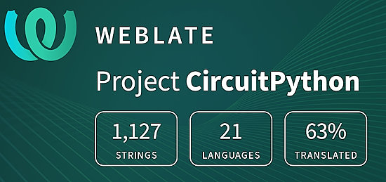](https://hosted.weblate.org/engage/circuitpython/)

One important feature of CircuitPython is translated control and error messages. With the help of fellow open source project [Weblate](https://weblate.org/), we're making it even easier to add or improve translations. 

Sign in with an existing account such as GitHub, Google or Facebook and start contributing through a simple web interface. No forks or pull requests needed! As always, if you run into trouble join us on [Discord](https://adafru.it/discord), we're here to help.

## NUMBER Thanks

The Adafruit Discord community, where we do all our CircuitPython development in the open, reached over NUMBER humans - thank you! Adafruit believes Discord offers a unique way for Python on hardware folks to connect. Join today at [https://adafru.it/discord](https://adafru.it/discord).

## ICYMI - In case you missed it

Python on hardware is the Adafruit Python video-newsletter-podcast! The news comes from the Python community, Discord, Adafruit communities and more and is broadcast on ASK an ENGINEER Wednesdays. The complete Python on Hardware weekly videocast [playlist is here](https://www.youtube.com/playlist?list=PLjF7R1fz_OOXRMjM7Sm0J2Xt6H81TdDev). The video podcast is on [iTunes](https://itunes.apple.com/us/podcast/python-on-hardware/id1451685192?mt=2), [YouTube](http://adafru.it/pohepisodes), [Instagram](https://www.instagram.com/adafruit/channel/)), and [XML](https://itunes.apple.com/us/podcast/python-on-hardware/id1451685192?mt=2).

[The weekly community chat on Adafruit Discord server CircuitPython channel - Audio / Podcast edition](https://itunes.apple.com/us/podcast/circuitpython-weekly-meeting/id1451685016) - Audio from the Discord chat space for CircuitPython, meetings are usually Mondays at 2pm ET, this is the audio version on [iTunes](https://itunes.apple.com/us/podcast/circuitpython-weekly-meeting/id1451685016), Pocket Casts, [Spotify](https://adafru.it/spotify), and [XML feed](https://adafruit-podcasts.s3.amazonaws.com/circuitpython_weekly_meeting/audio-podcast.xml).

## Contribute

The CircuitPython Weekly Newsletter is a CircuitPython community-run newsletter emailed every Monday. The complete [archives are here](https://www.adafruitdaily.com/category/circuitpython/). It highlights the latest CircuitPython related news from around the web including Python and MicroPython developments. To contribute, edit next week's draft [on GitHub](https://github.com/adafruit/circuitpython-weekly-newsletter/tree/gh-pages/_drafts) and [submit a pull request](https://help.github.com/articles/editing-files-in-your-repository/) with the changes. You may also tag your information on Twitter with #CircuitPython. 

Join the Adafruit [Discord](https://adafru.it/discord) or [post to the forum](https://forums.adafruit.com/viewforum.php?f=60) if you have questions.
