- [ ] Library and info updates
- [ ] change date
- [ ] update title
- [ ] Feature story
- [ ] Update  for images
- [ ] Update ICYDNCI
- [ ] All images 550w max only
- [ ] Link "View this email in your browser."

News Sources

- [Adafruit Playground](https://adafruit-playground.com/)
- Twitter: [CircuitPython](https://twitter.com/search?q=circuitpython&src=typed_query&f=live), [MicroPython](https://twitter.com/search?q=micropython&src=typed_query&f=live) and [Python](https://twitter.com/search?q=python&src=typed_query)
- [Raspberry Pi News](https://www.raspberrypi.com/news/)
- Mastodon [CircuitPython](https://octodon.social/tags/CircuitPython) and [MicroPython](https://octodon.social/tags/MicroPython)
- [hackster.io CircuitPython](https://www.hackster.io/search?q=circuitpython&i=projects&sort_by=most_recent) and [MicroPython](https://www.hackster.io/search?q=micropython&i=projects&sort_by=most_recent)
- YouTube: [CircuitPython](https://www.youtube.com/results?search_query=circuitpython&sp=CAI%253D), [MicroPython](https://www.youtube.com/results?search_query=micropython&sp=CAI%253D)
- Instructables: [CircuitPython](https://www.instructables.com/search/?q=circuitpython&projects=all&sort=Newest), [MicroPython](https://www.instructables.com/search/?q=micropython&projects=all&sort=Newest), [Raspberry Pi Python](https://www.instructables.com/search/?q=raspberry+pi+python&projects=all&sort=Newest)
- [python.org](https://www.python.org/)
- [Python Insider - dev team blog](https://pythoninsider.blogspot.com/)
- Individuals: [Jeff Geerling](https://www.jeffgeerling.com/blog)
- Tom's Hardware: [CircuitPython](https://www.tomshardware.com/search?searchTerm=circuitpython&articleType=all&sortBy=publishedDate) and [MicroPython](https://www.tomshardware.com/search?searchTerm=micropython&articleType=all&sortBy=publishedDate) and [Raspberry Pi](https://www.tomshardware.com/search?searchTerm=raspberry%20pi&articleType=all&sortBy=publishedDate)
- [hackaday.io newest projects MicroPython](https://hackaday.io/projects?tag=micropython&sort=date) and [CircuitPython](https://hackaday.io/projects?tag=circuitpython&sort=date)
- [Google News Python](https://news.google.com/topics/CAAqIQgKIhtDQkFTRGdvSUwyMHZNRFY2TVY4U0FtVnVLQUFQAQ?hl=en-US&gl=US&ceid=US%3Aen)
- [hackaday CircuitPython](https://hackaday.com/blog/?s=circuitpython) and [MicroPython](https://hackaday.com/blog/?s=micropython)
- hackaday.io - [CircuitPython](https://hackaday.io/search?term=circuitpython) and [MicroPython](https://hackaday.io/search?term=micropython)

View this email in your browser. **Warning: Flashing Imagery**

Welcome to the latest Python on Microcontrollers newsletter! *insert 2-3 sentences from editor (what's in overview, banter)* - *Anne Barela, Editor*

We're on [Discord](https://discord.gg/HYqvREz), [Twitter](https://twitter.com/search?q=circuitpython&src=typed_query&f=live), and for past newsletters - [view them all here](https://www.adafruitdaily.com/category/circuitpython/). If you're reading this on the web, [subscribe here](https://www.adafruitdaily.com/). Here's the news this week:

## Raspberry Pi is Now a Public Company

[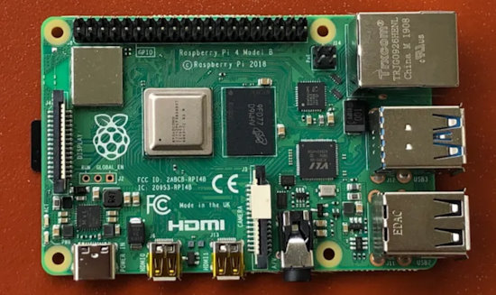](https://techcrunch.com/2024/06/11/raspberry-pi-is-now-a-public-company-as-its-shares-pops-after-ipo-pricing/)

Raspberry Pi is now a public company. The company’s shares popped 32% after its IPO pricing on the London Stock Exchange - [TechCrunch](https://techcrunch.com/2024/06/11/raspberry-pi-is-now-a-public-company-as-its-shares-pops-after-ipo-pricing/) and [CNBC](https://www.cnbc.com/2024/06/11/rasperry-pi-ipo-computing-firm-to-raise-211-million.html).

> "Retail investors can’t buy Raspberry Pi shares just yet, as only certain institutional shareholders can trade the company’s shares right now. Retail investors will be able to buy and sell shares starting on June 14th."

## The Absurd Idea of Rendering KiCAD Projects on The Web

Thea Flowers' Supercon 2023 talk 'The Absurd Idea of Rendering KiCAD Projects on The Web' was just released - [YouTube](https://www.youtube.com/watch?v=WAbutgTGjWg) via [X](https://x.com/theavalkyrie/status/1800883790468059137).

## Book - Programming ESP32: Learn MicroPython Coding and Electronics

[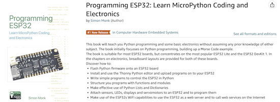](https://www.doctormonk.com/2024/06/new-book-on-esp32-and-micropython.html)

A new book now out: Programming ESP32: Learn MicroPython Coding and Electronics by Dr. Simon Monk - [DoctorMonk](https://www.doctormonk.com/2024/06/new-book-on-esp32-and-micropython.html) and [Amazon (US)](https://www.amazon.com/Programming-ESP32-MicroPython-Coding-Electronics/dp/1739487451).

> "This book is two-thirds MicroPython programming, which applies to and ESP32 board and one third electronics using solderless breadboard. When it comes the electronics side of things, I provide breadboard layouts for two of the most popular ESP32 boards, the ESP32 Lite and the DevKit 1."

## A MicroPython v1.23.0 UNIX Port Docker Container

[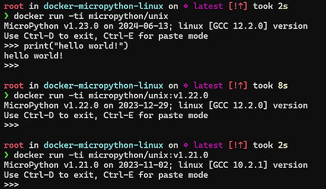](url)

micropython/unix is a container providing a pre-built instance of the UNIX port of MicroPython. It's useful for experimentation at the REPL, unit testing and development - [Docker Hub](https://hub.docker.com/r/micropython/unix) via [X](https://x.com/matt_trentini/status/1801251429166051452).

## Benchmarking TensorFlow and TensorFlow Lite on Raspberry Pi 5

[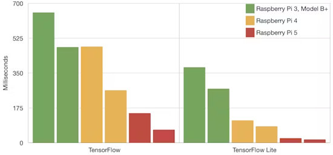](https://www.hackster.io/news/benchmarking-tensorflow-and-tensorflow-lite-on-raspberry-pi-5-b9156d58a6a2)

Benchmarking TensorFlow and TensorFlow Lite on Raspberry Pi 5 - [hackster.io](https://www.hackster.io/news/benchmarking-tensorflow-and-tensorflow-lite-on-raspberry-pi-5-b9156d58a6a2).

> "Running the benchmarks on the new Raspberry Pi 5 we see significant improvements in inferencing speed, with full TensorFlow models running almost ×5 faster than on they did on Raspberry Pi 4. We see a similar increase in inferencing speed when using TensorFlow Lite, with models again running almost ×5 faster than on the Raspberry Pi 4."

## Apple’s Embedded Swift Programming Language Lands for Several Microcontrollers

[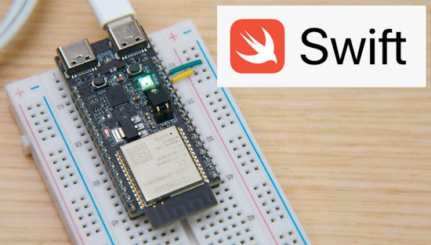](https://www.cnx-software.com/2024/06/13/embedded-swift-esp32-c6-raspberry-pi-rp2040-stm32f7-nrf52840-microcontrollers/)

Bucking the Python on hardware trend, Apple has released a beta of the Embedded Swift programming language with support for ESP32-C6, Raspberry Pi RP2040, STM32F7, and nRF52840 microcontrollers - [CNX Software](https://www.cnx-software.com/2024/06/13/embedded-swift-esp32-c6-raspberry-pi-rp2040-stm32f7-nrf52840-microcontrollers/) and [YouTube](https://youtu.be/LqxbsADqDI4).

## Feature

text - [site](url).

## This Week's Python Streams

Python on Hardware is all about building a cooperative ecosphere which allows contributions to be valued and to grow knowledge. Below are the streams within the last week focusing on the community.

**CircuitPython Deep Dive Stream**

[Last Friday](link), Scott streamed work on {subject}.

You can see the latest video and past videos on the Adafruit YouTube channel under the Deep Dive playlist - [YouTube](https://www.youtube.com/playlist?list=PLjF7R1fz_OOXBHlu9msoXq2jQN4JpCk8A).

**CircuitPython Parsec**

John Park’s CircuitPython Parsec this week is on {subject} - [Adafruit Blog](link) and [YouTube](link).

Catch all the episodes in the [YouTube playlist](https://www.youtube.com/playlist?list=PLjF7R1fz_OOWFqZfqW9jlvQSIUmwn9lWr).

**CircuitPython Weekly Meeting**

CircuitPython Weekly Meeting for June 10, 2024 ([notes](https://github.com/adafruit/adafruit-circuitpython-weekly-meeting/blob/main/2024/2024-06-10.md)) [on YouTube](https://youtu.be/-Xo8ZEEfZUQ).

## Project of the Week: An Akabeko Controller to Play Minecraft

[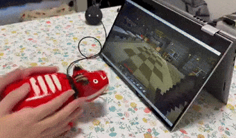](https://x.com/BitBlt_Korry/status/1800483203058409836)

BBコリー✂︎ (@BitBlt_Korry on X) made an [Akabeko](https://en.wikipedia.org/wiki/Akabeko) controller to play Minecraft. It uses a Tiny2040 board programmed in MicroPython - [X](https://x.com/BitBlt_Korry/status/1800483203058409836) (Japanese).

## Popular Last Week

What was the most popular, most clicked link, in [last week's newsletter](https://www.adafruitdaily.com/2024/06/10/python-on-microcontrollers-newsletter-raspberry-pi-ai-kit-released-a-new-micropython-online-ide-and-more-circuitpython-python-micropython-thepsf-raspberry_pi/)? [A New git Cheatsheet](https://wizardzines.com/git-cheat-sheet.pdf) (and the accompanying [zine](https://wizardzines.com/zines/git/)).

## New Notes from Adafruit Playground

[Adafruit Playground](https://adafruit-playground.com/) is a new place for the community to post their projects and other making tips/tricks/techniques. Ad-free, it's an easy way to publish your work in a safe space for free.

[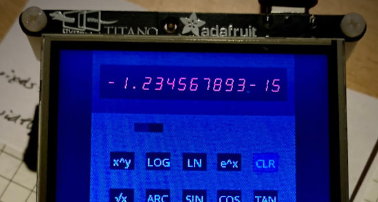](https://adafruit-playground.com/u/CGrover/pages/sevenseg-create-an-instrumentation-vibe-for-displayio)

SevenSeg: Create an Instrumentation Vibe for Displayio - [Adafruit Playground](https://adafruit-playground.com/u/CGrover/pages/sevenseg-create-an-instrumentation-vibe-for-displayio).

[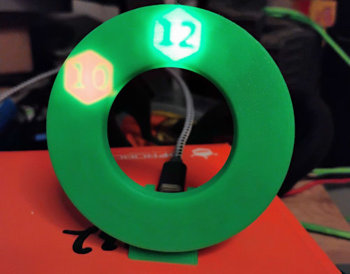](https://adafruit-playground.com/u/musingsole/pages/hidden-clock)

Hidden Clock is a clock driven by a ESP32C3, using a 3D printed light diffuser and a NeoPixel LED ring. The clock displays the hour and minute as shadowed numbers in glowing hexagons - [Adafruit Playground](https://adafruit-playground.com/u/musingsole/pages/hidden-clock).

text - [Adafruit Playground](url).

## News From Around the Web

[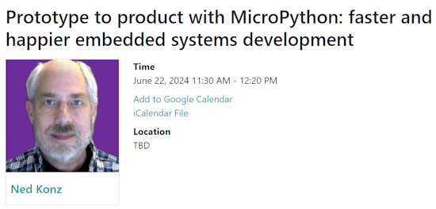](https://www.crowdsupply.com/teardown/portland-2024/long-talk/prototype-to-product-with-micropython-faster-and-happier-embedded-systems-development?public=1)

Teardown 2024 is a conferece happening from June 21 - 23, 2024 in Portland, OR, USA. Ned Konz is giving a talk: "Prototype to product with MicroPython: faster and happier embedded systems development" - [TEARDOWN 2024](https://www.crowdsupply.com/teardown/portland-2024/long-talk/prototype-to-product-with-micropython-faster-and-happier-embedded-systems-development?public=1).

Bus Pirate 5 Review: The Swiss Arrrmy Knife of hardware hacking - [eclypsium](https://eclypsium.com/blog/bus-pirate-5-the-swiss-arrrmy-knife-of-hardware-hacking/).

TIOBE Programming Language Index for June 2024: The Top 10 Most Popular Programming Languages. C++ Rises to Second Place but Python Remains Number One - [TIOBE](https://www.techrepublic.com/article/tiobe-index-language-rankings/).

[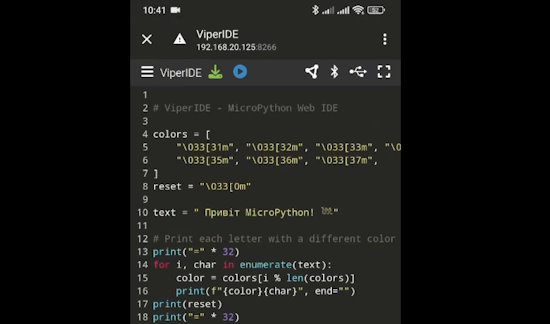](https://x.com/vshymanskyy/status/1800073643306914095)

Major updates of ViperIDE, a web IDE for MicroPython, this week - [X](https://x.com/vshymanskyy/status/1800073643306914095) and [GitHub](https://github.com/vshymanskyy/ViperIDE).

- Progressive Web App
- Bluetooth LE support
- WebREPL support
- MIP Package Manager finally works

[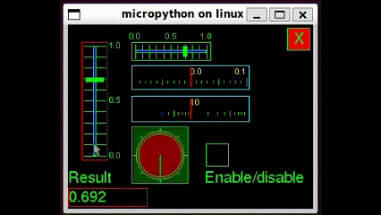](https://github.com/bdbarnett/mpdisplay?tab=readme-ov-file)

MPDisplay is a universal display, event and device driver framework for multiple flavors of Python, including MicroPython, CircuitPython and CPython (big Python). It may be used as-is to create graphic frontends to your apps, or may be used as a foundation with GUI libraries such as LVGL, MicroPython-touch or maybe even a GUI framework you've been thinking of developing - [GitHub](https://github.com/bdbarnett/mpdisplay?tab=readme-ov-file).

text - [site](url).

text - [site](url).

text - [site](url).

text - [site](url).

text - [site](url).

text - [site](url).

text - [site](url).

text - [site](url).

text - [site](url).

text - [site](url).

[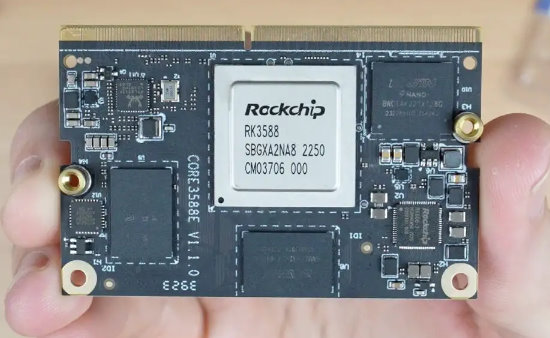](https://www.the-diy-life.com/mixtile-core-3588e-review/)

Mixtile Core 3588E Review - [The DIY Life](https://www.the-diy-life.com/mixtile-core-3588e-review/).

A beginner’s guide to building LLM apps with Python - [KDnuggets](https://www.kdnuggets.com/beginners-guide-to-building-llm-apps-with-python).

Choosing the best Python IDE for your needs - [GeekSided](https://geeksided.com/posts/choosing-the-best-python-ide-for-your-needs-01hzpdfnctdg).

## New

[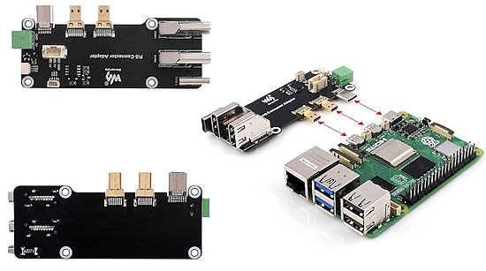](https://www.cnx-software.com/2024/06/10/dual-micro-hdmi-to-hdmi-adapter-raspberry-pi-5-4b-with-dual-4k-output-and-multiple-power-options/)

Dual micro HDMI to HDMI adapter supports Raspberry Pi 5/4B, offers multiple power options - [CNX Software](https://www.cnx-software.com/2024/06/10/dual-micro-hdmi-to-hdmi-adapter-raspberry-pi-5-4b-with-dual-4k-output-and-multiple-power-options/).

[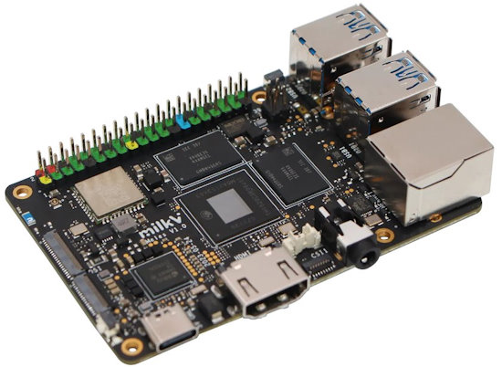](https://www.cnx-software.com/2024/06/12/meles-risc-v-sbc-t-head-th1520-soc-in-credit-card-form-factor/)

Shenzhen Milk-V Technology’s Meles RISC-V credit card-sized SBC is powered by T-Head TH1520 quad-core SoC - [CNX Software](https://www.cnx-software.com/2024/06/12/meles-risc-v-sbc-t-head-th1520-soc-in-credit-card-form-factor/).

## New Boards Supported by CircuitPython

The number of supported microcontrollers and Single Board Computers (SBC) grows every week. This section outlines which boards have been included in CircuitPython or added to [CircuitPython.org](https://circuitpython.org/).

This week, there were (#/no) new boards added:

- [Board name](url)
- [Board name](url)
- [Board name](url)

*Note: For non-Adafruit boards, please use the support forums of the board manufacturer for assistance, as Adafruit does not have the hardware to assist in troubleshooting.*

Looking to add a new board to CircuitPython? It's highly encouraged! Adafruit has four guides to help you do so:

- [How to Add a New Board to CircuitPython](https://learn.adafruit.com/how-to-add-a-new-board-to-circuitpython/overview)
- [How to add a New Board to the circuitpython.org website](https://learn.adafruit.com/how-to-add-a-new-board-to-the-circuitpython-org-website)
- [Adding a Single Board Computer to PlatformDetect for Blinka](https://learn.adafruit.com/adding-a-single-board-computer-to-platformdetect-for-blinka)
- [Adding a Single Board Computer to Blinka](https://learn.adafruit.com/adding-a-single-board-computer-to-blinka)

## New Learn Guides

[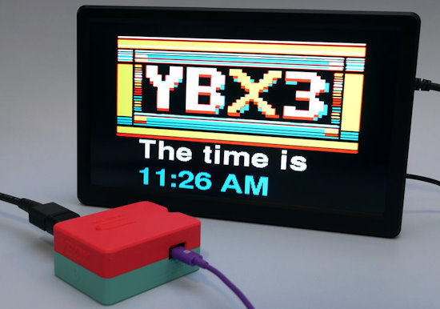](https://learn.adafruit.com/guides/latest)

[Pico W YBox3](https://learn.adafruit.com/pico-w-ybox3) from [Liz Clark](https://learn.adafruit.com/pico-w-ybox3)

[Soundbox RP2040](https://learn.adafruit.com/soundbox-rp2040) from [Ruiz Brothers](https://learn.adafruit.com/u/pixil3d)

[Optical Sensor Drum Track Sequencer](https://learn.adafruit.com/drum-track-sequencer) from [John Park](https://learn.adafruit.com/u/johnpark)

## Updated Learn Guides

[title](url)

## CircuitPython Libraries

The CircuitPython library numbers are continually increasing, while existing ones continue to be updated. Here we provide library numbers and updates!

To get the latest Adafruit libraries, download the [Adafruit CircuitPython Library Bundle](https://circuitpython.org/libraries). To get the latest community contributed libraries, download the [CircuitPython Community Bundle](https://circuitpython.org/libraries).

If you'd like to contribute to the CircuitPython project on the Python side of things, the libraries are a great place to start. Check out the [CircuitPython.org Contributing page](https://circuitpython.org/contributing). If you're interested in reviewing, check out Open Pull Requests. If you'd like to contribute code or documentation, check out Open Issues. We have a guide on [contributing to CircuitPython with Git and GitHub](https://learn.adafruit.com/contribute-to-circuitpython-with-git-and-github), and you can find us in the #help-with-circuitpython and #circuitpython-dev channels on the [Adafruit Discord](https://adafru.it/discord).

You can check out this [list of all the Adafruit CircuitPython libraries and drivers available](https://github.com/adafruit/Adafruit_CircuitPython_Bundle/blob/master/circuitpython_library_list.md). 

The current number of CircuitPython libraries is **###**!

**New Libraries**

Here's this week's new CircuitPython libraries:

* [library](url)

**Updated Libraries**

Here's this week's updated CircuitPython libraries:

* [library](url)

**Library PyPI Weekly Download Stats**

## What’s the CircuitPython team up to this week?

What is the team up to this week? Let’s check in:

**Dan**

This last week I fixed a CircuitPython USB HID issue introduced by a recent revision of TinyUSB. I also tried to track down the cause of an issue with AnalogIn on ESP32-S3 causing watchdog timer crashes or the loss of USB connectivity. I was greatly relieved to discover that the issue, whatever it was, had been fixed by the latest release (5.2.2) of the ESP-IDF.

We are now very close to a CircuitPython 9.1.0 release candidate.

**Melissa**

This past week I continued working on the [CircuitPython Code Editor](https://code.circuitpython.org/). I finished up getting the remaining file operations completely working on the updated REPL JavaScript library. This includes uploading and downloading binary files. The library and new features should be available soon.

**Tim**

I fixed a few issues that stemmed from the update to pyproject.toml in the Circup repo. I'm working on BLE support for Circup and the new wwshell utility that may eventually come with it. I also wrote the base functionality for a new cardboard arcade game called Blinka Says. Next I'd like to add some fancier elements like LED animations, highscore keeping, and perhaps different modes of play.

**Jeff**

text.

**Scott**

This week I'm continuing to polish up BLE support on ESP chips. Thanks to the folks who've been testing on the edge. My fixes are currently [in a PR](https://github.com/adafruit/circuitpython/pull/9325).

I've also enabled deep sleep on a number of ESP chipsets including C2, C3, C6 and H2. (S2, S3 and ESP32 already had it.) It depends on the IDF update in the BLE PR.

**Liz**

This week I published the [Pico W YBox3 project](https://learn.adafruit.com/pico-w-ybox3). This project was based on the [YBox2 kit](https://www.ladyada.net/make/ybox2/) that Adafruit used to sell. It was fun to revisit this project concept with new hardware. The code is written in Arduino and has three widget channels that are selected with an IR remote. The channels show the date/time, weather data from OpenWeatherMaps and a fun Amiga bouncing ball screensaver originally coded up by Phil B.

I also worked on a [guide](https://learn.adafruit.com/adafruit-ch9328-uart-to-hid-keyboard-breakout) and CircuitPython library for the CH9328 breakout in the shop. This breakout acts as a UART to HID converter and is great for adding HID functionality to board that don't have a native USB peripheral, like the ESP32 and ATmega328. I also included a CPython example that lets you use a Raspberry Pi single board computer as an HID keyboard.

## Upcoming Events

Open Sauce, the Maker extravaganza, is returning to San Francisco, California June 15-16 - [Open Sauce](https://opensauce.live/).

The next MicroPython Meetup in Melbourne will be on June 26 – [Meetup](https://www.meetup.com/micropython-meetup/events). You can see recordings of previous meetings on [YouTube](https://www.youtube.com/@MicroPythonOfficial). 

EuroPython is the oldest and longest running volunteer-led Python programming conference on the planet. This year it will be held July 8-14 in Prague - [EuroPython 2024](https://ep2024.europython.eu/).

PyOhio is being held July 27-28, 2024 in Cleveland, Ohio - [PyOhio](https://www.pyohio.org/2024/).

Espressif DevCon24 will be held Sep 3-5, 13:00-18:00 CEST. Call for presentations now - [Espressif](https://devcon.espressif.com/).

Maker Faire Bay Area returns to Mare Island Naval Shipyard on October 18-20, 2024 - [Maker Faire](https://makerfaire.com/bay-area/).

**Send Your Events In**

If you know of virtual events or upcoming events, please let us know via email to cpnews(at)adafruit(dot)com.

## Latest Releases

CircuitPython's stable release is [#.#.#](https://github.com/adafruit/circuitpython/releases/latest) and its unstable release is [#.#.#-##.#](https://github.com/adafruit/circuitpython/releases). New to CircuitPython? Start with our [Welcome to CircuitPython Guide](https://learn.adafruit.com/welcome-to-circuitpython).

[2024####](https://github.com/adafruit/Adafruit_CircuitPython_Bundle/releases/latest) is the latest Adafruit CircuitPython library bundle.

[2024####](https://github.com/adafruit/CircuitPython_Community_Bundle/releases/latest) is the latest CircuitPython Community library bundle.

[v#.#.#](https://micropython.org/download) is the latest MicroPython release. Documentation for it is [here](http://docs.micropython.org/en/latest/pyboard/).

[#.#.#](https://www.python.org/downloads/) is the latest Python release. The latest pre-release version is [#.#.#](https://www.python.org/download/pre-releases/).

[#,### Stars](https://github.com/adafruit/circuitpython/stargazers) Like CircuitPython? [Star it on GitHub!](https://github.com/adafruit/circuitpython)

## Call for Help -- Translating CircuitPython is now easier than ever

[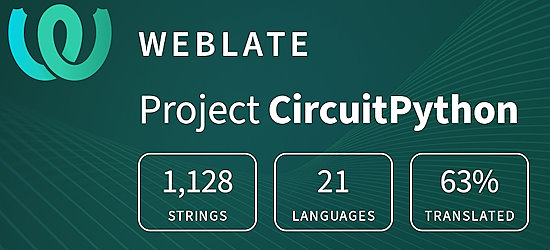](https://hosted.weblate.org/engage/circuitpython/)

One important feature of CircuitPython is translated control and error messages. With the help of fellow open source project [Weblate](https://weblate.org/), we're making it even easier to add or improve translations. 

Sign in with an existing account such as GitHub, Google or Facebook and start contributing through a simple web interface. No forks or pull requests needed! As always, if you run into trouble join us on [Discord](https://adafru.it/discord), we're here to help.

## NUMBER Thanks

The Adafruit Discord community, where we do all our CircuitPython development in the open, reached over NUMBER humans - thank you! Adafruit believes Discord offers a unique way for Python on hardware folks to connect. Join today at [https://adafru.it/discord](https://adafru.it/discord).

## ICYMI - In case you missed it

Python on hardware is the Adafruit Python video-newsletter-podcast! The news comes from the Python community, Discord, Adafruit communities and more and is broadcast on ASK an ENGINEER Wednesdays. The complete Python on Hardware weekly videocast [playlist is here](https://www.youtube.com/playlist?list=PLjF7R1fz_OOXRMjM7Sm0J2Xt6H81TdDev). The video podcast is on [iTunes](https://itunes.apple.com/us/podcast/python-on-hardware/id1451685192?mt=2), [YouTube](http://adafru.it/pohepisodes), [Instagram](https://www.instagram.com/adafruit/channel/)), and [XML](https://itunes.apple.com/us/podcast/python-on-hardware/id1451685192?mt=2).

[The weekly community chat on Adafruit Discord server CircuitPython channel - Audio / Podcast edition](https://itunes.apple.com/us/podcast/circuitpython-weekly-meeting/id1451685016) - Audio from the Discord chat space for CircuitPython, meetings are usually Mondays at 2pm ET, this is the audio version on [iTunes](https://itunes.apple.com/us/podcast/circuitpython-weekly-meeting/id1451685016), Pocket Casts, [Spotify](https://adafru.it/spotify), and [XML feed](https://adafruit-podcasts.s3.amazonaws.com/circuitpython_weekly_meeting/audio-podcast.xml).

## Contribute

The CircuitPython Weekly Newsletter is a CircuitPython community-run newsletter emailed every Monday. The complete [archives are here](https://www.adafruitdaily.com/category/circuitpython/). It highlights the latest CircuitPython related news from around the web including Python and MicroPython developments. To contribute, edit next week's draft [on GitHub](https://github.com/adafruit/circuitpython-weekly-newsletter/tree/gh-pages/_drafts) and [submit a pull request](https://help.github.com/articles/editing-files-in-your-repository/) with the changes. You may also tag your information on Twitter with #CircuitPython. 

Join the Adafruit [Discord](https://adafru.it/discord) or [post to the forum](https://forums.adafruit.com/viewforum.php?f=60) if you have questions.
