- [ ] Library and info updates
- [ ] change date
- [ ] update title
- [ ] Feature story
- [ ] Update  for images
- [ ] Update ICYDNCI
- [ ] All images 550w max only
- [ ] Link "View this email in your browser."

News Sources

- [Adafruit Playground](https://adafruit-playground.com/)
- Twitter: [CircuitPython](https://twitter.com/search?q=circuitpython&src=typed_query&f=live), [MicroPython](https://twitter.com/search?q=micropython&src=typed_query&f=live) and [Python](https://twitter.com/search?q=python&src=typed_query)
- [Raspberry Pi News](https://www.raspberrypi.com/news/)
- Mastodon [CircuitPython](https://octodon.social/tags/CircuitPython) and [MicroPython](https://octodon.social/tags/MicroPython)
- [hackster.io CircuitPython](https://www.hackster.io/search?q=circuitpython&i=projects&sort_by=most_recent) and [MicroPython](https://www.hackster.io/search?q=micropython&i=projects&sort_by=most_recent)
- YouTube: [CircuitPython](https://www.youtube.com/results?search_query=circuitpython&sp=CAI%253D), [MicroPython](https://www.youtube.com/results?search_query=micropython&sp=CAI%253D)
- Instructables: [CircuitPython](https://www.instructables.com/search/?q=circuitpython&projects=all&sort=Newest), [MicroPython](https://www.instructables.com/search/?q=micropython&projects=all&sort=Newest), [Raspberry Pi Python](https://www.instructables.com/search/?q=raspberry+pi+python&projects=all&sort=Newest)
- [python.org](https://www.python.org/)
- [Python Insider - dev team blog](https://pythoninsider.blogspot.com/)
- Individuals: [Jeff Geerling](https://www.jeffgeerling.com/blog)
- Tom's Hardware: [CircuitPython](https://www.tomshardware.com/search?searchTerm=circuitpython&articleType=all&sortBy=publishedDate) and [MicroPython](https://www.tomshardware.com/search?searchTerm=micropython&articleType=all&sortBy=publishedDate) and [Raspberry Pi](https://www.tomshardware.com/search?searchTerm=raspberry%20pi&articleType=all&sortBy=publishedDate)
- [hackaday.io newest projects MicroPython](https://hackaday.io/projects?tag=micropython&sort=date) and [CircuitPython](https://hackaday.io/projects?tag=circuitpython&sort=date)
- [Google News Python](https://news.google.com/topics/CAAqIQgKIhtDQkFTRGdvSUwyMHZNRFY2TVY4U0FtVnVLQUFQAQ?hl=en-US&gl=US&ceid=US%3Aen)
- [hackaday CircuitPython](https://hackaday.com/blog/?s=circuitpython) and [MicroPython](https://hackaday.com/blog/?s=micropython)
- hackaday.io - [CircuitPython](https://hackaday.io/search?term=circuitpython) and [MicroPython](https://hackaday.io/search?term=micropython)

View this email in your browser. **Warning: Flashing Imagery**

Welcome to the latest Python on Microcontrollers newsletter! *insert 2-3 sentences from editor (what's in overview, banter)* - *Anne Barela, Editor*

We're on [Discord](https://discord.gg/HYqvREz), [Twitter](https://twitter.com/search?q=circuitpython&src=typed_query&f=live), and for past newsletters - [view them all here](https://www.adafruitdaily.com/category/circuitpython/). If you're reading this on the web, [subscribe here](https://www.adafruitdaily.com/). Here's the news this week:

## Update: Code.circuitpython.org is a Browser-Based CircuitPython Editor and Serial Terminal

[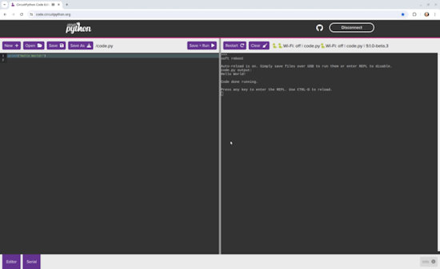](https://blog.adafruit.com/2024/06/20/code-circuitpython-org-is-a-browser-based-circuitpython-editor-and-serial-terminal/)

Code.circuitpython.org is a Browser-Based CircuitPython Editor and Serial Terminal - [Adafruit Blog](https://blog.adafruit.com/2024/06/20/code-circuitpython-org-is-a-browser-based-circuitpython-editor-and-serial-terminal/).

> "Would you like to be able to edit CircuitPython code, upload and download files to and from your CircuitPython board, and connect to its serial terminal, all from inside a browser? Check out [code.circuitpython.org](https://code.circuitpython.org/)!   It runs in Chromium-based browsers like Chrome, Microsoft Edge, and Opera, so you don’t need to install anything. Code.circuitpython.org can connect to boards using the CircuitPython WiFi workflow, or over USB. If the board presents a CIRCUITPY drive, it will access files through that. But it allows you to also read and write files via the CircuitPython serial connection, if you are using a board that does not have native USB storage. And it connects to the CircuitPython board’s REPL through a built-in serial terminal. Additionally you can now upload and download image and sound files for your code, which was previously not an option except with Web Workflow.   MakerMelissa developed this editor some time ago for Adafruit, but it hasn’t been publicized widely. Recently she added support for boards without a CIRCUITPY drive."

## How Raspberry Pi Built a Silicon Design Team

[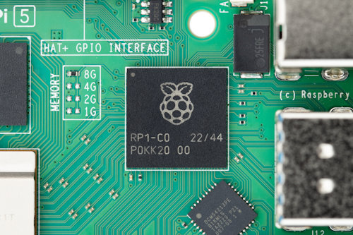](https://www.raspberrypi.com/news/how-raspberry-pi-built-a-silicon-design-team-magpimonday/)

For nearly ten years now Raspberry Pi has been building an ASIC (application-specific integrated circuit) team in Cambridge to design and produce custom silicon chips for its products - [Raspberry Pi News](https://www.raspberrypi.com/news/how-raspberry-pi-built-a-silicon-design-team-magpimonday/).

> "Raspberry Pi has been designing its own chips, such as the RP2040 microcontroller found in Raspberry Pi Pico and the RP1 I/O controller found in Raspberry Pi 5. These contain smaller blocks, often referred to as IP (intellectual property) designed by Raspberry Pi or bought in from elsewhere and integrated into Raspberry Pi’s chips."

## The *Best Python Cheat Sheet

[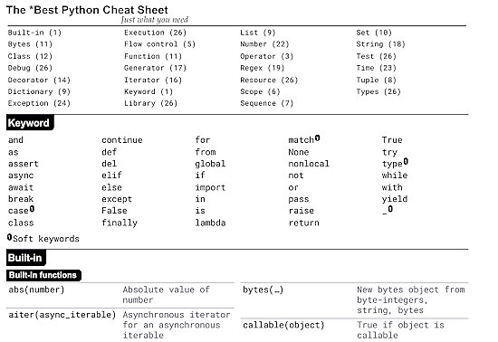](https://github.com/kieranholland/best-python-cheat-sheet?tab=readme-ov-file)

Kieran Holland is the author of a rather good Python cheat sheet as a concise reference for the Python language - [Sheet](https://kieranholland.com/best-python-cheat-sheet/) and [GitHub](https://github.com/kieranholland/best-python-cheat-sheet?tab=readme-ov-file).

*It may not be the **best** Python cheat sheet, but it *aspires* to be.

## A Fortune Telling Robot with a Raspberry Pi and Python

Kevin McAleer builds a fun interactive exhibit for Open Sauce 2024 in San Fransisco. The exhibit is powered by a Raspberry Pi 4 and Python, has an arcade button on the front and a thermal printer to print out fortunes - [YouTube](https://www.youtube.com/watch?v=dWFgN_A_I1w).

## Arduino Nano Vs Raspberry Pi Pico: What's The Difference?

[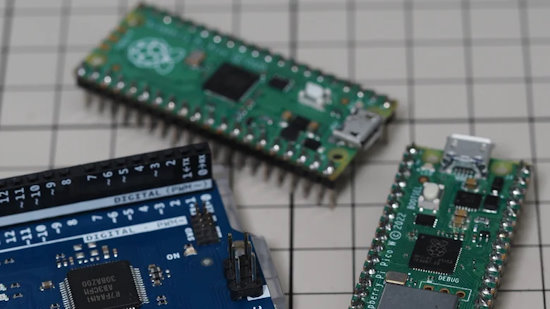](https://www.slashgear.com/1600891/arduino-nano-raspberry-pi-pico-difference-explained/)

Arduino Nano Vs Raspberry Pi Pico: What's The Difference? - [SlashGear](https://www.slashgear.com/1600891/arduino-nano-raspberry-pi-pico-difference-explained/).

> "Which should you buy? If your goal is to get started with microcontrollers and electronic circuits, either one is a good buy. However, as the Nano and Pico are entirely different boards with entirely different specs, each has certain advantages. For instance, the Nano is the better choice if you're a complete beginner. Conversely, the Pico is highly recommended if you're on a tight budget or if you're just curious about microcontrollers and want to experiment without burning a hole in your pocket. Software-wise, the Nano is great if you already have a background in C/C++. If Python is your language of choice, though, go with Pico."

## Python Software Foundation News

The Python Language Summit occurs every year just before PyCon US begins, this year occurring on May 15th, 2024 in Pittsburgh, Pennsylvania. The summit is attended by core developers, triagers, and Python implementation maintainers for a full day of talks and discussions on the future direction of Python. This years summit included talks on the C API, free-threading, the security model of Python post-xz, and Python on mobile platforms. They are now posted for viewing - [Python Blog](https://pyfound.blogspot.com/2024/06/python-language-summit-2024.html).

Python 3.12.4 is now out - [python.org](https://www.python.org/downloads/release/python-3124/).

Python mulls a change in how it numbers versions - [TheNewStack](https://thenewstack.io/python-mulls-a-change-in-version-numbering/).

## This Week's Python Streams

Python on Hardware is all about building a cooperative ecosphere which allows contributions to be valued and to grow knowledge. Below are the streams within the last week focusing on the community.

**CircuitPython Deep Dive Stream**

[Last Friday](https://youtube.com/live/J5jV7J_mJFg), Tim streamed more work on BLE workflow integration.

You can see the latest video and past videos on the Adafruit YouTube channel under the Deep Dive playlist - [YouTube](https://www.youtube.com/playlist?list=PLjF7R1fz_OOXBHlu9msoXq2jQN4JpCk8A).

**CircuitPython Parsec**

John Park’s CircuitPython Parsec this week is on Keypad Press & Release - [Adafruit Blog](https://blog.adafruit.com/2024/06/21/john-parks-circuitpython-parsec-keypad-press-release-adafruit-circuitpython/) and [YouTube](https://youtu.be/SVZPZvV2Spk).

Catch all the episodes in the [YouTube playlist](https://www.youtube.com/playlist?list=PLjF7R1fz_OOWFqZfqW9jlvQSIUmwn9lWr).

**CircuitPython Weekly Meeting**

CircuitPython Weekly Meeting for June 17th, 2024 ([notes](https://github.com/adafruit/adafruit-circuitpython-weekly-meeting/blob/main/2024/2024-06-17.md)) [on YouTube](https://youtu.be/tZByoQh1FE8).

## Project of the Week

[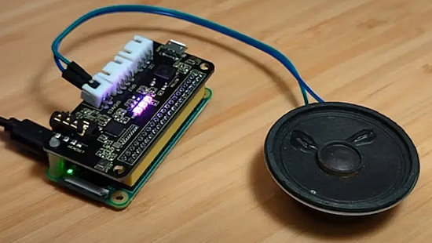](https://www.tomshardware.com/raspberry-pi/raspberry-pi-fably-uses-ai-to-generate-bedtime-stories-on-demand)

Stefano Mazzocchi has created Fably which uses the power of AI to generate stories. Fably is open source and is designed with a user-friendly interface that even children can use. The project is on [GitHub](https://github.com/stefanom/fably), you can read more on [Tom's Hardware](https://www.tomshardware.com/raspberry-pi/raspberry-pi-fably-uses-ai-to-generate-bedtime-stories-on-demand) and see more in a [YouTube Video](https://youtu.be/zILPuh84OcY).

## Popular Last Week

What was the most popular, most clicked link, in [last week's newsletter](https://www.adafruitdaily.com/2024/06/17/python-on-microcontrollers-newsletter-raspberry-pi-ipo-complete-micropython-docker-image-and-more-circuitpython-python-micropython-thepsf-raspberry_pi/)? [Apple’s Embedded Swift Programming Language Lands for Several Microcontrollers](https://www.cnx-software.com/2024/06/13/embedded-swift-esp32-c6-raspberry-pi-rp2040-stm32f7-nrf52840-microcontrollers/).

## Adafruit Playground

[Adafruit Playground](https://adafruit-playground.com/) is a new place for the community to post their projects and other making tips/tricks/techniques. Ad-free, it's an easy way to publish your work in a safe space for free.

## News From Around the Web

Find My Cat -- the GPS tracker for pets -- with Raspberry Pi and MicroPython - [Instructables](https://www.instructables.com/Find-My-Cat-the-GPS-Tracker-for-Pets/) and [YouTube](https://youtu.be/lX2X4xst_wE).

[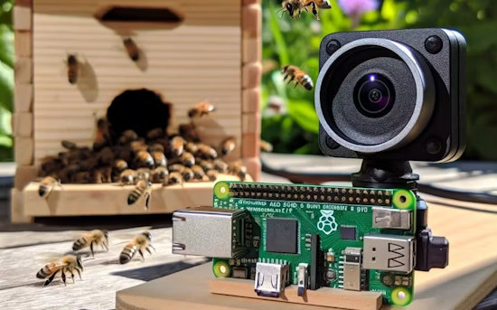](https://www.hackster.io/518000/buzztech-machine-learning-at-the-edge-07c951)

Real-time bee counting at the hive entrance by the Federal University of Itajuba using YOLOv8 on a Raspberry Pi Zero 2W - [hackster.io](https://www.hackster.io/518000/buzztech-machine-learning-at-the-edge-07c951) via DFRobot - [X](https://x.com/dfrobotcn/status/1803253367105298537).

This Raspberry Pi Pico project sorts your candies by color - [Tom's Hardware](https://www.tomshardware.com/raspberry-pi/this-raspberry-pi-pico-project-will-sort-your-candies-by-color) and [YouTube](https://youtu.be/FEqGghBnZN0).

[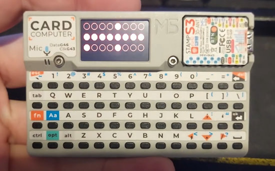](https://www.youtube.com/watch?v=JAwlBIfjrS8)

A simple test of a basic drum sequencer implemented in CircuitPython running on M5Stacks Cardputer - [YouTube](https://www.youtube.com/watch?v=JAwlBIfjrS8).

The Pi Cast for June 18th featured Volodymyr Shymanskyy discussing Viper IDE and the Blynk IoT MicroPython Framework - [YouTube](https://www.youtube.com/watch?v=owDVI7z5GAk).

[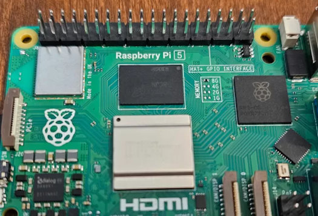](https://www.phoronix.com/news/Raspberry-Pi-5-Kernel-DRM-Soon)

Raspberry Pi 5 kernel graphics driver support will hopefully be upstreamed soon - [Phoronix](https://www.phoronix.com/news/Raspberry-Pi-5-Kernel-DRM-Soon).

SUSE working to upstream RP1 Southbridge Linux driver for the Raspberry Pi 5 - [Phoronix](https://www.phoronix.com/news/Raspberry-Pi-5-RP1-Linux-RFC).

[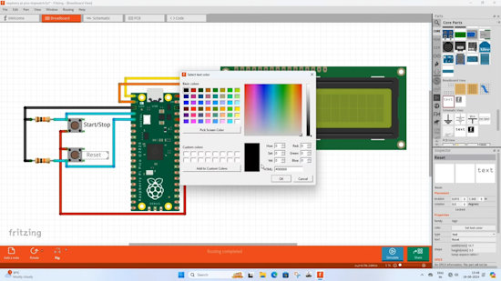](https://www.youtube.com/watch?v=FOc5Sl3B1So)

Making a stopwatch using a Raspberry Pi Pico and MicroPython - [YouTube](https://www.youtube.com/watch?v=FOc5Sl3B1So).

[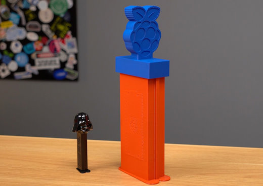](https://www.jeffgeerling.com/blog/2024/giving-away-480-raspberry-pis-was-harder-i-expected)

Giving away 480 Raspberry Pi Picos at Open Sources was harder than expected - [Jeff Geerling](https://www.jeffgeerling.com/blog/2024/giving-away-480-raspberry-pis-was-harder-i-expected) and [YouTube](https://youtu.be/n5d0hzgA9BI).

text - [site](url).

Create a MicroPython class for controlling RGB LEDs in MicroPython - [YouTube](https://www.youtube.com/watch?v=tw-mXURNEUc).

IHome: a full-stack, generative AI powered mobile application which helps people control activities & sensors of their smart IoT home system using Raspberry Pi Zero and MicroPython - [hackster.io](https://www.hackster.io/mrmi/ihome-fb74cf).

New book: Natural Language Processing - Deep Learning Models in Python - [O'Reilly](https://www.oreilly.com/library/view/natural-language-processing/9781836208013/).

text - [site](url).

[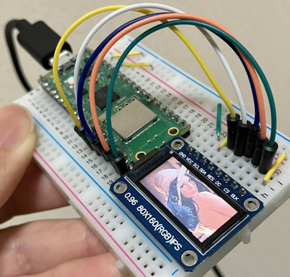](https://x.com/sozoraemon/status/1802295732298498494)

Using a Raspberry Pi Pico Wwith MicroPython and a 0.96" 80x160 ST7735 SPI IPS display - [X](https://x.com/sozoraemon/status/1802295732298498494).

Python Timer Functions: three ways to monitor your code - [Real Python](https://realpython.com/python-timer/).

[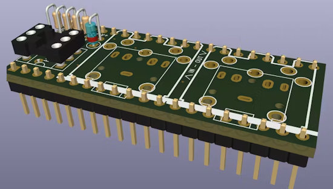](https://www.hackster.io/news/this-raspberry-pi-pico-pack-adds-two-midi-ports-without-ballooning-the-board-s-footprint-03442c272159)

This Raspberry Pi Pico "Pack" adds two MIDI Ports without ballooning the board's footprint - [hackster.io](https://www.hackster.io/news/this-raspberry-pi-pico-pack-adds-two-midi-ports-without-ballooning-the-board-s-footprint-03442c272159).

4 keys to writing modern Python - [InfoWorld](https://www.infoworld.com/article/3648061/4-keys-to-writing-modern-python.html).

[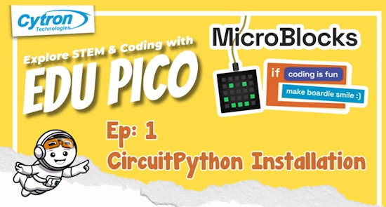](https://www.youtube.com/watch?v=qkwmZTrzoa0)

EDU PICO using MicroBlocks: CircuitPython Installation - [YouTube](https://www.youtube.com/watch?v=qkwmZTrzoa0).

## New

[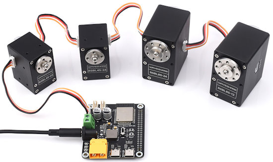](https://www.cnx-software.com/2024/06/14/serial-bus-servo-driver-hat-a-can-drive-up-to-253-servos-simultaneously/)

Serial Bus Servo Driver HAT (A) can drive up to 253 servos simultaneously - [CNX Software](https://www.cnx-software.com/2024/06/14/serial-bus-servo-driver-hat-a-can-drive-up-to-253-servos-simultaneously/).

text - [site](url).

## New Boards Supported by CircuitPython

The number of supported microcontrollers and Single Board Computers (SBC) grows every week. This section outlines which boards have been included in CircuitPython or added to [CircuitPython.org](https://circuitpython.org/).

This week, there were (#/no) new boards added:

- [Board name](url)
- [Board name](url)
- [Board name](url)

*Note: For non-Adafruit boards, please use the support forums of the board manufacturer for assistance, as Adafruit does not have the hardware to assist in troubleshooting.*

Looking to add a new board to CircuitPython? It's highly encouraged! Adafruit has four guides to help you do so:

- [How to Add a New Board to CircuitPython](https://learn.adafruit.com/how-to-add-a-new-board-to-circuitpython/overview)
- [How to add a New Board to the circuitpython.org website](https://learn.adafruit.com/how-to-add-a-new-board-to-the-circuitpython-org-website)
- [Adding a Single Board Computer to PlatformDetect for Blinka](https://learn.adafruit.com/adding-a-single-board-computer-to-platformdetect-for-blinka)
- [Adding a Single Board Computer to Blinka](https://learn.adafruit.com/adding-a-single-board-computer-to-blinka)

## New Learn Guides

[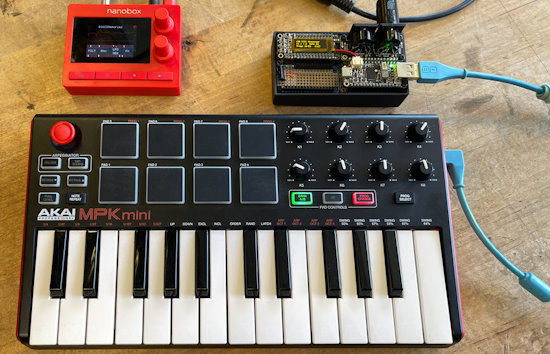](https://learn.adafruit.com/guides/latest)

[USB MIDI Host Messenger](https://learn.adafruit.com/usb-midi-host-messenger) from [John Park](https://learn.adafruit.com/u/johnpark)

## CircuitPython Libraries

The CircuitPython library numbers are continually increasing, while existing ones continue to be updated. Here we provide library numbers and updates!

To get the latest Adafruit libraries, download the [Adafruit CircuitPython Library Bundle](https://circuitpython.org/libraries). To get the latest community contributed libraries, download the [CircuitPython Community Bundle](https://circuitpython.org/libraries).

If you'd like to contribute to the CircuitPython project on the Python side of things, the libraries are a great place to start. Check out the [CircuitPython.org Contributing page](https://circuitpython.org/contributing). If you're interested in reviewing, check out Open Pull Requests. If you'd like to contribute code or documentation, check out Open Issues. We have a guide on [contributing to CircuitPython with Git and GitHub](https://learn.adafruit.com/contribute-to-circuitpython-with-git-and-github), and you can find us in the #help-with-circuitpython and #circuitpython-dev channels on the [Adafruit Discord](https://adafru.it/discord).

You can check out this [list of all the Adafruit CircuitPython libraries and drivers available](https://github.com/adafruit/Adafruit_CircuitPython_Bundle/blob/master/circuitpython_library_list.md). 

The current number of CircuitPython libraries is **487**!

**New Libraries**

Here's this week's new CircuitPython libraries:

  * [adafruit/Adafruit_CircuitPython_DS248x](https://github.com/adafruit/Adafruit_CircuitPython_DS248x)

**Updated Libraries**

Here's this week's updated CircuitPython libraries:

  * [adafruit/Adafruit_CircuitPython_Logging](https://github.com/adafruit/Adafruit_CircuitPython_Logging)
  * [adafruit/Adafruit_CircuitPython_ST7789](https://github.com/adafruit/Adafruit_CircuitPython_ST7789)
  * [adafruit/Adafruit_CircuitPython_DisplayIO_SSD1306](https://github.com/adafruit/Adafruit_CircuitPython_DisplayIO_SSD1306)
  * [jepler/circuitPython_dotstar_featherwing](https://github.com/jepler/circuitPython_dotstar_featherwing)

**Library PyPI Weekly Download Stats**

**Total Library Stats**
  * 147959 PyPI downloads over 328 libraries

**Top 10 Libraries by PyPI Downloads**
  * Adafruit CircuitPython Requests (adafruit-circuitpython-requests): 9433
  * Adafruit CircuitPython BusDevice (adafruit-circuitpython-busdevice): 9432
  * Adafruit CircuitPython ConnectionManager (adafruit-circuitpython-connectionmanager): 8271
  * Adafruit CircuitPython Register (adafruit-circuitpython-register): 2376
  * Adafruit CircuitPython MiniMQTT (adafruit-circuitpython-minimqtt): 1369
  * Adafruit CircuitPython Pixelbuf (adafruit-circuitpython-pixelbuf): 1279
  * Adafruit CircuitPython ADS1x15 (adafruit-circuitpython-ads1x15): 1274
  * Adafruit CircuitPython NeoPixel (adafruit-circuitpython-neopixel): 1228
  * Adafruit CircuitPython Wiznet5k (adafruit-circuitpython-wiznet5k): 1214
  * Adafruit CircuitPython Display Text (adafruit-circuitpython-display-text): 1208

## What’s the CircuitPython team up to this week?

What is the team up to this week? Let’s check in:

**Dan**

This past week, I've been working mostly on debugging and fixing Espressif BLE issues. I've also been testing Melissa's new enhanced version of the [code.circuitpython.org/](https://code.circuitpython.org/) editor, which can read and write files via the REPL, for use on boards that do not present a CIRCUITPY drive.

**Melissa**

This past week, I finished up my changes to the [CircuitPython Code Editor](https://code.circuitpython.org/) and they are now live. This means you can now perform file operations on boards that have no CIRCUITPY drive such as the ESP32 or ESP32-C3 based boards. This will make setting up web workflow much easier as well as giving the ability to upload sound and graphics files.

**Tim**

I have been continuing work on BLE support for Circup / wwshell utility. This week I was able to successfully use the bleak library to send the listdir BLE workflow command and parse the result. It was the first of the commands that I've gotten to work, and now I've got a better idea how the rest need to be implemented. 

**Jeff**

I'm working on understanding the "esp-zigbee-sdk" with the hopes of adding some zigbee functionality to CircuitPython with the ESP32-C6 microcontroller. However, so far I don't have any running code.

**Scott**

I'm mostly out this week because we have family in town. I wrapped up ESP BLE changes and have been following up with more fixes.

**Liz**

This week I worked on two product guides. The first was for the [NeoPixel Breakout](https://learn.adafruit.com/adafruit-neopixel-breakout). This is a tiny breakout with a single NeoPixel on it. It has two JST-SH ports, one for input and one for output, that let you easily wire up a single NeoPixel for your project or debugging needs.

The next guide for the [DS2484 breakout](https://learn.adafruit.com/adafruit-ds2484-i2c-to-1-wire-bus-adapter-breakout). This breakout is a 1-Wire to I2C adapter, letting you read your 1-Wire sensors over I2C. This makes interfacing with them a lot easier. I wrote a CircuitPython library for the DS2484 and included documentation for it in the guide.

## Upcoming Events

The next MicroPython Meetup in Melbourne will be on June 26 – [Meetup](https://www.meetup.com/micropython-meetup/events). You can see recordings of previous meetings on [YouTube](https://www.youtube.com/@MicroPythonOfficial). 

EuroPython is the oldest and longest running volunteer-led Python programming conference on the planet. This year it will be held July 8-14 in Prague - [EuroPython 2024](https://ep2024.europython.eu/).

PyOhio is being held July 27-28, 2024 in Cleveland, Ohio - [PyOhio](https://www.pyohio.org/2024/).

Espressif DevCon24 will be held Sep 3-5, 13:00-18:00 CEST. Call for presentations now - [Espressif](https://devcon.espressif.com/).

Maker Faire Bay Area returns to Mare Island Naval Shipyard on October 18-20, 2024 - [Maker Faire](https://makerfaire.com/bay-area/).

**Send Your Events In**

If you know of virtual events or upcoming events, please let us know via email to cpnews(at)adafruit(dot)com.

## Latest Releases

CircuitPython's stable release is [9/0/5](https://github.com/adafruit/circuitpython/releases/latest) and its unstable release is [9.1.0-beta.3](https://github.com/adafruit/circuitpython/releases). New to CircuitPython? Start with our [Welcome to CircuitPython Guide](https://learn.adafruit.com/welcome-to-circuitpython).

[20240618](https://github.com/adafruit/Adafruit_CircuitPython_Bundle/releases/latest) is the latest Adafruit CircuitPython library bundle.

[20240617](https://github.com/adafruit/CircuitPython_Community_Bundle/releases/latest) is the latest CircuitPython Community library bundle.

[v1.23.0](https://micropython.org/download) is the latest MicroPython release. Documentation for it is [here](http://docs.micropython.org/en/latest/pyboard/).

[3.12.4](https://www.python.org/downloads/) is the latest Python release. The latest pre-release version is [3.13.0b2](https://www.python.org/download/pre-releases/).

[3,941 Stars](https://github.com/adafruit/circuitpython/stargazers) Like CircuitPython? [Star it on GitHub!](https://github.com/adafruit/circuitpython)

## Call for Help -- Translating CircuitPython is now easier than ever

[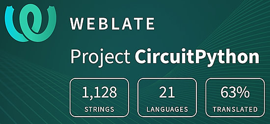](https://hosted.weblate.org/engage/circuitpython/)

One important feature of CircuitPython is translated control and error messages. With the help of fellow open source project [Weblate](https://weblate.org/), we're making it even easier to add or improve translations. 

Sign in with an existing account such as GitHub, Google or Facebook and start contributing through a simple web interface. No forks or pull requests needed! As always, if you run into trouble join us on [Discord](https://adafru.it/discord), we're here to help.

## 38,337 Thanks

The Adafruit Discord community, where we do all our CircuitPython development in the open, reached over 38,337 humans - thank you! Adafruit believes Discord offers a unique way for Python on hardware folks to connect. Join today at [https://adafru.it/discord](https://adafru.it/discord).

## ICYMI - In case you missed it

Python on hardware is the Adafruit Python video-newsletter-podcast! The news comes from the Python community, Discord, Adafruit communities and more and is broadcast on ASK an ENGINEER Wednesdays. The complete Python on Hardware weekly videocast [playlist is here](https://www.youtube.com/playlist?list=PLjF7R1fz_OOXRMjM7Sm0J2Xt6H81TdDev). The video podcast is on [iTunes](https://itunes.apple.com/us/podcast/python-on-hardware/id1451685192?mt=2), [YouTube](http://adafru.it/pohepisodes), [Instagram](https://www.instagram.com/adafruit/channel/)), and [XML](https://itunes.apple.com/us/podcast/python-on-hardware/id1451685192?mt=2).

[The weekly community chat on Adafruit Discord server CircuitPython channel - Audio / Podcast edition](https://itunes.apple.com/us/podcast/circuitpython-weekly-meeting/id1451685016) - Audio from the Discord chat space for CircuitPython, meetings are usually Mondays at 2pm ET, this is the audio version on [iTunes](https://itunes.apple.com/us/podcast/circuitpython-weekly-meeting/id1451685016), Pocket Casts, [Spotify](https://adafru.it/spotify), and [XML feed](https://adafruit-podcasts.s3.amazonaws.com/circuitpython_weekly_meeting/audio-podcast.xml).

## Contribute

The CircuitPython Weekly Newsletter is a CircuitPython community-run newsletter emailed every Monday. The complete [archives are here](https://www.adafruitdaily.com/category/circuitpython/). It highlights the latest CircuitPython related news from around the web including Python and MicroPython developments. To contribute, edit next week's draft [on GitHub](https://github.com/adafruit/circuitpython-weekly-newsletter/tree/gh-pages/_drafts) and [submit a pull request](https://help.github.com/articles/editing-files-in-your-repository/) with the changes. You may also tag your information on Twitter with #CircuitPython. 

Join the Adafruit [Discord](https://adafru.it/discord) or [post to the forum](https://forums.adafruit.com/viewforum.php?f=60) if you have questions.
