View this email in your browser. **Warning: Flashing Imagery**

Welcome to the latest Python on Microcontrollers newsletter! As more Northern Hemisphere Python folks take their vacations, the Raspberry Pi folks are garnering additional headlines. EuroPython is coming in a week and it'll be spectacular. I packed the In the News section this week for you to round things out. - *Anne Barela, Editor*

We're on [Discord](https://discord.gg/HYqvREz), [Twitter](https://twitter.com/search?q=circuitpython&src=typed_query&f=live), and for past newsletters - [view them all here](https://www.adafruitdaily.com/category/circuitpython/). If you're reading this on the web, [subscribe here](https://www.adafruitdaily.com/). Here's the news this week:

## Which Raspberry Pi Model To Buy In 2024: A Complete Guide

[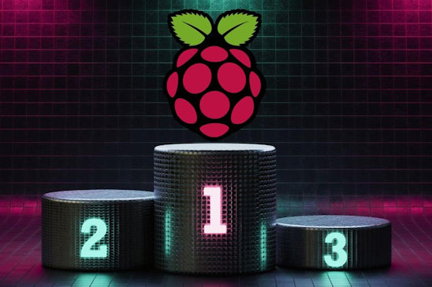](https://raspberrytips.com/best-raspberry-pi-model/)

With so many Raspberry Pi buying options available, choosing the right one can be challenging. RaspberryTips explains the most important things to consider to help make the right choice for ones needs. - [RaspberryTips](https://raspberrytips.com/best-raspberry-pi-model/).

## Raspberry Pi Connect: Remote Shell Access and Support For Older Devices

Raspberry Pi is bringing Raspberry Pi Connect to even more devices. A new release includes remote shell access and support for all Raspberry Pi computers, whether they’re running Raspberry Pi OS 32-bit or 64-bit, going all the way back to the 2012 Raspberry Pi 1. This includes Raspberry Pi OS Lite, as well as versions of Raspberry Pi OS with the desktop.   The new remote shell feature in Raspberry Pi Connect enables you to launch a shell on your Raspberry Pi device from a web browser, over a secure connection (similar to SSH but more secure) - [Raspberry Pi News](https://www.raspberrypi.com/news/raspberry-pi-connect-remote-shell-access-and-support-for-older-devices/).

A video review by Jeff Geerling - [YouTube](https://www.youtube.com/watch?v=Gkw1ZhShkiw).

## Maker of RStudio Launches New R and Python IDE

Posit, formerly RStudio, has released a beta of Positron, a ‘next generation’ data science development environment based on Visual Studio Code specifically for both R and Python - [InfoWorld](https://www.infoworld.com/article/3715702/maker-of-rstudio-launches-new-r-and-python-ide.html).

## A Terminal-Based Bluetooth Manager for Linux

[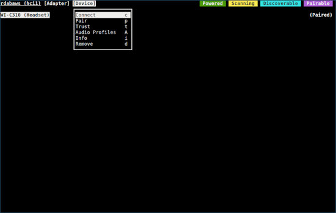](https://darkhz.github.io/bluetuith/index.html)

bluetuith is a TUI-based bluetooth connection manager, which can interact with bluetooth adapters and devices. It aims to be a replacement to most bluetooth managers, like blueman - [GitHub](https://darkhz.github.io/bluetuith/index.html).

## Raspberry Pi 5 Patch Boosts Performance Up To 18%

[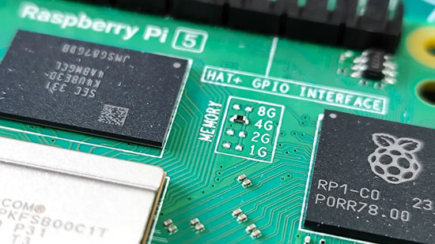](https://www.tomshardware.com/raspberry-pi/raspberry-pi-5-patch-boosts-performance-up-to-18-via-numa-emulation-geekbench-tests-reveal-gains-in-both-single-and-multi-threaded-performance)

Raspberry Pi 5 patch boosts performance up to 18% via Non-Uniform Memory Access (NUMA) emulation for ARM64. The patch details were posted to a [mailing list](https://lore.kernel.org/lkml/20240625125803.38038-1-tursulin@igalia.com/), and it appears to be around 100 lines in length - [Tom's Hardware](https://www.tomshardware.com/raspberry-pi/raspberry-pi-5-patch-boosts-performance-up-to-18-via-numa-emulation-geekbench-tests-reveal-gains-in-both-single-and-multi-threaded-performance).

## How To Get Started With ESP-NOW

DigiKey has a tutorial on using ESP-NOW, a connectionless communication protocol developed by Espressif for transmitting packages between ESP32 boards without needing to establish a WiFi connection - [DigiKey](https://www.digikey.com/en/maker/tutorials/2024/how-to-get-started-with-esp-now).

## Feather of the Day Launched

[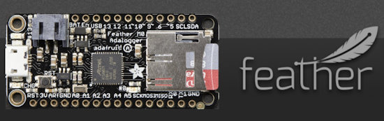](https://blog.adafruit.com/category/feather-of-the-day/)

Feather of the Day celebrates the Adafruit Feather ecosystem of programmable boards. Each day a new Feather board will be highlighted - [Adafruit Blog](https://blog.adafruit.com/category/feather-of-the-day/).

## This Week's Python Streams

Python on Hardware is all about building a cooperative ecosphere which allows contributions to be valued and to grow knowledge. Below are the streams within the last week focusing on the community.

**CircuitPython Deep Dive Stream**

[Last Friday](https://youtube.com/live/RTwO5RsG39U), Scott streamed work on Stemma G0 I2C Target.

You can see the latest video and past videos on the Adafruit YouTube channel under the Deep Dive playlist - [YouTube](https://www.youtube.com/playlist?list=PLjF7R1fz_OOXBHlu9msoXq2jQN4JpCk8A).

**CircuitPython Parsec**

John Park’s CircuitPython Parsec this week is on the round GC9A01 display pinout - [Adafruit Blog](https://blog.adafruit.com/2024/06/28/john-parks-circuitpython-parsec-round-gc9a01-display-pinout-adafruit-circuitpython/) and [YouTube](https://youtu.be/KOkcSn23KH0).

Catch all the episodes in the [YouTube playlist](https://www.youtube.com/playlist?list=PLjF7R1fz_OOWFqZfqW9jlvQSIUmwn9lWr).

**The Bootloader**

[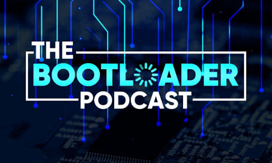](https://thebootloader.net/)

A monthly podcast loading you up with news, project updates, and product talk from the CircuitPython and maker communities. Hosted by Paul Cutler and Tod Kurt.

In the July 1st episode, Paul Cutler and Tod Kurt discuss new tutorial videos from Professor John Gallaugher about using CircuitPython with PyCharm and how to use circup to update CircuitPython libraries.  In addition to other topics, the show also includes an interview with Justin Myers, the author of the new CircuitPython library, ConnectionManager - [The Bootloader](https://thebootloader.net/).

**CircuitPython Weekly Meeting**

CircuitPython Weekly Meeting for June 24, 2024 ([notes](https://github.com/adafruit/adafruit-circuitpython-weekly-meeting/blob/main/2024/2024-06-24.md)) [on YouTube](https://youtu.be/h5VQNGV5Q3U).

## Project of the Week: The SPOKE Capacitive Touch Board

Tom Fox's SPOKE board is an easy way to add up to 26 touch sensors to projects for interaction. Anything with capacitive potential can be connected to the pins and used to control computer inputs. Create your own USB MIDI device, game controller, key mapper or other computer interface device by attaching metallic objects, conductive inks, conductive threads, fruits, plants, vegetables, cutlery, car keys, mushrooms etc. or use it as a standalone device. The custom circuit board houses a Raspberry Pi Pico. USB MIDI and keyboard are accommodated via CircuitPython code on [GitHub](https://github.com/Tom-Vulpes/Spoke/tree/main) - [Project Website](https://www.spokeboard.com/), [YouTube](https://youtu.be/8bxbrVFYZEk), and [Adafruit Blog](https://blog.adafruit.com/2024/06/26/a-capacitive-touch-board-for-the-raspberry-pi-pico/).

## Popular Last Week

What was the most popular, most clicked link, in [last week's newsletter](https://www.adafruitdaily.com/2024/06/24/python-on-microcontrollers-newsletter-code-circuitpython-org-the-best-python-cheat-sheet-and-much-more-circuitpython-python-micropython-thepsf-raspberry_pi/)? [The Best Python Cheat Sheet](https://kieranholland.com/best-python-cheat-sheet/).

## New Notes from Adafruit Playground

[Adafruit Playground](https://adafruit-playground.com/) is a new place for the community to post their projects and other making tips/tricks/techniques. Ad-free, it's an easy way to publish your work in a safe space for free.

## News From Around the Web

Using AI to automatically drop hats onto New Yorkers - [Adafruit Blog](https://blog.adafruit.com/2024/06/24/i-am-using-ai-to-automatically-drop-hats-onto-new-yorkers-j_stonemountain/) and [dropofahat.zone](https://dropofahat.zone/).

[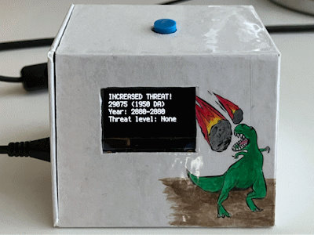](https://blog.adafruit.com/2024/06/25/a-potential-asteroid-impact-warning-device-circuitpython-space/)

Len Popp built a device to warn of potential Earth-threatening asteroids. It monitors NASA JPL’s Sentry web service using a Raspberry Pi Pico W and CircuitPython - [Adafruit Blog](https://blog.adafruit.com/2024/06/25/a-potential-asteroid-impact-warning-device-circuitpython-space/), [lenp.net](https://lenp.net/projects/asentry/) and [GitHub](https://github.com/Len42/asentry-gadget/blob/main/firmware/code.py).

[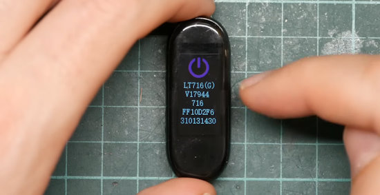](https://youtu.be/sv58aPvIonw?feature=shared)

Porting Python to a terrible $3 smartwatch - [YouTube](https://youtu.be/sv58aPvIonw?feature=shared).

[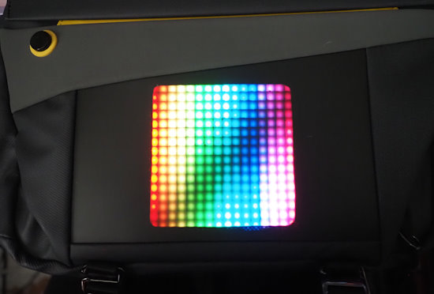](https://chebe.dreamwidth.org/150419.html)

A Divoom Pixoo LED display replacement with MicroPython - [chebe.dreamwidth.org](https://chebe.dreamwidth.org/150419.html).

The ePiPod is a reimagined take on the iPod that's powered by a Raspberry Pi and Python - [XDA](https://www.xda-developers.com/epipod-raspberry-pi/).

[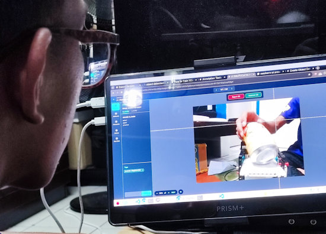](https://x.com/sidikalamini/status/1804561109971845187)

Sortify is an award-winning student project featuring automated waste sorting using Seeed Studio Wio Terminal, Raspberry Pi + BuildHAT, LEGO
Mindstorms, Ultralytics YOLOv8, Roboflow for data labeling, Python, Adafruit CircuitPython, Grafana, and InfluxDB - [X](https://x.com/sidikalamini/status/1804561109971845187).

[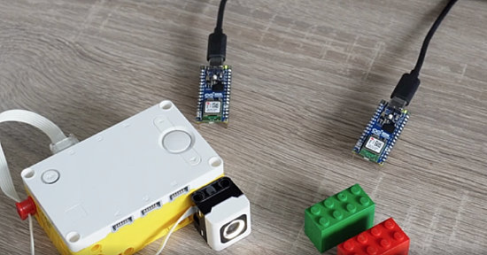](https://github.com/adafruit/circuitpython-weekly-newsletter/edit/gh-pages/_drafts/2024-07-01-draft.md)

Connectionless messaging via Bluetooth Low Energy (BLE) with MicroPython - [GitHub](https://github.com/adafruit/circuitpython-weekly-newsletter/edit/gh-pages/_drafts/2024-07-01-draft.md).

[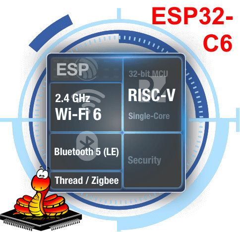](https://github.com/micropython/micropython/pull/11869#issuecomment-2191349221)

The last known issue for the ESP32-C6 implementation of MicroPython has been resolved - [GitHub](https://github.com/micropython/micropython/pull/11869#issuecomment-2191349221).

[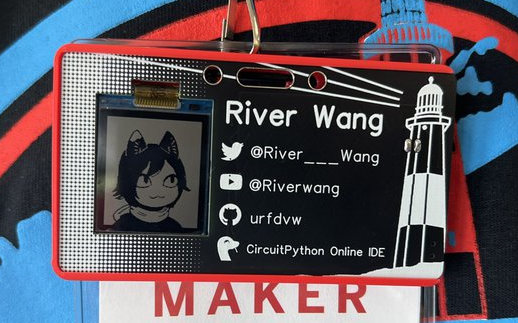](https://hackaday.io/project/196639-cardtuber)

CardTuber is an electronic business card featuring an animated avatar coded in CircuitPython. It doubles as a maker badge for the Long Island Maker Faire. There is a MIC that picks up the  volume, then the avatar will speak when the wearer speak - [Hackaday](https://hackaday.io/project/196639-cardtuber) via [X](https://x.com/River___Wang/status/1806688689717698930).

[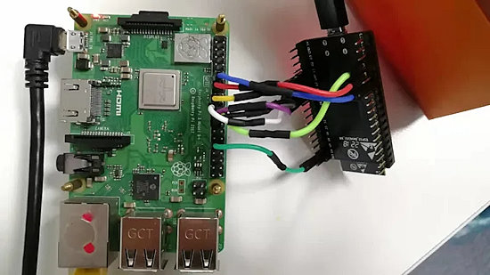](https://hackaday.com/2024/06/25/esp-hosted-turns-esp32-into-linux-wifi-bt-adapter/)

ESP-HOSTED turns an ESP32 into a Linux WiFi/Bluetooth adapter - [Hackaday](https://hackaday.com/2024/06/25/esp-hosted-turns-esp32-into-linux-wifi-bt-adapter/).

[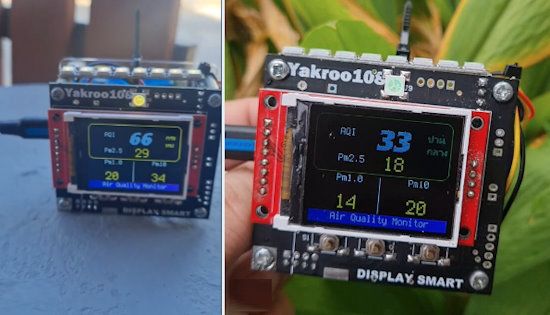](https://x.com/Yakroo5077/status/1806279109942612097)

An air quality monitor using an RP2040 and CircuitPython - [X](https://x.com/Yakroo5077/status/1806279109942612097) and [YouTube](https://www.youtube.com/watch?v=3YK5eGo0i-I).

[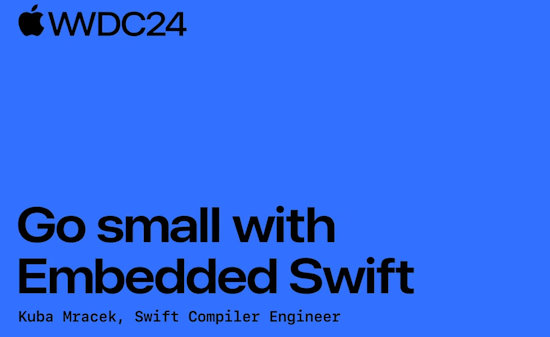](https://www.youtube.com/watch?v=LqxbsADqDI4)

WWDC24 video: Go Small with Embedded Swift. The description includes links to resources - [YouTube](https://www.youtube.com/watch?v=LqxbsADqDI4).

Cyberfly, a Web 3.0 platform, releases Cyberfly MicroPython firmware to power microcontrollers like the ESP32 - [X](https://x.com/cyberfly_io/status/1782728353684017617) and [GitHub](https://github.com/cyberfly-io/cyberfly-micropython).

[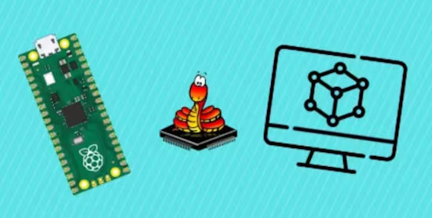](https://www.hackster.io/Shilleh/raspberry-pi-pico-pico-w-free-simulator-c078b3)

Raspberry Pi Pico/Pico W free simulator: Wokwi - [hackster.io](https://www.hackster.io/Shilleh/raspberry-pi-pico-pico-w-free-simulator-c078b3).

[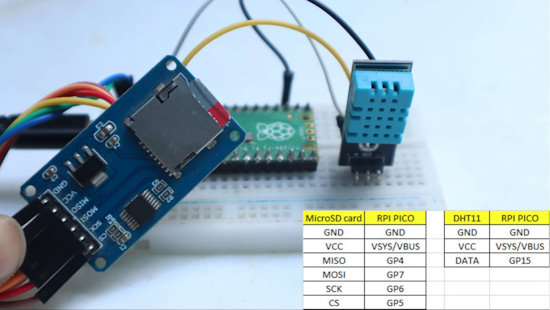](https://www.youtube.com/watch?v=4PfAmq6lInY)

Data Logging with Raspberry Pi Pico and Micro SD Card using CircuitPython - [YouTube](https://www.youtube.com/watch?v=4PfAmq6lInY).

[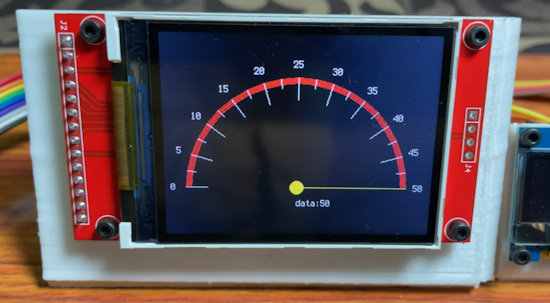](https://www.youtube.com/watch?v=9DIhCJar7GM)

Custom gauges using a TFT 240×320 ILI9341 display, Raspberry Pi Pico and CircuitPython - [YouTube](https://www.youtube.com/watch?v=9DIhCJar7GM).

[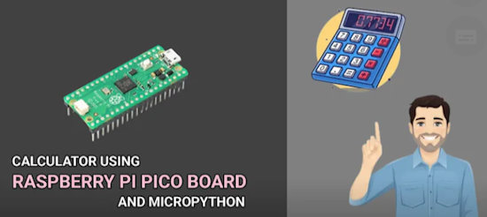](https://www.youtube.com/watch?v=SQfAtVhw-Hk)

Making a calculator using Raspberry Pi Pico and MicroPython - [YouTube](https://www.youtube.com/watch?v=SQfAtVhw-Hk).

[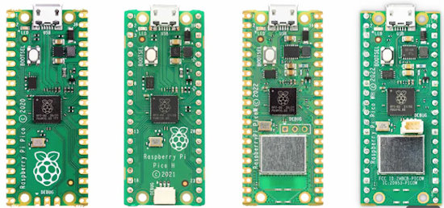](https://www.youtube.com/watch?v=CowvZXdu-0I)

Raspberry Pi Pico, get started and examples LEDs, PWM and ADC using MicroPython - [YouTube](https://www.youtube.com/watch?v=CowvZXdu-0I).

Python FIFO Buffer Class for Audio – an Algorithm - [HackerNoon](https://hackernoon.com/python-fifo-buffer-class-for-audio-an-algorithm?ref=hackernoon.com).

## New

[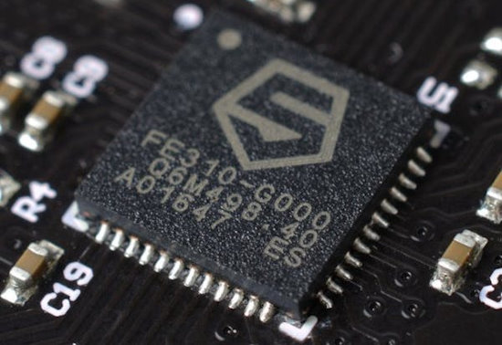](https://www.hackster.io/news/sifive-unveils-its-fourth-generation-essential-risc-v-core-range-from-32-bit-mcus-to-64-bit-cpus-f33a5d9d0d8c)

SiFive Unveils Its Fourth-Generation "Essential" RISC-V Core Range — From 32-Bit MCUs to 64-Bit CPUs - [hackster.io](https://www.hackster.io/news/sifive-unveils-its-fourth-generation-essential-risc-v-core-range-from-32-bit-mcus-to-64-bit-cpus-f33a5d9d0d8c).

[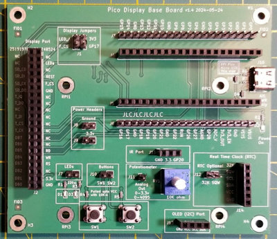](https://www.cnx-software.com/2024/06/22/the-pico-display-base-board-offers-a-simpler-way-to-create-raspberry-pi-pico-lcd-projects/)

The Pico Display Base Board offers a simpler way to create Raspberry Pi Pico LCD projects - [CNX Software](https://www.cnx-software.com/2024/06/22/the-pico-display-base-board-offers-a-simpler-way-to-create-raspberry-pi-pico-lcd-projects/).

## New Boards Supported by CircuitPython

The number of supported microcontrollers and Single Board Computers (SBC) grows every week. This section outlines which boards have been included in CircuitPython or added to [CircuitPython.org](https://circuitpython.org/).

This week, there were no new boards added but several are in progress.

*Note: For non-Adafruit boards, please use the support forums of the board manufacturer for assistance, as Adafruit does not have the hardware to assist in troubleshooting.*

Looking to add a new board to CircuitPython? It's highly encouraged! Adafruit has four guides to help you do so:

- [How to Add a New Board to CircuitPython](https://learn.adafruit.com/how-to-add-a-new-board-to-circuitpython/overview)
- [How to add a New Board to the circuitpython.org website](https://learn.adafruit.com/how-to-add-a-new-board-to-the-circuitpython-org-website)
- [Adding a Single Board Computer to PlatformDetect for Blinka](https://learn.adafruit.com/adding-a-single-board-computer-to-platformdetect-for-blinka)
- [Adding a Single Board Computer to Blinka](https://learn.adafruit.com/adding-a-single-board-computer-to-blinka)

## New Learn Guides

[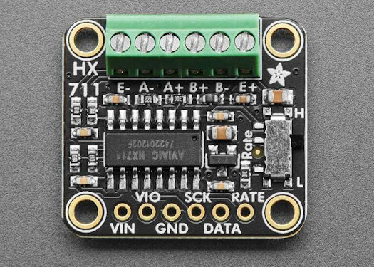](https://learn.adafruit.com/guides/latest)

[Adafruit HX711 24-bit ADC](https://learn.adafruit.com/adafruit-hx711-24-bit-adc) from [Liz Clark](https://learn.adafruit.com/u/BlitzCityDIY)

## Updated Learn Guides

[Adafruit UPDI Friend](https://learn.adafruit.com/adafruit-updi-friend)

## CircuitPython Libraries

The CircuitPython library numbers are continually increasing, while existing ones continue to be updated. Here we provide library numbers and updates!

To get the latest Adafruit libraries, download the [Adafruit CircuitPython Library Bundle](https://circuitpython.org/libraries). To get the latest community contributed libraries, download the [CircuitPython Community Bundle](https://circuitpython.org/libraries).

If you'd like to contribute to the CircuitPython project on the Python side of things, the libraries are a great place to start. Check out the [CircuitPython.org Contributing page](https://circuitpython.org/contributing). If you're interested in reviewing, check out Open Pull Requests. If you'd like to contribute code or documentation, check out Open Issues. We have a guide on [contributing to CircuitPython with Git and GitHub](https://learn.adafruit.com/contribute-to-circuitpython-with-git-and-github), and you can find us in the #help-with-circuitpython and #circuitpython-dev channels on the [Adafruit Discord](https://adafru.it/discord).

You can check out this [list of all the Adafruit CircuitPython libraries and drivers available](https://github.com/adafruit/Adafruit_CircuitPython_Bundle/blob/master/circuitpython_library_list.md). 

The current number of CircuitPython libraries is **488**!

**New Libraries**

Here's this week's new CircuitPython libraries:

  * [adafruit/Adafruit_CircuitPython_HX711](https://github.com/adafruit/Adafruit_CircuitPython_HX711)

**Updated Libraries**

Here's this week's updated CircuitPython libraries:

  * [adafruit/Adafruit_CircuitPython_Logging](https://github.com/adafruit/Adafruit_CircuitPython_Logging)
  * [adafruit/Adafruit_CircuitPython_Requests](https://github.com/adafruit/Adafruit_CircuitPython_Requests)
  * [elpekenin/circuitpython_toml](https://github.com/elpekenin/circuitpython_toml)

**Library PyPI Weekly Download Stats**

**Total Library Stats**
  * 143862 PyPI downloads over 330 libraries

**Top 10 Libraries by PyPI Downloads**
  * Adafruit CircuitPython BusDevice (adafruit-circuitpython-busdevice): 11465
  * Adafruit CircuitPython Requests (adafruit-circuitpython-requests): 11336
  * Adafruit CircuitPython ConnectionManager (adafruit-circuitpython-connectionmanager): 9922
  * Adafruit CircuitPython Register (adafruit-circuitpython-register): 2545
  * Adafruit CircuitPython DHT (adafruit-circuitpython-dht): 1719
  * Adafruit CircuitPython Pixelbuf (adafruit-circuitpython-pixelbuf): 1235
  * Adafruit CircuitPython Display Text (adafruit-circuitpython-display-text): 1209
  * Adafruit CircuitPython ADS1x15 (adafruit-circuitpython-ads1x15): 1197
  * Adafruit CircuitPython ESP32SPI (adafruit-circuitpython-esp32spi): 1175
  * Adafruit CircuitPython MiniMQTT (adafruit-circuitpython-minimqtt): 1101

## What’s the CircuitPython team up to this week?

What is the team up to this week? Let’s check in:

**Dan**

Last week I fixed three CircuitPython Espressif BLE bugs. Espressif BLE is now working well with multiple BLE peripherals. There's one more bug to fix related to advertising the BLE workflow that's causing big delays on ESP32. The number of CircuitPython 9.1.0 bugs is again getting close to zero.

**Tim**

This week I looked into an issue with the device specific board stubs and worked on a fix that allows them to be used with Python 3.9. I have also been continuing work on integrating the BLE workflow support into Circup / wwshell. I incorporated the first few basic PoC bleak scripts into the wwshell commands, right now listdir and read are implemented and working in my branch.

**Jeff**

I've spent the past few weeks learning about Zigbee. While the code I wrote as a result isn't suitable for including in CircuitPython, I did put the code in a [branch](https://github.com/adafruit/circuitpython/compare/main...jepler:zigbee-prototype?expand=1).

I used this prototype code on an ESP32-C6 devkit together with an Espressif Zigbee "light switch" built with ESP-IDF to toggle an LED on and off. It's a simple demo, but it does show that there's potential to integrate Zigbee or other protocols, based on 802.15.4, into CircuitPython.

**Scott**

I've been out off and on because family has been in town. I have been doing some flash debugging with the Saleae and tweaked [their Simple Parallel analyzer](https://github.com/saleae/simple-parallel-analyzer) to [depend on a chip select signal](https://github.com/tannewt/simple-parallel-analyzer-with-cs). This improves analysis of captured QSPI flash traffic by [the higher level analyzer](https://github.com/adafruit/Logic2-SPIFlash/pull/10) because it had to guess when transactions ended based on clock gaps.

**Liz**

This week I worked on a guide for the [HX711 breakout](https://learn.adafruit.com/adafruit-hx711-24-bit-adc). It is a 24-bit ADC for strain gauges. I wrote a CircuitPython library to interface with the chip as well.

I've also been working on a PCB design for the Ikea Vindriktning air quality monitor. Ladyada discussed this a bit on her [Desk of Ladyada stream](https://www.youtube.com/live/viokTEHmqZs). We're putting together a PCB with an ESP32-S2 that will fit inside the housing and connect to the PM1006 sensor inside. To check the component clearance, I 3D printed the board with the components. You can do this with Eagle and Fusion360 by following along with [the guide by the Ruiz Brothers](https://learn.adafruit.com/how-to-convert-eagle-pcbs-to-3d-models-in-fusion-360).

## Upcoming Events

EuroPython is the oldest and longest running volunteer-led Python programming conference on the planet. This year it will be held July 8-14 in Prague - [EuroPython 2024](https://ep2024.europython.eu/).

The next MicroPython Meetup in Melbourne will be on July 24 – [Meetup](https://www.meetup.com/micropython-meetup/events). You can see recordings of previous meetings on [YouTube](https://www.youtube.com/@MicroPythonOfficial). The June 2024 Meeting Notes are [here](https://melbournemicropythonmeetup.github.io/June-2024-Meetup/).

PyOhio is being held July 27-28, 2024 in Cleveland, Ohio - [PyOhio](https://www.pyohio.org/2024/).

Espressif DevCon24 will be held Sep 3-5, 13:00-18:00 CEST. Call for presentations now - [Espressif](https://devcon.espressif.com/).

Maker Faire Bay Area returns to Mare Island Naval Shipyard on October 18-20, 2024 - [Maker Faire](https://makerfaire.com/bay-area/).

**Send Your Events In**

If you know of virtual events or upcoming events, please let us know via email to cpnews(at)adafruit(dot)com.

## Latest Releases

CircuitPython's stable release is [9.0.5](https://github.com/adafruit/circuitpython/releases/latest) and its unstable release is [9/.1.0-beta.3](https://github.com/adafruit/circuitpython/releases). New to CircuitPython? Start with our [Welcome to CircuitPython Guide](https://learn.adafruit.com/welcome-to-circuitpython).

[20240625](https://github.com/adafruit/Adafruit_CircuitPython_Bundle/releases/latest) is the latest Adafruit CircuitPython library bundle.

[20240625](https://github.com/adafruit/CircuitPython_Community_Bundle/releases/latest) is the latest CircuitPython Community library bundle.

[v1.23.0](https://micropython.org/download) is the latest MicroPython release. Documentation for it is [here](http://docs.micropython.org/en/latest/pyboard/).

[3.12.4](https://www.python.org/downloads/) is the latest Python release. The latest pre-release version is [3.13.0b3](https://www.python.org/download/pre-releases/).

[3,953 Stars](https://github.com/adafruit/circuitpython/stargazers) Like CircuitPython? [Star it on GitHub!](https://github.com/adafruit/circuitpython)

## Call for Help -- Translating CircuitPython is now easier than ever

[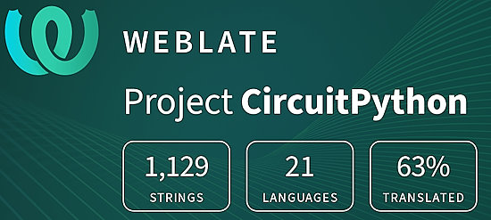](https://hosted.weblate.org/engage/circuitpython/)

One important feature of CircuitPython is translated control and error messages. With the help of fellow open source project [Weblate](https://weblate.org/), we're making it even easier to add or improve translations. 

Sign in with an existing account such as GitHub, Google or Facebook and start contributing through a simple web interface. No forks or pull requests needed! As always, if you run into trouble join us on [Discord](https://adafru.it/discord), we're here to help.

## 39,069 Thanks

The Adafruit Discord community, where we do all our CircuitPython development in the open, reached over 39,069 humans - thank you! Adafruit believes Discord offers a unique way for Python on hardware folks to connect. Join today at [https://adafru.it/discord](https://adafru.it/discord).

## ICYMI - In case you missed it

Python on hardware is the Adafruit Python video-newsletter-podcast! The news comes from the Python community, Discord, Adafruit communities and more and is broadcast on ASK an ENGINEER Wednesdays. The complete Python on Hardware weekly videocast [playlist is here](https://www.youtube.com/playlist?list=PLjF7R1fz_OOXRMjM7Sm0J2Xt6H81TdDev). The video podcast is on [iTunes](https://itunes.apple.com/us/podcast/python-on-hardware/id1451685192?mt=2), [YouTube](http://adafru.it/pohepisodes), [Instagram](https://www.instagram.com/adafruit/channel/)), and [XML](https://itunes.apple.com/us/podcast/python-on-hardware/id1451685192?mt=2).

[The weekly community chat on Adafruit Discord server CircuitPython channel - Audio / Podcast edition](https://itunes.apple.com/us/podcast/circuitpython-weekly-meeting/id1451685016) - Audio from the Discord chat space for CircuitPython, meetings are usually Mondays at 2pm ET, this is the audio version on [iTunes](https://itunes.apple.com/us/podcast/circuitpython-weekly-meeting/id1451685016), Pocket Casts, [Spotify](https://adafru.it/spotify), and [XML feed](https://adafruit-podcasts.s3.amazonaws.com/circuitpython_weekly_meeting/audio-podcast.xml).

## Contribute

The CircuitPython Weekly Newsletter is a CircuitPython community-run newsletter emailed every Monday. The complete [archives are here](https://www.adafruitdaily.com/category/circuitpython/). It highlights the latest CircuitPython related news from around the web including Python and MicroPython developments. To contribute, edit next week's draft [on GitHub](https://github.com/adafruit/circuitpython-weekly-newsletter/tree/gh-pages/_drafts) and [submit a pull request](https://help.github.com/articles/editing-files-in-your-repository/) with the changes. You may also tag your information on Twitter with #CircuitPython. 

Join the Adafruit [Discord](https://adafru.it/discord) or [post to the forum](https://forums.adafruit.com/viewforum.php?f=60) if you have questions.
