View this email in your browser. **Warning: Flashing Imagery**

Welcome to the latest Python on Microcontrollers newsletter! What happened to "quiet Summer"? So much has been happening! CircuitPython 9.1.0 final is out now and packed with features, including floppy support and Bluetooth on ESP32. A big week in Arduino's life: they embrace the industry I2C standard (great) but the embedded OS they use, Mbed, will go end-of-life (um). There is so much more, please feel free to browse through for topics of interest, and I hope you have a great week - *Anne Barela, Editor*

We're on [Discord](https://discord.gg/HYqvREz), [Twitter](https://twitter.com/search?q=circuitpython&src=typed_query&f=live), and for past newsletters - [view them all here](https://www.adafruitdaily.com/category/circuitpython/). If you're reading this on the web, [subscribe here](https://www.adafruitdaily.com/). Here's the news this week:

## CircuitPython 9.1.0 Released!

CircuitPython 9.1.0 is now the latest revision of CircuitPython, and is the new stable release. The added features feel like a major release (see below) - [Adafruit Blog](https://blog.adafruit.com/2024/07/10/circuitpython-9-1-0-released/) and [Release Notes](https://github.com/adafruit/circuitpython/releases/tag/9.1.0).

**Notable changes since 9.0.0**

**INCOMPATIBILITY WARNINGS**
- API changes to `floppyio`.
- String values in `settings.toml` must be quoted.

**AUDIO**
- RP2040 `I2SOut` supports `BLCK` and `LRCLK` in either order.
- ESP32-S3 supports `audiomp3`.
- `audiomp3` supports streaming from HTTP servers.

**BLUETOOTH**
- BLE GATT server support on Espressif.
- Pairing and bonding support on Espressif.

**BUILT-IN MODULES**
- Enhance `collections.deque` functionality.
- Add `keypad_demux.DemuxKeyMatrix`: use multiplexer for one side of a keypad matrix.
- Add integration-based debouncing to `keypad`.
- `supervisor.Runtime.serial_bytes_available` now returns a count instead of a bool.
- Incompatible change: `floppyio` improvements, including API changes.
- Espressif: `microcontroller.cpu.frequency` is settable.

**GRAPHICS**
- `fourwire.FourWire`: `chip_select` pin is now optional.
- `picodvi` now supports 640×240 and 800×240 resolutions.
- Enable `_eve` on Espressif boards with more than 4MB flash.

**INTERNAL**
- Espressif: update to ESP-IDF v5.2.2.
- Espressif: Change task-switching quantum to 1 millisecond from 10 milliseconds.

**NETWORKING**
- Implement `ssl` module for anything that provides `socket`.
- Add stream protocol support to `SSLSocket`.

**PORTS**
- New port for `renode` hardware simulator.

**POWER**
- Enable deep sleep on all supported Espressif chips.

**SUPERVISOR**
- String values in `settings.toml` must be quoted.

**USB**
- `max3421e` USB host support.
- Allow user-specified names for `usb_midi` interfaces and jacks.

## Arduino Embraces Maker I2C Bus Standard Connections

)

Arduino has joined with SparkFun, Adafruit, and others in embracing a standard connector for I2C bus connections. Called [Qwiic by SparkFun and Stemma QT by Adafruit](https://github.com/adafruit/awesome-stemma/blob/master/awesome-stemma-qt.md), this allows for solderless connections to dozens of compatible boards including sensors, indicators and controls. Dubbed Modulino® by Arduino, there are a number of I2C boards coming out - [Arduino Blog](https://blog.arduino.cc/2024/07/11/kickstart-your-tech-journey-with-the-new-arduino-plug-and-make-kit/).

## Mbed Platform End-of-Life Announced

[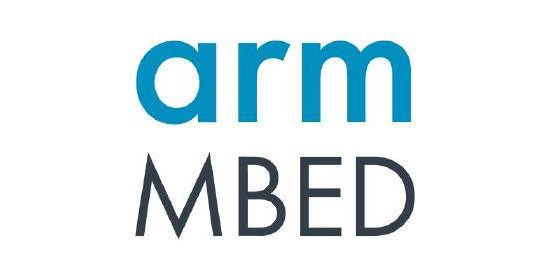](https://os.mbed.com/blog/entry/Important-Update-on-Mbed/)

Arm Mbed has announced the following on the [mBed OS Blog](https://os.mbed.com/blog/entry/Important-Update-on-Mbed/):

- The Mbed platform and OS will reach end of life in July 2026, when the Mbed website will be archived and it will no longer be possible to build projects in our online tools
- The device software - Mbed OS - is open source and will remain publicly available, but is no longer actively maintained by Arm
- The Mbed TLS project is unaffected by this announcement and continues to be supported as part of the TrustedFirmware community project.

Also: End of the Line for Arm's Mbed OS, noting that Arduino was a heavy adopter of Mbed OS for its products including Nano 33 BLE - [Hackster.io](https://www.hackster.io/news/end-of-the-line-for-arm-s-mbed-os-7027e92805e7).

## Introduction to Intermediate MicroPython

[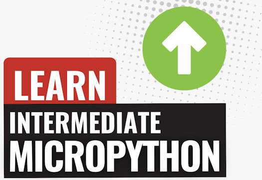](https://www.kevsrobots.com/learn/intermediate_micropython/)

Kevin's Intermediate MicroPython course builds on the foundations laid in the Learn MicroPython - the basics course. The course delves into more advanced topics, with the knowledge and skills to tackle complex projects with confidence - [Kev's Robots](https://www.kevsrobots.com/learn/intermediate_micropython/).

## Understanding the Raspberry Pi Pico’s Memory Layout

[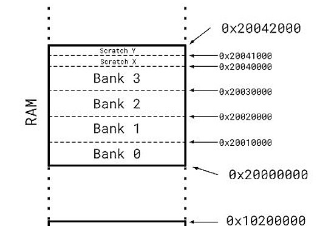](https://petewarden.com/2024/01/16/understanding-the-raspberry-pi-picos-memory-layout/)

In updating TensorFlow Lite Micro for the Raspberry Pi Pico, Pete Warden documented the processor's memory map after finding the understanding of it limited - [Pete Warden's Blog](https://petewarden.com/2024/01/16/understanding-the-raspberry-pi-picos-memory-layout/).

## Embedded MicroPython: MicroPython is Amazing

Arya Voronova provides an overview of MicroPython, it's capabilities, and how its usefulness can be addictive - [Hackaday](https://hackaday.com/2024/07/11/embedded-python-micropython-is-amazing/).

## New ViperIDE Features Added

ViperIDE is a new third-party development environment for MicroPython and CircuitPython.

[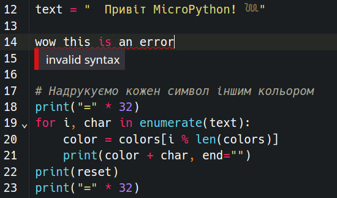](https://x.com/vshymanskyy/status/1810351725938684028)

ViperIDE now runs the full MicroPython compiler right in the browser, thanks to WebAssembly - [X](https://x.com/vshymanskyy/status/1810351725938684028).

[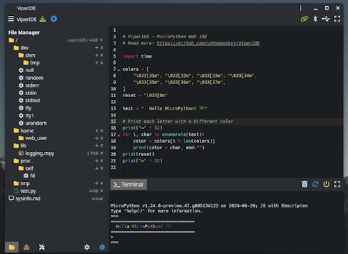](https://x.com/vshymanskyy/status/1810988056985378833)

In addition to direct and remote device connectivity, ViperIDE can now run an emulated device directly in a browser. This feature is experimental, but you can try it [here](https://viper-ide.org/?emulator=1) - [X](https://x.com/vshymanskyy/status/1810351725938684028).

## This Week's Python Streams

Python on Hardware is all about building a cooperative ecosphere which allows contributions to be valued and to grow knowledge. Below are the streams within the last week focusing on the community.

**CircuitPython Deep Dive Stream**

[Last Friday](https://youtube.com/live/anyCYbFdDkc), Scott streamed starting work on CircuitMatter.

You can see the latest video and past videos on the Adafruit YouTube channel under the Deep Dive playlist - [YouTube](https://www.youtube.com/playlist?list=PLjF7R1fz_OOXBHlu9msoXq2jQN4JpCk8A).

**CircuitPython Parsec**

John Park’s CircuitPython Parsec this week is on Feather Bootloaders - [Adafruit Blog](https://blog.adafruit.com/2024/07/12/john-parks-circuitpython-parsec-feather-bootloaders-adafruit-circuitpython/) and [YouTube](https://youtu.be/KWV3EFySdBM).

Catch all the episodes in the [YouTube playlist](https://www.youtube.com/playlist?list=PLjF7R1fz_OOWFqZfqW9jlvQSIUmwn9lWr).

**CircuitPython Weekly Meeting**

CircuitPython Weekly Meeting for July 8, 2024 ([notes](https://github.com/adafruit/adafruit-circuitpython-weekly-meeting/blob/main/2024/2024-07-08.md)) [on YouTube](https://youtu.be/gzFZJbgQ-Qk).

## Project of the Week: Boris Puts Two Raspberry Pis to Work in an Industrial Home Assistant Control Panel

A high-tech panel for a Home Assistant installation is on tap this week. It uses two Raspberry Pi 3 B+ and some Adafruit I2C IO expanders to accomodate all the external inputs and outputs. It's tied together on the panel with Python running on the Pis - [hackster.io](https://www.hackster.io/news/boris-puts-two-raspberry-pis-to-work-in-this-impressively-industrial-home-assistant-control-panel-29de27cc7cd3) and [YouTube](https://youtu.be/Oz87wOJSQm8).

> "I modeled this after modern commercial jetliner cockpits, and also a little on nuclear power plant control rooms," Boris explains of the control panel's aesthetics.

## Popular Last Week

[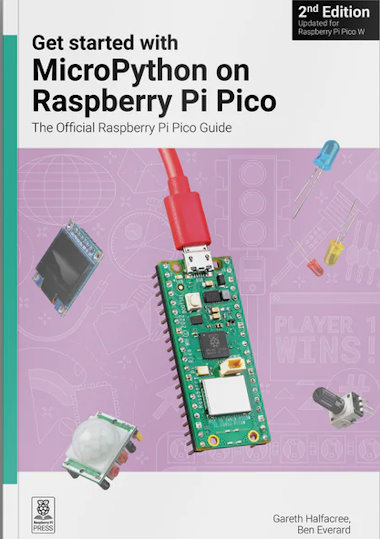](https://www.adafruitdaily.com/2024/07/08/python-on-microcontrollers-newsletter-new-software-raspberry-pi-os-and-circuitpython-plus-much-more-circuitpython-python-micropython-thepsf-raspberry_pi/)

What was the most popular, most clicked link, in [last week's newsletter](https://www.adafruitdaily.com/2024/07/08/python-on-microcontrollers-newsletter-new-software-raspberry-pi-os-and-circuitpython-plus-much-more-circuitpython-python-micropython-thepsf-raspberry_pi/)? [New Edition: Get started with MicroPython on Raspberry Pi Pico](https://www.raspberrypi.com/news/get-started-micropython-pico-new-book/).

## New Notes from Adafruit Playground

[Adafruit Playground](https://adafruit-playground.com/) is a new place for the community to post their projects and other making tips/tricks/techniques. Ad-free, it's an easy way to publish your work in a safe space for free.

[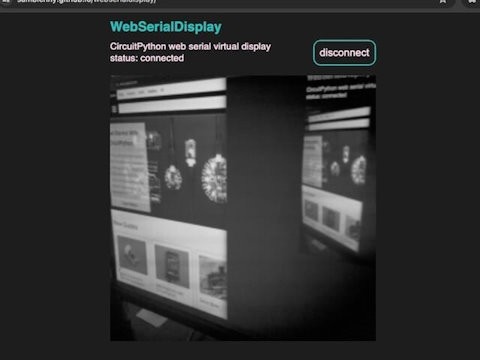](https://adafruit-playground.com/u/SamBlenny/pages/virtual-display-over-web-serial)

Virtual Display Over Web Serial - [Adafruit Playground](https://adafruit-playground.com/u/SamBlenny/pages/virtual-display-over-web-serial).

[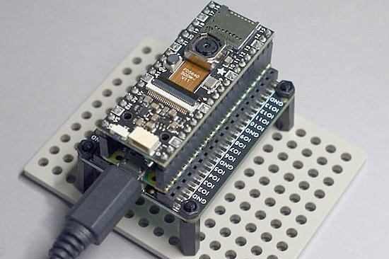](https://adafruit-playground.com/u/SamBlenny/pages/camtest-pycowbell-camera-breakout-demo)

CamTest: PiCowbell Camera Breakout Demo - [Adafruit Playground](https://adafruit-playground.com/u/SamBlenny/pages/camtest-pycowbell-camera-breakout-demo).

[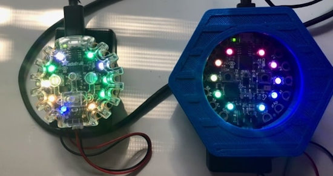](https://adafruit-playground.com/u/mrklingon/pages/tricorders)

Tricorders, using Circuit Playground Express and CircuitPython - [Adafruit Playground](https://adafruit-playground.com/u/mrklingon/pages/tricorders).

## News From Around the Web

Espressif has a free book in PDF format - ESP32-C3 Wireless Adventure: A Comprehensive Guide to IoT - [Espressif](https://www.espressif.com/sites/default/files/documentation/ESP32-C3%20Wireless%20Adventure.pdf) (PDF) via [X](https://x.com/AlexCorvis84/status/1810957493503139973).

[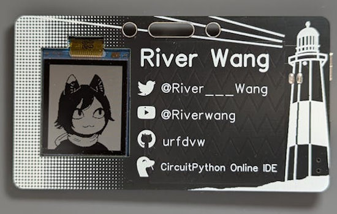](https://www.hackster.io/news/an-animated-business-card-that-recipients-will-actually-keep-33ca46db8b0d)

An animated business card that recipients may actually keep, using CircuitPython - [hackster.io](https://www.hackster.io/news/an-animated-business-card-that-recipients-will-actually-keep-33ca46db8b0d) via [X](https://x.com/Hacksterio/status/1811154420333432914).

[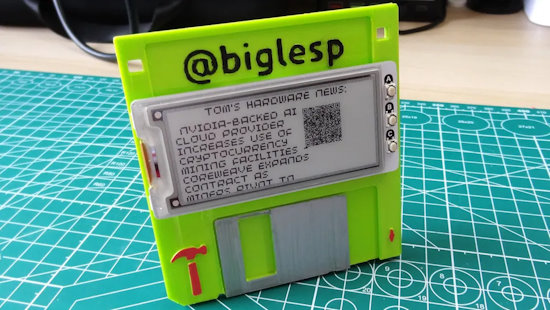](https://www.tomshardware.com/raspberry-pi/raspberry-pi-projects/how-to-make-a-connected-badge-that-shows-the-latest-news-headlines-and-looks-like-a-floppy-disk)

How to make a connected badge that shows the latest news headlines — and looks like a floppy disk. Coded in MicroPython - [Tom's Hardware](https://www.tomshardware.com/raspberry-pi/raspberry-pi-projects/how-to-make-a-connected-badge-that-shows-the-latest-news-headlines-and-looks-like-a-floppy-disk).

Better Buttons with Debouncing from CircuitPython School - [YouTube](https://www.youtube.com/watch?v=xNlKzk1oDRE).

[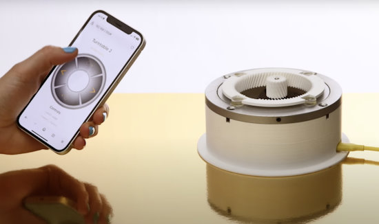](https://www.raspberrypi.com/news/twirly-shirley-the-pico-powered-precision-turntable/)

Twirly Shirley: the Pico-powered precision turntable using MicroPython - [Raspberry Pi News](https://www.raspberrypi.com/news/twirly-shirley-the-pico-powered-precision-turntable/).

[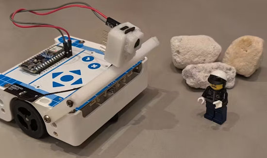](https://www.hackster.io/roni-bandini/computer-vision-and-more-for-alvik-robot-06030d)

Computer vision (and more) for the Arduino Alvik robot with MicroPython - [hackster.io](https://www.hackster.io/roni-bandini/computer-vision-and-more-for-alvik-robot-06030d).

[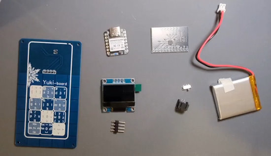](https://www.youtube.com/watch?v=Bs0pWxFDoN4)

Yuki-board is a business card-sized capacitive touch keyboard that uses touch and swipe gestures to type. It runs CircuitPython. It is heavily inspired by the Plum Blossom Chinese IME on PPC and the Japanese Flick keyboard on Android - [YouTube](https://www.youtube.com/watch?v=Bs0pWxFDoN4) via [X](https://x.com/River___Wang/status/1810853850498191511).

[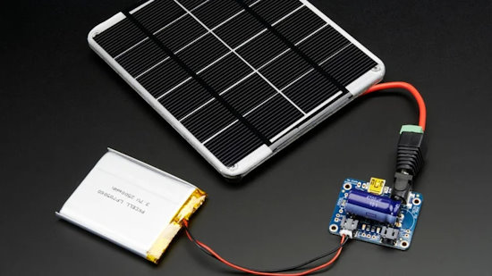](https://www.slashgear.com/1614451/raspberry-pi-solar-power-how-to/)

How To run your Raspberry Pi using solar power - [SlashGear](https://www.slashgear.com/1614451/raspberry-pi-solar-power-how-to/).

Tulip, a musical computer based on MicroPython. Conceived with a clear focus on music, it comes with an internal sequencer and software synthesizer (-framework), MIDI and audio interfaces - [YouTube](https://www.youtube.com/watch?v=1lYFjQp7Xrw).

Programming a MatrixPortal M4 and two 32x16 RGB LED panels in CircuitPython - [Mastodon](https://octodon.social/@InstantArcade@leds.social/112758476924128263).

Torvalds Speaks: The Impact of Artificial Intelligence on Programming - [YouTube](https://www.youtube.com/watch?v=VHHT6W-N0ak).

PySkyWiFi: completely free, unbelievably stupid WiFi on long-haul flights, coded in Python - [Adafruit Blog](https://blog.adafruit.com/2024/07/10/pyskywifi-completely-free-unbelievably-stupid-wi-fi-on-long-haul-flights/).

Python meets JavaScript, Wasm with the magic of PythonMonkey. PythonMonkey is a JavaScript runtime living inside of Python, built on top of Mozilla‘s SpiderMonkey engine. Developers can use it as a Python library for running JavaScript code in Python - [TheNewStack](https://thenewstack.io/python-meets-javascript-wasm-with-the-magic-of-pythonmonkey/).

What's in a name? Looking at PyPi - [Josh Cannon](https://joshcannon.me/2024/07/05/package-names.html).

> "81% of packages have a single prefix, which when normalized directly correlates to the package name."

[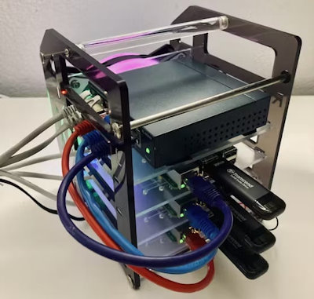](https://www.raspberrypi.com/news/wanna-build-a-raspberry-pi-5-cluster/)

Wanna build a Raspberry Pi 5 cluster? - [Raspberry Pi News](https://www.raspberrypi.com/news/wanna-build-a-raspberry-pi-5-cluster/).

Pyxel is a retro game engine for Python. Thanks to its simple specifications inspired by retro gaming consoles, such as only 16 colors can be displayed and only 4 sounds can be played back at the same time, you can feel free to enjoy making pixel art style games - [GitHub](https://github.com/kitao/pyxel).

"mnist" in 60 lines of Python code, no dependencies, for educational purposes - [GitHub](https://github.com/tonio-m/python_neural_network).

How to create a Python executable file with PyInstaller - [TheNewStack](https://thenewstack.io/how-to-create-a-python-executable-file-with-pyinstaller/).

LPython 0.22 released for ahead-of-time compiling in Python - [Phoronix](https://www.phoronix.com/news/LPython-0.22-Released).

Making Python Less Random - [Andrew Healey](https://healeycodes.com/making-python-less-random).

## New

[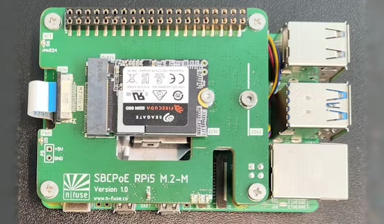](https://www.hackster.io/news/the-n-fuse-poe-hat-provides-power-and-range-of-mpcie-and-m-2-storage-options-to-the-raspberry-pi-5-08f1b2891ee0)

The n-fuse PoE HAT Provides Power and Range of mPCIe and M.2 Storage Options to the Raspberry Pi 5. New HAT comes in mPCIe and M.2 B-key, M-key, and E-key flavors — but USB connectivity will cost one the warranty - [hackster.io](https://www.hackster.io/news/the-n-fuse-poe-hat-provides-power-and-range-of-mpcie-and-m-2-storage-options-to-the-raspberry-pi-5-08f1b2891ee0).

[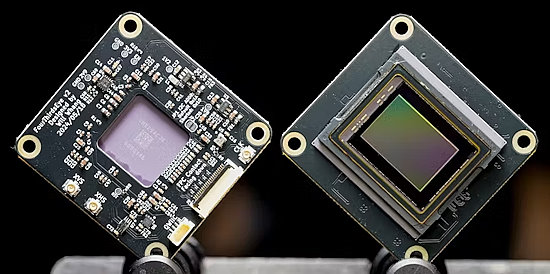](https://www.hackster.io/news/will-whang-s-fourthirdseye-puts-a-sony-imx294-sensor-on-your-raspberry-pi-5-or-compute-module-4-db7af9ea10a2)

Will Whang's FourThirdsEye puts a Sony IMX294 sensor on a Raspberry Pi 5 or Compute Module 4 - [hackster.io](https://www.hackster.io/news/will-whang-s-fourthirdseye-puts-a-sony-imx294-sensor-on-your-raspberry-pi-5-or-compute-module-4-db7af9ea10a2).

## New Boards Supported by CircuitPython

The number of supported microcontrollers and Single Board Computers (SBC) grows every week. This section outlines which boards have been included in CircuitPython or added to [CircuitPython.org](https://circuitpython.org/).

There was one new board added this week:

- [USB Interposer](https://circuitpython.org/board/8086_usb_interposer/)

*Note: For non-Adafruit boards, please use the support forums of the board manufacturer for assistance, as Adafruit does not have the hardware to assist in troubleshooting.*

Looking to add a new board to CircuitPython? It's highly encouraged! Adafruit has four guides to help you do so:

- [How to Add a New Board to CircuitPython](https://learn.adafruit.com/how-to-add-a-new-board-to-circuitpython/overview)
- [How to add a New Board to the circuitpython.org website](https://learn.adafruit.com/how-to-add-a-new-board-to-the-circuitpython-org-website)
- [Adding a Single Board Computer to PlatformDetect for Blinka](https://learn.adafruit.com/adding-a-single-board-computer-to-platformdetect-for-blinka)
- [Adding a Single Board Computer to Blinka](https://learn.adafruit.com/adding-a-single-board-computer-to-blinka)

## New Learn Guides

[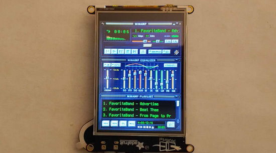](https://learn.adafruit.com/guides/latest)

[MP3 Playback with CircuitPython](https://learn.adafruit.com/mp3-playback-with-circuitpython) from [Jeff Epler](https://learn.adafruit.com/u/jepler)

## CircuitPython Libraries

The CircuitPython library numbers are continually increasing, while existing ones continue to be updated. Here we provide library numbers and updates!

To get the latest Adafruit libraries, download the [Adafruit CircuitPython Library Bundle](https://circuitpython.org/libraries). To get the latest community contributed libraries, download the [CircuitPython Community Bundle](https://circuitpython.org/libraries).

If you'd like to contribute to the CircuitPython project on the Python side of things, the libraries are a great place to start. Check out the [CircuitPython.org Contributing page](https://circuitpython.org/contributing). If you're interested in reviewing, check out Open Pull Requests. If you'd like to contribute code or documentation, check out Open Issues. We have a guide on [contributing to CircuitPython with Git and GitHub](https://learn.adafruit.com/contribute-to-circuitpython-with-git-and-github), and you can find us in the #help-with-circuitpython and #circuitpython-dev channels on the [Adafruit Discord](https://adafru.it/discord).

You can check out this [list of all the Adafruit CircuitPython libraries and drivers available](https://github.com/adafruit/Adafruit_CircuitPython_Bundle/blob/master/circuitpython_library_list.md). 

The current number of CircuitPython libraries is **488**!

**Updated Libraries**

Here's this week's updated CircuitPython libraries:

  * [adafruit/Adafruit_CircuitPython_MiniMQTT](https://github.com/adafruit/Adafruit_CircuitPython_MiniMQTT)
  * [adafruit/Adafruit_CircuitPython_Requests](https://github.com/adafruit/Adafruit_CircuitPython_Requests)
  * [adafruit/Adafruit_CircuitPython_LED_Animation](https://github.com/adafruit/Adafruit_CircuitPython_LED_Animation)

**Library PyPI Weekly Download Stats**

**Total Library Stats**
  * 138249 PyPI downloads over 330 libraries

**Top 10 Libraries by PyPI Downloads**
  * Adafruit CircuitPython Requests (adafruit-circuitpython-requests): 11836
  * Adafruit CircuitPython BusDevice (adafruit-circuitpython-busdevice): 10717
  * Adafruit CircuitPython ConnectionManager (adafruit-circuitpython-connectionmanager): 9736
  * Adafruit CircuitPython Register (adafruit-circuitpython-register): 2704
  * Adafruit CircuitPython DHT (adafruit-circuitpython-dht): 1809
  * Adafruit CircuitPython MiniMQTT (adafruit-circuitpython-minimqtt): 1475
  * Adafruit CircuitPython ADS1x15 (adafruit-circuitpython-ads1x15): 1464
  * Adafruit CircuitPython Wiznet5k (adafruit-circuitpython-wiznet5k): 1250
  * Adafruit CircuitPython Pixelbuf (adafruit-circuitpython-pixelbuf): 1236
  * Adafruit CircuitPython NeoPixel (adafruit-circuitpython-neopixel): 1087

## What’s the CircuitPython team up to this week?

What is the team up to this week? Let’s check in:

**Dan**

I released CircuitPython 9.1.0 last Wednesday. Thanks to everyone who worked on this release for the past several months.

Next I'm going to work on catching us up to the latest MicroPython changes. We last merged MicroPython v1.21. MicroPython most recently released v1.23. We merge the versions one at a time to understand the merges more easily and make them smaller.

**Melissa**

This past week, I updated the [CircuitPython Code Editor](https://code.circuitpython.org/) and fixed the USB Workflow to get it into a working state. In the process, I found that the [REPL JS library](https://github.com/adafruit/circuitpython-repl-js) will need to be updated to use Raw mode rather than Raw Paste mode, which will fix some of the weird issues that I've been seeing. I will also need to make some structural changes and will continue to working on it over the next week or so.

**Tim**

text.

**Jeff**

I published a guide on the Adafruit Learning System: [MP3 Playback with CircuitPython](https://learn.adafruit.com/mp3-playback-with-circuitpython). This details MP3 streaming, recently added in the latest development version of CircuitPython, as well as bringing together other information about using the audiomp3 module that was previously spread across multiple guides.

**Scott**

This week I'm digging into the Matter IoT specification and planning to implement a portion of it in CircuitPython. There is an open SDK written in C++ but it is quite large and complex. So, I'm going to attempt to re-implement the core bits in Python instead. It is built on top of IPv6 TCP and UDP so it shouldn't require many changes internal to CircuitPython.

**Liz**

This week I worked on a product guide for the [IR Remote Transceiver](https://learn.adafruit.com/adafruit-infrared-ir-remote-transceiver). This breakout lets you send and receive IR remote signals. It has examples for both Arduino and CircuitPython.

I also worked on testing the Vindie S2 board. I have a spreadsheet where I can keep track of the tests I've tried and what's working vs. not working in CircuitPython and Arduino. One thing that we'll need to change on the next hardware revision is the USB port. The one we chose is mechanically strong but has slightly too much overhang on the edge, so it conflicts with the case. I found a port that has data pins without any extra mounting hardware. This seems to be rare for vertical USB C ports. I designed up a quick breakout for this new port. That should be arriving in the next few days.

## Upcoming Events

The next MicroPython Meetup in Melbourne will be on July 24 – [Meetup](https://www.meetup.com/micropython-meetup/events). You can see recordings of previous meetings on [YouTube](https://www.youtube.com/@MicroPythonOfficial). The June 2024 [Meeting Notes](https://melbournemicropythonmeetup.github.io/June-2024-Meetup/) and [Video](https://www.youtube.com/watch?v=2dKonAwLnB4).

PyOhio is being held July 27-28, 2024 in Cleveland, Ohio - [PyOhio](https://www.pyohio.org/2024/).

Espressif DevCon24 will be held Sep 3-5, 13:00-18:00 CEST. Call for presentations now - [Espressif](https://devcon.espressif.com/).

Maker Faire Bay Area returns to Mare Island Naval Shipyard on October 18-20, 2024 - [Maker Faire](https://makerfaire.com/bay-area/).

**Send Your Events In**

If you know of virtual events or upcoming events, please let us know via email to cpnews(at)adafruit(dot)com.

## Latest Releases

CircuitPython's stable release is **[9.1.0](https://github.com/adafruit/circuitpython/releases/latest)**. New to CircuitPython? Start with our [Welcome to CircuitPython Guide](https://learn.adafruit.com/welcome-to-circuitpython).

[20240709](https://github.com/adafruit/Adafruit_CircuitPython_Bundle/releases/latest) is the latest Adafruit CircuitPython library bundle.

[20240625](https://github.com/adafruit/CircuitPython_Community_Bundle/releases/latest) is the latest CircuitPython Community library bundle.

[v1.23.0](https://micropython.org/download) is the latest MicroPython release. Documentation for it is [here](http://docs.micropython.org/en/latest/pyboard/).

[3.12.4](https://www.python.org/downloads/) is the latest Python release. The latest pre-release version is [3.13.0b3](https://www.python.org/download/pre-releases/).

[3,966 Stars](https://github.com/adafruit/circuitpython/stargazers) Like CircuitPython? [Star it on GitHub!](https://github.com/adafruit/circuitpython)

## Call for Help -- Translating CircuitPython is now easier than ever

[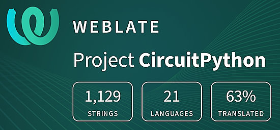](https://hosted.weblate.org/engage/circuitpython/)

One important feature of CircuitPython is translated control and error messages. With the help of fellow open source project [Weblate](https://weblate.org/), we're making it even easier to add or improve translations. 

Sign in with an existing account such as GitHub, Google or Facebook and start contributing through a simple web interface. No forks or pull requests needed! As always, if you run into trouble join us on [Discord](https://adafru.it/discord), we're here to help.

## 38,124 Thanks

The Adafruit Discord community, where we do all our CircuitPython development in the open, reached over 38,124 humans - thank you! Adafruit believes Discord offers a unique way for Python on hardware folks to connect. Join today at [https://adafru.it/discord](https://adafru.it/discord).

## ICYMI - In case you missed it

Python on hardware is the Adafruit Python video-newsletter-podcast! The news comes from the Python community, Discord, Adafruit communities and more and is broadcast on ASK an ENGINEER Wednesdays. The complete Python on Hardware weekly videocast [playlist is here](https://www.youtube.com/playlist?list=PLjF7R1fz_OOXRMjM7Sm0J2Xt6H81TdDev). The video podcast is on [iTunes](https://itunes.apple.com/us/podcast/python-on-hardware/id1451685192?mt=2), [YouTube](http://adafru.it/pohepisodes), [Instagram](https://www.instagram.com/adafruit/channel/)), and [XML](https://itunes.apple.com/us/podcast/python-on-hardware/id1451685192?mt=2).

[The weekly community chat on Adafruit Discord server CircuitPython channel - Audio / Podcast edition](https://itunes.apple.com/us/podcast/circuitpython-weekly-meeting/id1451685016) - Audio from the Discord chat space for CircuitPython, meetings are usually Mondays at 2pm ET, this is the audio version on [iTunes](https://itunes.apple.com/us/podcast/circuitpython-weekly-meeting/id1451685016), Pocket Casts, [Spotify](https://adafru.it/spotify), and [XML feed](https://adafruit-podcasts.s3.amazonaws.com/circuitpython_weekly_meeting/audio-podcast.xml).

## Contribute

The CircuitPython Weekly Newsletter is a CircuitPython community-run newsletter emailed every Monday. The complete [archives are here](https://www.adafruitdaily.com/category/circuitpython/). It highlights the latest CircuitPython related news from around the web including Python and MicroPython developments. To contribute, edit next week's draft [on GitHub](https://github.com/adafruit/circuitpython-weekly-newsletter/tree/gh-pages/_drafts) and [submit a pull request](https://help.github.com/articles/editing-files-in-your-repository/) with the changes. You may also tag your information on Twitter with #CircuitPython. 

Join the Adafruit [Discord](https://adafru.it/discord) or [post to the forum](https://forums.adafruit.com/viewforum.php?f=60) if you have questions.
