- [ ] Library and info updates
- [ ] change date
- [ ] update title
- [ ] Feature story
- [ ] Update  for images
- [ ] Update ICYDNCI
- [ ] All images 550w max only
- [ ] Link "View this email in your browser."

News Sources

- [Adafruit Playground](https://adafruit-playground.com/)
- Twitter: [CircuitPython](https://twitter.com/search?q=circuitpython&src=typed_query&f=live), [MicroPython](https://twitter.com/search?q=micropython&src=typed_query&f=live) and [Python](https://twitter.com/search?q=python&src=typed_query)
- [Raspberry Pi News](https://www.raspberrypi.com/news/)
- Mastodon [CircuitPython](https://octodon.social/tags/CircuitPython) and [MicroPython](https://octodon.social/tags/MicroPython)
- [hackster.io CircuitPython](https://www.hackster.io/search?q=circuitpython&i=projects&sort_by=most_recent) and [MicroPython](https://www.hackster.io/search?q=micropython&i=projects&sort_by=most_recent)
- YouTube: [CircuitPython](https://www.youtube.com/results?search_query=circuitpython&sp=CAI%253D), [MicroPython](https://www.youtube.com/results?search_query=micropython&sp=CAI%253D)
- Instructables: [CircuitPython](https://www.instructables.com/search/?q=circuitpython&projects=all&sort=Newest), [MicroPython](https://www.instructables.com/search/?q=micropython&projects=all&sort=Newest), [Raspberry Pi Python](https://www.instructables.com/search/?q=raspberry+pi+python&projects=all&sort=Newest)
- [python.org](https://www.python.org/)
- [Python Insider - dev team blog](https://pythoninsider.blogspot.com/)
- Individuals: [Jeff Geerling](https://www.jeffgeerling.com/blog)
- Tom's Hardware: [CircuitPython](https://www.tomshardware.com/search?searchTerm=circuitpython&articleType=all&sortBy=publishedDate) and [MicroPython](https://www.tomshardware.com/search?searchTerm=micropython&articleType=all&sortBy=publishedDate) and [Raspberry Pi](https://www.tomshardware.com/search?searchTerm=raspberry%20pi&articleType=all&sortBy=publishedDate)
- [hackaday.io newest projects MicroPython](https://hackaday.io/projects?tag=micropython&sort=date) and [CircuitPython](https://hackaday.io/projects?tag=circuitpython&sort=date)
- [Google News Python](https://news.google.com/topics/CAAqIQgKIhtDQkFTRGdvSUwyMHZNRFY2TVY4U0FtVnVLQUFQAQ?hl=en-US&gl=US&ceid=US%3Aen)
- [hackaday CircuitPython](https://hackaday.com/blog/?s=circuitpython) and [MicroPython](https://hackaday.com/blog/?s=micropython)
- hackaday.io - [CircuitPython](https://hackaday.io/search?term=circuitpython) and [MicroPython](https://hackaday.io/search?term=micropython)

View this email in your browser. **Warning: Flashing Imagery**

Welcome to the latest Python on Microcontrollers newsletter! Midsummer is a time when Americans bake in the sun and Finns bask by the lake at a cottage. No matter how you are handling the season, you can leisurly browse this issue. We reported not long ago that Mbed OS was end of life and that left Arduino in a lurch. No more, as Arduino just announced their embrace of Zephyr OS, a good choice. A new maintenance release of CircuitPython is out now. And this issue has a focus on cool projects in the summer heat. - *Anne Barela, Editor*

We're on [Discord](https://discord.gg/HYqvREz), [Twitter](https://twitter.com/search?q=circuitpython&src=typed_query&f=live), and for past newsletters - [view them all here](https://www.adafruitdaily.com/category/circuitpython/). If you're reading this on the web, [subscribe here](https://www.adafruitdaily.com/). Here's the news this week:

## Arduino to Switch From Arm Mbed to Zephyr Real-Time Operating System (RTOS)

[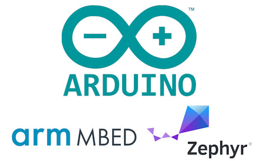](https://www.cnx-software.com/2024/07/25/arduino-to-switch-from-arm-mbed-to-zephyr-rtos/)

Following Arm’s decision to stop supporting Mbed from July 2026 onwards, Arduino has now decided to use Zephyr RTOS instead of Arm Mbed for Arduino boards that rely on the latter including Arduino GIGA, Arduino Nano 33 BLE, Arduino Nano RP2040 Connect, as well as Arduino PRO boards/solutions such as the Portenta, Nicla, and Opta families. Arduino plans to release the first beta of their transition by the end of 2024, with a rollout for various boards starting in 2025 - [CNX Software](https://www.cnx-software.com/2024/07/25/arduino-to-switch-from-arm-mbed-to-zephyr-rtos/) and [Arduino](https://blog.arduino.cc/2024/07/24/the-end-of-mbed-marks-a-new-beginning-for-arduino/).

## CircuitPython 9.1.1 Released

CircuitPython 9.1.1 is the latest bugfix revision of CircuitPython and is a new stable release - [Adafruit Blog]https://blog.adafruit.com/2024/07/22/circuitpython-9-1-1-released/) and [GitHub Release Notes](https://github.com/adafruit/circuitpython/releases/tag/9.1.1).

**FIXES AND ENHANCEMENTS**

**nordic**
Fix BLE MTU negotiation.

**RP2040**
Check that all `busio.UART` pins are valid before claiming any.

**SAMx**
SAMD51: fix `PWMOut` by reverting #9343: symptoms included no backlight on boards with displays.

## MicroPython Simulation With Proteus

[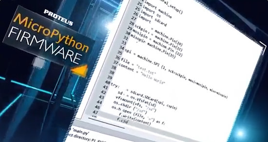](https://www.labcenter.com/micropython-sim/)

Proteus VSM for MicroPython provides system level simulation of an embedded design centered around a processor running MicroPython code. Users design the hardware directly on a schematic, choosing from thousands of embedded peripherals and placing and wiring them to the microcontroller board - [Proteus](https://www.labcenter.com/micropython-sim/) via [X](https://x.com/EdasimLlc/status/1816138511717638168).

## Teardown 2024 - Prototype to Product with MicroPython: Faster and Happier Embedded Systems Development - Ned Konz

[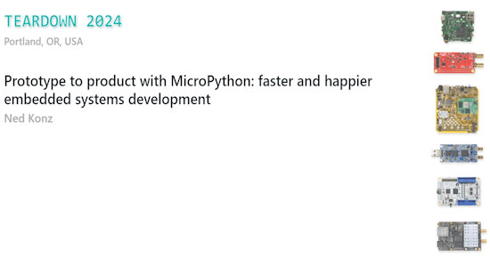](https://www.youtube.com/watch?v=Z9PnyaDmQjM)

Ned Konz gave a talk at Teardown 2024 “Prototype to product with MicroPython: faster and happier embedded systems development” - [YouTube](https://www.youtube.com/watch?v=Z9PnyaDmQjM).

## Constant Current Circuits for Flexible Filament LEDs 

[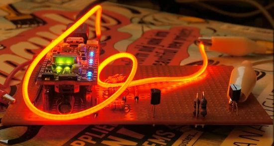](https://www.instructables.com/Constant-Current-Circuit-for-Flexible-Filament-LED/)

Kevin J. Walters shows how to power flexible "filament" LEDs and vary their brightness using a microcontroller and CircuitPython. A simple transistor-based circuit is used to provide a constant current to drive each LED with a microcontroller providing pulse-width modulated control to vary the brightness - [Instructables](https://www.instructables.com/Constant-Current-Circuit-for-Flexible-Filament-LED/).

## Checkout Challenge

[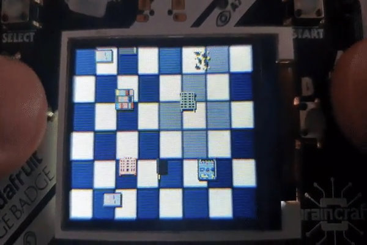](https://www.hackster.io/314reactor/checkout-challenge-4d60a3)

Checkout Challenge is a shopping trolley racing game made for the Adafruit PyBadge with CircuitPython, inspired by popular racing games - [hackster.io](https://www.hackster.io/314reactor/checkout-challenge-4d60a3) and [GitHub](https://github.com/LordofBone/CheckoutChallengePyBadge).

> "With an Adafruit PyBadge I had stored away for a few years, and with the advent of AI accelerating code development and generating impressive artwork, I realized it was the perfect time to start working on this game."

## Saxophone Changes Color on Every Note

This Pi Zero 2 W build uses an Adafruit [NeoPixel ring](https://www.adafruit.com/product/1463) and Python to show the colors of notes as they're played - [Raspberry Pi News](https://www.raspberrypi.com/news/saxophone-changes-colour-on-every-note/).

## This Week's Python Streams

Python on Hardware is all about building a cooperative ecosphere which allows contributions to be valued and to grow knowledge. Below are the streams within the last week focusing on the community.

**CircuitPython Deep Dive Stream**

[Last Friday](https://youtube.com/live/PsWSvLIbkkM), Scott streamed work on CircuitMatter cryptography.

You can see the latest video and past videos on the Adafruit YouTube channel under the Deep Dive playlist - [YouTube](https://www.youtube.com/playlist?list=PLjF7R1fz_OOXBHlu9msoXq2jQN4JpCk8A).

**CircuitPython Parsec**

John Park’s CircuitPython Parsec this week is on `touchio` proximity - [Adafruit Blog](https://blog.adafruit.com/2024/07/25/john-parks-circuitpython-parsec-touchio-proximity-adafruit-circuitpython/) and [YouTube](https://youtu.be/UGDmLb6Z7jg).

Catch all the episodes in the [YouTube playlist](https://www.youtube.com/playlist?list=PLjF7R1fz_OOWFqZfqW9jlvQSIUmwn9lWr).

**CircuitPython Weekly Meeting**

CircuitPython Weekly Meeting for {date} ([notes](file)) [on YouTube](link).

## Project of the Week: Implementing DDP in MicroPython

[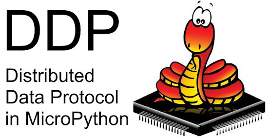](https://chaos.social/@scy/112838820313420247)

scy on Mastodon was looking at using either Art-Net or Distributed Display Protocol ([DDP](http://www.3waylabs.com/ddp/)) for a project. After looking at the specs, he chose DDP - [Mastodon](https://chaos.social/@scy/112838820313420247).

> DDP is so simple that I wrote a hacky, rudimentary server for it in about 50 lines of MicroPython, from scratch, in about an hour. Uploaded it to an ESP32, pointed a WLED controller at it and everything worked on the first attempt.

## Popular Last Week

What was the most popular, most clicked link, in [last week's newsletter](https://www.adafruitdaily.com/2024/07/22/python-on-microcontrollers-newsletter-python-was-at-risk-rp2040-chiplets-being-sold-and-much-more-circuitpython-python-micropython-thepsf-raspberry_pi/)? [How to write code for your Raspberry Pi Pico in your web browser with ViperIDE](https://www.tomshardware.com/raspberry-pi/raspberry-pi-pico/how-to-write-code-for-your-raspberry-pi-pico-in-your-web-browser-with-viperide).

## New Notes from Adafruit Playground

[Adafruit Playground](https://adafruit-playground.com/) is a new place for the community to post their projects and other making tips/tricks/techniques. Ad-free, it's an easy way to publish your work in a safe space for free.

A BLE Gamepad with QT Py ESP32-S3 - [Adafruit Playground](https://adafruit-playground.com/u/SamBlenny/pages/ble-gamepad-with-qt-py-esp32-s3).

Using multiple WiFi network credentials in Adafruit IO WipperSnapper firmware - [Adafruit Playground](https://adafruit-playground.com/u/tyeth/pages/using-multiple-wifi-network-credentials-in-adafruit-io-wippersnapper-firmware).

Heat Flow Visualiser: Visualise the Invisible with NeoPixels and the RP2040 Scorpio - [Adafruit Playground](https://adafruit-playground.com/u/Warmer_Summers/pages/heat-flow-visualiser-visualise-the-invisible-with-neopixels-and-the-rp2040-scorpio).

## News From Around the Web

I built a custom Lite Brite using the Adafruit Matrix Portal and CircuitPython, and now it plays Tetris - [Reddit](https://www.reddit.com/r/adafruit/comments/1e8m1zv/i_built_a_custom_lite_brite_using_the_matrix/).

You're Electric: Capacitive Touch with Circuit Playground Bluefruit and CircuitPython - [YouTube](https://www.youtube.com/watch?v=eEHOYggqa6U).

[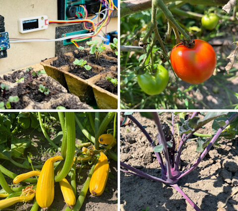](https://bsky.app/profile/mintteacher.bsky.social/post/3kxrxc34x5x25)

Greenhouse IoT cloud project bears results via MicroPython - [BlueSky](https://bsky.app/profile/mintteacher.bsky.social/post/3kxrxc34x5x25).

[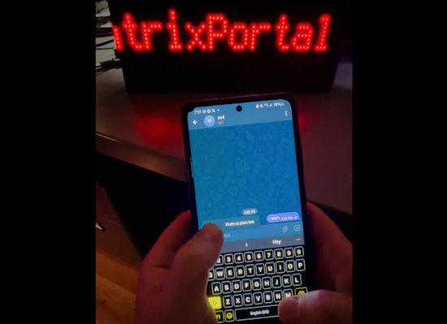](https://github.com/Fr4nkFletcher/MatrixPortal_Telegram_Scroller)

An Adafruit MatrixPortal M4 project to display scrolling text on an LED matrix with messages fetched from a Telegram bot, written in CircuitPython - [GitHub](https://github.com/Fr4nkFletcher/MatrixPortal_Telegram_Scroller) via [X](https://x.com/Fr4nkFletcher/status/1816268724657418633).

[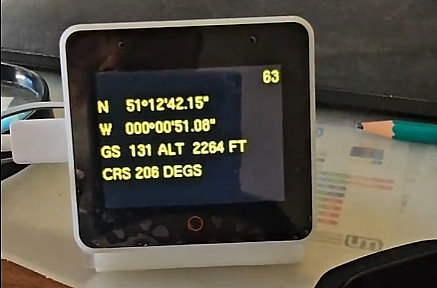](https://x.com/PSchulinck/status/1814409792380907992)

ESP-Box MSFS2020 flight data (Circuitpython script) while aircraft passing UTC longitude in UK - [X](https://x.com/PSchulinck/status/1814409792380907992).

[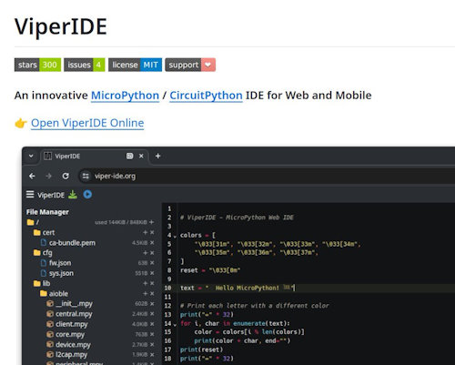](https://x.com/vshymanskyy/status/1815735112635453886)

To celebrate 300 ⭐️ on GitHub, ViperIDE now highlights warnings and errors in your code, thanks to Ruff - an innovative Python linter, analyzer, and formatter - [X](https://x.com/vshymanskyy/status/1815735112635453886).

The Engineer’s Guide to RF Cable Assembly Selection and Use - [DigiKey](https://www.digikey.com/en/articles/engineer-guide-to-rf-cable-assembly-selection-and-use).

[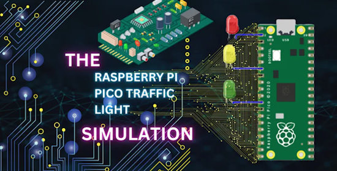](https://www.youtube.com/watch?v=p187QXEi84U)

Raspberry Pi Pico Traffic Light Simulation - [YouTube](https://www.youtube.com/watch?v=p187QXEi84U).

text - [site](url).

text - [site](url).

text - [site](url).

text - [site](url).

text - [site](url).

How to auto-generate Python type hints with Monkeytype - [InfoWorld](https://www.infoworld.com/video/2156901/how-to-auto-generate-python-type-hints-with-monkeytype.html).

How To navigate a filesystem with Python’s Pathlib - [KDnuggets](https://www.kdnuggets.com/how-to-navigate-the-filesystem-with-pythons-pathlib?utm_source=rss&utm_medium=rss&utm_campaign=how-to-navigate-the-filesystem-with-pythons-pathlib).

10 tips for speeding up CPython programs - [InfoWorld](https://www.infoworld.com/article/2246149/11-tips-for-speeding-up-python-programs.html).

Full Guide to Building a Professional Portfolio with Python, Markdown, Git, and GitHub Pages - [Medium](https://towardsdatascience.com/full-guide-to-build-a-professionnal-portfolio-with-python-markdown-git-and-github-page-for-66d12f7859f0).

Logging in Python - [Real Python](https://realpython.com/python-logging/).

## New

FutureBoard is a main control board designed for STEM education in the future. It has many built-in sensors just like the micro:bit, but unlike the micro:bit, FutureBoard features a TFT screen capable of displaying full colors. It supports MicroPython coding, allowing for more advanced learning - [hackster.io](https://www.hackster.io/kittenbot/futureboard-dd1746).

text - [site](url).

## New Boards Supported by CircuitPython

The number of supported microcontrollers and Single Board Computers (SBC) grows every week. This section outlines which boards have been included in CircuitPython or added to [CircuitPython.org](https://circuitpython.org/).

This week, there were (#/no) new boards added:

- [Board name](url)
- [Board name](url)
- [Board name](url)

*Note: For non-Adafruit boards, please use the support forums of the board manufacturer for assistance, as Adafruit does not have the hardware to assist in troubleshooting.*

Looking to add a new board to CircuitPython? It's highly encouraged! Adafruit has four guides to help you do so:

- [How to Add a New Board to CircuitPython](https://learn.adafruit.com/how-to-add-a-new-board-to-circuitpython/overview)
- [How to add a New Board to the circuitpython.org website](https://learn.adafruit.com/how-to-add-a-new-board-to-the-circuitpython-org-website)
- [Adding a Single Board Computer to PlatformDetect for Blinka](https://learn.adafruit.com/adding-a-single-board-computer-to-platformdetect-for-blinka)
- [Adding a Single Board Computer to Blinka](https://learn.adafruit.com/adding-a-single-board-computer-to-blinka)

## New Learn Guides

[ESP32-S3 BLE iOS Media Controller](https://learn.adafruit.com/esp32-s3-ble-ios-media-controller) from [Liz Clark](https://learn.adafruit.com/u/BlitzCityDIY)

## CircuitPython Libraries

The CircuitPython library numbers are continually increasing, while existing ones continue to be updated. Here we provide library numbers and updates!

To get the latest Adafruit libraries, download the [Adafruit CircuitPython Library Bundle](https://circuitpython.org/libraries). To get the latest community contributed libraries, download the [CircuitPython Community Bundle](https://circuitpython.org/libraries).

If you'd like to contribute to the CircuitPython project on the Python side of things, the libraries are a great place to start. Check out the [CircuitPython.org Contributing page](https://circuitpython.org/contributing). If you're interested in reviewing, check out Open Pull Requests. If you'd like to contribute code or documentation, check out Open Issues. We have a guide on [contributing to CircuitPython with Git and GitHub](https://learn.adafruit.com/contribute-to-circuitpython-with-git-and-github), and you can find us in the #help-with-circuitpython and #circuitpython-dev channels on the [Adafruit Discord](https://adafru.it/discord).

You can check out this [list of all the Adafruit CircuitPython libraries and drivers available](https://github.com/adafruit/Adafruit_CircuitPython_Bundle/blob/master/circuitpython_library_list.md). 

The current number of CircuitPython libraries is **489**!

**Updated Libraries**

Here's this week's updated CircuitPython libraries:

  * [adafruit/Adafruit_CircuitPython_PortalBase](https://github.com/adafruit/Adafruit_CircuitPython_PortalBase)
  * [adafruit/Adafruit_CircuitPython_AdafruitIO](https://github.com/adafruit/Adafruit_CircuitPython_AdafruitIO)
  * [adafruit/Adafruit_CircuitPython_NTP](https://github.com/adafruit/Adafruit_CircuitPython_NTP)

**Library PyPI Weekly Download Stats**

**Total Library Stats**
  * 242516 PyPI downloads over 331 libraries

**Top 10 Libraries by PyPI Downloads**
  * Adafruit CircuitPython Requests (adafruit-circuitpython-requests): 21618
  * Adafruit CircuitPython BusDevice (adafruit-circuitpython-busdevice): 21587
  * Adafruit CircuitPython ConnectionManager (adafruit-circuitpython-connectionmanager): 19779
  * Adafruit CircuitPython Register (adafruit-circuitpython-register): 2655
  * Adafruit CircuitPython MiniMQTT (adafruit-circuitpython-minimqtt): 2213
  * Adafruit CircuitPython Wiznet5k (adafruit-circuitpython-wiznet5k): 2134
  * Adafruit CircuitPython DHT (adafruit-circuitpython-dht): 1802
  * Adafruit CircuitPython ADS1x15 (adafruit-circuitpython-ads1x15): 1737
  * Adafruit CircuitPython ESP32SPI (adafruit-circuitpython-esp32spi): 1718
  * Adafruit CircuitPython Motor (adafruit-circuitpython-motor): 1687

## What’s the CircuitPython team up to this week?

What is the team up to this week? Let’s check in:

**Dan**

I released CircuitPython 9.1.1 last week to fix a problem with the display backlight not illuminating on SAMD51 boards like the PyPortal. The release also includes a few other fixes.

I'm continuing to fix bugs in the 9.1.x milestone and I'm also continuing the merge from MicroPython v1.22.

**Melissa**

This past week I set up a beta website for [code.circuitpython.org](http://code.circuitpython.org/). The URL for the new site is [https://code-beta.circuitpython.org](https://code-beta.circuitpython.org/) if you would like to give it a try. Currently though, it contains the same code as code.circuitpython.org, but the plan is to push changes there first to avoid breaking code.circuitpython.org.

**Tim**

I've been working on fixing a few `displayio` driver libraries that have compatibility issue with the latest version of `Blinka_Displayio`. I've also started switching library repos to use Ruff instead of pylint and Black. I'm making that swap on libraries as I come across them reviewing other changes or working on other things. I chased down an issue with SAMD51 devices that have built-in displays to find the specific commit where the problems began.

**Jeff**

This week my work to add support for IPv6 on most Espressif boards was merged into to the very latest versions of CircuitPython. For now, the documentation is shoe-horned into the "[Internet Test](https://learn.adafruit.com/adafruit-metro-esp32-s2/circuitpython-internet-test#ipv6-networking-3176506)" page on Learn. The tl;dr is: `wifi.radio.start_dhcp_server(ipv6=True)` and then create sockets with `AF_INET6`.

Libraries that build on socketpool, like adafruit_requests and adafruit_ntp will require their own updates to work with IPv6, because they always request IPv4 sockets via AF_INET.

You won't see any updates from me over the next few weeks, as I'm taking a vacation!

**Scott**

This week I've continued working on CircuitMatter. I've reconnected things to the network and have successfully replied to the controller! The next task is to implement the cryptography functions used to establish a secure message channel. I'm testing with a test controller on my desktop now and can also record and replay packets on the Python device side.

**Liz**

This week I worked on a fun project with the Ruiz brothers to showcase BLE on ESP32-S3: the [ESP32-S3 BLE iOS Media Controller](https://learn.adafruit.com/esp32-s3-ble-ios-media-controller). This project uses an ESP32-S3 Feather with a TFT FeatherWing to display and control Apple Media services over BLE.

I also worked on two product guides. The first was the [CH334F USB Hub Breakout](https://learn.adafruit.com/adafruit-ch334f-mini-4-port-usb-hub-breakout). This breakout lets you easily build a custom USB hub, no code required. The second was for the [USB Type C Power Delivery Switchable Breakout](https://learn.adafruit.com/adafruit-usb-type-c-power-delivery-switchable-breakout). This board is a remix of the original HUSB238 breakout in the shop. This version features DIP switches to select the PD voltage instead of solder jumpers. Working on the original breakout got me very interested in weird USB power methods so I'm excited to have a version that doesn't require soldering.

## Upcoming Events

The next MicroPython Meetup in Melbourne will be on August 28 – [Meetup](https://www.meetup.com/micropython-meetup/events). You can see recordings of previous meetings on [YouTube](https://www.youtube.com/@MicroPythonOfficial). The video from July 24th is [here](https://www.youtube.com/watch?v=soQlLZ0JlCI).

Espressif DevCon24 will be held Sep 3-5, 13:00-18:00 CEST. Call for presentations now - [Espressif](https://devcon.espressif.com/).

Maker Faire Bay Area returns to Mare Island Naval Shipyard on October 18-20, 2024 - [Maker Faire](https://makerfaire.com/bay-area/).

**Send Your Events In**

If you know of virtual events or upcoming events, please let us know via email to cpnews(at)adafruit(dot)com.

## Latest Releases

CircuitPython's stable release is [#.#.#](https://github.com/adafruit/circuitpython/releases/latest) and its unstable release is [#.#.#-##.#](https://github.com/adafruit/circuitpython/releases). New to CircuitPython? Start with our [Welcome to CircuitPython Guide](https://learn.adafruit.com/welcome-to-circuitpython).

[2024####](https://github.com/adafruit/Adafruit_CircuitPython_Bundle/releases/latest) is the latest Adafruit CircuitPython library bundle.

[2024####](https://github.com/adafruit/CircuitPython_Community_Bundle/releases/latest) is the latest CircuitPython Community library bundle.

[v#.#.#](https://micropython.org/download) is the latest MicroPython release. Documentation for it is [here](http://docs.micropython.org/en/latest/pyboard/).

[#.#.#](https://www.python.org/downloads/) is the latest Python release. The latest pre-release version is [#.#.#](https://www.python.org/download/pre-releases/).

[#,### Stars](https://github.com/adafruit/circuitpython/stargazers) Like CircuitPython? [Star it on GitHub!](https://github.com/adafruit/circuitpython)

## Call for Help -- Translating CircuitPython is now easier than ever

One important feature of CircuitPython is translated control and error messages. With the help of fellow open source project [Weblate](https://weblate.org/), we're making it even easier to add or improve translations. 

Sign in with an existing account such as GitHub, Google or Facebook and start contributing through a simple web interface. No forks or pull requests needed! As always, if you run into trouble join us on [Discord](https://adafru.it/discord), we're here to help.

## NUMBER Thanks

The Adafruit Discord community, where we do all our CircuitPython development in the open, reached over NUMBER humans - thank you! Adafruit believes Discord offers a unique way for Python on hardware folks to connect. Join today at [https://adafru.it/discord](https://adafru.it/discord).

## ICYMI - In case you missed it

Python on hardware is the Adafruit Python video-newsletter-podcast! The news comes from the Python community, Discord, Adafruit communities and more and is broadcast on ASK an ENGINEER Wednesdays. The complete Python on Hardware weekly videocast [playlist is here](https://www.youtube.com/playlist?list=PLjF7R1fz_OOXRMjM7Sm0J2Xt6H81TdDev). The video podcast is on [iTunes](https://itunes.apple.com/us/podcast/python-on-hardware/id1451685192?mt=2), [YouTube](http://adafru.it/pohepisodes), [Instagram](https://www.instagram.com/adafruit/channel/)), and [XML](https://itunes.apple.com/us/podcast/python-on-hardware/id1451685192?mt=2).

[The weekly community chat on Adafruit Discord server CircuitPython channel - Audio / Podcast edition](https://itunes.apple.com/us/podcast/circuitpython-weekly-meeting/id1451685016) - Audio from the Discord chat space for CircuitPython, meetings are usually Mondays at 2pm ET, this is the audio version on [iTunes](https://itunes.apple.com/us/podcast/circuitpython-weekly-meeting/id1451685016), Pocket Casts, [Spotify](https://adafru.it/spotify), and [XML feed](https://adafruit-podcasts.s3.amazonaws.com/circuitpython_weekly_meeting/audio-podcast.xml).

## Contribute

The CircuitPython Weekly Newsletter is a CircuitPython community-run newsletter emailed every Monday. The complete [archives are here](https://www.adafruitdaily.com/category/circuitpython/). It highlights the latest CircuitPython related news from around the web including Python and MicroPython developments. To contribute, edit next week's draft [on GitHub](https://github.com/adafruit/circuitpython-weekly-newsletter/tree/gh-pages/_drafts) and [submit a pull request](https://help.github.com/articles/editing-files-in-your-repository/) with the changes. You may also tag your information on Twitter with #CircuitPython. 

Join the Adafruit [Discord](https://adafru.it/discord) or [post to the forum](https://forums.adafruit.com/viewforum.php?f=60) if you have questions.
