- [ ] Library and info updates
- [ ] change date
- [ ] update title
- [ ] Feature story
- [ ] Update  for images
- [ ] Update ICYDNCI
- [ ] All images 550w max only
- [ ] Link "View this email in your browser."

News Sources

- [Adafruit Playground](https://adafruit-playground.com/)
- Twitter: [CircuitPython](https://twitter.com/search?q=circuitpython&src=typed_query&f=live), [MicroPython](https://twitter.com/search?q=micropython&src=typed_query&f=live) and [Python](https://twitter.com/search?q=python&src=typed_query)
- [Raspberry Pi News](https://www.raspberrypi.com/news/)
- Mastodon [CircuitPython](https://octodon.social/tags/CircuitPython) and [MicroPython](https://octodon.social/tags/MicroPython)
- [hackster.io CircuitPython](https://www.hackster.io/search?q=circuitpython&i=projects&sort_by=most_recent) and [MicroPython](https://www.hackster.io/search?q=micropython&i=projects&sort_by=most_recent)
- YouTube: [CircuitPython](https://www.youtube.com/results?search_query=circuitpython&sp=CAI%253D), [MicroPython](https://www.youtube.com/results?search_query=micropython&sp=CAI%253D)
- Instructables: [CircuitPython](https://www.instructables.com/search/?q=circuitpython&projects=all&sort=Newest), [MicroPython](https://www.instructables.com/search/?q=micropython&projects=all&sort=Newest), [Raspberry Pi Python](https://www.instructables.com/search/?q=raspberry+pi+python&projects=all&sort=Newest)
- [python.org](https://www.python.org/)
- [Python Insider - dev team blog](https://pythoninsider.blogspot.com/)
- Individuals: [Jeff Geerling](https://www.jeffgeerling.com/blog)
- Tom's Hardware: [CircuitPython](https://www.tomshardware.com/search?searchTerm=circuitpython&articleType=all&sortBy=publishedDate) and [MicroPython](https://www.tomshardware.com/search?searchTerm=micropython&articleType=all&sortBy=publishedDate) and [Raspberry Pi](https://www.tomshardware.com/search?searchTerm=raspberry%20pi&articleType=all&sortBy=publishedDate)
- [hackaday.io newest projects MicroPython](https://hackaday.io/projects?tag=micropython&sort=date) and [CircuitPython](https://hackaday.io/projects?tag=circuitpython&sort=date)
- [Google News Python](https://news.google.com/topics/CAAqIQgKIhtDQkFTRGdvSUwyMHZNRFY2TVY4U0FtVnVLQUFQAQ?hl=en-US&gl=US&ceid=US%3Aen)
- [hackaday CircuitPython](https://hackaday.com/blog/?s=circuitpython) and [MicroPython](https://hackaday.com/blog/?s=micropython)
- hackaday.io - [CircuitPython](https://hackaday.io/search?term=circuitpython) and [MicroPython](https://hackaday.io/search?term=micropython)

View this email in your browser. **Warning: Flashing Imagery**

Welcome to the latest Python on Microcontrollers newsletter! *insert 2-3 sentences from editor (what's in overview, banter)* - *Anne Barela, Editor*

We're on [Discord](https://discord.gg/HYqvREz), [Twitter](https://twitter.com/search?q=circuitpython&src=typed_query&f=live), and for past newsletters - [view them all here](https://www.adafruitdaily.com/category/circuitpython/). If you're reading this on the web, [subscribe here](https://www.adafruitdaily.com/). Here's the news this week:

## CircuitPython Day 2024 is August 16th

[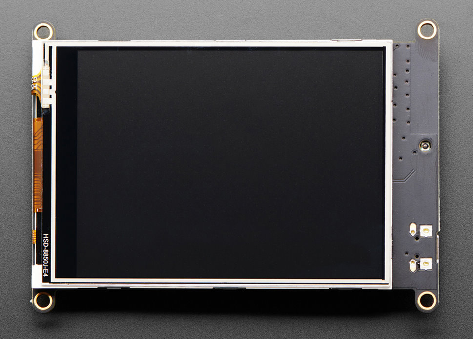](https://blog.adafruit.com/2024/07/29/circuitpython-day-is-august-16-2024/)

It’s that time of year! Adafruit has determined that August 16, 2024 is the snakiest day of the year and designated it CircuitPython Day! Adafruit will have special shows and more! Are you working with CircuitPython? Tag your projects #CircuitPythonDay2024 on social media and Adafruit will look to highlight them. Do you have events you’d like folks to attend or have projects in the works? Also tag your events #CircuitPythonDay2024. Stay tuned for additional details - [Adafruit Blog](https://blog.adafruit.com/2024/07/29/circuitpython-day-is-august-16-2024/).

## Feature

text - [site](url).

## HackSpace Magazine Says Farewell

HackSpace Magazine, Issue 81 just released, will be the last as the publication is folded into The MagPi Magazine. HackSpace featured a good amount of MicroPython/CircuitPython/Python content. Added pages to The MagPi will feature HackSpace content - [Raspberry Pi News](https://www.raspberrypi.com/news/a-farewell-from-hackspace-magazine/).

## Feature

text - [site](url).

## The Robocup Junior Competition in The Netherlands

[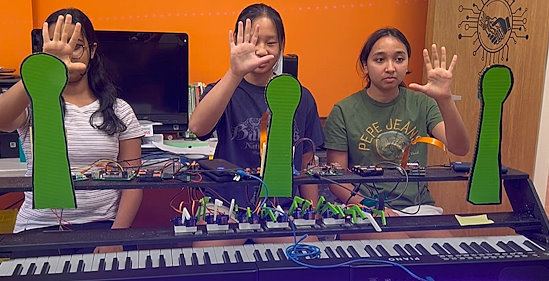](https://blog.adafruit.com/2024/07/31/adafruit-products-used-at-robocup-junior-competition-in-the-netherlands/)

Two teams of successful high school students with Storming Robots Technology Learning Lab in the US recently won world titles from this year’s international RoboCup Junior (RCJ) competition. Their entries used Raspberry Pi computers and Adafruit servo control boards, all rrunning Python - [Adafruit Blog](https://blog.adafruit.com/2024/07/31/adafruit-products-used-at-robocup-junior-competition-in-the-netherlands/).

## Olimex Teases a Low-Cost Dual-Core RISC-V Dev Board Built Around the Espressif ESP32-P4

[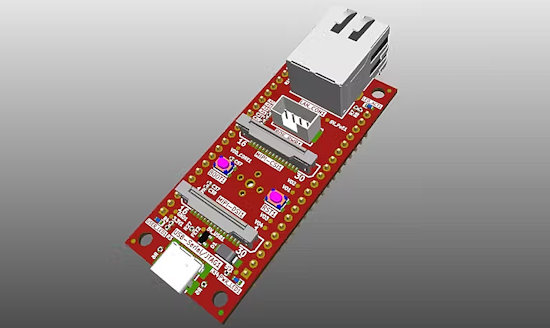](https://www.hackster.io/news/olimex-teases-a-low-cost-dual-core-risc-v-dev-board-built-around-the-espressif-esp32-p4-84333cbefeaf)

Bulgarian open hardware specialist Olimex has unveiled a near-final design for a gumstick-style development board built around the Espressif ESP32-P4 — the company's first to feature two full-performance RISC-V processor cores up to 400MHz, 16MB of SPI flash, and a camera interface with 1080p H.264 encoder — plus on-board Ethernet - [hackster.io](https://www.hackster.io/news/olimex-teases-a-low-cost-dual-core-risc-v-dev-board-built-around-the-espressif-esp32-p4-84333cbefeaf).

## This Week's Python Streams

Python on Hardware is all about building a cooperative ecosphere which allows contributions to be valued and to grow knowledge. Below are the streams within the last week focusing on the community.

**CircuitPython Deep Dive Stream**

[Last Friday](link), Tim streamed work on {subject}.

You can see the latest video and past videos on the Adafruit YouTube channel under the Deep Dive playlist - [YouTube](https://www.youtube.com/playlist?list=PLjF7R1fz_OOXBHlu9msoXq2jQN4JpCk8A).

**CircuitPython Parsec**

John Park’s CircuitPython Parsec this week is on {subject} - [Adafruit Blog](link) and [YouTube](link).

Catch all the episodes in the [YouTube playlist](https://www.youtube.com/playlist?list=PLjF7R1fz_OOWFqZfqW9jlvQSIUmwn9lWr).

**The Bootloader**

A monthly podcast loading you up with news, project updates, and product talk from the CircuitPython and maker communities. Hosted by Paul Cutler and Tod Kurt.

In the August 5th episode, Paul and Tod discuss the new MicroPython IDE ViperIDE, the MicroPython-powered Tulip music computer, and an interview with Debra Ansell about Teardown 2024 - [The Bootloader](https://thebootloader.net/).

**CircuitPython Weekly Meeting**

CircuitPython Weekly Meeting for July 29th 2024 ([notes](https://github.com/adafruit/adafruit-circuitpython-weekly-meeting/blob/main/2024/2024-07-29.md)) [on YouTube](https://youtu.be/iodCveNOAy4?si=3tAndwdRVjQcuBSo).

## Project of the Week

text - [site](url).

## Popular Last Week

[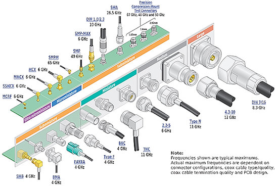](https://www.digikey.com/en/articles/engineer-guide-to-rf-cable-assembly-selection-and-use)

What was the most popular, most clicked link, in [last week's newsletter](https://www.adafruitdaily.com/2024/07/29/python-on-microcontrollers-newsletter-arduino-turns-to-zephyr-projects-galore-and-more-circuitpython-python-micropython-thepsf-raspberry_pi/)? [The Engineer’s Guide to RF Cable Assembly Selection and Use](https://www.digikey.com/en/articles/engineer-guide-to-rf-cable-assembly-selection-and-use).

## New Notes from Adafruit Playground

[Adafruit Playground](https://adafruit-playground.com/) is a new place for the community to post their projects and other making tips/tricks/techniques. Ad-free, it's an easy way to publish your work in a safe space for free.

[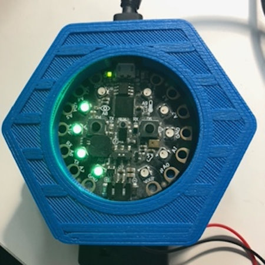](url)

text - [Adafruit Playground](url).

text - [Adafruit Playground](url).

text - [Adafruit Playground](url).

## News From Around the Web

text - [site](url).

Unleash Your Pico: a step-by-step guide to installing MicroPython - [NoCodeDeveloper Blog](https://nocodeappdeveloper.blogspot.com/2024/07/unleash-your-pico-step-by-step-guide-to.html).

[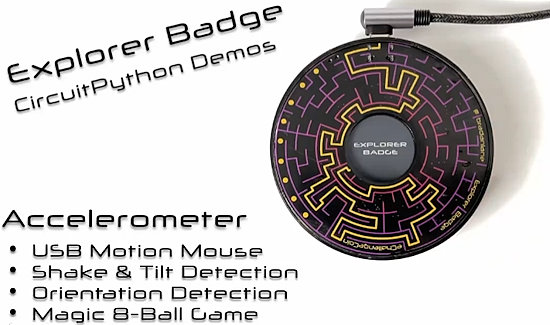](https://x.com/bradanlane/status/1817626838786556128)

Explorer Badge CircuitPython Demo reel - [X](https://x.com/bradanlane/status/1817626838786556128).

[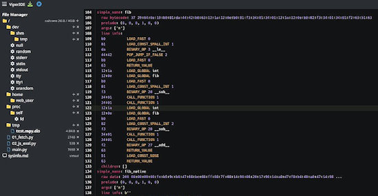](https://x.com/vshymanskyy/status/1818744327130300746)

ViperIDE is working on MicroPython disassembler - [X](https://x.com/vshymanskyy/status/1818744327130300746).

text - [site](url).

text - [site](url).

[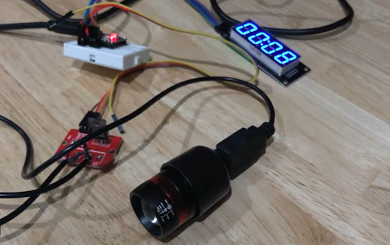](https://x.com/hitoriblog/status/1817059167812870440)

A USB power interval timer using RP2040-Zero and CircuitPython. The actual time was 30 minutes - 5 minutes. "It was so easy" - [X](https://x.com/hitoriblog/status/1817059167812870440) (Japanese).

[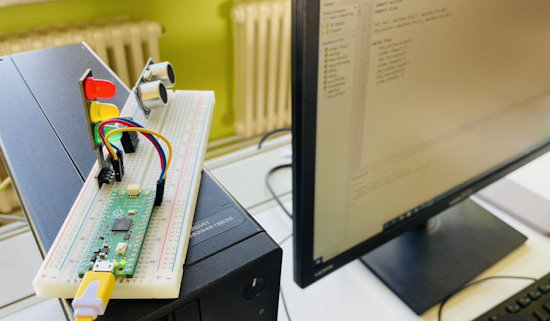](https://x.com/r_schulz_maker/status/1818715897974210843)

Using a Raspberry Pi Pico and MicroPython to create small Python projects. A traffic light controller is quickly programmed and offers students practical and exciting application possibilities for a text-based language such as Python - [X](https://x.com/r_schulz_maker/status/1818715897974210843).

text - [site](url).

text - [site](url).

text - [site](url).

text - [site](url).

text - [site](url).

text - [site](url).

text - [site](url).

text - [site](url).

[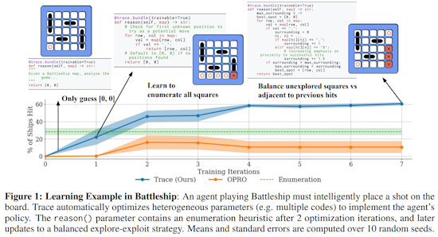](https://www.marktechpost.com/2024/07/28/microsoft-and-stanford-university-researchers-introduce-trace-a-groundbreaking-python-framework-poised-to-revolutionize-the-automatic-optimization-of-ai-systems/)

Microsoft and Stanford University researchers introduce Trace: a groundbreaking Python Framework poised to revolutionize the outomatic optimization of AI systems - [MarkTechPost](https://www.marktechpost.com/2024/07/28/microsoft-and-stanford-university-researchers-introduce-trace-a-groundbreaking-python-framework-poised-to-revolutionize-the-automatic-optimization-of-ai-systems/).

text - [site](url).

## New

[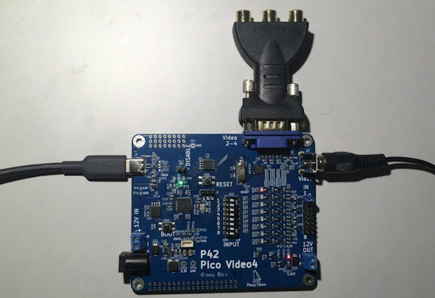](https://www.cnx-software.com/2024/07/23/raspberry-pi-rp2040-based-pico-video4-display-board-features-4-composite-video-outputs/)

Raspberry Pi RP2040-based Pico Video4 display board features 4 composite video outputs and can be programmed in MicroPython or C++ - [CNX Software](https://www.cnx-software.com/2024/07/23/raspberry-pi-rp2040-based-pico-video4-display-board-features-4-composite-video-outputs/).

[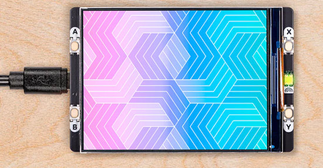](https://shop.pimoroni.com/products/pico-display-pack-2-8?variant=42047194005587)

Pico Display Pack 2.8" is a 2.8 inch diagonal display programmable in MicroPython or C++ - [Pimoroni](https://shop.pimoroni.com/products/pico-display-pack-2-8?variant=42047194005587).

## New Boards Supported by CircuitPython

The number of supported microcontrollers and Single Board Computers (SBC) grows every week. This section outlines which boards have been included in CircuitPython or added to [CircuitPython.org](https://circuitpython.org/).

This week, there were (#/no) new boards added:

- [Board name](url)
- [Board name](url)
- [Board name](url)

*Note: For non-Adafruit boards, please use the support forums of the board manufacturer for assistance, as Adafruit does not have the hardware to assist in troubleshooting.*

Looking to add a new board to CircuitPython? It's highly encouraged! Adafruit has four guides to help you do so:

- [How to Add a New Board to CircuitPython](https://learn.adafruit.com/how-to-add-a-new-board-to-circuitpython/overview)
- [How to add a New Board to the circuitpython.org website](https://learn.adafruit.com/how-to-add-a-new-board-to-the-circuitpython-org-website)
- [Adding a Single Board Computer to PlatformDetect for Blinka](https://learn.adafruit.com/adding-a-single-board-computer-to-platformdetect-for-blinka)
- [Adding a Single Board Computer to Blinka](https://learn.adafruit.com/adding-a-single-board-computer-to-blinka)

## New Learn Guides

[CNC Rotary Macropad](https://learn.adafruit.com/cnc-rotary-macropad) from [Ruiz Brothers](https://learn.adafruit.com/u/pixil3d)

[Colorful Creations with the New JLCPCB PCB Service](https://learn.adafruit.com/colorful-creations-with-the-new-jlcpcb-pcb-service) from [Anne Barela](https://learn.adafruit.com/u/AnneBarela)

## CircuitPython Libraries

The CircuitPython library numbers are continually increasing, while existing ones continue to be updated. Here we provide library numbers and updates!

To get the latest Adafruit libraries, download the [Adafruit CircuitPython Library Bundle](https://circuitpython.org/libraries). To get the latest community contributed libraries, download the [CircuitPython Community Bundle](https://circuitpython.org/libraries).

If you'd like to contribute to the CircuitPython project on the Python side of things, the libraries are a great place to start. Check out the [CircuitPython.org Contributing page](https://circuitpython.org/contributing). If you're interested in reviewing, check out Open Pull Requests. If you'd like to contribute code or documentation, check out Open Issues. We have a guide on [contributing to CircuitPython with Git and GitHub](https://learn.adafruit.com/contribute-to-circuitpython-with-git-and-github), and you can find us in the #help-with-circuitpython and #circuitpython-dev channels on the [Adafruit Discord](https://adafru.it/discord).

You can check out this [list of all the Adafruit CircuitPython libraries and drivers available](https://github.com/adafruit/Adafruit_CircuitPython_Bundle/blob/master/circuitpython_library_list.md). 

The current number of CircuitPython libraries is **###**!

**New Libraries**

Here's this week's new CircuitPython libraries:

* [library](url)

**Updated Libraries**

Here's this week's updated CircuitPython libraries:

* [library](url)

**Library PyPI Weekly Download Stats**

## What’s the CircuitPython team up to this week?

What is the team up to this week? Let’s check in:

**Dan**

I've done all the file merging and reviewing for the merging of MicroPython v1.22 into CircuitPython. I submitted a draft PR and fixed some minor errors that caused parts of the build to fail. Now I need to examine and fix the errors that are appearing when the tests are run. But there aren't many and I hope to finish the merge soon.

**Melissa**

text.

**Tim**

This week I tested some changes that add backwards compatibility to Blinka DisplayIO on a Raspberry Pi. I've also been continuing move libraries over to use Ruff instead of Black and PyLint as I'm looking into them to review PRs. The other thing I did was looking into RTD builds to try to confirm a new fix for an issue that resulted in the board module documentation page being blank.

**Scott**

This last week I've continued work on CircuitMatter. I've successfully established a passcode based secure channel and decrypted the next message sent over it. It is part of the "interaction model" layer of Matter so I'm laying more groundwork for how that layer will work. I suspect it is the same layer that user code will interact with from within Python/CircuitPython.

**Liz**

This week I worked on code for the [CNC Rotary Macropad guide](https://learn.adafruit.com/cnc-rotary-macropad). This project is a collab with the Ruiz brothers and uses a Feather RP2040 with ortho snap apart NeoKeys and a chonky CNC rotary encoder. I wrote the code to be easily customizable for folks so that they could change the shortcuts if they wanted to.

## Upcoming Events

The next MicroPython Meetup in Melbourne will be on July 24 – [Meetup](https://www.meetup.com/micropython-meetup/events). You can see recordings of previous meetings on [YouTube](https://www.youtube.com/@MicroPythonOfficial). The July 2024 [Video](https://www.youtube.com/watch?v=soQlLZ0JlCI).

Espressif DevCon24 will be held Sep 3-5, 13:00-18:00 CEST. Call for presentations now - [Espressif](https://devcon.espressif.com/).

Maker Faire Bay Area returns to Mare Island Naval Shipyard on October 18-20, 2024 - [Maker Faire](https://makerfaire.com/bay-area/).

**Send Your Events In**

If you know of virtual events or upcoming events, please let us know via email to cpnews(at)adafruit(dot)com.

## Latest Releases

CircuitPython's stable release is [#.#.#](https://github.com/adafruit/circuitpython/releases/latest) and its unstable release is [#.#.#-##.#](https://github.com/adafruit/circuitpython/releases). New to CircuitPython? Start with our [Welcome to CircuitPython Guide](https://learn.adafruit.com/welcome-to-circuitpython).

[2024####](https://github.com/adafruit/Adafruit_CircuitPython_Bundle/releases/latest) is the latest Adafruit CircuitPython library bundle.

[2024####](https://github.com/adafruit/CircuitPython_Community_Bundle/releases/latest) is the latest CircuitPython Community library bundle.

[v#.#.#](https://micropython.org/download) is the latest MicroPython release. Documentation for it is [here](http://docs.micropython.org/en/latest/pyboard/).

[#.#.#](https://www.python.org/downloads/) is the latest Python release. The latest pre-release version is [#.#.#](https://www.python.org/download/pre-releases/).

[#,### Stars](https://github.com/adafruit/circuitpython/stargazers) Like CircuitPython? [Star it on GitHub!](https://github.com/adafruit/circuitpython)

## Call for Help -- Translating CircuitPython is now easier than ever

[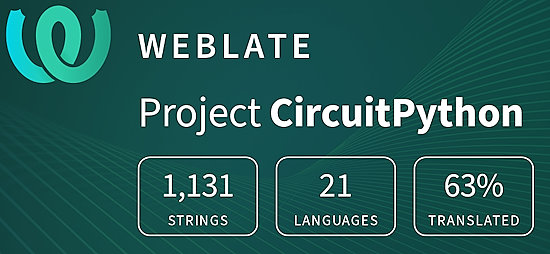](https://hosted.weblate.org/engage/circuitpython/)

One important feature of CircuitPython is translated control and error messages. With the help of fellow open source project [Weblate](https://weblate.org/), we're making it even easier to add or improve translations. 

Sign in with an existing account such as GitHub, Google or Facebook and start contributing through a simple web interface. No forks or pull requests needed! As always, if you run into trouble join us on [Discord](https://adafru.it/discord), we're here to help.

## NUMBER Thanks

The Adafruit Discord community, where we do all our CircuitPython development in the open, reached over NUMBER humans - thank you! Adafruit believes Discord offers a unique way for Python on hardware folks to connect. Join today at [https://adafru.it/discord](https://adafru.it/discord).

## ICYMI - In case you missed it

Python on hardware is the Adafruit Python video-newsletter-podcast! The news comes from the Python community, Discord, Adafruit communities and more and is broadcast on ASK an ENGINEER Wednesdays. The complete Python on Hardware weekly videocast [playlist is here](https://www.youtube.com/playlist?list=PLjF7R1fz_OOXRMjM7Sm0J2Xt6H81TdDev). The video podcast is on [iTunes](https://itunes.apple.com/us/podcast/python-on-hardware/id1451685192?mt=2), [YouTube](http://adafru.it/pohepisodes), [Instagram](https://www.instagram.com/adafruit/channel/)), and [XML](https://itunes.apple.com/us/podcast/python-on-hardware/id1451685192?mt=2).

[The weekly community chat on Adafruit Discord server CircuitPython channel - Audio / Podcast edition](https://itunes.apple.com/us/podcast/circuitpython-weekly-meeting/id1451685016) - Audio from the Discord chat space for CircuitPython, meetings are usually Mondays at 2pm ET, this is the audio version on [iTunes](https://itunes.apple.com/us/podcast/circuitpython-weekly-meeting/id1451685016), Pocket Casts, [Spotify](https://adafru.it/spotify), and [XML feed](https://adafruit-podcasts.s3.amazonaws.com/circuitpython_weekly_meeting/audio-podcast.xml).

## Contribute

The CircuitPython Weekly Newsletter is a CircuitPython community-run newsletter emailed every Monday. The complete [archives are here](https://www.adafruitdaily.com/category/circuitpython/). It highlights the latest CircuitPython related news from around the web including Python and MicroPython developments. To contribute, edit next week's draft [on GitHub](https://github.com/adafruit/circuitpython-weekly-newsletter/tree/gh-pages/_drafts) and [submit a pull request](https://help.github.com/articles/editing-files-in-your-repository/) with the changes. You may also tag your information on Twitter with #CircuitPython. 

Join the Adafruit [Discord](https://adafru.it/discord) or [post to the forum](https://forums.adafruit.com/viewforum.php?f=60) if you have questions.
