- [ ] Library and info updates
- [ ] change date
- [ ] update title
- [ ] Feature story
- [ ] Update  for images
- [ ] Update ICYDNCI
- [ ] All images 550w max only
- [ ] Link "View this email in your browser."

News Sources

- [Adafruit Playground](https://adafruit-playground.com/)
- Twitter: [CircuitPython](https://twitter.com/search?q=circuitpython&src=typed_query&f=live), [MicroPython](https://twitter.com/search?q=micropython&src=typed_query&f=live) and [Python](https://twitter.com/search?q=python&src=typed_query)
- [Raspberry Pi News](https://www.raspberrypi.com/news/)
- Mastodon [CircuitPython](https://octodon.social/tags/CircuitPython) and [MicroPython](https://octodon.social/tags/MicroPython)
- [hackster.io CircuitPython](https://www.hackster.io/search?q=circuitpython&i=projects&sort_by=most_recent) and [MicroPython](https://www.hackster.io/search?q=micropython&i=projects&sort_by=most_recent)
- YouTube: [CircuitPython](https://www.youtube.com/results?search_query=circuitpython&sp=CAI%253D), [MicroPython](https://www.youtube.com/results?search_query=micropython&sp=CAI%253D)
- Instructables: [CircuitPython](https://www.instructables.com/search/?q=circuitpython&projects=all&sort=Newest), [MicroPython](https://www.instructables.com/search/?q=micropython&projects=all&sort=Newest), [Raspberry Pi Python](https://www.instructables.com/search/?q=raspberry+pi+python&projects=all&sort=Newest)
- [python.org](https://www.python.org/)
- [Python Insider - dev team blog](https://pythoninsider.blogspot.com/)
- Individuals: [Jeff Geerling](https://www.jeffgeerling.com/blog)
- Tom's Hardware: [CircuitPython](https://www.tomshardware.com/search?searchTerm=circuitpython&articleType=all&sortBy=publishedDate) and [MicroPython](https://www.tomshardware.com/search?searchTerm=micropython&articleType=all&sortBy=publishedDate) and [Raspberry Pi](https://www.tomshardware.com/search?searchTerm=raspberry%20pi&articleType=all&sortBy=publishedDate)
- [hackaday.io newest projects MicroPython](https://hackaday.io/projects?tag=micropython&sort=date) and [CircuitPython](https://hackaday.io/projects?tag=circuitpython&sort=date)
- [Google News Python](https://news.google.com/topics/CAAqIQgKIhtDQkFTRGdvSUwyMHZNRFY2TVY4U0FtVnVLQUFQAQ?hl=en-US&gl=US&ceid=US%3Aen)
- [hackaday CircuitPython](https://hackaday.com/blog/?s=circuitpython) and [MicroPython](https://hackaday.com/blog/?s=micropython)
- hackaday.io - [CircuitPython](https://hackaday.io/search?term=circuitpython) and [MicroPython](https://hackaday.io/search?term=micropython)

View this email in your browser. **Warning: Flashing Imagery**

Welcome to the latest Python on Microcontrollers newsletter! *insert 2-3 sentences from editor (what's in overview, banter)* - *Anne Barela, Editor*

We're on [Discord](https://discord.gg/HYqvREz), [Twitter](https://twitter.com/search?q=circuitpython&src=typed_query&f=live), and for past newsletters - [view them all here](https://www.adafruitdaily.com/category/circuitpython/). If you're reading this on the web, [subscribe here](https://www.adafruitdaily.com/). Here's the news this week:

## 300th Issue

We're celebrating today the publishing of the 300th Python on Microcontrollers Newsletter. Publishes since November, 2016, we've provided a free resource to the Python on hardware community. Thank you to all our subscribers and contributors - [Adafruit Blog](https://blog.adafruit.com/2024/08/09/coming-monday-the-300th-python-on-microcontrollers-newsletter/).

## CircuitPython Day is This Friday August 16th!

Adafruit has determined that August 16, 2024 is the snakiest day of the year and designated it CircuitPython Day! Come Celebrate with us! - [Adafruit Blog](https://blog.adafruit.com/2024/07/29/circuitpython-day-is-august-16-2024/).

Adafruit will have special shows and more (all times US Eastern):

* 11am 3D Hangouts with Noe & Pedro
* 1pm  Maker Chat: Guy Dupont
* 2pm  CircuitPython Project Highlights with Paul Cutler & Tod Kurt
* 4pm  JP’s Workshop
* 5pm  Deep Dive with Scott
* 6pm  CircuitPython Game Jam with Tim
* More content will be announced when scheduled [here](https://blog.adafruit.com/2024/07/29/circuitpython-day-is-august-16-2024/).

Are you working with CircuitPython? Tag your projects #CircuitPythonDay2024 on social media and Adafruit will look to highlight them. 

## SPECIAL: Raspberry Pi Releases the New RP2350 Microcontroller and Pico 2 Board

[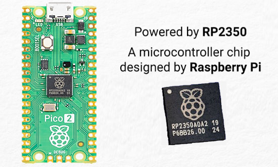](url)

Raspberry Pi has released a new microcontroller, the RP2350, last Thursday in conjunction with DEF CON 23 (the official badge uses the new chip). A new board was also released, the Raspberry Pi Pico 2. The RP2340 comes in two packages, one with 30 pins and one with 48 pins providing additional GPIO. The new chips use two Arm Cortex M33 cores + floating point unit and also have two RISC-V HAZARD3 cores (only one set usable at a time). The clock speed is bumped to 150 MHz but with the new architecture and floating point along with 3 PIO units. The speed is about double at stock clocks, while using less power. Besides Raspberry Pi Pico, there are over 30 boards announced at launch from a variety of vendors - [Raspberry Pi News](https://www.raspberrypi.com/news/raspberry-pi-pico-2-our-new-5-microcontroller-board-on-sale-now/), [RP2350 Datasheet](https://datasheets.raspberrypi.com/rp2350/rp2350-datasheet.pdf) (PDF), [Pico 2 Datasheet](https://datasheets.raspberrypi.com/pico/pico-2-datasheet.pdf) (PDF)

[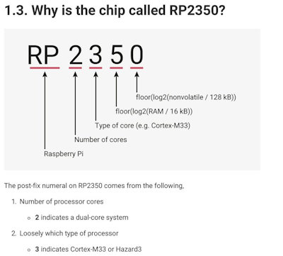](https://datasheets.raspberrypi.com/rp2350/rp2350-datasheet.pdf)

[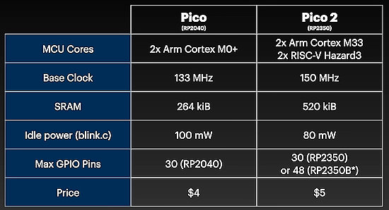](https://www.tomshardware.com/raspberry-pi/raspberry-pi-pico/raspberry-pi-pico-2-launches-with-arm-risc-v-cores-hands-on-with-the-new-dollar5-microcontroller)

The RP2350 Boot ROM source code - [GitHub](https://github.com/raspberrypi/pico-bootrom-rp2350).

[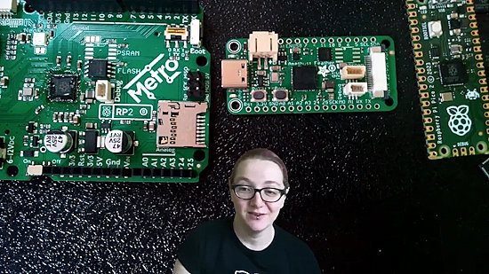](https://youtube.com/live/n5j3Y2Naao0)

Adafruit's Ladyada discusses the RP2350 and shows the new Adafruit Feather RP2350 and Metro RP2350 - [YouTube](https://youtube.com/live/n5j3Y2Naao0).

### Reviews 

* Introducing Raspberry Pi Pico 2, our new $5 microcontroller board - [YouTube - Raspberry Pi](https://www.youtube.com/watch?v=zvQ-2onciJM).
* Raspberry Pi Pico 2: a RISC-V bet - [YouTube - Jeff Geerling](https://www.youtube.com/watch?v=oXF_lVwA8A4).
* Raspberry Pi Pico 2 Launches with Arm + Risc V Cores: hands-on with the new, $5 microcontroller - [Tom's Hardware - Les Pounder](https://www.tomshardware.com/raspberry-pi/raspberry-pi-pico/raspberry-pi-pico-2-launches-with-arm-risc-v-cores-hands-on-with-the-new-dollar5-microcontroller)
* Raspberry Pi Pico 2 & RP2350 Launch - [YouTube - Pimoroni](https://www.youtube.com/watch?v=0oI4B1lpeQ8).
* Raspberry has a New Pico, Built with the New RP2350 - [Hackaday](https://hackaday.com/2024/08/08/raspberry-has-a-new-pico-and-the-rp2350/).

[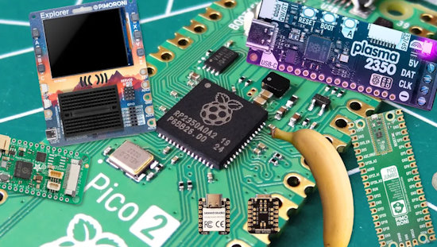](https://www.tomshardware.com/raspberry-pi/raspberry-pi-pico/new-raspberry-pi-rp2350-arm-risc-chip-to-power-dozens-of-new-devices-heres-a-running-list)

The new Raspberry Pi RP2350 Arm + RISC chip is to power dozens of new devices. Tom's Hardware is keeping a running list - [Tom's Hardware](https://www.tomshardware.com/raspberry-pi/raspberry-pi-pico/new-raspberry-pi-rp2350-arm-risc-chip-to-power-dozens-of-new-devices-heres-a-running-list) as is [Raspberry Pi](https://www.raspberrypi.com/for-industry/powered-by/product-catalogue/?category=RP2350).

## MicroPython and CircuitPython Support for the RP2350 Chip

[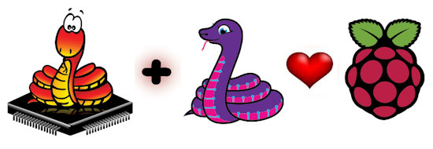](https://circuitpython.org/)

CircuitPython on Friday released version [9.2.0-alpha.2350](https://github.com/adafruit/circuitpython/releases/tag/9.2.0-alpha.2350) which includes preliminary support for the new Raspberry Pi RP2350 and minor fixes for other enhancements. MicroPython has a [GitHub Pull Request](https://github.com/micropython/micropython/pull/15619) (PR) to its codebase to support the RP2350.

Look for new builds in the repo Releases sections when the builds are working - [CircuitPython](https://github.com/adafruit/circuitpython/releases) and [MicroPython](https://github.com/micropython/micropython/releases).

## RP2350 Security Features

[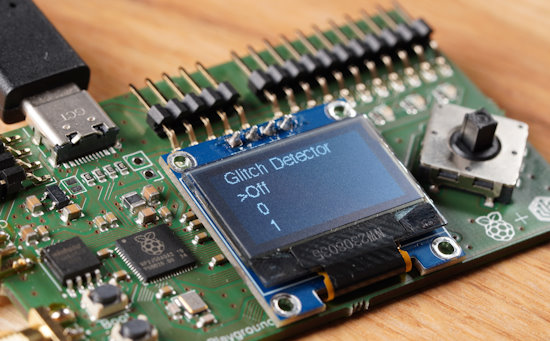](https://x.com/ghidraninja/status/1821570157933912462)

There are multiple security features in the new Raspberry Pi RP2350. These include glitch detectors, a redundancy coprocessor, secure boot, Arm TrustZone-M, debug protection, and OTP protections. There is also a $10,000 hacking challenge from Hextree.io if someone manages to hack the chip - [X Thread](https://x.com/ghidraninja/status/1821570157933912462).

## RP2350 In Action: Real-time ML Audio Noise Suppression on Raspberry Pi Pico 2

[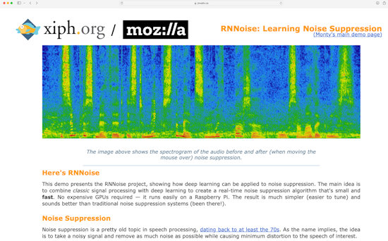](https://www.raspberrypi.com/news/real-time-ml-audio-noise-suppression-on-raspberry-pi-pico-2/)

Sandeep Mistry, Principal Software Engineer with Arm, goes through a way to apply audio noise suppression to a microphone input on the Pico and the Pico 2, showing a 1687% speed-up on the new board - [Raspberry Pi News](https://www.raspberrypi.com/news/real-time-ml-audio-noise-suppression-on-raspberry-pi-pico-2/).

## A Controller for Beginners to Build Advanced Robots using RP2350 MCU

[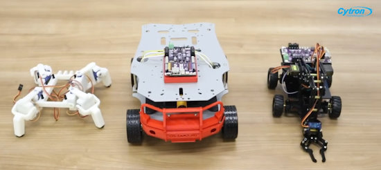](https://www.youtube.com/watch?v=UtYofD5CTI4)

Cytron demonstrates a robot controller using the new RP23500. Their product page has links to CircuitPython and MicroPython showing intention for both to run on the board - [YouTube](https://www.youtube.com/watch?v=UtYofD5CTI4) and [Product](https://www.cytron.io/p-motion-2350-pro).

## Python Scores Its Highest Rating in The TIOBE Programming Language Index

Python has scored its highest rating ever, 18.04%, in Tiobe’s index of programming language popularity for August 2024. Python became the first language to reach 18% mark since Java in November 2016 - [InfoWorld](https://www.infoworld.com/article/3481502/python-scores-its-highest-rating-in-tiobe-index.html) and [TIOBE](https://www.tiobe.com/tiobe-index/).

## Five First-Rate Linux Distros For Power Users

[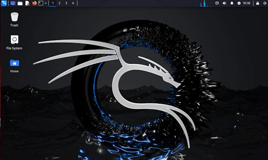](https://www.zdnet.com/article/5-first-rate-linux-distros-for-power-users-or-anyone-seeking-challenge/)

Details on five first-rate Linux distros for power users. For advanced users, these distributions are worth the extra bother - [ZDnet](https://www.zdnet.com/article/5-first-rate-linux-distros-for-power-users-or-anyone-seeking-challenge/).

## This Week's Python Streams

Python on Hardware is all about building a cooperative ecosphere which allows contributions to be valued and to grow knowledge. Below are the streams within the last week focusing on the community.

**CircuitPython Deep Dive Stream**

[Last Friday](link), Scott streamed work on {subject}.

You can see the latest video and past videos on the Adafruit YouTube channel under the Deep Dive playlist - [YouTube](https://www.youtube.com/playlist?list=PLjF7R1fz_OOXBHlu9msoXq2jQN4JpCk8A).

**CircuitPython Parsec**

John Park’s CircuitPython Parsec this week is on {subject} - [Adafruit Blog](link) and [YouTube](link).

Catch all the episodes in the [YouTube playlist](https://www.youtube.com/playlist?list=PLjF7R1fz_OOWFqZfqW9jlvQSIUmwn9lWr).

**CircuitPython Weekly Meeting**

CircuitPython Weekly Meeting for August 5, 2024 ([notes](https://github.com/adafruit/adafruit-circuitpython-weekly-meeting/blob/main/2024/2024-08-05.md)) [on YouTube](https://youtu.be/Y9_YeT9stZo).

## Project of the Week: The DEF CON 32 Badge

[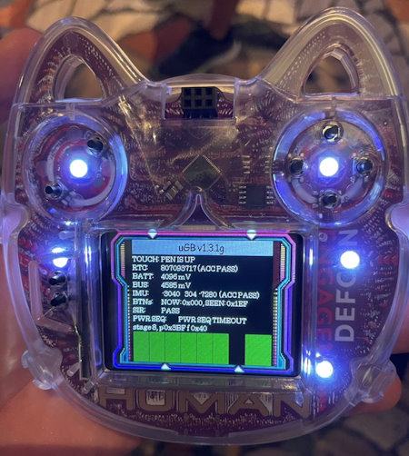](https://x.com/stranckV2/status/1821346225053966830)

The official DEF CON 32 badge was released at the same time as the RP2350 as it features the RP2350 (upper center). The official firmware runs rePalm (Palm OS) by [dimitry.gr](https://dmitry.gr/?r=06.%20Thoughts&proj=11.%20RP2350) but of course can run MicroPython or CircuitPython when the UF2 files are ready - [site](url).

## Popular Last Week

[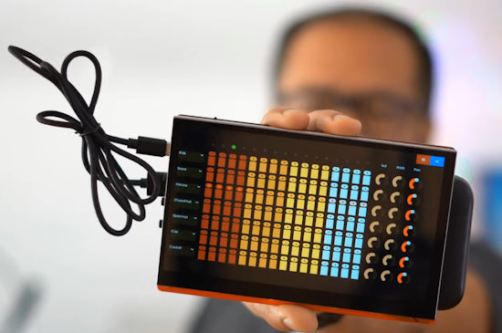](https://github.com/shorepine/tulipcc)

What was the most popular, most clicked link, in [last week's newsletter](https://www.adafruitdaily.com/2024/08/05/python-on-microcontrollers-newsletter-circuitpython-day-2024-a-micropython-computer-and-much-more-circuitpython-python-micropython-thepsf-raspberry_pi/)? [Tulip Creative Computer](https://github.com/shorepine/tulipcc).

## New Notes from Adafruit Playground

[Adafruit Playground](https://adafruit-playground.com/) is a new place for the community to post their projects and other making tips/tricks/techniques. Ad-free, it's an easy way to publish your work in a safe space for free.

[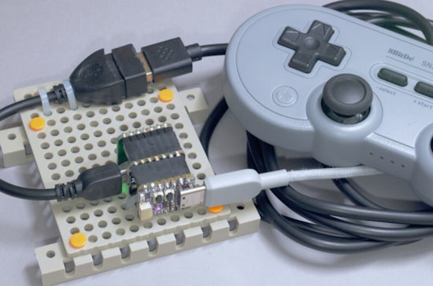](https://adafruit-playground.com/u/SamBlenny/pages/usb-host-gamepad-decoder)

USB Host Gamepad Decoder - [Adafruit Playground](https://adafruit-playground.com/u/SamBlenny/pages/usb-host-gamepad-decoder).

[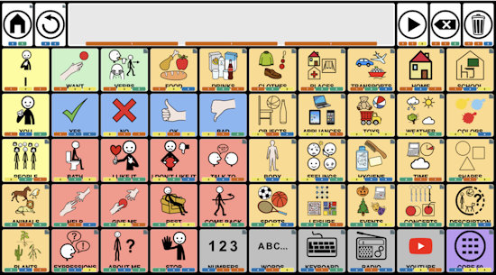](https://adafruit-playground.com/u/loretod/pages/hoffman-input-device-using-neokey-1x4-for-aac-access)

Hoffman Input Device using Neokey 1x4 for AAC Access - [Adafruit Playground](https://adafruit-playground.com/u/loretod/pages/hoffman-input-device-using-neokey-1x4-for-aac-access).

[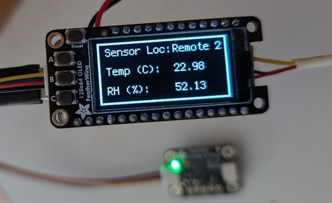](https://adafruit-playground.com/u/jgmangum/pages/home-can-bus-network-using-telephone-wiring)

Home CAN Bus Network Using Telephone Wiring - [Adafruit Playground](https://adafruit-playground.com/u/jgmangum/pages/home-can-bus-network-using-telephone-wiring).

## News From Around the Web

[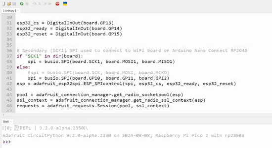](https://www.youtube.com/watch?v=URr6Wqh7uWY)

Les Pounder hacks WiFi onto a Pico 2 via an Adafruit Airlift ESP32 board - [YouTube](https://www.youtube.com/watch?v=URr6Wqh7uWY) via [X](https://x.com/biglesp/status/1821800774659166581).

[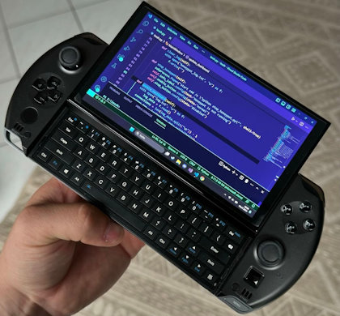](https://x.com/dfrobotcn/status/1821358416155029935)

This post shows [a modern handheld AMD Ryzen PC](https://www.gpd.hk/gpdwin4) editing MicroPython code on the go - [X](https://x.com/dfrobotcn/status/1821358416155029935).

[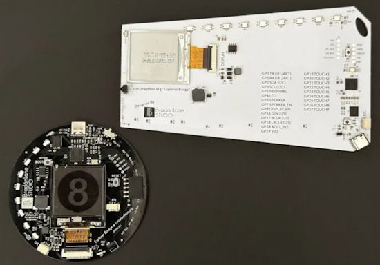](https://discord.com/channels/327254708534116352/334905778857050125/1271101269477687353)

The DCNextGen badge was demonstrated on the last Adafruit Show and Tell. It is packed with hardware, runing a RP2040 with 8MB of flash storage. The badge also has a 200x200 tri-color ePaper display, 2KB of EEPROM, PWM audio with mono amp, I2S audio output (via a header), NeoPixels, touch pads (each letter is a touch pad), diagnostics LED, USB-C, STEMMA-QT, and IR receiver and emitter - [Discord](https://discord.com/channels/327254708534116352/334905778857050125/1271101269477687353).

[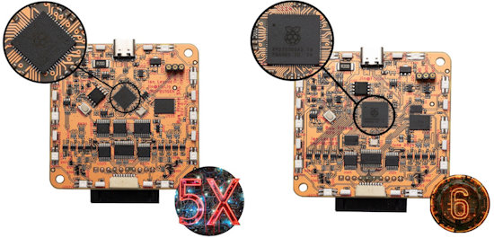](https://x.com/dangerousproto/status/1821562854962528558)

The new Bus Pirate 5XL and 6 use the RP2350A and RP2350B with its upgraded RAM and newer ARM cores - [X](https://x.com/dangerousproto/status/1821562854962528558).

[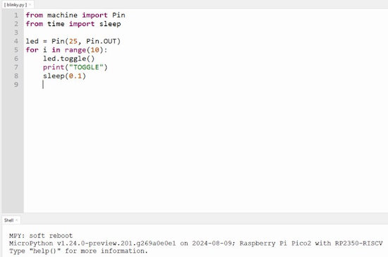](https://x.com/biglesp/status/1821591434367209956)

First steps with RISC-V MicroPython on the Raspberry Pi Pico 2. This code works - [X](https://x.com/biglesp/status/1821591434367209956).

[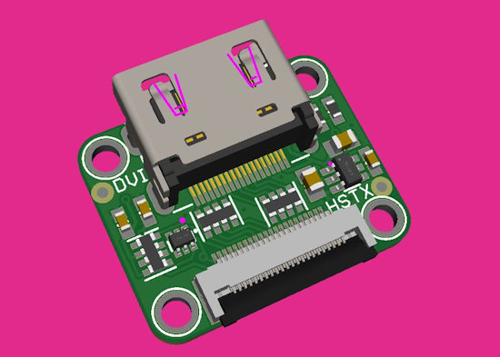](https://x.com/adafruit/status/1821959538737582110)

Adafruit teases an HSTX to DVI (HDMI plug) adapter board for use with RP2350 boards with an HSTX connector - [X](https://x.com/adafruit/status/1821959538737582110).

The Open Source Hardware Association works to spread awareness and knowledge of open source practices. OSHWA is in a pickle! In the US where the not for profit is registered there is a law stating that one third of all income must be from the public. Wwhile they have been extremely lucky to have received government grants, if they don't have enough public contributions their status will be revoked. With a purchase of a tee/hoodie you'll be helping maintain their status and any additional funds raised will go right back into making cool things happen in the community - [Custom Ink](https://www.customink.com/fundraising/oshwa?side=front&type=2&zoom=false).

text - [site](url).

text - [site](url).

text - [site](url).

text - [site](url).

text - [site](url).

text - [site](url).

[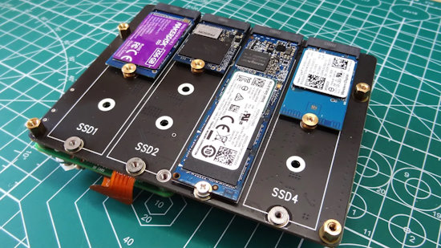](https://www.tomshardware.com/raspberry-pi/geekworm-x1011-review)

Geekworm X1011 Review, four NVMe drive add-ons for the flagship Raspberry Pi 5 - [Tom's Hardware](https://www.tomshardware.com/raspberry-pi/geekworm-x1011-review).

[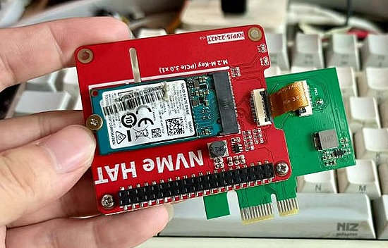](https://x.com/tltangliang/status/1821122252198572525)

Open HAT-PCIe by Rex Tang takes a Raspberry Pi NVMe HAT and turns it into a PCIe card - [X](https://x.com/tltangliang/status/1821122252198572525) and [GitHub](https://github.com/tltangliang/open-HAT-PCIe/).

## New

[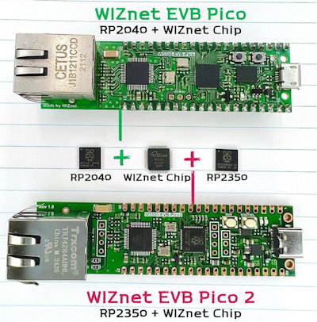](https://x.com/WiznetTeam/status/1821772950422614491)

The WIZnet EVB Pico 2 features the new RP2350 and WIZnet Ethernet Chip - [X](https://x.com/WiznetTeam/status/1821772950422614491).

[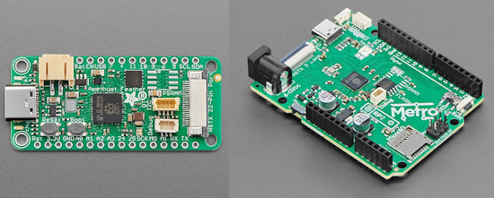](https://circuitpython.org/downloads)

With the release of the RP2350, Adafruit has announced the Feather RP2359 and the Metro RP2350 - [CircuitPython.org](https://circuitpython.org/downloads), [Feather RP2350](https://www.adafruit.com/product/6000) and [Metro RP2350](https://www.adafruit.com/product/6003).

[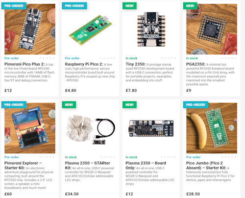](https://shop.pimoroni.com/collections/rp2350)

Pimoroni has announced eight boards using the RP2350 - [Pimoroni](https://shop.pimoroni.com/collections/rp2350).

text - [site](url).

## New Boards Supported by CircuitPython

The number of supported microcontrollers and Single Board Computers (SBC) grows every week. This section outlines which boards have been included in CircuitPython or added to [CircuitPython.org](https://circuitpython.org/).

This week there were six new boards added:

- [Feather RP2350](https://circuitpython.org/board/adafruit_feather_rp2350/)
- [Metro RP2350](https://circuitpython.org/board/adafruit_metro_rp2350/)
- [Pico 2](https://circuitpython.org/board/raspberry_pi_pico2/)
- [RP2350 Stamp](https://circuitpython.org/board/solderparty_rp2350_stamp/)
- [RP2350 Stamp XL](https://circuitpython.org/board/solderparty_rp2350_stamp_xl/)
- [RP2040-One](https://circuitpython.org/board/waveshare_rp2040_one/)

*Note: For non-Adafruit boards, please use the support forums of the board manufacturer for assistance, as Adafruit does not have the hardware to assist in troubleshooting.*

Looking to add a new board to CircuitPython? It's highly encouraged! Adafruit has four guides to help you do so:

- [How to Add a New Board to CircuitPython](https://learn.adafruit.com/how-to-add-a-new-board-to-circuitpython/overview)
- [How to add a New Board to the circuitpython.org website](https://learn.adafruit.com/how-to-add-a-new-board-to-the-circuitpython-org-website)
- [Adding a Single Board Computer to PlatformDetect for Blinka](https://learn.adafruit.com/adding-a-single-board-computer-to-platformdetect-for-blinka)
- [Adding a Single Board Computer to Blinka](https://learn.adafruit.com/adding-a-single-board-computer-to-blinka)

## New Learn Guides

[Sound Reactive LED Top Hat](https://learn.adafruit.com/sound-reactive-led-top-hat) from [Erin St Blaine](https://learn.adafruit.com/u/firepixie)

[Grill Thermometer Dashboard](https://learn.adafruit.com/grill-thermometer-dashboard) from [John Park](https://learn.adafruit.com/grill-thermometer-dashboard)

[Feather RP2040 DVI CircuitPython Day 2024 Countdown Clock](https://learn.adafruit.com/feather-rp2040-dvi-circuitpython-day-2024-countdown-clock) from [Liz Clark](https://learn.adafruit.com/u/BlitzCityDIY)

[Feather ESP32-S3 TFT CircuitPython Day 2024 Countdown Clock](https://learn.adafruit.com/feather-esp32-s3-tft-circuitpython-day-2024-countdown-clock) from [Liz Clark](https://learn.adafruit.com/u/BlitzCityDIY)

## CircuitPython Libraries

The CircuitPython library numbers are continually increasing, while existing ones continue to be updated. Here we provide library numbers and updates!

To get the latest Adafruit libraries, download the [Adafruit CircuitPython Library Bundle](https://circuitpython.org/libraries). To get the latest community contributed libraries, download the [CircuitPython Community Bundle](https://circuitpython.org/libraries).

If you'd like to contribute to the CircuitPython project on the Python side of things, the libraries are a great place to start. Check out the [CircuitPython.org Contributing page](https://circuitpython.org/contributing). If you're interested in reviewing, check out Open Pull Requests. If you'd like to contribute code or documentation, check out Open Issues. We have a guide on [contributing to CircuitPython with Git and GitHub](https://learn.adafruit.com/contribute-to-circuitpython-with-git-and-github), and you can find us in the #help-with-circuitpython and #circuitpython-dev channels on the [Adafruit Discord](https://adafru.it/discord).

You can check out this [list of all the Adafruit CircuitPython libraries and drivers available](https://github.com/adafruit/Adafruit_CircuitPython_Bundle/blob/master/circuitpython_library_list.md). 

The current number of CircuitPython libraries is **490**!

**New Libraries**

Here's this week's new CircuitPython libraries:

  * [todbot/CircuitPython_TMIDI](https://github.com/todbot/CircuitPython_TMIDI)

**Library PyPI Weekly Download Stats**

**Total Library Stats**
  * 166667 PyPI downloads over 331 libraries

**Top 10 Libraries by PyPI Downloads**
  * Adafruit CircuitPython Requests (adafruit-circuitpython-requests): 11956
  * Adafruit CircuitPython BusDevice (adafruit-circuitpython-busdevice): 11091
  * Adafruit CircuitPython ConnectionManager (adafruit-circuitpython-connectionmanager): 9850
  * Adafruit CircuitPython Register (adafruit-circuitpython-register): 2528
  * Adafruit CircuitPython ADS1x15 (adafruit-circuitpython-ads1x15): 2133
  * Adafruit CircuitPython MiniMQTT (adafruit-circuitpython-minimqtt): 1642
  * Adafruit CircuitPython Wiznet5k (adafruit-circuitpython-wiznet5k): 1500
  * Adafruit CircuitPython DHT (adafruit-circuitpython-dht): 1363
  * Adafruit CircuitPython ESP32SPI (adafruit-circuitpython-esp32spi): 1290
  * Adafruit CircuitPython Pixelbuf (adafruit-circuitpython-pixelbuf): 1283

## What’s the CircuitPython team up to this week?

What is the team up to this week? Let’s check in:

**Dan**

I was on vacation most of the week before last. I'm continuing on the MicroPython v1.22 merge. I've fixed most of the test failures. When it's in good enough shape to merge, I'll take the PR out of draft mode, have it reviewed and merged, and then immediately start on the v1.23 merge.

**Melissa**

Over the past couple of weeks, I have been working on adding new features to the [CircuitPython Code Editor Beta Site](https://code-beta.circuitpython.org/) including handling multiple file operations, improved stability, and UI improvements. Feel free to give the beta site a try out and let us know what you think.

**Tim**

I've continued moving a few more libraries to Ruff while reviewing other PRs. I implemented the Formatter class for `Adafruit_Logging` library and added support for using a formatted timestamp in the log output. There was a bug causing it to log extra empty lines which I also submitted a fix for. I've started adding a function to test for intersection between `vectorio` shapes, in the PR currently it's been implemented for `Circle` and `Rectangle`, I am researching the geometry involved with an implementation for `Polygon`.

**Scott**

This week is [RP2350](https://www.raspberrypi.com/products/rp2350/) launch week! I've secretly been working on CircuitPython support off and on over the last few months. Most of what the RP2040 supports should *just work* thanks to the pico sdk. So, it'll be easy to upgrade to the faster CPU and double the RAM. RGBMatrix, USB host and sleep are still disabled. I'm sure we'll find more [issues](https://github.com/adafruit/circuitpython/issues?q=is%3Aissue+is%3Aopen+label%3Arp235x) as hardware becomes available. Hopefully by the time you are reading this the [pull request](https://github.com/adafruit/circuitpython/pull/9490) has been merged in.

## Upcoming Events

The next MicroPython Meetup in Melbourne will be on August 28 – [Meetup](https://www.meetup.com/micropython-meetup/events). You can see recordings of previous meetings on [YouTube](https://www.youtube.com/@MicroPythonOfficial). The July 2024 [Video](https://www.youtube.com/watch?v=soQlLZ0JlCI).

Espressif DevCon24 will be held Sep 3-5, 13:00-18:00 CEST. Call for presentations now - [Espressif](https://devcon.espressif.com/).

Maker Faire Bay Area returns to Mare Island Naval Shipyard California on October 18-20, 2024 - [Maker Faire](https://makerfaire.com/bay-area/).

Hackaday Superconference is an epic gathering of hardware hackers, makers, and tech enthusiasts happening November 1-3 in Pasadena, California - [Hackaday](https://hackaday.com/2024/08/06/tickets-for-supercon-2024-go-on-sale-now/) and [Eventbrite](https://www.eventbrite.com/e/2024-hackaday-superconference-tickets-965387338517).

**Send Your Events In**

If you know of virtual events or upcoming events, please let us know via email to cpnews(at)adafruit(dot)com.

## Latest Releases

CircuitPython's stable release is [9.1.1](https://github.com/adafruit/circuitpython/releases/latest) and its unstable release is [9.2.0-alpha2350](https://github.com/adafruit/circuitpython/releases). New to CircuitPython? Start with our [Welcome to CircuitPython Guide](https://learn.adafruit.com/welcome-to-circuitpython).

[20240730](https://github.com/adafruit/Adafruit_CircuitPython_Bundle/releases/latest) is the latest Adafruit CircuitPython library bundle.

[20240806](https://github.com/adafruit/CircuitPython_Community_Bundle/releases/latest) is the latest CircuitPython Community library bundle.

[v1.23.0](https://micropython.org/download) is the latest MicroPython release. Documentation for it is [here](http://docs.micropython.org/en/latest/pyboard/).

[3.12.5](https://www.python.org/downloads/) is the latest Python release. The latest pre-release version is [3.13.0rc1](https://www.python.org/download/pre-releases/).

[3,984 Stars](https://github.com/adafruit/circuitpython/stargazers) Like CircuitPython? [Star it on GitHub!](https://github.com/adafruit/circuitpython)

## Call for Help -- Translating CircuitPython is now easier than ever

[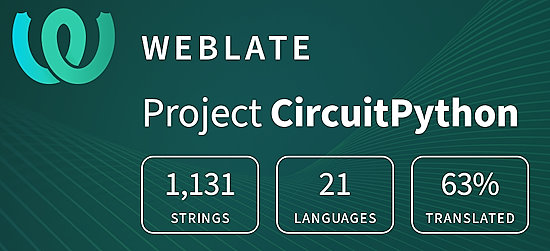](https://hosted.weblate.org/engage/circuitpython/)

One important feature of CircuitPython is translated control and error messages. With the help of fellow open source project [Weblate](https://weblate.org/), we're making it even easier to add or improve translations. 

Sign in with an existing account such as GitHub, Google or Facebook and start contributing through a simple web interface. No forks or pull requests needed! As always, if you run into trouble join us on [Discord](https://adafru.it/discord), we're here to help.

## 38,175 Thanks

The Adafruit Discord community, where we do all our CircuitPython development in the open, reached over 38,175 humans - thank you! Adafruit believes Discord offers a unique way for Python on hardware folks to connect. Join today at [https://adafru.it/discord](https://adafru.it/discord).

## ICYMI - In case you missed it

Python on hardware is the Adafruit Python video-newsletter-podcast! The news comes from the Python community, Discord, Adafruit communities and more and is broadcast on ASK an ENGINEER Wednesdays. The complete Python on Hardware weekly videocast [playlist is here](https://www.youtube.com/playlist?list=PLjF7R1fz_OOXRMjM7Sm0J2Xt6H81TdDev). The video podcast is on [iTunes](https://itunes.apple.com/us/podcast/python-on-hardware/id1451685192?mt=2), [YouTube](http://adafru.it/pohepisodes), [Instagram](https://www.instagram.com/adafruit/channel/)), and [XML](https://itunes.apple.com/us/podcast/python-on-hardware/id1451685192?mt=2).

[The weekly community chat on Adafruit Discord server CircuitPython channel - Audio / Podcast edition](https://itunes.apple.com/us/podcast/circuitpython-weekly-meeting/id1451685016) - Audio from the Discord chat space for CircuitPython, meetings are usually Mondays at 2pm ET, this is the audio version on [iTunes](https://itunes.apple.com/us/podcast/circuitpython-weekly-meeting/id1451685016), Pocket Casts, [Spotify](https://adafru.it/spotify), and [XML feed](https://adafruit-podcasts.s3.amazonaws.com/circuitpython_weekly_meeting/audio-podcast.xml).

## Contribute

The CircuitPython Weekly Newsletter is a CircuitPython community-run newsletter emailed every Monday. The complete [archives are here](https://www.adafruitdaily.com/category/circuitpython/). It highlights the latest CircuitPython related news from around the web including Python and MicroPython developments. To contribute, edit next week's draft [on GitHub](https://github.com/adafruit/circuitpython-weekly-newsletter/tree/gh-pages/_drafts) and [submit a pull request](https://help.github.com/articles/editing-files-in-your-repository/) with the changes. You may also tag your information on Twitter with #CircuitPython. 

Join the Adafruit [Discord](https://adafru.it/discord) or [post to t
