- [ ] Library and info updates
- [ ] change date
- [ ] update title
- [ ] Feature story
- [ ] Update  for images
- [ ] Update ICYDNCI
- [ ] All images 550w max only
- [ ] Link "View this email in your browser."

News Sources

- [Adafruit Playground](https://adafruit-playground.com/)
- Twitter: [CircuitPython](https://twitter.com/search?q=circuitpython&src=typed_query&f=live), [MicroPython](https://twitter.com/search?q=micropython&src=typed_query&f=live) and [Python](https://twitter.com/search?q=python&src=typed_query)
- [Raspberry Pi News](https://www.raspberrypi.com/news/)
- Mastodon [CircuitPython](https://octodon.social/tags/CircuitPython) and [MicroPython](https://octodon.social/tags/MicroPython)
- [hackster.io CircuitPython](https://www.hackster.io/search?q=circuitpython&i=projects&sort_by=most_recent) and [MicroPython](https://www.hackster.io/search?q=micropython&i=projects&sort_by=most_recent)
- YouTube: [CircuitPython](https://www.youtube.com/results?search_query=circuitpython&sp=CAI%253D), [MicroPython](https://www.youtube.com/results?search_query=micropython&sp=CAI%253D)
- Instructables: [CircuitPython](https://www.instructables.com/search/?q=circuitpython&projects=all&sort=Newest), [MicroPython](https://www.instructables.com/search/?q=micropython&projects=all&sort=Newest), [Raspberry Pi Python](https://www.instructables.com/search/?q=raspberry+pi+python&projects=all&sort=Newest)
- [python.org](https://www.python.org/)
- [Python Insider - dev team blog](https://pythoninsider.blogspot.com/)
- Individuals: [Jeff Geerling](https://www.jeffgeerling.com/blog)
- Tom's Hardware: [CircuitPython](https://www.tomshardware.com/search?searchTerm=circuitpython&articleType=all&sortBy=publishedDate) and [MicroPython](https://www.tomshardware.com/search?searchTerm=micropython&articleType=all&sortBy=publishedDate) and [Raspberry Pi](https://www.tomshardware.com/search?searchTerm=raspberry%20pi&articleType=all&sortBy=publishedDate)
- [hackaday.io newest projects MicroPython](https://hackaday.io/projects?tag=micropython&sort=date) and [CircuitPython](https://hackaday.io/projects?tag=circuitpython&sort=date)
- [Google News Python](https://news.google.com/topics/CAAqIQgKIhtDQkFTRGdvSUwyMHZNRFY2TVY4U0FtVnVLQUFQAQ?hl=en-US&gl=US&ceid=US%3Aen)
- [hackaday CircuitPython](https://hackaday.com/blog/?s=circuitpython) and [MicroPython](https://hackaday.com/blog/?s=micropython)
- hackaday.io - [CircuitPython](https://hackaday.io/search?term=circuitpython) and [MicroPython](https://hackaday.io/search?term=micropython)

View this email in your browser. **Warning: Flashing Imagery**

Welcome to the latest Python on Microcontrollers newsletter! *insert 2-3 sentences from editor (what's in overview, banter)* - *Anne Barela, Editor*

We're on [Discord](https://discord.gg/HYqvREz), [Twitter](https://twitter.com/search?q=circuitpython&src=typed_query&f=live), and for past newsletters - [view them all here](https://www.adafruitdaily.com/category/circuitpython/). If you're reading this on the web, [subscribe here](https://www.adafruitdaily.com/). Here's the news this week:

## Headline

text - [site](url).

## Feature

text - [site](url).

## Feature

text - [site](url).

## The RISC-V Cores in the New Raspberry Pi RP2350

[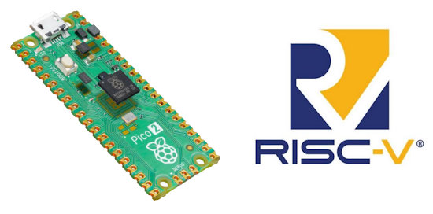](https://riscv.org/news/2024/08/raspberry-pi-launch-new-rp2350-microcontroller-and-pico-2-development-board-with-risc-v-support/)

RISCV.Org looks at the RISC-V cores included in the Raspberry Pi RP2350 chips and Pico 2 board - [RISC-V](https://riscv.org/news/2024/08/raspberry-pi-launch-new-rp2350-microcontroller-and-pico-2-development-board-with-risc-v-support/).

## A New MicroPython Disassembler is in ViperIDE v0.4.13

[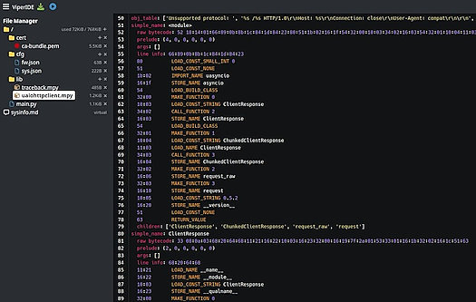](https://x.com/vshymanskyy/status/1823292913897345389)

A new MicroPython disassembler is in ViperIDE v0.4.13 (be sure to enable it in Settings to check out) - [X](https://x.com/vshymanskyy/status/1823292913897345389), [IDE](https://viper-ide.org/) and [GitHub](https://github.com/vshymanskyy/ViperIDE/blob/d27a5735cb0d1587105e2f845ec0bf2dda6750c3/src/python_utils.js#L153-L177).

## Intel Sells Stake in Arm, Estimated to Raise $147 Million, as Part of Their Business Turnaround

Intel sells stake in Arm, estimated to raise $147 million as part of business turnarounda  - [Tom's Hardware](https://www.tomshardware.com/pc-components/cpus/intel-sells-stake-in-arm-estimated-to-raise-dollar147-million-as-part-of-business-turnaround?utm_campaign=socialflow&utm_source=twitter.com&utm_medium=social).

## This Week's Python Streams

Python on Hardware is all about building a cooperative ecosphere which allows contributions to be valued and to grow knowledge. Below are the streams within the last week focusing on the community.

**CircuitPython Deep Dive Stream**

[Last Friday](link), Scott streamed work on {subject}.

You can see the latest video and past videos on the Adafruit YouTube channel under the Deep Dive playlist - [YouTube](https://www.youtube.com/playlist?list=PLjF7R1fz_OOXBHlu9msoXq2jQN4JpCk8A).

**CircuitPython Parsec**

John Park’s CircuitPython Parsec this week is on {subject} - [Adafruit Blog](link) and [YouTube](link).

Catch all the episodes in the [YouTube playlist](https://www.youtube.com/playlist?list=PLjF7R1fz_OOWFqZfqW9jlvQSIUmwn9lWr).

**CircuitPython Weekly Meeting**

CircuitPython Weekly Meeting for August 12, 2024 ([notes](https://github.com/adafruit/adafruit-circuitpython-weekly-meeting/blob/main/2024/2024-08-12.md)) [on YouTube](https://youtu.be/wz1TJreAlN8).

## Project of the Week: an RP2350-based CircuitPython Computer

[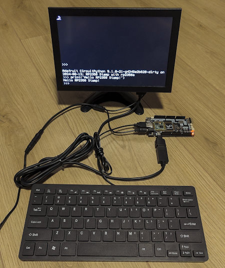](https://x.com/arturo182/status/1823133632657301822)

arturo182 on X (formerly Twitter) has the distinction of making the first Raspberry Pi RP2350-based CircuitPython computer. Sporting a DVI display and USB keyboard, it's self contained - [X](https://x.com/arturo182/status/1823133632657301822).

## Popular Last Week

What was the most popular, most clicked link, in [last week's newsletter](https://www.adafruitdaily.com/2024/08/12/python-on-microcontrollers-newsletter-300th-issue-the-new-raspberry-pi-rp2350-and-pico-2-and-much-more-circuitpython-python-micropython-thepsf-raspberry_pi/)? [Five First-Rate Linux Distros For Power Users](https://www.zdnet.com/article/5-first-rate-linux-distros-for-power-users-or-anyone-seeking-challenge/).

## New Notes from Adafruit Playground

[Adafruit Playground](https://adafruit-playground.com/) is a new place for the community to post their projects and other making tips/tricks/techniques. Ad-free, it's an easy way to publish your work in a safe space for free.

Web API's & You - [Adafruit Playground](https://adafruit-playground.com/u/DJDevon3/pages/web-api-s-you).

[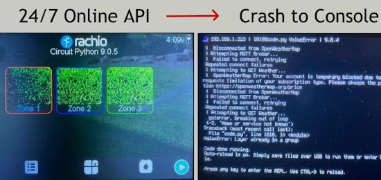](https://adafruit-playground.com/u/DJDevon3/pages/24-7-online-requests-with-circuit-python)

24/7 Online Requests with CircuitPython - [Adafruit Playground](https://adafruit-playground.com/u/DJDevon3/pages/24-7-online-requests-with-circuit-python).

[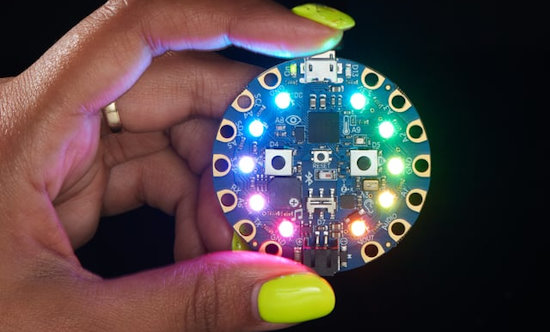](https://adafruit-playground.com/u/mpc823/pages/integrating-circuit-playground-bluefruit-into-home-assistant)

Integrating Circuit Playground Bluefruit into Home Assistant - [Adafruit Playground](https://adafruit-playground.com/u/mpc823/pages/integrating-circuit-playground-bluefruit-into-home-assistant).

[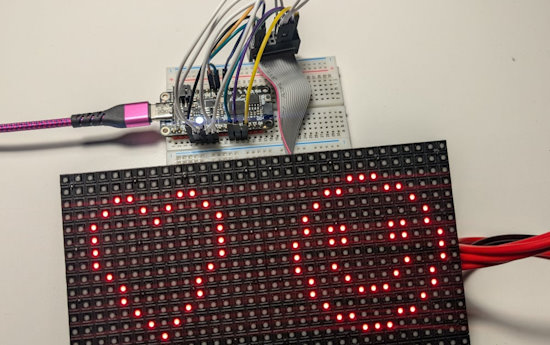](https://adafruit-playground.com/u/caternuson/pages/super-basic-rgb-matrix-driver-example)

Super Basic RGB Matrix Driver Example - [Adafruit Playground](https://adafruit-playground.com/u/caternuson/pages/super-basic-rgb-matrix-driver-example).

## News From Around the Web

[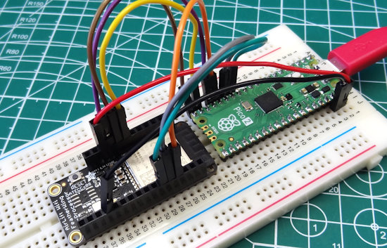](https://x.com/biglesp/status/1822278003864359075)

Les Pounder gets a Raspberry Pi RP2350 board online with an Adafruit Airlift board - [X](https://x.com/biglesp/status/1822278003864359075).

[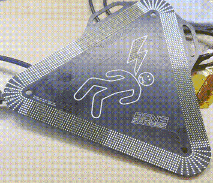](https://www.bensbadges.com/store/p/hivolt-badge)

The HiVolt badge, with 1,984 small LEDs programmed via MicroPython. It can show scrolly text, mesmerizing effects, and more. It’s not just a bare board either - it’s got a full housing, a choice of acrylic color filter, and a custom lanyard - [Ben's Badges](https://www.bensbadges.com/store/p/hivolt-badge).

[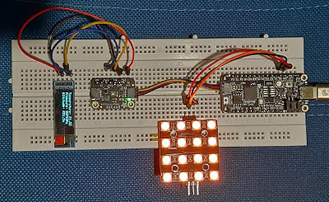](https://raspico.blogspot.com/2024/08/some-fun-with-circuitpython.html)

Some Fun with CircuitPython for #CircuitPythonDay2024 - [Raspberry Pico Adventures](https://raspico.blogspot.com/2024/08/some-fun-with-circuitpython.html) via [X](https://x.com/DQSoft/status/1823752336629481754).

[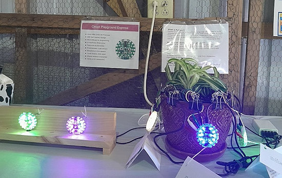](https://x.com/evm_sec/status/1823466398321868846)

> "All done with another year teaching Python programming for 4-H… here’s our display at the county fair. Year 1 kids made blinky badges.  Year 2 kids did a moisture display using an I2C sensor. Both years using Adafruit Circuit Playground Pxpress boards and CircuitPython" - [X](https://x.com/evm_sec/status/1823466398321868846).

[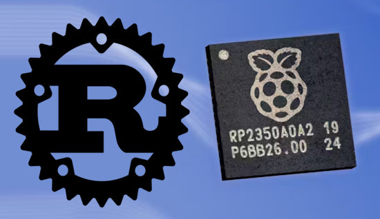](https://www.hackster.io/news/jonathan-pallant-details-the-deeply-impressive-raspberry-pi-rp2350-s-day-one-rust-support-057ea35ce84e)

Raspberry Pi RP2350's day-one Rust support - [hackster.io](https://www.hackster.io/news/jonathan-pallant-details-the-deeply-impressive-raspberry-pi-rp2350-s-day-one-rust-support-057ea35ce84e).

[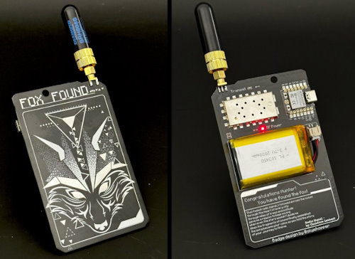](https://gitlab.com/bradanlane_cp/foxhunt)

rot13labs Fox Hunt Badge running CircuitPython - [GitLab](https://gitlab.com/bradanlane_cp/foxhunt) via [X](https://x.com/bradanlane/status/1824175244309078234).

[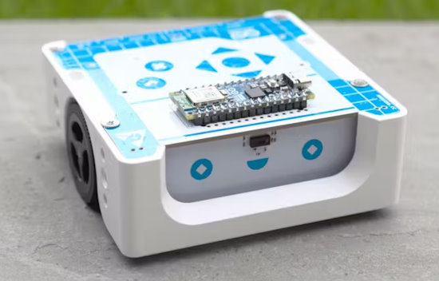](https://www.hackster.io/news/micropython-powered-robotics-for-all-hands-on-with-the-arduino-alvik-75fe0244fd10)

MicroPython-powered robotics for all: hands-on with the Arduino Alvik - [hackster.io](https://www.hackster.io/news/micropython-powered-robotics-for-all-hands-on-with-the-arduino-alvik-75fe0244fd10).

text - [site](url).

text - [site](url).

text - [site](url).

text - [site](url).

text - [site](url).

text - [site](url).

text - [site](url).

text - [site](url).

text - [site](url).

Splitting, Concatenating, and Joining Strings in Python - [Real Python](https://realpython.com/courses/splitting-concatenating-and-joining-strings-python/).

11 Beginner Tips for Learning Python Programming - [Real Python](https://realpython.com/python-beginner-tips/).

## New

[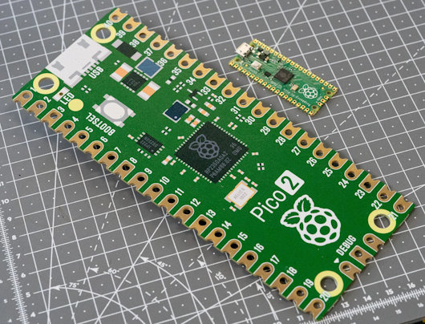](https://shop.pimoroni.com/products/pico-jumbo?variant=42095185821779)

The Pico Jumbo is a hilariously oversized but fully functional Raspberry Pi Pico 2 for demos, japes and shenanigans - [Pimoroni](https://shop.pimoroni.com/products/pico-jumbo?variant=42095185821779).

text - [site](url).

## New Boards Supported by CircuitPython

The number of supported microcontrollers and Single Board Computers (SBC) grows every week. This section outlines which boards have been included in CircuitPython or added to [CircuitPython.org](https://circuitpython.org/).

This week, there were (#/no) new boards added:

- [Board name](url)
- [Board name](url)
- [Board name](url)

*Note: For non-Adafruit boards, please use the support forums of the board manufacturer for assistance, as Adafruit does not have the hardware to assist in troubleshooting.*

Looking to add a new board to CircuitPython? It's highly encouraged! Adafruit has four guides to help you do so:

- [How to Add a New Board to CircuitPython](https://learn.adafruit.com/how-to-add-a-new-board-to-circuitpython/overview)
- [How to add a New Board to the circuitpython.org website](https://learn.adafruit.com/how-to-add-a-new-board-to-the-circuitpython-org-website)
- [Adding a Single Board Computer to PlatformDetect for Blinka](https://learn.adafruit.com/adding-a-single-board-computer-to-platformdetect-for-blinka)
- [Adding a Single Board Computer to Blinka](https://learn.adafruit.com/adding-a-single-board-computer-to-blinka)

## New Learn Guides

[CircuitPython USB Workflow Code Editor Quick Start](https://learn.adafruit.com/circuitpython-usb-workflow-code-editor-quick-start) from [M. LeBlanc-Williams](https://learn.adafruit.com/u/MakerMelissa)

[Networking in CircuitPython](https://learn.adafruit.com/networking-in-circuitpython) from [Anne Barela](https://learn.adafruit.com/u/AnneBarela)

[CircuitPython Day 2024 Countdown Clock](https://learn.adafruit.com/circuitpython-day-2024-countdown-clock) from [Tyeth Gundry](https://learn.adafruit.com/u/tyeth)

[Theme Park Wait Time Display](https://learn.adafruit.com/park-wait-time) from [Ruiz Brothers](https://learn.adafruit.com/u/pixil3d)

## CircuitPython Libraries

The CircuitPython library numbers are continually increasing, while existing ones continue to be updated. Here we provide library numbers and updates!

To get the latest Adafruit libraries, download the [Adafruit CircuitPython Library Bundle](https://circuitpython.org/libraries). To get the latest community contributed libraries, download the [CircuitPython Community Bundle](https://circuitpython.org/libraries).

If you'd like to contribute to the CircuitPython project on the Python side of things, the libraries are a great place to start. Check out the [CircuitPython.org Contributing page](https://circuitpython.org/contributing). If you're interested in reviewing, check out Open Pull Requests. If you'd like to contribute code or documentation, check out Open Issues. We have a guide on [contributing to CircuitPython with Git and GitHub](https://learn.adafruit.com/contribute-to-circuitpython-with-git-and-github), and you can find us in the #help-with-circuitpython and #circuitpython-dev channels on the [Adafruit Discord](https://adafru.it/discord).

You can check out this [list of all the Adafruit CircuitPython libraries and drivers available](https://github.com/adafruit/Adafruit_CircuitPython_Bundle/blob/master/circuitpython_library_list.md). 

The current number of CircuitPython libraries is **###**!

**New Libraries**

Here's this week's new CircuitPython libraries:

* [library](url)

**Updated Libraries**

Here's this week's updated CircuitPython libraries:

* [library](url)

**Library PyPI Weekly Download Stats**

## What’s the CircuitPython team up to this week?

What is the team up to this week? Let’s check in:

**Dan**

I was on vacation for part of last week and the week before. I'm continuing the MicroPython merges into CircuitPython.

**Melissa**

This past week, I mostly focused on writing, recording, and editing my CircuitPython Day video. It goes over many of the challenges I faced while working on the CircuitPython Code Editor and how I overcame those.

**Tim**

text.

**Scott**

This last week has mostly been RP2350 work. I've enabled RGBMatrix and PIO based USB host, fixed audio output crashing and added a couple more boards. I also fixed a crash on startup on ESP32-S3. Next I'm going to try updating to ESP-IDF 5.3 for our CircuitPython 9.2.0 release.

**Liz**

I'm back this week from vacation. If you're ever in Portland, ME be sure to check out the [International Cryptozoology Museum](https://cryptozoologymuseum.com/). It's a really fun and weird spot.

As I've been catching up, I've been prepping for CircuitPython day. I've helped some folks pre-record their sessions and I think it's going to be a great day full of CircuitPython content.

Before I left on break, I worked on two projects to countdown to CircuitPython day. The first uses a [Feather ESP32-S3 TFT](https://learn.adafruit.com/feather-esp32-s3-tft-circuitpython-day-2024-countdown-clock) to display scrolling text for the countdown on top of the snazzy CircuitPython Day 2024 graphic. The Feather gets time using NTP over WiFi. The second project uses the [RP2040 Feather DVI with an Adalogger FeatherWing](https://learn.adafruit.com/feather-rp2040-dvi-circuitpython-day-2024-countdown-clock) to keep time offline and display the countdown over DVI. We have done quite a few countdown projects over the years, so I tried to come up with some new hardware combinations with these projects.

## Upcoming Events

The next MicroPython Meetup in Melbourne will be on August 28 – [Meetup](https://www.meetup.com/micropython-meetup/events). You can see recordings of previous meetings on [YouTube](https://www.youtube.com/@MicroPythonOfficial). The July 2024 [Video](https://www.youtube.com/watch?v=soQlLZ0JlCI).

Espressif DevCon24 will be held Sep 3-5, 13:00-18:00 CEST. Call for presentations now - [Espressif](https://devcon.espressif.com/).

Maker Faire Bay Area returns to Mare Island Naval Shipyard on October 18-20, 2024 - [Maker Faire](https://makerfaire.com/bay-area/).

Hackaday Superconference is an epic gathering of hardware hackers, makers, and tech enthusiasts happening November 1-3 in Pasadena, California - [Hackaday](https://hackaday.com/2024/08/06/tickets-for-supercon-2024-go-on-sale-now/) and [Eventbrite](https://www.eventbrite.com/e/2024-hackaday-superconference-tickets-965387338517).

**Send Your Events In**

If you know of virtual events or upcoming events, please let us know via email to cpnews(at)adafruit(dot)com.

## Latest Releases

CircuitPython's stable release is [#.#.#](https://github.com/adafruit/circuitpython/releases/latest) and its unstable release is [#.#.#-##.#](https://github.com/adafruit/circuitpython/releases). New to CircuitPython? Start with our [Welcome to CircuitPython Guide](https://learn.adafruit.com/welcome-to-circuitpython).

[2024####](https://github.com/adafruit/Adafruit_CircuitPython_Bundle/releases/latest) is the latest Adafruit CircuitPython library bundle.

[2024####](https://github.com/adafruit/CircuitPython_Community_Bundle/releases/latest) is the latest CircuitPython Community library bundle.

[v#.#.#](https://micropython.org/download) is the latest MicroPython release. Documentation for it is [here](http://docs.micropython.org/en/latest/pyboard/).

[#.#.#](https://www.python.org/downloads/) is the latest Python release. The latest pre-release version is [#.#.#](https://www.python.org/download/pre-releases/).

[#,### Stars](https://github.com/adafruit/circuitpython/stargazers) Like CircuitPython? [Star it on GitHub!](https://github.com/adafruit/circuitpython)

## Call for Help -- Translating CircuitPython is now easier than ever

[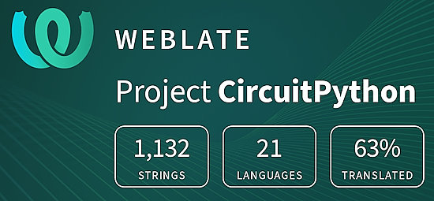](https://hosted.weblate.org/engage/circuitpython/)

One important feature of CircuitPython is translated control and error messages. With the help of fellow open source project [Weblate](https://weblate.org/), we're making it even easier to add or improve translations. 

Sign in with an existing account such as GitHub, Google or Facebook and start contributing through a simple web interface. No forks or pull requests needed! As always, if you run into trouble join us on [Discord](https://adafru.it/discord), we're here to help.

## NUMBER Thanks

The Adafruit Discord community, where we do all our CircuitPython development in the open, reached over NUMBER humans - thank you! Adafruit believes Discord offers a unique way for Python on hardware folks to connect. Join today at [https://adafru.it/discord](https://adafru.it/discord).

## ICYMI - In case you missed it

Python on hardware is the Adafruit Python video-newsletter-podcast! The news comes from the Python community, Discord, Adafruit communities and more and is broadcast on ASK an ENGINEER Wednesdays. The complete Python on Hardware weekly videocast [playlist is here](https://www.youtube.com/playlist?list=PLjF7R1fz_OOXRMjM7Sm0J2Xt6H81TdDev). The video podcast is on [iTunes](https://itunes.apple.com/us/podcast/python-on-hardware/id1451685192?mt=2), [YouTube](http://adafru.it/pohepisodes), [Instagram](https://www.instagram.com/adafruit/channel/)), and [XML](https://itunes.apple.com/us/podcast/python-on-hardware/id1451685192?mt=2).

[The weekly community chat on Adafruit Discord server CircuitPython channel - Audio / Podcast edition](https://itunes.apple.com/us/podcast/circuitpython-weekly-meeting/id1451685016) - Audio from the Discord chat space for CircuitPython, meetings are usually Mondays at 2pm ET, this is the audio version on [iTunes](https://itunes.apple.com/us/podcast/circuitpython-weekly-meeting/id1451685016), Pocket Casts, [Spotify](https://adafru.it/spotify), and [XML feed](https://adafruit-podcasts.s3.amazonaws.com/circuitpython_weekly_meeting/audio-podcast.xml).

## Contribute

The CircuitPython Weekly Newsletter is a CircuitPython community-run newsletter emailed every Monday. The complete [archives are here](https://www.adafruitdaily.com/category/circuitpython/). It highlights the latest CircuitPython related news from around the web including Python and MicroPython developments. To contribute, edit next week's draft [on GitHub](https://github.com/adafruit/circuitpython-weekly-newsletter/tree/gh-pages/_drafts) and [submit a pull request](https://help.github.com/articles/editing-files-in-your-repository/) with the changes. You may also tag your information on Twitter with #CircuitPython. 

Join the Adafruit [Discord](https://adafru.it/discord) or [post to the forum](https://forums.adafruit.com/viewforum.php?f=60) if you have questions.
