- [ ] Library and info updates
- [ ] change date
- [ ] update title
- [ ] Feature story
- [ ] Update  for images
- [ ] Update ICYDNCI
- [ ] All images 550w max only
- [ ] Link "View this email in your browser."

News Sources

- [Adafruit Playground](https://adafruit-playground.com/)
- Twitter: [CircuitPython](https://twitter.com/search?q=circuitpython&src=typed_query&f=live), [MicroPython](https://twitter.com/search?q=micropython&src=typed_query&f=live) and [Python](https://twitter.com/search?q=python&src=typed_query)
- [Raspberry Pi News](https://www.raspberrypi.com/news/)
- Mastodon [CircuitPython](https://octodon.social/tags/CircuitPython) and [MicroPython](https://octodon.social/tags/MicroPython)
- [hackster.io CircuitPython](https://www.hackster.io/search?q=circuitpython&i=projects&sort_by=most_recent) and [MicroPython](https://www.hackster.io/search?q=micropython&i=projects&sort_by=most_recent)
- YouTube: [CircuitPython](https://www.youtube.com/results?search_query=circuitpython&sp=CAI%253D), [MicroPython](https://www.youtube.com/results?search_query=micropython&sp=CAI%253D)
- Instructables: [CircuitPython](https://www.instructables.com/search/?q=circuitpython&projects=all&sort=Newest), [MicroPython](https://www.instructables.com/search/?q=micropython&projects=all&sort=Newest), [Raspberry Pi Python](https://www.instructables.com/search/?q=raspberry+pi+python&projects=all&sort=Newest)
- [python.org](https://www.python.org/)
- [Python Insider - dev team blog](https://pythoninsider.blogspot.com/)
- Individuals: [Jeff Geerling](https://www.jeffgeerling.com/blog)
- Tom's Hardware: [CircuitPython](https://www.tomshardware.com/search?searchTerm=circuitpython&articleType=all&sortBy=publishedDate) and [MicroPython](https://www.tomshardware.com/search?searchTerm=micropython&articleType=all&sortBy=publishedDate) and [Raspberry Pi](https://www.tomshardware.com/search?searchTerm=raspberry%20pi&articleType=all&sortBy=publishedDate)
- [hackaday.io newest projects MicroPython](https://hackaday.io/projects?tag=micropython&sort=date) and [CircuitPython](https://hackaday.io/projects?tag=circuitpython&sort=date)
- [Google News Python](https://news.google.com/topics/CAAqIQgKIhtDQkFTRGdvSUwyMHZNRFY2TVY4U0FtVnVLQUFQAQ?hl=en-US&gl=US&ceid=US%3Aen)
- [hackaday CircuitPython](https://hackaday.com/blog/?s=circuitpython) and [MicroPython](https://hackaday.com/blog/?s=micropython)
- hackaday.io - [CircuitPython](https://hackaday.io/search?term=circuitpython) and [MicroPython](https://hackaday.io/search?term=micropython)

View this email in your browser. **Warning: Flashing Imagery**

Welcome to the latest Python on Microcontrollers newsletter! *insert 2-3 sentences from editor (what's in overview, banter)* - *Anne Barela, Editor*

We're on [Discord](https://discord.gg/HYqvREz), [Twitter](https://twitter.com/search?q=circuitpython&src=typed_query&f=live), and for past newsletters - [view them all here](https://www.adafruitdaily.com/category/circuitpython/). If you're reading this on the web, [subscribe here](https://www.adafruitdaily.com/). Here's the news this week:

## The 2GB Raspberry Pi 5 is on Sale Now for US $50 - How Does It Stack Up?

[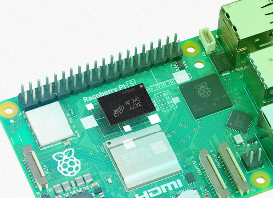](https://www.raspberrypi.com/news/2gb-raspberry-pi-5-on-sale-now-at-50/)

Raspberry Pi has launched the 2GB Raspberry Pi 5, built on a cost-optimised D0 stepping of the BCM2712 application processor, and priced at just $50 - [Raspberry Pi News](https://www.raspberrypi.com/news/2gb-raspberry-pi-5-on-sale-now-at-50/).

[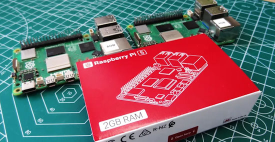](https://www.tomshardware.com/raspberry-pi/raspberry-pi-5s-new-2gb-model-benchmarked-do-you-need-2-4-or-8gb-we-test-against-the-4-and-8gb-versions)

Raspberry Pi 5’s new 2GB model benchmarked: Do you need 2, 4 or 8GB? Tom's Hardware tests the 2GB against the 4 and 8GB versions - [Tom's Hardware](https://www.tomshardware.com/raspberry-pi/raspberry-pi-5s-new-2gb-model-benchmarked-do-you-need-2-4-or-8gb-we-test-against-the-4-and-8gb-versions).

How much can a 2GB Raspberry Pi handle? Adrian Kingsley-Hughes puts it to the ultimate test - [ZDNet](https://www.zdnet.com/home-and-office/work-life/how-much-can-a-2gb-raspberry-pi-handle-i-put-it-to-the-ultimate-test/).

## CircuitPython 9.1.2 and 9.2.0 Alpha 2351 Released

**CircuitPython 9.1.2** is the latest bugfix revision of CircuitPython and is a new stable release - [Adfafruit Blog](https://blog.adafruit.com/2024/08/22/circuitpython-9-1-2-released/) and [GitHub Release Notes](https://github.com/adafruit/circuitpython/releases/tag/9.1.2).

**Highlights of this release**
* Fix Adafruit FunHouse build, which was not working.
* Correct pins for Adafruit Feather ESP32-C6.
* Allow wider range of counts for `Counter`, `FrequencyIn`, and `IncrementalEncoder`.
* Prevent crash or hang on nRF boards when stopping VM and BLE is not running.

**CircuitPython 9.2.0-alpha.2351** is an alpha release for 9.2.0. It has significant known bugs, and will have further additions and fixes before the final release of 9.2.0 - [Adafruit Blog](url) and [GitHub Releases Page](https://blog.adafruit.com/2024/08/22/circuitpython-9-2-0-alpha-2351-released/).

**Highlights of this release**
* Fix Adafruit FunHouse build, which was not working.
* Correct pins for Adafruit Feather ESP32-C6.
*  Prevent crash or hang on nRF boards when stopping VM and BLE is not running.
* Many new RP2350 boards.
* Update to Espressif ESP-IDF V5.3.
* Merge MicroPython updates from v1.22.2.

**Notable changes in 9.2.0 from 9.1.x**
* Raspberry Pi RP2350 support.
* Update to Espressif ESP-IDF V5.3.
* Merge MicroPython updates from v1.22.2.

## Inside the Raspberry Pi RP2350

[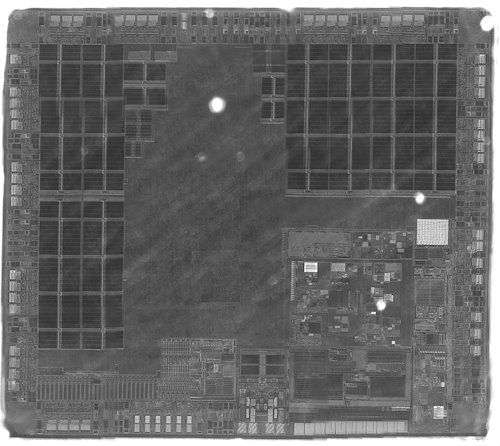](https://x.com/LennertWo/status/1826891922679476283)

The first view of a Raspberry Pi RP2350 chip die (the RP2350BB version) has been posted by Lennert - [X](https://x.com/LennertWo/status/1826891922679476283).

[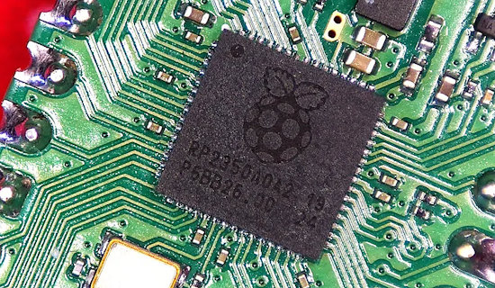](https://www.tomshardware.com/raspberry-pi/raspberry-pi-pico/whats-inside-the-raspberry-pi-pico-2s-rp2350)

What’s inside the Raspberry Pi Pico 2’s RP2350? Les Pounder takes a thorough look at all the specs and capabilities - [Tom's Hardware](https://www.tomshardware.com/raspberry-pi/raspberry-pi-pico/whats-inside-the-raspberry-pi-pico-2s-rp2350).

## CircuitPython Projects Benefit from the Raspberry Pi RP23550

Two projects this week have shown the benefits of using the new RP2350/Pico 2 with CircuitPython:

[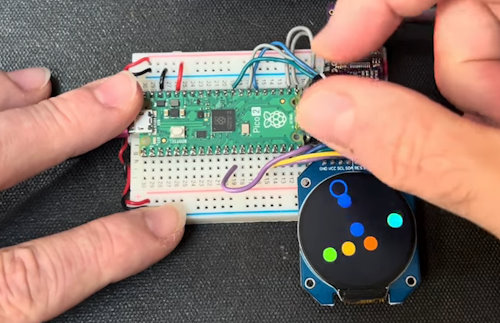](https://mastodon.social/@todbot/113002656897629374)

Tod Kurt's algorithmic music generator uses a rotary encoder, a round TFT, and an I2S DAC on the Pico 2 running CircuitPython - [Mastodon](https://mastodon.social/@todbot/113002656897629374). [YouTube](https://www.youtube.com/watch?v=cCTPtk6KQQk) and [Adafruit Show & Tell](https://youtu.be/mmqrncofoEU?t=921).

[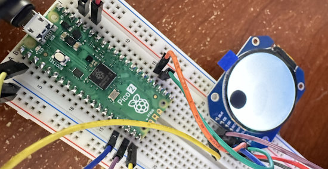](https://mastodon.social/@markkomus/113008671134980114)

Mark Komus uses a Pico 2 and CircuitPython to upgrade a video googly eye project from a couple years ago. With an RP2040, Mark got 60 frames per second, with the RP2350 120 frames per second allowing for smoother video - [Mastodon](https://mastodon.social/@markkomus/113008671134980114) and [GitHub](https://github.com/gamblor21/Googly_Eye).

## Commparing the Raspberry Pi Pico vs. the Pico 2 with MicroPython

[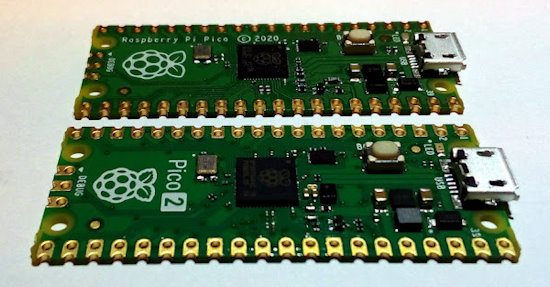](https://lucstechblog.blogspot.com/2024/08/first-look-at-raspberry-pi-pico2.html)

A comparison using the Raspberry Pi Pico verses the Pico 2 (M33 and RISC-V codes) with MicroPython (1.24.0 beta) - [lucstechblog](https://lucstechblog.blogspot.com/2024/08/first-look-at-raspberry-pi-pico2.html).

## Reviewing the Radxa X4 SBC: A Perfect Raspberry Pi-Sized Mini PC?

[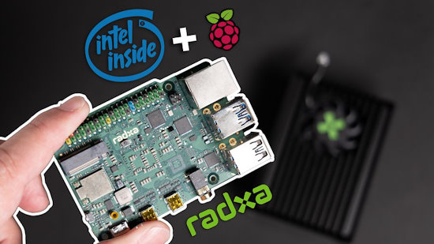](https://www.youtube.com/watch?v=b--l3yU4f00)

The Radxa X4 is a pretty cool single board computer with an Intel N100 chip. Maker by Mistake compares the X4 to traditional a Mini PCs and a Raspberry Pi 5 to find out if it is the SBC everyone has been asking for - [YouTube](https://www.youtube.com/watch?v=b--l3yU4f00).

## Raspberry Pi Pico 2 for CircuitPython Day – A Live Hack Chat

Hackster’s Alex Glow and special guest David Groom streamed dig into the new Pi Pico 2, powered by Raspberry Pi’s recently unveiled RP2350 chip. Expect nerdy chaos in this full getting started video tutorial - [Adafruit Blog](https://blog.adafruit.com/2024/08/19/raspberry-pi-pico-2-for-circuitpython-day-live-hack-circuitpythonday2024/) and [YouTube](https://www.youtube.com/watch?v=4n0a7wOyw4M).

## How to Access Linux Ext4 partitions in Windows using WSL (great for reading Raspberry Pi microSD cards)

If you use Linux and Windows in your life, you'll notice one huge point of frustration: Windows can't read Linux partitions, which are typically in ext4 or ext3 file format. The lack of ext4 / ext3 support is a particularly big problem for Raspberry Pi fans. You can use WSL (Windows Subsystem for Linux) with a tutorial at [Tom's Hardware](https://www.tomshardware.com/how-to/access-linux-ext4-partitions-in-windows).

## This Week's Python Streams

Python on Hardware is all about building a cooperative ecosphere which allows contributions to be valued and to grow knowledge. Below are the streams within the last week focusing on the community.

**CircuitPython Deep Dive Stream**

[Last Friday](https://youtube.com/live/ZkecctoZ7Hs), Scott streamed work on bisecting CircuitPython bugs.

You can see the latest video and past videos on the Adafruit YouTube channel under the Deep Dive playlist - [YouTube](https://www.youtube.com/playlist?list=PLjF7R1fz_OOXBHlu9msoXq2jQN4JpCk8A).

**CircuitPython Parsec**

John Park’s CircuitPython Parsec is off this week. Catch all the episodes in the [YouTube playlist](https://www.youtube.com/playlist?list=PLjF7R1fz_OOWFqZfqW9jlvQSIUmwn9lWr).

**CircuitPython Weekly Meeting**

CircuitPython Weekly Meeting for August 19, 2024 ([notes](https://github.com/adafruit/adafruit-circuitpython-weekly-meeting/blob/main/2024/2024-08-19.md)) [on YouTube](https://youtu.be/QlBRKbRJH8M).

## Project of the Week: An LED Matrix Flight Tracker

[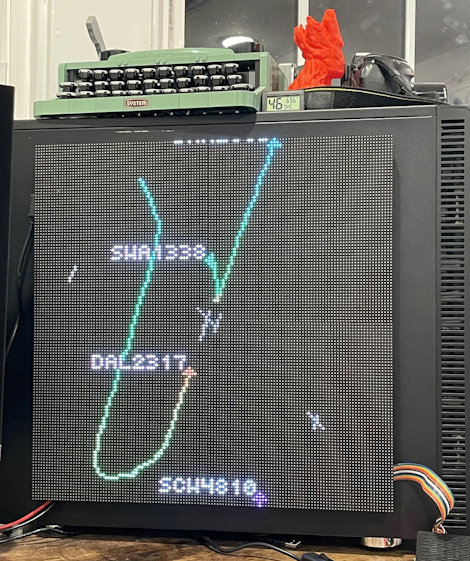](https://www.reddit.com/r/raspberry_pi/comments/1evtf8p/led_matrix_flight_tracker/)

Maker and developer Wesley G Mitchell has put together a Raspberry Pi and Python powered flight tracker that outputs to a custom matrix display - [Reddit](https://www.reddit.com/r/raspberry_pi/comments/1evtf8p/led_matrix_flight_tracker/), [GitHub](https://github.com/Weslex/rpi-led-flight-tracker) and [Tom's Hardware](https://www.tomshardware.com/raspberry-pi/this-raspberry-pi-matrix-display-tracks-flights-in-real-time).

## Popular Last Week

[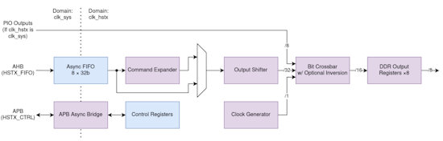](https://www.cnx-software.com/2024/08/15/raspberry-pi-rp2350-hstx-high-speed-serial-transmit-interface/)

What was the most popular, most clicked link, in [last week's newsletter](https://www.adafruitdaily.com/2024/08/19/python-on-microcontrollers-newsletter-rp2350-well-received-circuitpython-day-recap-and-much-more-circuitpython-python-micropython-thepsf-raspberry_pi/)? [A closer look at Raspberry Pi RP2350’s HSTX high-speed serial transmit interface](https://www.cnx-software.com/2024/08/15/raspberry-pi-rp2350-hstx-high-speed-serial-transmit-interface/).

## New Notes from Adafruit Playground

[Adafruit Playground](https://adafruit-playground.com/) is a new place for the community to post their projects and other making tips/tricks/techniques. Ad-free, it's an easy way to publish your work in a safe space for free.

Feather TFT Gamepad Tester with Sprites - [Adafruit Playground](https://adafruit-playground.com/u/SamBlenny/pages/feather-tft-gamepad-tester-with-sprites).

[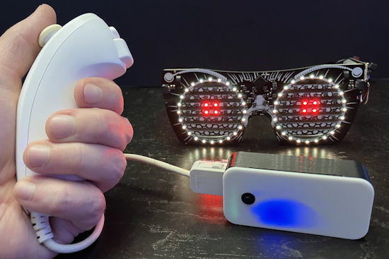](https://adafruit-playground.com/u/squid_jpg/pages/wii-nunchuck-ble-adapter)

Wii Nunchuck BLE Adapter - [Adafruit Playground](https://adafruit-playground.com/u/squid_jpg/pages/wii-nunchuck-ble-adapter).

Storing & Graphing IoT Data With PostgREST - [Adafruit Playground](https://adafruit-playground.com/u/Foamyguy/pages/storing-graphing-iot-data-with-postgrest).

## News From Around the Web

Tachyon is a new powerful 5G cellular single-board computer with AI accelerator by Particle with a past goal Kickstarter. Particle is teaming with Adafruit with the Adafruit CRICKIT Robotics HAT, plus free Adafruit IO for all Tachyon backers - [Adafruit Blog](https://blog.adafruit.com/2024/08/21/particle-adafruit-here-comes-adafruit-crickit-robotics-hat-plus-free-adafruit-io-for-all-tachyon-backers/) and [Kickstarter](https://www.kickstarter.com/projects/particle-iot/tachyon-powerful-5g-single-board-computer-w-ai-accelerator/posts/4178338).

[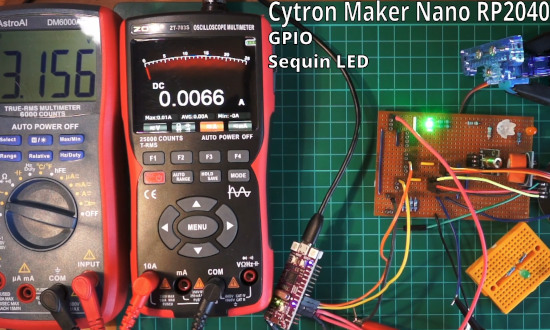](https://www.instructables.com/Measuring-Peripheral-Power-With-Arduino-UNO-R3-and/)

A look at measuring current and the associated voltage drop for periperhals powered by a wide range of microcontroller boards using power pins and GPIO using CircuitPython and MicroPython (and Ardunio C/C++) test programs, plus a closer look at voltage drop over USB and spiky servo current - [Instructables](https://www.instructables.com/Measuring-Peripheral-Power-With-Arduino-UNO-R3-and/).

[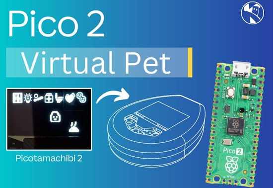](https://www.kevsrobots.com/blog/picotamachibi2.html)

A Raspberry Pi Pico 2 powered Virtual Pet with a 1.3" OLED display and some MicroPython - [KevsRobots](https://www.kevsrobots.com/blog/picotamachibi2.html).

The Pi Cast (8/20/2024) featuring the new Pico 2 products from Pimoroni - [YouTube](https://www.youtube.com/watch?v=EyKAbZ_M-XI).

Someone combined a Raspberry Pi with an eInk display and Python to make the perfect photo frame - [XDA](https://www.xda-developers.com/raspberry-pi-eink-display-perfect-photo-frame/).

[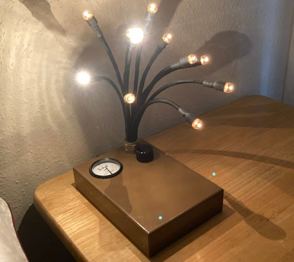](https://www.raspberrypi.com/news/retro-pico-powered-incandescent-lamp/)

Making a retro Pico and MicroPython powered incandescent lamp - [Raspberry Pi News](https://www.raspberrypi.com/news/retro-pico-powered-incandescent-lamp/).

77 MicroPython LED strip effects for the Pimoroni Plasma 2040 and their 66 star led strip - [GitHub](https://github.com/mrglennjones/plasma_2040_fx77/tree/main).

[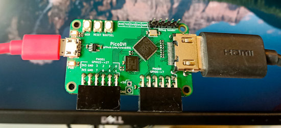](https://github.com/wren6991/picodvi)

The PicoDVI project (bitbanging DVI video on a Rp2040) has been updated to take advantage of the RP2350 including Cortex M33 optimizations and RISC-V - [GitHub](https://github.com/wren6991/picodvi).

[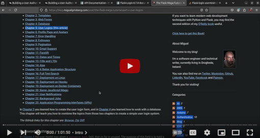](https://youtu.be/evarMujBC88?si=mjEHEC3sBNC7aT6F)

Implementing a basic user authentication system with Flask, MongoDB and Python - [YouTube](https://youtu.be/evarMujBC88?si=mjEHEC3sBNC7aT6F) and [GitHub code](https://github.com/FoamyGuy/Flask_MongoDB_Basic_User_Authentication_Tutorial)

[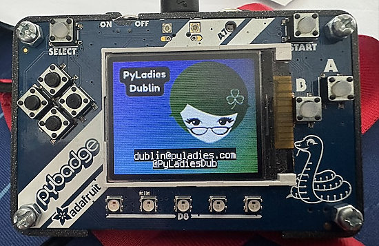](https://x.com/PyLadiesDub/status/1825862691266625736)

A badge for PyLadies Dublin with an Adafruit PyBadge and CircuitPython - [X](https://x.com/PyLadiesDub/status/1825862691266625736).

[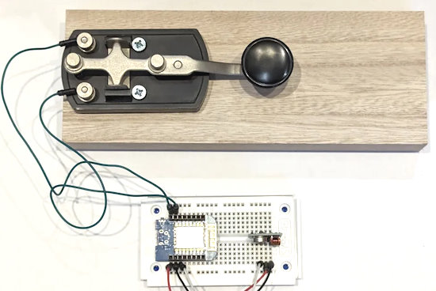](https://medium.com/radio-hackers/python-radio-simple-beginnings-9b6498c7c25b)

A series of articles about using MicroPython to control radio transmitters, receivers, and transceivers - [Medium](https://medium.com/radio-hackers/python-radio-simple-beginnings-9b6498c7c25b).

[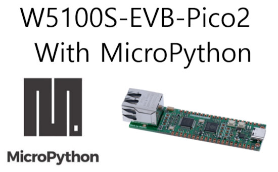](https://maker.wiznet.io/viktor/projects/getting-started-with-w5100s-evb-pico2-and-micropython/)

Getting started with RP2350-based W5100S-EVB-Pico2 and MicroPython - [WIZnet Makers](https://maker.wiznet.io/viktor/projects/getting-started-with-w5100s-evb-pico2-and-micropython/).

[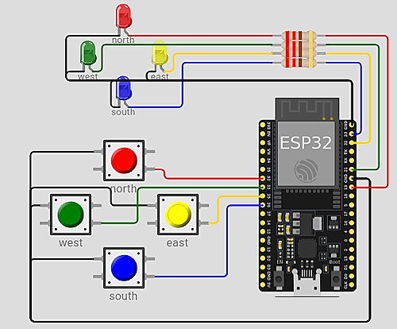](https://wokwi.com/projects/406621792660467713)

A labrynth game in MicroPython for ESP32 - [Wokwi](https://wokwi.com/projects/406621792660467713) via [X](https://x.com/MadMike77/status/1826640011166679067).

> "A big thanks to everyone who made EuroPython 2024 a success this past July! Whether in person, online, or helping to organize, your energy and passion made it all possible" - [EuroPython](https://ep2024.europython.eu/thank-you).

text - [site](url).

[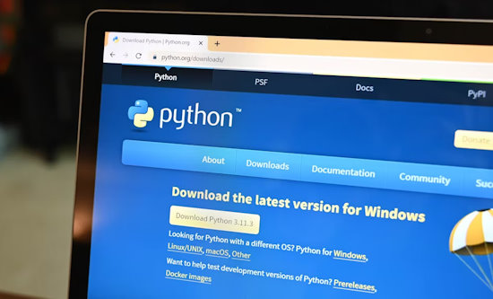](https://www.howtogeek.com/install-python-apps-with-pipx/)

Why you should install Python apps with `pipx` (and how to get started) - [How-to Geek](https://www.howtogeek.com/install-python-apps-with-pipx/).

How to build good coding habits as a new Python developer - [freeCpdeCamp](https://www.freecodecamp.org/news/how-to-build-good-coding-habits/).

10 Python programming optimization techniques - [dev.to](https://dev.to/jamesbright/10-python-programming-optimisation-techniques-5ckf).

## New

[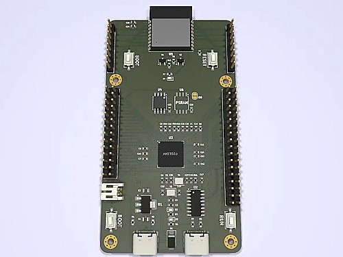](https://www.tomshardware.com/raspberry-pi/maker-brings-wi-fi-to-the-raspberry-pi-pico-2w-via-custom-dev-board-and-esp32)

Bringing WiFi to the Raspberry Pi RP2350B via a custom dev board and ESP32 - [Tom's Hardware](https://www.tomshardware.com/raspberry-pi/maker-brings-wi-fi-to-the-raspberry-pi-pico-2w-via-custom-dev-board-and-esp32).

text - [site](url).

## New Boards Supported by CircuitPython

The number of supported microcontrollers and Single Board Computers (SBC) grows every week. This section outlines which boards have been included in CircuitPython or added to [CircuitPython.org](https://circuitpython.org/).

This week, there were (#/no) new boards added:

- [Board name](url)
- [Board name](url)
- [Board name](url)

*Note: For non-Adafruit boards, please use the support forums of the board manufacturer for assistance, as Adafruit does not have the hardware to assist in troubleshooting.*

Looking to add a new board to CircuitPython? It's highly encouraged! Adafruit has four guides to help you do so:

- [How to Add a New Board to CircuitPython](https://learn.adafruit.com/how-to-add-a-new-board-to-circuitpython/overview)
- [How to add a New Board to the circuitpython.org website](https://learn.adafruit.com/how-to-add-a-new-board-to-the-circuitpython-org-website)
- [Adding a Single Board Computer to PlatformDetect for Blinka](https://learn.adafruit.com/adding-a-single-board-computer-to-platformdetect-for-blinka)
- [Adding a Single Board Computer to Blinka](https://learn.adafruit.com/adding-a-single-board-computer-to-blinka)

## New Learn Guides

[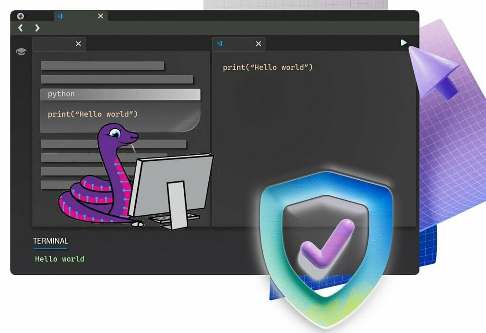](https://learn.adafruit.com/guides/latest)

[Visual Studio Code for Education... and CircuitPython](https://learn.adafruit.com/visual-studio-code-for-education-and-circuitpython) from [Anne Barela](https://learn.adafruit.com/u/AnneBarela)

[Blinka LED Sign](https://learn.adafruit.com/blinka-led-sign) from [Ruiz Brothers](https://learn.adafruit.com/u/pixil3d)

[Instagram Photo Frame](https://learn.adafruit.com/instagram-photo-frame) from [John Park](https://learn.adafruit.com/u/johnpark)

[Adafruit RS-232 Full Pinout Level-Shifter Breakout](https://learn.adafruit.com/adafruit-rs-232-full-pinout-level-shifter-breakout) from [Liz Clark](https://learn.adafruit.com/u/BlitzCityDIY)

## Updated Learn Guides

[title](url)

## CircuitPython Libraries

The CircuitPython library numbers are continually increasing, while existing ones continue to be updated. Here we provide library numbers and updates!

To get the latest Adafruit libraries, download the [Adafruit CircuitPython Library Bundle](https://circuitpython.org/libraries). To get the latest community contributed libraries, download the [CircuitPython Community Bundle](https://circuitpython.org/libraries).

If you'd like to contribute to the CircuitPython project on the Python side of things, the libraries are a great place to start. Check out the [CircuitPython.org Contributing page](https://circuitpython.org/contributing). If you're interested in reviewing, check out Open Pull Requests. If you'd like to contribute code or documentation, check out Open Issues. We have a guide on [contributing to CircuitPython with Git and GitHub](https://learn.adafruit.com/contribute-to-circuitpython-with-git-and-github), and you can find us in the #help-with-circuitpython and #circuitpython-dev channels on the [Adafruit Discord](https://adafru.it/discord).

You can check out this [list of all the Adafruit CircuitPython libraries and drivers available](https://github.com/adafruit/Adafruit_CircuitPython_Bundle/blob/master/circuitpython_library_list.md). 

The current number of CircuitPython libraries is **###**!

**New Libraries**

Here's this week's new CircuitPython libraries:

* [library](url)

**Updated Libraries**

Here's this week's updated CircuitPython libraries:

* [library](url)

**Library PyPI Weekly Download Stats**

## What’s the CircuitPython team up to this week?

What is the team up to this week? Let’s check in:

**Dan**

I released CircuitPython 9.1.2 and also 9.2.0 Alpha 2351 last week. The 9.1.2 release contains some important fixes for certain boards. The 9.2.0 Alpha release includes those fixes and others, adds a bunch of new RP2350 boards, and also updates to Espressif ESP-IDF v5.3. And finally, I've finished the merge from MicroPython v1.22, which is also in the Alpha release.

Coming up, I'll start the MicroPython v1.23 merge, and also investigate some newly reported bugs.

**Melissa**

On CircuitPython Day, [the video I created](https://youtu.be/rfCRQ-V_-Mo?si=dTKvOE2UPefAjtI3) was premiered and it worked out nicely.  I also worked on some bugs on the CircuitPython Code Editor.

**Tim**

In addition to my usual weekly library maintenance tasks, this week I troubleshooted an issue in Adabot with the commands that generate the reports that we read out during the weekly meetings. I'm also testing a Qualia S3 project to attempt to recreate an issue submitted by a learn guide user feedback.

**Jeff**

text.

**Scott**

I've gotten sucked back into ESP-IDF land. I was debugging a reset issue on the S3 and decided to update the IDF to 5.3 as well. Unfortunately, it didn't fix the bug. So, I've been digging to figure out what the issue is. I'll be out off and on next week because we have family in town.

**Liz**

Since my last update we had CircuitPython Day 2024. Thank you to everyone who participated! I was involved in organizing the livestreams and prerecorded videos for the day. In case you missed anything, we have a [playlist](https://www.youtube.com/playlist?list=PLjF7R1fz_OOXfOj_-jSrcGNwIXiX83DZS) with all of the Adafruit videos in the order that they aired.

For guides, I wrote up the [RS-232 Full Pinout Level-Shifter Breakout](https://learn.adafruit.com/adafruit-rs-232-full-pinout-level-shifter-breakout). This breakout has a DE-9 connector onboard for directly plugging into RS-232 gear. I wrote example code in both CircuitPython and Arduino that lets you use the Serial Console to communicate with an RS-232 device. A big thanks to Anne for rounding out the guide with her knowledge of RS-232.

## Upcoming Events

The next MicroPython Meetup in Melbourne will be on August 28 – [Meetup](https://www.meetup.com/micropython-meetup/events). You can see recordings of previous meetings on [YouTube](https://www.youtube.com/@MicroPythonOfficial). The July 2024 [Video](https://www.youtube.com/watch?v=soQlLZ0JlCI).

Espressif DevCon24 will be held Sep 3-5, 13:00-18:00 CEST. Call for presentations now - [Espressif](https://devcon.espressif.com/).

Maker Faire Bay Area returns to Mare Island Naval Shipyard on October 18-20, 2024 - [Maker Faire](https://makerfaire.com/bay-area/).

Hackaday Superconference is an epic gathering of hardware hackers, makers, and tech enthusiasts happening November 1-3 in Pasadena, California - [Hackaday](https://hackaday.com/2024/08/06/tickets-for-supercon-2024-go-on-sale-now/) and [Eventbrite](https://www.eventbrite.com/e/2024-hackaday-superconference-tickets-965387338517).

PyLadies Conference (PyLadiesCon) is a transformative event designed to promote diversity, learning, and empowerment within the Python community. December 6-8, 2024 online - [PyLadies](https://conference.pyladies.com/).

**Send Your Events In**

If you know of virtual events or upcoming events, please let us know via email to cpnews(at)adafruit(dot)com.

## Latest Releases

CircuitPython's stable release is [#.#.#](https://github.com/adafruit/circuitpython/releases/latest) and its unstable release is [#.#.#-##.#](https://github.com/adafruit/circuitpython/releases). New to CircuitPython? Start with our [Welcome to CircuitPython Guide](https://learn.adafruit.com/welcome-to-circuitpython).

[2024####](https://github.com/adafruit/Adafruit_CircuitPython_Bundle/releases/latest) is the latest Adafruit CircuitPython library bundle.

[2024####](https://github.com/adafruit/CircuitPython_Community_Bundle/releases/latest) is the latest CircuitPython Community library bundle.

[v#.#.#](https://micropython.org/download) is the latest MicroPython release. Documentation for it is [here](http://docs.micropython.org/en/latest/pyboard/).

[#.#.#](https://www.python.org/downloads/) is the latest Python release. The latest pre-release version is [#.#.#](https://www.python.org/download/pre-releases/).

[#,### Stars](https://github.com/adafruit/circuitpython/stargazers) Like CircuitPython? [Star it on GitHub!](https://github.com/adafruit/circuitpython)

## Call for Help -- Translating CircuitPython is now easier than ever

[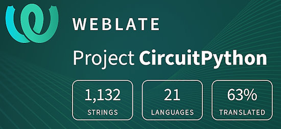](https://hosted.weblate.org/engage/circuitpython/)

One important feature of CircuitPython is translated control and error messages. With the help of fellow open source project [Weblate](https://weblate.org/), we're making it even easier to add or improve translations. 

Sign in with an existing account such as GitHub, Google or Facebook and start contributing through a simple web interface. No forks or pull requests needed! As always, if you run into trouble join us on [Discord](https://adafru.it/discord), we're here to help.

## NUMBER Thanks

The Adafruit Discord community, where we do all our CircuitPython development in the open, reached over NUMBER humans - thank you! Adafruit believes Discord offers a unique way for Python on hardware folks to connect. Join today at [https://adafru.it/discord](https://adafru.it/discord).

## ICYMI - In case you missed it

Python on hardware is the Adafruit Python video-newsletter-podcast! The news comes from the Python community, Discord, Adafruit communities and more and is broadcast on ASK an ENGINEER Wednesdays. The complete Python on Hardware weekly videocast [playlist is here](https://www.youtube.com/playlist?list=PLjF7R1fz_OOXRMjM7Sm0J2Xt6H81TdDev). The video podcast is on [iTunes](https://itunes.apple.com/us/podcast/python-on-hardware/id1451685192?mt=2), [YouTube](http://adafru.it/pohepisodes), [Instagram](https://www.instagram.com/adafruit/channel/)), and [XML](https://itunes.apple.com/us/podcast/python-on-hardware/id1451685192?mt=2).

[The weekly community chat on Adafruit Discord server CircuitPython channel - Audio / Podcast edition](https://itunes.apple.com/us/podcast/circuitpython-weekly-meeting/id1451685016) - Audio from the Discord chat space for CircuitPython, meetings are usually Mondays at 2pm ET, this is the audio version on [iTunes](https://itunes.apple.com/us/podcast/circuitpython-weekly-meeting/id1451685016), Pocket Casts, [Spotify](https://adafru.it/spotify), and [XML feed](https://adafruit-podcasts.s3.amazonaws.com/circuitpython_weekly_meeting/audio-podcast.xml).

## Contribute

The CircuitPython Weekly Newsletter is a CircuitPython community-run newsletter emailed every Monday. The complete [archives are here](https://www.adafruitdaily.com/category/circuitpython/). It highlights the latest CircuitPython related news from around the web including Python and MicroPython developments. To contribute, edit next week's draft [on GitHub](https://github.com/adafruit/circuitpython-weekly-newsletter/tree/gh-pages/_drafts) and [submit a pull request](https://help.github.com/articles/editing-files-in-your-repository/) with the changes. You may also tag your information on Twitter with #CircuitPython. 

Join the Adafruit [Discord](https://adafru.it/discord) or [post to the forum](https://forums.adafruit.com/viewforum.php?f=60) if you have questions.
