View this email in your browser.

Welcome to the latest Python on Microcontrollers newsletter! We're finally entering Autumn and the students are back to school. The RP2350 issue we reported last week has been officially clarified by Raspberry Pi. CircuitPython has crossed the 4,000 GitHub stars milestone, and Bluetooth 6 is looking good. More on the RP2350 and lots of projects in this issue. I hope you enjoy - *Anne Barela, Editor*

We're on [Discord](https://discord.gg/HYqvREz), [Twitter](https://twitter.com/search?q=circuitpython&src=typed_query&f=live), and for past newsletters - [view them all here](https://www.adafruitdaily.com/category/circuitpython/). If you're reading this on the web, [subscribe here](https://www.adafruitdaily.com/). Here's the news this week:

## The Latest on Raspberry Pi Erratum RP2350-E9

[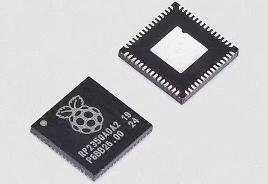](https://datasheets.raspberrypi.com/rp2350/rp2350-datasheet.pdf)

As reported last week as a developing story, users have reported issues with the Raspberry Pi RP2350 and certain pin behavior. Initially Raspberry Pi addressed this in Erratum RP2350-E9. As of Friday the language in the datasheet has been updated and expanded to reflect the latest research and is now titled "Increased leakage current on Bank 0 GPIO when pad input is enabled" - [Raspberry Pi RP2350 Datasheet](https://datasheets.raspberrypi.com/rp2350/rp2350-datasheet.pdf).

## 4,000 Stars on the CircuitPython GitHub Repo

CircuitPython has reached over 4,000 Stars on GitHub! Thank you to all in our fabulous CircuitPython community, developing projects with CircuitPython! - [Adafruit Blog](https://blog.adafruit.com/2024/09/04/circuitpython-reaches-4000-stars-on-github-circuitpython-github-adafruit/) and [GitHub](https://github.com/adafruit/circuitpython).

## Bluetooth 6.0 Features Two-Way Ranging, Latency Reduction, Improved Scanning Efficiency, and More

[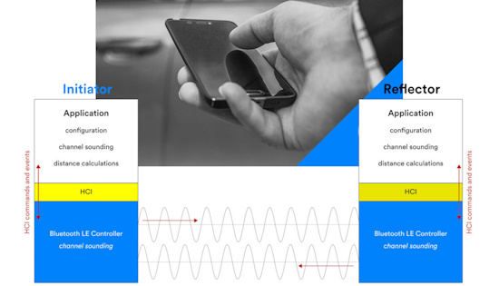](https://www.cnx-software.com/2024/09/04/bluetooth-6-0-features-accurate-two-way-ranging-using-channel-sounding-latency-reduction-improved-scanning-efficiency-and-more/)

The Bluetooth Special Interest Group (SIG) has just announced the release of the Bluetooth 6.0 Core Specification with features and feature enhancements that include Bluetooth Channel Sounding for two-way ranging between BLE devices, decision-based advertising filtering and monitoring advertisers to improve device scanning efficiency, an enhancement to the Isochronous Adaptation Layer (ISOAL) for lower latency and higher reliability, the LL extended feature set, and a frame space update for throughput optimization - [CNX Software](https://www.cnx-software.com/2024/09/04/bluetooth-6-0-features-accurate-two-way-ranging-using-channel-sounding-latency-reduction-improved-scanning-efficiency-and-more/).

## Making a Mobility Control Assistant

[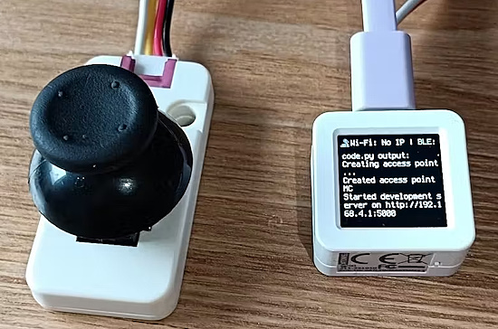](https://www.hackster.io/3DPrinterDoctor/mobility-control-assistant-6c3047)

David Barrett looked to make a device which can be added to a wheelchair or strapped to the body, allowing control tailored to each user. It can use various microcontroller boards running CircuitPython - [hackster.io](https://www.hackster.io/3DPrinterDoctor/mobility-control-assistant-6c3047) and [YouTube](https://youtu.be/tbvet0j3BB4).

## How to Recover a “Bricked” Raspberry Pi Pico 2 or Other RP2350 Board

[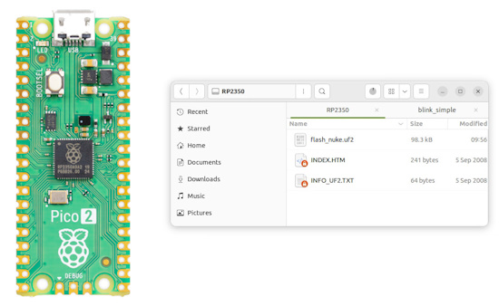](https://www.cnx-software.com/2024/09/03/how-to-recover-a-bricked-raspberry-pi-pico-2-or-other-rp2350-board/)

How to recover a "bricked" Raspberry Pi Pico 2 or other RP2350 board - [CNX Software](https://www.cnx-software.com/2024/09/03/how-to-recover-a-bricked-raspberry-pi-pico-2-or-other-rp2350-board/).

## Benchmarking Versions of CircuitPython

[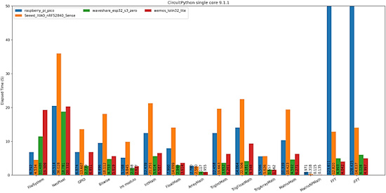](https://octodon.social/@Pheebe@tech.lgbt/113032743331068687)

PheebeUK has performed some benchmarking on several versions of CircuitPython. "I finally found some more time to try to do some more. I've got four boards that I've tried this across so far, and hopefully I can get some more in the future" - [Mastodon](https://octodon.social/@Pheebe@tech.lgbt/113032743331068687).

## The Raspberry Pi RP2350 Hack Challenge Extended

[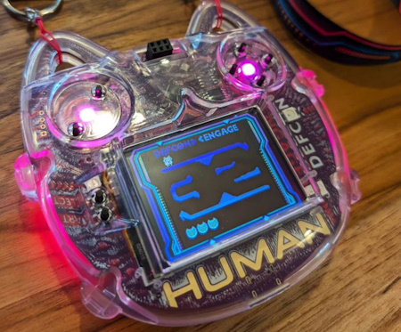](https://www.raspberrypi.com/news/30000-badges-and-still-no-hack/)

Raspberry Pi kicked off a hacking challenge with their new RP2350 at DEF CON earlier this year. They've decided to goad the bounty hunters by doubling the prize money and extending the deadline to the end of the year - [Raspberry Pi News](https://www.raspberrypi.com/news/30000-badges-and-still-no-hack/) via [X](https://x.com/Raspberry_Pi/status/1831634326699548746).

## Rust on the RP2350

[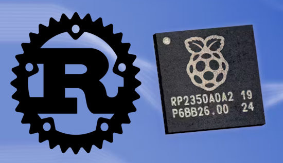](https://www.raspberrypi.com/news/rust-on-rp2350/)

While many of us are giddy using Python on the new RP2350, others are looking at Rust. Raspberry Pi looks at Rust usage on the new RP2350 - [Raspberry Pi News](https://www.raspberrypi.com/news/rust-on-rp2350/).

## A Raspberry Pi Pico ePaper Handheld Video Game Console

This console features 5 games inspired by Nintendo's Game & Watch. The console runs on a Raspberry Pi Pico and is entirely programmed in MicroPython. The case is 3D printed and a custom PCB can be ordered, all very low cost - [Instructables](https://www.instructables.com/David-John-%E1%90%A0%EA%9E%88%E1%90%9F-Game-Watch-Raspberry-Pi-PICO-E-Pape/).

## This Week's Python Streams

Python on Hardware is all about building a cooperative ecosphere which allows contributions to be valued and to grow knowledge. Below are the streams within the last week focusing on the community.

**CircuitPython Deep Dive Stream**

[Last Friday](https://youtube.com/live/dTFAoCMe_sk), Scott streamed work on Feather RP2350 and ESP32-P4.

You can see the latest video and past videos on the Adafruit YouTube channel under the Deep Dive playlist - [YouTube](https://www.youtube.com/playlist?list=PLjF7R1fz_OOXBHlu9msoXq2jQN4JpCk8A).

**CircuitPython Parsec**

John Park’s CircuitPython Parsec this week is a STEMMA QT Pin Hack - [Adafruit Blog](https://blog.adafruit.com/2024/09/06/john-parks-circuitpython-parsec-stemma-qt-pin-hack-adafruit-circuitpython/) and [YouTube](https://youtu.be/Ugq-xQRbDEc).

Catch all the episodes in the [YouTube playlist](https://www.youtube.com/playlist?list=PLjF7R1fz_OOWFqZfqW9jlvQSIUmwn9lWr).

**CircuitPython Weekly Meeting**

CircuitPython Weekly Meeting for September 3, 2024 ([notes](https://github.com/adafruit/adafruit-circuitpython-weekly-meeting/blob/main/2024/2024-09-03.md)) [on YouTube](https://youtu.be/5Hitk4INJho).

## Project of the Week: GenAI Powered Tiny Photo Frame

Ashish Patil has created a Gen AI-powered mini photo frame. It offers a personalized display of images tailored to your tastes, whether you're a fan of anime, nature, or comics. It uses a Raspberry Pi Pico W, 128x160 SPI TFT display, and CircuitPython - [GitHub](https://github.com/code2k13/GenAIPhotoFrame), [Blog](https://ashishware.com/2024/02/10/gen_ai_photo_frame/) and [YouTube](https://youtu.be/awBnKfNnsP8).

## Popular Last Week: Pi Pico 2 Extreme Teardown

What was the most popular, most clicked link, in [last week's newsletter](https://www.adafruitdaily.com/2024/09/02/python-on-microcontrollers-newsletter-diving-into-the-raspberry-pi-rp2350-python-survey-results-and-more-circuitpython-python-micropython-thepsf-raspberry_pi/)? [Pi Pico 2 Extreme Teardown](https://electronupdate.blogspot.com/2024/08/pi-pico-2-extreme-teardown.html).

## New Notes from Adafruit Playground

[Adafruit Playground](https://adafruit-playground.com/) is a new place for the community to post their projects and other making tips/tricks/techniques. Ad-free, it's an easy way to publish your work in a safe space for free.

[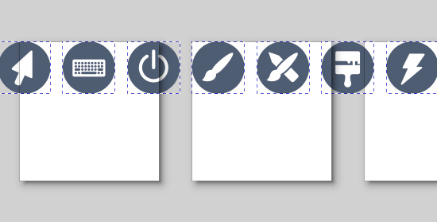](https://adafruit-playground.com/u/Foamyguy/pages/prepare-beautiful-flat-icons-for-use-w-circuitpython)

Prepare Beautiful Flat Icons For Use with CircuitPython - [Adafruit Playground](https://adafruit-playground.com/u/Foamyguy/pages/prepare-beautiful-flat-icons-for-use-w-circuitpython).

[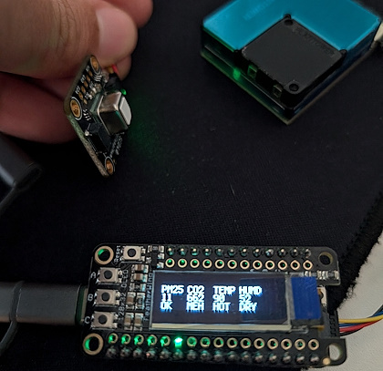](https://adafruit-playground.com/u/hectorleiva/pages/air-quality-monitor-for-the-feather-rp2040)

Air Quality Monitor for the Feather RP2040 - [Adafruit Playground](https://adafruit-playground.com/u/hectorleiva/pages/air-quality-monitor-for-the-feather-rp2040).

[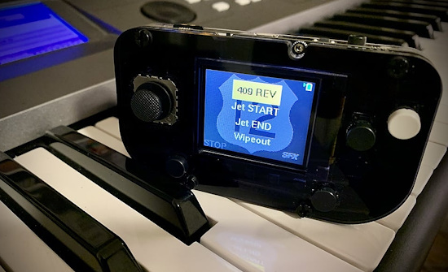](https://adafruit-playground.com/u/CGrover/pages/the-highway-12-band-sfx-machine)

The Highway 12 Band SFX Machine - [Adafruit Playground](https://adafruit-playground.com/u/CGrover/pages/the-highway-12-band-sfx-machine).

[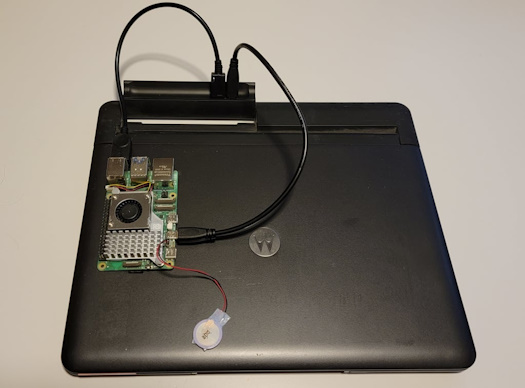](https://adafruit-playground.com/u/AnneBarela/pages/using-a-motorola-atrix-dock-with-a-raspberry-pi-computer-2024-version)

Using a 2012 Motorola Atrix Dock with a Raspberry Pi Computer 5 - [Adafruit Playground](https://adafruit-playground.com/u/AnneBarela/pages/using-a-motorola-atrix-dock-with-a-raspberry-pi-computer-2024-version).

## News From Around the Web

More statistics from the most recent Python survey: 55% use Linux, 6% use Python 2 - [Slashdot](https://developers.slashdot.org/story/24/09/01/0256245/python-developer-survey-55-use-linux-6-use-python-2).

Python Software Foundation is introducing monthly PSF Board Office Hours - [Python Blog](https://pyfound.blogspot.com/2024/08/ask-questions-or-tell-us-what-you-think.html) and [Discord](https://discord.com/invite/4Hm36PPgpG).

[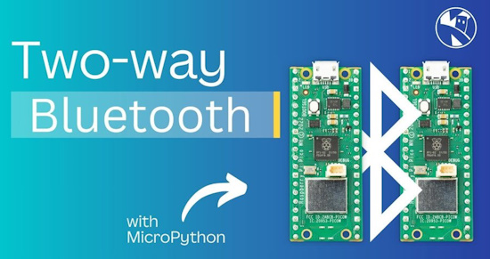](https://www.youtube.com/watch?v=Ln_xreldWOM)

Two-way Bluetooth with Raspberry Pi Pico W and MicroPython - [YouTube](https://www.youtube.com/watch?v=Ln_xreldWOM) via [X](https://x.com/kevsmac/status/1830310232188239938).

[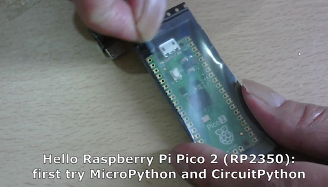](https://www.youtube.com/watch?v=AqFduAePdn4)

Hello Raspberry Pi Pico 2 (RP2350): a first try of both MicroPython and CircuitPython - [YouTube](https://www.youtube.com/watch?v=AqFduAePdn4).

Creating a Supercomputer with a Raspberry Pi 5 Cluster and Docker Swarm - [Kevin McAleer YouTube](https://x.com/i/broadcasts/1lPJqOWwQBdKb).

[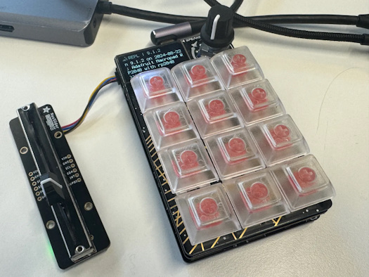](https://andypiper.co.uk/2024/08/30/keypad-hacking/)

MacroPad keypad hacking - [Andy Piper](https://andypiper.co.uk/2024/08/30/keypad-hacking/).

The most popular programming languages in 2024 (and what that even means) - [ZDNet](https://www.zdnet.com/article/the-most-popular-programming-languages-in-2024-and-what-that-even-means/).

[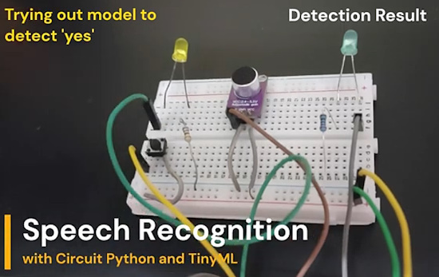](https://ashishware.com/2024/05/20/pipicospeech/)

Single word speech recognition with CircuitPython and TinyML - [ashishware](https://ashishware.com/2024/05/20/pipicospeech/) and [YouTube](https://youtu.be/COsEE_Mif4k).

[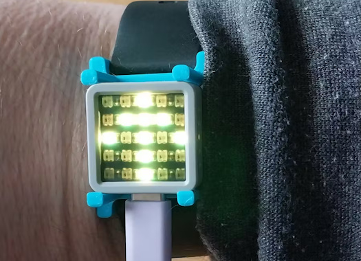](https://www.hackster.io/3DPrinterDoctor/navigation-assistance-for-visually-impared-e23d6c)

Navigation assistance for the visually impared using MicroPython - [hackster.io](https://www.hackster.io/3DPrinterDoctor/navigation-assistance-for-visually-impared-e23d6c).

Advanced Python: Achieving high performance with Code Generation - [Medium](https://medium.com/@yonatanzunger/advanced-python-achieving-high-performance-with-code-generation-796b177ec79).

[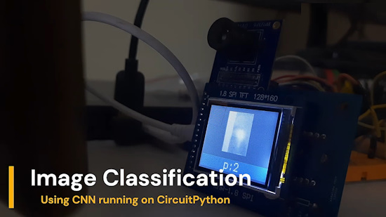](https://ashishware.com/2024/06/29/pipico_digit_classification_cnn/)

Handwritten digit classification using CNN and CircuitPython - [YouTube](https://www.youtube.com/watch?v=CAKHJ_41LRE) and [Blog](https://ashishware.com/2024/06/29/pipico_digit_classification_cnn/).

[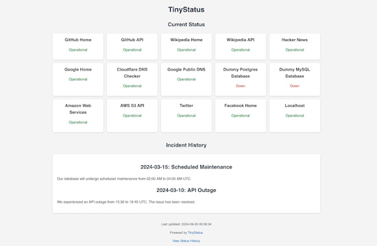](https://github.com/harsxv/tinystatus)

TinyStatus is a simple, customizable Python status page generator that allows you to monitor the status of various services and display them on a clean, responsive web page - [GitHub](https://github.com/harsxv/tinystatus).

Lesser known parts of Python standard library - [trickster.dev](https://www.trickster.dev/post/lesser-known-parts-of-python-standard-library/).

[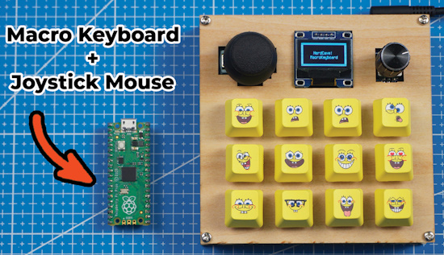](https://www.instructables.com/DIY-Macro-Keyboard-With-Joystick-Mouse/)

A DIY macro keyboard With joystick mouse using Raspberry Pi Pico and CircuitPython - [hackster.io](https://www.instructables.com/DIY-Macro-Keyboard-With-Joystick-Mouse/).

[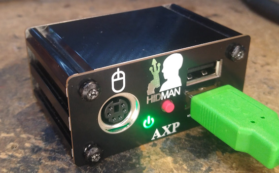](https://github.com/rasteri/HIDman)

HIDman - USB HID to XT / AT / PS/2 / Serial converter - [GitHub](https://github.com/rasteri/HIDman).

[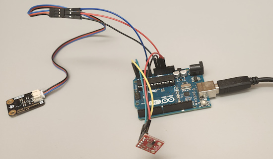](https://github.com/simondlevy/TinyEKF)

TinyEKF - a lightweight C/C++ extended Kalman Filter with Python for prototyping - [GitHub](https://github.com/simondlevy/TinyEKF).

Honey, I shrunk {fmt}: bringing binary size to 14k and ditching the C++ runtime - [vitaut.net](https://vitaut.net/posts/2024/binary-size/).

Pico RMII Ethernet library, Neon Chrome Edition - [GitHub](https://github.com/rscott2049/pico-rmii-ethernet_nce).

[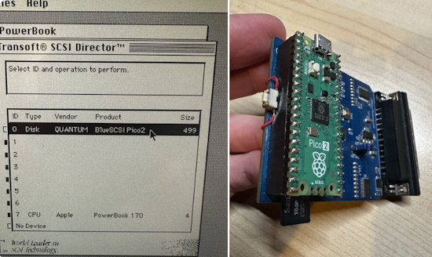](https://x.com/ronscompvids/status/1829745262484394204)

BlueSCSI using the Raspberry Pi Pico 2 - [X](https://x.com/ronscompvids/status/1829745262484394204).

You can supercharge and automate GIMP with Python, here's how - [XDA](https://www.xda-developers.com/automate-gimp-supercharge-python/).

Meet Bython, the Python with braces. Bython is Python with braces because Python is awesome, but whitespace is awful - [AIM](https://analyticsindiamag.com/developers-corner/meet-bython-the-python-with-braces/).

## New

[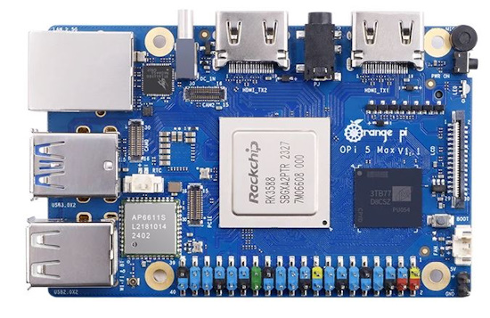](https://liliputing.com/orange-pi-5-max-is-a-credit-card-sized-rk3588-pc-with-2-5-gbe-ethernet-pcie-3-0-and-wifi-6e/)

Orange Pi 5 Max is a credit card-sized RK3588 PC with 2.5 GbE Ethernet, PCIe 3.0, and WiFi 6E - [liliputing](https://liliputing.com/orange-pi-5-max-is-a-credit-card-sized-rk3588-pc-with-2-5-gbe-ethernet-pcie-3-0-and-wifi-6e/).

## New Boards Supported by CircuitPython

The number of supported microcontrollers and Single Board Computers (SBC) grows every week. This section outlines which boards have been included in CircuitPython or added to [CircuitPython.org](https://circuitpython.org/).

This week there were two new boards added:

- [VIDI X](https://circuitpython.org/board/vidi_x/)
- [Tiny FX](https://circuitpython.org/board/pimoroni_tinyfx/)

*Note: For non-Adafruit boards, please use the support forums of the board manufacturer for assistance, as Adafruit does not have the hardware to assist in troubleshooting.*

Looking to add a new board to CircuitPython? It's highly encouraged! Adafruit has four guides to help you do so:

- [How to Add a New Board to CircuitPython](https://learn.adafruit.com/how-to-add-a-new-board-to-circuitpython/overview)
- [How to add a New Board to the circuitpython.org website](https://learn.adafruit.com/how-to-add-a-new-board-to-the-circuitpython-org-website)
- [Adding a Single Board Computer to PlatformDetect for Blinka](https://learn.adafruit.com/adding-a-single-board-computer-to-platformdetect-for-blinka)
- [Adding a Single Board Computer to Blinka](https://learn.adafruit.com/adding-a-single-board-computer-to-blinka)

## New Learn Guides

[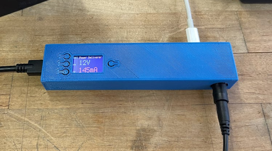](https://learn.adafruit.com/guides/latest)

[USB C Power Delivery Monitor](https://learn.adafruit.com/usb-c-benchtop-power-supply) from [John Park](https://learn.adafruit.com/u/johnpark)

## CircuitPython Libraries

The CircuitPython library numbers are continually increasing, while existing ones continue to be updated. Here we provide library numbers and updates!

To get the latest Adafruit libraries, download the [Adafruit CircuitPython Library Bundle](https://circuitpython.org/libraries). To get the latest community contributed libraries, download the [CircuitPython Community Bundle](https://circuitpython.org/libraries).

If you'd like to contribute to the CircuitPython project on the Python side of things, the libraries are a great place to start. Check out the [CircuitPython.org Contributing page](https://circuitpython.org/contributing). If you're interested in reviewing, check out Open Pull Requests. If you'd like to contribute code or documentation, check out Open Issues. We have a guide on [contributing to CircuitPython with Git and GitHub](https://learn.adafruit.com/contribute-to-circuitpython-with-git-and-github), and you can find us in the #help-with-circuitpython and #circuitpython-dev channels on the [Adafruit Discord](https://adafru.it/discord).

You can check out this [list of all the Adafruit CircuitPython libraries and drivers available](https://github.com/adafruit/Adafruit_CircuitPython_Bundle/blob/master/circuitpython_library_list.md). 

The current number of CircuitPython libraries is **495**!

**New Libraries**

Here's this week's new CircuitPython library:

  * [EGJ-Moorington/CircuitPython_Button_Handler](https://github.com/EGJ-Moorington/CircuitPython_Button_Handler)

**Updated Libraries**

Here's this week's updated CircuitPython library:

  * [adafruit/Adafruit_CircuitPython_DotStar](https://github.com/adafruit/Adafruit_CircuitPython_DotStar)

**Library PyPI Weekly Download Stats**

**Total Library Stats**
  * 17,9240 PyPI downloads over 333 libraries

**Top 10 Libraries by PyPI Downloads**
  * Adafruit CircuitPython Requests (adafruit-circuitpython-requests): 11,339
  * Adafruit CircuitPython BusDevice (adafruit-circuitpython-busdevice): 10,981
  * Adafruit CircuitPython ConnectionManager (adafruit-circuitpython-connectionmanager): 9,772
  * Adafruit CircuitPython Register (adafruit-circuitpython-register): 2,197
  * Adafruit CircuitPython MiniMQTT (adafruit-circuitpython-minimqtt): 1,770
  * Adafruit CircuitPython Wiznet5k (adafruit-circuitpython-wiznet5k): 1,634
  * Adafruit CircuitPython ADS1x15 (adafruit-circuitpython-ads1x15): 1,524
  * Adafruit CircuitPython Display Text (adafruit-circuitpython-display-text): 1,430
  * Adafruit CircuitPython ESP32SPI (adafruit-circuitpython-esp32spi): 1,430
  * Adafruit CircuitPython DHT (adafruit-circuitpython-dht): 1,417

## What’s the CircuitPython team up to this week?

What is the team up to this week? Let’s check in:

**Dan**

I'm continuing on merging MicroPython v1.23 into CircuitPython. I've completed all the file merging and reviewed the merges, and I am now working on getting rid of any compilation errors.

**Tim**

I have continued working on 2 main things from last week. The serial plotter in the WebIDE which is coming along nicely and nearly ready for review, and refactoring and expanding upon the intersection check functions that I recently wrote and proposed to add to the core in the vectorio module.

**Jeff**

I added a small feature to the core `StateMachine` object for RP2040/RP2350 microcontrollers. Now it is possible to query a program's load address (via the offset property) and the most recently executing instruction (via the pc property, which is short for "program counter"). These two features can be useful when debugging PIO programs, because they can help you understand which instructions in the program are executing.

**Scott**

I'm still in debugging mode. I found and fixed an issue with USB resume on ESP. I fixed the ReadTheDocs build and got it fixed upstream. Now I'm debugging BLE HID (think bluetooth keyboard) on ESP.

## Upcoming Events

The next MicroPython Meetup in Melbourne will be on September 25th – [Meetup](https://www.meetup.com/micropython-meetup/events). You can see recordings of previous meetings on [YouTube](https://www.youtube.com/@MicroPythonOfficial). The August 2024 [Roundup](https://melbournemicropythonmeetup.github.io/August-2024-Meetup/).

Maker Faire Bay Area returns to Mare Island Naval Shipyard on October 18-20, 2024 - [Maker Faire](https://makerfaire.com/bay-area/).

Hackaday Superconference is an epic gathering of hardware hackers, makers, and tech enthusiasts happening November 1-3 in Pasadena, California - [Hackaday](https://hackaday.com/2024/08/06/tickets-for-supercon-2024-go-on-sale-now/) and [Eventbrite](https://www.eventbrite.com/e/2024-hackaday-superconference-tickets-965387338517).

PyCon AU will be held from the 22nd to the 26th of November at the Melbourne Convention and Exhibition Centre (MCEC) in Narrm/Melbourne. Matt Trentini and Damien George will both be presennting on MicroPython - [PyCon AU](https://2024.pycon.org.au/).

PyLadies Conference (PyLadiesCon) is a transformative event designed to promote diversity, learning, and empowerment within the Python community. December 6-8, 2024 online - [PyLadies](https://conference.pyladies.com/).

**Send Your Events In**

If you know of virtual events or upcoming events, please let us know via email to cpnews(at)adafruit(dot)com.

## Latest Releases

CircuitPython's stable release is [9..1.3](https://github.com/adafruit/circuitpython/releases/latest) and its unstable release is [9.2.0-alpha.2351](https://github.com/adafruit/circuitpython/releases). New to CircuitPython? Start with our [Welcome to CircuitPython Guide](https://learn.adafruit.com/welcome-to-circuitpython).

[20240904](https://github.com/adafruit/Adafruit_CircuitPython_Bundle/releases/latest) is the latest Adafruit CircuitPython library bundle.

[20240903](https://github.com/adafruit/CircuitPython_Community_Bundle/releases/latest) is the latest CircuitPython Community library bundle.

[v1.23.0](https://micropython.org/download) is the latest MicroPython release. Documentation for it is [here](http://docs.micropython.org/en/latest/pyboard/).

[3.12.5](https://www.python.org/downloads/) is the latest Python release. The latest pre-release version is [3.13.0rc1](https://www.python.org/download/pre-releases/).

[4,018 Stars](https://github.com/adafruit/circuitpython/stargazers) Like CircuitPython? [Star it on GitHub!](https://github.com/adafruit/circuitpython)

## Call for Help -- Translating CircuitPython is now easier than ever

[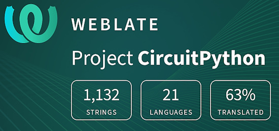](https://hosted.weblate.org/engage/circuitpython/)

One important feature of CircuitPython is translated control and error messages. With the help of fellow open source project [Weblate](https://weblate.org/), we're making it even easier to add or improve translations. 

Sign in with an existing account such as GitHub, Google or Facebook and start contributing through a simple web interface. No forks or pull requests needed! As always, if you run into trouble join us on [Discord](https://adafru.it/discord), we're here to help.

## 38,269 Thanks

The Adafruit Discord community, where we do all our CircuitPython development in the open, reached over 38,269 humans - thank you! Adafruit believes Discord offers a unique way for Python on hardware folks to connect. Join today at [https://adafru.it/discord](https://adafru.it/discord).

## ICYMI - In case you missed it

Python on hardware is the Adafruit Python video-newsletter-podcast! The news comes from the Python community, Discord, Adafruit communities and more and is broadcast on ASK an ENGINEER Wednesdays. The complete Python on Hardware weekly videocast [playlist is here](https://www.youtube.com/playlist?list=PLjF7R1fz_OOXRMjM7Sm0J2Xt6H81TdDev). The video podcast is on [iTunes](https://itunes.apple.com/us/podcast/python-on-hardware/id1451685192?mt=2), [YouTube](http://adafru.it/pohepisodes), [Instagram](https://www.instagram.com/adafruit/channel/)), and [XML](https://itunes.apple.com/us/podcast/python-on-hardware/id1451685192?mt=2).

[The weekly community chat on Adafruit Discord server CircuitPython channel - Audio / Podcast edition](https://itunes.apple.com/us/podcast/circuitpython-weekly-meeting/id1451685016) - Audio from the Discord chat space for CircuitPython, meetings are usually Mondays at 2pm ET, this is the audio version on [iTunes](https://itunes.apple.com/us/podcast/circuitpython-weekly-meeting/id1451685016), Pocket Casts, [Spotify](https://adafru.it/spotify), and [XML feed](https://adafruit-podcasts.s3.amazonaws.com/circuitpython_weekly_meeting/audio-podcast.xml).

## Contribute

The CircuitPython Weekly Newsletter is a CircuitPython community-run newsletter emailed every Monday. The complete [archives are here](https://www.adafruitdaily.com/category/circuitpython/). It highlights the latest CircuitPython related news from around the web including Python and MicroPython developments. To contribute, edit next week's draft [on GitHub](https://github.com/adafruit/circuitpython-weekly-newsletter/tree/gh-pages/_drafts) and [submit a pull request](https://help.github.com/articles/editing-files-in-your-repository/) with the changes. You may also tag your information on Twitter with #CircuitPython. 

Join the Adafruit [Discord](https://adafru.it/discord) or [post to the forum](https://forums.adafruit.com/viewforum.php?f=60) if you have questions.
