- [ ] Library and info updates
- [ ] change date
- [ ] update title
- [ ] Feature story
- [ ] Update  for images
- [ ] Update ICYDNCI
- [ ] All images 550w max only
- [ ] Link "View this email in your browser."

News Sources

- [Adafruit Playground](https://adafruit-playground.com/)
- Twitter: [CircuitPython](https://twitter.com/search?q=circuitpython&src=typed_query&f=live), [MicroPython](https://twitter.com/search?q=micropython&src=typed_query&f=live) and [Python](https://twitter.com/search?q=python&src=typed_query)
- [Raspberry Pi News](https://www.raspberrypi.com/news/)
- Mastodon [CircuitPython](https://octodon.social/tags/CircuitPython) and [MicroPython](https://octodon.social/tags/MicroPython)
- [hackster.io CircuitPython](https://www.hackster.io/search?q=circuitpython&i=projects&sort_by=most_recent) and [MicroPython](https://www.hackster.io/search?q=micropython&i=projects&sort_by=most_recent)
- YouTube: [CircuitPython](https://www.youtube.com/results?search_query=circuitpython&sp=CAI%253D), [MicroPython](https://www.youtube.com/results?search_query=micropython&sp=CAI%253D)
- Instructables: [CircuitPython](https://www.instructables.com/search/?q=circuitpython&projects=all&sort=Newest), [MicroPython](https://www.instructables.com/search/?q=micropython&projects=all&sort=Newest), [Raspberry Pi Python](https://www.instructables.com/search/?q=raspberry+pi+python&projects=all&sort=Newest)
- [python.org](https://www.python.org/)
- [Python Insider - dev team blog](https://pythoninsider.blogspot.com/)
- Individuals: [Jeff Geerling](https://www.jeffgeerling.com/blog)
- Tom's Hardware: [CircuitPython](https://www.tomshardware.com/search?searchTerm=circuitpython&articleType=all&sortBy=publishedDate) and [MicroPython](https://www.tomshardware.com/search?searchTerm=micropython&articleType=all&sortBy=publishedDate) and [Raspberry Pi](https://www.tomshardware.com/search?searchTerm=raspberry%20pi&articleType=all&sortBy=publishedDate)
- [hackaday.io newest projects MicroPython](https://hackaday.io/projects?tag=micropython&sort=date) and [CircuitPython](https://hackaday.io/projects?tag=circuitpython&sort=date)
- [Google News Python](https://news.google.com/topics/CAAqIQgKIhtDQkFTRGdvSUwyMHZNRFY2TVY4U0FtVnVLQUFQAQ?hl=en-US&gl=US&ceid=US%3Aen)
- [hackaday CircuitPython](https://hackaday.com/blog/?s=circuitpython) and [MicroPython](https://hackaday.com/blog/?s=micropython)
- hackaday.io - [CircuitPython](https://hackaday.io/search?term=circuitpython) and [MicroPython](https://hackaday.io/search?term=micropython)

View this email in your browser. **Warning: Flashing Imagery**

Welcome to the latest Python on Microcontrollers newsletter! *insert 2-3 sentences from editor (what's in overview, banter)* - *Anne Barela, Editor*

We're on [Discord](https://discord.gg/HYqvREz), [Twitter](https://twitter.com/search?q=circuitpython&src=typed_query&f=live), and for past newsletters - [view them all here](https://www.adafruitdaily.com/category/circuitpython/). If you're reading this on the web, [subscribe here](https://www.adafruitdaily.com/). Here's the news this week:

## CircuitPython Comes to the ESP32-P4 Evaluation Board

[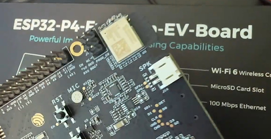](https://www.youtube.com/watch?v=ykGEw1Hig0Q&t=2s)

Core CircuitPython developer Scott has been chugging away at adding ESP32-P4 support to CircuitPython. He has provided Ladyada a bin file that runs on the Eval board received last week from Espressif. Native USB is still in progress, but she could connect to the REPL and save files using the USB-Serial converter. "It's so fast at 400mhz, and with 16 or 32 MHz of PSRAM, it's going to be an awesome board for embedded Python" - [Adafruit Blog](https://blog.adafruit.com/2024/09/10/esp32-p4-booting-up-and-running-circuitpython/) and [YouTube](https://www.youtube.com/watch?v=ykGEw1Hig0Q&t=2s).

## Armulet allows Raspberry Pi to run Arm code on RISC-V

[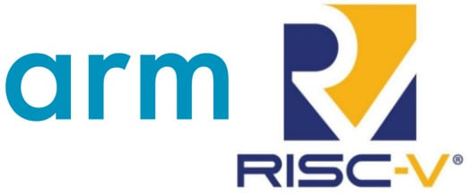](https://blog.adafruit.com/2024/09/10/armulet-allows-raspberry-pi-to-run-arm-code-on-risc-v/)

ARMULET is a C ARMv6M / ARMv8M-baseline emulator by Raspberry Pi. Raspberry Pi is using Armulet to run Arm code on RISC-V in the RP2350 bootrom. The effort could be augmented to run legacy Arm code on a RISC-V only architecture - [Adafruit Blog](https://blog.adafruit.com/2024/09/10/armulet-allows-raspberry-pi-to-run-arm-code-on-risc-v/) and [GitHub](https://github.com/raspberrypi/armulet).

Per the RP2350 bootrom details:

> "Because of limited space, we cannot duplicate a lot of code in RISC-V, so ARM code is emulated (varmulet) on RISC-V. We emulate (roughly) Arm8-M Baseline not Arm8-M Mainline as it has many fewer less complex instructions (Arm8-M Baseline adds a small number of, but very handy instructions over m0-plus)."

## Python 3.13.0RC2, 3.12.6, 3.11.10, 3.10.15, 3.9.20, and 3.8.20 Are Now Available

A big joint release from the Python developers. Mostly security fixes but also the final release candidate of Python 3.13 - [Python Insider Blog](https://blog.python.org/2024/09/python-3130rc2-3126-31110-31015-3920.html).

## Feature

text - [site](url).

## RP2350: the Brains of the Raspberry Pi Pico 2

[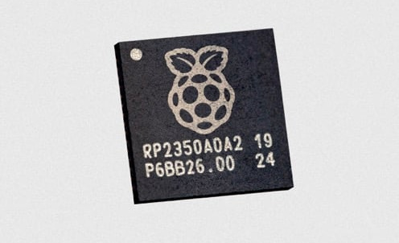](https://www.raspberrypi.com/news/rp2350-the-brains-of-raspberry-pi-pico-2/)

Nick Francis, technical director at Raspberry Pi, writes about the features of the new RP2350 and how it was designed. An interesting note - it appears all Raspberry Pi microcontroller chips are made on the TSMC 40nm process - [Raspberry Pi News](https://www.raspberrypi.com/news/rp2350-the-brains-of-raspberry-pi-pico-2/).

## Stretching the Possibilities of Soft Robots with Flexible Electronics

[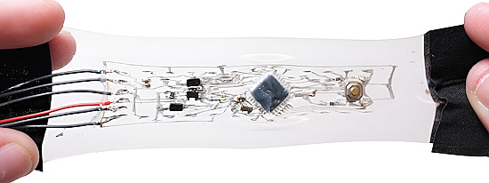](https://techxplore.com/news/2024-09-possibilities-soft-robots-flexible-electronics.html)

Prof. Rebecca Kramer-Bottiglio and a team of researchers have developed complex electronics that can stretch substantially beyond their original shape. Further, the system can be easily adapted to different uses. [The results](https://www.science.org/doi/10.1126/scirobotics.adn6844) of their work are published in Science Robotics. As a demonstration, they developed stretchable versions of an Arduino — a widely used open-sourced electronics platform—and embedded them into soft robots - [RechXplore](https://techxplore.com/news/2024-09-possibilities-soft-robots-flexible-electronics.html).

## What is an STM32 MPU? Understanding the New Realities of Microprocessors in Embedded Systems

What is an STM32 MPU? Understanding the new realities of microprocessors in embedded systems helps answer the difference between a microcontroller (MCU) and a microprocessor (MPU) - [ST Blog](https://blog.st.com/mpu-microprocessor/).

## Six Underrated Features and Upgrades of the Raspberry Pi 5

The Raspberry Pi 5 packs quite a powerful computational punch for its low price point and compact size. That's far from the only thing about the Raspberry Pi that has been changed for the newest model, though. SlashGear takes a look at some of the low-key features, upgrades, and beneficiaries of those features and upgrades that help it stand out - [SlashGear](https://www.slashgear.com/1655856/underrated-features-upgrades-raspberry-pi-5/).

## Raspberry Pi Imager 1.9 Released with Qt 6 Port, AppImage Support, and More

[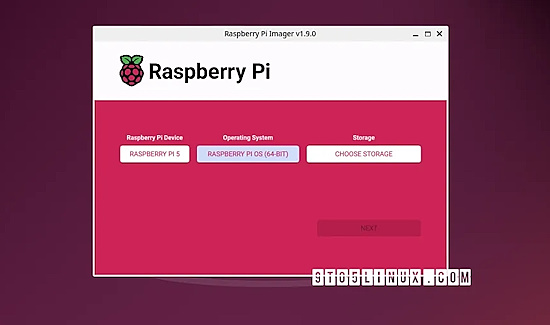](https://9to5linux.com/raspberry-pi-imager-1-9-released-with-qt-6-port-appimage-support-and-more)

Raspberry Pi Imager, a user-friendly tool for creating bootable media for Raspberry Pi devices, has been updated today to version 1.9, a major release that brings a modern interface and new features - [9to5Linux](https://9to5linux.com/raspberry-pi-imager-1-9-released-with-qt-6-port-appimage-support-and-more).

## This Week's Python Streams

Python on Hardware is all about building a cooperative ecosphere which allows contributions to be valued and to grow knowledge. Below are the streams within the last week focusing on the community.

**CircuitPython Deep Dive Stream**

[Last Friday](https://youtube.com/live/-6DOwyW6Rzk), Scott streamed work on CircuitMatter.

You can see the latest video and past videos on the Adafruit YouTube channel under the Deep Dive playlist - [YouTube](https://www.youtube.com/playlist?list=PLjF7R1fz_OOXBHlu9msoXq2jQN4JpCk8A).

**CircuitPython Parsec**

John Park’s CircuitPython Parsec this week is on {subject} - [Adafruit Blog](link) and [YouTube](link).

Catch all the episodes in the [YouTube playlist](https://www.youtube.com/playlist?list=PLjF7R1fz_OOWFqZfqW9jlvQSIUmwn9lWr).

**CircuitPython Weekly Meeting**

CircuitPython Weekly Meeting for September 9, 2024 ([notes](https://github.com/adafruit/adafruit-circuitpython-weekly-meeting/blob/main/2024/2024-09-09.md)) [on YouTube](https://youtu.be/LBj2YC4frz0).

## Project of the Week: A Tactile AAC Board

[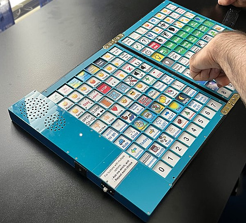](https://hackaday.io/project/197545-tactile-aac-board)

The Tactile AAC board is a 160-phrase, snap-dome button symphony for nonverbal communication. Foldable, spill-resistant, and CircuitPython-powered. The portable version has ah neck strap included. Speech tech meets absurdly practical design - [hackaday.io](https://hackaday.io/project/197545-tactile-aac-board) via [X](https://x.com/geeknik/status/1833615965621219668).

## Popular Last Week

[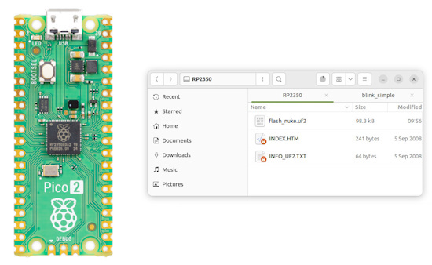](https://www.cnx-software.com/2024/09/03/how-to-recover-a-bricked-raspberry-pi-pico-2-or-other-rp2350-board/)

What was the most popular, most clicked link, in [last week's newsletter](https://www.adafruitdaily.com/2024/09/09/python-on-microcontrollers-newsletter-the-latest-on-raspberry-pi-rp2350-e9-bluetooth-6-4000-stars-and-more-circuitpython-python-micropython-thepsf-raspberry_pi/)? [How to recover a “bricked” Raspberry Pi Pico 2 or other RP2350 board](https://www.cnx-software.com/2024/09/03/how-to-recover-a-bricked-raspberry-pi-pico-2-or-other-rp2350-board/).

## New Notes from Adafruit Playground

[Adafruit Playground](https://adafruit-playground.com/) is a new place for the community to post their projects and other making tips/tricks/techniques. Ad-free, it's an easy way to publish your work in a safe space for free.

[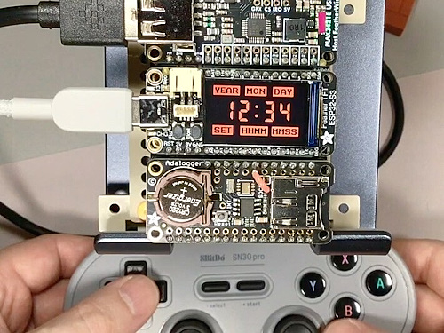](https://adafruit-playground.com/u/SamBlenny/pages/work-in-progress-feather-tft-clock)

Work in Progress: Feather TFT Clock - [Adafruit Playground](https://adafruit-playground.com/u/SamBlenny/pages/work-in-progress-feather-tft-clock).

Orrery: Put a solar system in your pocket! - [Adafruit Playground](https://adafruit-playground.com/u/mrklingon/pages/orrery-put-a-solar-system-in-your-pocket).

[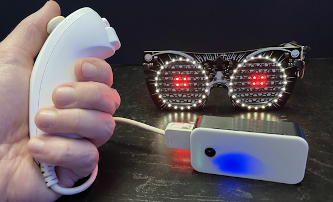](https://adafruit-playground.com/u/squid_jpg/pages/wii-nunchuck-ble-adapter)

Wii Nunchuck BLE Adapter - [Adafruit Playground](https://adafruit-playground.com/u/squid_jpg/pages/wii-nunchuck-ble-adapter).

## News From Around the Web

[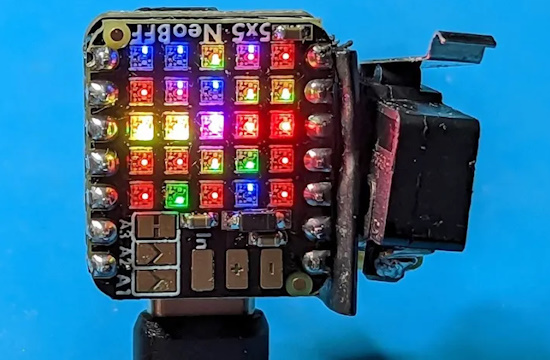](https://hackaday.com/2024/09/11/2024-tiny-games-contest-micro-one-armed-bandit-hits-the-cuteness-jackpot/)

This version of a slot machine is tiny! It uses an Adafruit SAMD21 QT Py and a 5x5 NeoPixel BFF board, coupled with a microswitch to activate a spin. Programmed in CircuitPython - [Hackaday](https://hackaday.com/2024/09/11/2024-tiny-games-contest-micro-one-armed-bandit-hits-the-cuteness-jackpot/), [YouTube](https://youtu.be/NdhRO1JrY0I) and [GitHub](https://github.com/somenice/micro-one-armed-bandit).

[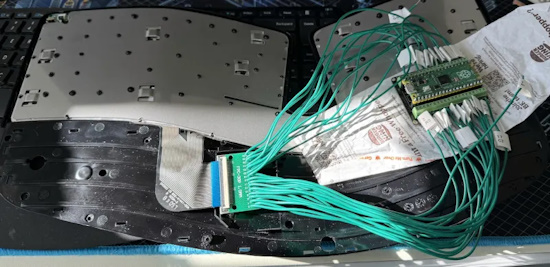](https://techberet.com/2024/09/07/replacement-pcb-for-sculpt-rp2040#appendix-b-project-source-code-links)

Designing a replacement PCB for the Microsoft Sculpt Ergonomic Keyboard with RP2040 and QMK (CircuitPython) - [TechBeret](https://techberet.com/2024/09/07/replacement-pcb-for-sculpt-rp2040#appendix-b-project-source-code-links) via [Hackaday](https://hackaday.com/2024/09/09/microsoft-sculpt-keyboard-lives-again-with-rp2040/).

[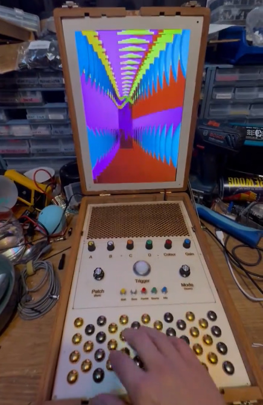](https://x.com/billyischilly/status/1834312700979282223)

An audio visual synthesiser which uses @CritterGuitari‘s Eyesy software and the Yoshimi synth running on a Raspberry Pi Zero 2W. The keyboard also has polyphonic aftertouch which works with Yoshimi. The visualizations are using `pygame` in Python - [X](https://x.com/billyischilly/status/1834312700979282223).

[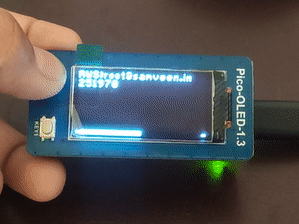](https://github.com/samveen/pico-mpy-2fa-totp?tab=readme-ov-file)

Generating time-based one-time passwords (TOTP) using MicroPython, Raspberry Pi Pico W and the Waveshare Pico-Oled-1.3 - [GitHub](https://github.com/samveen/pico-mpy-2fa-totp?tab=readme-ov-file).

[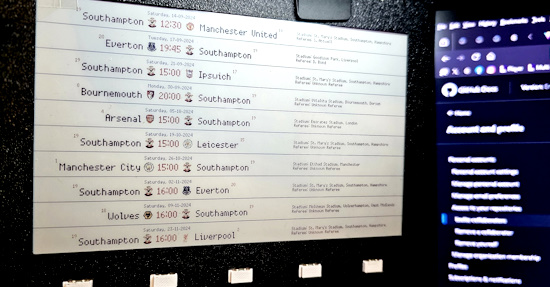](https://x.com/MrGlennJones/status/1833859347820007593)

Making a sports game display board with a Pimoroni Inky Footy Frame (eInk) and MicroPython - [X Thread](https://x.com/MrGlennJones/status/1833859347820007593).

[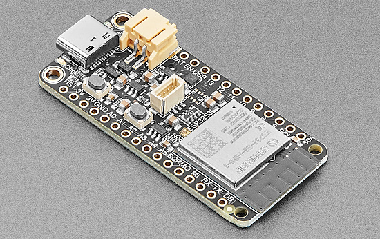](https://github.com/adafruit/Adafruit_CircuitPython_ESP_ATcontrol/issues/72)

GitHub user bablokb is rewriting the ESP32 AT interface library with support for ESP32-C3 and C6 - [GitHub](https://github.com/adafruit/Adafruit_CircuitPython_ESP_ATcontrol/issues/72).

A new CircuitPython SynthKeyboard helper library - [pico-synth-sandbox](https://pico-synth-sandbox.dcdalrymple.com/circuitpython-synthkeyboard-helper-library/) and [documentation](https://circuitpython-synthkeyboard.readthedocs.io/en/latest/), via [X](https://x.com/coopersnout/status/1833538659649568991).

SuperCon 2023: Ben Combee and the hackers guide to audio/video formats - [Hackaday](https://hackaday.com/2024/09/09/supercon-2023-ben-combee-and-the-hackers-guide-to-audio-video-formats/).

[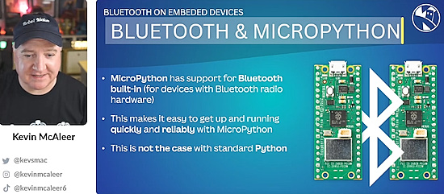](https://x.com/i/broadcasts/1lDxLlOArBoxm)

How to talk between Raspberry Pis and Picos with Bluetooth - [X Broadcast](https://x.com/i/broadcasts/1lDxLlOArBoxm).

Videocast: CALM #162 - CircuitPython my love discusses CircuitPython - [YouTube](https://www.youtube.com/watch?v=PB7Bcg6UvnM) (French).

A new CircuitPython library for a WM8960 stereo audio codec - [GitHub](https://github.com/adafruit/Adafruit_CircuitPython_WM8960) via [X](https://x.com/coopersnout/status/1833256418897760644).

Alberto Quesada from UEx teaches the course "Programming with Python and CircuitPython" with SmartOpenLab - [X](https://x.com/CircularFab/status/1831981136941113577).

MicroPython – adjusting for Daylight Savings and updating the RTC of an SBC - [Spindlecrank](https://spindlecrank.com/2024/09/micropython-adjusting-for-daylight-savings-and-updating-the-rtc-of-the-sbc/).

[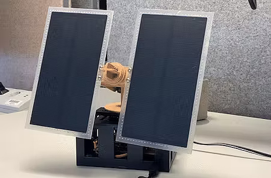](https://www.hackster.io/Infineon_Team/sunchaser-a-micropython-powered-solar-tracker-29d9a8)

SunChaser is a MicroPython-powered solar tracker - [hackster.io](https://www.hackster.io/Infineon_Team/sunchaser-a-micropython-powered-solar-tracker-29d9a8).

text - [site](url).

[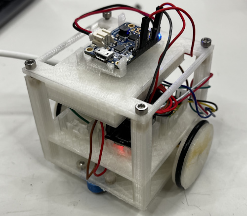](https://www.instructables.com/Differential-Wheeled-Robot-With-IR-Sensing/)

A differential wheeled robot with IR sensing using MicroPython and ESP32-C3 - [Instructables](https://www.instructables.com/Differential-Wheeled-Robot-With-IR-Sensing/).

[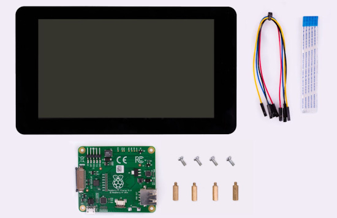](https://www.raspberrypi.com/news/how-to-use-the-raspberry-pi-touch-display/)

An updated guide on how to use the official Raspberry Pi Touch Display - [Raspberry Pi News](https://www.raspberrypi.com/news/how-to-use-the-raspberry-pi-touch-display/).

[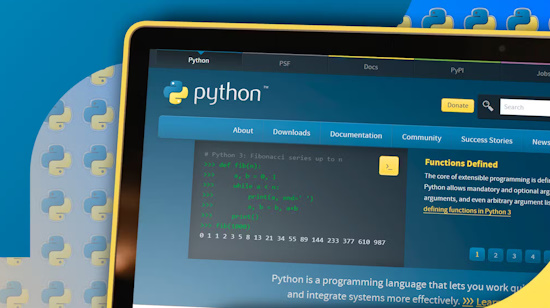](https://www.howtogeek.com/start-project-python-virtual-environments/)

Don’t make this mistake when you start your Python project (use virtual environments) - [How-To Geek](https://www.howtogeek.com/start-project-python-virtual-environments/) and [Towards Data Science](https://towardsdatascience.com/creating-project-environments-in-python-with-vscode-b95b530cd627).

The Python QuickStart for people learning AI - [Medium](https://towardsdatascience.com/python-quickstart-for-people-learning-ai-58a1b76df0f4) and [YouTube](https://youtu.be/-uxgfdu5Eb4).

[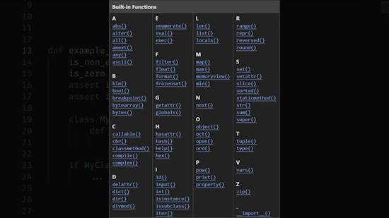](https://www.youtube.com/watch?app=desktop&v=7Qu_KXc7xSI)

All 71 built-in Python functions - [YouTube](https://www.youtube.com/watch?app=desktop&v=7Qu_KXc7xSI).

## New

[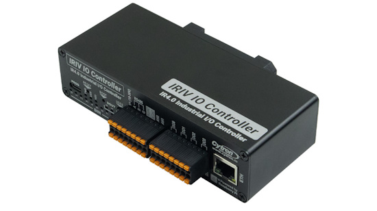](https://www.cnx-software.com/2024/09/13/raspberry-pi-rp2350-industrial-io-controller/)

The Cytron IRIV IO Controller is a Raspberry Pi RP2350-based industrial I/O controller with CircuitPython and MicroPython support - [CNX Software](https://www.cnx-software.com/2024/09/13/raspberry-pi-rp2350-industrial-io-controller/).

[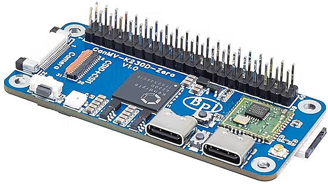](https://www.hackster.io/news/banana-pi-targets-compact-energy-efficient-edge-ai-with-the-risc-v-powered-bpi-k230d-zero-1253245a9a0d)

Banana Pi Targets Compact, Energy-Efficient Edge AI with the RISC-V-Powered BPI-K230D Zero. With only 128MB RAM, the company plans to promote the board for MicroPython use rather than as a Linux system - [hackster.io](https://www.hackster.io/news/banana-pi-targets-compact-energy-efficient-edge-ai-with-the-risc-v-powered-bpi-k230d-zero-1253245a9a0d).

## New Boards Supported by CircuitPython

The number of supported microcontrollers and Single Board Computers (SBC) grows every week. This section outlines which boards have been included in CircuitPython or added to [CircuitPython.org](https://circuitpython.org/).

There were no new boards added this week, but several are in process.

*Note: For non-Adafruit boards, please use the support forums of the board manufacturer for assistance, as Adafruit does not have the hardware to assist in troubleshooting.*

Looking to add a new board to CircuitPython? It's highly encouraged! Adafruit has four guides to help you do so:

- [How to Add a New Board to CircuitPython](https://learn.adafruit.com/how-to-add-a-new-board-to-circuitpython/overview)
- [How to add a New Board to the circuitpython.org website](https://learn.adafruit.com/how-to-add-a-new-board-to-the-circuitpython-org-website)
- [Adding a Single Board Computer to PlatformDetect for Blinka](https://learn.adafruit.com/adding-a-single-board-computer-to-platformdetect-for-blinka)
- [Adding a Single Board Computer to Blinka](https://learn.adafruit.com/adding-a-single-board-computer-to-blinka)

## New Learn Guides

[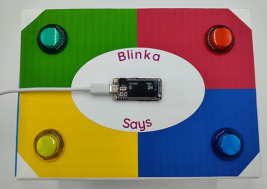](https://learn.adafruit.com/guides/latest)

[Blinka Says Tabletop Arcade Game](https://learn.adafruit.com/blinka-says-tabletop-arcade-game) from [Tim C](https://learn.adafruit.com/u/Foamyguy)

[ESP32-S3 BLE RS-232 Controller](https://learn.adafruit.com/esp32-s3-ble-rs232-controller) from [Liz Clark](https://learn.adafruit.com/u/BlitzCityDIY)

## CircuitPython Libraries

The CircuitPython library numbers are continually increasing, while existing ones continue to be updated. Here we provide library numbers and updates!

To get the latest Adafruit libraries, download the [Adafruit CircuitPython Library Bundle](https://circuitpython.org/libraries). To get the latest community contributed libraries, download the [CircuitPython Community Bundle](https://circuitpython.org/libraries).

If you'd like to contribute to the CircuitPython project on the Python side of things, the libraries are a great place to start. Check out the [CircuitPython.org Contributing page](https://circuitpython.org/contributing). If you're interested in reviewing, check out Open Pull Requests. If you'd like to contribute code or documentation, check out Open Issues. We have a guide on [contributing to CircuitPython with Git and GitHub](https://learn.adafruit.com/contribute-to-circuitpython-with-git-and-github), and you can find us in the #help-with-circuitpython and #circuitpython-dev channels on the [Adafruit Discord](https://adafru.it/discord).

You can check out this [list of all the Adafruit CircuitPython libraries and drivers available](https://github.com/adafruit/Adafruit_CircuitPython_Bundle/blob/master/circuitpython_library_list.md). 

The current number of CircuitPython libraries is **496**!

**New Libraries**

Here's this week's new CircuitPython libraries:

  * [CDarius/CircuitPython_M5Stack_PbHub](https://github.com/CDarius/CircuitPython_M5Stack_PbHub)

**Updated Libraries**

Here's this week's updated CircuitPython libraries:

  * [adafruit/Adafruit_CircuitPython_PIOASM](https://github.com/adafruit/Adafruit_CircuitPython_PIOASM)
  * [adafruit/Adafruit_CircuitPython_Pixelbuf](https://github.com/adafruit/Adafruit_CircuitPython_Pixelbuf)

**Library PyPI Weekly Download Stats**

**Total Library Stats**
  * 177,098 PyPI downloads over 333 libraries

**Top 10 Libraries by PyPI Downloads**
  * Adafruit CircuitPython Requests (adafruit-circuitpython-requests): 12,457
  * Adafruit CircuitPython BusDevice (adafruit-circuitpython-busdevice): 12,283
  * Adafruit CircuitPython ConnectionManager (adafruit-circuitpython-connectionmanager): 10,927
  * Adafruit CircuitPython Register (adafruit-circuitpython-register): 2,423
  * Adafruit CircuitPython MiniMQTT (adafruit-circuitpython-minimqtt): 1,946
  * Adafruit CircuitPython Wiznet5k (adafruit-circuitpython-wiznet5k): 1,608
  * Adafruit CircuitPython DHT (adafruit-circuitpython-dht): 1,604
  * Adafruit CircuitPython ADS1x15 (adafruit-circuitpython-ads1x15): 1,496
  * Adafruit CircuitPython Pixelbuf (adafruit-circuitpython-pixelbuf): 1,477
  * Adafruit CircuitPython ESP32SPI (adafruit-circuitpython-esp32spi): 1,453

## What’s the CircuitPython team up to this week?

What is the team up to this week? Let’s check in:

**Dan**

text.

**Tim**

This week I wrapped up the implementation of serial plotter inside the CircuitPython Web IDE. It's now available in the beta version of the IDE page. I also wrote up the guide for my latest project: a cardboard arcade game inspired by Simon.

**Jeff**

I'm continuing to work on support for the new PIO peripheral features in the RP2350. Right at the moment I'm adding support for the "txput" and "txget" modes, which allow access to 4 32-bit numbers in random access fashion, instead of in FIFO fashion. There aren't yet any PIO programs I've found that use these features, but I want to add it for completeness.

**Scott**

This week I've been debugging I2C on Espressif chips. I updated the ESP IDF to 5.3.1 in hopes it fixes the bug. I'm not sure it did. It is a bit hard to reproduce reliably. The IDF 5.3 also adds initial support for the ESP32-P4. I received a P4 development board and polished up changes by @bwhitman to get CircuitPython running on it. USB support isn't upstreamed to TinyUSB yet so it works over serial for now.

**Liz**

I had Covid for the first time, so I was out for a bit. I'm back this week though with two new guides. The first is a [project that uses BLE on an ESP32-S3](https://learn.adafruit.com/esp32-s3-ble-rs232-controller) with one of the new RS232 breakouts. I’m using the Bluefruit Connect app to send RS232 messages. The RS232 device that I used is an HDMI switcher, but you can update the CircuitPython code to send any RS232 messages that you want.

I also wrapped up the guide on the [QT Py CH32V203](https://learn.adafruit.com/adafruit-qt-py-ch32v203). This is a tiny but mighty board that has a lot of power at a low price. Huge thanks to Thach for putting in a lot of work to TinyUSB and the WCH Arduino board support package to make using the board a lot easier. He also assisted me with troubleshooting my own toolchain setup which I really appreciated. 

## Upcoming Events

The next MicroPython Meetup in Melbourne will be on September 25th – [Meetup](https://www.meetup.com/micropython-meetup/events). You can see recordings of previous meetings on [YouTube](https://www.youtube.com/@MicroPythonOfficial). The August 2024 [Roundup](https://melbournemicropythonmeetup.github.io/August-2024-Meetup/).

Maker Faire Bay Area returns to Mare Island Naval Shipyard on October 18-20, 2024 - [Maker Faire](https://makerfaire.com/bay-area/).

Hackaday Superconference is an epic gathering of hardware hackers, makers, and tech enthusiasts happening November 1-3 in Pasadena, California - [Hackaday](https://hackaday.com/2024/08/06/tickets-for-supercon-2024-go-on-sale-now/) and [Eventbrite](https://www.eventbrite.com/e/2024-hackaday-superconference-tickets-965387338517).

PyCon AU will be held from the 22nd to the 26th of November at the Melbourne Convention and Exhibition Centre (MCEC) in Narrm/Melbourne. Matt Trentini and Damien George will both be presennting on MicroPython - [PyCon AU](https://2024.pycon.org.au/).

PyLadies Conference (PyLadiesCon) is a transformative event designed to promote diversity, learning, and empowerment within the Python community. December 6-8, 2024 online - [PyLadies](https://conference.pyladies.com/).

**Send Your Events In**

If you know of virtual events or upcoming events, please let us know via email to cpnews(at)adafruit(dot)com.

## Latest Releases

CircuitPython's stable release is [9.1.3](https://github.com/adafruit/circuitpython/releases/latest) and its unstable release is [CircuitPython 9.2.0-alpha.2351](https://github.com/adafruit/circuitpython/releases). New to CircuitPython? Start with our [Welcome to CircuitPython Guide](https://learn.adafruit.com/welcome-to-circuitpython).

[20240910](https://github.com/adafruit/Adafruit_CircuitPython_Bundle/releases/latest) is the latest Adafruit CircuitPython library bundle.

[20240913](https://github.com/adafruit/CircuitPython_Community_Bundle/releases/latest) is the latest CircuitPython Community library bundle.

[v1.23.0](https://micropython.org/download) is the latest MicroPython release. Documentation for it is [here](http://docs.micropython.org/en/latest/pyboard/).

[3.12.6](https://www.python.org/downloads/) is the latest Python release. The latest pre-release version is [3.13.0rc2](https://www.python.org/download/pre-releases/).

[4,035 Stars](https://github.com/adafruit/circuitpython/stargazers) Like CircuitPython? [Star it on GitHub!](https://github.com/adafruit/circuitpython)

## Call for Help -- Translating CircuitPython is now easier than ever

[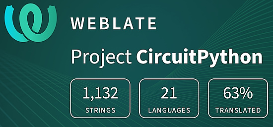](https://hosted.weblate.org/engage/circuitpython/)

One important feature of CircuitPython is translated control and error messages. With the help of fellow open source project [Weblate](https://weblate.org/), we're making it even easier to add or improve translations. 

Sign in with an existing account such as GitHub, Google or Facebook and start contributing through a simple web interface. No forks or pull requests needed! As always, if you run into trouble join us on [Discord](https://adafru.it/discord), we're here to help.

## 38,319 Thanks

The Adafruit Discord community, where we do all our CircuitPython development in the open, reached over 38,319 humans - thank you! Adafruit believes Discord offers a unique way for Python on hardware folks to connect. Join today at [https://adafru.it/discord](https://adafru.it/discord).

## ICYMI - In case you missed it

Python on hardware is the Adafruit Python video-newsletter-podcast! The news comes from the Python community, Discord, Adafruit communities and more and is broadcast on ASK an ENGINEER Wednesdays. The complete Python on Hardware weekly videocast [playlist is here](https://www.youtube.com/playlist?list=PLjF7R1fz_OOXRMjM7Sm0J2Xt6H81TdDev). The video podcast is on [iTunes](https://itunes.apple.com/us/podcast/python-on-hardware/id1451685192?mt=2), [YouTube](http://adafru.it/pohepisodes), [Instagram](https://www.instagram.com/adafruit/channel/)), and [XML](https://itunes.apple.com/us/podcast/python-on-hardware/id1451685192?mt=2).

[The weekly community chat on Adafruit Discord server CircuitPython channel - Audio / Podcast edition](https://itunes.apple.com/us/podcast/circuitpython-weekly-meeting/id1451685016) - Audio from the Discord chat space for CircuitPython, meetings are usually Mondays at 2pm ET, this is the audio version on [iTunes](https://itunes.apple.com/us/podcast/circuitpython-weekly-meeting/id1451685016), Pocket Casts, [Spotify](https://adafru.it/spotify), and [XML feed](https://adafruit-podcasts.s3.amazonaws.com/circuitpython_weekly_meeting/audio-podcast.xml).

## Contribute

The CircuitPython Weekly Newsletter is a CircuitPython community-run newsletter emailed every Monday. The complete [archives are here](https://www.adafruitdaily.com/category/circuitpython/). It highlights the latest CircuitPython related news from around the web including Python and MicroPython developments. To contribute, edit next week's draft [on GitHub](https://github.com/adafruit/circuitpython-weekly-newsletter/tree/gh-pages/_drafts) and [submit a pull request](https://help.github.com/articles/editing-files-in-your-repository/) with the changes. You may also tag your information on Twitter with #CircuitPython. 

Join the Adafruit [Discord](https://adafru.it/discord) or [post to the forum](https://forums.adafruit.com/viewforum.php?f=60) if you have questions.
