- [ ] Library and info updates
- [ ] change date
- [ ] update title
- [ ] Feature story
- [ ] Update  for images
- [ ] Update ICYDNCI
- [ ] All images 550w max only
- [ ] Link "View this email in your browser."

News Sources

- [Adafruit Playground](https://adafruit-playground.com/)
- Twitter: [CircuitPython](https://twitter.com/search?q=circuitpython&src=typed_query&f=live), [MicroPython](https://twitter.com/search?q=micropython&src=typed_query&f=live) and [Python](https://twitter.com/search?q=python&src=typed_query)
- [Raspberry Pi News](https://www.raspberrypi.com/news/)
- Mastodon [CircuitPython](https://octodon.social/tags/CircuitPython) and [MicroPython](https://octodon.social/tags/MicroPython)
- [hackster.io CircuitPython](https://www.hackster.io/search?q=circuitpython&i=projects&sort_by=most_recent) and [MicroPython](https://www.hackster.io/search?q=micropython&i=projects&sort_by=most_recent)
- YouTube: [CircuitPython](https://www.youtube.com/results?search_query=circuitpython&sp=CAI%253D), [MicroPython](https://www.youtube.com/results?search_query=micropython&sp=CAI%253D)
- Instructables: [CircuitPython](https://www.instructables.com/search/?q=circuitpython&projects=all&sort=Newest), [MicroPython](https://www.instructables.com/search/?q=micropython&projects=all&sort=Newest), [Raspberry Pi Python](https://www.instructables.com/search/?q=raspberry+pi+python&projects=all&sort=Newest)
- [python.org](https://www.python.org/)
- [Python Insider - dev team blog](https://pythoninsider.blogspot.com/)
- Individuals: [Jeff Geerling](https://www.jeffgeerling.com/blog)
- Tom's Hardware: [CircuitPython](https://www.tomshardware.com/search?searchTerm=circuitpython&articleType=all&sortBy=publishedDate) and [MicroPython](https://www.tomshardware.com/search?searchTerm=micropython&articleType=all&sortBy=publishedDate) and [Raspberry Pi](https://www.tomshardware.com/search?searchTerm=raspberry%20pi&articleType=all&sortBy=publishedDate)
- [hackaday.io newest projects MicroPython](https://hackaday.io/projects?tag=micropython&sort=date) and [CircuitPython](https://hackaday.io/projects?tag=circuitpython&sort=date)
- [Google News Python](https://news.google.com/topics/CAAqIQgKIhtDQkFTRGdvSUwyMHZNRFY2TVY4U0FtVnVLQUFQAQ?hl=en-US&gl=US&ceid=US%3Aen)
- [hackaday CircuitPython](https://hackaday.com/blog/?s=circuitpython) and [MicroPython](https://hackaday.com/blog/?s=micropython)
- hackaday.io - [CircuitPython](https://hackaday.io/search?term=circuitpython) and [MicroPython](https://hackaday.io/search?term=micropython)

View this email in your browser. **Warning: Flashing Imagery**

Welcome to the latest Python on Microcontrollers newsletter! *insert 2-3 sentences from editor (what's in overview, banter)* - *Anne Barela, Editor*

We're on [Discord](https://discord.gg/HYqvREz), [Twitter](https://twitter.com/search?q=circuitpython&src=typed_query&f=live), and for past newsletters - [view them all here](https://www.adafruitdaily.com/category/circuitpython/). If you're reading this on the web, [subscribe here](https://www.adafruitdaily.com/). Here's the news this week:

## Headline

text - [site](url).

## MicroPython Memory Profiler

[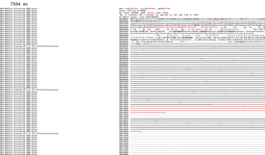](url)

[Planet Innovation](https://planetinnovation.com/) has released the MicroPython Memory Profiler under an open MIT license. It’s an in-house tool originally written mostly by Damien for a project where fragmented memory was an issue when running a device for many hours/days - [GitHub](https://github.com/pi-mst/micropython-memory-profiler).

## Adafruit on the Open Source Hardware Association Show and Tell event – Oct 2nd, 6:40 PM EDT #OpenOct

Adafruit will be part of the [Open Hardware Association](https://www.oshwa.org/)’s Show and Tell on Wednesday, October 2nd, 2024, at 6:40 PM EDT! Right before the Adafruit weekly Show and Tell, and ASK an Engineer! It’s a triple header of open-source! You’ll be able to watch and participate live - [video](https://youtu.be/L6jIMzSJioc) and [blog post](https://blog.adafruit.com/2024/09/24/adafruit-on-the-open-source-hardware-association-show-and-tell-event-oct-2nd-640-pm-edt-openoct/).

Join the Adafruit team live as they discuss latest projects, share how open-source has shaped their cause and business, and showcase some of the incredible things that have been open-source hardware certified. You’ll also get a behind-the-scenes look at the new Adafruit factory in Industry City, Brooklyn, NY – USA and the tools in use - [Adafruit](https://www.adafruit.com/press).

This will part of the [OSHWA open-hardware month](https://ohm.oshwa.org/) 24 hour livestream, where you can check in with open-source creators and groups around the world to celebrate all things open! Lee and Sid will be there from OSHWA to host, and answer any viewer OSHWA related questions - [Open Hardware Month](https://ohm.oshwa.org/).

## RISC-V on Raspberry Pi Pico 2

[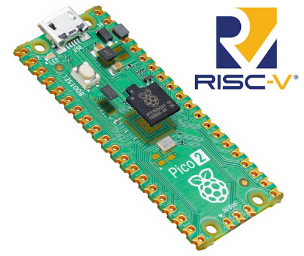](https://www.raspberrypi.com/news/risc-v-on-raspberry-pi-pico-2/)

The Hazard 3 RISC-V cores on the RP2350 were designed by Raspberry Pi’s own Luke Wren in his spare time, and they’re open source! Luke discusses his work and what went into the Hazard 3 design process - [Raspberry Pi News](https://www.raspberrypi.com/news/risc-v-on-raspberry-pi-pico-2/).

## C++ vs MicroPython

Kevin McAleer asks which language is best: Arduino C++ or MicroPython - [YouTube](https://www.youtube.com/watch?v=MS_BM-bJnds).

## 5 Reasons the Raspberry Pi is Still the Best SBC for Most People

[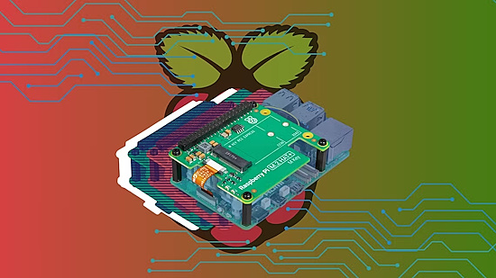](https://www.xda-developers.com/5-reasons-the-raspberry-pi-is-still-the-best-sbc-for-most-people/)

5 reasons the Raspberry Pi is still the best single board computer (SBC) for most people - [XDA](https://www.xda-developers.com/5-reasons-the-raspberry-pi-is-still-the-best-sbc-for-most-people/).

## Book Corner

[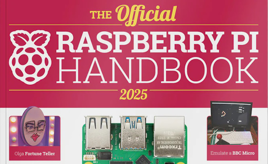](https://www.raspberrypi.com/news/out-now-the-official-raspberry-pi-handbook-2025-has-landed/)

OUT NOW: The Official Raspberry Pi Handbook 2025 has landed - [Raspberry Pi News](https://www.raspberrypi.com/news/out-now-the-official-raspberry-pi-handbook-2025-has-landed/).

A retro gaming and Raspberry Pi eBook Humble Bundle lets you pay what you want for the books listed last week and the one above, as low as $15 for 14 eBooks - [Humble Bundle](https://www.humblebundle.com/books/raspberry-pi-and-retro-gaming-by-raspberry-pi-press-books).

## This Week's Python Streams

Python on Hardware is all about building a cooperative ecosphere which allows contributions to be valued and to grow knowledge. Below are the streams within the last week focusing on the community.

**CircuitPython Deep Dive Stream**

[Last Friday](link), Scott streamed work on {subject}.

You can see the latest video and past videos on the Adafruit YouTube channel under the Deep Dive playlist - [YouTube](https://www.youtube.com/playlist?list=PLjF7R1fz_OOXBHlu9msoXq2jQN4JpCk8A).

**CircuitPython Parsec**

John Park’s CircuitPython Parsec this week is on {subject} - [Adafruit Blog](link) and [YouTube](link).

Catch all the episodes in the [YouTube playlist](https://www.youtube.com/playlist?list=PLjF7R1fz_OOWFqZfqW9jlvQSIUmwn9lWr).

**CircuitPython Weekly Meeting**

CircuitPython Weekly Meeting for September 30, 2024 ([notes](https://github.com/adafruit/adafruit-circuitpython-weekly-meeting/blob/main/2024/2024-09-23.md)) [on YouTube](https://youtu.be/z5P3SPDpoPk?si=WNsdIt-PtAAWbQM8).

## Project of the Week: Bringing Fiter Jet Joysticks to Life with Raspberry Pi Pico and CircuitPython

[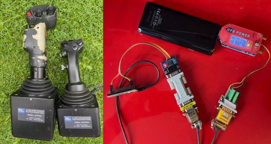](https://www.raspberrypi.com/news/raspberry-pi-pico-brings-junked-joysticks-back-to-life-the-magpi-146/)

The MagPi Issue 146 documents an amazing reverse engineering. A pair of military fighter jet joysticks were obtained by Andrew Gregory at EMF Camp. Finding they used RS-232, their protocol was reverse engineered and fed into a Raspberry Pi Pico running CircuitPuthon as a custom USB HID (Human Interface Device) to feed into a computer so the joystick can be used in flight simulators - [Raspberry Pi News](https://www.raspberrypi.com/news/raspberry-pi-pico-brings-junked-joysticks-back-to-life-the-magpi-146/).

## Popular Last Week

What was the most popular, most clicked link, in [last week's newsletter](https://www.adafruitdaily.com/2024/09/23/python-on-microcontrollers-newsletter-new-circuitpython-versions-books-galore-and-so-much-more-circuitpython-python-micropython-thepsf-raspberry_pi/)? [New book release: Design an RP2040 board with KiCad](https://www.raspberrypi.com/news/new-book-release-design-an-rp2040-board-with-kicad/).

Did you know you can read past issues of this newsletter in the Adafruit Daily Archive? [Check it out](https://www.adafruitdaily.com/category/circuitpython/).

## New Notes from Adafruit Playground

[Adafruit Playground](https://adafruit-playground.com/) is a new place for the community to post their projects and other making tips/tricks/techniques. Ad-free, it's an easy way to publish your work in a safe space for free.

[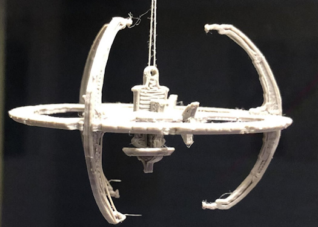](https://adafruit-playground.com/u/mrklingon/pages/launching-from-ds9)

Launching from DS9 - [Adafruit Playground](https://adafruit-playground.com/u/mrklingon/pages/launching-from-ds9).

text - [Adafruit Playground](url).

text - [Adafruit Playground](url).

## News From Around the Web

[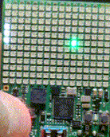](https://hackaday.io/project/197883-superxbit192)

SuperXBit192 is a Supercon Add-On that lets you play pong on a display made from 192 addressable LEDs. The code is written in Circuitpython - [Hackaday.io](https://hackaday.io/project/197883-superxbit192).

[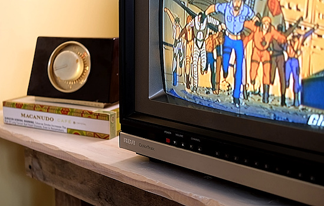](https://hackaday.io/project/198076-fieldstation42-ota-tv-simulator)

FieldStation42 is an on the air (OTA) television simulator with Raspberry Pi and Python - [hackaday.io](https://hackaday.io/project/198076-fieldstation42-ota-tv-simulator), [YouTube](https://www.youtube.com/watch?v=k_BkD85yIg0) and [GitHub](https://github.com/shane-mason/FieldStation42).

[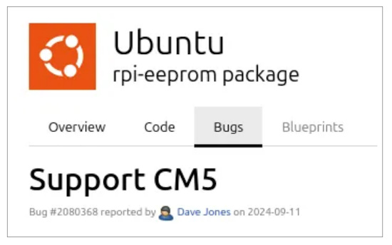](https://www.phoronix.com/news/Ubuntu-24.10-Compute-Module-5)

Ubuntu 24.10 is making preparations for the Raspberry Pi Compute Module 5 - [Phoronix](https://www.phoronix.com/news/Ubuntu-24.10-Compute-Module-5).

[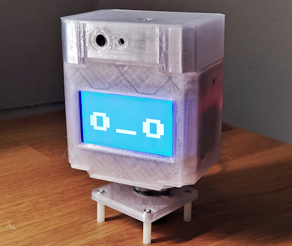](https://www.xda-developers.com/robotic-head-with-raspberry-pi-pico-that-displays-emotions/)

You can make a customizable robotic head with Raspberry Pi Pico - [XDA](https://www.xda-developers.com/robotic-head-with-raspberry-pi-pico-that-displays-emotions/) and [GitHub](https://github.com/an-dr/rEmotion).

The 28 talks fom [Espressif DevCon](https://devcon.espressif.com/) early this month are now online - [YouTube](https://www.youtube.com/playlist?list=PLOzvoM7_KnrdtDvNgN6b-GQ-kLppmNxab).

text - [site](url).

text - [site](url).

[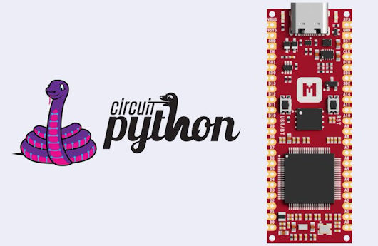](https://makerdiary.com/products/imxrt1011-nanokit)

CircuitPython has merged support for the Makerdiary iMX RT1011 Nano Kit, a high-performance microcontroller board with Arm Cortex-M7 @ 500 MHz - [Makerdiary](https://makerdiary.com/products/imxrt1011-nanokit).

text - [site](url).

text - [site](url).

text - [site](url).

text - [site](url).

text - [site](url).

text - [site](url).

text - [site](url).

Microsoft unveils Python Data Science Extension Pack for Visual Studio Code - [InfoWorld](https://www.infoworld.com/article/3535570/microsoft-unveils-python-data-science-extension-pack-for-visual-studio-code.html).

[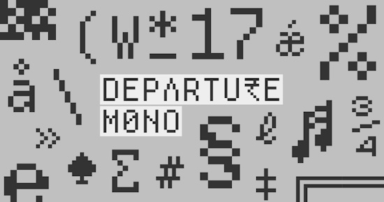](https://github.com/rektdeckard/departure-mono)

Departure Mono is a monospaced pixel font inspired by the constraints of early command-line and graphical user interfaces, the tiny pixel fonts of the late 90s/early 00s, and sci-fi concepts from film and television - [GitHub](https://github.com/rektdeckard/departure-mono) and [Site](https://departuremono.com/).

And don't forget [Custom Fonts for CircuitPython Displays](https://learn.adafruit.com/custom-fonts-for-pyportal-circuitpython-display?view=all).

text - [site](url).

## New

[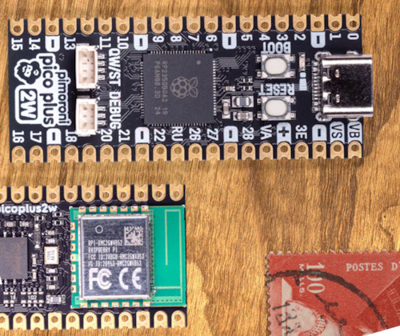](https://shop.pimoroni.com/products/pimoroni-pico-plus-2-w)

Pimoroni introduces their RP2350B-based Pico 2 W with a status LED and a Raspberry Pi RM2  added for WiFi. 16MB flash, 8MB PSRAM - [Pimoroni](https://shop.pimoroni.com/products/pimoroni-pico-plus-2-w).

[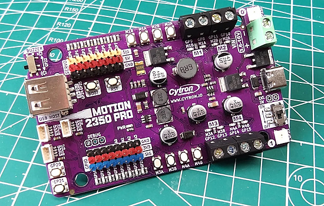](https://www.tomshardware.com/raspberry-pi/raspberry-pi-pico/cytron-motion-2350-pro-review)

Cytron Motion 2350 Pro review: the RP2350 robot platform - [Tom's Hardware](https://www.tomshardware.com/raspberry-pi/raspberry-pi-pico/cytron-motion-2350-pro-review).

> "Coming preloaded with CircuitPython is a recurring, and smart move by Cytron."

## New Boards Supported by CircuitPython

The number of supported microcontrollers and Single Board Computers (SBC) grows every week. This section outlines which boards have been included in CircuitPython or added to [CircuitPython.org](https://circuitpython.org/).

This week, there were (#/no) new boards added:

- [Board name](url)
- [Board name](url)
- [Board name](url)

*Note: For non-Adafruit boards, please use the support forums of the board manufacturer for assistance, as Adafruit does not have the hardware to assist in troubleshooting.*

Looking to add a new board to CircuitPython? It's highly encouraged! Adafruit has four guides to help you do so:

- [How to Add a New Board to CircuitPython](https://learn.adafruit.com/how-to-add-a-new-board-to-circuitpython/overview)
- [How to add a New Board to the circuitpython.org website](https://learn.adafruit.com/how-to-add-a-new-board-to-the-circuitpython-org-website)
- [Adding a Single Board Computer to PlatformDetect for Blinka](https://learn.adafruit.com/adding-a-single-board-computer-to-platformdetect-for-blinka)
- [Adding a Single Board Computer to Blinka](https://learn.adafruit.com/adding-a-single-board-computer-to-blinka)

## New Learn Guides

[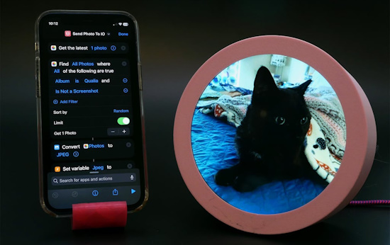](https://learn.adafruit.com/guides/latest)

The Adafruit Learning System has over 3,000 free guides for learning skills and building projects including using Python.

[Qualia S3 iOS Photo Display with itsaSNAP](https://learn.adafruit.com/qualia-s3-ios-photo-display-with-itsasnap) from [Liz Clark](https://learn.adafruit.com/u/BlitzCityDIY)

[LEGO-Compatible Servo Mounts](https://learn.adafruit.com/lego-servo-mounts) from [Ruiz Brothers](https://learn.adafruit.com/u/pixil3d)

[Adafruit Feather RP2350 with HSTX](https://learn.adafruit.com/adafruit-feather-rp2350) from [Liz Clark](https://learn.adafruit.com/u/BlitzCityDIY)

## CircuitPython Libraries

The CircuitPython library numbers are continually increasing, while existing ones continue to be updated. Here we provide library numbers and updates!

To get the latest Adafruit libraries, download the [Adafruit CircuitPython Library Bundle](https://circuitpython.org/libraries). To get the latest community contributed libraries, download the [CircuitPython Community Bundle](https://circuitpython.org/libraries).

If you'd like to contribute to the CircuitPython project on the Python side of things, the libraries are a great place to start. Check out the [CircuitPython.org Contributing page](https://circuitpython.org/contributing). If you're interested in reviewing, check out Open Pull Requests. If you'd like to contribute code or documentation, check out Open Issues. We have a guide on [contributing to CircuitPython with Git and GitHub](https://learn.adafruit.com/contribute-to-circuitpython-with-git-and-github), and you can find us in the #help-with-circuitpython and #circuitpython-dev channels on the [Adafruit Discord](https://adafru.it/discord).

You can check out this [list of all the Adafruit CircuitPython libraries and drivers available](https://github.com/adafruit/Adafruit_CircuitPython_Bundle/blob/master/circuitpython_library_list.md). 

The current number of CircuitPython libraries is **###**!

**New Libraries**

Here's this week's new CircuitPython libraries:

* [library](url)

**Updated Libraries**

Here's this week's updated CircuitPython libraries:

* [library](url)

**Library PyPI Weekly Download Stats**

## What’s the CircuitPython team up to this week?

What is the team up to this week? Let’s check in:

**Dan**

text.

**Melissa**

text.

**Tim**

text.

**Jeff**

text.

**Scott**

text.

**Liz**

text.

## Upcoming Events

Maker Faire Bay Area returns to Mare Island Naval Shipyard on October 18-20, 2024 - [Maker Faire](https://makerfaire.com/bay-area/).

The next MicroPython Meetup in Melbourne will be on October 23rd – [Meetup](https://www.meetup.com/micropython-meetup/events). You can see recordings of previous meetings on [YouTube](https://www.youtube.com/@MicroPythonOfficial). September's meeting notes are [here](https://melbournemicropythonmeetup.github.io/September-2024-Meetup/).

Hackaday Superconference is an epic gathering of hardware hackers, makers, and tech enthusiasts happening November 1-3 in Pasadena, California - [Hackaday](https://hackaday.com/2024/08/06/tickets-for-supercon-2024-go-on-sale-now/) and [Eventbrite](https://www.eventbrite.com/e/2024-hackaday-superconference-tickets-965387338517).

PyCon AU will be held from the 22nd to the 26th of November at the Melbourne Convention and Exhibition Centre (MCEC) in Narrm/Melbourne. Matt Trentini and Damien George will both be presennting on MicroPython - [PyCon AU](https://2024.pycon.org.au/).

PyLadies Conference (PyLadiesCon) is a transformative event designed to promote diversity, learning, and empowerment within the Python community. December 6-8, 2024 online - [PyLadies](https://conference.pyladies.com/).

**Send Your Events In**

If you know of virtual events or upcoming events, please let us know via email to cpnews(at)adafruit(dot)com.

## Latest Releases

CircuitPython's stable release is [#.#.#](https://github.com/adafruit/circuitpython/releases/latest) and its unstable release is [#.#.#-##.#](https://github.com/adafruit/circuitpython/releases). New to CircuitPython? Start with our [Welcome to CircuitPython Guide](https://learn.adafruit.com/welcome-to-circuitpython).

[2024####](https://github.com/adafruit/Adafruit_CircuitPython_Bundle/releases/latest) is the latest Adafruit CircuitPython library bundle.

[2024####](https://github.com/adafruit/CircuitPython_Community_Bundle/releases/latest) is the latest CircuitPython Community library bundle.

[v#.#.#](https://micropython.org/download) is the latest MicroPython release. Documentation for it is [here](http://docs.micropython.org/en/latest/pyboard/).

[#.#.#](https://www.python.org/downloads/) is the latest Python release. The latest pre-release version is [#.#.#](https://www.python.org/download/pre-releases/).

[#,### Stars](https://github.com/adafruit/circuitpython/stargazers) Like CircuitPython? [Star it on GitHub!](https://github.com/adafruit/circuitpython)

## Call for Help -- Translating CircuitPython is now easier than ever

[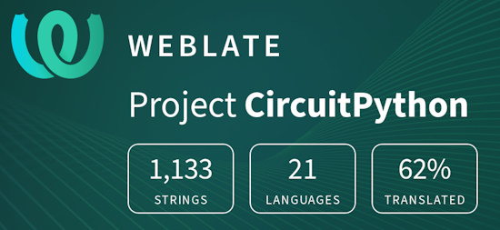](https://hosted.weblate.org/engage/circuitpython/)

One important feature of CircuitPython is translated control and error messages. With the help of fellow open source project [Weblate](https://weblate.org/), we're making it even easier to add or improve translations. 

Sign in with an existing account such as GitHub, Google or Facebook and start contributing through a simple web interface. No forks or pull requests needed! As always, if you run into trouble join us on [Discord](https://adafru.it/discord), we're here to help.

## NUMBER Thanks

The Adafruit Discord community, where we do all our CircuitPython development in the open, reached over NUMBER humans - thank you! Adafruit believes Discord offers a unique way for Python on hardware folks to connect. Join today at [https://adafru.it/discord](https://adafru.it/discord).

## ICYMI - In case you missed it

Python on hardware is the Adafruit Python video-newsletter-podcast! The news comes from the Python community, Discord, Adafruit communities and more and is broadcast on ASK an ENGINEER Wednesdays. The complete Python on Hardware weekly videocast [playlist is here](https://www.youtube.com/playlist?list=PLjF7R1fz_OOXRMjM7Sm0J2Xt6H81TdDev). The video podcast is on [iTunes](https://itunes.apple.com/us/podcast/python-on-hardware/id1451685192?mt=2), [YouTube](http://adafru.it/pohepisodes), [Instagram](https://www.instagram.com/adafruit/channel/)), and [XML](https://itunes.apple.com/us/podcast/python-on-hardware/id1451685192?mt=2).

[The weekly community chat on Adafruit Discord server CircuitPython channel - Audio / Podcast edition](https://itunes.apple.com/us/podcast/circuitpython-weekly-meeting/id1451685016) - Audio from the Discord chat space for CircuitPython, meetings are usually Mondays at 2pm ET, this is the audio version on [iTunes](https://itunes.apple.com/us/podcast/circuitpython-weekly-meeting/id1451685016), Pocket Casts, [Spotify](https://adafru.it/spotify), and [XML feed](https://adafruit-podcasts.s3.amazonaws.com/circuitpython_weekly_meeting/audio-podcast.xml).

## Contribute

The CircuitPython Weekly Newsletter is a CircuitPython community-run newsletter emailed every Monday. The complete [archives are here](https://www.adafruitdaily.com/category/circuitpython/). It highlights the latest CircuitPython related news from around the web including Python and MicroPython developments. To contribute, edit next week's draft [on GitHub](https://github.com/adafruit/circuitpython-weekly-newsletter/tree/gh-pages/_drafts) and [submit a pull request](https://help.github.com/articles/editing-files-in-your-repository/) with the changes. You may also tag your information on Twitter with #CircuitPython. 

Join the Adafruit [Discord](https://adafru.it/discord) or [post to the forum](https://forums.adafruit.com/viewforum.php?f=60) if you have questions.
