- [ ] Library and info updates
- [ ] change date
- [ ] update title
- [ ] Feature story
- [ ] Update  for images
- [ ] Update ICYDNCI
- [ ] All images 550w max only
- [ ] Link "View this email in your browser."

News Sources

- [Adafruit Playground](https://adafruit-playground.com/)
- Twitter: [CircuitPython](https://twitter.com/search?q=circuitpython&src=typed_query&f=live), [MicroPython](https://twitter.com/search?q=micropython&src=typed_query&f=live) and [Python](https://twitter.com/search?q=python&src=typed_query)
- [Raspberry Pi News](https://www.raspberrypi.com/news/)
- Mastodon [CircuitPython](https://octodon.social/tags/CircuitPython) and [MicroPython](https://octodon.social/tags/MicroPython)
- [hackster.io CircuitPython](https://www.hackster.io/search?q=circuitpython&i=projects&sort_by=most_recent) and [MicroPython](https://www.hackster.io/search?q=micropython&i=projects&sort_by=most_recent)
- YouTube: [CircuitPython](https://www.youtube.com/results?search_query=circuitpython&sp=CAI%253D), [MicroPython](https://www.youtube.com/results?search_query=micropython&sp=CAI%253D)
- Instructables: [CircuitPython](https://www.instructables.com/search/?q=circuitpython&projects=all&sort=Newest), [MicroPython](https://www.instructables.com/search/?q=micropython&projects=all&sort=Newest), [Raspberry Pi Python](https://www.instructables.com/search/?q=raspberry+pi+python&projects=all&sort=Newest)
- [python.org](https://www.python.org/)
- [Python Insider - dev team blog](https://pythoninsider.blogspot.com/)
- Individuals: [Jeff Geerling](https://www.jeffgeerling.com/blog)
- Tom's Hardware: [CircuitPython](https://www.tomshardware.com/search?searchTerm=circuitpython&articleType=all&sortBy=publishedDate) and [MicroPython](https://www.tomshardware.com/search?searchTerm=micropython&articleType=all&sortBy=publishedDate) and [Raspberry Pi](https://www.tomshardware.com/search?searchTerm=raspberry%20pi&articleType=all&sortBy=publishedDate)
- [hackaday.io newest projects MicroPython](https://hackaday.io/projects?tag=micropython&sort=date) and [CircuitPython](https://hackaday.io/projects?tag=circuitpython&sort=date)
- [Google News Python](https://news.google.com/topics/CAAqIQgKIhtDQkFTRGdvSUwyMHZNRFY2TVY4U0FtVnVLQUFQAQ?hl=en-US&gl=US&ceid=US%3Aen)
- [hackaday CircuitPython](https://hackaday.com/blog/?s=circuitpython) and [MicroPython](https://hackaday.com/blog/?s=micropython)
- hackaday.io - [CircuitPython](https://hackaday.io/search?term=circuitpython) and [MicroPython](https://hackaday.io/search?term=micropython)

View this email in your browser. **Warning: Flashing Imagery**

Welcome to the latest Python on Microcontrollers newsletter! *insert 2-3 sentences from editor (what's in overview, banter)* - *Anne Barela, Editor*

We're on [Discord](https://discord.gg/HYqvREz), [Twitter](https://twitter.com/search?q=circuitpython&src=typed_query&f=live), and for past newsletters - [view them all here](https://www.adafruitdaily.com/category/circuitpython/). If you're reading this on the web, [subscribe here](https://www.adafruitdaily.com/). Here's the news this week:

## Headline

text - [site](url).

## Feature

text - [site](url).

## Feature

text - [site](url).

## The EuroPython 2024 Videos and Playlist is Now Live

The EuroPython 2024 videos and playlist is now live on YouTube - [YouTube](https://www.youtube.com/playlist?list=PL8uoeex94UhE1CbtkDK4hevp2lBif57Nq).

## Raspberry Pi AI Camera on Sale Now at $70

[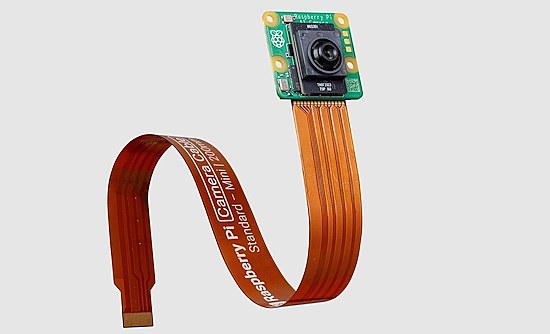](https://www.raspberrypi.com/news/raspberry-pi-ai-camera-on-sale-now/)

The Pi AI Kit is apowerful piece of hardware, capable of performing thirteen trillion operations per second. But it is only compatible with Raspberry Pi 5, and requires a separate camera module to capture visual data. Raspberry Pi announces a new addition to their camera product line: the Raspberry Pi AI Camera - [Raspberry Pi News](https://www.raspberrypi.com/news/raspberry-pi-ai-camera-on-sale-now/) and [The Pi Hut](https://thepihut.com/products/raspberry-pi-ai-camera).

## Best microSD Cards for Raspberry Pi 2024

[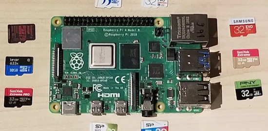](https://www.tomshardware.com/best-picks/raspberry-pi-microsd-cards)

MicroSD cards are a cost effective storage means for single board computers (SBC). At the time of writing, high performance 32GB micro SD cards can be picked up for $10! Tom's Hardware tests to see which microSD card should you buy for your Raspberry Pi - [Tom's Hardware](https://www.tomshardware.com/best-picks/raspberry-pi-microsd-cards).

## This Week's Python Streams

Python on Hardware is all about building a cooperative ecosphere which allows contributions to be valued and to grow knowledge. Below are the streams within the last week focusing on the community.

**CircuitPython Deep Dive Stream**

[Last Friday](link), Scott streamed work on {subject}.

You can see the latest video and past videos on the Adafruit YouTube channel under the Deep Dive playlist - [YouTube](https://www.youtube.com/playlist?list=PLjF7R1fz_OOXBHlu9msoXq2jQN4JpCk8A).

**CircuitPython Parsec**

John Park’s CircuitPython Parsec this week is on {subject} - [Adafruit Blog](link) and [YouTube](link).

Catch all the episodes in the [YouTube playlist](https://www.youtube.com/playlist?list=PLjF7R1fz_OOWFqZfqW9jlvQSIUmwn9lWr).

**CircuitPython Weekly Meeting**

CircuitPython Weekly Meeting for September 30th, 2024 ([notes](https://github.com/adafruit/adafruit-circuitpython-weekly-meeting/blob/main/2024/2024-09-30.md)) [on YouTube](https://youtu.be/rdS9BeQ0TUI).

## Project of the Week: A Control Box for Docking a SpaceX Capsule to the ISS

[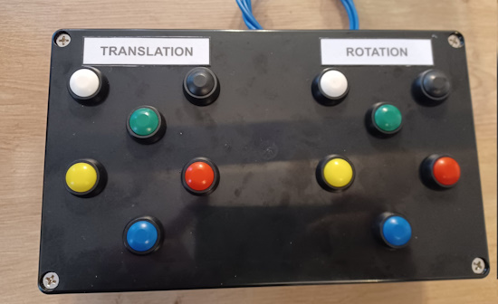](https://x.com/JohnChinner/status/1840809755012710573)

[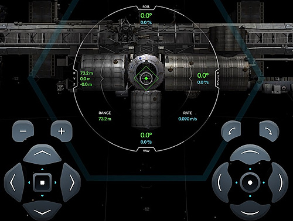](https://x.com/JohnChinner/status/1840827333466321352)

A Raspberry Pi Pico, a bunch of wiring, and CircuitPython was used by John Chinner to make USB control box to fly the [SpaceX Dragon ISS docking simulator](https://iss-sim.spacex.com/) by pushing buttons to fire the thrusters. "I coded the Pico to act like a keyboard and send the appropriate keystroke when the button is pushed" - [X](https://x.com/JohnChinner/status/1840809755012710573).

## Popular Last Week

What was the most popular, most clicked link, in [last week's newsletter](https://www.adafruitdaily.com/2024/09/30/python-on-microcontrollers-newsletter-adafruit-grand-opening-profile-micropython-memory-and-more-circuitpython-python-micropython-thepsf-raspberry_pi-classic-editor/)? [Arduino C++ vs MicroPython Smackdown](https://www.youtube.com/watch?v=MS_BM-bJnds).

Did you know you can read past issues of this newsletter in the Adafruit Daily Archive? [Check it out](https://www.adafruitdaily.com/category/circuitpython/).

## New Notes from Adafruit Playground

[Adafruit Playground](https://adafruit-playground.com/) is a new place for the community to post their projects and other making tips/tricks/techniques. Ad-free, it's an easy way to publish your work in a safe space for free.

[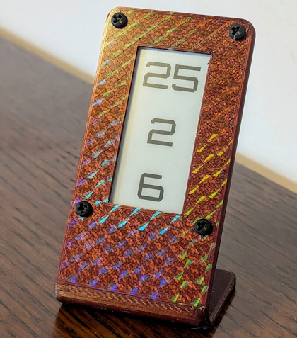](https://adafruit-playground.com/u/jepler/pages/e-ink-countdown-in-circuitpython-with-custom-stand)

E-Ink Countdown in CircuitPython with Custom Stand - [Adafruit Playground](https://adafruit-playground.com/u/jepler/pages/e-ink-countdown-in-circuitpython-with-custom-stand).

Creating Reduced Sized Bitmap Fonts From .ttf Files - [Adafruit Playground](https://adafruit-playground.com/u/Timeline/pages/creating-reduced-sized-bitmap-fonts-from-ttf-file).

text - [Adafruit Playground](url).

## News From Around the Web

[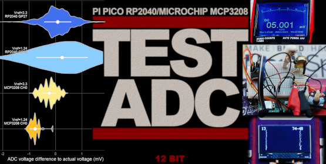](https://www.instructables.com/Measuring-Small-Voltages-With-Pi-Pico-ADC-and-Comp/)

A comparison of the 12bit Microchip MCP3208 ADC with the RP2040 ADC on a Pi Pico W (on a Cytron EDU PICO) for 0mV-50mV including techniques to improve the accuracy of the RP2040 ADC, sample recording software written in CircuitPython - [Instructables](https://www.instructables.com/Measuring-Small-Voltages-With-Pi-Pico-ADC-and-Comp/).

Install CircuitPython on a LILYGO T-Display S3 Pro board - [X](https://x.com/AoyamaProd/status/1840724285570347474).

[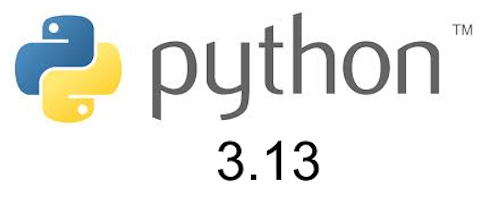](https://drew.silcock.dev/blog/everything-you-need-to-know-about-python-3-13/)

Everything you need to know about Python 3.13 – JIT and GIL went up the hill - [Drew's dev blog](https://drew.silcock.dev/blog/everything-you-need-to-know-about-python-3-13/).

[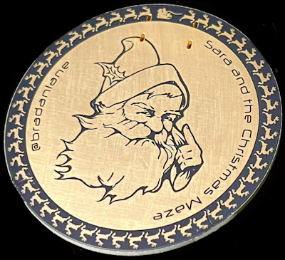](https://x.com/bradanlane/status/1841129471409033683)

Bradán Lane's Christmas Coin includes a text adventure game. There is also enough hardware to run CircuitPython - enabling the coin to be a mini macro pad - [X](https://x.com/bradanlane/status/1841129471409033683).

[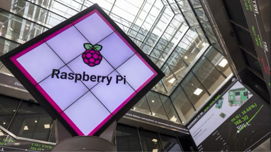](https://blog.adafruit.com/2024/09/27/raspberry-pi-boosted-by-higher-than-expected-profits-piday-raspberrypi/)

Raspberry Pi boosted by higher than expected profits - [Adafruit Blog](https://blog.adafruit.com/2024/09/27/raspberry-pi-boosted-by-higher-than-expected-profits-piday-raspberrypi/).

text - [site](url).

The Pi Cast (10/1) Pimoroni Pico Plus 2 W with Paul Beech - [YouTube](https://www.youtube.com/watch?v=hSDlLuSl0LA) via [X](https://x.com/biglesp/status/1840693452536713417).

text - [site](url).

text - [site](url).

text - [site](url).

text - [site](url).

text - [site](url).

text - [site](url).

text - [site](url).

text - [site](url).

[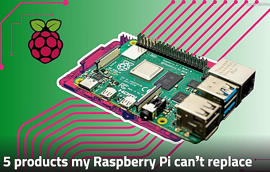](https://www.xda-developers.com/5-products-my-raspberry-pi-cant-replace/)

5 products my Raspberry Pi can’t replace - [XDA](https://www.xda-developers.com/5-products-my-raspberry-pi-cant-replace/).

[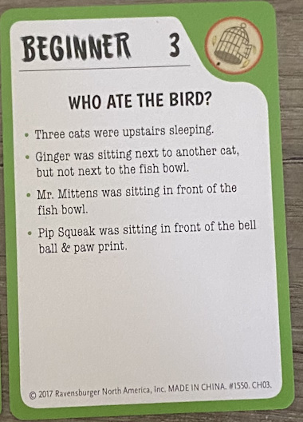](https://robertheaton.com/cat-crimes/)

Generating infinite, age-appropriate Cat Crimes puzzles with Python - [Robert Heaton](https://robertheaton.com/cat-crimes/) and [GitHub](https://github.com/robert/cat-crimes-puzzle-generator).

text - [site](url).

## Coming Soon / New

text - [site](url).

text - [site](url).

## New Boards Supported by CircuitPython

The number of supported microcontrollers and Single Board Computers (SBC) grows every week. This section outlines which boards have been included in CircuitPython or added to [CircuitPython.org](https://circuitpython.org/).

This week, there were (#/no) new boards added:

- [Board name](url)
- [Board name](url)
- [Board name](url)

*Note: For non-Adafruit boards, please use the support forums of the board manufacturer for assistance, as Adafruit does not have the hardware to assist in troubleshooting.*

Looking to add a new board to CircuitPython? It's highly encouraged! Adafruit has four guides to help you do so:

- [How to Add a New Board to CircuitPython](https://learn.adafruit.com/how-to-add-a-new-board-to-circuitpython/overview)
- [How to add a New Board to the circuitpython.org website](https://learn.adafruit.com/how-to-add-a-new-board-to-the-circuitpython-org-website)
- [Adding a Single Board Computer to PlatformDetect for Blinka](https://learn.adafruit.com/adding-a-single-board-computer-to-platformdetect-for-blinka)
- [Adding a Single Board Computer to Blinka](https://learn.adafruit.com/adding-a-single-board-computer-to-blinka)

## New Learn Guides

The Adafruit Learning System has over 3,000 free guides for learning skills and building projects including using Python.

[PropMaker Jack O'Lantern](https://learn.adafruit.com/propmaker-jack-o-lantern) from [Ruiz Brothers](https://learn.adafruit.com/u/pixil3d)

[HID Reporter](https://learn.adafruit.com/hid-reporter) from [John Park](https://learn.adafruit.com/u/johnpark)

[itsSNAP Apple Health Status Board](https://learn.adafruit.com/itssnap-apple-fitness-status-board) from [Trevor Beaton](https://learn.adafruit.com/u/Seekwill)

## CircuitPython Libraries

The CircuitPython library numbers are continually increasing, while existing ones continue to be updated. Here we provide library numbers and updates!

To get the latest Adafruit libraries, download the [Adafruit CircuitPython Library Bundle](https://circuitpython.org/libraries). To get the latest community contributed libraries, download the [CircuitPython Community Bundle](https://circuitpython.org/libraries).

If you'd like to contribute to the CircuitPython project on the Python side of things, the libraries are a great place to start. Check out the [CircuitPython.org Contributing page](https://circuitpython.org/contributing). If you're interested in reviewing, check out Open Pull Requests. If you'd like to contribute code or documentation, check out Open Issues. We have a guide on [contributing to CircuitPython with Git and GitHub](https://learn.adafruit.com/contribute-to-circuitpython-with-git-and-github), and you can find us in the #help-with-circuitpython and #circuitpython-dev channels on the [Adafruit Discord](https://adafru.it/discord).

You can check out this [list of all the Adafruit CircuitPython libraries and drivers available](https://github.com/adafruit/Adafruit_CircuitPython_Bundle/blob/master/circuitpython_library_list.md). 

The current number of CircuitPython libraries is **###**!

**New Libraries**

Here's this week's new CircuitPython libraries:

* [library](url)

**Updated Libraries**

Here's this week's updated CircuitPython libraries:

* [library](url)

**Library PyPI Weekly Download Stats**

## What’s the CircuitPython team up to this week?

What is the team up to this week? Let’s check in:

**Dan**

Last week, I finished updating CircuitPython to use the new Espressif ESP-IDF I2C driver, and solved a problem with the `esp32-camera` library which had also been updated to use the new driver.

This week I'm continuing to work on the remaining issues for CircuitPython 9.2.0 final.

**Tim**

This week I worked on some changes to the way that adabot's actions that built the CircuitPython bundles work in order to make it not commit and push the results if the bundle build was not successful. In doing so it also came to light that a recent change to the way GitHub returns headers in some of their API responses caused a different issue for parts of adabot. I dug into the differing headers and GitHub documentation to understand the issue.

**Jeff**

After finishing up all my testing of the RP2350 (no terrible bugs found!) I also made a little countdown clock project, which I [posted on the Adafruit Playground](https://adafruit-playground.com/u/jepler/pages/e-ink-countdown-in-circuitpython-with-custom-stand).

**Scott**

This last week I've continued through the Matter commissioning steps. I'm *very* close to completing the process. I assume the following step will be implementing the device type. My wife and I are expecting our second child in the next few weeks so we'll see how far I can get before then.

**Liz**

This week I worked on another [guide for using itsaSNAP](https://learn.adafruit.com/use-apple-homekit-devices-with-itsasnap). This time I used Matter devices in Apple HomeKit to use Adafruit IO to read and write data to them. I also wrote a CircuitPython example using a Feather ESP32-S3 Reverse TFT to display the data and control a light strip with the onboard buttons. I'm really loving using itsaSNAP and highly recommend folks experiment it.

## Upcoming Events

[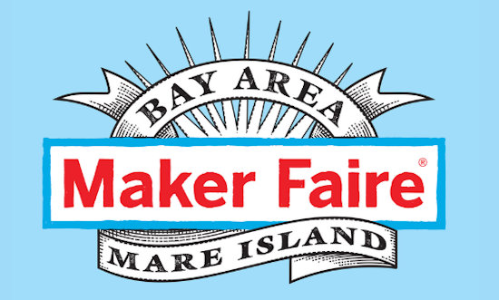](https://makerfaire.com/bay-area/)

Maker Faire Bay Area returns to Mare Island Naval Shipyard on October 18-20, 2024 - [Maker Faire](https://makerfaire.com/bay-area/).

The next MicroPython Meetup in Melbourne will be on October 23rd – [Meetup](https://www.meetup.com/micropython-meetup/events). You can see recordings of previous meetings on [YouTube](https://www.youtube.com/@MicroPythonOfficial). September's meeting notes are [here](https://melbournemicropythonmeetup.github.io/September-2024-Meetup/).

Hackaday Superconference is an epic gathering of hardware hackers, makers, and tech enthusiasts happening November 1-3 in Pasadena, California - [Hackaday](https://hackaday.com/2024/08/06/tickets-for-supercon-2024-go-on-sale-now/) and [Eventbrite](https://www.eventbrite.com/e/2024-hackaday-superconference-tickets-965387338517).

PyCon AU will be held from the 22nd to the 26th of November at the Melbourne Convention and Exhibition Centre (MCEC) in Narrm/Melbourne. Matt Trentini and Damien George will both be presennting on MicroPython - [PyCon AU](https://2024.pycon.org.au/).

PyLadies Conference (PyLadiesCon) is a transformative event designed to promote diversity, learning, and empowerment within the Python community. December 6-8, 2024 online - [PyLadies](https://conference.pyladies.com/).

**Send Your Events In**

If you know of virtual events or upcoming events, please let us know via email to cpnews(at)adafruit(dot)com.

## Latest Releases

CircuitPython's stable release is [#.#.#](https://github.com/adafruit/circuitpython/releases/latest) and its unstable release is [#.#.#-##.#](https://github.com/adafruit/circuitpython/releases). New to CircuitPython? Start with our [Welcome to CircuitPython Guide](https://learn.adafruit.com/welcome-to-circuitpython).

[2024####](https://github.com/adafruit/Adafruit_CircuitPython_Bundle/releases/latest) is the latest Adafruit CircuitPython library bundle.

[2024####](https://github.com/adafruit/CircuitPython_Community_Bundle/releases/latest) is the latest CircuitPython Community library bundle.

[v#.#.#](https://micropython.org/download) is the latest MicroPython release. Documentation for it is [here](http://docs.micropython.org/en/latest/pyboard/).

[#.#.#](https://www.python.org/downloads/) is the latest Python release. The latest pre-release version is [#.#.#](https://www.python.org/download/pre-releases/).

[#,### Stars](https://github.com/adafruit/circuitpython/stargazers) Like CircuitPython? [Star it on GitHub!](https://github.com/adafruit/circuitpython)

## Call for Help -- Translating CircuitPython is now easier than ever

[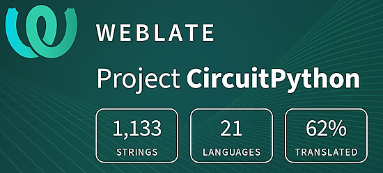](https://hosted.weblate.org/engage/circuitpython/)

One important feature of CircuitPython is translated control and error messages. With the help of fellow open source project [Weblate](https://weblate.org/), we're making it even easier to add or improve translations. 

Sign in with an existing account such as GitHub, Google or Facebook and start contributing through a simple web interface. No forks or pull requests needed! As always, if you run into trouble join us on [Discord](https://adafru.it/discord), we're here to help.

## NUMBER Thanks

The Adafruit Discord community, where we do all our CircuitPython development in the open, reached over NUMBER humans - thank you! Adafruit believes Discord offers a unique way for Python on hardware folks to connect. Join today at [https://adafru.it/discord](https://adafru.it/discord).

## ICYMI - In case you missed it

Python on hardware is the Adafruit Python video-newsletter-podcast! The news comes from the Python community, Discord, Adafruit communities and more and is broadcast on ASK an ENGINEER Wednesdays. The complete Python on Hardware weekly videocast [playlist is here](https://www.youtube.com/playlist?list=PLjF7R1fz_OOXRMjM7Sm0J2Xt6H81TdDev). The video podcast is on [iTunes](https://itunes.apple.com/us/podcast/python-on-hardware/id1451685192?mt=2), [YouTube](http://adafru.it/pohepisodes), [Instagram](https://www.instagram.com/adafruit/channel/)), and [XML](https://itunes.apple.com/us/podcast/python-on-hardware/id1451685192?mt=2).

[The weekly community chat on Adafruit Discord server CircuitPython channel - Audio / Podcast edition](https://itunes.apple.com/us/podcast/circuitpython-weekly-meeting/id1451685016) - Audio from the Discord chat space for CircuitPython, meetings are usually Mondays at 2pm ET, this is the audio version on [iTunes](https://itunes.apple.com/us/podcast/circuitpython-weekly-meeting/id1451685016), Pocket Casts, [Spotify](https://adafru.it/spotify), and [XML feed](https://adafruit-podcasts.s3.amazonaws.com/circuitpython_weekly_meeting/audio-podcast.xml).

## Contribute

The CircuitPython Weekly Newsletter is a CircuitPython community-run newsletter emailed every Monday. The complete [archives are here](https://www.adafruitdaily.com/category/circuitpython/). It highlights the latest CircuitPython related news from around the web including Python and MicroPython developments. To contribute, edit next week's draft [on GitHub](https://github.com/adafruit/circuitpython-weekly-newsletter/tree/gh-pages/_drafts) and [submit a pull request](https://help.github.com/articles/editing-files-in-your-repository/) with the changes. You may also tag your information on Twitter with #CircuitPython. 

Join the Adafruit [Discord](https://adafru.it/discord) or [post to the forum](https://forums.adafruit.com/viewforum.php?f=60) if you have questions.
