- [ ] Library and info updates
- [ ] change date
- [ ] update title
- [ ] Feature story
- [ ] Update  for images
- [ ] Update ICYDNCI
- [ ] All images 550w max only
- [ ] Link "View this email in your browser."

News Sources

- [Adafruit Playground](https://adafruit-playground.com/)
- Twitter: [CircuitPython](https://twitter.com/search?q=circuitpython&src=typed_query&f=live), [MicroPython](https://twitter.com/search?q=micropython&src=typed_query&f=live) and [Python](https://twitter.com/search?q=python&src=typed_query)
- [Raspberry Pi News](https://www.raspberrypi.com/news/)
- Mastodon [CircuitPython](https://octodon.social/tags/CircuitPython) and [MicroPython](https://octodon.social/tags/MicroPython)
- [hackster.io CircuitPython](https://www.hackster.io/search?q=circuitpython&i=projects&sort_by=most_recent) and [MicroPython](https://www.hackster.io/search?q=micropython&i=projects&sort_by=most_recent)
- YouTube: [CircuitPython](https://www.youtube.com/results?search_query=circuitpython&sp=CAI%253D), [MicroPython](https://www.youtube.com/results?search_query=micropython&sp=CAI%253D)
- Instructables: [CircuitPython](https://www.instructables.com/search/?q=circuitpython&projects=all&sort=Newest), [MicroPython](https://www.instructables.com/search/?q=micropython&projects=all&sort=Newest), [Raspberry Pi Python](https://www.instructables.com/search/?q=raspberry+pi+python&projects=all&sort=Newest)
- [python.org](https://www.python.org/)
- [Python Insider - dev team blog](https://pythoninsider.blogspot.com/)
- Individuals: [Jeff Geerling](https://www.jeffgeerling.com/blog)
- Tom's Hardware: [CircuitPython](https://www.tomshardware.com/search?searchTerm=circuitpython&articleType=all&sortBy=publishedDate) and [MicroPython](https://www.tomshardware.com/search?searchTerm=micropython&articleType=all&sortBy=publishedDate) and [Raspberry Pi](https://www.tomshardware.com/search?searchTerm=raspberry%20pi&articleType=all&sortBy=publishedDate)
- [hackaday.io newest projects MicroPython](https://hackaday.io/projects?tag=micropython&sort=date) and [CircuitPython](https://hackaday.io/projects?tag=circuitpython&sort=date)
- [Google News Python](https://news.google.com/topics/CAAqIQgKIhtDQkFTRGdvSUwyMHZNRFY2TVY4U0FtVnVLQUFQAQ?hl=en-US&gl=US&ceid=US%3Aen)
- [hackaday CircuitPython](https://hackaday.com/blog/?s=circuitpython) and [MicroPython](https://hackaday.com/blog/?s=micropython)
- hackaday.io - [CircuitPython](https://hackaday.io/search?term=circuitpython) and [MicroPython](https://hackaday.io/search?term=micropython)

View this email in your browser. **Warning: Flashing Imagery**

Welcome to the latest Python on Microcontrollers newsletter! *insert 2-3 sentences from editor (what's in overview, banter)* - *Anne Barela, Editor*

We're on [Discord](https://discord.gg/HYqvREz), [Twitter](https://twitter.com/search?q=circuitpython&src=typed_query&f=live), and for past newsletters - [view them all here](https://www.adafruitdaily.com/category/circuitpython/). If you're reading this on the web, [subscribe here](https://www.adafruitdaily.com/). Here's the news this week:

## Python 3.13 (Final) Released 

[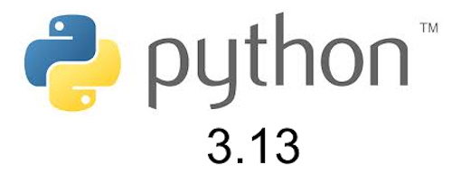](https://pythoninsider.blogspot.com/2024/10/python-3130-final-released.html)

Python 3.13.0 is the newest major release of the Python programming language, and it contains many new features and optimizations compared to Python 3.12. (Compared to the last release candidate, 3.13.0rc3, 3.13.0 contains two small bug fixes and some documentation and testing changes) - [Python Insider Blog](https://pythoninsider.blogspot.com/2024/10/python-3130-final-released.html).

## Feature

text - [site](url).

## Feature

text - [site](url).

## Awesome MicroPython Lists Libraries

[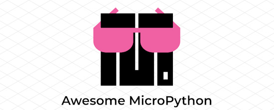](https://awesome-micropython.com/)

Awesome MicroPython is a curated list of awesome MicroPython libraries, frameworks, software and resources - [Awesome MicroPython](https://awesome-micropython.com/).

## Feature

text - [site](url).

## Arduino Alvik Dances Cumbia with MicroPython

With a little hack, Roni Bandini programmed an Arduino Alvik to dance cumbia! He connected a sound sensor to free GPIO pins on the Nano ESP32 board, so Alvik moves to the beat - [Medium](https://bandini.medium.com/micr%C3%B3fono-para-el-arduino-alvik-68122f10d67e) via [X](https://x.com/RoniBandini/status/1833134706151342153).

## This Week's Python Streams

Python on Hardware is all about building a cooperative ecosphere which allows contributions to be valued and to grow knowledge. Below are the streams within the last week focusing on the community.

**CircuitPython Deep Dive Stream**

[Last Friday](link), Scott streamed work on {subject}.

You can see the latest video and past videos on the Adafruit YouTube channel under the Deep Dive playlist - [YouTube](https://www.youtube.com/playlist?list=PLjF7R1fz_OOXBHlu9msoXq2jQN4JpCk8A).

**CircuitPython Parsec**

John Park’s CircuitPython Parsec this week is on {subject} - [Adafruit Blog](link) and [YouTube](link).

Catch all the episodes in the [YouTube playlist](https://www.youtube.com/playlist?list=PLjF7R1fz_OOWFqZfqW9jlvQSIUmwn9lWr).

**CircuitPython Weekly Meeting**

CircuitPython Weekly Meeting for {date} ([notes](file)) [on YouTube](link).

## Project of the Week: The LED Orb to Celebrate Ada Lovelace Day

The world’s first computer programmer, Ada Lovelace (1815-1852) is an inspiration to women in STEM. In her honor, MAKE builds Debra Ansell’s spectacular LED Orb, programmed in CircuitPython from Adafruit Industries and Ladyada herself, Limor Fried - [Make](https://makezine.com/projects/orb-sessed-led-sphere/) via [X](https://x.com/make/status/1843688938411598055).

## Popular Last Week

[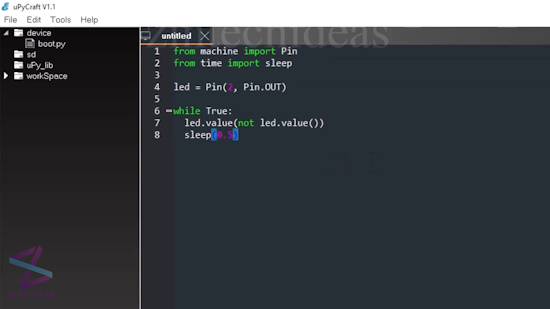](https://github.com/jczic/ESP32-MPY-Jama)

What was the most popular, most clicked link, in [last week's newsletter](https://www.adafruitdaily.com/2024/10/07/python-on-microcontrollers-newsletter-new-python-releases-an-esp32micropython-ide-and-much-more-circuitpython-python-micropython-thepsf-raspberry_pi/)? [Review: ESP32 MPY-Jama, an Excellent IDE for Using MicroPython on ESP32](https://github.com/jczic/ESP32-MPY-Jama).

Did you know you can read past issues of this newsletter in the Adafruit Daily Archive? [Check it out](https://www.adafruitdaily.com/category/circuitpython/).

## New Notes from Adafruit Playground

[Adafruit Playground](https://adafruit-playground.com/) is a new place for the community to post their projects and other making tips/tricks/techniques. Ad-free, it's an easy way to publish your work in a safe space for free.

[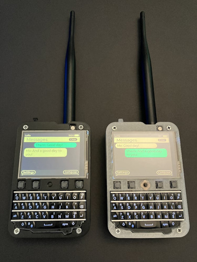](https://adafruit-playground.com/u/squid_jpg/pages/keyboard-featherwing-messenger-powered-by-lvgl)

Keyboard Featherwing Messenger powered by LVGL - [Adafruit Playground](https://adafruit-playground.com/u/squid_jpg/pages/keyboard-featherwing-messenger-powered-by-lvgl).

Installing Python 3.13 using uv - [Adafruit Playground](https://adafruit-playground.com/u/jepler/pages/installing-python-3-13-using-uv).

[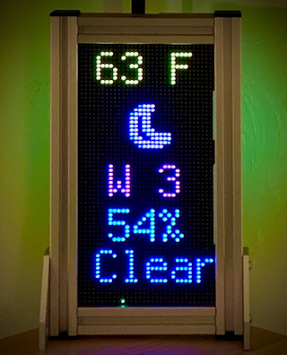](https://adafruit-playground.com/u/CGrover/pages/display-aio-local-weather-conditions-matrixweather-system)

Display AIO+ Local Weather Conditions: MatrixWeather System - [Adafruit Playground](https://adafruit-playground.com/u/CGrover/pages/display-aio-local-weather-conditions-matrixweather-system).

## News From Around the Web

[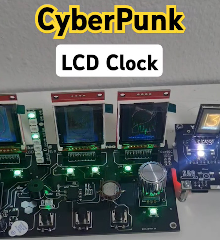](https://www.youtube.com/shorts/ASkDrqdVTHo)

CyberPunk LCD Clock with Raspberry Pi Pico and CircuitPython - [YouTube](https://www.youtube.com/shorts/ASkDrqdVTHo) via [X](https://x.com/Yakroo5077/status/1842876756312870978).

[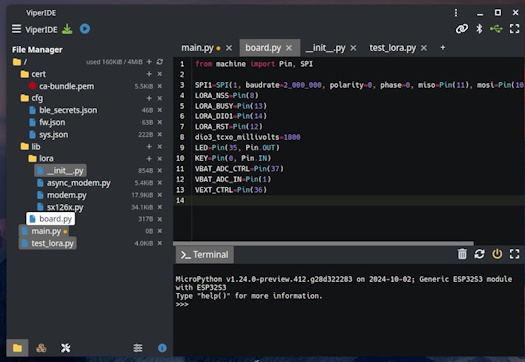](https://x.com/vshymanskyy/status/1843219576441753939?t=cbQRVbHApnGiTbkHkaAugw&s=03)

ViperIDE, thanks to community contributions, now can open and edit multiple files - [X](https://x.com/vshymanskyy/status/1843219576441753939?t=cbQRVbHApnGiTbkHkaAugw&s=03).

text - [site](url).

[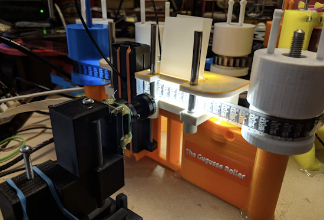](https://www.raspberrypi.com/news/gugusse-roller-transfers-analogue-film-to-digital-with-raspberry-pi/)

Gugusse Roller transfers analog film to digital with Raspberry Pi and Python - [Raspberry Pi News](https://www.raspberrypi.com/news/gugusse-roller-transfers-analogue-film-to-digital-with-raspberry-pi/).

text - [site](url).

[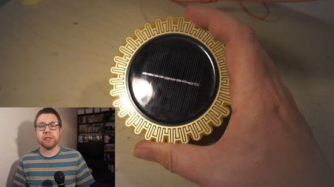](https://www.youtube.com/watch?v=hfJn5d-R0nY)

Add rain detection to your smart home with Python - [YouTube](https://www.youtube.com/watch?v=hfJn5d-R0nY) and [GitHub](https://github.com/bens-electrical-escapades/RainSensor).

[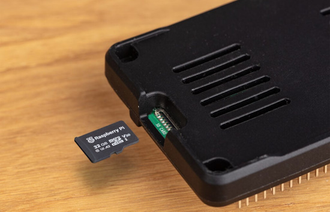](https://www.raspberrypi.com/news/sd-cards-and-bumper/)

Raspberry Pi SD cards and the Raspberry Pi bumper introduced - [Raspberry Pi News](https://www.raspberrypi.com/news/sd-cards-and-bumper/).

[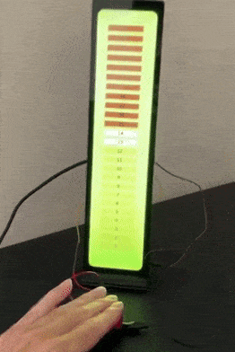](https://x.com/sozoraemon/status/1843583029530554715?t=kwCpBRtbMjOy0gcu4s82QA&s=03)

Using Raspberry Pi and Python to create a score lamp for the costume contest - [X](https://x.com/sozoraemon/status/1843583029530554715?t=kwCpBRtbMjOy0gcu4s82QA&s=03) (Japanese).

text - [site](url).

text - [site](url).

text - [site](url).

text - [site](url).

text - [site](url).

[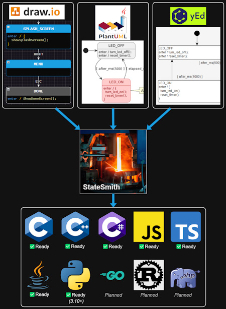](https://github.com/StateSmith/StateSmith)

StateSmith is a cross platform, free/open source tool for generating state machines in multiple programming languages including Python - [GitHub](https://github.com/StateSmith/StateSmith).

text - [site](url).

text - [site](url).

text - [site](url).

text - [site](url).

## Coming Soon / New

text - [site](url).

text - [site](url).

## New Boards Supported by CircuitPython

The number of supported microcontrollers and Single Board Computers (SBC) grows every week. This section outlines which boards have been included in CircuitPython or added to [CircuitPython.org](https://circuitpython.org/).

This week there were no new boards added.

*Note: For non-Adafruit boards, please use the support forums of the board manufacturer for assistance, as Adafruit does not have the hardware to assist in troubleshooting.*

Looking to add a new board to CircuitPython? It's highly encouraged! Adafruit has four guides to help you do so:

- [How to Add a New Board to CircuitPython](https://learn.adafruit.com/how-to-add-a-new-board-to-circuitpython/overview)
- [How to add a New Board to the circuitpython.org website](https://learn.adafruit.com/how-to-add-a-new-board-to-the-circuitpython-org-website)
- [Adding a Single Board Computer to PlatformDetect for Blinka](https://learn.adafruit.com/adding-a-single-board-computer-to-platformdetect-for-blinka)
- [Adding a Single Board Computer to Blinka](https://learn.adafruit.com/adding-a-single-board-computer-to-blinka)

## New Learn Guides

The Adafruit Learning System has over 3,000 free guides for learning skills and building projects including using Python.

[Zelda Echoes Of Wisdom Tri Rod](https://learn.adafruit.com/zelda-tri-rod) from [Ruiz Brothers](https://learn.adafruit.com/u/pixil3d)

[title](url) from [name](url)

[title](url) from [name](url)

## CircuitPython Libraries

The CircuitPython library numbers are continually increasing, while existing ones continue to be updated. Here we provide library numbers and updates!

To get the latest Adafruit libraries, download the [Adafruit CircuitPython Library Bundle](https://circuitpython.org/libraries). To get the latest community contributed libraries, download the [CircuitPython Community Bundle](https://circuitpython.org/libraries).

If you'd like to contribute to the CircuitPython project on the Python side of things, the libraries are a great place to start. Check out the [CircuitPython.org Contributing page](https://circuitpython.org/contributing). If you're interested in reviewing, check out Open Pull Requests. If you'd like to contribute code or documentation, check out Open Issues. We have a guide on [contributing to CircuitPython with Git and GitHub](https://learn.adafruit.com/contribute-to-circuitpython-with-git-and-github), and you can find us in the #help-with-circuitpython and #circuitpython-dev channels on the [Adafruit Discord](https://adafru.it/discord).

You can check out this [list of all the Adafruit CircuitPython libraries and drivers available](https://github.com/adafruit/Adafruit_CircuitPython_Bundle/blob/master/circuitpython_library_list.md). 

The current number of CircuitPython libraries is **498**!

**New Libraries**

**Updated Libraries**

Here's this week's updated CircuitPython libraries:

  * [adafruit/Adafruit_CircuitPython_Logging](https://github.com/adafruit/Adafruit_CircuitPython_Logging)
  * [adafruit/Adafruit_CircuitPython_AdafruitIO](https://github.com/adafruit/Adafruit_CircuitPython_AdafruitIO)
  * [adafruit/Adafruit_CircuitPython_VEML7700](https://github.com/adafruit/Adafruit_CircuitPython_VEML7700)
  * [adafruit/Adafruit_CircuitPython_WSGI](https://github.com/adafruit/Adafruit_CircuitPython_WSGI)
  * [adafruit/Adafruit_CircuitPython_GPS](https://github.com/adafruit/Adafruit_CircuitPython_GPS)
  * [buildwithpiper/PiperBlocklyLibrary](https://github.com/buildwithpiper/PiperBlocklyLibrary)

**Library PyPI Weekly Download Stats**

**Total Library Stats**
  * 1,224,321 PyPI downloads over 334 libraries

**Top 10 Libraries by PyPI Downloads**
  * Adafruit CircuitPython Requests (adafruit-circuitpython-requests): 33,699
  * Adafruit CircuitPython BusDevice (adafruit-circuitpython-busdevice): 27,664
  * Adafruit CircuitPython ConnectionManager (adafruit-circuitpython-connectionmanager): 21,408
  * Adafruit CircuitPython MiniMQTT (adafruit-circuitpython-minimqtt): 13,500
  * Adafruit CircuitPython Wiznet5k (adafruit-circuitpython-wiznet5k): 12,615
  * Adafruit CircuitPython ESP32SPI (adafruit-circuitpython-esp32spi): 12,198
  * Adafruit CircuitPython Display Text (adafruit-circuitpython-display-text): 11,807
  * Adafruit CircuitPython HTTPServer (adafruit-circuitpython-httpserver): 8,731
  * Adafruit CircuitPython Register (adafruit-circuitpython-register): 8,557
  * Adafruit CircuitPython PortalBase (adafruit-circuitpython-portalbase): 8,365

## What’s the CircuitPython team up to this week?

What is the team up to this week? Let’s check in:

**Dan**

text.

**Tim**

text.

**Jeff**

A guide for "CircuitPython Polyphonic Audio FX" is [now available on the Adafruit Learn System](https://learn.adafruit.com/circuitpython-audio-fx/overview). Inspired by the original Adafruit Audio FX board, this version uses MP3 sound files & supports playback of more than one file simultaneously.

I also posted a Playground page detailing [how to easily install the new Python 3.13 on a Debian Linux system](https://adafruit-playground.com/u/jepler/pages/installing-python-3-13-using-uv) using a tool called "uv".

**Scott**

text.

**Liz**

This week I worked on a guide for the [HSTX to DVI breakout](https://learn.adafruit.com/adafruit-rp2350-22-pin-fpc-hstx-to-dvi-adapter). This breakout lets you use a 22-pin FPC with the Feather RP2350 HSTX to use the HSTX pins to output graphics over DVI. Support is available for this with CircuitPython. I'm looking forward to using this feature in a project since the RP2350 is faster than the RP2040 and has more memory.

## Upcoming Events

Maker Faire Bay Area returns to Mare Island Naval Shipyard on October 18-20, 2024 - [Maker Faire](https://makerfaire.com/bay-area/).

The next MicroPython Meetup in Melbourne will be on October 23rd – [Meetup](https://www.meetup.com/micropython-meetup/events). You can see recordings of previous meetings on [YouTube](https://www.youtube.com/@MicroPythonOfficial). September's meeting notes are [here](https://melbournemicropythonmeetup.github.io/September-2024-Meetup/).

Hackaday Superconference is an epic gathering of hardware hackers, makers, and tech enthusiasts happening November 1-3 in Pasadena, California - [Hackaday](https://hackaday.com/2024/08/06/tickets-for-supercon-2024-go-on-sale-now/) and [Eventbrite](https://www.eventbrite.com/e/2024-hackaday-superconference-tickets-965387338517).

PyCon AU will be held from the 22nd to the 26th of November at the Melbourne Convention and Exhibition Centre (MCEC) in Narrm/Melbourne. Matt Trentini and Damien George will both be presennting on MicroPython - [PyCon AU](https://2024.pycon.org.au/).

PyLadies Conference (PyLadiesCon) is a transformative event designed to promote diversity, learning, and empowerment within the Python community. December 6-8, 2024 online - [PyLadies](https://conference.pyladies.com/).

**Send Your Events In**

If you know of virtual events or upcoming events, please let us know via email to cpnews(at)adafruit(dot)com.

## Latest Releases

CircuitPython's stable release is [#.#.#](https://github.com/adafruit/circuitpython/releases/latest) and its unstable release is [#.#.#-##.#](https://github.com/adafruit/circuitpython/releases). New to CircuitPython? Start with our [Welcome to CircuitPython Guide](https://learn.adafruit.com/welcome-to-circuitpython).

[2024####](https://github.com/adafruit/Adafruit_CircuitPython_Bundle/releases/latest) is the latest Adafruit CircuitPython library bundle.

[2024####](https://github.com/adafruit/CircuitPython_Community_Bundle/releases/latest) is the latest CircuitPython Community library bundle.

[v#.#.#](https://micropython.org/download) is the latest MicroPython release. Documentation for it is [here](http://docs.micropython.org/en/latest/pyboard/).

[#.#.#](https://www.python.org/downloads/) is the latest Python release. The latest pre-release version is [#.#.#](https://www.python.org/download/pre-releases/).

[#,### Stars](https://github.com/adafruit/circuitpython/stargazers) Like CircuitPython? [Star it on GitHub!](https://github.com/adafruit/circuitpython)

## Call for Help -- Translating CircuitPython is now easier than ever

[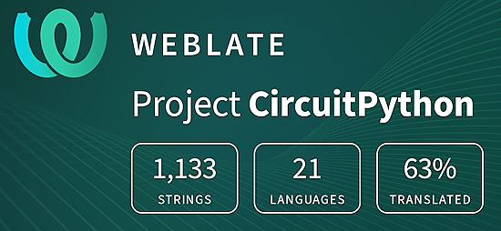](https://hosted.weblate.org/engage/circuitpython/)

One important feature of CircuitPython is translated control and error messages. With the help of fellow open source project [Weblate](https://weblate.org/), we're making it even easier to add or improve translations. 

Sign in with an existing account such as GitHub, Google or Facebook and start contributing through a simple web interface. No forks or pull requests needed! As always, if you run into trouble join us on [Discord](https://adafru.it/discord), we're here to help.

## 38,371 Thanks

The Adafruit Discord community, where we do all our CircuitPython development in the open, reached over 38,371 humans - thank you! Adafruit believes Discord offers a unique way for Python on hardware folks to connect. Join today at [https://adafru.it/discord](https://adafru.it/discord).

## ICYMI - In case you missed it

Python on hardware is the Adafruit Python video-newsletter-podcast! The news comes from the Python community, Discord, Adafruit communities and more and is broadcast on ASK an ENGINEER Wednesdays. The complete Python on Hardware weekly videocast [playlist is here](https://www.youtube.com/playlist?list=PLjF7R1fz_OOXRMjM7Sm0J2Xt6H81TdDev). The video podcast is on [iTunes](https://itunes.apple.com/us/podcast/python-on-hardware/id1451685192?mt=2), [YouTube](http://adafru.it/pohepisodes), [Instagram](https://www.instagram.com/adafruit/channel/)), and [XML](https://itunes.apple.com/us/podcast/python-on-hardware/id1451685192?mt=2).

[The weekly community chat on Adafruit Discord server CircuitPython channel - Audio / Podcast edition](https://itunes.apple.com/us/podcast/circuitpython-weekly-meeting/id1451685016) - Audio from the Discord chat space for CircuitPython, meetings are usually Mondays at 2pm ET, this is the audio version on [iTunes](https://itunes.apple.com/us/podcast/circuitpython-weekly-meeting/id1451685016), Pocket Casts, [Spotify](https://adafru.it/spotify), and [XML feed](https://adafruit-podcasts.s3.amazonaws.com/circuitpython_weekly_meeting/audio-podcast.xml).

## Contribute

The CircuitPython Weekly Newsletter is a CircuitPython community-run newsletter emailed every Monday. The complete [archives are here](https://www.adafruitdaily.com/category/circuitpython/). It highlights the latest CircuitPython related news from around the web including Python and MicroPython developments. To contribute, edit next week's draft [on GitHub](https://github.com/adafruit/circuitpython-weekly-newsletter/tree/gh-pages/_drafts) and [submit a pull request](https://help.github.com/articles/editing-files-in-your-repository/) with the changes. You may also tag your information on Twitter with #CircuitPython. 

Join the Adafruit [Discord](https://adafru.it/discord) or [post to the forum](https://forums.adafruit.com/viewforum.php?f=60) if you have questions.
