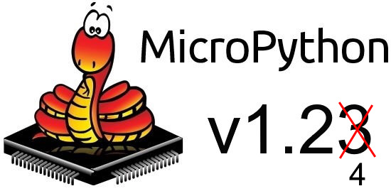
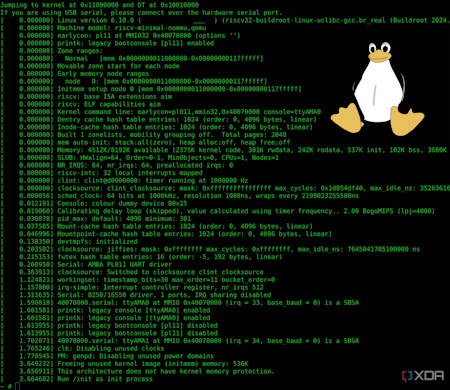
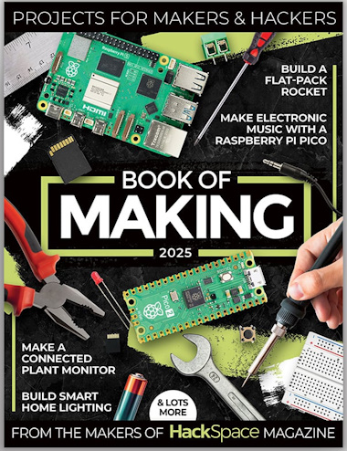
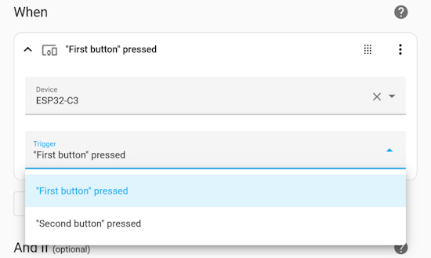
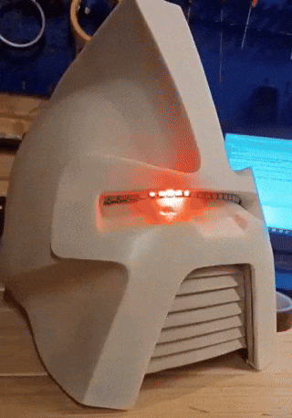
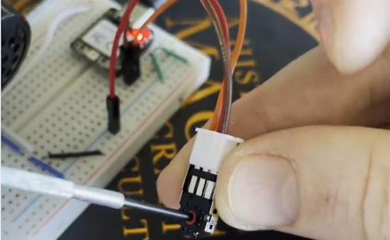
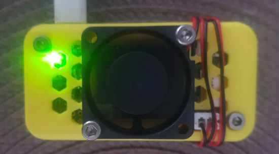
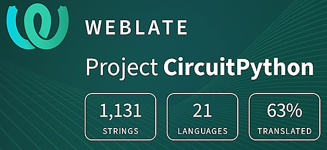

- [ ] Library and info updates
- [ ] change date
- [ ] update title
- [ ] Feature story
- [ ] Update  for images
- [ ] Update ICYDNCI
- [ ] All images 550w max only
- [ ] Link "View this email in your browser."

News Sources

- [Adafruit Playground](https://adafruit-playground.com/)
- Twitter: [CircuitPython](https://twitter.com/search?q=circuitpython&src=typed_query&f=live), [MicroPython](https://twitter.com/search?q=micropython&src=typed_query&f=live) and [Python](https://twitter.com/search?q=python&src=typed_query)
- [Raspberry Pi News](https://www.raspberrypi.com/news/)
- Mastodon [CircuitPython](https://octodon.social/tags/CircuitPython) and [MicroPython](https://octodon.social/tags/MicroPython)
- [hackster.io CircuitPython](https://www.hackster.io/search?q=circuitpython&i=projects&sort_by=most_recent) and [MicroPython](https://www.hackster.io/search?q=micropython&i=projects&sort_by=most_recent)
- YouTube: [CircuitPython](https://www.youtube.com/results?search_query=circuitpython&sp=CAI%253D), [MicroPython](https://www.youtube.com/results?search_query=micropython&sp=CAI%253D)
- Instructables: [CircuitPython](https://www.instructables.com/search/?q=circuitpython&projects=all&sort=Newest), [MicroPython](https://www.instructables.com/search/?q=micropython&projects=all&sort=Newest), [Raspberry Pi Python](https://www.instructables.com/search/?q=raspberry+pi+python&projects=all&sort=Newest)
- [python.org](https://www.python.org/)
- [Python Insider - dev team blog](https://pythoninsider.blogspot.com/)
- Individuals: [Jeff Geerling](https://www.jeffgeerling.com/blog)
- Tom's Hardware: [CircuitPython](https://www.tomshardware.com/search?searchTerm=circuitpython&articleType=all&sortBy=publishedDate) and [MicroPython](https://www.tomshardware.com/search?searchTerm=micropython&articleType=all&sortBy=publishedDate) and [Raspberry Pi](https://www.tomshardware.com/search?searchTerm=raspberry%20pi&articleType=all&sortBy=publishedDate)
- [hackaday.io newest projects MicroPython](https://hackaday.io/projects?tag=micropython&sort=date) and [CircuitPython](https://hackaday.io/projects?tag=circuitpython&sort=date)
- [Google News Python](https://news.google.com/topics/CAAqIQgKIhtDQkFTRGdvSUwyMHZNRFY2TVY4U0FtVnVLQUFQAQ?hl=en-US&gl=US&ceid=US%3Aen)
- [hackaday CircuitPython](https://hackaday.com/blog/?s=circuitpython) and [MicroPython](https://hackaday.com/blog/?s=micropython)
- hackaday.io - [CircuitPython](https://hackaday.io/search?term=circuitpython) and [MicroPython](https://hackaday.io/search?term=micropython)

View this email in your browser. **Warning: Flashing Imagery**

Welcome to the latest Python on Microcontrollers newsletter! *insert 2-3 sentences from editor (what's in overview, banter)* - *Anne Barela, Editor*

We're on [Discord](https://discord.gg/HYqvREz), [Twitter](https://twitter.com/search?q=circuitpython&src=typed_query&f=live), and for past newsletters - [view them all here](https://www.adafruitdaily.com/category/circuitpython/). If you're reading this on the web, [subscribe here](https://www.adafruitdaily.com/). Here's the news this week:

## MicroPython v1.24.0 is Nearly There

MicroPython v1.24 is getting *very* close to release. Two out of three milestones have been completed to date with a [major pull request for RP2350 support](https://github.com/micropython/micropython/pull/15619) being merged this past week. There is still a [preview release](https://github.com/micropython/micropython/releases/tag/v1.24.0-preview) available for those who wish to check things out - [GitHub Milestones](https://github.com/micropython/micropython/milestone/7).

## Feature

text - [site](url).

## Python 3.14 Alpha 1 Released With Early Changes

It was just last week that [Python 3.13 saw its official release](https://www.phoronix.com/news/Python-3.13-Released) with many great features from a new interactive interpreter to an experimental JIT and removing the Global Interpreter Lock (GIL) in the experimental free-threaded build mode. Python 3.14 Alpha 1 is now out in the first very early stage development milestone toward next year's big Python update - [Phoronix](https://www.phoronix.com/news/Python-3.14-Alpha-1) and [PSF](https://www.python.org/downloads/release/python-3140a1/).

## You Can Actually run Linux on the RISC-V Cores of the Raspberry Pi Pico 2’s RP2350

When the Raspberry Pi Pico 2 came out, it didn’t take long for someone to figure out crazy uses for its [RISC-V Hazard3 CPU cores](https://www.xda-developers.com/heres-why-risc-v-is-important/). After all, folks figured out how to pull off amazing feats with the original Pico, like emulating the Macintosh 128K. The RISC-V CPU is more commonly used in application-class processors than microcontrollers, so one developer set to work installing Linux on the RISC-V cores - [XDA](https://www.xda-developers.com/linux-risc-v-cores-raspberry-pi-pico-2-rp2350/).

## ViperIDE Now Has "Single-Click" Loading of MicroPython Packages

ViperIDE, a development environment for MicroPython, has added a feature to include a package/library/module/demo/project using a simple link, using the syntax `https://viper-ide.org/?install=YOUR_LINK` - [GitHub](https://github.com/vshymanskyy/ViperIDE/blob/main/docs/Quick-Install-Button.md) via [X](https://x.com/vshymanskyy/status/1846565821834723677).

## Experimenting with MicroPython on the Bus Pirate 5

Chris Lott looks at having MicroPython running on the RP2040 powering the Bus Pirate 5 board - [Hackaday](https://hackaday.com/2024/10/15/experimenting-with-micropython-on-the-bus-pirate-5/).

## This Week's Python Streams

Python on Hardware is all about building a cooperative ecosphere which allows contributions to be valued and to grow knowledge. Below are the streams within the last week focusing on the community.

**CircuitPython Deep Dive Stream**

[Last Friday](link), Scott streamed work on {subject}.

You can see the latest video and past videos on the Adafruit YouTube channel under the Deep Dive playlist - [YouTube](https://www.youtube.com/playlist?list=PLjF7R1fz_OOXBHlu9msoXq2jQN4JpCk8A).

**CircuitPython Parsec**

John Park’s CircuitPython Parsec this week is on {subject} - [Adafruit Blog](link) and [YouTube](link).

Catch all the episodes in the [YouTube playlist](https://www.youtube.com/playlist?list=PLjF7R1fz_OOWFqZfqW9jlvQSIUmwn9lWr).

**CircuitPython Weekly Meeting**

CircuitPython Weekly Meeting for October 15, 2024 ([notes](https://github. com/adafruit/adafruit-circuitpython-weekly-meeting/blob/main/2024/YYYY-MM-DD.md)) [on YouTube](https://youtu.be/MGeWNQewxPw).

## Project of the Week

text - [site](url).

## Popular Last Week

What was the most popular, most clicked link, in [last week's newsletter](newslink)? [title](url).

Did you know you can read past issues of this newsletter in the Adafruit Daily Archive? [Check it out](https://www.adafruitdaily.com/category/circuitpython/).

## New Notes from Adafruit Playground

[Adafruit Playground](https://adafruit-playground.com/) is a new place for the community to post their projects and other making tips/tricks/techniques. Ad-free, it's an easy way to publish your work in a safe space for free.

text - [Adafruit Playground](url).

text - [Adafruit Playground](url).

text - [Adafruit Playground](url).

## News From Around the Web

John Chinner has made a Cylon helmet with a "Larson Scanner" eye using a Raspberry Pi Pico running CircuitPython - [X](https://x.com/JohnChinner/status/1846612514307530940).

PiDog AI Robot Dog Kit for Raspberry Pi 4/3B+/3B/Zero 2W is ChatGPT-4o enabled with voice command, video recognition, and it's programmable in Python - [site](https://www.sunfounder.com/collections/robotics/products/sunfounder-pidog-robot-dog-kit-for-raspberry-pi?ref=tiktok1&utm_source=x) via [X](https://x.com/SunFounder2/status/1846380244728795458).

text - [site](url).

text - [site](url).

> "Using the CircuitPython library `rotaryio`, and a cheap mouse wheel encoder. The encoder name is Kailh and it's the 11mm version" - [X](https://x.com/CosminDolha/status/1846549886633705621).

text - [site](url).

text - [site](url).

text - [site](url).

text - [site](url).

text - [site](url).

text - [site](url).

text - [site](url).

text - [site](url).

text - [site](url).

text - [site](url).

A 3D printed Raspberry PI Zero 2W enclosure with a 3010 fan - [Adafruit Blog](https://blog.adafruit.com/2024/10/17/raspberry-pi-zero-2w-enclosure-with-3010-fan-3dprinting-3dthursday/).

text - [site](url).

text - [site](url).

## Coming Soon / New

text - [site](url).

text - [site](url).

## New Boards Supported by CircuitPython

The number of supported microcontrollers and Single Board Computers (SBC) grows every week. This section outlines which boards have been included in CircuitPython or added to [CircuitPython.org](https://circuitpython.org/).

This week, there were (#/no) new boards added:

- [Board name](url)
- [Board name](url)
- [Board name](url)

*Note: For non-Adafruit boards, please use the support forums of the board manufacturer for assistance, as Adafruit does not have the hardware to assist in troubleshooting.*

Looking to add a new board to CircuitPython? It's highly encouraged! Adafruit has four guides to help you do so:

- [How to Add a New Board to CircuitPython](https://learn.adafruit.com/how-to-add-a-new-board-to-circuitpython/overview)
- [How to add a New Board to the circuitpython.org website](https://learn.adafruit.com/how-to-add-a-new-board-to-the-circuitpython-org-website)
- [Adding a Single Board Computer to PlatformDetect for Blinka](https://learn.adafruit.com/adding-a-single-board-computer-to-platformdetect-for-blinka)
- [Adding a Single Board Computer to Blinka](https://learn.adafruit.com/adding-a-single-board-computer-to-blinka)

## New Learn Guides

The Adafruit Learning System has over 3,000 free guides for learning skills and building projects including using Python.

[TFT Spirit Board](https://learn.adafruit.com/tft-spirit-board) from [Tim C](https://learn.adafruit.com/u/Foamyguy)

[CircuitPython Audio FX](https://learn.adafruit.com/circuitpython-audio-fx) from [Jeff Epler](https://learn.adafruit.com/u/jepler)

[Haunted Air Blaster](https://learn.adafruit.com/automated-air-blaster) from [John Park](https://learn.adafruit.com/u/johnpark)

## Updated Learn Guides

[Share your work with Adafruit Playground!](https://learn.adafruit.com/adafruit-playground-notes) by [Anne Barela](https://learn.adafruit.com/adafruit-playground-notes)

## CircuitPython Libraries

The CircuitPython library numbers are continually increasing, while existing ones continue to be updated. Here we provide library numbers and updates!

To get the latest Adafruit libraries, download the [Adafruit CircuitPython Library Bundle](https://circuitpython.org/libraries). To get the latest community contributed libraries, download the [CircuitPython Community Bundle](https://circuitpython.org/libraries).

If you'd like to contribute to the CircuitPython project on the Python side of things, the libraries are a great place to start. Check out the [CircuitPython.org Contributing page](https://circuitpython.org/contributing). If you're interested in reviewing, check out Open Pull Requests. If you'd like to contribute code or documentation, check out Open Issues. We have a guide on [contributing to CircuitPython with Git and GitHub](https://learn.adafruit.com/contribute-to-circuitpython-with-git-and-github), and you can find us in the #help-with-circuitpython and #circuitpython-dev channels on the [Adafruit Discord](https://adafru.it/discord).

You can check out this [list of all the Adafruit CircuitPython libraries and drivers available](https://github.com/adafruit/Adafruit_CircuitPython_Bundle/blob/master/circuitpython_library_list.md). 

The current number of CircuitPython libraries is **###**!

**New Libraries**

Here's this week's new CircuitPython libraries:

* [library](url)

**Updated Libraries**

Here's this week's updated CircuitPython libraries:

* [library](url)

**Library PyPI Weekly Download Stats**

## What’s the CircuitPython team up to this week?

What is the team up to this week? Let’s check in:

**Dan**

text.

**Tim**

This week I wrapped up a guide for my Spirit Board and it's been published. I've also started reviewing Blinka and CircuitPython.org PRs which required me to get set up for testing the .org site locally. Lastly I patched and released a change in all of the libraries to fix an issue resulting from a deprecation in sphinx RTD theme that our docs use.

**Jeff**

I added a [monophonic version of CircuitPython Audio FX](https://learn.adafruit.com/circuitpython-audio-fx/audio-fx-monophonic) to my recent guide. The goal is for this code to be drop-in compatible with the Audio FX product (except for needing MP3 files, not OGG files).

**Scott**

This week I've continued working on CircuitMatter and reached my goal of having my code work with Apple Home. I can commission into Apple Home and toggle as a light. However, this isn't done. CircuitMatter code doesn't currently remember its state so you need to commission every time after startup. It also doesn't run on CircuitPython. I'm about to go on paternity leave so we'll see how far I get before then.

**Liz**

This week I worked on two project guides. The first was the [DIY Turbo Button Controller - HID Remapper](https://learn.adafruit.com/diy-turbo-button-controller-hid-remapper). It uses an RP2040 USB Host Feather to create a turbo button gamepad. The Feather acts as a transparent passthrough for the controller and sends any button pushes. When a specific combo is pressed, it sends a turbo button aka a rapidly pressed A button. 

The second project was the [QT Py CH32V203 eInk / ePaper Daily Calendar and Clock](https://learn.adafruit.com/ch32v203-eink-epaper-calendar-and-clock). It uses the QT Py CH32V203. I put together a simple eInk daily calendar with it using an EYESPI BFF and a STEMMA RTC module. I was inspired to build this after JP showcased the QT Py for his Product Pick of the Week show. I had written the product guide for it a few weeks back and hadn't had a chance to revisit it. I have a few more project ideas for the board that I'm hoping to put together.

## Upcoming Events

The next MicroPython Meetup in Melbourne will be on October 23rd – [Meetup](https://www.meetup.com/micropython-meetup/events). You can see recordings of previous meetings on [YouTube](https://www.youtube.com/@MicroPythonOfficial). September's meeting notes are [here](https://melbournemicropythonmeetup.github.io/September-2024-Meetup/).

Hackaday Superconference is an epic gathering of hardware hackers, makers, and tech enthusiasts happening November 1-3 in Pasadena, California - [Hackaday](https://hackaday.com/2024/08/06/tickets-for-supercon-2024-go-on-sale-now/) and [Eventbrite](https://www.eventbrite.com/e/2024-hackaday-superconference-tickets-965387338517).

PyCon AU will be held from the 22nd to the 26th of November at the Melbourne Convention and Exhibition Centre (MCEC) in Narrm/Melbourne. Matt Trentini and Damien George will both be presennting on MicroPython - [PyCon AU](https://2024.pycon.org.au/).

PyLadies Conference (PyLadiesCon) is a transformative event designed to promote diversity, learning, and empowerment within the Python community. December 6-8, 2024 online - [PyLadies](https://conference.pyladies.com/).

**Send Your Events In**

If you know of virtual events or upcoming events, please let us know via email to cpnews(at)adafruit(dot)com.

## Latest Releases

CircuitPython's stable release is [#.#.#](https://github.com/adafruit/circuitpython/releases/latest) and its unstable release is [#.#.#-##.#](https://github.com/adafruit/circuitpython/releases). New to CircuitPython? Start with our [Welcome to CircuitPython Guide](https://learn.adafruit.com/welcome-to-circuitpython).

[2024####](https://github.com/adafruit/Adafruit_CircuitPython_Bundle/releases/latest) is the latest Adafruit CircuitPython library bundle.

[2024####](https://github.com/adafruit/CircuitPython_Community_Bundle/releases/latest) is the latest CircuitPython Community library bundle.

[v#.#.#](https://micropython.org/download) is the latest MicroPython release. Documentation for it is [here](http://docs.micropython.org/en/latest/pyboard/).

[#.#.#](https://www.python.org/downloads/) is the latest Python release. The latest pre-release version is [#.#.#](https://www.python.org/download/pre-releases/).

[#,### Stars](https://github.com/adafruit/circuitpython/stargazers) Like CircuitPython? [Star it on GitHub!](https://github.com/adafruit/circuitpython)

## Call for Help -- Translating CircuitPython is now easier than ever

One important feature of CircuitPython is translated control and error messages. With the help of fellow open source project [Weblate](https://weblate.org/), we're making it even easier to add or improve translations. 

Sign in with an existing account such as GitHub, Google or Facebook and start contributing through a simple web interface. No forks or pull requests needed! As always, if you run into trouble join us on [Discord](https://adafru.it/discord), we're here to help.

## NUMBER Thanks

The Adafruit Discord community, where we do all our CircuitPython development in the open, reached over NUMBER humans - thank you! Adafruit believes Discord offers a unique way for Python on hardware folks to connect. Join today at [https://adafru.it/discord](https://adafru.it/discord).

## ICYMI - In case you missed it

Python on hardware is the Adafruit Python video-newsletter-podcast! The news comes from the Python community, Discord, Adafruit communities and more and is broadcast on ASK an ENGINEER Wednesdays. The complete Python on Hardware weekly videocast [playlist is here](https://www.youtube.com/playlist?list=PLjF7R1fz_OOXRMjM7Sm0J2Xt6H81TdDev). The video podcast is on [iTunes](https://itunes.apple.com/us/podcast/python-on-hardware/id1451685192?mt=2), [YouTube](http://adafru.it/pohepisodes), [Instagram](https://www.instagram.com/adafruit/channel/)), and [XML](https://itunes.apple.com/us/podcast/python-on-hardware/id1451685192?mt=2).

[The weekly community chat on Adafruit Discord server CircuitPython channel - Audio / Podcast edition](https://itunes.apple.com/us/podcast/circuitpython-weekly-meeting/id1451685016) - Audio from the Discord chat space for CircuitPython, meetings are usually Mondays at 2pm ET, this is the audio version on [iTunes](https://itunes.apple.com/us/podcast/circuitpython-weekly-meeting/id1451685016), Pocket Casts, [Spotify](https://adafru.it/spotify), and [XML feed](https://adafruit-podcasts.s3.amazonaws.com/circuitpython_weekly_meeting/audio-podcast.xml).

## Contribute

The CircuitPython Weekly Newsletter is a CircuitPython community-run newsletter emailed every Monday. The complete [archives are here](https://www.adafruitdaily.com/category/circuitpython/). It highlights the latest CircuitPython related news from around the web including Python and MicroPython developments. To contribute, edit next week's draft [on GitHub](https://github.com/adafruit/circuitpython-weekly-newsletter/tree/gh-pages/_drafts) and [submit a pull request](https://help.github.com/articles/editing-files-in-your-repository/) with the changes. You may also tag your information on Twitter with #CircuitPython. 

Join the Adafruit [Discord](https://adafru.it/discord) or [post to the forum](https://forums.adafruit.com/viewforum.php?f=60) if you have questions.
