- [ ] Library and info updates
- [ ] change date
- [ ] update title
- [ ] Feature story
- [ ] Update  for images
- [ ] Update ICYDNCI
- [ ] All images 550w max only
- [ ] Link "View this email in your browser."

News Sources

- [Adafruit Playground](https://adafruit-playground.com/)
- Twitter: [CircuitPython](https://twitter.com/search?q=circuitpython&src=typed_query&f=live), [MicroPython](https://twitter.com/search?q=micropython&src=typed_query&f=live) and [Python](https://twitter.com/search?q=python&src=typed_query)
- [Raspberry Pi News](https://www.raspberrypi.com/news/)
- Mastodon [CircuitPython](https://octodon.social/tags/CircuitPython) and [MicroPython](https://octodon.social/tags/MicroPython)
- [hackster.io CircuitPython](https://www.hackster.io/search?q=circuitpython&i=projects&sort_by=most_recent) and [MicroPython](https://www.hackster.io/search?q=micropython&i=projects&sort_by=most_recent)
- YouTube: [CircuitPython](https://www.youtube.com/results?search_query=circuitpython&sp=CAI%253D), [MicroPython](https://www.youtube.com/results?search_query=micropython&sp=CAI%253D)
- Instructables: [CircuitPython](https://www.instructables.com/search/?q=circuitpython&projects=all&sort=Newest), [MicroPython](https://www.instructables.com/search/?q=micropython&projects=all&sort=Newest), [Raspberry Pi Python](https://www.instructables.com/search/?q=raspberry+pi+python&projects=all&sort=Newest)
- [python.org](https://www.python.org/)
- [Python Insider - dev team blog](https://pythoninsider.blogspot.com/)
- Individuals: [Jeff Geerling](https://www.jeffgeerling.com/blog)
- Tom's Hardware: [CircuitPython](https://www.tomshardware.com/search?searchTerm=circuitpython&articleType=all&sortBy=publishedDate) and [MicroPython](https://www.tomshardware.com/search?searchTerm=micropython&articleType=all&sortBy=publishedDate) and [Raspberry Pi](https://www.tomshardware.com/search?searchTerm=raspberry%20pi&articleType=all&sortBy=publishedDate)
- [hackaday.io newest projects MicroPython](https://hackaday.io/projects?tag=micropython&sort=date) and [CircuitPython](https://hackaday.io/projects?tag=circuitpython&sort=date)
- [Google News Python](https://news.google.com/topics/CAAqIQgKIhtDQkFTRGdvSUwyMHZNRFY2TVY4U0FtVnVLQUFQAQ?hl=en-US&gl=US&ceid=US%3Aen)
- [hackaday CircuitPython](https://hackaday.com/blog/?s=circuitpython) and [MicroPython](https://hackaday.com/blog/?s=micropython)
- hackaday.io - [CircuitPython](https://hackaday.io/search?term=circuitpython) and [MicroPython](https://hackaday.io/search?term=micropython)

View this email in your browser. **Warning: Flashing Imagery**

Welcome to the latest Python on Microcontrollers newsletter! Another busy week in the Python on hardware space. Raspberry Pi keeps introducing innovative products. The interwebs have been flooded with news and projects, and your editor was interviewed by Tom's Hardware on the Pi Cast. - *Anne Barela, Editor*

We're on [Discord](https://discord.gg/HYqvREz), [Twitter](https://twitter.com/search?q=circuitpython&src=typed_query&f=live), and for past newsletters - [view them all here](https://www.adafruitdaily.com/category/circuitpython/). If you're reading this on the web, [subscribe here](https://www.adafruitdaily.com/). Here's the news this week:

## Raspberry Pi Announces a Variety of New Products

[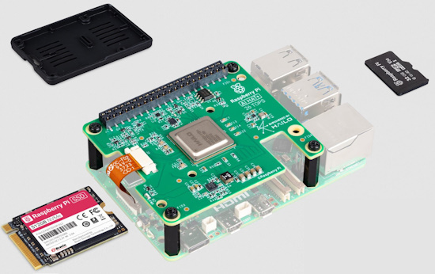](https://www.raspberrypi.com/news/)

Raspberry Pi has announces a slew of new products this month. It'll be excitinng to see how folks use them in new projects.

* Raspberry Pi AI HAT+ with 13 or 26 TOPS - [Raspberry Pi News](https://www.raspberrypi.com/news/raspberry-pi-ai-hat/).
* Raspberry Pi SSDs and SSD Kits - [Raspberry Pi News](https://www.raspberrypi.com/news/raspberry-pi-ssds-and-ssd-kits/) and [Tom's Hardware](https://www.tomshardware.com/raspberry-pi/raspberry-pi-announce-branded-range-of-nvme-ssds-and-ssd-kit).
* Raspberry Pi SD Cards and the Raspberry Pi Bumper - [Raspberry Pi News](https://www.raspberrypi.com/news/sd-cards-and-bumper/).
* Raspberry Pi AI Camera - [Raspberry Pi News](https://www.raspberrypi.com/news/raspberry-pi-ai-camera-on-sale-now/) and [Setup Guide](https://www.raspberrypi.com/news/how-to-get-started-with-your-raspberry-pi-ai-camera/).
  
## Feature

text - [site](url).

## Python is Still the Most Popular Coding Language, But Challengers Are Gaining Ground

[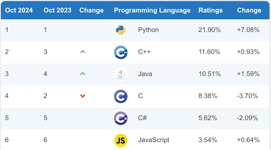](https://www.techspot.com/news/105157-python-most-popular-coding-language-but-challengers-gaining.html)

For October 2024, Python continues to reign as the most popular programming language, growing by +7.08 percent in the past month and holding a 21.90 percent market share. C++ has claimed second place with 11.60 percent, followed by Java with 10.51 percent. The classic C language, however, is losing ground, now ranking fourth with 8.38 percent market share, down 3.70 percent - [TechSpot](https://www.techspot.com/news/105157-python-most-popular-coding-language-but-challengers-gaining.html).

## CircuitPythonista Anne Barela on Tom's Hardware Pi Cast

Tom's Hardware Pi Cast host Les Pounder interviews CircuitPythonista Anne Barela about her latest project, a PyDOS handheld, CircuitPython and more - [YouTube](https://www.youtube.com/watch?v=UysDRYfZLJ8) and project on [Tom's Hardware](https://www.tomshardware.com/raspberry-pi/raspberry-pi-pico/maker-builds-raspberry-pi-rp2350-powered-pydos-handheld-in-a-blackberry-form-factor) and [Adafruit Playground](https://adafruit-playground.com/u/AnneBarela/pages/a-pydos-handheld).

## 5 Differences Between Raspberry Pi, Odroid and Other Popular SBCs

[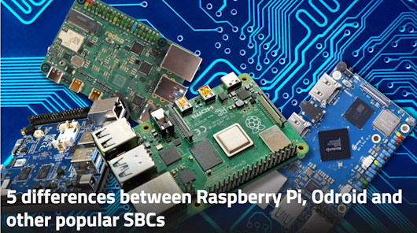](https://www.xda-developers.com/5-differences-raspberry-pi-odroid-other-sbcs/)

The SBC (single-board computer) market has exploded over the past several years. Ever since the Raspberry Pi debuted and sparked new interest in the field, many competitors have risen to capitalize on that interest. These include Odroid, Orange Pi, Banana Pi, and others. XDA looks at the most significant differentiating characteristics - [XDA](https://www.xda-developers.com/5-differences-raspberry-pi-odroid-other-sbcs/).

## Best Raspberry Pi Projects: October 2024

[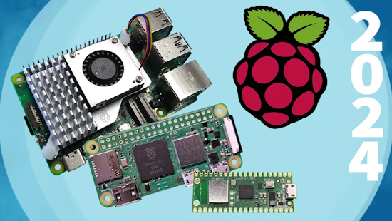](https://www.tomshardware.com/features/best-raspberry-pi-projects)

If you're looking for inspiration for your next Raspberry Pi project, check out this updated list - [Tom's Hardware](https://www.tomshardware.com/features/best-raspberry-pi-projects).

## This Week's Python Streams

Python on Hardware is all about building a cooperative ecosphere which allows contributions to be valued and to grow knowledge. Below are the streams within the last week focusing on the community.

**CircuitPython Deep Dive Stream**

[Last Friday](link), Scott streamed work on {subject}.

You can see the latest video and past videos on the Adafruit YouTube channel under the Deep Dive playlist - [YouTube](https://www.youtube.com/playlist?list=PLjF7R1fz_OOXBHlu9msoXq2jQN4JpCk8A).

**CircuitPython Parsec**

John Park’s CircuitPython Parsec this week is on {subject} - [Adafruit Blog](link) and [YouTube](link).

Catch all the episodes in the [YouTube playlist](https://www.youtube.com/playlist?list=PLjF7R1fz_OOWFqZfqW9jlvQSIUmwn9lWr).

**CircuitPython Weekly Meeting**

CircuitPython Weekly Meeting for {date} ([notes](file)) [on YouTube](link).

## Project of the Week: Record Scratch SAO

[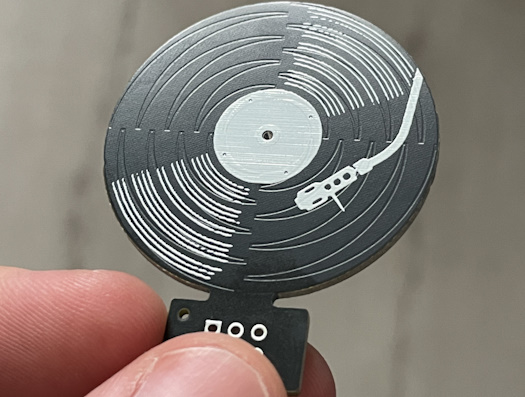](https://mastodon.social/@simenzhor/113260930485596206)

The Record Scratch simple add-on (SAO) is a board with circular capacitive touch for digital scratching of vinyl records by 
Simen E. Sørensen - [Mastodon Thread](https://mastodon.social/@simenzhor/113260930485596206) and [Hackaday.io](https://hackaday.io/project/198458-record-scratch-sao).

## Popular Last Week

[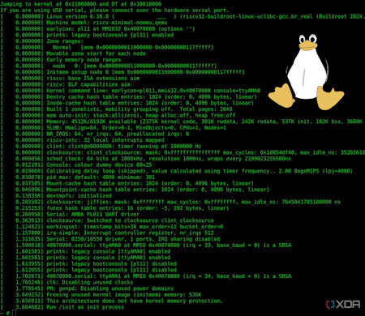](https://www.xda-developers.com/linux-risc-v-cores-raspberry-pi-pico-2-rp2350/)

What was the most popular, most clicked link, in [last week's newsletter](https://www.adafruitdaily.com/2024/10/21/python-on-microcontrollers-newsletter-micropython-v1-24-getting-closer-halloween-projects-and-much-more-circuitpython-python-micropython-thepsf-raspberry_pi/)? [You can actually run Linux on the RISC-V cores of the Raspberry Pi Pico 2’s RP2350](https://www.xda-developers.com/linux-risc-v-cores-raspberry-pi-pico-2-rp2350/).

Did you know you can read past issues of this newsletter in the Adafruit Daily Archive? [Check it out](https://www.adafruitdaily.com/category/circuitpython/).

## New Notes from Adafruit Playground

[Adafruit Playground](https://adafruit-playground.com/) is a new place for the community to post their projects and other making tips/tricks/techniques. Ad-free, it's an easy way to publish your work in a safe space for free.

[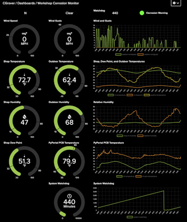](https://adafruit-playground.com/u/CGrover/pages/display-aio-local-weather-conditions-matrixweather-system)

Display AIO+ Local Weather Conditions: MatrixWeather System - [Adafruit Playground](https://adafruit-playground.com/u/CGrover/pages/display-aio-local-weather-conditions-matrixweather-system).

[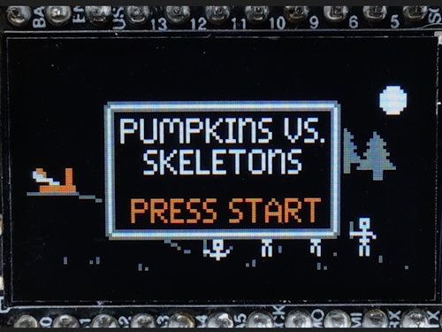](https://adafruit-playground.com/u/SamBlenny/pages/pumpkins-vs-skeletons-game-for-circuitpython)

Pumpkins vs Skeletons Game for CircuitPython - [Adafruit Playground](https://adafruit-playground.com/u/SamBlenny/pages/pumpkins-vs-skeletons-game-for-circuitpython).

[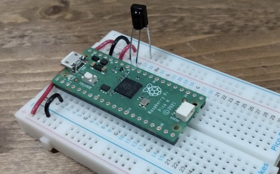](https://adafruit-playground.com/u/Alain_ManHW/pages/pc-media-remote)

PC media remote - [Adafruit Playground](https://adafruit-playground.com/u/Alain_ManHW/pages/pc-media-remote).

## News From Around the Web

text - [site](url).

text - [site](url).

text - [site](url).

text - [site](url).

text - [site](url).

text - [site](url).

text - [site](url).

text - [site](url).

text - [site](url).

text - [site](url).

text - [site](url).

text - [site](url).

text - [site](url).

text - [site](url).

text - [site](url).

text - [site](url).

text - [site](url).

text - [site](url).

## New

[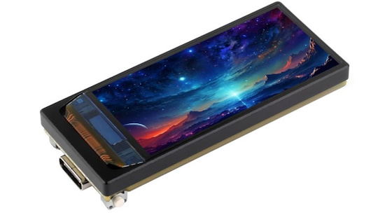](https://www.cnx-software.com/2024/10/22/esp32-s3-board-features-1-91-inch-amoled-display-and-qmi8658-6-axis-motion-sensor/)

A new Waveshare ESP32-S3 board features a 1.91-inch AMOLED display and a QMI8658 6-axis motion sensor - [CNX Software](https://www.cnx-software.com/2024/10/22/esp32-s3-board-features-1-91-inch-amoled-display-and-qmi8658-6-axis-motion-sensor/).

text - [site](url).

## New Boards Supported by CircuitPython

The number of supported microcontrollers and Single Board Computers (SBC) grows every week. This section outlines which boards have been included in CircuitPython or added to [CircuitPython.org](https://circuitpython.org/).

This week there were (#/no) new boards added:

- [Board name](url)
- [Board name](url)
- [Board name](url)

*Note: For non-Adafruit boards, please use the support forums of the board manufacturer for assistance, as Adafruit does not have the hardware to assist in troubleshooting.*

Looking to add a new board to CircuitPython? It's highly encouraged! Adafruit has four guides to help you do so:

- [How to Add a New Board to CircuitPython](https://learn.adafruit.com/how-to-add-a-new-board-to-circuitpython/overview)
- [How to add a New Board to the circuitpython.org website](https://learn.adafruit.com/how-to-add-a-new-board-to-the-circuitpython-org-website)
- [Adding a Single Board Computer to PlatformDetect for Blinka](https://learn.adafruit.com/adding-a-single-board-computer-to-platformdetect-for-blinka)
- [Adding a Single Board Computer to Blinka](https://learn.adafruit.com/adding-a-single-board-computer-to-blinka)

## New Learn Guides

[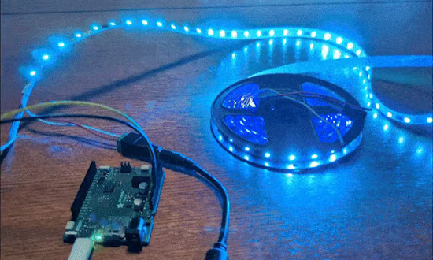](https://learn.adafruit.com/guides/latest)

The Adafruit Learning System has over 3,000 free guides for learning skills and building projects including using Python.

[Driving TM1814 addressable LEDs](https://learn.adafruit.com/driving-tm1814-addressable-leds) from [Jeff Epler](https://learn.adafruit.com/u/jepler)

[title](url) from [name](url)

[title](url) from [name](url)

## Updated Learn Guides

[title](url)

## CircuitPython Libraries

The CircuitPython library numbers are continually increasing, while existing ones continue to be updated. Here we provide library numbers and updates!

To get the latest Adafruit libraries, download the [Adafruit CircuitPython Library Bundle](https://circuitpython.org/libraries). To get the latest community contributed libraries, download the [CircuitPython Community Bundle](https://circuitpython.org/libraries).

If you'd like to contribute to the CircuitPython project on the Python side of things, the libraries are a great place to start. Check out the [CircuitPython.org Contributing page](https://circuitpython.org/contributing). If you're interested in reviewing, check out Open Pull Requests. If you'd like to contribute code or documentation, check out Open Issues. We have a guide on [contributing to CircuitPython with Git and GitHub](https://learn.adafruit.com/contribute-to-circuitpython-with-git-and-github), and you can find us in the #help-with-circuitpython and #circuitpython-dev channels on the [Adafruit Discord](https://adafru.it/discord).

You can check out this [list of all the Adafruit CircuitPython libraries and drivers available](https://github.com/adafruit/Adafruit_CircuitPython_Bundle/blob/master/circuitpython_library_list.md). 

The current number of CircuitPython libraries is **###**!

**New Libraries**

Here's this week's new CircuitPython libraries:

* [library](url)

**Updated Libraries**

Here's this week's updated CircuitPython libraries:

* [library](url)

**Library PyPI Weekly Download Stats**

## What’s the CircuitPython team up to this week?

What is the team up to this week? Let’s check in:

**Dan**

text.

**Tim**

text.

**Jeff**

text.

**Scott**

text.

**Liz**

text.

## Upcoming Events

Hackaday Superconference is an epic gathering of hardware hackers, makers, and tech enthusiasts happening November 1-3 in Pasadena, California - [Hackaday](https://hackaday.com/2024/08/06/tickets-for-supercon-2024-go-on-sale-now/) and [Eventbrite](https://www.eventbrite.com/e/2024-hackaday-superconference-tickets-965387338517).

PyCon AU will be held from the 22nd to the 26th of November at the Melbourne Convention and Exhibition Centre (MCEC) in Narrm/Melbourne. Matt Trentini and Damien George will both be presenting on MicroPython - [PyCon AU](https://2024.pycon.org.au/).

The next MicroPython Meetup in Melbourne will be on November 27th – [Meetup](https://www.meetup.com/micropython-meetup/events). You can see recordings of previous meetings on [YouTube](https://www.youtube.com/@MicroPythonOfficial). September's meeting notes are [here](https://melbournemicropythonmeetup.github.io/September-2024-Meetup/).

PyLadies Conference (PyLadiesCon) is a transformative event designed to promote diversity, learning, and empowerment within the Python community. December 6-8, 2024 online - [PyLadies](https://conference.pyladies.com/).

**Send Your Events In**

If you know of virtual events or upcoming events, please let us know via email to cpnews(at)adafruit(dot)com.

## Latest Releases

CircuitPython's stable release is [#.#.#](https://github.com/adafruit/circuitpython/releases/latest) and its unstable release is [#.#.#-##.#](https://github.com/adafruit/circuitpython/releases). New to CircuitPython? Start with our [Welcome to CircuitPython Guide](https://learn.adafruit.com/welcome-to-circuitpython).

[2024####](https://github.com/adafruit/Adafruit_CircuitPython_Bundle/releases/latest) is the latest Adafruit CircuitPython library bundle.

[2024####](https://github.com/adafruit/CircuitPython_Community_Bundle/releases/latest) is the latest CircuitPython Community library bundle.

[v#.#.#](https://micropython.org/download) is the latest MicroPython release. Documentation for it is [here](http://docs.micropython.org/en/latest/pyboard/).

[#.#.#](https://www.python.org/downloads/) is the latest Python release. The latest pre-release version is [#.#.#](https://www.python.org/download/pre-releases/).

[#,### Stars](https://github.com/adafruit/circuitpython/stargazers) Like CircuitPython? [Star it on GitHub!](https://github.com/adafruit/circuitpython)

## Call for Help -- Translating CircuitPython is now easier than ever

[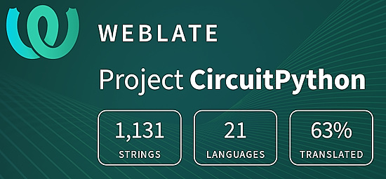](https://hosted.weblate.org/engage/circuitpython/)

One important feature of CircuitPython is translated control and error messages. With the help of fellow open source project [Weblate](https://weblate.org/), we're making it even easier to add or improve translations. 

Sign in with an existing account such as GitHub, Google or Facebook and start contributing through a simple web interface. No forks or pull requests needed! As always, if you run into trouble join us on [Discord](https://adafru.it/discord), we're here to help.

## NUMBER Thanks

The Adafruit Discord community, where we do all our CircuitPython development in the open, reached over NUMBER humans - thank you! Adafruit believes Discord offers a unique way for Python on hardware folks to connect. Join today at [https://adafru.it/discord](https://adafru.it/discord).

## ICYMI - In case you missed it

Python on hardware is the Adafruit Python video-newsletter-podcast! The news comes from the Python community, Discord, Adafruit communities and more and is broadcast on ASK an ENGINEER Wednesdays. The complete Python on Hardware weekly videocast [playlist is here](https://www.youtube.com/playlist?list=PLjF7R1fz_OOXRMjM7Sm0J2Xt6H81TdDev). The video podcast is on [iTunes](https://itunes.apple.com/us/podcast/python-on-hardware/id1451685192?mt=2), [YouTube](http://adafru.it/pohepisodes), [Instagram](https://www.instagram.com/adafruit/channel/)), and [XML](https://itunes.apple.com/us/podcast/python-on-hardware/id1451685192?mt=2).

[The weekly community chat on Adafruit Discord server CircuitPython channel - Audio / Podcast edition](https://itunes.apple.com/us/podcast/circuitpython-weekly-meeting/id1451685016) - Audio from the Discord chat space for CircuitPython, meetings are usually Mondays at 2pm ET, this is the audio version on [iTunes](https://itunes.apple.com/us/podcast/circuitpython-weekly-meeting/id1451685016), Pocket Casts, [Spotify](https://adafru.it/spotify), and [XML feed](https://adafruit-podcasts.s3.amazonaws.com/circuitpython_weekly_meeting/audio-podcast.xml).

## Contribute

The CircuitPython Weekly Newsletter is a CircuitPython community-run newsletter emailed every Monday. The complete [archives are here](https://www.adafruitdaily.com/category/circuitpython/). It highlights the latest CircuitPython related news from around the web including Python and MicroPython developments. To contribute, edit next week's draft [on GitHub](https://github.com/adafruit/circuitpython-weekly-newsletter/tree/gh-pages/_drafts) and [submit a pull request](https://help.github.com/articles/editing-files-in-your-repository/) with the changes. You may also tag your information on Twitter with #CircuitPython. 

Join the Adafruit [Discord](https://adafru.it/discord) or [post to the forum](https://forums.adafruit.com/viewforum.php?f=60) if you have questions.
