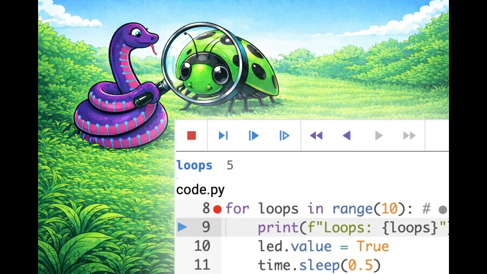

View this email in your browser. **Warning: Flashing Imagery**

Welcome to the latest Python on Microcontrollers newsletter! Welcome to the New Year! Certainly things have picked up, between commercial shows like CES2026 and folks making things during their holiday break. Every year the CircuitPython team holds an open forum for the community to say what they want the team to do that year. This year is #CircuitPython2026. Please post your thoughts on where things should go and let the developers know. There is some exciting CircuitPython developments from the community, including machine learning integration and a third party debugger from River Wang. All this and more. Thank you for subscribing and please let your friends, colleagues and students know to subscribe. - *Anne Barela, Editor*

We're on [Discord](https://discord.gg/HYqvREz), [Twitter/X](https://twitter.com/search?q=circuitpython&src=typed_query&f=live), [BlueSky](https://bsky.app/profile/circuitpython.org) and for past newsletters - [view them all here](https://www.adafruitdaily.com/category/circuitpython/). If you're reading this on the web, please [subscribe here](https://www.adafruitdaily.com/). Here's the news this week:

## CircuitPython in 2026

CircuitPython turns 9 years old next week ([first beta post](https://blog.adafruit.com/2017/01/09/welcome-to-the-adafruit-circuitpython-beta/)) and once again the CircuitPython Team thinking about the next year of CircuitPython’s growth. They'd like to hear from you how to improve CircuitPython in 2026 - [Adafruit Blog](https://blog.adafruit.com/2026/01/02/circuitpython2026-kickoff/).

* What would you like CircuitPython to do that it can’t?
* What chipset would you like to run it on?
* What tools are missing or need improving?
* What documentation is missing or needs work?
* How would you like to program and debug CircuitPython?

Please post about #CircuitPython2026 to some public place on the internet by Wednesday January 21st, 2026 and then let the team know! When you post, please add #CircuitPython2026 and email circuitpython2026@adafruit.com with a link. Ideas will be posted publically on the Adafruit Blog and collated for review.

## Bringing TensorFlow and PyTorch Models to CircuitPython

Training a neural network in TensorFlow or PyTorch and and running it inside CircuitPython using a single line of Python code - [Ashishware](https://ashishware.com/2026/01/10/cnn_circuitpython/) and [GitHub](https://github.com/code2k13/neural_network_cp/tree/main).

## Comparing Python Performance to JavaScript

JavaScript vs. Python speed performance benchmarking - [YouTube](https://www.youtube.com/watch?v=hQGE_CAo1PE).

## Using Rust in Python is Awesome 

Learning how to link Rust to Python to take advantage of Rust's performance in Python scripts - [YouTube](https://www.youtube.com/watch?v=IKANyuUn1rc).

## RISC-V hits 25% market penetration thanks to Meta and Qualcomm

The global semiconductor landscape has reached a inflection point as the open-source RISC-V architecture officially secured 25% market penetration, signaling the end of the long-standing architectural monopoly held by proprietary giants like Arm. The momentum behind this shift has been solidified by two blockbuster acquisitions that have reshaped the Silicon Valley power structure. Qualcomm’s $2.4 billion acquisition of Ventana Micro Systems and Meta Platforms, Inc.’s strategic takeover of Rivos - [Adafruit Blog](https://blog.adafruit.com/2026/01/07/risc-v-hits-25-market-penetration-thanks-to-meta-and-qualcomm/) and [WRAL News](https://markets.financialcontent.com/wral/article/tokenring-2025-12-26-risc-v-hits-25-market-penetration-as-qualcomm-and-meta-lead-the-shift-to-open-source-silicon).

## C# Wins Tiobe Programming Language of the Year 2025 While Python Still #1

C# saw the largest increase in ranking in the index year over year, while Java held steady, C and C++ swapped positions, R and Perl rose, and Go and Ruby faded. Python is at the top 22.61% with C at 10.99% - [InfoWorld](https://www.infoworld.com/article/4112993/c-wins-tiobe-programming-language-of-the-year-honors-for-2025.html).

## The CircuitPython IDE by River Wang Now Has a Debugger

The independent CircuitPython IDE by River Wang now contains a CircuitPython debugger. It includes Step, Watch, Breakpoints, Conditional Breakpoints and Time Traveling - [IDE Site](https://circuitpy.dev) and [YouTube](https://youtu.be/etOBbmExZmM?si=lVLpfycid0Uo6_Qs).

## A Look at the Raspberry Pi Compute Module Zero

The Raspberry Pi Compute Module Zero is meant for corporate folks looking to integrate Raspberry Pi technology into products. Jenny gets a hold of a module for a look - [YouTube](https://www.youtube.com/watch?v=jtdAFIAMueM). Via [LinkedIn](https://www.linkedin.com/posts/jennylist_a-look-at-the-raspberry-pi-compute-module-activity-7409908987778859008-VEVV/).

## This Week's Python Streams

Python on Hardware is all about building a cooperative ecosphere which allows contributions to be valued and to grow knowledge. Below are the streams within the last week focusing on the community.

**CircuitPython Deep Dive Stream**

[Last Friday](https://youtube.com/live/OQJ3zjwWiAw), Scott provided a #CircuitPython2025 recap.

You can see the latest video and past videos on the Adafruit YouTube channel under the Deep Dive playlist - [YouTube](https://www.youtube.com/playlist?list=PLjF7R1fz_OOXBHlu9msoXq2jQN4JpCk8A).

**CircuitPython Parsec**

John Park’s CircuitPython Parsec this back week, discussing a Circuit Playground Bluefruit iPhone camera remote trigger - [Adafruit Blog](https://blog.adafruit.com/2026/01/09/john-parks-circuitpython-parsec-circuit-playground-bluefruit-iphone-camera-remote-trigger/) and [YouTube](https://youtu.be/gU1uXa1yy20).

Catch all the episodes in the [YouTube playlist](https://www.youtube.com/playlist?list=PLjF7R1fz_OOWFqZfqW9jlvQSIUmwn9lWr).

**CircuitPython Weekly Meeting**

CircuitPython Weekly Meeting for January 5th, 2026 ([notes](https://github.com/adafruit/adafruit-circuitpython-weekly-meeting/blob/main/2026/2026-01-05.md)) [on YouTube](https://youtu.be/zZJxvxwkzFU).

## Project of the Week: A Self Contained Circuitpython WiFi enabled Ultrasonic Water Flow Sensor

Adafruit Forums user electromechpro posts about a WiFi enabled ultrasonic water flow sensor. It's based on the ScioSense UFM01 ultrasonic water flow sensor, an Adafruit Metro ESP32-S2 Metro and software in CircuitPython - [Adafruit Forums](https://forums.adafruit.com/viewtopic.php?t=221940).

> "The sensors are located away from any wireless networks, so the ESP is set to Access Point (AP) mode, and the user can connect to it as one would any other wireless network. The measured parameters are displayed on a web page to either a laptop or cell phone, as well as the max flow rate (the water is pumped through the sensor, so I use it to gauge the pump health)."

## Popular Last Issue

What was the most popular, most clicked link in [the previous newsletter](https://www.adafruitdaily.com/2025/12/22/python-on-microcontrollers-newsletter-year-end-cheat-sheets-internet-of-things-projects-and-more-circuitpython-python-micropython-thepsf-raspberry_pi/)? [Python cheatsheet](https://quickref.me/python).

Did you know you can read past issues of this newsletter in the Adafruit Daily Archive? [Check it out](https://www.adafruitdaily.com/category/circuitpython/).

## New Notes from Adafruit Playground

[Adafruit Playground](https://adafruit-playground.com/) is a new place for the community to post their projects and other making tips/tricks/techniques. Ad-free, it's an easy way to publish your work in a safe space for free.

Fruit Jam Code Practice Oscillator - [Adafruit Playground](https://adafruit-playground.com/u/SamBlenny/pages/fruit-jam-code-practice-oscillator).

Moon Miner Arcade Game for the Adafruit Fruit Jam - [Adafruit Playground](https://adafruit-playground.com/u/cogliano/pages/moon-miner-arcade-game-for-the-adafruit-fruit-jam).

Newxie Digital to Analog Thermometer - [Adafruit Playground](https://adafruit-playground.com/u/danak/pages/newxie-digital-to-analog-thermometer).

Wizard Crystal Scepter / Staff - [Adafruit Playground](https://adafruit-playground.com/u/Hendii/pages/wizard-crystal-scepter-staff).

## News From Around the Web

Kevin McAleer has created a Tiny Wiki with MicroPython. It runs on any MicroPython device and is entirely self-hosted. Plug it in and you have an instant wiki on your network. Great for creating a family wiki - [GitHub](https://github.com/kevinmcaleer/tiny_wiki). Via [X](https://x.com/kevsmac/status/1992584464258695567).

@HisashiKato on X posts "Using parts available at Akizuki Denshi and Switch Science, I assembled a lower-compatible version with reduced features of (the) [Adafruit Fruit Jam - Mini RP2350 Computer](https://www.adafruit.com/product/6200). I loaded the UF2 for Fruit Jam [here](https://github.com/fhoedemakers/retroJam) and it worked - [X](https://x.com/HisashiKato/status/2006449714976403623).

Sean Carolan has ported his Pac-Man clone from the CircuitPython Wio version to Adafruit Fruit Jam, all using CircuitPython 10 - [GitHub](https://github.com/scarolan/pac-wio?tab=readme-ov-file) and [X](https://x.com/seeedstudio/status/2009233635476467963).

Building a physical AI assistant: an ESP32 notification device for Claude Code using MicroPython - [Blog](https://claude-blog.setec.rs/blog/esp32-claude-code-notification-device) and [X Thread](https://x.com/alonwo/status/2008912631864733881).

Cyber City Circuits found a Python project with the opening crawl from Star Wars on a thermal printer - [X](https://x.com/MakeAugusta/status/1866324417552249188).

Get started with Python’s new native just-in-time (JIT) compiler - [InfoWorld](https://www.infoworld.com/article/4110565/get-started-with-pythons-new-native-jit.html).

A day and weather display with Adafruit MagTag and CircuitPython - [Reddit](https://www.reddit.com/r/adafruit/comments/1pzmrv8/day_and_weather_display/) and [GitHub](https://github.com/messerjon/MagTagCalWx).

SMARS Mini is the teeniest, tiniest robot. It runs on a Pimoroni Tiny 2040 and MicroPython - [Instagram](https://www.instagram.com/p/Cnq-bkDL2IK/). Via [X](https://x.com/kevsmac/status/1616727857534746624).

Agile Embedded Podcast talks with Matt Trentini, Principal Software Engineer at Planet Innovation, about using MicroPython for professional embedded development, including in medical devices - [Agile Embedded Podcast](https://agileembeddedpodcast.com/episodes/micropython-with-matt-trentini). Via [X](https://x.com/matt_trentini/status/2008375822776762683).

A device using a Raspberry Pi Pico 2, a display and MicroPython which continuously calculates Pi - [X](https://x.com/omiya_bonsai/status/2005701315150901626) (Japanese) and [GitHub](https://github.com/omiya-bonsai/pi-energy).

> "For the calculation, I used the Nilakantha series (a simple series expansion). What it's displaying is not the value of π, but 1) the number of reliable digits, 2) elapsed time, 3) digits per minute, and 4) calculation energy."

Python in Your Pocket: Tech Talkies just built the ultimate pocket-sized Python experimentation and coding platform using the UNIHIKER M10 SBC - [hackster.io](https://www.hackster.io/news/python-in-your-pocket-8bc42d07c3c2.amp) and [YouTube](https://youtu.be/P43MNvQKVrA).

NeoKey Trinkey GitHub launcher  with CircuitPython - [Reddit](https://www.reddit.com/r/circuitpython/comments/1pup2z4/neokey_trinkey_from_adafruit_project/) and [GitHub](https://github.com/MAX-P0W3R/NeokeyTrinkey-url-smash).

Raspberry Pi Pico: handling fFiles and directories with MicroPython - [Randon Nerd Tutorials](https://randomnerdtutorials.com/raspberry-pi-pico-files-directories-micropython/).

A sports scoreboard using the ESPN API (CircuitPython School) - [Mastodon](https://mastodon.social/@gallaugher@mastodon.world/115791516304352350) and [YouTube](https://mastodon.social/@gallaugher@mastodon.world/115791516304352350).

An on-demand sync clock (OSC) with MicroPython - [Mastodon](https://mastodon.social/@ghalfacree/115849120555398137), [hackster.io](https://www.hackster.io/news/andrea-favero-s-on-demand-sync-clock-delivers-one-touch-timing-accuracy-11d5661b6137), [Instructables](https://www.instructables.com/On-demand-Sync-Clock-OSC/) and [GitHub](https://github.com/AndreaFavero71/on_demand_sync_clock).

Making a hexagonal stock display with Raspberry Pi and Python using transparent displays - [Sozorablog](https://sozorablog.com/pi-transparent-oled/#toc29) and [X](https://x.com/sozoraemon/status/2009584427576516895).

Building a REST-controlled lighting interface with MicroPython - [The Drop Times](https://www.thedroptimes.com/65313/drupal-11-and-led-lights-building-rest-controlled-lighting-interface).

WiFi 8 is being developed under the IEEE 802.11bn standard, also known as “Ultra High Reliability” (UHR). Up until now, every new WiFi generation meant doubling or tripling download speeds. But WiFi 8 flips that thinking on its head. The technology focuses primarily on network efficiency and stability. That means even with 100 devices connected, the internet won’t drop, and latency will stay minimal - [1Tak](https://1tak.com/ces-2026-wi-fi-8-technology-features-launch/).

New Linux 6.19-rc3 kernel candidate - [Neowin](https://www.neowin.net/news/new-linux-619-rc3-kernel-candidate-adds-cpu-idle-detection-for-power11/).

The upcoming Armbian Imager tool is a help for non-Raspberry Pi SBC owners - [It's FOSS](https://itsfoss.com/news/armbian-imager-quietly-debuts/).

## New

The M5Stack NanoH2 is a tiny $7 ESP32-H2 IoT dev kit that supports Matter, Zigbee, and Thread to transparently blend tech into your home - [hackster.io](https://www.hackster.io/news/the-7-nanoh2-dev-kit-supports-zigbee-thread-and-matter-2bf43b2847e6).

The Waveshare RP2350-Touch-LCD-1.85C is a Raspberry Pi RP2350 devkit with a 1.85-inch round touchscreen display with 360×360 resolution, a built-in microphone, a 28-pin GPIO header, and a USB-C port. The RP2350-Touch-LCD-1.85C-BOX model builds on the platform to add a box with a speaker and a 3.7V battery. Both models also come with 16MB SPI flash, a microSD card slot, a 6-axis IMU, a few buttons and LEDs, and UART and I2C expansion connectors. They can be used for HMI solutions using touch, button, and voice recognition inputs, as well as display and audio outputs - [CNX](https://www.cnx-software.com/2025/12/19/raspberry-pi-rp2350-devkit-features-1-85-inch-round-touch-display-microphone-optional-speaker-and-battery-box/).

SigCore UC: an open-source universal I/O controller for the Raspberry Pi - [Hackaday](https://hackaday.com/2025/12/22/sigcore-uc-an-open-source-universal-i-o-controller-for-the-raspberry-pi/).

## New Boards Supported by CircuitPython

The number of supported microcontrollers and Single Board Computers (SBC) grows every week. This section outlines which boards have been included in CircuitPython or added to [CircuitPython.org](https://circuitpython.org/).

Since the last newsletter, there was one new board added:

- [EDU PICO 2 for Pico 2 W by Cytron Technologies](https://circuitpython.org/board/cytron_edu_v2%20_pico_2w/)

*Note: For non-Adafruit boards, please use the support forums of the board manufacturer for assistance, as Adafruit does not have the hardware to assist in troubleshooting.*

Looking to add a new board to CircuitPython? It's highly encouraged! Adafruit has four guides to help you do so:

- [How to Add a New Board to CircuitPython](https://learn.adafruit.com/how-to-add-a-new-board-to-circuitpython/overview)
- [How to add a New Board to the circuitpython.org website](https://learn.adafruit.com/how-to-add-a-new-board-to-the-circuitpython-org-website)
- [Adding a Single Board Computer to PlatformDetect for Blinka](https://learn.adafruit.com/adding-a-single-board-computer-to-platformdetect-for-blinka)
- [Adding a Single Board Computer to Blinka](https://learn.adafruit.com/adding-a-single-board-computer-to-blinka)

## New Learn Guides

The Adafruit Learning System has over 3,200 free guides for learning skills and building projects including using Python.

[MagTag IoT Menorah](https://learn.adafruit.com/magtag-iot-menorah) from [Liz Clark](https://learn.adafruit.com/u/BlitzCityDIY)

[Holiday Card Maker on Fruit Jam](https://learn.adafruit.com/holiday-card-maker-on-fruit-jam) from [Tim C](https://learn.adafruit.com/u/Foamyguy)

## CircuitPython Libraries

The CircuitPython library numbers are continually increasing, while existing ones continue to be updated. Here we provide library numbers and updates!

To get the latest Adafruit libraries, download the [Adafruit CircuitPython Library Bundle](https://circuitpython.org/libraries). To get the latest community contributed libraries, download the [CircuitPython Community Bundle](https://circuitpython.org/libraries).

If you'd like to contribute to the CircuitPython project on the Python side of things, the libraries are a great place to start. Check out the [CircuitPython.org Contributing page](https://circuitpython.org/contributing). If you're interested in reviewing, check out Open Pull Requests. If you'd like to contribute code or documentation, check out Open Issues. We have a guide on [contributing to CircuitPython with Git and GitHub](https://learn.adafruit.com/contribute-to-circuitpython-with-git-and-github), and you can find us in the #help-with-circuitpython and #circuitpython-dev channels on the [Adafruit Discord](https://adafru.it/discord).

You can check out this [list of all the Adafruit CircuitPython libraries and drivers available](https://github.com/adafruit/Adafruit_CircuitPython_Bundle/blob/master/circuitpython_library_list.md). 

The current number of CircuitPython libraries is **552**!

**Updated Libraries**

Here are this week's updated CircuitPython libraries:

  * [adafruit/Adafruit_CircuitPython_USB_Host_Descriptors](https://github.com/adafruit/Adafruit_CircuitPython_USB_Host_Descriptors)
  * [adafruit/Adafruit_CircuitPython_LIS3DH](https://github.com/adafruit/Adafruit_CircuitPython_LIS3DH)
  * [adafruit/Adafruit_CircuitPython_TLV320](https://github.com/adafruit/Adafruit_CircuitPython_TLV320)
  * [EGJ-Moorington/CircuitPython_Button_Handler](https://github.com/EGJ-Moorington/CircuitPython_Button_Handler)
  * [relic-se/CircuitPython_USB_Host_Gamepad](https://github.com/relic-se/CircuitPython_USB_Host_Gamepad)

## What’s the CircuitPython team up to this week?

What is the team up to this week? Let’s check in:

**Dan**

I'm continuing on the AirLift `wifi/socketpool/ssl` implementation. I removed all heap storage allocations from the communications being done with the AirLift co-processor. This makes doing CircuitPython web workflow easier. I'm now working on adding TLS support.

**Tim**

Over the holiday I tested a handful of common USB WiFi dongles on Raspberry Pi Trixie to find out which ones have chipset that are supported without 3rd party drivers. This week I wrote proof of concept code for a talking multimeter and honed in on hardware to use for a version of this project to make into a learn guide. I've also started a sweep of reviewing and testing library PRs doing what I can get  them merged or moved forward.

**Scott**

I'm caught up after the holidays and working to finish I2S support in the CircuitPython Zephyr support. I was a bit hung up by testing with an MCU that doesn't seem to have working support. I've switched to the nRF5340 for testing and I'm getting further. The first playback works... but the second crashes.

**Liz**

I'm back from holiday break and ready to dive into new projects. Right before the break, I wrapped up a final holiday project: a [MagTag IoT Menorah](https://learn.adafruit.com/magtag-iot-menorah). It gets the date and time from the internet and then uncovers the candle flame on the menorah graphic on the e-Ink display depending on what night of Hanukkah it is.

For my first project of the year, I've been researching the [Basyn MIDI adapter project](https://www.scribd.com/document/610061828/BASYN-MIDI-Kit) to make a CircuitPython version. I'm going to use an RP2040 Feather with a MIDI FeatherWing and terminal blocks to emulate the functionality of the adapter. I don't have access to an analog organ pedal, so I'm going to use foot switches, which a lot of folks use for bass synths.

## Upcoming Events

Note that in December there are not many scheduled meetings due to the holidays.

The next MicroPython Meetup in Melbourne will be on January 28th – [Luma](https://luma.com/r0rq9pl4). You can see recordings of previous meetings on [YouTube](https://www.youtube.com/@MicroPythonOfficial). 

PyCascades 2026 will be 20 March 2026 – 21 March 2026 in Vancouver, British Columbia, Canada - [PyCascades 2026](https://2026.pycascades.com/).

**Other Events This Year**

* PyCon DE & PyData 2026 will be 13 April 2026 – 17 April 2026 in Darmstadt, Germany
* The Open Source Hardware Association Open Hardware Summit is coming to Berlin, Germany on May 23rd and 24th, 2025.
* PyCon AU 2026 will be 26 Aug. 2026 – 30 Aug. 2026 in Brisbane, Australia

**Send Your Events In**

If you know of virtual events or upcoming events, please let us know via email to cpnews(at)adafruit(dot)com.

## Latest Releases

CircuitPython's stable release is [10.0.3](https://github.com/adafruit/circuitpython/releases/latest) and its unstable release is [10.1.0-beta.1](https://github.com/adafruit/circuitpython/releases). New to CircuitPython? Start with our [Welcome to CircuitPython Guide](https://learn.adafruit.com/welcome-to-circuitpython).

[20250108](https://github.com/adafruit/Adafruit_CircuitPython_Bundle/releases/latest) is the latest Adafruit CircuitPython library bundle.

[20250109](https://github.com/adafruit/CircuitPython_Community_Bundle/releases/latest) is the latest CircuitPython Community library bundle.

[v1.27.0](https://micropython.org/download) is the latest MicroPython release. Documentation for it is [here](http://docs.micropython.org/en/latest/pyboard/).

[3.14.2](https://www.python.org/downloads/) is the latest Python release. The latest pre-release version is [3.15.0a3](https://www.python.org/download/pre-releases/).

[4,438 Stars](https://github.com/adafruit/circuitpython/stargazers) Like CircuitPython? [Star it on GitHub!](https://github.com/adafruit/circuitpython)

## Call for Help -- Translating CircuitPython is now easier than ever

One important feature of CircuitPython is translated control and error messages. With the help of fellow open source project [Weblate](https://weblate.org/), we're making it even easier to add or improve translations. 

Sign in with an existing account such as GitHub, Google or Facebook and start contributing through a simple web interface. No forks or pull requests needed! As always, if you run into trouble join us on [Discord](https://adafru.it/discord), we're here to help.

## 39,139 Thanks

The Adafruit Discord community, where we do all our CircuitPython development in the open, reached over 39,139 humans - thank you! Adafruit believes Discord offers a unique way for Python on hardware folks to connect. Join today at [https://adafru.it/discord](https://adafru.it/discord).

## ICYMI - In case you missed it

Python on hardware is the Adafruit Python video-newsletter-podcast! The news comes from the Python community, Discord, Adafruit communities and more and is broadcast on ASK an ENGINEER Wednesdays. The complete Python on Hardware weekly videocast [playlist is here](https://www.youtube.com/playlist?list=PLjF7R1fz_OOXRMjM7Sm0J2Xt6H81TdDev). The video podcast is on [iTunes](https://itunes.apple.com/us/podcast/python-on-hardware/id1451685192?mt=2), [YouTube](http://adafru.it/pohepisodes), [Instagram](https://www.instagram.com/adafruit/channel/)), and [XML](https://itunes.apple.com/us/podcast/python-on-hardware/id1451685192?mt=2).

[The weekly community chat on Adafruit Discord server CircuitPython channel - Audio / Podcast edition](https://itunes.apple.com/us/podcast/circuitpython-weekly-meeting/id1451685016) - Audio from the Discord chat space for CircuitPython, meetings are usually Mondays at 2pm ET, this is the audio version on [iTunes](https://itunes.apple.com/us/podcast/circuitpython-weekly-meeting/id1451685016), Pocket Casts, [Spotify](https://adafru.it/spotify), and [XML feed](https://adafruit-podcasts.s3.amazonaws.com/circuitpython_weekly_meeting/audio-podcast.xml).

## Contribute

The CircuitPython Weekly Newsletter is a CircuitPython community-run newsletter emailed every Monday. To contribute your content, please email your news to cpnews (at) adafruit (dot) com with information and link(s) to your content. 

Join the Adafruit [Discord](https://adafru.it/discord) or [post to the forum](https://forums.adafruit.com/viewforum.php?f=60) if you have questions.
