- [ ] Library and info updates
- [ ] change date
- [ ] update title
- [ ] Feature story
- [ ] Update  for images
- [ ] Update ICYDNCI
- [ ] All images 550w max only
- [ ] Link "View this email in your browser."

News Sources

- [Adafruit Playground](https://adafruit-playground.com/)
- Twitter: [CircuitPython](https://twitter.com/search?q=circuitpython&src=typed_query&f=live), [MicroPython](https://twitter.com/search?q=micropython&src=typed_query&f=live) and [Python](https://twitter.com/search?q=python&src=typed_query)
- [Raspberry Pi News](https://www.raspberrypi.com/news/), [Pi Foundation](https://www.raspberrypi.org/blog/)
- Mastodon [CircuitPython](https://mastodon.social/tags/CircuitPython) and [MicroPython](https://mastodon.social/tags/MicroPython)
- BlueSky [CircuitPython](https://bsky.app/search?q=circuitpython), [MicroPython](https://bsky.app/search?q=micropython), [Raspberry Pi](https://bsky.app/search?q=raspberry+pi)
- [Google News Python](https://news.google.com/topics/CAAqIQgKIhtDQkFTRGdvSUwyMHZNRFY2TVY4U0FtVnVLQUFQAQ?hl=en-US&gl=US&ceid=US%3Aen), [Infoworld](https://www.infoworld.com/)
- YouTube: [CircuitPython](https://www.youtube.com/results?search_query=circuitpython&sp=CAISBAgDEAE%253D), [MicroPython](https://www.youtube.com/results?search_query=micropython&sp=CAISBAgDEAE%253D), [Prof Gallaugher](https://www.youtube.com/@BuildWithProfG/videos)
- [maker.io Python](https://www.digikey.com/en/maker/search-results?s=createdDate&t=python)
- [hackster.io CircuitPython](https://www.hackster.io/search?q=circuitpython&i=projects&sort_by=most_recent) and [MicroPython](https://www.hackster.io/search?q=micropython&i=projects&sort_by=most_recent)
- Instructables: [CircuitPython](https://www.instructables.com/search/?q=circuitpython&projects=all&sort=Newest), [MicroPython](https://www.instructables.com/search/?q=micropython&projects=all&sort=Newest), [Raspberry Pi Python](https://www.instructables.com/search/?q=raspberry+pi+python&projects=all&sort=Newest)
- [hackaday CircuitPython](https://hackaday.com/blog/?s=circuitpython) and [MicroPython](https://hackaday.com/blog/?s=micropython)
- [python.org](https://www.python.org/)
- [Python Insider - dev team blog](https://blog.python.org/)
- Individuals: [bret.dk](https://bret.dk/), [Jeff Geerling](https://www.jeffgeerling.com/blog), [Yakroo](https://x.com/Yakroo5077), [coXXect](https://coxxect.blogspot.com/)
- Tom's Hardware: [CircuitPython](https://www.tomshardware.com/search?searchTerm=circuitpython&articleType=all&sortBy=publishedDate) and [MicroPython](https://www.tomshardware.com/search?searchTerm=micropython&articleType=all&sortBy=publishedDate) and [Raspberry Pi](https://www.tomshardware.com/search?searchTerm=raspberry%20pi&articleType=all&sortBy=publishedDate)
- [hackaday.io newest projects MicroPython](https://hackaday.io/projects?tag=micropython&sort=date) and [CircuitPython](https://hackaday.io/projects?tag=circuitpython&sort=date)
- hackaday.io - [CircuitPython](https://hackaday.io/search?term=circuitpython) and [MicroPython](https://hackaday.io/search?term=micropython)
- [MicroPython Meeting](https://luma.com/micropython?k=c)

View this email in your browser. **Warning: Flashing Imagery**

Welcome to the latest Python on Microcontrollers newsletter! *insert 2-3 sentences from editor (what's in overview, banter)* - *Anne Barela, Editor*

We're on [Discord](https://discord.gg/HYqvREz), [Twitter/X](https://twitter.com/search?q=circuitpython&src=typed_query&f=live), [BlueSky](https://bsky.app/profile/circuitpython.org) and for past newsletters - [view them all here](https://www.adafruitdaily.com/category/circuitpython/). If you're reading this on the web, please [subscribe here](https://www.adafruitdaily.com/). Here's the news this week:

## River's CircuitPython Online IDE Adds an AI Agent Coding Workflow

[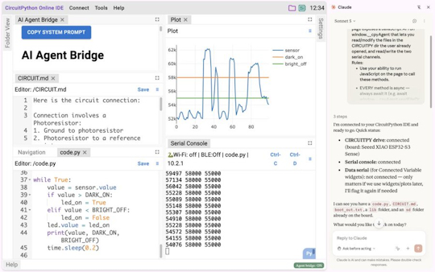](https://adafruit-playground.com/u/River_Wang/pages/coding-circuitpython-with-ai-agent-the-easiest-setup)

CircuitPythonista River Wang has updated his web-based CircuitPython Online IDE to version 2.5 with "AI Agent Bridge", a new feature that connects the IDE to an AI agent.

> "The IDE itself doesn't contain any AI. Instead, it exposes a set of tools, implemented as JavaScript functions, that an AI agent can call. These functions serve as the bridge between the IDE and the agent."

He has also written a tutorial on [Adafruit Playground](https://adafruit-playground.com/u/River_Wang/pages/coding-circuitpython-with-ai-agent-the-easiest-setup) walking through a full AI agent workflow with the IDE. [IDE site: circuitpy.dev](https://circuitpy.dev). Via [X](https://x.com/River___Wang/status/2075092027096662368).

## Kattni Rembor to Chair PyCon US 2027 and 2028

Kattni Rembor, fellow maker and past colleague, has been chair of PyOhio since 2024. The Python Software Foundation has asked Kattni to co-chair PyCon US 2027 and chair for 2028. Kattni brings her experience organizing events and giving conference talks to the largest Python gathering in the US. Congratulations, Kattni! - [PSF Blog](https://pycon.blogspot.com/2026/07/welcome-kattni.html?m=1).

## Raspberry Pi Describes Setting Up OpenClaw on a Pi

[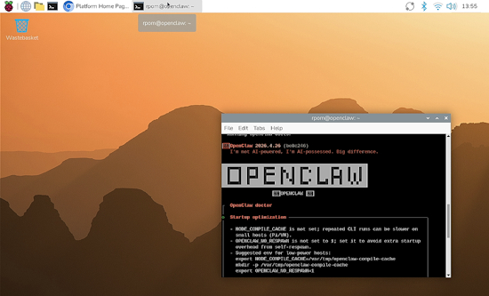](https://www.raspberrypi.com/news/set-up-openclaw-on-your-raspberry-pi/)

[OpenClaw](https://openclaw.ai/) is currently one of the biggest buzzwords in tech. It’s a digital agent software that runs on your computer and taps into a large language model (LLM) to operate autonomously. Lucy Hattersley writes this is why Raspberry Pi is the absolute ideal platform for this kind of new frontier of computing. Rather than running OpenClaw on your main computer where it can access your reminders, your mail, and the web browser containing your passwords, put OpenClaw in a secure Raspberry Pi environment where you control the entire stack and operating system" with apointer to Issue 166 of the Official Raspberry Pi Magazine - [Raspberry Pi News](https://www.raspberrypi.com/news/set-up-openclaw-on-your-raspberry-pi/).

## Picogame

[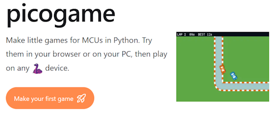](https://picogame.makerclass.cz/)

picogame is a small 2D game engine for microcontrollers like the RP2040, the chip inside the PicoPad pocket console. It also runs on CircuitPython boards in general. You write your game in Python, try it instantly in your browser (or on your PC in the desktop simulator), then copy it to the device and play. No C, no build step, no hardware required to start. And Picogame hhas the ability to make side scrolling games that are not as easy to make with CircuitPython `displayio` - [picogame](https://picogame.makerclass.cz/) and a video deep dive by Tim - [YouTube](https://x.com/i/broadcasts/1nJOLLRoNaZxR).

## The Snakie MicroPython IDE Adds 3D Modeling

[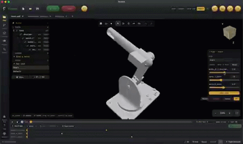](https://x.com/kevsmac/status/2075372124538081518)

Snakie is the new MicroPython development environmeny which included coding and making simulations by wiring up virtual boards. It its latest release, You can add STL files into Snakie, join them together and control the joint rotation from your MicroPython code - [X](https://x.com/kevsmac/status/2075372124538081518) and [Snakie website](https://www.snakie.org/).

## The Adafruit Fruit Jam is One Year Old

Dan Cogliano on BlueSky writes "July marks Adafruit FruitJam's 1st birthday! I've been having a lot of fun creating projects for it. There are tons of things you can do with it, including programming it with CircuitPython. [Here are just a few examples](https://learn.adafruit.com/search?q=fruitjam) (incl. my Zork game emulator) - [BlueSky](https://bsky.app/profile/cogliano.bsky.social/post/3mpm4ey2lts2v).

## The Raspberry Pi Podcast

The Raspberry Pi Podcast - [The Raspberry Pi Podcast Playlist](https://www.youtube.com/playlist?list=PLcd1Q0-YkB1fa1hubcIw9jTBjxQsTxZKw). Via [LinkedIn](https://www.linkedin.com/posts/raspberrypi-rp2350-podcast-ugcPost-7480260008069283840-0TyX/).

* [The AI Edge: How Raspberry Pi Brings Big Brains to Tiny Boards](https://www.youtube.com/watch?v=HHDgLbNqVKA&list=PLcd1Q0-YkB1fa1hubcIw9jTBjxQsTxZKw&index=1&pp=iAQB)
* [Small Device, Big Business: Raspberry Pi as a Desktop PC Replacement](https://www.youtube.com/watch?v=Cgcq3xRMYig&list=PLcd1Q0-YkB1fa1hubcIw9jTBjxQsTxZKw&index=2)
* [Inside The Silicon: The How and Why of RP2350](https://www.youtube.com/watch?v=cZrvE5MKZoQ&list=PLcd1Q0-YkB1fa1hubcIw9jTBjxQsTxZKw&index=3)

## This Week's Python Streams

Python on Hardware is all about building a cooperative ecosphere which allows contributions to be valued and to grow knowledge. Below are the streams within the last week focusing on the community.

**CircuitPython Deep Dive Stream**

[Last Friday](https://youtube.com/live/kk9eoJWB0ww), Scott streamed work on Hardware in the Loop (HIL) software.

You can see the latest video and past videos on the Adafruit YouTube channel under the Deep Dive playlist - [YouTube](https://www.youtube.com/playlist?list=PLjF7R1fz_OOXBHlu9msoXq2jQN4JpCk8A).

**CircuitPython Parsec**

John Park’s CircuitPython Parsec this week is on Nested Display Groups - [Adafruit Blog](https://blog.adafruit.com/2026/07/10/john-parks-circuitpython-parsec-nested-display-groups/) and [YouTube](https://youtu.be/hww4pDT_5sk?si=Mw5oJe-CWe1zcWQt).

Catch all the episodes in the [YouTube playlist](https://www.youtube.com/playlist?list=PLjF7R1fz_OOWFqZfqW9jlvQSIUmwn9lWr).

**Deep Dive with Tim**

[Last week](https://youtube.com/live/hFhE3nWP-V4), Tim streamed work on investigating `audiocore` and a Get Buffer Debug Function.

You can see the latest video and past videos on the Adafruit YouTube channel under the Deep Dive playlist - [YouTube](https://www.youtube.com/playlist?list=PLjF7R1fz_OOWFqZfqW9jlvQSIUmwn9lWr).

**CircuitPython Weekly Meeting**

CircuitPython Weekly Meeting for July 6, 2026 ([notes](https://github.com/adafruit/adafruit-circuitpython-weekly-meeting/blob/main/2026/2026-07-06.md)) [on YouTube](https://youtu.be/5G23Re5lgbQ).

## Project of the Week: OOMWOO, the Open-source Robot Vacuum You Build Yourself.

[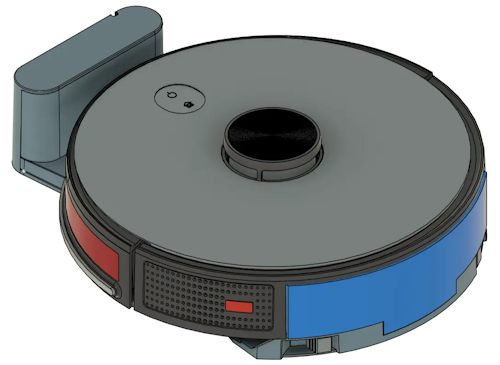](https://github.com/makerspet/oomwoo)

OOMWOO is an open-source home robot vacuum you can build yourself, made for the Raspberry Pi, ROS2, Home Assistant, Python and 3D-printing communities. It uses an affordable 2D LiDAR to map your home and navigate on its own. Local, no cloud required for regular functionality, no vendor lock-in - [GitHub](https://github.com/makerspet/oomwoo).

## Popular Last Week

[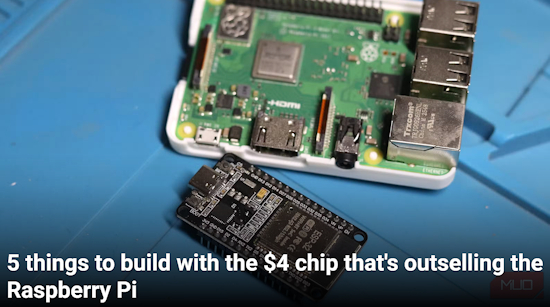](https://www.makeuseof.com/things-build-chip-outselling-raspberry-pi/)

What was the most popular, most clicked link, in [last week's newsletter](https://www.adafruitdaily.com/2026/07/06/python-on-microcontrollers-newsletter-scrollkit-for-your-led-matrices-ai-tools-device-security-and-more/)? [Five things to build with the $4 chip that's outselling the Raspberry Pi](https://www.makeuseof.com/things-build-chip-outselling-raspberry-pi/).

Did you know you can read past issues of this newsletter in the Adafruit Daily Archive? [Check it out](https://www.adafruitdaily.com/category/circuitpython/).

## New Notes from Adafruit Playground

[Adafruit Playground](https://adafruit-playground.com/) is a new place for the community to post their projects and other making tips/tricks/techniques. Ad-free, it's an easy way to publish your work in a safe space for free.

[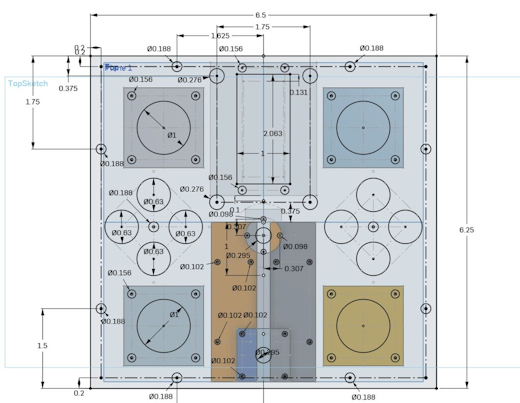](https://adafruit-playground.com/u/Nosille/pages/super-joystick)

Super Joystick - [Adafruit Playground](https://adafruit-playground.com/u/Nosille/pages/super-joystick).

[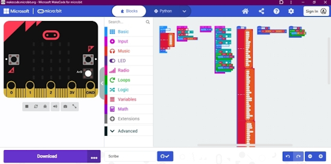](https://adafruit-playground.com/u/mrklingon/pages/scribe-a-microbit-translator-sort-of)

Scribe - a Microbit "Translator" (sort of) - [Adafruit Playground](https://adafruit-playground.com/u/mrklingon/pages/scribe-a-microbit-translator-sort-of).

Simple Python Lithophane Generator - [Adafruit Playground](https://adafruit-playground.com/u/caternuson/pages/simple-python-lithophane-generatorhttps://adafruit-playground.com/u/caternuson/pages/simple-python-lithophane-generator).

## News From Around the Web

[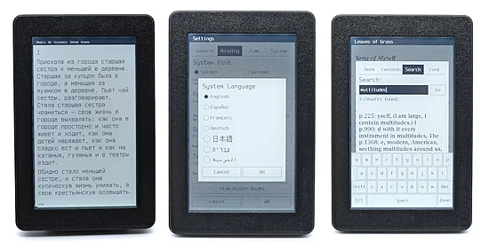](https://www.cnx-software.com/2026/07/10/open-book-touch-a-drm-free-wifi-connected-4-26-inch-open-source-hardware-e-reader/)

Open Book Touch – a DRM-free, WiFi-connected 4.26-inch open-source hardware e-reader [rpgrammable in CircuitPython and Arduino (crowdfunding) - [CNX](https://www.cnx-software.com/2026/07/10/open-book-touch-a-drm-free-wifi-connected-4-26-inch-open-source-hardware-e-reader/). Via [Mastodon](https://mastodon.social/@cnx-software.com@web.brid.gy/116894899238711285).

The integrated development environment (IDE) is dead, long live the agentic development environment (ADE) and it's powered in part by an older little known Git capability - [InfoWorld](https://www.infoworld.com/article/4193975/the-ide-is-dead-long-live-the-ade.html).

Catch the latest episode of The Bootloader and hear [Paul Cutler](https://www.paulcutler.org/) discuss RV Circuit Studio, a new CircuitPython IDE that looks like a capable Mu replacement - [Mastodon](https://mastodon.social/@prcutler@hachyderm.io/116885406664462393) and [Podcast](https://www.thebootloader.net/episodes/2026/ep034/).

Making an AI Rocky from ‘Project Hail Mary’ with Raspberry Pi 5 4GB - [Raspberry Pi News](https://www.raspberrypi.com/news/ai-rocky-from-project-hail-mary/) and [YouTube](https://www.youtube.com/watch?v=FG5cwNxvOp8).

[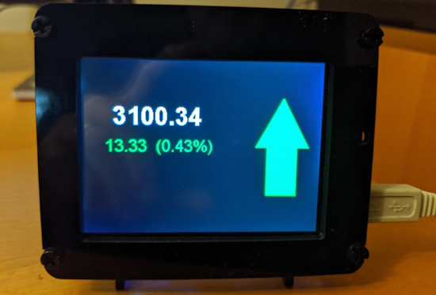](https://www.mcgurrin.info/robots/41333/)

An update to a multifunction display using PyPortal and CircuitPython - [mcgurrin.info](https://www.mcgurrin.info/robots/41333/).

[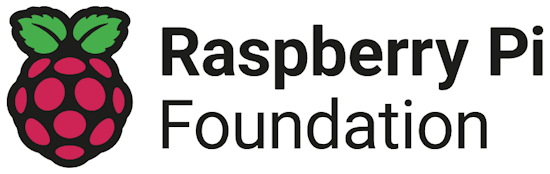](https://www.linkedin.com/posts/we-are-delighted-to-announce-that-mark-ruffo-share-7479901729254465536-dnt0/)

The Raspberry Pi Foundation announced that Mark Ruffo is joining the Raspberry Pi Foundation as the new Vice President of Global Development. In this new role, Mark will lead the development of partnerships with foundations, corporates, and individual philanthropists to advance our global mission to democratise computing and AI education for all young people - [LinkedIn](https://www.linkedin.com/posts/we-are-delighted-to-announce-that-mark-ruffo-share-7479901729254465536-dnt0/).

[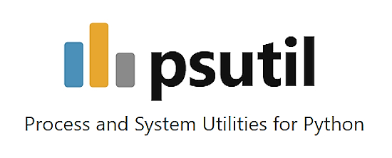](https://github.com/giampaolo/psutil)

psutil – process and system utilities for Python - [GitHub](https://github.com/giampaolo/psutil). Via [Adafruit Blog](https://blog.adafruit.com/2026/07/06/psutil-process-and-system-utilities-for-python/).

[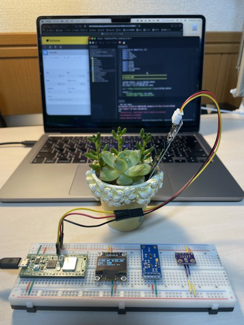](https://x.com/Masaki_Mizutani/status/2075238218350612617)

A system for growing and managing succulents where it displays measurement values from barometric pressure/temperature and humidity sensors, illuminance sensors, and soil sensors on an OLED display, while sending the data to kintone every 10 minutes - [X](https://x.com/Masaki_Mizutani/status/2075238218350612617). (Japanese)

Running Python Locally in a Sandbox: how can you create a sandboxed local environment using WASM and MicroPython. Christopher Trudeau is back on the show this week with another batch of PyCoder's Weekly articles and projects - [Real Python Podcast](https://realpython.com/podcasts/rpp/301/).

[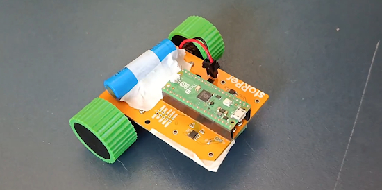](https://mastodon.social/@concretedog/116885419534751494)

On Mastodon, @concretedog writes: "The little creative Stem club I run with a bunch of high energy 8-10 yr olds, they finished off their 3 wheel variant (aka cheap!) StoRPer robot builds and got them moving with MicroPython on the Raspberry Pi Pico, The stoRPer project originally was part of the KiCad book I wrote for The Official raspberry Pi Magazine and its ace, there are lots of them in different guises out in the world - [Mastodon](https://mastodon.social/@concretedog/116885419534751494).

text - [site](url).

text - [site](url).

text - [site](url).

text - [site](url).

[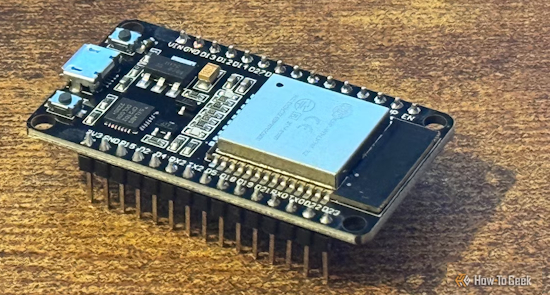](https://www.howtogeek.com/esp32-projects-dont-require-soldering/)

Five ESP32 projects that don't require any soldering - [How-To Geek](https://www.howtogeek.com/esp32-projects-dont-require-soldering/).

text - [site](url).

text - [site](url).

Pick your Python accelerator - [InfoWorld](https://www.infoworld.com/article/4195237/pick-your-python-accelerator.html).

## New

[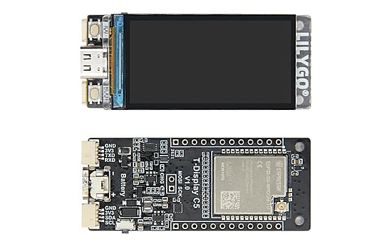](https://linuxgizmos.com/lilygo-showcases-new-iot-devices-with-esp32-c5-and-nordic-nrf52840-mcus/)

The LILYGO T-Display C5 is built around the ESP32-C5, providing 2.4GHz and 5GHz dual-band Wi-Fi 6 along with Bluetooth Low Energy 5 support. The board includes 16MB of flash, 8MB of PSRAM, and support for development through the Arduino IDE and ESP-IDF. The board integrates a 1.9-inch ST7789 IPS LCD with a 170 × 320 resolution. The board also includes USB Type-C, Qwiic, a battery connector, nd an external antenna connector for WiFi - [LinuxGizmos](https://linuxgizmos.com/lilygo-showcases-new-iot-devices-with-esp32-c5-and-nordic-nrf52840-mcus/).

[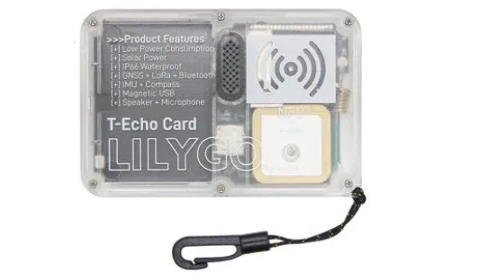](https://linuxgizmos.com/lilygo-showcases-new-iot-devices-with-esp32-c5-and-nordic-nrf52840-mcus/)

The LILYGO T-Echo Card is based on the Nordic nRF52840 microcontroller with 1MB flash and 256kB RAM. Wireless support includes Bluetooth 5, Bluetooth Mesh, Thread, Zigbee, ANT, NFC, and 802.15.4, while long-range connectivity is handled by an SX1262 LoRa transceiver supporting the 400–520MHz and 830–945MHz ranges. It has a 0.42-inch SSD1315 OLED with a 72 × 40 resolution, along with an L76K GNSS module supporting GNNS. It also features an ICM20948 low-power 9-axis motion sensor with gyroscope, accelerometer, compass, and DMP support - [LinuxGizmos](https://linuxgizmos.com/lilygo-showcases-new-iot-devices-with-esp32-c5-and-nordic-nrf52840-mcus/).

## New Boards Supported by CircuitPython

The number of supported microcontrollers and Single Board Computers (SBC) grows every week. This section outlines which boards have been included in CircuitPython or added to [CircuitPython.org](https://circuitpython.org/).

This week there were (#/no) new boards added:

- [Board name](url)
- [Board name](url)
- [Board name](url)

*Note: For non-Adafruit boards, please use the support forums of the board manufacturer for assistance, as Adafruit does not have the hardware to assist in troubleshooting.*

Looking to add a new board to CircuitPython? It's highly encouraged! Adafruit has four guides to help you do so:

- [How to Add a New Board to CircuitPython](https://learn.adafruit.com/how-to-add-a-new-board-to-circuitpython/overview)
- [How to add a New Board to the circuitpython.org website](https://learn.adafruit.com/how-to-add-a-new-board-to-the-circuitpython-org-website)
- [Adding a Single Board Computer to PlatformDetect for Blinka](https://learn.adafruit.com/adding-a-single-board-computer-to-platformdetect-for-blinka)
- [Adding a Single Board Computer to Blinka](https://learn.adafruit.com/adding-a-single-board-computer-to-blinka)

## New Adafruit Learning System Guides

[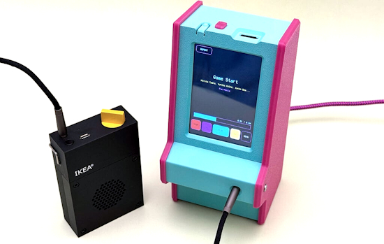](https://learn.adafruit.com/guides/latest)

The [Adafruit Learning System](https://learn.adafruit.com/) has over 3,200 free guides for learning skills and building projects including using Python.

[CircuitPython Chiptune Player](https://learn.adafruit.com/circuitpython-chiptune-player) from [Liz Clark](https://learn.adafruit.com/u/BlitzCityDIY) and the [Ruiz Brothers](https://learn.adafruit.com/u/pixil3d)

[Make Beautiful Fritzing Parts with kicad2fritzing](https://learn.adafruit.com/make-beautiful-fritzing-parts-with-kicad2fritzing) from [Liz Clark](https://learn.adafruit.com/u/BlitzCityDIY)

[I2S Microphones with CircuitPython](https://learn.adafruit.com/i2s-microphones-with-circuitpython) from [Tim C](https://learn.adafruit.com/u/Foamyguy)

## CircuitPython Libraries

The CircuitPython library numbers are continually increasing, while existing ones continue to be updated. Here we provide library numbers and updates!

To get the latest Adafruit libraries, download the [Adafruit CircuitPython Library Bundle](https://circuitpython.org/libraries). To get the latest community contributed libraries, download the [CircuitPython Community Bundle](https://circuitpython.org/libraries).

If you'd like to contribute to the CircuitPython project on the Python side of things, the libraries are a great place to start. Check out the [CircuitPython.org Contributing page](https://circuitpython.org/contributing). If you're interested in reviewing, check out Open Pull Requests. If you'd like to contribute code or documentation, check out Open Issues. We have a guide on [contributing to CircuitPython with Git and GitHub](https://learn.adafruit.com/contribute-to-circuitpython-with-git-and-github), and you can find us in the #help-with-circuitpython and #circuitpython-dev channels on the [Adafruit Discord](https://adafru.it/discord).

You can check out this [list of all the Adafruit CircuitPython libraries and drivers available](https://github.com/adafruit/Adafruit_CircuitPython_Bundle/blob/master/circuitpython_library_list.md). 

The current number of CircuitPython libraries is **572** (Adafruit 395, community 177).

**New Libraries**
 
There are no new CircuitPython libraries this week.
 
**Updated Libraries**
 
Here are this week's updated CircuitPython libraries:
 
* [adafruit/Adafruit_CircuitPython_BMP5xx](https://github.com/adafruit/Adafruit_CircuitPython_BMP5xx)
* [adafruit/Adafruit_CircuitPython_SCD30](https://github.com/adafruit/Adafruit_CircuitPython_SCD30)
* [adafruit/Adafruit_CircuitPython_STCC4](https://github.com/adafruit/Adafruit_CircuitPython_STCC4)
* [relic-se/CircuitPython_Synthiota](https://github.com/relic-se/CircuitPython_Synthiota)

## What’s the CircuitPython team up to this week?

What is the team up to this week? Let’s check in:

**Dan**

Last week I fixed more bugs in preparation for the CircuitPython 10.3.0 release. The biggest fix was a rewrite of BLE discovery on Espressif, to move CircuitPython object allocations out of BLE event callbacks, which were not running in the main CircuitPython task.

**Tim**

The CircuitPython I2S microphones guide I mentioned last week is published now. I have been continuing to work on audio and related things. This week I added support for the `sdioio` module in `raspberrypi` port. It unlocks faster sd card writes that allow recording basic audio from an I2S microphone into a wave file on sd card to work on Raspberry Pi microcontrollers. I also started working on an `AudioWriter` class that acts as an audio sink at the end of an effects chain, sending the audio to a wav file instead of a speaker like `AudioOut` and other existing sinks. This class makes it possible to save `synthio` generated audio to a file directly, as well as save microphone input that has been passed thru an effects chain. It's asynchronous, so Python code can be doing other things during the recording.

**Scott**

[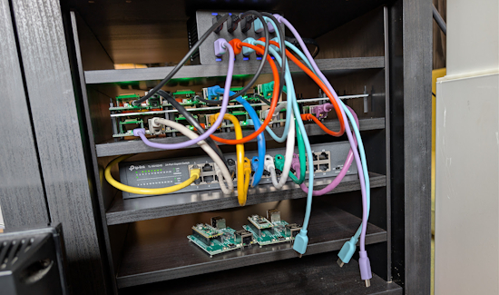](https://www.circuitpython.org/)

This week I've been trying (and failing) to get settled into a groove. My main work has been to get the hardware in the loop (HIL) boards going. I've got them in their space now and am working to get the software usable. The next rev of the Gameboy PCBs comes today and I've also tested the trackball PCB to the point where it needs a revision too. Next week I'll keep working on the HIL system.

**Liz**

This week I documented a [kicad2fritzing tool](https://learn.adafruit.com/make-beautiful-fritzing-parts-with-kicad2fritzing) that I worked on. I use the [eagle2fritzing tool](https://learn.adafruit.com/make-beautiful-fritzing-parts-with-eagle2fritzing-brd2svg/overview) every time I make a Fritzing part, which is every time I work on a new product guide. I wanted to have an equivalent tool for KiCad that had the same workflow. The tool is written in Python, so it's easy to setup and run.

## Upcoming Events

[EuroPython 2026](https://ep2026.europython.eu/) is coming to Kraków, Poland 13-19 July, 2026. Join thousands of Python enthusiasts for a week of learning, networking, and community.

The next MicroPython Meetup in Melbourne will be on July 22 – [Luma](https://luma.com/micropython). You can see recordings of previous meetings on [YouTube](https://www.youtube.com/@MicroPythonOfficial). 

**Other Events This Year**

* [PyOhio 2026](https://www.pyohio.org/2026/) is from 25 July through 26 July, 2026 this year in Cleveland, USA.
* [HOPE 26 Conference](https://store.2600.com/products/tickets-to-hope-26) is from August 14th through 16th at the New Yorker Hotel, NY, NY.
* [PyCon AU 2026](https://2026.pycon.org.au/) will be 26 Aug. 2026 – 30 Aug. 2026 in Brisbane, Australia.
* [PyConZA 2026](https://za.pycon.org/), South Africa's Python conference, will be 14–18 Oct at Belmont Square, Cape Town, South Africa.
* [Espressif DevCon 2026](https://devcon.espressif.com/) will be November 3-4 in Milan, Italy  and online.

If you know of virtual events or upcoming events, please let us know via email to cpnews(at)adafruit(dot)com.

## Latest Releases

CircuitPython's stable release is [10.2.1](https://github.com/adafruit/circuitpython/releases/latest) and its unstable release is [10.3.0-alpha.3](https://github.com/adafruit/circuitpython/releases). New to CircuitPython? Start with our [Welcome to CircuitPython Guide](https://learn.adafruit.com/welcome-to-circuitpython).

[20260710](https://github.com/adafruit/Adafruit_CircuitPython_Bundle/releases/latest) is the latest Adafruit CircuitPython library bundle.

[20260709](https://github.com/adafruit/CircuitPython_Community_Bundle/releases/latest) is the latest CircuitPython Community library bundle.

[v1.28.0](https://micropython.org/download) is the latest MicroPython release. Documentation for it is [here](http://docs.micropython.org/en/latest/pyboard/).

[3.14.6](https://www.python.org/downloads/) is the latest Python release. The latest pre-release version is [3.15.0b3](https://www.python.org/download/pre-releases/).

[4,530 Stars](https://github.com/adafruit/circuitpython/stargazers) Like CircuitPython? [Star it on GitHub!](https://github.com/adafruit/circuitpython)

## Call for Help -- Translating CircuitPython is now easier than ever

[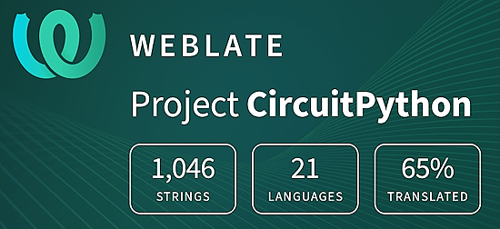](https://hosted.weblate.org/engage/circuitpython/)

One important feature of CircuitPython is translated control and error messages. With the help of fellow open source project [Weblate](https://weblate.org/), we're making it even easier to add or improve translations. 

Sign in with an existing account such as GitHub, Google or Facebook and start contributing through a simple web interface. No forks or pull requests needed! As always, if you run into trouble join us on [Discord](https://adafru.it/discord), we're here to help.

## NUMBER Thanks

The Adafruit Discord community, where we do all our CircuitPython development in the open, reached over NUMBER humans - thank you! Adafruit believes Discord offers a unique way for Python on hardware folks to connect. Join today at [https://adafru.it/discord](https://adafru.it/discord).

## ICYMI - In case you missed it

Python on hardware is the Adafruit Python video-newsletter-podcast! The news comes from the Python community, Discord, Adafruit communities and more and is broadcast on ASK an ENGINEER Wednesdays. The complete Python on Hardware weekly videocast [playlist is here](https://www.youtube.com/playlist?list=PLjF7R1fz_OOXRMjM7Sm0J2Xt6H81TdDev). The video podcast is on [iTunes](https://itunes.apple.com/us/podcast/python-on-hardware/id1451685192?mt=2), [YouTube](http://adafru.it/pohepisodes), [Instagram](https://www.instagram.com/adafruit/channel/), and [XML](https://itunes.apple.com/us/podcast/python-on-hardware/id1451685192?mt=2).

[The weekly community chat on Adafruit Discord server CircuitPython channel - Audio / Podcast edition](https://itunes.apple.com/us/podcast/circuitpython-weekly-meeting/id1451685016) - Audio from the Discord chat space for CircuitPython, meetings are usually Mondays at 2pm ET, this is the audio version on [iTunes](https://itunes.apple.com/us/podcast/circuitpython-weekly-meeting/id1451685016), Pocket Casts, [Spotify](https://adafru.it/spotify), and [XML feed](https://adafruit-podcasts.s3.amazonaws.com/circuitpython_weekly_meeting/audio-podcast.xml).

## Contribute

The CircuitPython Weekly Newsletter is a CircuitPython community-run newsletter emailed every Monday. To contribute your content, please email your news to cpnews (at) adafruit (dot) com with information and link(s) to your content. 

Join the Adafruit [Discord](https://adafru.it/discord) or [post to the forum](https://forums.adafruit.com/viewforum.php?f=60) if you have questions.
