- [ ] Library and info updates
- [ ] change date
- [ ] update title
- [ ] Feature story
- [ ] Update  for images
- [ ] Update ICYDNCI
- [ ] All images 550w max only
- [ ] Link "View this email in your browser."

News Sources

- [Adafruit Playground](https://adafruit-playground.com/)
- Twitter: [CircuitPython](https://twitter.com/search?q=circuitpython&src=typed_query&f=live), [MicroPython](https://twitter.com/search?q=micropython&src=typed_query&f=live) and [Python](https://twitter.com/search?q=python&src=typed_query)
- [Raspberry Pi News](https://www.raspberrypi.com/news/), [Pi Foundation](https://www.raspberrypi.org/blog/)
- Mastodon [CircuitPython](https://mastodon.social/tags/CircuitPython) and [MicroPython](https://mastodon.social/tags/MicroPython)
- BlueSky [CircuitPython](https://bsky.app/search?q=circuitpython), [MicroPython](https://bsky.app/search?q=micropython), [Raspberry Pi](https://bsky.app/search?q=raspberry+pi)
- [Google News Python](https://news.google.com/topics/CAAqIQgKIhtDQkFTRGdvSUwyMHZNRFY2TVY4U0FtVnVLQUFQAQ?hl=en-US&gl=US&ceid=US%3Aen), [Infoworld](https://www.infoworld.com/)
- YouTube: [CircuitPython](https://www.youtube.com/results?search_query=circuitpython&sp=CAISBAgDEAE%253D), [MicroPython](https://www.youtube.com/results?search_query=micropython&sp=CAISBAgDEAE%253D), [Prof Gallaugher](https://www.youtube.com/@BuildWithProfG/videos)
- [maker.io Python](https://www.digikey.com/en/maker/search-results?s=createdDate&t=python)
- [hackster.io CircuitPython](https://www.hackster.io/search?q=circuitpython&i=projects&sort_by=most_recent) and [MicroPython](https://www.hackster.io/search?q=micropython&i=projects&sort_by=most_recent)
- Instructables: [CircuitPython](https://www.instructables.com/search/?q=circuitpython&projects=all&sort=Newest), [MicroPython](https://www.instructables.com/search/?q=micropython&projects=all&sort=Newest), [Raspberry Pi Python](https://www.instructables.com/search/?q=raspberry+pi+python&projects=all&sort=Newest)
- [hackaday CircuitPython](https://hackaday.com/blog/?s=circuitpython) and [MicroPython](https://hackaday.com/blog/?s=micropython)
- [python.org](https://www.python.org/)
- [Python Insider - dev team blog](https://blog.python.org/)
- Individuals: [bret.dk](https://bret.dk/), [Jeff Geerling](https://www.jeffgeerling.com/blog), [Yakroo](https://x.com/Yakroo5077), [coXXect](https://coxxect.blogspot.com/)
- Tom's Hardware: [CircuitPython](https://www.tomshardware.com/search?searchTerm=circuitpython&articleType=all&sortBy=publishedDate) and [MicroPython](https://www.tomshardware.com/search?searchTerm=micropython&articleType=all&sortBy=publishedDate) and [Raspberry Pi](https://www.tomshardware.com/search?searchTerm=raspberry%20pi&articleType=all&sortBy=publishedDate)
- [hackaday.io newest projects MicroPython](https://hackaday.io/projects?tag=micropython&sort=date) and [CircuitPython](https://hackaday.io/projects?tag=circuitpython&sort=date)
- hackaday.io - [CircuitPython](https://hackaday.io/search?term=circuitpython) and [MicroPython](https://hackaday.io/search?term=micropython)
- [MicroPython Meeting](https://luma.com/micropython?k=c)

View this email in your browser. **Warning: Flashing Imagery**

Welcome to the latest Python on Microcontrollers newsletter! *insert 2-3 sentences from editor (what's in overview, banter)* - *Anne Barela, Editor*

We're on [Discord](https://discord.gg/HYqvREz), [Twitter/X](https://twitter.com/search?q=circuitpython&src=typed_query&f=live), [BlueSky](https://bsky.app/profile/circuitpython.org) and for past newsletters - [view them all here](https://www.adafruitdaily.com/category/circuitpython/). If you're reading this on the web, please [subscribe here](https://www.adafruitdaily.com/). Here's the news this week:

## AMYboard - a MicroPython-based Eurorack Module

[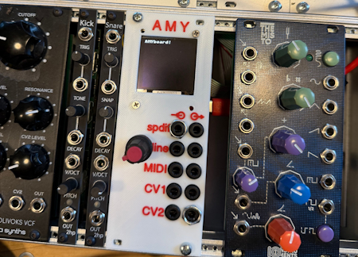](https://www.amyboard.com/)

AMYboard is a complete audio synthesizer for US $29.90 that can be at least three things: a Synthesizer, Dev Board, and Eurorack module. It's open source, has a STEMMA QT/qwiic port for expansion, and ships with MicroPython firmware - [AMYboard](https://www.amyboard.com/). Via [BlueSky](https://bsky.app/profile/johnnytacos.bsky.social/post/3mqks4bfptk23).

## MicroPython on the Super Nintendo

[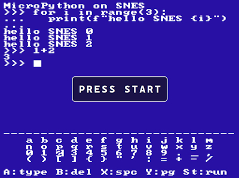](https://fabian-kuebler.com/posts/fable-python-snes/)

Python on the SNES has been a dream of Fabian Kübler for a long time. The Claude Fable 5 came out, and Fabian thought: this would make a great benchmark for the model. Porting MicroPython to the SNES: a 3.58 MHz CPU, 128 KB of RAM, 16-bit int, and a niche C compiler - [Fabian Kübler](https://fabian-kuebler.com/posts/fable-python-snes/) and [GitHub](https://github.com/FabianKuebler/micropython-snes). Via [Adafruit Blog](https://blog.adafruit.com/2026/07/13/micropython-on-the-super-nintendo/).

## Feature

text - [site](url).

## Feature

text - [site](url).

## Raspberry Pi Book Humble Bundle

[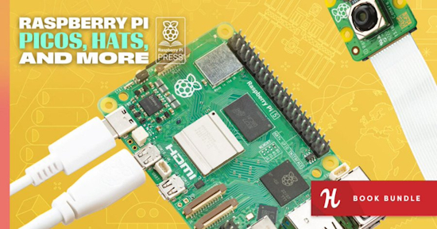](https://www.raspberrypi.com/news/name-your-own-price-for-this-raspberry-pi-press-book-bundle/)

Humble Bundle is once again letting you name your own price for a bundle of Raspberry Pi Press e-books. With this book bundle, you’ll receive DRM-free electronic copies of a selection of Pi titles. What’s more, your purchase will support the Raspberry Pi Foundation‘s work to help young people realise their potential through computing. 

Check out the Humble Tech Book Bundle: Raspberry Pi Picos, HATs, and More. This selection of books gets you up and running with Raspberry Pi computers, microcontrollers, and accessories. It’s available from 11 July to 1 August at 7pm BST (11am PT) - [Raspberry Pi News](https://www.raspberrypi.com/news/name-your-own-price-for-this-raspberry-pi-press-book-bundle/). Via [X](https://x.com/Raspberry_Pi/status/2076731504558735696).

## Seven Python Frameworks for Orchestrating Local AI Agents

Thhere are multiple ways to build, coordinate, and run AI agents on local machines. Here are seven Python tools to do this - [KDnuggets](https://www.kdnuggets.com/7-python-frameworks-for-orchestrating-local-ai-agents).

## This Week's Python Streams

Python on Hardware is all about building a cooperative ecosphere which allows contributions to be valued and to grow knowledge. Below are the streams within the last week focusing on the community.

**CircuitPython Deep Dive Stream**

[Last Friday](), Scott streamed work on .

You can see the latest video and past videos on the Adafruit YouTube channel under the Deep Dive playlist - [YouTube](https://www.youtube.com/playlist?list=PLjF7R1fz_OOXBHlu9msoXq2jQN4JpCk8A).

**CircuitPython Parsec**

John Park’s CircuitPython Parsec this week is on  - [Adafruit Blog]() and [YouTube]().

Catch all the episodes in the [YouTube playlist](https://www.youtube.com/playlist?list=PLjF7R1fz_OOWFqZfqW9jlvQSIUmwn9lWr).

**Deep Dive with Tim**

[Last week](), Tim streamed work on .

You can see the latest video and past videos on the Adafruit YouTube channel under the Deep Dive playlist - [YouTube](https://www.youtube.com/playlist?list=PLjF7R1fz_OOWFqZfqW9jlvQSIUmwn9lWr).

**The CircuitPython Show**

The CircuitPython Show will return Monday, July 27th - [BlueSky](https://bsky.app/profile/circuitpythonshow.com/post/3mqpky37ths2r).

**CircuitPython Weekly Meeting**

CircuitPython Weekly Meeting for {date} ([notes](https://github.com/adafruit/adafruit-circuitpython-weekly-meeting/blob/main/2026/2026-07-13.md)) [on YouTube](https://youtu.be/7LSWD2pDHOY).

## Project of the Week: FlightScnr Pi

[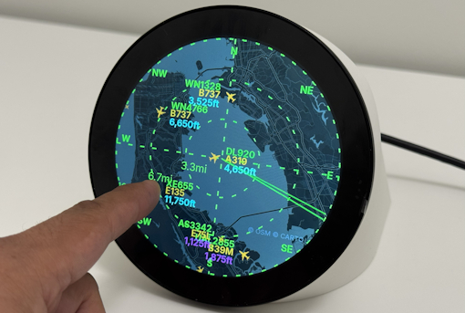](https://github.com/yashmulgaonkar/FlightScnr_Pi)

FlightScnr Pi by Yash Mulgaonkar shows live aircraft around your pre set location on a circular radar, with rich flight details when you tap a plane. It combines FlightRadar24 (FR24), live positions from adsb.fi (free cloud feed — no local ADS-B dongle), Tomorrow.io weather, and optional AirLabs schedule data. Settings, API keys, tracking, and updates are managed through a local web portal. No SSH required for day-to-day use. It uses a touch 4" display connected to a Raspberry Pi programmed in Python - [GitHub](https://github.com/yashmulgaonkar/FlightScnr_Pi).

## Popular Last Week

What was the most popular, most clicked link, in [last week's newsletter](https://www.adafruitdaily.com/2026/07/13/python-on-microcontrollers-newsletter-circuitpython-and-micropython-ides-grow-kattni-rembor-chairing-pycon-us-and-more/)? [Five things to build with the $4 chip that's outselling the Raspberry Pi](https://www.makeuseof.com/things-build-chip-outselling-raspberry-pi/).

Did you know you can read past issues of this newsletter in the Adafruit Daily Archive? [Check it out](https://www.adafruitdaily.com/category/circuitpython/).

## New Notes from Adafruit Playground

[Adafruit Playground](https://adafruit-playground.com/) is a new place for the community to post their projects and other making tips/tricks/techniques. Ad-free, it's an easy way to publish your work in a safe space for free.

text - [Adafruit Playground](url).

text - [Adafruit Playground](url).

text - [Adafruit Playground](url).

## News From Around the Web

[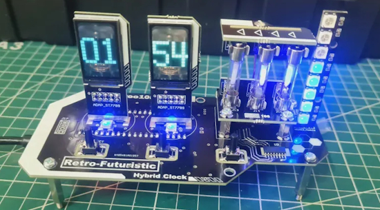](https://www.instructables.com/Retro-Futuristic-Hybrid-Clock/)

A retro-futuristic hybrid clock using a Raspberry Pi Pico and CircuitPython - [Instructables](https://www.instructables.com/Retro-Futuristic-Hybrid-Clock/), [GitHub](https://github.com/YakrooThai/Contests/blob/main/Instructables/Retro-Futuristic-Clock.py), and [YouTube](https://youtu.be/uDJ_qVblTNQ?si=5L53nVW6C8RBSkp8).

[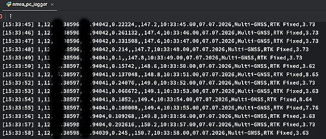](https://github.com/octaprog7/light-nmea-micropython)

LightNMEA is an extremely fast, zero-dependency, single-pass NMEA 0183 parser with minimal memory allocation, written specifically for MicroPython and Python (CPython). Designed for 32-bit microcontrollers (ESP32, STM32, RP2040) working with high-rate GNSS receivers (10-50 Hz multi-constellation GPS / GLONASS / BeiDou / Galileo modules) - [GitHub](https://github.com/octaprog7/light-nmea-micropython). Via [Adafruit Blog](https://blog.adafruit.com/2026/07/13/lightnmea-a-fast-gnss-parser-with-minimal-memory-specifically-for-micropython-and-python/).

**Special Section on AI and Programming**

What a Raspberry Pi can (and can’t) do with AI - [RaspberryTips](https://raspberrytips.com/can-raspberry-pi-run-ai/).

AI didn’t make programming easier. It just made it differently difficult. The future of software development will belong to those who can think clearly at scale, maintain durable mental models amid rapid change, and integrate machine-generated output into human-directed intent - [Communications of the ACM](https://cacm.acm.org/opinion/ai-didnt-make-programming-easier-it-just-made-it-differently-difficult/).

Chasing new skills, going back to basics and pushing for collective action: how software engineers are adapting to AI - [The Guardian](https://www.theguardian.com/technology/ng-interactive/2026/jul/12/software-developers-engineers-ai).

[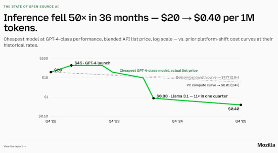](https://x.com/clcoding/status/2077519828361884158)

Running GPT-4-level AI used to cost $20 per million tokens. It now costs $0.40. That's a 50× drop in 36 months — faster than the rate cloud compute fell, faster than the rate bandwidth costs collapsed in the dotcom era. So what's the big takeaway? Commodity inputs do not hold margins. **Open source AI can no longer be dismissed as a side quest** — it now rivals the biggest players in the field. But cheap tokens aren't what moved the story. Capable ones did. When every model clears the bar for the job in front of it, value moves up, and the contest is now one layer up, at the agentic harness above the model - [X](https://x.com/clcoding/status/2077519828361884158) and [stateofopensource.ai](https://stateofopensource.ai/).

**Back to Projects and News**

[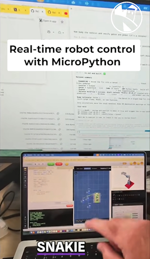](https://www.youtube.com/watch?v=nLVdqmJmUMU)

3D printed robot arm control with servo using an RP2040 and MicroPython - [YouTube](https://www.youtube.com/watch?v=nLVdqmJmUMU). Via [X](https://x.com/kevsmac/status/2076547049709830336).

[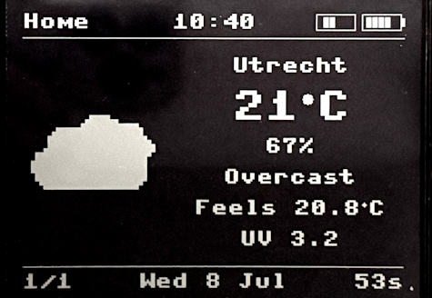](https://developer-service.blog/building-a-weather-home-screen-on-a-reflective-lcd-micropython-esp32-s3/)

Building a weather home screen on a reflective LCD display using MicroPython on an ESP32-S3 - [Developer Service](https://developer-service.blog/building-a-weather-home-screen-on-a-reflective-lcd-micropython-esp32-s3/).

Jeff Epler contributes to CircuuitPython with two pull requests - [Mastodon](https://mastodon.social/@stylus@social.afront.org/116913038947371069).

> The first PR makes `memorymap` actually usable for bulk reading GPIOs without creating GC garbage, and the second one fixes `natmod` support, allowing C code to be loaded into RAM at runtime and called from Python (with a lot of constraints inherited from MicroPython).

[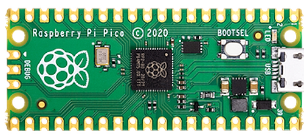](url)

An update to `picorescue`, a tool for recovering FAT/LittleFS/ROMFS filesystems from a Pico MicroPython build - [GitHub](https://github.com/Gadgetoid/picorescue/blob/main/CHANGELOG.md). Via [BlueSky](https://bsky.app/profile/gadgetoid.com/post/3mq5eisctfk2s).

text - [site](url).

text - [site](url).

text - [site](url).

text - [site](url).

text - [site](url).

Python is so slow. Can Julia solve the two-language problem? By some benchmarks, Julia code can run 10x to 1,000x faster than Python, but there’s a reason it’s not a very popular programming language - [Wired](https://www.wired.com/story/python-is-so-slow-can-julia-solve-the-two-language-problem/).

[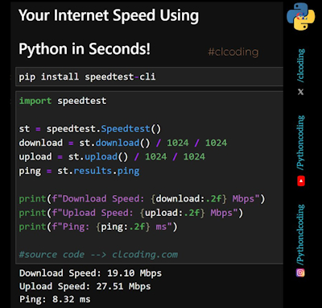](https://x.com/clcoding/status/2077519828361884158)

Check your internet speed using Python - [X](https://x.com/clcoding/status/2077519828361884158).

[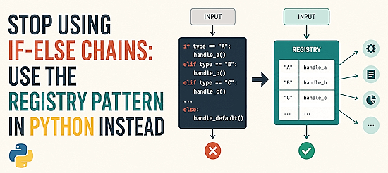](https://www.kdnuggets.com/stop-using-if-else-chains-use-the-registry-pattern-in-python-instead)

Stop using if-else chains: use the registry pattern in Python instead - [KDnuggets](https://www.kdnuggets.com/stop-using-if-else-chains-use-the-registry-pattern-in-python-instead).

## New

[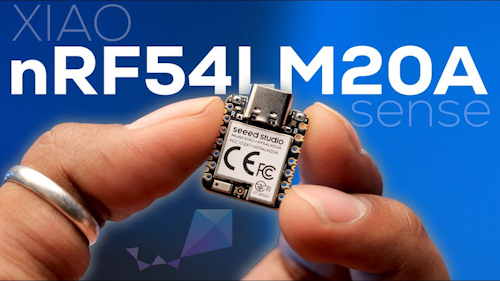](https://www.youtube.com/watch?v=1t_G5PxQcpI)

The brand new Seeed Studio XIAO nRF54LM20A Sense — the most connectivity-packed XIAO board yet, with BLE 6.0, Matter, Thread, Zigbee, NFC, Amazon Sidewalk, and a massive 28 GPIO pins in a tiny 21x17.8mm footprint - [YouTube](https://www.youtube.com/watch?v=1t_G5PxQcpI). Via [X](https://x.com/seeedstudio/status/2077080038227456411).

[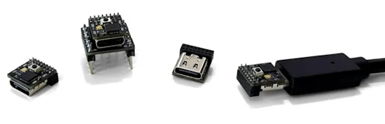](https://hackaday.com/2026/07/15/pinch-puts-an-arduino-on-a-usb-c-connector/)

The pinch from moddo is advertised as “The World’s Smallest 32-Bit Arduino-Compatible Board.” Coming from something like an ESP32, the biggest adjustment will probably be working around the relatively limited specs of the SAMD11. The ARM Cortex-M0+ under the hood tops out at 48 MHz, and there’s only 4 KB SRAM and 16 KB flash (of which the bootloader eats up 4 KB) - [Hackaday](https://hackaday.com/2026/07/15/pinch-puts-an-arduino-on-a-usb-c-connector/) and [Pinch](https://moddo.io/pages/pinch).

## New Boards Supported by CircuitPython

The number of supported microcontrollers and Single Board Computers (SBC) grows every week. This section outlines which boards have been included in CircuitPython or added to [CircuitPython.org](https://circuitpython.org/).

This week there were (#/no) new boards added:

- [Board name](url)
- [Board name](url)
- [Board name](url)

*Note: For non-Adafruit boards, please use the support forums of the board manufacturer for assistance, as Adafruit does not have the hardware to assist in troubleshooting.*

Looking to add a new board to CircuitPython? It's highly encouraged! Adafruit has four guides to help you do so:

- [How to Add a New Board to CircuitPython](https://learn.adafruit.com/how-to-add-a-new-board-to-circuitpython/overview)
- [How to add a New Board to the circuitpython.org website](https://learn.adafruit.com/how-to-add-a-new-board-to-the-circuitpython-org-website)
- [Adding a Single Board Computer to PlatformDetect for Blinka](https://learn.adafruit.com/adding-a-single-board-computer-to-platformdetect-for-blinka)
- [Adding a Single Board Computer to Blinka](https://learn.adafruit.com/adding-a-single-board-computer-to-blinka)

## New Adafruit Learning System Guides

[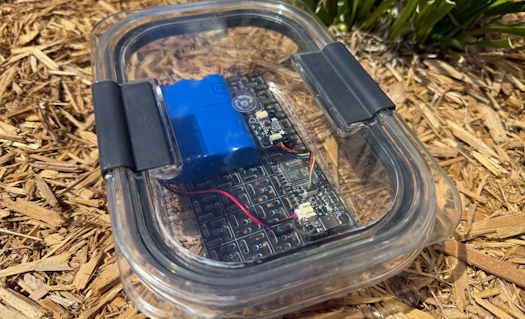](https://learn.adafruit.com/guides/latest)

The [Adafruit Learning System](https://learn.adafruit.com/) has over 3,200 free guides for learning skills and building projects including using Python.

[title](url) from [name](url)

[title](url) from [name](url)

[title](url) from [name](url)

## Updated Learn Guides

[title](url)

## CircuitPython Libraries

The CircuitPython library numbers are continually increasing, while existing ones continue to be updated. Here we provide library numbers and updates!

To get the latest Adafruit libraries, download the [Adafruit CircuitPython Library Bundle](https://circuitpython.org/libraries). To get the latest community contributed libraries, download the [CircuitPython Community Bundle](https://circuitpython.org/libraries).

If you'd like to contribute to the CircuitPython project on the Python side of things, the libraries are a great place to start. Check out the [CircuitPython.org Contributing page](https://circuitpython.org/contributing). If you're interested in reviewing, check out Open Pull Requests. If you'd like to contribute code or documentation, check out Open Issues. We have a guide on [contributing to CircuitPython with Git and GitHub](https://learn.adafruit.com/contribute-to-circuitpython-with-git-and-github), and you can find us in the #help-with-circuitpython and #circuitpython-dev channels on the [Adafruit Discord](https://adafru.it/discord).

You can check out this [list of all the Adafruit CircuitPython libraries and drivers available](https://github.com/adafruit/Adafruit_CircuitPython_Bundle/blob/master/circuitpython_library_list.md). 

The current number of CircuitPython libraries is **###**!

**New Libraries**

Here are this week's new CircuitPython libraries:

* [library](url)

**Updated Libraries**

Here are this week's updated CircuitPython libraries:

* [library](url)

## What’s the CircuitPython team up to this week?

What is the team up to this week? Let’s check in:

**Dan**

I've been continuing to work on bugs and features for CircuitPython 10.3.0. I added an interesting new feature that allows you to disable the CIRCUITPY USB drive after `code.py` has started running. (It's reported as "not ready" to the host computer, which then unmounts it.) Your code can then write to files on the CIRCUITPY drive safely. An editor can then also use the REPL to read and write files, as is done already for boards that don't have native USB. You can re-enable the drive later, in the same session.

**Tim**

The `AudioFileWriter` module that I mentioned last week is completed and merged now. The next thing I worked on is a `GranularPitchShift` module that uses a granular synthesis technique for changing the pitch of input audio. It produces a different effect, and has a few additional configuration knobs compared to the existing `PitchShift`. As an initial project to use `GranularPitchShift` on, I am making a basic sampler keyboard project that is inspired by the Cassio SK-1. There is a microphone to record a sample with, the keys on the keyboard each play the sample shifted up or down in pitch compared to the original. It will also support automated playback of a midi file.

**Scott**

This week I've been switching between the hardware-in-the-loop software and the software for the GameBoy cart. The HIL software is getting there for the setup webpage but I don't have testing working with it yet. My main focus is the GameBoy. I got a debug PIO running to monitor how well we're responding to the GameBoy. That enabled me to get the whole startup sequence correct. Now I'm reworking the PIO structure to fetch from a modifiable 64k of "cart" autonomously instead of the interrupt and queue approach taken on the SAMD51.

**Liz**

I sent rev B of the Ikea Alpstuga drop-in board to JLCPCB this week. I did some rework on rev A to confirm some issues to fix for rev B. I had the buttons routed incorrectly and all of the LEDs were placed backwards on the board, but the schematic and fab print were correct. I've also started working with folks to prep for CircuitPython Day, which is Friday, August 21st this year.

## Upcoming Events

The next MicroPython Meetup in Melbourne will be on July 22 – [Luma](https://luma.com/micropython). You can see recordings of previous meetings on [YouTube](https://www.youtube.com/@MicroPythonOfficial). 

[PyOhio 2026](https://www.pyohio.org/2026/) is coming to the Cleveland State University Student Center in Cleveland, OH Sat & Sun July 25–26, 2026. Free to attend.

**Other Events This Year**

* [HOPE 26 Conference](https://store.2600.com/products/tickets-to-hope-26) is from August 14th through 16th at the New Yorker Hotel, NY, NY.
* [PyCon AU 2026](https://2026.pycon.org.au/) will be 26 Aug. 2026 – 30 Aug. 2026 in Brisbane, Australia.
* [PyConZA 2026](https://za.pycon.org/), South Africa's Python conference, will be 14–18 Oct at Belmont Square, Cape Town, South Africa.
* [Espressif DevCon 2026](https://devcon.espressif.com/) will be November 3-4 in Milan, Italy  and online.

If you know of virtual events or upcoming events, please let us know via email to cpnews(at)adafruit(dot)com.

## Latest Releases

CircuitPython's stable release is [#.#.#](https://github.com/adafruit/circuitpython/releases/latest) and its unstable release is [#.#.#-##.#](https://github.com/adafruit/circuitpython/releases). New to CircuitPython? Start with our [Welcome to CircuitPython Guide](https://learn.adafruit.com/welcome-to-circuitpython).

[2026####](https://github.com/adafruit/Adafruit_CircuitPython_Bundle/releases/latest) is the latest Adafruit CircuitPython library bundle.

[2026####](https://github.com/adafruit/CircuitPython_Community_Bundle/releases/latest) is the latest CircuitPython Community library bundle.

[v#.#.#](https://micropython.org/download) is the latest MicroPython release. Documentation for it is [here](http://docs.micropython.org/en/latest/pyboard/).

[#.#.#](https://www.python.org/downloads/) is the latest Python release. The latest pre-release version is [#.#.#](https://www.python.org/download/pre-releases/).

[#,### Stars](https://github.com/adafruit/circuitpython/stargazers) Like CircuitPython? [Star it on GitHub!](https://github.com/adafruit/circuitpython)

## Call for Help -- Translating CircuitPython is now easier than ever

[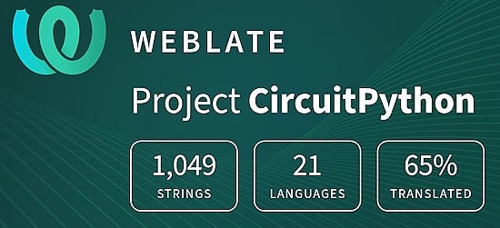](https://hosted.weblate.org/engage/circuitpython/)

One important feature of CircuitPython is translated control and error messages. With the help of fellow open source project [Weblate](https://weblate.org/), we're making it even easier to add or improve translations. 

Sign in with an existing account such as GitHub, Google or Facebook and start contributing through a simple web interface. No forks or pull requests needed! As always, if you run into trouble join us on [Discord](https://adafru.it/discord), we're here to help.

## NUMBER Thanks

The Adafruit Discord community, where we do all our CircuitPython development in the open, reached over NUMBER humans - thank you! Adafruit believes Discord offers a unique way for Python on hardware folks to connect. Join today at [https://adafru.it/discord](https://adafru.it/discord).

## ICYMI - In case you missed it

Python on hardware is the Adafruit Python video-newsletter-podcast! The news comes from the Python community, Discord, Adafruit communities and more and is broadcast on ASK an ENGINEER Wednesdays. The complete Python on Hardware weekly videocast [playlist is here](https://www.youtube.com/playlist?list=PLjF7R1fz_OOXRMjM7Sm0J2Xt6H81TdDev). The video podcast is on [iTunes](https://itunes.apple.com/us/podcast/python-on-hardware/id1451685192?mt=2), [YouTube](http://adafru.it/pohepisodes), [Instagram](https://www.instagram.com/adafruit/channel/), and [XML](https://itunes.apple.com/us/podcast/python-on-hardware/id1451685192?mt=2).

[The weekly community chat on Adafruit Discord server CircuitPython channel - Audio / Podcast edition](https://itunes.apple.com/us/podcast/circuitpython-weekly-meeting/id1451685016) - Audio from the Discord chat space for CircuitPython, meetings are usually Mondays at 2pm ET, this is the audio version on [iTunes](https://itunes.apple.com/us/podcast/circuitpython-weekly-meeting/id1451685016), Pocket Casts, [Spotify](https://adafru.it/spotify), and [XML feed](https://adafruit-podcasts.s3.amazonaws.com/circuitpython_weekly_meeting/audio-podcast.xml).

## Contribute

The CircuitPython Weekly Newsletter is a CircuitPython community-run newsletter emailed every Monday. To contribute your content, please email your news to cpnews (at) adafruit (dot) com with information and link(s) to your content. 

Join the Adafruit [Discord](https://adafru.it/discord) or [post to the forum](https://forums.adafruit.com/viewforum.php?f=60) if you have questions.
