View this email in your browser. **Warning: Flashing Imagery**

Welcome to the latest Python on Microcontrollers newsletter! I'm happy this week there is a plethora of news to write about. The Adafruit team has been busy adding features to CircuitPython including some nice audio functions. I really like a couple of projects I put up top: one to catch if your internet provider is not giving you the speeds you're paying for and the other a bot that sits on your desk and codes its own Python+PyGame programs on its screen. I kind of like the thought of a bot making cute Python programs in front of me, but perhaps on a local model as tokens aren't cheap these days. 

There are more Raspberry Pi happenings and some very nice projects in the issue. Not to worry for MicroPython and CircuitPython, they're in the mix as folks make some nice summer projects. Whether you're back from vacation or will be taking one in August (I see you Europe), I hope your summer is going well. - *Anne Barela, Editor*

We're on [Discord](https://discord.gg/HYqvREz), [Twitter/X](https://twitter.com/search?q=circuitpython&src=typed_query&f=live), [BlueSky](https://bsky.app/profile/circuitpython.org) and for past newsletters - [view them all here](https://www.adafruitdaily.com/category/circuitpython/). If you're reading this on the web, please [subscribe here](https://www.adafruitdaily.com/). Here's the news this week:

## CircuitPython 10.3.0-alpha.4 is Out

CircuitPython 10.3.0-alpha.4 is an alpha release for 10.3.0. Further features, changes, and bug fixes will be added before the final release of 10.3.0 - [Adafruit Blog](https://blog.adafruit.com/2026/07/23/circuitpython-10-3-0-alpha-4-released/) and release notes - [GitHub](https://github.com/adafruit/circuitpython/releases/tag/10.3.0-alpha.4).

**Highlights of this release**

* Add `audiofilewriter`.
* Add `audiodelays.GranularPitchShift`.
* Add `sdioio`, `audiodelays`, `audiofilters`, and `audiofreeverb` on RP2xxx.
* Add `CIRCUITPY_BLE_WORKFLOW`, `CIRCUITPY_SAFE_MODE_DELAY`, and `CIRCUITPY_WIFI_HOSTNAME` to `settings.toml`.
* Add storage.unsafe_disable_usb_drive(), to disable the USB CIRCUITPY drive after the host has mounted it.
* Lower the default WiFi power from 20 dBm to 15 dBm on all boards with chip antennas.
* USB host fixes.
* Espressif BLE fixes.
* ESP-NOW works again on Espressif.
* Update TinyUSB.

## Someone Built a Raspberry Pi Bot to Catch Their ISP Lying About Their Speeds, and You Can Download It Too

[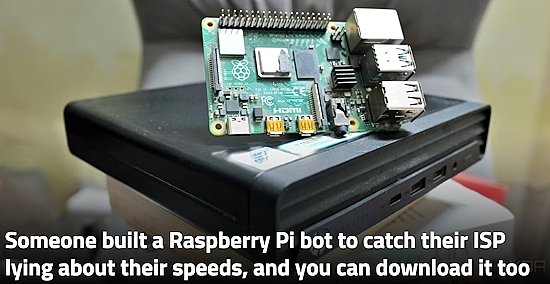](https://www.xda-developers.com/someone-built-a-raspberry-pi-bot-to-catch-their-isp-lying-about-their-speeds-and-you-can-download-it-too/)

It can be annoying when you're convinced that your ISP is throttling your speeds, but it won't own up to its actions. Fortunately, there are ways to double-check if it is actually your ISP that's causing the issues. One person decided to take matters into their own hands with a Raspberry Pi speed tester, and it did, in fact, prove that the ISP was at fault. All in Python - [XDA](https://www.xda-developers.com/someone-built-a-raspberry-pi-bot-to-catch-their-isp-lying-about-their-speeds-and-you-can-download-it-too/) and [GitHub](https://github.com/Role1776/netmon). Via [Reddit](https://www.reddit.com/r/raspberry_pi/comments/1v3t2uc/i_built_a_pi_bot_that_watches_my_home_network_247/).

## nVidia Increases the Price of Jetson Modules and Devkits By Up to 101%

[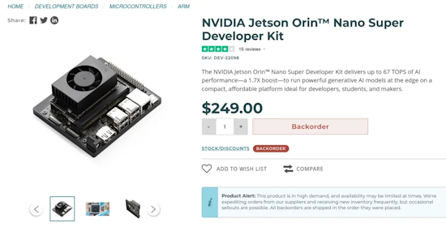](https://www.cnx-software.com/2026/07/22/nvidia-increases-the-price-of-jetson-modules-and-devkits-by-up-to-101/)

A few months ago, nVidia phased out several Jetson modules due to high LPDDR4 prices, and now the company has decided to increase the prices on all its Jetson modules and developer kits by up to 101%. There was no specific announcement about the price, but the updated prices are available in the FAQ on the NVIDIA developer website - [CNX](https://www.cnx-software.com/2026/07/22/nvidia-increases-the-price-of-jetson-modules-and-devkits-by-up-to-101/).

## A New 10″ Raspberry Pi Touch Display 2, Available Now

[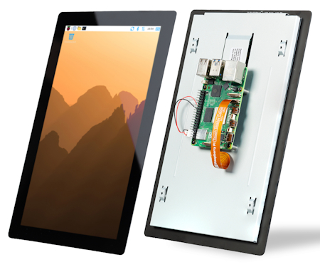](https://www.raspberrypi.com/news/a-new-10-raspberry-pi-touch-display-2-available-now-at-80/)

Raspberry Pi's new 10″ display features a higher 1200×1920–pixel resolution, a more generous 85-degree viewing angle, and a touchscreen controller with support for ten-finger touch, up from five-finger touch in the 5″ and 7″ variants - [Raspberry Pi News](https://www.raspberrypi.com/news/a-new-10-raspberry-pi-touch-display-2-available-now-at-80/) and [Raspberry Pi](https://www.raspberrypi.com/products/touch-display-2/?variant=touch-display-2-10-inch-portrait).

## Snakie Can Now Fully Simulate Electronics

[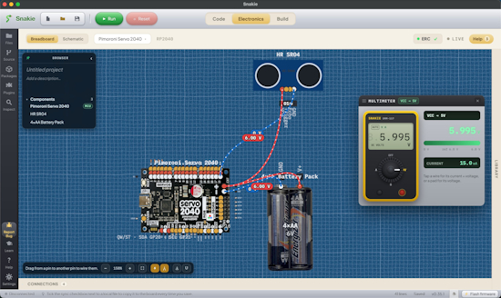](https://app.snakie.org/)

Snakie, the MicroPython development environment, can now fully simulate electronics. "I just need to add a magic smoke animation if you wire it wrong" - [Snakie](https://app.snakie.org/). Via [X](https://x.com/kevsmac/status/2080389781175869593).

## TinyProgrammer Lets You Watch As It Tinkers With Python All Day

[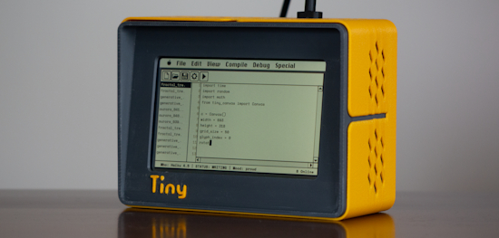](https://magazine.raspberrypi.com/articles/tinyprogrammer)

Cüneyt Özşeker has created TinyProgrammer, a device which goes through a loop of building, checking, running, and watching Python programs. It picks one of 36 programs to build, including Game of Life, Pong, fractals, and 3D plots, and chooses a random large language model (LLM) from those available to build it. The device codes at human speed, with its characters appearing on screen as if typed. Cüneyt has run TinyProgrammer 24/7 on Raspberry Pi Zero 2 W and Raspberry Pi 4. “Any Pi would do just fine,” he says. “If, however, you want to use local LLMs I would suggest 4GB or 8GB models.” - [Raspberry Pi News](https://magazine.raspberrypi.com/articles/tinyprogrammer) and [GitHub](https://github.com/cuneytozseker/TinyProgrammer).

## Microsoft Gives Visual Studio Code a Modern UI Preview

Microsoft has released Visual Studio Code 1.129, introducing an experimental preview of a substantially modernized interface for this most popular cross-platform code editor. Instead of adding a new color theme, Microsoft is updating the entire VS Code workbench, improving the visual separation of panels, editor groups, tabs, menus, and toolbars - [linuxiac](https://linuxiac.com/microsoft-gives-visual-studio-code-a-modern-ui-preview/).

## A New AI Projects with Raspberry Pi Book

[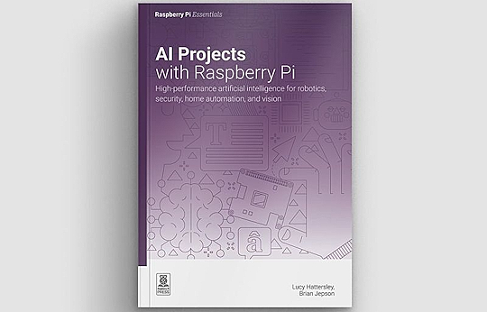](https://www.raspberrypi.com/news/ai-projects-with-raspberry-pi-out-now/)

*[AI Projects with Raspberry Pi](https://magazine.raspberrypi.com/books/ai-projects-raspberry-pi-essentials)* is a hands-on guide to discovering real-world AI applications with Raspberry Pi hardware. These aren’t toy demos, but rather projects you can build, run, and point to and say, “I made that”. Program it right and you might even get a spoken reply - [Raspberry Pi News](https://www.raspberrypi.com/news/ai-projects-with-raspberry-pi-out-now/). Via [LinkedIn](https://www.linkedin.com/posts/ai-projects-with-raspberry-pi-is-out-now-share-7485289481609179136-p5d0/).

## This Week's Python Streams

Python on Hardware is all about building a cooperative ecosphere which allows contributions to be valued and to grow knowledge. Below are the streams within the last week focusing on the community.

**CircuitPython Deep Dive Stream**

[Last Friday](https://youtube.com/live/ZULYWKRHahQ), Scott streamed his GameBoy cart testing.

You can see the latest video and past videos on the Adafruit YouTube channel under the Deep Dive playlist - [YouTube](https://www.youtube.com/playlist?list=PLjF7R1fz_OOXBHlu9msoXq2jQN4JpCk8A).

**CircuitPython Parsec**

John Park’s CircuitPython Parsec this week is on Bitmaptools Rotozoom ZOOM - [Adafruit Blog](https://blog.adafruit.com/2026/07/24/john-parks-circuitpython-parsec-bitmaptools-rotozoom-zoom/) and [YouTube](https://youtu.be/-z3WecjpI64?si=zMjj4QnWK14dPdk8).

Catch all the episodes in the [YouTube playlist](https://www.youtube.com/playlist?list=PLjF7R1fz_OOWFqZfqW9jlvQSIUmwn9lWr).

**The CircuitPython Show**

The CircuitPython Show has returned and features a new episode with Michael Czeiszperger released July 27th. Michael shares ScrollKit, a new CircuitPython library to help add text and animations to LED matrix panels - [The CircuitPython Show](https://www.circuitpythonshow.com/).

**CircuitPython Weekly Meeting**

CircuitPython Weekly Meeting for July 20th, 2026 ([notes](https://github.com/adafruit/adafruit-circuitpython-weekly-meeting/blob/main/2026/2026-07-20.md)) [on YouTube](https://youtu.be/fi_--TWe0gA).

## Project of the Week: LitClock

LitClock is a clock that tells the time with literature: 4,800+ curated book passages, one for every minute of the day, on a paper-like e-ink display — with the date and weather. It runs on a Raspberry Pi Zero 2 W with a Waveshare 7.5" e-paper HAT V2 all running Python - [GitHub](https://github.com/kapoorankush/litclock). Via [hackster.io](https://www.hackster.io/news/telling-time-through-literature-20164cff802a).

## Popular Last Week

[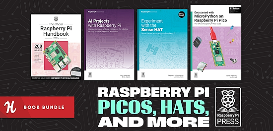](https://www.raspberrypi.com/news/name-your-own-price-for-this-raspberry-pi-press-book-bundle/)

What was the most popular, most clicked link, in [last week's newsletter](https://www.adafruitdaily.com/2026/07/20/python-on-microcontrollers-newsletter-micropython-in-a-eurorack-and-on-super-nintendo-plus-more/)? [Name your own price for this Raspberry Pi Press book bundle](https://www.raspberrypi.com/news/name-your-own-price-for-this-raspberry-pi-press-book-bundle/).

Did you know you can read past issues of this newsletter in the Adafruit Daily Archive? [Check it out](https://www.adafruitdaily.com/category/circuitpython/).

## Adafruit Playground Notes

[Adafruit Playground](https://adafruit-playground.com/) is a new place for the community to post their projects and other making tips/tricks/techniques. Ad-free, it's an easy way to publish your work in a safe space for free.

## News From Around the Web

[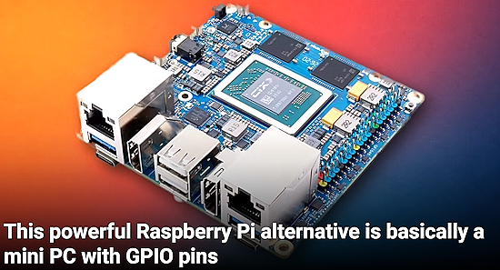](https://www.howtogeek.com/powerful-raspberry-pi-competitor-mini-pc-with-gpio-pins/)

This powerful Raspberry Pi alternative is basically a mini PC with GPIO pins - [How-To Geek](https://www.howtogeek.com/powerful-raspberry-pi-competitor-mini-pc-with-gpio-pins/).

[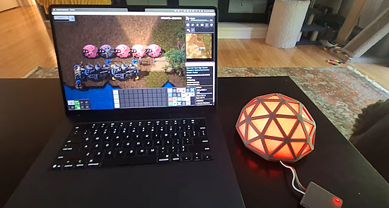](https://old.reddit.com/r/factorio/comments/1v4dpid/3d_printed_lab_with_disco_science_realtime_game/)

3D printed lab with Disco Science realtime game sync - [Reddit](https://old.reddit.com/r/factorio/comments/1v4dpid/3d_printed_lab_with_disco_science_realtime_game/), [GitHub](https://github.com/sstrang/3d-synced-factorio-lab/) and [YouTube](https://www.youtube.com/watch?v=dr5V2G0T_bw).

[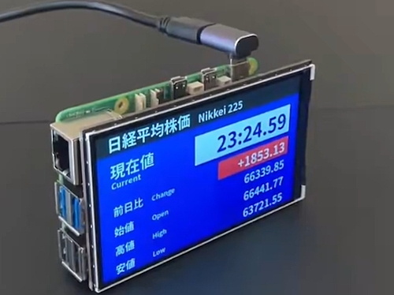](https://x.com/sozoraemon/status/2079512738498539762)

A clock that looks like a stock ticker using Python on a Raspberry Pi - [X](https://x.com/sozoraemon/status/2079512738498539762).

[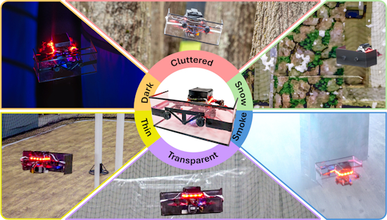](https://pear.wpi.edu/research/saranga.html)

Saranga, milliwatt ultrasound for navigation in visually degraded environments on palm-sized aerial robots (C++ and Python) - [Worcester Polytechnic Institute](https://pear.wpi.edu/research/saranga.html) and [GitHub](https://github.com/pearwpi/Saranga).

[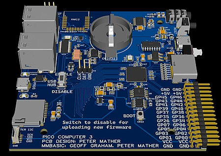](https://github.com/UKTailwind/micropython/blob/v0.2/ports/rp2/boards/PICO_COMPUTER_3/USER_MANUAL.md)

MicroPython has been ported to the Pico Computer 3 - [GitHub](https://github.com/UKTailwind/micropython/blob/v0.2/ports/rp2/boards/PICO_COMPUTER_3/USER_MANUAL.md) and [YouTube](https://www.youtube.com/watch?v=IyaLpqJN1o4).

[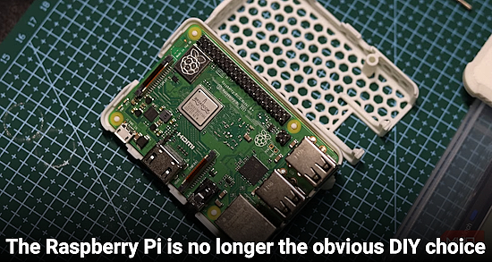](https://www.makeuseof.com/raspberry-pi-no-longer-obvious-diy-choice/)

The Raspberry Pi is no longer the obvious DIY choice - [Make Use Of](https://www.makeuseof.com/raspberry-pi-no-longer-obvious-diy-choice/).

[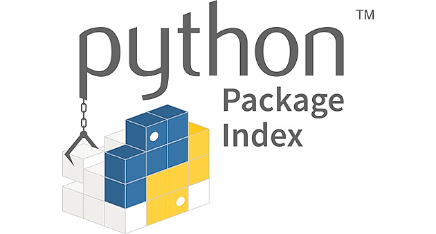](https://www.infoworld.com/article/4200712/new-pip-flag-fixes-longstanding-python-frustration.html)

New `pip` flag fixes longstanding Python frustration: it finally allows users to install only the dependencies for a project, without having to install the project itself - [InfoWorld](https://www.infoworld.com/article/4200712/new-pip-flag-fixes-longstanding-python-frustration.html).

PyPI hardens package security with new upload restrictions - [Help Net Security](https://www.helpnetsecurity.com/2026/07/23/pypi-secures-package-releases/).

Python 3.15.0 beta 4 is here - [Python Blog](https://blog.python.org/2026/07/python-3150-beta-4/).

[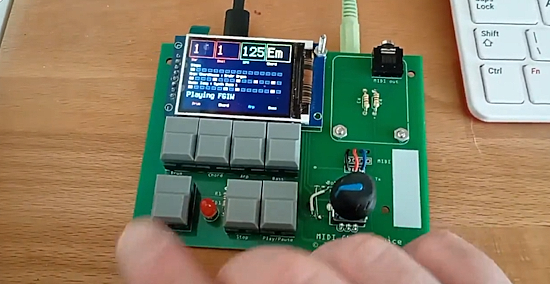](https://x.com/IRoulson/status/2080227039857045887)

Chords and bass line to a MIDI device using a Raspberry Pi RP2040 Zero and CircuitPython - [X](https://x.com/IRoulson/status/2080227039857045887).

How to set up Raspberry Pi WiFi by just talking - [YouTube](https://www.youtube.com/watch?v=86Bw1HCbYgE).

[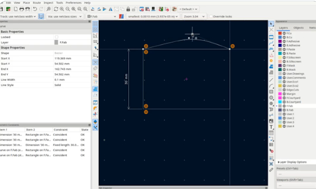](https://x.com/kicad_pcb/status/2079956092621344853)

KiCad v11 will be gaining geometric constraints. This is based on the excellent library by FreeCAD News `planegcs`. You can test-drive this feature in today's nightly builds - [X](https://x.com/kicad_pcb/status/2079956092621344853).

Vláďa Smitka has published a `picogame` version of Moon Miner. The source code is commented so it should be clear where and why it differs from the original. You'll need Vláďa's CircuitPython build with the engine - [GitHub](https://github.com/MakerClassCZ/MoonMiner-picogame). Via [BlueSky](https://bsky.app/profile/smitka.bsky.social/post/3mrfoflznas2o).

[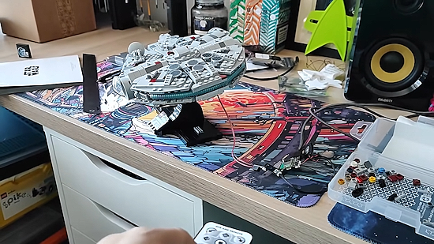](https://www.digikey.com/en/maker/tutorials/2026/lights-and-sound-with-tiny-fx-w-and-infrared)

The midi-scale Lego Millennium Falcon is great, but that big blue engine needs LEDs! With the help of Pimoroni's Tiny FX W, MicroPython and an IR receiver and remote control, you can bring light and sound to the fastest hunk of junk in the galaxy - [Maker.io](https://www.digikey.com/en/maker/tutorials/2026/lights-and-sound-with-tiny-fx-w-and-infrared) and [YouTube](https://youtu.be/tShxXzSOu0E?si=8MW78v7ANzCLeGVb).

[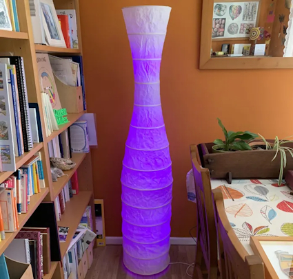](https://www.instructables.com/Kinetic-Art-Standard-Lamp-Made-From-Recycled-IKEA-)

A kinetic art standard lamp made from a recycled IKEA Storm lamp stand, a Pico or Pico 2 and MicroPython - [Instructables](https://www.instructables.com/Kinetic-Art-Standard-Lamp-Made-From-Recycled-IKEA-).

Review: the Xteink X4 Pro could be the tiny e-reader of your dreams - [TechCrunch](https://techcrunch.com/2026/07/21/the-xteink-x4-pro-could-be-the-tiny-e-reader-of-your-dreams/).

[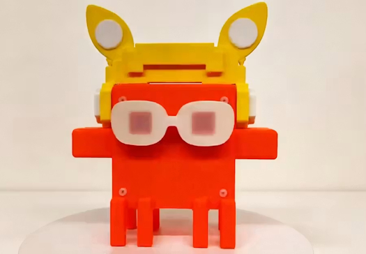](https://www.hackster.io/ruilixin6/step-by-step-guide-to-building-an-ai-operating-status-indica-4699af)

A step-by-step guide to building an AI operating status indicator - [hackster.io](https://www.hackster.io/ruilixin6/step-by-step-guide-to-building-an-ai-operating-status-indica-4699af).

## New

[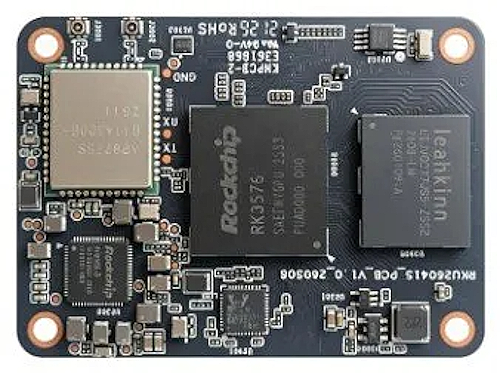](https://linuxgizmos.com/geniatech-xpi-3576-cm5-brings-6-tops-rk3576-performance-with-raspberry-pi-cm5-compatibility/)

Geniatech’s XPI-3576-CM5 is a 55 × 40mm compute module built around Rockchip’s RK3576 processor and designed for use with Raspberry Pi Compute Module 5 carrier boards. It combines an octa-core CPU, a 6-TOPS NPU, LPDDR5 memory, optional WiFi 6 connectivity - [LinuxGizmos](https://linuxgizmos.com/geniatech-xpi-3576-cm5-brings-6-tops-rk3576-performance-with-raspberry-pi-cm5-compatibility/).

[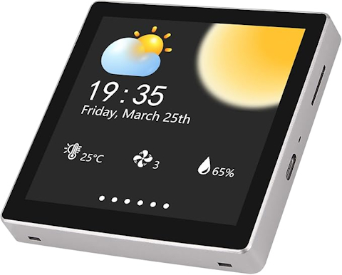](https://www.amazon.com/AITRIP-ESP32-S3-Development-Resolution-Micropython/dp/B0GL1PHKYG/)

The AITRIP ESP32-S3 4.0 inch Color LCD display development board has a 480 × 480 resolution, sports a 16 BIT RGB 65K color display, for Arduino IDE, ESP IDE, Micropython and Mixly - [Amazon](https://www.amazon.com/AITRIP-ESP32-S3-Development-Resolution-Micropython/dp/B0GL1PHKYG/). Via [X](https://x.com/francip/status/2080139239073972376).

[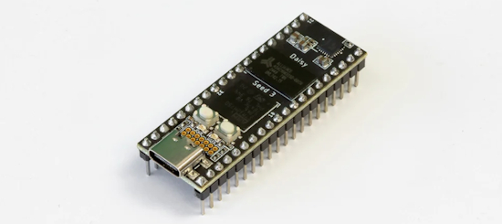](https://daisy.audio/products/seed3)

Seed3 is the next generation of Daisy hardware. It features an ARM Cortex-M7 MCU running at 480MHz, 65MB of RAM, 8MB of flash memory, and a new audio codec boosting audio fidelity to 32-bit, 192kHz, for a crystal clear audio experience - [Daisy](https://daisy.audio/products/seed3).

## New Boards Supported by CircuitPython

The number of supported microcontrollers and Single Board Computers (SBC) grows every week. This section outlines which boards have been included in CircuitPython or added to [CircuitPython.org](https://circuitpython.org/).

This week there were no new boards.

*Note: For non-Adafruit boards, please use the support forums of the board manufacturer for assistance, as Adafruit does not have the hardware to assist in troubleshooting.*

Looking to add a new board to CircuitPython? It's highly encouraged! Adafruit has four guides to help you do so:

- [How to Add a New Board to CircuitPython](https://learn.adafruit.com/how-to-add-a-new-board-to-circuitpython/overview)
- [How to add a New Board to the circuitpython.org website](https://learn.adafruit.com/how-to-add-a-new-board-to-the-circuitpython-org-website)
- [Adding a Single Board Computer to PlatformDetect for Blinka](https://learn.adafruit.com/adding-a-single-board-computer-to-platformdetect-for-blinka)
- [Adding a Single Board Computer to Blinka](https://learn.adafruit.com/adding-a-single-board-computer-to-blinka)

## New Adafruit Learning System Guides

[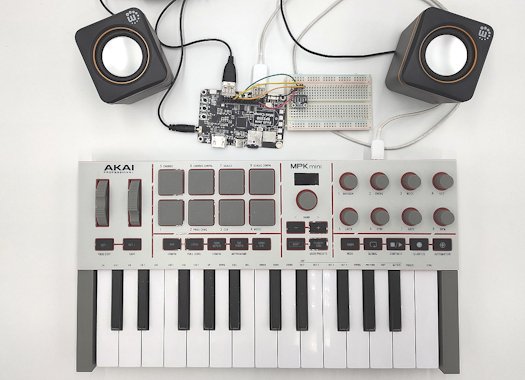](https://learn.adafruit.com/guides/latest)

The [Adafruit Learning System](https://learn.adafruit.com/) has over 3,200 free guides for learning skills and building projects including using Python.

[Sampling Keyboard with Fruit Jam](https://learn.adafruit.com/sampling-keyboard-with-fruit-jam) from [Tim C](https://learn.adafruit.com/u/Foamyguy)

## Updated Learn Guides

[Adafruit NeoPixel Überguide](https://learn.adafruit.com/adafruit-neopixel-uberguide)

## CircuitPython Libraries

The CircuitPython library numbers are continually increasing, while existing ones continue to be updated. Here we provide library numbers and updates!

To get the latest Adafruit libraries, download the [Adafruit CircuitPython Library Bundle](https://circuitpython.org/libraries). To get the latest community contributed libraries, download the [CircuitPython Community Bundle](https://circuitpython.org/libraries).

If you'd like to contribute to the CircuitPython project on the Python side of things, the libraries are a great place to start. Check out the [CircuitPython.org Contributing page](https://circuitpython.org/contributing). If you're interested in reviewing, check out Open Pull Requests. If you'd like to contribute code or documentation, check out Open Issues. We have a guide on [contributing to CircuitPython with Git and GitHub](https://learn.adafruit.com/contribute-to-circuitpython-with-git-and-github), and you can find us in the #help-with-circuitpython and #circuitpython-dev channels on the [Adafruit Discord](https://adafru.it/discord).

You can check out this [list of all the Adafruit CircuitPython libraries and drivers available](https://github.com/adafruit/Adafruit_CircuitPython_Bundle/blob/master/circuitpython_library_list.md). 

The current number of CircuitPython libraries is **573**!

**New Libraries**

Here is this week's new CircuitPython library:
 
* [Elfking29/CircuitPython_DS1302](https://github.com/Elfking29/CircuitPython_DS1302)

**Updated Libraries**
 
Here are this week's updated CircuitPython libraries:
 
* [adafruit/Adafruit_CircuitPython_MAX1704x](https://github.com/adafruit/Adafruit_CircuitPython_MAX1704x)
* [adafruit/Adafruit_CircuitPython_asyncio](https://github.com/adafruit/Adafruit_CircuitPython_asyncio)

## What’s the CircuitPython team up to this week?

What is the team up to this week? Let’s check in:

**Dan**

I released CircuitPython 10.3.0-alpha.4 last week. It has quite a few bug fixes and new features. There are currently fewer than 20 issues to address for 10.3.0, so we're making good progress toward the final release.

**Tim**

[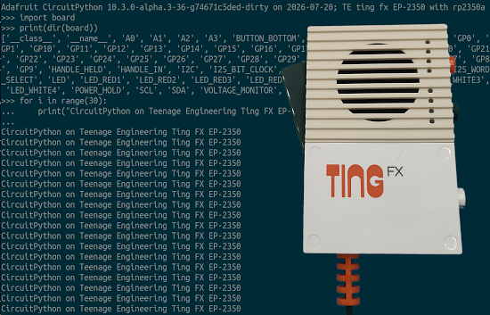](https://www.circuitpython.org/)

The `GranularPitchShift` module I mentioned last week is merged now, and the Casio SK-1 project guide that uses it is complete. I've been hacking on the Teenage Engineering Ting FX EP-2350 microphone. First I reverse engineered the pinout and power management mechanism. I got Micropython PoCs for audio input and output working, then made a CircuitPython board def for it. Now I'm working on a driver for the NAU88L21 audio codec chip on it, and adding support in the core for duplex I2S audio since this chip handles both input and output with shared clock lines.

**Scott**

This week I've been further refining the CircuitPython powered GameBoy cart. I've gotten CircuitPython running and sending and receiving data to the GameBoy. It turns out LLMs are pretty good at writing GameBoy assembly to test with. :-) I'm heads down to test everything and order another rev of the PCB after getting feedback on the design from Ladyada.

**Liz**

This week I added a quick page to the [NeoPixel Uberguide about the new WWA pixels](https://learn.adafruit.com/adafruit-neopixel-uberguide/wwa-white-pixels) in the shop. Addressable WWA LEDs have 3 white LEDs in them in three tints: warm white, cool white and amber. You can use NeoPixel code libraries to write to these LEDs to dial in the color temperature. One of the first Learn Guides I ever wrote was for a [GoPro Lens Light](https://learn.adafruit.com/neopixel-gopro-lens-light) that used an RGBW NeoPixel ring. These WWA pixels would be a great update for that project.

## Upcoming Events

The HOPE 26 Conference is from August 14th through 16th at the New Yorker Hotel, NY, NY - [2600.com](https://www.hope.net/).

The next MicroPython Meetup in Melbourne will be on August 26 – [Luma](https://luma.com/micropython). You can see recordings of previous meetings on [YouTube](https://www.youtube.com/@MicroPythonOfficial). 

**Other Events This Year**

* [PyCon AU 2026](https://2026.pycon.org.au/) will be 26 Aug. 2026 – 30 Aug. 2026 in Brisbane, Australia.
* [PyConZA 2026](https://za.pycon.org/), South Africa's Python conference, will be 14–18 Oct at Belmont Square, Cape Town, South Africa.
* [Espressif DevCon 2026](https://devcon.espressif.com/) will be November 3-4 in Milan, Italy  and online.
* [Hackaday Superconference 2026](https://hackaday.com/2026/07/13/2026-hackaday-supercon-call-for-proposals/) will be November 6th through 8th in glorious Pasadena California.

If you know of virtual events or upcoming events, please let us know via email to cpnews(at)adafruit(dot)com.

## Latest Releases

CircuitPython's stable release is [10.2.1](https://github.com/adafruit/circuitpython/releases/tag/10.2.1) and its unstable release is [10.3.0-alpha.4](https://github.com/adafruit/circuitpython/releases/tag/10.3.0-alpha.4). New to CircuitPython? Start with our [Welcome to CircuitPython Guide](https://learn.adafruit.com/welcome-to-circuitpython).

[20260724](https://github.com/adafruit/Adafruit_CircuitPython_Bundle/releases/latest) is the latest Adafruit CircuitPython library bundle.

[20260721](https://github.com/adafruit/CircuitPython_Community_Bundle/releases/latest) is the latest CircuitPython Community library bundle.

[v1.28.0](https://micropython.org/download) is the latest MicroPython release. Documentation for it is [here](http://docs.micropython.org/en/latest/pyboard/).

[3.14.6](https://www.python.org/downloads/) is the latest Python release. The latest pre-release version is [3.15.0b4](https://www.python.org/download/pre-releases/).

[4,531 Stars](https://github.com/adafruit/circuitpython/stargazers) Like CircuitPython? [Star it on GitHub!](https://github.com/adafruit/circuitpython)

## Call for Help -- Translating CircuitPython is now easier than ever

[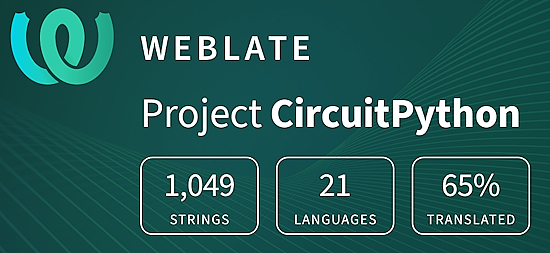](https://hosted.weblate.org/engage/circuitpython/)

One important feature of CircuitPython is translated control and error messages. With the help of fellow open source project [Weblate](https://weblate.org/), we're making it even easier to add or improve translations. 

Sign in with an existing account such as GitHub, Google or Facebook and start contributing through a simple web interface. No forks or pull requests needed! As always, if you run into trouble join us on [Discord](https://adafru.it/discord), we're here to help.

## 38,891 Thanks

The Adafruit Discord community, where we do all our CircuitPython development in the open, reached over 38,891 humans - thank you! Adafruit believes Discord offers a unique way for Python on hardware folks to connect. Join today at [https://adafru.it/discord](https://adafru.it/discord).

## ICYMI - In case you missed it

Python on hardware is the Adafruit Python video-newsletter-podcast! The news comes from the Python community, Discord, Adafruit communities and more and is broadcast on ASK an ENGINEER Wednesdays. The complete Python on Hardware weekly videocast [playlist is here](https://www.youtube.com/playlist?list=PLjF7R1fz_OOXRMjM7Sm0J2Xt6H81TdDev). The video podcast is on [iTunes](https://itunes.apple.com/us/podcast/python-on-hardware/id1451685192?mt=2), [YouTube](http://adafru.it/pohepisodes), [Instagram](https://www.instagram.com/adafruit/channel/), and [XML](https://itunes.apple.com/us/podcast/python-on-hardware/id1451685192?mt=2).

[The weekly community chat on Adafruit Discord server CircuitPython channel - Audio / Podcast edition](https://itunes.apple.com/us/podcast/circuitpython-weekly-meeting/id1451685016) - Audio from the Discord chat space for CircuitPython, meetings are usually Mondays at 2pm ET, this is the audio version on [iTunes](https://itunes.apple.com/us/podcast/circuitpython-weekly-meeting/id1451685016), Pocket Casts, [Spotify](https://adafru.it/spotify), and [XML feed](https://adafruit-podcasts.s3.amazonaws.com/circuitpython_weekly_meeting/audio-podcast.xml).

## Contribute

The CircuitPython Weekly Newsletter is a CircuitPython community-run newsletter emailed every Monday. To contribute your content, please email your news to cpnews (at) adafruit (dot) com with information and link(s) to your content. 

Join the Adafruit [Discord](https://adafru.it/discord) or [post to the forum](https://forums.adafruit.com/viewforum.php?f=60) if you have questions.
