- [ ] Library and info updates
- [ ] change date
- [ ] update title
- [ ] Feature story
- [ ] Update  for images
- [ ] Update ICYDNCI
- [ ] All images 550w max only
- [ ] Link "View this email in your browser."

News Sources

- [Adafruit Playground](https://adafruit-playground.com/)
- Twitter: [CircuitPython](https://twitter.com/search?q=circuitpython&src=typed_query&f=live), [MicroPython](https://twitter.com/search?q=micropython&src=typed_query&f=live) and [Python](https://twitter.com/search?q=python&src=typed_query)
- [Raspberry Pi News](https://www.raspberrypi.com/news/), [Pi Foundation](https://www.raspberrypi.org/blog/)
- Mastodon [CircuitPython](https://mastodon.social/tags/CircuitPython) and [MicroPython](https://mastodon.social/tags/MicroPython)
- BlueSky [CircuitPython](https://bsky.app/search?q=circuitpython), [MicroPython](https://bsky.app/search?q=micropython), [Raspberry Pi](https://bsky.app/search?q=raspberry+pi)
- [Google News Python](https://news.google.com/topics/CAAqIQgKIhtDQkFTRGdvSUwyMHZNRFY2TVY4U0FtVnVLQUFQAQ?hl=en-US&gl=US&ceid=US%3Aen), [Infoworld](https://www.infoworld.com/python/)
- YouTube: [CircuitPython](https://www.youtube.com/results?search_query=circuitpython&sp=CAISBAgDEAE%253D), [MicroPython](https://www.youtube.com/results?search_query=micropython&sp=CAISBAgDEAE%253D), [Prof Gallaugher](https://www.youtube.com/@BuildWithProfG/videos)
- [maker.io Python](https://www.digikey.com/en/maker/search-results?s=createdDate&t=python)
- [hackster.io CircuitPython](https://www.hackster.io/search?q=circuitpython&i=projects&sort_by=most_recent) and [MicroPython](https://www.hackster.io/search?q=micropython&i=projects&sort_by=most_recent)
- Instructables: [CircuitPython](https://www.instructables.com/search/?q=circuitpython&projects=all&sort=Newest), [MicroPython](https://www.instructables.com/search/?q=micropython&projects=all&sort=Newest), [Raspberry Pi Python](https://www.instructables.com/search/?q=raspberry+pi+python&projects=all&sort=Newest)
- [hackaday CircuitPython](https://hackaday.com/blog/?s=circuitpython) and [MicroPython](https://hackaday.com/blog/?s=micropython)
- [python.org](https://www.python.org/)
- [Python Insider - dev team blog](https://blog.python.org/)
- Individuals: [bret.dk](https://bret.dk/), [Jeff Geerling](https://www.jeffgeerling.com/blog), [Yakroo](https://x.com/Yakroo5077), [coXXect](https://coxxect.blogspot.com/)
- Tom's Hardware: [CircuitPython](https://www.tomshardware.com/search?searchTerm=circuitpython&articleType=all&sortBy=publishedDate) and [MicroPython](https://www.tomshardware.com/search?searchTerm=micropython&articleType=all&sortBy=publishedDate) and [Raspberry Pi](https://www.tomshardware.com/search?searchTerm=raspberry%20pi&articleType=all&sortBy=publishedDate)
- [hackaday.io newest projects MicroPython](https://hackaday.io/projects?tag=micropython&sort=date) and [CircuitPython](https://hackaday.io/projects?tag=circuitpython&sort=date)
- hackaday.io - [CircuitPython](https://hackaday.io/search?term=circuitpython) and [MicroPython](https://hackaday.io/search?term=micropython)
- [MicroPython Meeting](https://luma.com/micropython?k=c)

View this email in your browser. **Warning: Flashing Imagery**

Welcome to the latest Python on Microcontrollers newsletter! *insert 2-3 sentences from editor (what's in overview, banter)* - *Anne Barela, Editor*

We're on [Discord](https://discord.gg/HYqvREz), [Twitter/X](https://twitter.com/search?q=circuitpython&src=typed_query&f=live), [BlueSky](https://bsky.app/profile/circuitpython.org) and for past newsletters - [view them all here](https://www.adafruitdaily.com/category/circuitpython/). If you're reading this on the web, please [subscribe here](https://www.adafruitdaily.com/). Here's the news this week:

## CircuitPython Day will be August 21, 2026

[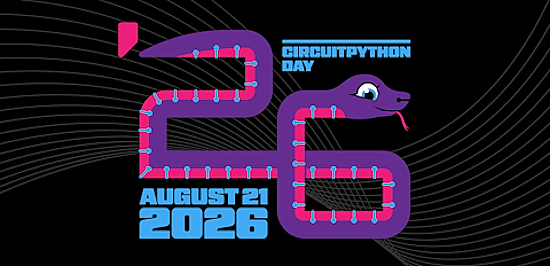](https://blog.adafruit.com/2026/07/28/circuitpython-day-will-be-august-21-2026/)

It’s that time of year! Adafruit has determined that August 21, 2025 is the snakiest day of the year and designated it CircuitPython Day! Adafruit will have special shows and more throughout the day. Tag your projects #CircuitPythonDay2026 on social media and Adafruit will look to highlight them. Check out the schedule on the site as it'll change as more content is announced - [Adafruit Blog](https://blog.adafruit.com/2026/07/28/circuitpython-day-will-be-august-21-2026/).

## Metal Boots Into a Persistent Native MicroPython REPL

[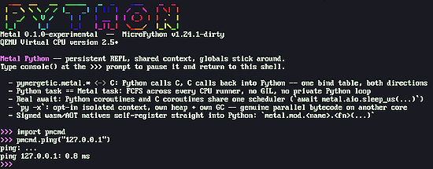](https://github.com/pymergetic/metal)

*pymergetic* on GitHub has created Metal, an experimental UEFI/BIOS freestanding async runtime. It is not a conventional OS and it is very far from production-ready, but it now boots directly into a persistent interactive MicroPython REPL - [GitHub](https://github.com/pymergetic/metal) and [MicroPython Forums](https://github.com/orgs/micropython/discussions/19520).

## New Resource: Getting Started with CircuitPython

[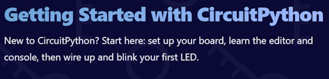](https://keepeverythingyours.com/tutorials/getting-started-with-circuitpython/index.html)

Keep Everything Yours has created a new resource: Getting Started with CircuitPython - [Keep Everything Yours](https://keepeverythingyours.com/tutorials/getting-started-with-circuitpython/index.html). Via [Reddit](https://www.reddit.com/r/circuitpython/comments/1v7nfq9/i_made_an_interactive_website_that_help_people/).

> "This tutorial is going to walk you through everything you need to start writing CircuitPython programs. We'll go through everything from installing the initial software on your microcontroller all the way to blinking your first LED. Each section in this tutorial will build on the last. Feel free to jump around, but if something doesn't quite make sense, make sure to go back and confirm your understanding of each previous step. There is no software required for this tutorial, but you will need to make sure you have the basic hardware to follow along."

## Feature

text - [site](url).

## Scanwheel: A Drum Style Mechanical Television Using MicroPython

[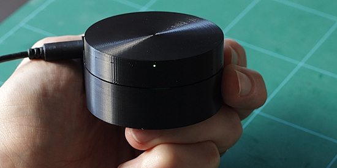](https://github.com/AncientJames/Scanwheel)

Scanwheel is a drum style mechanical television you can build yourself. It features five windows side by side, each taking advantage of the same scanning drum, but with separate LEDs to allow separate images. The windows are a luxurious 9mm x 8mm each, with 20 scan lines. The software uses the Pico's PIO hardware to drive the LEDs, allowing extremely high horizontal resolution, so the image quality is a lot better than the 20p line count would imply - [GitHub](https://github.com/AncientJames/Scanwheel).

## Improving The Microcontroller Gaming Performance With PicoGame

The ability to write Python on microcontrollers with the likes of MicroPython and later CiruitPython has made them much more accessible. MakerClassCZ brings that to game development with PicoGame. Like any good project, it starts with a problem that needs solving. Put simply, the existing CircuitPython libraries aren’t too impressive for gaming. The DisplayIO library tends to do full display refreshes, which are slow on such tiny displays, and the Stage library just wasn’t flexible enough for MakerClassCZ’s liking. So he built his own - [Hackaday](https://hackaday.com/2026/07/28/improving-the-microcontroller-gaming-performance-with-picogame/).

## You Can Now Buy the ESP32-S31 Development Board

Over on the Espressif website, the company has announced the general release of the ESP32-S31 development board. The new microcontroller contains some nice hardware, both for communicating with other devices and for user input:

> "ESP32-S31 integrates Wi-Fi 6 (2.4 GHz), Bluetooth 5.4 (including LE Audio and Classic BR/EDR), IEEE 802.15.4 (Zigbee and Thread), and a Gigabit Ethernet MAC. It also supports Matter over both WiFi and Thread. To support rich human-machine interaction, ESP32-S31 provides interfaces for DVP cameras, multiple LCD display types, and up to 14 capacitive touch channels. "

The board is on the [Espressif AliExpress website](https://www.aliexpress.us/item/3256812143034534.html). For US customers, tariffs are very steep - [XDA](https://www.xda-developers.com/you-can-now-buy-the-esp32-s31-development-board-and-its-at-a-nice-price-point/).

## This Week's Python Streams

Python on Hardware is all about building a cooperative ecosphere which allows contributions to be valued and to grow knowledge. Below are the streams within the last week focusing on the community.

**CircuitPython Deep Dive Stream**

[Last Friday](), Scott streamed work on .

You can see the latest video and past videos on the Adafruit YouTube channel under the Deep Dive playlist - [YouTube](https://www.youtube.com/playlist?list=PLjF7R1fz_OOXBHlu9msoXq2jQN4JpCk8A).

**CircuitPython Parsec**

John Park’s CircuitPython Parsec was cancelled due to an internet outage. Catch all the episodes in the [YouTube playlist](https://www.youtube.com/playlist?list=PLjF7R1fz_OOWFqZfqW9jlvQSIUmwn9lWr).

**Deep Dive with Tim**

[Last week](), Tim streamed work on .

You can see the latest video and past videos on the Adafruit YouTube channel under the Deep Dive playlist - [YouTube](https://www.youtube.com/playlist?list=PLjF7R1fz_OOWFqZfqW9jlvQSIUmwn9lWr).

**CircuitPython Weekly Meeting**

CircuitPython Weekly Meeting for July, 27th 2026 ([notes](https://github.com/adafruit/adafruit-circuitpython-weekly-meeting/blob/main/2026/2026-07-26.md)) [on YouTube](https://youtu.be/5AIjIcbG298).

## Project of the Week: Easy Lighting Effects for Tiny FX

[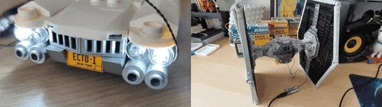](https://learn.pimoroni.com/article/easy-lighting-effects-for-tiny-fx)

Exploring `picofx`, a dedicated MicroPython module (software library) that makes controlling single-colour and RGB LEDs extremely simple - [Pimoroni](https://learn.pimoroni.com/article/easy-lighting-effects-for-tiny-fx).

## Popular Last Week

[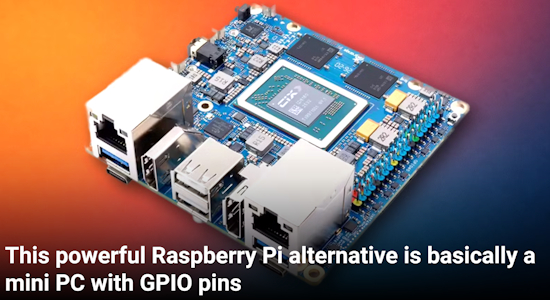](https://www.howtogeek.com/powerful-raspberry-pi-competitor-mini-pc-with-gpio-pins/)

What was the most popular, most clicked link, in [last week's newsletter](https://www.adafruitdaily.com/2026/07/27/python-on-microcontrollers-newsletter-catch-your-isp-cheating-new-circuitpython-a-python-coding-bot-and-more/)? [This powerful Raspberry Pi alternative is basically a mini PC with GPIO pins](https://www.howtogeek.com/powerful-raspberry-pi-competitor-mini-pc-with-gpio-pins/).

Did you know you can read past issues of this newsletter in the Adafruit Daily Archive? [Check it out](https://www.adafruitdaily.com/category/circuitpython/).

## Adafruit Playground Notes

[Adafruit Playground](https://adafruit-playground.com/) is a place for the community to post their projects and other making tips/tricks/techniques. Ad-free, it's an easy way to publish your work in a safe space for free.

## News From Around the Web

[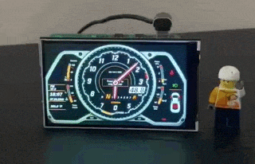](https://x.com/sozoraemon/status/2082418243760005537)

A watch that makes you feel like you're riding in a Lamborghini. It's powered by a Raspberry Pi - [X](https://x.com/sozoraemon/status/2082418243760005537).

[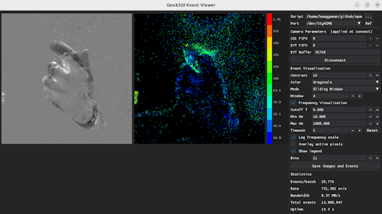](https://www.edge-ai-vision.com/2026/07/openmv-v5-0-0-firmware-released/)

OpenMV V5.0.0 firmware released and finally takes the OpenMV AE3 and N6 out of beta. It adds Python-based camera control, multi-camera CSI support and overhauled APIs/docs for embedded vision development for MicroPython- [Edge AI Vision](https://www.edge-ai-vision.com/2026/07/openmv-v5-0-0-firmware-released/) and [demo on Raspberry Pi](https://www.edge-ai-vision.com/2026/07/brainchip-demonstration-of-the-companys-always-on-radar-based-edge-classification/). Via [X](https://x.com/edgeaivision/status/2082250751741510071).

[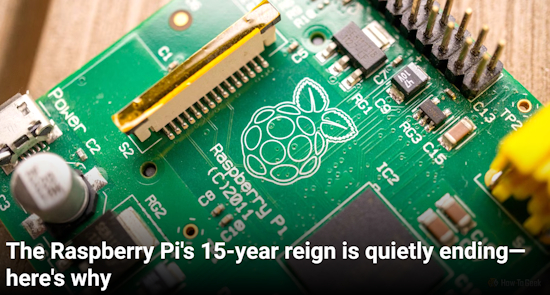](https://www.howtogeek.com/the-raspberry-pis-reign-is-quietly-ending/)

The Raspberry Pi's 15-year reign is quietly ending—here's why - [How-To Geek](https://www.howtogeek.com/the-raspberry-pis-reign-is-quietly-ending/).

[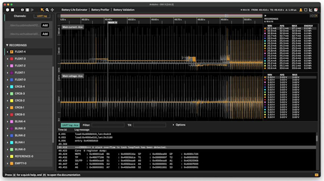](https://www.qoitech.com/blog/esp32-c6-power-consumption-comparison/)

ESP32-C6 power consumption: Arduino vs Zephyr vs ESP-IDF - [Qoitech](https://www.qoitech.com/blog/esp32-c6-power-consumption-comparison/). Via [Adafruit Blog](https://blog.adafruit.com/2026/07/30/esp32-c6-power-consumption-arduino-vs-zephyr-vs-esp-idf/).

[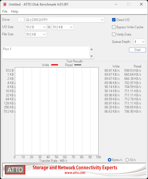](https://x.com/21692fa/status/2081742344718778554)

With CircuitPython, you can connect devices like the Raspberry Pi Pico series as USB storage, allowing you to create a rudimentary NOR flash-based USB memory stick. However, the write speed is far from the theoretical maximum - [X](https://x.com/21692fa/status/2081742344718778554).

[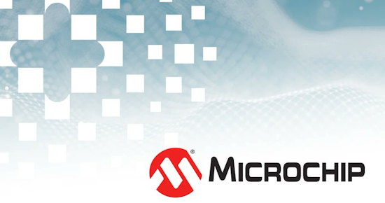](https://www.edge-ai-vision.com/2026/07/microchip-technology-signs-definitive-agreement-to-acquire-hailo/)

Microchip has agreed to acquire Hailo AI, combining embedded processing with power-efficient AI accelerators and vision processors for robots, smart cameras, drones and industrial edge systems - [Edge AI Vision](https://www.edge-ai-vision.com/2026/07/microchip-technology-signs-definitive-agreement-to-acquire-hailo/).

[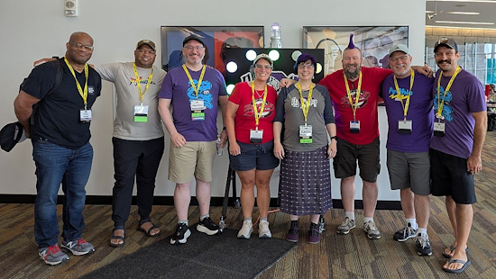](https://www.linkedin.com/posts/pyohio-python-conference-ugcPost-7488288602729172993-v8Fk/)

Congratulations to PyOhio for another successful conference! Led by CircuitPythonista (and former guest editor) Kattni - [LinkedIn](https://www.linkedin.com/posts/pyohio-python-conference-ugcPost-7488288602729172993-v8Fk/).

text - [site](url).

text - [site](url).

text - [site](url).

text - [site](url).

text - [site](url).

Five free apps that make a Raspberry Pi useful the day it arrives - [MUD](https://www.makeuseof.com/free-apps-make-raspberry-pi-useful-day-arrives/).

text - [site](url).

[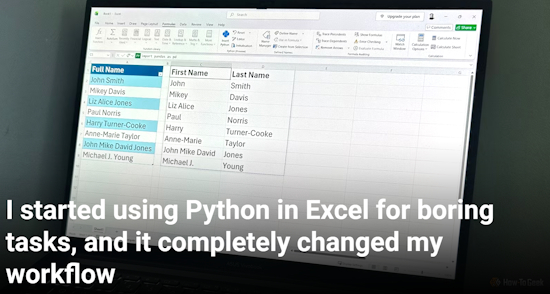](https://www.howtogeek.com/microsoft-excel-python-handle-spreadsheet-tasks-usually-put-off/)

I started using Python in Excel for boring tasks, and it completely changed my workflow - [How-To Geek](https://www.howtogeek.com/microsoft-excel-python-handle-spreadsheet-tasks-usually-put-off/).

[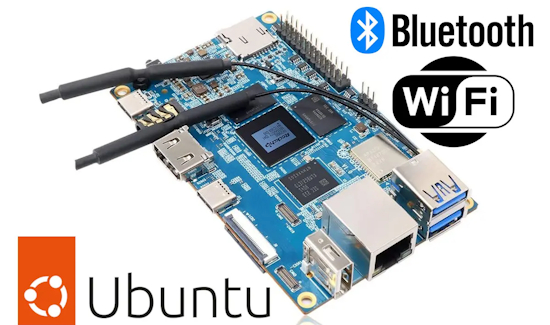](https://www.cnx-software.com/2026/07/27/orange-pi-5b-sbc-gets-ubuntu-desktop-and-audio-production-os-images-with-bluetooth-wi-fi-fix-missed-for-8-years/)

Orange Pi 5B SBC gets Ubuntu Desktop and Audio Production OS images with Bluetooth/Wi-Fi fix missed for 8 years - [CNX](https://www.cnx-software.com/2026/07/27/orange-pi-5b-sbc-gets-ubuntu-desktop-and-audio-production-os-images-with-bluetooth-wi-fi-fix-missed-for-8-years/).

An interactive map of datacenters in the United States - [PoweredByWho](https://poweredbywho.com/map?mode=projects&lat=33.4800&lng=-98.0547&zoom=3.60).

## New

[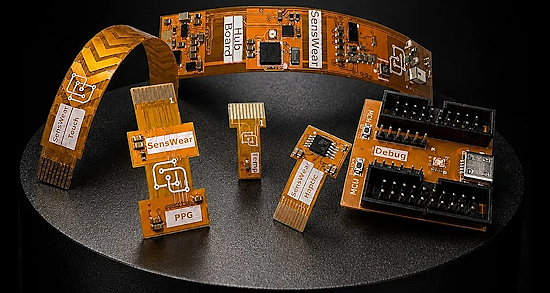](https://www.cnx-software.com/2026/07/29/senswear-an-open-source-modular-nordic-nrf54l15-development-platform-for-wearables/)

SensWear is an open-source hardware development platform for wearables based on Nordic nRF54L15 Bluetooth LE SoC and a range of sensors designed for researchers, developers, and companies building smart rings, wristbands, patches, and other custom devices - [CNX](https://www.cnx-software.com/2026/07/29/senswear-an-open-source-modular-nordic-nrf54l15-development-platform-for-wearables/).

[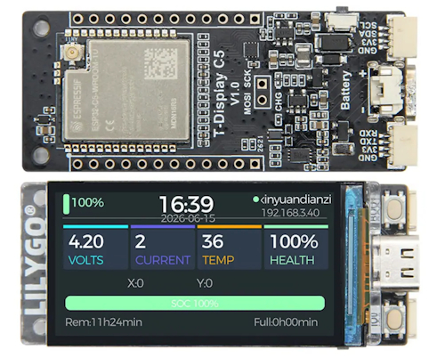](https://www.cnx-software.com/2026/07/28/lilygo-t-display-c5-board-features-1-9-inch-ips-color-lcd-battery-support-qwiic-expansion-connectors/)

LILYGO T-Display C5 is an ESP32-C5 board with a 1.9-inch IPS color LCD, a USB-C port for power and programming, Lithium battery support, and GPIO expansion via headers and two Qwiic expansion connectors. The main benefit of using an ESP32-C5 chip is support for dual-band WiFi 6 connectivity (2.4/5.0 GHz), and it also keeps Bluetooth LE 5.x and the 802.15.4 radio for Zigbee/Thread/Matter found in the ESP32-C6 - [CNX](https://www.cnx-software.com/2026/07/28/lilygo-t-display-c5-board-features-1-9-inch-ips-color-lcd-battery-support-qwiic-expansion-connectors/).

[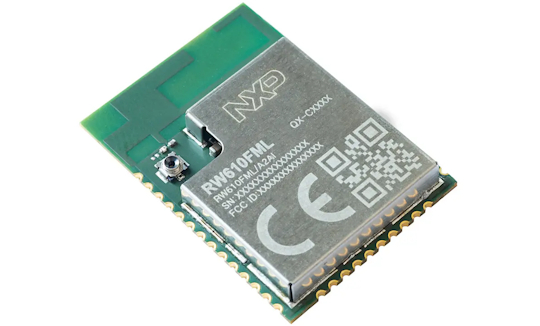](https://www.cnx-software.com/2026/07/29/nxp-rw610fml-wi-fi-6-and-ble-5-4-module-features-rw610-cortex-m33-wireless-mcu/)

NXP has introduced the RW610FML, a compact, low-power, certified WiFi 6 and Bluetooth Low Energy (BLE) 5.4 wireless module based on the company’s RW610 Cortex-M33 microcontroller, the little brother of the RW612 without an 802.15.4 radio. Designed for smart appliances, home automation, industrial gateways, and medical devices, the surface-mount module combines the 260 MHz Arm Cortex-M33 wireless SoC with 8MB of on-module NOR flash and a built-in antenna - [CNX](https://www.cnx-software.com/2026/07/29/nxp-rw610fml-wi-fi-6-and-ble-5-4-module-features-rw610-cortex-m33-wireless-mcu/).

## New Boards Supported by CircuitPython

The number of supported microcontrollers and Single Board Computers (SBC) grows every week. This section outlines which boards have been included in CircuitPython or added to [CircuitPython.org](https://circuitpython.org/).

This week there were (#/no) new boards added:

- [Board name](url)
- [Board name](url)
- [Board name](url)

*Note: For non-Adafruit boards, please use the support forums of the board manufacturer for assistance, as Adafruit does not have the hardware to assist in troubleshooting.*

Looking to add a new board to CircuitPython? It's highly encouraged! Adafruit has four guides to help you do so:

- [How to Add a New Board to CircuitPython](https://learn.adafruit.com/how-to-add-a-new-board-to-circuitpython/overview)
- [How to add a New Board to the circuitpython.org website](https://learn.adafruit.com/how-to-add-a-new-board-to-the-circuitpython-org-website)
- [Adding a Single Board Computer to PlatformDetect for Blinka](https://learn.adafruit.com/adding-a-single-board-computer-to-platformdetect-for-blinka)
- [Adding a Single Board Computer to Blinka](https://learn.adafruit.com/adding-a-single-board-computer-to-blinka)

## New Adafruit Learning System Guides

The [Adafruit Learning System](https://learn.adafruit.com/) has over 3,200 free guides for learning skills and building projects including using Python.

[title](url) from [name](url)

[title](url) from [name](url)

[title](url) from [name](url)

## Updated Learn Guides

[title](url)

## CircuitPython Libraries

The CircuitPython library numbers are continually increasing, while existing ones continue to be updated. Here we provide library numbers and updates!

To get the latest Adafruit libraries, download the [Adafruit CircuitPython Library Bundle](https://circuitpython.org/libraries). To get the latest community contributed libraries, download the [CircuitPython Community Bundle](https://circuitpython.org/libraries).

If you'd like to contribute to the CircuitPython project on the Python side of things, the libraries are a great place to start. Check out the [CircuitPython.org Contributing page](https://circuitpython.org/contributing). If you're interested in reviewing, check out Open Pull Requests. If you'd like to contribute code or documentation, check out Open Issues. We have a guide on [contributing to CircuitPython with Git and GitHub](https://learn.adafruit.com/contribute-to-circuitpython-with-git-and-github), and you can find us in the #help-with-circuitpython and #circuitpython-dev channels on the [Adafruit Discord](https://adafru.it/discord).

You can check out this [list of all the Adafruit CircuitPython libraries and drivers available](https://github.com/adafruit/Adafruit_CircuitPython_Bundle/blob/master/circuitpython_library_list.md). 

The current number of CircuitPython libraries is **###**!

**New Libraries**

Here are this week's new CircuitPython libraries:

* [library](url)

**Updated Libraries**

Here are this week's updated CircuitPython libraries:

* [library](url)

## What’s the CircuitPython team up to this week?

What is the team up to this week? Let’s check in:

**Dan**

I'm still fixing bugs for the CircuitPython 10.3.0 release. I just updated the `mbedtls` version used for networking on the RP2 port from 2.28.3 to 4.2.0 in order to fix TLS when used with numeric IP addresses. An LLM was of substantial help with this, especially tracking down all the configuration parameter changes between the versions.

**Tim**

The duplex I2S support and TE EP-2350 ting board def are merged into the core now. This week I discovered that the handle on the device is connected to a potentiometer so that it has an analog way to sense how far the handle is pressed. I've been working on CircuitPython code that implements similar functionality to the stock firmware MicroPython code. I've enhanced the configuration syntax a little beyond the original, and made a web page GUI that makes it easy to build configuration packs without hand editing JSON. While working on this code, I uncovered and fixed a bug in the core that leads to a hard crash when an audio sample object has deinit() called on it while it's still being played.

**Scott**

This last week I revised the CircuitPython Gameboy cart after feedback from Ladyada and more testing. Now I'm getting back to hardware in the loop (HIL) software dev and also getting back into Zephyr. I'm looking forward to combining the two!

**Liz**

This week I published the [Voicebox FX guide](https://learn.adafruit.com/voicebox-fx) with Noe. The project uses an I2S microphone to record a quick .WAV file that then plays back on a loop. You can change the pitch and add reverb or echo effects with the onboard potentiometers, similar to the Talkboy voice changer from the 90s. It was really fun to write the code because it uses a lot of the new audio features that Tim has been adding to the CircuitPython core.

## Upcoming Events

[EuroPython 2026](https://ep2026.europython.eu/) is coming to Kraków, Poland 13-19 July, 2026. Join thousands of Python enthusiasts for a week of learning, networking, and community.

The next MicroPython Meetup in Melbourne will be on July 22 – [Luma](https://luma.com/micropython). You can see recordings of previous meetings on [YouTube](https://www.youtube.com/@MicroPythonOfficial). 

**Other Events This Year**

* [PyOhio 2026](https://www.pyohio.org/2026/) is from 25 July through 26 July, 2026 this year in Cleveland, USA.
* [HOPE 26 Conference](https://store.2600.com/products/tickets-to-hope-26) is from August 14th through 16th at the New Yorker Hotel, NY, NY.
* [PyCon AU 2026](https://2026.pycon.org.au/) will be 26 Aug. 2026 – 30 Aug. 2026 in Brisbane, Australia.
* [PyConZA 2026](https://za.pycon.org/), South Africa's Python conference, will be 14–18 Oct at Belmont Square, Cape Town, South Africa.
* [Espressif DevCon 2026](https://devcon.espressif.com/) will be November 3-4 in Milan, Italy  and online.

If you know of virtual events or upcoming events, please let us know via email to cpnews(at)adafruit(dot)com.

## Latest Releases

CircuitPython's stable release is [#.#.#](https://github.com/adafruit/circuitpython/releases/latest) and its unstable release is [#.#.#-##.#](https://github.com/adafruit/circuitpython/releases). New to CircuitPython? Start with our [Welcome to CircuitPython Guide](https://learn.adafruit.com/welcome-to-circuitpython).

[2026####](https://github.com/adafruit/Adafruit_CircuitPython_Bundle/releases/latest) is the latest Adafruit CircuitPython library bundle.

[2026####](https://github.com/adafruit/CircuitPython_Community_Bundle/releases/latest) is the latest CircuitPython Community library bundle.

[v#.#.#](https://micropython.org/download) is the latest MicroPython release. Documentation for it is [here](http://docs.micropython.org/en/latest/pyboard/).

[#.#.#](https://www.python.org/downloads/) is the latest Python release. The latest pre-release version is [#.#.#](https://www.python.org/download/pre-releases/).

[#,### Stars](https://github.com/adafruit/circuitpython/stargazers) Like CircuitPython? [Star it on GitHub!](https://github.com/adafruit/circuitpython)

## Call for Help -- Translating CircuitPython is now easier than ever

[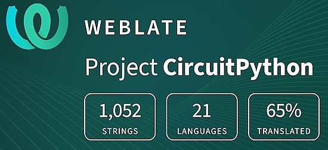](https://hosted.weblate.org/engage/circuitpython/)

One important feature of CircuitPython is translated control and error messages. With the help of fellow open source project [Weblate](https://weblate.org/), we're making it even easier to add or improve translations. 

Sign in with an existing account such as GitHub, Google or Facebook and start contributing through a simple web interface. No forks or pull requests needed! As always, if you run into trouble join us on [Discord](https://adafru.it/discord), we're here to help.

## NUMBER Thanks

The Adafruit Discord community, where we do all our CircuitPython development in the open, reached over NUMBER humans - thank you! Adafruit believes Discord offers a unique way for Python on hardware folks to connect. Join today at [https://adafru.it/discord](https://adafru.it/discord).

## ICYMI - In case you missed it

Python on hardware is the Adafruit Python video-newsletter-podcast! The news comes from the Python community, Discord, Adafruit communities and more and is broadcast on ASK an ENGINEER Wednesdays. The complete Python on Hardware weekly videocast [playlist is here](https://www.youtube.com/playlist?list=PLjF7R1fz_OOXRMjM7Sm0J2Xt6H81TdDev). The video podcast is on [iTunes](https://itunes.apple.com/us/podcast/python-on-hardware/id1451685192?mt=2), [YouTube](http://adafru.it/pohepisodes), [Instagram](https://www.instagram.com/adafruit/channel/), and [XML](https://itunes.apple.com/us/podcast/python-on-hardware/id1451685192?mt=2).

[The weekly community chat on Adafruit Discord server CircuitPython channel - Audio / Podcast edition](https://itunes.apple.com/us/podcast/circuitpython-weekly-meeting/id1451685016) - Audio from the Discord chat space for CircuitPython, meetings are usually Mondays at 2pm ET, this is the audio version on [iTunes](https://itunes.apple.com/us/podcast/circuitpython-weekly-meeting/id1451685016), Pocket Casts, [Spotify](https://adafru.it/spotify), and [XML feed](https://adafruit-podcasts.s3.amazonaws.com/circuitpython_weekly_meeting/audio-podcast.xml).

## Contribute

The CircuitPython Weekly Newsletter is a CircuitPython community-run newsletter emailed every Monday. To contribute your content, please email your news to cpnews (at) adafruit (dot) com with information and link(s) to your content. 

Join the Adafruit [Discord](https://adafru.it/discord) or [post to the forum](https://forums.adafruit.com/viewforum.php?f=60) if you have questions.
