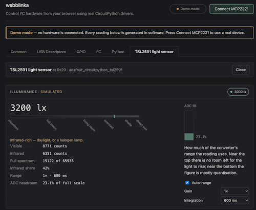
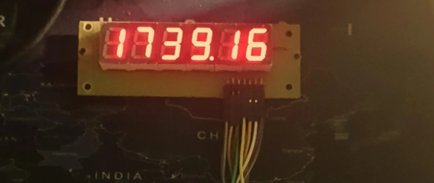
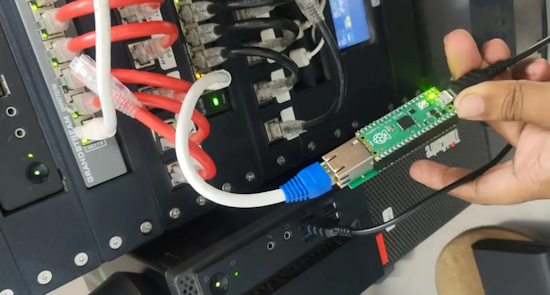
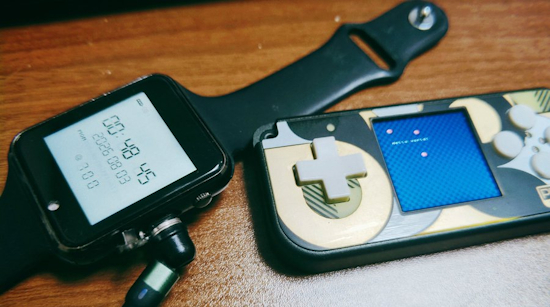
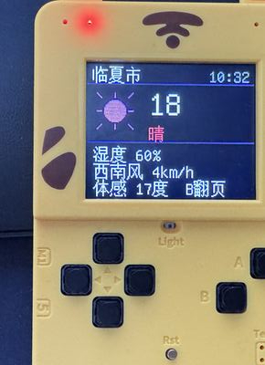
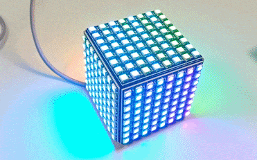
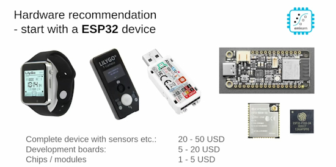

- [ ] Library and info updates
- [ ] change date
- [ ] update title
- [ ] Feature story
- [ ] Update  for images
- [ ] Update ICYDNCI
- [ ] All images 550w max only
- [ ] Link "View this email in your browser."

View this email in your browser. **Warning: Flashing Imagery**

Welcome to the latest Python on Microcontrollers newsletter! The smoke from Canada has cleared here but there is still fallout from last weeks' Coldcard Bitcoin hack, now [addressed](https://github.com/orgs/micropython/discussions/19588) by MicroPython founder Damien George. The headlines on the hack have flooded the tech pipelines. Fortunately I was able to snag some other news before the snarl. bunnie's new bao chip has been put on DEF CON 34 badges and MicroPython has a preliminary port to the chip. There is more information on speakers for CircuitPython Day to check out, it's coming up this month. And new ways to code both a MicroPython board and CircuitPython sensors. All of this and so much more for you in this issue. - *Anne Barela, Editor*

We're on [Discord](https://discord.gg/HYqvREz), [Twitter/X](https://twitter.com/search?q=circuitpython&src=typed_query&f=live), [BlueSky](https://bsky.app/profile/circuitpython.org) and for past newsletters - [view them all here](https://www.adafruitdaily.com/category/circuitpython/). If you're reading this on the web, please [subscribe here](https://www.adafruitdaily.com/). Here's the news this week:

## MicroPython Experimental Port for the Dabao

Matt Trentini and Andrew Leech have been working on a port for MicroPython for Dabao, an awesome RISC-V eval board built around the Baochip-1x SoC, both created by Andrew "bunnie" Huang. It builds on @ArmstrongSubero's daobao-sdk - [GitHub](https://github.com/orgs/micropython/discussions/19580). Via [X](https://x.com/deeempak/status/2085073082658754837).

## The DEF CON 34 Badge Packs a Surprise: Andrew "bunnie" Huang's "Mostly-Open" Baochip-x1

Attendees at the DEF CON 34 conference, to be held this week in Las Vegas, are going to find something very special on their badge: Andrew "bunnie" Huang's Baochip-x1, a "mostly-open" chip. 27,000 badges, to include bao and a removable camera module, will be distributed at the event. With the MicroPython port above, attendees may be able to run MicroPython on their badge - [hackster.io](https://www.hackster.io/news/the-def-con-34-badge-packs-a-surprise-andrew-bunnie-huang-s-mostly-open-baochip-x1-1e03307d4797.amp).

## CircuitPython Day will be August 21, 2026

It’s that time of year! Adafruit has determined that August 21, 2026 is the snakiest day of the year and designated it CircuitPython Day! Adafruit will have special shows and more throughout the day. Tag your projects #CircuitPythonDay2026 on social media and Adafruit will look to highlight them.

**Check out the the post for the latest schedule which changes as more content is added** - [Adafruit Blog](https://blog.adafruit.com/2026/07/28/circuitpython-day-will-be-august-21-2026/).

## vtOS: A Terminal-Based Hobby Firmware

vtOS turns a LilyGO T-Deck into a pocket-sized, hackable terminal computer. Written in MicroPython, it boots into a built-in shell stocked with retro and modern network clients - [GitHub](https://github.com/8bitmcu/vtOS) and [YouTube](https://www.youtube.com/watch?v=Kv201VVLHaI).

## Code your MicroPython Board and Leave the Cable Behind

To control a microcontroller with MicroPython, you need a way to send the written program to the board. Typically, this involves connecting via USB or joining a WiFi network, making it difficult to do so entirely with an iPad. Soggy_Woodpecker6502's PyBLE bridges this gap by using Bluetooth - [PyBLE](https://pyble.dev/), [FabScene](url), and [GitHub](https://github.com/PyBLE-dev/PyBLE).

## Use I2C devices in Your Computer's Browser with webblinka

webblinka allows you to control I²C hardware from your browser using real CircuitPython drivers. Plug in an MCP2221 or MCP2221A to your computer, click connect and grant access. Adafruit's Blinka and CircuitPython libraries run unmodified in a Python runtime inside the webpage and talk to the chip over WebHID — no server, no install - [BlueSky](https://bsky.app/profile/d.erenrich.net/post/3msj5kifmx22p), [Web Page](https://derenrich.github.io/webblinka/) and [GitHub](https://github.com/derenrich/webblinka/).

## MicroPython 1.29.0 Working Towards a Release

MicroPython is working towards release of version 1.29.0. 71% of issues are complete. They'd hoped to be done earlier this month - [GitHub](https://github.com/micropython/micropython/milestone/13).

Coldcard postmortem from MicroPython's perspective, by Damien George - [GitHub](https://github.com/orgs/micropython/discussions/19588).

## This Week's Python Streams

Python on Hardware is all about building a cooperative ecosphere which allows contributions to be valued and to grow knowledge. Below are the streams within the last week focusing on the community.

**CircuitPython Deep Dive Stream**

[Last Friday](https://youtube.com/live/kkBPx9nDvZw), Scott streamed work on nRF54LM20 on Zephyr.

You can see the latest video and past videos on the Adafruit YouTube channel under the Deep Dive playlist - [YouTube](https://www.youtube.com/playlist?list=PLjF7R1fz_OOXBHlu9msoXq2jQN4JpCk8A).

**CircuitPython Parsec**

John Park’s CircuitPython Parsec this week is on using buttons in the Fruit Jam library - [Adafruit Blog](https://blog.adafruit.com/2026/08/07/john-parks-circuitpython-parsec-fruit-jam-library-buttons/) and [YouTube](https://youtu.be/8spjp3bFsFs?si=Qg1tTtZ5Tice-AlB).

Catch all the episodes in the [YouTube playlist](https://www.youtube.com/playlist?list=PLjF7R1fz_OOWFqZfqW9jlvQSIUmwn9lWr).

**Deep Dive with Tim**

[Last week](https://youtube.com/live/-qfJSaMlEts), Tim streamed work on Flanger FX and more audio stuff.

You can see the latest video and past videos on the Adafruit YouTube channel under the Deep Dive playlist - [YouTube](https://www.youtube.com/playlist?list=PLjF7R1fz_OOWFqZfqW9jlvQSIUmwn9lWr).

**Other Shows**

Tod Kurt returns to The CircuitPython Show and shares how to create your own custom CircuitPython firmware - without a build environment - using only GitHub Actions. - [The CircuitPython Show](https://www.circuitpythonshow.com/).

In the latest episode of The Bootloader podcast, Tod Kurt discusses recent audio improvements in CircuitPython, including new I2S In support. - [The Bootloader](https://www.thebootloader.net/episodes/2026/ep035/)

**CircuitPython Weekly Meeting**

CircuitPython Weekly Meeting for August 3, 2026 ([notes](https://github.com/adafruit/adafruit-circuitpython-weekly-meeting/blob/main/2026/2026-08-03.md)) [on YouTube](https://youtu.be/NfdrL1WWtek).

## Project of the Week: Create Your Own Apollo Computers with Python

RecreateDSKY is a project and personal build journal to instruct Apollo enthusiasts on how to build their own DSKY and AGC based around Raspberry Pi, Arduino, and NASA archive drawings using Python - [Recreate DSKY](https://www.recreateapollo.com/recreatedsky) and [GitHub](https://github.com/RecreateApollo/RecreateDSKY). Via [hackster.io](https://www.hackster.io/news/this-diy-apollo-dsky-brings-moonshot-tech-to-your-desk-dbc977de3714).

## Popular Last Week

What was the most popular, most clicked link, in [last week's newsletter](https://www.adafruitdaily.com/2026/08/03/python-on-microcontrollers-newsletter-circuitpython-day-announced-micropython-tv-a-hack-and-more/)? [How-To Geek](https://www.howtogeek.com/the-raspberry-pis-reign-is-quietly-ending/).

Did you know you can read past issues of this newsletter in the Adafruit Daily Archive? [Check it out](https://www.adafruitdaily.com/category/circuitpython/).

## Adafruit Playground Notes

[Adafruit Playground](https://adafruit-playground.com/) is a place for the community to post their projects and other making tips/tricks/techniques. Ad-free, it's an easy way to publish your work in a safe space for free.

## News From Around the Web

Python package security in 2026: How supply chain attacks are targeting your AI development environment - [CSO](https://www.csoonline.com/article/4206245/python-package-security-in-2026.html).

Vláďa Smitka tweaked Dan Cogliano's Moon Miner game to use Picogame - [BlueSky](https://bsky.app/profile/smitka.bsky.social/post/3mrfdvlc2jc2n).

Tom Vulpes has created a capacitive touch instrument using pewter cast fungi embedded into a log. It uses a spoke-mini and runs CircuitPython to handle the MIDI - [BlueSky](https://bsky.app/profile/vulpeslabs.bsky.social/post/3msdwvtr7l22o).

Jeff Geerling: The Raspberry Pi I wasn't supposed to buy - [YouTube](https://www.youtube.com/watch?v=o4Lcg3YBYzg).

Build a Raspberry Pi Pico route finder using Dijkstra’s algorithm using Raspberry Pi Pico and MicroPython - [Raspberry Pi News](https://www.raspberrypi.com/news/build-a-raspberry-pi-pico-route-finder-using-dijkstras-algorithm/) and [GitHub](https://github.com/CrazyRobMiles/PICO-Nav).

HomeMade-HAL9000 turns a HAL9000 terminal into an AI chatbot with voice to text and text to voice using a Raspberry Pi and a Pi Pico - [GitHub](https://github.com/Withoutsleep/HomeMade-HAL9000) and [YouTube](https://www.youtube.com/watch?v=KlUB3jD_bqU&t=2s) (Spanish).

Christopher Nadler had been creating some interesting MicroPython software - [GitHub](url). Via [X](https://x.com/TimoNoko/status/2082353957649686598).

* Camera API for MicroPython
* MicroPython JPEG
* ESP DL (Deep Learning) MicroPython Binding

A CircuitPython program measuring the accuracy of the four channels of a Microchip MCP4728 12bit digital-to-analogue converter with a Cytron Maker Nano 2040 and an isolated TI ADS1115 with a late appearance by the [Adafruit Adjustable Breadboard Power Supply Kit](https://learn.adafruit.com/adjustable-breadboard-power-supply-kit) - [Instructables](https://www.instructables.com/MCP4728-DAC-Accuracy-DNL-INL-Using-ADS1115-ADC).

ShrikeClock a fully custom NTP-synced digital clock running on #MicroPython - [Reddit](https://www.reddit.com/r/adafruit/comments/1vd0frv/shrike_clock/) and [GitHub](https://github.com/kritishmohapatra/ShrikeClock).

USB HID racing wheel on RP2040 Zero with CircuitPython - [Reddit](https://www.reddit.com/r/circuitpython/comments/1vepp9z/usb_hid_racing_wheel_on_rp2040_zero_with/) and [GitHub](https://github.com/suprimer/diy-rp2040-racing-wheel).

PICOTTY project enables multi-target serial remote management through Raspberry Pi Pico boards and Pi Zero 2 W SBC - [CNX](https://www.cnx-software.com/2026/08/06/picotty-project-enables-multi-target-serial-remote-management-through-raspberry-pi-pico-boards-and-pi-zero-2-w-sbc/). Via [X](https://x.com/cnxsoft/status/2085360617356243356).

sugarflower writes on X - [X](https://x.com/euphoria6611/status/2083944124735197595). (Japanese)

> "When I was doing electronics tinkering, I realized that the internals can be made in any number of ways. The problem is the casing. Or so I thought. In the end, I ended up in this totally incomprehensible realm that's just programming with zero actual fabrication. Both of these are running on CircuitPython. I think I could've written them with Arduino or pure C++ w/ API too. But compile times are a drag, so I just cheated with Python."

yk, an open-source meta-tracing JIT compiler framework can automatically speed up C-based language interpreters like Lua and MicroPython with minimal, non-invasive code changes - [InfoQ(https://www.infoq.com/presentations/yk-meta-tracing-jit-compiler/). Via [X](https://x.com/jreuben1/status/2085240638560202898).

SvenRogue turned a  Xueersi ESP32 handheld into a smart weather station with ESP32 and MicroPython - [GitHub](https://github.com/SvenRogue/xueersi-esp32-weather). Via [X](https://x.com/SvenRogue/status/2084109356405231720). (Chinese)

A NeoPixel cube in action, glowing with different colors. The animation was written in MicroPython - [Mastodon](https://mastodon.social/@dr_muesli@woof.tech/117026551467348969).

Embedding Data Science in IoT devices with MicroPython and emlearn [PyCon DE & PyData 2026] - [YouTube](https://www.youtube.com/watch?v=lwTfY3Eh1dw).

PyCon South Africa talk: Sensor data processing on microcontrollers with MicroPython - [YouTube](https://www.youtube.com/watch?v=78WWEu9smCA).

Building a CircuitPython or MicroPython keypad/keyboard? Here are the best-selling switches of July 2026 - [KBD](https://kbd.news/Best-selling-keyboard-switches-of-July-2026-2895.html).

## New

Espressif has now started to sell samples of the ESP32-C61-MINI-1 and ESP32-C61-MINI-1U on AliExpress for $10.7 for a pack of 5 pieces, or around $2 per module - [CNX](https://www.cnx-software.com/2026/08/04/espressif-esp32-c61-mini-1-1u-wi-fi-6-and-ble-iot-module-2-dollars/).

Designed by ZecTrix Lab in China, the Note 4 is an ESP32-S3-based AI smart note with a 4.2-inch e-paper display and built-in voice input. The device is designed to display reminders, notes, clocks, weather, images, and custom templates, while the Note 4C variant replaces the monochrome display with a four-color e-paper panel. It features 2.4GHz WiFi and Bluetooth 5.0 connectivity, a microphone, a speaker, NFC, physical buttons, a USB Type-C port, a 2,000mAh rechargeable battery, and GPIO expansion for custom hardware projects - [CNX](https://www.cnx-software.com/2026/08/05/zectrix-note-4-a-4-2-inch-esp32-s3-wireless-e-paper-display-for-voice-tasks/).

## New Boards Supported by CircuitPython

The number of supported microcontrollers and Single Board Computers (SBC) grows every week. This section outlines which boards have been included in CircuitPython or added to [CircuitPython.org](https://circuitpython.org/).

This week there were three new boards added:
 
- [EP-2350 ting by Teenage Engineering](https://circuitpython.org/board/teenage_engineering_ep2350/)
- [Waveshare ESP32-S3-Tiny-N8R8 by Waveshare](https://circuitpython.org/board/waveshare_esp32_s3_tiny_n8r8/)
- [senseBox MCU Eye by senseBox](https://circuitpython.org/board/sensebox_mcu_eye_esp32s3/)

*Note: For non-Adafruit boards, please use the support forums of the board manufacturer for assistance, as Adafruit does not have the hardware to assist in troubleshooting.*

Looking to add a new board to CircuitPython? It's highly encouraged! Adafruit has four guides to help you do so:

- [How to Add a New Board to CircuitPython](https://learn.adafruit.com/how-to-add-a-new-board-to-circuitpython/overview)
- [How to add a New Board to the circuitpython.org website](https://learn.adafruit.com/how-to-add-a-new-board-to-the-circuitpython-org-website)
- [Adding a Single Board Computer to PlatformDetect for Blinka](https://learn.adafruit.com/adding-a-single-board-computer-to-platformdetect-for-blinka)
- [Adding a Single Board Computer to Blinka](https://learn.adafruit.com/adding-a-single-board-computer-to-blinka)

## New Adafruit Learning System Guides

The [Adafruit Learning System](https://learn.adafruit.com/) has over 3,200 free guides for learning skills and building projects including using Python.

[Voicebox FX: Record your voice and manipulate samples with effects](https://learn.adafruit.com/voicebox-fx) from [Ruiz Brothers and Liz Clark](https://learn.adafruit.com/u/pixil3d)

[Hacking the Teenage Engineering EP-2350 Ting](https://learn.adafruit.com/hacking-the-teenage-engineering-ep-2350-ting) from [Tim C](https://learn.adafruit.com/u/Foamyguy)

## CircuitPython Libraries

The CircuitPython library numbers are continually increasing, while existing ones continue to be updated. Here we provide library numbers and updates!

To get the latest Adafruit libraries, download the [Adafruit CircuitPython Library Bundle](https://circuitpython.org/libraries). To get the latest community contributed libraries, download the [CircuitPython Community Bundle](https://circuitpython.org/libraries).

If you'd like to contribute to the CircuitPython project on the Python side of things, the libraries are a great place to start. Check out the [CircuitPython.org Contributing page](https://circuitpython.org/contributing). If you're interested in reviewing, check out Open Pull Requests. If you'd like to contribute code or documentation, check out Open Issues. We have a guide on [contributing to CircuitPython with Git and GitHub](https://learn.adafruit.com/contribute-to-circuitpython-with-git-and-github), and you can find us in the #help-with-circuitpython and #circuitpython-dev channels on the [Adafruit Discord](https://adafru.it/discord).

You can check out this [list of all the Adafruit CircuitPython libraries and drivers available](https://github.com/adafruit/Adafruit_CircuitPython_Bundle/blob/master/circuitpython_library_list.md). 

The current number of CircuitPython libraries is **576**!

**New Libraries**
 
Here are this week's new CircuitPython libraries:
 
* [adafruit/Adafruit_CircuitPython_NAU88L21](https://github.com/adafruit/Adafruit_CircuitPython_NAU88L21)
* [Freyr86/m5paper_epd](https://github.com/Freyr86/m5paper_epd)
  
**Updated Libraries**
 
Here are this week's updated CircuitPython libraries:
 
* [adafruit/Adafruit_CircuitPython_INA23x](https://github.com/adafruit/Adafruit_CircuitPython_INA23x)
* [relic-se/CircuitPython_TLV320AIC3204](https://github.com/relic-se/CircuitPython_TLV320AIC3204)
  
## What’s the CircuitPython team up to this week?

What is the team up to this week? Let’s check in:

**Dan**

I've done more bug fixes for the CircuitPython 10.3.0 release. I have a large pull request in progress that partially fixes the serial connection for BLE workflow. It now works on macOS Chrome, but there's still more work to do to fix it for other operating systems. Different OS's handle bonding keys and other security details in different ways. LLMs have been helpful in tracking down these issues.

I also have another pull request that fixes some mDNS problems. It was a fairly simple fix, but an LLM found some related issues while working on it. I've noticed this several times: the LLM will helpfully note other bugs and deficiencies that were not directly a part of the original bug. This makes the PR bigger but better.

The mDNS fix was something in the back of my mind, and it also was suggested by the LLM as one of the alternatives after my first prompt to fix the bug. As an experiment, I gave exactly the same prompt to the same LLM at higher and lower effort levels, and also to to other LLMs, one supposedly more capable, and one less capable. Interestingly, in none of these trials did the LLMs suggest that fix in their initial responses.

**Tim**

I wrapped up the guide for the Teenage Engineering EP-2350 ting this week. Afterward I turned to a few other audio related things in the core: Testing out a PR that adds stereo support for `usb_audio` and fixing some issues that arose for the mono functionality within it. I submitted a PR with a Flanger effect class for the core. I also researched I2S codecs and came to the conclusion that the `invert_bit_clock` argument that I put on the I2SIn object while developing it recently is unneeded and removed it.

**Scott**

Last week I got my hardware in the loop (HIL) host software flashing an ESP from pure Python. In a bit of a pivot, I've pushed all of the pending HIL code and am focusing on the nRF54LM20 in CircuitPython. This is a newer BLE chipset from Nordic that looks like an excellent successor to the nRF52840 that we use on our BLE specific boards. Our support in CircuitPython for the LM20 is through Zephyr so we'll see many more chips benefit from the work their. I'm starting by dusting off my previous BLE work and finishing GATT support. Pairing and bonding will come after that.

## Upcoming Events

The HOPE 26 Conference is from August 14th through 16th at the New Yorker Hotel, NY, NY - [2600.com](https://www.hope.net/).

The next MicroPython Meetup in Melbourne will be on August 26 – [Luma](https://luma.com/micropython). You can see recordings of previous meetings on [YouTube](https://www.youtube.com/@MicroPythonOfficial). 

**Other Events This Year**

* [PyCon AU 2026](https://2026.pycon.org.au/) will be 26 Aug. 2026 – 30 Aug. 2026 in Brisbane, Australia.
* [PyConZA 2026](https://za.pycon.org/), South Africa's Python conference, will be 14–18 Oct at Belmont Square, Cape Town, South Africa.
* [Espressif DevCon 2026](https://devcon.espressif.com/) will be November 3-4 in Milan, Italy and online.

If you know of virtual events or upcoming events, please let us know via email to cpnews(at)adafruit(dot)com.

## Latest Releases

CircuitPython's stable release is [10.2.1](https://github.com/adafruit/circuitpython/releases/tag/10.2.1) and its unstable release is [10.3.0-alpha.4](https://github.com/adafruit/circuitpython/releases/tag/10.3.0-alpha.4). New to CircuitPython? Start with our [Welcome to CircuitPython Guide](https://learn.adafruit.com/welcome-to-circuitpython).

[20260803](https://github.com/adafruit/Adafruit_CircuitPython_Bundle/releases/latest) is the latest Adafruit CircuitPython library bundle.

[20260806](https://github.com/adafruit/CircuitPython_Community_Bundle/releases/latest) is the latest CircuitPython Community library bundle.

[v1.28.0](https://micropython.org/download) is the latest MicroPython release. Documentation for it is [here](http://docs.micropython.org/en/latest/pyboard/).

[3.14.7](https://www.python.org/downloads/) is the latest Python release. The latest pre-release version is [3.15.0rc1](https://www.python.org/download/pre-releases/).

[4,536 Stars](https://github.com/adafruit/circuitpython/stargazers) Like CircuitPython? [Star it on GitHub!](https://github.com/adafruit/circuitpython)

## Call for Help -- Translating CircuitPython is now easier than ever

One important feature of CircuitPython is translated control and error messages. With the help of fellow open source project [Weblate](https://weblate.org/), we're making it even easier to add or improve translations. 

Sign in with an existing account such as GitHub, Google or Facebook and start contributing through a simple web interface. No forks or pull requests needed! As always, if you run into trouble join us on [Discord](https://adafru.it/discord), we're here to help.

## 38,925 Thanks

The Adafruit Discord community, where we do all our CircuitPython development in the open, reached 38,925 humans - thank you! Adafruit believes Discord offers a unique way for Python on hardware folks to connect. Join today at [https://adafru.it/discord](https://adafru.it/discord).

## ICYMI - In case you missed it

Python on hardware is the Adafruit Python video-newsletter-podcast! The news comes from the Python community, Discord, Adafruit communities and more and is broadcast on ASK an ENGINEER Wednesdays. The complete Python on Hardware weekly videocast [playlist is here](https://www.youtube.com/playlist?list=PLjF7R1fz_OOXRMjM7Sm0J2Xt6H81TdDev). The video podcast is on [iTunes](https://itunes.apple.com/us/podcast/python-on-hardware/id1451685192?mt=2), [YouTube](http://adafru.it/pohepisodes), [Instagram](https://www.instagram.com/adafruit/channel/), and [XML](https://itunes.apple.com/us/podcast/python-on-hardware/id1451685192?mt=2).

[The weekly community chat on Adafruit Discord server CircuitPython channel - Audio / Podcast edition](https://itunes.apple.com/us/podcast/circuitpython-weekly-meeting/id1451685016) - Audio from the Discord chat space for CircuitPython, meetings are usually Mondays at 2pm ET, this is the audio version on [iTunes](https://itunes.apple.com/us/podcast/circuitpython-weekly-meeting/id1451685016), Pocket Casts, [Spotify](https://adafru.it/spotify), and [XML feed](https://adafruit-podcasts.s3.amazonaws.com/circuitpython_weekly_meeting/audio-podcast.xml).

## Contribute

The CircuitPython Weekly Newsletter is a CircuitPython community-run newsletter emailed every Monday. To contribute your content, please email your news to cpnews (at) adafruit (dot) com with information and link(s) to your content. 

Join the Adafruit [Discord](https://adafru.it/discord) or [post to the forum](https://forums.adafr
