- [ ] Library and info updates
- [ ] change date
- [ ] update title
- [ ] Feature story
- [ ] Update  for images
- [ ] Update ICYDNCI
- [ ] All images 550w max only
- [ ] Link "View this email in your browser."

News Sources

- [Adafruit Playground](https://adafruit-playground.com/)
- Twitter: [CircuitPython](https://twitter.com/search?q=circuitpython&src=typed_query&f=live), [MicroPython](https://twitter.com/search?q=micropython&src=typed_query&f=live) and [Python](https://twitter.com/search?q=python&src=typed_query)
- [Raspberry Pi News](https://www.raspberrypi.com/news/), [Pi Foundation](https://www.raspberrypi.org/blog/)
- Mastodon [CircuitPython](https://mastodon.social/tags/CircuitPython) and [MicroPython](https://mastodon.social/tags/MicroPython)
- BlueSky [CircuitPython](https://bsky.app/search?q=circuitpython), [MicroPython](https://bsky.app/search?q=micropython), [Raspberry Pi](https://bsky.app/search?q=raspberry+pi)
- [Google News Python](https://news.google.com/topics/CAAqIQgKIhtDQkFTRGdvSUwyMHZNRFY2TVY4U0FtVnVLQUFQAQ?hl=en-US&gl=US&ceid=US%3Aen), [Infoworld](https://www.infoworld.com/python/)
- YouTube: [CircuitPython](https://www.youtube.com/results?search_query=circuitpython&sp=CAISBAgDEAE%253D), [MicroPython](https://www.youtube.com/results?search_query=micropython&sp=CAISBAgDEAE%253D), [Prof Gallaugher](https://www.youtube.com/@BuildWithProfG/videos)
- [maker.io Python](https://www.digikey.com/en/maker/search-results?s=createdDate&t=python)
- [hackster.io CircuitPython](https://www.hackster.io/search?q=circuitpython&i=projects&sort_by=most_recent) and [MicroPython](https://www.hackster.io/search?q=micropython&i=projects&sort_by=most_recent)
- Instructables: [CircuitPython](https://www.instructables.com/search/?q=circuitpython&projects=all&sort=Newest), [MicroPython](https://www.instructables.com/search/?q=micropython&projects=all&sort=Newest), [Raspberry Pi Python](https://www.instructables.com/search/?q=raspberry+pi+python&projects=all&sort=Newest)
- [hackaday CircuitPython](https://hackaday.com/blog/?s=circuitpython) and [MicroPython](https://hackaday.com/blog/?s=micropython)
- [python.org](https://www.python.org/)
- [Python Insider - dev team blog](https://blog.python.org/)
- Individuals: [bret.dk](https://bret.dk/), [Jeff Geerling](https://www.jeffgeerling.com/blog), [Yakroo](https://x.com/Yakroo5077), [coXXect](https://coxxect.blogspot.com/)
- Tom's Hardware: [CircuitPython](https://www.tomshardware.com/search?searchTerm=circuitpython&articleType=all&sortBy=publishedDate) and [MicroPython](https://www.tomshardware.com/search?searchTerm=micropython&articleType=all&sortBy=publishedDate) and [Raspberry Pi](https://www.tomshardware.com/search?searchTerm=raspberry%20pi&articleType=all&sortBy=publishedDate)
- [hackaday.io newest projects MicroPython](https://hackaday.io/projects?tag=micropython&sort=date) and [CircuitPython](https://hackaday.io/projects?tag=circuitpython&sort=date)
- hackaday.io - [CircuitPython](https://hackaday.io/search?term=circuitpython) and [MicroPython](https://hackaday.io/search?term=micropython)
- [MicroPython Meeting](https://luma.com/micropython?k=c)

View this email in your browser. **Warning: Flashing Imagery**

Welcome to the latest Python on Microcontrollers newsletter! *insert 2-3 sentences from editor (what's in overview, banter)* - *Anne Barela, Editor*

We're on [Discord](https://discord.gg/HYqvREz), [Twitter/X](https://twitter.com/search?q=circuitpython&src=typed_query&f=live), [BlueSky](https://bsky.app/profile/circuitpython.org) and for past newsletters - [view them all here](https://www.adafruitdaily.com/category/circuitpython/). If you're reading this on the web, please [subscribe here](https://www.adafruitdaily.com/). Here's the news this week:

## Headline

text - [site](url).

## CircuitPython Day is Coming Up On August 21, 2026

It’s that time of year! Adafruit has determined that August 21, 2026 is the snakiest day of the year and designated it CircuitPython Day! Adafruit will have special shows and more throughout the day. Tag your projects #CircuitPythonDay2026 on social media and Adafruit will look to highlight them.

**Check out the the post for the latest schedule which changes as more content is added** - [Adafruit Blog](https://blog.adafruit.com/2026/07/28/circuitpython-day-will-be-august-21-2026/).

## MicroPython Can Be Installed Via `pip`

Gadgetoid on BlueSky notes "someone has made MicroPython installable via pip. Mad, genius or mad genius? It's kinda brilliant" - [BlueSky](https://bsky.app/profile/gadgetoid.com/post/3mpy3hmzwsc2j).

## A CircuitPython-Based Guitar Pedal

[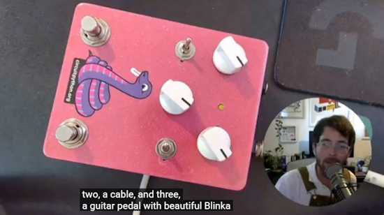](https://bsky.app/profile/dcdalrymple.com/post/3mswkuxo6w22k)

Cooper, aka ReLiC-se has Whipped together a demo of a good handful of the audio effects available on CircuitPython playing live directly through his prototype DSP guitar pedal - [BlueSky](https://bsky.app/profile/dcdalrymple.com/post/3mswkuxo6w22k) and [YouTube](https://youtu.be/IdIxqGVd07Q?si=f4FYm8jMDk3jSPqU).

## 10,501 Radios in Seven Days: What a $69 Badge Heard at Summer Camp

[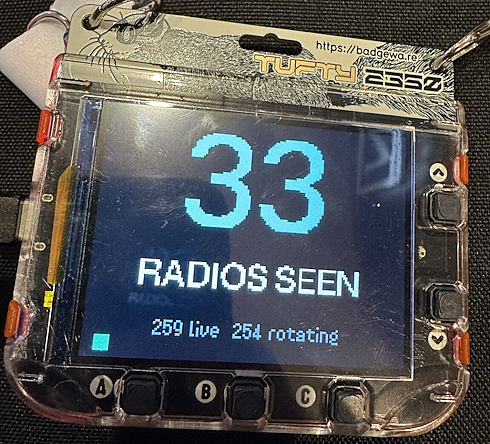](https://jerrygamblin.com/2026/08/10/10501-radios-in-seven-days-what-a-69-badge-heard-at-summer-camp/)

Jerry Gamblin wanted to build a little screen on a bag that shows what networks are nearby and what they are. The thing that finally made it possible was the [Pimoroni Tufty 2350 showing up at Adafruit](https://www.adafruit.com/product/6462): an RP2350B, a 2.8″ colour screen, 2.4 GHz WiFi and Bluetooth, a 1000 mAh battery in the box, and MicroPython already flashed on it - [JerryGamblin.com](https://jerrygamblin.com/2026/08/10/10501-radios-in-seven-days-what-a-69-badge-heard-at-summer-camp/).

> "Seven days of Summer Camp produced 4,653 access points and 5,848 Bluetooth devices, all of it passive."

## The Best New Features in Python 3.15

Highlights of Python 3.15 include lazy imports, faster JIT compilation, better error messages, and smarter profiling. A [release candidate](https://www.python.org/downloads/release/python-3150rc1/) is now available - [InfoWorld](https://www.infoworld.com/article/4166693/the-best-new-features-in-python-3-15.html).

## Five Easy Ways to Install Python on Windows

Learn how to install Python on Windows using the Python Install Manager, WinGet, uv, Miniconda, or the official Python installer, and choose the best setup for beginners and Python development - [KDnuggets](https://www.kdnuggets.com/5-easy-ways-to-install-python-on-windows).

## This Week's Python Streams

Python on Hardware is all about building a cooperative ecosphere which allows contributions to be valued and to grow knowledge. Below are the streams within the last week focusing on the community.

**CircuitPython Deep Dive Stream**

[Last Friday](), Scott streamed work on .

You can see the latest video and past videos on the Adafruit YouTube channel under the Deep Dive playlist - [YouTube](https://www.youtube.com/playlist?list=PLjF7R1fz_OOXBHlu9msoXq2jQN4JpCk8A).

**CircuitPython Parsec**

John Park’s CircuitPython Parsec this week is on  - [Adafruit Blog]() and [YouTube]().

Catch all the episodes in the [YouTube playlist](https://www.youtube.com/playlist?list=PLjF7R1fz_OOWFqZfqW9jlvQSIUmwn9lWr).

**Deep Dive with Tim**

[Last week](), Tim streamed work on .

You can see the latest video and past videos on the Adafruit YouTube channel under the Deep Dive playlist - [YouTube](https://www.youtube.com/playlist?list=PLjF7R1fz_OOWFqZfqW9jlvQSIUmwn9lWr).

**CircuitPython Weekly Meeting**

CircuitPython Weekly Meeting for August 10th, 2026 ([notes](https://github.com/adafruit/adafruit-circuitpython-weekly-meeting/blob/main/2026/2026-08-10.md)) [on YouTube](https://youtu.be/kmKhcvCmBTE).

## Project of the Week: Track Bird Visitors With A Raspberry Pi

BirdNET uses deep learning to identify more than 11,000+ species worldwide from sound. Teddy Warner builds open-source tools that scale from a single recording to continent-wide monitoring programs — making professional bioacoustics accessible to researchers, conservationists, and citizen scientists alike. It reports on a web interface of its own making, but what really takes things to a new level is an optional, stylish E-Ink panel that shows the last 24 hours’ worth of visitors at a glance in a collage - [BirdNET](https://birdnet.cornell.edu/) and [GitHub](https://github.com/birdnet-team). Via [Hackaday](https://hackaday.com/2026/08/08/track-bird-visitors-with-a-raspberry-pi-and-a-usb-mic/).

## Popular Last Week

What was the most popular, most clicked link, in [last week's newsletter](https://www.adafruitdaily.com/2026/08/03/python-on-microcontrollers-newsletter-circuitpython-day-announced-micropython-tv-a-hack-and-more/)? [How-To Geek](https://www.howtogeek.com/the-raspberry-pis-reign-is-quietly-ending/).

Did you know you can read past issues of this newsletter in the Adafruit Daily Archive? [Check it out](https://www.adafruitdaily.com/category/circuitpython/).

## Notes from Adafruit Playground

[Adafruit Playground](https://adafruit-playground.com/) is a place for the community to post their projects and other making tips/tricks/techniques. Ad-free, it's an easy way to publish your work in a safe space for free.

[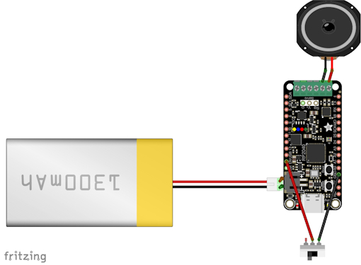](https://adafruit-playground.com/u/societal_participant/pages/electronic-cowbell)

Electronic Cowbell - [Adafruit Playground](https://adafruit-playground.com/u/societal_participant/pages/electronic-cowbell).

text - [Adafruit Playground](url).

text - [Adafruit Playground](url).

## News From Around the Web

text - [site](url).

[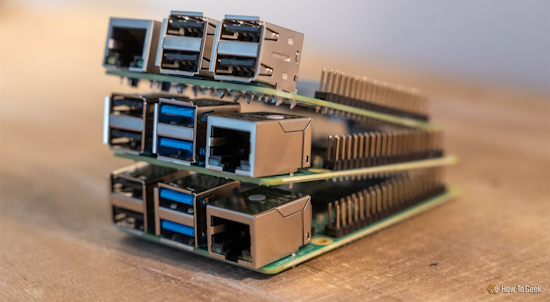](https://www.howtogeek.com/buying-raspberry-pi-2026-better-have-a-very-good-reason/)

Buying a Raspberry Pi in 2026? You'd better have a very good reason - [How-To Geek](https://www.howtogeek.com/buying-raspberry-pi-2026-better-have-a-very-good-reason/).

[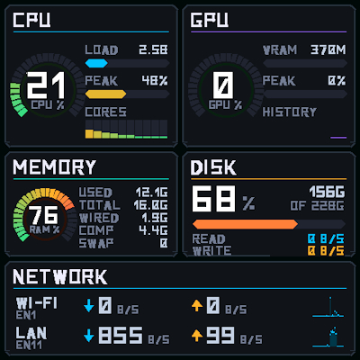](https://github.com/vwillcox/MacStatP)

A Mac Status Display using a Pimoroni Presto and MicroPython. A 480×480 hardware system monitor for macOS. A small agent on the Mac samples CPU, GPU, memory, disk and network and sends them to a Pimoroni Presto over USB; the board draws an AIDA64-style panel with radial gauges, bar meters, per-core activity and per-interface network traffic - [GitHub](https://github.com/vwillcox/MacStatP).

[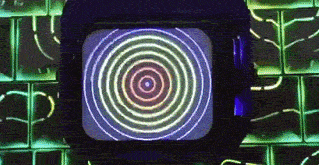](https://x.com/Alacritic_Super/status/2087861736833753362)

Praveen Kumar Verma writes "What if your ESP32 had its own virtual pet? OpenGotchi is an open-source handheld built around an ESP32-S3. It has a 1.8" AMOLED display, physical buttons, WiFi and gotchiOS. But it's more than a cute gadget. The device has its own apps, supports MicroPython, and can connect to the internet using MQTT. Tiny hardware, but a surprisingly complete embedded system - [X](https://x.com/Alacritic_Super/status/2087861736833753362).

[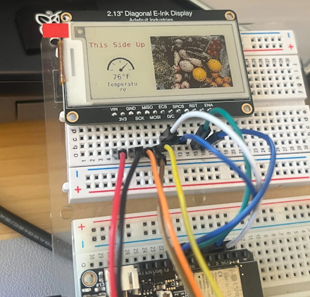](https://bsky.app/profile/brentrubell.bsky.social/post/3msspbp2fc22q)

Brent Rubell gives a sneak peek of a marquee which supports any e-paper display panel, color modes, and any hardware that can fetch raw data from adafruit.io. He'll show off the CircuitPython version during a stream for CircuitPython Day - [BlueSky](https://bsky.app/profile/brentrubell.bsky.social/post/3msspbp2fc22q).

text - [site](url).

text - [site](url).

[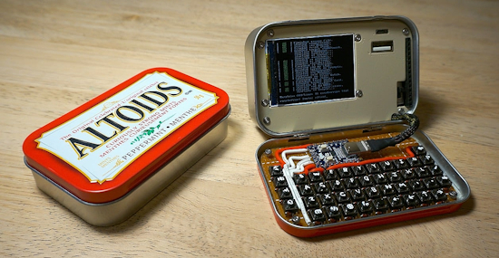](https://www.raspberrypi.com/news/curiously-minty-raspberry-pi-zero-cyberdeck/)

A curiously minty Raspberry Pi Zero cyberdeck - [Raspberry Pi News](https://www.raspberrypi.com/news/curiously-minty-raspberry-pi-zero-cyberdeck/) and [YouTube](https://youtu.be/j262kCYZxZI).

A DIY-made "Automatic Water Cannon" to protect crops from animals. It integrates an electric water gun (ICE BURST) using Raspberry Pi Pico 2W + motion sensor + relay. When motion is detected, it automatically shoots for 2 seconds. Programmed in MicroPython - [X](https://x.com/59xa/status/2087889225253560374) (Japanese).

text - [site](url).

text - [site](url).

text - [site](url).

text - [site](url).

text - [site](url).

text - [site](url).

text - [site](url).

text - [site](url).

text - [site](url).

## New

[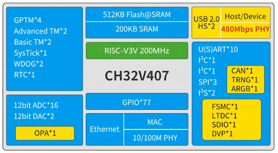](https://www.cnx-software.com/2026/08/13/wch-ch32v407-467-risc-v-mcu-integrates-fast-ethernet-mac-phy-480-mbps-usb-2-0-phy-up-to-8-mb-on-chip-psram/)

WCH CH32V407 and CH32V467 are new 200 MHz RISC-V microcontrollers with a built-in 10/100 Mbps Ethernet MAC + PHY, a USB 2.0 high-speed (480 Mbps) host PHY, up to 8 MB on-chip PSRAM, and a range of peripherals for industrial IoT & edge AI applications - [CNX](https://www.cnx-software.com/2026/08/13/wch-ch32v407-467-risc-v-mcu-integrates-fast-ethernet-mac-phy-480-mbps-usb-2-0-phy-up-to-8-mb-on-chip-psram/).

[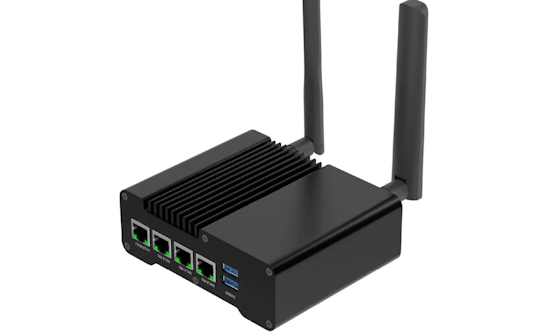](https://www.cnx-software.com/2026/08/10/raspberry-pi-cm4-cm5-based-wisgate-connect-router-rak7392-offers-2-5gbe-mini-pcie-and-wisblock-expansion/)

RAKwireless has just launched the WisGate Connect Router RAK7392 (not to be confused with the older WisGate Connect RAK7391), an industrial-grade edge router and gateway built around Raspberry Pi Compute Module 4/5 (CM4/CM5). The system features three Gigabit Ethernet ports, one 2.5GbE port, wireless expansion via a mini PCIe slot, and WisBlock connectors for sensors and I/O modules - [CNX](https://www.cnx-software.com/2026/08/10/raspberry-pi-cm4-cm5-based-wisgate-connect-router-rak7392-offers-2-5gbe-mini-pcie-and-wisblock-expansion/).

## New Boards Supported by CircuitPython

The number of supported microcontrollers and Single Board Computers (SBC) grows every week. This section outlines which boards have been included in CircuitPython or added to [CircuitPython.org](https://circuitpython.org/).

This week there were (#/no) new boards added:

- [Board name](url)
- [Board name](url)
- [Board name](url)

*Note: For non-Adafruit boards, please use the support forums of the board manufacturer for assistance, as Adafruit does not have the hardware to assist in troubleshooting.*

Looking to add a new board to CircuitPython? It's highly encouraged! Adafruit has four guides to help you do so:

- [How to Add a New Board to CircuitPython](https://learn.adafruit.com/how-to-add-a-new-board-to-circuitpython/overview)
- [How to add a New Board to the circuitpython.org website](https://learn.adafruit.com/how-to-add-a-new-board-to-the-circuitpython-org-website)
- [Adding a Single Board Computer to PlatformDetect for Blinka](https://learn.adafruit.com/adding-a-single-board-computer-to-platformdetect-for-blinka)
- [Adding a Single Board Computer to Blinka](https://learn.adafruit.com/adding-a-single-board-computer-to-blinka)

## New Adafruit Learning System Guides

The [Adafruit Learning System](https://learn.adafruit.com/) has over 3,200 free guides for learning skills and building projects including using Python.

[title](url) from [name](url)

[title](url) from [name](url)

[title](url) from [name](url)

## Updated Learn Guides

[title](url)

## CircuitPython Libraries

The CircuitPython library numbers are continually increasing, while existing ones continue to be updated. Here we provide library numbers and updates!

To get the latest Adafruit libraries, download the [Adafruit CircuitPython Library Bundle](https://circuitpython.org/libraries). To get the latest community contributed libraries, download the [CircuitPython Community Bundle](https://circuitpython.org/libraries).

If you'd like to contribute to the CircuitPython project on the Python side of things, the libraries are a great place to start. Check out the [CircuitPython.org Contributing page](https://circuitpython.org/contributing). If you're interested in reviewing, check out Open Pull Requests. If you'd like to contribute code or documentation, check out Open Issues. We have a guide on [contributing to CircuitPython with Git and GitHub](https://learn.adafruit.com/contribute-to-circuitpython-with-git-and-github), and you can find us in the #help-with-circuitpython and #circuitpython-dev channels on the [Adafruit Discord](https://adafru.it/discord).

You can check out this [list of all the Adafruit CircuitPython libraries and drivers available](https://github.com/adafruit/Adafruit_CircuitPython_Bundle/blob/master/circuitpython_library_list.md). 

The current number of CircuitPython libraries is **###**!

**New Libraries**

Here are this week's new CircuitPython libraries:

* [library](url)

**Updated Libraries**

Here are this week's updated CircuitPython libraries:

* [library](url)

## What’s the CircuitPython team up to this week?

What is the team up to this week? Let’s check in:

**Dan**

I spent more time on fixing the CircuitPython BLE workflow last week. After a lot of testing, mostly done by test scripts written by an LLM, I determined that the problem was with the particular BLE adapter on my desktop computer. I replaced it with a better-supported adapter and the base problem went away. There is still an issue that Linux does not provide a pairing agent automatically, but we can document workarounds for that.

**Tim**

I have continued work related to audio this week. I did some more testing on the USB audio stereo support and found a bug in `synthio.Note` panning. A fix for that was submitted and I tested it. I have also been working on a CircuitPython board def and some core modules to support another Teenage Engineering device. This one is has nRF52840 main chip, along with an I2S audio codec, and 4Gb EMMC storage. I've made good progress, the device is booting successfully under CircuitPython and I have functional audio PoC code. My next goal is getting the EMMC working to be able to copy songs to the device and eventually play them back.

**Scott**

At the end of last week I started working on Zephyr BLE pairing and bonding which leads to secure connections. BLE GATT support for Zephyr was also merged. I'm looking forward to getting the BLE workflow going with Zephyr.

## Upcoming Events

)

The next MicroPython Meetup in Melbourne will be on August 26 – [Luma](https://luma.com/micropython). You can see recordings of previous meetings on [YouTube](https://www.youtube.com/@MicroPythonOfficial). 

[PyCon AU 2026](https://2026.pycon.org.au/) will be 26 Aug. 2026 – 30 Aug. 2026 in Brisbane, Australia.

**Other Events This Year**

* [Maker Faire Bay Area](https://x.com/MicrochipMakes/status/2087892507191370013) is September 26-28 at Mare Island, California
* [PyConZA 2026](https://za.pycon.org/), South Africa's Python conference, will be 14–18 Oct at Belmont Square, Cape Town, South Africa.
* [Espressif DevCon 2026](https://devcon.espressif.com/) will be November 3-4 in Milan, Italy and online.

If you know of virtual events or upcoming events, please let us know via email to cpnews(at)adafruit(dot)com.

## Latest Releases

CircuitPython's stable release is [#.#.#](https://github.com/adafruit/circuitpython/releases/latest) and its unstable release is [#.#.#-##.#](https://github.com/adafruit/circuitpython/releases). New to CircuitPython? Start with our [Welcome to CircuitPython Guide](https://learn.adafruit.com/welcome-to-circuitpython).

[2026####](https://github.com/adafruit/Adafruit_CircuitPython_Bundle/releases/latest) is the latest Adafruit CircuitPython library bundle.

[2026####](https://github.com/adafruit/CircuitPython_Community_Bundle/releases/latest) is the latest CircuitPython Community library bundle.

[v#.#.#](https://micropython.org/download) is the latest MicroPython release. Documentation for it is [here](http://docs.micropython.org/en/latest/pyboard/).

[#.#.#](https://www.python.org/downloads/) is the latest Python release. The latest pre-release version is [#.#.#](https://www.python.org/download/pre-releases/).

[#,### Stars](https://github.com/adafruit/circuitpython/stargazers) Like CircuitPython? [Star it on GitHub!](https://github.com/adafruit/circuitpython)

## Call for Help -- Translating CircuitPython is now easier than ever

[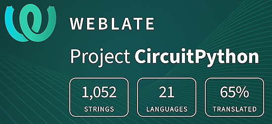](https://hosted.weblate.org/engage/circuitpython/)

One important feature of CircuitPython is translated control and error messages. With the help of fellow open source project [Weblate](https://weblate.org/), we're making it even easier to add or improve translations. 

Sign in with an existing account such as GitHub, Google or Facebook and start contributing through a simple web interface. No forks or pull requests needed! As always, if you run into trouble join us on [Discord](https://adafru.it/discord), we're here to help.

## NUMBER Thanks

The Adafruit Discord community, where we do all our CircuitPython development in the open, reached over NUMBER humans - thank you! Adafruit believes Discord offers a unique way for Python on hardware folks to connect. Join today at [https://adafru.it/discord](https://adafru.it/discord).

## ICYMI - In case you missed it

Python on hardware is the Adafruit Python video-newsletter-podcast! The news comes from the Python community, Discord, Adafruit communities and more and is broadcast on ASK an ENGINEER Wednesdays. The complete Python on Hardware weekly videocast [playlist is here](https://www.youtube.com/playlist?list=PLjF7R1fz_OOXRMjM7Sm0J2Xt6H81TdDev). The video podcast is on [iTunes](https://itunes.apple.com/us/podcast/python-on-hardware/id1451685192?mt=2), [YouTube](http://adafru.it/pohepisodes), [Instagram](https://www.instagram.com/adafruit/channel/), and [XML](https://itunes.apple.com/us/podcast/python-on-hardware/id1451685192?mt=2).

[The weekly community chat on Adafruit Discord server CircuitPython channel - Audio / Podcast edition](https://itunes.apple.com/us/podcast/circuitpython-weekly-meeting/id1451685016) - Audio from the Discord chat space for CircuitPython, meetings are usually Mondays at 2pm ET, this is the audio version on [iTunes](https://itunes.apple.com/us/podcast/circuitpython-weekly-meeting/id1451685016), Pocket Casts, [Spotify](https://adafru.it/spotify), and [XML feed](https://adafruit-podcasts.s3.amazonaws.com/circuitpython_weekly_meeting/audio-podcast.xml).

## Contribute

The CircuitPython Weekly Newsletter is a CircuitPython community-run newsletter emailed every Monday. To contribute your content, please email your news to cpnews (at) adafruit (dot) com with information and link(s) to your content. 

Join the Adafruit [Discord](https://adafru.it/discord) or [post to the forum](https://forums.adafruit.com/viewforum.php?f=60) if you have questions.
