- [ ] Library and info updates
- [ ] change date
- [ ] update title
- [ ] Feature story
- [ ] Update  for images
- [ ] Update ICYDNCI
- [ ] All images 550w max only
- [ ] Link "View this email in your browser."

News Sources

- [Adafruit Playground](https://adafruit-playground.com/)
- Twitter: [CircuitPython](https://twitter.com/search?q=circuitpython&src=typed_query&f=live), [MicroPython](https://twitter.com/search?q=micropython&src=typed_query&f=live) and [Python](https://twitter.com/search?q=python&src=typed_query)
- [Raspberry Pi News](https://www.raspberrypi.com/news/), [Pi Foundation](https://www.raspberrypi.org/blog/)
- Mastodon [CircuitPython](https://mastodon.social/tags/CircuitPython) and [MicroPython](https://mastodon.social/tags/MicroPython)
- BlueSky [CircuitPython](https://bsky.app/search?q=circuitpython), [MicroPython](https://bsky.app/search?q=micropython), [Raspberry Pi](https://bsky.app/search?q=raspberry+pi)
- [Google News Python](https://news.google.com/topics/CAAqIQgKIhtDQkFTRGdvSUwyMHZNRFY2TVY4U0FtVnVLQUFQAQ?hl=en-US&gl=US&ceid=US%3Aen), [Infoworld](https://www.infoworld.com/python/)
- YouTube: [CircuitPython](https://www.youtube.com/results?search_query=circuitpython&sp=CAISBAgDEAE%253D), [MicroPython](https://www.youtube.com/results?search_query=micropython&sp=CAISBAgDEAE%253D), [Prof Gallaugher](https://www.youtube.com/@BuildWithProfG/videos)
- [maker.io Python](https://www.digikey.com/en/maker/search-results?s=createdDate&t=python)
- [hackster.io CircuitPython](https://www.hackster.io/search?q=circuitpython&i=projects&sort_by=most_recent) and [MicroPython](https://www.hackster.io/search?q=micropython&i=projects&sort_by=most_recent)
- Instructables: [CircuitPython](https://www.instructables.com/search/?q=circuitpython&projects=all&sort=Newest), [MicroPython](https://www.instructables.com/search/?q=micropython&projects=all&sort=Newest), [Raspberry Pi Python](https://www.instructables.com/search/?q=raspberry+pi+python&projects=all&sort=Newest)
- [hackaday CircuitPython](https://hackaday.com/blog/?s=circuitpython) and [MicroPython](https://hackaday.com/blog/?s=micropython)
- [python.org](https://www.python.org/)
- [Python Insider - dev team blog](https://blog.python.org/)
- Individuals: [bret.dk](https://bret.dk/), [Jeff Geerling](https://www.jeffgeerling.com/blog), [Yakroo](https://x.com/Yakroo5077), [coXXect](https://coxxect.blogspot.com/)
- Tom's Hardware: [CircuitPython](https://www.tomshardware.com/search?searchTerm=circuitpython&articleType=all&sortBy=publishedDate) and [MicroPython](https://www.tomshardware.com/search?searchTerm=micropython&articleType=all&sortBy=publishedDate) and [Raspberry Pi](https://www.tomshardware.com/search?searchTerm=raspberry%20pi&articleType=all&sortBy=publishedDate)
- [hackaday.io newest projects MicroPython](https://hackaday.io/projects?tag=micropython&sort=date) and [CircuitPython](https://hackaday.io/projects?tag=circuitpython&sort=date)
- hackaday.io - [CircuitPython](https://hackaday.io/search?term=circuitpython) and [MicroPython](https://hackaday.io/search?term=micropython)
- [MicroPython Meeting](https://luma.com/micropython?k=c)

View this email in your browser. **Warning: Flashing Imagery**

Welcome to the latest Python on Microcontrollers newsletter! *insert 2-3 sentences from editor (what's in overview, banter)* - *Anne Barela, Editor*

We're on [Discord](https://discord.gg/HYqvREz), [Twitter/X](https://twitter.com/search?q=circuitpython&src=typed_query&f=live), [BlueSky](https://bsky.app/profile/circuitpython.org) and for past newsletters - [view them all here](https://www.adafruitdaily.com/category/circuitpython/). If you're reading this on the web, please [subscribe here](https://www.adafruitdaily.com/). Here's the news this week:

## 400 Newsletters

First started on November 15, 2016, the Python on Microcontrollers Newsletter has been published for nearly ten years and has reached 400 issues! We could not have done this without the fabulous worldwide community of Python programmers who work tirelessly and share their results with the rest of the community. Check out our archive - [AdafruitDaily](https://www.adafruitdaily.com/category/circuitpython/).

## CircuitPython Day 2026 Wrap-up

[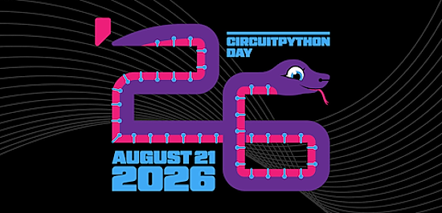](https://youtube.com/playlist?list=PLY9yniFqxZXY&si=LP7FDLbcN5hB1V-X)

CircuitPython Day 2026 last Friday was fabulous! The talks were great and makers debut some new CircuitPython content. Catch the YouTube playlist of talks given if you missed anything - [YouTube](https://youtube.com/playlist?list=PLY9yniFqxZXY&si=LP7FDLbcN5hB1V-X).

## CircuitPython on the new Bao Chip

The new Bao microcontroller from Andrew 'bunnie' Huang has a new CircuitPython port and Adafruit's Phil Torrone has been doing real world kicking the tires. No "blinks an LED", the Bao + CircuitPython is doing real world work in a number of examples. "GPIO bit-bang ~92 khz from Python, PWM hitting 100 hz→100 khz exactly, ADC stats, 3000 softfloat sin+div in 379 ms with no FPU, generative ASCII art seeded from the factory UID, different on every baochip, identical on yours. best 'look what this is' live ADC bar graph at 20 fps". And the sound generation is fantastic - [YouTube](https://www.youtube.com/watch?v=nXG9aJBKxvs).

[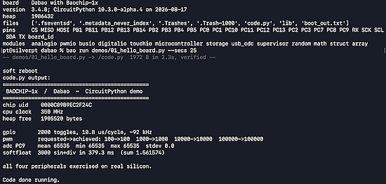](https://www.youtube.com/watch?v=nXG9aJBKxvs)

## Extending CircuitPython with Native Modules #CircuitPythonDay2026

[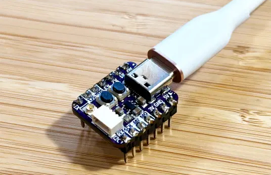](https://mikecoats.com/extending-circuitpython-native-module-1/)

For CircuitPython Day 2025, Mike Coats installed CircuitPython on an unsupported board. "I then went on to write a Python-based driver for the AT42QT2120, late last year, and published it to the Community Bundle. This year, for CircuitPython Day 2026, I wanted to get closer to the metal and write a module in C that I could call from CircuitPython." - mikecoats.com [Part 1](https://mikecoats.com/extending-circuitpython-native-module-1/) and [Part 2](https://mikecoats.com/extending-circuitpython-native-module-2/).

## Feature

text - [site](url).

## MicroPython and CircuitPython: Pythons Quiet Takeover of IoT and Robotics

[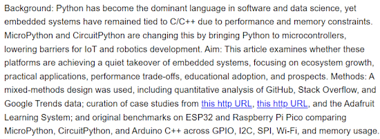](https://arxiv.org/abs/2608.18160)

MicroPython and CircuitPython: Pythons Quiet Takeover of IoT and Robotics by Sayed Mahbub Hasan Amiri, Atiar Zahan - [arxiv](https://arxiv.org/abs/2608.18160). Via [X](https://x.com/ProgPapers/status/2090311174462025934).

## RISC-V: They Should Have Known Better

Dmitry Grinberg goes where few would: does the architecture of RISC-V truly live up to its reputation? - [dmitry.gr](https://dmitry.gr/?r=06.%20Thoughts&proj=12.%20RV).

> "The first and simplest-to-grasp issue is that one cannot be best for all use cases. RISC-V fans would have you believe that RISC-V will soon own all supercomputers, while also owning all the tiny microcontroller use cases, and all things in between. This is impossible, and would be equally impossible for any ISA. Simply put, the things a high-end CPU needs are diametrically opposed to the things a small cost-saving microcontroller core needs."

## This Week's Python Streams

Python on Hardware is all about building a cooperative ecosphere which allows contributions to be valued and to grow knowledge. Below are the streams within the last week focusing on the community.

**CircuitPython Deep Dive Stream**

[Last Friday](), Scott streamed work on .

You can see the latest video and past videos on the Adafruit YouTube channel under the Deep Dive playlist - [YouTube](https://www.youtube.com/playlist?list=PLjF7R1fz_OOXBHlu9msoXq2jQN4JpCk8A).

**CircuitPython Parsec**

John Park’s CircuitPython Parsec this week is on  - [Adafruit Blog]() and [YouTube]().

Catch all the episodes in the [YouTube playlist](https://www.youtube.com/playlist?list=PLjF7R1fz_OOWFqZfqW9jlvQSIUmwn9lWr).

**Deep Dive with Tim**

[Last week](), Tim streamed work on .

You can see the latest video and past videos on the Adafruit YouTube channel under the Deep Dive playlist - [YouTube](https://www.youtube.com/playlist?list=PLjF7R1fz_OOWFqZfqW9jlvQSIUmwn9lWr).

**CircuitPython Weekly Meeting**

CircuitPython Weekly Meeting for {date} ([notes](file)) [on YouTube](link).

## Project of the Week: WiFi Sense Sees Through Walls

[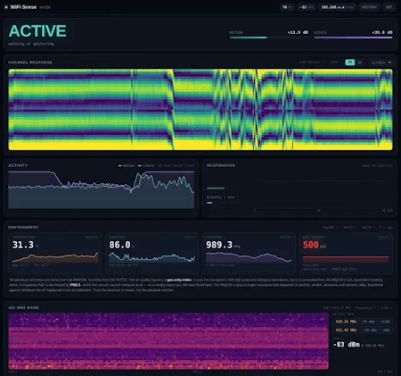](https://github.com/The-Masked-Bear/wifisense-pi)

WiFi Sense by The-Masked-Bear sees motion, presence and breathing through walls, using nothing but ordinary WiFi signals. An ESP32-S3 measures the WiFi radio channel 100 times a second. A Raspberry Pi 4 analyses it. A browser shows the result live. No camera, no PIR sensor, nothing worn — and it detects a person sitting perfectly still by picking up their chest moving as they breathe - [GitHub](https://github.com/The-Masked-Bear/wifisense-pi). Via [Hackaday](https://hackaday.com/2026/08/15/scanning-for-lifesigns-with-esp32-and-raspberry-pi-now-open-source/).

## Popular Last Week

What was the most popular, most clicked link, in [last week's newsletter](https://www.adafruitdaily.com/2026/08/17/python-on-microcontrollers-newsletter-openbricks-your-esp32-robot-circuitpython-day-python-guitar-pedal-and-more/)? [The Raspberry Pi’s 15-year reign is quietly ending — here’s why](https://www.howtogeek.com/the-raspberry-pis-reign-is-quietly-ending/).

Did you know you can read past issues of this newsletter in the Adafruit Daily Archive? [Check it out](https://www.adafruitdaily.com/category/circuitpython/).

## Notes from Adafruit Playground

[Adafruit Playground](https://adafruit-playground.com/) is a place for the community to post their projects and other making tips/tricks/techniques. Ad-free, it's an easy way to publish your work in a safe space for free.

text - [Adafruit Playground](url).

text - [Adafruit Playground](url).

text - [Adafruit Playground](url).

## News From Around the Web

[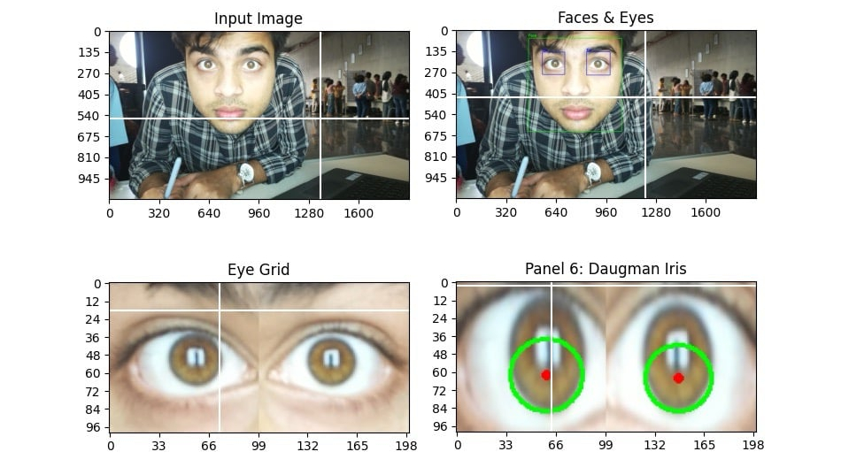](https://www.raspberrypi.com/news/iris-colour-detection-with-raspberry-pi/)

Iris color detection with Raspberry Pi and Jupyter Notebook - [Raspberry Pi News](https://www.raspberrypi.com/news/iris-colour-detection-with-raspberry-pi/) and [GitHub](https://github.com/fbasatemur/daugman_iris_detection).

The new Raspberry Pi Compute Module 5 Programming Jig is a single-head provisioning system that programs a Compute Module 5 with an operating system and security configuration - [Raspberry Pi News](https://www.raspberrypi.com/news/introducing-the-raspberry-pi-compute-module-5-programming-jig/) and [Jeff Geerling](https://www.youtube.com/watch?v=-QXW26MiiIs). Via [X](https://x.com/Raspberry_Pi/status/2089970314591522929).

[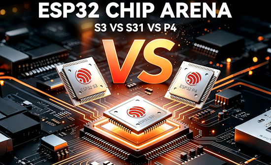](https://www.elecrow.com/blog/esp32-s31-vs-s3-vs-p4-complete-2026-selection-guide.html)

ESP32-S31 vs S3 vs P4: A complete 2026 selection guide - [Elecrow](https://www.elecrow.com/blog/esp32-s31-vs-s3-vs-p4-complete-2026-selection-guide.html).

text - [site](url).

text - [site](url).

text - [site](url).

text - [site](url).

text - [site](url).

text - [site](url).

text - [site](url).

text - [site](url).

text - [site](url).

text - [site](url).

Volos Projects took a Waveshare PocketTerm35 Raspberry Pi 5 on vacation Instead of a laptop - [YouTube](https://www.youtube.com/watch?v=X9JCTM32-aM).

[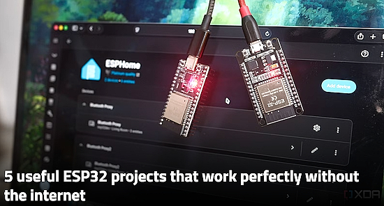](https://www.xda-developers.com/useful-esp32-projects-that-dont-need-internet/)

Five useful ESP32 projects that work perfectly without the internet - [XDA](https://www.xda-developers.com/useful-esp32-projects-that-dont-need-internet/).

text - [site](url).

text - [site](url).

Five Python libraries that make data cleaning more enjoyable - [KDnuggets](https://www.kdnuggets.com/5-python-libraries-that-make-data-cleaning-more-enjoyable).

## New

[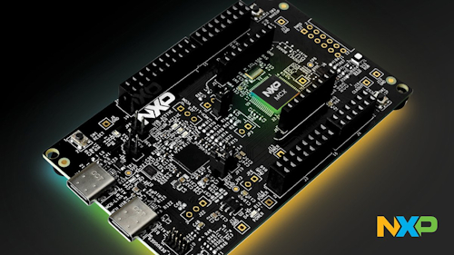](https://www.cnx-software.com/2026/08/19/nxp-mcx-a5-cortex-m33-mcu-family-supports-10base-t1s-single-pair-ethernet-and-post-quantum-cryptography/)

NXP has introduced the MCX A5 family of Cortex-M33 MCUs, which features a 10/100Mbps Ethernet MAC and an integrated 10BASE-T1S Single Pair Ethernet digital PHY. It targets industrial and networking applications such as controllers, PLCs, remote I/O, building and energy management systems, and other connected edge devices. The MCUs run at up to 240 MHz and feature up to 2 MB dual-bank Flash and 640 KB SRAM, along with multiple communication interfaces and analog peripherals. Security features include an EdgeLock accelerator, secure boot with PQC hybrid support, secure firmware updates, lifecycle management, secure debug, external Flash encryption, and anti-tamper monitoring - [CNX](https://www.cnx-software.com/2026/08/19/nxp-mcx-a5-cortex-m33-mcu-family-supports-10base-t1s-single-pair-ethernet-and-post-quantum-cryptography/).

[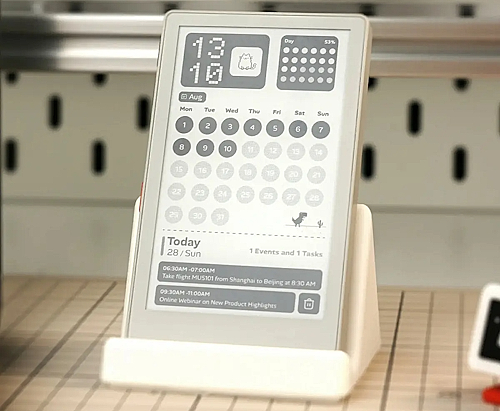](url)

text - [site](url).

## New Boards Supported by CircuitPython

The number of supported microcontrollers and Single Board Computers (SBC) grows every week. This section outlines which boards have been included in CircuitPython or added to [CircuitPython.org](https://circuitpython.org/).

This week there were (#/no) new boards added:

- [Board name](url)
- [Board name](url)
- [Board name](url)

*Note: For non-Adafruit boards, please use the support forums of the board manufacturer for assistance, as Adafruit does not have the hardware to assist in troubleshooting.*

Looking to add a new board to CircuitPython? It's highly encouraged! Adafruit has four guides to help you do so:

- [How to Add a New Board to CircuitPython](https://learn.adafruit.com/how-to-add-a-new-board-to-circuitpython/overview)
- [How to add a New Board to the circuitpython.org website](https://learn.adafruit.com/how-to-add-a-new-board-to-the-circuitpython-org-website)
- [Adding a Single Board Computer to PlatformDetect for Blinka](https://learn.adafruit.com/adding-a-single-board-computer-to-platformdetect-for-blinka)
- [Adding a Single Board Computer to Blinka](https://learn.adafruit.com/adding-a-single-board-computer-to-blinka)

## New Adafruit Learning System Guides

The [Adafruit Learning System](https://learn.adafruit.com/) has over 3,200 free guides for learning skills and building projects including using Python.

[title](url) from [name](url)

[title](url) from [name](url)

[title](url) from [name](url)

## Updated Learn Guides

[title](url)

## CircuitPython Libraries

The CircuitPython library numbers are continually increasing, while existing ones continue to be updated. Here we provide library numbers and updates!

To get the latest Adafruit libraries, download the [Adafruit CircuitPython Library Bundle](https://circuitpython.org/libraries). To get the latest community contributed libraries, download the [CircuitPython Community Bundle](https://circuitpython.org/libraries).

If you'd like to contribute to the CircuitPython project on the Python side of things, the libraries are a great place to start. Check out the [CircuitPython.org Contributing page](https://circuitpython.org/contributing). If you're interested in reviewing, check out Open Pull Requests. If you'd like to contribute code or documentation, check out Open Issues. We have a guide on [contributing to CircuitPython with Git and GitHub](https://learn.adafruit.com/contribute-to-circuitpython-with-git-and-github), and you can find us in the #help-with-circuitpython and #circuitpython-dev channels on the [Adafruit Discord](https://adafru.it/discord).

You can check out this [list of all the Adafruit CircuitPython libraries and drivers available](https://github.com/adafruit/Adafruit_CircuitPython_Bundle/blob/master/circuitpython_library_list.md). 

The current number of CircuitPython libraries is **###**!

**New Libraries**

Here are this week's new CircuitPython libraries:

* [library](url)

**Updated Libraries**

Here are this week's updated CircuitPython libraries:

* [library](url)

## What’s the CircuitPython team up to this week?

What is the team up to this week? Let’s check in:

**Dan**

I've been finishing off fixing BLE workflow issues in the past week. Fixes were required in CircuitPython and in the components of [code.circuitpython.org](http://code.circuitpython.org/). I'm retesting on the three major OS platforms. Linux pairing/bonding is awkward and will need to be well-documented.

**Tim**

I have been working on adding CircuitPython support to to the Teenage Engineering SP-1, a STEM player device that was not officially released as planned, but are available via a liquidation market. This week my focus has been cleaning up the changes in the core. I'm mostly removing things that were put in place during development for additional diagnostics and profiling that helped figure out issues and decide ways to implement various things. I've also made some improvements to the Python fader demo code so it plays back more cleanly. Late last week I implemented support for the EMMC storage chip on the device and set it up to use a FAT filesystem and automount as mass storage instead of requiring a special media loader and format.

**Scott**

This past week I've been working enabling the BLE workflow on Zephyr. Pairing and bonding has been merged in along with a new board definition for Clue. The Clue is a good test platform because it has a lot built in. Today I got BLE workflow working so now I'm polishing the changes up and ensuring there are some basic tests as well.

**Liz**

This week I’ve been working on coordinating CircuitPython Day. This newsletter goes out after the festivities, but if you missed any of the sessions you can check out this [YouTube playlist](https://youtube.com/playlist?list=PLY9yniFqxZXY&si=_YuHhV-C-otH1kvB). Big thanks to everyone who participated and helped out with getting everything ready.

## Upcoming Events

The next MicroPython Meetup in Melbourne will be on August 26 – [Luma](https://luma.com/micropython). You can see recordings of previous meetings on [YouTube](https://www.youtube.com/@MicroPythonOfficial). 

[PyCon AU 2026](https://2026.pycon.org.au/) will be 26 Aug. 2026 – 30 Aug. 2026 in Brisbane, Australia.

**Other Events This Year**

* [Maker Faire Bay Area](https://bayarea.makerfaire.com/) is September 26-28 at Mare Island, California.
* [PyConZA 2026](https://za.pycon.org/), South Africa's Python conference, will be 14–18 Oct at Belmont Square, Cape Town, South Africa.
* [Espressif DevCon 2026](https://devcon.espressif.com/) will be November 3-4 in Milan, Italy and online.

If you know of virtual events or upcoming events, please let us know via email to cpnews(at)adafruit(dot)com.

## Latest Releases

CircuitPython's stable release is [#.#.#](https://github.com/adafruit/circuitpython/releases/latest) and its unstable release is [#.#.#-##.#](https://github.com/adafruit/circuitpython/releases). New to CircuitPython? Start with our [Welcome to CircuitPython Guide](https://learn.adafruit.com/welcome-to-circuitpython).

[2026####](https://github.com/adafruit/Adafruit_CircuitPython_Bundle/releases/latest) is the latest Adafruit CircuitPython library bundle.

[2026####](https://github.com/adafruit/CircuitPython_Community_Bundle/releases/latest) is the latest CircuitPython Community library bundle.

[v#.#.#](https://micropython.org/download) is the latest MicroPython release. Documentation for it is [here](http://docs.micropython.org/en/latest/pyboard/).

[#.#.#](https://www.python.org/downloads/) is the latest Python release. The latest pre-release version is [#.#.#](https://www.python.org/download/pre-releases/).

[#,### Stars](https://github.com/adafruit/circuitpython/stargazers) Like CircuitPython? [Star it on GitHub!](https://github.com/adafruit/circuitpython)

## Call for Help -- Translating CircuitPython is now easier than ever

[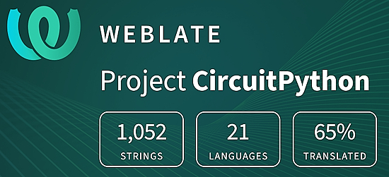](https://hosted.weblate.org/engage/circuitpython/)

One important feature of CircuitPython is translated control and error messages. With the help of fellow open source project [Weblate](https://weblate.org/), we're making it even easier to add or improve translations. 

Sign in with an existing account such as GitHub, Google or Facebook and start contributing through a simple web interface. No forks or pull requests needed! As always, if you run into trouble join us on [Discord](https://adafru.it/discord), we're here to help.

## NUMBER Thanks

The Adafruit Discord community, where we do all our CircuitPython development in the open, reached over NUMBER humans - thank you! Adafruit believes Discord offers a unique way for Python on hardware folks to connect. Join today at [https://adafru.it/discord](https://adafru.it/discord).

## ICYMI - In case you missed it

Python on hardware is the Adafruit Python video-newsletter-podcast! The news comes from the Python community, Discord, Adafruit communities and more and is broadcast on ASK an ENGINEER Wednesdays. The complete Python on Hardware weekly videocast [playlist is here](https://www.youtube.com/playlist?list=PLjF7R1fz_OOXRMjM7Sm0J2Xt6H81TdDev). The video podcast is on [iTunes](https://itunes.apple.com/us/podcast/python-on-hardware/id1451685192?mt=2), [YouTube](http://adafru.it/pohepisodes), [Instagram](https://www.instagram.com/adafruit/channel/), and [XML](https://itunes.apple.com/us/podcast/python-on-hardware/id1451685192?mt=2).

[The weekly community chat on Adafruit Discord server CircuitPython channel - Audio / Podcast edition](https://itunes.apple.com/us/podcast/circuitpython-weekly-meeting/id1451685016) - Audio from the Discord chat space for CircuitPython, meetings are usually Mondays at 2pm ET, this is the audio version on [iTunes](https://itunes.apple.com/us/podcast/circuitpython-weekly-meeting/id1451685016), Pocket Casts, [Spotify](https://adafru.it/spotify), and [XML feed](https://adafruit-podcasts.s3.amazonaws.com/circuitpython_weekly_meeting/audio-podcast.xml).

## Contribute

The CircuitPython Weekly Newsletter is a CircuitPython community-run newsletter emailed every Monday. To contribute your content, please email your news to cpnews (at) adafruit (dot) com with information and link(s) to your content. 

Join the Adafruit [Discord](https://adafru.it/discord) or [post to the forum](https://forums.adafruit.com/viewforum.php?f=60) if you have questions.
