- [ ] Library and info updates
- [ ] change date
- [ ] update title
- [ ] Feature story
- [ ] Update  for images
- [ ] Update ICYDNCI
- [ ] All images 550w max only
- [ ] Link "View this email in your browser."

News Sources

- [Adafruit Playground](https://adafruit-playground.com/)
- Twitter: [CircuitPython](https://twitter.com/search?q=circuitpython&src=typed_query&f=live), [MicroPython](https://twitter.com/search?q=micropython&src=typed_query&f=live) and [Python](https://twitter.com/search?q=python&src=typed_query)
- [Raspberry Pi News](https://www.raspberrypi.com/news/), [Pi Foundation](https://www.raspberrypi.org/blog/)
- Mastodon [CircuitPython](https://mastodon.social/tags/CircuitPython) and [MicroPython](https://mastodon.social/tags/MicroPython)
- BlueSky [CircuitPython](https://bsky.app/search?q=circuitpython), [MicroPython](https://bsky.app/search?q=micropython), [Raspberry Pi](https://bsky.app/search?q=raspberry+pi)
- [Google News Python](https://news.google.com/topics/CAAqIQgKIhtDQkFTRGdvSUwyMHZNRFY2TVY4U0FtVnVLQUFQAQ?hl=en-US&gl=US&ceid=US%3Aen), [Infoworld](https://www.infoworld.com/python/)
- YouTube: [CircuitPython](https://www.youtube.com/results?search_query=circuitpython&sp=CAISBAgDEAE%253D), [MicroPython](https://www.youtube.com/results?search_query=micropython&sp=CAISBAgDEAE%253D), [Prof Gallaugher](https://www.youtube.com/@BuildWithProfG/videos)
- [maker.io Python](https://www.digikey.com/en/maker/search-results?s=createdDate&t=python)
- [hackster.io CircuitPython](https://www.hackster.io/search?q=circuitpython&i=projects&sort_by=most_recent) and [MicroPython](https://www.hackster.io/search?q=micropython&i=projects&sort_by=most_recent)
- Instructables: [CircuitPython](https://www.instructables.com/search/?q=circuitpython&projects=all&sort=Newest), [MicroPython](https://www.instructables.com/search/?q=micropython&projects=all&sort=Newest), [Raspberry Pi Python](https://www.instructables.com/search/?q=raspberry+pi+python&projects=all&sort=Newest)
- [hackaday CircuitPython](https://hackaday.com/blog/?s=circuitpython) and [MicroPython](https://hackaday.com/blog/?s=micropython)
- [python.org](https://www.python.org/)
- [Python Insider - dev team blog](https://blog.python.org/)
- Individuals: [bret.dk](https://bret.dk/), [Jeff Geerling](https://www.jeffgeerling.com/blog), [Yakroo](https://x.com/Yakroo5077), [coXXect](https://coxxect.blogspot.com/)
- Tom's Hardware: [CircuitPython](https://www.tomshardware.com/search?searchTerm=circuitpython&articleType=all&sortBy=publishedDate) and [MicroPython](https://www.tomshardware.com/search?searchTerm=micropython&articleType=all&sortBy=publishedDate) and [Raspberry Pi](https://www.tomshardware.com/search?searchTerm=raspberry%20pi&articleType=all&sortBy=publishedDate)
- [hackaday.io newest projects MicroPython](https://hackaday.io/projects?tag=micropython&sort=date) and [CircuitPython](https://hackaday.io/projects?tag=circuitpython&sort=date)
- hackaday.io - [CircuitPython](https://hackaday.io/search?term=circuitpython) and [MicroPython](https://hackaday.io/search?term=micropython)
- [MicroPython Meeting](https://luma.com/micropython?k=c)

View this email in your browser. **Warning: Flashing Imagery**

Welcome to the latest Python on Microcontrollers newsletter! *insert 2-3 sentences from editor (what's in overview, banter)* - *Anne Barela, Editor*

We're on [Discord](https://discord.gg/HYqvREz), [Twitter/X](https://twitter.com/search?q=circuitpython&src=typed_query&f=live), [BlueSky](https://bsky.app/profile/circuitpython.org) and for past newsletters - [view them all here](https://www.adafruitdaily.com/category/circuitpython/). If you're reading this on the web, please [subscribe here](https://www.adafruitdaily.com/). Here's the news this week:

## MicroPython v1.29.0 Has Been Released

MicroPython v1.29.0, released August 24 by Damien George, adds a bare-metal "psoc-edge" port for Infineon PSOC Edge microcontrollers, with one supported board, the KIT_PSE84_AI. The `machine.CAN` API from v1.28.0 now runs on alif and mimxrt alongside stm32, and a new `machine.mem_backup()` gives access to backup memory surviving a hard reset on seven ports. Custom builds get a `c_module()` manifest function for user C modules, plus a USB Network (NCM) driver that makes the device look like a USB Ethernet adapter to the host. Thirteen new boards are added — including the Adafruit Feather RP2350 and ESP32-H2 support — with updates to Unicode handling, mbedTLS 3.6.6, LittleFS, TinyUSB and pico-sdk.

Breaking changes include stricter encoding validation (`LookupError` on anything but utf-8/ascii), reversed SDCard readblocks/writeblocks return values on esp32 and stm32, and all nrf boards now reporting sys.platform as "nrf" - [GitHub](https://github.com/micropython/micropython/releases/tag/v1.29.0). Via [X](https://x.com/matt_trentini/status/2091900583083159702).

## CircuitPython 10.3.0-beta.0 Released

text - [site](url).

## Espressif Systems Releases a Linux BSP Developer Preview for ESP32-S31 RISC-V Microprocessor

[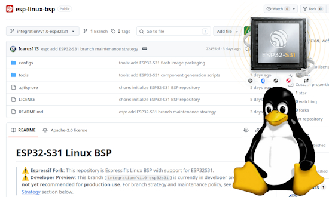](https://www.cnx-software.com/2026/08/22/espressif-systems-releases-a-linux-bsp-developer-preview-for-esp32-s31-risc-v-microprocessor/)

The ESP32-S31 microprocessor is getting Linux support from Espressif Systems. The ESP32-S31 dual-core RISC-V microprocessor was first unveiled in March, two ESP32-S31 development boards followed in May, and mass production was announced a few weeks ago. The new RISC-V chip features an MMU (Memory Management Unit), which makes Linux much easier to handle, and the development boards also come with 16MB PSRAM, so a minimal Linux image is possible. Espressif Systems has now released a developer preview version of the ESP Linux BSP for ESP32-S31, and some community Linux ports are also in the works - [CNX](https://www.cnx-software.com/2026/08/22/espressif-systems-releases-a-linux-bsp-developer-preview-for-esp32-s31-risc-v-microprocessor/).

## Feature

text - [site](url).

## Rewriting MakeCode Into MicroPython

saitodev discusses how to rewrite the visual language MakeCode to the text-based MicroPython, using the BBC micro:bit as an example platform - [saitodev.co](https://saitodev.co/programming/microbit/article/%E3%83%93%E3%82%B8%E3%83%A5%E3%82%A2%E3%83%AB%E8%A8%80%E8%AA%9E%E3%81%AEMakeCode%E3%81%8B%E3%82%89%E3%83%86%E3%82%AD%E3%82%B9%E3%83%88%E8%A8%80%E8%AA%9E%E3%81%AEMicroPython%E3%81%AB%E6%9B%B8%E3%81%8D%E6%8F%9B%E3%81%88%E3%81%A6%E3%81%BF%E3%82%88%E3%81%86). (Japanese)

## Raspberry Pi Now Has an Official Guide for Building Your Own Cyberdeck

[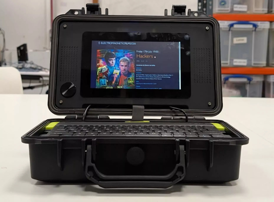](https://www.techspot.com/news/113617-raspberry-pi-now-has-official-guide-building-own.html)

Raspberry Pi has shared a series of DIY instructions for building a custom cyberdeck. The organization said the maker community has fallen in love with these homemade machines, which is why it has now published an "official" tutorial explaining how to build one using Raspberry Pi hardware and accessories - [Techspot](https://www.techspot.com/news/113617-raspberry-pi-now-has-official-guide-building-own.html) and [How-To Geek](https://www.howtogeek.com/raspberry-pi-cyberdeck-tutorial/). Guide [Raspberry Pi News](https://www.raspberrypi.com/news/create-your-own-cyberdeck/).

## This Week's Python Streams

Python on Hardware is all about building a cooperative ecosphere which allows contributions to be valued and to grow knowledge. Below are the streams within the last week focusing on the community.

**CircuitPython Deep Dive Stream**

[Last Friday](), Scott streamed work on .

You can see the latest video and past videos on the Adafruit YouTube channel under the Deep Dive playlist - [YouTube](https://www.youtube.com/playlist?list=PLjF7R1fz_OOXBHlu9msoXq2jQN4JpCk8A).

**CircuitPython Parsec**

John Park’s CircuitPython Parsec this week is on  - [Adafruit Blog]() and [YouTube]().

Catch all the episodes in the [YouTube playlist](https://www.youtube.com/playlist?list=PLjF7R1fz_OOWFqZfqW9jlvQSIUmwn9lWr).

**Deep Dive with Tim**

[Last week](), Tim streamed work on .

You can see the latest video and past videos on the Adafruit YouTube channel under the Deep Dive playlist - [YouTube](https://www.youtube.com/playlist?list=PLjF7R1fz_OOWFqZfqW9jlvQSIUmwn9lWr).

**CircuitPython Weekly Meeting**

CircuitPython Weekly Meeting for August 24, 2026 ([notes](https://github.com/adafruit/adafruit-circuitpython-weekly-meeting/blob/main/2026/2026-08-24.md)) [on YouTube](https://youtu.be/LNpXa8FbiPE).

## Project of the Week: ColecoJam

Dan pulls off a huge project: make a Colecovision emulator for the Adafruit Fruit Jam in CircuitPython. Not only does it work but there is also an optional Fruit Jam add-on board to allow for reading Colecovision cartridges. - [Dan The Geek](https://danthegeek.com/colecojam/).

## Popular Last Week

What was the most popular, most clicked link, in [last week's newsletter](https://www.adafruitdaily.com/2026/08/24/python-on-microcontrollers-newsletter-circuitpython-day-2026-wraps-400th-newsletter-bao-chip-magic-and-more/)? [These Raspberry Pi builds make everyday hobbies better (August 21 - 23)](https://www.howtogeek.com/these-raspberry-pi-builds-make-everyday-hobbies-better-august-21-23/).

Did you know you can read past issues of this newsletter in the Adafruit Daily Archive? [Check it out](https://www.adafruitdaily.com/category/circuitpython/).

## Notes from Adafruit Playground

[Adafruit Playground](https://adafruit-playground.com/) is a place for the community to post their projects and other making tips/tricks/techniques. Ad-free, it's an easy way to publish your work in a safe space for free.

text - [Adafruit Playground](url).

text - [Adafruit Playground](url).

text - [Adafruit Playground](url).

## News From Around the Web

[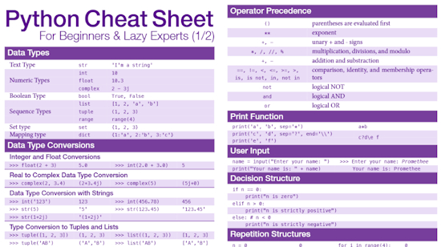](https://github.com/prspth/python-cheat-sheet/blob/main/python-cheat-sheet.pdf)

Promethee Spathis' Python Cheat Sheet is a concise and practical cheat sheet, covering over 95% of all Python 3.x commands with examples. Designed for both Python developers, learners, and hobbyists. It provides quick answers and efficient learning without overwhelming you with details. This cheat sheet summarizes key Python syntax, concepts, and common functions - [GitHub](https://github.com/prspth/python-cheat-sheet/blob/main/python-cheat-sheet.pdf). (PDF)

text - [site](url).

text - [site](url).

Python 3.15 Preview: The new Sampling Profiler - [Real Python](https://realpython.com/python315-sampling-profiler/).

A Bluetooth radio controlled Cybertruck model. This project contains the 3D model, the MicroPython source code and Android application source code - [GitHub](https://github.com/PiniponSelvagem/Cybertruck-RC). Via [X](https://x.com/Alacritic_Super/status/2092815284830920725).

[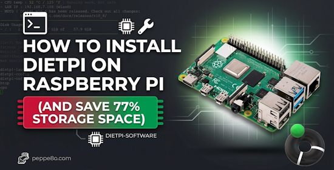](https://peppe8o.com/install-dietpi-raspberry-pi/)

How to install DietPi on Raspberry Pi (and save 77% storage space) - [peppe80](https://peppe8o.com/install-dietpi-raspberry-pi/).

A pocket-sized 2.4 GHz WiFi survey tool by Greg Gorman for the M5Stack StickS3, built with UiFlow2 MicroPython. It scans nearby networks, follows the strongest access point broadcasting a selected SSID, and records a walk-through signal graph one deliberate sample at a time - [GitHub](https://github.com/gwgorman/sticks3-wifi-surveyor). Via [X](https://x.com/gregorygorman/status/2092080729987408326).

[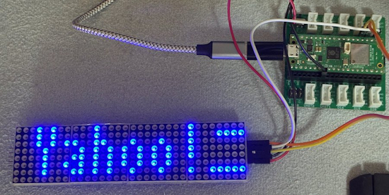](https://aloseed.com/it/raspberry-pi-pico-w/#toc22)

An LED board displaying Yahoo! News using MicroPython and tutorial on programming the Raspberry Pi Pico W / 2W  - [https://aloseed.com/](https://aloseed.com/it/raspberry-pi-pico-w/#toc22).

text - [site](url).

text - [site](url).

text - [site](url).

[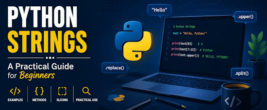](https://hackernoon.com/python-strings-explained-a-practical-guide-for-beginners)

Python strings explained: a practical guide for beginners - [HackerNoon](https://hackernoon.com/python-strings-explained-a-practical-guide-for-beginners).

text - [site](url).

[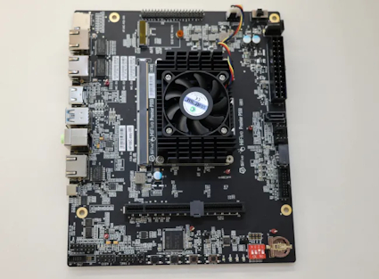](https://www.phoronix.com/news/GCC-RISC-V-mcpu-mtune-native)

GCC patches added -mcpu=native -mtune=native support for RISC-V - [Phoronix](https://www.phoronix.com/news/GCC-RISC-V-mcpu-mtune-native).

[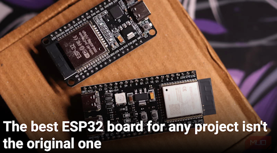](https://www.makeuseof.com/best-esp32-board-any-project-isnt-original/)

The best ESP32 board for any project isn't the original one - [Make Use Of](https://www.makeuseof.com/best-esp32-board-any-project-isnt-original/).

[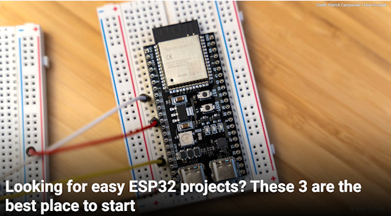](https://www.howtogeek.com/looking-for-easy-esp32-projects-best-place-to-start/)

Looking for easy ESP32 projects? These three are the best place to start - [How-To Geek](https://www.howtogeek.com/looking-for-easy-esp32-projects-best-place-to-start/).

text - [site](url).

[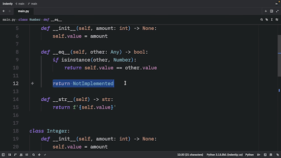](https://www.youtube.com/watch?v=xUBIbhPC_rQ)

"NotImplemented" is awesome in Python - [YouTube](https://www.youtube.com/watch?v=xUBIbhPC_rQ).

## New

NVIDIA Jetson Orin Nano 2 is a new robotics computer for entry-level edge AI. Jetson Orin Nano 2 delivers 2x the inference performance of its predecessor in the same form factor and consumes 40% less power at the same performance - [nVidia](https://nvidianews.nvidia.com/news/nvidia-announces-jetson-orin-nano-2-robotics-computer-to-redefine-entry-level-edge-ai).

text - [site](url).

## New Boards Supported by CircuitPython

The number of supported microcontrollers and Single Board Computers (SBC) grows every week. This section outlines which boards have been included in CircuitPython or added to [CircuitPython.org](https://circuitpython.org/).

This week there were (#/no) new boards added:

- [Board name](url)
- [Board name](url)
- [Board name](url)

*Note: For non-Adafruit boards, please use the support forums of the board manufacturer for assistance, as Adafruit does not have the hardware to assist in troubleshooting.*

Looking to add a new board to CircuitPython? It's highly encouraged! Adafruit has four guides to help you do so:

- [How to Add a New Board to CircuitPython](https://learn.adafruit.com/how-to-add-a-new-board-to-circuitpython/overview)
- [How to add a New Board to the circuitpython.org website](https://learn.adafruit.com/how-to-add-a-new-board-to-the-circuitpython-org-website)
- [Adding a Single Board Computer to PlatformDetect for Blinka](https://learn.adafruit.com/adding-a-single-board-computer-to-platformdetect-for-blinka)
- [Adding a Single Board Computer to Blinka](https://learn.adafruit.com/adding-a-single-board-computer-to-blinka)

## New Adafruit Learning System Guides

The [Adafruit Learning System](https://learn.adafruit.com/) has over 3,200 free guides for learning skills and building projects including using Python.

[Adding a Bubble Level to the MEMENTO](https://learn.adafruit.com/adding-a-bubble-level-to-the-memento) from [M. LeBlanc-Williams](https://learn.adafruit.com/u/MakerMelissa)

[title](url) from [name](url)

[title](url) from [name](url)

## Updated Learn Guides

[title](url)

## CircuitPython Libraries

The CircuitPython library numbers are continually increasing, while existing ones continue to be updated. Here we provide library numbers and updates!

To get the latest Adafruit libraries, download the [Adafruit CircuitPython Library Bundle](https://circuitpython.org/libraries). To get the latest community contributed libraries, download the [CircuitPython Community Bundle](https://circuitpython.org/libraries).

If you'd like to contribute to the CircuitPython project on the Python side of things, the libraries are a great place to start. Check out the [CircuitPython.org Contributing page](https://circuitpython.org/contributing). If you're interested in reviewing, check out Open Pull Requests. If you'd like to contribute code or documentation, check out Open Issues. We have a guide on [contributing to CircuitPython with Git and GitHub](https://learn.adafruit.com/contribute-to-circuitpython-with-git-and-github), and you can find us in the #help-with-circuitpython and #circuitpython-dev channels on the [Adafruit Discord](https://adafru.it/discord).

You can check out this [list of all the Adafruit CircuitPython libraries and drivers available](https://github.com/adafruit/Adafruit_CircuitPython_Bundle/blob/master/circuitpython_library_list.md). 

The current number of CircuitPython libraries is **###**!

**New Libraries**

Here are this week's new CircuitPython libraries:

* [library](url)

**Updated Libraries**

Here are this week's updated CircuitPython libraries:

* [library](url)

## What’s the CircuitPython team up to this week?

What is the team up to this week? Let’s check in:

**Dan**

text.

**Tim**

I have continued work on the SP-1 device CircuitPython core changes. I'm breaking up the changes required into more isolated chunks to PR separately. PRs are merged for an `analogio` fix needed to read faders and buttons on the device, and another for `I2SOut external_clock` support for nordic. Another is submitted that makes SoftDevice optional in the nordic port. Disabling it can regain a little bit of flash and RAM in cases where you don't need BLE, but reverting back to a standard build can't be done via UF2, it requires SWD programming. I am applying changes from feedback about the SP-1 board definition. Lastly, I wrote the teardown page for the learn guide.

**Scott**

text.

**Liz**

This week I've been working on porting the [M4 Monster Eyes project to RP2 and Espressif boards](https://github.com/adafruit/Adafruit_Monster_Eyes). The previous monster eyes were targeted for the Monster Mask and Hallowing boards, which use a SAMD51/M4. There was a lot of code in the project that was locked to the SAMD51. The new version is built to try and make it chip and display agnostic with room to expand. I did a lot of testing to make sure everything works as expected and the repo has CI jobs to build UF2s for popular board/display/eye count combos.

The project does make use of the CIRCUITPY drive. You drag and drop your monster eye graphics onto your CIRCUITPY drive and then load the Arduino firmware. The Arduino code is able to access the files on the CIRCUITPY drive, making it easy to swap different eyeball styles. I'll be writing up a Learn Guide with more detailed instructions soon, just in time for Halloween.

## Upcoming Events

The next MicroPython Meetup in Melbourne will be on September 23 – [Luma](https://luma.com/micropython). You can see recordings of previous meetings on [YouTube](https://www.youtube.com/@MicroPythonOfficial). 

[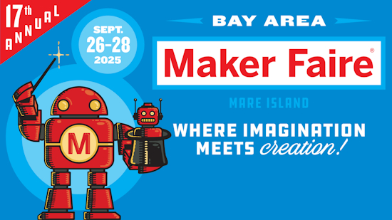](https://bayarea.makerfaire.com/)

[Maker Faire Bay Area](https://bayarea.makerfaire.com/) is September 26-28 at Mare Island, California.

**Other Events This Year**

* [PyConZA 2026](https://za.pycon.org/), South Africa's Python conference, will be 14–18 Oct at Belmont Square, Cape Town, South Africa.
* [Espressif DevCon 2026](https://devcon.espressif.com/) will be November 3-4 in Milan, Italy and online.

If you know of virtual events or upcoming events, please let us know via email to cpnews(at)adafruit(dot)com.

## Latest Releases

CircuitPython's stable release is [#.#.#](https://github.com/adafruit/circuitpython/releases/latest) and its unstable release is [#.#.#-##.#](https://github.com/adafruit/circuitpython/releases). New to CircuitPython? Start with our [Welcome to CircuitPython Guide](https://learn.adafruit.com/welcome-to-circuitpython).

[2026####](https://github.com/adafruit/Adafruit_CircuitPython_Bundle/releases/latest) is the latest Adafruit CircuitPython library bundle.

[2026####](https://github.com/adafruit/CircuitPython_Community_Bundle/releases/latest) is the latest CircuitPython Community library bundle.

[v#.#.#](https://micropython.org/download) is the latest MicroPython release. Documentation for it is [here](http://docs.micropython.org/en/latest/pyboard/).

[#.#.#](https://www.python.org/downloads/) is the latest Python release. The latest pre-release version is [#.#.#](https://www.python.org/download/pre-releases/).

[#,### Stars](https://github.com/adafruit/circuitpython/stargazers) Like CircuitPython? [Star it on GitHub!](https://github.com/adafruit/circuitpython)

## Call for Help -- Translating CircuitPython is now easier than ever

One important feature of CircuitPython is translated control and error messages. With the help of fellow open source project [Weblate](https://weblate.org/), we're making it even easier to add or improve translations. 

Sign in with an existing account such as GitHub, Google or Facebook and start contributing through a simple web interface. No forks or pull requests needed! As always, if you run into trouble join us on [Discord](https://adafru.it/discord), we're here to help.

## 38,901 Thanks

The Adafruit Discord community, where we do all our CircuitPython development in the open, reached 38,901 humans - thank you! Adafruit believes Discord offers a unique way for Python on hardware folks to connect. Join today at [https://adafru.it/discord](https://adafru.it/discord).

## ICYMI - In case you missed it

Python on hardware is the Adafruit Python video-newsletter-podcast! The news comes from the Python community, Discord, Adafruit communities and more and is broadcast on ASK an ENGINEER Wednesdays. The complete Python on Hardware weekly videocast [playlist is here](https://www.youtube.com/playlist?list=PLjF7R1fz_OOXRMjM7Sm0J2Xt6H81TdDev). The video podcast is on [iTunes](https://itunes.apple.com/us/podcast/python-on-hardware/id1451685192?mt=2), [YouTube](http://adafru.it/pohepisodes), [Instagram](https://www.instagram.com/adafruit/channel/), and [XML](https://itunes.apple.com/us/podcast/python-on-hardware/id1451685192?mt=2).

[The weekly community chat on Adafruit Discord server CircuitPython channel - Audio / Podcast edition](https://itunes.apple.com/us/podcast/circuitpython-weekly-meeting/id1451685016) - Audio from the Discord chat space for CircuitPython, meetings are usually Mondays at 2pm ET, this is the audio version on [iTunes](https://itunes.apple.com/us/podcast/circuitpython-weekly-meeting/id1451685016), Pocket Casts, [Spotify](https://adafru.it/spotify), and [XML feed](https://adafruit-podcasts.s3.amazonaws.com/circuitpython_weekly_meeting/audio-podcast.xml).

## Contribute

The CircuitPython Weekly Newsletter is a CircuitPython community-run newsletter emailed every Monday. To contribute your content, please email your news to cpnews (at) adafruit (dot) com with information and link(s) to your content. 

Join the Adafruit [Discord](https://adafru.it/discord) or [post to the forum](https://forums.adafruit.com/viewforum.php?f=60) if you have questions.
