- [ ] Library and info updates
- [ ] change date
- [ ] update title
- [ ] Feature story
- [ ] Update  for images
- [ ] Update ICYDNCI
- [ ] All images 550w max only
- [ ] Link "View this email in your browser."

News Sources

- [Adafruit Playground](https://adafruit-playground.com/)
- Twitter: [CircuitPython](https://twitter.com/search?q=circuitpython&src=typed_query&f=live), [MicroPython](https://twitter.com/search?q=micropython&src=typed_query&f=live) and [Python](https://twitter.com/search?q=python&src=typed_query)
- [Raspberry Pi News](https://www.raspberrypi.com/news/), [Pi Foundation](https://www.raspberrypi.org/blog/)
- Mastodon [CircuitPython](https://mastodon.social/tags/CircuitPython) and [MicroPython](https://mastodon.social/tags/MicroPython)
- BlueSky [CircuitPython](https://bsky.app/search?q=circuitpython), [MicroPython](https://bsky.app/search?q=micropython), [Raspberry Pi](https://bsky.app/search?q=raspberry+pi)
- [Google News Python](https://news.google.com/topics/CAAqIQgKIhtDQkFTRGdvSUwyMHZNRFY2TVY4U0FtVnVLQUFQAQ?hl=en-US&gl=US&ceid=US%3Aen), [Infoworld](https://www.infoworld.com/python/)
- YouTube: [CircuitPython](https://www.youtube.com/results?search_query=circuitpython&sp=CAISBAgDEAE%253D), [MicroPython](https://www.youtube.com/results?search_query=micropython&sp=CAISBAgDEAE%253D), [Prof Gallaugher](https://www.youtube.com/@BuildWithProfG/videos)
- [maker.io Python](https://www.digikey.com/en/maker/search-results?s=createdDate&t=python)
- [hackster.io CircuitPython](https://www.hackster.io/search?q=circuitpython&i=projects&sort_by=most_recent) and [MicroPython](https://www.hackster.io/search?q=micropython&i=projects&sort_by=most_recent)
- Instructables: [CircuitPython](https://www.instructables.com/search/?q=circuitpython&projects=all&sort=Newest), [MicroPython](https://www.instructables.com/search/?q=micropython&projects=all&sort=Newest), [Raspberry Pi Python](https://www.instructables.com/search/?q=raspberry+pi+python&projects=all&sort=Newest)
- [hackaday CircuitPython](https://hackaday.com/blog/?s=circuitpython) and [MicroPython](https://hackaday.com/blog/?s=micropython)
- [python.org](https://www.python.org/)
- [Python Insider - dev team blog](https://blog.python.org/)
- Individuals: [bret.dk](https://bret.dk/), [Jeff Geerling](https://www.jeffgeerling.com/blog), [Yakroo](https://x.com/Yakroo5077), [coXXect](https://coxxect.blogspot.com/)
- Tom's Hardware: [CircuitPython](https://www.tomshardware.com/search?searchTerm=circuitpython&articleType=all&sortBy=publishedDate) and [MicroPython](https://www.tomshardware.com/search?searchTerm=micropython&articleType=all&sortBy=publishedDate) and [Raspberry Pi](https://www.tomshardware.com/search?searchTerm=raspberry%20pi&articleType=all&sortBy=publishedDate)
- [hackaday.io newest projects MicroPython](https://hackaday.io/projects?tag=micropython&sort=date) and [CircuitPython](https://hackaday.io/projects?tag=circuitpython&sort=date)
- hackaday.io - [CircuitPython](https://hackaday.io/search?term=circuitpython) and [MicroPython](https://hackaday.io/search?term=micropython)
- [MicroPython Meeting](https://luma.com/micropython?k=c)

View this email in your browser. **Warning: Flashing Imagery**

Welcome to the latest Python on Microcontrollers newsletter! *insert 2-3 sentences from editor (what's in overview, banter)* - *Anne Barela, Editor*

We're on [Discord](https://discord.gg/HYqvREz), [Twitter/X](https://twitter.com/search?q=circuitpython&src=typed_query&f=live), [BlueSky](https://bsky.app/profile/circuitpython.org) and for past newsletters - [view them all here](https://www.adafruitdaily.com/category/circuitpython/). If you're reading this on the web, please [subscribe here](https://www.adafruitdaily.com/). Here's the news this week:

## An Incremental Garbage Collector For MicroPython

[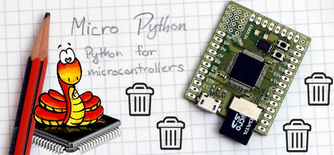](https://github.com/raspy135/micropython/tree/gc-incremental)

nunomo/raspy135 has added incremental garbage collection for Micropython. It eliminates stop-the-world GC collection which is one of the disadvantages of using MicroPython. It can keep high FPS in graphics applications with massive data allocations - [GitHub](https://github.com/raspy135/micropython/tree/gc-incremental). Via [X](https://x.com/nunomo1/status/2097702464862794019).

- ATB expanded to 4bit
- GC skips scanning for 'data' type such as bytearray.
- GC can run partially in background, for scan and sweep. 
- ESP32 and unix port are available, easy to port to otherboards.

## CircuitPython Remote

[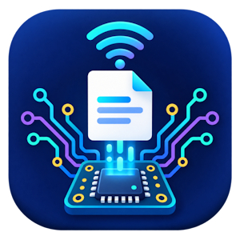](https://forums.adafruit.com/viewtopic.php?t=225016)

CircuitPython Remote 0.0.2 is an early beta VS Code extension for browsing and editing files on CircuitPython Web Workflow devices over WiFi. It is designed around the standard CircuitPython Web Workflow API, but other boards, operating systems, firmware versions, and network configurations have not yet been verified The author is looking for community feedback - [Adafruit Blog](https://forums.adafruit.com/viewtopic.php?t=225016), code [Visual Studio Marketplace](https://marketplace.visualstudio.com/items?itemName=triplelrobotics.circuitpython-remote) and [GitHub](https://github.com/triplelrobotics/circuitpython-esp32-remote-dev).

## These Are The Programming Languages Developers Want To Learn The Most

[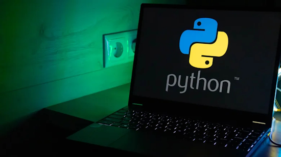](https://www.bgr.com/2252028/programming-languages-developers-want-to-learn-most/)

New programming languages pop up seemingly every day, but despite a sea of options, a few figures routinely stand out as the most sought-after. According to StackOverflow's 2025 Developer Survey, the three most in-demand programming languages in order of developer popularity are Python, JavaScript, and Rust - [BGR](https://www.bgr.com/2252028/programming-languages-developers-want-to-learn-most/).

## Refinements in the Centari Quadcopter System

[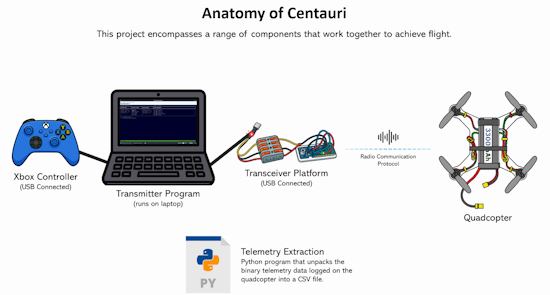](https://github.com/TimHanewich/Centauri)

Tim Hanewich continues to refine Centauri, a fully custom quadcopter system a custom MicroPython‑based flight controller, running efficiently on a low‑power Raspberry Pi Pico. Unlike most quadcopter projects that rely on off‑the‑shelf flight controllers, Centauri is entirely original - [Blog](https://timhanewich.medium.com/full-stack-flight-chapter-5-quadcopter-part-3-the-flight-controller-310b3f288975), [GitHub](https://github.com/TimHanewich/Centauri) and [YouTube](https://www.youtube.com/watch?v=4ocy2szvcbM). Via [X](https://x.com/TimHanewich).

## Snakie Now Allows Picking a Microcontroller Board From a List of 240 Devices

[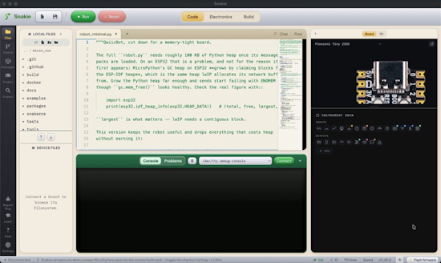](https://x.com/kevsmac/status/2096359153547522329)

Kevin McAleer's Snakie editor / integrated development environment (IDE) for MicroPython and CircuitPython now lets you pick the board to code for and flash from a catalog of nearly 240 boards - [X](https://x.com/kevsmac/status/2096359153547522329) and [Snakie app](https://app.snakie.org/).

## Making a Python Interpreter in 1024 Bytes

[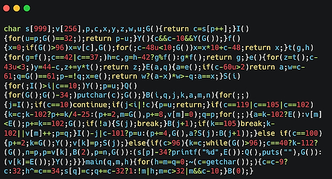](https://austinhenley.com/blog/python1024.html)

Austin Z. Henley set himself a weekend challenge to write a Python interpreter in 1024 bytes of C, with no macro tricks and no libraries - [austinhenley.com](https://austinhenley.com/blog/python1024.html) and [GitHub](https://github.com/python/cpython). Via the [Adafruit Blog](https://blog.adafruit.com/2026/09/07/making-a-python-interpreter-in-1024-bytes/).

## CPython Officially Adds RISC-V Support As a Tier 3 Platform

The Python core development team has announced that the open instruction set architecture RISC-V is now officially supported by CPython as a [Tier 3](https://peps.python.org/pep-0011/#tier-3) platform. The announcement was shared on the [Python Insider blog](https://blog.python.org/2026/08/riscv-now-officially-supported/) by contributor Stan Ulbrych, following sustained efforts across the community to stabilise and validate the implementation on real silicon - [InfoQ](https://www.infoq.com/news/2026/09/riscv-cpython/) and [Hacker News](https://news.ycombinator.com/item?id=49425252).

## This Week's Python Streams

Python on Hardware is all about building a cooperative ecosphere which allows contributions to be valued and to grow knowledge. Below are the streams within the last week focusing on the community.

**CircuitPython Deep Dive Stream**

[Last Friday](), Scott streamed work on .

You can see the latest video and past videos on the Adafruit YouTube channel under the Deep Dive playlist - [YouTube](https://www.youtube.com/playlist?list=PLjF7R1fz_OOXBHlu9msoXq2jQN4JpCk8A).

**CircuitPython Parsec**

John Park’s CircuitPython Parsec this week is on  - [Adafruit Blog]() and [YouTube]().

Catch all the episodes in the [YouTube playlist](https://www.youtube.com/playlist?list=PLjF7R1fz_OOWFqZfqW9jlvQSIUmwn9lWr).

**Deep Dive with Tim**

[Last week](https://youtube.com/live/WKIOX7DlFbs), Tim streamed work on pico-faces Image Gen Model Running on RP2350 Outputting DVI.

You can see the latest video and past videos on the Adafruit YouTube channel under the Deep Dive playlist - [YouTube](https://www.youtube.com/playlist?list=PLjF7R1fz_OOWFqZfqW9jlvQSIUmwn9lWr).

**CircuitPython Weekly Meeting**

CircuitPython Weekly Meeting for September 8, 2026 ([notes](https://github.com/adafruit/adafruit-circuitpython-weekly-meeting/blob/main/2026/2026-09-08.md)) [on YouTube](https://youtu.be/h0bkdhplaFw).

## Project of the Week: Rebuilding a 1995 GPS Time Server with Raspberry Pi and Python

[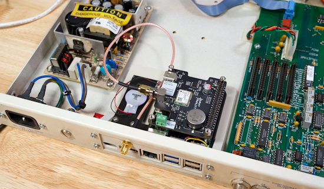](https://www.jeffgeerling.com/blog/2026/truetime-xl-gps-time-server-restomod/)

A 1995 TrueTime XL-AK GPS time server has been rebuilt around a Raspberry Pi 5 by maker Jeff Geerling. The original unit was bought in June to learn about the history of GPS-based time. Sixteen days later, a similar GPS time server took down Australia’s cell service for 12 hours.

The restomod drops a Pi 5 and a GNSS HAT with a u-blox NEO-M9N into the chassis, then drives a vintage Densitron 16×2 LCD and the bicolor status LED from the Pi’s GPIO. `Chrony` and `gpsd` handle stratum 1 NTP duty using PPS. The build is reversible: two connectors swap the original TrueTime hardware back in - [Jeff Geerling](https://www.jeffgeerling.com/blog/2026/truetime-xl-gps-time-server-restomod/), [YouTube](https://www.youtube.com/watch?v=1T9xQy-dsQo) and [GitHub](https://github.com/geerlingguy/densitron-lcd).

## Popular Last Week

What was the most popular, most clicked link, in [last week's newsletter](https://www.adafruitdaily.com/2026/09/07/python-on-microcontrollers-newsletter-circuitpython-10-3-0-out-pymcu-ros-for-micropython-and-more/)? [The $15 Raspberry Pi Zero line board everyone recommends now costs $60, so here’s what to buy instead](https://www.makeuseof.com/board-everyone-recommends-costs-60-what-buy-instead/).

Did you know you can read past issues of this newsletter in the Adafruit Daily Archive? [Check it out](https://www.adafruitdaily.com/category/circuitpython/).

## Notes from Adafruit Playground

[Adafruit Playground](https://adafruit-playground.com/) is a place for the community to post their projects and other making tips/tricks/techniques. Ad-free, it's an easy way to publish your work in a safe space for free.

[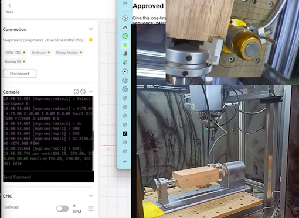](https://adafruit-playground.com/u/tyeth/pages/bringing-new-conveniences-to-an-old-cnc-v1-unmodified-machine)

Bringing new conveniences to an old CNC (v1 - unmodified machine) - [Adafruit Playground](https://adafruit-playground.com/u/tyeth/pages/bringing-new-conveniences-to-an-old-cnc-v1-unmodified-machine).

## News From Around the Web

[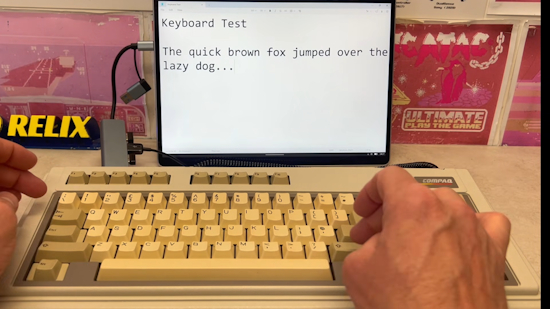](https://www.youtube.com/watch?v=8evkyQXN-U4)

A Compaq Portable II keyboard rebuild using a Raspberry Pi Pico and CircuitPython - [YouTube](https://www.youtube.com/watch?v=8evkyQXN-U4).

[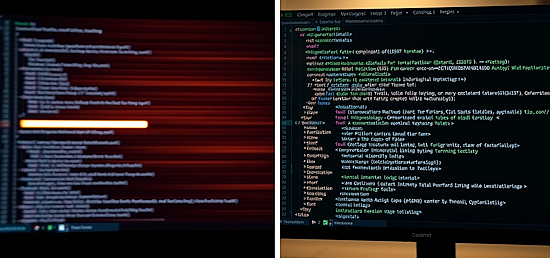](https://tech-insider.org/ruff-vs-black-vs-flake8-2026/)

Ruff vs Black vs Flake8: 389x faster linting - [Tech Insider](https://tech-insider.org/ruff-vs-black-vs-flake8-2026/).

[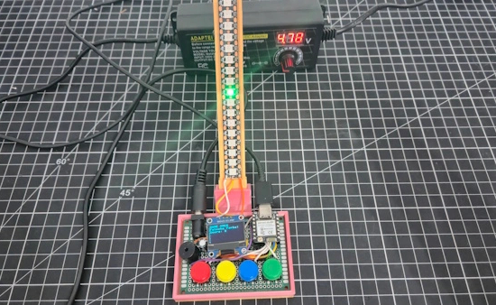](https://draeger-it.blog/led-reaktionsspiel-mit-dem-xiao-esp32-c6-in-micropython/)

An LED reaction game with the XIAO ESP32-C6 in MicroPython - [draeger-it.blog](https://draeger-it.blog/led-reaktionsspiel-mit-dem-xiao-esp32-c6-in-micropython/) and [YouTube](https://www.youtube.com/watch?v=YqxIh2v9yd0). (German)

Voicebox FX is a blueprint for CircuitPython I2S audio - [Hackaday](https://hackaday.com/2026/09/05/voicebox-fx-is-a-blueprint-for-circuitpython-i2s-audio/).

The new full length Visual Studio Code documentary - [YouTube](https://www.youtube.com/watch?v=kHL3XzjpT5w). Via [X](https://x.com/shanselman/status/2097809184435916975).

Token optimization using Python for prompt development - [opensourceforu.com](https://www.opensourceforu.com/2026/09/token-optimization-using-python-for-prompt-development/). Via [Adafruit Blog](https://blog.adafruit.com/2026/09/08/token-optimization-using-python-for-prompt-development/).

[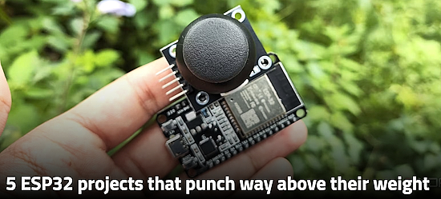](https://www.xda-developers.com/esp32-projects-that-punch-above-their-weight/)

Five ESP32 projects that punch way above their weight - [XDA](https://www.xda-developers.com/esp32-projects-that-punch-above-their-weight/).

RE-BOUND is a feature-rich, high-speed brick-breaking arcade game engineered specifically for the 72x40 monochrome OLED display of the Thumby micro-console, coded in MicroPython - [itch.io](https://lavachan.itch.io/re-bound). Via [X](https://x.com/Zivzeri/status/2096693611161145461).

[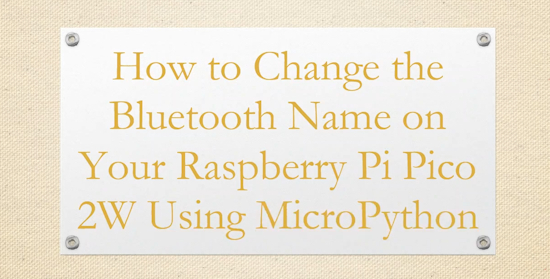](https://www.youtube.com/watch?v=dfihEKs6_u8)

How to change the Bluetooth name on a Raspberry Pi Pico 2W using MicroPython - [YouTube](https://www.youtube.com/watch?v=dfihEKs6_u8).

[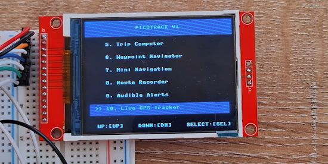](https://www.youtube.com/watch?v=pPQ5ZmQeuxk)

A 10-feature GPS tracker with Raspberry Pi Pico 2 W, NEO-6M and MicroPython - [YouTube](https://www.youtube.com/watch?v=pPQ5ZmQeuxk) and [GitHub](https://github.com/MakerIO-Hub/PicoTrack-V1).

Using the Pimoroni Tiny FX LED Effects Controller for model LED lighting with MicroPython - [maker.io](https://www.digikey.com/en/maker/tutorials/2026/tiny-fx-led-effects-controller).

[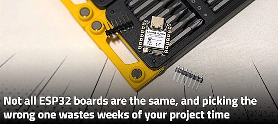](https://www.xda-developers.com/wrong-esp32-board-costs-you-time/)

Not all ESP32 boards are the same, and picking the wrong one wastes weeks of your project time - [XDA](https://www.xda-developers.com/wrong-esp32-board-costs-you-time/).

Testing the behavior of MicroPython `_thread`, specifically for Raspberry Pi Pico series - [coXXect](https://coxxect.blogspot.com/2026/08/micropython-thread-exercise.html).

text - [site](url).

[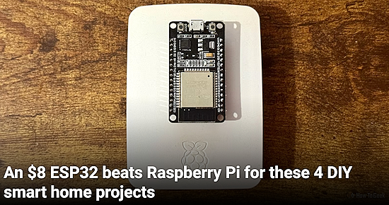](https://www.howtogeek.com/esp32-beats-raspberry-pi-for-these-smart-home-projects/)

An $8 ESP32 beats Raspberry Pi for these 4 DIY smart home projects - [How-To Geek](https://www.howtogeek.com/esp32-beats-raspberry-pi-for-these-smart-home-projects/).

text - [site](url).

[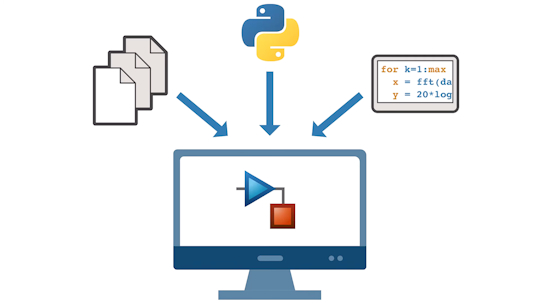](https://www.youtube.com/watch?v=f6-0huVztS8)

How to use Python code in Simulink - [YouTube](https://www.youtube.com/watch?v=f6-0huVztS8).

## New

[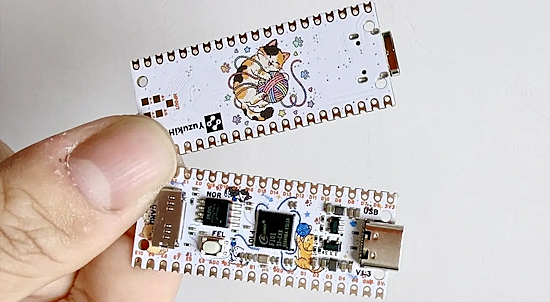](https://www.cnx-software.com/2026/09/08/yuzukineko-a-linux-capable-allwinner-f101-64-bit-risc-v-sbc-with-raspberry-pi-pico-form-factor/)

YuzukiNeko is a Raspberry Pi Pico-sized single board computer powered by a new Allwinner F101 RISC-V SoC. The processor features a single 1.008 GHz C907 RISC-V core, 8MB or 16 MB PSRAM, and support for various display interfaces such as MIPI DSI, 24-bit RGB, and LVDS. The YuzukiNeko board itself features the F101 SoC, an SPI NOR flash, a microSD card for storage, a USB-C port, and two 20-pin GPIO headers - [CNX](https://www.cnx-software.com/2026/09/08/yuzukineko-a-linux-capable-allwinner-f101-64-bit-risc-v-sbc-with-raspberry-pi-pico-form-factor/).

[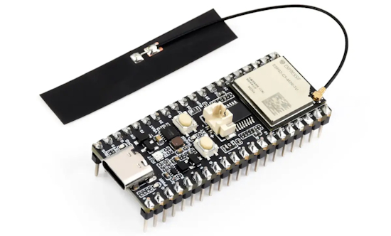](https://www.cnx-software.com/2026/09/09/esp32-c5-pico-board-follows-raspberry-pi-pico-form-factor-ships-with-on-board-or-external-antenna/)

Waveshare ESP32-C5 Pico board brings the ESP32-C5 dual-band WiFi 6, Bluetooth LE, and 802.15.4 (Zigbee/Thread) SoC to the Raspberry Pi Pico form factor.

The board features an ESP32-C5-MINI-1 Series module with PCB or external antenna, two 20-pin GPIO headers, a USB-C port for power and programming, Reset and Boot buttons, and a few LEDs. It also supports Li-Ion battery charging and discharging - [CNX](https://www.cnx-software.com/2026/09/09/esp32-c5-pico-board-follows-raspberry-pi-pico-form-factor-ships-with-on-board-or-external-antenna/).

## New Boards Supported by CircuitPython

The number of supported microcontrollers and Single Board Computers (SBC) grows every week. This section outlines which boards have been included in CircuitPython or added to [CircuitPython.org](https://circuitpython.org/).

This week there was one new board added:
 
- [Challenger RP2040 NFC by Invector Labs](https://circuitpython.org/board/challenger_rp2040_nfc/)

*Note: For non-Adafruit boards, please use the support forums of the board manufacturer for assistance, as Adafruit does not have the hardware to assist in troubleshooting.*

Looking to add a new board to CircuitPython? It's highly encouraged! Adafruit has four guides to help you do so:

- [How to Add a New Board to CircuitPython](https://learn.adafruit.com/how-to-add-a-new-board-to-circuitpython/overview)
- [How to add a New Board to the circuitpython.org website](https://learn.adafruit.com/how-to-add-a-new-board-to-the-circuitpython-org-website)
- [Adding a Single Board Computer to PlatformDetect for Blinka](https://learn.adafruit.com/adding-a-single-board-computer-to-platformdetect-for-blinka)
- [Adding a Single Board Computer to Blinka](https://learn.adafruit.com/adding-a-single-board-computer-to-blinka)

## New Adafruit Learning System Guides

[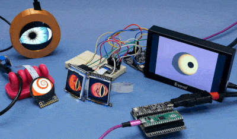](https://learn.adafruit.com/guides/latest)

The [Adafruit Learning System](https://learn.adafruit.com/) has over 3,200 free guides for learning skills and building projects including using Python.

[Adafruit Monster Eyes](https://learn.adafruit.com/adafruit-monster-eyes/overview) from [Liz Clark](https://learn.adafruit.com/u/BlitzCityDIY)

[title](url) from [name](url)

[title](url) from [name](url)

## Updated Learn Guides

[title](url)

## CircuitPython Libraries

The CircuitPython library numbers are continually increasing, while existing ones continue to be updated. Here we provide library numbers and updates!

To get the latest Adafruit libraries, download the [Adafruit CircuitPython Library Bundle](https://circuitpython.org/libraries). To get the latest community contributed libraries, download the [CircuitPython Community Bundle](https://circuitpython.org/libraries).

If you'd like to contribute to the CircuitPython project on the Python side of things, the libraries are a great place to start. Check out the [CircuitPython.org Contributing page](https://circuitpython.org/contributing). If you're interested in reviewing, check out Open Pull Requests. If you'd like to contribute code or documentation, check out Open Issues. We have a guide on [contributing to CircuitPython with Git and GitHub](https://learn.adafruit.com/contribute-to-circuitpython-with-git-and-github), and you can find us in the #help-with-circuitpython and #circuitpython-dev channels on the [Adafruit Discord](https://adafru.it/discord).

You can check out this [list of all the Adafruit CircuitPython libraries and drivers available](https://github.com/adafruit/Adafruit_CircuitPython_Bundle/blob/master/circuitpython_library_list.md). 

The current number of CircuitPython libraries is **585**!

**New Libraries**

Here are this week's new CircuitPython libraries:
 
* [adafruit/Adafruit_CircuitPython_TMF8801](https://github.com/adafruit/Adafruit_CircuitPython_TMF8801)
* [adafruit/Adafruit_CircuitPython_TMF8806](https://github.com/adafruit/Adafruit_CircuitPython_TMF8806)
* [TheFilipcom4607/circuitpython-pn7150](https://github.com/TheFilipcom4607/circuitpython-pn7150)
  
**Updated Libraries**
 
Here are this week's updated CircuitPython libraries:
 
* [adafruit/Adafruit_CircuitPython_Register](https://github.com/adafruit/Adafruit_CircuitPython_Register)
* [adafruit/Adafruit_CircuitPython_GPS](https://github.com/adafruit/Adafruit_CircuitPython_GPS)
* [adafruit/Adafruit_CircuitPython_MPU6050](https://github.com/adafruit/Adafruit_CircuitPython_MPU6050)
* [todbot/CircuitPython_SynthTools](https://github.com/todbot/CircuitPython_SynthTools)

## What’s the CircuitPython team up to this week?

What is the team up to this week? Let’s check in:

**Dan**

I'm finishing up working on BLE workflow bugs. There were multiple bugs and multiple causes for the bugs, depending on the microcontroller chip and also the operating system of the host computer. Then I'll start becoming familiar with the Zephyr port and working on its issues and desired features.

**Tim**

The SP-1 and watchdog guides are both published. Next up for me is porting `pico-faces` to run on the Fruit Jam and output via HSTX/DVI. I've got it working, and added an optional 2x2 colored grid effect inspired by Andy Worhol. Now I'm working on getting it cleaned up and writing a guide for it.

**Scott**

Last week I merged a fix to the Zephyr continuous tests and proposed another test using address sanitizer to catch issues. That PR is nearly merged. Now I'm catching up on reviews from the long US weekend. Next, I'm wrapping up the Adaboot bootloader that is built on Zephyr and MCUboot. It'll make it easy to update CircuitPython based on Zephyr and establish standard partition layouts for new boards.

**Liz**

The [Monster Eyes guide](https://learn.adafruit.com/adafruit-monster-eyes) was published this week. Since the code has grown, I'm going to refactor it into an Arduino library, that way folks can use it alongside projects more easily. I've also been documenting the [TMF8801 time of flight sensor](https://learn.adafruit.com/adafruit-tmf8801-time-of-flight-distance-sensor). There is a CircuitPython driver available for it.

## Upcoming Events

The next MicroPython Meetup in Melbourne will be on September 23 – [Luma](https://luma.com/micropython). You can see recordings of previous meetings on [YouTube](https://www.youtube.com/@MicroPythonOfficial). 

[Maker Faire Bay Area](https://bayarea.makerfaire.com/) is September 26-28 at Mare Island, California.

**Other Events This Year**

* [PyConZA 2026](https://za.pycon.org/), South Africa's Python conference, will be 14–18 Oct at Belmont Square, Cape Town, South Africa.
* [Espressif DevCon 2026](https://devcon.espressif.com/) will be November 3-4 in Milan, Italy and online.

If you know of virtual events or upcoming events, please let us know via email to cpnews(at)adafruit(dot)com.

## Latest Releases

CircuitPython's stable release is [10.3.0](https://github.com/adafruit/circuitpython/releases/tag/10.3.0). New to CircuitPython? Start with our [Welcome to CircuitPython Guide](https://learn.adafruit.com/welcome-to-circuitpython).

[20260910](https://github.com/adafruit/Adafruit_CircuitPython_Bundle/releases/latest) is the latest Adafruit CircuitPython library bundle.

[20260910](https://github.com/adafruit/CircuitPython_Community_Bundle/releases/latest) is the latest CircuitPython Community library bundle.

[v1.29.0](https://micropython.org/download) is the latest MicroPython release. Documentation for it is [here](http://docs.micropython.org/en/latest/pyboard/).

[3.14.7](https://www.python.org/downloads/) is the latest Python release. The latest pre-release version is [3.15.0rc2](https://www.python.org/download/pre-releases/).

[4,551 Stars](https://github.com/adafruit/circuitpython/stargazers) Like CircuitPython? [Star it on GitHub!](https://github.com/adafruit/circuitpython)

## Call for Help -- Translating CircuitPython is now easier than ever

[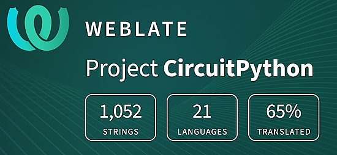](https://hosted.weblate.org/engage/circuitpython/)

One important feature of CircuitPython is translated control and error messages. With the help of fellow open source project [Weblate](https://weblate.org/), we're making it even easier to add or improve translations. 

Sign in with an existing account such as GitHub, Google or Facebook and start contributing through a simple web interface. No forks or pull requests needed! As always, if you run into trouble join us on [Discord](https://adafru.it/discord), we're here to help.

## NUMBER Thanks

The Adafruit Discord community, where we do all our CircuitPython development in the open, reached NUMBER humans - thank you! Adafruit believes Discord offers a unique way for Python on hardware folks to connect. Join today at [https://adafru.it/discord](https://adafru.it/discord).

## ICYMI - In case you missed it

Python on hardware is the Adafruit Python video-newsletter-podcast! The news comes from the Python community, Discord, Adafruit communities and more and is broadcast on ASK an ENGINEER Wednesdays. The complete Python on Hardware weekly videocast [playlist is here](https://www.youtube.com/playlist?list=PLjF7R1fz_OOXRMjM7Sm0J2Xt6H81TdDev). The video podcast is on [iTunes](https://itunes.apple.com/us/podcast/python-on-hardware/id1451685192?mt=2), [YouTube](http://adafru.it/pohepisodes), [Instagram](https://www.instagram.com/adafruit/channel/), and [XML](https://itunes.apple.com/us/podcast/python-on-hardware/id1451685192?mt=2).

[The weekly community chat on Adafruit Discord server CircuitPython channel - Audio / Podcast edition](https://itunes.apple.com/us/podcast/circuitpython-weekly-meeting/id1451685016) - Audio from the Discord chat space for CircuitPython, meetings are usually Mondays at 2pm ET, this is the audio version on [iTunes](https://itunes.apple.com/us/podcast/circuitpython-weekly-meeting/id1451685016), Pocket Casts, [Spotify](https://adafru.it/spotify), and [XML feed](https://adafruit-podcasts.s3.amazonaws.com/circuitpython_weekly_meeting/audio-podcast.xml).

## Contribute

The CircuitPython Weekly Newsletter is a CircuitPython community-run newsletter emailed every Monday. To contribute your content, please email your news to cpnews (at) adafruit (dot) com with information and link(s) to your content. 

Join the Adafruit [Discord](https://adafru.it/discord) or [post to the forum](https://forums.adafruit.com/viewforum.php?f=60) if you have questions.
