View this email in your browser. **Warning: Flashing Imagery**

Welcome to the latest Python on Microcontrollers newsletter! Excitement from the CircuitPython team this week. They have leveraged MicroPython @Native and @Viper along with PyMCU to create CircuitPython Turbo, which speeds up certain operations by a large factor. There are other optimizations in process to keep an eye out for. New versions of CircuitPython are starting to roll out Turbo and other goodies. Are you using Git with CircuitPython? A new article shows how it can best be done. 

I like the quality of articles that have appeared over the last week. I hope you find some things that catch your eye. - *Anne Barela, Editor*

We're on [Discord](https://discord.gg/HYqvREz), [Twitter/X](https://twitter.com/search?q=circuitpython&src=typed_query&f=live), [BlueSky](https://bsky.app/profile/circuitpython.org) and for past newsletters - [view them all here](https://www.adafruitdaily.com/category/circuitpython/). If you're reading this on the web, please [subscribe here](https://www.adafruitdaily.com/). Here's the news this week:

## CircuitPython Goes Turbo

CircuitPython Turbo is a host-side toolchain that compiles selected Python functions into native machine instructions, so the busiest loops run directly on the chip while the rest of the program stays ordinary Python. It targets compute-bound work — NeoPixel effects, fractals, audio processing, sensor filtering, and pixel pushing. Turbo is being rolled out to select boards with more planned - [Adafruit](https://learn.adafruit.com/circuitpython-turbo?view=all) and [Hackaday](https://hackaday.com/2026/09/14/circuitpython-goes-turbo-with-precompiled-functions/).

## CircuitPython 10.3.1 and 10.4.0-alpha.2 Released

CircuitPython 10.3.1 is a bugfix revision of CircuitPython and is a new stable release. 10.4.0-alpha.2 is the new unstable release of work planned for the next stable release- [Adafruit Blog 10.3.1](https://blog.adafruit.com/2026/09/14/circuitpython-10-3-1-released/), [Adafruit Blog 10.4.0-a2](https://blog.adafruit.com/2026/09/16/circuitpython-10-4-0-alpha-2-released/) and release notes - [GitHub](https://github.com/adafruit/circuitpython/releases/tag/10.3.1).

**Highlights of changes since 10.3.0**

- Allow importing turbo (`@viper` and `@native`) .mpy files on RP2xxx boards. More to come.
- Espressif ESP32-C5 support.
- Espressif and nordic BLE fixes that improve BLE workflow.
- Many other bug fixes.
- Many build infrastructure improvements and speedups.

**Highlights of changes since 10.3.1:**
  
- 5 GHz WiFi support.
- Allow importing turbo (@viper and @native) .mpy files on many espressif, nordic, and SAMx5x boards (already enabled on RP2xxx).
- BLE numeric-comparison (PIN) pairing on Espressif.
- Merge from MicroPython v1.28 and v1.29.
- Many bug fixes.

## Raspberry Pi Desktop Overhauled On Raspberry Pi OS, Adds Icon Dock

[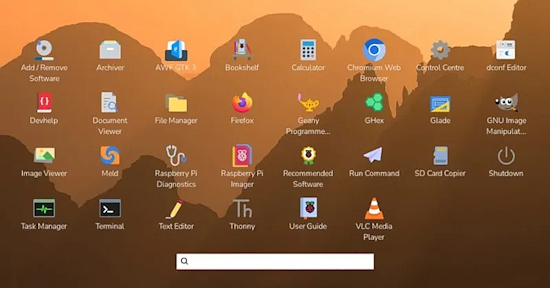](https://www.phoronix.com/news/Raspberry-Pi-Desktop-2026)

Raspberry Pi OS shipped a major UI/UX modernization of its desktop on September 15, 2026, the first significant evolution it has seen in years. The headline changes are an icon dock enabled by default (complementing or replacing the taskbar) and a graphical application launcher screen that replaces the old main menu widget. It also brings a new task list, more dock and desktop customization options, and an improved screenshot workflow - [Phoronix](https://www.phoronix.com/news/Raspberry-Pi-Desktop-2026) and [Raspberry Pi News](https://www.raspberrypi.com/news/an-updated-look-for-the-raspberry-pi-desktop/).

## Git and CircuitPython

Marshal Horn shows how to use git directly on a CIRCUITPY drive without the .git folder eating your limited flash or triggering auto-reload on every commit. The trick: create a git worktree on your computer, then copy just the one-line .git pointer file to the device. History stays on the host, the board holds just a few bytes - [MH Electrical Engineer](https://mhece.com/posts/cpgit/). Via [Discord](https://discord.com/channels/327254708534116352/763904151155245066/1536072589255123045).

## Identify The Birds In Your Garden

Arne Giacomo's Fugleramme turns a Raspberry Pi 5 and a 13.3″ Inky Impression into a frame that listens to your garden and shows you what it hears. BirdNET-Go handles the classification; the Python side polls its API, matches each species to one of 800+ hand-cut illustrations taken from real 1800s natural-history plates, none AI-generated, and packs them onto a page, redrawing only when the birds change. No e-ink panel needed if you'd rather run it as a web kiosk. The code is MIT, artwork CC BY-SA 4.0 – [GitHub](https://github.com/arnegiacomo/fugleramme), [documentation](https://arnegiacomo.dev/fugleramme/), and a [live frame](https://fugleramme.arnegiacomo.dev) in Bergen.

## Cue Clear: A Wearable CircuitPython Communication Display

[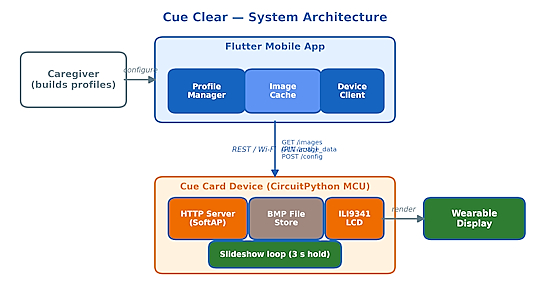](https://aircconline.com/csit/papers/vol16/csit161402.pdf)

Cue Clear is a wearable AAC (augmentative and alternative communication) display built on a CircuitPython board driving a 320×240 ILI9341 LCD, paired with a Flutter phone app that caregivers use to curate symbol slideshows. The CircuitPython side brings up its own WiFi access point, stores symbols as BMP files on the CIRCUITPY filesystem, and runs a hand-rolled non-blocking HTTP server on a single-threaded loop — displaying each image, then servicing network requests during the hold interval, so the slideshow keeps rendering while the board still answers the app - [AIRCC](https://aircconline.com/csit/papers/vol16/csit161402.pdf). (PDF) Via [X](https://x.com/CSIT58/status/2100086264292905448).

## New Book: Raspberry Pi Official Annual 2027

[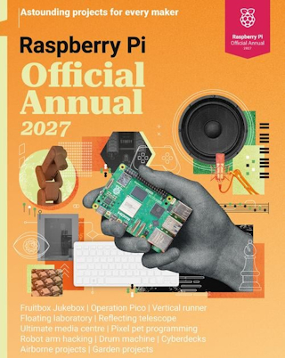](https://magazine.raspberrypi.com/books/raspberry-pi-annual-2027-buy-now)

The first Raspberry Pi Official Annual collects 200 pages of tutorials, project showcases, guides, and product reviews drawn from Raspberry Pi Official Magazine. It spans the current lineup — Raspberry Pi 500+, Pi 5, Pico, and Zero 2 — with a get-started guide covering every board, a deep dive on the 500+, troubleshooting advice, media centre build tutorials, and features - [Raspberry Pi Official Magazine](https://magazine.raspberrypi.com/books/raspberry-pi-annual-2027-buy-now) and [GitHub](https://github.com/themagpimag/annual27).

## This Week's Python Streams

Python on Hardware is all about building a cooperative ecosphere which allows contributions to be valued and to grow knowledge. Below are the streams within the last week focusing on the community.

**CircuitPython Deep Dive Stream**

[Last Friday](), Scott streamed work on .

You can see the latest video and past videos on the Adafruit YouTube channel under the Deep Dive playlist - [YouTube](https://www.youtube.com/playlist?list=PLjF7R1fz_OOXBHlu9msoXq2jQN4JpCk8A).

**CircuitPython Parsec**

John Park’s CircuitPython Parsec this week is on  - [Adafruit Blog]() and [YouTube]().

Catch all the episodes in the [YouTube playlist](https://www.youtube.com/playlist?list=PLjF7R1fz_OOWFqZfqW9jlvQSIUmwn9lWr).

**Deep Dive with Tim**

[Last week](https://youtube.com/live/yr2eBefpps0), Tim streamed work on a CircuitPython Turbo sand particle simulation.

You can see the latest video and past videos on the Adafruit YouTube channel under the Deep Dive playlist - [YouTube](https://www.youtube.com/playlist?list=PLjF7R1fz_OOWFqZfqW9jlvQSIUmwn9lWr).

**The CircuitPython Show**

Andrew from KeepEverythingYours.com joins the show. He shares how he got started with computers, his goals behind KeepEverythingYours.com, and his interactive CircuitPython tutorial - [The CircuitPython Show](https://circuitpythonshow.com/episodes/Season%208/ep065/).

**CircuitPython Weekly Meeting**

CircuitPython Weekly Meeting for September 14, 2026 ([notes](https://github.com/adafruit/adafruit-circuitpython-weekly-meeting/blob/main/2026/2026-09-14.md)) [on YouTube](https://youtu.be/NUe4zbSW8Hs).

## Project of the Week: A From-Scratch RP2354A Macro Pad

[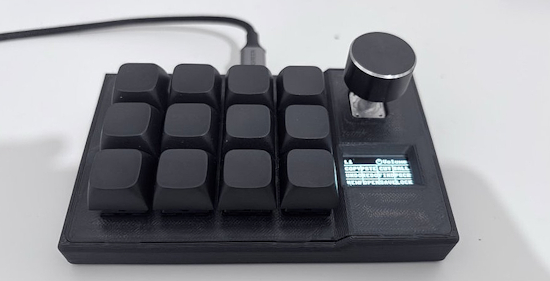](url)

Jacob Waters designed a 12-key macro pad from the ground up — a 4×3 Cherry MX grid with a clickable rotary encoder and an SSD1306 OLED, built on a bare RP2354A rather than a module, running custom MicroPython firmware with its own USB HID implementation. The OLED labels every key for the active layer, and holding the encoder button switches layers, so you read the pad instead of memorizing it. Configuration happens entirely in the browser — a [Web Serial installer](https://macropad.jpwaters09.com/Install%20or%20Update) flashes the firmware and a [web configurator](https://macropad.jpwaters09.com/Configurator) edits layers, with no software to install (Chrome, Edge, Opera, or Firefox only). KiCad files, the Fusion 360 case, and a full BOM are all published under MIT – [GitHub](https://github.com/Jpwaters09/Macro-Pad) and [project site](https://jpwaters09.com/). Via [X](https://x.com/jpwaters09/status/2099762367974289443).

## Popular Last Week

What was the most popular, most clicked link, in [last week's newsletter](https://www.adafruitdaily.com/2026/09/14/python-on-microcontrollers-newsletter-better-micropython-garbage-collection-python-in-1024-bytes-and-more/)? [The $15 Raspberry Pi Zero line board everyone recommends now costs $60, so here’s what to buy instead](https://www.makeuseof.com/board-everyone-recommends-costs-60-what-buy-instead/).

Did you know you can read past issues of this newsletter in the Adafruit Daily Archive? [Check it out](https://www.adafruitdaily.com/category/circuitpython/).

## Adafruit Playground Notes

[Adafruit Playground](https://adafruit-playground.com/) is a place for the community to post their projects and other making tips/tricks/techniques. Ad-free, it's an easy way to publish your work in a safe space for free.

## News From Around the Web

[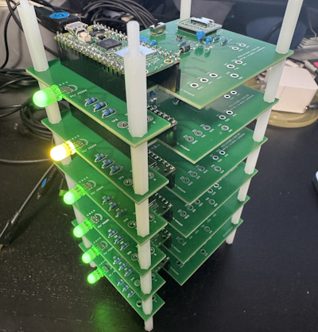](https://x.com/kemusiro/status/2098764529773805665)

A cluster of 6 Raspberry Pi Pico 2 W boards. Ray tracing calculations that take 208 seconds on a single board are completed in 37 seconds. They plan to scale up to 16 boards next. Uses MicroPython - [X](https://x.com/kemusiro/status/2098764529773805665) and [GitHub](https://github.com/kemusiro/asamomijijp-code/tree/main/projects/raspberry-pi-pico-cluster/raytracing/emitters). (Japanese)

[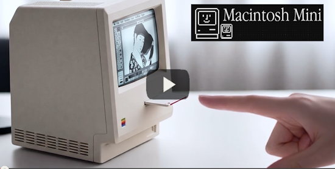](https://github.com/wr/macintosh-mini)

Wells Riley gutted a cheap AliExpress "Maclock" — an alarm clock in a startlingly accurate miniature Macintosh shell — and rebuilt it around a Raspberry Pi Zero 2 W running Basilisk II, so the tiny Mac actually boots System 7 and plays the startup chime. Python handles the physical controls through `lgpio`: a rotary encoder drives the backlight with gamma correction, and the buttons distinguish single from double presses to restart the emulator or quit to a Pi shell. Custom breakout PCB, 3D-printed bezel, and a build video included – [GitHub](https://github.com/wr/macintosh-mini) and [video](https://www.youtube.com/watch?v=zAbAf5-H5Yo). Via [Hackaday.io](https://hackaday.io/project/206691-macintosh-mini).

[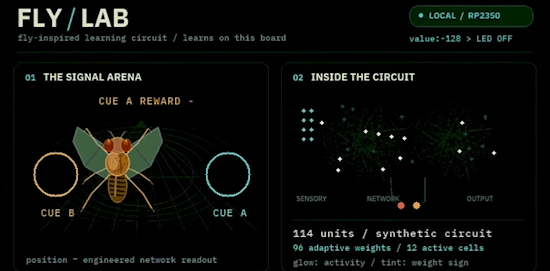](https://www.youtube.com/watch?v=PaxBBIJVN1o)

A tiny fly-brain lab running on an Adafruit Metro RP2350: real fruit-fly wiring plus a separate reward-learning circuit, driven locally with CircuitPython and native C. The model runs 16 inputs into 96 Kenyon-like units with 96 adjustable weights, and demonstrates rewards, frozen learning, cue swaps, and reversal — all rendered live at 640×480 over DVI at roughly nine screen updates per second. It has USB command input and onboard LED and NeoPixel outputs – [YouTube](https://www.youtube.com/watch?v=PaxBBIJVN1o).

The Python Software Foundation (PSF) Strategic Plan 2026 - [PSF Blog](https://pyfound.blogspot.com/2026/09/announcing-psf-strategic-plan-2026.html).

[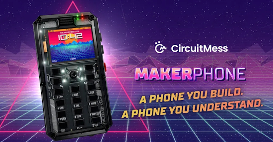](https://itsfoss.com/news/makerphone-2-annoucement/)

MAKERphone 2.0 lets you build a 4G phone running MicroPython or Arduino. It runs on an ESP32-S3, takes a real SIM for 4G calls and texts, snaps together without soldering. Code your own app, away from social media - [It's FOSS](https://itsfoss.com/news/makerphone-2-annoucement/). Via [X](https://x.com/jeanfrancis/status/2099174864116470137).

[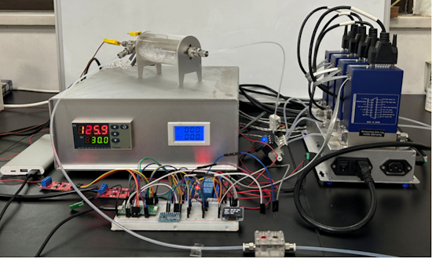](https://pubs.acs.org/jceda8/article/103/3/1635/5081488/Chem-Lab-Auto-Pi-Pico-An-Open-Source-Based)

Chem Lab Auto is a low-cost MicroPython platform on a Pico that bridges to commercial lab instruments over their serial APIs, with all assembly documentation published so undergrads can adapt it - [site](https://pubs.acs.org/jceda8/article/103/3/1635/5081488/Chem-Lab-Auto-Pi-Pico-An-Open-Source-Based). Via [Mastodon](https://mastodon.social/@MWNautilus@mstdn.social/117255020046872674).

[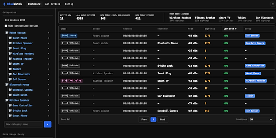](https://github.com/PolarPatch/BlueWatch)

BlueWatch is a Python Bluetooth scanner that runs on a Raspberry Pi and tells you when an unfamiliar device shows up nearby. You categorize the devices you already know. Then it scans both BLE and Classic, classifies devices by service UUID and vendor, builds presence timelines and activity heatmaps, spots devices that consistently appear together, and pushes alerts  – [GitHub](https://github.com/PolarPatch/BlueWatch). Via [RTL-SDR.com](https://www.rtl-sdr.com/bluewatch-detecting-new-bluetooth-devices-in-your-neighbourhood-via-a-raspberry-pi/).

CPython eases Rust requirements as assimilation continues - [The Register](https://www.theregister.com/devops/2026/09/14/cpython-eases-rust-requirements-as-assimilation-continues/5296010).

[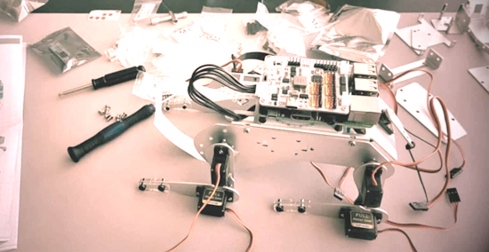](https://raspberrytips.com/raspberry-pi-projects-not-worth-building/)

Not every Raspberry Pi project is worth building - [RaspberryTips](https://raspberrytips.com/raspberry-pi-projects-not-worth-building/).

[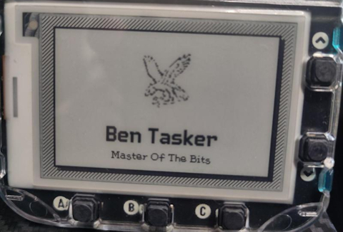](https://www.bentasker.co.uk/posts/blog/general/playing-with-an-eink-badge.html)

Ben Tasker got a Badgeware Badger — a name badge built around a 2.7″ e-ink display and an RP2350 — and wrote up getting started with it. It runs MicroPython and mounts as USB mass storage, with everything on it structured as apps (even the menu), so customising the badge means editing `__init__.py` and dropping in your own assets; most of the post is the debugging that followed, from swapping `rom_font.smart` for a smaller font to a long fight with ImageMagick over why his 16×16 icons wouldn't render – [blog post](https://www.bentasker.co.uk/posts/blog/general/playing-with-an-eink-badge.html).

[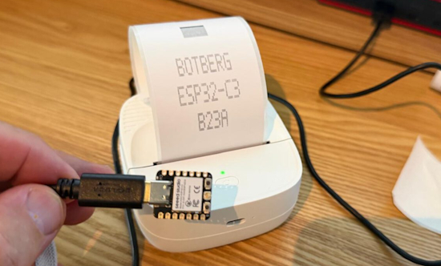](https://botberg.eu/electronica/een-bluetooth-printerdriver-vanaf-nul-van-python-op-de-laptop-naar-c-op-een-esp32-c3/)

A Bluetooth printer driver from scratch – from Python on the laptop to C++ on an ESP32-C3 - [BotBerg](https://botberg.eu/electronica/een-bluetooth-printerdriver-vanaf-nul-van-python-op-de-laptop-naar-c-op-een-esp32-c3/). (Dutch) Via [Hackaday](https://hackaday.com/2026/09/14/writing-an-esp32-bluetooth-printer-driver-in-two-acts/).

[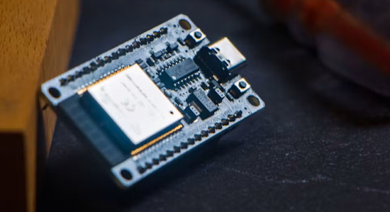](https://www.hackster.io/news/linux-6-11-on-an-esp32-s3-microcontroller-bdbb519203eb)

Paulneja got Linux 6.11 running natively on a cheap ESP32-S3 microcontroller, Wi-Fi, MicroPython and Bash included - [hackster.io](https://www.hackster.io/news/linux-6-11-on-an-esp32-s3-microcontroller-bdbb519203eb).

[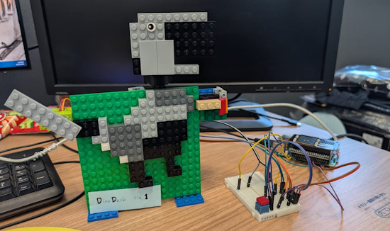](https://github.com/google-gemma/dinodesk-ai-companion/)

DinoDesk AI is a desk companion robot built on a Raspberry Pi with a 240×240 ST7789 display for facial expressions, a nose button, and a mode switch. The Python client runs a finite state machine on the Pi and talks to a FastAPI gateway that routes between a local Gemma 4 and Gemini Flash – [GitHub](https://github.com/google-gemma/dinodesk-ai-companion) and video - [YouTube](https://www.youtube.com/watch?v=pXOTjxcNzdQ).

Those icon-and-indicator LED displays on consumer gear, not matrices, not OLED, almost never turn up in custom builds. Maker's Fun Duck's Custom LED Display Generator fixes the hard part. Feed it a single image, pick your MCU and LED-driving configuration, and the Python tool generates the KiCad project, the 3D-printable light-bleed divider, and the mask. The rest is achievable at home — the diffuser can be a sheet of printer paper, and the demo looks good even with diffuser and mask combined into one printed sheet – [GitHub](https://github.com/MakersFunDuck/Custom-LED-Display-Generator) and [YouTube](https://www.youtube.com/watch?v=lEBiFov_C0w). Via [Hackster](https://www.hackster.io/news/a-cool-new-way-to-make-custom-led-display-f0d40c5cb535).

[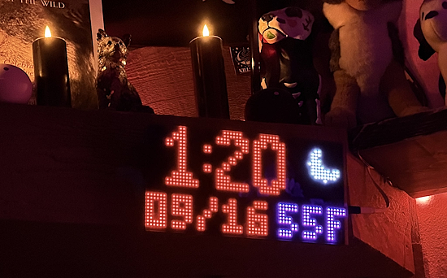](https://x.com/_BVDGRRL_XXX/status/2100141907095744974)

A clock with NTP, temerature and can show weather. Completely open source with CircuitPython and an adafruit M4 board - [X](https://x.com/_BVDGRRL_XXX/status/2100141907095744974).

[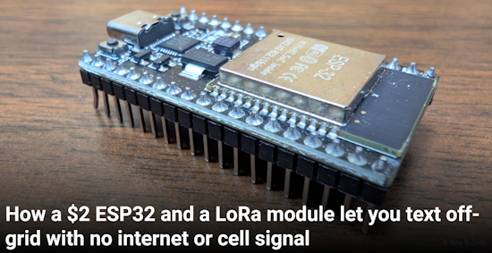](https://www.howtogeek.com/esp32-and-lora-module-let-you-text-off-grid-with-no-internet-or-cell-signal/)

How a $2 ESP32 and a LoRa module let you text off-grid with no internet or cell signal - [How-To Geek](https://www.howtogeek.com/esp32-and-lora-module-let-you-text-off-grid-with-no-internet-or-cell-signal/).

[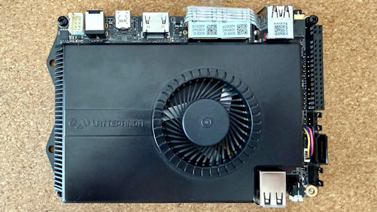](https://taoofmac.com/space/reviews/2026/09/13/1700)

Review: The LattePanda Sigma - [Tao of Mac](https://taoofmac.com/space/reviews/2026/09/13/1700).

## New

[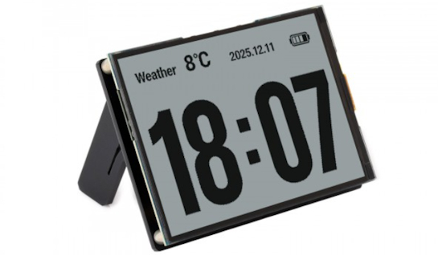](https://www.waveshare.com/esp32-s3-rlcd-4.2.htm?sku=33298&aff_id=Waveshare)

The Waveshare ESP32-S3-RLCD-4.2 is an ESP32-S3 4.2inch RLCD development board with 300 × 400 resolution. It supports WiFi & BLE dual-mode communication and AI voice interaction - [Waveshare](https://www.waveshare.com/esp32-s3-rlcd-4.2.htm?sku=33298&aff_id=Waveshare).

FREE-WILi 2 is an open-hardware pocket lab and hacking multitool built around two RP2350B MCUs — one running the device, one driving the display — plus a Raspberry Pi CM0 module that boots 64-bit Linux specifically to run heavy Python scripts, an ESP32-C5, and a Lattice iCE40UP5K FPGA with 8MB of dedicated SRAM. The OneWili API drives all of that hardware from Python, Rust, or C/C++, and there's rThon for Python-like real-time scripting alongside WiliBlocks visual programming. Radios cover Wi-Fi 6, BLE, 802.15.4, LoRa, sub-GHz, NFC, 125kHz RFID and IR, and the 14 buttons mean it also runs PICO-8, Doom, and Adafruit Fruit Jam – [CNX Software](https://www.cnx-software.com/2026/09/09/free-wili-2-portable-hacking-multitool-features-two-rp2350-mcus-esp32-c5-ice40-fpga-and-raspberry-pi-cm0/) and [freewili.com](https://freewili.com/).

## New Boards Supported by CircuitPython

The number of supported microcontrollers and Single Board Computers (SBC) grows every week. This section outlines which boards have been included in CircuitPython or added to [CircuitPython.org](https://circuitpython.org/).

CircuitPython 10.3.1 adds support for three new boards:

* [Challenger RP2040 NFC](https://circuitpython.org/board/challenger_rp2040_nfc/) – Invector Labs
* [ESP32-C5-DevKitC-1-N8R8](https://circuitpython.org/board/espressif_esp32c5_devkitc_1_n8r8/) – Espressif
* [Teenage Engineering SP1](https://circuitpython.org/board/teenage_engineering_sp1/) – Teenage Engineering

*Note: For non-Adafruit boards, please use the support forums of the board manufacturer for assistance, as Adafruit does not have the hardware to assist in troubleshooting.*

Looking to add a new board to CircuitPython? It's highly encouraged! Adafruit has four guides to help you do so:

- [How to Add a New Board to CircuitPython](https://learn.adafruit.com/how-to-add-a-new-board-to-circuitpython/overview)
- [How to add a New Board to the circuitpython.org website](https://learn.adafruit.com/how-to-add-a-new-board-to-the-circuitpython-org-website)
- [Adding a Single Board Computer to PlatformDetect for Blinka](https://learn.adafruit.com/adding-a-single-board-computer-to-platformdetect-for-blinka)
- [Adding a Single Board Computer to Blinka](https://learn.adafruit.com/adding-a-single-board-computer-to-blinka)

## New Adafruit Learning System Guides

[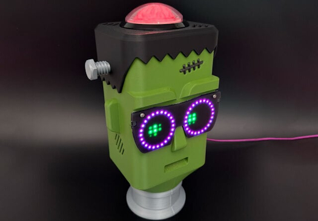](https://learn.adafruit.com/guides/latest)

The [Adafruit Learning System](https://learn.adafruit.com/) has over 3,200 free guides for learning skills and building projects including using Python.

[Franky Candy Dispenser](https://learn.adafruit.com/franky-candy-dispenser) from Ruiz Brothers and Liz Clark

[CircuitPython Turbo: Go Blinka!](https://learn.adafruit.com/circuitpython-turbo) from PT

[Pico-Faces On Fruit Jam](https://learn.adafruit.com/pico-faces-on-fruit-jam) from Tim C

## CircuitPython Libraries

The CircuitPython library numbers are continually increasing, while existing ones continue to be updated. Here we provide library numbers and updates!

To get the latest Adafruit libraries, download the [Adafruit CircuitPython Library Bundle](https://circuitpython.org/libraries). To get the latest community contributed libraries, download the [CircuitPython Community Bundle](https://circuitpython.org/libraries).

If you'd like to contribute to the CircuitPython project on the Python side of things, the libraries are a great place to start. Check out the [CircuitPython.org Contributing page](https://circuitpython.org/contributing). If you're interested in reviewing, check out Open Pull Requests. If you'd like to contribute code or documentation, check out Open Issues. We have a guide on [contributing to CircuitPython with Git and GitHub](https://learn.adafruit.com/contribute-to-circuitpython-with-git-and-github), and you can find us in the #help-with-circuitpython and #circuitpython-dev channels on the [Adafruit Discord](https://adafru.it/discord).

You can check out this [list of all the Adafruit CircuitPython libraries and drivers available](https://github.com/adafruit/Adafruit_CircuitPython_Bundle/blob/master/circuitpython_library_list.md). 

The current number of CircuitPython libraries is **588**!

**New Libraries**

Here are this week's new CircuitPython libraries:

* [Adafruit_CircuitPython_TSL2585](https://github.com/adafruit/Adafruit_CircuitPython_TSL2585)
* [Adafruit_CircuitPython_Meshfruit](https://github.com/adafruit/Adafruit_CircuitPython_Meshfruit)
* [circuitpython-st25dv](https://github.com/TheFilipcom4607/circuitpython-st25dv)

**Updated Library**

* [circuitpython-pn7150](https://github.com/TheFilipcom4607/circuitpython-pn7150)

## What’s the CircuitPython team up to this week?

What is the team up to this week? Let’s check in:

**Dan**

I released CircuitPython 10.3.1 and 10.4.0-alpha.2 last week. Both have many fixes and new features. Pull requests are coming in at a torrid pace.

I had LLMs research how to save more CircuitPython firmware space. There are some good ideas that would save ~500-10k bytes on various builds. Our smallest builds are well optimized and there is not much to cut. I'll be making pull requests for some of those suggestions. I'll also be working on Zephyr.

**Tim**

The pico-faces on Fruit Jam guide is published now. This week I've been shifting gears into Turbo. Learning out the differences between native and viper modules, and making some visualization demos. Viper modules can crunch numbers for things like physics simulation very fast. Picogame gives us improved rendering performance, together with viper modules they can create some very fun and snappy games and visualizations. We're only just beginning to scratch the surface of what these new capabilities make possible.

**Scott**

This week I've mainly been working on adding LittleFS support and Zephyr pin muxing. LittleFS is useful for non-USB boards because it is more flash friendly than FATFS. FATFS is great to show a CIRCUITPY drive though. I've settled on an API for Zephyr pin muxing and need to validate that it all works.

I also took a brief detour into optimizing our use of GitHub Actions. We're merging more PRs and needed to improve the Actions backlog. We'll now cancel builds of commits on main when a newer PR is merged. That means we may not have Absolute Newest builds for every commit but we the newest one will complete faster.

**Liz**

This week I've been documenting new sensors that are in the shop. The first is the [TMF8806 time of flight sensor](https://learn.adafruit.com/adafruit-tmf8806-time-of-flight-distance-sensor). This sensor is very similar to the TMF8801, but with a wider range. The [TSL2585 is a digital UVA and ambient light sensor](https://learn.adafruit.com/adafruit-tsl2585-digital-uva-and-ambient-light-sensor). It reads three different bands of light: ambient/photopic, UVA and IR. Both of these sensors have CircuitPython drivers in the library bundle.

## Upcoming Events

The next MicroPython Meetup in Melbourne will be on September 23 – [Luma](https://luma.com/micropython). You can see recordings of previous meetings on [YouTube](https://www.youtube.com/@MicroPythonOfficial). 

[Maker Faire Bay Area](https://bayarea.makerfaire.com/) is September 26-28 at Mare Island, California.

**Other Events This Year**

* [PyConZA 2026](https://za.pycon.org/), South Africa's Python conference, will be 14–18 Oct at Belmont Square, Cape Town, South Africa.
* [Espressif DevCon 2026](https://devcon.espressif.com/) will be November 3-4 in Milan, Italy and online.

If you know of virtual events or upcoming events, please let us know via email to cpnews(at)adafruit(dot)com.

## Latest Releases

CircuitPython's stable release is [10.3.1](https://circuitpython.org/downloads). The latest unstable release is [10.4.0-alpha.2](https://circuitpython.org/downloads). New to CircuitPython? Start with our [Welcome to CircuitPython Guide](https://learn.adafruit.com/welcome-to-circuitpython).

[20260917](https://github.com/adafruit/Adafruit_CircuitPython_Bundle/releases/tag/20260917) is the latest Adafruit CircuitPython library bundle.

[20260915](https://github.com/adafruit/CircuitPython_Community_Bundle/releases/tag/20260915) is the latest CircuitPython Community library bundle.

[v1.29.0](https://github.com/micropython/micropython/releases/tag/v1.29.0) is the latest MicroPython release. Documentation for it is [here](https://docs.micropython.org/en/latest/).

[3.14.7](https://www.python.org/downloads/release/python-3147/) is the latest Python release. The latest pre-release version is [3.15.0rc2](https://www.python.org/downloads/release/python-3150rc2/).

[4,557 Stars](https://github.com/adafruit/circuitpython/stargazers) Like CircuitPython? Star it on [GitHub](https://github.com/adafruit/circuitpython)!

## Call for Help -- Translating CircuitPython is now easier than ever

[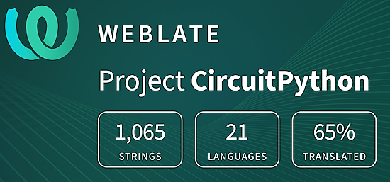](https://hosted.weblate.org/engage/circuitpython/)

One important feature of CircuitPython is translated control and error messages. With the help of fellow open source project [Weblate](https://weblate.org/), we're making it even easier to add or improve translations. 

Sign in with an existing account such as GitHub, Google or Facebook and start contributing through a simple web interface. No forks or pull requests needed! As always, if you run into trouble join us on [Discord](https://adafru.it/discord), we're here to help.

## 38,885 Thanks

The Adafruit Discord community, where we do all our CircuitPython development in the open, reached over 38,885 humans - thank you! Adafruit believes Discord offers a unique way for Python on hardware folks to connect. Join today at [https://adafru.it/discord](https://adafru.it/discord).

## ICYMI - In case you missed it

Python on hardware is the Adafruit Python video-newsletter-podcast! The news comes from the Python community, Discord, Adafruit communities and more and is broadcast on ASK an ENGINEER Wednesdays. The complete Python on Hardware weekly videocast [playlist is here](https://www.youtube.com/playlist?list=PLjF7R1fz_OOXRMjM7Sm0J2Xt6H81TdDev). The video podcast is on [iTunes](https://itunes.apple.com/us/podcast/python-on-hardware/id1451685192?mt=2), [YouTube](http://adafru.it/pohepisodes), [Instagram](https://www.instagram.com/adafruit/channel/), and [XML](https://itunes.apple.com/us/podcast/python-on-hardware/id1451685192?mt=2).

[The weekly community chat on Adafruit Discord server CircuitPython channel - Audio / Podcast edition](https://itunes.apple.com/us/podcast/circuitpython-weekly-meeting/id1451685016) - Audio from the Discord chat space for CircuitPython, meetings are usually Mondays at 2pm ET, this is the audio version on [iTunes](https://itunes.apple.com/us/podcast/circuitpython-weekly-meeting/id1451685016), Pocket Casts, [Spotify](https://adafru.it/spotify), and [XML feed](https://adafruit-podcasts.s3.amazonaws.com/circuitpython_weekly_meeting/audio-podcast.xml).

## Contribute

The CircuitPython Weekly Newsletter is a CircuitPython community-run newsletter emailed every Monday. To contribute your content, please email your news to cpnews (at) adafruit (dot) com with information and link(s) to your content. 

Join the Adafruit [Discord](https://adafru.it/discord) or [post to the forum](https://forums.adafruit.com/viewforum.php?f=60) if you have questions.
