View this email in your browser. **Warning: Flashing Imagery**

Welcome to the latest Python on Microcontrollers newsletter! Drama in the Python world these past few days. "Big" Python was supposed to have the major 3.15 release on October 1st but the day passed without a release. The development team made an surprise third release candidate to address lazy import bugs discovered at the last minute. Finally, late last Friday, the new version was released. I was curious about MicroPython v1.30.0, so I went to the milestones page on GitHub and saw it's tracking at 75% complete. And finally, I have the inside scoop that CircuitPython 11 is progressing well and will have a great deal of new capability. It's a great time to use Python!

There is also a full list of projects and other news, worthy of a look. I hope you enjoy this issue. - *Anne Barela, Editor*

We're on [Discord](https://discord.gg/HYqvREz), [Twitter/X](https://twitter.com/search?q=circuitpython&src=typed_query&f=live), [BlueSky](https://bsky.app/profile/circuitpython.org) and for past newsletters - [view them all here](https://www.adafruitdaily.com/category/circuitpython/). If you're reading this on the web, please [subscribe here](https://www.adafruitdaily.com/). Here's the news this week:

## Python 3.15 Finally Released Friday

Python 3.15.0 is the newest major release of the Python programming language, and it contains many new features and optimisations compared to Python 3.14, in 5,643 commits from 1,012 contributors. Originally due October 1st, a Release Candidate 3 came out before 3.15 final was released October 9th. One main feature is that the experimental JIT compiler runs faster - [Python Insider](https://blog.python.org/2026/10/python-3150-final-is-here/) and [Phoronix](https://www.phoronix.com/news/Python-3.15-Released).

## MicroPython 1.30 Targeting December 7th

[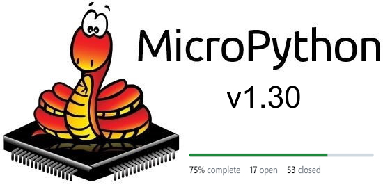](https://github.com/micropython/micropython/milestones)

MicroPython has version 1.30 previews for their supported hardware. On the Milestones page on GitHub, they list 75% complete with 17 PRs open and 53 closed - [GitHub](https://github.com/micropython/micropython/milestones).

## Picotronix is a Modular Oscilloscope and Logic Analyser Based on Two Raspberry Pi Pico 2s and MicroPython

[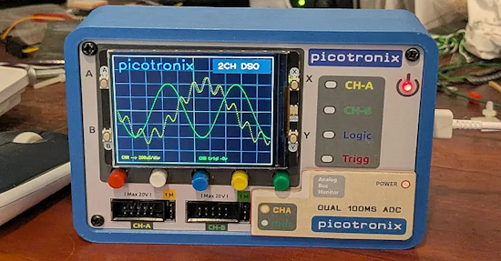](https://picotronix.com/)

Picotronix is a modular oscilloscope and logic analyser based on two Raspberry Pi Pico 2 units (a Pico 2 and a Pico 2 W). You start with the Main Module and add plug-in picoPods as you need them: analog, differential, a 12-bit waveform generator, 12-channel logic at 150 MSPS, and the ADC-100 with dual 100 MSPS ADCs, which captures up to 75 MSPS on one channel or 50 MSPS on both on a stock 150 MHz RP2350. Everything is open and programmable in MicroPython, with direct access to the RP2350's PIO state machines - [Picotronix](https://picotronix.com/).

## PSF News: Board & Inaugural Python Packaging Council Election Results, Strategic Plan, and PyPI Security

The Python Software Foundation October newsletter announces the results of its two September elections: the first Python Packaging Council (Brett Cannon, Pradyun Gedam, Donald Stufft, Henry Schreiner and Ralf Gommers) and four seats on the PSF Board (Elaine Wong, Laís Carvalho, Ee Durbin and Georgi Ker). It also introduces the PSF's 2026–2031 strategic plan and an update on security work, including PyPI - [PSF Newsletter](https://mailchi.mp/python/python-software-foundation-july-2024-newsletter-19889889).

## micro-repl: A MicroPython IDE for Multiple Platforms

[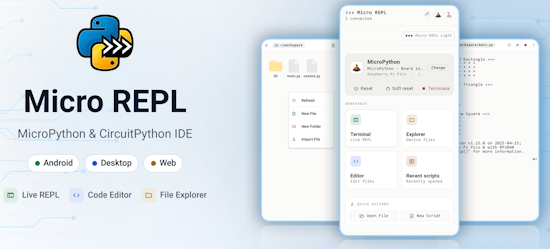](https://github.com/Ma7moud3ly/micro-repl)

Mahmoud Aly has published Micro REPL on GitHub, a MicroPython IDE that runs on Android, Windows, macOS, Linux and in the browser. Plug a board in over USB and you get a live REPL, a file explorer and a code editor with the same layout on every platform. MIT licensed - [GitHub](https://github.com/Ma7moud3ly/micro-repl).

## Raspberry Pi Desktop Now Available for PC and Mac

[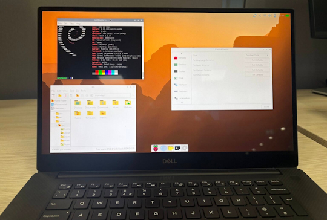](https://www.raspberrypi.com/news/raspberry-pi-desktop-now-available-for-pc-and-mac/)

Raspberry Pi has updated Debian Trixie with Raspberry Pi Desktop for PC and Mac - [Raspberry Pi News](https://www.raspberrypi.com/news/raspberry-pi-desktop-now-available-for-pc-and-mac/).

## This Week's Python Streams

Python on Hardware is all about building a cooperative ecosphere which allows contributions to be valued and to grow knowledge. Below are the streams within the last week focusing on the community.

**CircuitPython Deep Dive Stream**

[Last Friday](https://youtube.com/live/aTJmQLvsgG8), Scott streamed work on the CircuitPython video pipeline.

You can see the latest video and past videos on the Adafruit YouTube channel under the Deep Dive playlist - [YouTube](https://www.youtube.com/playlist?list=PLjF7R1fz_OOXBHlu9msoXq2jQN4JpCk8A).

**CircuitPython Parsec**

John Park’s CircuitPython Parsec this week is on I2C Target - [Adafruit Blog](https://blog.adafruit.com/2026/10/09/john-parks-circuitpython-parsec-i2c-target/) and [YouTube](https://youtu.be/BCU81gNvK1Y?si=TXrNcxgX19pdh63Y).

Catch all the episodes in the [YouTube playlist](https://www.youtube.com/playlist?list=PLjF7R1fz_OOWFqZfqW9jlvQSIUmwn9lWr).

**Deep Dive with Tim**

[Last week](https://youtube.com/live/LDQwzwCyZqI), Tim streamed work on CircuitPython USB host bulk-in support for SDR.

You can see the latest video and past videos on the Adafruit YouTube channel under the Deep Dive playlist - [YouTube](https://www.youtube.com/playlist?list=PLjF7R1fz_OOXBHlu9msoXq2jQN4JpCk8A).

**The CircuitPython Show**

Vicky Twomey-Lee joins the show and shares her start with computers, the early days of the Python Ireland community, the Introduction to Electronics and Python workshop she co-teaches, and more - [The CircuitPython Show](https://circuitpythonshow.com/episodes/Season%208/ep066/).

**CircuitPython Weekly Meeting**

CircuitPython Weekly Meeting for October 5, 2026 ([notes](https://github.com/adafruit/adafruit-circuitpython-weekly-meeting/blob/main/2026/2026-10-05.md)) [on YouTube](https://youtu.be/7aZlNXQf7mc).

## Project of the Week: Build a Monster Meter

[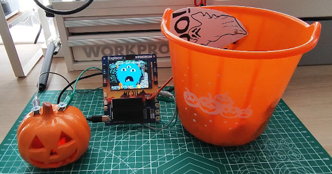](https://learn.pimoroni.com/article/build-a-monster-meter)

Les Pounder uses a Pimoroni Explorer to build a "Monster-Meter" that detects what type of monster a person is. It uses the Explorer and MicroPython - [Pimoroni](https://learn.pimoroni.com/article/build-a-monster-meter).

## Popular Last Week

What was the most popular, most clicked link, in [last week's newsletter](https://www.adafruitdaily.com/2026/10/05/python-on-microcontrollers-newsletter-circuitpython-11-alpha-bluetooth-to-space-new-esp32-p4s-and-more/)? [The $15 board everyone recommends now costs $60, so here's what to buy instead](https://www.makeuseof.com/board-everyone-recommends-costs-60-what-buy-instead/).

Did you know you can read past issues of this newsletter in the Adafruit Daily Archive? [Check it out](https://www.adafruitdaily.com/category/circuitpython/).

## Notes from Adafruit Playground

[Adafruit Playground](https://adafruit-playground.com/) is a place for the community to post their projects and other making tips/tricks/techniques. Ad-free, it's an easy way to publish your work in a safe space for free.

[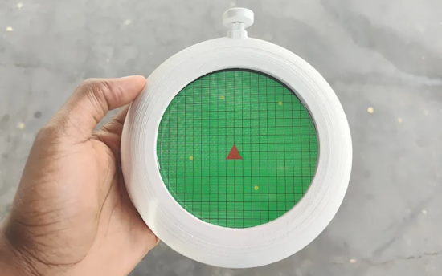](https://adafruit-playground.com/u/extralongdivision/pages/dragon-ball-radar-devlog-2-prototype)

Dragon Ball Radar: Devlog 2 - Prototype - [Adafruit Playground](https://adafruit-playground.com/u/extralongdivision/pages/dragon-ball-radar-devlog-2-prototype).

## News From Around the Web

[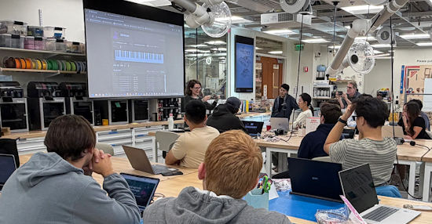](https://bsky.app/profile/gallaugher.bsky.social/post/3mxelfizcgc2y)

Professor Gallaugher writes: "Special and very musical night last evening as Adafruit engineers Liz Clark & Noe Ruiz drop by and drop knowledge on CircuitPython & MIDI. My Boston College Physical Computing students were rocked! Huge thanks!" - [BlueSky](https://bsky.app/profile/gallaugher.bsky.social/post/3mxelfizcgc2y).

[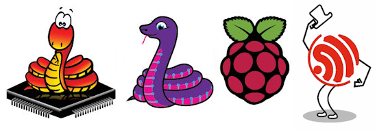](https://github.com/ctrlpi/pico-bay)

`pico-bay` is an app and MCP Server for managing Raspberry Pi Pico and ESP32 boards with MicroPython and CircuitPython over USB. MIT licensed - [GitHub](https://github.com/ctrlpi/pico-bay).

[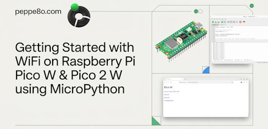](https://peppe8o.com/getting-started-with-wifi-on-raspberry-pi-pico-w-and-micropython/)

WiFi on Raspberry Pi Pico W & Pico 2 W with MicroPython (A Complete Guide & Benchmarks) - [peppe8o](https://peppe8o.com/getting-started-with-wifi-on-raspberry-pi-pico-w-and-micropython/).

[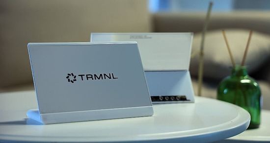](https://x.com/seeedstudio/status/2107433437238047168)

The TRMNL (OG) DIY Kit is now officially supported by CircuitPython, and so is the bare EE04 driver board. Install it from a browser installer, then edit Python straight on the board - [X](https://x.com/seeedstudio/status/2107433437238047168) and [CircuitPython.org](https://circuitpython.org/board/seeed_xiao_esp32_s3_trmnl_diy_kit/).

[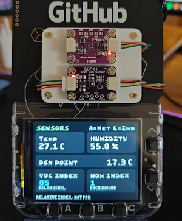](https://blog.wildwanderer-vr.com/github-universe-badge-environment-sensors/)

Turning a GitHub Universe badge into an environmental monitor with MicroPython - [Wild Wanderer VR](https://blog.wildwanderer-vr.com/github-universe-badge-environment-sensors/).

[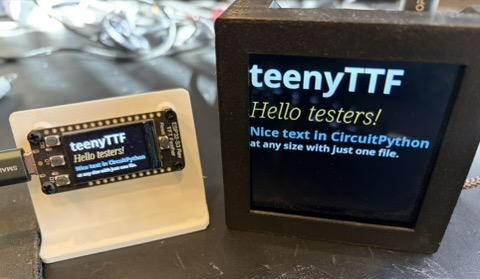](https://mastodon.social/@prcutler@hachyderm.io/117383456161917255)

Paul Cutler tests out teenyTTF which makes fonts in different sizes in CircuitPython from one file - [Mastodon](https://mastodon.social/@prcutler@hachyderm.io/117383456161917255).

[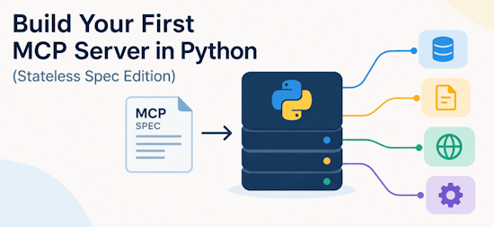](https://www.kdnuggets.com/build-your-first-mcp-server-in-python-stateless-spec-edition)

Build your first MCP server in Python (Stateless Spec Edition) - [KDnuggets](https://www.kdnuggets.com/build-your-first-mcp-server-in-python-stateless-spec-edition).

Linux 7.4 to support the Raspberry Pi 10-inch Touch Display 2 - [Phoronix](https://www.phoronix.com/news/Linux-74-RPi-10-Touch-Display-2).

Building an Ethernet IoT node with MicroPython and MQTT - [hackster.io](https://www.hackster.io/happypikachoo/building-an-ethernet-iot-node-with-micropython-and-mqtt-e5051c).

Skynode is a webcam on a pan-tilt mount that watches the sky, a YOLO model finds aircraft and birds in each frame, the mount turns to follow the target, and every sighting is logged - [GitHub](https://github.com/bsalsa2/Skynode).

[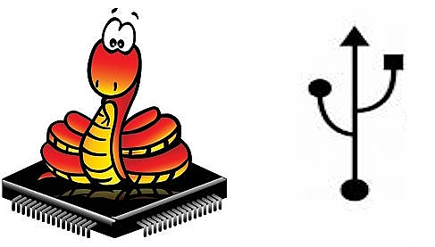](https://github.com/PyDevices/usbif)

`usbif` is native USB for MicroPython: a board that a computer sees as a sound card, a MIDI instrument or a webcam, and (on the same board) a USB host that a keyboard, thumb drive, MIDI controller or camera plugs into - [GitHub](https://github.com/PyDevices/usbif).

`USBtoDIN` is a microcontroller project to adapt a USB-based MIDI controller to a DIN-based MIDI device using CircuitPython 11 alpha - [GitHub](https://github.com/RobCranfill/USBtoDIN).

[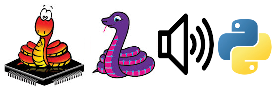](https://github.com/PyDevices/audiodsp)

`audiodsp` uses CircuitPython's audio system for use by MicroPython and CPython: `audiocore`, `audiomixer`, `synthio` (including `MidiTrack`), the effects modules (`audiofilters`, `audiodelays`, `audiofreeverb`, `audiospeed`), `audiomp3`, and CircuitPython `play()`/`stop()`/`pause()`/`resume()` output semantics. Import names stay `audiocore`/`synthio`/etc., matching CircuitPython for source compatibility - [GitHub](https://github.com/PyDevices/audiodsp).

[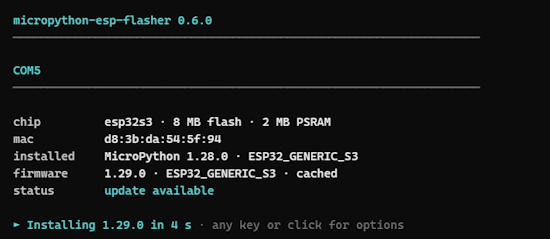](https://github.com/rrokot/micropython-esp-flasher)

`micropython-esp-flasher` is a new program to install and update MicroPython on ESP32 boards - [GitHub](https://github.com/rrokot/micropython-esp-flasher).

*Camera-based control of an anthropomorphic robot hand*, the graduation thesis of Cyril Aeberhard, is a 3D-printed robotic hand that replicates human finger movements in real time – controlled solely via a laptop camera, without gloves and without sensors on the body, using Python and MicroPython - [GitHub](https://github.com/cyrilaeberhard/Matura-Arbeit).

[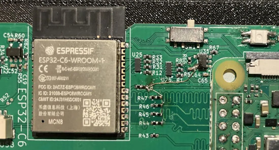](https://hackaday.com/2026/10/07/esp32-as-your-raspberry-pis-linux-wireless-co-processor/)

ESP32 as your Raspberry Pi’s Linux wireless coprocessor - [Hackaday](https://hackaday.com/2026/10/07/esp32-as-your-raspberry-pis-linux-wireless-co-processor/).

[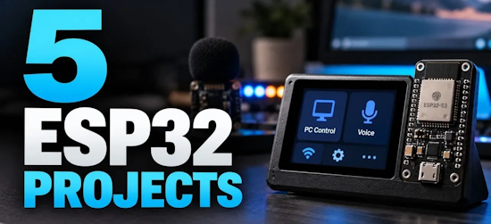](https://www.geeky-gadgets.com/esp32-projects-worth-building-2026/)

Five ESP32 projects worth building in 2026, Such as an Apple HomeKit controller - [Geeky Gadgets](https://www.geeky-gadgets.com/esp32-projects-worth-building-2026/).

[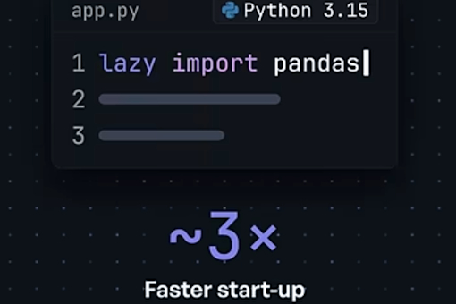](https://www.youtube.com/watch?v=Px629VaFiIE)

Python 3.15 starts 3X faster with lazy imports - [YouTube](https://www.youtube.com/watch?v=Px629VaFiIE).

## New

[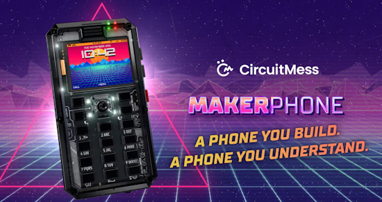](https://linuxiac.com/makerphone-2-0-is-an-open-hackable-4g-phone-you-build-yourself/)

CircuitMess launches MAKERphone 2.0, a solder-free ESP32-S3 phone with 4G, MicroPython and C++ support, plus modular hardware expansion - [Linuxiac](https://linuxiac.com/makerphone-2-0-is-an-open-hackable-4g-phone-you-build-yourself/).

[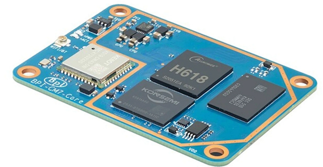](https://www.notebookcheck.net/Competition-for-the-Raspberry-Pi-CM-Banana-Pi-BPI-CM7-unveiled.1418882.0.html)

Banana Pi has officially announced the BPI-CM7, offering a new single-board system that could serve as a compact alternative to Raspberry Pi setups using the compute module form factor - [NotebookCheck](https://www.notebookcheck.net/Competition-for-the-Raspberry-Pi-CM-Banana-Pi-BPI-CM7-unveiled.1418882.0.html).

[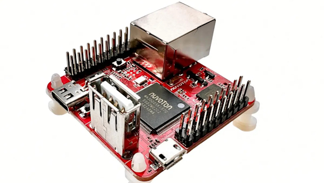](https://www.cnx-software.com/2026/10/07/numaker-iot-ma35d0-a2-chili-pro-ultra-compact-evaluation-board-features-ma35d0k-cortex-a35-m4-mpu/)

Nuvoton has added MA35D05KH67C, MA35D05KI67C, and MA35D05KJ67C, three new LQFP128 MPUs, to the NuMicro MA35D0 series, along with the NuMaker-IoT-MA35D0-A2 (Chili Pro) evaluation board. Designed for industrial AI, smart gateways, and renewable energy systems, this heterogeneous MPU has two 64-bit Arm Cortex-A35 cores at up to 650 MHz, plus a dedicated 180 MHz Arm Cortex-M4 - [CNX](https://www.cnx-software.com/2026/10/07/numaker-iot-ma35d0-a2-chili-pro-ultra-compact-evaluation-board-features-ma35d0k-cortex-a35-m4-mpu/).

## New Boards Supported by CircuitPython

The number of supported microcontrollers and Single Board Computers (SBC) grows every week. This section outlines which boards have been included in CircuitPython or added to [CircuitPython.org](https://circuitpython.org/).

This week there was one new board added:
 
- [ESP32-S3-Touch-LCD-2.1](https://circuitpython.org/board/waveshare_esp32_s3_touch_lcd_2_1/) – Waveshare

*Note: For non-Adafruit boards, please use the support forums of the board manufacturer for assistance, as Adafruit does not have the hardware to assist in troubleshooting.*

Looking to add a new board to CircuitPython? It's highly encouraged! Adafruit has four guides to help you do so:

- [How to Add a New Board to CircuitPython](https://learn.adafruit.com/how-to-add-a-new-board-to-circuitpython/overview)
- [How to add a New Board to the circuitpython.org website](https://learn.adafruit.com/how-to-add-a-new-board-to-the-circuitpython-org-website)
- [Adding a Single Board Computer to PlatformDetect for Blinka](https://learn.adafruit.com/adding-a-single-board-computer-to-platformdetect-for-blinka)
- [Adding a Single Board Computer to Blinka](https://learn.adafruit.com/adding-a-single-board-computer-to-blinka)

## New Adafruit Learning System Guides

[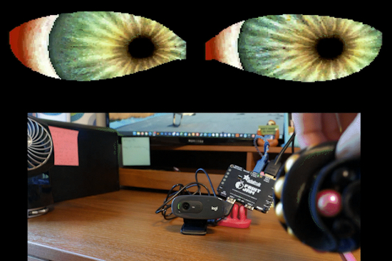](https://learn.adafruit.com/guides/latest)

The [Adafruit Learning System](https://learn.adafruit.com/) has over 3,200 free guides for learning skills and building projects including using Python.

[USB Host SDR for AM/FM & Weather Radio on Fruit Jam](https://learn.adafruit.com/usb-host-sdr-for-am-fm-weather-radio-on-fruit-jam) from [Tim C](https://learn.adafruit.com/u/Foamyguy)

[Fruit Jam Motion Tracking Eyeballs](https://learn.adafruit.com/fruit-jam-motion-tracking-eyeballs) from [Liz Clark](https://learn.adafruit.com/u/BlitzCityDIY)

[LED Bubble Hair Extensions with Motion Controlled Effects](https://learn.adafruit.com/led-bubble-hair-extensions-with-motion-controlled-effects) from [Erin St Blaine](https://learn.adafruit.com/u/firepixie)

## CircuitPython Libraries

The CircuitPython library numbers are continually increasing, while existing ones continue to be updated. Here we provide library numbers and updates!

To get the latest Adafruit libraries, download the [Adafruit CircuitPython Library Bundle](https://circuitpython.org/libraries). To get the latest community contributed libraries, download the [CircuitPython Community Bundle](https://circuitpython.org/libraries).

If you'd like to contribute to the CircuitPython project on the Python side of things, the libraries are a great place to start. Check out the [CircuitPython.org Contributing page](https://circuitpython.org/contributing). If you're interested in reviewing, check out Open Pull Requests. If you'd like to contribute code or documentation, check out Open Issues. We have a guide on [contributing to CircuitPython with Git and GitHub](https://learn.adafruit.com/contribute-to-circuitpython-with-git-and-github), and you can find us in the #help-with-circuitpython and #circuitpython-dev channels on the [Adafruit Discord](https://adafru.it/discord).

You can check out this [list of all the Adafruit CircuitPython libraries and drivers available](https://github.com/adafruit/Adafruit_CircuitPython_Bundle/blob/master/circuitpython_library_list.md). 

The current number of CircuitPython libraries is **592**!

**New Libraries**

Here are this week's new CircuitPython libraries:

* No new libraries this week.

**Updated Libraries**

Here are this week's updated CircuitPython libraries:

* [adafruit/Adafruit_CircuitPython_PicoTTS](https://github.com/adafruit/Adafruit_CircuitPython_PicoTTS)
* [todbot/CircuitPython_SynthTools](https://github.com/todbot/CircuitPython_SynthTools)

## What’s the CircuitPython team up to this week?

What is the team up to this week? Let’s check in:

**Dan**

I've finished `neopixel_write` for Zephyr Nordic boards and am now finishing `pwmio` for the same boards. I've also fixed a few bugs and am looking at further fixes. I'm also doing a lot of pull request reviews.

**Tim**

This week I'm working on USB bulk in support in the CircuitPython core, and a USB SDR based project that it enables: An AM/FM and Weather radio for the Fruit Jam. It plays audio from the 3.5mm jack on the Fruit Jam and can be controlled via the on-board buttons or a USB keyboard. While working on this SDR stuff I also attempted to capture the SSTV broadcast from the International Space Station as it passed over my area. They coincidentally had an event that lined up perfectly with getting this supported in CircuitPython. I did not manage to get a super clean image, but did get a few captures that contained some recognizable text and shapes after a bit of noise filtering. This one was my best overall capture, it got about 3/4 of the image before cutting out. The text along the top is discernible as "Student Education 2026" once you know to look for it, the rectangle outline of the top of the photograph included in the slide is also clearly visible. Not bad for a signal captured on the Fruit Jam being broadcast from the space station as it flies by at 17,000 mph! I plan to get some more ideal antennas to try again when they announce the next event.

**Scott**

Throughout the week I've been doing a ton of reviews. We're really benefiting from LLM assistance. At the start of the week I merged in `analogio` and `rtc` support in Zephyr. I just merged in `watchdog` support for Zephyr and `Ethernet` support is nearly in as well. Ethernet is for ESP and Zephyr. Now I'm working on CSI camera support for the ESP32-P4. I'm also thinking about changing `displayio` to better support rendering videos and overlays.

**Liz**

This week I published the [CircuitPython Turbo Sushi Conveyor Belt](https://learn.adafruit.com/circuitpython-turbo-sushi-conveyor-belt/overview) guide. This guide uses a Turbo module to run the sushi conveyor belt animation on a Qualia S3 in CircuitPython. Previously I did this [project in Arduino](https://learn.adafruit.com/qualia-s3-sushi-conveyor-belt/overview), since CircuitPython was too slow to run it. The Turbo module lets you get up to 45 FPS on the long bar displays (320x820 and 240x960). I included a [page at the end of the guide](https://learn.adafruit.com/circuitpython-turbo-sushi-conveyor-belt/turbo-vs-non-turbo) with GIFs to show the differences in performance in CircuitPython running the animation with OnDiskBitmap, ImageLoad and Turbo.

## Upcoming Events

[PyConZA 2026](https://za.pycon.org/), South Africa's Python conference, will be 14–18 Oct at Belmont Square, Cape Town, South Africa.

The next MicroPython Meetup in Melbourne will be on October 25th – [Luma](https://luma.com/micropython). You can see recordings of previous meetings on [YouTube](https://www.youtube.com/@MicroPythonOfficial). 

**Other Events This Year**

* [Espressif DevCon 2026](https://devcon.espressif.com/) will be November 3-4 in Milan, Italy and online.

If you know of virtual events or upcoming events, please let us know via email to cpnews(at)adafruit(dot)com.

## Latest Releases

CircuitPython's stable release is [10.3.1](https://github.com/adafruit/circuitpython/releases/latest) and its unstable release is [11.0.0-alpha.1](https://github.com/adafruit/circuitpython/releases). New to CircuitPython? Start with our [Welcome to CircuitPython Guide](https://learn.adafruit.com/welcome-to-circuitpython).
 
[20261003](https://github.com/adafruit/Adafruit_CircuitPython_Bundle/releases/latest) is the latest Adafruit CircuitPython library bundle.
 
[20261008](https://github.com/adafruit/CircuitPython_Community_Bundle/releases/latest) is the latest CircuitPython Community library bundle.
 
[v1.29.0](https://micropython.org/download) is the latest MicroPython release. Documentation for it is [here](http://docs.micropython.org/en/latest/pyboard/).
 
[3.15.0](https://www.python.org/downloads/) is the latest Python release.
 
[4562 Stars](https://github.com/adafruit/circuitpython/stargazers) Like CircuitPython? [Star it on GitHub!](https://github.com/adafruit/circuitpython)

## Call for Help -- Translating CircuitPython is now easier than ever

[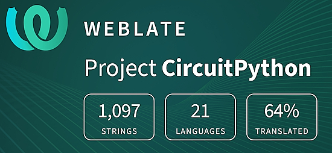](https://hosted.weblate.org/engage/circuitpython/)

One important feature of CircuitPython is translated control and error messages. With the help of fellow open source project [Weblate](https://weblate.org/), we're making it even easier to add or improve translations. 

Sign in with an existing account such as GitHub, Google or Facebook and start contributing through a simple web interface. No forks or pull requests needed! As always, if you run into trouble join us on [Discord](https://adafru.it/discord), we're here to help.

## 38,841 Thanks

The Adafruit Discord community, where we do all our CircuitPython development in the open, reached over 38,841 humans - thank you! Adafruit believes Discord offers a unique way for Python on hardware folks to connect. Join today at [https://adafru.it/discord](https://adafru.it/discord).

## ICYMI - In case you missed it

Python on hardware is the Adafruit Python video-newsletter-podcast! The news comes from the Python community, Discord, Adafruit communities and more and is broadcast on ASK an ENGINEER Wednesdays. The complete Python on Hardware weekly videocast [playlist is here](https://www.youtube.com/playlist?list=PLjF7R1fz_OOXRMjM7Sm0J2Xt6H81TdDev). The video podcast is on [iTunes](https://itunes.apple.com/us/podcast/python-on-hardware/id1451685192?mt=2), [YouTube](http://adafru.it/pohepisodes), [Instagram](https://www.instagram.com/adafruit/channel/), and [XML](https://itunes.apple.com/us/podcast/python-on-hardware/id1451685192?mt=2).

[The weekly community chat on Adafruit Discord server CircuitPython channel - Audio / Podcast edition](https://itunes.apple.com/us/podcast/circuitpython-weekly-meeting/id1451685016) - Audio from the Discord chat space for CircuitPython, meetings are usually Mondays at 2pm ET, this is the audio version on [iTunes](https://itunes.apple.com/us/podcast/circuitpython-weekly-meeting/id1451685016), Pocket Casts, [Spotify](https://adafru.it/spotify), and [XML feed](https://adafruit-podcasts.s3.amazonaws.com/circuitpython_weekly_meeting/audio-podcast.xml).

## Contribute

The CircuitPython Weekly Newsletter is a CircuitPython community-run newsletter emailed every Monday. To contribute your content, please email your news to cpnews (at) adafruit (dot) com with information and link(s) to your content. 

Join the Adafruit [Discord](https://adafru.it/discord) or [post to the forum](https://forums.adafruit.com/viewforum.php?f=60) if you have questions.
