## The joys of using Python on embedded devices - Keynote at PyCon!

[PyCon announced](https://twitter.com/pycon/status/1113456834143240194) that Nina Zakharenko will be a keynote speaker this year at PyCon! Nina will share the joys of using Python on embedded devices and how it impacts and grows our community!

Nina is a software engineer with over a decade of experience. She currently focuses on Python at Microsoft on the Cloud Developer Advocacy team. In the past, she’s written software for satellite control computers at HBO, code that's helped people connect over their passions at Meetup, and implemented time-wasting features on Reddit.

Nina loves teaching developers and has spoken at conferences like PyCon Russia, EuroPython, and DjangoCon in the US and internationally. This year, she's looking forward to attending her seventh PyCon, where you'll find her co-organizing Mentored Sprints for Diverse Beginners.

PyCon 2019 Keynote speakers - [PyCon.org](https://us.pycon.org/2019/keynote-speakers/#nina)

## Python snakes its way to USB Hubs!

The Capable Robot Programmable USB hub is a USB hub that's also a dev board and an I2C, GPIO, and SPI bridge. In addition to being a 4-port USB 2 High-Speed hub, this Programmable USB hub it is also a CircuitPython based development board!

An ATSAMD51 microcontroller configures the USB hub IC and is available for you to reprogram to change the behavior of your hub. The microcontroller ships with open source CircuitPython firmware which is updatable over the MCU USB connector. No drivers or reflashing hardware is needed – Python firmware shows up as files on a small flash hard drive when connected to your computer and can be immediately edited.

[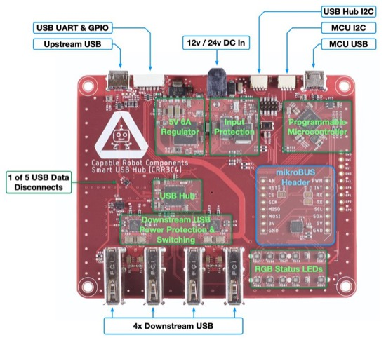](https://www.crowdsupply.com/capable-robot-components/programmable-usb-hub)

We've signed up for updates on the [Crowd Supply Page](https://www.crowdsupply.com/capable-robot-components/programmable-usb-hub)! We'll see if we can get one to review as well.

## HackerBox #0041 - Python-powered!

[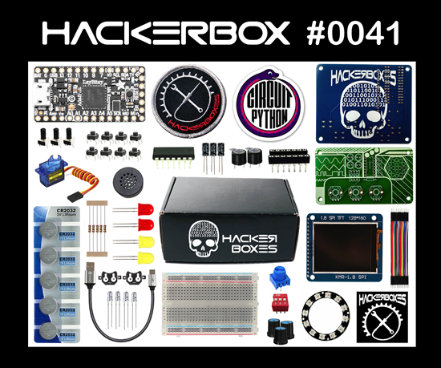](https://hackerboxes.com/products/hackerbox-0041-circuitpython)

We are thrilled that the latest HackerBox is shipping with CircuitPython! HackerBox 0041 includes CircuitPython, MakeCode Arcade, the Atari Punk Console, and much more. [This Instructable](https://www.instructables.com/id/HackerBox-0041-CircuitPython/) contains information for getting started with HackerBox 0041, which can be [purchased here](https://hackerboxes.com/products/hackerbox-0041-circuitpython) while supplies last. 

Topics and Learning Objectives for HackerBox 0041:

* Exploring the SAMD51 ARM Cortex M4
* Embedded programming with CircuitPython
* Retro game design for MakeCode Arcade
* Assembling the Atari Punk Console Synth

HackerBoxes is the monthly subscription box service for DIY electronics and computer technology - [HackerBoxes](https://hackerboxes.com/products/hackerbox-0041-circuitpython) & [YouTube](https://youtu.be/RxwjM2i2lMM).

## 15,000+ Python Discord, congrats!

Adafruit is a partner on the Python Discord, and to celebrate the Python Discord server reaching 15K members, one of the server owners, Lemon, and a moderator, Eivl, have teamed up to do a tribute to Hot Ones by First We Feast while answering questions from the community - [YouTube](https://youtu.be/DIBXg8Qh7bA), [Python Discord](https://pythondiscord.com/), & [JOIN](https://pythondiscord.com/invite)! The team used CircuitPython for a HOT project in the video!

## News from around the web!

[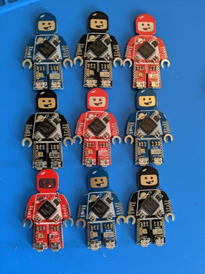](https://www.minisam.cc/product/mini-sam-m4-purple/)

[Ben posted](https://twitter.com/bwshockley/status/1114649156906356737) [up a bunch](https://twitter.com/bwshockley/status/1113557602745499648) of [great photos](https://twitter.com/bwshockley/status/1108499963963691008) of the latest batch of Mini SAM M4s. Mini SAM is a LEGO minifigure-sized development board based on the Microchip SAMD51G 48-Pin 32-Bit ARM Cortex-M4F MCU running at 48Mhz - [Minisam.cc](https://www.minisam.cc/product/mini-sam-m4-purple/) & [circuitpython.org download page](https://circuitpython.org/board/mini_sam_m4/).

[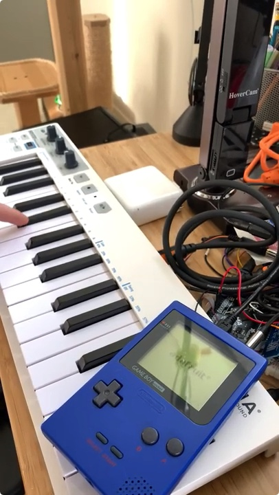](https://youtu.be/10_54r3rol0)

[Scott](https://twitter.com/tannewt/status/1113116180128993280) has some more progress on the CircuitPython powered GameBoy cart, MIDI in works - [YouTube](https://youtu.be/10_54r3rol0).

Building a Standalone GPS Logger with CircuitPython using Adafruit and Particle hardware - [movingelectrons.net](http://www.movingelectrons.net/blog/2019/04/03/Building-a-GPS-Logger-with-CircuitPython.html)

This week on Maker Update, a Star Trek themed alarm clock, Oblique Strategies, a high tech View Master, and a blood glucose display - [YouTube](https://youtu.be/IiLlVIPMFms).

[PyPortal_GhostFrame](https://github.com/ZContent/PyPortal_GhostFrame) displays people (and cats) that don't exist, from ThisPersonDoesNotExist.com on an Adafruit PyPortal. This is a work in progress. You will find more details of this project on [Dan's site](https://danthegeek.com/2019/04/04/ghost-frame-display-images-of-people-and-cats-that-dont-exist/).

TI-83 Gets CircuitPython Upgrade - [Hackaday](https://hackaday.com/2019/04/04/ti83-gets-circuitpython-upgrade/).

deshipu has a fun hallowing-tetris game started - [GitHub](https://github.com/deshipu/hallowing-tetris).

DIY Gamepad made with CircuitPython - [GitHub](https://github.com/Flesh-CoatedTechnology/CircuitPython-Gamepad).

[homemadegarbage.com](https://homemadegarbage.com/circuitpython-01) tries out CircuitPython - [Twitter](https://twitter.com/H0meMadeGarbage/status/1109735698813247489).

CircuitPython vs C/C++ vs Lua for the Microcontrollers - [thecustomizewindows.com](https://thecustomizewindows.com/2019/04/circuitpython-vs-c-c-vs-lua-for-the-microcontrollers/)

[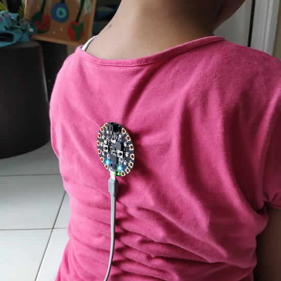](https://github.com/mdinata/circuitpython/tree/master/antislump)

Anti Slump - This is DIY solution to the readily available device on market to make your posture stays upright. The code reads the axis change, you can set the declination threshold which then activate the audio alert. The Threshold can be changed directly from the A and B button, instead of programmatically - [GitHub](https://github.com/mdinata/circuitpython/tree/master/antislump) & [Instagram](https://www.instagram.com/p/Bus0m4bHpDH/).

Multipurpose IR Remote - This DIY solution to own DIY keyboard with essentials command to navigate, confirm and cancel - [GitHub](https://github.com/mdinata/circuitpython/tree/master/multipurpose%20remote), [Instagram](https://www.instagram.com/p/Bv0qyhNHrNH/) &  [article](http://andidinata.com/2019/04/multi-purpose-ir-remote/).

Laura made a Swedish Word of the Day device. Laura wrote a PHP page that scrapes Transparent's website and feeds JSON to the PyPortal via WiFi - [Twitter](https://twitter.com/zaeralynn/status/1113995931215716353).

From [Dustin](https://twitter.com/docmollo/status/1114690140146769921) - For the adventurous out there, there is now code to support WPA2 Enterprise WiFi - [GitHub](https://github.com/adafruit/Adafruit_CircuitPython_ESP32SPI). You will need to compile the matching [ESP32 firmware](https://github.com/adafruit/nina-fw), as well.

[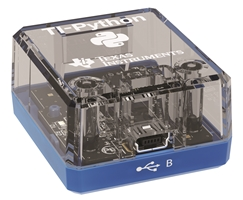](https://epsstore.ti.com/OA_HTML/ibeCZzpHome.jsp?minisite=10321&cntry=FR)

TI-Python adapter for TI-83 Premium CE ruinning CircuitPython is now available in France. The TI-Python adapter allows you to program in Python on your current TI-83 Premium CE - [Texas Instruments France](https://epsstore.ti.com/OA_HTML/ibeCZzpHome.jsp?minisite=10321&cntry=FR).

CircuitPython Code for automating an Elegoo Arduino Car using Adafruit Grand Central M4 - [GitHub](https://github.com/Tarnor/CP-Robot-Car).

CedarGrove adapted a NeoTrellis M4 to a 32HP E-rack opening - [Twitter](https://twitter.com/CedarGroveMakr/status/1114677526394073089).

Electronic Cats have a guide [Using LoRa with CircuitPython and their USB stick](https://electroniccats.com/blog/enviando-y-recibiendo-datos-lora-con-circuitpython-y-el-usb-stick/).

Melbourne MicroPython Meetup - A monthly meetup for MicroPython Enthusiasts - Links! Thanks [Matt](https://twitter.com/matt_trentini/status/1115255447781429248).

[ESP32 Hardware Design Guidelines is an updated PDF](https://www.espressif.com/sites/default/files/documentation/esp32_hardware_design_guidelines_en.pdf) that was recently published by [Espressif Systems](https://www.espressif.com/en/support/download/documents?keys=%22ESP32+Hardware+Design+Guidelines%22) via the [April ESP NEWS newsletter](https://mailchi.mp/12241081b332/espressif-esp-news-april-2019).

Here's BLINKA, CircuitPython for Linux, running on a BeagleBone Green Wireless - [Twitter](https://twitter.com/gsreynaga/status/1113625611623256064).

ESP32: A whole bunch of useful projects - [Elektor Magazine](https://www.elektormagazine.com/news/esp32).

MicroPython #2 - Hit the ground running by Unexpected Maker - [YouTube](https://youtu.be/DFp_T-H3eRc).

HaloCode is a MicroPython-based single board computer - [Docs](http://docs.makeblock.com/halocode/en/tutorials/use-python.html).

[TinyPICO](https://www.crowdsupply.com/unexpected-maker/tinypico) will also ship in matte black - [TinyPICO](https://www.tinypico.com/news/2019/4/4/tinypico-gets-a-face-lift).

Graphical user interface written in MicroPython for M5Stack - [GitHub](https://github.com/dsiberia9s/GUI).

[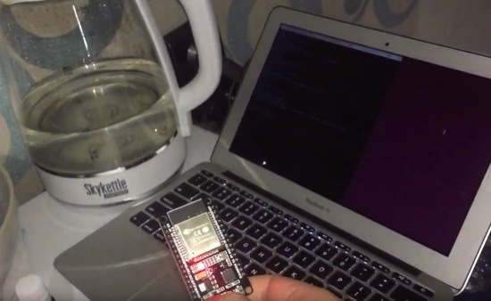](https://hackaday.io/project/164671-smart-kettle-becomes-more-smarter)

Manage a Smart Kettle, powered by an ESP32 with Google Assistant, use Google Dialogflow to recognise speech and convert it into commands, use micropython to extract commands and send characteristics to BLE kettle - [hackaday.io](https://hackaday.io/project/164671-smart-kettle-becomes-more-smarter) & [YouTube](https://youtu.be/ISlbqJX5mdU).

[Grove.py](https://www.seeedstudio.com/blog/2019/04/03/play-grove-with-python-nvidia-jetson-nano/) is a python library from Seeedstudio for embeded Linux platforms such as Raspberry Pi, Nvidia Jetson nano, and Coral dev board.

[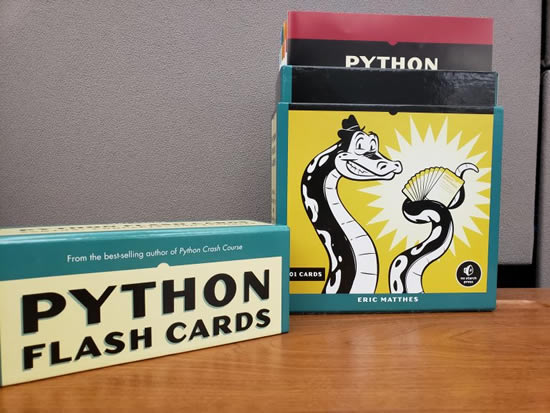](https://www.blog.pythonlibrary.org/2019/04/02/product-review-python-flash-cards/)

Product Review: [Python Flash Cards](https://nostarch.com/pythonflashcards) - [Mouse vs. Python](https://www.blog.pythonlibrary.org/2019/04/02/product-review-python-flash-cards/).

rosshow displays various sensor messages in a useful fashion using Unicode Braille art in the terminal - [GitHub](https://github.com/dheera/rosshow).

Photomosaic is a simple end-to-end python script to make cool mosaic posters made from scenes extracted from movies - [GitHub](https://github.com/SouravSharan/photomosaic).

UEFI - Unified Extensible Firmware Interface Forum [site](https://uefi.org/specifications) with the latest spec - [PDF](https://uefi.org/sites/default/files/resources/ACPI_6_3_final_Jan30.pdf). What is UEFI? Remember when computer would boot up and there would be a BIOS? UEFI is that, the BIOS has been replaced by something newer called UEFI. It's low level sofrware that makes hard drives work, graphics, security, and other things. Ideally all UEFIs would be open-source so you know what's going on.

With Windows 10 1809, Microsoft drops safe removal of USB drives as the default option - [Beta news](https://betanews.com/2019/04/07/windows-10-safely-remove-usb/).

A Language Creators' Conversation. PuPPy (Puget Sound Programming Python) annual benefit: A historic discussion of language creators about  the past and future of language design. 

Guido van Rossum, James Gosling, Larry Wall, and Anders Hejlsberg, creators of some of the most widely used programming languages in modern times will share a panel on language design, the universe, and everything with opening words by Cyrus Habib, Lieutenant Governor of the State of Washington - [YouTube](https://www.youtube.com/watch?v=csL8DLXGNlU&feature=youtu.be&t=2953).

PyDev of the Week: Abdur-Rahmaan Janhangeer on [Mouse vs Python](https://www.blog.pythonlibrary.org/2019/04/08/pydev-of-the-week-abdur-rahmaan-janhangeer/)

CircuitPython Weekly Meeting for April 1st, 2019 available [on YouTube](https://youtu.be/YMT0KKOiBBQ)

#ICYDNCI What was the most popular, most clicked link, in [last week's newsletter?](https://www.adafruitdaily.com/2019/04/02/beta-6-hack-chat-uchip-portin-calcs-and-jetson-python-adafruit-circuitpython-circuitpython-micropython-thepsf-adafruit/) [uChip KickStarter!](https://www.kickstarter.com/projects/1186620431/uchip-arduino-zero-compatible-in-a-narrow-dip-16-p).

## Made with Mu

[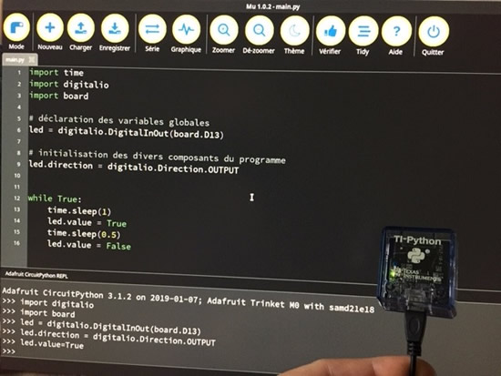](https://tiplanet.org/forum/viewtopic.php?t=22488&p=241351&utm_source=dlvr.it&utm_medium=twitter#p241351)

Over on TI-Planet the community is flashing their TI-Python devices which is variant of CircuitPython, with some Adafruit builds of CircuitPython and of course... using Mu! - [ti-planet.org](https://tiplanet.org/forum/viewtopic.php?t=22488&p=241351&utm_source=dlvr.it&utm_medium=twitter#p241351)

## Coming soon

AirLift Shield!

Gizmo! - [YouTube](https://youtu.be/qL7uHHpLkyE).

PyBadge! - [YouTube](https://youtu.be/2RkY1KA1BMM).

## New Learn Guides!

[PyPortal NASA Image of the Day Viewer](https://learn.adafruit.com/pyportal-nasa-image-of-the-day-viewer) from [John Park](https://learn.adafruit.com/users/johnpark)

[Adafruit VEML7700 Ambient Light Sensor](https://learn.adafruit.com/adafruit-veml7700) from [Kattni](https://learn.adafruit.com/users/kattni)

[Adafruit BMP388 - Precision Barometric Pressure and Altimeter](https://learn.adafruit.com/adafruit-bmp388) from [Kattni](https://learn.adafruit.com/users/kattni)

[Data Logging IoT Weight Scale](https://learn.adafruit.com/data-logging-iot-weight-scale) from [Brent Rubell](https://learn.adafruit.com/users/brubell)

[PyPortal IoT Weather Stateion](https://learn.adafruit.com/pyportal-iot-weather-station) from [Brent Rubell](https://learn.adafruit.com/users/brubell)

## Updated Guides - Now With More Python!

**You can use CircuitPython libraries on Raspberry Pi!** We're updating all of our CircuitPython guides to show how to wire up sensors to your Raspberry Pi, and load the necessary CircuitPython libraries to get going using them with Python. We'll be including the updates here so you can easily keep track of which sensors are ready to go. Check it out!

[Adafruit PiOLED - 128x32 Mini OLED for Raspberry Pi](https://learn.adafruit.com/adafruit-pioled-128x32-mini-oled-for-raspberry-pi/overview)

[Adafruit 128x64 OLED Bonnet for Raspberry Pi](https://learn.adafruit.com/adafruit-128x64-oled-bonnet-for-raspberry-pi/overview)

## CircuitPython Libraries!

CircuitPython support for hardware continues to grow. We are adding support for new sensors and breakouts all the time, as well as improving on the drivers we already have. As we add more libraries and update current ones, you can keep up with all the changes right here!

For the latest drivers, download the [Adafruit CircuitPython Library Bundle](https://github.com/adafruit/Adafruit_CircuitPython_Bundle/releases/latest).

If you'd like to contribute, CircuitPython libraries are a great place to start. Have an idea for a new driver? File an issue on [CircuitPython](https://github.com/adafruit/circuitpython/issues)! Interested in helping with current libraries? Check out [this GitHub issue on CircuitPython](https://github.com/adafruit/circuitpython/issues/1246) for an overview of the State of the CircuitPython Libraries, updated each week. We've included open issues from the library issue lists, and details about repo-level issues that need to be addressed. We have a guide on [contributing to CircuitPython with Git and Github](https://learn.adafruit.com/contribute-to-circuitpython-with-git-and-github) if you need help getting started. You can also find us in the #circuitpython channel on the [Adafruit Discord](https://adafru.it/discord). Feel free to contact Kattni (@kattni) with any questions.

You can check out this [list of all the CircuitPython libraries and drivers available](https://github.com/adafruit/Adafruit_CircuitPython_Bundle/blob/master/circuitpython_library_list.md). 

The current number of CircuitPython libraries is **144**!

**New Libraries!**

Here's this week's new CircuitPython libraries:

* [Adafruit CircuitPython VEML7700](https://github.com/adafruit/Adafruit_CircuitPython_VEML7700)
* [Adafruit CircuitPython DymoScale](https://github.com/adafruit/Adafruit_CircuitPython_DymoScale)

**Updated Libraries!**

Here's this week's updated CircuitPython libraries:

* [Adafruit CircuitPython EPD](https://github.com/adafruit/Adafruit_CircuitPython_EPD)
* [Adafruit CircuitPython framebuf](https://github.com/adafruit/Adafruit_CircuitPython_framebuf)
* [Adafruit CircuitPython TPA2016](https://github.com/adafruit/Adafruit_CircuitPython_TPA2016)
* [Adafruit CircuitPython TCA9548A](https://github.com/adafruit/Adafruit_CircuitPython_TCA9548A)

**PyPI Download Stats!**

We've written a special library called Adafruit Blinka that makes it possible to use CircuitPython Libraries on [Raspberry Pi and other compatible single-board computers](https://learn.adafruit.com/circuitpython-on-raspberrypi-linux/). Adafruit Blinka and all the CircuitPython libraries have been deployed to PyPI for super simple installation on Linux! Here are the top 10 CircuitPython libraries downloaded from PyPI in the last week, including the total downloads for those libraries:

| Library                                     | Last Week   | Total |   
|:-------                                     |:--------:   |:-----:|   
| Adafruit-Blinka                             | 2124        | 24643 |   
| Adafruit_CircuitPython_Register             | 462         | 3650 |    
| Adafruit_CircuitPython_PCA9685              | 364         | 1665 |    
| Adafruit_CircuitPython_Motor                | 342         | 2065 |    
| Adafruit_CircuitPython_NeoPixel             | 322         | 3811 |    
| Adafruit_CircuitPython_BusDevice            | 274         | 9482 |    
| Adafruit_CircuitPython_ServoKit             | 229         | 1436 |    
| Adafruit_CircuitPython_MotorKit             | 175         | 1661 |    
| Adafruit_CircuitPython_BME280               | 119         | 1555 |    
| Adafruit_CircuitPython_MCP3xxx              | 89          | 640 |     

## Upcoming events!

Happening April 26th and 27th 2019 in Chicago IL, this will be the first and largest gathering of hardware developers using KiCad. Talks at the conference will span hardware design, revision control, scripting, manufacturing considerations, proper library management and getting  started developing the underlying tools. All talks have been listed on the conference site. Additionally, there will be contests, roundtable discussions with the developers and hands-on demos to deepen knowledge of hardware design and using KiCad.

Is this a conference only for current users of KiCad? No! Attendees will learn general concepts around PCB design, hardware creation and developing products for the market. Attendees include hardware and software developers from around the world, including members of the core KiCad development team out of CERN in Switzerland.

Attend this unconventional conference to learn more about how to build your next hardware project using open source, extensible tools. Join  industry figures (and sponsors) like Digikey, Adafruit, Supplyframe and Bantam Tools. Interact with manufacturing experts from OSHpark, Royal Circuits, Aisler and SnapEDA. Meet and get to know others in the hardware community, who regularly are creating new hardware for fun and profit - [kicad-kicon.com](https://www.kicad-kicon.com)

PyLadies Dublin, Tuesday, April 16, 2019. Hot off PyCon Limerick, Mick Twomey is back giving an updated talk from November about the history of Python Packaging and why pipenv is awesome. Vicky Twomey-Lee will have some Adafruit Circuit Playground Express and you can play around with them with Circuit Python - [Meetup](https://www.meetup.com/PyLadiesDublin/events/dclgvlyzgbvb/).

PyCon AU has recently announced their [Call for Proposals](https://2019.pycon-au.org/speak/).

## Digi-Key + Adafruit @ PyCon!

PyCon 2019 returns May 1–9, 2019 to Cleveland, OH – with talks, tutorials, sprints, and more! 

Big news! Digi-Key and Adafruit have teamed up for PyCon 2019 so every attendee (about 4,000!) will receive a [SPECIAL EDITION Circuit Playground Express](https://youtu.be/ZMx6qB-7z9U), running … CircuitPython.

This effort is to get Python on hardware to the most folks out there, at the events that bring people together.

This is just one of many efforts we’re teaming up with Digi-Key to continue to fuel all the developers from beginners to pro, using Python on microcontrollers.

What else is happening? The CircuitPython team will be running several Open Spaces sessions (as they did last year), showing how to use CircuitPython on the Digi-Key / Adafruit PyCon special edition Circuit Playground Express. We’ll have extra addons to play with also: potentiometers, NeoPixel strips, and servos. The team will be running a CircuitPython Sprint for several days to work on CircuitPython libraries and CircuitPython core code. BYOMUSB “Bring your own Micro USB” cables, we’ll have some to borrow during the sprints/sessions, as well as some USB C adapters, good idea to bring one too!

The PyCon 2019 conference, which will take place in Cleveland, is the largest annual gathering for the community using and developing the open-source Python programming language. It is produced and underwritten by the Python Software Foundation, the 501(c)(3) nonprofit organization dedicated to advancing and promoting Python. Through PyCon, the PSF advances its mission of growing the international community of Python programmers.

We will have a lot more updates, stay tuned to the [Adafruit blog](https://blog.adafruit.com/category/circuitpython/), [Twitter](https://twitter.com/adafruit), [Discord](http://adafru.it/discord), and more!

## Latest releases

CircuitPython's stable release is [3.1.2](https://github.com/adafruit/circuitpython/releases/latest) and its unstable release is [4.0.0-beta.6](https://github.com/adafruit/circuitpython/releases). New to CircuitPython? Start with our [Welcome to CircuitPython Guide](https://learn.adafruit.com/welcome-to-circuitpython).

[20190406](https://github.com/adafruit/Adafruit_CircuitPython_Bundle/releases/latest) is the latest CircuitPython library bundle.

[v1.10](https://micropython.org/download) is the latest MicroPython release. Documentation for it is [here](http://docs.micropython.org/en/latest/pyboard/).

[3.7.3](https://www.python.org/downloads/) is the latest Python release. The latest pre-release version is [3.8.0a3](https://www.python.org/download/pre-releases/).

[1130 Stars](https://github.com/adafruit/circuitpython/stargazers) Like CircuitPython? [Star it on GitHub!](https://github.com/adafruit/circuitpython)

## circuitpython.org updates!

Downloads are now available from [circuitpython.org](https://circuitpython.org)! This site makes it much easier to select the correct file and language for your board. The downloads page is [here](https://circuitpython.org/downloads). Here are the latest boards added! **There are now 47 boards!**

[Meow Meow](https://circuitpython.org/board/meowmeow/) by Electronic Cats. Meow Meow is a electronic board that allows you to connect different objects to a computer and interact with it, since you can convert many everyday objects into touch panels that send signals to the computer, and allows you to use it as a conventional keyboard, you can even connect them to the internet. Runs CircuitPython.

[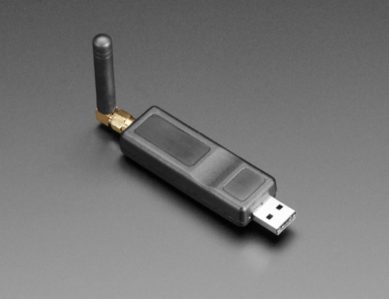](https://circuitpython.org/board/catwan_usbstick/)

[CatWAN USB Stick](https://circuitpython.org/board/catwan_usbstick/) by Electronic Cats. The CatWAN USB Stick is programmed with a special firmware image that makes it an easy-to-use LoRa sniffer. You can passively capture the data exchanges between two LoRa devices, capturing with our “LoRa Sniffer” the open source network analysis tool that we have created to use together. Runs CircuitPython.

Each board now has the optional feature to add to add to it for easier searching, we're starting with 9 features and will add more over time as more boards are supported.

* Display
* Speaker
* Feather-compatible
* Battery Charging
* Wi-Fi
* Bluetooth/BTLE
* LoRa/Radio
* Robotics
* Solder-free Alligator clip

[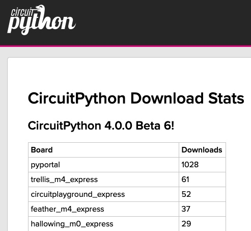](https://circuitpython.org/stats)

What else? We have a stats page that has each release and number of downloads per board, per release - [circuitpython.org/stats](https://circuitpython.org/stats)

## Call for help – CircuitPython messaging to other languages!

We [posted on the Adafruit blog](https://blog.adafruit.com/2018/08/15/help-bring-circuitpython-messaging-to-other-languages-circuitpython/) about bringing CircuitPython messaging to other languages, one of the exciting features of CircuitPython 4.x is translated control and error messages. Native language messages will help non-native English speakers understand what is happening in CircuitPython even though the Python keywords and APIs will still be in English. If you would like to help, [please post](https://github.com/adafruit/circuitpython/issues/1098) to the main issue on GitHub and join us on [Discord](https://adafru.it/discord).

We made this graphic with translated text, we could use your help with that to make sure we got the text right, please check out the text in the image – if there is anything we did not get correct, please let us know. Dan sent me this [handy site too](http://helloworldcollection.de/#Human).

## jobs.adafruit.com

[jobs.adafruit.com](https://jobs.adafruit.com/) has returned and folks are posting their skills (including CircuitPython) and companies are looking for talented makers to join their companies - from Digi-Key, to Hackaday, Microcenter, Raspberry Pi and more.

## 11,600 thanks!

The Adafruit Discord community, where we do all our CircuitPython development in the open, reached over 11,600 humans, thank you! Join today! [https://adafru.it/discord](https://adafru.it/discord)

## ICYMI - In case you missed it

The wonderful world of Python on hardware! This is our first video-newsletter-podcast that we’ve started! The news comes from the Python community, Discord, Adafruit communities and more. It’s part of the weekly newsletter, then we have a segment on ASK an ENGINEER and this is the video slice from that! The complete Python on Hardware weekly VideoCast [playlist is here](https://www.youtube.com/playlist?list=PLjF7R1fz_OOXRMjM7Sm0J2Xt6H81TdDev). 

This video podcast is on [iTunes](https://itunes.apple.com/us/podcast/python-on-hardware/id1451685192?mt=2), [YouTube](https://www.youtube.com/playlist?list=PLjF7R1fz_OOXRMjM7Sm0J2Xt6H81TdDev), [IGTV (Instagram TV](https://www.instagram.com/adafruit/channel/)), and [XML](https://itunes.apple.com/us/podcast/python-on-hardware/id1451685192?mt=2).

[Weekly community chat on Adafruit Discord server CircuitPython channel - Audio / Podcast edition](https://itunes.apple.com/us/podcast/circuitpython-weekly-meeting/id1451685016) - Audio from the Discord chat space for CircuitPython, meetings are usually Mondays at 2pm ET, this is the audio version on [iTunes](https://itunes.apple.com/us/podcast/circuitpython-weekly-meeting/id1451685016), Pocket Casts, [Spotify](https://adafru.it/spotify), and [XML feed](https://adafruit-podcasts.s3.amazonaws.com/circuitpython_weekly_meeting/audio-podcast.xml).

## Updates to awesome-circuitpython

[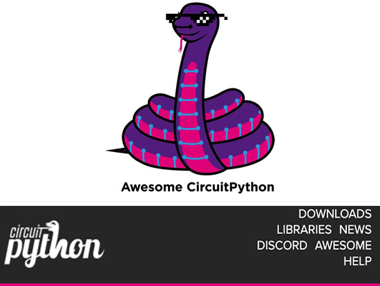](https://github.com/adafruit/awesome-circuitpython/)

We updated [awesome-circuitpython](https://github.com/adafruit/awesome-circuitpython/), the comprehensive, currated collection of all things CircuitPython - [GitHub](https://github.com/adafruit/awesome-circuitpython/).

The update this week is it's also on [circuitpython.org/awesome](https://circuitpython.org/awesome)!

## Contribute!

The CircuitPython Weekly Newsletter is a CircuitPython community-run newsletter emailed every Tuesday. The complete [archives are here](https://www.adafruitdaily.com/category/circuitpython/). It highlights the latest CircuitPython related news from around the web including Python and MicroPython developments. To contribute, edit next week's draft [on GitHub](https://github.com/adafruit/circuitpython-weekly-newsletter/tree/gh-pages/_drafts) and [submit a pull request](https://help.github.com/articles/editing-files-in-your-repository/) with the changes. Join our [Discord](https://adafru.it/discord) or [post to the forum](https://forums.adafruit.com/viewforum.php?f=60) for any further questions.
