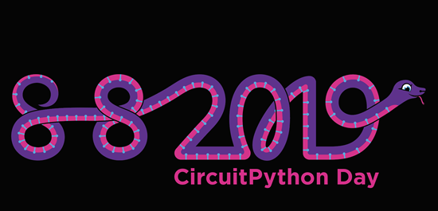
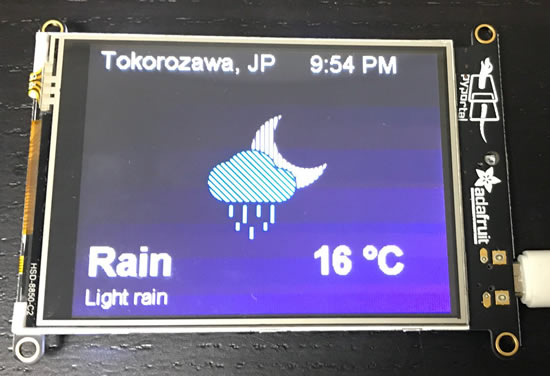
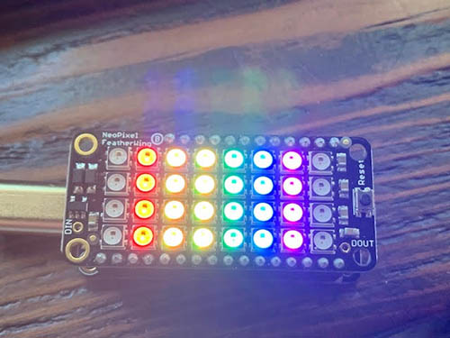
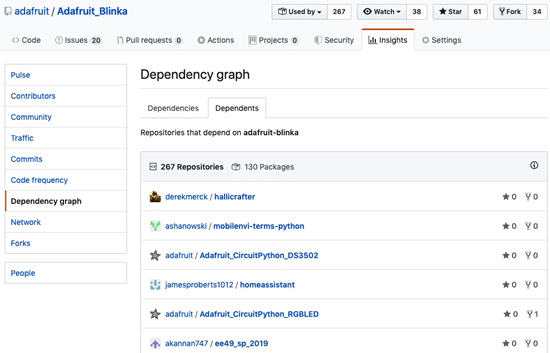
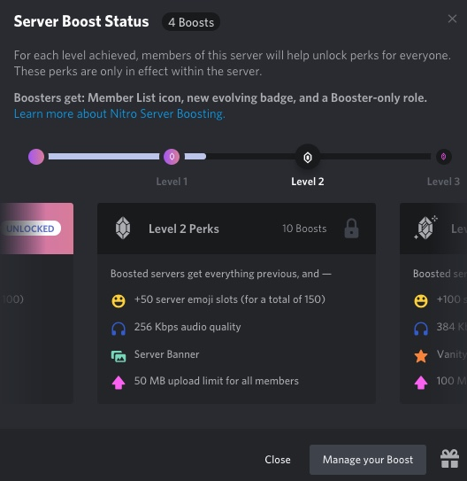

## Nordic-powered Feather nRF52840

Adafruit’s Feather nRF52840 Express Board and Developing with CircuitPython. The Nordic-powered Feather nRF52840 Express has been flying off the shelves. Nordic takes a closer look at the capabilities of the board and the associated development tools - [Nordic](https://blog.nordicsemi.com/getconnected/adafruits-feather-nrf52840-express-board-and-developing-with-circuitpython?utm_campaign).

## Step into the light with Python

On the day before the day of school, Sean's students made these fantastic CircuitPython shoes - [Twitter](https://twitter.com/smtibor/status/1136001380819361792).

## PyPortal fractal viewer

PyPortal Fractal Viewer. Includes both the Mandelbrot and Burning Ship fractals - [GitHub](https://github.com/jandress94/adafruit_fractal_viewer) via [Adafruit Customer forums](https://forums.adafruit.com/viewtopic.php?f=59&t=152742). 

## Snek 1.0 released

Version 1.0 of [Snek](https://keithp.com/snek) is here!

### Features

*   _Python-inspired._ Snek is a subset of Python: learning Snek is a great way to start learning Python.
*   _Small._ Snek runs on an original Arduino Duemilanove board with 32kB of ROM and 2kB of RAM. That's smaller than the [Apollo Guidance Computer](https://en.wikipedia.org/wiki/Apollo_Guidance_Computer)
*   _Free Software._ Snek is licensed under the [GNU General Public License (v3 or later)](https://www.gnu.org/licenses/gpl-3.0.en.html). You will always be able to get full source code for the system.

### Ports

*   [Adafruit Crickit](https://www.adafruit.com/product/3343)
*   [Arduino Duemilanove](https://www.arduino.cc/en/Main/arduinoBoardDuemilanove)
*   [Adafruit Feather M0 Express](https://www.adafruit.com/product/3403)
*   [Adafruit ItsyBitsy (both 3v and 5v versions)](https://www.adafruit.com/product/3677)
*   [Adafruit ItsyBitsy M0 Express](https://www.adafruit.com/product/3727)
*   [Arduino Mega](https://www.arduino.cc/en/Main/ArduinoBoardMega)
*   [Adafruit Metro M0 Express](https://www.adafruit.com/product/3505)
*   [Adafruit Circuit Playground Express](https://www.adafruit.com/product/3333)

### Hosts

*   [Generic Linux](https://keithp.com/snek/dist/snek-linux-1.0.sh)
*   [Mac OS X](https://keithp.com/snek/dist/snek-mac-1.0.dmg)
*   [Windows](https://keithp.com/snek/dist/snek-windows-1-0.exe)

### Documentation

Read the Snek manual online or in PDF form:

*   [The Snek Programming Language (PDF)](https://keithp.com/snek/snek.pdf)
*   [The Snek Programming Language (HTML)](https://keithp.com/snek/snek.html)

## Making Arduino more CircuitPython-like

Bill Binko explains how the Open Source TinyUSB stack with drag & drop file support helps develop solutions, to include applications like assistive technology, quickly and easily - [YouTube](https://youtu.be/va-EKTG5334?t=18).

## Python powered ADABOX ships soon

At the time of this writing, there are only a couple dozen ADABOX openings for the June shipment. Curated Adafruit products, unique collectibles, and exclusive discounts. All delivered quarterly. Subscribe now or give AdaBox to a friend - [ADABOX](https://www.adafruit.com/adabox).

## 8/8/2019 is CircuitPython day!

8/8/2019 is CircuitPython day! This year, we’re in the planning stages and will have live videos, celebrations, and more for this very snake friendly date! For now, we’re starting to assemble the artwork in our public DropBox CircuitPython folder, check it out - [DropBox](https://www.dropbox.com/sh/cod3wllmyninyn5/AADC6Z5EhEsG18X8WDRMEZuta?dl=0).

A few folks asked if the event date can be the weekend (8/10 and 8/11), that is totally OK!

Here's a preview of some shoes we're making for the special day :)

## News from around the web!

OpenWeather API PyPortal, it's raining from the cloud :) - [Twitter](https://twitter.com/kemusiro/status/1137707667651158016).

June is LGBTQ Pride Month. Celebrate your pride with this fun, animated piece of electronic jewelry! - [GitHub](https://github.com/tammymakesthings/fw_neopixel_pride).

This is a pretty cool, repositories that depend on adafruit-blinka, 267 repos and 130 packages - [GitHub](https://github.com/adafruit/Adafruit_Blinka/network/dependents).

Linda Luo from Robotics Masters in Shenzhen China - [She’s Building A Robot](https://medium.com/shes-building-a-robot/tagged/shes-building-a-robot).

Adafruit IOT Monthly: Azure IoT meets CircuitPython, build an internet-connected wearable love pendant, and more! - [adafruit.io](https://io.adafruit.com/blog/notebook/2019/06/06/iot-monthly-june/).

Fun with LEDs and CircuitPython - [LWN.NET](https://lwn.net/SubscriberLink/789930/52e703a8cde0ad3d/).

An update on python-for-android: v2019.06.06 released and future plans - [inclem.net](http://inclem.net/2019/06/08/kivy/an_update_on_python_for_android/).

The Pros and Cons of Designing Embedded Systems with MicroPython - [Design News](https://www.designnews.com/electronics-test/pros-and-cons-designing-embedded-systems-micropython/8546451560921).

The most exciting upcoming Python Libraries of 2019 - [mentorcruise.com](https://mentorcruise.com/learn/most-exciting-upcoming-python-libraries-2019/).

Python based spelling checker for code, codespell - [GitHub](https://github.com/codespell-project/codespell).

Getting Started with Python's Wikipedia API - [Stack Abuse](https://stackabuse.com/getting-started-with-pythons-wikipedia-api/).

Beta preview of Python 3.8 - [Python.org](https://www.python.org/downloads/release/python-380b1/).

tensorwatch from Microsoft Research has: Debugging, monitoring and visualization for Python Machine Learning and Data Science - [GitHub](https://github.com/microsoft/tensorwatch).

Invaders game in 512 bytes (boot sector or COM file) by Oscar Toledo G. - [GitHub](https://github.com/nanochess/Invaders).

GitHub Desktop 2.0 expands to support stashing and rebasing - [GitHub](https://github.blog/2019-06-05-github-desktop-expands-to-support-stashing-and-rebasing/).

Game Dev Tools for Raspberry Pi - [pigame.dev](https://pigame.dev/).

micro:bit Beta Testing Programme - [micro:bit](https://microbit.org/testing/).

Top 40 Python Blogs, Websites And Newsletters To Follow in 2019 - [FeedSpot](https://blog.feedspot.com/python_blogs/).

Code examples and templates for various microcontrollers for use with the Bitty Controller apps - [GitHub](https://github.com/bittysoftware/bitty_controller_device_code).

Like the ability to run code without a toolchain but want C instead of Python? Now you can run a C interpreter on large-RAM microcontrollers. Definitely a new thing we have not seen before! - [PDF](http://www.microimagesys.com/ESP32_picoc_C_Language_Interpreter.pdf).

#ICYDNCI What was the most popular, most clicked link, in [last week's newsletter](https://www.adafruitdaily.com/2019/06/04/using-python-on-windows-10-make-a-name-badge-for-yourself-and-more-python-adafruit-circuitpython-pythonhardware-circuitpython-micropython-thepsf-adafruit/)? [Using Python on Windows 10](https://learn.adafruit.com/using-python-on-windows-10).

CircuitPython Weekly June 10th, 2019 [on YouTube](https://www.youtube.com/watch?v=6HtfZ1Hqd2Y&).

PyDev of the Week: Valentin Haenel on [Mouse vs Python](https://www.blog.pythonlibrary.org/2019/06/10/pydev-of-the-week-valentin-haenel/)

## Updates to CircuitPython.org site

Lots of updates and optimizations on [circuitpython.org](https://circuitpython.org/). The pages should now load a lot faster and we have a process for adding new boards so the images are smaller for mobile users.

**To add a new board to the site:**

1. Duplicate `template.md` to `_board/<board id>.md`.
2. Edit `_board/<board id>.md` according to the template's instructions.
3. Provide 3 images. An original high-quality image. A smaller image (300 px width),
and a larger image (700 px width) in each respective directory (assets/images/boards/{small large original})
and process them in something like [https://squoosh.app/](https://squoosh.app) to reduce file size. If
you only have one image, place it in the 'original' folder.
3. Create a pull request with the file changes.

## Coming soon

Another preview of the upcoming CircuitPlayground Express Bluefruit!

## New Learn Guides!

[Using Python on Windows 10](https://learn.adafruit.com/using-python-on-windows-10) from [Mike Barela](https://learn.adafruit.com/users/MikeBarela)

## Updated Guides - Now With More Python!

**You can use CircuitPython libraries on Raspberry Pi!** We're updating all of our CircuitPython guides to show how to wire up sensors to your Raspberry Pi, and load the necessary CircuitPython libraries to get going using them with Python. We'll be including the updates here so you can easily keep track of which sensors are ready to go. Check it out!

Keep checking back for more updated guides!

## CircuitPython Libraries!

CircuitPython support for hardware continues to grow. We are adding support for new sensors and breakouts all the time, as well as improving on the drivers we already have. As we add more libraries and update current ones, you can keep up with all the changes right here!

For the latest drivers, download the [Adafruit CircuitPython Library Bundle](https://github.com/adafruit/Adafruit_CircuitPython_Bundle/releases/latest).

If you'd like to contribute, CircuitPython libraries are a great place to start. Have an idea for a new driver? File an issue on [CircuitPython](https://github.com/adafruit/circuitpython/issues)! Interested in helping with current libraries? Check out [this GitHub issue on CircuitPython](https://github.com/adafruit/circuitpython/issues/1246) for an overview of the State of the CircuitPython Libraries, updated each week. We've included open issues from the library issue lists, and details about repo-level issues that need to be addressed. We have a guide on [contributing to CircuitPython with Git and Github](https://learn.adafruit.com/contribute-to-circuitpython-with-git-and-github) if you need help getting started. You can also find us in the #circuitpython channel on the [Adafruit Discord](https://adafru.it/discord). Feel free to contact Kattni (@kattni) with any questions.

You can check out this [list of all the CircuitPython libraries and drivers available](https://github.com/adafruit/Adafruit_CircuitPython_Bundle/blob/master/circuitpython_library_list.md). 

The current number of CircuitPython libraries is **157**!

**New Libraries!**

Here's this week's new CircuitPython libraries:

 * [Adafruit_CircuitPython_DS3502](https://github.com/adafruit/Adafruit_CircuitPython_DS3502)

**Updated Libraries!**

Here's this week's updated CircuitPython libraries:

 * [Adafruit_CircuitPython_Motor](https://github.com/adafruit/Adafruit_CircuitPython_Motor)
 * [Adafruit_CircuitPython_CharLCD](https://github.com/adafruit/Adafruit_CircuitPython_CharLCD)
 * [Adafruit_CircuitPython_AzureIoT](https://github.com/adafruit/Adafruit_CircuitPython_AzureIoT)
 * [Adafruit_CircuitPython_ImageLoad](https://github.com/adafruit/Adafruit_CircuitPython_ImageLoad)
 * [Adafruit_CircuitPython_ST7735R](https://github.com/adafruit/Adafruit_CircuitPython_ST7735R)
 * [Adafruit_CircuitPython_ST7735](https://github.com/adafruit/Adafruit_CircuitPython_ST7735)
 * [Adafruit_CircuitPython_FeatherWing](https://github.com/adafruit/Adafruit_CircuitPython_FeatherWing)
 * [Adafruit_CircuitPython_MCP230xx](https://github.com/adafruit/Adafruit_CircuitPython_MCP230xx)
 * [Adafruit_CircuitPython_ADS1x15](https://github.com/adafruit/Adafruit_CircuitPython_ADS1x15)
 * [Adafruit_CircuitPython_PyPortal](https://github.com/adafruit/Adafruit_CircuitPython_PyPortal)
 * [Adafruit_CircuitPython_ESP32SPI](https://github.com/adafruit/Adafruit_CircuitPython_ESP32SPI)
 * [Adafruit_CircuitPython_CircuitPlayground](https://github.com/adafruit/Adafruit_CircuitPython_CircuitPlayground)

**PyPI Download Stats!**

We've written a special library called Adafruit Blinka that makes it possible to use CircuitPython Libraries on [Raspberry Pi and other compatible single-board computers](https://learn.adafruit.com/circuitpython-on-raspberrypi-linux/). Adafruit Blinka and all the CircuitPython libraries have been deployed to PyPI for super simple installation on Linux! Here are the top 10 CircuitPython libraries downloaded from PyPI in the last week, including the total downloads for those libraries:

| Library                                     | Last Week   | Total |   
|:-------                                     |:--------:   |:-----:|   
| Adafruit-Blinka                             | 2302        | 38338 |   
| Adafruit_CircuitPython_BusDevice            | 1258        | 13224 |   
| Adafruit_CircuitPython_NeoPixel             | 395         | 5733 |    
| Adafruit_CircuitPython_MCP230xx             | 333         | 1688 |    
| Adafruit_CircuitPython_Register             | 316         | 6366 |    
| Adafruit_CircuitPython_Motor                | 274         | 4253 |    
| Adafruit_CircuitPython_PCA9685              | 226         | 3814 |    
| Adafruit_CircuitPython_LIS3DH               | 167         | 1850 |    
| Adafruit_CircuitPython_ServoKit             | 148         | 3045 |    
| Adafruit_CircuitPython_ADS1x15              | 148         | 2025 |    

## Upcoming events!

PyLondinium is back for 2019, with a diverse program of sprints, workshops and talks. We'll be returning to Bloomberg's European HQ in the heart of the City of London, June 14th, 15th, and 16th, 2019 - [pylondinium.org](https://pylondinium.org/)

July, 8 to 14th 2019. The EuroPython conference series was initiated by the European Python community in 2001 and started with EuroPython 2002 in Charleroi, Belgium, as the first major Python conference entirely run by volunteers - [ep2019.europython.eu](https://ep2019.europython.eu/)

Open Source Summit and Embedded Linux Conference, August 21 – 23, 2019 at the Hilton San Diego Bayfront. The Open Source Summit North America combines with Embedded Linux Conference North America (ELC).  ELC has been a vendor-neutral technical conference where developers working on embedded Linux and industrial IoT products and deployments gather for education and collaboration. Open Source Summit brings together developers and open source professionals to collaborate and learn about the latest technologies - [Linux Foundation](https://www.linuxfoundation.org/press-release/2019/05/open-source-summit-to-include-embedded-linux-conference-bring-together-both-technical-and-leadership-programs-under-one-roof/).

PYCON UK 2019 - Cardiff City Hall, Friday 13th to Tuesday 17th September. PyCon UK is back at Cardiff City Hall, for five days of talks, workshops and collaboration. The conference also features a young coders' day, themes dedicated to science and education, and numerous Python-related events - [PyCon UK](https://2019.pyconuk.org/).

micro:bit Live 2019 is coming to BBC MediaCityUK, Greater Manchester, England on October 4-5. This will be the very first annual gathering of the global micro:bit community of educators and partners - [micro:bit](https://microbit.org/en/2019-04-12-microbit-live/).

## Latest releases

CircuitPython's stable release is [4.0.1](https://github.com/adafruit/circuitpython/releases/latest). New to CircuitPython? Start with our [Welcome to CircuitPython Guide](https://learn.adafruit.com/welcome-to-circuitpython).

[20190608](https://github.com/adafruit/Adafruit_CircuitPython_Bundle/releases/latest) is the latest CircuitPython library bundle.

[v1.11](https://micropython.org/download) is the latest MicroPython release. Documentation for it is [here](http://docs.micropython.org/en/latest/pyboard/).

[3.7.3](https://www.python.org/downloads/) is the latest Python release. The latest pre-release version is [3.8.0b1](https://www.python.org/download/pre-releases/).

[1264 Stars](https://github.com/adafruit/circuitpython/stargazers) Like CircuitPython? [Star it on GitHub!](https://github.com/adafruit/circuitpython)

## Call for help – CircuitPython messaging to other languages!

We [posted on the Adafruit blog](https://blog.adafruit.com/2018/08/15/help-bring-circuitpython-messaging-to-other-languages-circuitpython/) about bringing CircuitPython messaging to other languages, one of the exciting features of CircuitPython 4.x is translated control and error messages. Native language messages will help non-native English speakers understand what is happening in CircuitPython even though the Python keywords and APIs will still be in English. If you would like to help, [please post](https://github.com/adafruit/circuitpython/issues/1098) to the main issue on GitHub and join us on [Discord](https://adafru.it/discord).

We made this graphic with translated text, we could use your help with that to make sure we got the text right, please check out the text in the image – if there is anything we did not get correct, please let us know. Dan sent me this [handy site too](http://helloworldcollection.de/#Human).

## jobs.adafruit.com is back

[jobs.adafruit.com](https://jobs.adafruit.com/) has returned and folks are posting their skills (including CircuitPython) and companies are looking for talented makers to join their companies - from Digi-Key, to Hackaday, Microcenter, Raspberry Pi and more.

## 12,575 thanks!

The Adafruit Discord community, where we do all our CircuitPython development in the open, reached over 12,575 humans, thank you! Join today! [https://adafru.it/discord](https://adafru.it/discord)

Discord now offers "server boosts" we have 4 on our server (level 1), if we get to 10 boosts we get a banner and some other good features for the community: 150 emojis, 256 Kbps audio, server banner, 50 mb uploads for all members. Stop by and boost! [https://adafru.it/discord](https://adafru.it/discord).

## ICYMI - In case you missed it

The wonderful world of Python on hardware! This is our first video-newsletter-podcast that we’ve started! The news comes from the Python community, Discord, Adafruit communities and more. It’s part of the weekly newsletter, then we have a segment on ASK an ENGINEER and this is the video slice from that! The complete Python on Hardware weekly VideoCast [playlist is here](https://www.youtube.com/playlist?list=PLjF7R1fz_OOXRMjM7Sm0J2Xt6H81TdDev). 

This video podcast is on [iTunes](https://itunes.apple.com/us/podcast/python-on-hardware/id1451685192?mt=2), [YouTube](https://www.youtube.com/playlist?list=PLjF7R1fz_OOXRMjM7Sm0J2Xt6H81TdDev), [IGTV (Instagram TV](https://www.instagram.com/adafruit/channel/)), and [XML](https://itunes.apple.com/us/podcast/python-on-hardware/id1451685192?mt=2).

[Weekly community chat on Adafruit Discord server CircuitPython channel - Audio / Podcast edition](https://itunes.apple.com/us/podcast/circuitpython-weekly-meeting/id1451685016) - Audio from the Discord chat space for CircuitPython, meetings are usually Mondays at 2pm ET, this is the audio version on [iTunes](https://itunes.apple.com/us/podcast/circuitpython-weekly-meeting/id1451685016), Pocket Casts, [Spotify](https://adafru.it/spotify), and [XML feed](https://adafruit-podcasts.s3.amazonaws.com/circuitpython_weekly_meeting/audio-podcast.xml).

## Codecademy "Learn Hardware Programming with CircuitPython"

Codecademy, an online interactive learning platform used by more than 45 million people, has teamed up with the leading manufacturer in STEAM electronics, Adafruit Industries, to create a coding course, "Learn Hardware Programming with CircuitPython". The course is now available in the [Codecademy catalog](https://www.codecademy.com/learn/learn-circuitpython?utm_source=adafruit&utm_medium=partners&utm_campaign=circuitplayground&utm_content=pythononhardwarenewsletter).

Python is a highly versatile, easy to learn programming language that a wide range of people, from visual effects artists in Hollywood to mission control at NASA, use to quickly solve problems. But you don’t need to be a rocket scientist to accomplish amazing things with it. This new course introduces programmers to Python by way of a microcontroller — CircuitPython — which is a Python-based programming language optimized for use on hardware.

CircuitPython’s hardware-ready design makes it easier than ever to program a variety of single-board computers, and this course gets you from no experience to working prototype faster than ever before. Codecademy’s interactive learning environment, combined with Adafruit's highly rated Circuit Playground Express, present aspiring hardware hackers with a never-before-seen opportunity to learn hardware programming seamlessly online.

Whether for those who are new to programming, or for those who want to expand their skill set to include physical computing, this course will have students getting familiar with Python and creating incredible projects along the way. By the end, students will have built their own bike lights, drum machine, and even a moisture detector that can tell when it's time to water a plant.

Visit Codecademy to access the [Learn Hardware Programming with CircuitPython](https://www.codecademy.com/learn/learn-circuitpython?utm_source=adafruit&utm_medium=partners&utm_campaign=circuitplayground&utm_content=pythononhardwarenewsletter) course and Adafruit to purchase a [Circuit Playground Express](https://www.adafruit.com/product/3333).

Codecademy has helped more than 45 million people around the world upgrade their careers with technology skills. The company’s online interactive learning platform is widely recognized for providing an accessible, flexible, and engaging experience for beginners and experienced programmers alike. Codecademy has raised a total of $43 million from investors including Union Square Ventures, Kleiner Perkins, Index Ventures, Thrive Capital, Naspers, Yuri Milner and Richard Branson, most recently raising its $30 million Series C in July 2016.

## Contribute!

The CircuitPython Weekly Newsletter is a CircuitPython community-run newsletter emailed every Tuesday. The complete [archives are here](https://www.adafruitdaily.com/category/circuitpython/). It highlights the latest CircuitPython related news from around the web including Python and MicroPython developments. To contribute, edit next week's draft [on GitHub](https://github.com/adafruit/circuitpython-weekly-newsletter/tree/gh-pages/_drafts) and [submit a pull request](https://help.github.com/articles/editing-files-in-your-repository/) with the changes. Join our [Discord](https://adafru.it/discord) or [post to the forum](https://forums.adafruit.com/viewforum.php?f=60) for any further questions.
