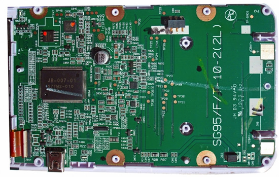
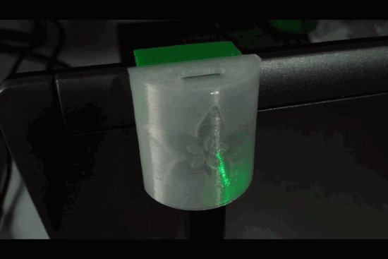
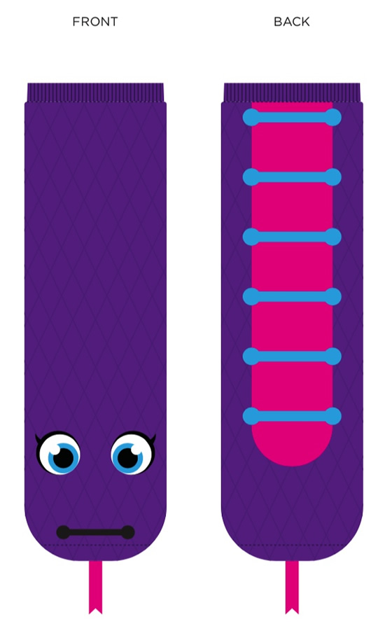
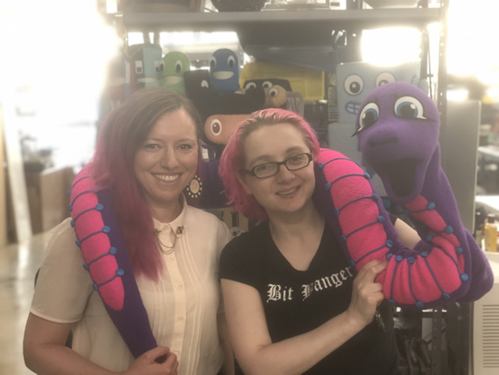
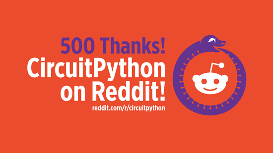
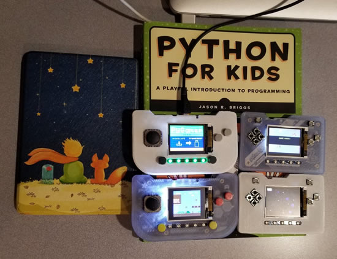
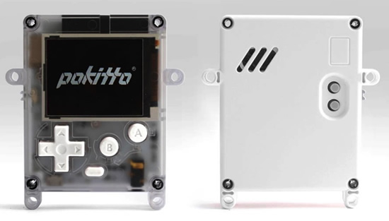
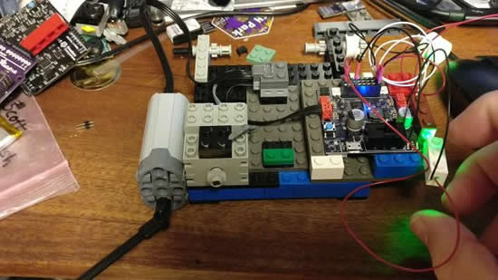
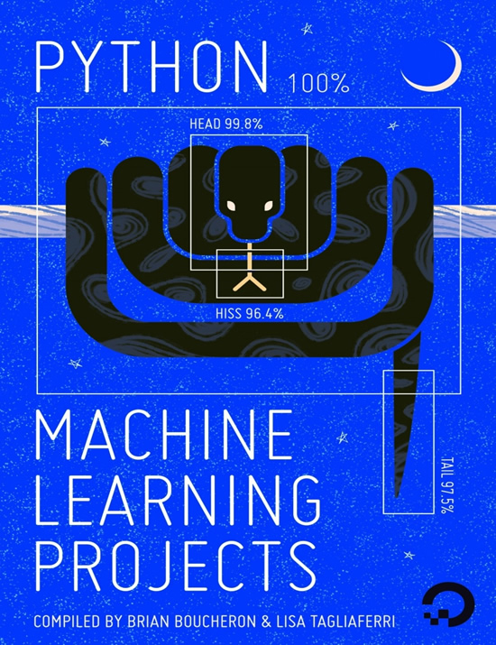
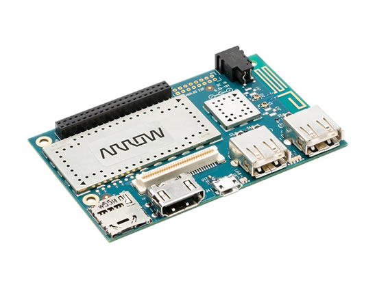

## 6,000 Thanks! Python on Hardware is happening!

We started the Python on microcontrollers newsletter in November of 2016, since then we've published 129 newsletters (including this one!). We're so thankful for all the readers and contributors. We are celebrating over 6,000 subscribers as of last week, thank you! Check out all the archives here - [adafruitdaily.com](https://www.adafruitdaily.com/category/circuitpython/).

## CircuitPython 4.1.0 Beta 1 Released!

4.1.0's biggest feature is speed! General execution of Python should be 2-5x faster and display refreshing will be faster as well.

This is the second beta version for testing. It shouldn't break any code compatible with previous 4.x releases. Please use the latest 4.x stable release [(available from the new website!)](https://circuitpython.org/downloads) when first starting with CircuitPython. It is stable.

## Kattni Keynote at PyOhio 2019

The FREE Annual Python Conference in Ohio. PyOhio 2019 is July 27-28, 2019 at The Ohio Union in Columbus, OH. AND! The Saturday keynote speaker: [Kattni Rembor](https://www.pyohio.org/2019/speakers/233)!

How may days until the event? Welp, check out this PyPortal! - [Twitter](https://twitter.com/PyOhio/status/1145349548824510464).

## PyDev of the Week: Scott Shawcroft on Mouse Vs Python

Mouse Vs Python interviewed Scott Shawcroft ([@tannewt](https://twitter.com/tannewt)) as the PyDev of the Week! Scott is the lead developer of CircuitPython, a variant of the Python programming language made for microcontrollers - [Mouse Vs Python](https://www.blog.pythonlibrary.org/2019/07/01/pydev-of-the-week-scott-shawcroft/).

## 2019 Opensource.com summer reading list – FEATURING Getting Started with Adafruit Circuit Playground Express!

[Getting Started with Adafruit Circuit Playground Express](https://www.adafruit.com/product/3944) by Mike Barela (recommendation written by Don Watkins) makes the 2019 Opensource.com summer reading list!

>_"This is a great book for makers or anyone who does not want to waste any time when they’re learning or teaching others how to get the most out of their new Circuit Playground Express. The author provides a great overview and description of the device and includes code examples and links to websites that provide more information. Whether you plan to use Python or Microsoft’s MakeCode to control your Circuit Playground Express, this book is a must-read for summer."_

## New TI-83 Premium CE Python Edition has SAMD chip on board

TI-83 Premium CE Python Edition has a SAMD chip on board, and is specifically optimized for Python, it looks like it still might be CircuitPython, but a TI variant now, renamed. TI-83 Premium CE & Python Edition : exam mode activation - [YouTube](https://youtu.be/b8XGLE1RopY). That's 2 TI calculators shipping in France, running Python!

## CircuitPython Powered AT Hand-Raiser

Bill has a great guide on [learn.adafruit.com](https://learn.adafruit.com/AT-Hand-Raiser?view=all) showing how to use CircuitPython to make an assistive hand-raiser - 

>_"Sometimes folks need help doing the simple things that most of us take for granted - that's where Assistive Technology comes into play.  For example, ATMakers recently had a college student reach out and ask for help getting her professor's attention in class. The problem was she has Spinal Muscular Atrophy (SMA) and couldn't raise her hand.  So, we created this small Trinket-powered device that attaches to her laptop or tablet and lights up when she wants to participate! Along the way, we found a fantastic way to control CircuitPython code using nothing more than the USB cord and Windows, Mac or Linux scripts loaded on the Trinket itself."_

## Hanselminutes Technology Podcast by Scott Hanselman - PyPortal

Scott and Richard Campbell talk often and when they do they think, “we should have recorded this!” Hanselminutiae are those shows! In this episode they talk about the PyPortal from AdaFruit, rewiring your house for ethernet, how .NET transformed itself, and more! - [Hanselminutes](https://hanselminutes.com/690/hanselminutiae-19-with-richard-campbell).

## 293: Skateboard Tricks – Embedded.fm podcast

Limor Fried of Adafruit spoke with us about engineering, education, and business - [embedded.fm](https://embedded.fm/episodes/293).

## Microsoft Garage Survey – Project Pacifica future features for physical computing projects

Hello there, we’re a group of interns at Microsoft Vancouver, working in The Garage for project Pacifica! Pacifica is a tool to help you building your physical computing projects. We’re currently prioritizing some features, and would love to hear what is the most helpful thing for your project! This survey will only take 3 – 5 minutes, and your insights are very valuable to us! - [Survey](https://forms.office.com/Pages/ResponsePage.aspx?id=v4j5cvGGr0GRqy180BHbRx50AHoXr3BImxtzTGKK4edUQVBONkY5OENWMzYwT1QzVElDRVc3M0ozVi4u).

## Feather takes flight at Seeed Studio with the Grove Shield for Particle Mesh

Grove Shield for Particle Mesh @ Seeed Studio is the first (we think) FEATHER format board from Seeed! - [Adafruit](https://blog.adafruit.com/2019/06/27/feather-takes-flight-at-seeed-studio-with-the-grove-shield-for-particle-mesh-seeedstudio-particle-adafruit-feather/).

## iOS 13 beta erases files off drive, resets iPad: FAT12 issue it seems…

The upcoming iOS 13 allows iPads to be more like computers, which means being able to do computer-like things such as plugging in a USB drive, opening up the Files app in iOS 13 and browsing the files. This is going to be fantastic for folks who want to use an iPad as their full-time desktop replacement, and if you’re a coder it looks like you’ll be able to do things like opening up Python .py files, use IDEs for coding, etc.

However! iOS beta 1 deletes files off some devices that are USB-Drive-like, for example, all the CircuitPython boards. The iPad also resets itself, so that’s not super-great either.

We documented it [(video)](https://www.youtube.com/watch?v=6ddhFHehK-4) the best we could to make sure it's fixed before the iOS 13 release - [Adafruit](https://blog.adafruit.com/2019/06/25/ios-13-beta-1-erases-files-off-drive-resets-ipad-fat12-issue-it-seems-apple/).

## IO News: Adafruit IO’s Zapier Integration in the Zapier App Directory!

adafruit.io (and CircuitPython) news! Adafruit IO’s Zapier Integration in the Zapier App Directory and we have a project to check out! - [Adafruit](https://blog.adafruit.com/2019/06/27/io-news-adafruit-ios-zapier-integration-in-the-zapier-app-directory-adafruitio-zapier/).

Want to write a message to your PyPortal’s display? Perhaps you’d like to easily add and change text on your PyPortal’s display to use it as a smart sticky-note, or have people email it directly!
U
sing Zapier, you will set up a Zap to receive email via a custom Zapier email address at zapiermail.com and forward it to an Adafruit IO Feed.

With some CircuitPython Code, your PyPortal will be obtaining the current value of an Adafruit IO Feed and updating the display with the email sender address and the subject line.

Learn how at [learn.adafruit.com](https://learn.adafruit.com/pyportal-email-display)

## 8/8/2019 is CircuitPython day!

Mark your cals' some CircuitPython day events coming up!

Getting started programming microcontrollers with CircuitPython by NYC Resistor - [August 3, 2019](https://www.eventbrite.com/e/getting-started-programming-microcontrollers-with-circuitpython-tickets-63905511104).

CircuitPython Day with the India Linux Users Group Delhi (ILUGD) at the Delhi Technical University for Women - August 4, 2019. [Meetup](https://www.meetup.com/ilugdelhi/events/jkbtdqyzlbnb/) & [Eventbrite](https://www.eventbrite.com/e/circuitpython-day-tickets-63844092399).

8/8/2019 is CircuitPython day! We’re in the planning stages and will have live videos, celebrations, and more for this very snake friendly date! Here's some artwork in our public DropBox CircuitPython folder, check it out - [DropBox](https://www.dropbox.com/sh/cod3wllmyninyn5/AADC6Z5EhEsG18X8WDRMEZuta?dl=0).

If you need to get in touch with us for planning your event and more, email: [circuitpythonday@adafruit.com](mailto:circuitpythonday@adafruit.com)

## Naomi Ceder, Chair of Python Software Foundation

Naomi stopped by Adafruit and chatted with Ladyada! - [YouTube](https://youtu.be/6Vyzwa4w6mI). [Naomi Ceder](https://www.naomiceder.tech//pages/about/) earned a Ph.D in Classics several decades ago, but switched from ancient human languages to computer languages sometime in the last century. Since 2001, she has been learning, teaching, writing about, and using Python.

An elected fellow of the [Python Software Foundation](https://www.python.org/), Naomi currently serves as chair of its board of directors. She also speaks internationally about the Python community, and on inclusion and diversity in technology in general.

By day she leads a team of Python programmers for Dick Blick Art Materials, and in her spare time she enjoys sketching, knitting, and deep philosophical conversations with her dog.

Naomi Ceder is also the author of [The Quick Python Book, Third Edition](http://bit.ly/quick-python).

## Nina Zakharenko Interview!

AND! Nina visited and chatted with Ladayada too! - [Youtube](https://youtu.be/ae-8H3HE6QM). Nina Zakharenko is a senior cloud developer advocate at Microsoft, focusing on Python. Previously, she was a senior software engineer with over a decade of experience writing software for companies like Reddit, Meetup, and HBO. In her spare time, she enjoys snowboarding, hiking, and tinkering with wearable electronics from her home base in Portland, Oregon.

[Blog post series]( https://nina.to/talks) on conference talks. [Front end masters author page](https://nina.to/courses). [Free and open source course materials to learn python](https://learnpython.dev), & [repo](https://github.com/nnja/python). [Personal blog](https://nnja.io), listing where Nina is speaking next.

## PyPortal Python 2.7 Desktop Countdown Clock

AND check out Nina's PyPortal Python 2.7 Desktop Countdown Clock! Python 2.7 will not be maintained after 2020. Eagerly awaiting Python 2.7's retirement? Use an Adafruit PyPortal to display a countdown timer to the big event on your desktop. Thirteen themes let you match your countdown timer to your mood. Select your theme by pressing the left and right sides of the touchscreen - [Blog post](https://www.nnja.io/post/2019/2019-blog-circuitpython-pyportal-python27-event-countdown/), & on [GitHub](https://github.com/nnja/py27_countdown).

## 500 Thanks, CircuitPython on Reddit

Thank you to all 500 subscribers on [reddit.com/r/circuitpython](https://www.reddit.com/r/circuitpython/)!

## News from around the web!

Soldering and programming class in Circuitpython - [GitHub](https://github.com/hydronics2/Circuitpython_February_2019).

CircuitPython based string racer! A DC motor, end-of-string sensors, with predictive speed/distance/braking algorithm - [Twitter](https://twitter.com/CedarGroveMakr/status/1145129791156191232). Also, [a custom Feather](https://twitter.com/CedarGroveMakr/status/1144769101656576000)!

Looks like this is going to be a great summer for these kids :) - [Twitter](https://twitter.com/ericchou/status/1142480307200749568).

PyGamer_CursorControl_Scale.py - [GitHub](https://gist.github.com/brentru/3ad6a5b2306122e20dd57822d66845b1).

Richard created a follower and listener count for his wife's podcast using a CircuitPython-powered PyPortal - [Instagram](https://www.instagram.com/p/BzNaugKnkz7/?igshid=1h4qxunu7jcye).

Arturo has a lot of progress and more with keyboard FeatherWing! First up, [a survey for the fans](https://docs.google.com/forms/d/1AFwEd6r3wwFKrcJLCO7_hHhIIZXA6lawobnCSoDhfAA/viewform?edit_requested=true) to see what they want. Looks like over 100 people has responded so far! Rev 2 specs and 3D rendering - [Twitter](https://twitter.com/arturo182/status/1144007377412403209). And list widgets in CircuitPython - [Twitter](https://twitter.com/arturo182/status/1144761363656577024).

TG-Techie is working on another revision of the Datalore IP M4, an integrable CircuitPython ready module for soldering onto projects. Like the Adafruit Metro M4 squeezed into 1 square inch - [Twitter](https://twitter.com/TG_Techie/status/1143972797691191297).

Kirby is working on the episode chooser using CircuitPython on the PyGamer from ADABOX 12, some updates - [Twitter](https://twitter.com/keebie81/status/1143561315383988225).

The Coding Couple is working on a hit point tracker for their D&D character, they call it “Elf Gal” insipired by Doom Guy - [Twitter](https://twitter.com/thecodingcouple/status/1143344657021243393).

NJ's CoderDojo has their PyGamer! - [Twitter](https://twitter.com/RP_NJcoderdojo/status/1144799403649187841).

Buster – the new version of Raspbian - [raspberrypi.org](https://www.raspberrypi.org/blog/buster-the-new-version-of-raspbian/). And with this version, a default Python IDE.

>_"We’ve been including the excellent Thonny Python development environment in Raspbian for some time now. In this release, it’s now our default Python editor, and to that end, we are no longer including IDLE by default. IDLE has always felt dated and not very pleasant to use, and Thonny is so much nicer that we’d strongly recommend moving to it, if you haven’t already! (If you’d like an alternative to Thonny, the Mu Python IDE is also still available in Recommended Software.)"_

Ben has a pull request for an update in Mu, shows the CircuitPython logo for the boards that support it - [Twitter](https://twitter.com/bwshockley/status/1144361874915332096) & [GitHub](https://github.com/mu-editor/mu/pull/869).

Congrats to Joshua Lowe [EduBlocks](https://edublocks.org/) for being shortlisted as a finalist in the Tech4Good Awards BT Young Pioneer category - [Twitter](https://twitter.com/Tech4GoodAwards/status/1143483276943855617) & [tech4goodawards.com](https://www.tech4goodawards.com/finalist/joshua-lowe/).

Top 10 Blogs to Get You Started on Python - [stxnext.com](https://stxnext.com/blog/2019/06/17/top-10-blogs-python/)

[Online Pokitto Python Editor](https://pyinsky.herokuapp.com/) lets you to instantly make MicroPython games for the [Pokitto MCU based device](https://www.pokitto.com). Using the online editor requires zero-installation and zero-login, and you do not even have to have the physical device! The editor features an integrated Pokitto emulator, a code editor with syntax highlighting, an inline pixel editor, drag-and-drop audio file importing, and automatic flash image generation for Pokitto. MicroPython has been extended by the "uPyGame library", which is a PyGame like gaming library.

esp32spi_mqtt is a mqtt client compatible with the adafruit_esp32spi library - [GitHub](https://github.com/beachbc/esp32spi_mqtt).

SnekBoard runs a SAMD21G18A processor. This is the same chip found in many Arduino boards, including some from Adafruit. It's a ARM Cortex M0 with 256kB of flash and 32kB of of RAM - [GitHub](https://github.com/keith-packard/snekboard).

Employing Wireless Edge Intelligence with Digi XBee MicroPython - [Digi](https://www.digi.com/blog/employing-wireless-edge-intelligence-with-digi-xbee-micropython/) & [Digi MicroPython Programming Guide](http://cms.digi.com/resources/documentation/digidocs/90002219/) & [examples](https://github.com/digidotcom/xbee-micropython).

Programmable Mini Drone: ESPcopter - [arikovani](https://arikovani.com/en/projects/programlanabilir-mini-drone/detail) & [Twitter](https://twitter.com/espcopter).

PyRobot is a light weight, high-level interface which provides hardware independent APIs for robotic manipulation and navigation. This repository also contains the low-level stack for LoCoBot, a low cost mobile manipulator hardware platform - [GitHub](https://github.com/facebookresearch/pyrobot).

Portable Computer Vision: TensorFlow 2.0 on a Raspberry Pi by [Leigh Johnson](https://medium.com/@grepLeigh/portable-computer-vision-tensorflow-2-0-on-a-raspberry-pi-part-1-of-2-84e318798ce9).

Python in Visual Studio Code – June 2019 Release - [Microsoft](https://devblogs.microsoft.com/python/python-in-visual-studio-code-june-2019-release/).

dateutil are useful extensions to the standard Python datetime features - [GitHub](https://github.com/dateutil/dateutil).

Advanced Linux Commands Cheat Sheet - [Redhat](https://developers.redhat.com/cheat-sheets/advanced-linux-commands/?sc_cid=70160000001273HAAQ).

Parsing Nested JSON Records in Python by [Brett Mullins](https://bcmullins.github.io/parsing-json-python/).

Kivy - Open source Python library for rapid development of applications that make use of innovative user interfaces, such as multi-touch apps - [kivy.org](https://kivy.org/)

Setting Up Python for Machine Learning on Windows - [Real Python](https://realpython.com/python-windows-machine-learning-setup/).

SKiDL is a module that extends Python with the ability to design electronic circuits - [GitHub](https://github.com/xesscorp/skidl).

Completely block Google and its services - [pihole-google](https://github.com/nickspaargaren/pihole-google).

Deploying to PythonAnywhere via GitHub by [Aadi Bajpai](https://medium.com/@aadibajpai/deploying-to-pythonanywhere-via-github-6f967956e664).

Explore millions of images on [dockerhub](https://hub.docker.com/search/?type=image).

The source for the Linux kernel used in Windows Subsystem for Linux 2 (WSL2), from Microsoft - [GitHub](https://github.com/microsoft/WSL2-Linux-Kernel).

And now for something completely different: NetBSD on the last G4 Mac mini - [TenFourFox Development](http://tenfourfox.blogspot.com/2019/06/and-now-for-something-completely.html).

nRF52/nRF51 Fitness Trackers & Smartwatches Reverse Engineered for use as a Wearable Device Development Platform - [GitHub](https://github.com/curtpw/nRF5x-device-reverse-engineering).

FreeDOS is an open source DOS-compatible operating system that you can use to play classic DOS games, run legacy business software, or develop embedded systems. Any program that works on MS-DOS should also run on FreeDOS - [freedos.org](https://www.freedos.org/).

How to support open-source software and stay sane - [nature.com](https://www.nature.com/articles/d41586-019-02046-0).

Given a Profile and folder name, rotates the background of a Terminal - [GitHub](https://github.com/shanselman/TerminalAttractMode).

Python Machine Learning Projects - [PDF](https://assets.digitalocean.com/books/python/machine-learning-projects-python.pdf).

Custom Vision - serivce that uses REST API calls to tag images with custom computer vision models - [customvision.ai](https://www.customvision.ai/).

5 common mistakes made by beginner Python programmers by [Anurag Rana](https://dev.to/anuragrana/5-common-mistakes-made-by-beginner-python-programmers-5ggp).

Machine learning on an Arduino Uno - [hackaday](https://hackaday.com/2019/06/30/blisteringly-fast-machine-learning-on-an-arduino-uno/) & [on a Pi](https://hackaday.com/2018/12/25/machine-learning-on-tiny-platforms-like-raspberry-pi-and-arduino/).

Embedded Learning Library (ELL). An Open Source Library for Embedded AI and Machine Learning from Microsoft - [ELL](https://microsoft.github.io/ELL/) & [GitHub](https://github.com/microsoft/ELL).

Adafruit, 13 years ago, 2006 - [theoldnet](http://theoldnet.com/browser/).

#ICYDNCI What was the most popular, most clicked link, in [last week's newsletter](https://www.adafruitdaily.com/2019/06/25/choose-your-own-adventure-with-python-on-hardware-python-adafruit-circuitpython-pythonhardware-circuitpython-micropython-thepsf-adafruit/)? [Scott's CircuitPython session at TEARDOWN](https://youtu.be/0mTw9iHcj3Q)!

CircuitPython Weekly July 1st, 2019 [on YouTube](https://youtu.be/UB6aXzl54qo) and [on diode.zone](https://diode.zone/videos/watch/4b30b52f-f0e1-4a70-83f5-0f9af8ee6d98)

## Coming soon

Tiny Machine Learning on the Edge with TensorFlow Lite Running on SAMD51 - [YouTube](https://youtu.be/cn9PEDX_qLk). We are training models in the docker.

Advance PyGamer.

PyBadge with Wi-Fi.

## New Learn Guides!

[CircuitPython Choose Your Own Adventure](https://learn.adafruit.com/circuit-python-choose-you-own-adventure) from [Dave Astels](https://learn.adafruit.com/users/dastels)

[Tilt Controlled Marble Maze](https://learn.adafruit.com/tilt-controlled-marble-maze) from [Dano Wall](https://learn.adafruit.com/users/danowall)

[CircuitPython Powered AT Hand-Raiser](https://learn.adafruit.com/AT-Hand-Raiser) from [Bill Binko](https://learn.adafruit.com/users/atmakers)

[CircuitPython Libraries on Linux and the 96Boards DragonBoard 410c](https://learn.adafruit.com/circuitpython-libraries-on-linux-and-the-96boards-dragonboard-410c) from [Melissa LeBlanc-Williams](https://learn.adafruit.com/users/MakerMelissa)

[CircuitPython Stage Game Library](https://learn.adafruit.com/circuitpython-stage-game-library) from [Radomir Dopieralski](https://learn.adafruit.com/users/deshipu)

## Updated Guides - Now With More Python!

**You can use CircuitPython libraries on Raspberry Pi!** We're updating all of our CircuitPython guides to show how to wire up sensors to your Raspberry Pi, and load the necessary CircuitPython libraries to get going using them with Python. We'll be including the updates here so you can easily keep track of which sensors are ready to go. Check it out!

Keep checking back for more updated guides!

## CircuitPython Libraries!

CircuitPython support for hardware continues to grow. We are adding support for new sensors and breakouts all the time, as well as improving on the drivers we already have. As we add more libraries and update current ones, you can keep up with all the changes right here!

For the latest drivers, download the [Adafruit CircuitPython Library Bundle](https://github.com/adafruit/Adafruit_CircuitPython_Bundle/releases/latest).

If you'd like to contribute, CircuitPython libraries are a great place to start. Have an idea for a new driver? File an issue on [CircuitPython](https://github.com/adafruit/circuitpython/issues)! Interested in helping with current libraries? Check out [this GitHub issue on CircuitPython](https://github.com/adafruit/circuitpython/issues/1246) for an overview of the State of the CircuitPython Libraries, updated each week. We've included open issues from the library issue lists, and details about repo-level issues that need to be addressed. We have a guide on [contributing to CircuitPython with Git and Github](https://learn.adafruit.com/contribute-to-circuitpython-with-git-and-github) if you need help getting started. You can also find us in the #circuitpython channel on the [Adafruit Discord](https://adafru.it/discord). Feel free to contact Kattni (@kattni) with any questions.

You can check out this [list of all the CircuitPython libraries and drivers available](https://github.com/adafruit/Adafruit_CircuitPython_Bundle/blob/master/circuitpython_library_list.md). 

The current number of CircuitPython libraries is **162**!

**New Libraries!**

Here's this week's new CircuitPython libraries:

 * [Adafruit_CircuitPython_VCNL4040](https://github.com/adafruit/Adafruit_CircuitPython_VCNL4040)
 * [Adafruit_CircuitPython_CursorControl](https://github.com/adafruit/Adafruit_CircuitPython_CursorControl)
 * [Adafruit_CircuitPython_turtle](https://github.com/adafruit/Adafruit_CircuitPython_turtle)

**Updated Libraries!**

Here's this week's updated CircuitPython libraries:

 * [Adafruit_CircuitPython_miniQR](https://github.com/adafruit/Adafruit_CircuitPython_miniQR)
 * [Adafruit_CircuitPython_MAX31856](https://github.com/adafruit/Adafruit_CircuitPython_MAX31856)
 * [Adafruit_CircuitPython_LIS3DH](https://github.com/adafruit/Adafruit_CircuitPython_LIS3DH)
 * [Adafruit_CircuitPython_PYOA](https://github.com/adafruit/Adafruit_CircuitPython_PYOA)

**PyPI Download Stats!**

We've written a special library called Adafruit Blinka that makes it possible to use CircuitPython Libraries on [Raspberry Pi and other compatible single-board computers](https://learn.adafruit.com/circuitpython-on-raspberrypi-linux/). Adafruit Blinka and all the CircuitPython libraries have been deployed to PyPI for super simple installation on Linux! Here are the top 10 CircuitPython libraries downloaded from PyPI in the last week, including the total downloads for those libraries:

| Library                                     | Last Week   | Total |   
|:-------                                     |:--------:   |:-----:|   
| Adafruit-Blinka                             | 2495        | 41847 |   
| Adafruit_CircuitPython_BusDevice            | 1403        | 16166 |   
| Adafruit_CircuitPython_MCP230xx             | 400         | 2732 |    
| Adafruit_CircuitPython_Register             | 342         | 7229 |    
| Adafruit_CircuitPython_NeoPixel             | 313         | 6216 |    
| Adafruit_CircuitPython_PCA9685              | 231         | 4397 |    
| Adafruit_CircuitPython_Motor                | 228         | 4872 |    
| Adafruit_CircuitPython_ADS1x15              | 169         | 2440 |    
| Adafruit_CircuitPython_ServoKit             | 144         | 3457 |    
| Adafruit_CircuitPython_LIS3DH               | 132         | 2166 |    

## Upcoming events!

July, 8 to 14th 2019. The EuroPython conference series was initiated by the European Python community in 2001 and started with EuroPython 2002 in Charleroi, Belgium, as the first major Python conference entirely run by volunteers - [ep2019.europython.eu](https://ep2019.europython.eu/)

**EuroPython 2019 attendees getting CircuitPython-powered PewPew Game Consoles!**

The device was created and designed by [Radomir Dopieralski](https://hackaday.io/deshipu), a long time EuroPython regular and enthusiastic Python device and robotics builder. 

The [PewPew](https://pewpew.rtfd.io/) is a simplified game console, programmable with [CircuitPython](https://circuitpython.rtfd.io/), a variant of MicroPython. It comes with a 64 LED display and a set of small buttons to drive the console. They are looking for attendees to help Radomir with workshops on the PewPew. See more on [the blog post](https://blog.europython.eu/post/185584014022/europython-2019-warning-spoiler-alert) and on the [PewPew workshop page](https://ep2019.europython.eu/events/pewpew-workshops/). The pew-pew game hardware is here - [GitHub](https://github.com/pewpew-game/hardware-europython2019).

PyOhio is July 27-28, 2019 in Columbus, Ohio! Kattni Rembor will be the opening keynote speaker! PyOhio is a non-profit annual Python community conference held in Columbus, OH. It is free to attend and welcomes anyone with an interest in Python. Content ranges from beginner to advanced and is intended to be relevant to all types of Python users: students, software professionals, scientists, hobbyists, and anyone looking to learn more. There are keynotes, tutorials, talks, sprints, open spaces, lightning talks and more. Registration is now open! [PyOhio](https://www.pyohio.org/2019/)

Open Source Summit and Embedded Linux Conference, August 21 – 23, 2019 at the Hilton San Diego Bayfront. The Open Source Summit North America combines with Embedded Linux Conference North America (ELC).  ELC has been a vendor-neutral technical conference where developers working on embedded Linux and industrial IoT products and deployments gather for education and collaboration. Open Source Summit brings together developers and open source professionals to collaborate and learn about the latest technologies - [Linux Foundation](https://www.linuxfoundation.org/press-release/2019/05/open-source-summit-to-include-embedded-linux-conference-bring-together-both-technical-and-leadership-programs-under-one-roof/).

PYCON UK 2019 - Cardiff City Hall, Friday 13th to Tuesday 17th September. PyCon UK is back at Cardiff City Hall, for five days of talks, workshops and collaboration. The conference also features a young coders' day, themes dedicated to science and education, and numerous Python-related events - [PyCon UK](https://2019.pyconuk.org/).

micro:bit Live 2019 is coming to BBC MediaCityUK, Greater Manchester, England on October 4-5. This will be the very first annual gathering of the global micro:bit community of educators and partners - [micro:bit](https://microbit.org/en/2019-04-12-microbit-live/).

## Latest releases

CircuitPython's stable release is [4.0.2](https://github.com/adafruit/circuitpython/releases/latest) and its unstable release is [4.1.0-beta.1](https://github.com/adafruit/circuitpython/releases). New to CircuitPython? Start with our [Welcome to CircuitPython Guide](https://learn.adafruit.com/welcome-to-circuitpython).

[20190701](https://github.com/adafruit/Adafruit_CircuitPython_Bundle/releases/latest) is the latest CircuitPython library bundle.

[v1.11](https://micropython.org/download) is the latest MicroPython release. Documentation for it is [here](http://docs.micropython.org/en/latest/pyboard/).

[3.7.3](https://www.python.org/downloads/) is the latest Python release. The latest pre-release version is [3.8.0b1](https://www.python.org/download/pre-releases/).

[1289 Stars](https://github.com/adafruit/circuitpython/stargazers) Like CircuitPython? [Star it on GitHub!](https://github.com/adafruit/circuitpython)

## CircuitPython.org updates!

[Dragonboard 410c](https://circuitpython.org/blinka/dragonboard_410c/) by Arrow.

By the numbers: CircuitPython has over [62+ boards supported](https://circuitpython.org/downloads), adding more each week & has [16+ SBC Linux boards supported](https://circuitpython.org/blinka), adding more each day, & over [162+ Libraries](https://circuitpython.org/libraries ), adding more every week!

## Call for help – CircuitPython messaging to other languages!

We [posted on the Adafruit blog](https://blog.adafruit.com/2018/08/15/help-bring-circuitpython-messaging-to-other-languages-circuitpython/) about bringing CircuitPython messaging to other languages, one of the exciting features of CircuitPython 4.x is translated control and error messages. Native language messages will help non-native English speakers understand what is happening in CircuitPython even though the Python keywords and APIs will still be in English. If you would like to help, [please post](https://github.com/adafruit/circuitpython/issues/1098) to the main issue on GitHub and join us on [Discord](https://adafru.it/discord).

We made this graphic with translated text, we could use your help with that to make sure we got the text right, please check out the text in the image – if there is anything we did not get correct, please let us know. Dan sent me this [handy site too](http://helloworldcollection.de/#Human).

## jobs.adafruit.com

[jobs.adafruit.com](https://jobs.adafruit.com/) has returned and folks are posting their skills (including CircuitPython) and companies are looking for talented makers to join their companies - from Digi-Key, to Hackaday, Microcenter, Raspberry Pi and more.

Adafruit is hiring! We're looking for [PHP developers in the NYC area](https://jobs.adafruit.com/job/full-time-web-developer-adafruit-nyc/)! Email: [apply@adafruit.com](mailto:apply@adafruit.com)

And one of our favorite sites [now has a jobs board too](https://www.cnx-software.com/2019/06/18/embedded-systems-jobs-board-company-database/) for embedded systems - [CNX Software](https://jobs.cnx-software.com/).

## 12,873 thanks!

The Adafruit Discord community, where we do all our CircuitPython development in the open, reached over 12,873 humans, thank you! Join today! [https://adafru.it/discord](https://adafru.it/discord)

Discord now offers "server boosts" we have 11 on our server (level 2), if we get to 50 boosts we get to level 3 and some other good features for the community: +100 emojis for a total of 250, 384 Kbps audio, vanity URL, 100 mb uploads for all members (and all the things we have now, like the server banner). Stop by and boost! [https://adafru.it/discord](https://adafru.it/discord).

## ICYMI - In case you missed it

The wonderful world of Python on hardware! This is our first video-newsletter-podcast that we’ve started! The news comes from the Python community, Discord, Adafruit communities and more. It’s part of the weekly newsletter, then we have a segment on ASK an ENGINEER and this is the video slice from that! The complete Python on Hardware weekly VideoCast [playlist is here](https://www.youtube.com/playlist?list=PLjF7R1fz_OOXRMjM7Sm0J2Xt6H81TdDev). 

This video podcast is on [iTunes](https://itunes.apple.com/us/podcast/python-on-hardware/id1451685192?mt=2), [YouTube](https://www.youtube.com/playlist?list=PLjF7R1fz_OOXRMjM7Sm0J2Xt6H81TdDev), [IGTV (Instagram TV](https://www.instagram.com/adafruit/channel/)), and [XML](https://itunes.apple.com/us/podcast/python-on-hardware/id1451685192?mt=2).

[Weekly community chat on Adafruit Discord server CircuitPython channel - Audio / Podcast edition](https://itunes.apple.com/us/podcast/circuitpython-weekly-meeting/id1451685016) - Audio from the Discord chat space for CircuitPython, meetings are usually Mondays at 2pm ET, this is the audio version on [iTunes](https://itunes.apple.com/us/podcast/circuitpython-weekly-meeting/id1451685016), Pocket Casts, [Spotify](https://adafru.it/spotify), and [XML feed](https://adafruit-podcasts.s3.amazonaws.com/circuitpython_weekly_meeting/audio-podcast.xml).

## Codecademy "Learn Hardware Programming with CircuitPython"

Codecademy, an online interactive learning platform used by more than 45 million people, has teamed up with the leading manufacturer in STEAM electronics, Adafruit Industries, to create a coding course, "Learn Hardware Programming with CircuitPython". The course is now available in the [Codecademy catalog](https://www.codecademy.com/learn/learn-circuitpython?utm_source=adafruit&utm_medium=partners&utm_campaign=circuitplayground&utm_content=pythononhardwarenewsletter).

Python is a highly versatile, easy to learn programming language that a wide range of people, from visual effects artists in Hollywood to mission control at NASA, use to quickly solve problems. But you don’t need to be a rocket scientist to accomplish amazing things with it. This new course introduces programmers to Python by way of a microcontroller — CircuitPython — which is a Python-based programming language optimized for use on hardware.

CircuitPython’s hardware-ready design makes it easier than ever to program a variety of single-board computers, and this course gets you from no experience to working prototype faster than ever before. Codecademy’s interactive learning environment, combined with Adafruit's highly rated Circuit Playground Express, present aspiring hardware hackers with a never-before-seen opportunity to learn hardware programming seamlessly online.

Whether for those who are new to programming, or for those who want to expand their skill set to include physical computing, this course will have students getting familiar with Python and creating incredible projects along the way. By the end, students will have built their own bike lights, drum machine, and even a moisture detector that can tell when it's time to water a plant.

Visit Codecademy to access the [Learn Hardware Programming with CircuitPython](https://www.codecademy.com/learn/learn-circuitpython?utm_source=adafruit&utm_medium=partners&utm_campaign=circuitplayground&utm_content=pythononhardwarenewsletter) course and Adafruit to purchase a [Circuit Playground Express](https://www.adafruit.com/product/3333).

Codecademy has helped more than 45 million people around the world upgrade their careers with technology skills. The company’s online interactive learning platform is widely recognized for providing an accessible, flexible, and engaging experience for beginners and experienced programmers alike. Codecademy has raised a total of $43 million from investors including Union Square Ventures, Kleiner Perkins, Index Ventures, Thrive Capital, Naspers, Yuri Milner and Richard Branson, most recently raising its $30 million Series C in July 2016.

## Contribute!

The CircuitPython Weekly Newsletter is a CircuitPython community-run newsletter emailed every Tuesday. The complete [archives are here](https://www.adafruitdaily.com/category/circuitpython/). It highlights the latest CircuitPython related news from around the web including Python and MicroPython developments. To contribute, edit next week's draft [on GitHub](https://github.com/adafruit/circuitpython-weekly-newsletter/tree/gh-pages/_drafts) and [submit a pull request](https://help.github.com/articles/editing-files-in-your-repository/) with the changes. Join our [Discord](https://adafru.it/discord) or [post to the forum](https://forums.adafruit.com/viewforum.php?f=60) for any further questions.
