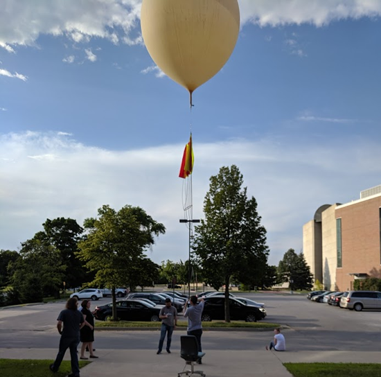
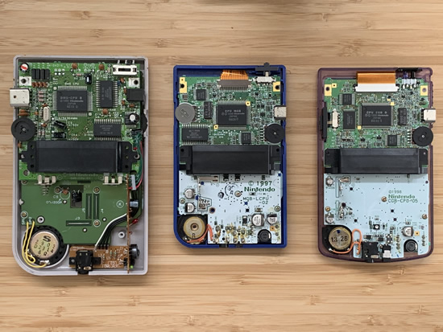
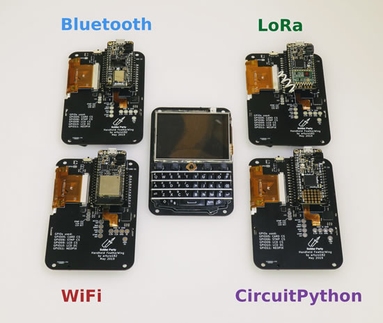
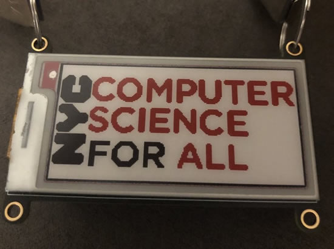
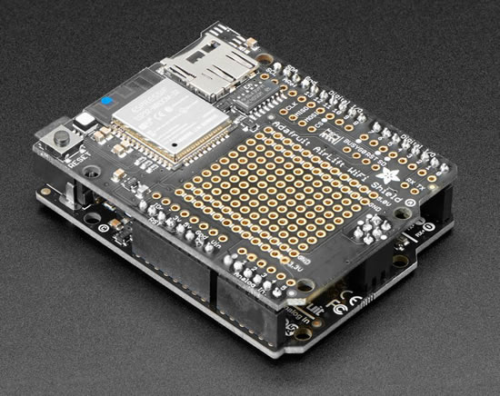
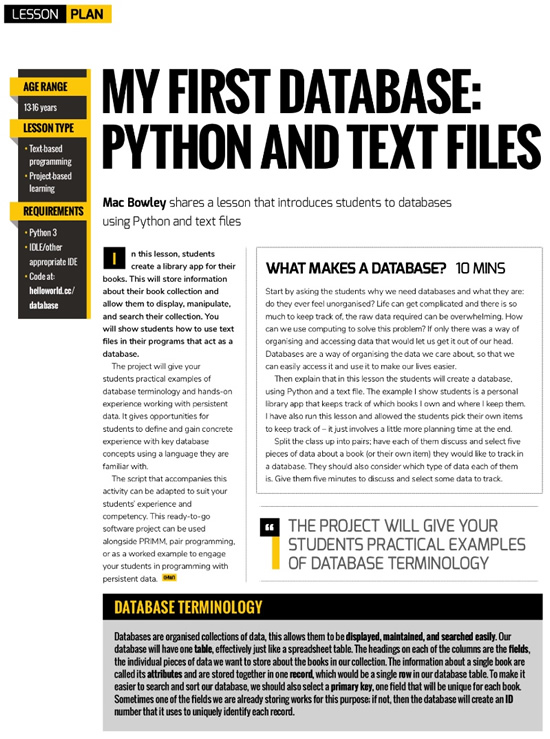
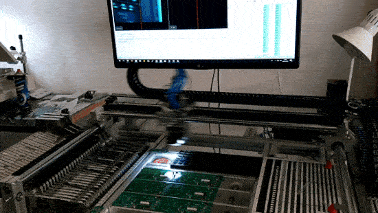
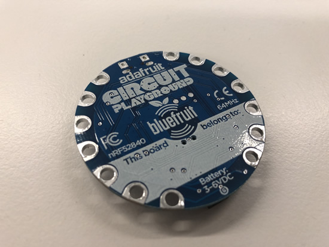

## CircuitPython takes flight - Using CircuitPython on High Altitude Balloons

Matt's team is using CircuitPython for on High Altitude Balloons! Their team HABET (High Altitude Balloon Experiments in Technology) is part of a program called Make 2 Innovate. Make To Innovate (M:2:I) is an exciting program in the Department of Aerospace Engineering at Iowa State University which engages students in hands-on projects to augment their understanding of engineering fundamentals - [Make to Innovate (M:2:I) Department of Aerospace Engineering at Iowa State University](https://m2i.aere.iastate.edu/).

Why choose CircuitPython? Matt writes -

>_"We had been programming it in C up till this launch, but with myself graduating next semester along with the Computer Engineer on our team it we needed to find a way to allow for ease of maintenance. When I found you guys had libs for the radio and GPS we decided to try that out. The radio portion worked fantastic."_

## ALL ABOARD' CircuitPython.org updates - datum!

The goal of the datum project is to make it easier for students and hobbyists to incorporate sensors into their projects by doing the heavy lifting of translating the language the sensors speak into a format that’s easy for humans to read and for machines to parse and process.

Towards that end each datum board emulates a serial port over a USB connection, presents the information and data stored on them in a JSON encapsulated packet, and processes URI style commands to change and retrieve their settings. The datum boards fill the gap between a LEGO® Mindstorms® sensor and a breakout board.

And now, the datum boards support CircuitPython! Check them all out on [CircuitPython.org!](https://circuitpython.org/downloads)

By the numbers: CircuitPython has over [66+ boards supported](https://circuitpython.org/downloads), adding more each week & has [16+ SBC Linux boards supported](https://circuitpython.org/blinka), adding more each day, & over [164+ Libraries](https://circuitpython.org/libraries ), [adding more](https://github.com/adafruit/Adafruit_CircuitPython_Bundle/blob/master/circuitpython_library_list.md) every week!

## Testing the Circuit Playground Express Bluefruit

We are testing the Circuit Playground Express Bluefruit, check out the coming soon photos, SO! We went to Washington Square Park at night to test how far we could change the colors of the NeoPixels on the CPX Bluefruit, we're going to need a bigger park maybe :) - [YouTube](https://youtu.be/VtJJ8msPKLY).

## TEARDOWN 2019: Supercharge Your Hardware Old and New with Circuit Python by Scott Shawcroft

TEARDOWN 2019 video is now posted! Supercharge Your Hardware Old and New with Circuit Python by Scott Shawcroft - [YouTube](https://youtu.be/xzREvFyL4co) & [slides](https://github.com/tannewt/presentations/blob/master/teardown2019/presentation.md).

>_"CircuitPython makes programming hardware easier than ever by bringing the popular Python language to modern, inexpensive 32-bit microcontrollers. This doesn’t need to be limited to modern hardware though. By pairing a modern microcontroller running CircuitPython and a vintage computer, such as a GameBoy or Yamaha piano keyboard, you can unlock the unique characteristics of these vintage devices. In this talk, you’ll learn the basics of how CircuitPython makes coding easy, how it works under the hood, and how to extend CircuitPython with C. As an example, we’ll supercharge a Nintendo GameBoy with CircuitPython. By the end of the talk, you’ll be able to supercharge your own hardware project with CircuitPython."_

## 8/8/2019 is CircuitPython day!

Mark your cals' some CircuitPython day events coming up!

Getting started programming microcontrollers with CircuitPython by NYC Resistor - [August 3, 2019](https://www.eventbrite.com/e/getting-started-programming-microcontrollers-with-circuitpython-tickets-63905511104).

CircuitPython Day with the India Linux Users Group Delhi (ILUGD) at the Delhi Technical University for Women - August 4, 2019. [Meetup](https://www.meetup.com/ilugdelhi/events/jkbtdqyzlbnb/) & [Eventbrite](https://www.eventbrite.com/e/circuitpython-day-tickets-63844092399).

8/8/2019 is CircuitPython day! We’re in the planning stages and will have live videos, celebrations, and more for this very snake friendly date! Here's some artwork in our public DropBox CircuitPython folder, check it out - [DropBox](https://www.dropbox.com/sh/cod3wllmyninyn5/AADC6Z5EhEsG18X8WDRMEZuta?dl=0).

If you need to get in touch with us for planning your event and more, email: [circuitpythonday@adafruit.com](mailto:circuitpythonday@adafruit.com)

## 13,078 thanks!

The Adafruit Discord community, where we do all our CircuitPython development in the open, reached over 13,078 humans, thank you! Join today! [https://adafru.it/discord](https://adafru.it/discord)

Discord now offers "server boosts" we have 12 on our server (level 2), if we get to 50 boosts we get to level 3 and some other good features for the community: +100 emojis for a total of 250, 384 Kbps audio, vanity URL, 100 mb uploads for all members (and all the things we have now, like the server banner). Stop by and boost! [https://adafru.it/discord](https://adafru.it/discord).

## Programmable boards Humble Bundle books - Featuring CircuitPython

Humble Bundle is back with a bundle all about programmable boards. Get e-books like Getting Started with Adafruit Circuit Playground Express, Getting Started with Adafruit Flora, Getting Started with Particle Photon, Getting Started with Adafruit Trinket, Make: Bluetooth, Make: FPGAs, Getting Started with the micro:bit, Getting Started with the Internet of Things, and more. $506 worth of digital books, PAY WHAT YOU WANT, DRM-Free, Multi-Format - [humblebundle.com](https://www.humblebundle.com/books/programmable-boards-make-books)

## The Feather - one footprint, countless possibilities!

The Feather - one footprint, countless possibilities! - [Twitter](https://twitter.com/arturo182/status/1150812891420995592).

## Design Evolution of the Programmable USB Hub

The CircuitPython-supported Programmable USB Hub design evolution [article is up on Crowd Supply](https://www.crowdsupply.com/capable-robot-components/programmable-usb-hub/updates/design-evolution-of-the-programmable-usb-hub)!

>_"Today’s update is going to be a dive into the design progression and evolution of the Programmable USB Hub. Note, I didn’t start out with the aim of creating a product which smashes together a USB Hub, Power Supply, Development Board, and IO expander – my aim was simply to create a product which provided more monitoring and control of USB devices."_

## News from around the web!

Owain Martin's new motor control board... The Auto-bubbleblower using ItsyBitsy M0 and CircuitPython - [Twitter](https://twitter.com/OwainM713/status/1149480626178809856).

EuroPython attendees each received a PewPew, here is Conway's Game of Life. [GitHub](https://github.com/JanBednarik/pewpew-game-of-life), [more code](https://gist.github.com/rok/8c213c94a8effe8670b6aa4f0913cdb2), [YouTube](https://youtu.be/ConQsd1Bu-o), and [Twitter](https://twitter.com/janbednarik/status/1149327266763202565).

Friday night jam session using CircuitPython - [Twitter](https://twitter.com/ecken/status/1149831728581795842).

Pocketchip + GrandCentral, outputting the distance it measures - [Twitter](https://twitter.com/jeffrey_coen/status/1148376694396542976).

Classic MIDI FeatherWing board, supports DIN-5 and 3.5mm TypeB jacks. Tested with CircuitPython 4.1.0beta1 - [GitHub](https://github.com/CedarGroveStudios/Classic_MIDI_FeatherWing) & [Twitter](https://twitter.com/CedarGroveMakr/status/1149822407693049857).

NYC Computer Science for all name tag, written in CircuitPython using Mu Code Editor with: 
Adafruit Feather M0 Bluefruit LE & Adafruit Tri-Color eInk / ePaper Display FeatherWing - [Twitter](https://twitter.com/ValerieBrock24/status/1148688991375355904).

Easily Load Device Tree Overlays - _"One particularly exciting feature of Giant Board is its ability to load device tree overlays at boot time. We’ve patched U-Boot so that you can tell it what overlays to load simply by editing a text file. This feature is not only great for developers, it also provides an easier, less error-prone way to enable and use common FeatherWings."_ - [Crowd Supply](https://www.crowdsupply.com/groboards/giant-board/updates/easily-load-device-tree-overlays).

Circuit Playground Express Sleep Assistant for Toddlers - [GitHub](https://gist.github.com/corbinbs/daf90320dc2202e7e747c3c4d15e83cf) via [Twitter](https://twitter.com/corbinbs/status/1148757320819728384).

The latest Adafruit IOT Monthly: Mid-Century Modern Weather Station, Raspberry Pi 4 and more! - [adafruit.io](https://io.adafruit.com/blog/notebook/2019/07/05/iot-monthly/)

Notes on using the Chinese "SAMD21-M0-Mini" board - [GitHub](https://github.com/BLavery/SAMD21-M0-Mini).

Python is eating the world: How one developer's side project became the hottest programming language on the planet -[ZDNet](https://www.zdnet.com/article/python-is-eating-the-world-how-one-developers-side-project-became-the-hottest-programming-language-on-the-planet/) & [PDF](https://creatives.techrepublic.com/whitepapers/PythonCoverStory_FINAL.pdf).

Python for SparkFun's Qwiic Connect System - A new package is available that incorporates all Qwiic modules capable of Python - [SparkFun](https://www.sparkfun.com/news/2958).

expressPython - A small Python editor for learning and competitive programming - [GitHub](https://github.com/JaDogg/expressPython).

Wedding gift for Jeroen and Mingming, Python on hardware powered wedding gift - [geekabit.nl](https://www.geekabit.nl/projects/wedding-gift-sprite/). Nice quote for the choice of programming them!

>_"MicroPython turned out to be really easy to work with. Coming from writing mostly assembler, the difference could not be bigger. Python is a very clear and elegant language, with a comprehensive manual and many examples available. Once the ESP32 is flashed with the MicroPython binary, you don't even have to flash any code while developing, just upload and run it on the fly."_

New ESP32-S2 Beta - Some of your questions answered! - [YouTube](https://youtu.be/yz06LobIS-g).

MicroPython implementation of the Homie MQTT convention for IoT - [GitHub](https://github.com/microhomie/microhomie).

Random Nerd Tutorials published a cool tutorial on using MicroPython with the BME280 - [randomnerdtutorials.com](https://randomnerdtutorials.com/micropython-bme280-esp32-esp8266/)

Debugging Python programs by [Petr Stříbný](https://stribny.name/blog/2019/06/debugging-python-programs).

Huawei Supply Chain Assessment - [FINITE STATE](https://finitestate.io/finite-state-supply-chain-assessment/).

What help should we provide to students learning to program? - [acm.org](https://cacm.acm.org/blogs/blog-cacm/238117-what-help-should-we-provide-to-students-learning-to-program/fulltext)

Containing a camera, display, tons of flash/RAM, this little device is powered by the dual core Kendryte K210 RISC-V processor - [m5stack.com](https://m5stack.com/products/StickV) & [PDF](https://s3.cn-north-1.amazonaws.com.cn/dl.kendryte.com/documents/kendryte_datasheet_20181011163248_en.pdf).

MicroPython on ESP32: [sending data to Google Sheets](https://blog.gypsyengineer.com/en/diy-electronics/micropython-on-esp32-sending-data-to-google-sheets.html).

Getting started with MicroPython on the W600 - [ULTRATECHIE](http://www.ultratechie.com/projects/w600-micropython/).

Employing Wireless Edge Intelligence with Digi XBee MicroPython - [digi.com](https://www.digi.com/blog/employing-wireless-edge-intelligence-with-digi-xbee-micropython/)

Execute Logo on M5Stack ESP32 Basic with MicroPython - [hackster.io](https://www.hackster.io/andreas-motzek/execute-logo-on-m5stack-esp32-basic-with-micropython-3713fd)

Special thanks to [Matt](https://twitter.com/adafruit/status/1147705115056508928) for all the MicroPython links for this week, and last week!

Technology is Not Magic, _"If we believe technology is magic, we risk becoming slaves to it."_ - Andrew "bunnie" Huang, hacker and open source hardware innovator, Singapore. Best known for his work hacking the Microsoft Xbox and efforts in designing open source hardware, including the Chumby (app-playing alarm clock), Chibitronics (peel-and-stick electronics for craft), and Novena (DIY laptop), Huang received his PhD in Electrical Engineering from MIT in 2002. He currently runs a private product design studio, Kosagi, and actively mentors several startups and students of the MIT Media Lab - [YouTube](https://youtu.be/aFrTJPfM58s) via [Twitter](https://twitter.com/bunniestudios/status/1150439944680136704).

And in other Bunnie news... If you're near Detroit, the [Henry Ford museum](https://www.thehenryford.org/current-events/calendar/break-repair-repeat-spontaneous-improvised-design/) has an exhibit featuring Wozniak's blue blox and the Xbox Bunnie hacked. The "Break, Repair, Repeat: Spontaneous and Improvised Design" exhibit will run until September 15, 2019 - [Twitter](https://twitter.com/bunniestudios/status/1149116491037466624).

Slide deck from Carol Willing's keynote [@SciPyConf](https://twitter.com/SciPyConf) Jupyter: Always Open for Learning and Discovery - [Speakerdeck](https://speakerdeck.com/willingc/jupyter-always-open-for-learning-and-discovery) via [Twitter](https://twitter.com/WillingCarol/status/1149854101968183296).

Data GIF Maker - [Google News Lab](https://datagifmaker.withgoogle.com/).

What’s New In Python 3.7 - [python.org](https://docs.python.org/3.7/whatsnew/3.7.html)

5 easy tips for switching from Python 2 to 3 - [Towards Data Science](https://towardsdatascience.com/5-easy-tips-for-switching-from-python-2-to-3-6100f717610f).

Hackster is now a million members strong with nearly 20,000 projects and millions of monthly visitors to their community’s website, blog, and social media properties - [hackster.io](https://blog.hackster.io/hackster-at-1-000-000-fd539b7af98)

AI at the Very, Very Edge - [EE Times](https://www.eetimes.com/document.asp?doc_id=1334918#).

Untold History of AI - [IEEE Spectrum](https://spectrum.ieee.org/tag/AI+history).

Runway ML puts AI tools in the hands of creators everywhere: A new model for easy access to machine learning - [The Verge](https://www.theverge.com/2019/7/10/20682307/ai-machine-learning-easy-to-use-models-creatives-runway-ml).

Hello World example for TensorFlow Lite Micro... This example is designed to demonstrate the absolute basics of using TensorFlow Lite for Microcontrollers. It includes the full end-to-end workflow of training a model, converting it for use with TensorFlow Lite, and running inference on a microcontroller - [GitHub](https://github.com/tensorflow/tensorflow/tree/master/tensorflow/lite/experimental/micro/examples/hello_world).

Python Preview extension for Visual Studio Code - [marketplace.visualstudio.com](https://marketplace.visualstudio.com/items?itemName=dongli.python-preview). On a related note, there are 9,799,664 installs and 54,472,127 downloads of Python for [Visual Studio](https://marketplace.visualstudio.com/items?itemName=ms-python.python). It's the [top download](https://marketplace.visualstudio.com/search?target=VSCode&category=All%20categories&sortBy=Downloads), double of the 2nd most popular download.

Cutter: Free and open-source GUI for radare2 reverse engineering framework - [GitHub](https://github.com/radareorg/cutter).

Did my program cause the improvement in my numbers? - [GitHub](https://github.com/microsoft/longitudinaldifferenceindifferencespy).

How to build databases using Python and text files - [Hello World Magazine](https://www.raspberrypi.org/blog/how-to-build-databases-using-python-and-text-files-hello-world-9/).

A Python Tetris implementation that "fits on a business card" (20 lines x 80 characters) - [GitHub](https://github.com/nickmpaz/tiny-tetris).

Website for creating simple Python 3D games - [libgame](https://www.libgame.com/).

NXP FlexIO Generator for the WS2812B LED Stripe Protocol - [mcuoneclipse.com](https://mcuoneclipse.com/2016/05/22/nxp-flexio-generator-for-the-ws2812b-led-stripe-protocol/)

Python consumes a lot of memory or how to reduce the size of objects? - [habr.com](https://habr.com/en/post/458518/)

Python facts, had to add it, it's the snakes, not the language - [softschools.com](http://www.softschools.com/facts/animals/python_facts/9/)

Racket is a general-purpose programming language as well as the world’s first ecosystem for language-oriented programming. Make your dream language, or use one of the dozens already available - [racket-lang.org](https://racket-lang.org/)

OpenPnP is an Open Source SMT pick and place system that includes ready to run software, and hardware designs that you can build and modify. You can also use OpenPnP software to run a pick and place machine of your own design, or with existing commercial machines, giving them abilities they never had with their OEM software - [openpnp.org](http://openpnp.org/) & [YouTube](https://youtu.be/y14pdfjYsyo).

[Linux 5.2 released](https://lkml.org/lkml/2019/7/7/281), RISC-V, LoRA, [and more](https://www.cnx-software.com/html/Linux-5.2-Changelog.txt). And on that note, the list of memberships on riscv.org is just as interesting as who is not on the list - [riscv.org](https://riscv.org/membership/?action=viewlistings)... in other RISC-V news, the RISC-V Foundation Community Code of Conduct [has been posted](https://riscv.org/risc-v-foundation-community-code-of-conduct/), discussion [here](https://groups.google.com/a/groups.riscv.org/forum/#!topic/sw-dev/OcNyKVHFuaE). Lastly, we'll post up a RISC-V design we are working on shortly, stay tuned.

#ICYDNCI What was the most popular, most clicked link, in [last week's newsletter](https://www.adafruitdaily.com/2019/07/09/python-on-hardware-measures-up-feather-soars-and-more-python-adafruit-circuitpython-pythonhardware-circuitpython-micropython-thepsf-adafruit/)? [Hacking Digital Calipers with CircuitPython to measure tumors](https://www.notion.so/Hacking-Digital-Calipers-3ee7726f11ca431694dc70a1977516e4).

CircuitPython Weekly for July 15th, 2019. Video available [on YouTube](https://youtu.be/KeNCEGPSqAs) and [on diode.zone](https://diode.zone/videos/watch/827ff4ec-4398-46fa-93b4-e625d5e936e5)

PyDev of the Week: Meg Ray on [Mouse vs Python](https://www.blog.pythonlibrary.org/2019/07/15/pydev-of-the-week-meg-ray/)

## Made with Mu

EuroPython Basel Friday, 12th 2019, Tools of the Trade: The Making of a Code Editor, Nicholas Tollervey - [YouTube](https://www.youtube.com/watch?v=2hN7uTcaHLM&feature=youtu.be&t=10232) via [Twitter](https://twitter.com/ntoll/status/1149965707700002816).

Why Mu? Mu tries to make it as easy as possible to get started with programming but aims to help you graduate to "real" development tools soon after. Everything in Mu is the "real thing" but presented in as simple and obvious way possible. It's like the toddling stage in learning to walk: you're finding your feet and once you're confident, you should move on and explore! Put simply, Mu aims to foster autonomy. Try out Mu today! - [codewith.mu](https://codewith.mu/)

## Coming soon

CircuitPython ... Circuit Playground Express Bluefruit!

Eye see more and more...

TinyUSB will soon support webUSB!

## New Learn Guides!

## Updated Guides - Now With More Python!

**You can use CircuitPython libraries on Raspberry Pi!** We're updating all of our CircuitPython guides to show how to wire up sensors to your Raspberry Pi, and load the necessary CircuitPython libraries to get going using them with Python. We'll be including the updates here so you can easily keep track of which sensors are ready to go. Check it out!

[title](url)

## CircuitPython Libraries!

CircuitPython support for hardware continues to grow. We are adding support for new sensors and breakouts all the time, as well as improving on the drivers we already have. As we add more libraries and update current ones, you can keep up with all the changes right here!

For the latest drivers, download the [Adafruit CircuitPython Library Bundle](https://github.com/adafruit/Adafruit_CircuitPython_Bundle/releases/latest).

If you'd like to contribute, CircuitPython libraries are a great place to start. Have an idea for a new driver? File an issue on [CircuitPython](https://github.com/adafruit/circuitpython/issues)! Interested in helping with current libraries? Check out [this GitHub issue on CircuitPython](https://github.com/adafruit/circuitpython/issues/1246) for an overview of the State of the CircuitPython Libraries, updated each week. We've included open issues from the library issue lists, and details about repo-level issues that need to be addressed. We have a guide on [contributing to CircuitPython with Git and Github](https://learn.adafruit.com/contribute-to-circuitpython-with-git-and-github) if you need help getting started. You can also find us in the #circuitpython channel on the [Adafruit Discord](https://adafru.it/discord). Feel free to contact Kattni (@kattni) with any questions.

You can check out this [list of all the CircuitPython libraries and drivers available](https://github.com/adafruit/Adafruit_CircuitPython_Bundle/blob/master/circuitpython_library_list.md). 

The current number of CircuitPython libraries is **164**!

**New Libraries!**

Here's this week's new CircuitPython libraries:

Check back next week for new libraries!

**Updated Libraries**
 * [Adafruit_CircuitPython_PyBadger](https://github.com/adafruit/Adafruit_CircuitPython_PyBadger)
 * [Adafruit_CircuitPython_CursorControl](https://github.com/adafruit/Adafruit_CircuitPython_CursorControl)
 * [Adafruit_CircuitPython_SimpleIO](https://github.com/adafruit/Adafruit_CircuitPython_SimpleIO)
 * [Adafruit_CircuitPython_ESP32SPI](https://github.com/adafruit/Adafruit_CircuitPython_ESP32SPI)
 * [Adafruit_CircuitPython_SI4713](https://github.com/adafruit/Adafruit_CircuitPython_SI4713)

**PyPI Download Stats!**

We've written a special library called Adafruit Blinka that makes it possible to use CircuitPython Libraries on [Raspberry Pi and other compatible single-board computers](https://learn.adafruit.com/circuitpython-on-raspberrypi-linux/). Adafruit Blinka and all the CircuitPython libraries have been deployed to PyPI for super simple installation on Linux! Here are the top 10 CircuitPython libraries downloaded from PyPI in the last week, including the total downloads for those libraries:

| Library                                     | Last Week   | Total |   
|:-------                                     |:--------:   |:-----:|   
| Adafruit-Blinka                             | 891         | 41989 |   
| Adafruit_CircuitPython_BusDevice            | 569         | 16911 |   
| Adafruit_CircuitPython_MCP230xx             | 268         | 3193 |    
| Adafruit_CircuitPython_NeoPixel             | 127         | 6296 |    
| Adafruit_CircuitPython_Register             | 104         | 7405 |    
| Adafruit_CircuitPython_ServoKit             | 91          | 3529 |    
| Adafruit_CircuitPython_BME280               | 91          | 2460 |    
| Adafruit_CircuitPython_Motor                | 87          | 4941 |    
| Adafruit_CircuitPython_PCA9685              | 87          | 4463 |    
| Adafruit_CircuitPython_ESP32SPI             | 83          | 1250 |    

## Upcoming events!

PyOhio is July 27-28, 2019 in Columbus, Ohio! Kattni Rembor will be the opening keynote speaker! PyOhio is a non-profit annual Python community conference held in Columbus, OH. It is free to attend and welcomes anyone with an interest in Python. Content ranges from beginner to advanced and is intended to be relevant to all types of Python users: students, software professionals, scientists, hobbyists, and anyone looking to learn more. There are keynotes, tutorials, talks, sprints, open spaces, lightning talks and more. Registration is now open! [PyOhio](https://www.pyohio.org/2019/)

Open Source Summit and Embedded Linux Conference, August 21 – 23, 2019 at the Hilton San Diego Bayfront. The Open Source Summit North America combines with Embedded Linux Conference North America (ELC).  ELC has been a vendor-neutral technical conference where developers working on embedded Linux and industrial IoT products and deployments gather for education and collaboration. Open Source Summit brings together developers and open source professionals to collaborate and learn about the latest technologies - [Linux Foundation](https://www.linuxfoundation.org/press-release/2019/05/open-source-summit-to-include-embedded-linux-conference-bring-together-both-technical-and-leadership-programs-under-one-roof/).

PYCON UK 2019 - Cardiff City Hall, Friday 13th to Tuesday 17th September. PyCon UK is back at Cardiff City Hall, for five days of talks, workshops and collaboration. The conference also features a young coders' day, themes dedicated to science and education, and numerous Python-related events - [PyCon UK](https://2019.pyconuk.org/).

micro:bit Live 2019 is coming to BBC MediaCityUK, Greater Manchester, England on October 4-5. This will be the very first annual gathering of the global micro:bit community of educators and partners - [micro:bit](https://microbit.org/en/2019-04-12-microbit-live/).

## 2020 Open Hardware Summit – March 13th 2020, Tishman Auditorium at NYU School of Law, New York

The Open Hardware. In 2020, we will be celebrating tenth anniversary of the Open Hardware Summit. The 2020 Open Hardware Summit will be held Friday, March 13th, 2020 at Tishman Auditorium – NYU School of Law located at 63 5th Ave, New York, NY 10003, USA.

In addition to it being the 10th of the Open Hardware Summit, it's the 20th aniversary of the keyhole logo that evolved to the logo for the Open Source Association as well as the community-made Open-Source Hardware logo.

## Latest releases

CircuitPython's stable release is [4.0.2](https://github.com/adafruit/circuitpython/releases/latest) and its unstable release is [4.1.0 Beta 1](https://github.com/adafruit/circuitpython/releases). New to CircuitPython? Start with our [Welcome to CircuitPython Guide](https://learn.adafruit.com/welcome-to-circuitpython).

[20190712](https://github.com/adafruit/Adafruit_CircuitPython_Bundle/releases/latest) is the latest CircuitPython library bundle.

[1.11](https://micropython.org/download) is the latest MicroPython release. Documentation for it is [here](http://docs.micropython.org/en/latest/pyboard/).

[3.7.4](https://www.python.org/downloads/) is the latest Python release. The latest pre-release version is [3.8.0b2](https://www.python.org/download/pre-releases/).

[1,302 Stars](https://github.com/adafruit/circuitpython/stargazers) Like CircuitPython? [Star it on GitHub!](https://github.com/adafruit/circuitpython)

## Call for help – CircuitPython messaging to other languages!

We [posted on the Adafruit blog](https://blog.adafruit.com/2018/08/15/help-bring-circuitpython-messaging-to-other-languages-circuitpython/) about bringing CircuitPython messaging to other languages, one of the exciting features of CircuitPython 4.x is translated control and error messages. Native language messages will help non-native English speakers understand what is happening in CircuitPython even though the Python keywords and APIs will still be in English. If you would like to help, [please post](https://github.com/adafruit/circuitpython/issues/1098) to the main issue on GitHub and join us on [Discord](https://adafru.it/discord).

We made this graphic with translated text, we could use your help with that to make sure we got the text right, please check out the text in the image – if there is anything we did not get correct, please let us know. Dan sent me this [handy site too](http://helloworldcollection.de/#Human).

## jobs.adafruit.com

[jobs.adafruit.com](https://jobs.adafruit.com/) has returned and folks are posting their skills (including CircuitPython) and companies are looking for talented makers to join their companies - from Digi-Key, to Hackaday, Microcenter, Raspberry Pi and more.

Adafruit is hiring! We're looking for [PHP developers in the NYC area](https://jobs.adafruit.com/job/full-time-web-developer-adafruit-nyc/)! Email: [apply@adafruit.com](mailto:apply@adafruit.com)

## ICYMI - In case you missed it

The wonderful world of Python on hardware! This is our first video-newsletter-podcast that we’ve started! The news comes from the Python community, Discord, Adafruit communities and more. It’s part of the weekly newsletter, then we have a segment on ASK an ENGINEER and this is the video slice from that! The complete Python on Hardware weekly VideoCast [playlist is here](https://www.youtube.com/playlist?list=PLjF7R1fz_OOXRMjM7Sm0J2Xt6H81TdDev). 

This video podcast is on [iTunes](https://itunes.apple.com/us/podcast/python-on-hardware/id1451685192?mt=2), [YouTube](https://www.youtube.com/playlist?list=PLjF7R1fz_OOXRMjM7Sm0J2Xt6H81TdDev), [IGTV (Instagram TV](https://www.instagram.com/adafruit/channel/)), and [XML](https://itunes.apple.com/us/podcast/python-on-hardware/id1451685192?mt=2).

[Weekly community chat on Adafruit Discord server CircuitPython channel - Audio / Podcast edition](https://itunes.apple.com/us/podcast/circuitpython-weekly-meeting/id1451685016) - Audio from the Discord chat space for CircuitPython, meetings are usually Mondays at 2pm ET, this is the audio version on [iTunes](https://itunes.apple.com/us/podcast/circuitpython-weekly-meeting/id1451685016), Pocket Casts, [Spotify](https://adafru.it/spotify), and [XML feed](https://adafruit-podcasts.s3.amazonaws.com/circuitpython_weekly_meeting/audio-podcast.xml).

## Codecademy "Learn Hardware Programming with CircuitPython"

Codecademy, an online interactive learning platform used by more than 45 million people, has teamed up with the leading manufacturer in STEAM electronics, Adafruit Industries, to create a coding course, "Learn Hardware Programming with CircuitPython". The course is now available in the [Codecademy catalog](https://www.codecademy.com/learn/learn-circuitpython?utm_source=adafruit&utm_medium=partners&utm_campaign=circuitplayground&utm_content=pythononhardwarenewsletter).

Python is a highly versatile, easy to learn programming language that a wide range of people, from visual effects artists in Hollywood to mission control at NASA, use to quickly solve problems. But you don’t need to be a rocket scientist to accomplish amazing things with it. This new course introduces programmers to Python by way of a microcontroller — CircuitPython — which is a Python-based programming language optimized for use on hardware.

CircuitPython’s hardware-ready design makes it easier than ever to program a variety of single-board computers, and this course gets you from no experience to working prototype faster than ever before. Codecademy’s interactive learning environment, combined with Adafruit's highly rated Circuit Playground Express, present aspiring hardware hackers with a never-before-seen opportunity to learn hardware programming seamlessly online.

Whether for those who are new to programming, or for those who want to expand their skill set to include physical computing, this course will have students getting familiar with Python and creating incredible projects along the way. By the end, students will have built their own bike lights, drum machine, and even a moisture detector that can tell when it's time to water a plant.

Visit Codecademy to access the [Learn Hardware Programming with CircuitPython](https://www.codecademy.com/learn/learn-circuitpython?utm_source=adafruit&utm_medium=partners&utm_campaign=circuitplayground&utm_content=pythononhardwarenewsletter) course and Adafruit to purchase a [Circuit Playground Express](https://www.adafruit.com/product/3333).

Codecademy has helped more than 45 million people around the world upgrade their careers with technology skills. The company’s online interactive learning platform is widely recognized for providing an accessible, flexible, and engaging experience for beginners and experienced programmers alike. Codecademy has raised a total of $43 million from investors including Union Square Ventures, Kleiner Perkins, Index Ventures, Thrive Capital, Naspers, Yuri Milner and Richard Branson, most recently raising its $30 million Series C in July 2016.

## Contribute!

The CircuitPython Weekly Newsletter is a CircuitPython community-run newsletter emailed every Tuesday. The complete [archives are here](https://www.adafruitdaily.com/category/circuitpython/). It highlights the latest CircuitPython related news from around the web including Python and MicroPython developments. To contribute, edit next week's draft [on GitHub](https://github.com/adafruit/circuitpython-weekly-newsletter/tree/gh-pages/_drafts) and [submit a pull request](https://help.github.com/articles/editing-files-in-your-repository/) with the changes. Join our [Discord](https://adafru.it/discord) or [post to the forum](https://forums.adafruit.com/viewforum.php?f=60) for any further questions.
