Read this email in your browser, [click here!](https://)

## CircuitPython snakes its way to Micro Center!

[In the most recent newsletter from Micro Center](https://microcenterinsider.com/pub/sf/FormLink?_ri_=X0Gzc2X%3DYQpglLjHJlTQGp49vjoze38AXn3F6bmD9alKX2XX3oPJHwRr9Giuzc5JAlqnrLlzbhVXMtX%3DYQpglLjHJlTQGnofBC7thfH2Szeuqk5S68ajCJGWAoLbEY1B5C6esTa7zaRavvdDza&_ei_=EljLiWBnPuD_2TSCvbeWG5V0kDa0c8bvDoeAIod0ibW9hC-ZPOkCkT6Fu0rlaYqa3fI5tGqsFf_zvYyMyr4cB9zkLe9ekDncdP2X0OHlCRXjV9vojzPnsksdef6d98ZUDo0FZ38c8GULQd5lfuBtGX7QLIGdJ16ZEqCNgwWO8CtNL970Kt2iapcXaNbXzyb5.), check out Blinka! And stop by Micro Center to get all the [CircuitPython powered boards](https://www.microcenter.com/search/search_results.aspx?N=4294819101+4294910344&Ntt=M0+Not+Espressif+Not+Si7021+Not+NRF51822+OR+M4+OR+CircuitPython&Ntx=mode+matchboolean?circuit_python&utm_source=20190824_eNews_SE_DIY_R5434&utm_medium=email&utm_campaign=R5434&MccGuid=97cd62a4-f4be-4392-925e-4f874e065c88) and all your favorite boards from [Adafruit](https://www.microcenter.com/search/search_results.aspx?N=4294819101)!

## Test & Code – Python Testing & Development 84: CircuitPython – Scott Shawcroft

[Test & Code – Python Testing & Development 84: CircuitPython with Scott Shawcroft](https://testandcode.com/84) -

>_"Adafruit enables beginners to make amazing hardware/software projects. With CircuitPython, these projects can now use Python. The combination of Python’s ease of use and Adafruit’s super cool hardware and a focus on a successful beginner experience makes learning to write code that controls hardware super fun. In this episode, Scott Shawcroft, the project lead, talks about the past, present, and future of CircuitPython, and discusses the focus on the beginner. We also discuss contributing to the project, testing CircuitPython, and many of the cool projects and hardware boards that can use CircuitPython, and Blinka, a library to allow you to use “CircuitPython APIs for non-CircuitPython versions of Python such as CPython on Linux and MicroPython,” including Raspberry Pi."_

## CircuitPython workshops: Flick The World at Rote Fabrik in Zurich

[PewPew game consoles - Christian Walther and Radomir Dopieralski](https://wiki.sgmk-ssam.ch/wiki/Flick_the_World_2019#PewPew_game_consoles_-_Christian_Walther_and_Radomir_Dopieralski_.28Sa_31.08_.26_So_01.09.29) - [flicktheworld.ch](http://flicktheworld.ch/)

>_"Did you always want to make a computer game, but could never get through those complex tutorials? Now is your chance to become a full-stack game developer. We will take you through the process step by step, starting with constructing your game console, up to a finished game. Just bring your laptop with a micro-USB cable. (It will also help if you install the Mu editor from http://codewith.mu/.) We welcome all participants of at least 12 years of age, no experience with Python or electronics required."_

## Improve Your Code with Pylint: Syntax done right with CircuitPython and Pylint!

This guide covers getting started with Pylint. You'll learn how to install Pylint, how to configure it to check for only what you want it to, and how to run it. Then you'll see it in action with an example program containing some common errors, and you'll learn how to read the output and fix the errors in your code - [learn.adafruit.com](https://learn.adafruit.com/improve-your-code-with-pylint?view=all)

## Happy 28th Birthday Linux!

[Linux turns 28](https://groups.google.com/forum/#!original/comp.os.minix/dlNtH7RRrGA/SwRavCzVE7gJ)... [August 25, 1991](https://www.zdnet.com/article/twenty-years-of-linux-according-to-linus-torvalds/) comp.os.minix newsgroup:

>_"Hello everybody out there using minix - I'm doing a (free) operating system (just a hobby, won't be big and professional like gnu) for 386(486) AT clones. This has been brewing since april, and is starting to get ready. I'd like any feedback on things people like/dislike in minix, as my OS resembles it somewhat (same physical layout of the file-system (due to practical reasons) among other things). I've currently ported bash(1.08) and gcc(1.40), and things seem to work. This implies that I'll get something practical within a few months, and I'd like to know what features most people would want. Any suggestions are welcome, but I won't promise I'll implement them :-) Linus PS. Yes – it's free of any minix code, and it has a multi-threaded fs. It is NOT portable (uses 386 task switching etc), and it probably never will support anything other than AT-harddisks, as that's all I have :-(."_

First kernel release was [September 17, 1991](https://en.wikipedia.org/wiki/Linux), and October 5th 1991 was 0.02, the first public release. The video above is from the 20 year anniversary.

## MicroPython snakes its way to SparkFun's Feather-format Xbee 3 boards!

[The SparkFun Thing Plus - XBee3 Micro](https://www.sparkfun.com/products/15435) and the [SparkFun Thing Plus - XBee3 Micro (Chip Antenna)](https://www.sparkfun.com/products/15454) both support MicroPython AND are in the [Adafruit FEATHER format!](https://github.com/adafruit/awesome-feather/)

## CircuitPython snakes it way on HackSpace Magazine!

[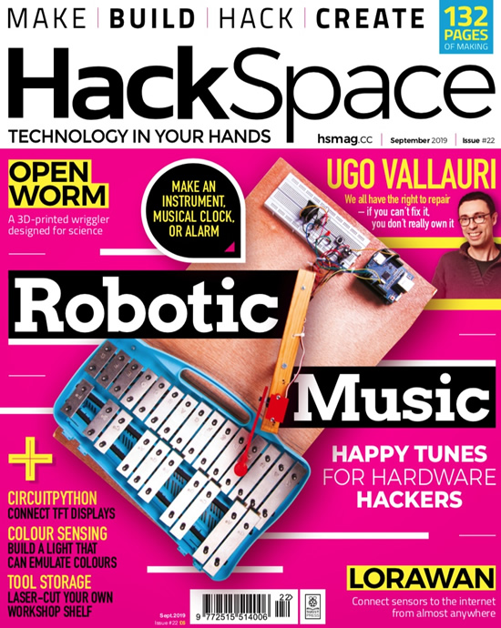](https://hackspace.raspberrypi.org/issues/22)

[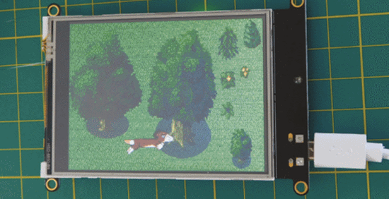](https://hackspace.raspberrypi.org/issues/22)

A couple great articles featuring CircuitPython on the lastest [HackSpace Issue 22](https://hackspace.raspberrypi.org/issues/22) & [PDF](https://magazines-static.raspberrypi.org/issues/full_pdfs/000/000/130/original/HackSpaceMagazine22.pdf?1566409699). Control a screen with CircuitPython and Graphical output for (almost) any board!

## CircuitPython stickers in every order!

We are including CircuitPython stickers in every order for as long as they last, this is part of the month long celebration which included, CircuitPython day! - [adafruit.com/free](https://www.adafruit.com/free)

## PyCon 2020 will be in Pittsburgh, PA!

After 2 successful years in Cleveland, OH, PyCon 2020 and PyCon 2021 will be 
moving to Pittsburgh, PA! April 15 to 2rd, 2020 - [PyCon 2020](https://us.pycon.org/2020/).

## TI-83 Premium CE 5.3.6+ blocks third party firmware TI-Python

Looks like the formerly CircuitPython-powered TI calc is blocking 3rd party firmware now. It was first a fork of CircuitPython, then the name was changed, now we're not sure exactly what is going on with using 3rd party firmware, more details on [TI-Planet](https://tiplanet.org/forum/viewtopic.php?t=22900&p=244748&utm_source=dlvr.it&utm_medium=twitter#p244748). Previous coverage and more here - [Adafruit](https://blog.adafruit.com/?s=ti-83).

## What are Bryan, Dan, and Melissa up to?

>_"Bryan wrote the CircuitPython driver for the MSA301 low cost 3-axis accelerometer, and wrote the guide to go along with it. Afterwards he assembled and started the process of testing prototypes of the TLV493 board designed by Kattni."_

>_"Dan debugged BLE on the new Circuit Playground Bluefruit, and it's now working fine. He's gotten BLE HID (Keyboard) working from CircuitPython, sending keystrokes over BLE to Linux, Windows, MacOS, and Android, and is still debugging iOS support."_

>_"Melissa finished up adding a CircuitPython Display Quickstart section to the last [three](
https://learn.adafruit.com/1-8-tft-display/circuitpython-displayio-quickstart-2) [display](
https://learn.adafruit.com/adafruit-1-44-color-tft-with-micro-sd-socket/circuitpython-displayio-quickstart) [guides](https://learn.adafruit.com/adafruit-mini-tft-0-dot-96-inch-180x60-breakout/circuitpython-displayio-quickstart). After that Melissa [wrote a guide for controlling an RGB Message Panel from a Stream Deck](https://learn.adafruit.com/stream-deck-controlled-rgb-message-panel-using-adafruit-io/). This guide includes the first design done in Fusion 360."_

## Infineon launches OPTIGA Trust M … and a new from Adafruit! STEMMA QT / Qwiic

Adafruit Infineon Trust M Breakout Board – STEMMA QT / Qwiic. This is a STEMMA I2C breakout for the Infineon OPTIGA TRUST M SLS 32AIA. OPTIGA Trust M is the next generation of Trust X. OPTIGA Trust M brings RSA 1K/2K + ECC256/384. A crypto authentication chip much like the ATECC608 STEMMA we put into the shop last week, but with: ECC NIST P256/P384, SHA-256, TRNG, DRNG, RSA® 1024/2048 and 4.5K of user memory. This chip can store your private keys securely, as well as generate true random numbers - [Adafruit](https://blog.adafruit.com/2019/08/20/infineon-launches-optiga-trust-m-and-a-new-from-adafruit-stemma-qt-qwiic-infineon-infineon-adafruit-stemma/) & [Infineon](https://www.infineon.com/cms/en/about-infineon/press/market-news/2019/INFDSS201908-094.html).

## News from around the web!

MAKE is back, and posting on the MAKE blog again, here is MAKE's post about the latest CircuitPython (and more) device, Monster M4sk - [MAKE](https://makezine.com/2019/08/19/adafruit-releases-the-monster-m4sk-for-your-digital-eyeball-needs/). This quote is the best :)

>_"It is important to reiterate, in case you missed it in the list above… the nose is capacitive touch so you can boop it.  There’s also another cool feature of this board. You can snap it in the middle and connect both sides via a cable so that you can place the eyes further apart if they are part of your costume or suit."_

Dano's heart project.

The AD5245 digital potentiometer breakout from CedarGrove - [Twiter](https://twitter.com/CedarGroveMakr/status/1163318014214672384), and [GitHub](https://github.com/CedarGroveStudios/AD5245_Digital_Pot).

Actinius made this little helper for Icarus+other FEATHER boards with light, pressure, humidity, temperature and eCO2 - [Twitter](https://twitter.com/actinius_com/status/1164872944948011009).

Add remote communication and controls to your MicroPython project with Microhomie, a framework for the open Homie MQTT convention - [GitHub](https://github.com/microhomie/microhomie). Thanks Rafael!

Curated list of resources relating to the WebHID (Human Interface Device) API - [GitHub](https://github.com/robatwilliams/awesome-webhid).

Here's a modified keyboard driver, the light under every key represents one CPython buildbot - [Twitter](https://twitter.com/pyblogsal/status/1164323739821101056).

One-Click Online IDE for GitHub - [Gitpod](https://www.gitpod.io/).

The USB armory from Inverse Path is an open source hardware design, implementing a flash drive sized computer - [USB armory Mk II](https://inversepath.com/usbarmory).

Announcing the general availability of Python support in Azure Functions - [Microsoft Azure](https://azure.microsoft.com/en-us/blog/announcing-the-general-availability-of-python-support-in-azure-functions/).

A Python project in 30 lines of code: how to set up an SMS notification when your favorite Twitcher is streaming - [FreeCodeCamp](https://www.freecodecamp.org/news/20-lines-of-python-code-get-notified-by-sms-when-your-favorite-team-scores-a-goal/).

pyforest - lazy-import of all popular Python Data Science libraries - [GitHub](https://github.com/8080labs/pyforest).

The Python Software Foundation is featured as a charity for the Humble Bundle by No Starch. The bundle will run until September 2nd 11am Pacific - [humblebundle](https://www.humblebundle.com/books/python-programming-no-starch-books).

Build and share AI models - [maixhub.com](https://www.maixhub.com/)

2019 FIRST Lego League project for CO2 detector wearable for astronauts - [GitHub](https://github.com/rodoggyro/circuit-playground-co2-detector).

GigaDevice Releases GD32V RISC-V MCU and Development Boards, might be one that has USB... [CNX](https://www.cnx-software.com/2019/08/23/gigadevice-gd32v-risc-v-mcu-development-board/).

Western Digital's Long Trip from Open Standards to Open Source Chips - [DataCenter Knowledge](https://www.datacenterknowledge.com/open-source/western-digitals-long-trip-open-standards-open-source-chips).

Tod made a really cool NeoPixel tester - [YouTube](https://youtu.be/KODPj4VacQQ) via [Twitter](https://twitter.com/todbot/status/1164345907371921408), and [GitHub](https://github.com/todbot/NeopixelTester).

Running TensorFlow Lite for Micro-controllers on the Nordic nRF52840 - [hackster.io](https://blog.hackster.io/tensorflow-on-the-nordic-nrf52840-ed9f03326a23)

LoRa / LoRaWAN + TTN for MicroPython (ESP32) - [GitHub](https://github.com/fantasticdonkey/uLoRa).

[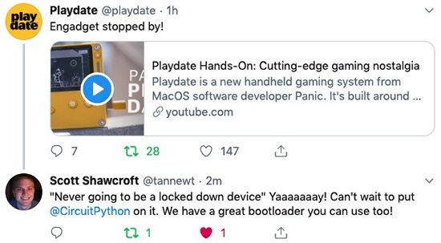](https://youtu.be/02SnCU6kRC4)

Engadget's video all about the Playdate - [YouTube](https://youtu.be/02SnCU6kRC4). Scott noticed this specific excellent part :)

>_"Playdate is a new handheld gaming system from MacOS software developer Panic. It's built around two concents. If you purchase the system, a new game will appear on it every Monday for 12 weeks, and it has a unique control scheme:  a small crank. The Playdate is also a designed to be an open system, Panic will continue to develop and sell games, but anyone can produce and even sell software for the Playdate."_

What is Python? - [Opensource.com](https://opensource.com/resources/python)

How to Build Good Software - [Civil Service College Singapore](https://www.csc.gov.sg/articles/how-to-build-good-software).

[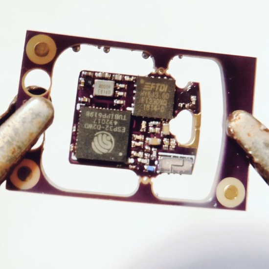](https://twitter.com/femtoduino/status/1165501246733570049?s=19)

Look at this super tiny USB ESP32! - [Twitter](https://twitter.com/femtoduino/status/1165501246733570049?s=19).

TinyGM is a small Arduino library for GSM modules, that just works - [GitHub](https://github.com/vshymanskyy/TinyGSM).

[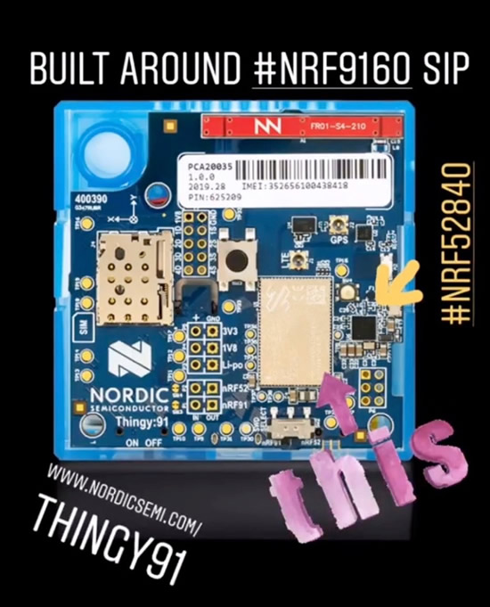](https://www.nordicsemi.com/Software-and-Tools/Prototyping-platforms/Nordic-Thingy-91)

Nordic Thingy:91, Cellular IoT Prototyping platform, multi-sensor cellular IoT prototyping platform - [Nordic](https://www.nordicsemi.com/Software-and-Tools/Prototyping-platforms/Nordic-Thingy-91).

Dashblock can make a JSON feed / API out of almost any site, does not work with everything we tried, but works on many sites - [Dashblock](https://dashblock.com/).

Announcing nRF Connect 2.0 for iOS - [Nordic](https://devzone.nordicsemi.com/nordic/nordic-blog/b/blog/posts/announcing-nrf-connect-2-0-for-ios).

A new chapter in the Bitosphere, Ayah Bdeir [leaves littleBits, acquired by Sphero](https://medium.com/@ayahbdeir/a-new-chapter-in-the-bitosphere-41d02f8cf5f7).

IBM is moving OpenPower Foundation to The Linux Foundation - [TechCrunch](https://techcrunch.com/2019/08/20/ibm-is-moving-openpower-foundation-to-the-linux-foundation/).

This is pretty cool, looks like there might be some MicroPython support for some of the Adafruit SAMD based boards - [GitHub](https://github.com/micropython/micropython/tree/master/ports/samd/boards).

Banned C standard library functions in Git source code - [GitHub](https://github.com/git/git/blob/master/banned.h).

#ICYDNCI What was the most popular, most clicked link, in [last week's newsletter](https://www.adafruitdaily.com/2019/08/20/consumers-should-immediately-python-the-circuit-python-adafruit-circuitpython-pythonhardware-circuitpython-micropython-thepsf-adafruit/)? [Adversarial Fashion](https://adversarialfashion.com/collections/all).

CircuitPython Weekly August 26th, 2019 [on YouTube](https://youtu.be/_XMLClEF7yQ)

PyDev of the Week: Frank Wiles on [Mouse vs Python](https://www.blog.pythonlibrary.org/2019/08/26/pydev-of-the-week-frank-wiles/)

## Made with Mu, Build a Raspberry Pi music box ft. Dr Sally Le Page

Connecting buttons to the GPIO pins of your Raspberry Pi instantly opens up your digital making to the world of clicky funtimes, made with Mu, in Python, for the Raspberry Pi - [YouTube](https://www.youtube.com/watch?v=2izvSzQWYak).

Why Mu? Mu tries to make it as easy as possible to get started with programming but aims to help you graduate to "real" development tools soon after. Everything in Mu is the "real thing" but presented in as simple and obvious way possible. It's like the toddling stage in learning to walk: you're finding your feet and once you're confident, you should move on and explore! Put simply, Mu aims to foster autonomy. Try out Mu today! - [codewith.mu](https://codewith.mu/)

## Coming soon

[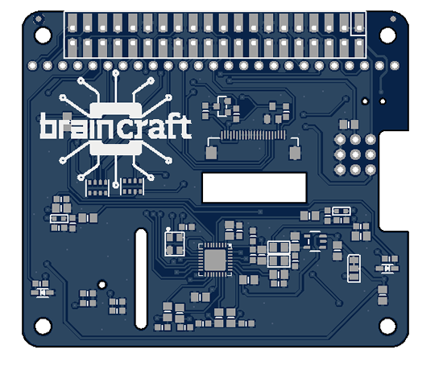](https://blog.adafruit.com/2019/08/24/first-look-at-the-braincraft-hat-for-raspberry-pi-and-single-board-linux-computers-adafruit-raspberry_pi-tensorflow-machinelearning-tinyml-raspberrypi/)

BrainCraft Machine Learning on the Edge board for Raspberry Pi and Linux SBC.

[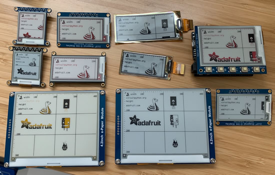](https://www.adafruit.com/new)

E-ink!

From the desk of Bryan, lots of [STEMMAs](https://www.adafruit.com/?q=stemma)!

Wow did you hear about that new sequel coming out? No, no, not The Matrix 4 – its the Art of Electronics X Chapters! More delicious, practical electronic advice from the masters in Cambridge. We now have a release date of March 2020 – and we’ll be counting the days with our flip-flop binary counter! - [Art electronics x chapters | Electronics for physicists | Cambridge University Press](https://www.cambridge.org/us/academic/subjects/physics/electronics-physicists/art-electronics-x-chapters?format=HB).

[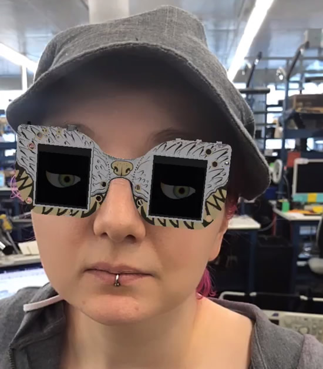](https://sparkar.facebook.com/ar-studio/)

We are using sparkar to make some CircuitPython powered camera filters for Instagram!

[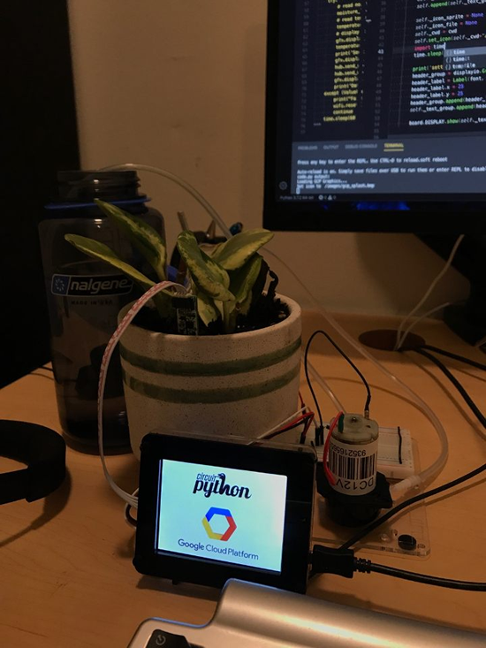](https://learn.adafruit.com)

[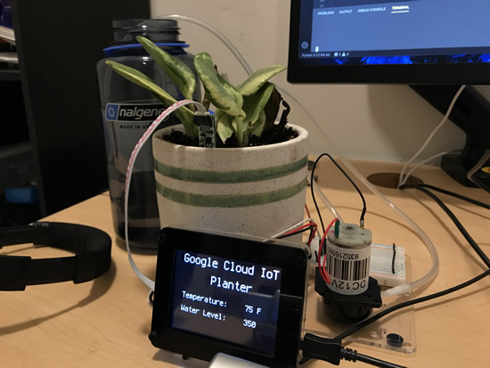](https://learn.adafruit.com)

CircuitPython on the Google Cloud...

More progress with the Orbit reader and a Python REPL - [Twitter](https://twitter.com/adafruit/status/1166089850031939584).

## New Learn Guides!

[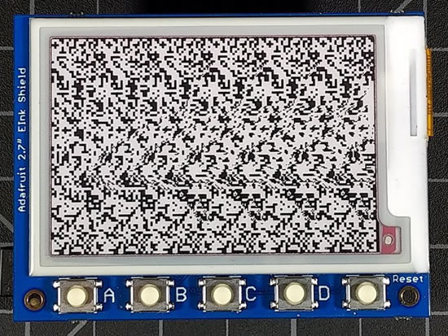](https://learn.adafruit.com/tiny-autostereogram-construction-kit)

[Tiny Autostereogram Construction Kit](https://learn.adafruit.com/tiny-autostereogram-construction-kit) from [Dan Cogliano](https://learn.adafruit.com/users/cogliano)

[Improve Your Code with Pylint](https://learn.adafruit.com/improve-your-code-with-pylint) from [Kattni](https://learn.adafruit.com/users/kattni)

[Adafruit MSA301 Triple Axis Accelerometer](https://learn.adafruit.com/msa301-triple-axis-accelerometer) from [Bryan Siepart](https://learn.adafruit.com/users/siddacious)

## Updated Guides - Now With More Python!

**You can use CircuitPython libraries on Raspberry Pi!** We're updating all of our CircuitPython guides to show how to wire up sensors to your Raspberry Pi, and load the necessary CircuitPython libraries to get going using them with Python. We'll be including the updates here so you can easily keep track of which sensors are ready to go. Check it out!

Keep checking back for more updated guides!

## CircuitPython Libraries!

CircuitPython support for hardware continues to grow. We are adding support for new sensors and breakouts all the time, as well as improving on the drivers we already have. As we add more libraries and update current ones, you can keep up with all the changes right here!

For the latest drivers, download the [Adafruit CircuitPython Library Bundle](https://github.com/adafruit/Adafruit_CircuitPython_Bundle/releases/latest).

If you'd like to contribute, CircuitPython libraries are a great place to start. Have an idea for a new driver? File an issue on [CircuitPython](https://github.com/adafruit/circuitpython/issues)! Interested in helping with current libraries? Check out [this GitHub issue on CircuitPython](https://github.com/adafruit/circuitpython/issues/1246) for an overview of the State of the CircuitPython Libraries, updated each week. We've included open issues from the library issue lists, and details about repo-level issues that need to be addressed. We have a guide on [contributing to CircuitPython with Git and Github](https://learn.adafruit.com/contribute-to-circuitpython-with-git-and-github) if you need help getting started. You can also find us in the #circuitpython channel on the [Adafruit Discord](https://adafru.it/discord). Feel free to contact Kattni (@kattni) with any questions.

You can check out this [list of all the CircuitPython libraries and drivers available](https://github.com/adafruit/Adafruit_CircuitPython_Bundle/blob/master/circuitpython_library_list.md). 

The current number of CircuitPython libraries is **176**!

**New Libraries!**

Here's this week's new CircuitPython libraries:

 * [Adafruit_CircuitPython_binascii](https://github.com/adafruit/Adafruit_CircuitPython_binascii)
 * [Adafruit_CircuitPython_hashlib](https://github.com/adafruit/Adafruit_CircuitPython_hashlib)
 * [Adafruit_CircuitPython_RSA](https://github.com/adafruit/Adafruit_CircuitPython_RSA)
 * [Adafruit_CircuitPython_JWT](https://github.com/adafruit/Adafruit_CircuitPython_JWT)
 * [Adafruit_CircuitPython_NTP](https://github.com/adafruit/Adafruit_CircuitPython_NTP)
 * [Adafruit_CircuitPython_MSA301](https://github.com/adafruit/Adafruit_CircuitPython_MSA301)

**Updated Libraries!**

Here's this week's updated CircuitPython libraries:

 * [Adafruit_CircuitPython_framebuf](https://github.com/adafruit/Adafruit_CircuitPython_framebuf)
 * [Adafruit_CircuitPython_Display_Text](https://github.com/adafruit/Adafruit_CircuitPython_Display_Text)
 * [Adafruit_CircuitPython_IterTools](https://github.com/adafruit/Adafruit_CircuitPython_IterTools)
 * [Adafruit_CircuitPython_seesaw](https://github.com/adafruit/Adafruit_CircuitPython_seesaw)
 * [Adafruit_CircuitPython_SI7021](https://github.com/adafruit/Adafruit_CircuitPython_SI7021)
 * [Adafruit_CircuitPython_ESP32SPI](https://github.com/adafruit/Adafruit_CircuitPython_ESP32SPI)
 * [Adafruit_CircuitPython_BusDevice](https://github.com/adafruit/Adafruit_CircuitPython_BusDevice)
 * [Adafruit_CircuitPython_ADS1x15](https://github.com/adafruit/Adafruit_CircuitPython_ADS1x15)
 * [Adafruit_CircuitPython_TCS34725](https://github.com/adafruit/Adafruit_CircuitPython_TCS34725)
 * [Adafruit_CircuitPython_BNO055](https://github.com/adafruit/Adafruit_CircuitPython_BNO055)
 * [Adafruit_CircuitPython_ADT7410](https://github.com/adafruit/Adafruit_CircuitPython_ADT7410)
 * [Adafruit_CircuitPython_MCP9808](https://github.com/adafruit/Adafruit_CircuitPython_MCP9808)
 * [Adafruit_CircuitPython_FRAM](https://github.com/adafruit/Adafruit_CircuitPython_FRAM)
 * [Adafruit_CircuitPython_MLX90393](https://github.com/adafruit/Adafruit_CircuitPython_MLX90393)
 * [Adafruit_CircuitPython_TMP007](https://github.com/adafruit/Adafruit_CircuitPython_TMP007)
 * [Adafruit_CircuitPython_CCS811](https://github.com/adafruit/Adafruit_CircuitPython_CCS811)
 * [Adafruit_CircuitPython_TMP006](https://github.com/adafruit/Adafruit_CircuitPython_TMP006)
 * [Adafruit_CircuitPython_LSM9DS1](https://github.com/adafruit/Adafruit_CircuitPython_LSM9DS1)
 * [Adafruit_CircuitPython_TSL2561](https://github.com/adafruit/Adafruit_CircuitPython_TSL2561)
 * [Adafruit_CircuitPython_TSL2591](https://github.com/adafruit/Adafruit_CircuitPython_TSL2591)
 * [Adafruit_CircuitPython_FXAS21002C](https://github.com/adafruit/Adafruit_CircuitPython_FXAS21002C)
 * [Adafruit_CircuitPython_FXOS8700](https://github.com/adafruit/Adafruit_CircuitPython_FXOS8700)
 * [Adafruit_CircuitPython_Register](https://github.com/adafruit/Adafruit_CircuitPython_Register)
 * [Adafruit_CircuitPython_CAP1188](https://github.com/adafruit/Adafruit_CircuitPython_CAP1188)
 * [Adafruit_CircuitPython_DRV2605](https://github.com/adafruit/Adafruit_CircuitPython_DRV2605)
 * [Adafruit_CircuitPython_MPR121](https://github.com/adafruit/Adafruit_CircuitPython_MPR121)
 * [Adafruit_CircuitPython_MPL3115A2](https://github.com/adafruit/Adafruit_CircuitPython_MPL3115A2)
 * [Adafruit_CircuitPython_VCNL4010](https://github.com/adafruit/Adafruit_CircuitPython_VCNL4010)
 * [Adafruit_CircuitPython_MMA8451](https://github.com/adafruit/Adafruit_CircuitPython_MMA8451)
 * [Adafruit_CircuitPython_VEML6075](https://github.com/adafruit/Adafruit_CircuitPython_VEML6075)
 * [Adafruit_CircuitPython_VL6180X](https://github.com/adafruit/Adafruit_CircuitPython_VL6180X)
 * [Adafruit_CircuitPython_LSM303](https://github.com/adafruit/Adafruit_CircuitPython_LSM303)
 * [Adafruit_CircuitPython_MLX90614](https://github.com/adafruit/Adafruit_CircuitPython_MLX90614)
 * [Adafruit_CircuitPython_MiniMQTT](https://github.com/adafruit/Adafruit_CircuitPython_MiniMQTT)
 * [Adafruit_CircuitPython_AdafruitIO](https://github.com/adafruit/Adafruit_CircuitPython_AdafruitIO)

**PyPI Download Stats!**

We've written a special library called Adafruit Blinka that makes it possible to use CircuitPython Libraries on [Raspberry Pi and other compatible single-board computers](https://learn.adafruit.com/circuitpython-on-raspberrypi-linux/). Adafruit Blinka and all the CircuitPython libraries have been deployed to PyPI for super simple installation on Linux! Here are the top 10 CircuitPython libraries downloaded from PyPI in the last week, including the total downloads for those libraries:

| Library                                     | Last Week   | Total |   
|:-------                                     |:--------:   |:-----:|   
| Adafruit-Blinka                             | 1863        | 45196 |   
| Adafruit_CircuitPython_BusDevice            | 1361        | 19890 |   
| Adafruit_CircuitPython_MCP230xx             | 331         | 5566 |    
| Adafruit_CircuitPython_Register             | 220         | 7570 |    
| Adafruit_CircuitPython_ADS1x15              | 193         | 2740 |    
| Adafruit_CircuitPython_NeoPixel             | 170         | 6389 |    
| Adafruit_CircuitPython_seesaw               | 144         | 2021 |    
| Adafruit_CircuitPython_ESP32SPI             | 141         | 1653 |    
| Adafruit_CircuitPython_ServoKit             | 125         | 3703 |    
| Adafruit_CircuitPython_Motor                | 112         | 5264 |    

## Upcoming events!

PYCON UK 2019 - Cardiff City Hall, Friday 13th to Tuesday 17th September. PyCon UK is back at Cardiff City Hall, for five days of talks, workshops and collaboration. The conference also features a young coders' day, themes dedicated to science and education, and numerous Python-related events - [PyCon UK](https://2019.pyconuk.org/).

[October is Open Hardware Month @ Open Source Hardware Association](https://www.oshwa.org/2019/07/26/october-is-open-hardware-month-2/).

>_"October is Open Hardware Month! Check out the [Open Hardware Month website](http://ohm.oshwa.org/). Host an event, find a local event, or [certify](https://certification.oshwa.org/) your hardware to support Open Source Hardware. We are providing resources and asking you, the community, to host small, local events in the name of open source hardware. Tell us about your October event by f[illing out the form below](https://docs.google.com/forms/d/e/1FAIpQLSfjvJmcRXbpgjRACgY_BbaDzQZRa6wxEcP-xwaBpC0X6mvsPw/viewform). Your event will be featured on [OSHWA’s Open Hardware Month page](http://ohm.oshwa.org/) (provided you have followed OSHWA’s rules listed on the [“Do’s and Don’ts”](http://ohm.oshwa.org/dos-and-donts/) page)."_

[Read more](https://www.oshwa.org/2019/07/26/october-is-open-hardware-month-2/), [Tweet for speakers in 2020](https://twitter.com/ohsummit/status/1154881782677831680), and Open Hardware Month @ [http://ohm.oshwa.org/](http://ohm.oshwa.org/)

micro:bit Live 2019 is coming to BBC MediaCityUK, Greater Manchester, England on October 4-5. This will be the very first annual gathering of the global micro:bit community of educators and partners - [micro:bit](https://microbit.org/en/2019-04-12-microbit-live/).

PyCon DE & PyData Berlin // October 9 - 13 2019. Main conference, 3 days of talks and workshops
More than 100 sessions dedicated to PyData (artificial intelligence, machine learning, ethics...) and Python topics (programming, DevOps, Web, Django...) - [de.pycon.org](https://de.pycon.org/).

Hackaday Superconference is November 15th, 16th, and 17th in Pasadena CA. The Hackaday Superconference is returning for another 3 full days of technical talks, badge hacking, and hands-on workshops: [Eventbrite](https://www.eventbrite.com/e/hackaday-superconference-2019-tickets-60129236164?aff=0626com
) & [hackaday.io](https://hackaday.io/superconference/)

## Latest releases

CircuitPython's stable release is [4.1.0](https://github.com/adafruit/circuitpython/releases/latest). New to CircuitPython? Start with our [Welcome to CircuitPython Guide](https://learn.adafruit.com/welcome-to-circuitpython).

[20190824](https://github.com/adafruit/Adafruit_CircuitPython_Bundle/releases/latest) is the latest CircuitPython library bundle.

[v1.11](https://micropython.org/download) is the latest MicroPython release. Documentation for it is [here](http://docs.micropython.org/en/latest/pyboard/).

[3.7.4](https://www.python.org/downloads/) is the latest Python release. The latest pre-release version is [3.8.0b3](https://www.python.org/download/pre-releases/).

[1361 Stars](https://github.com/adafruit/circuitpython/stargazers) Like CircuitPython? [Star it on GitHub!](https://github.com/adafruit/circuitpython)

## Call for help – CircuitPython messaging to other languages!

We [recently posted on the Adafruit blog](https://blog.adafruit.com/2018/08/15/help-bring-circuitpython-messaging-to-other-languages-circuitpython/) about bringing CircuitPython messaging to other languages, one of the exciting features of CircuitPython 4.x is translated control and error messages. Native language messages will help non-native English speakers understand what is happening in CircuitPython even though the Python keywords and APIs will still be in English. If you would like to help, [please post](https://github.com/adafruit/circuitpython/issues/1098) to the main issue on GitHub and join us on [Discord](https://adafru.it/discord).

We made this graphic with translated text, we could use your help with that to make sure we got the text right, please check out the text in the image – if there is anything we did not get correct, please let us know. Dan sent me this [handy site too](http://helloworldcollection.de/#Human).

## jobs.adafruit.com - Find a dream job, find great candidates!

[jobs.adafruit.com](https://jobs.adafruit.com/) has returned and folks are posting their skills (including CircuitPython) and companies are looking for talented makers to join their companies - from Digi-Key, to Hackaday, Microcenter, Raspberry Pi and more.

Job of the week, [Editorial Assistant - micro:mag](https://jobs.adafruit.com/job/editorial-assistant/)!

>_"micro:mag is the unofficial micro:bit community magazine written by the community and managed by a small but mighty team of dedicated community volunteers. Our free digital magazine is read by thousands of people all around the world by a variety of people from all ages and backgrounds. We currently release a new issue every 3 months. We are committed volunteers who strive to create the best magazine we can for the community. We’re a friendly group of people who are dedicated to what we do, and we hope this is something the community can see. We volunteer anywhere between 3 hours or more a week making sure that the magazine runs smoothly. We all have different backgrounds of experience, some of us are software developers and even some are Makerspace Directors, we all have something to “bring to the table”. As one of our editors, you will help with a number of editorial tasks. For example, editing articles when they’re submitted by contributors, checking for grammatical errors in the article, putting that article into a magazine format using Adobe InDesign as well as helping contributors with any questions they may have. You also get to review the latest and greatest micro:bit add-ons of which in most cases you get to keep to use in your own code clubs/workshops. Do note though, to apply for this role you must be a commited member of the team."_

## 13,758 thanks!

The Adafruit Discord community, where we do all our CircuitPython development in the open, reached over 13,758 humans, thank you! Join today! [https://adafru.it/discord](https://adafru.it/discord)

Discord now offers "server boosts" we have 12 on our server (level 2), if we get to 50 boosts we get to level 3 and some other good features for the community: +100 emojis for a total of 250, 384 Kbps audio, vanity URL, 100 mb uploads for all members (and all the things we have now, like the server banner). Stop by and boost! [https://adafru.it/discord](https://adafru.it/discord).

## ICYMI - In case you missed it

The wonderful world of Python on hardware! This is our first video-newsletter-podcast that we’ve started! The news comes from the Python community, Discord, Adafruit communities and more. It’s part of the weekly newsletter, then we have a segment on ASK an ENGINEER and this is the video slice from that! The complete Python on Hardware weekly VideoCast [playlist is here](https://www.youtube.com/playlist?list=PLjF7R1fz_OOXRMjM7Sm0J2Xt6H81TdDev). 

This video podcast is on [iTunes](https://itunes.apple.com/us/podcast/python-on-hardware/id1451685192?mt=2), [YouTube](https://www.youtube.com/playlist?list=PLjF7R1fz_OOXRMjM7Sm0J2Xt6H81TdDev), [IGTV (Instagram TV](https://www.instagram.com/adafruit/channel/)), and [XML](https://itunes.apple.com/us/podcast/python-on-hardware/id1451685192?mt=2).

[Weekly community chat on Adafruit Discord server CircuitPython channel - Audio / Podcast edition](https://itunes.apple.com/us/podcast/circuitpython-weekly-meeting/id1451685016) - Audio from the Discord chat space for CircuitPython, meetings are usually Mondays at 2pm ET, this is the audio version on [iTunes](https://itunes.apple.com/us/podcast/circuitpython-weekly-meeting/id1451685016), Pocket Casts, [Spotify](https://adafru.it/spotify), and [XML feed](https://adafruit-podcasts.s3.amazonaws.com/circuitpython_weekly_meeting/audio-podcast.xml).

And lastly, we are working up a one-spot destination for all things podcast-able here - [podcasts.adafruit.com](https://podcasts.adafruit.com/)

## Codecademy "Learn Hardware Programming with CircuitPython"

Codecademy, an online interactive learning platform used by more than 45 million people, has teamed up with the leading manufacturer in STEAM electronics, Adafruit Industries, to create a coding course, "Learn Hardware Programming with CircuitPython". The course is now available in the [Codecademy catalog](https://www.codecademy.com/learn/learn-circuitpython?utm_source=adafruit&utm_medium=partners&utm_campaign=circuitplayground&utm_content=pythononhardwarenewsletter).

Python is a highly versatile, easy to learn programming language that a wide range of people, from visual effects artists in Hollywood to mission control at NASA, use to quickly solve problems. But you don’t need to be a rocket scientist to accomplish amazing things with it. This new course introduces programmers to Python by way of a microcontroller — CircuitPython — which is a Python-based programming language optimized for use on hardware.

CircuitPython’s hardware-ready design makes it easier than ever to program a variety of single-board computers, and this course gets you from no experience to working prototype faster than ever before. Codecademy’s interactive learning environment, combined with Adafruit's highly rated Circuit Playground Express, present aspiring hardware hackers with a never-before-seen opportunity to learn hardware programming seamlessly online.

Whether for those who are new to programming, or for those who want to expand their skill set to include physical computing, this course will have students getting familiar with Python and creating incredible projects along the way. By the end, students will have built their own bike lights, drum machine, and even a moisture detector that can tell when it's time to water a plant.

Visit Codecademy to access the [Learn Hardware Programming with CircuitPython](https://www.codecademy.com/learn/learn-circuitpython?utm_source=adafruit&utm_medium=partners&utm_campaign=circuitplayground&utm_content=pythononhardwarenewsletter) course and Adafruit to purchase a [Circuit Playground Express](https://www.adafruit.com/product/3333).

Codecademy has helped more than 45 million people around the world upgrade their careers with technology skills. The company’s online interactive learning platform is widely recognized for providing an accessible, flexible, and engaging experience for beginners and experienced programmers alike. Codecademy has raised a total of $43 million from investors including Union Square Ventures, Kleiner Perkins, Index Ventures, Thrive Capital, Naspers, Yuri Milner and Richard Branson, most recently raising its $30 million Series C in July 2016.

## Contribute!

The CircuitPython Weekly Newsletter is a CircuitPython community-run newsletter emailed every Tuesday. The complete [archives are here](https://www.adafruitdaily.com/category/circuitpython/). It highlights the latest CircuitPython related news from around the web including Python and MicroPython developments. To contribute, edit next week's draft [on GitHub](https://github.com/adafruit/circuitpython-weekly-newsletter/tree/gh-pages/_drafts) and [submit a pull request](https://help.github.com/articles/editing-files-in-your-repository/) with the changes. Join our [Discord](https://adafru.it/discord) or [post to the forum](https://forums.adafruit.com/viewforum.php?f=60) for any further questions.
