- [ ] For MB ... Link "View this email in your browser."

View this email in your browser.

## Happy Ada Lovelace Day!

Ada Lovelace Day (ALD) is October 8, 2019, it is an international celebration of the achievements of women in science, technology, engineering and maths (STEM). It aims to increase the profile of women in STEM and, in doing so, create new role models who will encourage more girls into STEM careers and support women already working in STEM - [findingada.com](https://findingada.com/).

## Thank you Mitsuharu Aoyama, CircuitPython book is out!

The [CircuitPython and Mu for beginners book with Circuit Playground Express in Japanese is out](https://ameblo.jp/steamtokyo/), and [the author](https://twitter.com/AoyamaProd) sent us these wonderful gifts, thank you!

## Lessons learned from building a custom CircuitPython board

[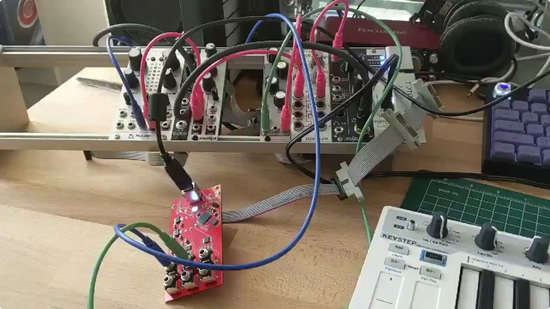](https://twitter.com/theavalkyrie/status/1180876283971944448)

[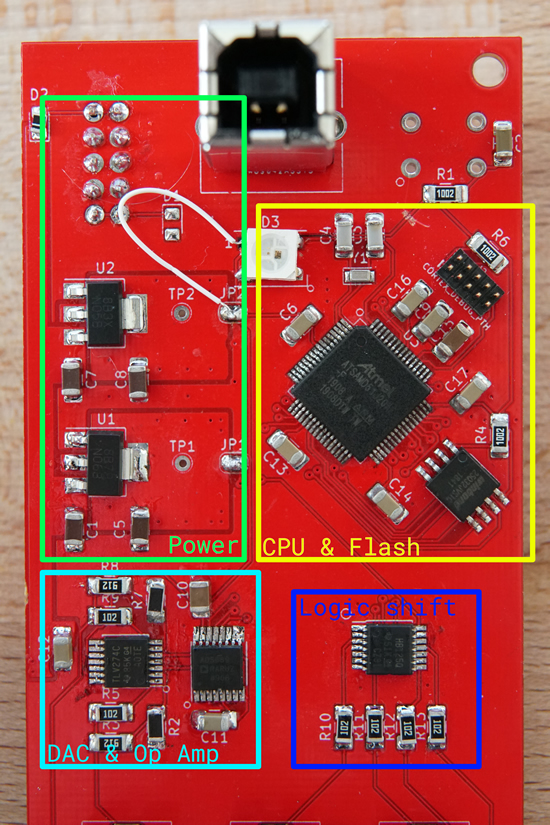](https://twitter.com/theavalkyrie/status/1180876283971944448)

From Thea Flowers [@theavalkyrie](https://twitter.com/theavalkyrie) ... Plug this in to your computer to send MIDI and it also shows the code, made with CircuitPython - [Twitter](https://twitter.com/theavalkyrie/status/1180876283971944448) and post about ["Lessons learned from building a custom CircuitPython board."](https://blog.thea.codes/lessons-learned-from-building-a-circuitpython-board/)

## Serpente slithers around the web...

[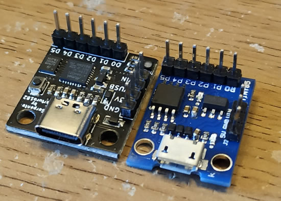](https://bigl.es/microcontroller-monday-serpente/)

CircuitPython slithers onto a new board, but this board looks a bit familiar! - [bigl.es](https://bigl.es/microcontroller-monday-serpente/)

## CircuitPython snakes its way to Python

Blinka and Raplh - [Twitter](https://twitter.com/airbornesurfer/status/1179433122036731904). CircuitPython snakes its way to Python, these headlines are writing themselves.

## 1,000 Thanks! Adafruit AR app featuring CircuitPython boards

We’ve hit over 1,000 downloads with our Adafruit AR app! We have over 1,000 downloads for our [Adafruit AR](https://apps.apple.com/us/app/adafruit-ar/id1375722584) app! HUZZAH! Now we'd like to give YOU 1000 thank you's for downloading the app. If you haven't already, what's stoppin' you. Be sure to download the [Adafruit AR app](https://apps.apple.com/us/app/adafruit-ar/id1375722584) only available on iOS mobile devices. Meet your virtual engineering assistant, Adabot right on your desktop, also view interactive overlays on real-life and much more! The Adafruit AR app is always evolving. Check out what we have coming up! - [Youtube](https://youtu.be/jXnIpY4yM3g).

## 10 Years of Programming Language Evolution, Python #1 spot

[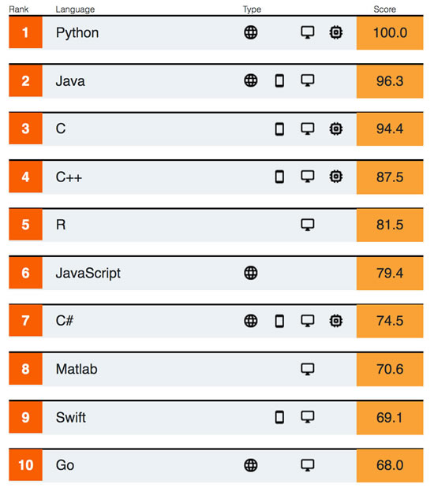](https://www.eetimes.com/document.asp?doc_id=1335168#)

[A bit of repost](https://www.eetimes.com/document.asp?doc_id=1335168#), but now with some more info and some Python on hardware...

>_"IEEE Spectrum released its annual ranking of program languages last month and many were surprised to see Python maintained its top spot. Python, a script-based language, has held the top spot in IEEE Spectrum’s ranking since 2017. That’s not the surprise. IEEE scores the languages using a weighted scale. Last year, Python had a score of 100, while C++ scored 99.7, Java scored 97.5, and C scored 96.7. This year, however, the landscape of languages changed. Python maintained its top spot with a score of 100, but Java came in second with a score of 96.3 — quite a fall. C came in third with 94.4, C++ slid all the way into fourth place with a score of 87.5, and statistical programming language R took the fifth spot with a score of 81.5. Spots 6-10 were taken by JavaScript, C#, MATLAB, Swift, and Google’s Go, in that order.... Python, Java, JavaScript, and C are versatile languages that keep them widely used. Speaking specifically to Python, there are many specialized libraries that support machine learning, deep learning (Theano), AI, and maker libraries for microcontrollers and tiny computers like Adafruit..."_

## EuroPython 2019 videos posted

From the [EuroPython 2019 Team](https://ep2019.europython.eu/) - In total, there are now have 133 videos available for you to watch. All EuroPython videos, including the ones from previous conferences, are available on our EuroPython [YouTube Channel](https://www.youtube.com/user/PythonItalia/videos).

Talks include: Radomir Dopieralski – [Game Development with CircuitPython](https://youtu.be/3lACaWE9h7M), Nicholas Tollervey – [Tools of the Trade: The Making of a Code Editor](https://youtu.be/US0L6rjXVcQ), Florian Wahl – [Building logistics applications with MicroPython and ESP32 MCUs](https://youtu.be/atmdimiU9Jc), and Ben Nuttall – Astro Pi: [Python on the International Space Station](https://youtu.be/MJePVWbu5g4).

## Feather takes flight with the Wio Lite RISC-V (GD32VF103) ESP8266 at Seeed Studio

[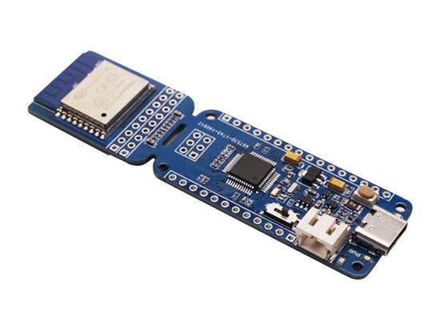](https://www.seeedstudio.com/Wio-Lite-RISC-V-GD32VF103-p-4293.html)

[Feather taking flight at Seeed](https://blog.adafruit.com/2019/10/03/feather-takes-flight-with-the-wio-lite-risc-v-gd32vf103-esp8266-at-seeed-studio-feather-seeedstudio-adafruit-riscv/)!

>_"Wio Lite W600 WiFi and Wio Lite MG126 Bluetooth, now the third brother of Wio Lite family is coming – Wio Lite RISC-V. Wio Lite RISC-V is a  feather form factor RISC-V development board Based on GD32VF103, with the onboard ESP8266 Wio Core, it also features WiFi function. GD32VF103CBT6 is a Bumblebee core based on Nuclei System Technology. Support RV32IMAC instruction set and ECLIC fast interrupt function. Core power consumption is only 1/3 of that of traditional Cortex-M3. Onboard ESP8266 WiFi core and Lipo charging circuit make it a perfect IoT control board. There is also a micro SD slot at the backside of this board, which can expand system resources. Meanwhile, as a Wio Lite Board, Wio Lite RISC-V definitely can work with the Grove Shield for Wio Lite. With this shield, over 200 Grove sensors, actuators and displays are all yours. For instance, you can choose whatever grove OLED you like to make it a visual development board."_

## Manufacturing Day 2019

Manufacturing Day 2019 was Oct 4th, 2019. [Here are our posts](https://blog.adafruit.com/?s=%23MFGDay19), and here are the [tagged Tweets #MFGDay19](https://twitter.com/hashtag/MFGDay19?src=hashtag_click&f=live) that came in all day. [Earlier we posted](https://blog.adafruit.com/2019/10/01/us-manufacturing-activity-drops-to-10-year-low-makerbusiness/) about some the national and internal trends along with how we're doing so far.

In the maker / electronics world, we’ve heard from friends and through the usual gossip some companies are down as much as 50% year over year to flat (same), to maybe 10% or so over last year. For Adafruit in September 2019 we ended up up +22.2% YoY, and up +3.1% more orders than last year at the same time. Another data point we wanted to add here: ADABOX is over 4,000+ subscribers, 1/3 of the original subscriber base has gotten every single one, over 172 have all 13 boxes out of the current 4k+ subs.

We’re 100% focused on getting new open-source hardware out, publishing open-source code, guides, videos, community efforts, and keeping popular items in stock and preparing for what may be an excellent holiday season. Thank you so much Adafruit team members, our community, our partners, and customers for being part of this adventure together with us. We remain VC-free, loan-free, open-source, woman-owned, and manufacturing in the USA. There will be challenges ahead for sure, we’re looking forward to navigating them together.

## Amanda “w0z” Wozniak on Embedded.fm

Humans Have a Terrible Spec Sheet Amanda “w0z” Wozniak was on the Embedded.fm and spoke about her career through biomedical engineering and startups, pictured here, all of us in apartment Adafruit in 2010....

>_"Amanda “w0z” Wozniak ([@kainzowa](https://twitter.com/kainzowa)) spoke with us about her career through biomedical engineering and startups. Amanda contributed a chapter to [Building Open Source Hardware: DIY Manufacturing](https://www.amazon.com/Building-Open-Source-Hardware-Manufacturing/dp/0321906047). (A book we spoke with Alicia Gibb about in #289.) Amanda’s chapter was titled Design Process: How to Get from Nothing to Something. For more information about the companies we discussed, check out [Amanda’s LinkedIn page](https://www.linkedin.com/in/avwozniak/)."_

[Read more](https://embedded.fm/episodes/305), and [listen!](http://traffic.libsyn.com/makingembeddedsystems/embedded-ep305.mp3?download=true)

*   Embedded.fm - [RSS](http://makingembeddedsystems.libsyn.com/rss).
*   Embedded.fm - [iTunes](https://podcasts.apple.com/us/podcast/embedded/id649204115).
*   Embedded.fm - [Spotify](https://open.spotify.com/show/301T4WKFfxXWSiYqUbJsUW?si=mxky_gbnRDmhDl76OYmjUg).
*   Embedded.fm - [libsyn](https://directory.libsyn.com/shows/view/id/makingembeddedsystems).

## Open-source hardware month is here!

October is [open-source hardware month](https://ohm.oshwa.org/)! Every single day in October we'll be posting up some open-source stories from the last decade (and more!) about open-source hardware, open-source software, and beyond! 

CircuitPython itself, in addition to all the CircuitPython boards, are open-source software and hardware.

Here are a few stories so far!

Open hardware summit – Limor “Ladyada” Fried keynote 2010 - [Youtube](https://youtu.be/Ca1dbM582Sc).

What is the Open-Source Hardware Definition? - [OSHWA.org](https://www.oshwa.org/definition/)

[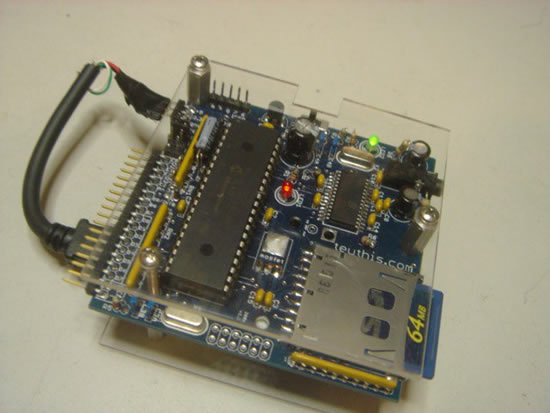](https://blog.adafruit.com/2019/10/03/teuthis-open-source-mp3-player-2001-daisy-by-raphael-abrams-adafruit-ohm2019-oshwa-ohsummit-opensource-opensourcehardware-opensourceorg-nycresistor/)

Teuthis Open Source MP3 Player 2001 – Daisy by Raphael Abrams - [Adafruit](https://blog.adafruit.com/2019/10/03/teuthis-open-source-mp3-player-2001-daisy-by-raphael-abrams-adafruit-ohm2019-oshwa-ohsummit-opensource-opensourcehardware-opensourceorg-nycresistor/).

Open Source Hardware Certifications and more! - [Adafruit](https://blog.adafruit.com/2019/10/04/open-source-hardware-certifications-and-more-adafruit-ohm2019-oshwa-ohsummit-opensource-opensourcehardware-opensourceorg-mweinberg2d-make-realsexycyborg/).

What is open source REALLY? It's a wine from New Jersey - [Adafruit](https://blog.adafruit.com/2019/10/06/the-open-source-logos-adafruit-ohm2019-oshwa-ohsummit-opensource-opensourcehardware-opensourceorg/).

Have an open-source hardware (or software) success story? A person, company, or project to celebrate? An open-source challenge? Email [opensource@adafruit.com](mailto:opensource@adafruit.com), we'll be looking for, and using the tag [#OHM2019](https://twitter.com/search?q=%23OHM2019&src=typed_query&f=live) online as well! Check out [all the events](https://ohm.oshwa.org/events/) going on here! [Follow along](https://blog.adafruit.com/?s=%23OHM2019) all month long.

## News from around the web!

Baby Groot sounds better with a Stemma Speaker added to its CPX. Simple project can be adapted to make anything conductive (plants, pumpkins) play sounds when touched, all with CircuitPython - [Twitter](https://twitter.com/gallaugher/status/1179459076582969344) & [GitHub](https://github.com/gallaugher/baby-groot).

[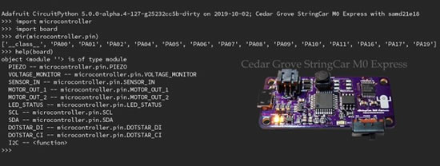](https://twitter.com/CedarGroveMakr/status/1179616576745533440)

String car is SO CLOSE! Board defs are done, PCB fixes in-place, all tests have passed - [Twitter](https://twitter.com/CedarGroveMakr/status/1179616576745533440).

[Emmy in the Key of Code](https://aimeelucido.com/books/) light up CircuitPython sign - [Instagram](https://www.instagram.com/p/B3MAb7OjLmv/?igshid=1ocr879q9qp96) & [Twitter](https://twitter.com/chardane/status/1178765084442550272).

This is a cute CPX based tomato friend - [Twitter](https://twitter.com/marijel_melo/status/1179910718029750272).

Look what came in the mail! Bryan's first OSH Park After Dark board. It's a keypad, uses CircuitPython - [Twitter](https://twitter.com/siddacious/status/1180656479566589954).

Day of the Dead photo frame - [Adafruit Forums](https://forums.adafruit.com/viewtopic.php?f=59&t=156998).

[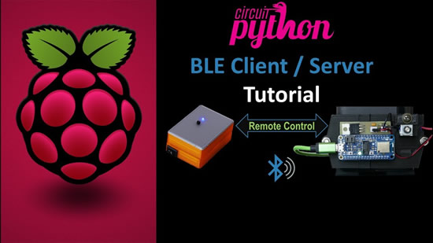](https://youtu.be/1J2wCvvjqDI)

This CircuitPython tutorial demonstrates how to build a battery powered Bluetooth BLE remote control to operate a BLE peripheral hosting a solenoid and a spectrally selective light detector, [guide](https://www.rototron.info/circuitpython-ble-client-server-tutorial/) and [YouTube](https://youtu.be/1J2wCvvjqDI).

Amie DD made a video of how she made a fog smoke armor for her Ursula pauldrons using a Gemma M0 and CircuitPython - [Twitter](https://twitter.com/amiedoubleD/status/1180203099148947456).

Code for the solder-free MakerSnack Python Smart Tie CircuitPython powered Circuit Playground Express Bluefruit is up - [pastebin](https://pastebin.com/KEfHiqW3), and [YouTube](https://youtu.be/gvryFFro9BU).

Maker Update: Glass Eye for the Spooky Guy [Maker Update #143] - [YouTube](https://youtu.be/DW09bSGNuHE).

Make Something Cool: Turning Poundland into tech, micro: bit lesson slides from Les - [Google Docs](https://docs.google.com/presentation/d/1ohHyhmmKU1eZ1MV-zvnTz4TcLXe1cEc5OEPL3PrhbBk/edit#slide=id.g3589c9c3ac_0_292).

[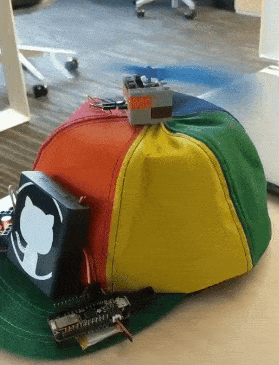](https://twitter.com/FrozenJava/status/1180149092103667718)

Looks like this FEATHER Bluefruit beanie will spin when code is commited - [Twitter](https://twitter.com/FrozenJava/status/1180149092103667718).

Hallowing M4 capacitive touch fang control + new behavior: rainbow - [Twitter](https://twitter.com/rjonsampson/status/1179957391779155968).

Connect a speaker and play football with a Circuit Playground Express powered by CircuitPython - [GitHub](https://github.com/itaparcade/100yardrunCPX).

CircuitPython SOM from [Kevin](https://twitter.com/kevinneubauer/status/1180589225671966721), [OSH Park](https://oshpark.com/shared_projects/bHQ2m2Tw) and [GitHub](https://github.com/neubauek/CircuitPythonSOM).

[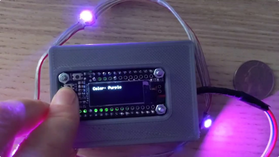](https://twitter.com/nnja/status/1180311165097795584)

Here is a sneak peak of a controller Nina building for a CircuitPython LED jacket. The OLED display will show the active pattern and three tiny buttons will let you switch between patterns & toggle brightness. Uses Feather M4 + oled wing + 2000mAh lioo battery - [Twitter](https://twitter.com/nnja/status/1180311165097795584).

Mfletcherchristian made his Dad a Mike Wazowski for an upcoming birthday - [Twitter](https://twitter.com/mfletcherchristian/status/1180225728173854720).

Cute bot made with CPX - [Twitter](https://twitter.com/bethany_jones4/status/1179832578657751040).

Monster M4Sk eye ball box is watching you - [Twitter](https://twitter.com/CVRscience7/status/1179437225882177536).

Unleash your smart-home devices: Vacuum Cleaning Robot Hacking Why is my vacuum as powerful as my smartphone? [Overview](https://media.ccc.de/v/34c3-9147-unleash_your_smart-home_devices_vacuum_cleaning_robot_hacking), and [GitHub](https://github.com/arne48/xiaomi_bridge).

GridEYE plus Monster M4SK, heat seeking eye movement - Forums, and [guide](https://factr.com/u/timothy-weber/halloween-skull).

Dark Crystal Fizzgig from Erin - [Twitter](https://twitter.com/firepixie/status/1180189233065021440).

From Allie, it is that time again!!! Full “maker challenge” rules on [Instagram @hackapumpkinchallenge](https://www.instagram.com/hackapumpkinchallenge/) or in the [YouTube description](https://youtu.be/Vpzrhx1q_vg). Prizes sponsored by Digi-Key - [Twitter](https://twitter.com/hashtag/HackAPumpkin?src=hashtag_click&f=live).

nRF Connect for iOS: What is a Bug-fix Release - [Nordic](https://devzone.nordicsemi.com/nordic/nordic-blog/b/blog/posts/nrf_2d00_connect_2d00_ios_2d00_2_2d00_0_2d00_3_2d00_what_2d00_is_2d00_a_2d00_bugfix_2d00_release).

PDF of the talk Guido van Rossum gave about MyPy at Dropbox - [PDF](https://www.dropbox.com/s/ogzcxccr7opzx03/MypyMTV2019.pdf?dl=0).

Picolibc Version 1.0 Released. PicoLibc is library offering standard C library APIs that targets small embedded systems with limited RAM. PicoLibc was formed by blending code from Newlib and AVR Libc - [GitHub](https://github.com/keith-packard/picolibc).

“AngelFace – Find Angels & VCs w/ Face Recognition” - [Product Hunt newsletter](https://www.producthunt.com/newsletter/3263?utm_campaign=3263_2019-09-30&utm_medium=email&utm_source=Product+Hunt).

MicroPython on the FEATHER STM32F405 - [GitHub](https://github.com/micropython/micropython/pull/5177).

IP lookup from favicon using Shodan - [GitHub](https://github.com/pielco11/fav-up).

Atmel SAM dev/platform 3.9.0 is out, includes some more Adafruit boards - [platform.io](https://community.platformio.org/t/atmel-sam-development-platform-3-9-0/9823)

[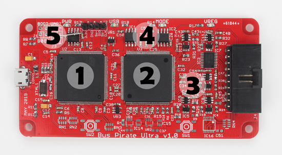](http://dangerousprototypes.com/blog/2019/10/03/prototype-bus-pirate-logic-analyzer-with-ice40-fpga/)

PROTOTYPE: Bus Pirate/Logic Analyzer with Ice40 FPGA - [Dangerous Prototypes](http://dangerousprototypes.com/blog/2019/10/03/prototype-bus-pirate-logic-analyzer-with-ice40-fpga/).

A generative clip-on cover for the CARD10 badge, modeled in OpenSCAD - [GitHub](https://github.com/royrobotiks/card10_cover).

Python 3.7.5rc1 is the release candidate preview of the fifth maintenance release of Python 3.7. The Python 3.7 series is the latest major release of the Python language and contains many new features and optimizations - [Python.org](https://www.python.org/downloads/release/python-375rc1/)

Using small TFT LCDs with Raspberry Pi, BeagleBone and orther Linux boards?  Ever wonder how that works? Then watch the Outreachy Internship Report by  Meghana Madhyastha at xdc2019 on refactoring backlight and spi helpers in tinydrm - [Youtube](https://www.youtube.com/watch?v=rV0P1ChE_5o&feature=youtu.be&t=28694), via [Twitter](https://twitter.com/pdp7/status/1180494122160939018).

Scraping Wikipedia content With 10 line of code by [Ankit](https://dev.to/ankitdobhal/wow-scraping-wikipedia-content-with-10-line-of-code-327l) - & [GitHub](https://gist.github.com/ankitdobhal/cc40a40cccd69bd646aaa06b7a05046e).

Runway and wirelessly using the Feather Huzzah board using a potentiometer to navigate BigGAN's latent space - [GitHub](https://github.com/runwayml/arduino/pull/1) via [Twitter](https://twitter.com/Berenger_r/status/1180070423083585536).

That Music You’re Dancing To? It’s Code. Collectives in cities around the world are bringing computer languages to the club - [NY Times](https://www.nytimes.com/2019/10/04/style/live-code-music.html?action=click&module=Features&pgtype=Homepage).

[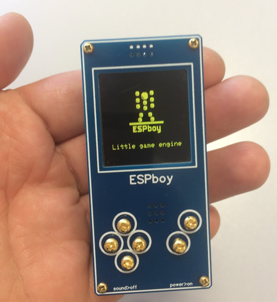](https://hackaday.io/project/164830-espboy-games-iot-stem-for-education-fun)

ESPboy: Games, IoT, STEM for education & fun. ESP8266, 80/160Mhz, 4/8Mb, WiFi, LCD 128х128, RGBled, HQspeaker, 8 buttons, 600mAh battery, 30x70х15mm - [Hackaday.io](https://hackaday.io/project/164830-espboy-games-iot-stem-for-education-fun)

[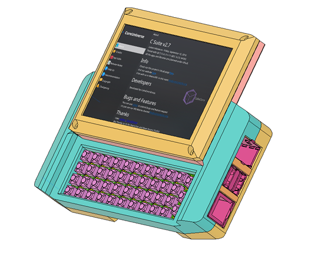](https://mutantc.gitlab.io/mutantc-handheld.html)

mutantC-Handheld - [mutantc.gitlab.io](https://mutantc.gitlab.io/mutantc-handheld.html)

Congrats to the MicroPython folks involved in getting cross-port low-level BLE support merged to mainline! Currently targets nRF5x, ESP32 and STM32 - [GitHub](https://github.com/micropython/micropython/pull/5051) via [Matt](https://twitter.com/matt_trentini/status/1178893586512797696).

Tweets and more from micro:bit LIVE! - [Twitter](https://twitter.com/hashtag/microbitLive?src=hashtag_click&f=live).

On Tuesday, October 8th, for the very first time ever, the new issue of 2600 will be released digitally in non-DRM PDF format - [2600](https://2600.com/content/message-our-readers).

_"I think everybody in this country should learn how to program a computer, learn a computer language. Because it teaches you how to think. I view computer science as a liberal art. It should be something that everybody learns."_ Steve Jobs, 1955-2011 via [Twitter](https://twitter.com/hadip/status/1180559108103004161).

How to Make a Simple Spiderbot for Halloween - [Instructables](https://www.instructables.com/id/How-to-Make-a-Simple-Spiderbot-for-Halloween/), and [YouTube](https://www.instructables.com/id/How-to-Make-a-Simple-Spiderbot-for-Halloween/).

Latest from adafruit.io, Adafruit IoT Monthly: The S in IoT is for Security, Amazon announces Sidewalk and more! - [adafruit.io](https://io.adafruit.com/blog/notebook/2019/10/04/iot-monthly/)

Balloon IoT Environmental Sensing Takes to the Air - [Rob Faludi](https://www.faludi.com/2019/10/01/balloon-iot-environmental-sensing-takes-to-the-air/).

Chip manufacturers are starting to mix their sensors with ML to get gesture recognition and motion tracking - [Adafruit](https://blog.adafruit.com/2019/10/01/chip-manufacturers-are-starting-to-mix-their-sensors-with-ml-to-get-gesture-recognition-and-motion-tracking-st_world-machinelearning/).

[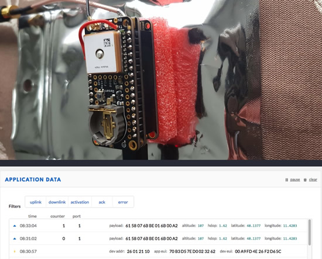](https://git.unixweb.net/jhummel/TTN-Mapper-GPS)

TTN-Mapper-GPS - [git.unixweb.net/jhummel/TTN-Mapper-GPS](https://git.unixweb.net/jhummel/TTN-Mapper-GPS)

“US manufacturing activity drops to 10-year low” - [Adafruit](https://blog.adafruit.com/2019/10/01/us-manufacturing-activity-drops-to-10-year-low-makerbusiness/).

QWIIC / STEMMA / STEMMA QT added to Pimoroni EAGLE - [GitHub](https://github.com/pimoroni/eagle/commit/57ff81a7fc5472b281c68626c98fe2f4412f7cf4).

TensorFlow 2.0.0 is here - [GitHub](https://github.com/tensorflow/tensorflow/releases/tag/v2.0.0).

TensorFlow 2.0 Tutorial 01: Basic Image Classification - [Lambda](https://lambdalabs.com/blog/tensorflow-2-0-tutorial-01-image-classification-basics/).

First part of a TensorFlow Lite object detection guide, it gives step-by-step instructions on how to train, convert, and run a TF Lite model - [GitHub](https://github.com/EdjeElectronics/TensorFlow-Lite-Object-Detection-on-Android-and-Raspberry-Pi).

[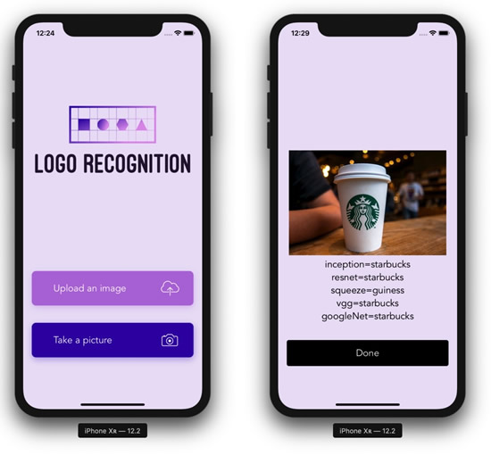](https://heartbeat.fritz.ai/logo-recognition-ios-application-using-machine-learning-and-flask-api-aec4eff3be11)

Logo Recognition iOS Application Using Machine Learning and Flask API. Comparing 5 popular neural net architectures on iOS: VGG16, ResNet50, InceptionV3, GoogleNet, and SqueezeNet using PyTorch - [heartbeat](https://heartbeat.fritz.ai/logo-recognition-ios-application-using-machine-learning-and-flask-api-aec4eff3be11).

More Supercon Talks Taking The Hardware World By Storm - [Hackaday](https://hackaday.com/2019/10/04/more-supercon-talks-taking-the-hardware-world-by-storm/). YAY, SOPHY!

Interview: Josef Prusa on makers, breaking records and avoiding 3D printing hype - [TCT Magazine](https://www.tctmagazine.com/3d-printing-news/pushing-prusa/). Say 130,000 sold, and about 6,000 a month now.

Embedded PCs scalable designs for casino gaming - [Embedded computing design](https://www.embedded-computing.com/guest-blogs/i-o-board-logic-box-enable-scalable-designs-for-casino-gaming). Always wondered about the hardware in all these...

[Hackster News](https://www.hackster.io/news) - Hackster.io has a new section [devoted to news](https://www.hackster.io/news). Here is the [ATOM feed](https://www.hackster.io/news.atom) and [they have a survey to fill out](https://www.surveymonkey.com/r/SR2NQYT), so tell'em the type of news ya wanna see there. This is good, there is a lot of news in the electronics / maker world that can use some help getting the spotlight on, voices amplified.

MyPyBuilder is a Drag-and-Drop GUI builder that wraps the tkinter library - [GitHub](https://github.com/TristenHarr/MyPyBuilder).

Here is a $4 WalMart Halloween decoration with an HalloWing M0 Express - [Twitter](https://twitter.com/acudmo/status/1179199368253059073).

RISC-V: Too Open to Succeed by Brandon Lewis - [Embdeed Design](https://www.embedded-computing.com/latest-blogs/risc-v-too-open-to-succeed). Oh c'mon, it's too early to say it's too open to do well.

Unsung Beauty of Analog Devices Datasheets - [neil.computer](https://neil.computer/notes/analog-devices-datasheets/)

TinyML meet ups are HAPPENING, there were two Meetups on September 26, one in the Bay Area, the other in Austin, TX. Links to the slides, and a video link for the Bay Area meeting - [tinymlsummit.org](https://www.tinymlsummit.org/#meetups)

Good feature for all devices, maybe. The $1,950.00 MARQ Premium GPS Smartwatch by GARMIN [has a kill switch that deletes all data](https://blog.adafruit.com/2019/10/04/the-1950-00-marq-premium-gps-smartwatch-by-garmin-has-a-kill-switch-that-deletes-all-data-garmin/).

A greeting cards company forces Banksy to open homeware store to keep trademark? - [Adafruit](https://blog.adafruit.com/2019/10/04/a-greeting-cards-company-forces-banksy-to-open-homeware-store-to-keep-trademark-banksy/). The Banksy quote sounds like running an open-source hardware company. See our previous coverage about the [MicroPython trademark in China](https://blog.adafruit.com/2019/10/05/micropython-trademark-in-china/).

>_"I  still encourage anyone to copy, borrow, steal and amend my art for amusement, academic research or activism. I just don’t want them to get sole custody of my name."_

Genuino getting removed from naming in Arduino - [GitHub](https://github.com/arduino/ArduinoCore-samd/commit/b0eb400803cadf9727ab38d5b1c2fb46ab8eeec9).

This is a 'first light' image from my 'new', third-hand microfocus X-Ray unit - Flickr.

[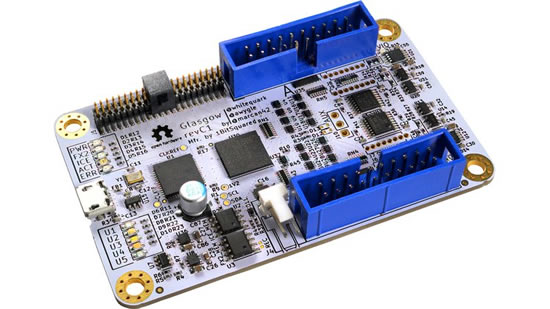](https://www.crowdsupply.com/1bitsquared/glasgow)

Glasgow Interface Explorer. A highly capable and extremely flexible open source multitool for digital electronics - [Crowd Supply](https://www.crowdsupply.com/1bitsquared/glasgow) & [GitHub](https://github.com/GlasgowEmbedded/Glasgow).

These retro designer electronics items for sale by robertom60 on eBay are gorgeous - [Adafruit](https://blog.adafruit.com/2019/10/05/these-retro-designer-electronics-items-for-sale-by-robertom60-on-ebay-are-gorgeous/).

Multi-line comments have arrived! You can now highlight multiple lines in a pull request diff and add a comment, all at once - [GitHub](https://twitter.com/github/status/1179101186437324801).

New workflow editor for GitHub Actions - [GitHub](https://github.blog/2019-10-01-new-workflow-editor-for-github-actions/).

NXP Launches the GHz Microcontroller Era - [NXP](https://media.nxp.com/news-releases/news-release-details/nxp-launches-ghz-microcontroller-era).

>_"NXP will demonstrate the new record CoreMark performance of the i.MX RT1170 MCU and showcase the recently launched i.MX RT1010 family at Arm TechCon 2019 in NXP’s booth #731. The i.MX RT1010 MCU family is a low-cost, high-performance crossover MCU priced at sub-$1 (USD). In addition, starting on 10/10/19, the MIMXRT1010-EVK will be available at a promotional price of $10.10 – for a limited time only."_ ...RT1010 is 80 lqfp, 500mhz and 128k ram.

We support the PSF by donating to help fund workshops, conferences & pay meetup fees. The PSF couldn't do its work without this kind of financial support. Consider [donating monthly](https://www.python.org/psf/donations/). Join us in supporting the PSF by [donating](https://www.python.org/psf/donations/).

[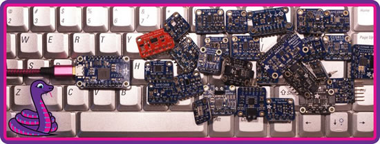](https://learn.adafruit.com/circuitpython-on-any-computer-with-ft232h/overiew)

#ICYDNCI What was the most popular, most clicked link, in [last week's newsletter](https://www.adafruitdaily.com/2019/10/01/circuitpython-on-any-computer-halloween-time-and-more-python-adafruit-circuitpython-pythonhardware-circuitpython-micropython-thepsf-adafruit/)? [CircuitPython Libraries on any Computer with FT232H: Powerful computers can now use the power of CircuitPython libraries.](https://learn.adafruit.com/circuitpython-on-any-computer-with-ft232h/overiew).

PyDev of the Week: Paul Ivanov - [Mouse vs Python](https://www.blog.pythonlibrary.org/2019/10/07/pydev-of-the-week-paul-ivanov/).

CircuitPython Weekly Meeting for October 7th, 2019 [on YouTube](https://youtu.be/rRzcnzzut9E).

## Coming soon

Testing Circuit Playground Bluefruit image transfer - we are tryin' out latest TestFlight of the Bluefruit Connect app - we've added a tool to transfer images from your phone or tablet. I can send an image from my photo roll or even take a lovely selfie to transmit. We did a lot of work to get images transferring at a nice speed. We'll release this soon so people can try it out with the TFT Gizmo + Circuit Playground bluefruit - [YouTube](https://youtu.be/m4YP_bH8ayA).

BrainCraft rev EDGE BADGE.

E-Ink Feather Friend, ThinkInk.

E-Ink Feather Friend, ThinkInk.

2.13" E-Ink, ThinkInk.

Back'o the [STM Feather](https://www.adafruit.com/product/4382).

[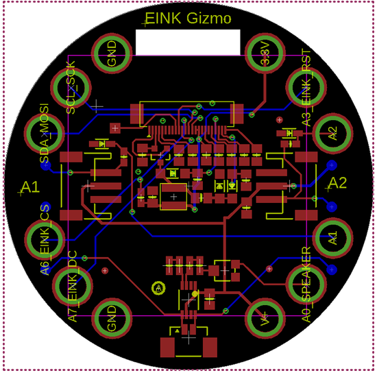](https://www.adafruit.com/new)

E-Ink ThinkInk Gizmo.

STEMMA Relay!

## New Learn Guides!

Make a horrific-yet-delicious Meat Skull Centerpiece for your next Halloween party! The MONSTER M4SK is our all-in-one, dual-display animated eyeball animation kit that you can easily use to bring this tasty decapitated head to life! The lenses and lens holders make those peepers really pop from their fleshy sockets - [learn.adafruit.com](https://learn.adafruit.com/meat-skull-centerpiece?view=all)

[Adafruit Circuit Playground TFT Gizmo](https://learn.adafruit.com/adafruit-tft-gizmo) from [Melissa LeBlanc-Williams](https://learn.adafruit.com/users/MakerMelissa)

[Adafruit STEMMA Speaker](https://learn.adafruit.com/adafruit-stemma-speaker) from [Kattni](https://learn.adafruit.com/users/kattni)

## Updated Guides - Now With More Python!

**You can use CircuitPython libraries on Raspberry Pi!** We're updating all of our CircuitPython guides to show how to wire up sensors to your Raspberry Pi, and load the necessary CircuitPython libraries to get going using them with Python. We'll be including the updates here so you can easily keep track of which sensors are ready to go. Check it out!

Keep checking back for more updated guides!

## CircuitPython Libraries!

CircuitPython support for hardware continues to grow. We are adding support for new sensors and breakouts all the time, as well as improving on the drivers we already have. As we add more libraries and update current ones, you can keep up with all the changes right here!

For the latest drivers, download the [Adafruit CircuitPython Library Bundle](https://circuitpython.org/libraries).

If you'd like to contribute, CircuitPython libraries are a great place to start. Have an idea for a new driver? File an issue on [CircuitPython](https://github.com/adafruit/circuitpython/issues)! Interested in helping with current libraries? Check out [this GitHub issue on CircuitPython](https://github.com/adafruit/circuitpython/issues/1246) for an overview of the State of the CircuitPython Libraries, updated each week. We've included open issues from the library issue lists, and details about repo-level issues that need to be addressed. We have a guide on [contributing to CircuitPython with Git and Github](https://learn.adafruit.com/contribute-to-circuitpython-with-git-and-github) if you need help getting started. You can also find us in the #circuitpython channel on the [Adafruit Discord](https://adafru.it/discord). Feel free to contact Kattni (@kattni) with any questions.

You can check out this [list of all the CircuitPython libraries and drivers available](https://github.com/adafruit/Adafruit_CircuitPython_Bundle/blob/master/circuitpython_library_list.md). 

The current number of CircuitPython libraries is **187**!

**Updated Libraries!**

Here's this week's updated CircuitPython libraries:

 * [Adafruit_CircuitPython_SSD1306](https://github.com/adafruit/Adafruit_CircuitPython_SSD1306)
 * [Adafruit_CircuitPython_ST7789](https://github.com/adafruit/Adafruit_CircuitPython_ST7789)
 * [Adafruit_CircuitPython_PyPortal](https://github.com/adafruit/Adafruit_CircuitPython_PyPortal)
 * [Adafruit_CircuitPython_MPRLS](https://github.com/adafruit/Adafruit_CircuitPython_MPRLS)

**PyPI Download Stats!**

We've written a special library called Adafruit Blinka that makes it possible to use CircuitPython Libraries on [Raspberry Pi and other compatible single-board computers](https://learn.adafruit.com/circuitpython-on-raspberrypi-linux/). Adafruit Blinka and all the CircuitPython libraries have been deployed to PyPI for super simple installation on Linux! Here are the top 10 CircuitPython libraries downloaded from PyPI in the last week, including the total downloads for those libraries:

| Library                                     | Last Week   | Total |   
|:-------                                     |:--------:   |:-----:|   
| Adafruit-Blinka                             | 1244        | 44199 |   
| Adafruit_CircuitPython_BusDevice            | 819         | 22854 |   
| Adafruit_CircuitPython_MCP230xx             | 455         | 7677 |    
| Adafruit_CircuitPython_NeoPixel             | 139         | 5824 |    
| Adafruit_CircuitPython_Register             | 127         | 6503 |    
| Adafruit_CircuitPython_PCA9685              | 106         | 4568 |    
| Adafruit_CircuitPython_ServoKit             | 94          | 3451 |    
| Adafruit_CircuitPython_Motor                | 91          | 4807 |    
| Adafruit_CircuitPython_SSD1306              | 89          | 2161 |    
| Adafruit_CircuitPython_seesaw               | 86          | 2165 |    

## TEAM CIRCUITPYTHON !

What are we up to this week? Let's check in!

**Bryan**

_The LSM6DSOX is a sweet little accelerometer/gyro combo from ST. We've also got a "simple" 3-axis accelerometer from the fine folks at Bosch, the BMA456: Keeping with the motion sensing theme, I've got an updated STEMMA QT LSM303 board on my bench, testing it and working on the drivers. If you're good on motion sensing and instead are feeling a bit pressured to sense something in a port-able way, we've got the LPS33W ported pressure sensor coming up..._

[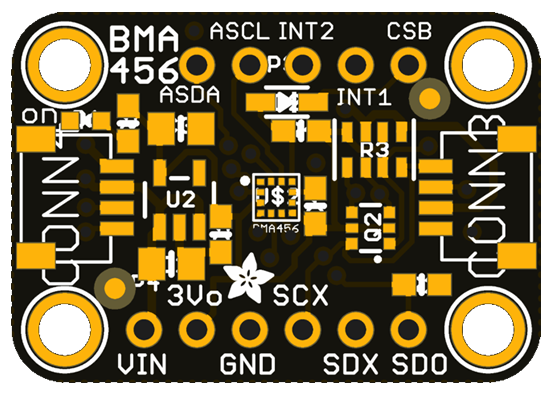](https://circuitpython.org/)

[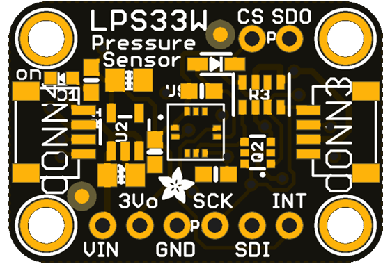](https://circuitpython.org/)

**Dan**

_I updated the Adafruit Windows Drivers package for a bunch of new boards, and added placeholder definitions for other boards that are not yet announced or even thought of yet. The drivers package is not needed for Windows 10, but is still needed for Windows 7 and Windows 8.1. There were issues with HID gamepad support in recent versions of CircuitPython, but these have now been fixed due to fixes in the TinyUSB code we use. Scott and I have talked several times about work Scott is doing to make the BLE API more general and easier to use. Watch for more improvements. I"m still working on bonding for BLE. There's a lot of code reorganization to do in preparation. As mentioned in our Python newsletter, I gave a talk at an MIT service organization reunion about my early personal experiences using computers, and then demonstrated CircuitPython - [YouTube](https://youtu.be/Zk7WBOunlsg)._

**Kattni**

_This week included much guide work and complicated Fritzing object creation. I published the [new guide for the Adafruit STEMMA Speaker](https://learn.adafruit.com/adafruit-stemma-speaker) which makes adding better audio to your project super simple. I added two new pages to the [Circuit Playground Bluefruit guide](https://learn.adafruit.com/adafruit-circuit-playground-bluefruit): [Playground Color Picker](https://learn.adafruit.com/adafruit-circuit-playground-bluefruit/playground-color-picker) and [Playground Bluetooth Plotter](https://learn.adafruit.com/adafruit-circuit-playground-bluefruit/playground-bluetooth-plotter). The new pages show you how to use CircuitPython to use your mobile phone to control the NeoPixels on your CPB, and how to plot the temperature and light levels from the CPB to your mobile phone, both using the Adafruit Bluefruit LE Connect mobile application. I created Fritzing objects for the Circuit Playground TFT Gizmo, the STEMMA Speaker and the 2.9" eInk display breakout. I also successfully tested the FT232H USB to GPIO breakout in VMWare Fusion - so if you have reason to use it with that set up, you're in luck!_

_[Hacktoberfest](https://hacktoberfest.digitalocean.com/) started on 1 October, and I went through all the current library issues to identify issues that are Good First Issues. I found a few and created a number of new issues. We've already had a lot of activity! Thank you to everyone who has joined us on GitHub for the first time - welcome to our community!_

**Lucian**

_I've been working on supporting SPI on the STM32, and accompanying that, SPI Flash, which makes it much, much easier to load libraries onto the new Feather F405 and many other STM32 development boards. Now that that flash support is in place, there's some cleanup work to do for the STM32, along with remaining modules like Digital to Analog Conversion (DAC), UART Serial, and QSPI Flash, which is 4 times the SPIs, BONDed together, with a Q!_

**Melissa**

_I've been working on adding the TFT Gizmo to both CircuitPython and Arduino. With it has come its own set of challenges including adding more tests for the Circuit Playground Bluefruit and making sure all of the previous boards are still passing their respective tests. Adding bitmap loading to the ImageLoader library was also a lot of fun. Most of these updates are a consequence of working on writing a guide for the TFT Gizmo. Keep an eye out for it._

**Scott**

_I spent the week deep in _bleio and the BLE library. I've combined the Central and Peripheral classes into a Connection class to better share code and represent that connections are symmetric once established. I also moved scanning and advertising to Adapter to better represent the device discovery process. On Friday, I realized that the scanning should return an iterator rather than a list. This will allow for receiving results much faster than waiting for a timeout before being able to read the results. It will also allow for infinite scans which can be used to create smarter forever loops. For example, a forever loop could listen for color change broadcasts and update it's color perpetually. Put this code on a number of devices and you can orchestrate color animations across them all at once. This week, I'm debugging these changes, hope to get demos going and sending out the PRs for others to try._

## Upcoming events!

Hacktoberfest is open to everyone in the global community. Whether you’re a developer, student learning to code, event host, or company of any size, you can help drive growth of open source and make positive contributions to an ever-growing community. All backgrounds and skill levels are encouraged to complete the challenge - [https://hacktoberfest.digitalocean.com](hacktoberfest.digitalocean.com)

[October is Open Hardware Month @ Open Source Hardware Association](https://www.oshwa.org/2019/07/26/october-is-open-hardware-month-2/).

>_"October is Open Hardware Month! Check out the [Open Hardware Month website](http://ohm.oshwa.org/). Host an event, find a local event, or [certify](https://certification.oshwa.org/) your hardware to support Open Source Hardware. We are providing resources and asking you, the community, to host small, local events in the name of open source hardware. Tell us about your October event by f[illing out the form below](https://docs.google.com/forms/d/e/1FAIpQLSfjvJmcRXbpgjRACgY_BbaDzQZRa6wxEcP-xwaBpC0X6mvsPw/viewform). Your event will be featured on [OSHWA’s Open Hardware Month page](http://ohm.oshwa.org/) (provided you have followed OSHWA’s rules listed on the [“Do’s and Don’ts”](http://ohm.oshwa.org/dos-and-donts/) page)."_

[Read more](https://www.oshwa.org/2019/07/26/october-is-open-hardware-month-2/), [Tweet for speakers in 2020](https://twitter.com/ohsummit/status/1154881782677831680), and Open Hardware Month @ [http://ohm.oshwa.org/](http://ohm.oshwa.org/)

PyCon DE & PyData Berlin // October 9 - 13 2019. Main conference, 3 days of talks and workshops. More than 100 sessions dedicated to PyData (artificial intelligence, machine learning, ethics...) and Python topics (programming, DevOps, Web, Django...) - [de.pycon.org](https://de.pycon.org/).

[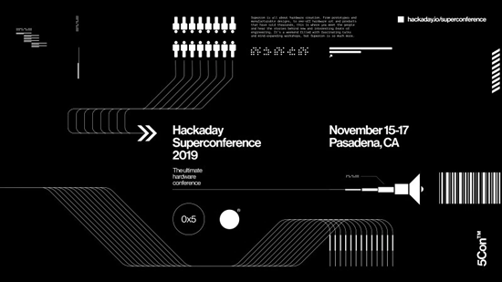](https://hackaday.io/superconference/)

Hackaday Superconference is November 15th, 16th, and 17th in Pasadena, California, USA. The Hackaday Superconference is returning for another 3 full days of technical talks, badge hacking, and hands-on workshops: [Eventbrite](https://www.eventbrite.com/e/hackaday-superconference-2019-tickets-60129236164?aff=0626com
) & [hackaday.io](https://hackaday.io/superconference/)

## Latest releases

CircuitPython's stable release is [4.1.0](https://github.com/adafruit/circuitpython/releases/latest) and its unstable release is [5.0.0-alpha.4](https://github.com/adafruit/circuitpython/releases). New to CircuitPython? Start with our [Welcome to CircuitPython Guide](https://learn.adafruit.com/welcome-to-circuitpython).

[20191004](https://github.com/adafruit/Adafruit_CircuitPython_Bundle/releases/latest) is the latest CircuitPython library bundle.

[v1.11](https://micropython.org/download) is the latest MicroPython release. Documentation for it is [here](http://docs.micropython.org/en/latest/pyboard/).

[3.7.4](https://www.python.org/downloads/) is the latest Python release. The latest pre-release version is [3.8.0rc1](https://www.python.org/download/pre-releases/).

[1412 Stars](https://github.com/adafruit/circuitpython/stargazers) Like CircuitPython? [Star it on GitHub!](https://github.com/adafruit/circuitpython)

## Call for help – CircuitPython messaging to other languages!

We [recently posted on the Adafruit blog](https://blog.adafruit.com/2018/08/15/help-bring-circuitpython-messaging-to-other-languages-circuitpython/) about bringing CircuitPython messaging to other languages, one of the exciting features of CircuitPython 4.x is translated control and error messages. Native language messages will help non-native English speakers understand what is happening in CircuitPython even though the Python keywords and APIs will still be in English. If you would like to help, [please post](https://github.com/adafruit/circuitpython/issues/1098) to the main issue on GitHub and join us on [Discord](https://adafru.it/discord).

We made this graphic with translated text, we could use your help with that to make sure we got the text right, please check out the text in the image – if there is anything we did not get correct, please let us know. Dan sent me this [handy site too](http://helloworldcollection.de/#Human).

## jobs.adafruit.com - Find a dream job, find great candidates!

[jobs.adafruit.com](https://jobs.adafruit.com/) has returned and folks are posting their skills (including CircuitPython) and companies are looking for talented makers to join their companies - from Digi-Key, to Hackaday, Microcenter, Raspberry Pi and more.

New great addition, we now have Non-Profit job listings as well, to kick it off, [here are some great jobs at the EFF](https://jobs.adafruit.com/jobs/category/non-profit/)!

## 14,360 thanks!

The Adafruit Discord community, where we do all our CircuitPython development in the open, reached over 14,360 humans, thank you! Join today! [https://adafru.it/discord](https://adafru.it/discord)

## ICYMI - In case you missed it

The wonderful world of Python on hardware! This is our first video-newsletter-podcast that we’ve started! The news comes from the Python community, Discord, Adafruit communities and more. It’s part of the weekly newsletter, then we have a segment on ASK an ENGINEER and this is the video slice from that! The complete Python on Hardware weekly videocast [playlist is here](https://www.youtube.com/playlist?list=PLjF7R1fz_OOXRMjM7Sm0J2Xt6H81TdDev). 

This video podcast is on [iTunes](https://itunes.apple.com/us/podcast/python-on-hardware/id1451685192?mt=2), [YouTube](https://www.youtube.com/playlist?list=PLjF7R1fz_OOXRMjM7Sm0J2Xt6H81TdDev), [IGTV (Instagram TV](https://www.instagram.com/adafruit/channel/)), and [XML](https://itunes.apple.com/us/podcast/python-on-hardware/id1451685192?mt=2).

[Weekly community chat on Adafruit Discord server CircuitPython channel - Audio / Podcast edition](https://itunes.apple.com/us/podcast/circuitpython-weekly-meeting/id1451685016) - Audio from the Discord chat space for CircuitPython, meetings are usually Mondays at 2pm ET, this is the audio version on [iTunes](https://itunes.apple.com/us/podcast/circuitpython-weekly-meeting/id1451685016), Pocket Casts, [Spotify](https://adafru.it/spotify), and [XML feed](https://adafruit-podcasts.s3.amazonaws.com/circuitpython_weekly_meeting/audio-podcast.xml).

And lastly, we are working up a one-spot destination for all things podcast-able here - [podcasts.adafruit.com](https://podcasts.adafruit.com/)

## Codecademy "Learn Hardware Programming with CircuitPython"

Codecademy, an online interactive learning platform used by more than 45 million people, has teamed up with the leading manufacturer in STEAM electronics, Adafruit Industries, to create a coding course, "Learn Hardware Programming with CircuitPython". The course is now available in the [Codecademy catalog](https://www.codecademy.com/learn/learn-circuitpython?utm_source=adafruit&utm_medium=partners&utm_campaign=circuitplayground&utm_content=pythononhardwarenewsletter).

Python is a highly versatile, easy to learn programming language that a wide range of people, from visual effects artists in Hollywood to mission control at NASA, use to quickly solve problems. But you don’t need to be a rocket scientist to accomplish amazing things with it. This new course introduces programmers to Python by way of a microcontroller — CircuitPython — which is a Python-based programming language optimized for use on hardware.

CircuitPython’s hardware-ready design makes it easier than ever to program a variety of single-board computers, and this course gets you from no experience to working prototype faster than ever before. Codecademy’s interactive learning environment, combined with Adafruit's highly rated Circuit Playground Express, present aspiring hardware hackers with a never-before-seen opportunity to learn hardware programming seamlessly online.

Whether for those who are new to programming, or for those who want to expand their skill set to include physical computing, this course will have students getting familiar with Python and creating incredible projects along the way. By the end, students will have built their own bike lights, drum machine, and even a moisture detector that can tell when it's time to water a plant.

Visit Codecademy to access the [Learn Hardware Programming with CircuitPython](https://www.codecademy.com/learn/learn-circuitpython?utm_source=adafruit&utm_medium=partners&utm_campaign=circuitplayground&utm_content=pythononhardwarenewsletter) course and Adafruit to purchase a [Circuit Playground Express](https://www.adafruit.com/product/3333).

Codecademy has helped more than 45 million people around the world upgrade their careers with technology skills. The company’s online interactive learning platform is widely recognized for providing an accessible, flexible, and engaging experience for beginners and experienced programmers alike. Codecademy has raised a total of $43 million from investors including Union Square Ventures, Kleiner Perkins, Index Ventures, Thrive Capital, Naspers, Yuri Milner and Richard Branson, most recently raising its $30 million Series C in July 2016.

## Contribute!

The CircuitPython Weekly Newsletter is a CircuitPython community-run newsletter emailed every Tuesday. The complete [archives are here](https://www.adafruitdaily.com/category/circuitpython/). It highlights the latest CircuitPython related news from around the web including Python and MicroPython developments. To contribute, edit next week's draft [on GitHub](https://github.com/adafruit/circuitpython-weekly-newsletter/tree/gh-pages/_drafts) and [submit a pull request](https://help.github.com/articles/editing-files-in-your-repository/) with the changes. Join our [Discord](https://adafru.it/discord) or [post to the forum](https://forums.adafruit.com/viewforum.php?f=60) for any further questions.
