- [ ] Link "View this email in your browser."

View this email in your browser.

## Take Flight with Feather - Hackaday and Digi-Key

The Adafruit Feather is the latest platform for microcontroller development, and companies like Particle, Sparkfun, and Seeed Studios are producing Feather-compatible devices for development and prototyping. Now it’s your turn. Design a board to fit in the Feather ecosystem and we’ll manufacture it. The best project in the Take Flight With Feather contest will be sent off to pick and place machines and head straight to the Digi-Key warehouse!

To get started, take a look at the current [Feather ecosystem](https://learn.adafruit.com/adafruit-feather/community-feathers-wings) and get acquainted with the [GitHub repo filled with examples and tutorials](https://github.com/adafruit/awesome-feather).

For the Take Flight With Feather contest, we’re looking for the cool, the useful, the insane, and the practical. Most of all, we’re looking for manufacturability. Electron savant Lady Ada will be judging each board on the basis of manufacturability, with the best board moving on to the assembly line where it will be stocked at Digi-Key.

**What’s a good design? We’re looking for submissions in the following categories:**

*   The Weirdest Feather — What’s the most ridiculous expansion board you can come up with?
*   You’ll Cut Yourself On That Edge — We’re surrounded with bleeding-edge tech, what’s the coolest use of new technology?
*   Retro Feather — Old tech lives on, but can you design a Feather to interact with it? Is it even possible to build a vampire Ethernet tap or an old acoustically-coupled modem?
*   Assistive Tech — Build a Feather to help others. Use technology to improve lives.
*   Wireless Feather — Add a new wireless technology to the Feather ecosystem.

The winning entry overall will be chosen for manufacturability, and will win a small manufacturing run of 100 boards or less and be stocked at Digi-Key. The number of boards in the manufacturing run will be determined by the winning design. Note: Because of the small run initially, there will be no profit or margin for the first few boards. If the board is well accepted and a larger run is planned, then a longer term business model will be addressed. The 5 winners in the 5 categories above will receive $100 Tindie gift certificates. To get started, start a project on [hackaday.io](http://hackaday.io) and upload your project. Contest runs noon November 1 to noon December 31st. All times are in Pacific Standard Time.

Stop by [hackaday.io for more details](https://hackaday.io/contest/168107-take-flight-with-feather)!

## CircuitPython 5.0.0 Alpha 5 released!

This is the fifth alpha release of CircuitPython 5.0.0. Alpha releases are meant for testing, check out the blog posts for all the details! - [Adafruit](https://blog.adafruit.com/2019/11/03/circuitpython-5-0-0-alpha-5-released/).

## PyPortal Blackjack game: uses sprites, touch, audio

Fantastic Blackjack game made with CircuitPython and PyPortal by [Andy](https://andyfelong.com/2019/10/pyportal-blackjack-game-uses-sprites-touch-audio/).

## Circuit Playground TFT Gizmo Snow Globe with CircuitPython

In this guide learn how to use a Circuit Playground Bluefruit along with a TFT Gizmo to create a digital version of a snow globe. It will display customizable snow globe goodness on the TFT. Set a custom background, create custom snow flakes, and of course shake to clear the snow globe and start it all over - [learn.adafruit.com](https://learn.adafruit.com/circuit-playground-tft-gizmo-snow-globe/)

And of course had to do a squid based one for WATCHMEN - [YouTube](https://youtu.be/awfWXWYHowQ).

## All 35 posts from Open hardware month in one spot

[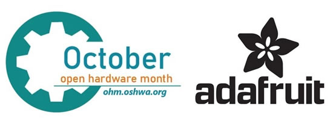](https://blog.adafruit.com/2019/10/31/all-35-posts-from-open-hardware-month-in-one-spot-ohm2019-oshwa-ohsummit-opensource-opensourcehardware-opensourceorg-adafruit/)

October 2019 was/is [open-source hardware month](https://ohm.oshwa.org/)! Every single day in October we posted up some open-source stories from the last decade (and more!) about open-source hardware, open-source software, interviews, stats, and more. [Here are all 35 posts in one spot, enjoy](https://blog.adafruit.com/2019/10/31/all-35-posts-from-open-hardware-month-in-one-spot-ohm2019-oshwa-ohsummit-opensource-opensourcehardware-opensourceorg-adafruit/)!

*   [Open source hardware month with Michael Weinberg](https://blog.adafruit.com/2019/10/31/open-source-hardware-month-with-michael-weinberg-mweinberg2d-nyuengelberg-ohm2019-oshwa-ohsummit-opensource-opensourcehardware-opensourceorg/) - Day 31, 10/31/2019.
*   [Hackaday and Hackaday.io communities for open hardware makers](https://blog.adafruit.com/2019/10/31/hackaday-and-hackaday-io-communities-for-open-hardware-makers-hackaday-hackadayio-sophikravitz-supplyframe-hackchats-ohm2019-oshwa-ohsummit-opensource-opensourcehardware-opensourceorg/) - Day 31, 10/31/2019.
*   [Why open hardware needs open software - and more from Wayne Stambaugh of KiCad](https://blog.adafruit.com/2019/10/31/why-open-hardware-needs-open-software-and-more-from-wayne-stambaugh-of-kicad-kicad_pcb-snap_eda-ohm2019-oshwa-ohsummit-opensource-opensourcehardware-opensourceorg/) - Day 31, 10/31/2019.
*   [OSH Park the purple PCBs that fuel open hardware](https://blog.adafruit.com/2019/10/31/osh-park-the-purple-pcbs-that-fuel-open-hardware-oshpark-laen-pdp7-ohm2019-oshwa-ohsummit-opensource-opensourcehardware-opensourceorg/) - Day 31, 10/31/2019.
*   [Open source hardware: The problems and promise](https://blog.adafruit.com/2019/10/31/open-source-hardware-the-problems-and-promise-ohm2019-oshwa-ohsummit-opensource-opensourcehardware-opensourceorg-mjasay-techrepublic/) - Day 31, 10/31/2019.
*   [Crowd Supply - Bringing original, useful, respectful hardware to life](https://blog.adafruit.com/2019/10/30/crowd-supply-bringing-original-useful-respectful-hardware-to-life-crowd_supply-ohm2019-oshwa-ohsummit-opensource-opensourcehardware-opensourceorg/) - Day 30, 10/30/2019
*   [What does Open Source Hardware mean to Tindie?](https://blog.adafruit.com/2019/10/29/what-does-open-source-hardware-mean-to-tindie-tindie-ohm2019-oshwa-ohsummit-opensource-opensourcehardware-opensourceorg/) - Day 29, 10/29/2019.
*   [Talking with Andrew "bunnie" Huang](https://blog.adafruit.com/2019/10/28/talking-with-andrew-bunnie-huang-ohm2019-oshwa-bunniestudios-ohsummit-opensource-opensourcehardware-opensourceorg-adafruit/) - Day 28, 10/28/2019.
*   [DIY Drones, which launched the largest open UAV communities](https://blog.adafruit.com/2019/10/27/diy-drones-worlds-largest-uav-community-diydrones-chr1sa-ohm2019-oshwa-ohsummit-opensource-opensourcehardware-opensourceorg-adafruit/) - Day 27, 10/27/2019.
*   [OLIMEX open-source hardware made in Bulgaria](https://blog.adafruit.com/2019/10/26/olimex-open-source-hardware-made-in-bulgaria-olimex-ohm2019-oshwa-ohsummit-opensource-opensourcehardware-opensourceorg-adafruit/) - Day 26, 10/26/2019.
*   [Electronic Cats – Open hardware made in México](https://blog.adafruit.com/2019/10/25/electronic-cats-open-hardware-made-in-mxico-ohm2019-oshwa-ohsummit-opensource-opensourcehardware-opensourceorg-adafruit-electronicats/) - Day 25, 10/25/2019.
*   [10 years ago we tried to make an open source flash light to make us puke ...](https://blog.adafruit.com/2019/10/24/10-years-ago-we-tried-to-make-an-open-source-flash-light-to-make-us-puke-ohm2019-oshwa-ohsummit-opensource-opensourcehardware-opensourceorg-adafruit-dhsgov-bedazzler/) - Day 24, 10/24/2019.
*   [Evil Mad Scientist Laboratories](https://blog.adafruit.com/2019/10/24/evil-mad-scientist-laboratories-ohm2019-oshwa-ohsummit-opensource-opensourcehardware-opensourceorg-emsl/) - Day 23, 10/23/2019.
*   [MicroPython, bringing Python to hardware for everyone](https://blog.adafruit.com/2019/10/22/micropython-bringing-python-to-hardware-for-everyone-ohm2019-oshwa-ohsummit-opensource-opensourcehardware-opensourceorg-micropython-micropython/) - Day 22, 10/22/2019.
*   [Open Hardware Month Hack Chat at Hackaday.io](https://blog.adafruit.com/2019/10/21/open-hardware-month-hack-chat-at-hackaday-io-ohm2019-oshwa-ohsummit-opensource-opensourcehardware-opensourceorg-mweinberg2d-hackaday-hackadayio/) - Day 21, 10/21/2019.
*   [Parallax Open-source hardware](https://blog.adafruit.com/2019/10/20/parallax-open-source-hardware-ohm2019-oshwa-ohsummit-opensource-opensourcehardware-opensourceorg-parallaxinc/) - Day 20, 10/20/2019.
*   [Growing Your Open Business - A Digital Meetup for Open Hardware Month](https://blog.adafruit.com/2019/10/19/growing-your-open-business-a-digital-meetup-for-open-hardware-month-ohm2019-oshwa-ohsummit-opensource-opensourcehardware-opensourceorg-harriskenny-shawnhymel/) - Day 19, 10/19/2019.
*   [Open-source hardware at the Museum of Modern Art](https://blog.adafruit.com/2019/10/19/open-source-hardware-at-the-museum-of-modern-art-newmoma-momaps1-museummodernart-ohm2019-oshwa-ohsummit-opensource-opensourcehardware-opensourceorg/), posted on 10/19/2019 - Day 18, 10/18/2019.
*   [Open Hardware Licenses CC BY-SA, CERN, TAPR](https://blog.adafruit.com/2019/10/17/open-hardware-licenses-cc-by-sa-cern-tapr-ohm2019-oshwa-ohsummit-opensource-opensourcehardware-opensourceorg-creativecommons-cern/) ... - Day 17, 10/17/2019.
*   [Open Source Hardware Month at SparkFun](https://blog.adafruit.com/2019/10/16/open-source-hardware-month-at-sparkfun-video-sparkfun-ohm2019-oshwa-ohsummit-opensource-opensourcehardware-opensourceorg/) - Day 16, 10/16/2019.
*   [How many Open-Source Prusa 3D printers are there? Posted on 10/19/2019](https://blog.adafruit.com/2019/10/19/how-many-open-source-prusa-3d-printers-are-there-ohm2019-oshwa-ohsummit-opensource-opensourcehardware-opensourceorg-prusa3d/) - Day 15, 10/15/2019.
*   [The RepRap Project Self-Replicating Open-Source 3D Printing](https://blog.adafruit.com/2019/10/14/the-reprap-project-self-replicating-open-source-3d-printing-reprap-reprapltd-adrianbowyer-ohm2019-oshwa-ohsummit-opensource-opensourcehardware-opensourceorg/) - Day 14, 10/13/2019.
*   [The first 2 orders at Adafruit... now up to 2,161,166 orders](https://blog.adafruit.com/2019/10/13/the-first-2-orders-at-adafruit-now-up-to-2161166-orders-adafruit-ohm2019-oshwa-ohsummit-opensource-opensourcehardware-opensourceorg/) - Day 13, 10/13/2019.
*   [Photos of the first Arduino (2005)](https://blog.adafruit.com/2019/10/12/photos-of-the-first-arduino-2005-adafruit-ohm2019-oshwa-ohsummit-opensource-opensourcehardware-opensourceorg-arduino-arduino-wiringproject/) - Day 12, 10/12 2019.
*   [In 2010 there were 13 Open Source Hardware companies that were making $1 million or more](https://blog.adafruit.com/2019/10/11/in-2010-there-were-13-open-source-hardware-companies-that-were-making-1-million-or-more-adafruit-ohm2019-oshwa-ohsummit-opensource-opensourcehardware-oreillymedia-foocamp/)... - Day 11, 10/11/2019
*   [Opening Hardware 2010 at Eyebeam in NYC](https://blog.adafruit.com/2019/10/10/opening-hardware-2010-at-eyebeam-in-nyc-eyebeamnyc-adafruit-ohm2019-oshwa-ohsummit-opensource-opensourcehardware/) - Day 10, 10/10/2019.
*   [The Open Source Gift Guide, the early years](https://blog.adafruit.com/2019/10/10/the-open-source-gift-guide-the-early-years-adafruit-ohm2019-oshwa-ohsummit-opensource-opensourcehardware/) - Day 9, 10/9/2019 (posted it on 10/10/2019, whoops)
*   [Before the iPhone, before the Raspberry Pi, before Amazon Echo Show, there was Chumby](https://blog.adafruit.com/2019/10/08/before-the-iphone-before-the-raspberry-pi-before-amazon-echo-show-there-was-chumby-chumby-chumby-adafruit-ohm2019-oshwa-ohsummit-opensource-opensourcehardware/) - Day 8, 10/8/2019.
*   [Mitch Altman Open-source hardware pioneer](https://blog.adafruit.com/2019/10/07/mitch-altman-open-source-hardware-pioneer-maltman23-adafruit-ohm2019-oshwa-ohsummit-opensource-opensourcehardware-opensourceorg/) - Day 7, 10/7/2019.
*   [The Open Source logo(s)](https://blog.adafruit.com/2019/10/06/the-open-source-logos-adafruit-ohm2019-oshwa-ohsummit-opensource-opensourcehardware-opensourceorg/) - Day 6, 10/6/2019.
*   [Open Source Hardware events all month long, EVENTS!](https://blog.adafruit.com/2019/10/05/open-source-hardware-events-all-month-long-adafruit-ohm2019-oshwa-ohsummit-opensource-opensourcehardware-opensourceorg/) - Day 5, 10/5/2019.
*   [Open Source Hardware Certifications and more!](https://blog.adafruit.com/2019/10/04/open-source-hardware-certifications-and-more-adafruit-ohm2019-oshwa-ohsummit-opensource-opensourcehardware-opensourceorg-mweinberg2d-make-realsexycyborg/) - Day 4, 10/4/2019.
*   [Teuthis Open Source MP3 Player 2001 – Daisy by Raphael Abrams](https://blog.adafruit.com/2019/10/03/teuthis-open-source-mp3-player-2001-daisy-by-raphael-abrams-adafruit-ohm2019-oshwa-ohsummit-opensource-opensourcehardware-opensourceorg-nycresistor/) - Day 3, 10/3/2019.
*   [What is the Open-Source Hardware Definition?](https://blog.adafruit.com/2019/10/02/what-is-the-open-source-hardware-definition-adafruit-ohm2019-oshwa-ohsummit-opensource-opensourcehardware-opensourceorg/) - Day 2, 10/2/2019.
*   [Open hardware summit – Limor “Ladyada” Fried keynote 2010](https://blog.adafruit.com/2019/10/01/open-hardware-summit-limor-ladyada-fried-keynote-2010-adafruit-ohm2019-oshwa-ohsummit-opensource-opensourcehardware-opensourceorg/) - Day 1, 10/1/2019.

## "maintainable code is more important than clever code"

Python creator Guido van Rossum is retiring from DropBox, this is a great quote -

>_"...in 2013, Guido joined Dropbox. Since then, he has not only made contributions to Python at Dropbox, but also left an everlasting impact on our engineering culture and our people. It started with some of the young engineers Guido met early on. “There was a small number of really smart, really young coders who produced a lot of very clever code that only they could understand,” said van Rossum. “That is probably the right attitude to have when you're a really small startup.” But as the company grew, new engineers who joined couldn’t understand the code. Clever code is usually short and cryptic, written by and for the individual who came up with it, but is hard for anyone else to understand—and nearly impossible to maintain. Guido called this “cowboy coding culture”. He recognized its value in our early stages of trying to implement things quickly, but knew it wouldn’t be sustainable over time, so he decided to speak up in his own quiet way. “When asked, I would give people my opinion that maintainable code is more important than clever code,” he said. “If I encountered clever code that was particularly cryptic, and I had to do some maintenance on it, I would probably rewrite it. So I led by example, and also by talking to other people.”_

Thank you, Guido By [Dropbox Team](https://blog.dropbox.com/topics/company/thank-you--guido).

## Snekboard - A Python Microcontroller for Lego

[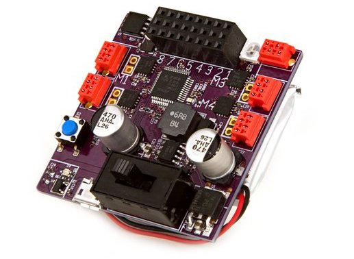](https://www.crowdsupply.com/keith-packard/snekboard)

If you're interested in mixing Python and LEGO, there is an upcmong starting Crowd Supply campaign for snekboard in a couple of weeks. Build Lego robots running snek, or CircuitPython - [Crowd Supply](https://www.crowdsupply.com/keith-packard/snekboard), via [Twitter](https://twitter.com/keith_x11/status/1191222657057902594).

## Python Editor Version 2 for micro:bit

Python Editor Version 2 for micro:bit released! [Try it out here](https://python.microbit.org/v/2.0) and here are the details - [microbit.org](https://support.microbit.org/support/solutions/articles/19000102970-python-editor-version-2-update).

## New version of Thonny IDE

Aivar posted up in the Adafruit forums about the new version of Thonny IDE which has several improvements related to [MicroPython / CircuitPython support](https://github.com/thonny/thonny/releases/tag/v3.2.3). Usage instructions are here - [GitHub](https://github.com/thonny/thonny/wiki/MicroPython), and feedback can be [posted here](https://forums.adafruit.com/viewtopic.php?f=60&t=158276).

## ALL a BOARD - 86+ boards!

[CircuitPython.org/downloads](https://circuitpython.org/downloads) now has over 86 boards!

Latest boards include:

 * [ItsyBitsy NRF52840 Express](https://circuitpython.org/board/itsybitsy_nrf52840_express/) by Adafruit.
 * SparkFun Qwiic Micro with [Flash](https://circuitpython.org/board/sparkfun_qwiic_micro_with_flash/) and [without](https://circuitpython.org/board/sparkfun_qwiic_micro_no_flash/).
 
## News from around the web!

Erin's Circuit Playground costume - [Twitter](https://twitter.com/SparklesAndCode/status/1190011905278038016).

MicroPython heats home - [code](https://gist.github.com/miguelgrinberg/80973081596f1069057ec6668142be15) and [YouTube](https://youtu.be/P5nOGKVLIYo).

[OpenMV news](https://mailchi.mp/33707c1a5b5f/7f6kh54q7k-958977?e=94a2c4f377) - Luxonis, DepthAI, an Industrial OpenMV Cam, and more.

Nikola Tesla costume possible, complete with quotes on the display - [Twitter](https://twitter.com/Light_Grove/status/1190048014234087424).

Transformer kid powered by Circuit Playground - [Twitter](https://twitter.com/Kwalseth/status/1190085796948299777).

Hack a Pumpkin: Spoopy Poopy, the Gaseous Gourd, from Shawn -

>_"Here is my official entry to Tech-nic-Allie's #HackAPumpkin challenge: Spoopy Poopy, the Farting Pumpkin. I can disgust those Trick-or-Treaters with this wonderfully flatulent trick--now with fart-flavored fragrance! This ceramic gourd is stuffed with electronics to emit light, sound, fog, and a little bit of stink. A passive infrared (PIR) sensor detects the presence of warm bodies and triggers the whole fart sequence. An Adafruit Feather M0 Express running #CircuitPython controls the lights (NeoPixels) and plays an audio clip out through pin A0. The fog machine is a vape pen loaded with half fog juice and half liquid fart. You've been warned: it's smelly."_

[YouTube](https://youtu.be/IYvLr-H5bME), and [code](https://gist.github.com/ShawnHymel/312537668d940999ec0d35bba9c2d44a).

CircuitPython Halloween Candy Bowl Alarm! - [YouTube](https://youtu.be/JX84nleX454) and [post](https://sudomod.com/halloween-candy-bowl-alarm-system/).

Halloween Pi + 3D print project: animated eyes horror mask - [YouTube](https://youtu.be/SSx1d_j7yRM).

Another Monster M4sk pumpkin, this time with magic wand - [Twitter](https://twitter.com/MrReuland/status/1188961496258306048).

Pumpkin light with a Circuit Playground Express - [Twitter](https://twitter.com/paks/status/1190052783023689734).

[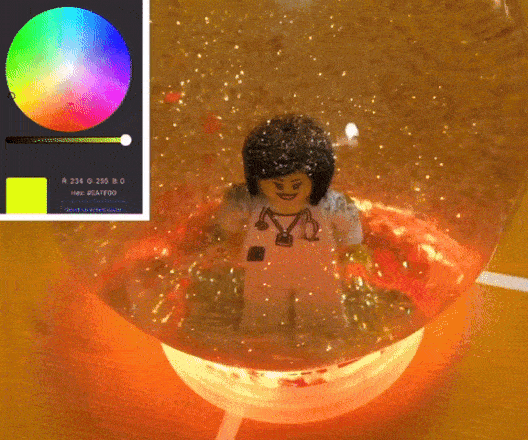](https://www.instagram.com/p/B4Pf6xuBpsd/?utm_source=ig_web_copy_link)

Snow globe with Bluefruit Express and iOS app - [Instagram](https://www.instagram.com/p/B4Pf6xuBpsd/?utm_source=ig_web_copy_link).

There were so many great electronic + Halloween this year, we collected a bunch and made a little super-cut - [YouTube](https://youtu.be/wR3W2hpkF3o).

Keep track of planting [20 million trees around the globe by January 1st, 2020](https://teamtrees.org/) with CircuitPython and a PyPortal - [Adafruit](https://blog.adafruit.com/2019/10/31/tree-count-donation-display-with-pyportal-teamtrees-pyportal-dashblock-teamtreesofficl-dashblockhq-adafruit/).

Also used this for the [Black Girls CODE efforts](https://blog.adafruit.com/2019/10/28/using-dashblock-and-pyportal-to-track-donations-and-fundraisers-pyportal-apis-circuitpython-tiltfive-dashblockhq-blackgirlscode-adafruit/)!

Mobile photo BOOth - Choose your prop, press the button, and you’ll get your picture from the thermal printer - [Twitter](https://twitter.com/RachelTobac/status/1190017044193804288).

Congrats to FEATHER-based particle.io for [$40m in funding](https://blog.adafruit.com/2019/10/30/particle-takes-flight-with-40m-more-particle-s-40m-series-c-led-by-qualcommventure-energyimpact_-zs-feather-makerbusiness/).

Getting started adafruit.io videos, [playlist](https://www.youtube.com/playlist?list=PLxlHp8uMUkWai672blyqajLKT-C7ScQKr) via [Twitter](https://twitter.com/Dan_Aldred/status/1189949334445547520).

[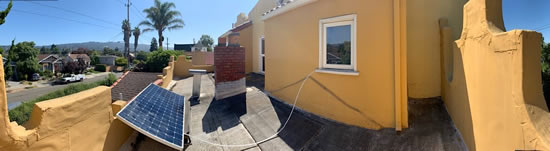](https://github.com/opensolarproject/OSPController/wiki)

[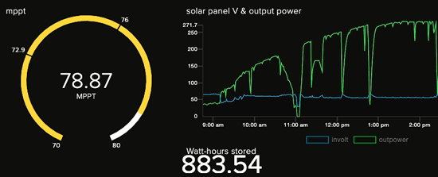](https://github.com/opensolarproject/OSPController/wiki)

[Open Solar Project Controller](https://github.com/opensolarproject/OSPController/wiki) - Feather, adafruit.io and more...

This is a project of a slack bot, to automate your office using a Raspberry Pi - [GitHub](https://github.com/vitorverasm/slackbot-iot).

128GB micro SD X-Ray - [Flickr](https://www.flickr.com/photos/ultrapurple/48985138852).

AWS IoT MQTT Client for CircuitPython getting some high marks from Jeff Barr, Chief Evangelist for the Amazon Web Services - [Twitter](https://twitter.com/jeffbarr/status/1189564830845325312).

Looks like Dan found it! - [Windows delays writing FAT table on small USB drive despite “Quick removal”](https://superuser.com/questions/1197897/windows-delays-writing-fat-table-on-small-usb-drive-despite-quick-removal/).

Disney+ is teaming with the Jim Henson Co. for a new puppet show "Earth to Ned" and it [looks like](https://www.hollywoodreporter.com/live-feed/jim-henson-sets-new-puppet-talk-show-at-disney-1249962) the [Monster M4sk will work for some re-makes](https://learn.adafruit.com/antenna-eyes).

Ben is working on a speedometer for a bike built on an Circuit Playground Bluefruit, taking the location from the phone and calculating a rough speed, and lighting up Neopixels - [Twitter](https://twitter.com/ben_everard/status/1190318819849453569), and [GitHub](https://gist.github.com/benevpi/f2c9a977289965690c3af4440c7d5e05).

Circuit Playground MIDI Controller Multi-Tool - Turn your Adafruit Circuit Playground into a multi-faceted MIDI controller. Designed for workshops experimenting with the WebMIDI API - [GitHub](https://github.com/georgemandis/circuit-playground-midi-multi-tool) via [Twitter](https://twitter.com/georgeMandis/status/1189200364727197696).

_"absolutely bonkers amount of functionality in something the size of a novelty shirt button."_ - [Twitter](https://twitter.com/deckerego/status/1190445672643907584).

Adafruit powered Eye Of Sauron - [Twitter](https://twitter.com/mfletcherchristian/status/1189742179696037888), and [hackster.io](https://www.hackster.io/news/this-eye-of-sauron-made-the-perfect-halloween-decoration-53428448fa33)

Frankenzarya with Adafruit LEDs - [Twitter](https://twitter.com/kuristinaakos/status/1190337694766776320).

War Machine - [Twitter](https://twitter.com/thatGuyFromRI/status/1190684140883996672).

micropython-ulab is a numpy-like fast vector module for micropython - [GitHub](https://github.com/v923z/micropython-ulab), and [documentation](https://micropython-ulab.readthedocs.io/en/latest/).

[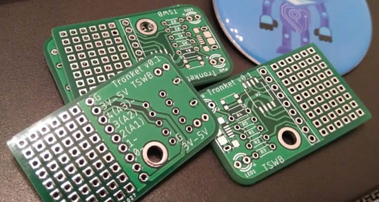](https://forums.adafruit.com/viewtopic.php?f=52&t=158198&p=779649#p779582)

Cool Trinket variant, the [Tronket](https://forums.adafruit.com/viewtopic.php?f=52&t=158198&p=779649#p779582).

[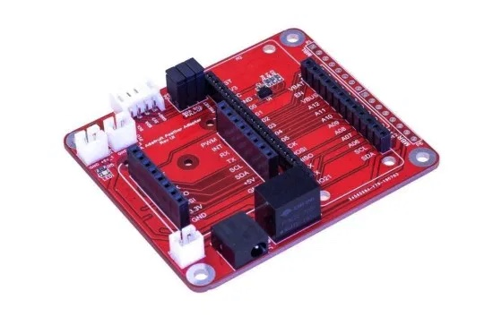](https://blog.tindie.com/2019/10/adafruit-feather-adapter/)

BOKRA Feather Adapter allows use with Feather (or compatible boards) along with mikroBUS modules - [Tindie](https://blog.tindie.com/2019/10/adafruit-feather-adapter/).

Neopixel fairy wings - [Instagram](https://www.instagram.com/p/B4Nyz3iBxaJ/?igshid=1544m0j3m3352).

[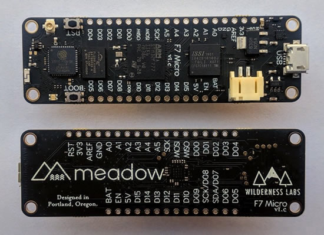](https://store.wildernesslabs.co/products/meadow-f7)

Feather takes flight with the Meadow F7 Micro Development Kit – [Wilderness Labs](https://store.wildernesslabs.co/products/meadow-f7).

ESP News - [October 2019](https://mailchi.mp/148f423ee1d0/espressif-esp-news-october-2019?e=ed7e71c663).

PyGame 2.0.0.dev6 [is out](https://github.com/pygame/pygame/releases/tag/2.0.0.dev6).

Python 3.5.9 [is out](https://www.python.org/downloads/release/python-359/).

Branded QR codes in Python - [YouTube](https://www.youtube.com/watch?v=WSLSRrhFD6U).

Brain Computer Interface w/ Python and OpenBCI for EEG data - [YouTube](https://www.youtube.com/watch?v=Dgo7F-lpyYE).

Arduino With Python: How to Get Started - [Real Python](https://realpython.com/arduino-python/).

[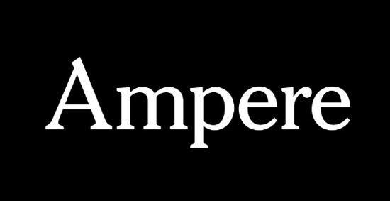](https://www.nytimes.com/2019/10/29/crosswords/heck-ampere-crosswords-electrical.html)

Andrew Dore for The New York Times with Adafruit mention for "What the Heck is That?" ... [NY Times](https://www.nytimes.com/2019/10/29/crosswords/heck-ampere-crosswords-electrical.html).

TensorFlow Lite: Solution for running ML on-device with Pete Warden at TensorFlow World using Adafruit hardware - [YouTube](https://youtu.be/Iv3BJzzk-HE).

Hyperlink [API documentation](https://usehyperlink.com/documentation/).

HOW TO – Burn bootloader Arduino nano 33 BLE - [djynet](http://djynet.net/?p=969).

8.5m developers use Visual Studio Code - [Business Insider](https://www.businessinsider.com/microsoft-visual-studio-code-amazon-google-2019-10).

McMaster-Carr [Product Information API](https://www.mcmaster.com/help/api/?mc_cid=b9320225f2&mc_eid=ef394772d1).

Metro [logos and fonts](http://mic-ro.com/metro/metrologos.html).

Book of Red Hat, [history and more](https://www.redhat.com/en/book-of-red-hat).

Some research on shipping print zines - [Julia Evans](https://jvns.ca/blog/2019/10/28/some-research-on-shipping-print-zines/).

Adafruit IoT Monthly: Helping Harry's Heart, CircuitPython meets AWS IoT and more! - [adafruit.io](https://io.adafruit.com/blog/notebook/2019/11/01/iot-monthly/)

CircuitPython Weekly for November 4th, 2019 on [YouTube](https://youtu.be/7VqPzzli_7Q)

PyDev of the Week: Joannah Nanjekye from [Mouse vs Python](https://www.blog.pythonlibrary.org/2019/11/04/pydev-of-the-week-joannah-nanjekye/)

#ICYDNCI What was the most popular, most clicked link, in [last week's newsletter](https://www.adafruitdaily.com/2019/10/29/circuitpython-snakes-its-way-to-the-sony-spresense-sparkfun-qwiic-micro-and-arduino-nano-33-ble-sense-python-adafruit-circuitpython-pythonhardware-circuitpython-micropython-thepsf-adafruit/)? [CircuitPython on the SONY Spresense](https://circuitpython.org/board/spresense/).

## State of PewPew

[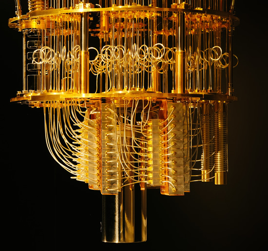](https://mail.python.org/mailman3/lists/pewpew.python.org/)

The latest from Radomir Dopieralski's PewPew project...

 * There was a workshop on [quantum computing using the PewPew devices](https://quantum-industry-day-in-switzerland-2018.b2match.io/) ran by James Wootton during the Zürich Quantum Industry Day.
 * James Wootton also ran that workshop on PyCon.DE in Berlin (Germany).
 * A "Noc Informatyka" event in Cracow (Poland) used [badges based on PewPew](https://nocinformatyka.pl/).
 * There is some interest in more badges based on PewPew for various events. I will be working with the organizers on that.
 * I will be showing off PewPew devices on the Training Grounds event during the HeroFest festival in Bern (Switzerland) on Friday 22 November 2019.
 * PewPew M4 reached version 7 and is mostly ready for production. I am still working on documentation and cleaning up and publishing of the design files.

[PewPew mailing list](https://mail.python.org/mailman3/lists/pewpew.python.org/).

## Coming soon

Circuit Playground Bluefruit AND BrainCraft EDGE BADGE gestures with Machine Learning.

The APDS9500 is a nifty sensor that is half camera and half gesture sensor. It looks really specialized, but we're not sure exactly what it was designed for! We're curious to try this one out and see what kind of data comes out of it.

## New Learn Guides!

[Circuit Playground Bluefruit Pumpkin with Lights and Sounds](https://learn.adafruit.com/pumpkin-with-circuit-playground-bluefruit) from [Noe and Pedro](https://learn.adafruit.com/users/pixil3d)

## Updated Guides - Now With More Python!

**You can use CircuitPython libraries on Raspberry Pi!** We're updating all of our CircuitPython guides to show how to wire up sensors to your Raspberry Pi, and load the necessary CircuitPython libraries to get going using them with Python. We'll be including the updates here so you can easily keep track of which sensors are ready to go. Check it out!

Keep checking back for more updated guides!

## CircuitPython Libraries!

CircuitPython support for hardware continues to grow. We are adding support for new sensors and breakouts all the time, as well as improving on the drivers we already have. As we add more libraries and update current ones, you can keep up with all the changes right here!

For the latest drivers, download the [Adafruit CircuitPython Library Bundle](https://circuitpython.org/libraries).

If you'd like to contribute, CircuitPython libraries are a great place to start. Have an idea for a new driver? File an issue on [CircuitPython](https://github.com/adafruit/circuitpython/issues)! Interested in helping with current libraries? Check out the [CircuitPython.org Contributing page](https://circuitpython.org/contributing). We've included open pull requests and issues from the libraries, and details about repo-level issues that need to be addressed. We have a guide on [contributing to CircuitPython with Git and Github](https://learn.adafruit.com/contribute-to-circuitpython-with-git-and-github) if you need help getting started. You can also find us in the #circuitpython channel on the [Adafruit Discord](https://adafru.it/discord). Feel free to contact Kattni (@kattni) with any questions.

You can check out this [list of all the CircuitPython libraries and drivers available](https://github.com/adafruit/Adafruit_CircuitPython_Bundle/blob/master/circuitpython_library_list.md). 

The current number of CircuitPython libraries is **193**!

**Updated Libraries!**

Here's this week's updated CircuitPython libraries:

 * [Adafruit_CircuitPython_RGB_Display](https://github.com/adafruit/Adafruit_CircuitPython_RGB_Display)
 * [Adafruit_CircuitPython_VEML7700](https://github.com/adafruit/Adafruit_CircuitPython_VEML7700)
 * [Adafruit_CircuitPython_TestRepo](https://github.com/adafruit/Adafruit_CircuitPython_TestRepo)
 * [Adafruit_CircuitPython_RGBLED](https://github.com/adafruit/Adafruit_CircuitPython_RGBLED)
 * [Adafruit_CircuitPython_ATECC](https://github.com/adafruit/Adafruit_CircuitPython_ATECC)
 * [Adafruit_CircuitPython_PCD8544](https://github.com/adafruit/Adafruit_CircuitPython_PCD8544)

**PyPI Download Stats!**

We've written a special library called Adafruit Blinka that makes it possible to use CircuitPython Libraries on [Raspberry Pi and other compatible single-board computers](https://learn.adafruit.com/circuitpython-on-raspberrypi-linux/). Adafruit Blinka and all the CircuitPython libraries have been deployed to PyPI for super simple installation on Linux! Here are the top 10 CircuitPython libraries downloaded from PyPI in the last week, including the total downloads for those libraries:

| Library                                     | Last Week   | Total |   
|:-------                                     |:--------:   |:-----:|   
| Adafruit-Blinka                             | 1465        | 44284 |   
| Adafruit_CircuitPython_BusDevice            | 694         | 25876 |   
| Adafruit_CircuitPython_MCP230xx             | 260         | 9377 |    
| Adafruit_CircuitPython_Register             | 143         | 5994 |    
| Adafruit_CircuitPython_LIS3DH               | 133         | 2675 |    
| Adafruit_CircuitPython_NeoPixel             | 129         | 5369 |    
| Adafruit_CircuitPython_ServoKit             | 123         | 3239 |    
| Adafruit_CircuitPython_PCA9685              | 114         | 4051 |    
| Adafruit_CircuitPython_framebuf             | 107         | 2177 |    
| Adafruit_CircuitPython_TestRepo             | 100         | 101 |    

## CircuitPython team ASSEMBLE!

What's going on this week? A LOT!

**Bryan**

This week I did some guide work to prepare for some upcoming sensors. For one of them, the LSM303AGR, I spent some time this week working on the test code and tester PCB. Once we've prototyped the tester on a bread board, we of course need to make something more robust for actually production use, so we commit the design to a PCB and get something like so: 

[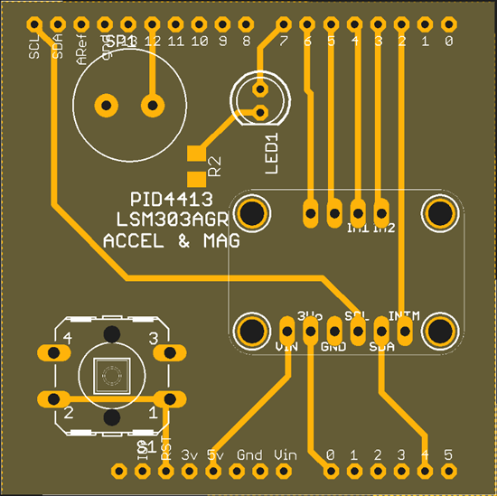](https://learn.adafruit.com/how-to-make-a-pogo-pin-test-jig)

The end result is not unlike the test jigs shown in [this guide](https://learn.adafruit.com/how-to-make-a-pogo-pin-test-jig).

**Dan**

I finished reviewing Scott's extensive updates to the _bleio native module and adafruit_ble library. We discussed it further, and after a few more updates it is ready to go. I added new CircuitPython board definitions for the ItsyBitsy nRF52840 and Arduino Nano 33 BLE boards. I also changed the Circuit Playground Bluefruit board to include two I2C devices so that we can support both the onboard I2C accelerometer and any offboard I2C devices. The CircuitPython 5.0.0-alpha.5 release is now available, as of Sunday night! It includes a number of new boards and many fixes. It does not include the BLE changes mentioned above: we'll be making another alpha or beta release soon to focus on those changes.

**Kattni**

As well as testing hardware on Raspberry Pi, I've worked on new and updated guides this week! There's now a [new guide](https://learn.adafruit.com/adafruit-stemma-non-latching-mini-relay) for the [STEMMA Non-Latching Mini Relay](https://www.adafruit.com/product/4409) with wiring and code examples. Take control of power with the ease of STEMMA! If you're looking to use your [Adafruit Fingerprint Sensor](https://www.adafruit.com/product/751) on Raspberry Pi, check out the [updated guide](https://learn.adafruit.com/adafruit-optical-fingerprint-sensor) which now includes updated code for use on Raspberry Pi with the Adafruit Blinka library. Next up is testing Raspberry Pi with the VC0706 TTL serial camera, the MPR121 HAT, and the PM2.5 air quality sensor, including guide updates for each. Keep an eye out for an update to the micro lipo guide to include the new USB-C lipo charger, and for a new guide for the HC-SR04 ultrasonic distance sensor. All this and more coming soon!

**Lucian**

This past week saw  major progress on overcoming chronic issues with the PWM and UART modules on STM32. Now that those are close to concluding, it's time to start work on cleanup and support expansion in earnest, with a number of smaller PRs aimed at getting the greatest breadth of library support possible on the newly released Feather F405. I'm also looking forward to revisiting the small pile of new boards and device modules on my desk, expanding the STM32 board profile collection and number of tested featherwings available for them.

**Melissa**

This last week I finished adding a couple of pages to the Mini PiTFT guide. I also updated the Nokia LCD guide to add CircuitPython and Raspberry Python sections and fixed an issue with the WS2801 LEDs not working correctly on Blinka. I also updated the CircUp guide to reflect the latest features that have been added and the installation being made a lot easier through PyPI. Finally, I just finished up updating the Sharp Memory Display guide. You can check out those guides at these links:

 * [Nokia 5110/3310 Monochrome LCD](https://learn.adafruit.com/nokia-5110-3310-monochrome-lcd).
 * [Use CircUp to easily keep your CircuitPython libraries up to date](https://learn.adafruit.com/keep-your-circuitpython-libraries-on-devices-up-to-date-with-circup).
 * [Adafruit Sharp Memory Display Breakout](https://learn.adafruit.com/adafruit-sharp-memory-display-breakout).

I’m currently freshening the WS2801 guide and adding sections for using CircuitPython and Python. After that I’ll be moving onto either SSD1305 displays and the IS31FL3731 Charlieplexed LEDs.

**Scott**

I spent most of the last week visiting family and taking a break from work. I got back last Thursday feeling refreshed and jumped right back into BLE library tweaks. Thanks to Dan and Thea's help I made good progress on wrapping up the BLE changes just in time for me to go soak up some sun in Florida.

## Upcoming events!

Hackaday Superconference is November 15th, 16th, and 17th in Pasadena, California, USA. The Hackaday Superconference is returning for another 3 full days of technical talks, badge hacking, and hands-on workshops: [Eventbrite](https://www.eventbrite.com/e/hackaday-superconference-2019-tickets-60129236164?aff=0626com
) & [hackaday.io](https://hackaday.io/superconference/)

April 15-23, 2020, Pittsburgh, Pennsylvania - The PyCon 2020 conference, which will take place in Pittsburgh, is the largest annual gathering for the community using and developing the open-source Python programming language. It is produced and underwritten by the Python Software Foundation, the 501(c)(3) nonprofit organization dedicated to advancing and promoting Python. Through PyCon, the PSF advances its mission of growing the international community of Python programmers - [PyCon 2020](https://us.pycon.org/2020/).

## Latest releases

CircuitPython's stable release is [4.1.0](https://github.com/adafruit/circuitpython/releases/latest) and its unstable release is [5.0.0-alpha.5](https://github.com/adafruit/circuitpython/releases). New to CircuitPython? Start with our [Welcome to CircuitPython Guide](https://learn.adafruit.com/welcome-to-circuitpython).

[20191103](https://github.com/adafruit/Adafruit_CircuitPython_Bundle/releases/latest) is the latest CircuitPython library bundle.

[v1.11](https://micropython.org/download) is the latest MicroPython release. Documentation for it is [here](http://docs.micropython.org/en/latest/pyboard/).

[3.8.0](https://www.python.org/downloads/) is the latest Python release. The latest pre-release version is [#.#.#](https://www.python.org/download/pre-releases/).

[1448 Stars](https://github.com/adafruit/circuitpython/stargazers) Like CircuitPython? [Star it on GitHub!](https://github.com/adafruit/circuitpython)

## Call for help – CircuitPython messaging to other languages!

We [recently posted on the Adafruit blog](https://blog.adafruit.com/2018/08/15/help-bring-circuitpython-messaging-to-other-languages-circuitpython/) about bringing CircuitPython messaging to other languages, one of the exciting features of CircuitPython 4.x is translated control and error messages. Native language messages will help non-native English speakers understand what is happening in CircuitPython even though the Python keywords and APIs will still be in English. If you would like to help, [please post](https://github.com/adafruit/circuitpython/issues/1098) to the main issue on GitHub and join us on [Discord](https://adafru.it/discord).

We made this graphic with translated text, we could use your help with that to make sure we got the text right, please check out the text in the image – if there is anything we did not get correct, please let us know. Dan sent me this [handy site too](http://helloworldcollection.de/#Human).

## jobs.adafruit.com - Find a dream job, find great candidates!

[jobs.adafruit.com](https://jobs.adafruit.com/) has returned and folks are posting their skills (including CircuitPython) and companies are looking for talented makers to join their companies - from Digi-Key, to Hackaday, Microcenter, Raspberry Pi and more.

## 14,758 thanks!

The Adafruit Discord community, where we do all our CircuitPython development in the open, reached over 14,758 humans, thank you! Join today! [https://adafru.it/discord](https://adafru.it/discord)

Discord now offers "server boosts". We have 30 on our server (level 3!) we got to level 3 and some other good features for the community are now active: +100 emojis for a total of 250, 384 Kbps audio, vanity URL, 100 mb uploads for all members (and all the things we have now, like the server banner). Stop by and boost! [https://adafru.it/discord](https://adafru.it/discord).

## ICYMI - In case you missed it

The wonderful world of Python on hardware! This is our first video-newsletter-podcast that we’ve started! The news comes from the Python community, Discord, Adafruit communities and more. It’s part of the weekly newsletter, then we have a segment on ASK an ENGINEER and this is the video slice from that! The complete Python on Hardware weekly videocast [playlist is here](https://www.youtube.com/playlist?list=PLjF7R1fz_OOXRMjM7Sm0J2Xt6H81TdDev). 

This video podcast is on [iTunes](https://itunes.apple.com/us/podcast/python-on-hardware/id1451685192?mt=2), [YouTube](https://www.youtube.com/playlist?list=PLjF7R1fz_OOXRMjM7Sm0J2Xt6H81TdDev), [IGTV (Instagram TV](https://www.instagram.com/adafruit/channel/)), and [XML](https://itunes.apple.com/us/podcast/python-on-hardware/id1451685192?mt=2).

[Weekly community chat on Adafruit Discord server CircuitPython channel - Audio / Podcast edition](https://itunes.apple.com/us/podcast/circuitpython-weekly-meeting/id1451685016) - Audio from the Discord chat space for CircuitPython, meetings are usually Mondays at 2pm ET, this is the audio version on [iTunes](https://itunes.apple.com/us/podcast/circuitpython-weekly-meeting/id1451685016), Pocket Casts, [Spotify](https://adafru.it/spotify), and [XML feed](https://adafruit-podcasts.s3.amazonaws.com/circuitpython_weekly_meeting/audio-podcast.xml).

And lastly, we are working up a one-spot destination for all things podcast-able here - [podcasts.adafruit.com](https://podcasts.adafruit.com/)

## Codecademy "Learn Hardware Programming with CircuitPython"

Codecademy, an online interactive learning platform used by more than 45 million people, has teamed up with the leading manufacturer in STEAM electronics, Adafruit Industries, to create a coding course, "Learn Hardware Programming with CircuitPython". The course is now available in the [Codecademy catalog](https://www.codecademy.com/learn/learn-circuitpython?utm_source=adafruit&utm_medium=partners&utm_campaign=circuitplayground&utm_content=pythononhardwarenewsletter).

Python is a highly versatile, easy to learn programming language that a wide range of people, from visual effects artists in Hollywood to mission control at NASA, use to quickly solve problems. But you don’t need to be a rocket scientist to accomplish amazing things with it. This new course introduces programmers to Python by way of a microcontroller — CircuitPython — which is a Python-based programming language optimized for use on hardware.

CircuitPython’s hardware-ready design makes it easier than ever to program a variety of single-board computers, and this course gets you from no experience to working prototype faster than ever before. Codecademy’s interactive learning environment, combined with Adafruit's highly rated Circuit Playground Express, present aspiring hardware hackers with a never-before-seen opportunity to learn hardware programming seamlessly online.

Whether for those who are new to programming, or for those who want to expand their skill set to include physical computing, this course will have students getting familiar with Python and creating incredible projects along the way. By the end, students will have built their own bike lights, drum machine, and even a moisture detector that can tell when it's time to water a plant.

Visit Codecademy to access the [Learn Hardware Programming with CircuitPython](https://www.codecademy.com/learn/learn-circuitpython?utm_source=adafruit&utm_medium=partners&utm_campaign=circuitplayground&utm_content=pythononhardwarenewsletter) course and Adafruit to purchase a [Circuit Playground Express](https://www.adafruit.com/product/3333).

Codecademy has helped more than 45 million people around the world upgrade their careers with technology skills. The company’s online interactive learning platform is widely recognized for providing an accessible, flexible, and engaging experience for beginners and experienced programmers alike. Codecademy has raised a total of $43 million from investors including Union Square Ventures, Kleiner Perkins, Index Ventures, Thrive Capital, Naspers, Yuri Milner and Richard Branson, most recently raising its $30 million Series C in July 2016.

## Contribute!

The CircuitPython Weekly Newsletter is a CircuitPython community-run newsletter emailed every Tuesday. The complete [archives are here](https://www.adafruitdaily.com/category/circuitpython/). It highlights the latest CircuitPython related news from around the web including Python and MicroPython developments. To contribute, edit next week's draft [on GitHub](https://github.com/adafruit/circuitpython-weekly-newsletter/tree/gh-pages/_drafts) and [submit a pull request](https://help.github.com/articles/editing-files-in-your-repository/) with the changes. Join our [Discord](https://adafru.it/discord) or [post to the forum](https://forums.adafruit.com/viewforum.php?f=60) for any further questions.

## Voting today

Today Tues Nov 5th, [the Adafruit team has a paid day off for election day](https://blog.adafruit.com/2019/10/29/adafruit-not-shipping-orders-on-election-day-tuesday-november-5-vote-makethevote/) - we're around, some folks are taking it as a float holiday. We're shipping packages, and worked all that out together. If you work for a company, please consider asking what it would take to make election day a paid day off for 2020, if you run a company, please consider looking in to it as well - this is specific to the USA for the most part, many other countries have paid time for election day and/or weekends.
