- [ ] Link "View this email in your browser."

[View this email]() in your browser.

## CircuitPython 5.0.0 Beta 0 released!

This is release 5.0.0 beta.0\. Beta releases are largely feature-complete, but are meant for testing. Use the [latest stable 4.x release](https://circuitpython.org/downloads) when first starting with CircuitPython. When you find a bug please [check the current known issues](https://github.com/adafruit/circuitpython/issues) and [file an issue](https://github.com/adafruit/circuitpython/issues/new) if something isn't already known. 5.0.0 is the latest major revision of CircuitPython. It features many improvements and enhancements to `displayio`, including grayscale OLED and e-paper displays, extensive additions and changes to BLE support, support for the STM32F4 and Sony Spresense microcontrollers, and PWM audio support. Downloads are available from [circuitpython.org](https://circuitpython.org)! The site makes it easy to select the correct file and language for your board. The downloads page is [here](https://circuitpython.org/downloads).

## Python snakes its way to more newsstands

[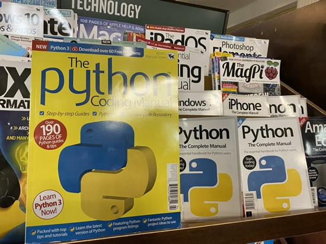](https://blog.adafruit.com/?s=%22we+are+what+we+celebrate%22&posts=ALL)

Magazine covers, even now, are still are one the places we as a society decide to celebrate specific people in some way. For business and tech publications, who, or what, we put on the cover and why says what’s important to us, what we’ve done, and where we are going.

For years we’ve done a feature here on Adafruit called “We are what we celebrate” which is a quick look at what is one the newsstands. Check out all the posts [“We are what we celebrate”](https://blog.adafruit.com/?s=%22we+are+what+we+celebrate%22&posts=ALL) on the Adafruit blog.

On a specific Python note, we're seeing more and more Python, and Python on hardware articles, books, and magazines - a welcome addition to newsstands.

## A CircuitPython ADABOX ships in a few days...

The next ADABOX from Adafruit ships in about 5 days! We are about to run out of openings, so move fast! - [adafruit.com/adabox](https://www.adafruit.com/adabox) Curated Adafruit products, unique collectibles, and exclusive discounts. Delivered quarterly. Subscribe now or give as a gift! Make outside the box - [ADABOX.COM](https://www.adafruit.com/adabox) GET ONE NOW, IT IS CIRCUITPYTHON POWERED!! - [YouTube](https://youtu.be/XuotQbmCrDo).

## Arm AIoT Dev Summit December 2 – 3, 2019!

Arm AIoT Dev Summit, Mountain View, California, December 2 – 3, 2019. The Arm AIoT Dev Summit is a developer-focused conference that provides a platform for you to exchange knowledge, discuss real-world use cases and solutions, and get hands-on with expert-led, deep-dive training and workshops. 

Adafruit hardware will be there!

Along with like-minded developers, data scientists, and innovators, you will experience technologies enabling the Internet of Things (IoT), Artificial Intelligence (AI) and robotics. Get your hands on free hardware worth up to $500 [arm.com/AIoT-Dev-Summit](http://arm.com/AIoT-Dev-Summit)

## Take Flight with Feather - Hackaday and Digi-Key

The Adafruit Feather is the latest platform for microcontroller development, and companies like Particle, Sparkfun, and Seeed Studios are producing Feather-compatible devices for development and prototyping. Now it’s your turn. Design a board to fit in the Feather ecosystem and we’ll manufacture it. The best project in the Take Flight With Feather contest will be sent off to pick and place machines and head straight to the Digi-Key warehouse!

To get started, take a look at the current [Feather ecosystem](https://learn.adafruit.com/adafruit-feather/community-feathers-wings) and get acquainted with the [GitHub repo filled with examples and tutorials](https://github.com/adafruit/awesome-feather).

Here are just some of them! There are over 33+ at this time!

Stop by [hackaday.io for more details](https://hackaday.io/contest/168107-take-flight-with-feather)!

Speaking of Feather! 

## SparkFun RED-V Thing Plus – SiFive RISC-V FE310 SoC takes flight with FEATHER

>_"… the Thing Plus footprint is also Feather-compatible, you can take advantage of existing shield options. We have included a Qwiic connector to enable future use of our handy plug-and-play I2C Qwiic Connect System which means no soldering or shields are required*. With so much freedom & growing industry functionality, the SparkFun RED-V Thing Plus is an ideal choice for your RISC-V project."_ - [SparkFun](https://www.sparkfun.com/products/15799).

## MAKER CHRISTMAS PRESENTS – Issue 25 – HackSpace magazine: Maker Christmas!

[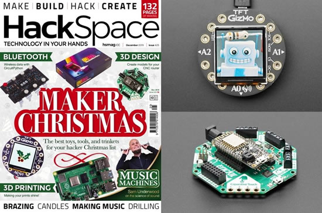](https://hackspace.raspberrypi.org/issues/25)

On pages 36 to 49 of the latest HackSpace, check out "MAKER CHRISTMAS PRESENTS - The best tools, toys, and trinkets for your hacker Christmas list" .... a bunch of CircuitPython powered boards, and more, made the list!

*   [TFT Gizmo](https://www.adafruit.com/product/4367).
*   [CRCIKIT](https://www.adafruit.com/?q=crickit).
*   [Circuit Playground Bluefruit](https://www.adafruit.com/product/4333).
*   [Grand Central](https://www.adafruit.com/product/4064). And more!

[Read more](https://hackspace.raspberrypi.org/issues/25), [download PDF](https://hackspace.raspberrypi.org/issues/25/pdf), [buy now](https://store.rpipress.cc/collections/hackspace-magazine/products/hackspace-magazine-25), [subscribe](https://raspberrypipress.imbmsubscriptions.com/hackspace-magazine/). 

AND! If you *do* subscribe... [free CPX!](https://raspberrypipress.imbmsubscriptions.com/hackspace-magazine/)

[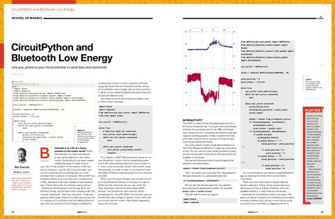](https://hackspace.raspberrypi.org/issues/25)

What else? [CircuitPython and Bluetooth Low Energy](https://hackspace.raspberrypi.org/issues/25) by Ben Everard, Link your phone to your microcontroller to send data and commands –

>_"Bluetooth is in a bit of a funny position in the maker world. While theoretically it is really well placed to be a great addition to the maker toolkit, historically it’s not been widely utilised because it’s been hard to use. Part of the problem is the need to write two bits of software – one for the microcontroller, and one for whatever you’re sending data to it with, whether that’s a phone or computer. Where WiFi has enabled makers to do one side with a simple bit of HTML, Bluetooth has often needed a fully featured app. There’s also a bit of confusion about names – Bluetooth and Bluetooth Low Energy (BLE) are different things, yet are both often lumped under the moniker ‘Bluetooth’. We’ll be using BLE. Things are getting a little easier thanks to a really easy-to-use set of modules in CircuitPython and the Adafruit Bluefruit app."_

## Testing CircuitPython Modules

Nicholas Tollervey's post about the latest testing of the radio module -

>_"I was privileged to recently complete a block of work for Adafruit: I've written a CircuitPython module called adafruit_radio that makes it easy for Bluetooth enabled Adafruit boards to communicate with each other. The API is a simplified version of the work myself and a number of other volunteers did on the equivalent functionality for the BBC micro:bit."_

[Read more](http://ntoll.org/article/circuitpython-tests).

## News from around the web!

[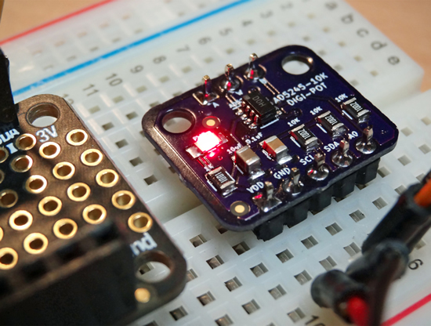](https://hackaday.io/project/168605-ad5245-digital-potentiometer-breakout)

The AD5245 Digital Potentiometer breakout board is a simple implementation of the Analog Devices' I2C, 10K-ohm chip. The potentiometer sports 256 resistance steps and can work with a power source from 2.7v to 5.5v. The pins act similarly to a passive resistive potentiometer, but require that voltages placed on any of the three pins not exceed the power supply voltage or drop below ground potential. A CircuitPython library is included in the code folder of the [GitHub repository](https://github.com/CedarGroveStudios/AD5245_Digital_Pot).

>_"it blew people’s minds to see how easy circuitpython is to use."_ - [Twitter](https://twitter.com/no1089/status/1198081568922722305).

[A Weekend Full Of Hacking, and Projects Realized](https://www.alexwhittemore.com/a-weekend-full-of-hacking-and-projects-realized/) by Alex.

CircuitPython sculpture clock adds character to any desk - [Hackaday](https://hackaday.com/2019/11/21/circuitpython-sculpture-clock-adds-character-to-any-desk/).

[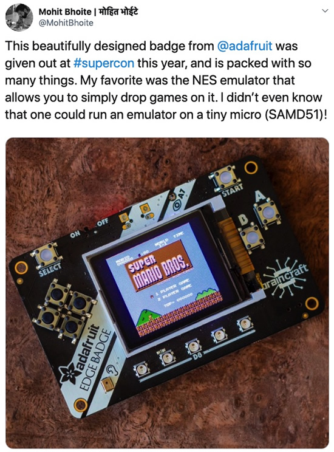](https://twitter.com/MohitBhoite/status/1198348083257475072)

The Edge Badge not only runs CircuitPython, it's a NES emulator - [Twitter](https://twitter.com/MohitBhoite/status/1198348083257475072).

Nice post up at Embedded Computing Design [Hackaday Superconference 2019: An Incredible Collection of People and Tech](https://www.embedded-computing.com/guest-blogs/hackaday-superconference-2019-an-incredible-collection-of-people-and-tech) - 

>_"...it was especially neat to run into Scott Shawcroft, who was introduced as pretty much being “CircuitPython,” the language that’s used to program the Adafruit Edge Badges that we received. These badges are conveniently set up so that when plugged in you can open up the program as a text file and make modifications."_

[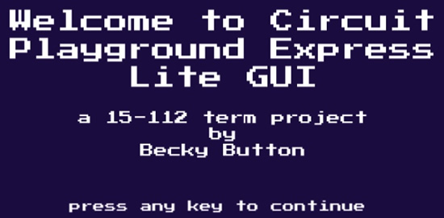](https://github.com/EinsteinUnicorn/term_project_112)

Becky is working on Python that writes Python for the Circuit Playground Express - [GitHub](https://github.com/EinsteinUnicorn/term_project_112) via [Twitter](https://twitter.com/einsteinunicorn/status/1197213640291688448).

[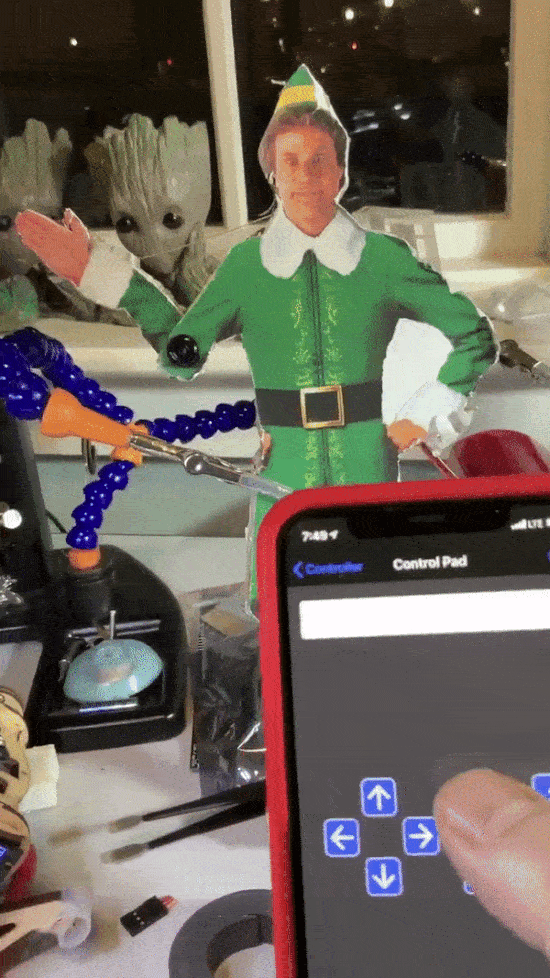](https://twitter.com/gallaugher/status/1197680180313153536)

Buddy the Elf is coming soon using CircuitPython and Circuit Playground Express Bluefruit - [Twitter](https://twitter.com/gallaugher/status/1197680180313153536).

After dark Blinka board, originally designed by Deshipu, sent off by Melissa - [Twitter](https://twitter.com/makermelissa/status/1197006552084840448?s=12).

CircuitPython Updater [from the forums](https://forums.adafruit.com/viewtopic.php?f=60&t=159056)! [Code](https://gitlab.com/CodeyDev/circuit-python-updater) and [docs](https://gitlab.com/CodeyDev/circuit-python-updater/wikis/home)!

Latest batch of SAM32 fresh out of the oven CircuitPython powered SAMD51 with an ESP32 coprocessor and SD card. Open source and documented - [SAM32](https://www.notion.so/SAM32-Guides-6b7e8ca318ff49418eec16e975d98f5d).

[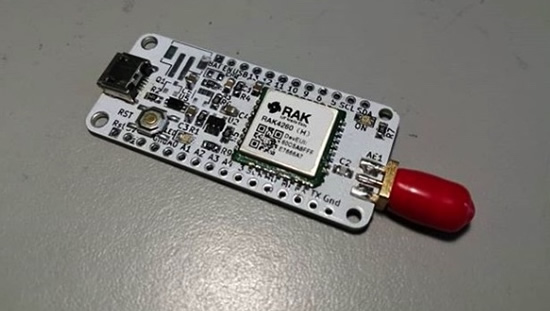](https://twitter.com/electronicats/status/1196853723894558722)

BastWAN with SMR34 compatible with CircuitPython from Electronic Cats - [Twitter](https://twitter.com/electronicats/status/1196853723894558722).

PyBadge Reverse Pong - CircuitPython based game example code, [YouTube](https://youtu.be/y5f90KyQ64g), & [hackaday.io](https://hackaday.io/project/168576-pybadge-reverse-pong)

[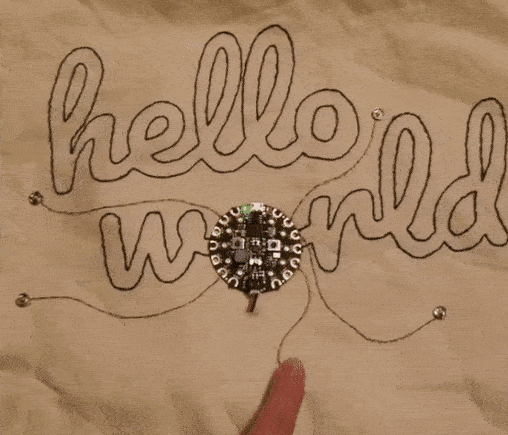](https://www.instagram.com/p/B5MQQ8kJ_sG/?igshid=tosxuiw0llgy)

Conductive thread + Circuit Playground - [Instagram](https://www.instagram.com/p/B5MQQ8kJ_sG/?igshid=tosxuiw0llgy).

[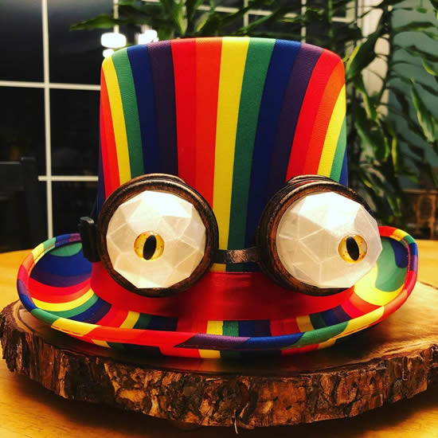](https://www.instagram.com/p/B5LIvM_BGA0/?igshid=1ove7fun7c5yw)

*"It might be Christmas at Costco for 3 months out of the year. At our house, it’s still Halloween. These rainbow steampunk goggles are all trimmed up and ready to be worn, reprogrammed, & expanded upon."* - [Instagram](https://www.instagram.com/p/B5LIvM_BGA0/?igshid=1ove7fun7c5yw).

What’s better than an electronic tour of “Sparky The Unicorn?” A ride ON “Sparky The Unicorn” - [Twitter](https://twitter.com/notabombbunke/status/1198080485672542209?s=12).

Just say no to boring luggage! With the help of NeoPixels. Inspired by the OOZE MASTER 3000 project by 
PaintYourDragon - [Twitter](https://twitter.com/maridegrazia/status/1196841446281641984). Also, one editor's note, do not be "that guy" who always says something about the TSA and airline regulations on Twitter when someone posts a project.

Looking foward to what Jorvon comes up with for the next companion bot - [Twitter](https://twitter.com/Odd_Jayy/status/1197897541385244673).

BEHOLD!!! It is LED-henge brought to you by Trinket and 8 Neopixels - [Twitter](https://twitter.com/NickRuffilo/status/1198093028407287808).

deshipu showed off the latest prototype of PewPew M4 at the HeroFest: The Gaming-, Esports and Cosplay-Festival in the BERNEXPO! - [Twitter](https://twitter.com/deshipu/status/1197267856523776001).

Feather CANBus Shield, designed by IAmOrion in United Kingdom. This is a CAN-Bus shield, designed with novices in mind and so uses 99% THT (Through-Hole Components) that is designed to be used with any of Adafruit's Feather range - [Tindie](https://www.tindie.com/products/iamorion/feather-canbus-shield/).

Thea Flowers – Creating A Sega-Inspired Hardware Synthesizer From The Ground Up - [Hackaday](https://hackaday.com/2019/11/22/thea-flowers-creating-a-sega-inspired-hardware-synthesizer-from-the-ground-up/), and [YouTube](https://youtu.be/Yt-QnINCskI).

Tumult Hype 4.0, have not tried this out, but want to - [Hype](https://tumult.com/hype/).

6 remarkable features of the new United Nations open source initiative - [OpenSource.com](https://opensource.com/article/19/11/united-nations-goes-open-source)

Unable to load code for ESP32 Dev Module board, keepin an eye on this as the new Arduino Pro IDE - [GitHub](https://github.com/arduino/arduino-pro-ide/issues/140).

Where Can You Find Things Like Giant Sequins And Fake Dirt? Check Out The Great Big Exhibit Resource List! - [ExhibiTricks](https://blog.orselli.net/2019/11/where-can-you-find-things-like-giant.html).

Port Adafruit ZeroDMA to Rust - [GitHub](https://github.com/atsamd-rs/atsamd/pull/60/files).

GitHub Arctic Code Vault Countdown with PyPortal - Using the PyPortal Event Countdown Clock guide, we took a PyPortal and made a countdown to the deadline for the Arctic Code Vault - [learn.adafruit.com](https://blog.adafruit.com/2019/11/21/github-arctic-code-vault-countdown-with-pyportal-pyportal-arcticcodevault-archive-opensource-github-adafruit/)

NeoPixel bunny :) - [Instagram](https://www.instagram.com/p/B5JsmUXH2w2/?igshid=4oiu4eaxc8nx).

3D printed stars on trees - [Instgram](https://www.instagram.com/p/B5O0PwGluMy/?igshid=131zn9utan4ie).

Geek Mom's wearable micro:bit powered back pack, more details [will be coming soon](https://brightwearables.com/) - [Twitter](https://twitter.com/GeekMomProjects/status/1197057394297036801).

The latest ESP news is here! - [Espressif](https://mailchi.mp/5a6be494e468/espressif-esp-news-november-2019?e=ed7e71c663).

[Here is the latest edition of The Circuit](http://thecircuit.constructlearning.org/issues/the-circuit-issue-3-207592) where they bring you a bite sized digest of news, events, and jobs in the STEM and maker world.

[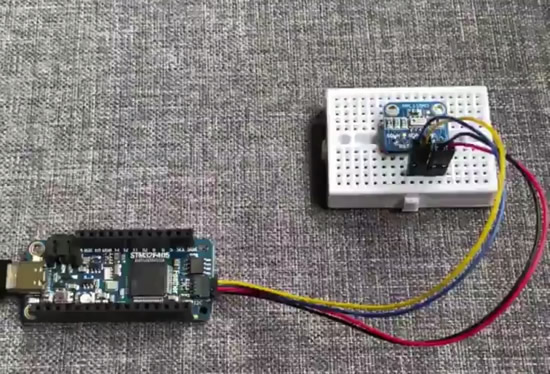](https://twitter.com/27mike30/status/1196720943806193664)

STM32F405 Feather hooked up to a MPL115A2 telling me how cold a location is in the morning - [Twitter](https://twitter.com/27mike30/status/1196720943806193664).

Why is the Migration to Python 3 Taking So Long? - [Stack Overflow](https://stackoverflow.blog/2019/11/14/why-is-the-migration-to-python-3-taking-so-long/).

3d-ken-burns - This is a reference implementation of 3D Ken Burns Effect from a Single Image [1] using PyTorch. Given a single input image, it animates this still image with a virtual camera scan and zoom subject to motion parallax - [GitHub](https://github.com/sniklaus/3d-ken-burns).

[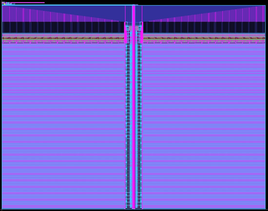](https://vlsida.github.io/OpenRAM/)

OpenRAM is an open-source Python framework to create the layout, netlists, timing and power models, and placement and routing models for SRAMs in ASIC design, and it was just [given $75k](https://twitter.com/UCSC_OpenRAM/status/1198719476180500480) from Google to support the project - [OpenRAM](https://vlsida.github.io/OpenRAM/).

Python Tutorial: Zip Files - Creating and Extracting Zip Archives - [YouTube](https://youtu.be/z0gguhEmWiY).

Fire and smoke detection with Keras and Deep Learning - [PyImageSearch](https://www.pyimagesearch.com/2019/11/18/fire-and-smoke-detection-with-keras-and-deep-learning/).

How To Run TensorFlow Lite on Raspberry Pi for Object Detection - [YouTube](https://youtu.be/aimSGOAUI8Y).

Python in Visual Studio Code – November 2019 Release - [Microsoft](https://devblogs.microsoft.com/python/python-in-visual-studio-code-november-2019-release/).

Legra (Lego brick Graphics) is a small library that lets you draw using LEGO® like brick shapes on an HTML element. This library defines basic graphics primitives like lines, rectangles, polygons, ellipses, bézier curves, etc. All shapes are drawn either outlined or filled in. The size and color of the bricks used can be configured. Legra can be used to create fun digital sketches, diagrams, or data visualizations - [LegraJS](https://legrajs.com/), and [GitHub](https://github.com/pshihn/legra).

The Circular Piano on Gaga's Stage - PianoArc Story - [YouTube](https://youtu.be/lCfcaggl6OI).

Running Windows on a consumer calculator was a dream until the appearance of HP Prime G2 Graphical Calculator. This calculator has the most superior hardware specification among the market so far. This post discusses the implementation of UEFI and ACPI on this device - [imbushuo.net](https://www.imbushuo.net/blog/archives/725)

Apple has broken ground on its new 133-acre campus in Austin, which will initially house 5,000 employees, will make the Mac Pro there - [Apple](https://www.apple.com/newsroom/2019/11/apple-expands-in-austin/).

[Proposed Commercials featuring Mac team Members in October 1983, Full Demo Reel (video)](https://www.youtube.com/watch?v=1lIzmR1LHf4). [Andy Hertzfeld](http://www.folklore.org/) writes -

>_"A few years ago, I uploaded some interview snippets recored in October 1983 with members of the original Mac team, intended for commercials that were never used. This post is the entire reel of proposed commercials, featuring mini-interviews with Mike Murray, Burrell Smith, Bill Atkinson, Susan Kare, George Crow and me."_

When we hear about how the teams from the Apple 1983 Mac efforts emphasized ease of use, simplicity ... it reminds us of many of the things we say and want to do with CircuitPython.

NASA’s Latest Software Catalog Offers New Codes, Easier Way to Download Free Software - [NASA](https://www.nasa.gov/directorates/spacetech/techtransfer/Software_Catalog_2019).

Here’s One Reason the U.S. Military Can’t Fix Its Own Equipment. Manufacturers can prevent the Department of Defense from repairing certain equipment, which puts members of the military at risk, Captain Ekman is a logistics officer in the United States Marine Corps - [NY Times](https://www.nytimes.com/2019/11/20/opinion/military-right-to-repair.html).

NYC Mayor Signs Executive Order to Establish Algorithms Management and Policy Officer - [NYC](https://www1.nyc.gov/office-of-the-mayor/news/554-19/mayor-de-blasio-signs-executive-order-establish-algorithms-management-policy-officer).

Information is Beautiful Awards 2019: The Winners - [informationisbeautifulawards.com](https://www.informationisbeautifulawards.com/)

Linux 5.4 Release – Main changes: Arm, MIPS & RISC-V architectures - [cnx](https://www.cnx-software.com/2019/11/25/linux-5-4-release-main-changes-arm-mips-risc-v-architectures/).

The Bus Ticket Theory of Genius, _"to have a disinterested obsession with something that matters"_ - [Paul Graham](http://paulgraham.com/genius.html).

CircuitPython Weekly November 25th, 2019 [on YouTube](https://youtu.be/G4d558ufcZM) and [on diode.zone](https://diode.zone/videos/watch/e14d1399-8b28-491e-8a11-d9b20fde2e87)

PyDev of the Week: Miguel Grinberg on [Mouse vs Python](https://www.blog.pythonlibrary.org/2019/11/25/pydev-of-the-week-miguel-grinberg/)

[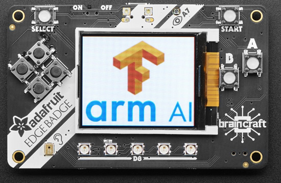](http://arm.com/AIoT-Dev-Summit)

#ICYDNCI What was the most popular, most clicked link, in [last week's newsletter](https://www.adafruitdaily.com/2019/11/19/a-supercon-was-had-arm-aiot-dev-summit-is-almost-here-and-more-python-adafruit-circuitpython-pythonhardware-circuitpython-micropython-thepsf-adafruit/)? [The Arm IoT Summit](http://arm.com/AIoT-Dev-Summit).

## New Learn Guides!

[TFT Gizmo Turtle](https://learn.adafruit.com/tft-gizmo-turtle) from [Noe and Pedro](https://learn.adafruit.com/users/pixil3d)

[Adafruit Mini GPS PA1010D Module](https://learn.adafruit.com/adafruit-mini-gps-pa1010d-module) from [Kattni](https://learn.adafruit.com/users/kattni)

## Updated Guides - Now With More Python!

**You can use CircuitPython libraries on Raspberry Pi!** We're updating all of our CircuitPython guides to show how to wire up sensors to your Raspberry Pi, and load the necessary CircuitPython libraries to get going using them with Python. We'll be including the updates here so you can easily keep track of which sensors are ready to go. Check it out!

Keep checking back for more updated guides!

## CircuitPython Libraries!

CircuitPython support for hardware continues to grow. We are adding support for new sensors and breakouts all the time, as well as improving on the drivers we already have. As we add more libraries and update current ones, you can keep up with all the changes right here!

For the latest drivers, download the [Adafruit CircuitPython Library Bundle](https://circuitpython.org/libraries).

If you'd like to contribute, CircuitPython libraries are a great place to start. Have an idea for a new driver? File an issue on [CircuitPython](https://github.com/adafruit/circuitpython/issues)! Interested in helping with current libraries? Check out the [CircuitPython.org Contributing page](https://circuitpython.org/contributing). We've included open pull requests and issues from the libraries, and details about repo-level issues that need to be addressed. We have a guide on [contributing to CircuitPython with Git and Github](https://learn.adafruit.com/contribute-to-circuitpython-with-git-and-github) if you need help getting started. You can also find us in the #circuitpython channel on the [Adafruit Discord](https://adafru.it/discord). Feel free to contact Kattni (@kattni) with any questions.

You can check out this [list of all the CircuitPython libraries and drivers available](https://github.com/adafruit/Adafruit_CircuitPython_Bundle/blob/master/circuitpython_library_list.md). 

The current number of CircuitPython libraries is **196**!

**New Libraries!**

Here's this week's new CircuitPython libraries:

* [Adafruit_CircuitPython_DisplayIO_SSD1305](https://github.com/adafruit/Adafruit_CircuitPython_DisplayIO_SSD1305)

**Updated Libraries!**

Here's this week's updated CircuitPython libraries:

 * [Adafruit_CircuitPython_framebuf](https://github.com/adafruit/Adafruit_CircuitPython_framebuf)
 * [Adafruit_CircuitPython_WS2801](https://github.com/adafruit/Adafruit_CircuitPython_WS2801)
 * [Adafruit_CircuitPython_RGB_Display](https://github.com/adafruit/Adafruit_CircuitPython_RGB_Display)
 * [Adafruit_CircuitPython_SSD1305](https://github.com/adafruit/Adafruit_CircuitPython_SSD1305)

**PyPI Download Stats!**

We've written a special library called Adafruit Blinka that makes it possible to use CircuitPython Libraries on [Raspberry Pi and other compatible single-board computers](https://learn.adafruit.com/circuitpython-on-raspberrypi-linux/). Adafruit Blinka and all the CircuitPython libraries have been deployed to PyPI for super simple installation on Linux! Here are the top 10 CircuitPython libraries downloaded from PyPI in the last week, including the total downloads for those libraries:

| Library                                     | Last Week   | Total |   
|:-------                                     |:--------:   |:-----:|   
| Adafruit-Blinka                             | 1283        | 43174 |   
| Adafruit_CircuitPython_BusDevice            | 718         | 26118 |   
| Adafruit_CircuitPython_MCP230xx             | 249         | 9580 |    
| Adafruit_CircuitPython_NeoPixel             | 174         | 5195 |    
| Adafruit_CircuitPython_Register             | 149         | 5713 |    
| Adafruit_CircuitPython_LIS3DH               | 122         | 2697 |    
| Adafruit_CircuitPython_PCA9685              | 116         | 3870 |    
| Adafruit_CircuitPython_ServoKit             | 110         | 3098 |    
| Adafruit_CircuitPython_PN532                | 108         | 1426 |    
| Adafruit_CircuitPython_Motor                | 101         | 4124 |    

## What is the team up to this week?

Epic week, all reporting in!

**Bryan**

[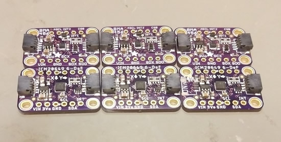](https://www.circuitpython.org)

This week on my bench I have, drumroll please.... two more motion sensors! The ICM-20649 and BMA456 have both made their way to me and I've successfully done initial tests with both. Next up I'll be working on drivers for both for CircuitPython and Arduino. Is this the end of Motion Sensor Season? Only time will tell...

**Dan**

We released CircuitPython 5.0.0-beta.0 Tuesday, along with the companion new adafruit_ble library! We're now updating all our CircuitPython BLE Learn Guides to match the new API in 5.0.0-beta.0

**Jeff**

This week I am improving how the CircuitPython software itself is built.  I fixed a problem which could have caused translations to be incomplete, and worked on compatibility with a newer version of the GCC compiler.  I also prototyped some performance improvements (15-30% increase running Python code according to one benchmark), but it is not yet compatible with all supported boards, so further work is required.

**Kattni**

This week's guide was the [PA1010D Mini GPS Module](https://www.adafruit.com/product/4415) - a little all-in-one breakout that uses I2C and has STEMMA QT connectors on it. The [new guide](https://learn.adafruit.com/adafruit-mini-gps-pa1010d-module) has wiring diagrams, example code, and all the board information you need to get started with the Mini GPS Module. I started a guide for the [Circuit Playground Tri-Color E-Ink Gizmo](https://www.adafruit.com/product/4428) as well. The guide will include some easy-to-use CircuitPython code, making it super simple to get started adding an e-ink display to your Circuit Playground Express and Bluefruit projects. Speaking of Circuit Playground, I also did a complete refactor of the Circuit Playground Express library to now include the Circuit Playground Bluefruit! All of the Express code will continue to work the same, but you can now use the same concepts on the Circuit Playground Bluefruit. It still needs to be fully tested, but quick tests were successful. The Bluefruit module has all the same features as the Express module, plus a couple of bonus features, and the plan is to eventually add Bluetooth features as well!

**Lucian**

This week I worked on implementing the Neopixel module into the STM32 port, as well as addressing some timing bugs in the SPI and delay code. I also implemented the true random number generator into os.urandom. This coming week, I'll be working on adding new boards to the STM32 port, fixing some final issues with DisplayIO, and cleaning up the port structure to better handle the distinction between a board and an MCU package. 

**Melissa**

This past week I got back from Hackaday SuperCon where I had a lot of fun and got to meet a lot of awesome people. After getting back, I caught up on emails and other messages and went on to closing some outstanding pull requests. I also worked with Kattni to get the E-Ink Gizmo guide by adding the E-Ink Gizmo to the Gizmo Library and writing a quick example. After that I added an example to the Adafruit EPD library and added E-Ink support to the Arduino ImageReader library. After the guide is available, I will be working on updating any guides for CharliePlexing with the IS31FL3731.

**Scott**

I had a great time last weekend chatting with folks at Supercon. Lots of interest in supporting CircuitPython on more hardware! Once back and caught up, I dove back into the new BLE library and dusted off the pairing support. Once paired, I got the Apple Notification Center Service up and running and then got BLE HID mostly working. This short week will be more BLE HID and also making an Apple Pie. :-)

## Upcoming events!

Arm AIoT Dev Summit, Mountain View, California, December 2 – 3, 2019. The Arm AIoT Dev Summit is a developer-focused conference that provides a platform for you to exchange knowledge, discuss real-world use cases and solutions, and get hands-on with expert-led, deep-dive training and workshops - [arm.com/AIoT-Dev-Summit](http://arm.com/AIoT-Dev-Summit)

TechAhoy Inc. is a nonprofit makerspace located in Queens, NY building tech literacy by educating, encouraging and empowering community members, some classes coming up!

>_"We are planning two family workshops that will be hosted over the weekend: 1. Code Together - learn to code with your kids using a Circuit Playground Express, an amazing board from Adafruit and 2. Light up the Night - learn how to add LEDs and EL wire to jackets, hats, and more. We are also offering the Code in Python class on Saturday December 7th at 3PM!"_

Scott is speaking at [PyCascades](https://2020.pycascades.com/) about Python's Next Decade and Us. It's February 8th and 9th, 2020.

>_"PyCascades is a two-day, single-track Python conference. We previously hosted PyCascades in Vancouver and Seattle. For our third iteration in 2020 we'll be in Portland, Oregon. PyCascades is organized by members of the Python communities in Vancouver, Seattle, and Portland. We aim to bring together Python users and developers from both the Pacific Northwest and around the world."_

April 15-23, 2020, Pittsburgh, Pennsylvania, USA - The PyCon 2020 conference, which will take place in Pittsburgh, is the largest annual gathering for the community using and developing the open-source Python programming language. It is produced and underwritten by the Python Software Foundation, the 501(c)(3) nonprofit organization dedicated to advancing and promoting Python. Through PyCon, the PSF advances its mission of growing the international community of Python programmers - [PyCon 2020](https://us.pycon.org/2020/).

## Latest releases

CircuitPython's stable release is [4.1.0](https://github.com/adafruit/circuitpython/releases/latest) and its unstable release is [5.0.0-beta.0](https://github.com/adafruit/circuitpython/releases). New to CircuitPython? Start with our [Welcome to CircuitPython Guide](https://learn.adafruit.com/welcome-to-circuitpython).

[20191123](https://github.com/adafruit/Adafruit_CircuitPython_Bundle/releases/latest) is the latest CircuitPython library bundle.

[v1.11](https://micropython.org/download) is the latest MicroPython release. Documentation for it is [here](http://docs.micropython.org/en/latest/pyboard/).

[3.8.0](https://www.python.org/downloads/) is the latest Python release.

[1476 Stars](https://github.com/adafruit/circuitpython/stargazers) Like CircuitPython? [Star it on GitHub!](https://github.com/adafruit/circuitpython)

## ALL a BOARD – 87+ boards!

[CircuitPython.org/downloads](https://circuitpython.org/downloads) now has over 87 boards!

Latest boards include:

 * [EdgeBadge](https://circuitpython.org/board/edgebadge/) by Adafruit.

## Call for help – CircuitPython messaging to other languages!

We [recently posted on the Adafruit blog](https://blog.adafruit.com/2018/08/15/help-bring-circuitpython-messaging-to-other-languages-circuitpython/) about bringing CircuitPython messaging to other languages, one of the exciting features of CircuitPython 4.x is translated control and error messages. Native language messages will help non-native English speakers understand what is happening in CircuitPython even though the Python keywords and APIs will still be in English. If you would like to help, [please post](https://github.com/adafruit/circuitpython/issues/1098) to the main issue on GitHub and join us on [Discord](https://adafru.it/discord).

We made this graphic with translated text, we could use your help with that to make sure we got the text right, please check out the text in the image – if there is anything we did not get correct, please let us know. Dan sent me this [handy site too](http://helloworldcollection.de/#Human).

## jobs.adafruit.com - Find a dream job, find great candidates!

[jobs.adafruit.com](https://jobs.adafruit.com/) has returned and folks are posting their skills (including CircuitPython) and companies are looking for talented makers to join their companies - from Digi-Key, to Hackaday, Microcenter, Raspberry Pi and more.

## 15,092 thanks!

The Adafruit Discord community, where we do all our CircuitPython development in the open, reached over 15,092 humans, thank you! Join today! [https://adafru.it/discord](https://adafru.it/discord)

## ICYMI - In case you missed it

The wonderful world of Python on hardware! This is our first video-newsletter-podcast that we’ve started! The news comes from the Python community, Discord, Adafruit communities and more. It’s part of the weekly newsletter, then we have a segment on ASK an ENGINEER and this is the video slice from that! The complete Python on Hardware weekly videocast [playlist is here](https://www.youtube.com/playlist?list=PLjF7R1fz_OOXRMjM7Sm0J2Xt6H81TdDev). 

This video podcast is on [iTunes](https://itunes.apple.com/us/podcast/python-on-hardware/id1451685192?mt=2), [YouTube](https://www.youtube.com/playlist?list=PLjF7R1fz_OOXRMjM7Sm0J2Xt6H81TdDev), [IGTV (Instagram TV](https://www.instagram.com/adafruit/channel/)), and [XML](https://itunes.apple.com/us/podcast/python-on-hardware/id1451685192?mt=2).

[Weekly community chat on Adafruit Discord server CircuitPython channel - Audio / Podcast edition](https://itunes.apple.com/us/podcast/circuitpython-weekly-meeting/id1451685016) - Audio from the Discord chat space for CircuitPython, meetings are usually Mondays at 2pm ET, this is the audio version on [iTunes](https://itunes.apple.com/us/podcast/circuitpython-weekly-meeting/id1451685016), Pocket Casts, [Spotify](https://adafru.it/spotify), and [XML feed](https://adafruit-podcasts.s3.amazonaws.com/circuitpython_weekly_meeting/audio-podcast.xml).

And lastly, we are working up a one-spot destination for all things podcast-able here - [podcasts.adafruit.com](https://podcasts.adafruit.com/)

## Codecademy "Learn Hardware Programming with CircuitPython"

Codecademy, an online interactive learning platform used by more than 45 million people, has teamed up with the leading manufacturer in STEAM electronics, Adafruit Industries, to create a coding course, "Learn Hardware Programming with CircuitPython". The course is now available in the [Codecademy catalog](https://www.codecademy.com/learn/learn-circuitpython?utm_source=adafruit&utm_medium=partners&utm_campaign=circuitplayground&utm_content=pythononhardwarenewsletter).

Python is a highly versatile, easy to learn programming language that a wide range of people, from visual effects artists in Hollywood to mission control at NASA, use to quickly solve problems. But you don’t need to be a rocket scientist to accomplish amazing things with it. This new course introduces programmers to Python by way of a microcontroller — CircuitPython — which is a Python-based programming language optimized for use on hardware.

CircuitPython’s hardware-ready design makes it easier than ever to program a variety of single-board computers, and this course gets you from no experience to working prototype faster than ever before. Codecademy’s interactive learning environment, combined with Adafruit's highly rated Circuit Playground Express, present aspiring hardware hackers with a never-before-seen opportunity to learn hardware programming seamlessly online.

Whether for those who are new to programming, or for those who want to expand their skill set to include physical computing, this course will have students getting familiar with Python and creating incredible projects along the way. By the end, students will have built their own bike lights, drum machine, and even a moisture detector that can tell when it's time to water a plant.

Visit Codecademy to access the [Learn Hardware Programming with CircuitPython](https://www.codecademy.com/learn/learn-circuitpython?utm_source=adafruit&utm_medium=partners&utm_campaign=circuitplayground&utm_content=pythononhardwarenewsletter) course and Adafruit to purchase a [Circuit Playground Express](https://www.adafruit.com/product/3333).

Codecademy has helped more than 45 million people around the world upgrade their careers with technology skills. The company’s online interactive learning platform is widely recognized for providing an accessible, flexible, and engaging experience for beginners and experienced programmers alike. Codecademy has raised a total of $43 million from investors including Union Square Ventures, Kleiner Perkins, Index Ventures, Thrive Capital, Naspers, Yuri Milner and Richard Branson, most recently raising its $30 million Series C in July 2016.

## Contribute!

The CircuitPython Weekly Newsletter is a CircuitPython community-run newsletter emailed every Tuesday. The complete [archives are here](https://www.adafruitdaily.com/category/circuitpython/). It highlights the latest CircuitPython related news from around the web including Python and MicroPython developments. To contribute, edit next week's draft [on GitHub](https://github.com/adafruit/circuitpython-weekly-newsletter/tree/gh-pages/_drafts) and [submit a pull request](https://help.github.com/articles/editing-files-in-your-repository/) with the changes. Join our [Discord](https://adafru.it/discord) or [post to the forum](https://forums.adafruit.com/viewforum.php?f=60) for any further questions.
