- [ ] Link "View this email in your browser."

[View this email]() in your browser.

Hi everyone! It's the latest Python for Microcontrollers newsletter brought you by the community! Find us on [Discord](https://discord.gg/HYqvREz), [Twitter](https://twitter.com/search?q=circuitpython&src=typed_query&f=live), and for past newsletters - [view them all here](https://www.adafruitdaily.com/category/circuitpython/). Let's get started!

## CircuitPython snakes its way to the Teensy 4.0

[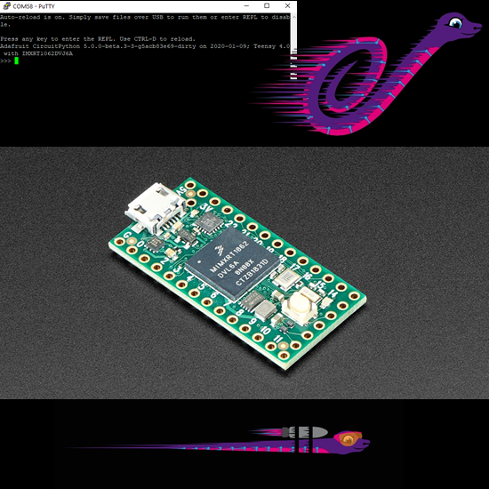](https://blog.adafruit.com/2020/01/10/testing-circuitpython-on-teensy-4-0-iot-made-easy-ioteensy-adafruit-circuitpython-arturo182-tannewt-nxp-paulstoffregen/)

CircuitPython is now available for [Paul Stoffregen's](https://twitter.com/PaulStoffregen/status/1216482624799068161) [Teeny 4.0.](https://www.pjrc.com/store/teensy40.html) This is super-early, not optimized, cutting-edge... there is a ready-to-use HEX file to experiment with. Open it with Teensy Loader and program onto your Teensy 4.0, for CircuitPython at 600 MHz.

[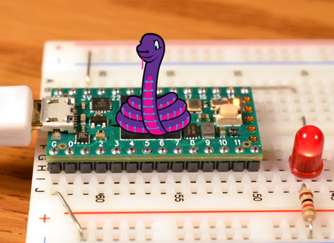](https://blog.adafruit.com/2020/01/10/testing-circuitpython-on-teensy-4-0-iot-made-easy-ioteensy-adafruit-circuitpython-arturo182-tannewt-nxp-paulstoffregen/)

[Join the discussion](https://forum.pjrc.com/threads/59040-CircuitPython-on-Teensy-4!) on the Teensy forums, on our [Discord](https://discord.gg/HYqvREz), and please file any and all issues here! - [GitHub](https://github.com/adafruit/circuitpython/issues/new).

In 20 minutes, actually less than that, we were able to make an IoTeensy project. Scott and Artur have done an amazing job bringing CircuitPython to the NXP iMX RT1062, this chip holds a lot of promise! We threw together a quick IoT project to test I2C and SPI – the OLED is an I2C device, and the AirLift Featherwing provides WiFi over SPI. This demo connects to opur AP, then queries the adafruit quote service to get an inspirational quote every 3 seconds. The JSON is parsed, split, and displayed on the OLED by scrolling. Was really fast to put together, only about 20 minutes and 100 lines of code - [YouTube](https://youtu.be/ICg_3I4jvKo).

## CircuitPython i.MX Feather progress

[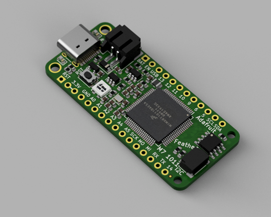](https://twitter.com/arturo182/status/1215036958956806144?s=12)

Things are moving fast for a CircuitPython i.MX Feather(s)! Some updated renderings - [Twitter](https://twitter.com/arturo182/status/1216033357940895744). The board also were taken out to a nice photoshoot! - [Twitter](https://twitter.com/arturo182/status/1215036958956806144?s=12).

And hackster.io has some coverage on ["Arturo182's NXP i.MX RT10xx Port Into CircuitPython Codebase"](https://www.hackster.io/news/adafruit-accepts-arturo182-s-nxp-i-mx-rt10xx-port-into-circuitpython-codebase-0592ee356cd4).

## Python slithers its way to Arduino

Looks like Arduino will be supporting Python in some way very soon, maybe?! In the [promo video](https://twitter.com/arduino/status/1214564465967955968) it lists “MicroPython” and on the [overview page](https://www.arduino.cc/pro/hardware/product/portenta-h7) “MicroPython / JavaScript via an interpreter” it’s available for [pre-order for $99](https://store.arduino.cc/usa/portenta-h7).

This is a powerful STM32H747XI dual Cortex®-M7+M4 32bit chip that runs pretty fast – SDRAM was added, and flash storage. If you’re going to want to get [TinyUSB](https://github.com/hathach/tinyusb) running on this thing, we have support for the STM32 H7 series. The board is Feather-like, and has a STEMMA/QWIIC-like connector, that's good to see that direction as that is where the market went.

The Portenta kinda reminds us of the [Pyboard D-series with STM32F767 and WiFi/BT from MicroPython](https://store.micropython.org/product/PYBD-SF6-W4F2), it has similar connectors on the bottom, fast chip, Wifi/BT, etc.

Alasdair Allan over on [hackster.io](http://hackster.io/) has the best coverage so far, [go check out the full article](https://www.hackster.io/news/the-new-arduino-portenta-5ae687010500).

## CircuitPython 2020, where do we want to go together?

#circuitpython2020 is our annual reflection on the state of CircuitPython. For the last couple weeks folks have sent in some wonderful stories, ideas, suggestions and more. [See the kick-off post](https://blog.adafruit.com/2020/01/01/what-do-you-want-from-circuitpython-in-2020-circuitpython2020-circuitpython/) for all of the details.

Here are all the posts that came in, thank you!

*   [David Glaude’s #circuitpython2020](https://blog.adafruit.com/2020/01/13/david-glaudes-circuitpython2020/)
*   [@hierophect and Don's #CircuitPython2020](https://blog.adafruit.com/2020/01/13/hierophect-and-dons-circuitpython2020/)
*   [@jerryn's Thoughts about CircuitPython in 2020 #CircuitPython2020](https://blog.adafruit.com/2020/01/12/jerryns-thoughts-about-circuitpython-in-2020-circuitpython2020/)
*   [@foamyguy's #circuitpython2020](https://blog.adafruit.com/2020/01/12/foamyguys-circuitpython2020/)
*   [Bryan’s Plans for CircuitPython in 2020 #CircuitPython2020 @siddacious](https://blog.adafruit.com/2020/01/10/bryans-plans-for-circuitpython-in-2020-circuitpython2020-siddacious/)
*   [@tannewt's focus for #CircuitPython2020](https://blog.adafruit.com/2020/01/10/tannewts-focus-for-circuitpython2020/)
*   [Two #circuitpython2020 email summaries](https://blog.adafruit.com/2020/01/10/two-circuitpython2020-email-summaries/)
*   [Dan Halbert: thoughts for #CircuitPython2020](https://blog.adafruit.com/2020/01/10/dan-halbert-thoughts-for-circuitpython2020/)
*   [#CircuitPython2020 updates from the Twitterverse](https://blog.adafruit.com/2020/01/08/circuitpython2020-updates-from-the-twitterverse/)
*   [Wayne W's #CircuitPython2020](https://blog.adafruit.com/2020/01/08/wayne-ws-circuitpython2020/)
*   [Adaveach's #CircuitPython2020](https://blog.adafruit.com/2020/01/08/adaveachs-circuitpython2020/)
*   [@tammymakesthings' Thoughts on #CircuitPython2020](https://blog.adafruit.com/2020/01/07/tammymakesthings-thoughts-on-circuitpython2020/)
*   [@ntoll's #CircuitPython2020](https://blog.adafruit.com/2020/01/07/ntolls-circuitpython2020/)
*   [#CircuitPython2020 email from Stew](https://blog.adafruit.com/2020/01/07/circuitpython2020-email-from-stew/)
*   [A story of this past year from Melissa and some thoughts on the future on CircuitPython in 2020 #circuitpython2020 @makermelissa](https://blog.adafruit.com/2020/01/07/a-story-this-past-year-from-melissa-and-some-thoughts-on-the-future-on-circuitpython-in-2020-circuitpython2020-makermelissa/)
*   [@sommersoft's 2020: Year Of The Blinka (v3)](https://blog.adafruit.com/2020/01/06/sommersofts-2020-year-of-the-blinka-v3/)
*   [Mini #CircuitPython2020 posts so far](https://blog.adafruit.com/2020/01/06/mini-circuitpython2020-posts-so-far/)
*   [Brent’s Thoughts about Python on Hardware 2020 #CircuitPython2020 #IoT](https://blog.adafruit.com/2020/01/06/brents-thoughts-about-python-on-hardware-2020-circuitpython2020-iot/)
*   [@deshipu's #CircuitPython2020](https://blog.adafruit.com/2020/01/03/deshipus-circuitpython2020/)
*   [@theavalkyrie's thoughts on #CircuitPython2020](https://blog.adafruit.com/2020/01/03/theavalkyries-thoughts-on-circuitpython2020/)
*   [HomeKit in #CircuitPython2020 from @mikeholczer](https://blog.adafruit.com/2020/01/02/homekit-in-circuitpython2020-from-mikeholczer/)
*   [#CircuitPython2020 Thoughts from @hukuzatuna](https://blog.adafruit.com/2020/01/02/circuitpython2020-thoughts-from-hukuzatuna/)
*   [Jeff’s Ideas for Python on Hardware in 2020 – Time & Timekeeping](https://blog.adafruit.com/2020/01/02/jeffs-ideas-for-python-on-hardware-in-2020-time-timekeeping/)
*   [#circuitpython2019 wrap-up post](https://blog.adafruit.com/2019/01/28/circuitpython-in-2019/)

## News from around the web!

Joey is working on the CircuitPython version of the OpenBook, [Twitter](https://twitter.com/josecastillo/status/1215388022692372480) and [GitHub](https://github.com/joeycastillo/circuitpython/tree/openbook/ports/atmel-samd/boards/openbook).

[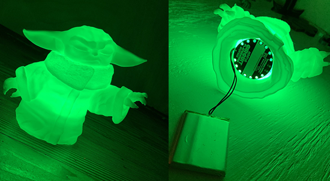](https://twitter.com/kwigbo/status/1216136280192569345)

Baby Yoda glows with Circuit Playground - [Twitter](https://twitter.com/kwigbo/status/1216136280192569345).

[From YouTube](https://www.youtube.com/watch?v=35W-NWu8i5g&lc=UgwGeT5wTi84BIZq2G14AaABAg) - _"If it wasn’t for circuit python I would of never got in to coding and would still be lost in this great and fun world of electronics with coding elements. Keep making this and everything you do great thanks again."_

The Undercroft is have a “Python & Pyportal” event on 1/29/20 at 6:30pm, BYOP, bring your own portal! - [Twitter](https://twitter.com/UndercroftHQ/status/1215677216903876609).

Some through-hole Feathers from the past that Joey made - [Twitter](https://twitter.com/josecastillo/status/1214714021900955652), and [GitHub](https://github.com/joeycastillo/Feather-Projects/tree/master/Through-Hole%20SAMD11%20Feather).

[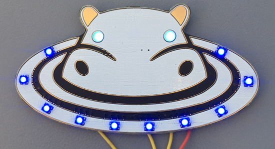](https://twitter.com/ndgarage/status/1214721396607049728)

Hippo is a Feather wing, [Twitter](https://twitter.com/ndgarage/status/1214721396607049728) and [Tindie](https://www.tindie.com/products/ndgarage/hippo/).

Doctor Who “psychic paper” powered by a Feather - [Twitter](https://twitter.com/NowOverAndOut/status/1214721327548043265).

Expect some Ada overlap with Doctor Who all this year! - [Twitter](https://twitter.com/KeNTKB/status/1216594115661463552).

NeoPixel_HD Feather Wing: Add-On Wing for Adafruit's feather boards - With a maximized number of neoPixels: A 22x9 RGB LED Matrix - [Twitter](https://twitter.com/tinyledmatrix/status/1214675343090565122), and [hackaday.io](https://hackaday.io/project/168448-neopixelhd-feather-wing)

Hacked / modded iPad keyboard with a Feather - [Twitter](https://twitter.com/photomattmills/status/1215793587838844928).

CircuitPython Game - No Step on Snek. Help Blinka escape a variety of feet in this Frogger clone developed on the Adafruit Edge Badge - [YouTube](https://youtu.be/8WjB1zcvVRU), and [hackaday.io](https://hackaday.io/project/168815-no-step-on-snek)

[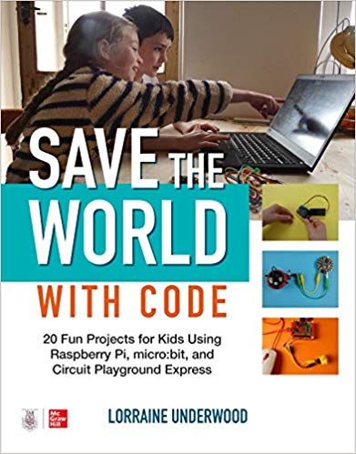](https://www.amazon.com/Save-World-Code-Raspberry-Playground/dp/1260457591)

Save the World with Code: 20 Fun Projects for All Ages Using Raspberry Pi, micro:bit, and Circuit Playground Express by Lorraine Underwood - [Amazon](https://www.amazon.com/Save-World-Code-Raspberry-Playground/dp/1260457591).

Scratch 3 extension for the Circuit Playground Express. You can view the available extension blocks here - [Scratch 3 OneGPIO Extensions](https://mryslab.github.io/s3-extend/#cpx_blocks/).

GEMMA based 3D printed ring prototype - [Twitter](https://twitter.com/chardane/status/1214081593532280832).

MagicLight BLE Bulb Circuit Playground Bluefruit Control - [YouTube](https://youtu.be/qEhtbHLAYho).

Programmable USB Hub by Capable Robot Components is a USB hub with per-port power and data disconnects + dev board + I2C, GPIO, and SPI bridges, works with CircuitPython! Here is the latest update - [Crowd Supply](https://www.crowdsupply.com/capable-robot-components/programmable-usb-hub/updates/production-update-part-ii).

[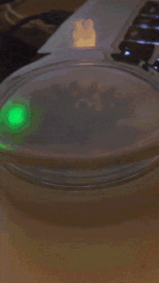](https://robotsandphysicalcomputing.blogspot.com/2019/12/playing-with-adafruit-circuit.html)

Playing with Adafruit Circuit Playground BlueFruit - [robotsandphysicalcomputing](https://robotsandphysicalcomputing.blogspot.com/2019/12/playing-with-adafruit-circuit.html), and [YouTube](https://youtu.be/uZqjUjbqMgU).

[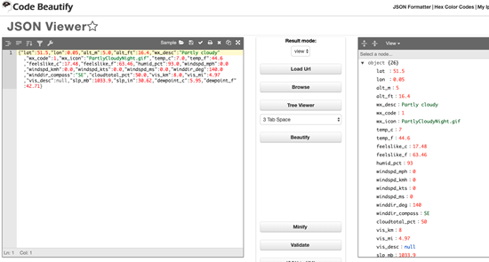](https://robotsandphysicalcomputing.blogspot.com/2019/12/adafruit-pyportal-from-twitter-to.html)

Adafruit PyPortal from Twitter to weather - [robotsandphysicalcomputing](https://robotsandphysicalcomputing.blogspot.com/2019/12/adafruit-pyportal-from-twitter-to.html).

Just in time for [#OrcaCon](https://twitter.com/hashtag/OrcaCon?src=hashtag_click)! Kaltazar's electronic communication badge, made with Circuit Playground Bluefruit, TFT Gizmo, and a 3d printed lanyard clip - [Twitter](https://twitter.com/Kaltazar/status/1214641206551969793).

Did you know that PyCascades 2020 in Portland is just a month away? Nina made a PyPortal countdown! - [Twitter](https://twitter.com/nnja/status/1215414459964878848), and [GitHub](https://github.com/nnja/pyportal_pycascades_countdown).

Here's a CircuitPython Driver for the SDS011 Pollution Sensor - [GitHub](https://github.com/wallarug/CircuitPython_SDS011).

pybadge-as-serial-plotter - [Twitter](https://twitter.com/josecastillo/status/1215329066578071552) and [GitHub](https://gist.github.com/joeycastillo/c7b246add2b406aa96b1a2e0ec3f0553).

We've been posting a bunch of "top 10" lists of 2019, and the decade on Adafruit for the new year. The number one download from Thingiverse, one of the places we host our 3D files, was the Watchmen NeoPixel Goggles! Powered by CircuitPython, NOTHING EVER ENDS - [Adafruit](https://blog.adafruit.com/2020/01/09/adafrruits-top-10-thingiverse-downloads-of-2019-adafruittopten/).

Also in the top 10 for 2019 in video, the Adafruit PyGamer! - [Adafruit](https://blog.adafruit.com/2020/01/07/adafruits-top-ten-youtube-videos-of-2019-adafruittopten/).

For the Top Ten New Products of 2019, as expected, the CircuitPython based products topped the list with  Circuit Playground Bluefruit – Bluetooth Low Energy coming in number one - [Adafruit](https://blog.adafruit.com/2020/01/08/adafruits-top-ten-new-products-of-2019-adafruittopten/).

Tooling Tuesday: Tio - [bigl.es](https://bigl.es/tooling-tuesday-tio/). Works with CircuitPython too!

From [Discord](https://discord.gg/HYqvREz) -

>_"Ease of getting up and running with CircuitPython left everyone awestruck."_

[pymata-cpx and FirmataCPx](https://mryslab.github.io/pymata-cpx/): Remotely Monitor And Control. An Adafruit Circuit Playground Express using Python.

The latest ESP 32 datasheet has been posted - [ESPRESSIF](https://www.espressif.com/en/support/download/documents?keys=%22ESP32+Datasheet%22).

The first ESP32 non-MicroPython File manager A-Explorer - [M5Stack Community](http://forum.m5stack.com/).

$2 Wemos W600-PICO WiFi IoT Board Ships with MicroPython Firmware - [CNX](https://www.cnx-software.com/2020/01/11/2-wemos-w600-pico-wifi-iot-board-ships-with-micropython-firmware/).

Rafael made a small 3D print model for the Huzzah ESP8266 to keep the jumperwires in row - [thingiverse.com](https://www.thingiverse.com/thing:4085831)

[OpenCTD Project](https://github.com/OceanographyforEveryone/OpenCTD) switches to Feather for its oceanographic data loggers - [hackster.io](https://www.hackster.io/news/openctd-project-switches-to-adafruit-feathers-for-revision-two-of-its-oceanographic-data-loggers-c07fc8f0a303)

[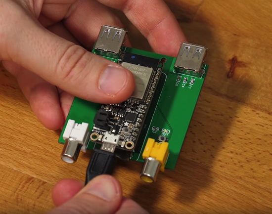](https://youtu.be/po3FBdY0GS4)

Add USB Support to any project using Bitluni’s cheap USB host microcontroller - [YouTube](https://youtu.be/po3FBdY0GS4).

Rocking out the Neopixel suit at the Media Art Festival in Otaru, Japan - [Twitter](https://twitter.com/mizuguchitter/status/1216255624402522115?s=12).

NeoPixels based “Madonna” inspired bra - [Twitter](https://twitter.com/MsSandyCrack/status/1215827120053579776).

CES2020: Primordial Soup of Innovation - [Learning by Shipping](https://medium.learningbyshipping.com/ces2020-primordial-soup-of-innovation-208571f15c94).

Full-color printing on flexible circuit boards - [Twitter](https://twitter.com/EMSL/status/1215398392165044224).

11 top open-source API testing tools: What your team needs to know - [TechBeacon](https://techbeacon.com/app-dev-testing/11-top-open-source-api-testing-tools-what-your-team-needs-know).

FERUS FESTIVAL: SISTER SYLVESTER “THE EAGLE AND THE TORTOISE” - [Adafruit](https://blog.adafruit.com/2020/01/07/ferus-festival-sister-sylvester-the-eagle-and-the-tortoise-nationalsawdust/).

Qt for MCUs 1.0, runs on the NXP i.MX RT1050 and STM32F769i - [Qt Blog](https://www.qt.io/blog/qt-for-mcus-1.0).

This project aims to bring Swift to the world of embedded systems and IoT. It enables using Swift on microcontrollers with no operating system and with minimal resources available - [GitHub](https://github.com/swift-embedded/swift-embedded).

Here's a Playdate Dec 2019 update - [play.date](https://play.date/update-dec/)

Zephyr Tutorial: Bluetooth Low Energy Development - [novelbits.io](https://www.novelbits.io/zephyr-getting-started-bluetooth-low-energy-development/)

Python args and kwargs: Demystified - [Real Python](https://realpython.com/courses/python-kwargs-and-args/).

30 Python Best Practices, Tips, And Tricks - [Towards Data Science](https://towardsdatascience.com/30-python-best-practices-tips-and-tricks-caefb9f8c5f5).

[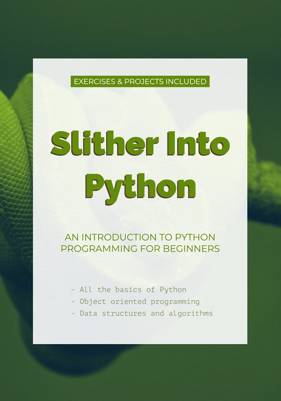](https://www.slitherintopython.com/)

Slither Into Python: An Introduction to Python for Beginners - [free to read online](https://www.slitherintopython.com/).

Considering Python's Target Audience - [2017](http://www.curiousefficiency.org/posts/2017/10/considering-pythons-target-audience.html).

20 best Python questions at stackoverflow in 2019 - [Python Weekly reports](https://python-weekly.blogspot.com/2020/01/20-best-python-questions-at.html).

Embed any image into a prime number - [primify](https://github.com/LeviBorodenko/primify).

Creator of Python Programming Language, Guido van Rossum, Oxford Union - [YouTube](https://youtu.be/7kn7NtlV6g0).

5 Python GUI Frameworks for Developers in 2020 - [morioh](https://morioh.com/p/6c19bfda96f7).

Build Third Party Applications APIs with NoCode - [NoCodeAPI](https://nocodeapi.com/).

LE Audio: The next generation of Bluetooth audio - [bluetooth.com](https://www.bluetooth.com/learn-about-bluetooth/bluetooth-technology/le-audio/) and [4 features](https://www.bluetooth.com/blog/4-capabilities-developers-can-expect-from-le-audio/) developers can expect from LE Audio.

Bluetooth LE Audio could be the biggest news out of CES 2020 - [Techradar](https://www.techradar.com/news/bluetooth-le-could-be-the-biggest-news-out-of-ces-2020).

Nordic announces its entry into the Bluetooth audio market with a platform supporting the forthcoming LE Audio specification for high-quality wireless audio - [Nordic](https://www.nordicsemi.com/News/2020/01/Nordic-launches-a-Bluetooth-LE-Audio-Evaluation-Platform).

Roadmap for Makerspaces - [makerbit.com](https://makerbit.com/makerbit-roadmap.html)

How to get kids to love to write - [WaPo](https://www.washingtonpost.com/education/2020/01/07/how-get-kids-love-write/).

#ICYDNCI What was the most popular, most clicked link, in [last week's newsletter](https://www.adafruitdaily.com/2020/01/07/what-do-you-want-to-see-with-circuitpython-in-2020-python-adafruit-circuitpython-circuitpython-micropython-thepsf-adafruit/)? [What do you want from CircuitPython in 2020?](https://blog.adafruit.com/2020/01/01/what-do-you-want-from-circuitpython-in-2020-circuitpython2020-circuitpython/).

## Coming soon

AR (Augmented reality puppet with Circuit Playground Bluefruit - [Adafruit](https://blog.adafruit.com/2020/01/12/digital-puppets-using-ar-augmented-reality-some-apps-companies-and-14-ish-years-of-trying-things-2020cv_inc-thinkoco-creativecloud-characteranimator-adafruit-circuitplayground/).

Testing out the TensorFlow micro speech demo on Adafruit CLUE - [Adafruit](https://blog.adafruit.com/2020/01/06/testing-out-the-tensorflow-micro-speech-demo-on-adafruit-clue-tensorflow-nordictweets-arduino-microbit_edu-tensorflow-tensorflowlite-tinyml-nrf52840-nordicsemi-microbit/).

micro:bit + Feather = match made in heaven - [Adafruit](https://blog.adafruit.com/2020/01/06/microbit-feather-match-made-in-heaven-microbit_edu-nordictweets-adafruit-microbit-adafruit-feather/). 

On-device Magnetometer Calibration with CLUE - [Adafruit](https://blog.adafruit.com/2020/01/11/sensor-saturday-on-device-magnetometer-calibration-adafruit-clue/).

## New Learn Guides!

[Adafruit MCP4728 I2C Quad DAC](https://learn.adafruit.com/adafruit-mcp4728-i2c-quad-dac) from [Bryan Siepert](https://learn.adafruit.com/users/siddacious)

[PiTFT Python + Pillow Animated Gif Player](https://learn.adafruit.com/pitft-linux-python-animated-gif-player) from [Melissa LeBlanc-Williams](https://learn.adafruit.com/users/MakerMelissa)

[PyPortal MQTT Sensor Node/Control Pad for Home Assistant](https://learn.adafruit.com/pyportal-mqtt-sensor-node-control-pad-home-assistant) from [Richard Albritton](https://learn.adafruit.com/users/richa1)

## Updated Guides - Now With More Python!

**You can use CircuitPython libraries on Raspberry Pi!** We're updating all of our CircuitPython guides to show how to wire up sensors to your Raspberry Pi, and load the necessary CircuitPython libraries to get going using them with Python. We'll be including the updates here so you can easily keep track of which sensors are ready to go. Check it out!

Keep checking back for more updated guides!

## CircuitPython Libraries!

CircuitPython support for hardware continues to grow. We are adding support for new sensors and breakouts all the time, as well as improving on the drivers we already have. As we add more libraries and update current ones, you can keep up with all the changes right here!

For the latest drivers, download the [Adafruit CircuitPython Library Bundle](https://circuitpython.org/libraries).

If you'd like to contribute, CircuitPython libraries are a great place to start. Have an idea for a new driver? File an issue on [CircuitPython](https://github.com/adafruit/circuitpython/issues)! Interested in helping with current libraries? Check out the [CircuitPython.org Contributing page](https://circuitpython.org/contributing). We've included open pull requests and issues from the libraries, and details about repo-level issues that need to be addressed. We have a guide on [contributing to CircuitPython with Git and Github](https://learn.adafruit.com/contribute-to-circuitpython-with-git-and-github) if you need help getting started. You can also find us in the #circuitpython channel on the [Adafruit Discord](https://adafru.it/discord). Feel free to contact Kattni (@kattni) with any questions.

You can check out this [list of all the CircuitPython libraries and drivers available](https://github.com/adafruit/Adafruit_CircuitPython_Bundle/blob/master/circuitpython_library_list.md). 

The current number of CircuitPython libraries is **205**!

**New Libraries!**

Here's this week's new CircuitPython libraries:

 * [Adafruit_CircuitPython_Pypixelbuf](https://github.com/adafruit/Adafruit_CircuitPython_Pypixelbuf)
 * [Adafruit_CircuitPython_ProgressBar](https://github.com/adafruit/Adafruit_CircuitPython_ProgressBar)

**Updated Libraries!**

Here's this week's updated CircuitPython libraries:

 * [Adafruit_CircuitPython_MotorKit](https://github.com/adafruit/Adafruit_CircuitPython_MotorKit)
 * [Adafruit_CircuitPython_MiniMQTT](https://github.com/adafruit/Adafruit_CircuitPython_MiniMQTT)
 * [Adafruit_CircuitPython_HID](https://github.com/adafruit/Adafruit_CircuitPython_HID)
 * [Adafruit_CircuitPython_Bitmap_Font](https://github.com/adafruit/Adafruit_CircuitPython_Bitmap_Font)
 * [Adafruit_CircuitPython_RGB_Display](https://github.com/adafruit/Adafruit_CircuitPython_RGB_Display)
 * [Adafruit_CircuitPython_FocalTouch](https://github.com/adafruit/Adafruit_CircuitPython_FocalTouch)
 * [Adafruit_CircuitPython_ICM20649](https://github.com/adafruit/Adafruit_CircuitPython_ICM20649)
 * [Adafruit_Blinka](https://github.com/adafruit/Adafruit_Blinka)

**PyPI Download Stats!**

We've written a special library called Adafruit Blinka that makes it possible to use CircuitPython Libraries on [Raspberry Pi and other compatible single-board computers](https://learn.adafruit.com/circuitpython-on-raspberrypi-linux/). Adafruit Blinka and all the CircuitPython libraries have been deployed to PyPI for super simple installation on Linux! Here are the top 10 CircuitPython libraries downloaded from PyPI in the last week, including the total downloads for those libraries:

| Library                                                | Last Week   | Total |   
|:-------                                                |:--------:   |:-----:|   
| Adafruit-Blinka                                        | 2214        | 39657 |   
| Adafruit_CircuitPython_BusDevice                       | 1113        | 23357 |   
| Adafruit_CircuitPython_NeoPixel                        | 408         | 5188 |    
| Adafruit_CircuitPython_MCP230xx                        | 271         | 9098 |    
| Adafruit_CircuitPython_Register                        | 255         | 4947 |    
| Adafruit_CircuitPython_RGB_Display                     | 234         | 1673 |    
| Adafruit_CircuitPython_PCA9685                         | 156         | 3064 |    
| Adafruit_CircuitPython_Motor                           | 141         | 3223 |    
| Adafruit_CircuitPython_ServoKit                        | 110         | 2950 |    
| Adafruit_CircuitPython_MotorKit                        | 91          | 1786 |    

## What is the team up to?

**Dan** 

I'm testing the BLE bonding code. Some lower-level code needs to change because the bonding event handlers need to live past the lifetime of the CircuitPython virtual machine; Scott had to do something similar already and was helpful on this. I got tired of adjusting the volume on my computer's speakers by mouse-clicking, and built a mash-up of the [Media Dial](https://learn.adafruit.com/media-dial) and [Rotary Encoder](https://learn.adafruit.com/rotary-encoder) Learn Guide projects to send Consumer Control HID codes to my computer (volume up, down, and mute). I 3-D printed a [simplification of the Medial Dial from Thingiverse](https://www.thingiverse.com/thing:2910656), did a little code hacking, and it's working just fine. One issue is that since it's CircuitPython, it shows up as CIRCUITPY and as a serial device whenever it's plugged in. Since I want to leave it plugged in, and I'm constantly debugging other CircuitPython boards, I built a special version of CircuitPython with the mass storage and serial USB devices turned off. I can't edit on the board anymore, but I added a reset button so I can always go back to the bootloader, reload regular CircuitPython, and work on the program again.

**Bryan**  

This week I've been continuing the work to migrate our 200+ CircuitPython libraries to GitHub Actions. It's a big project! The end is in sight, but there's still a notable amount of work to go. It's not a flashy set of features or new release but it is an important step in making such a large number of projects manageable. Along a similar vein, I also did some work to update some existing libraries to support additional similar libraries, as well as assisting on moving some Arduino libraries to Actions. True, I haven't worked on any new boards so far this week but there are plenty in the pipeline!

**Jeff**  

Over the past week I have been picking up a lot of miscellaneous items, such as missing features in DigitalIO for seesaw I/O expander boards, a lockup that can occur when using bitmaps or audio files from SD cards together with SD accesses from other CircuitPython code, and crashes when requesting lots of bytes (or -1 byte!) from os.urandom. Yes, I literally worked on random bugs.

**Kattni**  

This week I finished up the [CircuitPython Made Easy on Circuit Playground Express and Bluefruit](https://learn.adafruit.com/circuitpython-made-easy-on-circuit-playground-express) and it is finally ready to go. If you're looking for the simplest way to use CircuitPython with either the Circuit Playground Express or Bluefruit, check out this guide. It includes the new Bluefruit-only features as well!  I spent the day going through all the open PRs on all the CircuitPython libraries. We have some very old PRs that needed attention. If you submitted a PR to any of the libraries over the last year that we missed, please check your email or GitHub for updates or possible change requests. If you have an open PR that we still need to address, please don't hesitate to let us know via GitHub or Discord. Thank you for all your contributions! Other than that, I'm planning to finish up my CircuitPython 2020 post, and a few miscellaneous things that came out of the Circuit Playground library update; there's an example that needs to be updated, some cleaner error handling added, as well as the README needing both an update and an explanation of how the library works. Once that's done, it'll be on to something new!

**Melissa**  

This past week I finished up the Animated Gif Player and its associated learn guide. You can check out the [learn guide](https://learn.adafruit.com/pitft-linux-python-animated-gif-player). Since I thought it would be fun, I created an animated gif of the player playing an animated Gif. I also wrote up an epic Blog post for my thoughts on CircuitPython 2020 as well as my story about how I started at Adafruit. You can check out the [Blog post](https://blog.adafruit.com/2020/01/07/a-story-this-past-year-from-melissa-and-some-thoughts-on-the-future-on-circuitpython-in-2020-circuitpython2020-makermelissa/). I have been also picking up on working on the Blinka project, the CircuitPython compatibility layer for Raspberry Pi and other Single Board Computers. There has been some extra activity from community member contributions and that has been excellent to see.

**Scott**  

On the first of 2020 we kicked off the #circuitpython2020 planning. I've been posting all of the awesome responses on the Adafruit Blog. Our end date is January 13th's CircuitPython Community meeting (join Discord for details). I've also been wrapping up BLE work on packet aware protocols like the Apple Media Service and BLE MIDI. We swapped the CircuitPython HID library to take in a list of devices as well so that BLE HID devices can be used in place of USB HID devices. I've been meaning to write my own #circuitpython2020 post and talk about the need for focus, buuuuuuuttt I got distracted by @arturo182's PR for iMX RT support in CircuitPython. It is very exciting, the chips are faster and some have more RAM (1MB!). In my distraction, I've added support for more dev boards including the Teensy 4!

## Upcoming events!

Scott is speaking at [PyCascades](https://2020.pycascades.com/) about Python's Next Decade and Us. It's February 8th and 9th, 2020.

>_"PyCascades is a two-day, single-track Python conference. We previously hosted PyCascades in Vancouver and Seattle. For our third iteration in 2020 we'll be in Portland, Oregon. PyCascades is organized by members of the Python communities in Vancouver, Seattle, and Portland. We aim to bring together Python users and developers from both the Pacific Northwest and around the world."_

[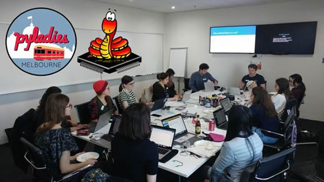](https://www.meetup.com/PyLadies-Melbourne/events/rvhjlpybccbbc/)

PyLadies Melbourne Monthly Meetup - Micropython beginner workshop. Matt, Oliver and Rose return for the second Micropython beginner workshop and the first PyLadies Melbourne event for 2020. No experience necessary - Get started with hardware hacking thanks to Micropython! - [Meetup](https://www.meetup.com/PyLadies-Melbourne/events/rvhjlpybccbbc/).

April 15-23, 2020, Pittsburgh, Pennsylvania, USA - The PyCon 2020 conference, which will take place in Pittsburgh, is the largest annual gathering for the community using and developing the open-source Python programming language. It is produced and underwritten by the Python Software Foundation, the 501(c)(3) nonprofit organization dedicated to advancing and promoting Python. Through PyCon, the PSF advances its mission of growing the international community of Python programmers - [PyCon 2020](https://us.pycon.org/2020/).

## Latest releases

CircuitPython's stable release is [4.1.2](https://github.com/adafruit/circuitpython/releases/latest) and its unstable release is [5.0.0 beta.3](https://github.com/adafruit/circuitpython/releases). New to CircuitPython? Start with our [Welcome to CircuitPython Guide](https://learn.adafruit.com/welcome-to-circuitpython).

[20200111](https://circuitpython.org/libraries) is the latest CircuitPython library bundle.

[1.12](https://micropython.org/download) is the latest MicroPython release. Documentation for it is [here](http://docs.micropython.org/en/latest/pyboard/).

[3.8.1](https://www.python.org/downloads/) is the latest Python release. The latest pre-release version is [3.9.0a2](https://www.python.org/download/pre-releases/).

[1,560 Stars](https://github.com/adafruit/circuitpython/stargazers) Like CircuitPython? [Star it on GitHub!](https://github.com/adafruit/circuitpython)

## Call for help – CircuitPython messaging to other languages!

We [recently posted on the Adafruit blog](https://blog.adafruit.com/2018/08/15/help-bring-circuitpython-messaging-to-other-languages-circuitpython/) about bringing CircuitPython messaging to other languages, one of the exciting features of CircuitPython 4.x is translated control and error messages. Native language messages will help non-native English speakers understand what is happening in CircuitPython even though the Python keywords and APIs will still be in English. If you would like to help, [please post](https://github.com/adafruit/circuitpython/issues/1098) to the main issue on GitHub and join us on [Discord](https://adafru.it/discord).

We made this graphic with translated text, we could use your help with that to make sure we got the text right, please check out the text in the image – if there is anything we did not get correct, please let us know. Dan sent me this [handy site too](http://helloworldcollection.de/#Human).

## jobs.adafruit.com - Find a dream job, find great candidates!

[jobs.adafruit.com](https://jobs.adafruit.com/) has returned and folks are posting their skills (including CircuitPython) and companies are looking for talented makers to join their companies - from Digi-Key, to Hackaday, Microcenter, Raspberry Pi and more.

## 15,839 thanks!

The Adafruit Discord community, where we do all our CircuitPython development in the open, reached over 15,839 humans, thank you! Join today! [https://adafru.it/discord](https://adafru.it/discord)

## ICYMI - In case you missed it

The wonderful world of Python on hardware! This is our first video-newsletter-podcast that we’ve started! The news comes from the Python community, Discord, Adafruit communities and more. It’s part of the weekly newsletter, then we have a segment on ASK an ENGINEER and this is the video slice from that! The complete Python on Hardware weekly videocast [playlist is here](https://www.youtube.com/playlist?list=PLjF7R1fz_OOXRMjM7Sm0J2Xt6H81TdDev). 

This video podcast is on [iTunes](https://itunes.apple.com/us/podcast/python-on-hardware/id1451685192?mt=2), [YouTube](https://www.youtube.com/playlist?list=PLjF7R1fz_OOXRMjM7Sm0J2Xt6H81TdDev), [IGTV (Instagram TV](https://www.instagram.com/adafruit/channel/)), and [XML](https://itunes.apple.com/us/podcast/python-on-hardware/id1451685192?mt=2).

[Weekly community chat on Adafruit Discord server CircuitPython channel - Audio / Podcast edition](https://itunes.apple.com/us/podcast/circuitpython-weekly-meeting/id1451685016) - Audio from the Discord chat space for CircuitPython, meetings are usually Mondays at 2pm ET, this is the audio version on [iTunes](https://itunes.apple.com/us/podcast/circuitpython-weekly-meeting/id1451685016), Pocket Casts, [Spotify](https://adafru.it/spotify), and [XML feed](https://adafruit-podcasts.s3.amazonaws.com/circuitpython_weekly_meeting/audio-podcast.xml).

And lastly, we are working up a one-spot destination for all things podcast-able here - [podcasts.adafruit.com](https://podcasts.adafruit.com/)

## Codecademy "Learn Hardware Programming with CircuitPython"

Codecademy, an online interactive learning platform used by more than 45 million people, has teamed up with the leading manufacturer in STEAM electronics, Adafruit Industries, to create a coding course, "Learn Hardware Programming with CircuitPython". The course is now available in the [Codecademy catalog](https://www.codecademy.com/learn/learn-circuitpython?utm_source=adafruit&utm_medium=partners&utm_campaign=circuitplayground&utm_content=pythononhardwarenewsletter).

Python is a highly versatile, easy to learn programming language that a wide range of people, from visual effects artists in Hollywood to mission control at NASA, use to quickly solve problems. But you don’t need to be a rocket scientist to accomplish amazing things with it. This new course introduces programmers to Python by way of a microcontroller — CircuitPython — which is a Python-based programming language optimized for use on hardware.

CircuitPython’s hardware-ready design makes it easier than ever to program a variety of single-board computers, and this course gets you from no experience to working prototype faster than ever before. Codecademy’s interactive learning environment, combined with Adafruit's highly rated Circuit Playground Express, present aspiring hardware hackers with a never-before-seen opportunity to learn hardware programming seamlessly online.

Whether for those who are new to programming, or for those who want to expand their skill set to include physical computing, this course will have students getting familiar with Python and creating incredible projects along the way. By the end, students will have built their own bike lights, drum machine, and even a moisture detector that can tell when it's time to water a plant.

Visit Codecademy to access the [Learn Hardware Programming with CircuitPython](https://www.codecademy.com/learn/learn-circuitpython?utm_source=adafruit&utm_medium=partners&utm_campaign=circuitplayground&utm_content=pythononhardwarenewsletter) course and Adafruit to purchase a [Circuit Playground Express](https://www.adafruit.com/product/3333).

Codecademy has helped more than 45 million people around the world upgrade their careers with technology skills. The company’s online interactive learning platform is widely recognized for providing an accessible, flexible, and engaging experience for beginners and experienced programmers alike. Codecademy has raised a total of $43 million from investors including Union Square Ventures, Kleiner Perkins, Index Ventures, Thrive Capital, Naspers, Yuri Milner and Richard Branson, most recently raising its $30 million Series C in July 2016.

## Contribute!

The CircuitPython Weekly Newsletter is a CircuitPython community-run newsletter emailed every Tuesday. The complete [archives are here](https://www.adafruitdaily.com/category/circuitpython/). It highlights the latest CircuitPython related news from around the web including Python and MicroPython developments. To contribute, edit next week's draft [on GitHub](https://github.com/adafruit/circuitpython-weekly-newsletter/tree/gh-pages/_drafts) and [submit a pull request](https://help.github.com/articles/editing-files-in-your-repository/) with the changes. Join our [Discord](https://adafru.it/discord) or [post to the forum](https://forums.adafruit.com/viewforum.php?f=60) for any further questions.
