- [X] Kattni updates
- [X] Link "View this email in your browser."

[View this email]() in your browser.

Hi everyone! Here is the latest Python for Microcontrollers newsletter brought you by the Python on hardware community! We're on [Discord](https://discord.gg/HYqvREz), [Twitter](https://twitter.com/search?q=circuitpython&src=typed_query&f=live), and for past newsletters - [view them all here](https://www.adafruitdaily.com/category/circuitpython/). If you're reading this on the web, [subscribe here](https://www.adafruitdaily.com/). Snake on through to the other side, let's get slinking!

## The many forks & ports of MicroPython

There are many interesting forks and ports of MicroPython and we are going to get them in one place with as much information as possible. This is the [start of the list on GitHub](https://github.com/adafruit/awesome-micropythons), please add any comments there with ones we've missed, or open an issue/PR to update the list. The goal of this is not to encourage forks, it's a list that has all the forks & ports, for what platforms, latest updates, and if they are open-source.

## CircuitPython day in Beirut

[Video](https://youtu.be/14RCTs6n47E) from the [CircuitPython celebration day](https://blog.adafruit.com/?s=%23circuitpythonday) in Beirut (2019) organized By Lamba Labs - This video is from last year, but was [just posted on Twitter](https://twitter.com/hassankanj/status/1226901401080672256), it's great!

## Bluefruit Playground app updates!

The latest update for [Bluefruit Playground on iOS](https://apps.apple.com/us/app/bluefruit-playground/id1489549571) turns you into a digital puppeteer! Simply attach [Circuit Playground Bluefruit](https://www.adafruit.com/product/4333?gclid=EAIaIQobChMI_KHNqt7Q5wIVh5-zCh2jJQLQEAQYASABEgL4GvD_BwE) to the back of your hand with a rubber band and use familiar sock puppet gestures to control [Sparky the Blue Smoke Monster](https://blog.adafruit.com/?s=sparky+the+blue+smoke+monster). 

Go full screen, record, and change backgrounds – you can even kick things up a notch by triggering emotes with CPB's onboard pushbuttons. Head over to the [App Store to grab Bluefruit Playground](https://apps.apple.com/us/app/bluefruit-playground/id1489549571) - it's free!

The QR code will take ya right to the [App store](https://apps.apple.com/us/app/bluefruit-playground/id1489549571).

## Get a CLUE at Pycon from Digi-Key and Adafruit!

[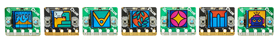](https://blog.adafruit.com/2020/02/06/get-a-clue-at-pycon-us-from-digi-key-and-adafruit-digikey-adafruit-pycon2020-pycon-circuitpython/)

[Get a CLUE](https://www.adafruit.com/clue) at [PyCon US!](https://us.pycon.org/2020/about/) Digi-Key and Adafruit have teamed up to get the latest and greatest Bluetooth and CircuitPython powered boards to each attendee, the CLUE! 

>_"April 15-23, 2020, Pittsburgh, Pennsylvania, USA – The PyCon 2020 conference, which will take place in Pittsburgh, is the largest annual gathering for the community using and developing the open-source Python programming language. It is produced and underwritten by the Python Software Foundation, the 501(c)(3) nonprofit organization dedicated to advancing and promoting Python. Through PyCon, the PSF advances its mission of growing the international community of Python programmers."_

[PyCon 2020](https://us.pycon.org/2020/) & some [photos of PyCon hardware](https://www.flickr.com/search/?user_id=35434449%40N08&view_all=1&text=pycon).

## HackSpace has a MEGA DEAL!

The Raspberry Pi foundation is launching a time-limited special offer on subscriptions to HackSpace magazine and The MagPi magazine for readers in the USA, as savings of 48% compared to standard overseas subscriptions. They want to help as many people as possible get their hands on our fantastic publications. For HackSpace subscribers get a free Circuit Playground Express - [Raspberry Pi](https://www.raspberrypi.org/blog/usa-magazine-subscriptions-offer-48-off-standard-prices/). You can subscribe to these magazines for the discounted price of $60 a year – just $5 per issue. Not only will you receive twelve issues direct to your door, but you’ll also receive a free gift and save up to 35% compared with newsstand prices. The discounted offer is only running until 31 March 2020 - [Subscribe](https://raspberrypipress.imbmsubscriptions.com/leapyearoffer-hackspace/).

## CLUEs NEWs

CLUE making the rounds in the news... [CLUES NEWS](https://www.adafruit.com/clue).

Adafruit Clue: An affordable Arduino-alternative that comes with an IPS display and several sensors - [Notebookcheck](https://www.notebookcheck.net/Adafruit-Clue-An-affordable-Arduino-alternative-that-comes-with-an-IPS-display-and-several-sensors.453786.0.html).

Adafruit CLUE sensor packed development board - [Geeky Gadgets](https://www.geeky-gadgets.com/clue-sensor-board-12-02-2020/).

Adafruit Clue - love at first sight - [RAREblog](https://blog.rareschool.com/2020/02/adafruit-clue-love-at-first-sight.html).

## Testing of the Open Hardware Summit 2020 wrist-watch badge

[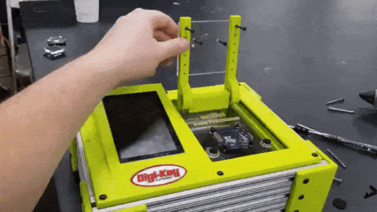](https://twitter.com/alexcamilo/with_replies)

Here are some photos and videos of the testing of the Open Hardware Summit 2020 wrist-watch badge! - [Twitter](https://twitter.com/alexcamilo/with_replies). See the round up of the in-progress photos and builds - [Adafruit](https://blog.adafruit.com/2020/02/08/open-hardware-summit-2020-wrist-watch-badge-updates-ohsummit-circuitpython-ohsummit20/).

## Arm announces Cortex-M CPU Ethos-U NPU

Ok, big-ish news from ARM. ARM announced the Cortex-M processor (M55) and the Arm Ethos-U55 micro neural processing unit (NPU). The Cortex-M55 will be the next round of chips for embedded devices, ARM is really promoting the increase of speed for machine learning models. Expect to hear about Cortex-M and Ethos-U for "Edge computing" a lot.

We'll of get the chips as soon as possible so we can get some great hardware to run  our BrainCraft projects using TensorFlow lite, as well as CircuitPython.

 * Unlock the Benefits of Artificial Intelligence for IoT Devices - [Arm](https://www.arm.com/solutions/artificial-intelligence/iot-endpoint-devices) & [PDF](https://www.arm.com/-/media/Files/pdf/AI/Arm%20Endpoint%20AI%20Solutions.pdf).
 * Arm Cortex-M Series Processors - [Arm](https://developer.arm.com/ip-products/processors/cortex-m).
Enhancing the Capabilities of the Smallest Devices. Arm Helium technology is the M-Profile Vector Extension (MVE) for the Arm Cortex-M processor series. Helium is an extension of the Armv8.1-M architecture and delivers a significant performance uplift for machine learning (ML) and digital signal processing (DSP) applications - [Arm](https://www.arm.com/why-arm/technologies/helium).
 * Arm focuses on AI with its new Cortex-M CPU and Ethos-U NPU - [TechCrunch](https://techcrunch.com/2020/02/10/arm-focuses-on-ai-with-its-new-cortex-m-cpu-and-ethos-u-npu/).
 * Arm Cortex-M55 - [Arm](https://www.arm.com/products/silicon-ip-cpu/cortex-m/cortex-m55).
 * Arm Ethos-U55 - [Arm](https://www.arm.com/products/silicon-ip-cpu/machine-learning/ethos-u55).
 * AI for IoT: Opening up the Last Frontier - [Arm](https://www.arm.com/blogs/blueprint/ai-for-iot-devices).
 * Arm Takes Aim at Low-Power Edge AI with New Cortex-M55 and Ethos-U55 Core IP - [hackster.io](https://www.hackster.io/news/arm-takes-aim-at-low-power-edge-ai-with-new-cortex-m55-and-ethos-u55-core-ip-522278149c72)

## News from around the web!

MIDI Tinkering: Now with an LIS3DH accelerometer controlling modulation & an 8-way switch to change octaves by [Blitz City DIY](https://diode.zone/videos/watch/4ba89d9b-4921-484b-ae31-57e927240ba1).

Kattni mention in the latest PythonBytes: Episode #168: Race your donkey car with Python -[pythonbytes.fm](https://pythonbytes.fm/episodes/show/168/race-your-donkey-car-with-python)

Melissa tested out to see if CircuitPython and CLUE could work with the Bit:Buggy, it can!  - [Twitter](https://twitter.com/makermelissa/status/1228171770579963905).

And JP made sure it works with LEGO minifigures, it does.

Why did we call the CLUE, CLUE? Time to get a CLUE about why we called it CLUE: Product naming - [Adafruit](https://blog.adafruit.com/2020/02/09/got-a-clue-havent-a-clue-time-to-get-a-clue-about-why-we-called-it-clue-product-naming/).

Special thanks to Andrew in the [Adafruit community Discord server](https://discordapp.com/channels/327254708534116352/327298996332658690/676636881823203338) for making this [CLUE pinout, here is the .ai file for download if needed](https://www.dropbox.com/s/ja11znurbwvyqsi/ClueBoard_PINOUT.ai?dl=0).

Animated GIF playback on CLUE - We wrote a library to play animated GIFs on 'arcada' compatible boards in Arduino. The CLUE has a 240x240 display and two buttons, so its a perfect lil GIF player. [Check out the guide](https://learn.adafruit.com/pyportal-animated-gif-display) for a UF2 you can drag n drop onto your CLUE - [YouTube](https://youtu.be/lwcfP4m-ltE).

Look at this cute CLUE powered mini-Ultimaker from Patrick, just look at it - [Twitter](https://twitter.com/McLemoreAve/status/1228359493274210304).

We gave some CLUEs for Valentine's day.

Allie and Digi-Key teamed up to teach over 106 kids all about coding - [Twitter](https://twitter.com/RobotMakerGirl/status/1227349866239713280).

Gerald is testing a new CLUE with the Cube:Bit from 4tronix with the ColorPicker from the Bluefruit app using CircuitPython - [Twitter](https://twitter.com/syndat/status/1227666884277022720).

Safety 1st Blink wearable: Safety Glasses outfitted with a CLUE for environmental sensing and display thru RGB LED ring - [hackaday.io](https://hackaday.io/project/169928-blinki) & [YouTube](https://youtu.be/hsfCz7SAPNA?t=1147) at 19m 07s.

CircuitPython is bringing Python to more developers and makers around the world - [Twitter](https://twitter.com/WillingCarol/status/1228698325693583360). Anwesha Das also has a [post/overview from the event](https://anweshadas.in/february-pyladies-pune-workshop/).

Hackaday has posted the winners of their Tell Time Contest and there are some really great clock projects! This 7 segment clock, a runner-up by Alex Padilla, is neat, programmed in CircuitPython - [hackaday.io](https://hackaday.io/project/165822-circuitpython-7-segment-character-clock)

[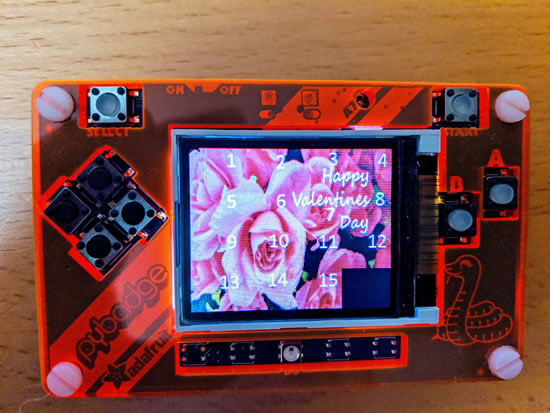](http://www.mcgurrin.info/robots/642/)

A Sliding Puzzle for the PyBadge and PyBadge LC - [The Aspiring Roboticist](http://www.mcgurrin.info/robots/642/).

CircuitPython library for the i2c Encoder from Simone Caron - [GitHub](https://github.com/bwshockley/CircuitPython-i2cEncoderLibV21).

MakerThornhill has been working on this cool ePaper/eInk version of the Doctor’s Psychic Paper using CircuitPython - [Twitter](https://twitter.com/MakerThornhill/status/1228009755605688320).

First draft of eveL, the low-level module of the Gameduino bindings - [GitHub](https://github.com/adafruit/circuitpython/pull/2581).

[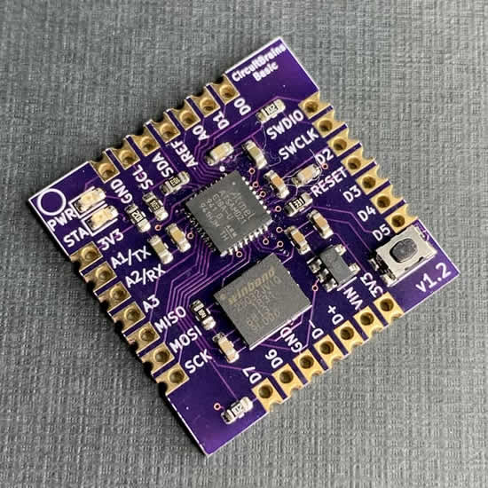](https://circuitpython.org/board/circuitbrains_basic/)

[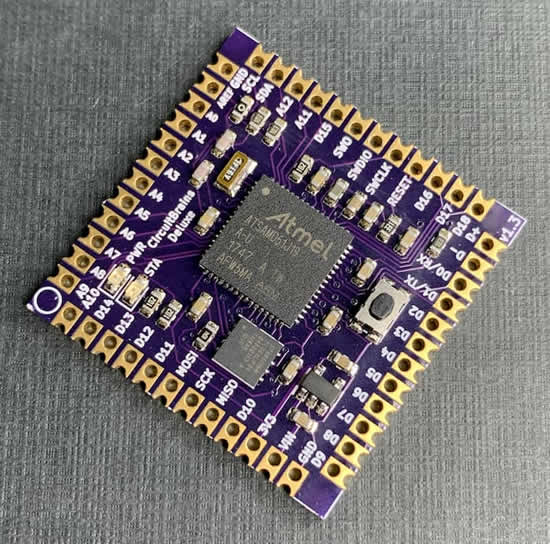](https://circuitpython.org/board/circuitbrains_deluxe/)

Kevin's CircuitBrains boards are now listed and live on [circuitpython.org/downloads](https://circuitpython.org/downloads). Kevin submitted the Deluxe model to Crowd Supply will have a project to support fabrication and fulfillment soon - [Twitter](https://twitter.com/kevinneubauer/status/1226957562152706050).

[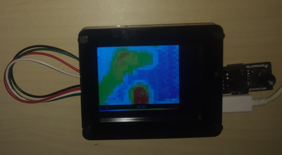](https://twitter.com/DavidGlaude/status/1227367264388866050)

David now a bigger thermal camera, using the PyPortal as screen thanks to CircuitPython. the same code work on the following three board PyGamer, Clue and PyPortal. The only trick is to optimize for screen resolution - [Twitter](https://twitter.com/DavidGlaude/status/1227367264388866050) & [GitHub](https://github.com/dglaude/CircuitPython_MLX90640_PyGamer_Plus).

PicoPew: A tiny game console shield for the TinyPICO - [Tindie](https://www.tindie.com/products/cwalther/picopew/).

Sock puppet robot update! Getting its body! With sustainability and easy adoption in mind,  Alex has been working to create a cardboard carapace for this bot. Plus, a potential AI upgrade – and other cool tools and projects - [hackster.io](https://www.hackster.io/videos/576)

CircuitPython on a Teensy 4.0 workin' right out of the box - [Twitter](https://twitter.com/clolsonus/status/1227250768593461248).

Greg Davill and Michael Welling are preparing a GroupGets campaign for the most excellent OrangeCrab. Launching soon! ECP5 + DDR + Feather form factor - [Twitter](https://twitter.com/QwertyEmbedded/status/1227760285294841856).

Feather-format e-ink badge! - [Twitter](https://twitter.com/flatfootfox/status/1227254564467945472?s=11).

[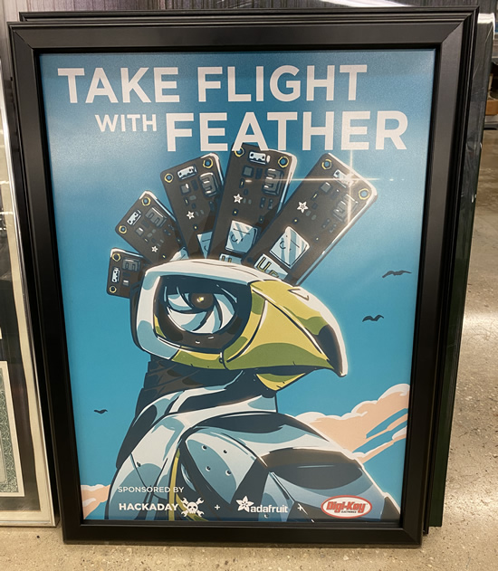](https://hackaday.io/contest/168107-take-flight-with-feather)

Thank you SupplyFrame and hackaday.io for sending us this poster!

[On Language and Unifont](https://www.patreon.com/posts/on-language-and-33839083) by Joey Castillo.

[Digi has a MicroPython mention](https://www.digi.com/embedded-world-2020) “MicroPython edge compute capabilities” for their Embedded World 2020 efforts. Also, check out the Digi XBee development tools section on their site: [MicroPython Programmability](https://github.com/digidotcom/xbee-micropython). Digi International manages thei fork of MicroPython on GitHub as xbee-micropython. See the previous post on [“MicroPython snakes its way to SparkFun Thing Plus XBee 3 in Adafruit FEATHER format.”](https://blog.adafruit.com/2019/08/22/micropython-snakes-its-way-to-sparkfun-thing-plus-xbee-3-in-adafruit-feather-format-sparkun-digidotcom-adafruit-xbee/)

MicroPython on LEGO SPIKE Prime - [Instructables](https://www.instructables.com/id/MicroPython-on-SPIKE-Prime/).

micro:bit shaped boards and/or boards with the micro:bit style edge connector collection - [Adafruit](https://blog.adafruit.com/2020/02/11/microbit-shaped-boards-and-or-boards-with-the-microbit-style-edge-connector-collection/).

This has made the rounds everywhere, uses an [Adafruit FONA](https://www.adafruit.com/?q=fona). How a Space Engineer Made Her Own Rotary Cell Phone: The funky DIY device is a creative way for her to eschew the always-on lifestyle - [WIRED](https://www.wired.com/story/justine-haupt-rotary-phone/).

Hardware Flashback podcast, The Newton! - [relay.fm](https://www.relay.fm/flashback/1)

How to be a (More) Maker-Friendly AT Vendor - [ATMakers](http://atmakers.org/2017/09/how-to-be-a-more-maker-friendly-at-vendor/).

[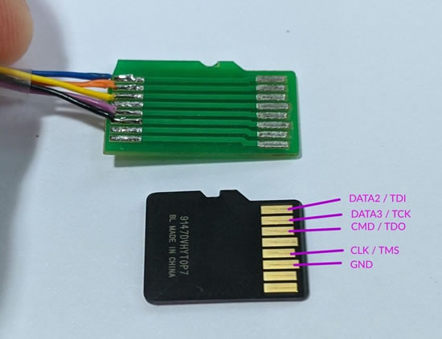](https://twitter.com/cibomahto/status/1226901739472707584)

ESP32 trick: Use your microSD jack as a JTAG connector - [Twitter](https://twitter.com/cibomahto/status/1226901739472707584). You could probably use [this Micro SD PCB extender](https://www.adafruit.com/product/4395) if you don’t want to make a custom PCB adapter.

2019: The Year in Parts - [Octopart](https://octopart.com/blog/archives/2020/02/2019-the-year-in-parts).

Ultimate electronics online "book" - [ultimateelectronicsbook.com](https://ultimateelectronicsbook.com/)

The PyPy folks have a new logo and new site, check it out - [pypy.org](https://www.pypy.org/)

If you like this newsletter, you'll probably like the Tindie newsletter, Fetch! - [check it out](https://mailchi.mp/tindie/d4bn957f0i-606583?e=7e15e68f5b).

USB Raw Gadget is a kernel module that allows to emulate USB devices from userspace. This repository contains instructions and examples for using Raw Gadget - [GitHub](https://github.com/xairy/raw-gadget).

The MCU Dilemma: Microcontroller vendors are breaking out of the box that has constrained them for years. Will new memory types and RISC-V enable the next round of changes? - [semiengineering.com](https://semiengineering.com/the-mcu-dilemma/)

[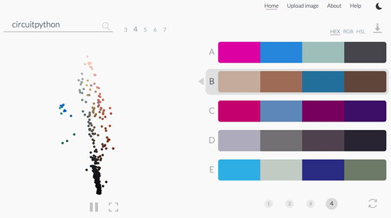](http://thevangogh.in/search#circuitpython)

Fun web toy / search engine for color palettes using an algorithm called K-Means clustering that can provide colors for specific words - [thevangogh.in](http://thevangogh.in/search#circuitpython). This is CircuitPython, looks good!

repper.app is a very cool pattern making site, there's a free 14 day trial, think we're going to keep it after so we can make these cool Blinka patterns for [videos](https://youtu.be/cNTGZnnS7jA) and more - [repper.app](https://repper.app/)

What are the underrated newsletters you like reading? - [hackernews](https://news.ycombinator.com/item?id=22280939).

The BBC micro:bit with Giles Booth - [kidslab.dev](https://kidslab.dev/2020/02/10/the-bbc-microbit-with-giles-booth/)

UK police deny responsibility for poster urging parents to report kids for using Kali Linux - [ZDNet](https://www.zdnet.com/article/uk-police-distance-themselves-from-poster-warning-parents-to-report-kids-for-using-kali-linux/). Poster found via [Twtter](https://twitter.com/G_IW/status/1227700420178567170). Might not be real, if a kid is doing all this, they're a smart kid, [Kali seems to agree](https://twitter.com/kalilinux/status/1227703199584395267).

Top 10 FOSS legal developments in 2019 - [Security Boulevard](https://securityboulevard.com/2020/02/top-10-foss-legal-developments-in-2019/).

Python in Visual Studio Code – February 2020 Release - [Microsoft](https://devblogs.microsoft.com/python/python-in-visual-studio-code-february-2020-release/).

Playing and Recording Sound in Python - [Real Python](https://realpython.com/courses/playing-and-recording-sound-python/).

TV backlight compensation - [lofibucket.com](http://www.lofibucket.com/articles/tv_backlight_compensation.html)

[Contributing to CPython](https://paper.dropbox.com/doc/Contributing-to-CPython--AuZNaow3VIx5kP6yAYa~xWpYAg-JlgnduI6kw9MJIaGPpN9G) via [Guido](https://twitter.com/gvanrossum/status/1226681960338087937).

5 Things You're Doing Wrong When Programming in Python - [YouTube](https://www.youtube.com/watch?v=fMRzuwlqfzs).

JustPy is an object-oriented, component based, high-level Python Web Framework that requires no front-end programming - [JustPy.io](https://justpy.io/#/)

Watch music videos in real-time for the songs playing on your device - GitHub.

Open inventory management and (coming soon) Point of sales (powered by python) for small shops. Towards ERP. First-timers-friendly - [GitHub](https://github.com/Abdur-rahmaanJ/shopyo).

Somewhat timely, on our weekly show, we talked about the [counterfeits](https://artofelectronics.net/the-book/counterfeit-editions/) on Amazon of ["The Art of Electronics by Horowitz & Hill"](https://www.adafruit.com/product/2356) - we (Adafruit) purchase the books directly from the publisher (Cambridge Press), and then we see the same book on Amazon cheaper. Some of real, some were counterfeits, but we'll never get the same kill-everyone-else pricing that Amazon does, or the same pricing a counterfeiter can do. We usually are pretty close with the pricing, but sometimes our price is a little more. The good news is (sorta?) is that we have a ton of customers who have been burned by Amazon over the years from counterfeit text books to counterfeit products, so specifically for the Art of Electronics, getting it from Adafruit is the for-sure way to make sure it's the real version. We now have the [X Chapters in stock](https://www.adafruit.com/product/4360) and it's the real one of course.

[An overview of Bluetooth Beacons – Part 1](https://www.novelbits.io/overview-bluetooth-beacons-part-1/) by Mohammad Afaneh. And [part 2](https://www.novelbits.io/overview-bluetooth-beacons-part-2/) was just posted as well.

PyDev of the Week: Martin Fitzpatrick on [Mouse vs Python](https://www.blog.pythonlibrary.org/2020/02/17/pydev-of-the-week-martin-fitzpatrick/)

#ICYDNCI What was the most popular, most clicked link, in [last week's newsletter](https://www.adafruitdaily.com/2020/02/11/everyone-gets-a-clue-with-circuitpython-pythons-next-decade-and-us-python-adafruit-circuitpython-circuitpython-micropython-thepsf-adafruit/)? [The CLUE](https://www.adafruit.com/clue)!

## Coming soon

[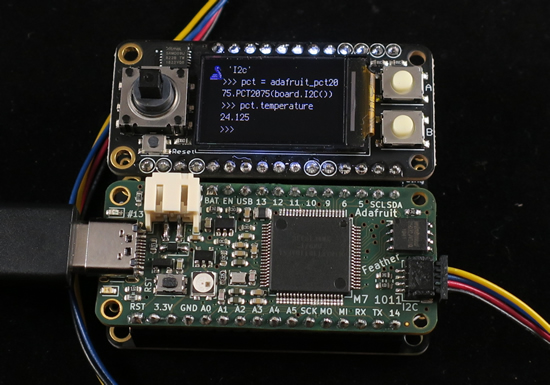](https://twitter.com/arturo182/status/1228088360952004610)

Feather M7 is moving along nicely - [Twitter](https://twitter.com/arturo182/status/1228088360952004610).

[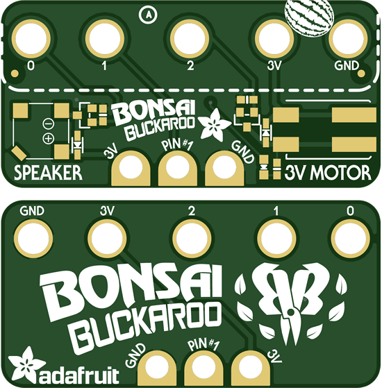](https://youtu.be/I7t4xUanK8U)

The BONSAI BUCKAROO for CLUE & micro:bit. We can’t wait for spring to arrive, and we’re looking forward to caring for some plants! We designed this little add-on for micro:bit or CLUE boards – you just bolt it on with 5 screws to get a buzzer/beeper, motor driver and breakouts for connecting a soil sensor (two alligator clips + nails work just fine), simple, but effective! - [YouTube](https://youtu.be/I7t4xUanK8U).

[Testing out sensor plotting directly on the CLUE display](https://youtu.be/Nz38vF2W8BI). We wrote a plotter/scope for the CLUE in Arduino – you can plot any of the built in sensors (light, temperature, pressure, humidity, color, proximity, accel, gyro, mag) all directly on the 240×240 display. we even added auto-scaling! this makes it really easy to test out the sensors and measure the world around us Code - [GitHub](https://github.com/adafruit/Adafruit_Arcada/blob/master/examples/full_board_tests/arcada_clue_sensorplotter/arcada_clue_sensorplotter.ino).

Displaying 9 DoF orientation in a browser using webserial with CLUE. The CLUE board has a 9 DoF motion sensor (accel/gyro/mag) that can be used to calculate orientation (video). It’s hard to visualize using just text. Normally folks would use a Processing sketch to display the 3D model but now that webserial is available in the browser, it’s much easier to use that! This website uses webserial to get the Euler angles & three.js to display a bunny that moves around. We’ll update it to use quaternions next - [YouTube](https://youtu.be/Z0IpAMcecHE).

[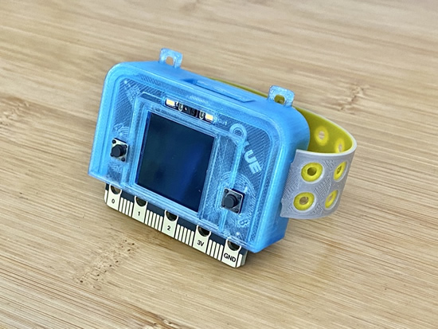](https://www.adafruit.com/clue)

[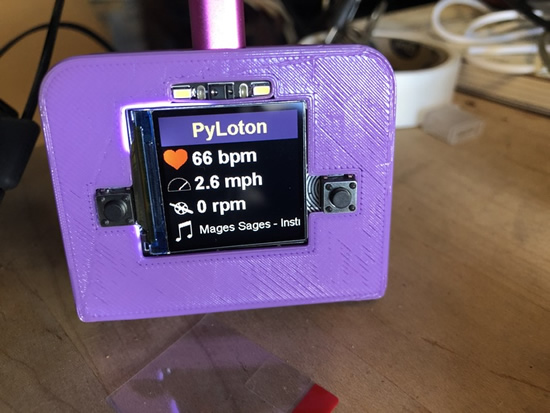](https://www.adafruit.com/clue)

[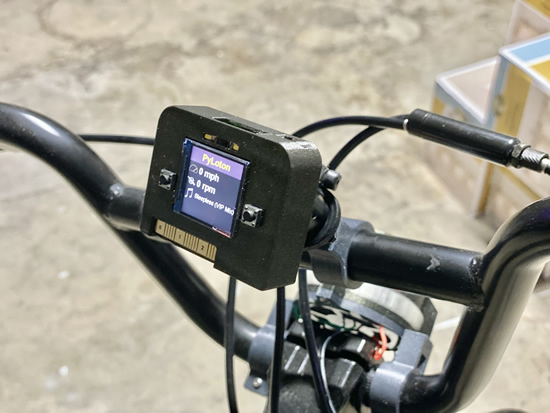](https://www.adafruit.com/clue)

A bunch of PYLOTON projects, open-source smart-bikes and wearables.

Preview of maker.makecode support for nRF52840 - [YouTube](https://youtu.be/Mc8-WnOvgpQ).

## New Learn Guides!

[BLE Synth with the Feather nRF52840 and Circuit Playground Bluefruit](https://learn.adafruit.com/ble-synth-with-the-feather-nrf52840-and-circuit-playground-bluefruit) from [Liz Clark](https://learn.adafruit.com/users/BlitzCityDIY)

[Introducing Adafruit CLUE](https://learn.adafruit.com/adafruit-clue) from [Kattni](https://learn.adafruit.com/users/kattni)

[CircuitPython TFT Candy Hearts](https://learn.adafruit.com/circuit-python-tft-gizmo-candy-hearts) from [Carter Nelson](https://learn.adafruit.com/users/caternuson)

[Bluetooth Cycling Speed & Cadence Sensor Display with Clue](https://learn.adafruit.com/bluetooth-bicycle-speed-cadence-sensor-display-with-clue) from [John Park](https://learn.adafruit.com/users/johnpark)

[Making a PyPortal User Interface with DisplayIO](https://learn.adafruit.com/making-a-pyportal-user-interface-displayio) from [Richard Albritton](https://learn.adafruit.com/users/richa1)

[NeoPixel LED Heart Necklace](https://learn.adafruit.com/neopixel-led-heart-necklace) from [Noe and Pedro](https://learn.adafruit.com/users/pixil3d)

[Tree with Animated Eyes and Motion Sensor](https://learn.adafruit.com/tree-ent-sculpture-with-animated-eyes) from [Erin St. Blaine](https://learn.adafruit.com/users/firepixie)

## Updated Guides - Now With More Python!

**You can use CircuitPython libraries on Raspberry Pi!** We're updating all of our CircuitPython guides to show how to wire up sensors to your Raspberry Pi, and load the necessary CircuitPython libraries to get going using them with Python. We'll be including the updates here so you can easily keep track of which sensors are ready to go. Check it out!

Keep checking back for more updated guides!

## CircuitPython Libraries!

CircuitPython support for hardware continues to grow. We are adding support for new sensors and breakouts all the time, as well as improving on the drivers we already have. As we add more libraries and update current ones, you can keep up with all the changes right here!

For the latest drivers, download the [Adafruit CircuitPython Library Bundle](https://circuitpython.org/libraries).

If you'd like to contribute, CircuitPython libraries are a great place to start. Have an idea for a new driver? File an issue on [CircuitPython](https://github.com/adafruit/circuitpython/issues)! Interested in helping with current libraries? Check out the [CircuitPython.org Contributing page](https://circuitpython.org/contributing). We've included open pull requests and issues from the libraries, and details about repo-level issues that need to be addressed. We have a guide on [contributing to CircuitPython with Git and Github](https://learn.adafruit.com/contribute-to-circuitpython-with-git-and-github) if you need help getting started. You can also find us in the #circuitpython channel on the [Adafruit Discord](https://adafru.it/discord). Feel free to contact Kattni (@kattni) with any questions.

You can check out this [list of all the CircuitPython libraries and drivers available](https://github.com/adafruit/Adafruit_CircuitPython_Bundle/blob/master/circuitpython_library_list.md). 

The current number of CircuitPython libraries is **212**!

**New Libraries!**

Here's this week's new CircuitPython libraries:

 * [Adafruit_CircuitPython_BLE_Cycling_Speed_and_Cadence](https://github.com/adafruit/Adafruit_CircuitPython_BLE_Cycling_Speed_and_Cadence)

**Updated Libraries!**

Here's this week's updated CircuitPython libraries:

 * [Adafruit_CircuitPython_TestRepo](https://github.com/adafruit/Adafruit_CircuitPython_TestRepo)
 * [Adafruit_CircuitPython_EPD](https://github.com/adafruit/Adafruit_CircuitPython_EPD)
 * [Adafruit_CircuitPython_Display_Text](https://github.com/adafruit/Adafruit_CircuitPython_Display_Text)
 * [Adafruit_CircuitPython_seesaw](https://github.com/adafruit/Adafruit_CircuitPython_seesaw)
 * [Adafruit_CircuitPython_FeatherWing](https://github.com/adafruit/Adafruit_CircuitPython_FeatherWing)
 * [Adafruit_CircuitPython_PyBadger](https://github.com/adafruit/Adafruit_CircuitPython_PyBadger)
 * [Adafruit_CircuitPython_BLE](https://github.com/adafruit/Adafruit_CircuitPython_BLE)
 * [Adafruit_CircuitPython_Motor](https://github.com/adafruit/Adafruit_CircuitPython_Motor)
 * [Adafruit_CircuitPython_LIS3MDL](https://github.com/adafruit/Adafruit_CircuitPython_LIS3MDL)
 * [Adafruit_Blinka](https://github.com/adafruit/Adafruit_Blinka)

**PyPI Download Stats!**

We've written a special library called Adafruit Blinka that makes it possible to use CircuitPython Libraries on [Raspberry Pi and other compatible single-board computers](https://learn.adafruit.com/circuitpython-on-raspberrypi-linux/). Adafruit Blinka and all the CircuitPython libraries have been deployed to PyPI for super simple installation on Linux! Here are the top 10 CircuitPython libraries downloaded from PyPI in the last week, including the total downloads for those libraries:

| Library                                                | Last Week   | Total |   
|:-------                                                |:--------:   |:-----:|   
| Adafruit-Blinka                                        | 2410        | 51195 |   
| Adafruit_CircuitPython_BusDevice                       | 1002        | 26326 |   
| Adafruit_CircuitPython_NeoPixel                        | 560         | 7648 |    
| Adafruit_CircuitPython_MCP230xx                        | 305         | 8503 |    
| Adafruit_CircuitPython_seesaw                          | 277         | 2584 |    
| Adafruit_CircuitPython_Register                        | 239         | 6026 |    
| Adafruit_CircuitPython_LIDARLite                       | 208         | 692 |     
| Adafruit_CircuitPython_Motor                           | 162         | 3430 |    
| Adafruit_CircuitPython_ServoKit                        | 141         | 3077 |    
| Adafruit_CircuitPython_PCA9685                         | 139         | 3264 |    

## What’s the team up to this week?

What is the team up to this week? Let’s check in!

**Bryan**

[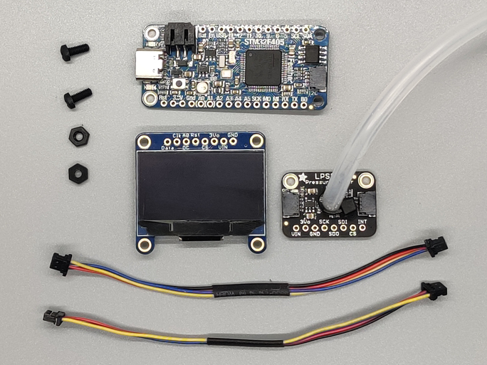](https://circuitpython.org/)

This past week has been a fun time working on a project and guide to make a Sip and Puff device that requires no soldering and very minimal code! I was able to make use of the [Feather STM32F505](https://www.adafruit.com/product/4382) and its built in STEMMA QT connector to easily plug it into an [ST LPS33HW ported pressure sensor](https://www.adafruit.com/product/4414), as well as a STEMMA QT OLED screen to output status and configuration information.

[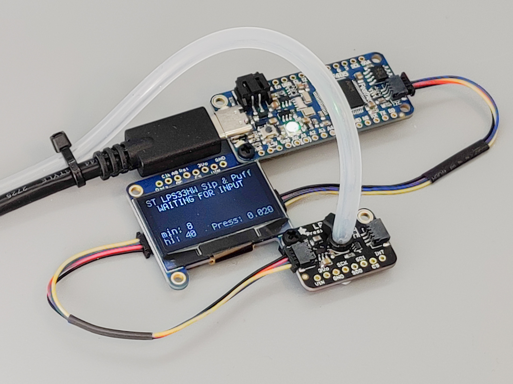](https://circuitpython.org/)

Along the way I also learned a lot about Assistive Technology and the plethora of makers helping support it and make it more accessible and even more functional. [ATMakers.org](http://atmakers.org/about-us/) and [Makers Making Change](https://www.makersmakingchange.com/about-us/) are two great organizations that are helping get AT devices based on Open Source Hardware and Software into the hands of folks that need it.

I'm happy to do what I can to contribute and while the sip and puff I was able to put together is one among many, I look forward to contributing wherever I can.

The [Sip and Puff guide](https://learn.adafruit.com/st-lps33-and-circuitpython-sip-and-puff) should be out by now, so head over, take a look, and see how you can use it or one of the many other open source AT projects to make a difference for people that need some assistance in doing things that man of us take for granted.

**Dan**

This week I fixed several of the remaining issues that needed resolution before we release CircuitPython 5.0.0 for general availability. On nRF boards I coded around a hardware bug, so we can now use the fast SPI peripheral. The CLUE board display is now a lot faster. For all builds, I improved the accuracy of the **time** module functions from milliseconds to microseconds.

I helped Dylan and John Park use the BLE bicycle sensor library I wrote last work for a fun project. You'll be seeing the Learn Guide for it soon.

We had a head-scratching bug about why I2C operations were getting slower and slower when used in a loop. I spent a lot of time on this, but it turns out it had nothing to do with I2C *per se*. Instead was due to a particular pattern storage allocations in the **adafruit_bus_device** library. I made the library more efficient, and the issue provoked Scott to make the storage allocator faster

**Jeff**

[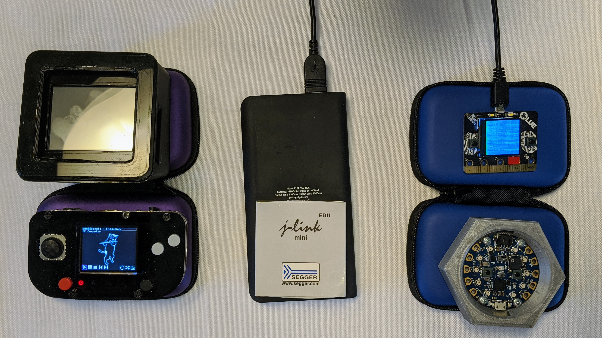](https://circuitpython.org/)

I'm going on the road for a couple of weeks and packing just the basics to continue on my work with ulab and JEplayer.

When I'm not sightseeing, I'll be busy with improvements to ulab, a numpy-like package for CircuitPython, and porting JEplayer's UI to the PyPortal Pynt's touchscreen.

**Kattni**

This week I published the [Introducing Adafruit CLUE](https://learn.adafruit.com/adafruit-clue) guide. This guide has detailed information about all the features of CLUE with a thorough Pinouts page including images and a fancy edge-connector pinout diagram (courtesy of Andrew Tribble!), as well as setup instructions for both Arduino and CircuitPython.

Next, I worked on a series of CLUE demos using the new [CLUE library](https://github.com/adafruit/Adafruit_CircuitPython_CLUE): a height calculator, a spirit level, and a temperature and humidity monitor. I put together a quick guide page for each that will be available soon. They can be found under [CLUE CircuitPython Demos](https://learn.adafruit.com/adafruit-clue/clue-circuitpython-demos) in the Introducing Adafruit CLUE guide. The plan is to extend this series of demos. Next up is a compass demo. After that, who knows! There's so many options with the CLUE, the possibilities are endless!

**Melissa**

This past week I continued working on WebSerial and adapting it to work with the new CLUE for calibrating the IMU sensor. Unfortunately, I kept running into an issue where it seemed to get overwhelmed by too much data and would slow way down, so I will probably be taking a different approach.

In order to gather my thoughts a little better, I switched over to working on Github issues for a few days. I've been focusing mostly on fixing some outstanding display issues and added a couple of new shapes to the Adafruit_CircuitPython_Display_Shapes library. Afterwards, I'll be switching back to working on the CLUE board and IMU sensor again.

**Scott**

Last week I continued work on BroadcastNet. I've started getting PRs out, but everything is still pending. This week I'm working on using a Raspberry Pi 3 as a BroadcastNet bridge, with the hope it will be more reliable than an ESP32 wifi link. I'm very excited to use Ethernet for it.

Over the weekend, I attended PyCascades 2020 and it was great to see a bunch of awesome Pythonistas. I was the last talk and the video of it is available here: https://www.youtube.com/watch?v=2WdjlznbD0o&t=29274

This week so far, I took a detour into memory allocation performance after Ladyada and Dan found something really weird. It was a really tight loop reading accelerometer data and storing it, where the gaps between reads increased from 1 ms to 10 ms and then reset. Turns out it was an un-optimized allocation case which I've now optimized as well. So, check out the last builds and let us know how it's (hopefully) improved performance for you.

## Upcoming events!

[The 2020 Open Hardware Summit](https://2020.oshwa.org/) is March 13th 2020, NYU School of Law, New York. [The "badge"](https://hackaday.com/2020/01/21/circuitpython-slithers-into-100th-board-the-ohs-2020-badge/) for the event is CircuitPython powered!

>_"The Open Hardware Summit is the annual conference organized by the Open Source Hardware Association a 501(c)(3) not for profit charity. It is the world’s first comprehensive conference on open hardware; a venue and community in which we discuss and draw attention to the rapidly growing Open Source Hardware movement. Speakers include world renowned leaders from industry, academia, the arts and maker community. Talks cover a wide range of subjects from electronics, mechanics to related fields such as digital fabrication, fashion technology, self-quantification devices, and IP law. As a microcosm of the Open Source Hardware community, the Summit provides an annual friendly forum for the community."_

Additionally, there is a [2020 Open Hardware Summit topic on Discord](https://discord.gg/8RVyqnk) to join before, during, and after! - [Discord](https://discord.gg/8RVyqnk).

April 15-23, 2020, Pittsburgh, Pennsylvania, USA - The PyCon 2020 conference, which will take place in Pittsburgh, is the largest annual gathering for the community using and developing the open-source Python programming language. It is produced and underwritten by the Python Software Foundation, the 501(c)(3) nonprofit organization dedicated to advancing and promoting Python. Through PyCon, the PSF advances its mission of growing the international community of Python programmers - [PyCon 2020](https://us.pycon.org/2020/).

## Latest releases

CircuitPython's stable release is [4.1.2](https://github.com/adafruit/circuitpython/releases/latest) and its unstable release is [5.0.0-beta.5](https://github.com/adafruit/circuitpython/releases). New to CircuitPython? Start with our [Welcome to CircuitPython Guide](https://learn.adafruit.com/welcome-to-circuitpython).

[20190215](https://github.com/adafruit/Adafruit_CircuitPython_Bundle/releases/latest) is the latest CircuitPython library bundle.

[v1.12](https://micropython.org/download) is the latest MicroPython release. Documentation for it is [here](http://docs.micropython.org/en/latest/pyboard/).

[3.8.1](https://www.python.org/downloads/) is the latest Python release. The latest pre-release version is [3.9.0a3](https://www.python.org/download/pre-releases/).

[1602 Stars](https://github.com/adafruit/circuitpython/stargazers) Like CircuitPython? [Star it on GitHub!](https://github.com/adafruit/circuitpython)

## Call for help – CircuitPython messaging to other languages!

We [recently posted on the Adafruit blog](https://blog.adafruit.com/2018/08/15/help-bring-circuitpython-messaging-to-other-languages-circuitpython/) about bringing CircuitPython messaging to other languages, one of the exciting features of CircuitPython 4.x is translated control and error messages. Native language messages will help non-native English speakers understand what is happening in CircuitPython even though the Python keywords and APIs will still be in English. If you would like to help, [please post](https://github.com/adafruit/circuitpython/issues/1098) to the main issue on GitHub and join us on [Discord](https://adafru.it/discord).

We made this graphic with translated text, we could use your help with that to make sure we got the text right, please check out the text in the image – if there is anything we did not get correct, please let us know. Dan sent me this [handy site too](http://helloworldcollection.de/#Human).

## jobs.adafruit.com - Find a dream job, find great candidates!

[jobs.adafruit.com](https://jobs.adafruit.com/) has returned and folks are posting their skills (including CircuitPython) and companies are looking for talented makers to join their companies - from Digi-Key, to Hackaday, Microcenter, Raspberry Pi and more.

## 16,503 thanks!

The Adafruit Discord community, where we do all our CircuitPython development in the open, reached over 16,503 humans, thank you! Join today! [https://adafru.it/discord](https://adafru.it/discord)

## ICYMI - In case you missed it

The wonderful world of Python on hardware! This is our first video-newsletter-podcast that we’ve started! The news comes from the Python community, Discord, Adafruit communities and more. It’s part of the weekly newsletter, then we have a segment on ASK an ENGINEER and this is the video slice from that! The complete Python on Hardware weekly videocast [playlist is here](https://www.youtube.com/playlist?list=PLjF7R1fz_OOXRMjM7Sm0J2Xt6H81TdDev). 

This video podcast is on [iTunes](https://itunes.apple.com/us/podcast/python-on-hardware/id1451685192?mt=2), [YouTube](https://www.youtube.com/playlist?list=PLjF7R1fz_OOXRMjM7Sm0J2Xt6H81TdDev), [IGTV (Instagram TV](https://www.instagram.com/adafruit/channel/)), and [XML](https://itunes.apple.com/us/podcast/python-on-hardware/id1451685192?mt=2).

[Weekly community chat on Adafruit Discord server CircuitPython channel - Audio / Podcast edition](https://itunes.apple.com/us/podcast/circuitpython-weekly-meeting/id1451685016) - Audio from the Discord chat space for CircuitPython, meetings are usually Mondays at 2pm ET, this is the audio version on [iTunes](https://itunes.apple.com/us/podcast/circuitpython-weekly-meeting/id1451685016), Pocket Casts, [Spotify](https://adafru.it/spotify), and [XML feed](https://adafruit-podcasts.s3.amazonaws.com/circuitpython_weekly_meeting/audio-podcast.xml).

And lastly, we are working up a one-spot destination for all things podcast-able here - [podcasts.adafruit.com](https://podcasts.adafruit.com/)

## Codecademy "Learn Hardware Programming with CircuitPython"

Codecademy, an online interactive learning platform used by more than 45 million people, has teamed up with the leading manufacturer in STEAM electronics, Adafruit Industries, to create a coding course, "Learn Hardware Programming with CircuitPython". The course is now available in the [Codecademy catalog](https://www.codecademy.com/learn/learn-circuitpython?utm_source=adafruit&utm_medium=partners&utm_campaign=circuitplayground&utm_content=pythononhardwarenewsletter).

Python is a highly versatile, easy to learn programming language that a wide range of people, from visual effects artists in Hollywood to mission control at NASA, use to quickly solve problems. But you don’t need to be a rocket scientist to accomplish amazing things with it. This new course introduces programmers to Python by way of a microcontroller — CircuitPython — which is a Python-based programming language optimized for use on hardware.

CircuitPython’s hardware-ready design makes it easier than ever to program a variety of single-board computers, and this course gets you from no experience to working prototype faster than ever before. Codecademy’s interactive learning environment, combined with Adafruit's highly rated Circuit Playground Express, present aspiring hardware hackers with a never-before-seen opportunity to learn hardware programming seamlessly online.

Whether for those who are new to programming, or for those who want to expand their skill set to include physical computing, this course will have students getting familiar with Python and creating incredible projects along the way. By the end, students will have built their own bike lights, drum machine, and even a moisture detector that can tell when it's time to water a plant.

Visit Codecademy to access the [Learn Hardware Programming with CircuitPython](https://www.codecademy.com/learn/learn-circuitpython?utm_source=adafruit&utm_medium=partners&utm_campaign=circuitplayground&utm_content=pythononhardwarenewsletter) course and Adafruit to purchase a [Circuit Playground Express](https://www.adafruit.com/product/3333).

Codecademy has helped more than 45 million people around the world upgrade their careers with technology skills. The company’s online interactive learning platform is widely recognized for providing an accessible, flexible, and engaging experience for beginners and experienced programmers alike. Codecademy has raised a total of $43 million from investors including Union Square Ventures, Kleiner Perkins, Index Ventures, Thrive Capital, Naspers, Yuri Milner and Richard Branson, most recently raising its $30 million Series C in July 2016.

## Contribute!

The CircuitPython Weekly Newsletter is a CircuitPython community-run newsletter emailed every Tuesday. The complete [archives are here](https://www.adafruitdaily.com/category/circuitpython/). It highlights the latest CircuitPython related news from around the web including Python and MicroPython developments. To contribute, edit next week's draft [on GitHub](https://github.com/adafruit/circuitpython-weekly-newsletter/tree/gh-pages/_drafts) and [submit a pull request](https://help.github.com/articles/editing-files-in-your-repository/) with the changes. Join our [Discord](https://adafru.it/discord) or [post to the forum](https://forums.adafruit.com/viewforum.php?f=60) for any further questions.
