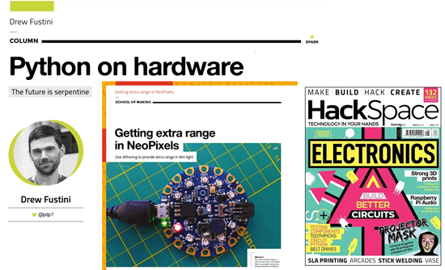
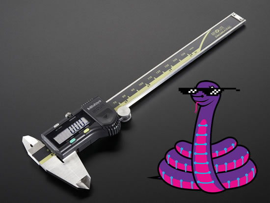
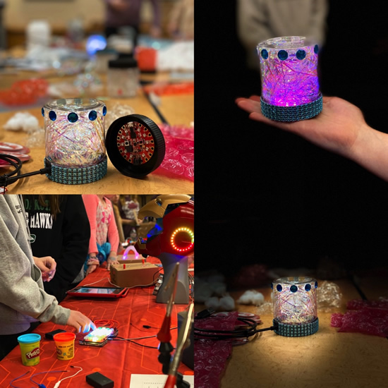
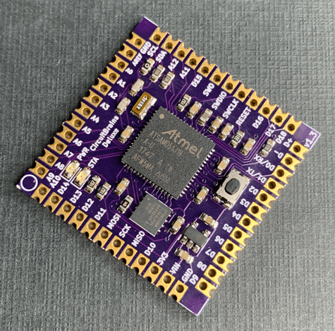
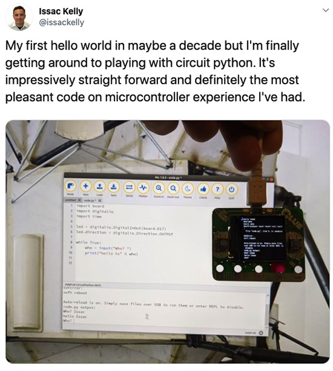
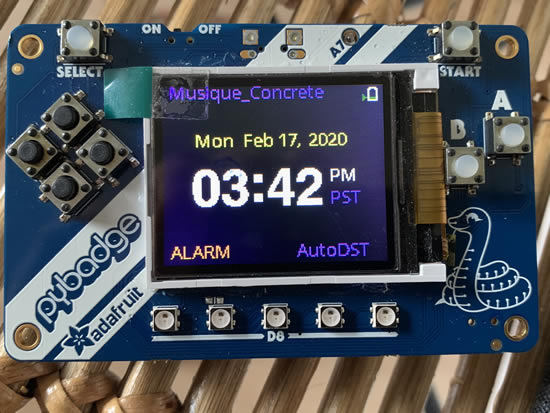
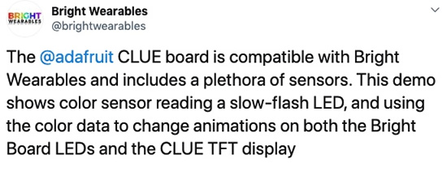
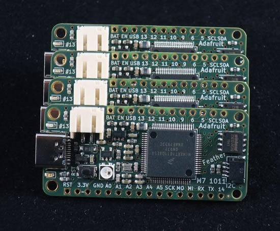
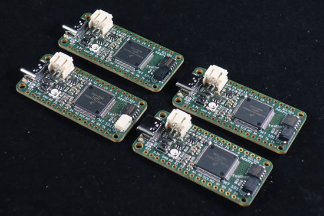
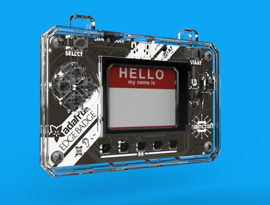

- [ ] Link "View this email in your browser."

[View this email]() in your browser.

Hi everyone! It's the latest and greatest Python for Microcontrollers newsletter brought you by the community! We're on [Discord](https://discord.gg/HYqvREz), [Twitter](https://twitter.com/search?q=circuitpython&src=typed_query&f=live), and for past newsletters - [view them all here](https://www.adafruitdaily.com/category/circuitpython/). If you're reading this on the web, [subscribe here](https://www.adafruitdaily.com/). Here we go!

## Python snakes its way to Morgan Stanley Makerspaces

Morgan Stanley Makerspace Program: Circuit Playgrounds with CircuitPython - [Twitter](https://twitter.com/MorganStanley/status/1231217016985604098).

## HackSpace 28 "CircuitPython is the future of digital making"

[Issue 28 – HackSpace magazine: Electronics: Build Better Circuits](https://hackspace.raspberrypi.org/issues/28) - Columns include: Why CircuitPython is the future of digital making! 

You don’t have to understand electronics to be a maker, but adding a few billion electrons can add light, interactivity, motion, or (some limited) intelligence to the things you make. In this issue HackSpace will help you get started with electronics and build better circuits.

 * Design a vase in Fusion 360
 * Make things with toothpicks
 * Add audio to Raspberry Pi projects
 * 3D print strong parts

[Read more](https://hackspace.raspberrypi.org/issues/28), [download PDF](https://hackspace.raspberrypi.org/issues/28/pdf), [buy now](https://store.rpipress.cc/collections/hackspace-magazine/products/hackspace-magazine-28), [subscribe](https://raspberrypipress.imbmsubscriptions.com/hackspace-magazine/).

## CircuitPython measures up!

Here's a CircuitPython library parsing the data output of a Mitutoyo Digimatic instrument, like calipers or micrometers - [GitHub](https://github.com/vifino/CircuitPython-mitutoyo).

## News from around the web!

For EngineersWeek [check out](https://twitter.com/digikey/status/1230971271275597825) Digi-Key's events with [Circuit Playgrounds and more](https://twitter.com/Kwalseth/status/1230927356174512129)!

New part day: Ooh, the things you can do with a CLUE - [hackaday](https://hackaday.com/2020/02/24/new-part-day-ooh-the-things-you-can-do-with-a-clue/).

CircuitBrains Deluxe packs CircuitPython into 1 square inch - [OSH Park](https://blog.oshpark.com/2020/02/23/circuitbrains-deluxe-packs-circuitpython-into-1-square-inc/).

Hello world! - [Twitter](https://twitter.com/issackelly/status/1229459588996464640).

"soooooo simple and good" - [Twitter](https://twitter.com/jordansissel/status/1230349862836699136).

CedarGrove is learning to use CircuitPython DisplayIO: Made text and labels, then an animated battery monitor sprite AND an automatic DST for the attached RTC - [Twitter](https://twitter.com/CedarGroveMakr/status/1229554777769431045).

CLUE + Bright Wearables = SUPER GOOD - [Twitter](https://twitter.com/brightwearables/status/1230940282000031744).

Ray tracing with uLisp - [uLisp](http://www.ulisp.com/show?2NWA).

[Some Adafruit app stats](https://blog.adafruit.com/2020/02/17/some-adafruit-app-stats-appstore-googleplay-adafruit-adafruit-ios-android/) from our Apple iOS apps, and our Google Android apps from the Google Play Store. Worth noting: Bluefruit LE Connect for iOS has [118,065 downloads](https://apps.apple.com/us/developer/adafruit-industries/id492487674).

[Google Summer of Code](https://summerofcode.withgoogle.com/) is starting up and in the idea stage for [Arduino](https://summerofcode.withgoogle.com/organizations/6251078376488960/), they are looking for MicroPython examples - [GitHub](https://github.com/arduino/summer-of-code/blob/master/ideas.md#write-micropython-examples-and-tools-for-portenta).

Managing open source in the cloud is hard - [ComputerWeekly](https://www.computerweekly.com/blog/Open-Source-Insider/Databricks-CEO-Managing-open-source-in-the-cloud-is-hard).

Build a Raspberry Pi Zero W Amazon price tracker with Python - [Raspberry Pi](https://www.raspberrypi.org/blog/build-a-raspberry-pi-zero-w-amazon-price-tracker/).

Finding the Perfect Python Code Editor - [Real Python](https://realpython.com/courses/finding-perfect-python-code-editor/).

Building Good Tests by [Chris NeJame](https://salmonmode.github.io/2019/03/29/building-good-tests.html).

Robots and Generative Art and Python, oh my - [Generative Hut](https://www.generativehut.com/post/robots-and-generative-art-and-python-oh-my).

Python Popularity Surging Because AI/ML Engineers Need It - [WaterWorks](https://adtmag.com/blogs/watersworks/2020/02/python-ai-growth.aspx).

Python Tools for Record Linking and Fuzzy Matching - [Practical Business Python](https://pbpython.com/record-linking.html).

Faster, Easier, Better: Why Python is the Best Programming Language for a Startup - [Djangostars](https://djangostars.com/blog/python-best-programming-language-for-startup/).

MiniPB is a Mini Protobuf library in pure Python - [GitHub](https://github.com/dogtopus/minipb).

cpp2python helps to convert C/C++ sources to C/C++ -like Python sources - [GitHub](https://github.com/andreikop/cpp2python).

Getting the most out of Python collections - [Sourcery](https://sourcery.ai/blog/effective-collection-handling/).

2019 Transparency Report - [GitHub](https://github.blog/2020-02-20-2019-transparency-report/).

Glitch, Glimmer, and the Web We Need - [Glitch](https://glitch.com/glimmer/post/glitch-glimmer-technology-culture-stories).

Good thread _"what is the most intimidating part of hardware development to you, if you've ever had doubts about starting a first project with microcontrollers, etc?"_ - [Twitter](https://twitter.com/noopkat/status/1229547642343972864).

PyDev of the Week: Hameer Abbasi on [Mouse vs Python](https://www.blog.pythonlibrary.org/2020/02/24/pydev-of-the-week-hameer-abbasi/)

CircuitPython Weekly for February 24th, 2020 on [YouTube](https://youtu.be/3QtSKnuXtsY).

#ICYDNCI What was the most popular, most clicked link, in [last week's newsletter](https://www.adafruitdaily.com/2020/02/18/ports-app-updates-clues-in-the-news-and-more-python-adafruit-circuitpython-circuitpython-micropython-thepsf-adafruit/)? [Awesome MicroPythons, the ports and forks of MicroPython](https://github.com/adafruit/awesome-micropythons).

## Coming soon

Feather previews! [Twitter](https://twitter.com/arturo182/status/1229500410664280064) and [Instagram](https://www.instagram.com/p/B8rpJbFHovw/?igshid=1qlgbwy8rjjkp).

EDGE BADGE cases!

## New Learn Guides!

[CircuitPython Powered Sip & Puff with ST LPS33HW Pressure Sensor](https://learn.adafruit.com/st-lps33-and-circuitpython-sip-and-puff) from [Bryan Siepert](https://learn.adafruit.com/users/siddacious)

## Updated Guides - Now With More Python!

**You can use CircuitPython libraries on Raspberry Pi!** We're updating all of our CircuitPython guides to show how to wire up sensors to your Raspberry Pi, and load the necessary CircuitPython libraries to get going using them with Python. We'll be including the updates here so you can easily keep track of which sensors are ready to go. Check it out!

Keep checking back for more updated guides!

## CircuitPython Libraries!

CircuitPython support for hardware continues to grow. We are adding support for new sensors and breakouts all the time, as well as improving on the drivers we already have. As we add more libraries and update current ones, you can keep up with all the changes right here!

For the latest drivers, download the [Adafruit CircuitPython Library Bundle](https://circuitpython.org/libraries).

If you'd like to contribute, CircuitPython libraries are a great place to start. Have an idea for a new driver? File an issue on [CircuitPython](https://github.com/adafruit/circuitpython/issues)! Interested in helping with current libraries? Check out the [CircuitPython.org Contributing page](https://circuitpython.org/contributing). We've included open pull requests and issues from the libraries, and details about repo-level issues that need to be addressed. We have a guide on [contributing to CircuitPython with Git and Github](https://learn.adafruit.com/contribute-to-circuitpython-with-git-and-github) if you need help getting started. You can also find us in the #circuitpython channel on the [Adafruit Discord](https://adafru.it/discord). Feel free to contact Kattni (@kattni) with any questions.

You can check out this [list of all the CircuitPython libraries and drivers available](https://github.com/adafruit/Adafruit_CircuitPython_Bundle/blob/master/circuitpython_library_list.md). 

The current number of CircuitPython libraries is **214**!

**New Libraries!**

Here's this week's new CircuitPython libraries:

 * [Adafruit_CircuitPython_LPS2X](https://github.com/adafruit/Adafruit_CircuitPython_LPS2X)
 * [Adafruit_CircuitPython_BLE_Eddystone](https://github.com/adafruit/Adafruit_CircuitPython_BLE_Eddystone)

**Updated Libraries!**

Here's this week's updated CircuitPython libraries:

 * [Adafruit_CircuitPython_LIS2MDL](https://github.com/adafruit/Adafruit_CircuitPython_LIS2MDL)
 * [Adafruit_CircuitPython_Fingerprint](https://github.com/adafruit/Adafruit_CircuitPython_Fingerprint)
 * [Adafruit_CircuitPython_Gizmo](https://github.com/adafruit/Adafruit_CircuitPython_Gizmo)
 * [Adafruit_CircuitPython_LSM303_Accel](https://github.com/adafruit/Adafruit_CircuitPython_LSM303_Accel)
 * [Adafruit_CircuitPython_LSM303DLH_Mag](https://github.com/adafruit/Adafruit_CircuitPython_LSM303DLH_Mag)
 * [Adafruit_CircuitPython_BluefruitConnect](https://github.com/adafruit/Adafruit_CircuitPython_BluefruitConnect)
 * [Adafruit_CircuitPython_RGB_Display](https://github.com/adafruit/Adafruit_CircuitPython_RGB_Display)
 * [Adafruit_CircuitPython_Motor](https://github.com/adafruit/Adafruit_CircuitPython_Motor)
 * [Adafruit_CircuitPython_LIS3MDL](https://github.com/adafruit/Adafruit_CircuitPython_LIS3MDL)
 * [Adafruit_CircuitPython_MPU6050](https://github.com/adafruit/Adafruit_CircuitPython_MPU6050)
 * [Adafruit_CircuitPython_ADS1x15](https://github.com/adafruit/Adafruit_CircuitPython_ADS1x15)
 * [Adafruit_CircuitPython_PyPortal](https://github.com/adafruit/Adafruit_CircuitPython_PyPortal)
 * [Adafruit_CircuitPython_MCP230xx](https://github.com/adafruit/Adafruit_CircuitPython_MCP230xx)
 * [Adafruit_CircuitPython_CLUE](https://github.com/adafruit/Adafruit_CircuitPython_CLUE)
 * [Adafruit_CircuitPython_HT16K33](https://github.com/adafruit/Adafruit_CircuitPython_HT16K33)
 * [Adafruit_CircuitPython_Display_Text](https://github.com/adafruit/Adafruit_CircuitPython_Display_Text)
 * [Adafruit_CircuitPython_BusDevice](https://github.com/adafruit/Adafruit_CircuitPython_BusDevice)
 * [Adafruit_CircuitPython_BLE](https://github.com/adafruit/Adafruit_CircuitPython_BLE)
 * [Adafruit_CircuitPython_PyBadger](https://github.com/adafruit/Adafruit_CircuitPython_PyBadger)
 * [Adafruit_Blinka](https://github.com/adafruit/Adafruit_Blinka)

**PyPI Download Stats!**

We've written a special library called Adafruit Blinka that makes it possible to use CircuitPython Libraries on [Raspberry Pi and other compatible single-board computers](https://learn.adafruit.com/circuitpython-on-raspberrypi-linux/). Adafruit Blinka and all the CircuitPython libraries have been deployed to PyPI for super simple installation on Linux! Here are the top 10 CircuitPython libraries downloaded from PyPI in the last week, including the total downloads for those libraries:

| Library                                                | Last Week   | Total |   
|:-------                                                |:--------:   |:-----:|   
| Adafruit-Blinka                                        | 2457        | 51257 |   
| Adafruit_CircuitPython_BusDevice                       | 1350        | 26224 |   
| Adafruit_CircuitPython_NeoPixel                        | 485         | 7862 |    
| Adafruit_CircuitPython_MCP230xx                        | 413         | 8580 |    
| Adafruit_CircuitPython_Register                        | 286         | 6056 |    
| Adafruit_CircuitPython_Motor                           | 188         | 3468 |    
| Adafruit_CircuitPython_PCA9685                         | 149         | 3299 |    
| Adafruit_CircuitPython_ADS1x15                         | 143         | 2393 |    
| Adafruit_CircuitPython_seesaw                          | 137         | 2534 |    
| Adafruit_CircuitPython_ServoKit                        | 127         | 3091 |    

## What’s the team up to this week?

What is the team up to this week? Let’s check in!

**Bryan**

This week I started working with two new sensors. The first is the ST LPS25, the little sister to the LPS33. In the same way that the LPS33HW and LPS35HW are close enough that they're a 'family' of sorts, the LPS25 is a member of the LPS2X family. With that in mind, expect to see more siblings in the future.

I wrote and published the CircuitPython and Arduino libraries for the LPS2X family over the last week. The LPS2X family is _similar_ to the LPS3X, most of the operations are very similar, but they're different enough to need a new library. After finishing the libraries I put together some tester code by making a few small tweaks to the code for the LPS3X tester.

As I write this I'm about half way through the Arduino library for the HTS221 Barometric Pressure and Temperature sensor from...  **ST!** (What can I say, they make all kinds of good sensors). This sensor is an admirable little guy, dutifully doing what humidity sensors do, letting you know if you hair will be frizzy because there is too much water floating around in the air! Or if it's to muggy for your [mogwai](https://en.wikipedia.org/wiki/Gremlins).

**Dan**

I'm resolving the remaining few issues we have as blockers before CircuitPython 5.0.0 is released for general availability.

I've started investigating BLE-capable thermometers, which are often used for barbecue monitoring or other cooking applications. Unfortunately, all the ones I've encountered use vendor-specific BLE services which we'll need to reverse engineer. There is a standard BLE "Environmental Sensing Service" that includes temperature, including multiple values, but I haven't seen it used.

**Kattni**

This week I worked on adding [Adafruit CLUE](https://www.adafruit.com/product/4500) support to the [Adafruit CircuitPython PyBadger](https://github.com/adafruit/Adafruit_CircuitPython_PyBadger) library. PyBadger is a badge-focused library designed around making it super simple to create a Hello My Name Is name badge, display a customised QR code, or a "business card" with an image, name and email address. Adafruit and Digi-Key are [giving away CLUEs to each attendee at PyCon 2020](https://blog.adafruit.com/2020/02/06/get-a-clue-at-pycon-us-from-digi-key-and-adafruit-digikey-adafruit-pycon2020-pycon-circuitpython/), and we wanted to make it easy to quickly create a CLUE badge using CircuitPython. This involved a complete refactor of the library, but resulted in a simpler code structure when using it. Now, you simply import the library, and it automatically detects which supported board you are using, and imports the appropriate features. You no longer need to instantiate the library after importing. To test this, I created a test suite program that utilises every possible feature in the library, with some board detection to include features not applicable to all three boards. The code wasn't pretty, but it made testing all the features of the library with the updates super quick. It also meant I was able to get assistance from Melissa with testing while minimising the amount of effort required on her part - thanks again, Melissa!

PyCon 2020 is right around the corner, and I am beginning preparation. One of the things I want to do is go through all the libraries and identify "Good First Issues" and create labeled GitHub issues for each one. Last year at the PyCon Sprints, we had a huge amount of participation, and we were able to facilitate that by having things for everyone to work on regardless of experience level. While hardware was crucial to this, having a list of issues to work on was equally important, as it gave us a place to point people to help them get started on their own. There are plenty of things that need to be done with the libraries that would be great for a beginner to take on, but we don't have GitHub issues for very many of them, explaining what each of them are. I will be creating a document outlining what I'm looking for in a Good First Issue, and covering what the content of the issue should look like. If you're interested in helping, please ping me, @kattni on GitHub or the [Adafruit Discord](https://adafru.it/discord), and I will be happy to include you in the effort.

**Lucian**

This week I worked on a large container of ibuprofin, courtesy of Influenza A, which knocked me out for almost a week - the flu vaccine this year missed the common strains, and it's a "double barrel" flu season anyway (both B and A), so remember to wash your hands and stay away from coughing people. 

In other news though I've gotten started on the PulseIO module for STM32, following the wrap up of the new Espruino Wifi and Espruino Pico boards, and the addition of the core temperature/voltage module. I'm hoping to get back up to speed this week, with some IR LED testing of the PulseIn and PulseOut modules. 

**Melissa**

This last week I started by taking a break from WebSerial for a couple of days and focused on reviewing PRs and fixing issues. I picked back up on creating a 3D Model viewer that worked by taking magnetometer data and changing the rotation of a model. This was done using both Euler angles and Quaternions and I added the ability to select between the two, although quaternions is definitely the preferable method.

After that was wrapped up, I moved over to familiarizing myself with WebBluetooth and adapting the web application to be able to display multiple graphs and other pieces of data in a dashboard style interface.

**Scott**

At the end of last week I created an Eddystone BLE library for broadcasting URLs. Keep an eye out for a guide from John Park about it.

After that I continued work on the Raspberry Pi based BroadcastNet bridge. I've been pushing that work out into libraries including a new Adafruit Blinka bleio library which includes basic scanning support on Linux. I'll also be working to wrap up my changes to ESP32SPI as well.

## Upcoming events!

[The 2020 Open Hardware Summit](https://2020.oshwa.org/) is March 13th 2020, NYU School of Law, New York USA. [The "badge"](https://hackaday.com/2020/01/21/circuitpython-slithers-into-100th-board-the-ohs-2020-badge/) for the event is CircuitPython powered!

>_"The Open Hardware Summit is the annual conference organized by the Open Source Hardware Association a 501(c)(3) not for profit charity. It is the world’s first comprehensive conference on open hardware; a venue and community in which we discuss and draw attention to the rapidly growing Open Source Hardware movement. Speakers include world renowned leaders from industry, academia, the arts and maker community. Talks cover a wide range of subjects from electronics, mechanics to related fields such as digital fabrication, fashion technology, self-quantification devices, and IP law. As a microcosm of the Open Source Hardware community, the Summit provides an annual friendly forum for the community."_

Additionally, there is a [2020 Open Hardware Summit topic on Discord](https://discord.gg/8RVyqnk) to join before, during, and after! - [Discord](https://discord.gg/8RVyqnk).

April 15-23, 2020, Pittsburgh, Pennsylvania, USA - The PyCon 2020 conference, which will take place in Pittsburgh, is the largest annual gathering for the community using and developing the open-source Python programming language. It is produced and underwritten by the Python Software Foundation, the 501(c)(3) nonprofit organization dedicated to advancing and promoting Python. Through PyCon, the PSF advances its mission of growing the international community of Python programmers - [PyCon 2020](https://us.pycon.org/2020/).

## Latest releases

CircuitPython's stable release is [4.1.2](https://github.com/adafruit/circuitpython/releases/latest) and its unstable release is [5.0.0-beta.5](https://github.com/adafruit/circuitpython/releases). New to CircuitPython? Start with our [Welcome to CircuitPython Guide](https://learn.adafruit.com/welcome-to-circuitpython).

[20190222](https://github.com/adafruit/Adafruit_CircuitPython_Bundle/releases/latest) is the latest CircuitPython library bundle.

[v1.12](https://micropython.org/download) is the latest MicroPython release. Documentation for it is [here](http://docs.micropython.org/en/latest/pyboard/).

[3.8.1](https://www.python.org/downloads/) is the latest Python release. The latest pre-release version is [3.9.0a3](https://www.python.org/download/pre-releases/).

[1604 Stars](https://github.com/adafruit/circuitpython/stargazers) Like CircuitPython? [Star it on GitHub!](https://github.com/adafruit/circuitpython)

## ICYMI - In case you missed it

The wonderful world of Python on hardware! This is our first video-newsletter-podcast that we’ve started! The news comes from the Python community, Discord, Adafruit communities and more. It’s part of the weekly newsletter, then we have a segment on ASK an ENGINEER and this is the video slice from that! The complete Python on Hardware weekly videocast [playlist is here](https://www.youtube.com/playlist?list=PLjF7R1fz_OOXRMjM7Sm0J2Xt6H81TdDev). 

This video podcast is on [iTunes](https://itunes.apple.com/us/podcast/python-on-hardware/id1451685192?mt=2), [YouTube](https://www.youtube.com/playlist?list=PLjF7R1fz_OOXRMjM7Sm0J2Xt6H81TdDev), [IGTV (Instagram TV](https://www.instagram.com/adafruit/channel/)), and [XML](https://itunes.apple.com/us/podcast/python-on-hardware/id1451685192?mt=2).

[Weekly community chat on Adafruit Discord server CircuitPython channel - Audio / Podcast edition](https://itunes.apple.com/us/podcast/circuitpython-weekly-meeting/id1451685016) - Audio from the Discord chat space for CircuitPython, meetings are usually Mondays at 2pm ET, this is the audio version on [iTunes](https://itunes.apple.com/us/podcast/circuitpython-weekly-meeting/id1451685016), Pocket Casts, [Spotify](https://adafru.it/spotify), and [XML feed](https://adafruit-podcasts.s3.amazonaws.com/circuitpython_weekly_meeting/audio-podcast.xml).

And lastly, we are working up a one-spot destination for all things podcast-able here - [podcasts.adafruit.com](https://podcasts.adafruit.com/)

## Codecademy "Learn Hardware Programming with CircuitPython"

Codecademy, an online interactive learning platform used by more than 45 million people, has teamed up with the leading manufacturer in STEAM electronics, Adafruit Industries, to create a coding course, "Learn Hardware Programming with CircuitPython". The course is now available in the [Codecademy catalog](https://www.codecademy.com/learn/learn-circuitpython?utm_source=adafruit&utm_medium=partners&utm_campaign=circuitplayground&utm_content=pythononhardwarenewsletter).

Python is a highly versatile, easy to learn programming language that a wide range of people, from visual effects artists in Hollywood to mission control at NASA, use to quickly solve problems. But you don’t need to be a rocket scientist to accomplish amazing things with it. This new course introduces programmers to Python by way of a microcontroller — CircuitPython — which is a Python-based programming language optimized for use on hardware.

CircuitPython’s hardware-ready design makes it easier than ever to program a variety of single-board computers, and this course gets you from no experience to working prototype faster than ever before. Codecademy’s interactive learning environment, combined with Adafruit's highly rated Circuit Playground Express, present aspiring hardware hackers with a never-before-seen opportunity to learn hardware programming seamlessly online.

Whether for those who are new to programming, or for those who want to expand their skill set to include physical computing, this course will have students getting familiar with Python and creating incredible projects along the way. By the end, students will have built their own bike lights, drum machine, and even a moisture detector that can tell when it's time to water a plant.

Visit Codecademy to access the [Learn Hardware Programming with CircuitPython](https://www.codecademy.com/learn/learn-circuitpython?utm_source=adafruit&utm_medium=partners&utm_campaign=circuitplayground&utm_content=pythononhardwarenewsletter) course and Adafruit to purchase a [Circuit Playground Express](https://www.adafruit.com/product/3333).

Codecademy has helped more than 45 million people around the world upgrade their careers with technology skills. The company’s online interactive learning platform is widely recognized for providing an accessible, flexible, and engaging experience for beginners and experienced programmers alike. Codecademy has raised a total of $43 million from investors including Union Square Ventures, Kleiner Perkins, Index Ventures, Thrive Capital, Naspers, Yuri Milner and Richard Branson, most recently raising its $30 million Series C in July 2016.

## Contribute!

The CircuitPython Weekly Newsletter is a CircuitPython community-run newsletter emailed every Tuesday. The complete [archives are here](https://www.adafruitdaily.com/category/circuitpython/). It highlights the latest CircuitPython related news from around the web including Python and MicroPython developments. To contribute, edit next week's draft [on GitHub](https://github.com/adafruit/circuitpython-weekly-newsletter/tree/gh-pages/_drafts) and [submit a pull request](https://help.github.com/articles/editing-files-in-your-repository/) with the changes. Join our [Discord](https://adafru.it/discord) or [post to the forum](https://forums.adafruit.com/viewforum.php?f=60) for any further questions.
