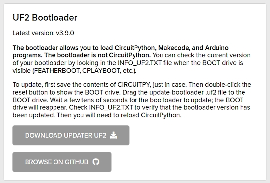
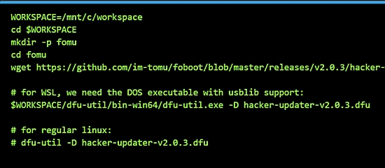
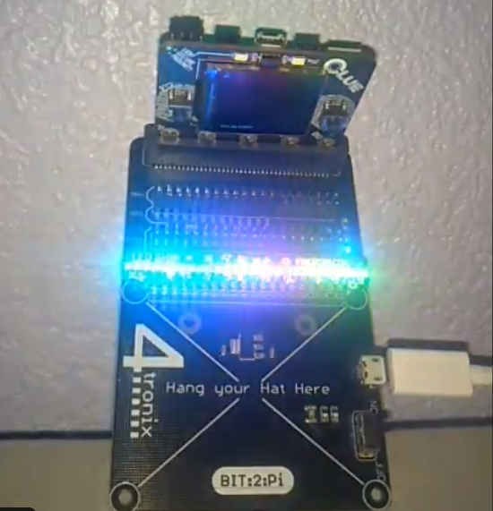
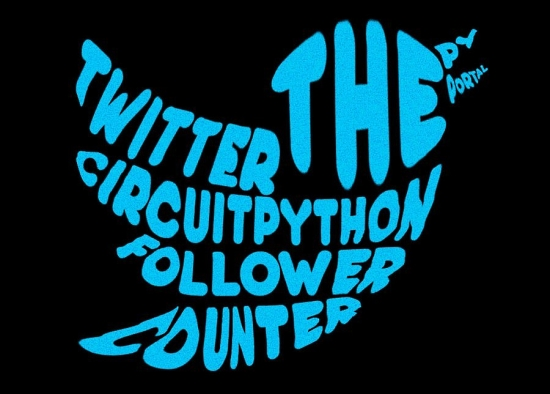
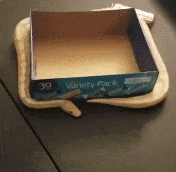
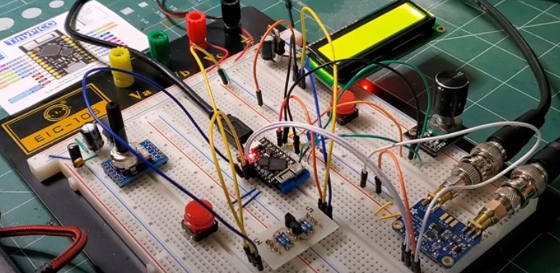

View this email in your browser.

Hi everyone! It's the latest Python for Microcontrollers newsletter, brought you by the community! We're on [Discord](https://discord.gg/HYqvREz), [Twitter](https://twitter.com/search?q=circuitpython&src=typed_query&f=live), and for past newsletters - [view them all here](https://www.adafruitdaily.com/category/circuitpython/). If you're reading this on the web, [subscribe here](https://www.adafruitdaily.com/). There is lots to cover, let's get started.

## CircuitPython 5.2.0 release pops out

CircuitPython 5.2.0 went direct to release on April 9th. It features a new port to LiteX, a Python powered hardware description system used to define a soft System on Chip (SoC) that is then loaded into a Field Programmable Gate Array (FPGA). There are a few minor fixes and improvements over 5.1.0 as well - [Blog](https://blog.adafruit.com/2020/04/09/circuitpython-5-2-0-released/) and [GitHub](https://github.com/adafruit/circuitpython/releases/tag/5.2.0).

New features and improvements since 5.1.0
* Add LiteX port for CircuitPython on an FPGA. Thanks to @xobs.
* Add support for additional baudrates for nRF UART (including MIDI’s 31250). Thanks to @billmoser
* Add support for MX25L51245G SPI Flash. Thanks to @bd34n and @ladyada
* Add displayio support for inverted backlights. Thanks to @siddacious and @tannewt
* Add support for phase and polarity to FourWire as kwargs. Thanks to @tannewt
* Fix iMX RT UART read length. Thanks to @arturo182 and @theacodes
* Fix iMX RT neopixel timing. Thanks to @arturo182
* Fix reading pixel values from Pixelbuf. Thanks to @jepler.
* Fix \_bleio.PacketBuffer when in server mode. Required for BLE Midi. Thanks to @tannewt

## ESP32-S2 receives TinyUSB Support

The community has been actively working on software support for the ESP32-S2 chip. For CircuitPython, the foundation of porting CircuitPython is [TinyUSB](https://github.com/hathach/tinyusb) support. CircuitPython lead author Scott Shawcroft held a stream on support last Friday - [YouTube](https://www.youtube.com/watch?v=5zq8RHXVdSI). Over the weekend, a great pop up stream of the Desk of Ladyada demonstrated TinyUSB running on the chip. Huge kudos to Ha Thach for his expert work on TinyUSB.

This work paves the way for further work porting CircuitPython to this new chip - [Blog](https://blog.adafruit.com/2020/04/12/we-are-back-deskofladyada-all-about-the-esp32-s2-by-espressif-systems-adafruit-espressifsystem-esp32s2-get-it-on-digkey/) and [YouTube](https://youtu.be/gdkvf2nxx20).

Adafruit is planning products based on the ESP32-S2 chip but has no ETA, especially with the COVID-19 pandemic. Adafruit recommends Digi-Key, who is open and stocking various ESP32-S2  and Adafruit products - [Digi-Key](https://www.digikey.com/products/en/rf-if-and-rfid/rf-transceiver-modules/872?k=ESP32-S2&pkeyword=&sv=0&sf=0&FV=-8%7C872&quantity=&ColumnSort=0&page=1&pageSize=25).

## Adafruit Submitting Board Designs to OSHWA

Adafruit has always been an open source hardware company, predating the Open Source Hardware Association (OSHWA) certification process. With availability of personnel due to the COVID-19 pandemic, Adafruit has been submitting their board designs to OSHWA to receive their official certification. This includes a large number of CircuitPython compatible boards - [Blog](https://blog.adafruit.com/2020/04/08/25-adafruit-boards-have-been-certified-by-oshwa-oshw-oshwa-adafruit-ohsummit/).

Some of the CircuitPython compatible boards which have received certification to date:

* [Adafruit Feather M4 Express](https://certification.oshwa.org/us000242.html)
* [Adafruit Feather nRF52840 Express](https://certification.oshwa.org/us000246.html)
* [Adafruit Metro M4 Express AirLift](https://certification.oshwa.org/us000245.html)
* [Adafruit PyPortal](https://certification.oshwa.org/us000248.html)

See the growing list of certified boards and expect more soon - [OSHWA](https://certification.oshwa.org/list.html?q=Adafruit).

## The NFC Copy Cat Cybersecurity Tool

Electronic Cats announced Monday their latest CircuitPython-based electronics board: the NFC Copy Cat. It works by reading or emulating a NFC card; depending on the necessities of the researcher. Using the board, the user will have a device capable of storing magnetic stripe data or NFC payment data to be replayed later — known in the cybersecurity world as a replay attack. This is the first cybersecurity tool that support CircuitPython - [Electronic Cats](https://electroniccats.com/blog/nfc-copy-cat-the-new-cybersecurity-tool-for-nfc-and-magspoof/).

## Microcontroller Bootloader Files are now on CircuitPython.org

The CircuitPython website, [CircuitPython.org](https://circuitpython.org/), now contains links to bootloader files for microcontroller boards. This simplifies users obtaining the latest bootloader file rather than searching on GitHub ([example](https://github.com/adafruit/uf2-samdx1/releases/tag/v3.9.0)). At CircuitPython.Org/downloads, select the board of interest, and find the bootloader information - [Blog](https://blog.adafruit.com/2020/04/13/uf2-bootloader-news-downloads-in-circuitpython-org-new-version-for-samd51-m4-boards/) and [CircuitPython.org](https://circuitpython.org/downloads).

## An Important UF2 Bootloader Update for SAMD51 M4 Boards

A new version of the UF2 bootloader is available for SAMD51 M4 boards, such as the Metro M4 Express, Feather M4 Express, ItsyBitsy M4 Express, PyPortal, PyGamer, PyBadge, and others. Version v3.9.0 or later fixes a rare but annoying problem that occasionally erases parts of internal flash memory when the board is plugged in or power-cycled. Both Arduino and CircuitPython are affected. Adafruit highly recommends that you update your bootloader if you have a SAMD51 M4 board. Download the updater from the circuitpython.org/downloads page for your board, and follow the instructions to update. Update instructions will also be added to the Adafruit Learning System Guide for each board - [Blog](https://blog.adafruit.com/2020/04/13/uf2-bootloader-news-downloads-in-circuitpython-org-new-version-for-samd51-m4-boards/).

## The CircuitPython Library for Adafruit IO is Updated

Adafruit_CircuitPython_AdafruitIO is the CircuitPython wrapper library for communicating with Adafruit IO, the Internet of Things service. Version 3.1.3 adds a check with the Python formater Black. Looking for an ultra easy way to use Internet of Things (IoT) logging and display with PCircuitPython on microcontrollers or single board computers, Adafruit IO is for you with both free and paid tiers. Ones data is never sold or given out and it can be deleted whenever you want. - [GitHub](https://github.com/adafruit/Adafruit_CircuitPython_AdafruitIO/releases/tag/3.1.3) and [Adafruit IO](https://io.adafruit.com/).

## The Python Software Foundation Fellows Announced

Congratulations to the newsest announced Python Software Foundation (PSF) Fellow Members for the first quarter of 2020 - [PSF Blog](http://pyfound.blogspot.com/2020/04/python-software-foundation-fellow.html)

* Al Sweigart
* Alexandre Savio
* Darya Chyzhyk
* Kenneth Love
* Kevin O'Brien
* Serhiy Storchaka
* Thea Flowers
* Tom Christie

The Fellow Work Group is looking for more members from all around the world! If you are a PSF Fellow and would like to help review nominations, please email us at psf-fellow at python.org. More information is available at: https://www.python.org/psf/fellows/.

## Adafruit Update

Adafruit Industries continues to run with 100% of employees being paid and continuing to work. Most are working remotely, with some working in the Manhattan, New York factory as an essential service and business under NYC Executive Order 202.6 Capabilities. Adafruit was deemed an essential service to distribute/make some PPE (Personal Protection Equipment) such as face shields, and manufacturer electronics for essential life-saving/preserving equipment and development which is needed in New York and beyond. -[Blog](https://blog.adafruit.com/2020/03/22/covid/)

Adafruit received a literal ton of plastic for face shields from food packaging company Novolex. The material was put to use making face masks on an Adafruit assembly line. You can see all the picture, day by day, from Adafruit with Twitter hashtag [#adafruitchronicles](https://blog.adafruit.com/category/adafruitchronicles/).

## Subreddits to subscribe to

Are you a [Reddit](https://www.reddit.com/) fan? There are several subreddits you may wish to follow for Python-related news:

- [r/Python](https://www.reddit.com/r/Python/) for all things Python
- [r/circuitpython](https://www.reddit.com/r/circuitpython/) for CircuitPython related posts
- [r/AdafruitIO](https://www.reddit.com/r/AdafruitIO/) for Adafruit IO news

## News from around the web!

The Winterbloom online store has opened to sell the CircuitPython based Winterbloom Sol and Big Honking Button eurorack synth modules - [Twitter](https://twitter.com/theavalkyrie/status/1249370066023370753) and [Winterbloom](https://winterbloom.com/).

CircuitPython on the OrangeCrab board - 8MB of 16MB onboard flash allocated to CircuitPython - [Twitter](https://twitter.com/GregDavill/status/1249558595349274625).

More on FOMU CircuitPython in Windows Subsystem for Linux (WSL) - [Blog](https://gojimmypi.blogspot.com/2020/04/more-on-fomu-circuit-python-in-wsl.html) and [Twitter](https://twitter.com/gojimmypi/status/1249495527512670210).

A CircuitPython-based Metronome with PyBadge - [GitHub](https://github.com/gmeader/pybadge) and [YouTube](https://youtu.be/ICGBr8tG5b0).

Form factor magic: an Adafruit CLUE board driving a Pimoroni LED SHIM (for Raspberry Pi form factor boards) using the BIT:2:Pi and CircuitPython - [Twitter](https://twitter.com/DavidGlaude/status/1247640416758960129?s=19).

A Twitter follower display using a PyPortal Titano and CircuitPython - [Blog](http://www.r00tuser.com/twitter-follower-display-using-pyportal-and-circuitpython/) and [GitHub](https://github.com/User-r00/TwitterFollowerDisplay).

SpiderWing - a spider robot powered by Adafruit Feather boards and CircuitPython - [Hackaday.io](https://hackaday.io/project/19921-spiderwing).

A firetruck bed with rescue lights and siren using a Circuit Playground Express - [Maker.io](https://www.digikey.com/en/maker/projects/firetruck-rescue-lights-and-siren-using-a-circuit-playground-express/0edb3f54adad4c918143f891aa005b96).

RGB lighting for macro photography using CircuitPython - [Hackster.io](https://www.hackster.io/p5g41tmlx/rgb-lighting-for-macro-photography-d12fd5).

Using the Adafruit RFM69 radio with CircuitPython on the Zinqberry - [Hackster.io](https://www.hackster.io/whitney-knitter/pi-os-for-zynqberry-adafruit-rfm69-radio-with-circuitpython-1ae658).

Adafruit Feather M0 and VEML6070 ultraviolet light sensor circuitpython example - [Learn MicroPython](http://www.learnmicropython.com/code/adafruit-feather-m0-and-veml6070-ultraviolet-light-sensor-circuitpython-example.php).

30 Simple Tricks to Level Up Your Python Coding - [Medium](https://medium.com/better-programming/30-simple-tricks-to-level-up-your-python-coding-5b625c15b79a).

Plotting xy football (soccer) data in Python - [Peter McKeever](http://petermckeever.com/2019/01/plotting-xy-football-data-in-python/).

Animating a rotating box with (a real) python - [Twitter](https://twitter.com/lucas_a_meyer/status/1248731864073785344).

Making an I/Q style radio with a Tinypico running MicroPython. - [YouTube](https://youtu.be/y6PFM3ab1Qs) and [Github](https://github.com/thaaraak/Tinypico-Radio).

PyDev of the Week: Mike Pirnat on [Mouse vs Python](https://www.blog.pythonlibrary.org/2020/04/13/pydev-of-the-week-mike-pirnat/).

CircuitPython Weekly for April 13th, 2020 on [YouTube](https://youtu.be/X0B2LHQXGlE) and [diode.zone](https://diode.zone/videos/watch/6fcc2dc6-908b-4ca7-83de-773a4c9ac011).

#ICYDNCI What was the most popular, most clicked link, in [last week's newsletter](https://www.adafruitdaily.com/2020/04/07/circuitpython-5-1-0-released-and-more-python-adafruit-circuitpython-circuitpython-micropython-thepsf-adafruit/)? [Stanford – a free introductory coding course in Python (short deadline)](https://compedu.stanford.edu/codeinplace/announcement/). 

Note: Stanford states:

> We were expecting hundreds, maybe as many as a thousand students. But people told their friends and we had an astounding 80,000 people who started an application. We were able to support 8,000 students, which is a small fraction of how many we would have liked. 

## Made with Mu

Why Mu? Mu tries to make it as easy as possible to get started with programming but aims to help you graduate to "real" development tools soon after. Everything in Mu is the "real thing" but presented in as simple and obvious way possible. It's like the toddling stage in learning to walk: you're finding your feet and once you're confident, you should move on and explore! Put simply, Mu aims to foster autonomy. Try out Mu today! - [codewith.mu](https://codewith.mu/)

## Coming soon

## New Boards Supported by CircuitPython

The number of supported microcontrollers and Single Board Computers (SBC) grows every week.

This week we had 6 boards in the CircuitPython pipeline:

On CircuitPython.org:

- [NFC Copy Cat](https://circuitpython.org/board/nfc_copy_cat/)
- [Winterbloom Big Honking Button](https://circuitpython.org/board/winterbloom_big_honking_button)
- [8086 Consultancy Commander](https://circuitpython.org/board/8086_commander/)

Software Support via 5.2.0:

- BDMicro Vina M0
- ThunderPack
- Fomu

Looking for adding a new board to CircuitPython? It's highly encouraged! Adafruit has guides to help you do so:

- [How to Add a New Board to CircuitPython](https://learn.adafruit.com/how-to-add-a-new-board-to-circuitpython/overview)
- [How to add a New Board to the circuitpython.org website](https://learn.adafruit.com/how-to-add-a-new-board-to-the-circuitpython-org-website)
- [Adding a Single Board Computer to PlatformDetect for Blinka](https://learn.adafruit.com/adding-a-single-board-computer-to-platformdetect-for-blinka)
- [Adding a Single Board Computer to Blinka](https://learn.adafruit.com/adding-a-single-board-computer-to-blinka)

## New Learn Guides!

[CircuitPython BLE Multi-Temperature Monitoring](https://learn.adafruit.com/circuitpython-multi-temperature-ble-monitoring) from [John Park](https://learn.adafruit.com/users/johnpark)

[Wearable Continuous Temperature Monitor with Adafruit IO](https://learn.adafruit.com/wearable-temperature-monitor) from [Brent Rubell](https://learn.adafruit.com/users/brubell)

[CircuitPython Connected Weather Cloud Lamp](https://learn.adafruit.com/circuitpython-connected-weather-cloud) from [Richard Albritton](https://learn.adafruit.com/users/richa1)

[Creative Inspiration Activity Generator](https://learn.adafruit.com/creative-inspiration-activity-generator) from [Collin Cunningham](https://learn.adafruit.com/users/collinmel)

[Using the RockBLOCK Iridium Modem](https://learn.adafruit.com/using-the-rockblock-iridium-modem) from [Carter Nelson](https://learn.adafruit.com/users/caternuson)

## Updated Guides - Now With More Python!

**You can use CircuitPython libraries on Raspberry Pi!** We're updating all of our CircuitPython guides to show how to wire up sensors to your Raspberry Pi, and load the necessary CircuitPython libraries to get going using them with Python. We'll be including the updates here so you can easily keep track of which sensors are ready to go. Check it out!

Keep checking back for more updated guides!

## CircuitPython Libraries!

CircuitPython support for hardware continues to grow. We are adding support for new sensors and breakouts all the time, as well as improving on the drivers we already have. As we add more libraries and update current ones, you can keep up with all the changes right here!

For the latest drivers, download the [Adafruit CircuitPython Library Bundle](https://circuitpython.org/libraries).

If you'd like to contribute, CircuitPython libraries are a great place to start. Have an idea for a new driver? File an issue on [CircuitPython](https://github.com/adafruit/circuitpython/issues)! Interested in helping with current libraries? Check out the [CircuitPython.org Contributing page](https://circuitpython.org/contributing). We've included open pull requests and issues from the libraries, and details about repo-level issues that need to be addressed. We have a guide on [contributing to CircuitPython with Git and Github](https://learn.adafruit.com/contribute-to-circuitpython-with-git-and-github) if you need help getting started. You can also find us in the #circuitpython channel on the [Adafruit Discord](https://adafru.it/discord). Feel free to contact Kattni (@kattni) with any questions.

You can check out this [list of all the CircuitPython libraries and drivers available](https://github.com/adafruit/Adafruit_CircuitPython_Bundle/blob/master/circuitpython_library_list.md). 

The current number of CircuitPython libraries is **224**!

**Updated Libraries!**

Here's this week's updated CircuitPython libraries:

 * [Adafruit_CircuitPython_BLE_Magic_Light](https://github.com/adafruit/Adafruit_CircuitPython_BLE_Magic_Light)
 * [Adafruit_CircuitPython_RPLIDAR](https://github.com/adafruit/Adafruit_CircuitPython_RPLIDAR)
 * [Adafruit_CircuitPython_DS1841](https://github.com/adafruit/Adafruit_CircuitPython_DS1841)
 * [Adafruit_CircuitPython_IS31FL3731](https://github.com/adafruit/Adafruit_CircuitPython_IS31FL3731)
 * [Adafruit_CircuitPython_DHT](https://github.com/adafruit/Adafruit_CircuitPython_DHT)
 * [Adafruit_CircuitPython_BLE_Radio](https://github.com/adafruit/Adafruit_CircuitPython_BLE_Radio)
 * [Adafruit_CircuitPython_ProgressBar](https://github.com/adafruit/Adafruit_CircuitPython_ProgressBar)
 * [Adafruit_CircuitPython_LED_Animation](https://github.com/adafruit/Adafruit_CircuitPython_LED_Animation)
 * [Adafruit_CircuitPython_FeatherWing](https://github.com/adafruit/Adafruit_CircuitPython_FeatherWing)
 * [Adafruit_CircuitPython_BLE](https://github.com/adafruit/Adafruit_CircuitPython_BLE)
 * [Adafruit_CircuitPython_Bitmap_Font](https://github.com/adafruit/Adafruit_CircuitPython_Bitmap_Font)
 * [Adafruit_CircuitPython_PyPortal](https://github.com/adafruit/Adafruit_CircuitPython_PyPortal)

**PyPI Download Stats!**

We've written a special library called Adafruit Blinka that makes it possible to use CircuitPython Libraries on [Raspberry Pi and other compatible single-board computers](https://learn.adafruit.com/circuitpython-on-raspberrypi-linux/). Adafruit Blinka and all the CircuitPython libraries have been deployed to PyPI for super simple installation on Linux! Here are the top 10 CircuitPython libraries downloaded from PyPI in the last week, including the total downloads for those libraries:

Keep an eye out for updated download stats coming soon!

## What’s the team up to this week?

What is the team up to this week? Let’s check in!

**Bryan**

This week I've been continuing to migrate our Libraries to GitHub Actions. Currently at about 50 done out of the first cohort of 130, though there are likely others waiting in the wings as well. In the interest of maintaining my sanity I've started interleaving work on the Actions migration with work on hardware and drivers.

On that note I've started work on the LIS3DH library to bring it up to our current standards and start making room for new sensors. The [H3LIS331DL](https://www.st.com/en/mems-and-sensors/h3lis331dl.html) and [LIS331DH](https://www.st.com/en/mems-and-sensors/lis331hh.html) from ST are next up and are very close to the LIS3DH so I'm refactoring the LIS3DH library to pull the common code bits into a shared base class, and then making subclasses for each of the sensor types to handle differences like measurement range and data rate.

Refactoring your code is the process of changing how your code is structured to improve how things are organized to make it more maintainable and to prepare it for later additions. It's a useful and necessary step when you're writing code because as a general rule, the choices you previously made about how the code should be organize no longer hold up. If you _don't_ refactor your code, you're liable to end up with code that is generally bad by just about every measure. 

**Dan**

I finished the SAMD51 spurious flash writes fix to the UF2 bootloader and released it. But! - In the process I broke the SAMD21 bootloader updater, even though I thought I had tested it! So I reworked that code and will be making another bootloader release shortly.

Since we want to make it easy for users to update their bootloaders, I added a new bootloader download section on each board page in circuitpython.org now. It includes short instructions about how to update. This makes [circuitpython.org](http://circuitpython.org/) even more of a one-stop shop for downloads now.

**Jeff**

This week I contributed some improvements to ulab, and next I need to pull those changes into CircuitPython before we make our next release.

On the Protomatter / LCD front, I've worked on improving error handling, because it has very specific requirements for the pins that can be used.  There's also at least one last memory usage bug, which has to be squashed before it can be included in CircuitPython.

I also uploaded the little "feet" I've been using to stand up my LED modules to thingiverse -- use 2 or 3 of these and create a nice desk stand for these modules: https://www.thingiverse.com/thing:4270499

**Kattni**

This week, I've continued working on the library infrastructure issues. Along the way, I've found some issues with our script called Adabot that generates the list of issues. The major issue wasn't a problem with Adabot, it was a change in the way a check worked, but it meant that we had a check that was triggering on every library when in fact none of them were failing. I worked with Sommersoft to get some updates applied to Adabot to fix that and a couple of other issues. We'll continue to update Adabot over time to ensure the checks on the library infrastructure page provide a place to find useful ways to contribute in the clearest way possible.

When we updated Pylint and implemented Black, we forgot to add the Black check to the continuous integration. So, we ran a patch to add the check to all the libraries and promptly found that there was an issue with the way Black had been applied to most of the libraries. It turns out if you don't specify a "target version" of Python to Black, it tries to guess what version of Python you meant to use based on the file. We are targeting Python 3.5, but there was at least one file that had enough Python-2-type code in it, that Black assumed we wanted to target Python 2. So, when we added the check to the libraries targeting Python 3.5, the check failed. So, I'm currently going through nearly every library and rerunning the Black formatter with the proper Python version, and creating PRs for the updates. If you're able, please consider reviewing some of these relatively simple PRs. Thanks!

**Melissa**

This past week I finished up the Web Bluetooth Dashboard Re-skin and updated [the associated learning guide](https://learn.adafruit.com/bluefruit-dashboard-web-bluetooth-chrome).

I also updated the SPI driver in Blinka to use ioctl and is written in Python, so it doesn't rely on the SpiDev driver, which is not available on every platform. This allows SPI to be more accessible on more boards and operating systems.

After that, I started another attempt to get the Onion Omega2+ working on Blinka and have been having more success so far. GPIO is working and next up is to try and get I2C, SPI, and UART working.

**Scott**

This last week has been further testing of my initial lower power changes. It's been an exercise in finding things that I thought worked but don't. So, I've been bug finding across the platforms such as STM or iMX RT. Getting really close with it. Jeff and Dan both have reviewed it. I've also done reviews on Jeff's upcoming RGB display work.

In the next week, I'll be releasing 5.2.0-beta.0 and the lower power work and rgb display stuff will be released in a subsequent beta. So, keep testing the new stuff and let us know if you find issues.

After that, I'll either start working on ESP32-S2 testing and/or USB reverse engineering for a fever scanner. I'll likely stream it so make sure you are subscribed to Adafruit on Twitch and YouTube. Join the Discord too!

## Upcoming events!

The PyCon US 2020 team announces planned talks, tutorials, posters, and much more online. 

To participate, Go to the [PyCon US 2020 Remote page](https://us.pycon.org/2020/remote/) to subscribe to receive 5-8 email notifications over the next 6 weeks for published online content. Also you may subscribe to the [PyCon 2020 YouTube Channel](https://www.youtube.com/channel/UCMjMBMGt0WJQLeluw6qNJuA). Expected content:

- Recorded talks and tutorials
- Online Summit and Hatchery programs
- Poster presenters sharing their creations
- Startup Row company presentations
- Sponsor workshop videos and job postings

The organizers appreciate the community’s patience as they work through the logistics of gathering and uploading the recordings.  The goal is to begin providing content about April 15, 2020, right when PyCon was scheduled to begin.

IoTFuse is being billed as the world's first IoT-enabled virtual conference. April 14-16, 2020 - [Website](https://iotfuse.com/)

**Send Your Events In**

As for other events, with the COVID pandemic, most in-person events are postponed or cancelled. If you know of virtual events or events that may occur in the future, please let us know on Discord or on Twitter with hashtag #CircuitPython.

## Latest releases

CircuitPython's stable release is [5.2.0](https://github.com/adafruit/circuitpython/releases/latest). New to CircuitPython? Start with our [Welcome to CircuitPython Guide](https://learn.adafruit.com/welcome-to-circuitpython).

[20200411](https://github.com/adafruit/Adafruit_CircuitPython_Bundle/releases/latest) is the latest CircuitPython library bundle.

[v1.12](https://micropython.org/download) is the latest MicroPython release. Documentation for it is [here](http://docs.micropython.org/en/latest/pyboard/).

[3.8.2](https://www.python.org/downloads/) is the latest Python release. The latest pre-release version is [3.9.0a5](https://www.python.org/download/pre-releases/).

[1656 Stars](https://github.com/adafruit/circuitpython/stargazers) Like CircuitPython? [Star it on GitHub!](https://github.com/adafruit/circuitpython)

## Call for help – CircuitPython messaging to other languages!

We [recently posted on the Adafruit blog](https://blog.adafruit.com/2018/08/15/help-bring-circuitpython-messaging-to-other-languages-circuitpython/) about bringing CircuitPython messaging to other languages, one of the exciting features of CircuitPython 4 and later versions is translated control and error messages. Native language messages will help non-native English speakers understand what is happening in CircuitPython even though the Python keywords and APIs will still be in English. If you would like to help, [please post](https://github.com/adafruit/circuitpython/issues/1098) to the main issue on GitHub and join us on [Discord](https://adafru.it/discord).

We made this graphic with translated text, we could use your help with that to make sure we got the text right, please check out the text in the image – if there is anything we did not get correct, please let us know. Dan sent me this [handy site too](http://helloworldcollection.de/#Human).

## jobs.adafruit.com - Find a dream job, find great candidates!

[jobs.adafruit.com](https://jobs.adafruit.com/) has returned and folks are posting their skills (including CircuitPython) and companies are looking for talented makers to join their companies - from Digi-Key, to Hackaday, Microcenter, Raspberry Pi and more.

## 17,918 thanks!

The Adafruit Discord community, where we do all our CircuitPython development in the open, reached over 17,918 humans, thank you! Join today! [https://adafru.it/discord](https://adafru.it/discord)

## ICYMI - In case you missed it

The wonderful world of Python on hardware! This is our first video-newsletter-podcast that we’ve started! The news comes from the Python community, Discord, Adafruit communities and more. It’s part of the weekly newsletter, then we have a segment on ASK an ENGINEER and this is the video slice from that! The complete Python on Hardware weekly videocast [playlist is here](https://www.youtube.com/playlist?list=PLjF7R1fz_OOXRMjM7Sm0J2Xt6H81TdDev). 

This video podcast is on [iTunes](https://itunes.apple.com/us/podcast/python-on-hardware/id1451685192?mt=2), [YouTube](http://adafru.it/pohepisodes), [IGTV (Instagram TV](https://www.instagram.com/adafruit/channel/)), and [XML](https://itunes.apple.com/us/podcast/python-on-hardware/id1451685192?mt=2).

[Weekly community chat on Adafruit Discord server CircuitPython channel - Audio / Podcast edition](https://itunes.apple.com/us/podcast/circuitpython-weekly-meeting/id1451685016) - Audio from the Discord chat space for CircuitPython, meetings are usually Mondays at 2pm ET, this is the audio version on [iTunes](https://itunes.apple.com/us/podcast/circuitpython-weekly-meeting/id1451685016), Pocket Casts, [Spotify](https://adafru.it/spotify), and [XML feed](https://adafruit-podcasts.s3.amazonaws.com/circuitpython_weekly_meeting/audio-podcast.xml).

And lastly, we are working up a one-spot destination for all things podcast-able here - [podcasts.adafruit.com](https://podcasts.adafruit.com/)

## Codecademy "Learn Hardware Programming with CircuitPython"

Codecademy, an online interactive learning platform used by more than 45 million people, has teamed up with the leading manufacturer in STEAM electronics, Adafruit Industries, to create a coding course, "Learn Hardware Programming with CircuitPython". The course is now available in the [Codecademy catalog](https://www.codecademy.com/learn/learn-circuitpython?utm_source=adafruit&utm_medium=partners&utm_campaign=circuitplayground&utm_content=pythononhardwarenewsletter).

Python is a highly versatile, easy to learn programming language that a wide range of people, from visual effects artists in Hollywood to mission control at NASA, use to quickly solve problems. But you don’t need to be a rocket scientist to accomplish amazing things with it. This new course introduces programmers to Python by way of a microcontroller — CircuitPython — which is a Python-based programming language optimized for use on hardware.

CircuitPython’s hardware-ready design makes it easier than ever to program a variety of single-board computers, and this course gets you from no experience to working prototype faster than ever before. Codecademy’s interactive learning environment, combined with Adafruit's highly rated Circuit Playground Express, present aspiring hardware hackers with a never-before-seen opportunity to learn hardware programming seamlessly online.

Whether for those who are new to programming, or for those who want to expand their skill set to include physical computing, this course will have students getting familiar with Python and creating incredible projects along the way. By the end, students will have built their own bike lights, drum machine, and even a moisture detector that can tell when it's time to water a plant.

Visit Codecademy to access the [Learn Hardware Programming with CircuitPython](https://www.codecademy.com/learn/learn-circuitpython?utm_source=adafruit&utm_medium=partners&utm_campaign=circuitplayground&utm_content=pythononhardwarenewsletter) course and Adafruit to purchase a [Circuit Playground Express](https://www.adafruit.com/product/3333).

Codecademy has helped more than 45 million people around the world upgrade their careers with technology skills. The company’s online interactive learning platform is widely recognized for providing an accessible, flexible, and engaging experience for beginners and experienced programmers alike. Codecademy has raised a total of $43 million from investors including Union Square Ventures, Kleiner Perkins, Index Ventures, Thrive Capital, Naspers, Yuri Milner and Richard Branson, most recently raising its $30 million Series C in July 2016.

## Contribute!

The CircuitPython Weekly Newsletter is a CircuitPython community-run newsletter emailed every Tuesday. The complete [archives are here](https://www.adafruitdaily.com/category/circuitpython/). It highlights the latest CircuitPython related news from around the web including Python and MicroPython developments. To contribute, edit next week's draft [on GitHub](https://github.com/adafruit/circuitpython-weekly-newsletter/tree/gh-pages/_drafts) and [submit a pull request](https://help.github.com/articles/editing-files-in-your-repository/) with the changes. Join our [Discord](https://adafru.it/discord) or [post to the forum](https://forums.adafruit.com/viewforum.php?f=60) for any further questions.
