- [X] Kattni updates
- [ ] change date
- [ ] update title
- [ ] Feature story
- [ ] Update  for images
- [ ] All images 550w max only
- [ ] Link "View this email in your browser."

View this email in your browser.

It's here! The latest Python for Microcontrollers newsletter is brought you by the community! We're on [Discord](https://discord.gg/HYqvREz), [Twitter](https://twitter.com/search?q=circuitpython&src=typed_query&f=live), and for past newsletters - [view them all here](https://www.adafruitdaily.com/category/circuitpython/). If you're reading this on the web, [subscribe here](https://www.adafruitdaily.com/). What's new this week:

## Fifty Single Board Computers are now Blinka Compatible

Blinka is the software which provides Python on Single Board Computers (SBCs, like Raspberry Pi) running Linux the ability to use CircuitPython libraries. It brings all the drivers and ease of use in CircuitPython to the powerful Linux SBC world.

This week, Blinka now runs on 50+ Single Board Computers!

See all the boards which run Blinka on [CircuitPython.org](https://circuitpython.org/blinka).

## Python Developers Survey 2019 Results Released Yesterday

In the fall of 2019, the Python Software Foundation and JetBrains together conducted the official third annual Python Developers Survey. Much like the previous surveys in 2017 and 2018, they set out to identify the latest trends and gather insight into what the world of Python development looks like in 2019. The insights from 24,000 Python developers from more than 150 different countries have helped get a picture of the Python community.

Some interesting results:

Full results - [JetBrains](https://www.jetbrains.com/lp/python-developers-survey-2019/).

## CircuitPython 5.4.0 Beta 0 Released

The recently released CircuitPython 5.4.0 Beta 0 is the first beta release of CircuitPython 5.4.0. This release adds basic lower power support when in <code>time.sleep()</code>. The lower power work changed time keeping and may have introduced bugs. You are advised to use 5.3.0 if you need a stable version of CircuitPython.

**New features and improvements since 5.3.0**
- Add sleep support while <code>time.sleep()</code> on ports except CXD56 and LiteX.
- ujson.load can now use mp_stream objects like busio.UART.
- rgbmatrix now supported on STM32F4.
- aesio added for C level AES.
- displayio enabled on STM32H7 boards.
- One directional SPI now supported on IMX RT.
- Added empty Swedish translations. (Try the new [Weblate site](https://hosted.weblate.org/engage/circuitpython/) to add and improve translations)
- <code>\_pixelbuf.colorwheel</code> color order fixed. 
- PacketBuffer reliability improved.
- <code>packet_size</code> is deprecated in favor of <code>incoming_packet_length</code>.
- <code>outpoing_packet_length</code> added so calling code can split input appropriately.
- ulab updated. Removed from espruino_pico and espruino_pico due to space. 
- Adds ulab.compare.clip.
- os and pulseio enabled on STM32F7. 
- Pinout of Teknikio Bluebird pinout updated for newer rev.
- Itaca uChip now has .bin files as well as .uf2.
- STATUS2 is no longer read for SPI Flashes with single status bytes.
- Doc fixes.

The full commit log - [GitHub](https://github.com/adafruit/circuitpython/compare/5.3.0...5.4.0-beta.0).

**New boards since 5.3.0**
- Teensy 4.1
- Makerdairy Pitaya Go
- Simmel
- Nordic PCA10100
- OpenMV H7
- STM32F746 Nucleo
- STM32F746 Discovery

[GitHub](https://github.com/adafruit/circuitpython/releases/tag/5.4.0-beta.0) and [Blog](https://blog.adafruit.com/2020/05/11/circuitpython-5-4-0-beta-0-released/).

## Adafruit Services for CircuitPython: Use BLE to Talk to Sensors, NeoPixels, and More

There’s a new Bluetooth BLE library for CircuitPython, <code>adafruit_ble_adafruit</code>, which defines a bunch of Adafruit BLE Services for talking to sensors, controlling NeoPixels and DotStars, and playing tones.

Here’s the current list of services, so you can get an idea of what’s available:

- Addressable Pixel Service (NeoPixels and DotStars)
- Barometric Pressure Service
- Button Service (on-board buttons and switches)
- Color Sensor Service
- Gesture Service (for gesture sensors like the APDS9960, which is on the CLUE and Bluefruit Feather Sense boards)
- Gyroscope Service
- Humidity Service
- Light Sensor Service
- Magnetometer Service
- Microphone Service
- Proximity Service (e.g., APDS9960 again)
- Quaternion Service
- Temperature Service
- Tone Service (play tones)

More - [Blog](https://blog.adafruit.com/2020/05/14/adafruit-services-for-circuitpython-use-ble-to-talk-to-sensors-neopixels-and-more-ble-circuitpython/) and [GitHub](https://github.com/adafruit/Adafruit_CircuitPython_BLE_Adafruit).

## Learn about CircuitPython, device simulator express, and PyBadge

Michael Crump held a [Twitch stream](https://www.twitch.tv/videos/622101346) on CircuitPython, device simulator express, and PyBadge with with [Nina Zakharenko](https://twitter.com/nnja) - [Twitch](https://www.twitch.tv/videos/622101346) and [Twitter](https://twitter.com/mbcrump/status/1258411407051116544).

## Python in MakeCode Videos

Microsoft has an entire video channel dedicated to the use of their MakeCode block language. Recently some MakeCode environments, notably MakeCode for Minecraft and MakeCode for micro:bit, have added Python as an additional programming method. With their [educational streams](https://mixer.com/makecode), Microsoft has been introducing Python in MakeCode. Here are several streams on Python in MakeCode from the last week:

- [MakeCode Python for Minecraft](https://mixer.com/MakeCode?vod=Z8cH41RIYEiizzEqsVXSKw)
- [MakeCode Python for micro:bit](https://mixer.com/MakeCode?vod=RNW00HSJX0WSoWCaEML3IA)
- [MakeCode Python for Minecraft](https://mixer.com/MakeCode?vod=qKT-F2gPn0GrmzIcOHViEQ)
- [MakeCode Python for micro:bit](https://mixer.com/MakeCode?vod=XfKkFts090mL7P_kHXPkjg)

Microsoft Build is also this week. There is a live session on Wednesday 5/20 on [Microsoft MakeCode with Minecraft Python](https://mybuild.microsoft.com/sessions/256b9486-d200-4ed6-9964-07cfd6f29dda?source=sessions) - [All Build Sessions](https://mybuild.microsoft.com/sessions).

Oh, and a late breaking article: Microsoft: we were wrong about open source - [The Verge](https://www.theverge.com/2020/5/18/21262103/microsoft-open-source-linux-history-wrong-statement).

## Call for help -- Translating CircuitPython is now easier than ever!

[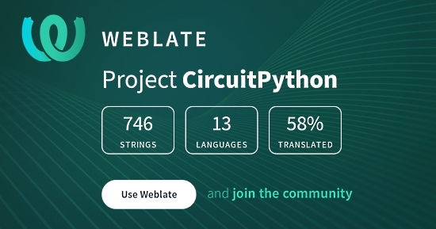](https://hosted.weblate.org/engage/circuitpython/)

One important feature of CircuitPython is translated control and error messages.

With the help of fellow open source project [Weblate](https://weblate.org/), we're making it even easier to add or improve translations.

Since opening this capability last week, we've received hundreds of contributions, including a finished Swedish translation. If you write another language, visit https://hosted.weblate.org/engage/circuitpython/, sign in, and start translating. You can create a new account just for weblate, or sign in using other sites like GitHub, Google, or Facebook. If you have any questions, visit us [on Discord](https://adafru.it/discord) in the #circuitpython channel, we're happy to help.

## Adafruit Update

Adafruit Industries continues to run with 100% of employees being paid and continuing to work. Most are working remotely, with some working in the Manhattan, New York factory as an essential service and business under NYC Executive Order 202.6 Capabilities. Adafruit was deemed an essential service to distribute/make some PPE (Personal Protection Equipment) such as face shields, and manufacturer electronics for essential life-saving/preserving equipment and development which is needed in New York and beyond. -[Blog](https://blog.adafruit.com/2020/03/22/covid/)

**Adafruit has started shipping regular (non-emergency) orders after priority orders are filled**

If you have been waiting to order, feel free to submit your order, noting that the fulfillment time may be longer than pre-COVID - [Shop Adafruit](https://www.adafruit.com/).

Note: there may be a number of out of stock items as manufacturing has been disrupted. Adafruit suggests if an item is out of stock and needed, that searching at [resellers](https://www.adafruit.com/distributors) may yield stock. If the US, [Digi-Key](https://www.digikey.com/en/supplier-centers/a/adafruit?WT.z_link_source=Supplier%2520Index) is suggested.

Ladyada tests out RGB Matrix support in CircuitPython for STM32F405 - [YouTube](https://youtu.be/_W1mgjgWe48) and [Blog](https://blog.adafruit.com/2020/05/10/testing-out-rgb-matrix-support-in-circuitpython-for-stm32f405-st_world-stmicroelectronics/).

How Adafruit is meeting CDC and other guidelines on environmental safety, NYC status, and much more - [Blog](https://blog.adafruit.com/2020/05/17/5-17-2020-ny-testing-open-streets-hudson-square-cdc-updates-and-more-adafruit/).

## Adafruit hardware being certified Open Source

Adafruit has always been an open source hardware company, predating the [Open Source Hardware Association](https://oshwa.org) (OSHWA) certification process. We have begun submitting all of our hardware to OSHWA for certification as Open Source. 

The application process for the roughly 390 Adafruit boards that were submitted was finished two weeks ago. Of those 390 submitted, 384 of them have been approved so far.

There are currently 858 projects certified by OSHWA, making certifications for Adafruit projects almost 45% of all projects OSHWA has certified - [Adafruit Blog](https://blog.adafruit.com/2020/05/14/86-more-adafruit-boards-have-been-certified-by-oshwa-oshw-oshwa-adafruit-ohsummit/) and [OSHWA](https://certification.oshwa.org/list.html?q=Adafruit).

## Open Source License Graphic Generator

[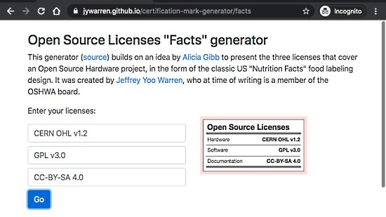](https://twitter.com/jywarren/status/1259913598467551232)

The Open Hardware Association requires submissions to list the three licenses covering a submitted project: those for the hardware, software, and documentation. To list these, Jeffrey Yoo Warren wrote a program to generate an SVG graphic with the three licenses as entered by a user in a web page - [Web Generator](https://jywarren.github.io/certification-mark-generator/facts), [Twitter](https://twitter.com/jywarren/status/1259913598467551232), and [GitHub](https://github.com/jywarren/certification-mark-generator).

## IoT Makers Israel Stay @ Home Challenge

For the last three weeks, [IoT Makers Israel](https://www.meetup.com/IoT-Makers-Israel) has held the Stay @ Home Challenge to encourage people to create an hardware/electronics projects. Sponsored by Adafruit, participants were asked to make an interesting project that you want to do using an Adafruit Circuit Playground Express (board or simulated in software). The challenge just ended last Friday and the announced winners via [Facebook](https://www.facebook.com/groups/MakersIoT/): Karin Chechik, Dor Alt, and Amit Edvy.

Karin's entry: A 'Big' style CircuitPython Express Piano using Circuit Playground Express and CircuitPython - [Vimeo](https://vimeo.com/418222733) and [Twitter](https://twitter.com/KarinChechik/status/1260697858711457799).

## News from around the web!

[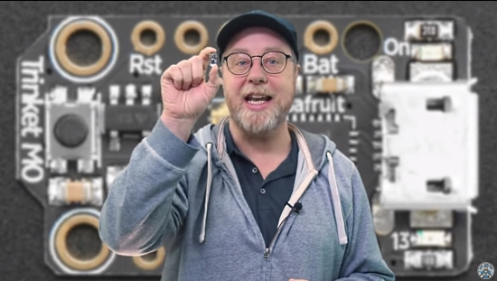](https://www.youtube.com/watch?v=XLtqkJ2_kyA)

Adafruit Trinket M0 and CircuitPython from Gary Explains (#garyexplains) - [YouTube](https://www.youtube.com/watch?v=XLtqkJ2_kyA).

[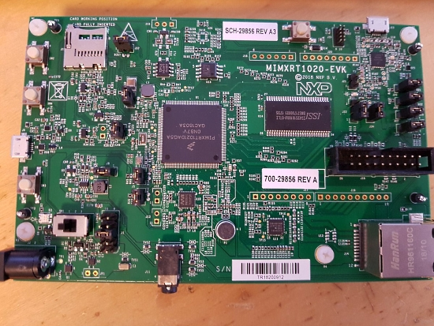](https://twitter.com/timonsku/status/1262417226986131457)

[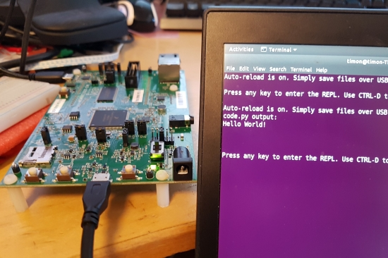](https://twitter.com/timonsku/status/1262417226986131457)

Timon writes about the NXP MIMXRT1020-EVK i.MX 1020 evaluation board - [Twitter](https://twitter.com/timonsku/status/1262417226986131457)

> What an absolute chonky unit those http://i.MX RT in TQFP 144 variant are. Well, that was very easy, flashed @arturo182 TinyUF2 and then @adafruit CircuitPython, which I didn't even have to compile and could just download the uf2 from http://circuitpython.org. Best vendor dev board experience without even having touched the vendor tools.

How to Remote Control Your Raspberry Pi Camera from the Web - [Tom's Hardware](https://www.tomshardware.com/how-to/raspberry-pi-remote-control-camera-from-web).

[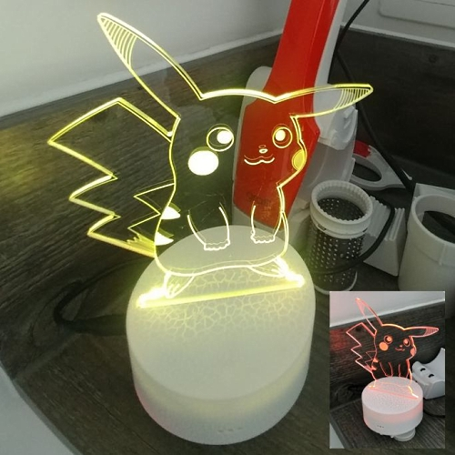](https://flameeyes.blog/2020/05/11/insulin-routine-lockdown-and-electronics/)

Making an insulin reminder light with Feather and CircuitPython - [Flame Eyes](https://flameeyes.blog/2020/05/11/insulin-routine-lockdown-and-electronics/) and [GitHub](https://github.com/Flameeyes/insulin-reminder).

[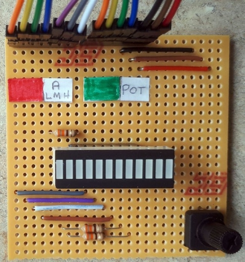](https://www.instructables.com/id/Dual-Colour-Bar-Graph-With-CircuitPython/)

A dual color bar graph with CircuitPython - [Instructables](https://www.instructables.com/id/Dual-Colour-Bar-Graph-With-CircuitPython/).

[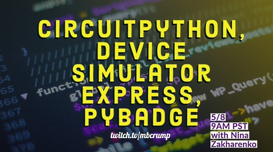](https://nina-b302-wifi-mqtt.blogspot.com/2020/05/nina-b302-80211-comandado-pelo-alexa.html)

NINA B302 (802.11) commanded by Alexa Voice Assistant using CircuitPython - [Blogger (Portuguese)](https://nina-b302-wifi-mqtt.blogspot.com/2020/05/nina-b302-80211-comandado-pelo-alexa.html).

The MicroPython-Editor is a small text editor written in Python running on PYBoard, WiPy1, the pycom.io modules like WipPy 2, Lopy, SiPy, FiPy, ESP8266 modules, Teensy 3.5/3.6 and the MaixPy, allowing to edit files locally. It is based on the [editor widget of pfalcon](https://github.com/pfalcon/pyedit). It's been ported to PyBoard, WiPy1, ESP8266, Teensy, ESP32, the Pycom.io, MaixPy devices, and CircuitPython devices - [GitHub](https://github.com/robert-hh/Micropython-Editor).

Awesome MicroPython covers all things MicroPython in an awesome list - [GitHub](https://github.com/mcauser/awesome-micropython).

DHT11 data log into Google Sheets with MicroPython and ESP32 & ESP8266 - [YouTube](https://www.youtube.com/watch?v=ulXUhU13LVg&feature=emb_logo).

Playing wav files on an ESP32 with MicroPython - [Twitter](https://twitter.com/LabOctopus/status/1261954943688347648) and [YouTube](https://youtu.be/X0wlg3R4tmk).

Installing MicroPython on an ESP8266 - [YouTube](https://youtu.be/dY0QyILX8NA).

[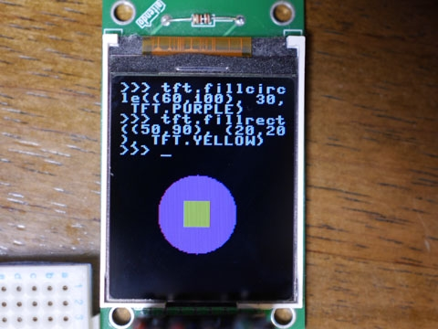](https://blog.boochow.com/article/tft-lcd-console-mp-dupterm.html)

Output MicroPython REPL to TFT LCD - [Blog](https://blog.boochow.com/article/tft-lcd-console-mp-dupterm.html).

Under Discussion: The Performance of Python - [Welcome to the Jungle](https://www.welcometothejungle.com/en/articles/btc-performance-python).

Comparing BASIC on the Commodore 64 with Python on the Raspberry Pi - [bigl.es](https://bigl.es/friday-fun-commodore-coding-concepts/).

[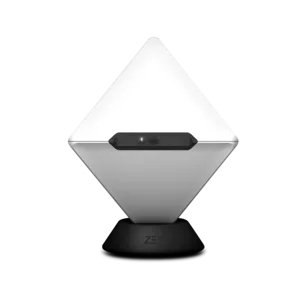](https://blog.adafruit.com/2020/05/12/track-your-time-using-an-octahedron-on-linux-using-python/)

Track your time using an Octahedron on Linux using Python - [LeMaRiva Tech](https://lemariva.com/blog/rss/timeular-track-your-time-using-octahedron-linux) and [Blog](https://blog.adafruit.com/2020/05/12/track-your-time-using-an-octahedron-on-linux-using-python/).

PyDev of the Week: Qiusheng Wu on [Mouse vs Python](https://www.blog.pythonlibrary.org/2020/05/18/pydev-of-the-week-qiusheng-wu/)

CircuitPython Weekly for May 18th, 2020 [on YouTube](https://youtu.be/90N_d1_g6J4) and on [diode.zone](https://diode.zone/videos/watch/d16380af-f2a0-4301-b443-0872b5f6dd38)

#ICYDNCI What was the most popular, most clicked link, in [last week's newsletter](https://www.adafruitdaily.com/2020/05/12/circuitpython-5-4-sneak-peeks-teensy-4-1-and-more-python-adafruit-circuitpython-circuitpython-micropython-thepsf/)? [Microsoft Python for Beginners Videos on YouTube](https://www.youtube.com/playlist?list=PLlrxD0HtieHhS8VzuMCfQD4uJ9yne1mE6).

## Education

A new Humble Bundle of Python books from No Starch Press - [Humble Bundle](https://www.humblebundle.com/books/learn-you-some-python-no-starch-press-books).

This Python YouTube course is designed to take one from beginner to "pro" in the Python language - [YouTube](https://www.youtube.com/watch?v=sxTmJE4k0ho).

Real Python has created several Python quizzes as a fun way to test your Python skills - [Real Python](https://realpython.com/quizzes/).

## Coming Soon via CircuitPython Pull Requests

ESP32-S2 support for CircuitPython has been completed and is currently undergoing community review prior to merging - [GitHub](https://github.com/adafruit/circuitpython/pull/2910) and Scott Shawcroft stream - [YouTube](https://studio.youtube.com/video/jUkCUbYsgc8/edit).

Adding bytearray.decode() for CPython compatibility - [GitHub](https://github.com/adafruit/circuitpython/pull/2896).

The vectorio library is intended to speed up drawing of shapes - [GitHub](https://github.com/adafruit/circuitpython/pull/2888).

Work continues on a modern SD card IO library - [GitHub](https://github.com/adafruit/circuitpython/pull/2863).

## New Boards Supported by CircuitPython

The number of supported microcontrollers and Single Board Computers (SBC) grows every week. This section outlines which boards have been included in CircuitPython or added to [CircuitPython.org](https://circuitpython.org/).

This week, we had 11 new boards added!

**Blinka-compatibles:**

- [SmartEdge Industrial IOT Gateway](https://circuitpython.org/blinka/avnet_iiot_gateway/)
- [GreatFET One](https://circuitpython.org/blinka/greatfet_one/)
- [Odroid C4](https://circuitpython.org/blinka/odroid_c4/)
- [Orange Pi 2](https://circuitpython.org/blinka/orange_pi_2/)

**Microcontrollers**

- [Thunderpack](https://circuitpython.org/board/thunderpack/)
- [Vina M0](https://circuitpython.org/board/bdmicro_vina_m0/)
- [Fomu](https://circuitpython.org/board/fomu/)
- [STM32F746 Nucleo](https://circuitpython.org/board/nucleo_f746zg/)
- [STM32F746 Discovery kit](https://circuitpython.org/board/stm32f746g_discovery/)
- [OpenMV H7](https://circuitpython.org/board/openmv_h7/)
- [Teensy 4.1](https://circuitpython.org/board/teensy41/)

Looking for adding a new board to CircuitPython? It's highly encouraged! Adafruit has four guides to help you do so:

- [How to Add a New Board to CircuitPython](https://learn.adafruit.com/how-to-add-a-new-board-to-circuitpython/overview)
- [How to add a New Board to the circuitpython.org website](https://learn.adafruit.com/how-to-add-a-new-board-to-the-circuitpython-org-website)
- [Adding a Single Board Computer to PlatformDetect for Blinka](https://learn.adafruit.com/adding-a-single-board-computer-to-platformdetect-for-blinka)
- [Adding a Single Board Computer to Blinka](https://learn.adafruit.com/adding-a-single-board-computer-to-blinka)

## New Learn Guides!

[BLE Buzzy Box](https://learn.adafruit.com/ble-buzzy-box) from [Noe and Pedro](https://learn.adafruit.com/users/pixil3d)

[CLUE Metal Detector in CircuitPython](https://learn.adafruit.com/clue-metal-detector-circuitpython) from [Kevin Walters](https://learn.adafruit.com/users/kevinjwalters)

[Cellular Data for CircuitPython with FONA](https://learn.adafruit.com/cellular-data-for-circuitpython-with-fona) from [Brent Rubell](https://learn.adafruit.com/users/brubell)

## Updated Guides - Now With More Python!

**You can use CircuitPython libraries on Raspberry Pi!** We're updating all of our CircuitPython guides to show how to wire up sensors to your Raspberry Pi, and load the necessary CircuitPython libraries to get going using them with Python. We'll be including the updates here so you can easily keep track of which sensors are ready to go. Check it out!

Keep checking back for more updated guides!

## CircuitPython Libraries!

CircuitPython support for hardware continues to grow. We are adding support for new sensors and breakouts all the time, as well as improving on the drivers we already have. As we add more libraries and update current ones, you can keep up with all the changes right here!

For the latest drivers, download the [Adafruit CircuitPython Library Bundle](https://circuitpython.org/libraries).

If you'd like to contribute, CircuitPython libraries are a great place to start. Have an idea for a new driver? File an issue on [CircuitPython](https://github.com/adafruit/circuitpython/issues)! Interested in helping with current libraries? Check out the [CircuitPython.org Contributing page](https://circuitpython.org/contributing). We've included open pull requests and issues from the libraries, and details about repo-level issues that need to be addressed. We have a guide on [contributing to CircuitPython with Git and Github](https://learn.adafruit.com/contribute-to-circuitpython-with-git-and-github) if you need help getting started. You can also find us in the #circuitpython channel on the [Adafruit Discord](https://adafru.it/discord). Feel free to contact Kattni (@kattni) with any questions.

You can check out this [list of all the CircuitPython libraries and drivers available](https://github.com/adafruit/Adafruit_CircuitPython_Bundle/blob/master/circuitpython_library_list.md). 

The current number of CircuitPython libraries is **230**!

**New Libraries!**

Here's this week's new CircuitPython libraries:

 * [Adafruit_CircuitPython_BLE_Adafruit](https://github.com/adafruit/Adafruit_CircuitPython_BLE_Adafruit)
 * [Adafruit_CircuitPython_LIS331](https://github.com/adafruit/Adafruit_CircuitPython_LIS331)

**Updated Libraries!**

Here's this week's updated CircuitPython libraries:

 * [Adafruit_CircuitPython_AdafruitIO](https://github.com/adafruit/Adafruit_CircuitPython_AdafruitIO)
 * [Adafruit_CircuitPython_INA219](https://github.com/adafruit/Adafruit_CircuitPython_INA219)
 * [Adafruit_CircuitPython_DotStar](https://github.com/adafruit/Adafruit_CircuitPython_DotStar)
 * [Adafruit_CircuitPython_BNO055](https://github.com/adafruit/Adafruit_CircuitPython_BNO055)
 * [Adafruit_CircuitPython_BLE](https://github.com/adafruit/Adafruit_CircuitPython_BLE)
 * [Adafruit_CircuitPython_NTP](https://github.com/adafruit/Adafruit_CircuitPython_NTP)
 * [Adafruit_CircuitPython_DPS310](https://github.com/adafruit/Adafruit_CircuitPython_DPS310)
 * [Adafruit_CircuitPython_FONA](https://github.com/adafruit/Adafruit_CircuitPython_FONA)

**PyPI Download Stats!**

We've written a special library called Adafruit Blinka that makes it possible to use CircuitPython Libraries on [Raspberry Pi and other compatible single-board computers](https://learn.adafruit.com/circuitpython-on-raspberrypi-linux/). Adafruit Blinka and all the CircuitPython libraries have been deployed to PyPI for super simple installation on Linux! Here are the top 10 CircuitPython libraries downloaded from PyPI in the last week, including the total downloads for those libraries:

Keep an eye out for updated download stats coming soon!

## What’s the team up to this week?

What is the team up to this week? Let’s check in!

**Bryan**

Still on the filter game from last week, this week I added Arduino library support for the high pass filters in the LIS331 Accelerometers. That wrapped up the Arduino library for now so by the time you read this is should be released. As opposed to low-pass filters that narrow down the data to focus on slower and steady acceleration measurements like orientation detection, a high-pass filter will filter out static or slowly changing data like the acceleration from gravity to focus on dynamic acceleration signals coming from movement of the device being measured. This diagram from an [LIS331 application note](https://www.st.com/resource/en/application_note/cd00215823-lis331dlh-2-g-4-g-8-g-digital-output-high-performance-ultra-lowpower-3axis-accelerometer-stmicroelectronics.pdf) shows how a high-pass filter alters the data being output when compared to the raw signal

With the Arduino library taken care of and pointing the way, I then went on to write the CircuitPython library. In terms of core functionality both libraries have the same feature set, however with the CircuitPython library we make use of things like data descriptors and properties to be more “Pythonic” in how the user interacts with the library. More generally we also make the library a bit more high level to better match the expectations of Python and CircuitPython users.

And it’s available now! You can grab it in the [latest bundle](https://circuitpython.org/libraries) if you're using a device running CircuitPython, or [on PyPi](https://pypi.org/project/adafruit-circuitpython-lis331/) if you're using it [on a Raspberry Pi](https://learn.adafruit.com/circuitpython-on-raspberrypi-linux) or other [Blinka supported computer](https://circuitpython.org/blinka). The guide for the upcoming LIS331 sensors will be available shortly as I'm working on it now, and the sensors themselves should be available not long after that. 

**Dan**

[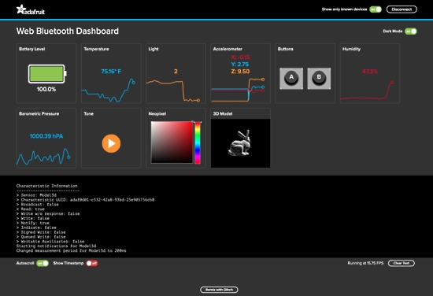](https://circuitpython.org/)

The [Adafruit BLE Services library](https://github.com/adafruit/Adafruit_CircuitPython_BLE_Adafruit) is done. It provides BLE services that work with the [Bluefruit Playground app](https://learn.adafruit.com/bluefruit-playground-app) and the [Bluefruit Web Dashboard](https://learn.adafruit.com/bluefruit-dashboard-web-bluetooth-chrome). You'll be also able to use the library to build custom clients and servers to send whatever sensor or control data you want. I've written CircuitPython programs for the Circuit Playground Bluefruit, the CLUE, and the Feather Bluefruit Sense that communicate with the app. Stay tuned for new Learn Guides about this library.

Along the way I worked with Antonio, the app developer, to debug and fix some minor bugs on both sides of the code.

This week I'll start looking at implementing **\_bleio** using the **bleak** library on host computers.

**Jeff**

Continuing my quest to make SD cards work better in CircuitPython, I've put my attention on the STM32F405 Feather.  This board uses "SDIO" instead of "SPI" to connect the SD card.  Right now, I'm studying how the code needs to be restructured to allow both kinds of connection.

I also worked on fixing several bugs in the last beta release of CircuitPython.  These bugs were related to audio and gamepad functionality, and the fixes should be in the next unstable release after 5.4.0-beta.0.

**Kattni**

Last week I finished up the first major sweep of the CircuitPython library GitHub issues. I intend to do another quick sweep this coming week or next to close out any that did not receive further activity where a response was requested. The plan moving forward is to do a full sweep every so often so we can do a better job keeping up with everything. It's ok for issues to remain open for lengthy periods, but we want to ensure that's happening for a reason and not simply because they've been missed.

Since then, I've been working on the Adafruit CircuitPython LED Animation library. We initially implemented a few simple animations. Over the holiday season, my partner and I had a decorated tree that included over 300 NeoPixel LEDs and it displayed a number of different and improved animations. We started a PR for it, however, we were using pixebuf, a feature of CircuitPython that moves RGB LED math into the core which makes it incredibly fast and efficient. Unfortunately, pixelbuf was not yet implemented and without it, the newer animations were slow and almost unusable, so the PR sat. Recently, the work necessary to implement pixelbuf was completed, so it was finally time to revisit the LED Animation updates. I dusted off the tree code and have been working on implementing the rest of the features. I'm getting close to having the PR ready - it's mostly feature-complete, but it still needs some cleanup - and then I'll be starting on a guide to using the library!

**Lucian**

This week I've been working on some cleanup within the i.MX port - this has included implementing the pin-claiming system, which prevents peripherals from conflicting with each other, and allowing the various BusIO peripherals to work in one-directional setups. I'll be continuing that work this week, and will hopefully get into the guts of the timers soon to get PulseIO working more completely. I've chatted with Arturo about getting one of the new i.MX feathers sent over for testing here in the states, and I'm looking forward to putting it through the paces once it arrives. 

In STM32 land, I fixed an unpleasant but fortunately temporary bug that was causing the Feather F405 to hang on startup, and I'm looking at getting some work done on the RGB matrix done this week as well. I was hoping to demo a robotics-related circuitpython project today, but unfortunately the power cable's been delayed for COVID related reasons... it'll just have to wait until next week.

**Melissa**

This past week, I've been working on adding support for the GreatFET One to Blinka. This board has more than just a lot of GPIOs. It supports Pulse Width Modulation, Analog Input and Output, I2C, SPI, and UART. I was able to write a wrapper for the GreatFET library so Blinka is able to use many of the libraries available. I'm hoping this helps anybody else who happens to also own a GreatFET and wants to get started with unlocking its potential.

With all of the new releases of CircuitPython coming out, there have been a bunch of new boards with support added. I went through and added and resized images for each one and linked those to each of the boards.

**Scott**

By the end of last week I got CircuitPython on ESP32S2 doing basic blinky, the stream is on [YouTube](https://www.youtube.com/watch?v=LfUBOF1AWzs).

The start of this week I got sucked into finishing our doc switch from restructured text to inline Python stubs. This will enable editors to do better auto-complete for native CircuitPython APIs. The second half of this week will focus on getting the ESP32S2 initial work ready for merge.

## Events!

PyCon2020 Online Continues this week! Head over to https://us.pycon.org/2020/online/ to access all the content. Pythonistas come together every year to learn, network & discuss great ideas in person at PyCon. That can't happen this year, but everyone can get together virtually!  - [Announcement](https://mailchi.mp/us.pycon.org/pycon-news-501443) and [Latest Mailing](https://mailchi.mp/us.pycon.org/pycon-news-526156?e=68f4e97042).

You can [subscribe to the PyCon 2020 Online mailing list](https://us.pycon.org/2020/online/) to receive updates as they are published online. Check out talks, tutorials, Charlas, & Startup Row along with the [Virtual Expo Hall](https://us.pycon.org/2020/sponsors/virtualexpohall/). 

What’s happening this week:
- New Talks and Tutorials
- Sponsor Workshops
- Python Case Study
- New Job Postings

Two Hatchery events are taking place this week. Session 2 of 2 for [Beginners Data Summit](https://pycon.us19.list-manage.com/track/click?u=5697f493c3a48994f504d4deb&id=52544370c0&e=68f4e97042) and [Mentored Sprints](https://pycon.us19.list-manage.com/track/click?u=5697f493c3a48994f504d4deb&id=29c8be22a5&e=68f4e97042). These events require pre-registration.

There will be recordings added through next week, so be sure to check the Online and Virtual Expo Hall often. You can also subscribe to the [YouTube channel](https://pycon.us19.list-manage.com/track/click?u=5697f493c3a48994f504d4deb&id=cc34f626ff&e=68f4e97042) to receive notifications as the remaining videos are published.

May 23, 2020: featuring Makers and projects primarily responding to COVID-19, Virtually Maker Faire provides an opportunity for makers to connect, share their projects and talk about what they do and how they do it. It will take place completely online through video sessions over a 24-hour period and as a curated collection of maker exhibits. The goal is to help makers present their work to a broader public; to gain understanding, support and increasing participation - [Makerfaire](https://makerfaire.com/virtually-maker-faire-call-2020-for-makers/).

The HydPy May Meetup will feature Ayan Pahwa speaking about Programming Microcontrollers using CircuitPython. It is scheduled for May 29, 2020 from 17:00 - 18:00 (GMT+5:30) - [meetup](https://www.meetup.com/HydPyGroup/events/270578783/).

EuroPython 2020 this year will be an online conference from July 23-26. They are planning the following structure:

* 2 conference days with keynotes, talks, lightning talks, poster session (Thursday and Friday)
* 2 sprint days with multiple sprint teams (Saturday and Sunday)

Attending the conference days will require a ticket, participating in the sprint days will be free - [EuroPython](https://blog.europython.eu/post/614102095419850752/europython-2020-online-conference-from-july-23-26).

PyCon AU has announced they are holding PyConline AU, an online event, in August 2020 -  [pycon.org.au](https://2020.pycon.org.au/).

PyCon India 2020: the premier conference in India on using and developing the Python programming language. Held online October 3-5, 2020. A [call for proposals](https://in.pycon.org/cfp/2020/proposals/) is now open through August 14, 2020. - [Website](https://in.pycon.org/2020/) and [Twitter](https://twitter.com/pyconindia)

**Send Your Events In**

As for other events, with the COVID pandemic, most in-person events are postponed or cancelled. If you know of virtual events or events that may occur in the future, please let us know on Discord or on Twitter with hashtag #CircuitPython.

## Latest releases

CircuitPython's stable release is [5.3.0](https://github.com/adafruit/circuitpython/releases/latest) and its unstable release is [5.4.0-beta.0](https://github.com/adafruit/circuitpython/releases). New to CircuitPython? Start with our [Welcome to CircuitPython Guide](https://learn.adafruit.com/welcome-to-circuitpython).

[20200518](https://github.com/adafruit/Adafruit_CircuitPython_Bundle/releases/latest) is the latest CircuitPython library bundle.

[v1.12](https://micropython.org/download) is the latest MicroPython release. Documentation for it is [here](http://docs.micropython.org/en/latest/pyboard/).

[3.8.3](https://www.python.org/downloads/) is the latest Python release. The latest pre-release version is [3.9.0a6](https://www.python.org/download/pre-releases/).

[1,700 Stars](https://github.com/adafruit/circuitpython/stargazers) Like CircuitPython? [Star it on GitHub!](https://github.com/adafruit/circuitpython)

## jobs.adafruit.com - Find a dream job, find great candidates!

[jobs.adafruit.com](https://jobs.adafruit.com/) has returned and folks are posting their skills (including CircuitPython) and companies are looking for talented makers to join their companies - from Digi-Key, to Hackaday, Microcenter, Raspberry Pi and more.

## 19,437 thanks!

The Adafruit Discord community, where we do all our CircuitPython development in the open, reached over 19,437 humans, thank you! Join today! [https://adafru.it/discord](https://adafru.it/discord)

## ICYMI - In case you missed it

The wonderful world of Python on hardware! This is our first video-newsletter-podcast that we’ve started! The news comes from the Python community, Discord, Adafruit communities and more. It’s part of the weekly newsletter, then we have a segment on ASK an ENGINEER and this is the video slice from that! The complete Python on Hardware weekly videocast [playlist is here](https://www.youtube.com/playlist?list=PLjF7R1fz_OOXRMjM7Sm0J2Xt6H81TdDev). 

This video podcast is on [iTunes](https://itunes.apple.com/us/podcast/python-on-hardware/id1451685192?mt=2), [YouTube](http://adafru.it/pohepisodes), [IGTV (Instagram TV](https://www.instagram.com/adafruit/channel/)), and [XML](https://itunes.apple.com/us/podcast/python-on-hardware/id1451685192?mt=2).

[Weekly community chat on Adafruit Discord server CircuitPython channel - Audio / Podcast edition](https://itunes.apple.com/us/podcast/circuitpython-weekly-meeting/id1451685016) - Audio from the Discord chat space for CircuitPython, meetings are usually Mondays at 2pm ET, this is the audio version on [iTunes](https://itunes.apple.com/us/podcast/circuitpython-weekly-meeting/id1451685016), Pocket Casts, [Spotify](https://adafru.it/spotify), and [XML feed](https://adafruit-podcasts.s3.amazonaws.com/circuitpython_weekly_meeting/audio-podcast.xml).

And lastly, we are working up a one-spot destination for all things podcast-able here - [podcasts.adafruit.com](https://podcasts.adafruit.com/)

## Codecademy "Learn Hardware Programming with CircuitPython"

Codecademy, an online interactive learning platform used by more than 45 million people, has teamed up with the leading manufacturer in STEAM electronics, Adafruit Industries, to create a coding course, "Learn Hardware Programming with CircuitPython". The course is now available in the [Codecademy catalog](https://www.codecademy.com/learn/learn-circuitpython?utm_source=adafruit&utm_medium=partners&utm_campaign=circuitplayground&utm_content=pythononhardwarenewsletter).

Python is a highly versatile, easy to learn programming language that a wide range of people, from visual effects artists in Hollywood to mission control at NASA, use to quickly solve problems. But you don’t need to be a rocket scientist to accomplish amazing things with it. This new course introduces programmers to Python by way of a microcontroller — CircuitPython — which is a Python-based programming language optimized for use on hardware.

CircuitPython’s hardware-ready design makes it easier than ever to program a variety of single-board computers, and this course gets you from no experience to working prototype faster than ever before. Codecademy’s interactive learning environment, combined with Adafruit's highly rated Circuit Playground Express, present aspiring hardware hackers with a never-before-seen opportunity to learn hardware programming seamlessly online.

Whether for those who are new to programming, or for those who want to expand their skill set to include physical computing, this course will have students getting familiar with Python and creating incredible projects along the way. By the end, students will have built their own bike lights, drum machine, and even a moisture detector that can tell when it's time to water a plant.

Visit Codecademy to access the [Learn Hardware Programming with CircuitPython](https://www.codecademy.com/learn/learn-circuitpython?utm_source=adafruit&utm_medium=partners&utm_campaign=circuitplayground&utm_content=pythononhardwarenewsletter) course and Adafruit to purchase a [Circuit Playground Express](https://www.adafruit.com/product/3333).

Codecademy has helped more than 45 million people around the world upgrade their careers with technology skills. The company’s online interactive learning platform is widely recognized for providing an accessible, flexible, and engaging experience for beginners and experienced programmers alike. Codecademy has raised a total of $43 million from investors including Union Square Ventures, Kleiner Perkins, Index Ventures, Thrive Capital, Naspers, Yuri Milner and Richard Branson, most recently raising its $30 million Series C in July 2016.

## Contribute!

The CircuitPython Weekly Newsletter is a CircuitPython community-run newsletter emailed every Tuesday. The complete [archives are here](https://www.adafruitdaily.com/category/circuitpython/). It highlights the latest CircuitPython related news from around the web including Python and MicroPython developments. To contribute, edit next week's draft [on GitHub](https://github.com/adafruit/circuitpython-weekly-newsletter/tree/gh-pages/_drafts) and [submit a pull request](https://help.github.com/articles/editing-files-in-your-repository/) with the changes. Join our [Discord](https://adafru.it/discord) or [post to the forum](https://forums.adafruit.com/viewforum.php?f=60) for any further questions.
