- [X] Kattni updates
- [ ] change date
- [ ] update title
- [ ] Feature story
- [ ] Update  for images
- [ ] Update ICYDNCI
- [ ] All images 550w max only
- [ ] Link "View this email in your browser."

View this email in your browser.

The leaves are turning, it must be time for another Python for Microcontrollers newsletter, brought you by the community! We're on [Discord](https://discord.gg/HYqvREz), [Twitter](https://twitter.com/search?q=circuitpython&src=typed_query&f=live), and for past newsletters - [view them all here](https://www.adafruitdaily.com/category/circuitpython/). If you're reading this on the web, [subscribe here](https://www.adafruitdaily.com/). Let's turn another leaf.

## The Adafruit MagTag CircuitPython eInk Display

[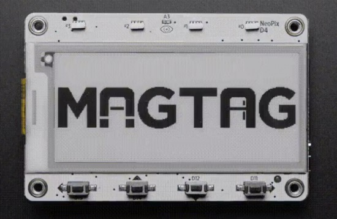](https://www.hackster.io/news/there-s-something-quite-attractive-about-adafruit-s-latest-offering-201c7e00a42d)

MagTag is the latest bit of low-power, magnetic magic from Adafruit! With an 2.9" EPD (ePaper) panel, with a whopping 296 x 128 pixels, capable of 4-bit grayscale and ESP32-S2 processor - [Adafruit](https://www.adafruit.com/magtag) and [Adafruit Learning System Guide](https://learn.adafruit.com/adafruit-magtag/).

## Guido van Rossum joins Microsoft

[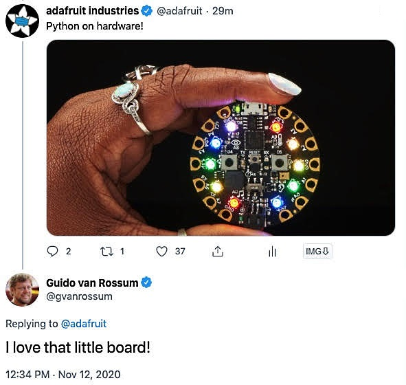](https://twitter.com/adafruit/status/1326934361443282945)

The creator of Python, Guido van Rossum, decides to come out of retirement and join the Developer Division at Microsoft - [Twitter](https://twitter.com/adafruit/status/1326934361443282945).

## CircuitPython Deep Dive Stream with Scott Shawcroft

[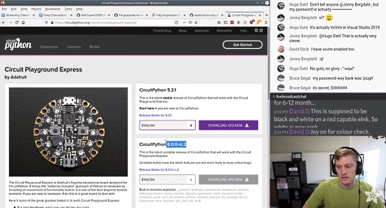](https://youtu.be/-rtBgh9fgfA)

[This week](https://youtu.be/-rtBgh9fgfA), Scott talks about CircuitPython bugs.

You can see the latest video and past videos on the Adafruit YouTube channel under the Deep Dive playlist - [YouTube](https://www.youtube.com/playlist?list=PLjF7R1fz_OOXBHlu9msoXq2jQN4JpCk8A).

## Adafruit Updates

**Adafruit is shipping orders!**

Adafruit is stocked and shipping orders! Now is the best time to get orders in for your favorite products, including holiday projects and gifts - [Adafruit](https://learn.adafruit.com/).

Adafruit is currently offering a one-time use discount code of 20% off after adding two factor authentication (2FA) to ones Adafruit account. The code may be used until November 26, 2020. See [this guide](https://learn.adafruit.com/secure-your-account-and-unlock-20-off?view=all) for details.

**[Shop Adafruit now](https://www.adafruit.com/)**

## News from around the web!

[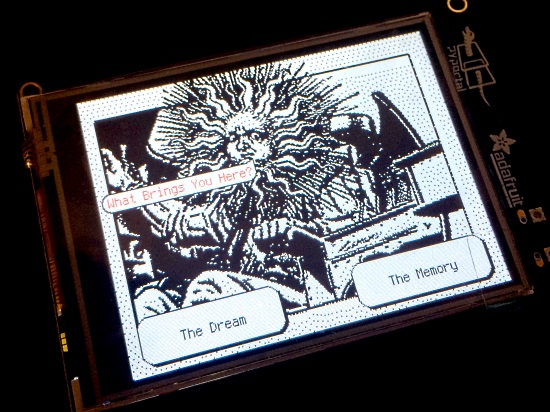](https://twitter.com/eyeofbri/status/1327824275508768769)

Choose your own Adventure, touchscreen control on an [Adafruit PyPortal](https://www.adafruit.com/product/4116) board - [Twitter](https://twitter.com/eyeofbri/status/1327824275508768769).

[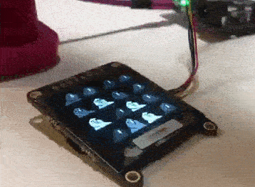](https://twitter.com/BlitzCityDIY/status/1327000269905932293)

Greyscale party parrots - [Twitter](https://twitter.com/BlitzCityDIY/status/1327000269905932293).

[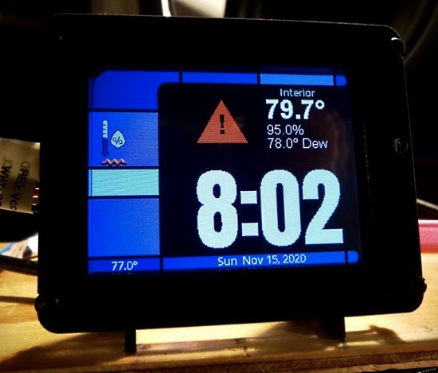](https://www.instagram.com/p/CHo9nVxLuQGsfRN8uuklSB6Vc-idXPMvjIpgGQ0/)

Instagram's cedargrove20 posts "Putting the final touches on the Nuevo Workshop Corrosion Monitor. Using CircuitPython and Adafruit IO this time around instead of Arduino and LoRa packet radio. Big thanks to Dave Astels for the groovy LCARS display design!" - [Instagram](https://www.instagram.com/p/CHo9nVxLuQGsfRN8uuklSB6Vc-idXPMvjIpgGQ0/).

[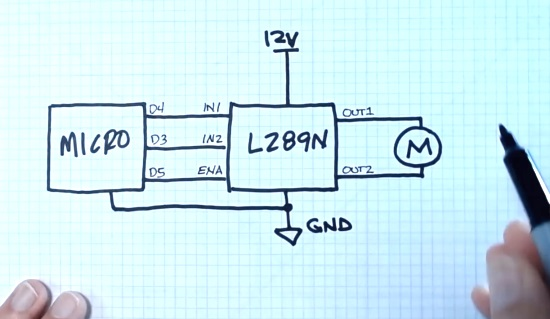](https://www.youtube.com/watch?v=yDj7quRMeqI&feature=youtu.be)

CircuitPython DC Motor Control - How to Using PulseIO and the L289N Driver Board with an [Adafruit Metro M4 Express](https://www.adafruit.com/product/3382) board - [YouTube](https://www.youtube.com/watch?v=yDj7quRMeqI&feature=youtu.be).

[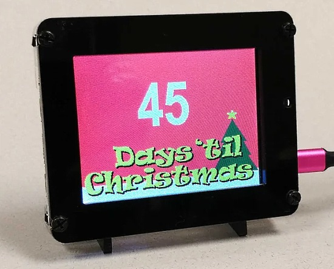](https://www.reddit.com/r/circuitpython/comments/jr8sdk/added_a_days_til_christmas_screen_to_our_little/)

Added a "Days 'til Christmas" screen to an [Adabox PyPortal](https://www.adafruit.com/product/4116) information device - [Reddit](https://www.reddit.com/r/circuitpython/comments/jr8sdk/added_a_days_til_christmas_screen_to_our_little/).

From the Adafruit Forums, user belsonc has created a word clock, built with the new WiFi connected, no-solder [Adafruit MatrixPortal board](https://www.adafruit.com/product/4745) on the back of a [64×32 LED RGB LED matrix display](https://www.adafruit.com/product/2278). The same components are in AdaBox 016 just out. It’s programmed with CircuitPython and connects to the free Adafruit.io service to get the local time - [Adafruit Blog](https://blog.adafruit.com/2020/11/13/an-led-matrix-word-clock-with-the-adafruit-matrixportal-circuitpython-adafruit-adafruit/).

> So… this is my second CircuitPython project ever, and the first I’ve started from scratch (I have a pyportal and modified the quotes project to use local quotes instead of reaching out to a server for them). I’m also using my Adafruit stuff to teach myself Python in general. 🙂 And now I’m trying to figure out what I want to do next… lol

A Bluetooth Zoom keyboard using an [Adafruit NeoTrellis](https://www.adafruit.com/product/4352) and CircuitPython - [Twitter](https://twitter.com/Stonehippo/status/1328423629781131264).

[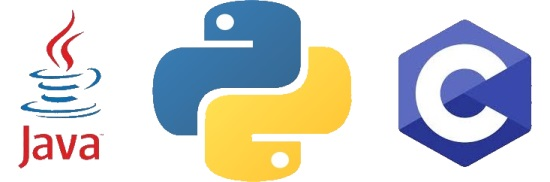](https://techdator.net/python-is-now-officially-the-second-most-popular-programming-language/)

Per the latest TIOBE’s Index, Python has overtaken Java to become the second most popular programming language. Python is now behind C, holding the number one position for nearly two decades - [Tachdator](https://techdator.net/python-is-now-officially-the-second-most-popular-programming-language/).

What is the value of Open Source? Preliminary results of the European Commission's study - [EU Open Source Observatory](https://joinup.ec.europa.eu/collection/open-source-observatory-osor/news/first-results-study-impact-open-source).

Arm is helping get Python / block coding onto iOS - Python on hardware in more places and more options is great - [Twitter](https://twitter.com/all_about_code/status/1327666567216312321).

The Python for Nokia S60, was Nokia’s port of the general Python programming language to its S60 software platform, originally based on Python 2.2.2 from 2002 - [Adafruit Blog](https://blog.adafruit.com/2020/11/13/python-on-the-nokia-s60-vintagecomputing-python-nokia/) via [Twitter](https://twitter.com/app4soft/status/1326961997615915010).

Microsoft releasing the new [Jupyter extension for Visual Studio Code](https://marketplace.visualstudio.com/items?itemName=ms-toolsai.jupyter). Jupyter Notebook enables creating and sharing documents that contain live code, equations, text, and visualizations, and is the de facto data science tool for its simplicity and interactivity - [Microsoft Python Blog](https://devblogs.microsoft.com/python/introducing-the-jupyter-extension-for-vs-code/).

MicroPython on Microcontrollers, building a robot - [Hackaday](https://hackaday.com/2020/11/14/micropython-on-microcontrollers/).

Read a PS/2 keyboard on a BBC micro:bit with MicroPython - [blogmywiki](http://www.suppertime.co.uk/blogmywiki/2020/08/ps2-keyboard-microbit/) and [YouTube](https://youtu.be/6EP4AaF8HHE).

An advanced tutorial for the BBC micro:bit V2 to create a custom C library and add custom C functions frozen into the firmware - [GitHub](https://github.com/mytechnotalent/MicroPython-micro-bit_Create_C_Library).

Discovering exoplanets with Python: David Armstrong and Jev Gamper say how they used Python and machine learning to discover not 1, but 50 new exoplanets in pre-existing Keplar satellite data - [TalkPython.fm](https://talkpython.fm/episodes/show/289/disovering-exoplanets-with-python) and [Twitter](https://twitter.com/brutforcimag/status/1326101642853412864).

73 Examples to Help You Master Python's f-strings - [miguendes's blog](https://miguendes.me/73-examples-to-help-you-master-pythons-f-strings) and [Twitter](https://twitter.com/PythonWeekly/status/1328352187085434881).

An example of how to use a @property for setter validation in Python - [Twitter](https://twitter.com/pybites/status/1327174286356910080).

PyDev of the Week: Max Humber on [Mouse vs Python](https://www.blog.pythonlibrary.org/2020/11/16/pydev-of-the-week-max-humber/)

CircuitPython Weekly Meeting for November 16th, 2020 [on YouTube](https://youtu.be/9zoF6CmGNA4) and [notes](https://github.com/adafruit/adafruit-circuitpython-weekly-meeting/blob/master/2020/2020-11-16.md)

#ICYDNCI What was the most popular, most clicked link, in [last week's newsletter](https://www.adafruitdaily.com/2020/11/10/python-on-microcontrollers-newsletter-circuitpython-6-release-candidate-1-60-blinka-sbcs-and-more-python-adafruit-circuitpython-micropython-thepsf/)? [CircuitPython programmed PyCubed Satellite](https://www.notion.so/PyCubed-4cbfac7e9b684852a2ab2193bd485c4d).

## Coming soon

[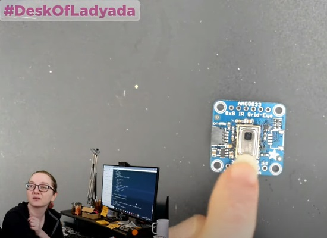](https://youtu.be/4ByslMN5npQ?t=340)

Via the [Desk of Ladyada](https://www.youtube.com/watch?v=4ByslMN5npQ&feature=youtu.be) this week, getting AMG8833 thermal sensors back in stock and onto a STEMMA QT compatible board - [YouTube](https://youtu.be/4ByslMN5npQ?t=340).

## New Boards Supported by CircuitPython

The number of supported microcontrollers and Single Board Computers (SBC) grows every week. This section outlines which boards have been included in CircuitPython or added to [CircuitPython.org](https://circuitpython.org/).

This week we didn't have any new boards after the huge new list last week, but more are being added soon.

Looking for adding a new board to CircuitPython? It's highly encouraged! Adafruit has four guides to help you do so:

- [How to Add a New Board to CircuitPython](https://learn.adafruit.com/how-to-add-a-new-board-to-circuitpython/overview)
- [How to add a New Board to the circuitpython.org website](https://learn.adafruit.com/how-to-add-a-new-board-to-the-circuitpython-org-website)
- [Adding a Single Board Computer to PlatformDetect for Blinka](https://learn.adafruit.com/adding-a-single-board-computer-to-platformdetect-for-blinka)
- [Adding a Single Board Computer to Blinka](https://learn.adafruit.com/adding-a-single-board-computer-to-blinka)

## New Learn Guides!

[CAN Bus with CircuitPython: Using the canio module](https://learn.adafruit.com/using-canio-circuitpython) from [Jeff Epler](https://learn.adafruit.com/users/jepler)

[Air Quality Sensor 3D Printed Enclosure](https://learn.adafruit.com/air-quality-sensor-silo-house) from [Noe and Pedro](https://learn.adafruit.com/users/pixil3d)

[Cardboard Window Skull With Animated LED Eyes](https://learn.adafruit.com/cardboard-window-skull-animated-led-eyes) from [John Park](https://learn.adafruit.com/users/johnpark)

[Adafruit MagTag](https://learn.adafruit.com/adafruit-magtag) from [Kattni](https://learn.adafruit.com/users/kattni)

[Adafruit Grayscale 1.5" 128x128 OLED Display](https://learn.adafruit.com/adafruit-grayscale-1-5-128x128-oled-display) from [Melissa LeBlanc-Williams](https://learn.adafruit.com/users/MakerMelissa)

## CircuitPython Libraries!

CircuitPython support for hardware continues to grow. We are adding support for new sensors and breakouts all the time, as well as improving on the drivers we already have. As we add more libraries and update current ones, you can keep up with all the changes right here!

For the latest libraries, download the [Adafruit CircuitPython Library Bundle](https://circuitpython.org/libraries). For the latest community contributed libraries, download the [CircuitPython Community Bundle](https://github.com/adafruit/CircuitPython_Community_Bundle/releases).

If you'd like to contribute, CircuitPython libraries are a great place to start. Have an idea for a new driver? File an issue on [CircuitPython](https://github.com/adafruit/circuitpython/issues)! Have you written a library you'd like to make available? Submit it to the [CircuitPython Community Bundle](https://github.com/adafruit/CircuitPython_Community_Bundle). Interested in helping with current libraries? Check out the [CircuitPython.org Contributing page](https://circuitpython.org/contributing). We've included open pull requests and issues from the libraries, and details about repo-level issues that need to be addressed. We have a guide on [contributing to CircuitPython with Git and Github](https://learn.adafruit.com/contribute-to-circuitpython-with-git-and-github) if you need help getting started. You can also find us in the #circuitpython channel on the [Adafruit Discord](https://adafru.it/discord).

You can check out this [list of all the Adafruit CircuitPython libraries and drivers available](https://github.com/adafruit/Adafruit_CircuitPython_Bundle/blob/master/circuitpython_library_list.md). 

The current number of CircuitPython libraries is **280**!

**New Libraries!**

Here's this week's new CircuitPython libraries:

 * [Adafruit_CircuitPython_TMP117](https://github.com/adafruit/Adafruit_CircuitPython_TMP117)

**Updated Libraries!**

Here's this week's updated CircuitPython libraries:

 * [Adafruit_CircuitPython_BNO055](https://github.com/adafruit/Adafruit_CircuitPython_BNO055)
 * [Adafruit_CircuitPython_LIS3DH](https://github.com/adafruit/Adafruit_CircuitPython_LIS3DH)
 * [Adafruit_CircuitPython_AdafruitIO](https://github.com/adafruit/Adafruit_CircuitPython_AdafruitIO)
 * [Adafruit_CircuitPython_miniesptool](https://github.com/adafruit/Adafruit_CircuitPython_miniesptool)
 * [Adafruit_CircuitPython_SSD1327](https://github.com/adafruit/Adafruit_CircuitPython_SSD1327)
 * [Adafruit_CircuitPython_Display_Text](https://github.com/adafruit/Adafruit_CircuitPython_Display_Text)
 * [Adafruit_CircuitPython_PyPortal](https://github.com/adafruit/Adafruit_CircuitPython_PyPortal)
 * [Adafruit_CircuitPython_ESP32SPI](https://github.com/adafruit/Adafruit_CircuitPython_ESP32SPI)
 * [Adafruit_CircuitPython_MCP2515](https://github.com/adafruit/Adafruit_CircuitPython_MCP2515)
 * [Adafruit_CircuitPython_PM25](https://github.com/adafruit/Adafruit_CircuitPython_PM25)
 * [Adafruit_CircuitPython_Requests](https://github.com/adafruit/Adafruit_CircuitPython_Requests)
 * [Adafruit_CircuitPython_MatrixPortal](https://github.com/adafruit/Adafruit_CircuitPython_MatrixPortal)

## What’s the team up to this week?

What is the team up to this week? Let’s check in!

**Bryan**

This week I was able to quickly jam out the TMP117 driver for Arduino which means next up is working on the product guide for said TMP117. Guides are an integral part of the Adafruit product release workflow since they're how we communicate to customers all the hard work that we've done to take a bare sensor and make it usable by mere mortals. A lot of work goes on behind the scenes to develop a new product and get it ready for release. 

As anyone who has worked on a product of some manner can tell you, be it a sensor breakout, a super sweet sweat-resistant sweater, or an ÜberWidget 9000, "making" the thing is only the first step to delivering a product to customers. There is a _lot_ of other stuff that differentiates a _thing_ from a _product_, including packaging, shipping, marketing, assembly, quality assurance, support among others. _Sure_, the widget is made of $4 in parts, but that $4 won't get those parts assembled, not to mention getting those parts _to you_ to be assembled. Forget about testing and the _accoutremont_ needed to actually use the widget.

Most people wouldn't be happy if they ordered eggs for breakfast only to be told that they can be found in the fridge in their shells. People complain when they get their eggs over-easy instead of over-medium, so you can imagine how well uncooked, cold eggs in the other room would go over. When one goes to a restraunt for breakfast, at least in the US, they rightfully expect those eggs to be cooked, still warm, and delivered to them on a plate. The same thing applies to other things that you give money to someone for; customers expect their widgets to be assembled and tested, packaged and in their posession by one means or another. All of those "extras" take time and money which means that the cost to provide them either comes from the customer or the business loses money. Alternatively you can find sellers that will take your money for something closer to luke warm eggs that have been sitting on the back of the grill for half a day, "saving" you a few bucks and skipping an unknown number of those extras.

Gary Ray of Black Diamond Games, my Friendly Local Game Store, has written on the topic using a [$1 can of Coke](http://blackdiamondgames.blogspot.com/2008/08/one-dollar-coke.html) to explain where margins go. Most people don't run businesses and don't know what goes into running them, so it's not surprising that most people [have no idea how much money businesses make per item sold](http://blackdiamondgames.blogspot.com/2015/04/profit-margins-tradecraft.html).

**Dan**

As I write this on Wednesday evening, I am finishing up the latest CircuitPython Release Candidate, 6.0.0-rc.2. It has a couple of useful fixes. It's getting to be later in the week, so we'll run with another release candidate, and try to release the final 6.0.0 version early next week. A major release generates a lot of support questions, and potentially the need for some quick fixes. So we try to make significant releases early in the week, avoiding the need to handle support issues on the weekend.

I am now working on light sleep and deep sleep in CircuitPython, after significant work by Scott and @microDev.  We are working on a general sleep API for all ports, but our first implementation will be for the ESP32-S2 boards. You'll be able to wake up either after a time interval or when a signal appears on one or more pins. For light sleep, your program will continue; for deep sleep, your program will restart, but you'll be able to find out what caused it to wake up.

When your program is sleeping, it can use much less power. In the case of deep sleep, this can be many orders of magnitude (hundreds of milliamperes to tens of microamperes).

**Jeff**

It's alive!  After returning to the project to add I2S Audio Output to the ESP32S2, I have correct looking waveforms coming out of the I/O pins.  More work is needed in order to actually transmit the correct audio data, but this is a big milestone in a task that's proving tougher than I initially expected.  This screenshot shows a capture from the ESP32S2 Kaluga board to a saleae logic analyzer.

**Kattni**

This week I published the [Adafruit MagTag](https://learn.adafruit.com/adafruit-magtag) guide, and did everything that goes with that. It has a detailed Pinouts page that takes you on a tour of your new MagTag board. It also shows you how to get started with CircuitPython, and includes resource downloads. If you received your MagTag and are wondering what it's capable of and how to get started, check out this guide.

When we release new products, we put the PCB files up on GitHub because everything we do is Open Source. We have a standard format for those repositories, and a cookiecutter setup to do the work for us on creation. It is currently designed to make a local copy using git, so all you have to do is update the readme and then push the board files to GitHub. Git defaults to using the master branch as the default branch. The Adafruit GitHub is now set to default to main as the default branch on new repositories. This caused me some confusion when attempting to upload the MagTag board files to GitHub. So I updated the cookiecutter setup and put in a PR to have the local copy default to main as well.

**Lucian**

This week I've been working on the UDP (User Datagram Protocol) send and receive on the ESP32-S2, which is a Transport-Layer protocol in the Internet Protocol Suite comparable to TCP. Compared to TCP, UDP is "connectionless" and doesn't have any handshaking, which means it's fast but unreliable. This makes it good for projects where you don't care if some of your messages get lost, like grabbing the atomic time from global servers, or transmitting voice and gaming data where speed is more important than accuracy.

I've also been working on a project that adds SPI peripheral capabilities to Circuitpython, letting a Circuitpython board respond appropriately to a SPI host device that is issuing periodic commands. It's a bit niche, but I'll be using it with some tracking tech that might be good for robotics teleoperation projects.

**Melissa**

This past week I finished up writing the guide for the 128x128 Grayscale OLED. This covers using it in both Arduino and CircuitPython and includes lots of wiring diagrams. It had a few differences over the previous OLEDs such as defaulting to 0x3D for the address. You can check out [the guide here](https://learn.adafruit.com/adafruit-grayscale-1-5-128x128-oled-display).

I also started writing a library for the MagTag display. This library will have similar elements to the MatrixPortal library and be structured in a similar manner. I have been running into a few challenges related to the ESP32-S2 processor being so new including accidentally losing all of my files which I had fortunately backed up first. I'll post an update once that library is released.

**Scott**

This week I've been running down grayscale EInk and ESP32-S2 bugs. Last week, Melissa and I released improved versions of ESP32SPI and Requests libraries that seem to be working better for folks. Early this week I found and fixed the disparity between the grays in CircuitPython compared to Arduino. Lastly, I added the EInk as a native display for the MagTag and debugged an issue with the luma computation used to convert color images to grayscale. I'm continuing to bug hunt at the end of this week with focus on the ESP32-S2's networking.

## Upcoming events!

PyLadies Miami - November 19, 2020 online: Sumana Harihareswara: A Few Python Tips and a Strange Journey - [Meetup](https://www.meetup.com/Miami-PyLadies/events/274628835/) and [Twitter](https://twitter.com/maddiecampos3/status/1328352462349144069).

The Online Python Web Global Summit '20 - November 19th, 2020. Starts at 10 am UTC, duration: 24 hours online - [Geekle](https://python.geekle.us/).

Women Who Code CONNECT Forward, December 2-4, 2020 online - [Women Who Code](https://connectforward.womenwhocode.dev/).

Join educators, researchers, and the developer community for micro:bit LIVE 2020 virtual, an online event December 4-5, 2020. There is no cost to register and attend - [Microbit.Org](https://microbit.org/news/events/live/).

PyDay Chile 2020 Conference: December 5, Online. The deadline for applying for talks is November 18 - [pyday.d](https://pyday.cl/).

The 2021 Open Hardware summit will be held online, Friday April 9, 2021. The summit will be livestreamed, but ticket holders will have access to additional interactive portions of the summit like meet-and-greets, workshops, and sponsor booths. Find details, including ticket and sponsorship information at [2021.oshwa.org](https://2021.oshwa.org/) - [OSHWA](https://www.oshwa.org/2020/11/16/announcing-the-2021-open-hardware-summit/) [PyDat Chile](pyday.d]).

**Send Your Events In**

As for other events, with the COVID pandemic, most in-person events are postponed or cancelled. If you know of virtual events or events that may occur in the future, please let us know on Discord or on Twitter with hashtag #CircuitPython.

## Latest releases

CircuitPython's stable release is [6.0.0](https://github.com/adafruit/circuitpython/releases/latest). New to CircuitPython? Start with our [Welcome to CircuitPython Guide](https://learn.adafruit.com/welcome-to-circuitpython).

[20201116](https://github.com/adafruit/Adafruit_CircuitPython_Bundle/releases/latest) is the latest CircuitPython library bundle.

[v1.13](https://micropython.org/download) is the latest MicroPython release. Documentation for it is [here](http://docs.micropython.org/en/latest/pyboard/).

[3.9.0](https://www.python.org/downloads/) is the latest Python release. The latest pre-release version is [3.10.0a2](https://www.python.org/download/pre-releases/).

[1893 Stars](https://github.com/adafruit/circuitpython/stargazers) Like CircuitPython? [Star it on GitHub!](https://github.com/adafruit/circuitpython)

## Call for help -- Translating CircuitPython is now easier than ever!

[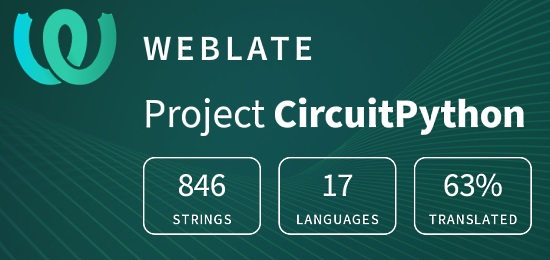](https://hosted.weblate.org/engage/circuitpython/)

One important feature of CircuitPython is translated control and error messages.

With the help of fellow open source project [Weblate](https://weblate.org/), we're making it even easier to add or improve translations.

Sign in with an existing account such as Github, Google or Facebook and start contributing through a simple web interface. No forks or pull requests needed!

As always, if you run into trouble join us on [Discord](https://adafru.it/discord), we're here to help.

## The Adafruit Jobs Board - Find a dream job / find great candidates!

[jobs.adafruit.com](https://jobs.adafruit.com/) has returned and folks are posting their skills (including CircuitPython) and companies are looking for talented makers to join their companies - from Digi-Key, to Hackaday, Microcenter, Raspberry Pi and more.

**Job of the Week**

PAID JOB - ELECTRICAL: Create a basic countdown timer with separate control - 3 displays - [Adafruit Jobs Board](https://jobs.adafruit.com/).

> (Build) three displays (all showing identical countdown timer)....wired to a separate control that controls each to reset, start, power on/off from a separate controller board.

Linux Foundation: Latest trends and most-needed skills for open source jobs - [TechRepublic](https://www.techrepublic.com/article/hiring-managers-rate-linux-devops-and-cloud-expertise-as-most-in-demand-skills/). Among hiring managers, 81% said hiring open source talent is a priority for 2020... 56% of hiring managers plan to hire more open source professionals in the next six months compared to the last six months.

## 25,798 thanks!

The Adafruit Discord community, where we do all our CircuitPython development in the open, reached over 25,798 humans, thank you!  Adafruit believes Discord offers a unique way for CircuitPython folks to connect. Join today at [https://adafru.it/discord](https://adafru.it/discord).

## ICYMI - In case you missed it

The wonderful world of Python on hardware! This is our Python video-newsletter-podcast! The news comes from the Python community, Discord, Adafruit communities and more and is reviewed on ASK an ENGINEER Wednesdays. The complete Python on Hardware weekly videocast [playlist is here](https://www.youtube.com/playlist?list=PLjF7R1fz_OOXRMjM7Sm0J2Xt6H81TdDev). 

This video podcast is on [iTunes](https://itunes.apple.com/us/podcast/python-on-hardware/id1451685192?mt=2), [YouTube](http://adafru.it/pohepisodes), [IGTV (Instagram TV](https://www.instagram.com/adafruit/channel/)), and [XML](https://itunes.apple.com/us/podcast/python-on-hardware/id1451685192?mt=2).

[Weekly community chat on Adafruit Discord server CircuitPython channel - Audio / Podcast edition](https://itunes.apple.com/us/podcast/circuitpython-weekly-meeting/id1451685016) - Audio from the Discord chat space for CircuitPython, meetings are usually Mondays at 2pm ET, this is the audio version on [iTunes](https://itunes.apple.com/us/podcast/circuitpython-weekly-meeting/id1451685016), Pocket Casts, [Spotify](https://adafru.it/spotify), and [XML feed](https://adafruit-podcasts.s3.amazonaws.com/circuitpython_weekly_meeting/audio-podcast.xml).

And lastly, we are working up a one-spot destination for all things podcast-able here - [podcasts.adafruit.com](https://podcasts.adafruit.com/)

## Contribute!

The CircuitPython Weekly Newsletter is a CircuitPython community-run newsletter emailed every Tuesday. The complete [archives are here](https://www.adafruitdaily.com/category/circuitpython/). It highlights the latest CircuitPython related news from around the web including Python and MicroPython developments. To contribute, edit next week's draft [on GitHub](https://github.com/adafruit/circuitpython-weekly-newsletter/tree/gh-pages/_drafts) and [submit a pull request](https://help.github.com/articles/editing-files-in-your-repository/) with the changes. You may also tag your information on Twitter with #CircuitPython. 

Join our [Discord](https://adafru.it/discord) or [post to the forum](https://forums.adafruit.com/viewforum.php?f=60) for any further questions.
