- [X] Kattni updates
- [ ] change date
- [ ] update title
- [ ] Feature story
- [ ] Update  for images
- [ ] Update ICYDNCI
- [ ] All images 550w max only
- [ ] Link "View this email in your browser."

View this email in your browser.

It's Tuesday and it's time for the latest Python for Microcontrollers newsletter, brought you by the community! We're on [Discord](https://discord.gg/HYqvREz), [Twitter](https://twitter.com/search?q=circuitpython&src=typed_query&f=live), and for past newsletters - [view them all here](https://www.adafruitdaily.com/category/circuitpython/). If you're reading this on the web, [subscribe here](https://www.adafruitdaily.com/). 

## CircuitPython 6.1.0-rc.0 is now out

CircuitPython 6.1.0 is the first release candidate for 6.1.x. 

Fixes and improvements since 6.1.0 Beta 3:

Fixes and Enhancements:
* Fix initialization of onboard NeoPixels. #3934.
* Update ulab to 1.6.0. #3929.
* Fix handling of zero brightness in \_pixelbuf. #3917.

Board and port specific changes:
* CPX: Add back frozen adafruit_bus_device back to CPX. #3932. 
* UnexpectedMaker FeatherS2: Correct pins and add default board devices. #3925, #3914.
* ESP32S2: Add alarm.touch.TouchAlarm. #3850.
* Mini SAM 4: Freeze in adafruit_dotstar library. #3923.

Read about all the changes and the new boards since 5.3 - [Adafruit Blog](https://blog.adafruit.com/2020/12/28/circuitpython-6-0-0-released-adafruit-circuitpython-copy/).

## CircuitPython Blinka for Single Board Computers Explained

[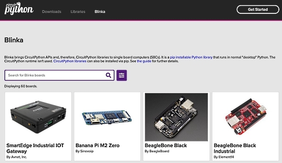](https://circuitpython.org/blinka)

The CircuitPython.Org website has been updated to include an explanation of what the [CircuitPython Blinka compatibility layer](https://circuitpython.org/blinka) for SBCs is:

> Blinka brings CircuitPython APIs and, therefore, CircuitPython libraries to single board computers (SBCs). It is a [pip installable Python library](https://pypi.org/project/Adafruit-Blinka/) that runs in normal "desktop" Python. The CircuitPython runtime isn't used. [CircuitPython libraries](https://pypi.org/search/?q=adafruit-circuitpython) can also be installed via pip. 

See the [guide](https://learn.adafruit.com/circuitpython-on-raspberrypi-linux) for further details.

## CircuitPython 2021 Entries Coming In

The CircuitPython development team is excited at all of the feedback posted as part of the #CircuitPython2021 campaign! They want to hear what you believe is important to you now and going forward using Python on Hardware. Read the latest:

Latest Posts Summary - [Adafruit Blog](https://blog.adafruit.com/2021/01/07/two-more-circuitpython2021-posts/).

Kickoff Post - [Adafruit Blog](https://blog.adafruit.com/2021/01/01/where-should-circuitpython-go-in-2021-circuitpython2021-circuitpython/).

## Python Software Foundation 

### PSF Trademark Usage Policy

This document contains the 1.5.0 version policy of the Python Software Foundation ("PSF") regarding the use of its trademarks. Any use of any PSF trademark must be in accordance with this policy - [python.org](https://www.python.org/psf/trademarks/) via [Twitter](https://twitter.com/ThePSF/status/1346818910558035969)

### Python 3.8.7 is now available

Python 3.8.7 is now available. It is the seventh maintenance release of Python 3.8. Note: it currently does not work on MacOS Big Sur - [Twitter](https://twitter.com/ThePSF/status/1346372364448239618?s=03) and [Download](https://www.python.org/downloads/release/python-387/).

## CircuitPython Deep Dive Stream with Scott Shawcroft

[This week](https://youtu.be/Lh7umSOoMqo), Scott is back for 2021! He streams his current work and discusses [#CircuitPython2021](https://blog.adafruit.com/2021/01/01/where-should-circuitpython-go-in-2021-circuitpython2021-circuitpython/).

You can see the latest video and past videos on the Adafruit YouTube channel under the Deep Dive playlist - [YouTube](https://www.youtube.com/playlist?list=PLjF7R1fz_OOXBHlu9msoXq2jQN4JpCk8A).

## News from around the web!

Woven light strands by Geek Mom Projects. This version winds a [string of pixels](https://www.amazon.com/gp/product/B08KRGTDTW) around 25 nylon screws on a clear acrylic frame. Sturdy and quick to make - [Twitter](https://twitter.com/GeekMomProjects/status/1345528956921868288).

[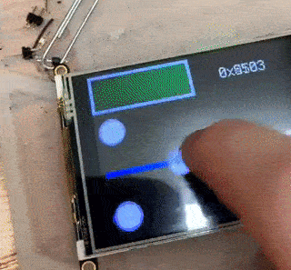](https://twitter.com/TG_Techie/status/1348413708301692928)

A very rudimentary hex mixer running on an [Adafruit PyPortal](https://www.adafruit.com/product/4116) with TG-Gui and CircuitPython - [Twitter](https://twitter.com/TG_Techie/status/1348413708301692928).

[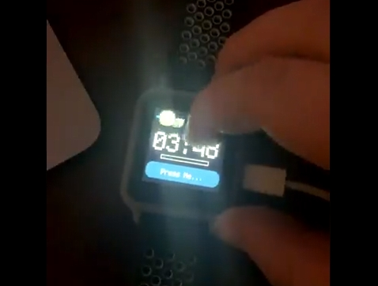](https://twitter.com/TG_Techie/status/1346975116715024384)

Development continues on a CircuitPython controlled watch by TG-Techie - [Twitter](https://twitter.com/TG_Techie/status/1346975116715024384).

> The watch's new framework is now a state dependent, extensible, framework that allows for utilization of native user interface elements. Like CircuitPython's displayio library! Thanks to the CircuitPython community and Adafruit who have put lots of time and care into the ecosystem.

[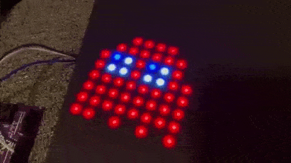](https://twitter.com/BlitzCityDIY/status/1346615083095494656)

Pac-man ghost animation with CircuitPython and NeoPixels - [Twitter](https://twitter.com/BlitzCityDIY/status/1346615083095494656).

The [Matrix Portal Flow Visualizer](https://learn.adafruit.com/matrix-portal-flow-visualizer) was written
for the [Matrix Portal](https://www.adafruit.com/product/4745) but with [a few minor tweaks](https://github.com/kevinjwalters/circuitpython-examples/tree/master/anyportal/anyportal-flow-visualizer)
can run on the [Adafruit PyPortal](https://www.adafruit.com/product/4116)
and should run on the [Adafruit PyPortal Titano](https://www.adafruit.com/product/4444) (untested) showing subsonic flows - [PyPortal Flow Visualizer - Chuck Yeager Text (YouTube)](https://www.youtube.com/watch?v=JajnIi3Lm14).

A robot using an [Adafruit Braincraft Hat](https://www.adafruit.com/product/4374) and [Motor Bonnet](https://www.adafruit.com/product/4280), using a single battery for both the motors and the Pi, using Python - [Twitter](https://twitter.com/CannonFodder/status/1348278685829373958) and [GitHub](https://github.com/OpenPiRobotics/Control).

[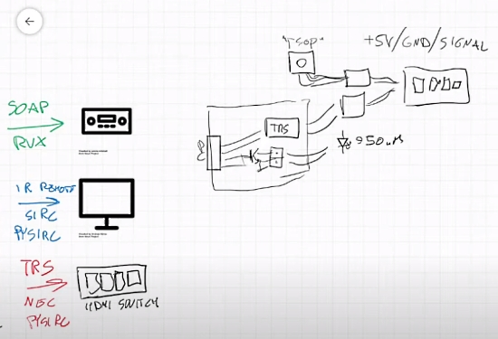](https://flameeyes.blog/2021/01/05/software-defined-remote-control/)

Software Defined Remote Control with CircuitPython on an [Adafruit Trinket M0](https://www.adafruit.com/product/3500) - [Website](https://flameeyes.blog/2021/01/05/software-defined-remote-control/) and [YouTube](https://www.youtube.com/watch?v=XyhTx2X90Gg&feature=emb_logo).

[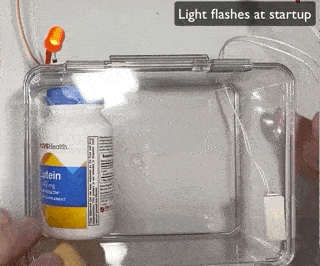](https://gallaugher.com/pi-cabinet/)

Build a Raspberry Pi-powered Smart Pill Cabinet programmed in Python - [gallaugher.com](https://gallaugher.com/pi-cabinet/).

An open source intercom for kids using Raspberry Pi and Telegram - [Chordata](https://chordata.cc/blog/open-source-intercom-for-kids/).

Use micro:bit to learn MicroPython Part 3: Conditional Logic - [Twitter](https://twitter.com/mytechnotalent/status/1346808558927699972) and [LinkedIn](https://www.linkedin.com/pulse/lesson-3-micropython-microbit-part-conditional-logic-kevin-thomas/).

Wave - Realtime Web Apps and Dashboards for Python - [GitHub](https://github.com/h2oai/wave).

A Lua to Python conversion program - [GitHub](https://github.com/marteinn/Lua-To-Python).

The Shell and the Microcontroller: programming microcontrollers using a REPL - [Hackaday](https://hackaday.com/2021/01/09/the-shell-and-the-microcontroller/).

remote-mouse allows use of a smartphone as a pointing device for a computer (say, a Raspberry Pi working as media server) in a similiar fashion to certain smart TV remotes. There is also some limited text input capability- [GitHub](https://github.com/camposm/remote-mouse).

[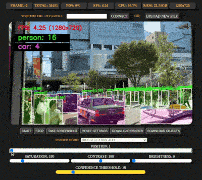](https://github.com/alexfcoding/PyCameraServer)

PyCameraServer - a Flask video / image / Youtube / IP Camera frames online web-editor with live streaming preview for objects recognition, extraction, segmentation, resolution upscaling, styling, colorization, interpolation, using OpenCV with neural network models - [GitHub](https://github.com/alexfcoding/PyCameraServer).

[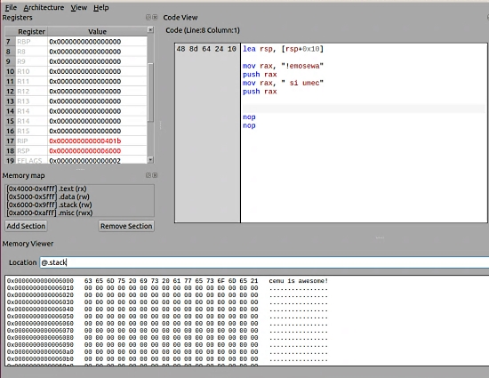](https://github.com/hugsy/cemu)

Cheap EMUlator: lightweight multi-architecture assembly playground written in Python - [GitHub](https://github.com/hugsy/cemu).

[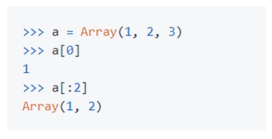](https://github.com/Lauriat/funct)

Array is a functional mutable sequence inheriting from Python's built-in list. Array provides 100+ higher-order methods and more functionality to the built-in list, making operations on sequences simpler and one-liners neater with no third party packages required - [GitHub](https://github.com/Lauriat/funct).

[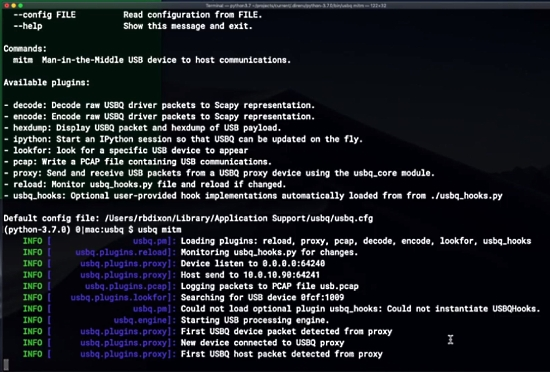](https://usbq.org/)

USBQ is a Python-based programming framework for monitoring and modifying USB communications - [Website](https://usbq.org/), [GitHub](https://github.com/carvesystems/usbq) and [YouTube Demo](https://www.youtube.com/watch?v=sZUYXqrL7-A).

[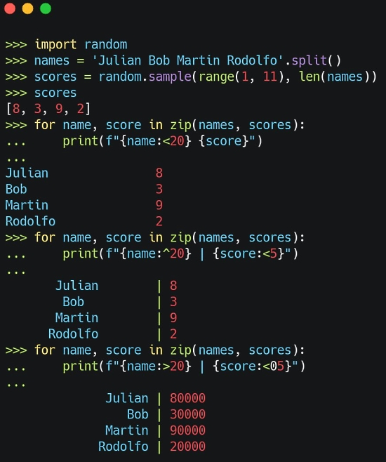](https://twitter.com/pybites/status/1346413728019976192?s=03)

With Python f-strings you can use <, > and ^ to left / right / center justify strings - [Twitter](https://twitter.com/pybites/status/1346413728019976192?s=03).

[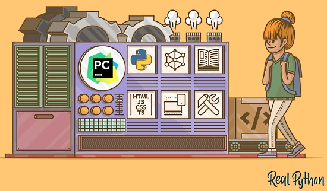](https://realpython.com/pycharm-guide/)

PyCharm for Productive Python Development - [Real Python](https://realpython.com/pycharm-guide/) via [Twitter](https://twitter.com/realpython/status/1348381653333381123).

PyDev of the Week: Ken Youens-Clark [on Mouse vs Python](https://www.blog.pythonlibrary.org/2021/01/11/pydev-of-the-week-ken-youens-clark/)

CircuitPython Weekly Meeting for January 11th, 2021 [(notes)](https://github.com/adafruit/adafruit-circuitpython-weekly-meeting/blob/master/2021/2021-01-11.md) [and video on Youtube](https://youtu.be/bzNDoFQecCE)

#ICYDNCI What was the most popular, most clicked link, in [last week's newsletter](https://www.adafruitdaily.com/2021/01/05/python-on-microcontrollers-newsletter-python-adafruit-circuitpython-micropython-thepsf/)? [SAMD21 NeoPixel USB Stick – USB “TRINKET”](https://blog.adafruit.com/2020/12/28/samd21-neopixel-usb-stick-usb-trinket/).

## Coming soon

Adafruit's Ladyada building prototypes this past weekend - [Twitter](https://twitter.com/adafruit/status/1348028417099370497).

[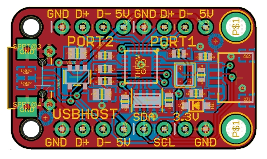](https://twitter.com/adafruit/status/1346531531498663945)

USB2422 I2C-configurable USB 2-port hub is a low cost USB hub with EEPROM you can connect to I2C to configure - [Twitter](https://twitter.com/adafruit/status/1346531531498663945).

## New Boards Supported by CircuitPython

The number of supported microcontrollers and Single Board Computers (SBC) grows every week. This section outlines which boards have been included in CircuitPython or added to [CircuitPython.org](https://circuitpython.org/).

This week no new boards were added but several are in the works.

Looking to add a new board to CircuitPython? It's highly encouraged! Adafruit has four guides to help you do so:

- [How to Add a New Board to CircuitPython](https://learn.adafruit.com/how-to-add-a-new-board-to-circuitpython/overview)
- [How to add a New Board to the circuitpython.org website](https://learn.adafruit.com/how-to-add-a-new-board-to-the-circuitpython-org-website)
- [Adding a Single Board Computer to PlatformDetect for Blinka](https://learn.adafruit.com/adding-a-single-board-computer-to-platformdetect-for-blinka)
- [Adding a Single Board Computer to Blinka](https://learn.adafruit.com/adding-a-single-board-computer-to-blinka)

## New Learn Guides!

[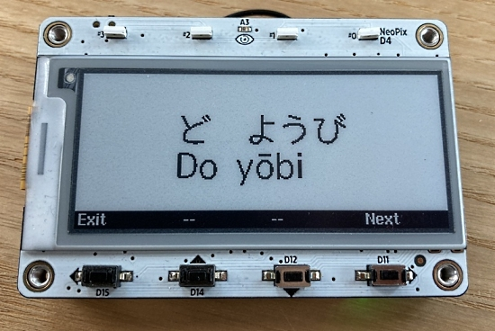](https://learn.adafruit.com/guides/latest)

[Language Flashcards on the MagTag](https://learn.adafruit.com/magtag-flashcards) from [Lucian Copeland](https://learn.adafruit.com/users/hierophect)

[Adafruit MPR121 12-Key Capacitive Touch Sensor Gator Breakout](https://learn.adafruit.com/adafruit-mpr121-gator) from [Kattni](https://learn.adafruit.com/users/kattni)

[Adafruit SCD-30 - NDIR CO2 Temperature and Humidity Sensor](https://learn.adafruit.com/adafruit-scd30) from [Kattni](https://learn.adafruit.com/users/kattni)

[Language Flashcards on the MagTag](https://learn.adafruit.com/magtag-flashcards) from [Lucian Copeland](https://learn.adafruit.com/users/hierophect)

## CircuitPython Libraries!

CircuitPython support for hardware continues to grow. We are adding support for new sensors and breakouts all the time, as well as improving on the drivers we already have. As we add more libraries and update current ones, you can keep up with all the changes right here!

For the latest libraries, download the [Adafruit CircuitPython Library Bundle](https://circuitpython.org/libraries). For the latest community contributed libraries, download the [CircuitPython Community Bundle](https://github.com/adafruit/CircuitPython_Community_Bundle/releases).

If you'd like to contribute, CircuitPython libraries are a great place to start. Have an idea for a new driver? File an issue on [CircuitPython](https://github.com/adafruit/circuitpython/issues)! Have you written a library you'd like to make available? Submit it to the [CircuitPython Community Bundle](https://github.com/adafruit/CircuitPython_Community_Bundle). Interested in helping with current libraries? Check out the [CircuitPython.org Contributing page](https://circuitpython.org/contributing). We've included open pull requests and issues from the libraries, and details about repo-level issues that need to be addressed. We have a guide on [contributing to CircuitPython with Git and Github](https://learn.adafruit.com/contribute-to-circuitpython-with-git-and-github) if you need help getting started. You can also find us in the #circuitpython channel on the [Adafruit Discord](https://adafru.it/discord).

You can check out this [list of all the Adafruit CircuitPython libraries and drivers available](https://github.com/adafruit/Adafruit_CircuitPython_Bundle/blob/master/circuitpython_library_list.md). 

The current number of CircuitPython libraries is **290**!

**Updated Libraries!**

Here's this week's updated CircuitPython libraries:

 * [Adafruit_CircuitPython_Requests](https://github.com/adafruit/Adafruit_CircuitPython_Requests)
 * [Adafruit_CircuitPython_MagTag](https://github.com/adafruit/Adafruit_CircuitPython_MagTag)
 * [Adafruit_CircuitPython_OneWire](https://github.com/adafruit/Adafruit_CircuitPython_OneWire)
 * [Adafruit_CircuitPython_BusDevice](https://github.com/adafruit/Adafruit_CircuitPython_BusDevice)
 * [Adafruit_CircuitPython_MSA301](https://github.com/adafruit/Adafruit_CircuitPython_MSA301)
 * [Adafruit_CircuitPython_FXAS21002C](https://github.com/adafruit/Adafruit_CircuitPython_FXAS21002C)
 * [Adafruit_CircuitPython_miniesptool](https://github.com/adafruit/Adafruit_CircuitPython_miniesptool)
 * [Adafruit_CircuitPython_LPS35HW](https://github.com/adafruit/Adafruit_CircuitPython_LPS35HW)
 * [Adafruit_CircuitPython_RGB_Display](https://github.com/adafruit/Adafruit_CircuitPython_RGB_Display)
 * [Adafruit_CircuitPython_AzureIoT](https://github.com/adafruit/Adafruit_CircuitPython_AzureIoT)
 * [Adafruit_CircuitPython_MatrixPortal](https://github.com/adafruit/Adafruit_CircuitPython_MatrixPortal)
 * [Adafruit_CircuitPython_ESP32SPI](https://github.com/adafruit/Adafruit_CircuitPython_ESP32SPI)
 * [Adafruit_CircuitPython_PyPortal](https://github.com/adafruit/Adafruit_CircuitPython_PyPortal)
 * [Adafruit_CircuitPython_Bitmap_Font](https://github.com/adafruit/Adafruit_CircuitPython_Bitmap_Font)
 * [Adafruit_Python_PlatformDetect](https://github.com/adafruit/Adafruit_Python_PlatformDetect)
 * [CircuitPython_Community_Bundle](https://github.com/adafruit/CircuitPython_Community_Bundle)

## What’s the team up to this week?

What is the team up to this week? Let’s check in!

**Dan**

I made a CircuitPython 6.1.0-rc.0 release this week, after consultation with Scott and Jeff. There are many fixes and additions past 6.0.1. There are still some significant bugs I'd like to see fixed soon, and I'm working on those. I'm on the trail of a memory overwrite that seems to be causing problems with time.sleep().

**Jeff**

Back in December I added support for binary ".pcf" files to the adafruit_bitmap_font library. These fonts take up less space on your device's CIRCUITPY drive and are also faster to load into RAM. However, there was no convenient converter from ".bdf" format to ".pcf". I changed that this week with a [web-based converter](https://adafruit.github.io/web-bdftopcf/) and wrote a [short guide page about using it](https://learn.adafruit.com/custom-fonts-for-pyportal-circuitpython-display/convert-to-pcf). This is especially handy for battery-powered MagTag projects, since less time spent loading fonts means more time in Deep Sleep so the battery will last for longer between charges.

**Kattni**

I started a library PR/issue sweep and started to reach out to folks on library PRs to see where everyone is at. If you're waiting on a reply to a PR, and it's been more than 24 hours (not including weekends), feel free to tag whomever you're waiting on - we're all getting caught up after the holiday. In guide land, I updated the CCS811 guide with the STEMMA QT revision of the board. I wrote the guide for the new [Adafruit SCD30](https://www.adafruit.com/product/4867) as well which has all the details about the board that you need to get started with it.

**Lucian**

This past week I've wrapped up my Flashcard guide on the MagTag, and have been diving into Socket behavior in CPython in hopes of bringing Circuitpython closer in terms of error reporting and performance. I've also been looking into other bugs on my list, related to Busio and other peripherals across several ports.

**Melissa**

This past week I was back from the holiday break and worked on catching up on GitHub Pull Requests and issues that had been submitted while I was gone. I continued working on refactoring the PyPortal library that I had started before the break. One of the things I was stuck on was updating how it handled images and I realized that the MatrixPortal and MagTag libraries weren't actually handling image downloads, so I changed my focus to expanding the functionality of those libraries at the same time.

**Scott**

Mainly I [kicked off #circuitpython2021 on the blog](https://blog.adafruit.com/2021/01/01/where-should-circuitpython-go-in-2021-circuitpython2021-circuitpython/) and then [followed up](https://blog.adafruit.com/2021/01/05/circuitpython2021-tuesday-round-up/) with the first answers from folks.

Besides that, not a whole lot to report. I'm getting caught up after the holidays.

Will be doing a deep dive on Fridays at 2 pm Pacific again!

## Upcoming events!

Australia’s grassroots Free and Open Source technologies conference linux.conf.au is scheduled for January 23-25 2021 online/worldwide. Limor "Ladyada" Fried, electrical engineer and founder of Adafruit, will be one of their keynote speakers. In her keynote, Limor will discuss how Python is snaking its way into hardware, Linux single board computers and more. 

The schedule and tickets are available at [lca2021.linux.org.au](https://lca2021.linux.org.au/) - [Announcement](https://lca2021.linux.org.au/news/keynote-limor-fried/).

FOSDEM is a free and non-commercial event organised by the community for the community. Typically hosted in Brussels, Belgium, FOSDEM 2021 is taking place online February 6-7, 2021. This year, there will be a Python Developer Room. Details - [Adafruit Blog](https://blog.adafruit.com/2020/12/08/fosdem-2021-python-developer-room-python/).

PyCascades is a regional PyCon in the Pacific Northwest, celebrating the west coast Python developer and user community. Held online February 19th — 21st, 2021 - [PyCascades](https://2021.pycascades.com/).

The 2021 Open Hardware summit will be held online, Friday April 9, 2021. The summit will be livestreamed, but ticket holders will have access to additional interactive portions of the summit like meet-and-greets, workshops, and sponsor booths. Find details, including ticket and sponsorship information at [2021.oshwa.org](https://2021.oshwa.org/) - [OSHWA](https://www.oshwa.org/2020/11/16/announcing-the-2021-open-hardware-summit/).

PyCon US, the annual official annual Python gathering, has been announced to be held online May 12-15, 2021. Sprints will be held May 16-18, 2021. More information and signups at [https://us.pycon.org/2021/](https://us.pycon.org/2021/)

**Send Your Events In**

As for other events, with the COVID pandemic, most in-person events are postponed or cancelled. If you know of virtual events or events that may occur in the future, please let us know on Discord or on Twitter with hashtag #CircuitPython.

## Latest releases

CircuitPython's stable release is [6.0.1](https://github.com/adafruit/circuitpython/releases/latest) and its unstable release is [6.1.0-rc.0](https://github.com/adafruit/circuitpython/releases). New to CircuitPython? Start with our [Welcome to CircuitPython Guide](https://learn.adafruit.com/welcome-to-circuitpython).

[20210109](https://github.com/adafruit/Adafruit_CircuitPython_Bundle/releases/latest) is the latest CircuitPython library bundle.

[v1.13](https://micropython.org/download) is the latest MicroPython release. Documentation for it is [here](http://docs.micropython.org/en/latest/pyboard/).

[3.9.1](https://www.python.org/downloads/) is the latest Python release. The latest pre-release version is [3.10.0a4](https://www.python.org/download/pre-releases/).

[1972 Stars](https://github.com/adafruit/circuitpython/stargazers) Like CircuitPython? [Star it on GitHub!](https://github.com/adafruit/circuitpython)

## Call for help -- Translating CircuitPython is now easier than ever!

One important feature of CircuitPython is translated control and error messages.

With the help of fellow open source project [Weblate](https://weblate.org/), we're making it even easier to add or improve translations.

Sign in with an existing account such as Github, Google or Facebook and start contributing through a simple web interface. No forks or pull requests needed!

As always, if you run into trouble join us on [Discord](https://adafru.it/discord), we're here to help.

## jobs.adafruit.com - Find a dream job, find great candidates!

[jobs.adafruit.com](https://jobs.adafruit.com/) has returned and folks are posting their skills (including CircuitPython) and companies are looking for talented makers to join their companies - from Digi-Key, to Hackaday, Microcenter, Raspberry Pi and more.

**Job of the Week**

Director of Resource Development – Python Software Foundation

The PSF is seeking to hire a Director of Resource Development to spearhead fundraising and sponsorship efforts! Hurry, they are accepting resumes through **January 14th, 2021** – Adafruit Jobs Board. - [Adafruit Jobs Board](https://jobs.adafruit.com/).

## 26,589 thanks!

The Adafruit Discord community, where we do all our CircuitPython development in the open, reached over 26,589 humans, thank you!  Adafruit believes Discord offers a unique way for CircuitPython folks to connect. Join today at [https://adafru.it/discord](https://adafru.it/discord).

## ICYMI - In case you missed it

The wonderful world of Python on hardware! This is our Python video-newsletter-podcast! The news comes from the Python community, Discord, Adafruit communities and more and is reviewed on ASK an ENGINEER Wednesdays. The complete Python on Hardware weekly videocast [playlist is here](https://www.youtube.com/playlist?list=PLjF7R1fz_OOXRMjM7Sm0J2Xt6H81TdDev). 

This video podcast is on [iTunes](https://itunes.apple.com/us/podcast/python-on-hardware/id1451685192?mt=2), [YouTube](http://adafru.it/pohepisodes), [IGTV (Instagram TV](https://www.instagram.com/adafruit/channel/)), and [XML](https://itunes.apple.com/us/podcast/python-on-hardware/id1451685192?mt=2).

[Weekly community chat on Adafruit Discord server CircuitPython channel - Audio / Podcast edition](https://itunes.apple.com/us/podcast/circuitpython-weekly-meeting/id1451685016) - Audio from the Discord chat space for CircuitPython, meetings are usually Mondays at 2pm ET, this is the audio version on [iTunes](https://itunes.apple.com/us/podcast/circuitpython-weekly-meeting/id1451685016), Pocket Casts, [Spotify](https://adafru.it/spotify), and [XML feed](https://adafruit-podcasts.s3.amazonaws.com/circuitpython_weekly_meeting/audio-podcast.xml).

And lastly, we are working up a one-spot destination for all things podcast-able here - [podcasts.adafruit.com](https://podcasts.adafruit.com/)

## Contribute!

The CircuitPython Weekly Newsletter is a CircuitPython community-run newsletter emailed every Tuesday. The complete [archives are here](https://www.adafruitdaily.com/category/circuitpython/). It highlights the latest CircuitPython related news from around the web including Python and MicroPython developments. To contribute, edit next week's draft [on GitHub](https://github.com/adafruit/circuitpython-weekly-newsletter/tree/gh-pages/_drafts) and [submit a pull request](https://help.github.com/articles/editing-files-in-your-repository/) with the changes. You may also tag your information on Twitter with #CircuitPython. 

Join our [Discord](https://adafru.it/discord) or [post to the forum](https://forums.adafruit.com/viewforum.php?f=60) for any further questions.
