- [X] Kattni updates
- [ ] change date
- [ ] update title
- [ ] Feature story
- [ ] Update  for images
- [ ] Update ICYDNCI
- [ ] All images 550w max only
- [ ] Link "View this email in your browser."

View this email in your browser.

Hi everyone! Here's the latest Python for Microcontrollers newsletter, brought you by the community! We're on [Discord](https://discord.gg/HYqvREz), [Twitter](https://twitter.com/search?q=circuitpython&src=typed_query&f=live), and for past newsletters - [view them all here](https://www.adafruitdaily.com/category/circuitpython/). If you're reading this on the web, [subscribe here](https://www.adafruitdaily.com/). Let's get started!

## Python snakes its way to the new Raspberry Pi Pico board and RP2040 chip

On January 21st, the Raspberry Pi Foundation launched their first microcontroller-class product: the Raspberry Pi Pico. Priced at just $4, it is built on RP2040, a brand-new microcontroller chip developed by Raspberry Pi. That's not a typo. Unlike the Raspberry Pi boards to date, all have been single board computers (SBC) running Linux. The RP2040 and Pico board run code is developed by the user and run on the chip with no operating system.

Besides the Pico board (yes many other boards in the market are also named Pico...), several other manufacturers have announced boards based on the RP2040 chip, which will be on sale by itself in the second quarter of this year. Of course Adafruit has announced several new boards (see below).

The board launched with support for programming in C, MicroPython, and CircuitPython (see below). Arduino has stated they will support the RP2040 soon.

More Information on the Pico board and the RP2040 microcontroller:

* Ladyada discusses the new Pico board and the RP2040 chip on launch morning - [YouTube](https://youtu.be/LMfRA_k-EYQ)
* Desk of Ladyada - It's an RP2040 & Pico Party! - [YouTube](https://www.youtube.com/watch?v=jIUV9gYLYpk).
* Raspberry Pi Information and video - [Raspberry Pi Blog](https://www.raspberrypi.org/blog/raspberry-pi-silicon-pico-now-on-sale/).
* HackSpace Magazine feature on the Pico - [HackSpace](https://hackspace.raspberrypi.org/issues/39).
* Getting Started Designing a RP2040 Board - [Adafruit Blog](https://blog.adafruit.com/2021/01/21/want-to-get-started-designing-a-pcb-with-rp2040-raspberry_pi-rp2040-adafruit/)

## CircuitPython 6.2.0 Beta 0 out with support for RP2040 boards

CircuitPython 6.2.0 provides preliminary support for the Raspberry Pi RP2040 chip, including the Raspberry Pi Pico and Adafruit’s own RP2040 boards.

Board and post specific changes:

* ESP32-S2:
  * Add TCP Server support.
  * Improve wifi checking about whether already connected when trying to connect.
  * Do not go into safe mode on watchdog reset.
  * Initialize touch in proper order. Fixes TouchIn and TouchAlarm.
  * Revert FeatherS2 status DotStar due to LDO2 issues.
* STM32 BlackPill: Add additional board build that supports an external SPI chip.
* ItsyBitsy M4: Fix erroneous comment in mpconfigboard.h.
* RP2040:
  * Initial port of CircuitPython to the RP2040. 
  * Enable longints.

Read more - [Adafruit Blog](https://blog.adafruit.com/2021/01/22/circuitpython-6-2-0-beta-0-released-adafruit-circuitpython-rp2040-raspberry-pi-pico/)

**New Adafruit Learning System Guide:** [Getting Started with Raspberry Pi Pico and CircuitPython](https://learn.adafruit.com/getting-started-with-raspberry-pi-pico-circuitpython).

CircuitPython lead Scott Shawcroft posts on the Raspberry Pi forums on CircuitPython for RP2040 - [Raspberry Pi Forums](https://www.raspberrypi.org/forums/viewtopic.php?f=144&t=299532).

CircuitPython from Adafruit runs on the Raspberry Pi Pico - [Recantha.co.uk](https://www.recantha.co.uk/blog/?p=20762).

### CircuitPython Projects on Pico

[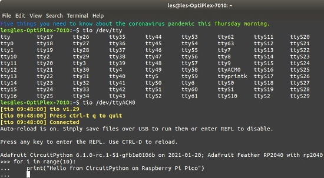](https://twitter.com/biglesp/status/1352192000251076610)

> CircuitPython on Raspberry Pi Pico took me about 2 minutes to download, find a micro USB lead and get to the REPL! Awesome! - [Twitter](https://twitter.com/biglesp/status/1352192000251076610).

[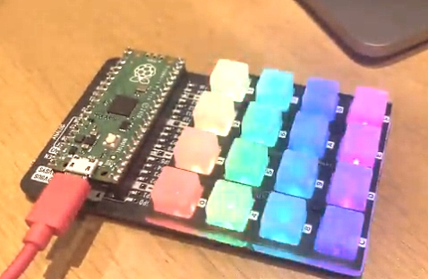](https://twitter.com/sandyjmacdonald/status/1352329727386800130)

> A Pimoroni Pico Keypad running the LEDs with Adafruit's DotStar CircuitPython library. CircuitPython works a treat! - [Twitter](https://twitter.com/sandyjmacdonald/status/1352329727386800130).

> An Arnie soundboard seems like the optimal use of the Pimoroni/Raspberry Pi Pico RGB Keypad. Run my MIDI keypad CircuitPython example, stick a load of Arnie clips on an Ableton drum rack, and BOOM - [Twitter](https://twitter.com/sandyjmacdonald/status/1353371142925414401).

## MicroPython on the Raspberry Pi Pico

[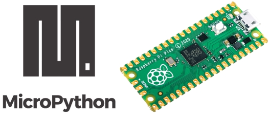](https://www.raspberrypi.org/documentation/pico/getting-started/)

MicroPython is one of the two languages the Raspberry Pi Foundation set to program the Pico (non-Arduino C being the other). Here are some resources for using MicroPython on Pico:

Raspberry Pi Pico Getting Started Guide - [Raspberry Pi](https://www.raspberrypi.org/documentation/pico/getting-started/).

MicroPython Wiki - [GitHub](https://github.com/micropython/micropython/wiki).

[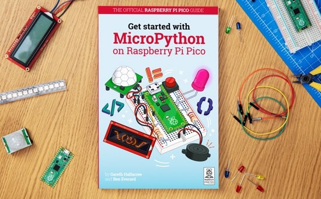](https://www.raspberrypi.org/documentation/pico/getting-started/)

There is an official guide book, "Get started with MicroPython on Raspberry Pi Pico". The book teaches the basics of MicroPython and physical computing, connect your Pico to displays and sensors, build alarms, reaction games, and more - [Raspberry Pi](https://www.raspberrypi.org/documentation/pico/getting-started/).

### MicroPython Projects Using Pico

Connect an analog joystick to Raspberry Pi Pico with MicroPython - [Tom's Hardware](https://www.tomshardware.com/how-to/raspberry-pi-pico-joystick) via [Twitter](https://twitter.com/todbot/status/1353786991167508480).

[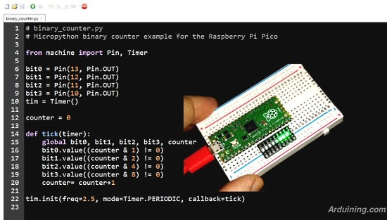](https://twitter.com/Arduining/status/1353783527570079745)

4-bit binay counter with the Raspberry Pi Pico and MicroPython - [Twitter](https://twitter.com/Arduining/status/1353783527570079745).

## New Adafruit Boards Coming, featuring the RP2040 Chip

Adafruit is hard at work, developing boards containing the new Raspberry Pi RP2040 microcontroller, with coming soon announcements for three boards and a novel Pico to Raspberry Pi Zero form factor conversion board. For the Feather and the ItsyBitsy, you can click the link and sign up to be notified first when they are in stock.

[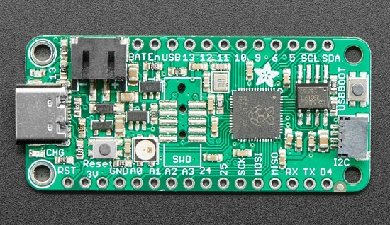](https://www.adafruit.com/product/4884)

Feather RP2040: A Feather format board with the RP2040 - [Adafruit](https://www.adafruit.com/product/4884).

[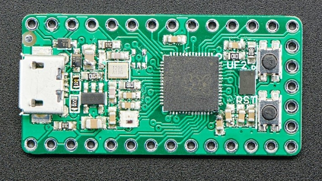](https://www.adafruit.com/product/4888)

ItsyBitsy RP2040: An ItsyBitsy format board with the RP2040 - [Adafruit](https://www.adafruit.com/product/4888).

QT Py RP2040 - [Adafruit Blog](https://blog.adafruit.com/2021/01/22/coming-soon-petite-pico-prototypes-qt-py-rp2040/)

[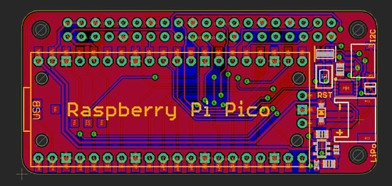](url)

Pico Zero: A Pico-based carrier board in a Raspberry Pi Zero form factor - [Adafruit Blog](https://blog.adafruit.com/2021/01/22/coming-soon-peculiar-pico-paintings-portrait-of-a-pico-zero-as-a-young-board/).

## CircuitPython Deep Dive Stream with Scott Shawcroft

[This week](https://youtu.be/LXAwW2IYT7o), Scott streams his work on the RP2040 and the Raspberry Pi Pico including programming and PIO.

You can see the latest video and past videos on the Adafruit YouTube channel under the Deep Dive playlist - [YouTube](https://www.youtube.com/playlist?list=PLjF7R1fz_OOXBHlu9msoXq2jQN4JpCk8A).

## Hackaday IO Hack Chat this Wednesday: 6 months with ESP32-S2 and the new RP2040

The gang from Adafruit will host the Hackaday.io Hack Chat on Wednesday, January 27, 2021 at noon Pacific Time!

Topic: Six Months with the ESP32-S2 Hack Chat. Plus: an inside look at the new RP2040!

You'll need to join Hackaday.io as a member to join the event. More - [hackaday.io](https://hackaday.io/event/175898-six-months-with-the-esp32-s2-hack-chat).

## V-R3x: CubeSat mission just launched to space with CircuitPython!

[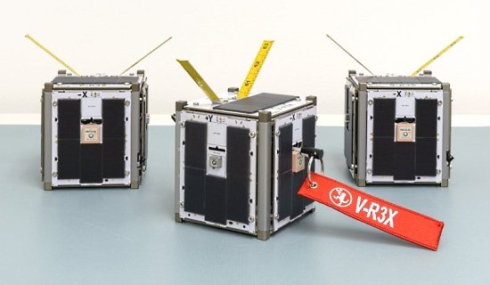](https://twitter.com/NASAAmes/status/1352314971519008768)

The V-R3x mission uses a swarm of three small satellites to demonstrate new technologies and techniques for radio networking and navigation. By developing and demonstrating these technologies on a small scale, they can be implemented for future multi-spacecraft missions. Using three satellites known as CubeSats, each about the size of a coffee mug, the mission will conduct a series of such demonstrations. They launched this past Sunday aboard a SpaceX Falcon 9 rocket as a part of the Transporter-1 mission which launched 140 additional satellites, the most satelllites launched aboard one spacecraft. The V-R3x CubeSats contain PyCubed boards programmed in CircuitPython. 

* Satellite Information - [NASA](https://www.nasa.gov/ames/v-r3x) via [Twitter](https://twitter.com/NASAAmes/status/1352314971519008768).
* PyCubed Board - [Robot Exploration Lab](http://roboticexplorationlab.org/projects/pycubed.html).
* SpaceX Rideshare Program - [SpaceX](https://www.spacex.com/rideshare/index.html).

*Editors Note: I watched Transporter-1 launch Sunday morning, a beautiful polar trajectory over the house. Fabulous.*

See the launch - [YouTube](https://www.youtube.com/watch?v=ScHI1cbkUv4&feature=youtu.be).

## News from around the web!

[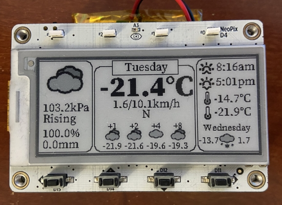](https://twitter.com/MarkKomus/status/1351542329430204420)

An updated weather station monitor to the Adafruit MagTag and CircuitPython - [Twitter](https://twitter.com/MarkKomus/status/1351542329430204420).

> Moving it let me easily add in graphics and future forecast updates. While this is all possible on Arduino, the speed of doing it in CircuitPython is amazing. And yes it is currently that cold.

A colorful fiber-optic hyperbolic paraboloid. Code patterns via CircuitPython on a Teensy 4.0 - [Twitter](https://twitter.com/GeekMomProjects/status/1352346887773331457).

Adafruit MagTag displaying State level Covid numbers via WiFi, programmed in CircuitPython - [Twitter](https://twitter.com/Kwalseth/status/1352323496337018883).

Little SAMD21 boards for CircuitPython that are compatible with an Arduino Pro Micro footprint. They are very handy for DIY keyboards - [Reddit](https://www.reddit.com/r/circuitpython/comments/l24nnu/i_made_these_little_samd21_boards_for/).

BYO (Build Your Own) Mechanical Keyboard, includes an Adafruit ItsyBitsy M0 Express board programmable in CircuitPython - [Kickstarter](https://www.kickstarter.com/projects/painlessprototyping/byo-build-your-own-mechanical-keyboard).

[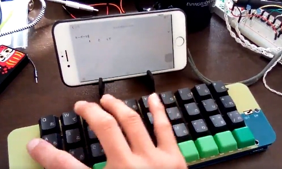](https://twitter.com/ysni_pub/status/1353560617546698752)

A wireless keyboard that runs on CircuitPython - [Twitter](https://twitter.com/ysni_pub/status/1353560617546698752).

[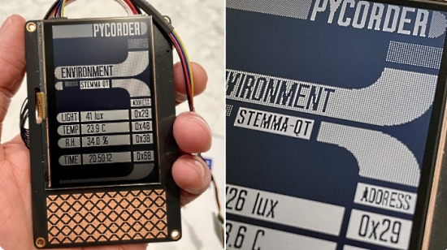](https://twitter.com/josecastillo/status/1352075105204117504)

Joey Castillo was on [Adafruit Show & Tell](https://learn.adafruit.com/show-and-tell) last Wednesday with the latest Pycorder demo: an LCARS-inspired environment board - [Twitter](https://twitter.com/josecastillo/status/1352075105204117504).

> These Sharp memory displays may be one-bit, but even simple dithering looks gorgeous. And of course the code is CircuitPython.

A dashboard for Euro Truck Simulator2 which not only controls the game but receives real time game data. Uses a Pimoroni four letter pHat and Adafruit Clue - [Twitter](https://twitter.com/makercupboard/status/1353390453811507200).

[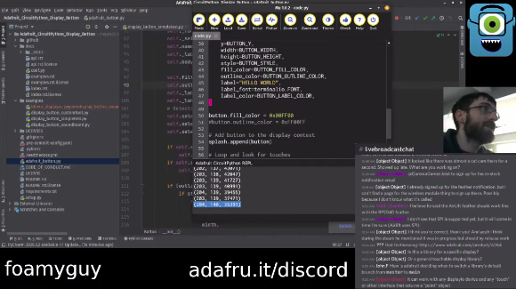](https://www.twitch.tv/foamyguy_twitch)

CircuitPython community member @foamyguy has started streaming CircuitPython library PR reviews and development. New streams are on Saturdays at 10am US Central, 16:00 UTC. Join on [Twitch](https://www.twitch.tv/foamyguy_twitch) and the #livebroadcast channel on the [Adafruit Discord](https://adafru.it/discord) Server - [Past videos on Youtube](https://www.youtube.com/user/Zobrombee/videos?&view=2&live_view=503).

[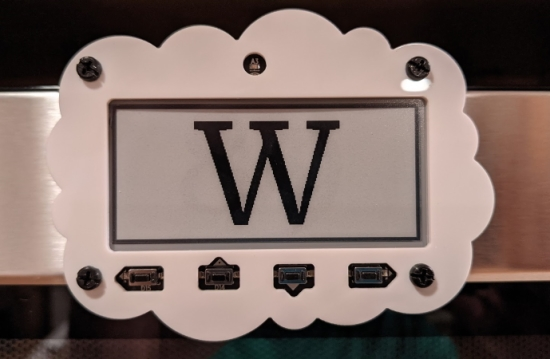](https://forums.adafruit.com/viewtopic.php?f=59&t=174030)

A MagTag child's letters/numbers game - [Adafruit Forums](https://forums.adafruit.com/viewtopic.php?f=59&t=174030).

An interview with Thea Flowers (Stargirl, @theavalkyrie) who creates open source and open hardware craft synthesizers that use CircuitPython for customization. She also writes about the internals of the SAMD21. Thea’s synthesizer modules are found at Winterbloom, including Castor & Pollux and the Big Honking Button - [embedded.fm](https://embedded.fm/episodes/359) via [Twitter](https://twitter.com/embeddedfm/status/1352405881372213249).

Python 3.9.1 natively runs on macOS Big Sur running on the Apple M1 processor - [Adafruit Blog](https://blog.adafruit.com/2021/01/19/python-now-runs-natively-on-apple-m1-python-apple-m1-thepsf-zdnet-liamt/).

[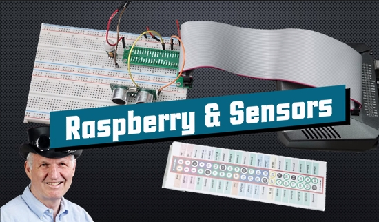](https://youtu.be/gnE4v-PcYKQ)

Video Tutorial: A Definitive Guide to Attaching Sensors to the Raspberry Pi (uses the Blinka compatibility layer for CircuitPython) - [YouTube](https://youtu.be/gnE4v-PcYKQ).

[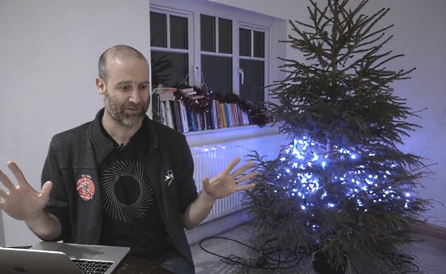](https://www.youtube.com/watch?v=v7eHTNm1YtU)

Running untested, viewer-submitted Python code on a 500-LED christmas tree - uses the Blinka Compatibility layer - [YouTube](https://www.youtube.com/watch?v=v7eHTNm1YtU).

Use the Unicode Database (unicodedata) module to detect accented characters - [Twitter](https://twitter.com/pybites/status/1351076866673795072).

[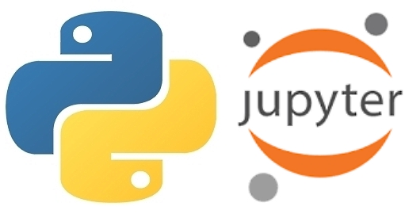](https://github.com/barbagroup/AeroPython)

Classical Aerodynamics of potential flow using Python and Jupyter Notebooks - [GitHub](https://github.com/barbagroup/AeroPython).

[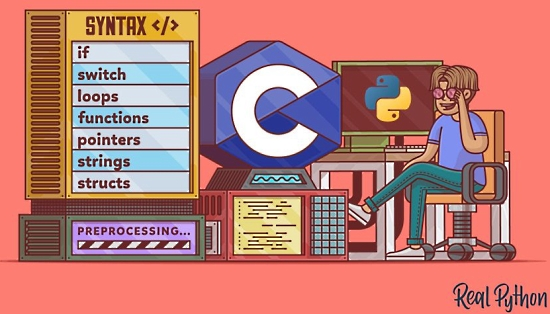](https://realpython.com/c-for-python-programmers/url)

C for Python Programmers - [Real Python](https://realpython.com/c-for-python-programmers/) via [Twitter](https://twitter.com/realpython/status/1351895123005730817).

The pass statement - doing nothing in Python - [Real Python](https://realpython.com/python-pass/).

Python In 1 Minute - Learn something new about Python every day in less than 1 minute video - [YouTube](https://www.youtube.com/c/PythonIn1Minute/videos) via [Twitter](https://twitter.com/PythonWeekly/status/1351529961073553410).

PyDev of the Week: Leodanis Pozo Ramos [on Mouse vs Python](https://www.blog.pythonlibrary.org/2021/01/25/pydev-of-the-week-leodanis-pozo-ramos/)

CircuitPython Weekly Meeting for January 25th, 2021 [(notes)](https://github.com/adafruit/adafruit-circuitpython-weekly-meeting/blob/master/2021/2021-01-25.md) and [video on Youtube](https://youtu.be/E8PxIPA_g9Y)

#ICYDNCI What was the most popular, most clicked link, in [last week's newsletter](https://www.adafruitdaily.com/2021/01/19/python-on-microcontrollers-newsletter-covid-tracking-oshwa-proposals-and-much-more-python-adafruit-circuitpython-micropython-thepsf/)? [Meet the PyCorder](https://twitter.com/josecastillo/status/1349909509376917505?s=21).

## Coming soon

There has been multiple announcements of boards using the new Raspberry Pi RP2040 microcontroller from multiple vendors. As these get close to release, it is hoped they can be put in this section.

## New Boards Supported by CircuitPython

The number of supported microcontrollers and Single Board Computers (SBC) grows every week. This section outlines which boards have been included in CircuitPython or added to [CircuitPython.org](https://circuitpython.org/).

This week we had 13 new boards added!

- [Pico by Raspberry Pi](https://circuitpython.org/board/raspberry_pi_pico/)
- [Feather RP2040](https://circuitpython.org/board/adafruit_feather_rp2040/)
- [Banana Pi M2 Zero](https://circuitpython.org/blinka/banana_pi_m2_zero/)
- [BeagleBone Green Gateway](https://circuitpython.org/blinka/beaglebone_green_gateway/)
- [PINE H64](https://circuitpython.org/blinka/pine_h64/)
- [Orange Pi Zero Plus2](https://circuitpython.org/blinka/orange_pi_zero_plus2/)
- [Raspberry Pi 400 Desktop](https://circuitpython.org/blinka/raspberry_pi_400/)
- [SOPINE A64](https://circuitpython.org/blinka/sopine_a64/)
- [Google Coral Dev Board Mini](https://circuitpython.org/blinka/google_coral_mini/)
- [Raspberry Pi Compute Module 4](https://circuitpython.org/blinka/raspberry_pi_cm4/)
- [Orange Pi Zero Plus](https://circuitpython.org/blinka/orange_pi_zero_plus/)
- [BeagleBone AI](https://circuitpython.org/blinka/beaglebone_ai/)
- [NanoPi NEO Air](https://circuitpython.org/blinka/nanopi_neo_air/)

Looking to add a new board to CircuitPython? It's highly encouraged! Adafruit has four guides to help you do so:

- [How to Add a New Board to CircuitPython](https://learn.adafruit.com/how-to-add-a-new-board-to-circuitpython/overview)
- [How to add a New Board to the circuitpython.org website](https://learn.adafruit.com/how-to-add-a-new-board-to-the-circuitpython-org-website)
- [Adding a Single Board Computer to PlatformDetect for Blinka](https://learn.adafruit.com/adding-a-single-board-computer-to-platformdetect-for-blinka)
- [Adding a Single Board Computer to Blinka](https://learn.adafruit.com/adding-a-single-board-computer-to-blinka)

## New Learn Guides!

[Getting Started with Raspberry Pi Pico and CircuitPython](https://learn.adafruit.com/getting-started-with-raspberry-pi-pico-circuitpython) by [Kattni Rembor](https://learn.adafruit.com/users/kattni).

[DIY Darksaber Build - 3D Print with PropMaker FeatherWing and BLE](https://learn.adafruit.com/ble-darksaber-propmaker) from [Noe and Pedro](https://learn.adafruit.com/users/pixil3d).

## CircuitPython Libraries!

CircuitPython support for hardware continues to grow. We are adding support for new sensors and breakouts all the time, as well as improving on the drivers we already have. As we add more libraries and update current ones, you can keep up with all the changes right here!

For the latest libraries, download the [Adafruit CircuitPython Library Bundle](https://circuitpython.org/libraries). For the latest community contributed libraries, download the [CircuitPython Community Bundle](https://github.com/adafruit/CircuitPython_Community_Bundle/releases).

If you'd like to contribute, CircuitPython libraries are a great place to start. Have an idea for a new driver? File an issue on [CircuitPython](https://github.com/adafruit/circuitpython/issues)! Have you written a library you'd like to make available? Submit it to the [CircuitPython Community Bundle](https://github.com/adafruit/CircuitPython_Community_Bundle). Interested in helping with current libraries? Check out the [CircuitPython.org Contributing page](https://circuitpython.org/contributing). We've included open pull requests and issues from the libraries, and details about repo-level issues that need to be addressed. We have a guide on [contributing to CircuitPython with Git and Github](https://learn.adafruit.com/contribute-to-circuitpython-with-git-and-github) if you need help getting started. You can also find us in the #circuitpython channel on the [Adafruit Discord](https://adafru.it/discord).

You can check out this [list of all the Adafruit CircuitPython libraries and drivers available](https://github.com/adafruit/Adafruit_CircuitPython_Bundle/blob/master/circuitpython_library_list.md). 

The current number of CircuitPython libraries is **292**!

**New Libraries!**

Here's this week's new CircuitPython libraries:

 * [Adafruit_CircuitPython_SHT4x](https://github.com/adafruit/Adafruit_CircuitPython_SHT4x)
 * [Adafruit_CircuitPython_HTU31D](https://github.com/adafruit/Adafruit_CircuitPython_HTU31D)

**Updated Libraries!**

Here's this week's updated CircuitPython libraries:

 * [Adafruit_CircuitPython_Display_Shapes](https://github.com/adafruit/Adafruit_CircuitPython_Display_Shapes)
 * [Adafruit_CircuitPython_MotorKit](https://github.com/adafruit/Adafruit_CircuitPython_MotorKit)
 * [Adafruit_CircuitPython_ATECC](https://github.com/adafruit/Adafruit_CircuitPython_ATECC)
 * [Adafruit_CircuitPython_PortalBase](https://github.com/adafruit/Adafruit_CircuitPython_PortalBase)
 * [Adafruit_CircuitPython_Display_Text](https://github.com/adafruit/Adafruit_CircuitPython_Display_Text)
 * [Adafruit_CircuitPython_Bitmap_Font](https://github.com/adafruit/Adafruit_CircuitPython_Bitmap_Font)
 * [Adafruit_CircuitPython_PyPortal](https://github.com/adafruit/Adafruit_CircuitPython_PyPortal)
 * [Adafruit_CircuitPython_HID](https://github.com/adafruit/Adafruit_CircuitPython_HID)
 * [Adafruit_Blinka](https://github.com/adafruit/Adafruit_Blinka)
 * [Adafruit_Blinka_bleio](https://github.com/adafruit/Adafruit_Blinka_bleio)
 * [Adafruit_Python_PlatformDetect](https://github.com/adafruit/Adafruit_Python_PlatformDetect)
 * [Adafruit_Blinka_PyPortal](https://github.com/adafruit/Adafruit_Blinka_PyPortal)
 * [CircuitPython_Community_Bundle](https://github.com/adafruit/CircuitPython_Community_Bundle)

## What’s the team up to this week?

What is the team up to this week? Let’s check in!

**Dan**

Late last week, I made the 6.1.0-rc.1 release, and just today, as of this writing, I published the 6.1.0 stable release.  For some new boards, most notably the MagTag, there hasn't been a stable release yet, and in addition, the 6.1.0 development releases have been recommended over 6.0.x for ESP32-S2 for some time.

6.1.0 has some remaining known issues, but they are mostly bugs that existed in 6.0.1 as well. I spent a while studying a file writing delay that is due to not running USB tasks often enough, but could not determine the root cause immediately. So I will continue to work on it and not hold up the 6.1.0 release.

Last week Scott invited me to join him on his [weekly Deep Dive video stream](https://www.youtube.com/watch?v=M0s_LK0K1Sk). We talked about the CircuitPython 2021 submissions, and then I discussed some bugs I'd recently worked on in detail. I enjoyed it very much, and am looking forward to seeing other CircuitPython contributors on the stream.

**Jeff**

Continuing with the audio theme on ESP32-S2, I've begun implementing DAC-based AudioOut for this port. While there is not an API provided for this purpose in the ESP-IDF, there is a way to access the functionality at the machine register level, as well as a demo/test provided by Espressif.  I'm using this as a guide to implement our own code.  Hopefully, this will provide stereo, 8-bit audio outputs on this chip; enough to play Wave files on the MagTag's buzzer, for example.  However, this is at an early stage and hasn't actually made any noise yet.

**Kattni**

The last two weeks have been spent working on the [Getting Started guide](https://learn.adafruit.com/getting-started-with-raspberry-pi-pico) for the new [Raspberry Pi Pico](https://www.adafruit.com/product/4864)! This guide covers getting started with the Pico and CircuitPython. You'll learn how to install CircuitPython on your board (spoiler alert: it's super simple!). Then you'll learn some CircuitPython programming basics - some of which are so useful that they have been slated for later addition to the Welcome to CircuitPython guide. Finally, the guide includes multiple project examples, from blinking an LED, to controlling the LED with a button, to building a traffic light simulator, reaction game and burglar alarm. The Overview contains a list of the hardware you need to complete all of the projects, so you can pick up all the extras and be ready to build! The guide and examples cover many of the features of the Pico board, and give you an excellent basis for expanding into your own projects. If you're getting a Pico, and you're looking to get started with CircuitPython, this guide is perfect for you. Check it out!

**Lucian**

This past week, I worked on separating the TLS functions out of the Socket module. TLS stands for [Transport Layer Security](https://en.wikipedia.org/wiki/Transport_Layer_Security), and is a set of cryptographic protocols that help make internet communications secure - it's the successor to SSL (Secure Sockets Layer) which is now deprecated.

Previously, Circuitpython's implementation of the Python [Sockets](https://docs.python.org/3/library/socket.html) module (based on [Berkley Sockets](https://en.wikipedia.org/wiki/Berkeley_sockets)) was using TLS functions directly for functions like connect, send, and receive_into. However, this didn't match the behavior of CPython, which includes only transport-layer protocols (TCP and UDP) in the default Socket module, and uses a different wrapper class called SSLSocket for all the cryptographic capability. I've now moved our TLS code into a new SSLSockets module for Circuitpython to match, and implemented TCP-only versions of functions like connect() for default sockets.

Since that's wrapped up and is waiting on my other Socket work to be accepted, I'm now learning about the guts of the low power code, so I can start helping out on the various bugs in that domain. Low power has been something I've been hoping for for a while, so I'm excited to get into it.

I also wrote my [Circuitpython 2021](http://howtobuildathing.com/2021/01/18/hierophects-circuitpython-2021/) post, and read the ones from everyone else. Good stuff!

**Melissa**

This past week, I finished up the last of the PortalBase refactors by refactoring Blinka PyPortal. This was certainly simpler than the other libraries, but had its own challenge with some changes that allowed it to run in PyGame. Fortunately it wasn't too difficult to figure out with a few additional changes to PortalBase.

I ended up adding 2 boards to Blinka this week. First up was the BeagleBone AI. I thought it would be easier than it was, but soon came to realize the BeableBone IO library did not yet support it. So I took an alternative approach and used libgpiod. That worked well enough for GPIO and I2C. I was unable to get SPI running, but left what I had done in place. Most of the challenges I came across involved sparse documentation or conflicting information.

The other board I added was the NanoPi NEO Air. I figured this board would be pretty straightforward because it was based on the AllWinner H3 chip and we already had several boards using that. It didn't disappoint and I was able to get it added and completely functioning and tested in record time in just a couple of hours.

**Scott**

This week I've been getting the ducks all lined up in a row for the Raspberry Pi Pico / RP2040 CircuitPython launch. I've been working on the port for just over a month. At launch we have:
* digitalio
* analogio.AnalogIn
* busio.I2C, busio.SPI
* neopixel_write
* pwmio.PWMOut

In addition, we have a `rp2pio` module for the unique programmable IO peripheral in the RP2040. It is already used internally for neopixel.

Furthermore, we have full build enabled so things like `displayio`, `touchio`, `ulab`, `usb_midi` and `usb_hid` also work.

While most of the core APIs are included, more will be added in the coming months as we see all of the cool things folks want to use it for.

## Upcoming events!

A free virtual "Girls Into Coding" event via Zoom on Sunday, 31 January 2021 - Choose 1 of 5 workshops. There will also be lightning talks to inspire & encourage girls aged 10 -14 to get involved in tech - [Eventbrite](https://www.eventbrite.co.uk/e/virtual-girls-into-coding-8-join-us-get-involved-tickets-135837302027).

FOSDEM is a free and non-commercial event organised by the community for the community. Typically hosted in Brussels, Belgium, FOSDEM 2021 is taking place online February 6-7, 2021. This year, there will be a Python Developer Room. Details - [Adafruit Blog](https://blog.adafruit.com/2020/12/08/fosdem-2021-python-developer-room-python/).

PyCascades is a regional PyCon in the Pacific Northwest, celebrating the west coast Python developer and user community. To be online February 19th — 21st, 2021. The [schedule is here](https://2021.pycascades.com/program/schedule/). 

[Geek Mom Projects](https://twitter.com/GeekMomProjects/status/1351585630329868288) (Debra Ansell) will be speaking on February 20th on how she uses CircuitPython in the development process. There will be blinky project demos.

More - [PyCascades](https://2021.pycascades.com/). 

The 2021 Open Hardware summit will be held online, Friday April 9, 2021. The summit will be livestreamed, but ticket holders will have access to additional interactive portions of the summit like meet-and-greets, workshops, and sponsor booths. Find details, including ticket and sponsorship information at [2021.oshwa.org](https://2021.oshwa.org/) - [OSHWA](https://www.oshwa.org/2020/11/16/announcing-the-2021-open-hardware-summit/).

PyCon US, the annual official annual Python gathering, has been announced to be held online May 12-15, 2021. Sprints will be held May 16-18, 2021. More information and signups at [https://us.pycon.org/2021/](https://us.pycon.org/2021/)

**Send Your Events In**

As for other events, with the COVID pandemic, most in-person events are postponed or cancelled. If you know of virtual events or events that may occur in the future, please let us know on Discord or on Twitter with hashtag #CircuitPython.

## Latest releases

CircuitPython's stable release is [6.1.0](https://github.com/adafruit/circuitpython/releases/latest) and its unstable release is [6.2.0-beta.0](https://github.com/adafruit/circuitpython/releases). New to CircuitPython? Start with our [Welcome to CircuitPython Guide](https://learn.adafruit.com/welcome-to-circuitpython).

[20210123](https://github.com/adafruit/Adafruit_CircuitPython_Bundle/releases/latest) is the latest CircuitPython library bundle.

[v1.13](https://micropython.org/download) is the latest MicroPython release. Documentation for it is [here](http://docs.micropython.org/en/latest/pyboard/).

[3.9.1](https://www.python.org/downloads/) is the latest Python release. The latest pre-release version is [3.1.0a4](https://www.python.org/download/pre-releases/).

[1993 Stars](https://github.com/adafruit/circuitpython/stargazers) Like CircuitPython? [Star it on GitHub!](https://github.com/adafruit/circuitpython)

## Call for help -- Translating CircuitPython is now easier than ever!

[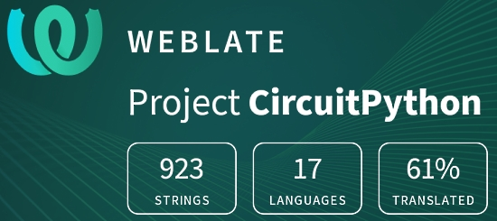](https://hosted.weblate.org/engage/circuitpython/)

One important feature of CircuitPython is translated control and error messages.

With the help of fellow open source project [Weblate](https://weblate.org/), we're making it even easier to add or improve translations.

Sign in with an existing account such as Github, Google or Facebook and start contributing through a simple web interface. No forks or pull requests needed!

As always, if you run into trouble join us on [Discord](https://adafru.it/discord), we're here to help.

## jobs.adafruit.com - Find a dream job, find great candidates!

[jobs.adafruit.com](https://jobs.adafruit.com/) has returned and folks are posting their skills (including CircuitPython) and companies are looking for talented makers to join their companies - from Digi-Key, to Hackaday, Microcenter, Raspberry Pi and more.

**Job of the Week**

Executive Director, Open Source Initiative (OSI) - [Adafruit Jobs Board](https://jobs.adafruit.com/job/executive-director/).

> The Executive Director will work with the board to build a bridge to a stronger future for OSI and the open source ecosystem. The candidate will set strategic direction and move the Open Source Initiative towards our vision, working with the staff and community to achieve measurable program outcomes. This role is ideal for the experienced executive director who can take organizations to the next level. The candidate can set strategy and translate it into programmatic results, achieved through organizational leadership and operational excellence. Additionally, they have a strong understanding of open source culture and norms as well as the Open Source Initiative’s mission and programs.  Plus, the candidate excels at managing ambiguity and drives for clarity and impact.

## 26,873 thanks!

The Adafruit Discord community, where we do all our CircuitPython development in the open, reached over 26,873 humans, thank you!  Adafruit believes Discord offers a unique way for CircuitPython folks to connect. Join today at [https://adafru.it/discord](https://adafru.it/discord).

## ICYMI - In case you missed it

The wonderful world of Python on hardware! This is our Python video-newsletter-podcast! The news comes from the Python community, Discord, Adafruit communities and more and is reviewed on ASK an ENGINEER Wednesdays. The complete Python on Hardware weekly videocast [playlist is here](https://www.youtube.com/playlist?list=PLjF7R1fz_OOXRMjM7Sm0J2Xt6H81TdDev). 

This video podcast is on [iTunes](https://itunes.apple.com/us/podcast/python-on-hardware/id1451685192?mt=2), [YouTube](http://adafru.it/pohepisodes), [IGTV (Instagram TV](https://www.instagram.com/adafruit/channel/)), and [XML](https://itunes.apple.com/us/podcast/python-on-hardware/id1451685192?mt=2).

[Weekly community chat on Adafruit Discord server CircuitPython channel - Audio / Podcast edition](https://itunes.apple.com/us/podcast/circuitpython-weekly-meeting/id1451685016) - Audio from the Discord chat space for CircuitPython, meetings are usually Mondays at 2pm ET, this is the audio version on [iTunes](https://itunes.apple.com/us/podcast/circuitpython-weekly-meeting/id1451685016), Pocket Casts, [Spotify](https://adafru.it/spotify), and [XML feed](https://adafruit-podcasts.s3.amazonaws.com/circuitpython_weekly_meeting/audio-podcast.xml).

And lastly, we are working up a one-spot destination for all things podcast-able here - [podcasts.adafruit.com](https://podcasts.adafruit.com/)

## Codecademy "Learn Hardware Programming with CircuitPython"

Codecademy, an online interactive learning platform used by more than 45 million people, has teamed up with the leading manufacturer in STEAM electronics, Adafruit Industries, to create a coding course, "Learn Hardware Programming with CircuitPython". The course is now available in the [Codecademy catalog](https://www.codecademy.com/learn/learn-circuitpython?utm_source=adafruit&utm_medium=partners&utm_campaign=circuitplayground&utm_content=pythononhardwarenewsletter).

Python is a highly versatile, easy to learn programming language that a wide range of people, from visual effects artists in Hollywood to mission control at NASA, use to quickly solve problems. But you don’t need to be a rocket scientist to accomplish amazing things with it. This new course introduces programmers to Python by way of a microcontroller — CircuitPython — which is a Python-based programming language optimized for use on hardware.

CircuitPython’s hardware-ready design makes it easier than ever to program a variety of single-board computers, and this course gets you from no experience to working prototype faster than ever before. Codecademy’s interactive learning environment, combined with Adafruit's highly rated Circuit Playground Express, present aspiring hardware hackers with a never-before-seen opportunity to learn hardware programming seamlessly online.

Whether for those who are new to programming, or for those who want to expand their skill set to include physical computing, this course will have students getting familiar with Python and creating incredible projects along the way. By the end, students will have built their own bike lights, drum machine, and even a moisture detector that can tell when it's time to water a plant.

Visit Codecademy to access the [Learn Hardware Programming with CircuitPython](https://www.codecademy.com/learn/learn-circuitpython?utm_source=adafruit&utm_medium=partners&utm_campaign=circuitplayground&utm_content=pythononhardwarenewsletter) course and Adafruit to purchase a [Circuit Playground Express](https://www.adafruit.com/product/3333).

Codecademy has helped more than 45 million people around the world upgrade their careers with technology skills. The company’s online interactive learning platform is widely recognized for providing an accessible, flexible, and engaging experience for beginners and experienced programmers alike. Codecademy has raised a total of $43 million from investors including Union Square Ventures, Kleiner Perkins, Index Ventures, Thrive Capital, Naspers, Yuri Milner and Richard Branson, most recently raising its $30 million Series C in July 2016.

## Contribute!

The CircuitPython Weekly Newsletter is a CircuitPython community-run newsletter emailed every Tuesday. The complete [archives are here](https://www.adafruitdaily.com/category/circuitpython/). It highlights the latest CircuitPython related news from around the web including Python and MicroPython developments. To contribute, edit next week's draft [on GitHub](https://github.com/adafruit/circuitpython-weekly-newsletter/tree/gh-pages/_drafts) and [submit a pull request](https://help.github.com/articles/editing-files-in-your-repository/) with the changes. You may also tag your information on Twitter with #CircuitPython. 

Join our [Discord](https://adafru.it/discord) or [post to the forum](https://forums.adafruit.com/viewforum.php?f=60) for any further questions.
