- [X] Kattni updates
- [ ] change date
- [ ] update title
- [ ] Feature story
- [ ] Update  for images
- [ ] Update ICYDNCI
- [ ] All images 550w max only
- [ ] Link "View this email in your browser."

View this email in your browser.

Welcome to the latest Python on Microcontrollers newsletter, brought you by the community! We're on [Discord](https://discord.gg/HYqvREz), [Twitter](https://twitter.com/search?q=circuitpython&src=typed_query&f=live), and for past newsletters - [view them all here](https://www.adafruitdaily.com/category/circuitpython/). If you're reading this on the web, [subscribe here](https://www.adafruitdaily.com/). Let's get started!

## CircuitPython 6.2.0 Beta 3 Released!

This release, 6.2.0-beta.3, is the fourth beta release of CircuitPython 6.2.0. It includes many fixes and enhancements. Across most ports it adds a second USB serial (CDC) channel, adds a `bitmaptool` module for help with `displayio`, and removes the limitation on `displayio.Group` size. The RP2040 port has many enhancements and fixes, and the Spresense port has several improvements as well. Thank you to everyone who contributed to this release!

More - [Adafruit Blog](https://blog.adafruit.com/2021/03/03/circuitpython-6-2-0-beta-3-released/).

## Adafruit Feather RP2040 available!

The new Adafruit Feather RP2040 has been released in the Adafruit shop! More are being fabbed, so sign up to be notified when more are available - [Adafruit](https://www.adafruit.com/product/4884)

## CircuitPython on Tom's Hardware Pi Cast

Scott joins the Tom's Hardware Pi Cast to talk CircuitPython and Rasberry Pi - [YouTube](https://www.youtube.com/watch?v=1kdXaknJwWQ) via [Twitter](https://twitter.com/adafruit/status/1366606786015461376) and [Adafruit Blog](https://blog.adafruit.com/2021/03/01/watch-scott-on-the-tomshardware-pi-cast-tomorrow-at-1130am-pacific-15-hours-from-now-tannewt-circuitpython/).

Scott talks about the future of CircuitPython running directly on Raspberry Pi - [Tom's Hardware](https://www.tomshardware.com/news/circuitpython-bootable-os-raspberry-pi).

## Python 3.10.0a6 is now available for testing

> The new alpha release of Python 3.10 is here, now with 100% more pattern matching. If I were you, I would download it and start playing with it. Extra points if you report us any bugs you find along the way! Are you confused about all this pattern matching business? Fear not, this release also includes some fantastic documentation and some shiny new “What’s new” entries - [Python Insider Blog](https://pythoninsider.blogspot.com/2021/03/python-3100a6-is-now-available-for.html).

## CircuitPython Deep Dive Stream with Scott Shawcroft

[This week](https://www.youtube.com/watch?v=8lH03pQmaxM), Scott streams his work on flash config for RP2040.

You can see the latest video and past videos on the Adafruit YouTube channel under the Deep Dive playlist - [YouTube](https://www.youtube.com/playlist?list=PLjF7R1fz_OOXBHlu9msoXq2jQN4JpCk8A).

## News from around the web!

[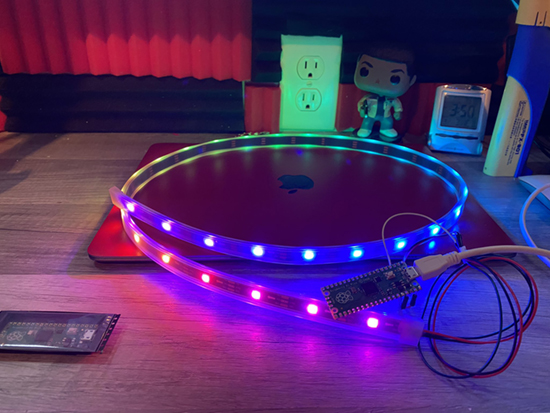](https://twitter.com/Kwalseth/status/1367232340108464128)

Getting started with CircuitPython on Raspberry Pi Pico with NeoPixel LEDs - [Twitter](https://twitter.com/Kwalseth/status/1367232340108464128).

Monday Microcontroller: QT Py - [bigl.es](https://bigl.es/monday-microcontroller-qtpy/).

[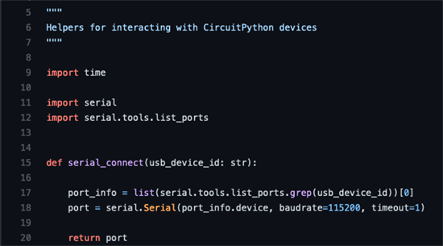](https://github.com/theacodes/wintertools)

A suite of tools including CircuitPython for building & uploading firmware, deploying files to devices, and testing modules  - [GitHub](https://github.com/theacodes/wintertools) via [Twitter](https://twitter.com/theavalkyrie/status/1367155806794301443).

[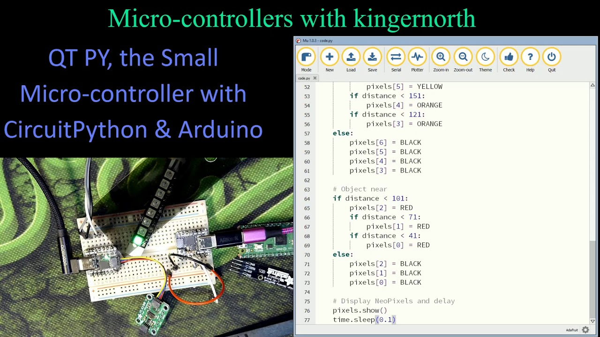](https://www.youtube.com/watch?v=I9QLuAcu3BI)

QT Py, the Small Micro-controller with CircuitPython and Arduino - [YouTube](https://www.youtube.com/watch?v=I9QLuAcu3BI).

[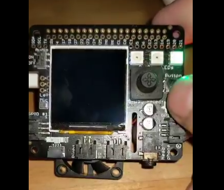](https://twitter.com/DavidGlaude/status/1367680147177021440)

BrainCraft HAT running on Raspberry Pi Pico using "Pico to Zero Adapter" - [Twitter](https://twitter.com/DavidGlaude/status/1367680147177021440).

An adapter for a Raspberry Pi Pico to a FeatherWing - [Twitter](https://twitter.com/arturo182/status/1367289343266717698).

A macro keypad that uses Raspberry Pi Pico and CircuitPython - [Hackaday](https://hackaday.com/2021/03/02/3d-printed-macro-pad-ditches-the-pcb-with-slick-wiring-guides/).

Adafruit Feather M0 and TEMT6000 light sensor CircuitPython example - [Learn MicroPython](http://www.learnmicropython.com/circuitpython/adafruit-feather-m0-and-temt6000-light-sensor-circuitpython-example.php).

[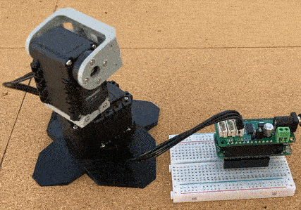](https://www.tindie.com/products/spudworks/dynamixel-featherwing-pivot-kit/)

Dual motor Dynamixel FeatherWing Pivot kit from Spudworks - [Tindie](https://www.tindie.com/products/spudworks/dynamixel-featherwing-pivot-kit/) and code on [GitHub](https://github.com/hierophect/Hierophect_Circuitpython_Dynamixel).

Simple Electronics Podcast featuring Scott Shawcroft - [YouTube](https://www.youtube.com/watch?v=AwZ9VHAsiHE).

Displaying images on a round LCD using Raspberry Pi Pico and CircuitPython - [Twitter](https://twitter.com/todbot/status/1367610739247124482).

QWERTY keyboard and IPS display for Raspberry Pi Pico running CircuitPython - [Twitter](https://twitter.com/bobricius/status/1367238373266632705).

[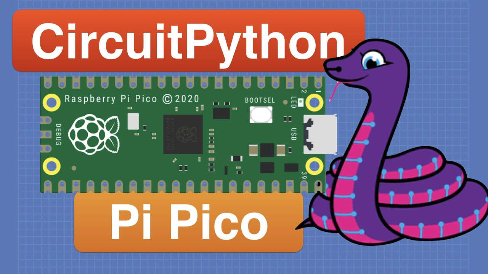](https://www.youtube.com/watch?v=07vG-_CcDG0)

Getting started with CircuitPython on Raspberry Pi Pico - [YouTube](https://www.youtube.com/watch?v=07vG-_CcDG0).

Pico4ML: An RP2040 based platform for tiny machine learning - [Arducam](https://www.arducam.com/pico4ml-an-rp2040-based-platform-for-tiny-machine-learning/) and [YouTube](https://www.youtube.com/watch?v=WhKNzLHOOoM).

Introduction To Numpy for Beginners. Many concepts from this video carryover to ulab in CircuitPython as well! - [YouTube](https://youtu.be/AzgABk5WyKs).

A display workout for the Pimoroni Pico Display and Raspberry Pi Pico - [Instructables](https://www.instructables.com/Pimoroni-Pico-Display-Workout/) and [YouTube](https://www.youtube.com/watch?v=86yopj_PgOA) via [Adafruit Blog](https://blog.adafruit.com/2021/03/05/pico-display-workout-piday-raspberrypi-raspberry_pi/).

PSRAM working for ESP32-S2 in MicroPython - [Twitter](https://twitter.com/unexpectedmaker/status/1367777713860136960).

Using the Raspberry Pi Pico and the DS18B20 in CircuitPython and MicroPython - [recantha.co.uk](https://www.recantha.co.uk/blog/?p=20891) via [Twitter](https://twitter.com/recantha/status/1365991811303489539).

A Raspberry Pi Pico escape room running MicroPython - [GitHub](https://github.com/mytechnotalent/Pico-Escape-Room) via [Twitter](https://twitter.com/mytechnotalent/status/1365662515401752579).

[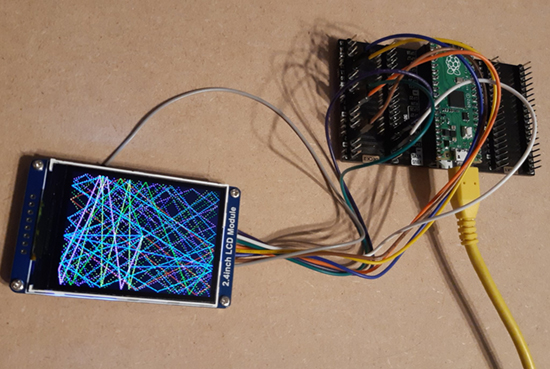](https://twitter.com/TheFlyingKipper/status/1367915162800361476)

A Waveshare LCD with a Raspberry Pi Pico running CircuitPython - [Twitter](https://twitter.com/TheFlyingKipper/status/1367915162800361476).

Seeeduino XIAO simple USB volume control with CircuitPython - [scruss.com](https://scruss.com/blog/2021/03/06/seeeduino-xiao-simple-usb-volume-control-with-circuitpython/).

[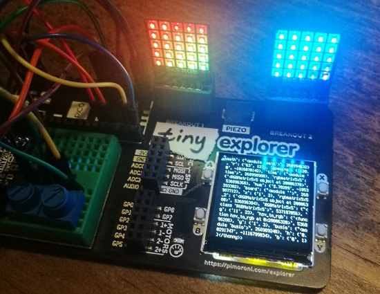](https://twitter.com/veryalien/status/1368573430656864257)

Tiny 2040 rainbows on a couple of Pimoroni 5 x 5 RGB LED matrix breakouts. The Adafruit CircuitPython is31fl3731 library needed to be cajoled into believing that RGBMatrix5x5 things exist, and eventually the pixels started to glow - [Twitter](https://twitter.com/veryalien/status/1368573430656864257).

> Good news, the rotaryIO built-in module is available on CircuitPython for the ESP32-S2! Yes, it’s the UI displayIO tutorial, but behind, the code isn’t the same. Pyportal is a very good investment - [Twitter](https://twitter.com/nico_themaire/status/1368624986534125572).

[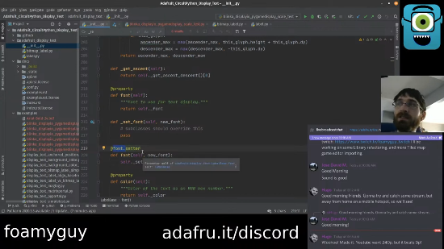](https://www.youtube.com/watch?v=l2COf8n8YZI)

- 3/6/21 Stream from CircuitPythonista FoamyGuy (Tim) covers refactoring display_text and troubleshooting a TileGrid issue with PyGameDisplay - [YouTube](https://www.youtube.com/watch?v=l2COf8n8YZI).

[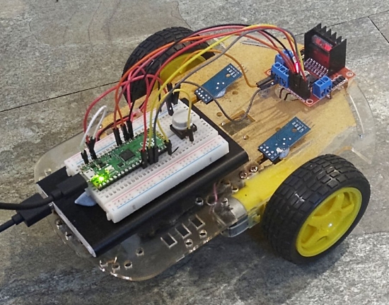](https://twitter.com/astrotutor9/status/1368622767462055942)

A MicroPython rover using the Raspberry Pi Pico - [GitHub](https://github.com/astrotutor9/Pico_Simple_Micropython_Rover) via [Twitter](https://twitter.com/astrotutor9/status/1368622767462055942).

Modifying an Adafruit CircuitPython library to support the Pimoroni 11x7 LED Matrix Breakout on the Raspberry Pi Pico - [Blog](https://www.recantha.co.uk/blog/?p=20904) via [Twitter](https://twitter.com/recantha/status/1368611754947842051).

[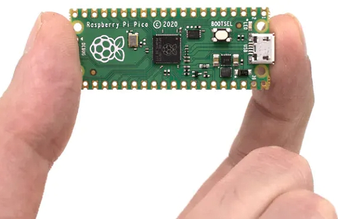](https://www.hackster.io/news/robin-grosset-takes-a-raspberry-pi-pico-s-rp2040-to-new-heights-with-an-overclock-to-420mhz-c3677aa5daac)

A Raspberry Pi Pico was overclocked to 420 MHz - [hackster.io](https://www.hackster.io/news/robin-grosset-takes-a-raspberry-pi-pico-s-rp2040-to-new-heights-with-an-overclock-to-420mhz-c3677aa5daac) and [YouTube](https://youtu.be/G2BuoFNLoDM).

[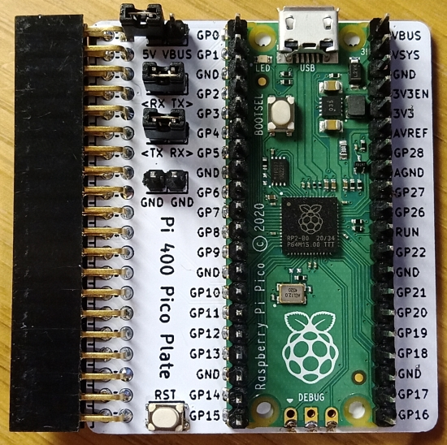](https://github.com/Wren6991/Pi400-Pico-Plate)

This board connects a Pico to the GPIO header on a Pi 400. Besides connecting power and debug, it clearly labels the Pico pinout when viewed from the top. CC0 licensed with board fab files - [GitHub](https://github.com/Wren6991/Pi400-Pico-Plate) via [Twitter](https://twitter.com/wren6991/status/1368337392470528010).

[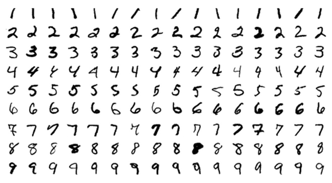](https://leogau.hashnode.dev/how-i-identify-handwritten-digits-using-only-python)

Using Python to train a neural network to identify handwritten digits from the MNIST dataset - [Hashnode.dev](https://leogau.hashnode.dev/how-i-identify-handwritten-digits-using-only-python) via [Twitter](https://twitter.com/PythonLibHunt/status/1367114372426817542).

Sunfish is a simple, but strong chess engine, written in Python, mostly for teaching purposes. Without tables and its simple interface, it takes up just 111 lines of code, yet it plays at ratings above 2000 at Lichess - [GitHub](https://github.com/thomasahle/sunfish).

Emacs: The Best Python Editor? - [Real Python](https://realpython.com/emacs-the-best-python-editor/) via [Twitter](https://twitter.com/realpython/status/1366863425893244941).

Real Life Comics: Learning Python - [Twitter](https://twitter.com/reallifecomics/status/1367520448213356544).

PyDev of the Week: Jens Winkelmann on [Mouse vs Python](https://www.blog.pythonlibrary.org/2021/03/08/pydev-of-the-week-jens-winkelmann/)

CircuitPython Weekly Meeting for July 6th, 2020 ([notes](https://github.com/adafruit/adafruit-circuitpython-weekly-meeting/blob/master/2021/2021-03-08.md)) [on YouTube](https://www.youtube.com/watch?v=rdwRWs-11U8)

**#ICYDNCI What was the most popular, most clicked link, in [last week's newsletter](https://www.adafruitdaily.com/2021/03/02/python-on-microcontrollers-newsletter-circuitpython-supported-by-70-sbcs-and-more-python-adafruit-circuitpython-micropython-thepsf/)? [Pimoroni Tiny 2040 Review: A Smaller Raspberry Pi Pico](https://www.tomshardware.com/reviews/pimoroni-tiny-2040-review).**

## New Boards Supported by CircuitPython

The number of supported microcontrollers and Single Board Computers (SBC) grows every week. This section outlines which boards have been included in CircuitPython or added to [CircuitPython.org](https://circuitpython.org/).

This week we had 3 new boards added!

- [Keybow 2040](https://circuitpython.org/board/pimoroni_keybow2040/)
- [Tiny 2040](https://circuitpython.org/board/pimoroni_tiny2040/)
- [PicoSystem](https://circuitpython.org/board/pimoroni_picosystem/)

Looking to add a new board to CircuitPython? It's highly encouraged! Adafruit has four guides to help you do so:

- [How to Add a New Board to CircuitPython](https://learn.adafruit.com/how-to-add-a-new-board-to-circuitpython/overview)
- [How to add a New Board to the circuitpython.org website](https://learn.adafruit.com/how-to-add-a-new-board-to-the-circuitpython-org-website)
- [Adding a Single Board Computer to PlatformDetect for Blinka](https://learn.adafruit.com/adding-a-single-board-computer-to-platformdetect-for-blinka)
- [Adding a Single Board Computer to Blinka](https://learn.adafruit.com/adding-a-single-board-computer-to-blinka)

## New Learn Guides!

[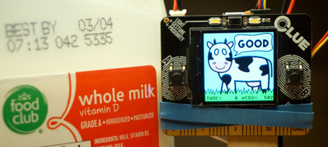](https://learn.adafruit.com/guides/latest)

[Digital Nose Milk Freshness Checker](https://learn.adafruit.com/digital-nose-gas-sensor-milk-freshness-checker) from [Carter Nelson](https://learn.adafruit.com/users/caternuson)

[An Introduction to RP2040 PIO with CircuitPython](https://learn.adafruit.com/intro-to-rp2040-pio-with-circuitpython) from [Jeff Epler](https://learn.adafruit.com/users/jepler)

## CircuitPython Libraries!

CircuitPython support for hardware continues to grow. We are adding support for new sensors and breakouts all the time, as well as improving on the drivers we already have. As we add more libraries and update current ones, you can keep up with all the changes right here!

For the latest libraries, download the [Adafruit CircuitPython Library Bundle](https://circuitpython.org/libraries). For the latest community contributed libraries, download the [CircuitPython Community Bundle](https://github.com/adafruit/CircuitPython_Community_Bundle/releases).

If you'd like to contribute, CircuitPython libraries are a great place to start. Have an idea for a new driver? File an issue on [CircuitPython](https://github.com/adafruit/circuitpython/issues)! Have you written a library you'd like to make available? Submit it to the [CircuitPython Community Bundle](https://github.com/adafruit/CircuitPython_Community_Bundle). Interested in helping with current libraries? Check out the [CircuitPython.org Contributing page](https://circuitpython.org/contributing). We've included open pull requests and issues from the libraries, and details about repo-level issues that need to be addressed. We have a guide on [contributing to CircuitPython with Git and Github](https://learn.adafruit.com/contribute-to-circuitpython-with-git-and-github) if you need help getting started. You can also find us in the #circuitpython channel on the [Adafruit Discord](https://adafru.it/discord).

You can check out this [list of all the Adafruit CircuitPython libraries and drivers available](https://github.com/adafruit/Adafruit_CircuitPython_Bundle/blob/master/circuitpython_library_list.md). 

The current number of CircuitPython libraries is **303**!

**Updated Libraries!**

Here's this week's updated CircuitPython libraries:

* Too many to list this week!

## What’s the team up to this week?

What is the team up to this week? Let’s check in!

**Dan**

I was wrangling a bunch of PR's today (Wed, 3/3) and released CircuitPython 6.2.0-beta.3 this evening. This release has a ton of new features and fixes for the RP2040, a new `bitmaptool` module, a second CDC serial channel, and removes the limitation on `display.Group` size.

Before I did this release, I spent quite a while on getting `busio.I2C` to work better on the RP2040. Because of how the underlying hardware works, short I2C writes are bitbang'd instead of using the peripheral. Most I2C devices now work on the RP2040, and if yours doesn't, try `bitbangio.I2C` as a workaround.

I'll now switch to working on I2C on the ESP32-S2. There are some issues mixing WiFi and I2C after a soft reload, and the underlying problems need to be diagnosed and fixed.

**Jeff**

This week I published a guide on PIO with CircuitPython. There are 4 programs demoed, 3 with a standard LED and one to drive a Neopixel all with the rp2pio module that is available on the Raspberry Pi Pico as well as the Adafruit Feather RP2040.

**Kattni**

This week we applied the patch to the libraries to move running Pylint to the pre-commit, and took care of the issue that came out of the latest Pylint update with a now-working duplicate code check. There are still a few libraries that need to be updated, but we're working on it. Turns out some of our libraries could use a refactor, after all. Issues are being filed and we'll get to it when we can.

Otherwise, this week has been guide work, including the guide for the new [Feather RP2040](https://www.adafruit.com/product/4884). If you're lucky enough to get in on the first round of boards, I'll have a guide ready for you with detailed pinouts info, CircuitPython installation and getting started, and resource downloads.

**Lucian**

This past week I've mostly been working more on low power code, with some other miscellaneous tasks. I spent a bit of time yesterday working through the TouchIO module on the ESP32-S2, since the module had been added by a community member but never tested in full rigorous detail. There weren't any major bugs, but there were some sensitivity issues - the size and layout of a board can alter the capacitances that TouchIO uses to the point that they can cause inter-pin conflicts and excessive sensitivity if not tweaked. I'm looking into some ways we could try to safeguard against that board-by-board.

**Melissa**

This past week I have been working heavily with Linux Device Drivers. After updating the ST7789 Display Driver, this made things a bit easier, but there was still a conflict between the display driver and audio driver for the BrainCraft HAT. The display would either show noise on it or the audio would  stutter. When booting up, it seemed to be random which of the problems you got, but there was always at least one of the problems present.

I ended up getting our workaround of going back to the 5.4 kernel working again until the major problem can be resolved, but with only having a single display driver, the problem is simplified.

**Scott**

This week I've been heads down on making our flash chip support in CircuitPython more versatile. The RP2040 has a unique way of initializing flash that doesn't fit into our existing system. So, I've started factoring out our flash config into [a `nvm.toml` cascade tree](https://github.com/adafruit/nvm.toml), a human and machine readable "database" of config settings. [`cascadetoml`](https://github.com/adafruit/cascadetoml) is a tool to flatten the TOML tree in nvm.toml into one dictionary of flash settings. Once we have that, we can write a (hopefully) simple Python script to convert it into the form we need for the various ports. I'm starting with the RP2040 port since we *just* released the [Feather RP2040](https://www.adafruit.com/product/4884).

## Upcoming events!

The 2021 Open Hardware summit will be held online, Friday April 9, 2021. The summit will be livestreamed, but ticket holders will have access to additional interactive portions of the summit like meet-and-greets, workshops, and sponsor booths. Find details, including ticket and sponsorship information at [2021.oshwa.org](https://2021.oshwa.org/) - [OSHWA](https://www.oshwa.org/2020/11/16/announcing-the-2021-open-hardware-summit/).

The online GeoPython conference is focused on Python and Geo, its toolkits and applications. April 22-23, 2021 - [https://2021.geopython.net/](https://2021.geopython.net/).

PyCon US, the annual official annual Python gathering, has been announced to be held online May 12-15, 2021. Sprints will be held May 16-18, 2021. More information and signups at [https://us.pycon.org/2021/](https://us.pycon.org/2021/)

EuroPython, the largest conference for the Python programming language in Europe, has been announced to be held online July 26 - August 1, 2021. More information at [https://ep2021.europython.eu/](https://ep2021.europython.eu/)

**Send Your Events In**

As for other events, with the COVID pandemic, most in-person events are postponed or cancelled. If you know of virtual events or events that may occur in the future, please let us know on Discord or on Twitter with hashtag #CircuitPython.

## Latest releases

CircuitPython's stable release is [6.1.0](https://github.com/adafruit/circuitpython/releases/latest) and its unstable release is [6.2.0-beta.3](https://github.com/adafruit/circuitpython/releases). New to CircuitPython? Start with our [Welcome to CircuitPython Guide](https://learn.adafruit.com/welcome-to-circuitpython).

[20210307](https://github.com/adafruit/Adafruit_CircuitPython_Bundle/releases/latest) is the latest CircuitPython library bundle.

[v1.14](https://micropython.org/download) is the latest MicroPython release. Documentation for it is [here](http://docs.micropython.org/en/latest/pyboard/).

[3.9.2](https://www.python.org/downloads/) is the latest Python release. The latest pre-release version is [3.10.0a6](https://www.python.org/download/pre-releases/).

[2,333 Stars](https://github.com/adafruit/circuitpython/stargazers) Like CircuitPython? [Star it on GitHub!](https://github.com/adafruit/circuitpython)

## Call for help -- Translating CircuitPython is now easier than ever!

[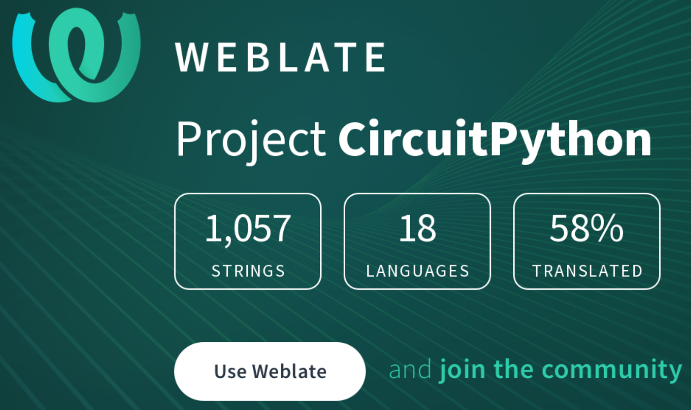](https://hosted.weblate.org/engage/circuitpython/)

One important feature of CircuitPython is translated control and error messages.

With the help of fellow open source project [Weblate](https://weblate.org/), we're making it even easier to add or improve translations.

Sign in with an existing account such as Github, Google or Facebook and start contributing through a simple web interface. No forks or pull requests needed!

As always, if you run into trouble join us on [Discord](https://adafru.it/discord), we're here to help.

## jobs.adafruit.com - Find a dream job, find great candidates!

[jobs.adafruit.com](https://jobs.adafruit.com/) has returned and folks are posting their skills (including CircuitPython) and companies are looking for talented makers to join their companies - from Digi-Key, to Hackaday, Microcenter, Raspberry Pi and more.

**Job of the Week**

Program Coordinator for FUSE, Northwestern University  - [Adafruit Jobs Board](https://jobs.adafruit.com/job/program-coordinator/).

## 27,913 thanks!

The Adafruit Discord community, where we do all our CircuitPython development in the open, reached over 27,913 humans, thank you!  Adafruit believes Discord offers a unique way for CircuitPython folks to connect. Join today at [https://adafru.it/discord](https://adafru.it/discord).

## ICYMI - In case you missed it

The wonderful world of Python on hardware! This is our Python video-newsletter-podcast! The news comes from the Python community, Discord, Adafruit communities and more and is reviewed on ASK an ENGINEER Wednesdays. The complete Python on Hardware weekly videocast [playlist is here](https://www.youtube.com/playlist?list=PLjF7R1fz_OOXRMjM7Sm0J2Xt6H81TdDev). 

This video podcast is on [iTunes](https://itunes.apple.com/us/podcast/python-on-hardware/id1451685192?mt=2), [YouTube](http://adafru.it/pohepisodes), [IGTV (Instagram TV](https://www.instagram.com/adafruit/channel/)), and [XML](https://itunes.apple.com/us/podcast/python-on-hardware/id1451685192?mt=2).

[Weekly community chat on Adafruit Discord server CircuitPython channel - Audio / Podcast edition](https://itunes.apple.com/us/podcast/circuitpython-weekly-meeting/id1451685016) - Audio from the Discord chat space for CircuitPython, meetings are usually Mondays at 2pm ET, this is the audio version on [iTunes](https://itunes.apple.com/us/podcast/circuitpython-weekly-meeting/id1451685016), Pocket Casts, [Spotify](https://adafru.it/spotify), and [XML feed](https://adafruit-podcasts.s3.amazonaws.com/circuitpython_weekly_meeting/audio-podcast.xml).

And lastly, we are working up a one-spot destination for all things podcast-able here - [podcasts.adafruit.com](https://podcasts.adafruit.com/)

## Codecademy "Learn Hardware Programming with CircuitPython"

Codecademy, an online interactive learning platform used by more than 45 million people, has teamed up with the leading manufacturer in STEAM electronics, Adafruit Industries, to create a coding course, "Learn Hardware Programming with CircuitPython". The course is now available in the [Codecademy catalog](https://www.codecademy.com/learn/learn-circuitpython?utm_source=adafruit&utm_medium=partners&utm_campaign=circuitplayground&utm_content=pythononhardwarenewsletter).

Python is a highly versatile, easy to learn programming language that a wide range of people, from visual effects artists in Hollywood to mission control at NASA, use to quickly solve problems. But you don’t need to be a rocket scientist to accomplish amazing things with it. This new course introduces programmers to Python by way of a microcontroller — CircuitPython — which is a Python-based programming language optimized for use on hardware.

CircuitPython’s hardware-ready design makes it easier than ever to program a variety of single-board computers, and this course gets you from no experience to working prototype faster than ever before. Codecademy’s interactive learning environment, combined with Adafruit's highly rated Circuit Playground Express, present aspiring hardware hackers with a never-before-seen opportunity to learn hardware programming seamlessly online.

Whether for those who are new to programming, or for those who want to expand their skill set to include physical computing, this course will have students getting familiar with Python and creating incredible projects along the way. By the end, students will have built their own bike lights, drum machine, and even a moisture detector that can tell when it's time to water a plant.

Visit Codecademy to access the [Learn Hardware Programming with CircuitPython](https://www.codecademy.com/learn/learn-circuitpython?utm_source=adafruit&utm_medium=partners&utm_campaign=circuitplayground&utm_content=pythononhardwarenewsletter) course and Adafruit to purchase a [Circuit Playground Express](https://www.adafruit.com/product/3333).

Codecademy has helped more than 45 million people around the world upgrade their careers with technology skills. The company’s online interactive learning platform is widely recognized for providing an accessible, flexible, and engaging experience for beginners and experienced programmers alike. Codecademy has raised a total of $43 million from investors including Union Square Ventures, Kleiner Perkins, Index Ventures, Thrive Capital, Naspers, Yuri Milner and Richard Branson, most recently raising its $30 million Series C in July 2016.

## Contribute!

The CircuitPython Weekly Newsletter is a CircuitPython community-run newsletter emailed every Tuesday. The complete [archives are here](https://www.adafruitdaily.com/category/circuitpython/). It highlights the latest CircuitPython related news from around the web including Python and MicroPython developments. To contribute, edit next week's draft [on GitHub](https://github.com/adafruit/circuitpython-weekly-newsletter/tree/gh-pages/_drafts) and [submit a pull request](https://help.github.com/articles/editing-files-in-your-repository/) with the changes. You may also tag your information on Twitter with #CircuitPython. 

Join our [Discord](https://adafru.it/discord) or [post to the forum](https://forums.adafruit.com/viewforum.php?f=60) for any further questions.
