- [X] Kattni updates
- [X] change date
- [ ] update title
- [ ] Feature story
- [X] Update  for images
- [X] Update ICYDNCI
- [ ] All images 550w max only
- [ ] Link "View this email in your browser."

News Sources

- [python.org](https://www.python.org/)
- [Python Insider - dev team blog](https://pythoninsider.blogspot.com/)

Template last updated on 2021-03-19 - Add PyOhio - Kattni

View this email in your browser.

Welcome to the latest Python on Microcontrollers newsletter, brought you by the community! We're on [Discord](https://discord.gg/HYqvREz), [Twitter](https://twitter.com/search?q=circuitpython&src=typed_query&f=live), and for past newsletters - [view them all here](https://www.adafruitdaily.com/category/circuitpython/). If you're reading this on the web, [subscribe here](https://www.adafruitdaily.com/). Let's get started!

## Linux 30th Anniversary!

Tux Turns 30! Join the Linux Foundation as they celebrate 30 Years of Linux with social media contests, event celebrations & more - [Linux Foundation](https://linuxfoundation.org/en/linux30th/) and [Twitter](https://twitter.com/linuxfoundation/status/1372623843425148929).

## Python Software Foundation Membership Drive

From the Python Software Foundation: "As we celebrate the PSF’s 20th and Python’s 30th anniversaries, we want to welcome everyone to become a PSF member. It’s important to us to have a membership that reflects our community. Everyone who uses and supports Python is invited to join us..." There are multiple membership levels available. The membership drive ends March 21, 2021. More - [Python.org](https://www.python.org/psf/membership/).

## CircuitPython Deep Dive Stream with Scott Shawcroft

[This week](https://www.youtube.com/watch?v=gG2S0H5DQaY), Scott streams his work on iMX RT flash.

You can see the latest video and past videos on the Adafruit YouTube channel under the Deep Dive playlist - [YouTube](https://www.youtube.com/playlist?list=PLjF7R1fz_OOXBHlu9msoXq2jQN4JpCk8A).

## News from around the web!

A larson scanner in CircuitPython using PWM on the blue LEDs of the [Cytron Maker Pi Pico](https://www.cytron.io/p-maker-pi-pico) with a serial-connected [Adafruit Feather nRF52840 Express](https://www.adafruit.com/product/4062) "daughterboard" providing the PWM audio - [YouTube](https://www.youtube.com/watch?v=x-4RPOtE9Lg).

Experience the joy of receiving your first radio signal with the ScoutMakes Bluetooth FM Radio Kit - [Tindie](https://blog.tindie.com/2021/03/scoutmakes-bluetooth-fm-radio-kit/).

A colored device that stores all your 2FA auths and types them for you - [Hackaday](https://hackaday.io/project/177593-picoth-2fa-auth-with-pi-pico) via [Reddit](https://www.reddit.com/r/RASPBERRY_PI_PROJECTS/comments/mcbzin/a_colored_device_that_stores_all_your_2fa_auths/).

[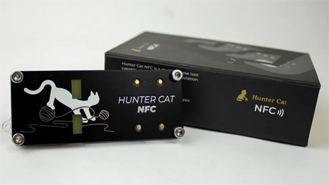](https://www.hackster.io/news/find-hidden-nfc-readers-with-the-new-hunter-cat-nfc-security-tool-8b01c5f71daa)

Emulate, read, write, and communicate between NFC devices with Electronic Cats' Hunter Cat NFC board - [Hackster](https://www.hackster.io/news/find-hidden-nfc-readers-with-the-new-hunter-cat-nfc-security-tool-8b01c5f71daa).

Create a low-res thermal camera with a Raspberry Pi Pico, an AMG8833 sensor and an ILI9341 screen with CircuitPython - [Recantha](https://www.recantha.co.uk/blog/?p=20959).

[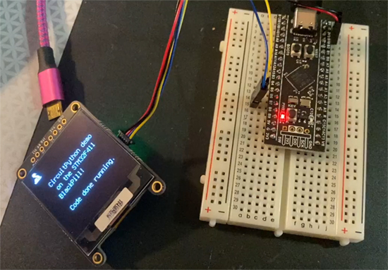](https://www.adafruit.com/product/4877)

These low cost "Black Pill" STM32F411 boards are a lovely upgrade to the STM32F401. With 512KB of flash and 128KB of RAM, this board has lots of GPIO for projects. And now you can use it without a toolchain or IDE setup - all by installing CircuitPython! Here we loaded the CircuitPython build on with STM32Cube and with a few lines of code have an OLED screen showing the REPL - [YouTube](https://www.youtube.com/watch?v=n23ACggHcg4) and [Adafruit](https://www.adafruit.com/product/4877).

DIY papier-mâché light up chirping dragon Easter eggs using Circuit Playground Express - [Instructables](https://www.instructables.com/Neopixel-Light-Up-Dragon-Eggs/) via [Twitter](https://twitter.com/caitlinsdad/status/1372770419346792455).

[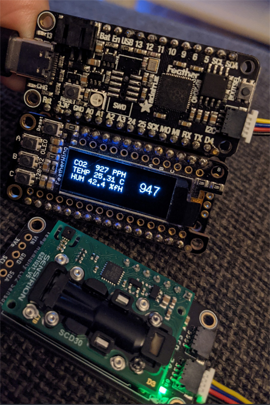](https://twitter.com/DavidGlaude/status/1375557719646740482?s=20)

A Feather RP2040, OLED FeatherWing, and an SCD-30 sensor with adjustable font sizes. Code is available on [GitHub](https://gist.github.com/dglaude/7f219a52b0ef1acdfc14024c98df71ec) - [Twitter](https://twitter.com/DavidGlaude/status/1375557719646740482?s=20).

Upgrade your AirLift firmware with your RP2040 using serial passthrough - [Adafruit Learn System](https://learn.adafruit.com/quickstart-raspberry-pi-rp2040-with-ble-and-circuitpython/upgrade-rp2040-airlift-firmware).

[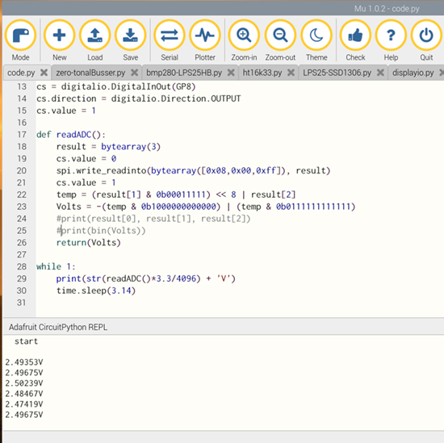](https://qiita.com/jamjam/items/6cf21b5ce96d4107d4fe)

Getting started with Raspberry Pi Pico, CircuitPython nad the MCP3304 (Japanese) - [Qiita.com](https://qiita.com/jamjam/items/6cf21b5ce96d4107d4fe).

[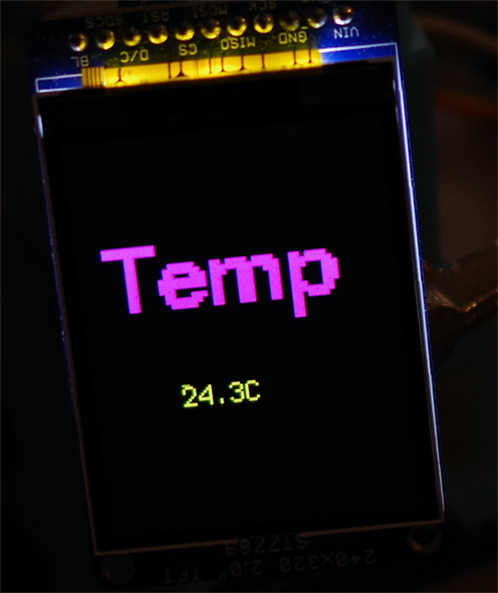](https://qiita.com/jamjam/items/b31ff80468ed7b0caba5)

Using an SPI connected TFT display with Raspberry Pi Pico and CircuitPython (Japanese) - [Qiita.com](https://qiita.com/jamjam/items/b31ff80468ed7b0caba5).

Using Raspberry Pi and a Python Server to send an image to an ESP32/MicroPython Client via WiFi TCP socket - [Blogspot](https://helloraspberrypi.blogspot.com/2021/03/raspberry-pipython-send-image-to.html).

How to install Python - [YouTube](https://www.youtube.com/watch?v=wpygl2YqNaY).

[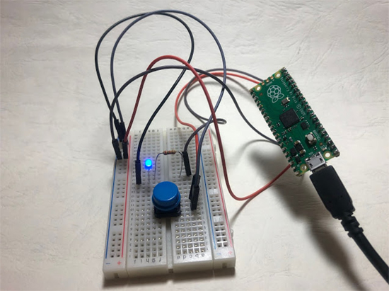](https://atceiling.blogspot.com/2021/03/raspberry-pi-pico2led.html)

Using a button to control an LED using Raspberry Pi Pico and MicroPython (Chinese) - [Blogspot](https://atceiling.blogspot.com/2021/03/raspberry-pi-pico2led.html).

Python Program To Implement Binary Search Tree Program 2: Insertion - [YouTube](https://www.youtube.com/watch?v=18YDhu9IFws).

cache: A really useful decorator in Python - [YouTube](https://www.youtube.com/watch?v=wI5sjJQotyI) via [Reddit](https://www.reddit.com/r/Python/comments/mdqv18/a_pretty_useful_decorator_in_python/).

Save your Python project as an executable file - [Medium](https://ryan-chou.medium.com/how-to-save-your-python-project-as-an-executable-file-218f923f622b).

How to use the Reddit API in Python - [YouTube](https://www.youtube.com/watch?v=FdjVoOf9HN4) via [Dev.to](https://dev.to/jamescalam/how-to-use-the-reddit-api-in-python-3oaf).

What is Python used for? - [Medium](https://spenceraqason.medium.com/what-is-python-used-for-1169055d9b7c).

Python tuples explained - [YouTube](https://www.youtube.com/watch?v=JFZkEagXnR8).

A little hot swap PCB for testing switches using the Adafruit QT Py or the Seeed Studio Xiao (and thanks to @CircuitPython can be used as a single key macro pad too) - [Twitter](https://twitter.com/andy_warb/status/1375069489067405319).

Converted code running on a Raspberry Pi Pico using CircuitPython and NeilRedRobotics Pico to Zero adapter for the interfacing duties - [Twitter](https://twitter.com/CannonFodder/status/1374846575512588290).

[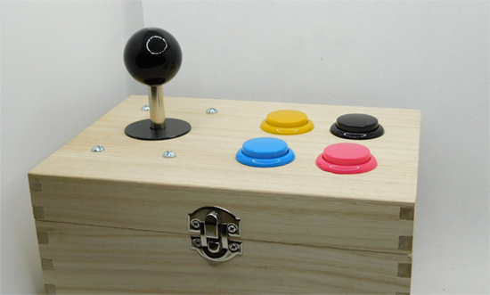](https://twitter.com/ben_everard/status/1374663976777318402)

Discovering the CircuitPython gamepad module to keep track of button presses for an arcade controller - [Twitter](https://twitter.com/ben_everard/status/1374663976777318402).

CircuitPython basic socket examples for interoperable TCP & UDP servers and clients using CircuitPython ESP32SPI, CircuitPython native sockets (@EspressifSystem ESP32-S2), and CPython - [GitHub](https://github.com/anecdata/Socket) via [Twitter](https://twitter.com/anecdat/status/1374529085746122752).

[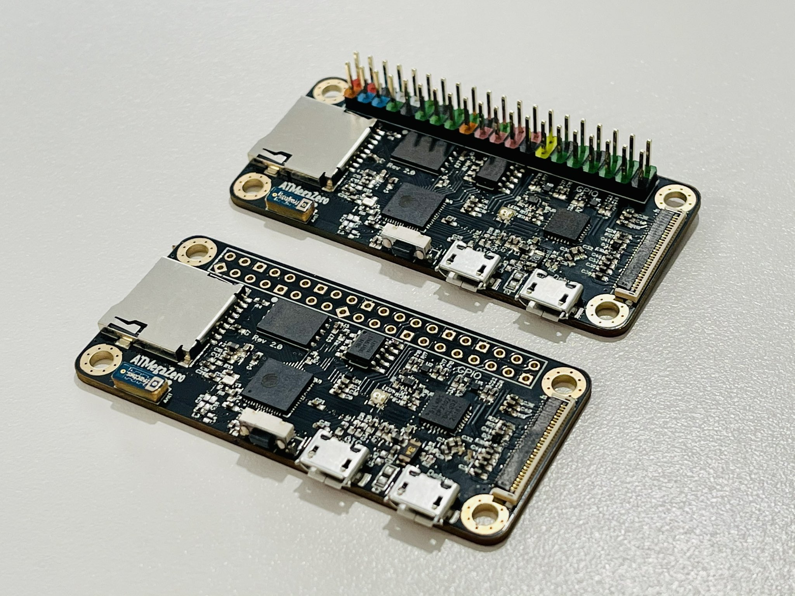](https://twitter.com/4hackrr/status/1374139947964305412)

The ATMega Zero ESP32-S2 prototypes arrived - [Twitter](https://twitter.com/4hackrr/status/1374139947964305412).

[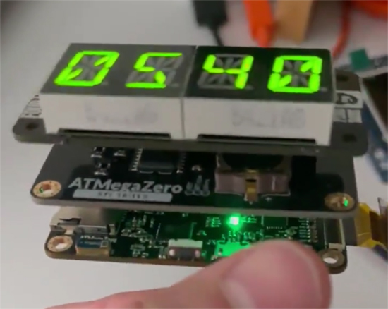](https://twitter.com/4hackrr/status/1374477544079069188)

A Pimoroni Four Letter PHat, ATMegaZero RTC shield and the new ATMegaZero ESP32-S2 microcontroller running CircuitPython - [Twitter](https://twitter.com/4hackrr/status/1374477544079069188).

[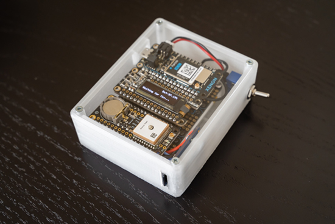](http://www.movingelectrons.net/blog/2019/04/03/Building-a-GPS-Logger-with-CircuitPython.html)

Building a standalone GPS data logger using CircuitPython - [MovingElectronics.net](http://www.movingelectrons.net/blog/2019/04/03/Building-a-GPS-Logger-with-CircuitPython.html) via [Twitter](https://twitter.com/_1enin_/status/1374073403787841538).

Custom keypad with RGB arcade buttons, Pimoroni RGB rotary encoder, Raspberry Pi Pico and CircuitPython - [Twitter](https://twitter.com/qbalsdon/status/1373595601997340674).

Using a Raspberry Pi Pico, an MPU-6050 and CircuitPython to use gesture to control a video game - [Tom's Hardware](https://www.tomshardware.com/uk/news/raspberry-pi-pico-tilt-controller).

A new nixie tube clock called the IV3 Clock, which builds on previous designs and is now available in a black and gold edition finish - [Geeky-Gadgets](https://www.geeky-gadgets.com/nixie-tube-clock-25-03-2021/).

[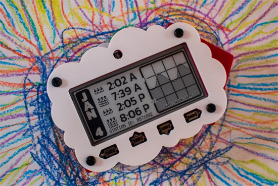](https://www.southernfriedscience.com/3-kid-friendly-steam-electronics-projects-that-harness-noaas-massive-public-databases/)

Three kid-friendly CircuitPython projects that make use of the NOAA databases - [Southern Fried Science](https://www.southernfriedscience.com/3-kid-friendly-steam-electronics-projects-that-harness-noaas-massive-public-databases/).

[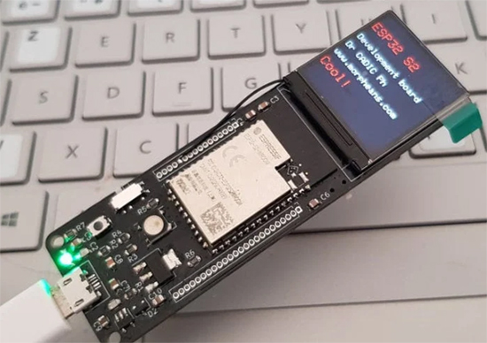](https://www.geeky-gadgets.com/esp32-s2-dev-board-25-11-2020/)

MorphESP 240 ESP32-S2 CircuitPython-compatible dev board - [Geeky Gadgets](https://www.geeky-gadgets.com/esp32-s2-dev-board-25-11-2020/).

[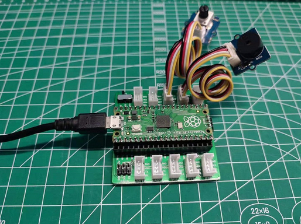](https://www.seeedstudio.com/blog/2021/03/26/10-raspberry-pi-pico-projects/)

Raspberry Pi Pico: 10 project ideas featuring the Grove shield - [Seeed Studio](https://www.seeedstudio.com/blog/2021/03/26/10-raspberry-pi-pico-projects/).

[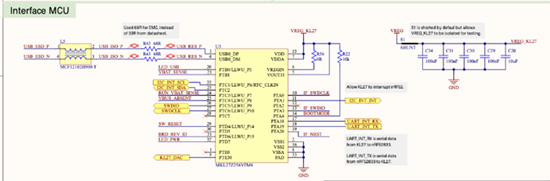](https://github.com/microbit-foundation/microbit-v2-hardware/blob/main/V2/MicroBit_V2.0.0_S_schematic.PDF)

micro:bit v2 schematic and BOM (bill of materials) released - [GitHub](https://github.com/microbit-foundation/microbit-v2-hardware/blob/main/V2/MicroBit_V2.0.0_S_schematic.PDF) and [GitHub](https://github.com/microbit-foundation/microbit-v2-hardware/blob/main/V2/Bill.of.Materials-BBC-microbit_V2.0.0.csv).

[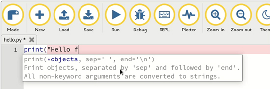](https://codewith.mu/en/download)

Mu Editor now supports micro:bit v2 - [Codewith.mu](https://codewith.mu/en/download).

[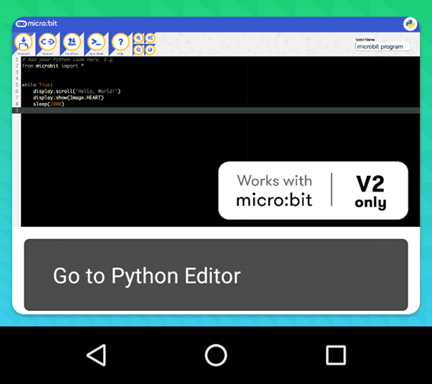](https://play.google.com/store/apps/details?id=com.samsung.microbit)

It is now possible to flash a MicroPython program to the micro:bit v2 via Bluetooth. Sign up to test the beta via the Play store listing - [Google](https://play.google.com/store/apps/details?id=com.samsung.microbit).

[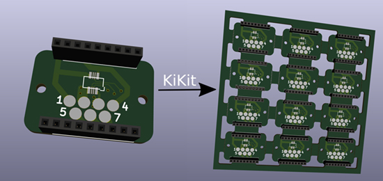](https://github.com/yaqwsx/KiKit)

KiKit is a Python library and CLI tool to automate several tasks in a standard KiCAD workflow - [GitHub](https://github.com/yaqwsx/KiKit).

PyWebIO provides a series of imperative functions to obtain user input and output on the browser, turning the browser into a "rich text terminal" - [GitHub](https://github.com/wang0618/PyWebIO).

Python Tutor helps people overcome a fundamental barrier to learning programming: understanding what happens as the computer runs each line of code - [PythonTutor.com](http://pythontutor.com/) via [GitHub](https://github.com/dadashek/OnlinePythonTutor).

The Python Package Index is now a GitHub secret scanning integrator - [GitHub](https://github.blog/changelog/2021-03-22-the-python-package-index-is-now-a-github-secret-scanning-integrator/).

Tensorflow Lite for microcontrollers in Micropython - [GitHub](https://github.com/mocleiri/tensorflow-micropython-examples).

Python-powered live energy monitor for P1 enabled electricity meter - [frederickvandenbosch](http://frederickvandenbosch.be/?p=3498).

Solving ‘Greater-than sudoku’ with python and z3 - [ca.rstenpresser.de](https://ca.rstenpresser.de/blag/2021/03/solving-greater-than-sudoku-with-python-and-z3/).

A modern version of KiteModeler from NASA Glenn written in Python - [Herokuapp.com](https://kite-modeler.herokuapp.com/) via [GitHub](https://github.com/gpavanb1/KiteModeler).

Build an Asteroids Game With Python and Pygame - [Real Python](https://realpython.com/asteroids-game-python/).

[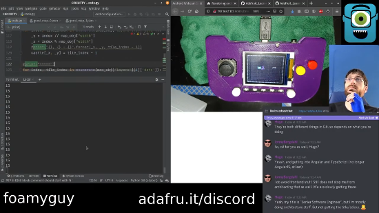](https://www.youtube.com/watch?v=mhJ4pyWRKWs)

3/27/21 Stream from CircuitPythonista FoamyGuy (Tim) covers work on Tiled game map files with CircuitPython- [YouTube](https://www.youtube.com/watch?v=mhJ4pyWRKWs).

Instructables Contest Notifier on MagTag, PyPortal, and Matrix Portal - [Instructables](https://www.instructables.com/Instructables-Contest-Notifier-3-Ways/).

PyDev of the Week: Yuxi (Hayden) Liu from [Mouse vs Python](https://www.blog.pythonlibrary.org/2021/03/29/pydev-of-the-week-yuxi-hayden-liu/)

CircuitPython Weekly Meeting for March 29th, 2021 [on YouTube](https://youtu.be/Jxt0lLwhVFg) notes [here](https://github.com/adafruit/adafruit-circuitpython-weekly-meeting/blob/master/2021/2021-03-29.md)

**#ICYDNCI What was the most popular, most clicked link, in [last week's newsletter](https://www.adafruitdaily.com/2021/03/23/python-on-microcontrollers-newsletter-circuitpython-6-2-0-beta-4-released-and-more-python-adafruit-circuitpython-micropython-thepsf/)? [Papermerge open source document management system](https://github.com/ciur/papermerge).**

## Coming soon

Rotary Encoder + Trinket M0 + USB Key PCB = Rotary Trinkey. Running a SAMD21E18, this tiny CircuitPython/Arduino USB key-type PCB only does one thing: connect a rotary encoder over USB. And that's what this does. - [Twitter](https://twitter.com/adafruit/status/1374100709709385729).

We're playing around, testing things on the upcoming [Metro M7](https://www.adafruit.com/product/4950). This time we're doing a TFT shield demo to test out displayio and our ILI9341 driver. We made a fun bouncing DVD demo with transparent pixels. Our code allows a dynamic number of DVD logos for bouncing pleasure. Mostly this is us seeing how a 500 MHz processor feels with CircuitPython! Still lots to do, but this code is working pretty well, no crashing. - [YouTube](https://www.youtube.com/watch?v=Hb5Yj9iPYYk).

## New Boards Supported by CircuitPython

The number of supported microcontrollers and Single Board Computers (SBC) grows every week. This section outlines which boards have been included in CircuitPython or added to [CircuitPython.org](https://circuitpython.org/).

This week we had X new boards added!

- [Unexpected Maker Tiny S2](https://circuitpython.org/board/unexpectedmaker_tinys2/)

Looking to add a new board to CircuitPython? It's highly encouraged! Adafruit has four guides to help you do so:

- [How to Add a New Board to CircuitPython](https://learn.adafruit.com/how-to-add-a-new-board-to-circuitpython/overview)
- [How to add a New Board to the circuitpython.org website](https://learn.adafruit.com/how-to-add-a-new-board-to-the-circuitpython-org-website)
- [Adding a Single Board Computer to PlatformDetect for Blinka](https://learn.adafruit.com/adding-a-single-board-computer-to-platformdetect-for-blinka)
- [Adding a Single Board Computer to Blinka](https://learn.adafruit.com/adding-a-single-board-computer-to-blinka)

## New Learn Guides!

[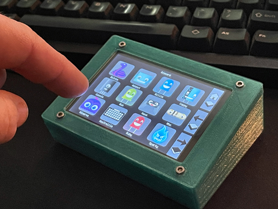](https://learn.adafruit.com/guides/latest)

[Touch Deck: DIY Customizable TFT Control Pad](https://learn.adafruit.com/touch-deck-diy-tft-customized-control-pad) from [John Park](https://learn.adafruit.com/users/johnpark)

[Black Lives Matter Education & Workshop Kit](https://learn.adafruit.com/black-lives-matter-badge) from [Ladyada](https://learn.adafruit.com/users/adafruit2)

[Adafruit MagTag COVID Vaccination Percent Tracker](https://learn.adafruit.com/adafruit-magtag-covid-vaccination-percent-tracker) from [Dylan Herrada](https://learn.adafruit.com/users/dherrada)

## Updated Learn Guides!

[Creating and sharing a CircuitPython library](https://learn.adafruit.com/creating-and-sharing-a-circuitpython-library) from [Scott Shawcroft](https://learn.adafruit.com/users/tannewt)

## CircuitPython Libraries!

CircuitPython support for hardware continues to grow. We are adding support for new sensors and breakouts all the time, as well as improving on the drivers we already have. As we add more libraries and update current ones, you can keep up with all the changes right here!

For the latest libraries, download the [Adafruit CircuitPython Library Bundle](https://circuitpython.org/libraries). For the latest community contributed libraries, download the [CircuitPython Community Bundle](https://github.com/adafruit/CircuitPython_Community_Bundle/releases).

If you'd like to contribute, CircuitPython libraries are a great place to start. Have an idea for a new driver? File an issue on [CircuitPython](https://github.com/adafruit/circuitpython/issues)! Have you written a library you'd like to make available? Submit it to the [CircuitPython Community Bundle](https://github.com/adafruit/CircuitPython_Community_Bundle). Interested in helping with current libraries? Check out the [CircuitPython.org Contributing page](https://circuitpython.org/contributing). We've included open pull requests and issues from the libraries, and details about repo-level issues that need to be addressed. We have a guide on [contributing to CircuitPython with Git and Github](https://learn.adafruit.com/contribute-to-circuitpython-with-git-and-github) if you need help getting started. You can also find us in the #circuitpython channel on the [Adafruit Discord](https://adafru.it/discord).

You can check out this [list of all the Adafruit CircuitPython libraries and drivers available](https://github.com/adafruit/Adafruit_CircuitPython_Bundle/blob/master/circuitpython_library_list.md). 

The current number of CircuitPython libraries is **307**!

**Updated Libraries!**

Here's this week's updated CircuitPython libraries:

 * [Adafruit_CircuitPython_BNO08x](https://github.com/adafruit/Adafruit_CircuitPython_BNO08x)
 * [Adafruit_CircuitPython_LTR390](https://github.com/adafruit/Adafruit_CircuitPython_LTR390)
 * [Adafruit_CircuitPython_datetime](https://github.com/adafruit/Adafruit_CircuitPython_datetime)
 * [Adafruit_CircuitPython_Logging](https://github.com/adafruit/Adafruit_CircuitPython_Logging)
 * [Adafruit_CircuitPython_Motor](https://github.com/adafruit/Adafruit_CircuitPython_Motor)
 * [Adafruit_CircuitPython_Bitmap_Font](https://github.com/adafruit/Adafruit_CircuitPython_Bitmap_Font)
 * [Adafruit_CircuitPython_Display_Text](https://github.com/adafruit/Adafruit_CircuitPython_Display_Text)
 * [Adafruit_CircuitPython_BLE_Cycling_Speed_and_Cadence](https://github.com/adafruit/Adafruit_CircuitPython_BLE_Cycling_Speed_and_Cadence)
 * [Adafruit_CircuitPython_MIDI](https://github.com/adafruit/Adafruit_CircuitPython_MIDI)
 * [Adafruit_CircuitPython_EMC2101](https://github.com/adafruit/Adafruit_CircuitPython_EMC2101)
 * [Adafruit_CircuitPython_ESP32SPI](https://github.com/adafruit/Adafruit_CircuitPython_ESP32SPI)
 * [Adafruit_CircuitPython_FeatherWing](https://github.com/adafruit/Adafruit_CircuitPython_FeatherWing)
 * [Adafruit_CircuitPython_HID](https://github.com/adafruit/Adafruit_CircuitPython_HID)
 * [Adafruit_CircuitPython_TLC5947](https://github.com/adafruit/Adafruit_CircuitPython_TLC5947)
 * [Adafruit_CircuitPython_TLV493D](https://github.com/adafruit/Adafruit_CircuitPython_TLV493D)
 * [Adafruit_CircuitPython_CAP1188](https://github.com/adafruit/Adafruit_CircuitPython_CAP1188)
 * [Adafruit_CircuitPython_ImageLoad](https://github.com/adafruit/Adafruit_CircuitPython_ImageLoad)
 * [Adafruit_CircuitPython_PIOASM](https://github.com/adafruit/Adafruit_CircuitPython_PIOASM)
 * [Adafruit_CircuitPython_DisplayIO_Layout](https://github.com/adafruit/Adafruit_CircuitPython_DisplayIO_Layout)
 * [Adafruit_Python_PlatformDetect](https://github.com/adafruit/Adafruit_Python_PlatformDetect)
 * [CircuitPython_Community_Bundle](https://github.com/adafruit/CircuitPython_Community_Bundle)

## What’s the team up to this week?

What is the team up to this week? Let’s check in!

**Dan**

I released CircuitPython 6.2.0-beta.4 on March 18. This version is close to what we want in the final 6.2.0. There are few more fixes we'd like to get in, but the next release is likely to be a release candidate.

When we make releases, we reorder the boards on [circuitpython.org](https://circuitpython.org) in order of most frequently downloaded. We've been doing this in only a semi-automated way: the process includes downloading tens or hundreds of thousands of log files from Amazon S3, and then running a script. I explored some other services available on Amazon Web Services, and found that I could enable fancier logging and then run SQL queries against those logs directly on AWS. I have experimented with this and it's working well. This is very far afield from embedded programming but is an interesting diversion for me.

**Jeff**

Work continues on support for the i.MX series of microcontrollers, which will be in the upcoming Metro M7 RT1011 board.

Right now I'm concentrating on the SPI peripheral. The next enhancement I'll work on is to use "DMA" to speed up busio.SPI. Without this, there are long delays between each byte of data that greatly limit the total throughput and which can also make displayio update slowly.

Logic analyzer capture of the SCK line showing a multi-microsecond pause between bytes:

**Kattni**

This week I published the Python for Microcontrollers newsletter for the first time without Anne's excellent assistance. She trained me up over the past few weeks, and helped a lot with content for the recent newsletter. This newsletter is my first one completely solo. I hope I have managed to keep it up to expectations!

In product-guide-land, I published the [Adafruit CYBERDECK Hat and Bonnet guide](https://learn.adafruit.com/cyberdeck-bonnet-and-hat/pinouts) and the [Adafruit MIDI FeatherWing guide](https://learn.adafruit.com/adafruit-midi-featherwing) this week, though the FeatherWing guide was done up a while ago. If you're looking to get started with either product, check out these guides for details.

Otherwise, I'm continuing to work on creating templates for the CircuitPython Essentials guide so we can include them in the CircuitPython-compatible microcontroller guides and have a much smoother, more tailored experience for folks who are getting started with CircuitPython. I have two templates completed, and am working on a third. None of the CircuitPython template pages are published yet, so I don't have an example for you. I will soon!

**Lucian**

This past week I finally pinned down and made a big todo list of the remaining issues I was having with the low power module, including a couple redundant parts of the API, issues with how reset impacts write protection on the STM32's clock, and conflicts within how Circuitpython decides whether it will enter "real" deep sleep (the true low power mode) and "fake" deep sleep (where it avoids disconnecting from USB). 

I also reviewed incoming modules for low power on NRF, AudioPWMIO, and some miscellaneous bugfixes to UDP sockets and the SPI sharing system used on the Meowbit. I'm hoping I'll be all through the current NRF/STM32 sleep projects this week, so I can start work on RP2040 sleep - having these three ports, plus the ESP32-S2, should be a good foundation for our next major version.

**Melissa**

This week, I got familiar with the inner workings of the bundle releases and made a 2-part dynamic bundler. First I added some code that generates a JSON file that contains all of the information in the Bundle. It is currently being attached as part of a release. This includes all of the dependency information.

The other part of this is a JavaScript application that allows you to specify the libraries that you would like included. It then downloads the JSON file, figures out the dependencies of the libraries that you would like, downloads the release bundle, extracts the files that you want in your dynamic bundle and repackages everything up into its own zip file and initiates a download. When I started, I knew it was theoretically possible, but was pleased to see it all working.

One of the issues I ran into was a Cross-Origin Resource Sharing policy limitation. The problem is when trying to download GitHub release assets, it doesn't like it if the domains don't match, even if using GitHub pages. I was temporarily able to work around this by using a CORS proxy, but this isn't a good long term solution. I am currently looking into more reliable methods such as using Amazon S3.

**Scott**

This week I wrapped up the RP2040 flash settings changes. Overall, I'm really happy with how it turned out. I'm wrapping up RP2040 work this week by looking at a couple bugs and then will be moving to iMX RT briefly to bring the flash config there as well. It's forcing a bit more of an expansion because both CircuitPython and TinyUF2 have the iMX RT flash config in it.

After that, I'll be moving to nRF work for BLE workflow and collaborating with Trevor who will be doing the iOS side. I'm very excited to start on it but a bit daunted by all the work I want to do. It'll be nice to work with someone else to help focus where to start.

## Upcoming events!

The 2021 Open Hardware summit will be held online, Friday April 9, 2021. The summit will be livestreamed, but ticket holders will have access to additional interactive portions of the summit like meet-and-greets, workshops, and sponsor booths. Find details, including ticket and sponsorship information at [2021.oshwa.org](https://2021.oshwa.org/) - [OSHWA](https://www.oshwa.org/2020/11/16/announcing-the-2021-open-hardware-summit/).

The online GeoPython conference is focused on Python and Geo, its toolkits and applications. April 22-23, 2021 - [https://2021.geopython.net/](https://2021.geopython.net/).

PyCon US, the annual official annual Python gathering, has been announced to be held online May 12-15, 2021. Sprints will be held May 16-18, 2021. More information and signups at [https://us.pycon.org/2021/](https://us.pycon.org/2021/)

EuroPython, the largest conference for the Python programming language in Europe, has been announced to be held online July 26 - August 1, 2021. More information at [https://ep2021.europython.eu/](https://ep2021.europython.eu/)

Call for proposals for PyOhio 2021 runs from March 15 - April 19, 2021 with the free event on July 31, 2021- [PyOhio.org](https://www.pyohio.org/2021/) via [Twitter](https://twitter.com/PyOhio/status/1370184124460367881).

**Send Your Events In**

As for other events, with the COVID pandemic, most in-person events are postponed or cancelled. If you know of virtual events or events that may occur in the future, please let us know on Discord or on Twitter with hashtag #CircuitPython.

## Latest releases

CircuitPython's stable release is [6.1.0](https://github.com/adafruit/circuitpython/releases/latest) and its unstable release is [6.2.0-beta.4](https://github.com/adafruit/circuitpython/releases). New to CircuitPython? Start with our [Welcome to CircuitPython Guide](https://learn.adafruit.com/welcome-to-circuitpython).

[20210329](https://github.com/adafruit/Adafruit_CircuitPython_Bundle/releases/latest) is the latest CircuitPython library bundle.

[v1.14](https://micropython.org/download) is the latest MicroPython release. Documentation for it is [here](http://docs.micropython.org/en/latest/pyboard/).

[3.9.2](https://www.python.org/downloads/) is the latest Python release. The latest pre-release version is [3.10.0a6](https://www.python.org/download/pre-releases/).

[2,358 Stars](https://github.com/adafruit/circuitpython/stargazers) Like CircuitPython? [Star it on GitHub!](https://github.com/adafruit/circuitpython)

## Call for help -- Translating CircuitPython is now easier than ever!

[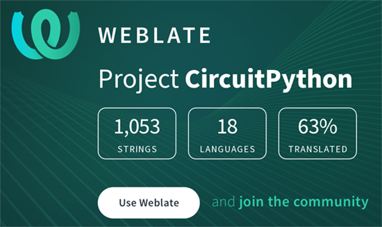](https://hosted.weblate.org/engage/circuitpython/)

One important feature of CircuitPython is translated control and error messages.

With the help of fellow open source project [Weblate](https://weblate.org/), we're making it even easier to add or improve translations.

Sign in with an existing account such as Github, Google or Facebook and start contributing through a simple web interface. No forks or pull requests needed!

As always, if you run into trouble join us on [Discord](https://adafru.it/discord), we're here to help.

## jobs.adafruit.com - Find a dream job, find great candidates!

[jobs.adafruit.com](https://jobs.adafruit.com/) has returned and folks are posting their skills (including CircuitPython) and companies are looking for talented makers to join their companies - from Digi-Key, to Hackaday, Microcenter, Raspberry Pi and more.

**Job of the Week**

Makerspace STEAM Instructor - MacInspires Makerspace is searching for STEAM teachers for grades 1-5 to work in their Chelsea, Manhattan and Mamaroneck, New York locations - [Adafruit Jobs Board](https://jobs.adafruit.com/job/steam-instructor/).

## 28301 thanks!

The Adafruit Discord community, where we do all our CircuitPython development in the open, reached over 28301 humans, thank you!  Adafruit believes Discord offers a unique way for CircuitPython folks to connect. Join today at [https://adafru.it/discord](https://adafru.it/discord).

## ICYMI - In case you missed it

The wonderful world of Python on hardware! This is our Python video-newsletter-podcast! The news comes from the Python community, Discord, Adafruit communities and more and is reviewed on ASK an ENGINEER Wednesdays. The complete Python on Hardware weekly videocast [playlist is here](https://www.youtube.com/playlist?list=PLjF7R1fz_OOXRMjM7Sm0J2Xt6H81TdDev). 

This video podcast is on [iTunes](https://itunes.apple.com/us/podcast/python-on-hardware/id1451685192?mt=2), [YouTube](http://adafru.it/pohepisodes), [IGTV (Instagram TV](https://www.instagram.com/adafruit/channel/)), and [XML](https://itunes.apple.com/us/podcast/python-on-hardware/id1451685192?mt=2).

[Weekly community chat on Adafruit Discord server CircuitPython channel - Audio / Podcast edition](https://itunes.apple.com/us/podcast/circuitpython-weekly-meeting/id1451685016) - Audio from the Discord chat space for CircuitPython, meetings are usually Mondays at 2pm ET, this is the audio version on [iTunes](https://itunes.apple.com/us/podcast/circuitpython-weekly-meeting/id1451685016), Pocket Casts, [Spotify](https://adafru.it/spotify), and [XML feed](https://adafruit-podcasts.s3.amazonaws.com/circuitpython_weekly_meeting/audio-podcast.xml).

And lastly, we are working up a one-spot destination for all things podcast-able here - [podcasts.adafruit.com](https://podcasts.adafruit.com/)

## Contribute!

The CircuitPython Weekly Newsletter is a CircuitPython community-run newsletter emailed every Tuesday. The complete [archives are here](https://www.adafruitdaily.com/category/circuitpython/). It highlights the latest CircuitPython related news from around the web including Python and MicroPython developments. To contribute, edit next week's draft [on GitHub](https://github.com/adafruit/circuitpython-weekly-newsletter/tree/gh-pages/_drafts) and [submit a pull request](https://help.github.com/articles/editing-files-in-your-repository/) with the changes. You may also tag your information on Twitter with #CircuitPython. 

Join our [Discord](https://adafru.it/discord) or [post to the forum](https://forums.adafruit.com/viewforum.php?f=60) for any further questions.
