- [X] Kattni updates
- [ ] change date
- [ ] update title
- [ ] Feature story
- [ ] Update  for images
- [ ] Update ICYDNCI
- [ ] All images 550w max only
- [ ] Link "View this email in your browser."

News Sources

- [python.org](https://www.python.org/)
- [Python Insider - dev team blog](https://pythoninsider.blogspot.com/)

View this email in your browser.

Welcome to the latest Python on Microcontrollers newsletter, brought you by the community! We're on [Discord](https://discord.gg/HYqvREz), [Twitter](https://twitter.com/search?q=circuitpython&src=typed_query&f=live), and for past newsletters - [view them all here](https://www.adafruitdaily.com/category/circuitpython/). If you're reading this on the web, [subscribe here](https://www.adafruitdaily.com/). Let's get started!

## The Adafruit Learn System Project Bundle

New in the Adafruit Learn System: Project Bundles! Gone are the days of digging through the Adafruit CircuitPython Library Bundle to find the libraries you need. You can now easily download the code, libraries, and any images, sounds and so on, in one zip file. 

Ladyada discusses it on last weekend's [Desk of Ladyada](https://www.youtube.com/watch?v=hDlh4BuvJ-g) live stream!

[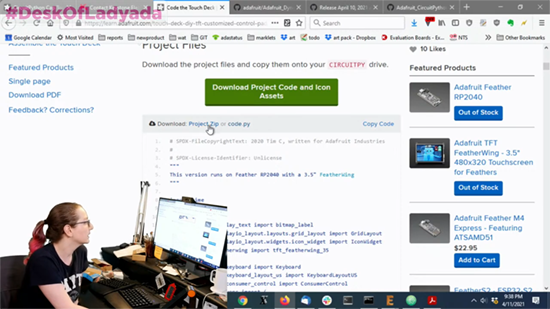](https://learn.adafruit.com/)

**To use the Project Bundle:**

Above any embedded code in a guide in the Adafruit Learn System, you'll find a Project Zip link.

Click the link to download the Project Bundle zip.

Open the Project Bundle zip to find the example code, all necessary libraries, and, if available, any images, sounds, etc.

[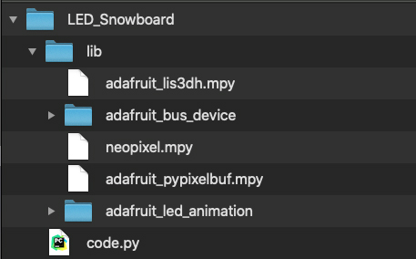](https://learn.adafruit.com/)

Simply copy all the files over to your CIRCUITPY drive, and you're ready to go!

Check it out in a guide in the [Adafruit Learn System](https://learn.adafruit.com/)!

This feature is still new, so there may be changes to how it works in the near future. For example, we intend to make the link more obvious.

If you run into any problems or bugs, or would like to submit feedback, please [file an issue](https://github.com/adafruit/Adafruit_Learning_System_Guides/issues) on the Adafruit Learning System Guides GitHub repo.

## Hackster Café Featuring Thea Flowers

CircuitPythonista Thea Flowers is interviewed in this episode of Hackster Café. Thea creates brilliant [synth modules and accessories](https://winterbloom.com/), some of which can be programmed using CircuitPython! Check out the full interview on [YouTube](https://www.youtube.com/watch?v=v3JmONl0-m8).

## CircuitPython Deep Dive Stream with Scott Shawcroft

[This week](http://www.youtube.com/watch?v=7djiPZU85OY), Scott streams his work on BLE file transfer.

You can see the latest video and past videos on the Adafruit YouTube channel under the Deep Dive playlist - [YouTube](https://www.youtube.com/playlist?list=PLjF7R1fz_OOXBHlu9msoXq2jQN4JpCk8A).

## News from around the web!

You can make smooth graphics animations using displayio and the Adafruit_Displayio_Layout widget “easing” functions - [Twitter](https://twitter.com/CycleMatch/status/1379532480106090501?s=20).

Eight rotary encoders with switches wired up to Pico with no extra hardware, supported by CircuitPython - [Twitter](https://twitter.com/todbot/status/1379171148353576961?s=19).

Building a Raspberry Pi Pico videoconference controller running CircuitPython - [Electromaker](https://www.electromaker.io/project/view/pi-pico-videoconference-controller).

CircuitPython_Schedule allows the programmer to use a functional syntax to run jobs at custom time intervals - [GitHub.io](https://cognitivegears.github.io/CircuitPython_Schedule/) and [PyPI](https://pypi.org/project/circuitpython-schedule/).

[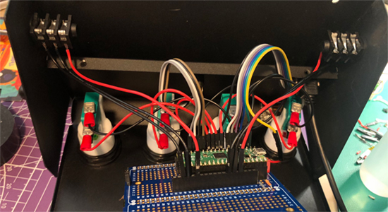](https://twitter.com/_nitz/status/1380322686249926657)

A sock-friendly, CircuitPython-powered Pico-based kick keyboard - [Twitter](https://twitter.com/_nitz/status/1380322686249926657).

Build a prank project with HID device using Raspberry Pi Pico and CircuitPython - [Element14](https://www.element14.com/community/community/project14/cheerusup/blog/2021/04/06/prank-with-hid-device-emulated-by-raspberry-pi-pico).

CircuitPython in one video - [YouTube](https://www.youtube.com/watch?v=opes_7Uf49U).

How to add W5500 ethernet to a Raspberry Pi Pico using CircuitPython - [Hackster](https://www.hackster.io/bjnhur/how-to-add-w5500-ethernet-to-raspberry-pi-pico-python-c7340c).

[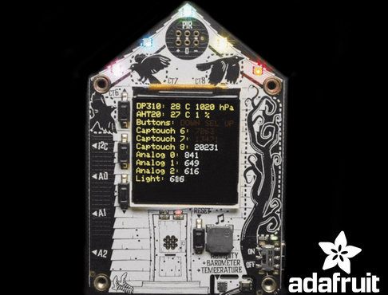](https://www.makeuseof.com/adafruit-funhouse-dev-board/)

Adafruit's FunHouse is a home shaped automator - [Make Use Of](https://www.makeuseof.com/adafruit-funhouse-dev-board/).

Raspberry Pi Pico Guitar Hero controller is ready to rock - [Tom's Hardware](https://www.tomshardware.com/news/raspberry-pi-pico-guitar-hero-controller).

Pico Phone runs CircuitPython - [Hackster](https://www.hackster.io/diy-champs/pico-phone-c0f1eb).

[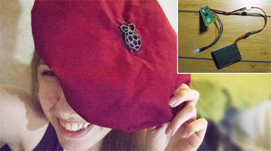](https://www.tomshardware.com/how-to/raspberry-pi-pico-beret)

How to make a Raspberry Pi Pico LED Beret - [Tom's Hardware](https://www.tomshardware.com/how-to/raspberry-pi-pico-beret).

[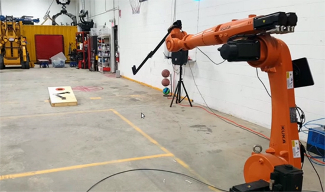](https://hackaday.com/2021/04/04/cheat-at-cornhole-with-a-bazillion-dollar-robot/)

Cheat at cornhole with a bazillion dollar robot - [Hackaday](https://hackaday.com/2021/04/04/cheat-at-cornhole-with-a-bazillion-dollar-robot/).

[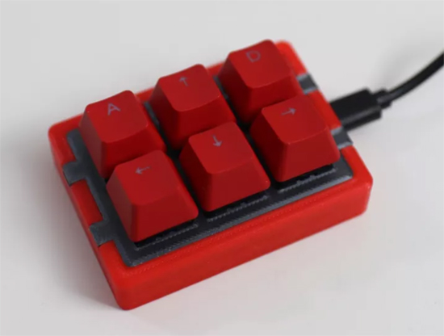](https://www.tomshardware.com/how-to/raspberry-pi-pico-powered-stream-deck)

Raspberry Pi Pico-powered stream deck keypad - [Tom's Hardware](https://www.tomshardware.com/how-to/raspberry-pi-pico-powered-stream-deck).

Cat zoom demo with the Neo Trinkey running CircuitPython - [Twitter](https://twitter.com/BlitzCityDIY/status/1380285761455554568).

[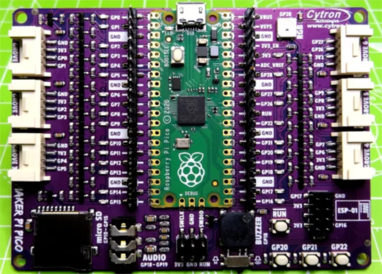](https://www.tomshardware.com/uk/reviews/cytron-maker-pi-pico)

Cytron Maker Pi Pico works with CircuitPython - [Tom's Hardware](https://www.tomshardware.com/uk/reviews/cytron-maker-pi-pico).

[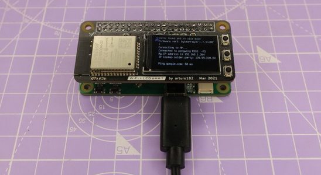](https://twitter.com/arturo182/status/1380324491759345666)

WiFi + LCD pHAT running CircuitPython - [Twitter](https://twitter.com/arturo182/status/1380324491759345666).

This Eurorack module uses PWM to generate CV, programmed with CircuitPython - [Twitter](https://twitter.com/todbot/status/1379980848611479552).

[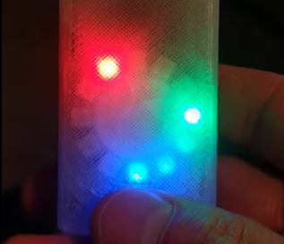](https://twitter.com/imhavoc/status/1379485465082880001)

A fob watch with a NeoPixel ring, RTC and running CircuitPython - [Twitter](https://twitter.com/imhavoc/status/1379485465082880001).

[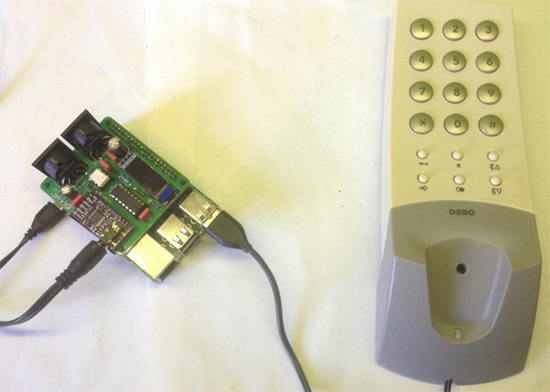](https://twitter.com/diyelectromusic/status/1379109059715067906)

A Vintage Phone as a USB MIDI Controller, with CircuitPython on a Raspberry Pi Pico - [Twitter](https://twitter.com/diyelectromusic/status/1379109059715067906).

Coming soon: a DIY bot running CircuitPython - [Twitter](https://twitter.com/MJ_BIO/status/1379099269127364608).

Raspberry Pi Pico running the much-friendlier CircuitPython - [Twitter](https://twitter.com/patxangas/status/1379041515629076482).

[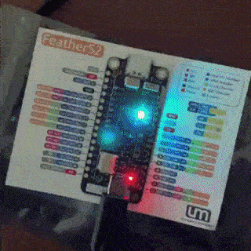](https://twitter.com/molecularist/status/1378845711622676481)

ESP32-S2 and CircuitPython come together on FeatherS2 - [Twitter](https://twitter.com/molecularist/status/1378845711622676481).

[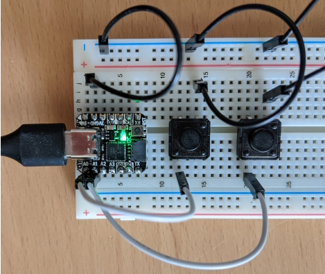](http://www.ericsbinaryworld.com/2021/04/04/programming-projects-march-2021/)

March 2021 programming projects including CircuitPython - [Eric's Binary World](http://www.ericsbinaryworld.com/2021/04/04/programming-projects-march-2021/).

Programming the Raspberry Pi Pico using CircuitPython in Thonny - [Twitter](https://twitter.com/abigmanrunning/status/1378460395929808897).

[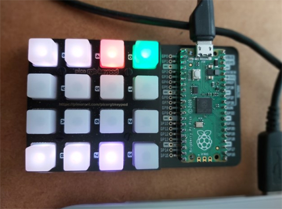](https://piamble.wordpress.com/2021/04/03/raspberry-pico-rgb-keypad-stream-deck/)

Raspberry Pi Pico stream deck using Pimoroni RGB keypad - [piamble.wordpress](https://piamble.wordpress.com/2021/04/03/raspberry-pico-rgb-keypad-stream-deck/).

[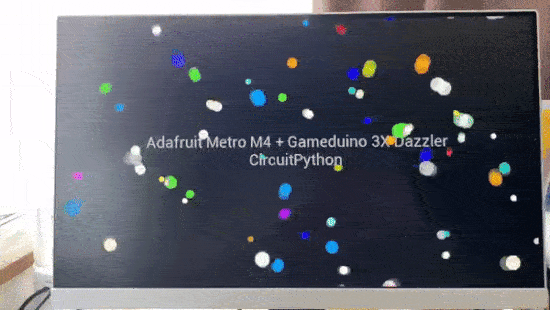](https://twitter.com/AoyamaProd/status/1378248864466001920)

99 circles demo with Adafruit Metro M4, Gameduino 3X Dazzler and CircuitPython - [Twitter](https://twitter.com/AoyamaProd/status/1378248864466001920).

[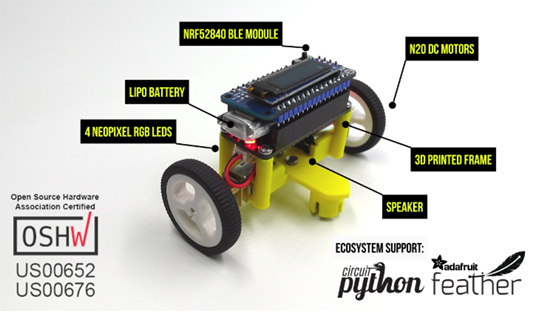](https://www.crowdsupply.com/tinkeringtech/scoutmakes-bluetooth-fun)

ScoutMakes Bluetooth Fun: open source, CircuitPython-compatible, Bluetooth-enabled STEM electronics kits - [Crowd Supply](https://www.crowdsupply.com/tinkeringtech/scoutmakes-bluetooth-fun).

Science project using Feather RP2040 and two servos, running CircuitPython - [Twitter](https://twitter.com/Kwalseth/status/1377991060484280321).

[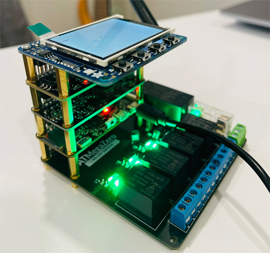](https://twitter.com/4hackrr/status/1377739644134117379)

Testing the ATMega0 Relay Shield - [Twitter](https://twitter.com/4hackrr/status/1377739644134117379).

Jurigged lets you update your code while it runs - [GitHub](https://github.com/breuleux/jurigged).

[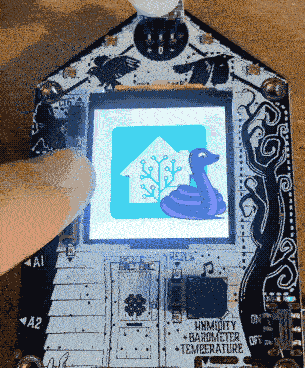](https://github.com/wifijt/Funhouse_home_asistant_light_control)

A first project with FunHouse: a Home Assistant light control - [GitHub](https://github.com/wifijt/Funhouse_home_asistant_light_control).

[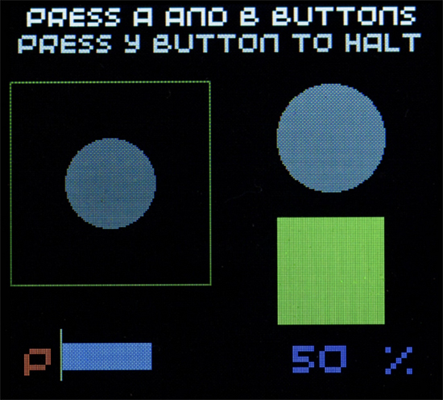](https://www.raspberrypi.org/blog/graphic-routines-for-raspberry-pi-pico-screens/)

Graphics routines for Raspberry Pi Pico Screens using MicroPython - [Raspberry Pi](https://www.raspberrypi.org/blog/graphic-routines-for-raspberry-pi-pico-screens/).

Remake of Manic Miner's collapsing platforms in this PyGameZero example - [Raspberry Pi](https://www.raspberrypi.org/blog/remake-manic-miners-collapsing-platforms-wireframe-49/).

Completing a cosplay with CircuitPython-powered wings - [Twitter](https://twitter.com/littlejem4/status/1381221958323437569).

Monday Microcontroller: A first look at Neo Trinkey - [YouTube](https://www.youtube.com/watch?v=kMTwyzl-uxw) via [bigl.es](https://bigl.es/monday-microcontroller-adafruit-neotrinkey/).

[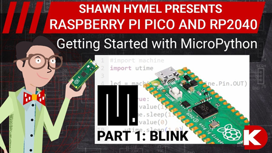](https://www.youtube.com/watch?v=JCk9QaCH5QU)

Intro to Raspberry Pi Pico and MicroPython Part 1: Blink - [YouTube](https://www.youtube.com/watch?v=JCk9QaCH5QU).

Raspberry Pi Zero W turns iPod Classic into Spotify music player - [GitHub](https://github.com/dtcooper/raspotify) via [Raspberry Pi](https://www.raspberrypi.org/blog/raspberry-pi-zero-w-turns-ipod-classic-into-spotify-music-player/).

The story of Xenia, the other Linux mascot - [Xenia-Linux-site.glitch](https://xenia-linux-site.glitch.me/) and [YouTube](https://www.youtube.com/watch?v=0b4eW1KAuWE) via [Adafrut Blog](https://blog.adafruit.com/2021/04/11/the-story-of-xenia-linuxs-forgotten-mascot/).

A Python 3 cheat sheet - [Twitter](https://twitter.com/Prathkum/status/1380243778951208961).

A list of Python books in English that are free to read or download - [GitHub](https://github.com/pamoroso/free-python-books).

CALM #30, including some history of MicroPython and CircuitPython - [YouTube](https://www.youtube.com/watch?v=VUeUSr9NPqs).

The k-Nearest Neighbors (kNN) Algorithm in Python - [Real Python](https://realpython.com/knn-python/).

Python vs Java: Object Oriented Programming - [Real Python](https://realpython.com/courses/python-vs-java-object-oriented-programming/).

A review of the Pimoroni Pico Explorer Base - [Blogdot](https://www.blogdot.tv/review-pico-explorer-base/).

A "simple" bot with laser beams and lots of stuff running Python on a Pi ZeroW - [Hackster](https://www.hackster.io/dingo27mobile/lidar-bot-0-1-a3a2a6).

No Python Interpreter? This simple RAT installes its own copy - [sans.edu](https://isc.sans.edu/forums/diary/No+Python+Interpreter+This+Simple+RAT+Installs+Its+Own+Copy/27292/).

Create a remote gesture controller using MQTT and Tactigon Skin - [Hackster](https://www.hackster.io/thetactigon/remote-gesture-controller-with-mqtt-1a1246).

[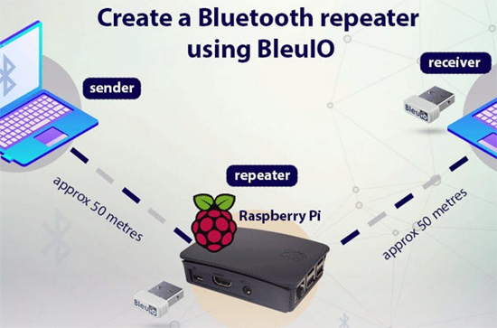](https://www.hackster.io/sheikh-shuhad/create-bluetooth-repeater-using-bleuio-s-multi-connection-40361b)

Create a bluetooth repeater using BleuIO and Python - [Hackster](https://www.hackster.io/sheikh-shuhad/create-bluetooth-repeater-using-bleuio-s-multi-connection-40361b).

[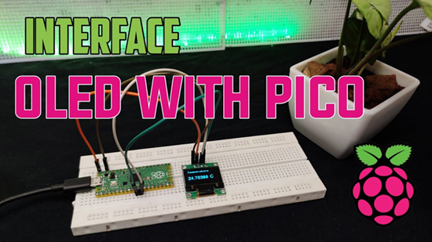](https://www.youtube.com/watch?v=bLXMVTTPFMs)

How to interface an OLED with a Raspberry Pi Pico and display large fonts - [YouTube](https://www.youtube.com/watch?v=bLXMVTTPFMs).

6 ways Python can automate tedious processes for the modern marketer - [Demandgen](https://www.demandgen.com/6-ways-python-can-automate-tedious-processes-for-the-modern-marketer/).

[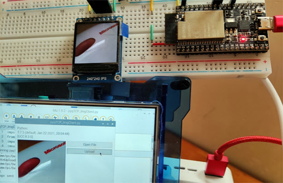](https://helloraspberrypi.blogspot.com/2021/04/esp32micropython-server-raspberry.html)

ESP32/MicroPython server + Raspberry Pi/Python client, transmit image via WiFi TCP socket - [Hello Raspberry Pi](https://helloraspberrypi.blogspot.com/2021/04/esp32micropython-server-raspberry.html).

[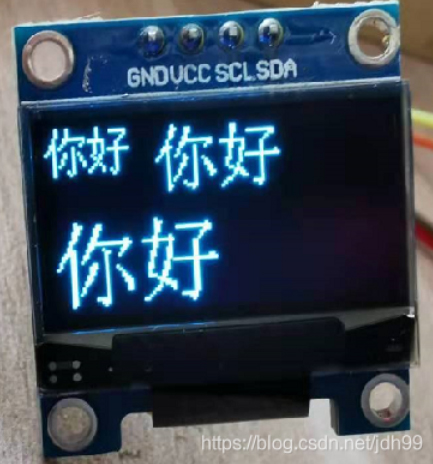](https://www.raspberrypi.org/forums/viewtopic.php?t=309091&p=1848696#p1848696)

A MicroPython library for the SSD1306 with examples - [GitHub](https://github.com/jdhxyy/ssd1306py-micropython) via [Raspberry Pi Forums](https://www.raspberrypi.org/forums/viewtopic.php?t=309091&p=1848696#p1848696).

Raspberry Pi Pico first project - [smist08.wordpress](https://smist08.wordpress.com/2021/04/08/raspberry-pi-pico-first-project/).

[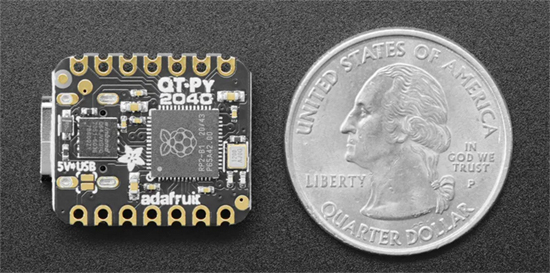](https://www.hackster.io/news/yet-another-adafruit-qt-py-with-raspberry-pi-s-rp2040-chip-48fd327daa1f)

Another Adafruit QT Py with Raspberry Pi's RP2040 chip - [Hackster](https://www.hackster.io/news/yet-another-adafruit-qt-py-with-raspberry-pi-s-rp2040-chip-48fd327daa1f).

Code your own Twitch chat controls for robots, or just about anything else - [Hackaday](https://hackaday.com/2021/04/08/code-your-own-twitch-chat-controls-for-robots-or-just-about-anything-else/).

A price tracker written in Python - [Hackster](https://www.hackster.io/srimannarayanaa06/python-price-tracker-89600b).

[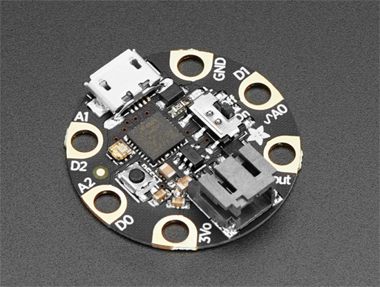](https://www.eetasia.com/10-best-microcontrollers-on-the-market-for-2021/)

10 best microcontrollers on the market for 2021 - [eetasia](https://www.eetasia.com/10-best-microcontrollers-on-the-market-for-2021/).

[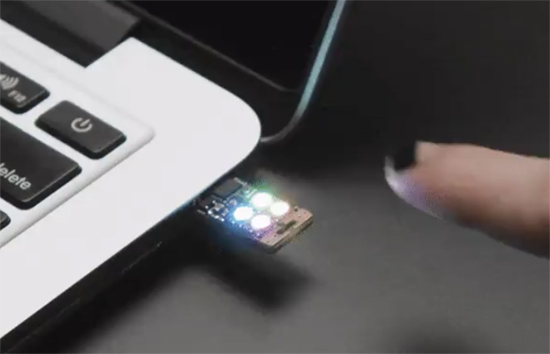](https://www.hackster.io/news/adorable-neo-trinkey-redefines-usb-flash-4c816eace9ef)

The adorable Neo Trinkey redefines USB flash - [Hackster](https://www.hackster.io/news/adorable-neo-trinkey-redefines-usb-flash-4c816eace9ef).

Adafruit Feather RP2040 First Impressions - [smist08.wordpress.com](https://smist08.wordpress.com/2021/04/02/adafruit-feather-rp2040-first-impressions/).

Python Will Soon Support Switch Statements - [Hackaday](https://hackaday.com/2021/04/02/python-will-soon-support-switch-statements/).

Edge AI – What is it and What can it do for Edge IoT? - [Seeedstudio](https://www.seeedstudio.com/blog/2021/04/02/edge-ai-what-is-it-and-what-can-it-do-for-edge-iot/).

ZenCad is a library for parametric 3D modeling - [GitHub.io](https://mirmik.github.io/zencad/en/index.html).

Python library for configuring a wide range of IP cameras that use the NETsurveillance ActiveX plugin XMeye SDK - [GitHub](https://github.com/NeiroNx/python-dvr).

A programming environment for Lua for the Raspberry Pi Pico microcontroller - [GitHub](https://github.com/kevinboone/luapico).

An open source cookbook written using Python - [Opensource.cooking](https://opensource.cooking/).

Strengthening evidence of new physics using Python - [YouTube](https://youtu.be/ZjnK5exNhZ0?t=388) via [Adafruit Blog](https://blog.adafruit.com/2021/04/07/first-results-from-fermilabs-muon-g-2-experiment-strengthen-evidence-of-new-physics/).

Python behind the scenes #10: how Python dictionaries work - [Ten Thousand Meters](https://tenthousandmeters.com/blog/python-behind-the-scenes-10-how-python-dictionaries-work/).

Python #3 language as Objective-C drops off of [Tiobe's top 20 language list](https://www.tiobe.com/tiobe-index/) - [ZD Net](https://www.zdnet.com/article/this-old-programming-language-is-suddenly-getting-more-popular-again/).

PyDev of the Week: Will McGugan on [Mouse vs Python](https://www.blog.pythonlibrary.org/2021/04/12/pydev-of-the-week-will-mcgugan/)

CircuitPython Weekly Meeting for April 12th, 2021 [on YouTube](https://youtu.be/F7m6Bg-s5KE) and [notes](https://github.com/adafruit/adafruit-circuitpython-weekly-meeting/blob/master/2021/2021-04-12.md)

**#ICYDNCI What was the most popular, most clicked link, in [last week's newsletter](https://www.adafruitdaily.com/2021/04/06/python-on-microcontrollers-newsletter-circuitpython-6-2-0-released-and-more-python-adafruit-circuitpython-micropython-thepsf/)? [How to use CircuitPython with GPIO pins on a PC](https://www.tomshardware.com/how-to/gpio-pins-circuitpython-on-a-pc).**

## Coming soon

There are many Trinkeys planned - and every Trinkey will have its own friend. This is the Neo Trinkey friend! - [Adafruit](https://www.adafruit.com/product/4870).

## New Boards Supported by CircuitPython

The number of supported microcontrollers and Single Board Computers (SBC) grows every week. This section outlines which boards have been included in CircuitPython or added to [CircuitPython.org](https://circuitpython.org/).

This week we had 13 new boards added!

- [Feather ESP32-S2](https://circuitpython.org/board/adafruit_feather_esp32s2_nopsram/)
- [Feather ESP32-S2 with TFT](https://circuitpython.org/board/adafruit_feather_esp32s2_tftback_nopsram/)
- [ItsyBitsy RP2040](https://circuitpython.org/board/adafruit_itsybitsy_rp2040/)
- [QT Py RP2040](https://circuitpython.org/board/adafruit_qtpy_rp2040/)
- [CP Sapling M0 with SPI Flash](https://circuitpython.org/board/cp_sapling_m0_spiflash/)
- [MicroMod nRF52840 Processor](https://circuitpython.org/board/sparkfun_nrf52840_micromod/)
- [Pro Micro - RP2040](https://circuitpython.org/board/sparkfun_pro_micro_rp2040/)
- [StackRduino M0+ PRO](https://circuitpython.org/board/stackrduino_m0_pro/)
- [Rotary Trinkey - SAMD21](https://circuitpython.org/board/rotary_trinkey_m0/)
- [Thing Plus - RP2040](https://circuitpython.org/board/sparkfun_thing_plus_rp2040/)
- [STM32F411CE Black Pill with Flash](https://circuitpython.org/board/stm32f411ce_blackpill_with_flash/)
- [FunHouse - WiFi Home Automation Development Board](https://circuitpython.org/board/adafruit_funhouse/)
- [Neo Trinkey - SAMD21](https://circuitpython.org/board/neopixel_trinkey_m0/)

Looking to add a new board to CircuitPython? It's highly encouraged! Adafruit has four guides to help you do so:

- [How to Add a New Board to CircuitPython](https://learn.adafruit.com/how-to-add-a-new-board-to-circuitpython/overview)
- [How to add a New Board to the circuitpython.org website](https://learn.adafruit.com/how-to-add-a-new-board-to-the-circuitpython-org-website)
- [Adding a Single Board Computer to PlatformDetect for Blinka](https://learn.adafruit.com/adding-a-single-board-computer-to-platformdetect-for-blinka)
- [Adding a Single Board Computer to Blinka](https://learn.adafruit.com/adding-a-single-board-computer-to-blinka)

## New Learn Guides!

[Zelda Guardian Robot Terrako Companion](https://learn.adafruit.com/terrako) from [Noe and Pedro](https://learn.adafruit.com/users/pixil3d)

[Analog Knobs on Raspberry Pi 400 with CYBERDECK Hat](https://learn.adafruit.com/analog-knobs-on-raspberrypi-400-with-cyberdeck-hat) from [John Park](https://learn.adafruit.com/users/johnpark)

[Sailor Moon Star Locket](https://learn.adafruit.com/sailor-moon-star-locket) from [Liz Clark](https://learn.adafruit.com/users/BlitzCityDIY)

## CircuitPython Libraries!

CircuitPython support for hardware continues to grow. We are adding support for new sensors and breakouts all the time, as well as improving on the drivers we already have. As we add more libraries and update current ones, you can keep up with all the changes right here!

For the latest libraries, download the [Adafruit CircuitPython Library Bundle](https://circuitpython.org/libraries). For the latest community contributed libraries, download the [CircuitPython Community Bundle](https://github.com/adafruit/CircuitPython_Community_Bundle/releases).

If you'd like to contribute, CircuitPython libraries are a great place to start. Have an idea for a new driver? File an issue on [CircuitPython](https://github.com/adafruit/circuitpython/issues)! Have you written a library you'd like to make available? Submit it to the [CircuitPython Community Bundle](https://github.com/adafruit/CircuitPython_Community_Bundle). Interested in helping with current libraries? Check out the [CircuitPython.org Contributing page](https://circuitpython.org/contributing). We've included open pull requests and issues from the libraries, and details about repo-level issues that need to be addressed. We have a guide on [contributing to CircuitPython with Git and Github](https://learn.adafruit.com/contribute-to-circuitpython-with-git-and-github) if you need help getting started. You can also find us in the #circuitpython channel on the [Adafruit Discord](https://adafru.it/discord).

You can check out this [list of all the Adafruit CircuitPython libraries and drivers available](https://github.com/adafruit/Adafruit_CircuitPython_Bundle/blob/master/circuitpython_library_list.md). 

The current number of CircuitPython libraries is **310**!

**New Libraries!**

Here's this week's new CircuitPython libraries:

 * [Adafruit_CircuitPython_FunHouse](https://github.com/adafruit/Adafruit_CircuitPython_FunHouse)

**Updated Libraries!**

Here's this week's updated CircuitPython libraries:

 * [Adafruit_CircuitPython_BLE_Radio](https://github.com/adafruit/Adafruit_CircuitPython_BLE_Radio)
 * [Adafruit_CircuitPython_AVRprog](https://github.com/adafruit/Adafruit_CircuitPython_AVRprog)
 * [Adafruit_CircuitPython_BoardTest](https://github.com/adafruit/Adafruit_CircuitPython_BoardTest)
 * [Adafruit_CircuitPython_CircuitPlayground](https://github.com/adafruit/Adafruit_CircuitPython_CircuitPlayground)
 * [Adafruit_CircuitPython_RockBlock](https://github.com/adafruit/Adafruit_CircuitPython_RockBlock)
 * [Adafruit_CircuitPython_FocalTouch](https://github.com/adafruit/Adafruit_CircuitPython_FocalTouch)
 * [Adafruit_CircuitPython_Wiznet5k](https://github.com/adafruit/Adafruit_CircuitPython_Wiznet5k)
 * [Adafruit_CircuitPython_datetime](https://github.com/adafruit/Adafruit_CircuitPython_datetime)
 * [Adafruit_CircuitPython_RSA](https://github.com/adafruit/Adafruit_CircuitPython_RSA)
 * [Adafruit_CircuitPython_BitmapSaver](https://github.com/adafruit/Adafruit_CircuitPython_BitmapSaver)
 * [Adafruit_CircuitPython_SI5351](https://github.com/adafruit/Adafruit_CircuitPython_SI5351)
 * [Adafruit_CircuitPython_BLE](https://github.com/adafruit/Adafruit_CircuitPython_BLE)
 * [Adafruit_CircuitPython_BLE_Eddystone](https://github.com/adafruit/Adafruit_CircuitPython_BLE_Eddystone)
 * [Adafruit_CircuitPython_BLE_BroadcastNet](https://github.com/adafruit/Adafruit_CircuitPython_BLE_BroadcastNet)
 * [Adafruit_CircuitPython_PortalBase](https://github.com/adafruit/Adafruit_CircuitPython_PortalBase)
 * [Adafruit_CircuitPython_Display_Button](https://github.com/adafruit/Adafruit_CircuitPython_Display_Button)
 * [Adafruit_CircuitPython_DisplayIO_Layout](https://github.com/adafruit/Adafruit_CircuitPython_DisplayIO_Layout)
 * [Adafruit_CircuitPython_MiniMQTT](https://github.com/adafruit/Adafruit_CircuitPython_MiniMQTT)
 * [Adafruit_CircuitPython_RGBLED](https://github.com/adafruit/Adafruit_CircuitPython_RGBLED)
 * [Adafruit_CircuitPython_AdafruitIO](https://github.com/adafruit/Adafruit_CircuitPython_AdafruitIO)
 * [Adafruit_CircuitPython_DHT](https://github.com/adafruit/Adafruit_CircuitPython_DHT)
 * [Adafruit_CircuitPython_Display_Text](https://github.com/adafruit/Adafruit_CircuitPython_Display_Text)
 * [circuitpython](https://github.com/adafruit/circuitpython)
 * [Adafruit_Blinka](https://github.com/adafruit/Adafruit_Blinka)
 * [Adafruit_Python_PlatformDetect](https://github.com/adafruit/Adafruit_Python_PlatformDetect)
 * [CircuitPython_Community_Bundle](https://github.com/adafruit/CircuitPython_Community_Bundle)

## What’s the team up to this week?

What is the team up to this week? Let’s check in!

**Dan**

I made the final, stable, release of 6.2.0 on Monday, April 7. There was only one bug we felt we needed to fix between rc.0 and stable, so we didn't bother with a second release candidate. Thanks to all the people who help to make 6.2.0: we had many new contributors, and an incredible number of fixes and additions through the betas.

Late last week I had an idea about having an interrupt throw an exception. It turned out to be a bad idea in general, but it provoked a lot of good discussion on discord and GitHub about how to handle interrupts in safe and simple ways. Please contribute to our GitHub issue [Interrupts: what are your use cases?](https://github.com/adafruit/circuitpython/issues/4542) with your uses for interrupts.

I'm now working on dynamic USB descriptors as I mentioned last week. It's just in time: I'm seeing at least two queries a day about whether it's possible to enable or disable various USB devices.

**Jeff**

With the stable release of version 6.2, it's a good time to look back at what we've done since 6.1.  Here are some of the highlights from my own work:

 * I helped us to adopt a source code formatter, "uncrustify", so the source is tidier and more consistent.  The value of consistent source style can't be overestimated, though it's not always apparent until you work on code that others have written
 * I did a nice range of clean-ups and bug-fixes, such as one that lets ulab directly manipulate the contents of an RGB Matrix display (I still need to do a demo that takes advantage of this)
 * I started to add more ways to get data between ulab arrays and displayio Bitmaps
 * I improved the RP2040 ("Pico") builds with new features & bugfixes in many areas such as urandom, rtc, and rp2pio.

There's a lot of good stuff in 6.2.0, and it's amazing to think it's just our progress since January.  For you, it's a great time to check it out and let us know how updating you own projects goes.  For me, it's time to knuckle down and get started on what will become CircuitPython version 7!

**Kattni**

Another successful newsletter went out this week! Thank you to everyone who has been contributing.

I've started working on the guide for the new [Neo Trinkey](https://www.adafruit.com/product/4870). It'll have everything you need to get started with your new board. Keep an eye out for that coming soon.

I've also continued work on the template quest. Specifically, I've been working on the pages applicable to the Neo Trinkey since that guide is going up soon. As this board is pretty simple, it'll only include information on NeoPixels and capacitive touch, so those are the pages I've been focusing on. Working on getting some templates live soon so I can share them!

**Lucian**

This past week I've been getting started with alarms and sleep on the RP2040, digging into the documentation and doing some basic tests and implementation. The RP is a little different from other chips in that it doesn't lose any data when it goes into deep sleep - this is a handy feature for conventional C programs, but it doesn't jive that well with Circuitpython's API, which expects a full reset after a deep sleep. So I'm spending a little extra time making sure that this won't break everything horribly when implemented.

Outside my RP spinup I wrapped up some final deep-sleep related issues for the STM32 and put through the first finished draft of the power PR, along with an unrelated issue across all ports where light sleep was misreporting its wakeup cause depending on how you tried to fetch that information.

We had a community contributor add the AudioPWMIO module to the STM32 port this past week, which I had the chance to review and test. It's a nice feature, and I'm hoping we'll see more audio implementations come in over time, as they'll benefit a lot from the extra resources on the F405 Feather.

**Melissa**

This week I wrote the new FunHouse library. Like several other libraries, this one is based on PortalBase which is the shared library that acts as a base library for Portal style devices. I added a couple of examples to the library as well so folks can start using it right away. I always find it fun to experiment and make design decisions so that it is both easy to use and maintainable. If you would like to check out the new library, you can find it in [the GitHub FunHouse Repo](https://github.com/adafruit/Adafruit_CircuitPython_FunHouse).

I also updated circuitpython.org with a number of missing boards. I found there was a particular library that was confusing the backend and instead of the missing boards appearing as "Unknown", they didn't show up at all and so nobody was aware that it was an issue until enough missing ones accumulated that people were questioning why certain boards weren't there.

**Scott**

This week I've completed my initial BLE file transfer protocol implementation. I've written up the protocol and created [a pull request](https://github.com/adafruit/Adafruit_CircuitPython_BLE_File_Transfer/pull/1) to get feedback on it. Trevor has gotten it going and will be trying to integrate it into the iOS side of things. In addition to replying to feedback, I'll be fixing the example to work with larger file transfers.

I'm also prepping to present at the Open Hardware Summit about interface design. I'll be giving a quick and (hopefully) concise talk with tips about designing interfaces. Interfaces encompass mechanical, electrical and software design.

## Upcoming events!

The online GeoPython conference is focused on Python and Geo, its toolkits and applications. April 22-23, 2021 - [https://2021.geopython.net/](https://2021.geopython.net/).

PyCon US, the annual official annual Python gathering, has been announced to be held online May 12-15, 2021. Sprints will be held May 16-18, 2021. More information and signups at [https://us.pycon.org/2021/](https://us.pycon.org/2021/)

EuroPython, the largest conference for the Python programming language in Europe, has been announced to be held online July 26 - August 1, 2021. More information at [https://ep2021.europython.eu/](https://ep2021.europython.eu/)

Call for proposals for PyOhio 2021 runs from March 15 - April 19, 2021 with the free event on July 31, 2021- [PyOhio.org](https://www.pyohio.org/2021/) via [Twitter](https://twitter.com/PyOhio/status/1370184124460367881).

**Send Your Events In**

As for other events, with the COVID pandemic, most in-person events are postponed or cancelled. If you know of virtual events or events that may occur in the future, please let us know on Discord or on Twitter with hashtag #CircuitPython.

## Latest releases

CircuitPython's stable release is [6.2.0](https://github.com/adafruit/circuitpython/releases/latest). New to CircuitPython? Start with our [Welcome to CircuitPython Guide](https://learn.adafruit.com/welcome-to-circuitpython).

[20210410](https://github.com/adafruit/Adafruit_CircuitPython_Bundle/releases/latest) is the latest CircuitPython library bundle.

[v1.14](https://micropython.org/download) is the latest MicroPython release. Documentation for it is [here](http://docs.micropython.org/en/latest/pyboard/).

[3.9.4](https://www.python.org/downloads/) is the latest Python release. The latest pre-release version is [3.10.0a7](https://www.python.org/download/pre-releases/).

[2,381 Stars](https://github.com/adafruit/circuitpython/stargazers) Like CircuitPython? [Star it on GitHub!](https://github.com/adafruit/circuitpython)

## Call for help -- Translating CircuitPython is now easier than ever!

One important feature of CircuitPython is translated control and error messages.

With the help of fellow open source project [Weblate](https://weblate.org/), we're making it even easier to add or improve translations.

Sign in with an existing account such as GitHub, Google or Facebook and start contributing through a simple web interface. No forks or pull requests needed!

As always, if you run into trouble join us on [Discord](https://adafru.it/discord), we're here to help.

## jobs.adafruit.com - Find a dream job, find great candidates!

[jobs.adafruit.com](https://jobs.adafruit.com/) has returned and folks are posting their skills (including CircuitPython) and companies are looking for talented makers to join their companies - from Digi-Key, to Hackaday, Microcenter, Raspberry Pi and more.

**Job of the Week**

TEALS Volunteer - Microsoft Philanthropies TEALS Program - [Adafruit Jobs Board](https://jobs.adafruit.com/job/teals-volunteer/).

## 28568 thanks!

The Adafruit Discord community, where we do all our CircuitPython development in the open, reached over 28568 humans, thank you!  Adafruit believes Discord offers a unique way for CircuitPython folks to connect. Join today at [https://adafru.it/discord](https://adafru.it/discord).

## ICYMI - In case you missed it

The wonderful world of Python on hardware! This is our Python video-newsletter-podcast! The news comes from the Python community, Discord, Adafruit communities and more and is reviewed on ASK an ENGINEER Wednesdays. The complete Python on Hardware weekly videocast [playlist is here](https://www.youtube.com/playlist?list=PLjF7R1fz_OOXRMjM7Sm0J2Xt6H81TdDev). 

This video podcast is on [iTunes](https://itunes.apple.com/us/podcast/python-on-hardware/id1451685192?mt=2), [YouTube](http://adafru.it/pohepisodes), [IGTV (Instagram TV](https://www.instagram.com/adafruit/channel/)), and [XML](https://itunes.apple.com/us/podcast/python-on-hardware/id1451685192?mt=2).

[Weekly community chat on Adafruit Discord server CircuitPython channel - Audio / Podcast edition](https://itunes.apple.com/us/podcast/circuitpython-weekly-meeting/id1451685016) - Audio from the Discord chat space for CircuitPython, meetings are usually Mondays at 2pm ET, this is the audio version on [iTunes](https://itunes.apple.com/us/podcast/circuitpython-weekly-meeting/id1451685016), Pocket Casts, [Spotify](https://adafru.it/spotify), and [XML feed](https://adafruit-podcasts.s3.amazonaws.com/circuitpython_weekly_meeting/audio-podcast.xml).

And lastly, we are working up a one-spot destination for all things podcast-able here - [podcasts.adafruit.com](https://podcasts.adafruit.com/)

## Contribute!

The CircuitPython Weekly Newsletter is a CircuitPython community-run newsletter emailed every Tuesday. The complete [archives are here](https://www.adafruitdaily.com/category/circuitpython/). It highlights the latest CircuitPython related news from around the web including Python and MicroPython developments. To contribute, edit next week's draft [on GitHub](https://github.com/adafruit/circuitpython-weekly-newsletter/tree/gh-pages/_drafts) and [submit a pull request](https://help.github.com/articles/editing-files-in-your-repository/) with the changes. You may also tag your information on Twitter with #CircuitPython. 

Join our [Discord](https://adafru.it/discord) or [post to the forum](https://forums.adafruit.com/viewforum.php?f=60) for any further questions.
