- [ ] Kattni updates
- [ ] change date
- [ ] update title
- [ ] Feature story
- [ ] Update  for images
- [ ] Update ICYDNCI
- [ ] All images 550w max only
- [ ] Link "View this email in your browser."

News Sources

- [python.org](https://www.python.org/)
- [Python Insider - dev team blog](https://pythoninsider.blogspot.com/)

View this email in your browser.

Welcome to the latest Python on Microcontrollers newsletter, brought you by the community! We're on [Discord](https://discord.gg/HYqvREz), [Twitter](https://twitter.com/search?q=circuitpython&src=typed_query&f=live), and for past newsletters - [view them all here](https://www.adafruitdaily.com/category/circuitpython/). If you're reading this on the web, [subscribe here](https://www.adafruitdaily.com/). Let's get started!

## Adafruit Sponsoring PyCon US 2021

Adafruit is [a sponsor of](https://us.pycon.org/2021/sponsorship/sponsors/) PyCon US 2021! Check out details on the [Adafruit Blog](https://blog.adafruit.com/2021/04/24/adafruit-is-a-pycon-2021-participating-sponsor-pycon-pyconus/).

PyCon is the largest annual gathering for the community using and developing the open-source Python programming language. It is produced and underwritten by the Python Software Foundation, the 501(c)(3) nonprofit organization dedicated to advancing and promoting Python. Through PyCon, the PSF advances its mission of growing the international community of Python programmers.

The conference is happening May 14-15, 2021, with sprints to follow. Learn more at [PyCon.org](https://us.pycon.org/2021/)!

## Mu 1.0 beta 4 Released!

Mu 1.0 beta 4 has been released! This release includes a number of bug fixes and back-end updates,
[including a new way to detect CircuitPython boards and find the CircuitPython REPL connection](https://github.com/mu-editor/mu/pull/1371).
Check out [this post](https://github.com/mu-editor/mu/issues/new) for details. Since this is a beta release and may have bugs, they've asked that folks provide feedback via [GitHub](https://github.com/mu-editor/mu/issues/new). Learn more and download the latest Mu from [CodeWith.Mu](https://codewith.mu/)!

## CircuitPython Deep Dive Stream with Scott Shawcroft

[This week](https://youtu.be/21Qt4mRoyBo), Scott streams his work on MicroPython merging.

You can see the latest video and past videos on the Adafruit YouTube channel under the Deep Dive playlist - [YouTube](https://www.youtube.com/playlist?list=PLjF7R1fz_OOXBHlu9msoXq2jQN4JpCk8A).

## News from around the web!

[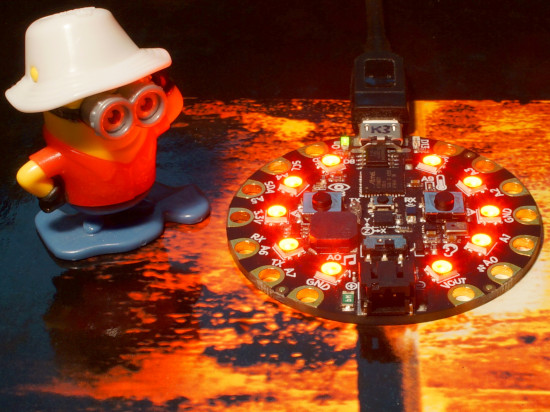](https://www.youtube.com/watch?v=-qlfxvAR3lw)

An animation demonstrating the [Adafruit Circuit Playground Express](https://www.adafruit.com/product/3333) acting as an [intervalometer](https://en.wikipedia.org/wiki/Intervalometer) to remotely fire the shutter on a Sony camera using infrared commands, the code also features a manual mode where the CPX left button fires the shutter, both useful for stable, vibration-free photography - [YouTube](https://www.youtube.com/watch?v=-qlfxvAR3lw).

[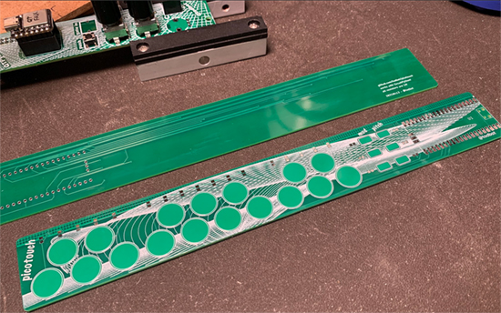](https://twitter.com/todbot/status/1384648120596766722)

PicoTouch PCBs designed to work with Raspberry Pi Pico and CircuitPython - [Twitter](https://twitter.com/todbot/status/1384648120596766722).

Gherkin PCB built specifically for the Raspberry Pi Pico, running CircuitPython - [40% Keyboards](https://www.40percent.club/2021/02/pipi-gherkin.html).

[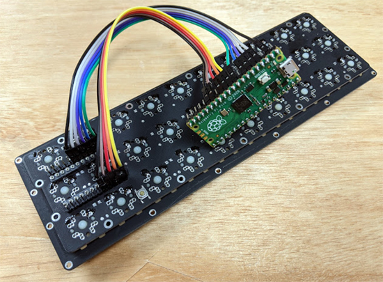](https://www.40percent.club/2021/01/pb-gherkin-raspberry-pi-pico-kmk.html)

KMK running on the Raspberry Pi Pico using CircuitPython - [40% Keyboards](https://www.40percent.club/2021/01/pb-gherkin-raspberry-pi-pico-kmk.html).

[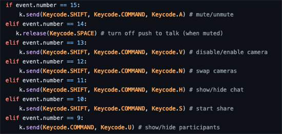](https://github.com/stonehippo/zoom-keyboard)

A bluetooth keyboard for controlling the Zoom application, based on an Adafruit NeoTrellis and Feather nRF52840 Express - [GitHub](https://github.com/stonehippo/zoom-keyboard).

The Paint-a-nator 9001, a custom pen plotter for those with particular disabilities, running CircuitPython - [YouTube](https://www.youtube.com/watch?v=c9EO0ap5n0Y) and [GitHub](https://github.com/ArielWolle/McMaster_Project_4).

Mouse Shake: A Raspberry Pi Pico and Adafruit NeoTrinkey project - [Stephen Cross](https://stephencross.com/2021/04/19/mouse-shake-a-raspberry-pi-pico-and-adafruit-neo-trinkey-project/) via [Twitter](https://twitter.com/stephencross/status/1384110842874982412).

A functional smart display using CircuitPython, inspired by the tech in Black Panther, built with Marvel API - [Twitter](https://twitter.com/darianbjohnson/status/1384031581875048448).

SMARS-mini-XL, a small wheeled or tracked robot running on CircuitPython - [GitHub](https://github.com/mrjadkowski/SMARS-mini-XL).

[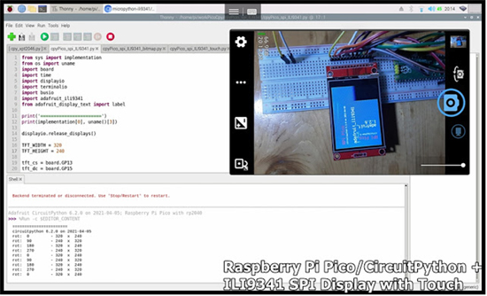](https://helloraspberrypi.blogspot.com/2021/04/raspberry-pi-picocircuitpython-ili9341.html)

A Raspberry Pi Pico, CircuitPython and an ILI9341 SPI Display with Touch  - [Hello Raspberry Pi](https://helloraspberrypi.blogspot.com/2021/04/raspberry-pi-picocircuitpython-ili9341.html).

The Preader, a Raspberry Pi RP2040-powered, bi-stable ChLCD display e-reader - [Hackster](https://www.hackster.io/news/wenting-is-back-to-wow-us-again-this-time-with-preader-a-raspberry-pi-rp2040-powered-e-reader-dbe57d426834).

A simple IoT RGB control project with Raspberry Pi Pico, WIZnet W5500, NeoPixel, and Adafruit WIZNET5K CircuitPython library - [Hackster](https://www.hackster.io/bjnhur/raspberry-pi-pico-iot-demo-w5500-ethernet-neopixel-led-8bc31c).

Custom USB game controllers with Raspberry Pi Pico, using CircuitPython - [Raspberry Pi](https://www.raspberrypi.org/blog/custom-usb-games-controllers-with-raspberry-pi-pico-hackspace-42/).

Pico Portal music box running CircuitPython - [Hackster](https://www.hackster.io/thisoldgeek/pico-portal-music-box-5a7b93).

[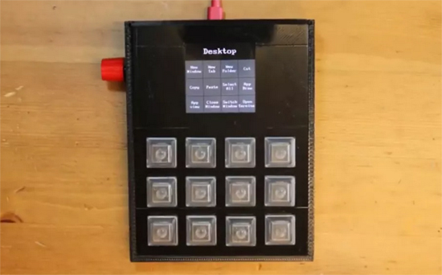](https://www.youtube.com/watch?v=qjlZ52h8sac)

Pico-powered keypad has all the shortcuts you need - [YouTube](https://www.youtube.com/watch?v=qjlZ52h8sac) and [Tom's Hardware](https://www.tomshardware.com/news/raspberry-pi-pico-powered-keypad-has-all-the-shortcuts-you-need).

CircuitPython example using VEML7700 lux sensor and an Adafruit Feather M0 - [Learm MicroPython](http://www.learnmicropython.com/code/adafruit-feather-m0-and-veml7700-lux-sensor-circuitpython-example.php).

Using CircuitPython and the Adafruit CLUE to create a small data visualisation - [Twitter](https://twitter.com/tamhanna/status/1385297725336571912).

Moving from a Python library to a CircuitPython library is a few simple modifications - [Twitter](https://twitter.com/mifune/status/1383813393782493190).

A NeoKey keyboard with LCD, running on a Raspberry Pi Pico and an Adafruit Airlift - [GitHub](https://github.com/bdsvac/Adafruit_Pico_Airlift_NeoKeyboard).

[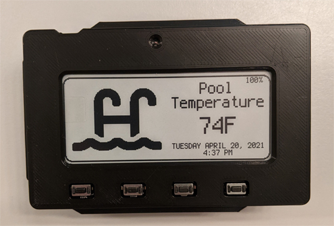](https://hackaday.io/project/178540-pool-temperature-monitor)

MagTag pool temperature monitor - [Hackaday](https://hackaday.io/project/178540-pool-temperature-monitor).

A Pokeball lamp complete with sound effects, running CircuitPython - [Twitter](https://twitter.com/melbamorph/status/1385377563422478340).

Weekend fun with Raspberry Pi Pico, MicroPython and Thonny - [Twitter](https://twitter.com/NaveenManwani17/status/1383735977714208768).

[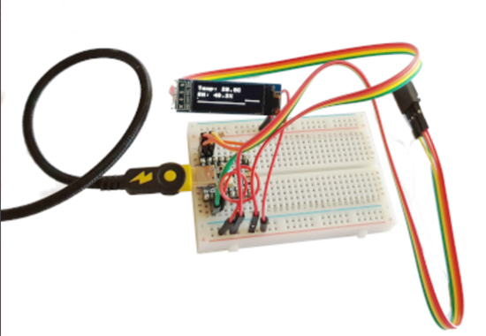](http://www.penguintutor.com/electronics/pico-temperature)

Using the Tiny 2040 to display temperature - [Penguin Tutor](http://www.penguintutor.com/electronics/pico-temperature) via [Twitter](https://twitter.com/penguintutor/status/1384134940602765315).

Intro to Raspberry Pi Pico and RP2040 - MicroPython Part 2: I2C Sensor - [YouTube](https://www.youtube.com/watch?v=b4KdzsAz6kE) via [Twitter](https://twitter.com/ShawnHymel/status/1384151894696742922) and [DigiKey](https://www.digikey.com/en/maker/projects/b43e7958153f41fc9e7403df4d626ba5).

So many Picos, so many purposes, including CircuitPython - [Twitter](https://twitter.com/ukscone/status/1384189794981277705).

[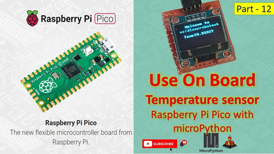](https://www.youtube.com/watch?v=Jx1trNMGHIY)

How to use the internal temperature sensor with Pico and MicroPython - [YouTube](https://www.youtube.com/watch?v=Jx1trNMGHIY) via [Twitter](https://twitter.com/SandipRoboTix/status/1384190258749730821).

[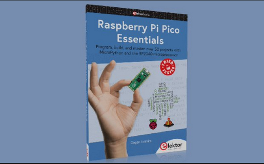](https://twitter.com/Elektor/status/1385522078925869057)

Raspberry Pi Pico Essentials: 50 MicroPython projects for Pico - [Twitter](https://twitter.com/Elektor/status/1385522078925869057).

[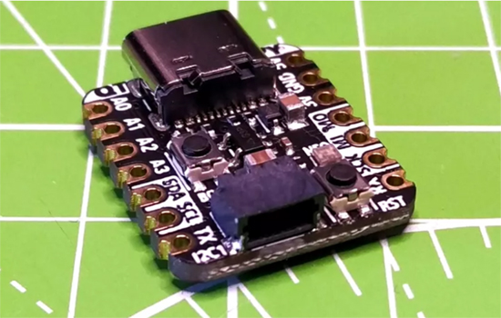](https://www.tomshardware.com/reviews/adafruit-qt-py-rp2040-review)

Adafruit QT Py RP2040 review: A tiny board for great projects - [Tom's Hardware](https://www.tomshardware.com/reviews/adafruit-qt-py-rp2040-review).

[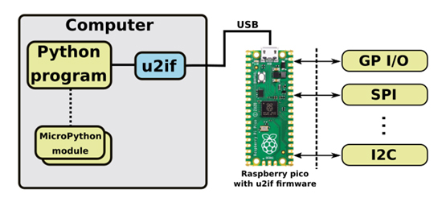](https://github.com/execuc/u2if)

u2if(USB to interfaces) is an attempt to implement some of the MicroPython `machine` module functionalities on a computer - [GitHub](https://github.com/execuc/u2if) and [Hackaday](https://hackaday.com/2021/04/18/bridging-the-pc-and-embedded-worlds-with-pico-and-python/).

Taking the next step in Python game development - [Real Python](https://realpython.com/podcasts/rpp/57/).

[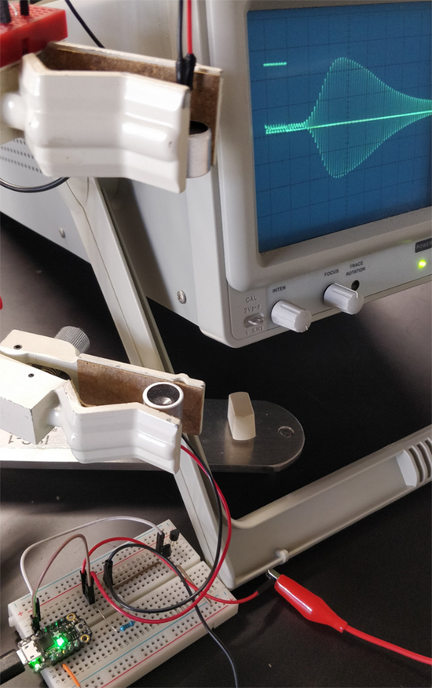](https://twitter.com/microlabdotcc/status/1385519244952018949)

The first stage in development of an open source ultrasound kit for college / high school comes to an end - [Twitter](https://twitter.com/microlabdotcc/status/1385519244952018949).

PocketQube picosatellite platform now available for pre-order - [Twitter](https://twitter.com/BHDynamics/status/1383458149751947264).

Learn text Cclassification with Python and Keras - [Real Python](https://realpython.com/courses/text-classification-with-keras/).

Deploying a Python Flask example application using Heroku - [Real Python](https://realpython.com/flask-by-example-part-1-project-setup/).

[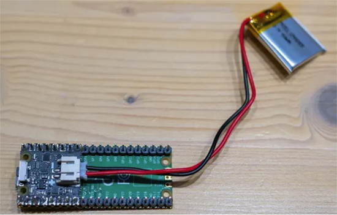](https://www.hackster.io/news/pimoroni-s-lipo-shim-for-pico-adds-easy-battery-management-to-your-raspberry-pi-pico-projects-9a265fb736ae)

Add easy battery management to your Pico project with the Pimoroni LiPo SHIM - [site](https://www.hackster.io/news/pimoroni-s-lipo-shim-for-pico-adds-easy-battery-management-to-your-raspberry-pi-pico-projects-9a265fb736ae).

[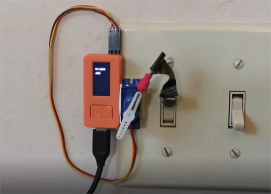](https://www.hackster.io/tinkerdoodle/deep-learning-speech-commands-recognition-on-esp32-b85c28)

Train a neural network model in 10 minutes, and use it on ESP32 with MicroPython to control a light switch - [Hackster](https://www.hackster.io/tinkerdoodle/deep-learning-speech-commands-recognition-on-esp32-b85c28).

[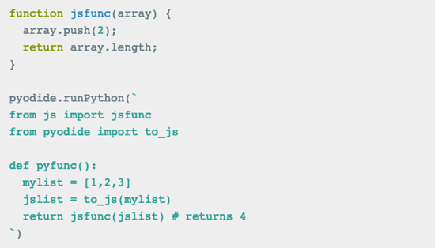](https://hacks.mozilla.org/2021/04/pyodide-spin-out-and-0-17-release/)

Pyodide consists of the CPython 3.8 interpreter compiled to WebAssembly which allows Python to run in the browser - [Mozilla](https://hacks.mozilla.org/2021/04/pyodide-spin-out-and-0-17-release/).

[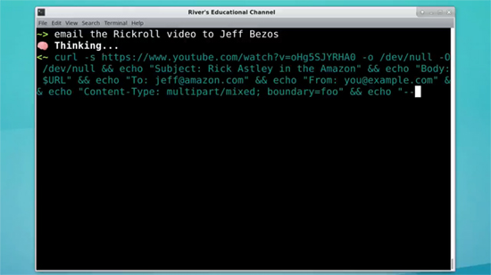](https://riveducha.onfabrica.com/openai-powered-linux-shell)

This is a basic Python shell that takes a task and asks OpenAI for what Linux bash command to run based on your description - [onfabrica.com](https://riveducha.onfabrica.com/openai-powered-linux-shell).

Proposed acquisition of ARM Limited by NVIDIA Corporation - [gov.uk](https://www.gov.uk/government/publications/proposed-acquisition-of-arm-limited-by-nvidia-corporation-public-interest-intervention) and [Adafruit Blog](https://blog.adafruit.com/2021/04/19/proposed-acquisition-of-arm-limited-by-nvidia-corporation/).

[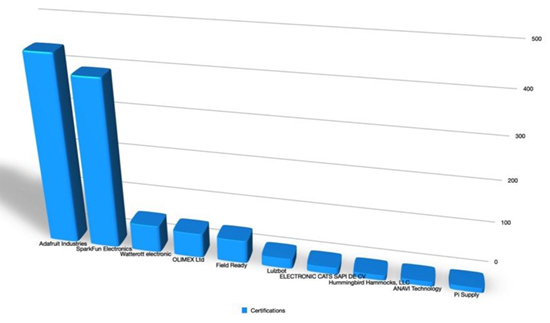](https://blog.adafruit.com/2021/04/19/some-open-source-hardware-stats-oshdata-ends-reporting-oshwa-api-and-more-ohsummit-oshdata-oshwassociation/)

Some Open-source hardware stats: OSHdata ends, OSHWA API and more - [Adafruit Blog](https://blog.adafruit.com/2021/04/19/some-open-source-hardware-stats-oshdata-ends-reporting-oshwa-api-and-more-ohsummit-oshdata-oshwassociation/).

Head First Programing Humble Bundle, including Head First Python - [Humble Bundle](https://www.humblebundle.com/books/head-first-programming-oreilly-books).

An excellent writeup on using the SAMD21's brown-out detector - [Thea.codes](https://blog.thea.codes/sam-d21-brown-out-detector/).

A Python-powered microscope running on Raspberry Pi - [GitHub](https://github.com/IBM/MicroscoPy#python-raspberry-pi).

Building a custom Raspberry Pi Pico-powered WiFi temperature sensor using MQTT and CircuitPython - [Recantha](https://www.recantha.co.uk/blog/?p=21020) via [Twitter](https://twitter.com/recantha/status/1386226318375800833).

A collection of tutorials on Python best practices - [Real Python](https://realpython.com/tutorials/best-practices/).

text - [GitHub](https://github.com/cj667113/micropython-ov2640).

[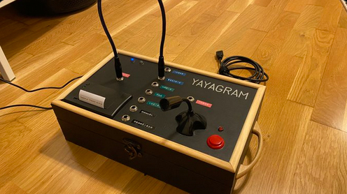](https://twitter.com/mrcatacroquer/status/1386318806411325440?s=11)

Yayagram, a device designed to allow grandparents to communicate with their grandchildren - [Twitter](https://twitter.com/mrcatacroquer/status/1386318806411325440?s=11).

[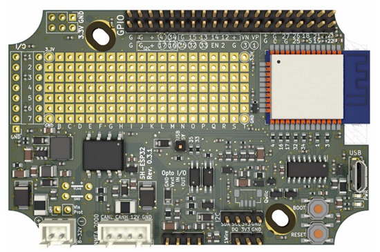](https://hatlabs.github.io/sh-esp32/)

Sailor Hat with ESP32 runs MicroPython - [GitHub.io](https://hatlabs.github.io/sh-esp32/).

[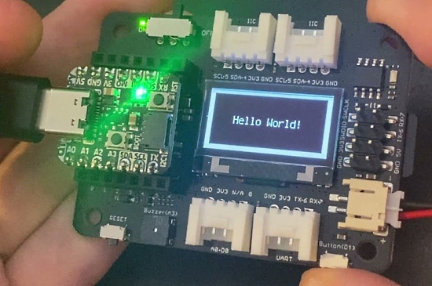](https://blog.adafruit.com/2021/04/26/testing-out-qt-py-rp2040-with-xiao-extension-board/)

Testing out a QT Py RP2040 expansion board - [Adafruit Blog](https://blog.adafruit.com/2021/04/26/testing-out-qt-py-rp2040-with-xiao-extension-board/).

Playing around with pseudo color polynomial algorithms in CircuitPython - [Twitter](https://twitter.com/CedarGroveMakr/status/1386451649959370754).

Testing CircuitPython library support for u2if on Raspberry Pi Pico - [Adafruit Blog](https://blog.adafruit.com/2021/04/25/testing-out-circuitpython-library-support-for-u2if-on-pico/).

Code sound and music with Raspberry Pi Pico - [YouTube](https://www.youtube.com/watch?v=2fPmThKuhTk) via [Twitter](https://twitter.com/GurgleApps/status/1386611159999127552).

[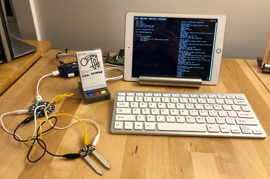](https://haiperspace.com/writing/21-04-19-circuitpython-editor/)

Integrating electronics into a "programmable space" using CircuitPython - [Haiperspace](https://haiperspace.com/writing/21-04-19-circuitpython-editor/) via [Twitter](https://twitter.com/jhaip/status/1386381257689505795).

Working through a wrist injury with a foot pedal powered by CircuitPython and a QT Py, with blue tape for strain relief. Stop once to build and run - [Twitter](https://twitter.com/josecastillo/status/1386380320426102786).

CircuitPython is a big part of why IEEESpectrum now includes Python in the Top Programming Lanugage rankings  - [Twitter](https://twitter.com/ieeeypctx/status/1386680585360449538) and [Twitter](https://twitter.com/stephencass/status/1386407760233787394).

CPX Pinout card (Japanese) - [STEAM Tokyo](https://steam-tokyo.com/product/cpx-clearfolder/).

Updated version of the NeoPixel watch fob, now with power management in the form of a Sparkfun Soft Power Switch - [Twitter](https://twitter.com/imhavoc/status/1386103598212284420).

[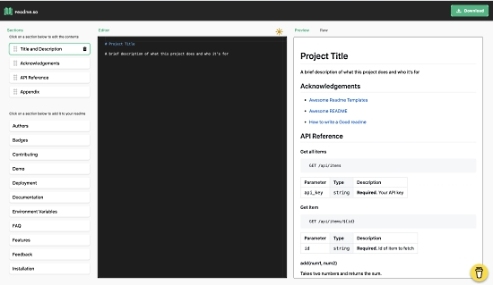](https://readme.so/)

The easiest way to create a readme - [Readme.so](https://readme.so/).

The social contract of open source, a post on how to treat maintainers in a positive way - [Snarky.ca](https://snarky.ca/the-social-contract-of-open-source/).

PyDev of the Week: Haki Benita on [Mouse vs Python](https://www.blog.pythonlibrary.org/2021/04/26/pydev-of-the-week-haki-benita/)

CircuitPython Weekly Meeting for April 26th, 2021 [on YouTube](https://youtu.be/Q9AgCuqPhxI) and [notes](https://github.com/adafruit/adafruit-circuitpython-weekly-meeting/blob/master/2021/2021-04-26.md)

#ICYDNCI What was the most popular, most clicked link, in [last week's newsletter](https://www.adafruitdaily.com/2021/04/20/python-on-microcontrollers-newsletter-circuitpython-available-for-200-boards-micropython-release-and-more-python-adafruit-circuitpython-micropython-thepsf/)? [MicroPython version 1.15](https://github.com/micropython/micropython/releases).

## Coming soon

[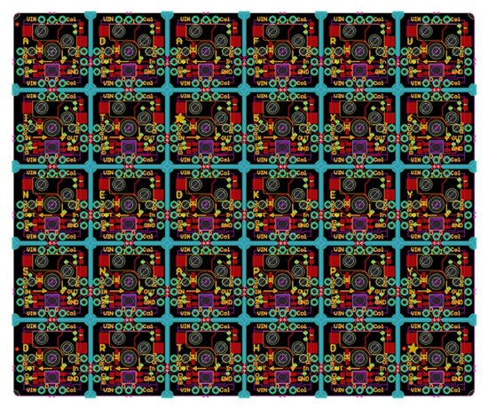](https://blog.adafruit.com/2021/04/19/snap-apart-ortholinear-neokey-keeb-panel-comingsoon-keeb/)

Snap-apart ortholinear NeoKey keeb panel - [Adafruit Blog](https://blog.adafruit.com/2021/04/19/snap-apart-ortholinear-neokey-keeb-panel-comingsoon-keeb/).

OV2640 camera breakout with oscillator, because all the modules we found require a 24 MHz clock input and are not very breadboard friendly - [Twitter](https://twitter.com/adafruit/status/1383559929965858821).

A sneak peek of analog inputs working in AdafruitIO Wippersnapper, the no-code interface for AdafruitIO - [Adafruit Blog](https://blog.adafruit.com/2021/04/24/sneak-peek-of-adafruit-io-wippersnapper-analog-inputs-working/).

## New Boards Supported by CircuitPython

The number of supported microcontrollers and Single Board Computers (SBC) grows every week. This section outlines which boards have been included in CircuitPython or added to [CircuitPython.org](https://circuitpython.org/).

This week we had 2 new boards added!

- [ARAMCON2 Badge](https://circuitpython.org/board/aramcon2_badge/)
- [ATMegaZero ESP32-S2](https://circuitpython.org/board/atmegazero_esp32s2/)

Looking to add a new board to CircuitPython? It's highly encouraged! Adafruit has four guides to help you do so:

- [How to Add a New Board to CircuitPython](https://learn.adafruit.com/how-to-add-a-new-board-to-circuitpython/overview)
- [How to add a New Board to the circuitpython.org website](https://learn.adafruit.com/how-to-add-a-new-board-to-the-circuitpython-org-website)
- [Adding a Single Board Computer to PlatformDetect for Blinka](https://learn.adafruit.com/adding-a-single-board-computer-to-platformdetect-for-blinka)
- [Adding a Single Board Computer to Blinka](https://learn.adafruit.com/adding-a-single-board-computer-to-blinka)

## New Learn Guides!

[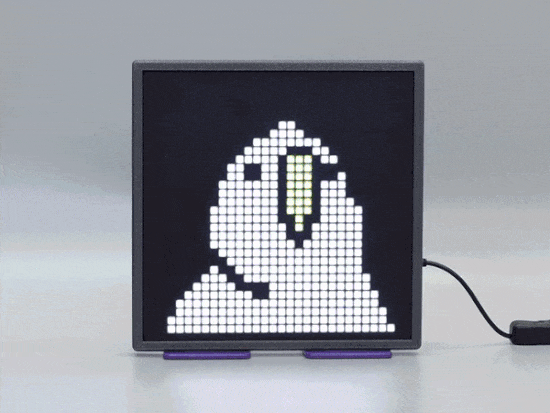](https://learn.adafruit.com/guides/latest)

[32x32 Square Pixel Art Animation Display](https://learn.adafruit.com/32x32-square-pixel-display) from [Noe and Pedro](https://learn.adafruit.com/users/pixil3d)

[Memory-saving tips for CircuitPython](https://learn.adafruit.com/Memory-saving-tips-for-CircuitPython) from [Kevin Matocha](https://learn.adafruit.com/users/kmatocha)

[Adafruit FunHouse](https://learn.adafruit.com/adafruit-funhouse) from [Melissa LeBlanc-Williams](https://learn.adafruit.com/users/MakerMelissa)

[Adafruit QT Py RP2040](https://learn.adafruit.com/adafruit-qt-py-2040) from [Kattni](https://learn.adafruit.com/users/kattni)

## Updated Learn Guides!

[Custom Fonts for CircuitPython Displays: Bitmap_Font Library](https://learn.adafruit.com/custom-fonts-for-pyportal-circuitpython-display/bitmap_font-library) from [Tim C](https://learn.adafruit.com/users/Foamyguy)

## CircuitPython Project Bundle

When you get to the CircuitPython code section of an [Adafruit Learn Guide](https://learn.adafruit.com/), sometimes things can get a bit complicated. You not only have the code you need to upload to your device, but you likely also need to add some libraries that the code requires to run. This involved downloading all the libraries, digging through to find the ones you need, and copying them to your device. That was only the beginning on some projects, as those that include images and/or sound files required further downloading and copying of files. But, not anymore!

Now, with Project Bundles, you can download all the necessary code, libraries and, if needed, asset files with one click! We automatically check which libraries are required for the project and bundle them up for you. No more digging through a huge list of libraries to find the ones you need, or fiddling with looking for other files or dependencies. Download the Project Bundle, copy the contents to your device, and your code will simply work. We wanted to make this the easiest way to get a project working, regardless of whether you're a beginner or an expert. We'll also be adding this feature to popular IDEs as an add-on. Try it out with any CircuitPython guide on the Adafruit Learning System. Just look for the ‘Download Project Bundle’ button on the code page. 

**To download and use a Project Bundle:**

In the Learning System - above any embedded code in a guide in the Adafruit Learn System, you’ll find a Download Project Bundle button.

Click the button to download the Project Bundle zip.

Open the Project Bundle zip to find the example code, all necessary libraries, and, if available, any images, sounds, etc.

[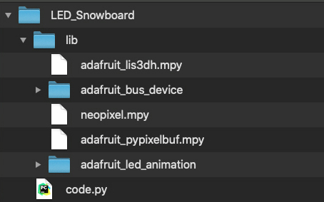](https://learn.adafruit.com/)

Simply copy all the files over to your CIRCUITPY drive, and you’re ready to go!

If you run into any problems or bugs, or would like to submit feedback, please file an issue on the [Adafruit Learning System Guides GitHub repo](https://github.com/adafruit/Adafruit_Learning_System_Guides/issues).

## CircuitPython Libraries!

CircuitPython support for hardware continues to grow. We are adding support for new sensors and breakouts all the time, as well as improving on the drivers we already have. As we add more libraries and update current ones, you can keep up with all the changes right here!

For the latest libraries, download the [Adafruit CircuitPython Library Bundle](https://circuitpython.org/libraries). For the latest community contributed libraries, download the [CircuitPython Community Bundle](https://github.com/adafruit/CircuitPython_Community_Bundle/releases).

If you'd like to contribute, CircuitPython libraries are a great place to start. Have an idea for a new driver? File an issue on [CircuitPython](https://github.com/adafruit/circuitpython/issues)! Have you written a library you'd like to make available? Submit it to the [CircuitPython Community Bundle](https://github.com/adafruit/CircuitPython_Community_Bundle). Interested in helping with current libraries? Check out the [CircuitPython.org Contributing page](https://circuitpython.org/contributing). We've included open pull requests and issues from the libraries, and details about repo-level issues that need to be addressed. We have a guide on [contributing to CircuitPython with Git and Github](https://learn.adafruit.com/contribute-to-circuitpython-with-git-and-github) if you need help getting started. You can also find us in the #circuitpython channel on the [Adafruit Discord](https://adafru.it/discord).

You can check out this [list of all the Adafruit CircuitPython libraries and drivers available](https://github.com/adafruit/Adafruit_CircuitPython_Bundle/blob/master/circuitpython_library_list.md). 

The current number of CircuitPython libraries is **312**!

**Updated Libraries!**

Here's this week's updated CircuitPython libraries:

**Updated Libraries**
 * [Adafruit_CircuitPython_BNO055](https://github.com/adafruit/Adafruit_CircuitPython_BNO055)
 * [Adafruit_CircuitPython_BME280](https://github.com/adafruit/Adafruit_CircuitPython_BME280)
 * [Adafruit_CircuitPython_SHT4x](https://github.com/adafruit/Adafruit_CircuitPython_SHT4x)
 * [Adafruit_CircuitPython_74HC595](https://github.com/adafruit/Adafruit_CircuitPython_74HC595)
 * [Adafruit_CircuitPython_Colorsys](https://github.com/adafruit/Adafruit_CircuitPython_Colorsys)
 * [Adafruit_CircuitPython_MIDI](https://github.com/adafruit/Adafruit_CircuitPython_MIDI)
 * [Adafruit_CircuitPython_IRRemote](https://github.com/adafruit/Adafruit_CircuitPython_IRRemote)
 * [Adafruit_CircuitPython_SimpleMath](https://github.com/adafruit/Adafruit_CircuitPython_SimpleMath)
 * [Adafruit_CircuitPython_PCT2075](https://github.com/adafruit/Adafruit_CircuitPython_PCT2075)
 * [Adafruit_CircuitPython_MatrixPortal](https://github.com/adafruit/Adafruit_CircuitPython_MatrixPortal)
 * [Adafruit_CircuitPython_FunHouse](https://github.com/adafruit/Adafruit_CircuitPython_FunHouse)
 * [Adafruit_CircuitPython_LIFX](https://github.com/adafruit/Adafruit_CircuitPython_LIFX)
 * [Adafruit_CircuitPython_SHTC3](https://github.com/adafruit/Adafruit_CircuitPython_SHTC3)
 * [Adafruit_CircuitPython_BLE_Adafruit](https://github.com/adafruit/Adafruit_CircuitPython_BLE_Adafruit)
 * [Adafruit_CircuitPython_Thermistor](https://github.com/adafruit/Adafruit_CircuitPython_Thermistor)
 * [Adafruit_CircuitPython_PortalBase](https://github.com/adafruit/Adafruit_CircuitPython_PortalBase)
 * [Adafruit_CircuitPython_BLE](https://github.com/adafruit/Adafruit_CircuitPython_BLE)
 * [Adafruit_CircuitPython_Bitmap_Font](https://github.com/adafruit/Adafruit_CircuitPython_Bitmap_Font)
 * [Adafruit_Blinka](https://github.com/adafruit/Adafruit_Blinka)
 * [Adafruit_Python_PlatformDetect](https://github.com/adafruit/Adafruit_Python_PlatformDetect)
 * [CircuitPython_Community_Bundle](https://github.com/adafruit/CircuitPython_Community_Bundle)

## What’s the team up to this week?

What is the team up to this week? Let’s check in!

**Dan**

I'm continuing to work on dynamic USB descriptors. I've written a lot of the code, and am finishing up, doing HID devices. I hope that this capability will be compact enough that it can fit even on our smallest boards.

**Jeff**

I've been working on CircuitPython support for "parallel capture" cameras, starting with the OV7670.  This inexpensive camera can be purchased from the usual website that sells everything, and modified to plug in to a Grand Central.  Based on code written by Phil B, I've created a core driver for "parallel capture" on the SAM D51 microcontrollers including the GrandCentral, as well as a Python library to initialize the OV7670 camera.

[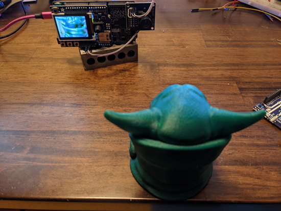](https://circuitpython.org/)

**Kattni**

This week I published the QT Py RP2040 and the Neo Trinkey guides, updated the SHT31-D and HTU21-F breakout guides for the STEMMA QT revisions, and helped with the Adafruit FunHouse guide. I also uploaded a number of PCB files to GitHub based on request.

I updated the script that circuitpython.org uses to generate the /contributing page as well. There had been updates to the script, but they had not been applied to the rendered pages yet. This means the information available on that page is more up to date now.

I wrote a README to include in the new Adafruit Learn System Project Bundles that explains how the bundle works, what to do with it, and includes a link to where it was downloaded from and the date it was downloaded.

I finally have examples of templates! The Neo Trinkey guide includes the [NeoPixel Blink template](https://learn.adafruit.com/adafruit-neo-trinkey/neopixel-blink). It looks on this end like a normal guide page. But on the editor end, most of the page is immutable, and the author adds the image and the code. That means a lot less work in the future, but more importantly, provides a much more consistent experience across guides!

**Lucian**

This past week I've been working on the RP2040 alarm system, starting with TimeAlarm, which makes use of the RTC to wake from light/deep sleep. Since the RP2040 currently uses the Timer peripheral for internal timekeeping, the RTC hasn't seen a lot of buildout, so I've been filling it out with some of the utility code in the STM32 port. The Raspberry Pi official libraries for sleep are still very much in the alpha stages, and I've mostly been working from the reference manual and trying different things out by hand to explore what isn't laid out in prior work.

I've also been working on finalizing the NRF52 and STM32 ports of Alarm, fixing various formatting issues and bugs that have been holding them back from being merged, so we can hopefully start getting everything back on the same track soon.

**Melissa**

This past week, I wrote the FunHouse product guide. In order to avoid needing to rewrite many copies of similar pages, I learn how to use a new feature of the learn guides called Template pages. These are basically regular guide pages with small sections to add sections in the middle of the page. The guide took a little longer to write than the typical product guide, but it should make writing guides in the future much easier. You can check out the FunHouse guide at https://learn.adafruit.com/adafruit-funhouse.

Another thing I did is I added a couple of different versions of the WiFi module to the PortalBase library. The different versions reflect the ESP32-S2 and AirLift WiFi coprocessor that are common on many of our boards. This will make adding similar boards even easier in the future as well as making maintenance of the WiFi modules much easier. I have already updated the FunHouse and MagTag libraries to make use of the changes and will update the PyPortal and MatrixPortal libraries soon.

**Scott**

Since we're at the start of 7.x work, I've begun merging in changes from upstream MicroPython. My brain is completely swamped with that work so I can't think about much else. My approach is to merge in each release from MicroPython. So, we're starting with ~1.9.4 and MicroPython just released 1.15. So, we've got 1.10, 1.11, 1.12, 1.13, 1.14 and 1.15 to merge in. I'm nearly done with 1.10 and have started with the 1.11 merge. I'm hoping the later versions will be easier merges because MicroPython has started releasing more frequently (and therefore fewer changes.)

## Upcoming events!

PyCon US, the annual official annual Python gathering, has been announced to be held online May 12-15, 2021. Sprints will be held May 16-18, 2021. More information and signups at [https://us.pycon.org/2021/](https://us.pycon.org/2021/)

EuroPython, the largest conference for the Python programming language in Europe, has been announced to be held online July 26 - August 1, 2021. More information at [https://ep2021.europython.eu/](https://ep2021.europython.eu/)

Call for proposals for PyOhio 2021 runs from March 15 - April 19, 2021 with the free event on July 31, 2021- [PyOhio.org](https://www.pyohio.org/2021/) via [Twitter](https://twitter.com/PyOhio/status/1370184124460367881).

**Send Your Events In**

As for other events, with the COVID pandemic, most in-person events are postponed or cancelled. If you know of virtual events or events that may occur in the future, please let us know on Discord or on Twitter with hashtag #CircuitPython.

## Latest releases

CircuitPython's stable release is [6.2.0](https://github.com/adafruit/circuitpython/releases/latest). New to CircuitPython? Start with our [Welcome to CircuitPython Guide](https://learn.adafruit.com/welcome-to-circuitpython).

[20210426](https://github.com/adafruit/Adafruit_CircuitPython_Bundle/releases/latest) is the latest CircuitPython library bundle.

[v1.15](https://micropython.org/download) is the latest MicroPython release. Documentation for it is [here](http://docs.micropython.org/en/latest/pyboard/).

[3.9.4](https://www.python.org/downloads/) is the latest Python release. The latest pre-release version is [3.10.0a7](https://www.python.org/download/pre-releases/).

[2,397 Stars](https://github.com/adafruit/circuitpython/stargazers) Like CircuitPython? [Star it on GitHub!](https://github.com/adafruit/circuitpython)

## Call for help -- Translating CircuitPython is now easier than ever!

[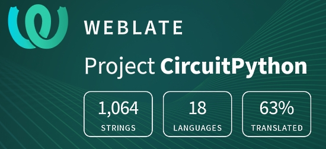](https://hosted.weblate.org/engage/circuitpython/)

One important feature of CircuitPython is translated control and error messages.

With the help of fellow open source project [Weblate](https://weblate.org/), we're making it even easier to add or improve translations.

Sign in with an existing account such as GitHub, Google or Facebook and start contributing through a simple web interface. No forks or pull requests needed!

As always, if you run into trouble join us on [Discord](https://adafru.it/discord), we're here to help.

## jobs.adafruit.com - Find a dream job, find great candidates!

[jobs.adafruit.com](https://jobs.adafruit.com/) has returned and folks are posting their skills (including CircuitPython) and companies are looking for talented makers to join their companies - from Digi-Key, to Hackaday, Micro Center, Raspberry Pi and more.

## 28,766 thanks!

The Adafruit Discord community, where we do all our CircuitPython development in the open, reached over 28,766 humans, thank you!  Adafruit believes Discord offers a unique way for CircuitPython folks to connect. Join today at [https://adafru.it/discord](https://adafru.it/discord).

## ICYMI - In case you missed it

The wonderful world of Python on hardware! This is our Python video-newsletter-podcast! The news comes from the Python community, Discord, Adafruit communities and more and is reviewed on ASK an ENGINEER Wednesdays. The complete Python on Hardware weekly videocast [playlist is here](https://www.youtube.com/playlist?list=PLjF7R1fz_OOXRMjM7Sm0J2Xt6H81TdDev). 

This video podcast is on [iTunes](https://itunes.apple.com/us/podcast/python-on-hardware/id1451685192?mt=2), [YouTube](http://adafru.it/pohepisodes), [IGTV (Instagram TV](https://www.instagram.com/adafruit/channel/)), and [XML](https://itunes.apple.com/us/podcast/python-on-hardware/id1451685192?mt=2).

[Weekly community chat on Adafruit Discord server CircuitPython channel - Audio / Podcast edition](https://itunes.apple.com/us/podcast/circuitpython-weekly-meeting/id1451685016) - Audio from the Discord chat space for CircuitPython, meetings are usually Mondays at 2pm ET, this is the audio version on [iTunes](https://itunes.apple.com/us/podcast/circuitpython-weekly-meeting/id1451685016), Pocket Casts, [Spotify](https://adafru.it/spotify), and [XML feed](https://adafruit-podcasts.s3.amazonaws.com/circuitpython_weekly_meeting/audio-podcast.xml).

And lastly, we are working up a one-spot destination for all things podcast-able here - [podcasts.adafruit.com](https://podcasts.adafruit.com/)

## Contribute!

The CircuitPython Weekly Newsletter is a CircuitPython community-run newsletter emailed every Tuesday. The complete [archives are here](https://www.adafruitdaily.com/category/circuitpython/). It highlights the latest CircuitPython related news from around the web including Python and MicroPython developments. To contribute, edit next week's draft [on GitHub](https://github.com/adafruit/circuitpython-weekly-newsletter/tree/gh-pages/_drafts) and [submit a pull request](https://help.github.com/articles/editing-files-in-your-repository/) with the changes. You may also tag your information on Twitter with #CircuitPython. 

Join our [Discord](https://adafru.it/discord) or [post to the forum](https://forums.adafruit.com/viewforum.php?f=60) for any further questions.
